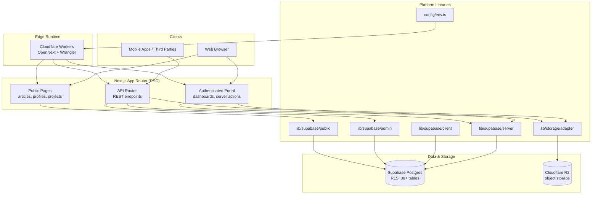
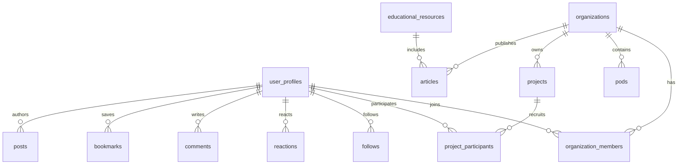
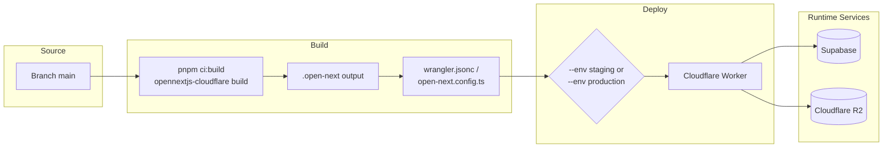

OZEAON V2 is a full-stack ocean conservation and sustainability platform that connects environmental organizations, conservation projects, and communities through a single web application built on Next.js, Supabase, and Cloudflare Workers.

## Purpose and Scope

This page provides a high-level orientation to the OZEAON V2 repository: what the product is, what the repository actually powers, the technology stack and its version-sensitive conventions, the domain model at a glance, and the developer toolchain used to build and deploy it.

It is intentionally an *overview* page. Deep, page-level treatment of individual capabilities lives in sibling catalog pages:

- Authentication, Supabase client variants, and SSR security rules → see the architecture/auth pages under `1-overview` siblings.
- The database schema (`user_profiles`, `organizations`, `projects`, `articles`, …) → see the data model / database pages.
- Deployment pipelines, preview environments, and environment variables → see the deployment and operations pages.
- UI conventions, the component library, and the design token system → see the component-library and design-system pages.

Everything stated here is derived from the repository's own documentation and configuration files: [`README.md`](https://github.com/ozeaon/ozeaon-v2/blob/0a4f1a95824db87782f1221a4108019d174df3d9/README.md), [`CLAUDE.md`](https://github.com/ozeaon/ozeaon-v2/blob/0a4f1a95824db87782f1221a4108019d174df3d9/CLAUDE.md), and [`package.json`](https://github.com/ozeaon/ozeaon-v2/blob/0a4f1a95824db87782f1221a4108019d174df3d9/package.json).

## Overview

### What the product is

OZEAON V2 is described in the repository README as *"a full-stack digital platform dedicated to ocean conservation and climate action"* whose mission is to be a unified digital ecosystem. The README enumerates six stakeholder outcomes:

- **Organizations** can showcase their conservation initiatives
- **Projects** receive funding and community support
- **Individuals** access educational resources on marine sustainability
- **Communities** collaborate on climate action aligned with UN SDGs
- **Contributors** earn rewards through a token-based incentive system
- **Governance** happens transparently through DAO voting

The project explicitly ties its feature set to climate impact: carbon-efficient edge infrastructure, UN SDG alignment (SDG 13 *Climate Action* and SDG 14 *Life Below Water*), transparent funding tracking, free educational outreach, and community governance.

> Source: [README.md](https://github.com/ozeaon/ozeaon-v2/blob/0a4f1a95824db87782f1221a4108019d174df3d9/README.md#L24-L59)

### What this repository powers

The repository is the **core web application** and the central hub of the ecosystem. The README lists five concrete responsibilities:

| Responsibility | Description |
| --- | --- |
| Public-Facing Platform | Browse projects, organizations, articles, and educational content |
| Authenticated Portal | Personalized dashboards for users, organizations, and project managers |
| API Infrastructure | RESTful endpoints powering mobile apps and third-party integrations |
| Real-Time Data | Live updates from a Supabase PostgreSQL database with 30+ interconnected tables |
| Edge Deployment | Global CDN distribution via Cloudflare Workers for minimal latency worldwide |

> Source: [README.md](https://github.com/ozeaon/ozeaon-v2/blob/0a4f1a95824db87782f1221a4108019d174df3d9/README.md#L41-L49)

### Audience-facing feature areas

The README groups features by audience, which is a useful map of the product surface area:

- **For Organizations** — comprehensive organization profiles, team and pod (sub-group) management, launching and tracking conservation projects, accepting donations and crowdfunding, and publishing articles and updates.
- **For Projects** — showcasing conservation initiatives, setting and tracking funding goals, geographically mapping project locations, recruiting volunteers and participants, and reporting impact metrics and outcomes.
- **Educational Hub** — a 3-tier learning system (categories → subcategories → subjects), interactive quizzes and assessments, progress tracking and certifications, token rewards for completing courses, and a focus on marine conservation and climate science.

> Source: [README.md](https://github.com/ozeaon/ozeaon-v2/blob/0a4f1a95824db87782f1221a4108019d174df3d9/README.md#L63-L100)

### Key terminology

| Term | Meaning |
| --- | --- |
| **Organization** | A stakeholder entity with a profile, members, and pods; owns projects and publishes articles. |
| **Pod** | A sub-group inside an organization (per the README's "Manage teams and pods (sub-groups)"). |
| **Project** | A conservation initiative with funding goals, geographic location, participants, and impact metrics. |
| **Educational resource** | Content organized through the 3-tier hierarchy of category → subcategory → subject. |
| **Token rewards** | Incentives earned by contributors, e.g. for completing educational courses. |
| **DAO voting** | Governance mechanism for platform direction and fund allocation. |
| **SDG** | UN Sustainable Development Goal; projects are tagged against SDG 13 and SDG 14. |

## Architecture

The repository is a single Next.js App Router application that renders React Server Components on Cloudflare's edge, talks to Supabase (PostgreSQL with Row-Level Security) for data and auth, and stores binary assets in Cloudflare R2 through a storage adapter. Deployment goes through OpenNext + Wrangler to Cloudflare Workers.



Key architectural facts behind the diagram:

- **Two rendering paths, deliberately separated.** The README/`CLAUDE.md` guidance states that public pages (articles, profiles) that use only `createPublicClient()` will *correctly prerender statically*, while any component that calls `await createClient()` transitively opts the route into dynamic rendering. This is the core SSR strategy: correctness comes from using the right Supabase client, not from manual cache directives.
- **Four Supabase client flavors** with distinct blast radii — server, browser, admin (bypasses RLS), and public. The admin client is explicitly marked "use sparingly".
- **`StorageAdapter` is a mandatory chokepoint** for R2: application code must never touch the raw R2 binding or an S3-compatible client directly.
- **Environment variables are validated** in `src/config/env.ts`, making the config module a gate rather than a loose convention.
- **Deployment target is Cloudflare Workers**, built with the OpenNext adapter rather than a Node server.

## Technology Stack

The stack is declared in `CLAUDE.md` and grounded in `package.json`.

| Layer | Technology |
| --- | --- |
| Framework | Next.js App Router with React Server Components |
| Language | TypeScript (strict mode) |
| UI | React 19, Tailwind CSS v4, Radix UI primitives, lucide-react icons |
| Rich text | Tiptap (`@tiptap/react`, `starter-kit`, heading/underline/text-align extensions) |
| Forms & validation | React Hook Form, `@hookform/resolvers`, Zod v4 |
| Data & auth | Supabase (`@supabase/ssr`, `@supabase/supabase-js`) with RLS over 30+ tables |
| Object storage | Cloudflare R2, accessed via `StorageAdapter` |
| Edge runtime | Cloudflare Workers via `@opennextjs/cloudflare` / `open-next` |
| Logging | LogTape (`@logtape/logtape`, `@logtape/redaction`) |
| Drag & drop | `@dnd-kit/core`, `@dnd-kit/sortable` |
| Utilities | `date-fns`, `clsx` / `class-variance-authority`, `natural`, `obscenity`, `browser-image-compression` |
| Package manager | pnpm (enforced) |

> Sources:
> - [package.json](https://github.com/ozeaon/ozeaon-v2/blob/0a4f1a95824db87782f1221a4108019d174df3d9/package.json#L30-L80)
> - [CLAUDE.md](https://github.com/ozeaon/ozeaon-v2/blob/0a4f1a95824db87782f1221a4108019d174df3d9/CLAUDE.md#L46-L49)

### Version-sensitive conventions (breaking-change traps)

`CLAUDE.md` deliberately does **not** hardcode a version table, warning that "exact installed versions drift — check `package.json`". Instead it documents the *breaking changes that matter for how you write code*:

| Technology | Installed | Convention you must follow |
| --- | --- | --- |
| Next.js | `16.3.5` | `cookies()` / `headers()` are **async** (a break from Next.js 14) |
| React | `^19.3.0` | React 19 semantics with RSC |
| Zod | v4 | Do **not** use deprecated v3 APIs |
| Tailwind CSS | v4 | Config format differs from v3; don't reach for `tailwind.config.js` patterns |
| pnpm | — | **pnpm only** — never `npm` or `yarn` |

> Sources:
> - [CLAUDE.md](https://github.com/ozeaon/ozeaon-v2/blob/0a4f1a95824db87782f1221a4108019d174df3d9/CLAUDE.md#L51-L57)
> - [package.json](https://github.com/ozeaon/ozeaon-v2/blob/0a4f1a95824db87782f1221a4108019d174df3d9/package.json#L73-L77)

## Domain Model at a Glance

The persistent domain lives in Supabase PostgreSQL. `CLAUDE.md` names the core tables and the relationship tables:



The table inventory from `CLAUDE.md`:

- **Core tables**: `user_profiles`, `organizations`, `pods`, `projects`, `educational_resources`, `articles`, `posts`
- **Relationship tables**: `organization_members`, `project_participants`, `follows`, `reactions`, `comments`, `bookmarks`
- **Full schema**: `docs/db/schema.sql`

> Source: [CLAUDE.md](https://github.com/ozeaon/ozeaon-v2/blob/0a4f1a95824db87782f1221a4108019d174df3d9/CLAUDE.md#L201-L207)

Two design rules follow from this model:

1. **Types are always derived, never hand-rolled.** The documented pattern is to derive from the generated Supabase types (`Tables`, `TablesInsert`, `TablesUpdate`) in `src/types/supabase.ts`, including projections via `Pick`, joins via intersection, and FK overrides via `Omit` + re-declaration. Domain types live in `src/types/`, never inside component files.
2. **Deterministic row side-effects belong in PostgreSQL triggers**, not in API routes or Server Actions. `CLAUDE.md` explicitly names audit timestamps, cascading inserts on status change, denormalised counters, and invariant enforcement as trigger responsibilities, and points to a `db-trigger` skill rather than hand-rolling a trigger function.

> Sources:
> - [CLAUDE.md](https://github.com/ozeaon/ozeaon-v2/blob/0a4f1a95824db87782f1221a4108019d174df3d9/CLAUDE.md#L164-L179)
> - [CLAUDE.md](https://github.com/ozeaon/ozeaon-v2/blob/0a4f1a95824db87782f1221a4108019d174df3d9/CLAUDE.md#L211-L217)

## Request and Data Flow

The most important flow to understand is how a request decides whether it is static or dynamic. This is driven entirely by *which Supabase client* the render path touches.

```mermaid
flowchart TD
    Start(["Incoming request"]) --> Kind{"Route shape?"}

    Kind -->|"Public content route"| PublicPath["Server Component uses<br/>createPublicClient()"]
    Kind -->|"User-specific route"| AuthPath["Server Component / Server Action<br/>uses createClient()"]
    Kind -->|"REST endpoint"| ApiPath["Route handler wrapped in<br/>withAuthUser"]

    PublicPath --> Prerender["Prerenders statically"]

    AuthPath --> Cookies["cookies() called internally"]
    Cookies --> Dynamic["Route opts into<br/>dynamic rendering automatically"]
    Dynamic --> Supabase1[("Supabase with RLS<br/>as the authenticated user")]

    ApiPath --> Ctx["ctx provides {" user, supabase "}"]
    Ctx --> Guard{"User present?"}
    Guard -->|"No"| E401["401 Unauthorized"]
    Guard -->|"Yes"| Status{"Outcome"}

    Status -->|"Created"| E201["201 Created"]
    Status -->|"Invalid input"| E400["400 Validation error"]
    Status -->|"Failure"| E500["500 Error"]

    PublicPath -.-> Note["No manual dynamic/revalidate<br/>directives allowed"]
    Supabase1 --> Note
```

The mechanics, as documented in `CLAUDE.md`:

- With `cacheComponents: false`, `await createClient()` internally calls `cookies()`, which **automatically** opts the route into dynamic rendering. The developer does not declare anything.
- The rule that keeps this safe: always use `createClient()` (server client) for user-specific data, because the `cookies()` call *is* the dynamic signal. Never mix `createPublicClient()` or the admin client into a component that also renders user-specific state.
- Legacy directives (`export const dynamic`, `revalidate`, `fetchCache`, `runtime`) are **forbidden**. The documentation notes the project intends to move to the `cacheComponents` model once the Cloudflare adapter support is stable.

> Source: [CLAUDE.md](https://github.com/ozeaon/ozeaon-v2/blob/0a4f1a95824db87782f1221a4108019d174df3d9/CLAUDE.md#L9-L21)

### Self-reference flow through `withAuthUser`

Route handlers using `withAuthUser` receive `supabase` on the context object, already authenticated. The handler must **not** call `createClient()` again:

```typescript
// ❌ Wrong
export const POST = withAuthUser(async (req, { user }) => {
  const supabase = await createClient();
  ...
});

// ✅ Correct
export const POST = withAuthUser(async (req, { user, supabase }) => {
  ...
});
```

> Source: [CLAUDE.md](https://github.com/ozeaon/ozeaon-v2/blob/0a4f1a95824db87782f1221a4108019d174df3d9/CLAUDE.md#L109-L122)

The same principle applies to the auth helper. `getAuthUser()` and `getAuthUserOrRedirect()` both return a `supabase` client memoized by React `cache()` for the request, so calling `createClient()` afterwards creates a second, unnecessary client:

```typescript
// ❌ Wrong — two clients for one request
const supabase = await createClient();
const { user } = await getAuthUserOrRedirect();

// ✅ Correct — reuse the client from auth
const { user, supabase } = await getAuthUserOrRedirect();
```

> Source: [CLAUDE.md](https://github.com/ozeaon/ozeaon-v2/blob/0a4f1a95824db87782f1221a4108019d174df3d9/CLAUDE.md#L98-L107)

**Design intent:** the memoization exists so that a single request never opens more than one Supabase connection/client, and the `withAuthUser` contract exists so that authentication cannot be forgotten or duplicated inside a handler. Both rules convert a class of runtime bugs (redundant clients, missing auth) into structural, reviewable patterns.

### Client selection matrix

| Client | Import | Use in | Notes |
| --- | --- | --- | --- |
| Server | `@/lib/supabase/server` | Server Components, Server Actions, API routes | The `cookies()` call is the dynamic signal; call as `await createClient()` |
| Browser | `@/lib/supabase/client` | Client Components (`"use client"`) | **Create fresh per call**, never cache globally |
| Admin | `@/lib/supabase/admin` | API routes bypassing RLS | Use sparingly |
| Public | `@/lib/supabase/public` | Unauthenticated public queries | Enables static prerendering of public pages |

> Source: [CLAUDE.md](https://github.com/ozeaon/ozeaon-v2/blob/0a4f1a95824db87782f1221a4108019d174df3d9/CLAUDE.md#L82-L131)

## Developer Toolchain and Commands

The entire developer workflow is exposed as pnpm scripts. The table below is the authoritative command reference from `CLAUDE.md`, with the underlying script definitions in `package.json`.

| Command | Description |
| --- | --- |
| `pnpm dev` | Start dev server with Turbopack (localhost:3000) |
| `pnpm build` | Production Next.js build |
| `pnpm lint` | Run ESLint |
| `pnpm lint:fix` | Run ESLint with auto-fix |
| `pnpm check` | Type check (`tsc --noEmit`) |
| `pnpm format` | Format with Prettier |
| `pnpm typegen` | Generate Next.js route types + Cloudflare env types |
| `pnpm db:gen` | Generate Supabase DB schema types (run after migrations) |
| `pnpm db:seed-dump` | Dump remote data to `supabase/seed.sql` |
| `pnpm db:reset-real` | Load the real dump instead of the preview fixture |
| `pnpm preview` | Preview Cloudflare deployment locally |
| `pnpm ci:build` | Production build with Cloudflare adapter |
| `pnpm ci:deploy` | Deploy to Cloudflare |
| `pnpm clean-cache` | Clean all build caches |

> Sources:
> - [CLAUDE.md](https://github.com/ozeaon/ozeaon-v2/blob/0a4f1a95824db87782f1221a4108019d174df3d9/CLAUDE.md#L61-L78)
> - [package.json](https://github.com/ozeaon/ozeaon-v2/blob/0a4f1a95824db87782f1221a4108019d174df3d9/package.json#L8-L28)

Notable specifics from `package.json` that the summary table hides:

- `typegen` actually runs **two** tools: `next typegen` followed by `wrangler types --env-interface CloudflareEnv cloudflare-env.d.ts`. This is what makes Cloudflare bindings type-safe in the application.
- `db:gen` is a composite: `pnpm db:schema` (which runs `node scripts/schema/generate.mjs`) followed by `pnpm db:types` (`supabase gen types typescript --local > src/types/supabase.ts`, then Prettier).
- `db:reset-real` chains `supabase db reset`, extracts `DB_URL` from `supabase status --output json`, and applies `supabase/seeds/00-truncate.sql` followed by `supabase/seed.sql` via `psql` with `ON_ERROR_STOP=1`.
- `clean-cache` clears `.next`, `.turbo`, `node_modules/.cache`, `.open-next`, and `.wrangler` — a hint at which build systems are involved.
- `prepare` runs `husky`, wiring Git hooks.

> Source: [package.json](https://github.com/ozeaon/ozeaon-v2/blob/0a4f1a95824db87782f1221a4108019d174df3d9/package.json#L17-L27)

### Automated quality gates

Two mechanisms enforce correctness without developer discipline:

1. **TypeScript auto-validation hook.** `CLAUDE.md` documents a Stop hook: if any `.ts`/`.tsx` file was edited in a turn, it runs an incremental `tsc --noEmit` and **blocks completion** if errors remain, forcing a fix loop. The guidance is therefore "no need to run tsc manually" — the gate is automatic.
2. **ESLint rule modules.** The repository root splits its lint configuration into focused rule files — `eslint.rules.auth.mjs`, `eslint.rules.base.mjs`, `eslint.rules.cache.mjs`, `eslint.rules.import.mjs`, `eslint.rules.logging.mjs` — composed by `eslint.config.mjs`. The presence of a dedicated `cache` ruleset corroborates that the caching/dynamic-rendering rules described above are machine-enforced, not merely documented.

> Sources:
> - [CLAUDE.md](https://github.com/ozeaon/ozeaon-v2/blob/0a4f1a95824db87782f1221a4108019d174df3d9/CLAUDE.md#L38-L42)
> - [package.json](https://github.com/ozeaon/ozeaon-v2/blob/0a4f1a95824db87782f1221a4108019d174df3d9/package.json#L1-L28)

## Build and Deployment Topology

Deployment is OpenNext-based, not a Node server. The documented pipeline is two steps:

```
pnpm ci:build → pnpm ci:deploy
```



Critical operational rules from `CLAUDE.md`:

- **Always pass `--env staging` or `--env production` to `ci:deploy`.** The top-level config has no `services` block, so omitting `--env` breaks `WORKER_SELF_REFERENCE`.
- **Required environment variables are validated in `src/config/env.ts`.** Deployment troubleshooting is documented in `docs/ops-deployment.md`.
- **Every PR into `main` gets its own Worker and Supabase branch**, seeded from `supabase/seeds/10-preview-fixture.sql`. A migration that changes what the fixture writes to requires the fixture to be updated in the *same* PR — otherwise preview environments drift from the real schema.

> Source: [CLAUDE.md](https://github.com/ozeaon/ozeaon-v2/blob/0a4f1a95824db87782f1221a4108019d174df3d9/CLAUDE.md#L221-L233)

## Engineering Conventions That Shape the Codebase

Beyond the stack itself, the project enforces a set of conventions that any contributor to this repository will encounter immediately. They are summarized here because they explain *why* the code looks the way it does.

### Type system: derive, never hand-roll

```typescript
type Project = Tables<"projects">; // full row
type Slug = Pick<Tables<"resource_subcategories">, "id" | "name" | "slug">; // projection
type Comment = Tables<"comments"> & { author: UserProfileForJoin }; // join
type Article = Omit<Tables<"articles">, "article_type"> & {
  // FK override
  article_type: { id: number; type: string } | null;
};
const insert: TablesInsert<"projects"> = { title, slug, created_by: user.id }; // mutation
```

> Source: [CLAUDE.md](https://github.com/ozeaon/ozeaon-v2/blob/0a4f1a95824db87782f1221a4108019d174df3d9/CLAUDE.md#L164-L179)

The rationale is drift prevention: `src/types/supabase.ts` is generated from the live/local schema (`pnpm db:types`), so deriving from it means a schema change surfaces as a compile error rather than a runtime `undefined`. The guidance also calls out a specific failure class to watch for when fixing type errors: verifying that field names match between **Zod schemas, DB types, and props** — e.g. `author_name` versus `display_name`.

### Import conventions

```typescript
import { useAuth } from "@/hooks"; // barrel exports
import { env, IMAGE_CONFIG } from "@/config";
import { validateFileType, generateUniqueKey } from "@/utils";
import { createClient } from "@/lib/supabase/server"; // explicit Supabase client imports
import { cn } from "@/utils/shadcn/utils";
import type { Tables, TablesInsert, TablesUpdate } from "@/types/supabase";
```

> Source: [CLAUDE.md](https://github.com/ozeaon/ozeaon-v2/blob/0a4f1a95824db87782f1221a4108019d174df3d9/CLAUDE.md#L148-L157)

Barrel exports are used for `@/hooks`, `@/config`, and `@/utils`, but Supabase client imports are deliberately **explicit** rather than barrel-exported — which reinforces the client-selection discipline by making the chosen client visible at every import site. Domain UI components import from a domain's `cards/` subdirectory (e.g. `@/components/posts/cards`, `@/components/articles/cards`).

### UI and styling rules

- **Never reinvent a primitive that already exists.** `CLAUDE.md` maintains a `docs/component-library.md` reference and names the components most often reinvented as raw markup: `EmptyState` (never a raw centered `<div>`), `GridLayout` (never raw `grid` classes), `Button` / `LoadingButton` (icons via `iconLeft`/`iconRight` props, never JSX children), and `ConfirmDialog` (never `window.confirm()`).
- **Never use raw Tailwind size or color utilities.** Typography and color must go through design tokens defined in `src/styles/typography.css` and `src/styles/globals.css`, catalogued in `docs/design-system.md`.

> Source: [CLAUDE.md](https://github.com/ozeaon/ozeaon-v2/blob/0a4f1a95824db87782f1221a4108019d174df3d9/CLAUDE.md#L183-L197)

### API and Server Action patterns

- **API routes** authenticate with `supabase.auth.getUser()` and return `401` when there is no user. Insert shapes use `TablesInsert<"table">`. Status codes are conventional: `201` on create, `400` for validation, `500` for error.
- **Server Actions** must always verify ownership by adding `.eq("user_id", user.id)` to mutations, and must call `revalidateTag(...)` after writes.

> Source: [CLAUDE.md](https://github.com/ozeaon/ozeaon-v2/blob/0a4f1a95824db87782f1221a4108019d174df3d9/CLAUDE.md#L140-L145)

**Design intent:** the ownership predicate on every mutation is a defense-in-depth measure layered on top of Supabase RLS — it makes tenant-scoped writes explicit in application code rather than delegating entirely to database policy.

### SSR constraints

`CLAUDE.md` states a single hard constraint up front: *never use browser APIs (`document`, `window`) in server components or at module level*. Because the app is Cloudflare-Workers-deployed and RSC-first, module-level browser globals would break both prerendering and edge execution.

> Source: [CLAUDE.md](https://github.com/ozeaon/ozeaon-v2/blob/0a4f1a95824db87782f1221a4108019d174df3d9/CLAUDE.md#L9)

## Repository Documentation Index

The repository ships its own documentation set, referenced from the README. These are the authoritative deep-dive sources for the sibling topics on this wiki.

| Document | Covers |
| --- | --- |
| `docs/ops-deployment.md` | Deployment guide, required env vars, troubleshooting |
| `docs/workflows.md` | Development workflow guide |
| `docs/supabase_local.md` | Local Supabase setup |
| `docs/db/schema.sql` | Full database schema |
| `docs/r2-storage.md` | Full R2 upload/URL/delete pattern and image-caching notes |
| `docs/component-library.md` | Component list, RHF wrappers, feed/skeleton patterns, code samples |
| `docs/design-system.md` | Type scale, text color, and background token tables |
| `docs/deployment-previews.md` | Per-PR Worker and Supabase branch behavior |

> Sources:
> - [README.md](https://github.com/ozeaon/ozeaon-v2/blob/0a4f1a95824db87782f1221a4108019d174df3d9/README.md#L14-L20)
> - [CLAUDE.md](https://github.com/ozeaon/ozeaon-v2/blob/0a4f1a95824db87782f1221a4108019d174df3d9/CLAUDE.md#L133-L136)

Live environments referenced by the README:

- [Live Landing Page](https://ozeaon.com)
- [Live Production Platform](https://app.ozeaon.com)
- [Live Staging Platform](https://app.ozeaon.dev)

> Source: [README.md](https://github.com/ozeaon/ozeaon-v2/blob/0a4f1a95824db87782f1221a4108019d174df3d9/README.md#L14-L16)

## Configuration Reference

Environment and build configuration is split across a small number of files, each with a distinct role.

| File | Role |
| --- | --- |
| `src/config/env.ts` | Required environment variables, validated at load time |
| `next.config.ts` | Next.js application configuration |
| `open-next.config.ts` | OpenNext adapter configuration for Cloudflare |
| `wrangler.jsonc` | Cloudflare Worker config; note the absence of a top-level `services` block |
| `tsconfig.json` | TypeScript project configuration (strict mode) |
| `components.json` | Component generator (shadcn-style) configuration |
| `cloudflare-env.d.ts` | Cloudflare binding types generated by `pnpm typegen` |
| `eslint.config.mjs` | Composes `eslint.rules.*.mjs` modules (auth, base, cache, import, logging) |
| `src/styles/globals.css`, `src/styles/typography.css` | Design tokens |

The most operationally sensitive entry is `src/config/env.ts`: because it validates required variables, a missing or malformed environment variable surfaces as a configuration failure rather than an obscure runtime error inside a request handler.

## Failure Modes and Operational Notes

The following failure modes are explicitly documented or directly implied by the configuration:

| Failure mode | Cause | Documented mitigation |
| --- | --- | --- |
| Broken `WORKER_SELF_REFERENCE` | Running `pnpm ci:deploy` without `--env staging`/`--env production` | Always pass `--env`; the top-level config has no `services` block |
| Missing/invalid environment variables | Unset required vars | Validated in `src/config/env.ts`; see `docs/ops-deployment.md` |
| Preview environment drift | A migration changes what `supabase/seeds/10-preview-fixture.sql` writes, but the fixture is not updated | Update the fixture in the same PR |
| Route accidentally dynamic (or accidentally static) | Using the wrong Supabase client in a component | Use `createClient()` for user-specific data and `createPublicClient()` only for public content; ESLint `eslint.rules.cache.mjs` guards the pattern |
| Redundant Supabase clients per request | Calling `createClient()` after `getAuthUser()`/`getAuthUserOrRedirect()`, or inside a `withAuthUser` handler | Reuse the memoized client from auth or `ctx` |
| Missing authentication on an API route | Forgetting `supabase.auth.getUser()` | Return `401`; prefer the `withAuthUser` wrapper |
| Cross-tenant writes | Omitting ownership scoping on a mutation | Add `.eq("user_id", user.id)` to every Server Action mutation; RLS is the second layer |
| Stale UI after a write | Missing cache invalidation | Call `revalidateTag(...)` after writes |
| SSR/browser API crash | Using `document`/`window` in a server component or at module level | Prohibited by the project's hard constraint |
| Type/schema drift | Hand-rolled types diverging from the generated schema | Derive from `Tables` / `TablesInsert` / `TablesUpdate` and regenerate with `pnpm db:gen` |
| Unawaited promises | Missing `await` on async Supabase calls | `CLAUDE.md` rule: always await async operations; the Stop hook's `tsc --noEmit` is a backstop |

> Sources:
> - [CLAUDE.md](https://github.com/ozeaon/ozeaon-v2/blob/0a4f1a95824db87782f1221a4108019d174df3d9/CLAUDE.md#L9-L42)
> - [CLAUDE.md](https://github.com/ozeaon/ozeaon-v2/blob/0a4f1a95824db87782f1221a4108019d174df3d9/CLAUDE.md#L82-L145)
> - [CLAUDE.md](https://github.com/ozeaon/ozeaon-v2/blob/0a4f1a95824db87782f1221a4108019d174df3d9/CLAUDE.md#L221-L233)

### Concurrency and caching considerations

The project's caching model is unusual enough to call out explicitly:

- There is **no** manual caching contract (`dynamic` / `revalidate` / `fetchCache` / `runtime` directives are forbidden). Caching behavior is a *derived consequence* of the Supabase client used, which makes the build output deterministic and the intent legible from a single line.
- React `cache()` memoizes the auth helper's Supabase client per request, so a request-scoped client is shared rather than duplicated across the component tree. This matters on Workers, where per-request overhead is a real cost.
- The browser client is the opposite: it must be **created fresh per call** and never cached in a module-level variable, since a module-level client would be shared across users in a long-lived client bundle.
- The project intends to migrate to `cacheComponents` (Next.js 16's newer cache model) once the Cloudflare adapter support is stable — so this caching model is expected to evolve.

> Source: [CLAUDE.md](https://github.com/ozeaon/ozeaon-v2/blob/0a4f1a95824db87782f1221a4108019d174df3d9/CLAUDE.md#L9-L21)

## Getting Started

The documented entry points to run the project locally are:

```bash
pnpm dev        # Start dev server with Turbopack (localhost:3000)
pnpm db:gen     # Generate Supabase DB schema types (after migrations)
pnpm check      # Type check (tsc --noEmit)
pnpm ci:build   # Production build with Cloudflare adapter
pnpm preview    # Preview Cloudflare deployment locally
```

> Sources:
> - [CLAUDE.md](https://github.com/ozeaon/ozeaon-v2/blob/0a4f1a95824db87782f1221a4108019d174df3d9/CLAUDE.md#L61-L78)
> - [package.json](https://github.com/ozeaon/ozeaon-v2/blob/0a4f1a95824db87782f1221a4108019d174df3d9/package.json#L8-L28)

For local backend setup, the README points at `docs/supabase_local.md`; for a local edge-runtime preview, `pnpm preview` runs `opennextjs-cloudflare build && opennextjs-cloudflare preview --port 3000`.

Repository layout cues from the root: the application lives under `src/` (with `src/middleware.ts`, `src/instrumentation.ts`, and `src/instrumentation-client.ts` forming the request and instrumentation entry points), database migrations and seeds live under `supabase/`, and architecture/reference documents live under `docs/`.

## Related Links

- [README.md](https://github.com/ozeaon/ozeaon-v2/blob/0a4f1a95824db87782f1221a4108019d174df3d9/README.md) — product mission, feature areas, live environments
- [CLAUDE.md](https://github.com/ozeaon/ozeaon-v2/blob/0a4f1a95824db87782f1221a4108019d174df3d9/CLAUDE.md) — full engineering conventions, commands, and architecture guidance
- [package.json](https://github.com/ozeaon/ozeaon-v2/blob/0a4f1a95824db87782f1221a4108019d174df3d9/package.json) — exact dependency versions and script definitions
- [next.config.ts](https://github.com/ozeaon/ozeaon-v2/blob/0a4f1a95824db87782f1221a4108019d174df3d9/next.config.ts) — Next.js configuration
- [open-next.config.ts](https://github.com/ozeaon/ozeaon-v2/blob/0a4f1a95824db87782f1221a4108019d174df3d9/open-next.config.ts) — Cloudflare adapter configuration
- [wrangler.jsonc](https://github.com/ozeaon/ozeaon-v2/blob/0a4f1a95824db87782f1221a4108019d174df3d9/wrangler.jsonc) — Worker configuration
- [eslint.config.mjs](https://github.com/ozeaon/ozeaon-v2/blob/0a4f1a95824db87782f1221a4108019d174df3d9/eslint.config.mjs) — lint configuration composition
- [docs/ops-deployment.md](https://github.com/ozeaon/ozeaon-v2/blob/0a4f1a95824db87782f1221a4108019d174df3d9/docs/ops-deployment.md) — deployment guide and troubleshooting
- [docs/db/schema.sql](https://github.com/ozeaon/ozeaon-v2/blob/0a4f1a95824db87782f1221a4108019d174df3d9/docs/db/schema.sql) — full database schema
