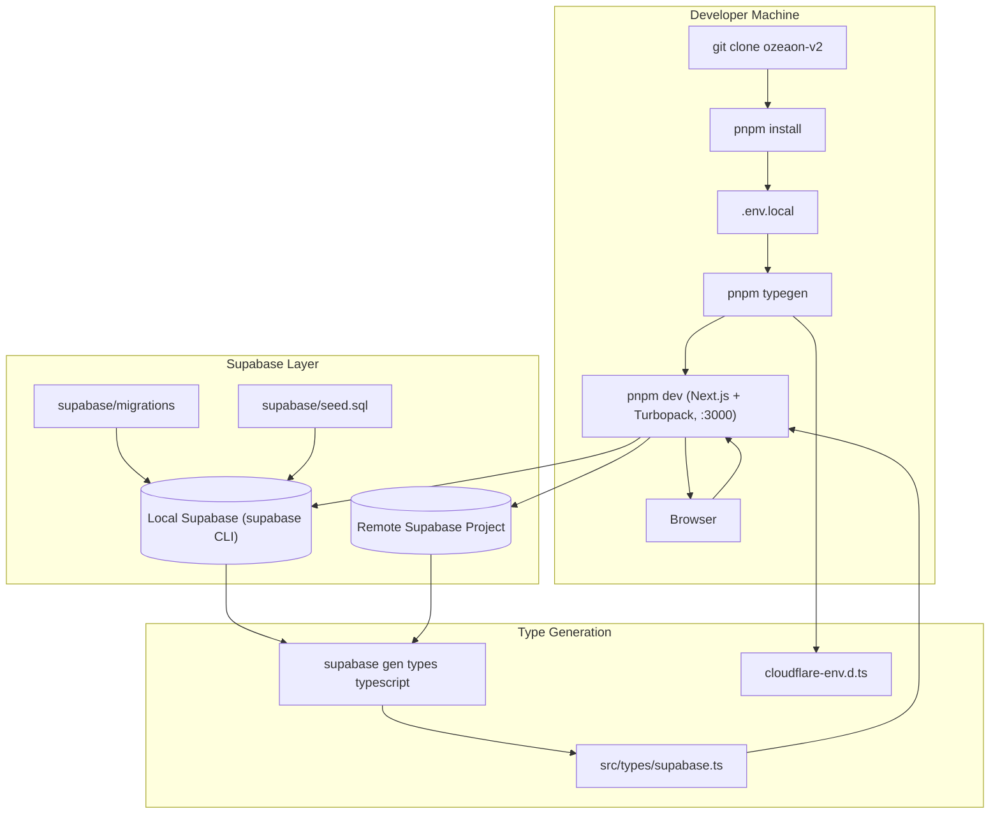
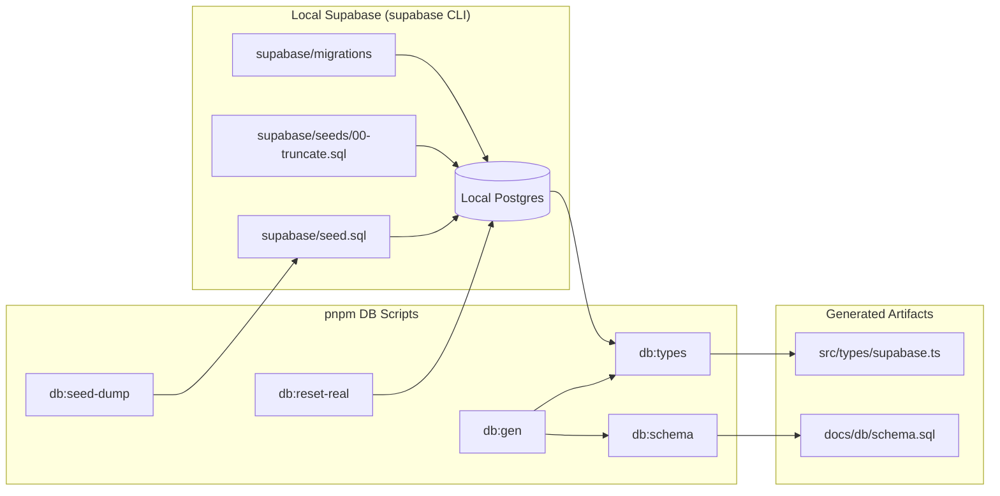
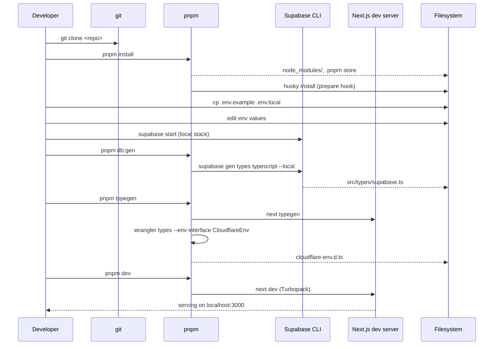

This page documents how to bootstrap the OZEAON V2 repository locally, the required toolchain versions, environment variables, and the command surface used for day-to-day development.

## Purpose and Scope

This page covers everything required to go from a clean machine to a running local development server for the OZEAON V2 web application:

- Prerequisites and pinned toolchain versions
- The installation and first-run sequence from `README.md`
- Environment variable configuration for local development
- The full `pnpm` script surface defined in `package.json`
- Local Supabase database workflow (`db:gen`, `db:types`, seeding)
- Repository conventions that govern how the project is structured (from `CLAUDE.md`)

**Out of scope (see sibling pages):**

- Production and staging deployment topology (Cloudflare Workers via OpenNext/Wrangler) — see the deployment documentation referenced from [README.md](https://github.com/ozeaon/ozeaon-v2/blob/0a4f1a95824db87782f1221a4108019d174df3d9/README.md#L18).
- The SSR data-fetching and caching model — see `docs/ssr/`.
- Component library, design system, and typography tokens — see [docs/component-library.md](https://github.com/ozeaon/ozeaon-v2/blob/0a4f1a95824db87782f1221a4108019d174df3d9/docs/component-library.md) and [docs/design-system.md](https://github.com/ozeaon/ozeaon-v2/blob/0a4f1a95824db87782f1221a4108019d174df3d9/docs/design-system.md).
- Database schema details — see [docs/db/schema.sql](https://github.com/ozeaon/ozeaon-v2/blob/0a4f1a95824db87782f1221a4108019d174df3d9/docs/db/schema.sql).

For contributor workflow conventions (branching, PR expectations), see [docs/workflows.md](https://github.com/ozeaon/ozeaon-v2/blob/0a4f1a95824db87782f1221a4108019d174df3d9/docs/workflows.md).

## Overview

OZEAON V2 is a full-stack ocean-conservation platform. The repository is a **single Next.js 16 application** that runs as the core web application for the ecosystem, backed by Supabase (PostgreSQL + Auth + Storage) and deployed to Cloudflare Workers at the edge.

The project's stated purpose is to be the central hub for:

- A public-facing platform for browsing projects, organizations, articles, and educational content
- An authenticated portal with personalized dashboards
- API infrastructure powering mobile apps and third-party integrations
- Real-time data from a Supabase PostgreSQL database with **30+ interconnected tables**
- Edge deployment for low-latency global delivery

From a contributor's perspective, "getting started" means understanding three things:

1. **The toolchain is pinned and opinionated.** Node 24.20.0, `pnpm@12.1.0`, React 19, Next.js 16.3.5, and a TypeScript 6 pre-release are all declared explicitly in `package.json` — not "latest".
2. **Local development is database-first.** Supabase types are generated from the local database schema, and the generated types drive the application's entire type system.
3. **There are strict code conventions** documented in `CLAUDE.md` that are enforced both by tooling (ESLint, Prettier, Husky) and by review.

### Key Technology Decisions

| Layer | Technology | Why it matters for setup |
|-------|-----------|--------------------------|
| Framework | Next.js 16 (App Router) + React 19 | Server Components are the default; `cookies()`/`headers()` are async |
| Backend | Supabase (PostgreSQL + RLS + Auth + Storage) | Drives generated types and all data access |
| Styling | Tailwind CSS 4 + Radix UI + Motion | v4 config format — no `tailwind.config.js` pattern |
| Auth | Supabase Auth with Google OAuth | Requires `NEXT_PUBLIC_GOOGLE_CLIENT_ID` for the OAuth flow |
| Deployment | Cloudflare Workers/Pages via OpenNext | `pnpm preview` / `pnpm ci:deploy` use the Cloudflare adapter |
| Package manager | pnpm only | `npm` and `yarn` are explicitly disallowed |
| Validation | Zod v4 | v3 APIs are deprecated and must not be used |

> Source: [README.md](https://github.com/ozeaon/ozeaon-v2/blob/0a4f1a95824db87782f1221a4108019d174df3d9/README.md#L162-L171), [CLAUDE.md](https://github.com/ozeaon/ozeaon-v2/blob/0a4f1a95824db87782f1221a4108019d174df3d9/CLAUDE.md#L46-L57)

## Architecture

The local development environment connects a Next.js dev server to a local or remote Supabase project, with generated types flowing from the database into the application source tree.



The diagram reflects the actual script definitions in `package.json`: `typegen` runs `next typegen && wrangler types`, `db:types` runs `supabase gen types typescript --local` into `src/types/supabase.ts`, and `db:gen` chains the schema generator with type generation. The application source consumes generated types from `src/types/supabase.ts`, which is why type generation is a required setup step rather than an optional one.

> Source: [package.json](https://github.com/ozeaon/ozeaon-v2/blob/0a4f1a95824db87782f1221a4108019d174df3d9/package.json#L18-L27)

## Prerequisites

Both prerequisites are version-pinned and the pinning is deliberate — mismatched tool versions are a common source of "works on my machine" failures in this repo.

| Requirement | Version | Notes |
|-------------|---------|-------|
| Node.js | 24+ (dev engine pins 24.20.0) | `devEngines.runtime` declares `node 24.20.0` with `"onFail": "download"` |
| pnpm | 11.9.0 per README; `packageManager` field pins `pnpm@12.1.0` | Declared via the `packageManager` field for Corepack-style resolution |
| Supabase account | — | Required for a hosted project; optional if using only the local Supabase CLI |

The `devEngines` block is significant: because `onFail` is set to `download`, tooling that honors `devEngines` can fetch the correct Node runtime automatically rather than failing.

```json
"packageManager": "pnpm@12.1.0",
"devEngines": {
  "runtime": {
    "name": "node",
    "version": "24.20.0",
    "onFail": "download"
  }
}
```

> Source: [package.json](https://github.com/ozeaon/ozeaon-v2/blob/0a4f1a95824db87782f1221a4108019d174df3d9/package.json#L124-L131)

Note that the README's prose states pnpm 11.9.0 while `packageManager` pins `pnpm@12.1.0`. The `packageManager` field is the authoritative, machine-readable pin; the README text is illustrative. When in doubt, trust `package.json`.

> Source: [README.md](https://github.com/ozeaon/ozeaon-v2/blob/0a4f1a95824db87782f1221a4108019d174df3d9/README.md#L185-L190), [package.json](https://github.com/ozeaon/ozeaon-v2/blob/0a4f1a95824db87782f1221a4108019d174df3d9/package.json#L124)

## Installation

The documented installation sequence is a five-step flow that ends with a running dev server.

```bash
# 1️⃣ Clone the repository
git clone https://github.com/your-org/ozeaon-v2.git
cd ozeaon-v2

# 2️⃣ Install dependencies
pnpm install

# 3️⃣ Set up environment variables
cp .env.example .env.local
# Edit .env.local with your Supabase credentials

# 4️⃣ Generate types
pnpm typegen

# 5️⃣ Start development server
pnpm dev
```

> Source: [README.md](https://github.com/ozeaon/ozeaon-v2/blob/0a4f1a95824db87782f1221a4108019d174df3d9/README.md#L193-L210)

Step 4 is the step most likely to be skipped by newcomers and the most likely to cause confusing TypeScript errors. `pnpm typegen` produces two categories of generated artifacts:

1. **Next.js route types** — from `next typegen`, giving typed route params and typed navigation.
2. **Cloudflare environment types** — from `wrangler types --env-interface CloudflareEnv cloudflare-env.d.ts`, which describes the bindings available on the `CloudflareEnv` interface.

```json
"typegen": "next typegen && wrangler types --env-interface CloudflareEnv cloudflare-env.d.ts",
```

> Source: [package.json](https://github.com/ozeaon/ozeaon-v2/blob/0a4f1a95824db87782f1221a4108019d174df3d9/package.json#L18)

Because these are generated files, they are not checked in, which is why a fresh clone without running `pnpm typegen` will produce missing-type errors in the editor.

### Environment Configuration

Local development requires a `.env.local` file. The documented template distinguishes required variables from optional ones:

```env
# Required
NEXT_PUBLIC_BASE_URL=http://localhost:3000
NEXT_PUBLIC_SUPABASE_URL=https://your-project.supabase.co
NEXT_PUBLIC_SUPABASE_PUBLISHABLE_KEY=your-anon-key

# Required for edge env server components, set up using workflow on deployment
SITE_URL=http://localhost:3000

# Optional - Supabase Service Role Key (server-side only)
SUPABASE_SERVICE_ROLE_KEY=your-service-role-key

# Optional - Google OAuth
NEXT_PUBLIC_GOOGLE_CLIENT_ID=your-client-id
SUPABASE_AUTH_EXTERNAL_GOOGLE_CLIENT_SECRET=your-secret
```

> Source: [README.md](https://github.com/ozeaon/ozeaon-v2/blob/0a4f1a95824db87782f1221a4108019d174df3d9/README.md#L218-L233)

#### Environment Variable Reference

| Variable | Required | Scope | Description |
|----------|----------|-------|-------------|
| `NEXT_PUBLIC_BASE_URL` | Yes | Client + Server | Base URL of the app; `http://localhost:3000` locally |
| `NEXT_PUBLIC_SUPABASE_URL` | Yes | Client + Server | Supabase project URL |
| `NEXT_PUBLIC_SUPABASE_PUBLISHABLE_KEY` | Yes | Client + Server | Publishable/anon key used by the browser and public client |
| `SITE_URL` | Yes (edge env) | Server (edge) | Required for edge-environment server components; set by the deployment workflow |
| `SUPABASE_SERVICE_ROLE_KEY` | Optional | Server only | Service-role key that bypasses RLS. **Never** expose to the client |
| `NEXT_PUBLIC_GOOGLE_CLIENT_ID` | Optional | Client | Client ID for the Google OAuth flow |
| `SUPABASE_AUTH_EXTERNAL_GOOGLE_CLIENT_SECRET` | Optional | Server only | Google OAuth client secret used by Supabase Auth |

Two naming details carry design intent:

- The `NEXT_PUBLIC_` prefix marks values that Next.js inlines into the client bundle. Anything without that prefix stays server-side. The service-role key and the Google secret intentionally lack the prefix, so they cannot leak into the browser bundle.
- `SITE_URL` (without prefix) is described as required specifically for **edge environment server components** and is injected by the deployment workflow rather than committed. Locally it is set to the same value as `NEXT_PUBLIC_BASE_URL`.

> Source: [README.md](https://github.com/ozeaon/ozeaon-v2/blob/0a4f1a95824db87782f1221a4108019d174df3d9/README.md#L214-L233)

## Command Surface

All project operations are exposed through `pnpm` scripts in `package.json`. The table below is the authoritative list.

| Command | Definition | Purpose |
|---------|-----------|---------|
| `pnpm dev` | `next dev` | Start the dev server with Turbopack on `localhost:3000` |
| `pnpm build` | `next build` | Production Next.js build |
| `pnpm start` | `next start` | Serve a production build |
| `pnpm lint` | `eslint .` | Lint the whole repo |
| `pnpm lint:fix` | `eslint . --fix` | Lint with auto-fix |
| `pnpm format` | `prettier -w -c src` | Format `src` with Prettier |
| `pnpm format:check` | `prettier -c src` | Check formatting without writing |
| `pnpm check` | `tsc --noEmit` | Full type check |
| `pnpm typegen` | `next typegen && wrangler types --env-interface CloudflareEnv cloudflare-env.d.ts` | Generate route + Cloudflare env types |
| `pnpm clean-cache` | `rm -rf .next .turbo node_modules/.cache .open-next .wrangler` | Remove all build caches |
| `pnpm prepare` | `husky` | Install git hooks |
| `pnpm db:schema` | `node scripts/schema/generate.mjs` | Regenerate the schema artifact |
| `pnpm db:types` | `supabase gen types typescript --local > src/types/supabase.ts && prettier --write src/types/supabase.ts` | Generate DB types from local Supabase |
| `pnpm db:gen` | `pnpm db:schema && pnpm db:types` | Regenerate schema + types together |
| `pnpm db:seed-dump` | `supabase db dump --data-only -f supabase/seed.sql` | Dump remote data into the seed file |
| `pnpm db:reset-real` | `supabase db reset && … psql …` | Reset local DB and load the real dump |
| `pnpm preview` | `opennextjs-cloudflare build && opennextjs-cloudflare preview --port 3000` | Build and preview the Cloudflare deployment locally |
| `pnpm ci:build` | `opennextjs-cloudflare build` | Cloudflare-adapter build (CI) |
| `pnpm ci:deploy` | `opennextjs-cloudflare deploy` | Deploy to Cloudflare (CI) |

> Source: [package.json](https://github.com/ozeaon/ozeaon-v2/blob/0a4f1a95824db87782f1221a4108019d174df3d9/package.json#L8-L28)

## Local Database Workflow

The database scripts form a small pipeline around the Supabase CLI. Understanding the direction of data flow between them is the key to using them correctly.



### Generating Types After Schema Changes

`db:types` is the single most important database script for daily development. It reads the **local** Supabase instance and writes TypeScript types into `src/types/supabase.ts`, then runs Prettier on the result so the generated file stays format-clean and diff-friendly.

```json
"db:types": "supabase gen types typescript --local > src/types/supabase.ts && prettier --write src/types/supabase.ts",
```

> Source: [package.json](https://github.com/ozeaon/ozeaon-v2/blob/0a4f1a95824db87782f1221a4108019d174df3d9/package.json#L24)

The `--local` flag means this command targets the locally running Supabase stack, not a hosted project. Running it after applying a migration is mandatory — the application's type system derives from these generated types.

### Resetting with Real Data

`db:reset-real` performs a full local reset and then loads a real data dump in two passes: first truncation, then insertion.

```json
"db:reset-real": "supabase db reset && DB_URL=$(supabase status --output json | jq -er '.DB_URL') && psql \"$DB_URL\" -v ON_ERROR_STOP=1 -f supabase/seeds/00-truncate.sql -f supabase/seed.sql"
```

> Source: [package.json](https://github.com/ozeaon/ozeaon-v2/blob/0a4f1a95824db87782f1221a4108019d174df3d9/package.json#L27)

Three details matter here:

1. **Ordering is intentional.** `00-truncate.sql` runs before `seed.sql` so the seed can be applied onto a known-empty state without primary-key collisions.
2. **`ON_ERROR_STOP=1`** is passed to `psql`, so any SQL error aborts the load instead of silently continuing with a partially seeded database.
3. **The connection string is extracted dynamically** from `supabase status --output json` via `jq -er`. The `-e` flag makes `jq` exit non-zero if the value is null, and `-r` emits the raw string. This avoids hardcoding the local Postgres connection URL.

This script requires both `jq` and `psql` to be installed on the developer's machine — neither is declared as a project dependency, so they are implicit OS-level prerequisites.

### Dumping Seed Data

`db:seed-dump` captures the upstream data as a data-only dump, deliberately excluding schema:

```json
"db:seed-dump": "supabase db dump --data-only -f supabase/seed.sql",
```

> Source: [package.json](https://github.com/ozeaon/ozeaon-v2/blob/0a4f1a95824db87782f1221a4108019d174df3d9/package.json#L26)

Because it is `--data-only`, the seed file contains rows but not DDL. Schema changes are expected to live in migrations, keeping schema and data concerns separated.

## Type Generation Pipeline

The application's type system is derived, not hand-written. `CLAUDE.md` states this as a hard rule:

> Always derive from generated types; never hand-roll.

The documented derivation patterns are:

```typescript
type Project = Tables<"projects">; // full row
type Slug = Pick<Tables<"resource_subcategories">, "id" | "name" | "slug">; // projection
type Comment = Tables<"comments"> & { author: UserProfileForJoin }; // join
type Article = Omit<Tables<"articles">, "article_type"> & {
  // FK override
  article_type: { id: number; type: string } | null;
};
const insert: TablesInsert<"projects"> = { title, slug, created_by: user.id }; // mutation
```

> Source: [CLAUDE.md](https://github.com/ozeaon/ozeaon-v2/blob/0a4f1a95824db87782f1221a4108019d174df3d9/CLAUDE.md#L164-L177)

This has two direct setup consequences:

- `src/types/supabase.ts` must exist (generated via `pnpm db:types`) before `pnpm check` will pass, because `Tables`, `TablesInsert`, and `TablesUpdate` are imported from it.
- Domain types live in `src/types/` and must never be defined inside component files.

> Source: [CLAUDE.md](https://github.com/ozeaon/ozeaon-v2/blob/0a4f1a95824db87782f1221a4108019d174df3d9/CLAUDE.md#L178-L179)

## Repository Conventions Every New Contributor Must Know

The following constraints are enforced by tooling and are the most common source of first-PR friction. They are documented in `CLAUDE.md`.

### Package Manager

**pnpm only.** `npm` and `yarn` are explicitly disallowed. This is not stylistic — the repo ships `pnpm-lock.yaml` and `pnpm-workspace.yaml`, and lockfile drift from a different package manager will produce inconsistent trees.

> Source: [CLAUDE.md](https://github.com/ozeaon/ozeaon-v2/blob/0a4f1a95824db87782f1221a4108019d174df3d9/CLAUDE.md#L46-L57)

### Frontend Dependency Versions With Breaking Changes

The repo is on major versions where familiar APIs have changed:

| Library | Version in repo | Breaking change to internalize |
|---------|----------------|-------------------------------|
| Next.js | `16.3.5` | `cookies()` / `headers()` are **async** (changed from 14) |
| Zod | `^4.6.5` | v4 API — do not use deprecated v3 APIs |
| Tailwind CSS | `^4.3.3` | v4 config format — no `tailwind.config.js` pattern |
| React | `^19.3.0` | Paired with Next.js 16 App Router |
| TypeScript | `npm:@typescript/typescript6@^6.0.2` (dev) | TypeScript 6 pre-release, installed via npm alias |

> Source: [package.json](https://github.com/ozeaon/ozeaon-v2/blob/0a4f1a95824db87782f1221a4108019d174df3d9/package.json#L73-L124), [CLAUDE.md](https://github.com/ozeaon/ozeaon-v2/blob/0a4f1a95824db87782f1221a4108019d174df3d9/CLAUDE.md#L51-L57)

Note that TypeScript is installed through an npm alias in `devDependencies`:

```json
"typescript": "npm:@typescript/typescript6@^6.0.2",
"@typescript/native": "npm:typescript@^7.0.2",
```

> Source: [package.json](https://github.com/ozeaon/ozeaon-v2/blob/0a4f1a95824db87782f1221a4108019d174df3d9/package.json#L104-L120)

### SSR Safety Rules

`CLAUDE.md` opens with a hard constraint:

> Always consider SSR constraints — never use browser APIs (`document`, `window`) in server components or at module level.

It also states that the project will eventually move to `cacheComponents` once the feature is stable with the Cloudflare adapter, and prohibits the older Next.js caching directives:

> Never use old model directives (`export const dynamic`/`revalidate`/`fetchCache`/`runtime`).

> Source: [CLAUDE.md](https://github.com/ozeaon/ozeaon-v2/blob/0a4f1a95824db87782f1221a4108019d174df3d9/CLAUDE.md#L9-L13)

### Supabase Client Selection

Four clients exist, each with a designated use site:

| Client | Import | Use In |
|--------|--------|--------|
| Server | `@/lib/supabase/server` | Server Components, Server Actions, API routes |
| Browser | `@/lib/supabase/client` | Client Components (`"use client"`) — create fresh per call |
| Admin | `@/lib/supabase/admin` | API routes bypassing RLS (use sparingly) |
| Public | `@/lib/supabase/public` | Unauthenticated public queries |

> Source: [CLAUDE.md](https://github.com/ozeaon/ozeaon-v2/blob/0a4f1a95824db87782f1221a4108019d174df3d9/CLAUDE.md#L84-L89)

```typescript
//  Server Component / API route
import { createClient } from "@/lib/supabase/server";

const supabase = await createClient();
```

> Source: [CLAUDE.md](https://github.com/ozeaon/ozeaon-v2/blob/0a4f1a95824db87782f1221a4108019d174df3d9/CLAUDE.md#L91-L96)

A documented anti-pattern to avoid: never call `createClient()` after `getAuthUser()` or `getAuthUserOrRedirect()`, because both already return a request-memoized `supabase` client.

```typescript
// ❌ Wrong — two clients for one request
const supabase = await createClient();
const { user } = await getAuthUserOrRedirect();

// ✅ Correct — reuse the client from auth
const { user, supabase } = await getAuthUserOrRedirect();
```

> Source: [CLAUDE.md](https://github.com/ozeaon/ozeaon-v2/blob/0a4f1a95824db87782f1221a4108019d174df3d9/CLAUDE.md#L100-L107)

For a Client Component, the client must be created fresh per call and never cached globally:

```typescript
// Client Component
"use client";
// ⚠️ Create fresh per request, never cache globally Client Component
import { createClient } from "@/lib/supabase/client";

const supabase = createClient();
```

> Source: [CLAUDE.md](https://github.com/ozeaon/ozeaon-v2/blob/0a4f1a95824db87782f1221a4108019d174df3d9/CLAUDE.md#L124-L131)

## First-Run Workflow (End to End)

The following sequence shows the full path from a fresh clone to a running server with a working database-backed type system.



The ordering constraint that matters most is **database before types, types before dev server**. `pnpm db:types` requires a reachable local Supabase instance because it runs `supabase gen types typescript --local`; running it before the local stack is up will fail or produce an empty type file, which then cascades into `pnpm check` errors across the codebase.

`pnpm typegen` (Next.js route types + Cloudflare env types) is independent of the database and only requires `pnpm install` to have completed, since it invokes binaries from `node_modules`.

### Verifying a Healthy Setup

| Check | Command | Expected outcome |
|-------|---------|------------------|
| Dependencies installed | `pnpm check` | Passes with no type errors (requires generated types present) |
| Formatting clean | `pnpm format:check` | No files reported — only checks `src` |
| Linting clean | `pnpm lint` | No ESLint errors |
| Generated types exist | Inspect `src/types/supabase.ts` | Exports `Tables`, `TablesInsert`, `TablesUpdate` |
| Dev server runs | `pnpm dev` | Serves on `localhost:3000` |

### Recovering From a Broken Build

Build caches accumulate across Turbo, Next.js, OpenNext, and Wrangler directories. The documented remedy is a single cleanup script:

```json
"clean-cache": "rm -rf .next .turbo node_modules/.cache .open-next .wrangler",
```

> Source: [package.json](https://github.com/ozeaon/ozeaon-v2/blob/0a4f1a95824db87782f1221a4108019d174df3d9/package.json#L17)

Running `pnpm clean-cache` followed by `pnpm install && pnpm typegen` resolves the majority of stale-build problems, because it clears all four cache locations in one pass rather than just `.next`.

## The Cloudflare Build Path

Local development uses plain `next dev`, but two scripts exercise the actual production build path locally. This matters because the production runtime is Cloudflare Workers, not a Node.js server, and the adapter (`@opennextjs/cloudflare`) can surface issues that never appear in `next dev`.

```json
"preview": "opennextjs-cloudflare build && opennextjs-cloudflare preview --port 3000",
"ci:build": "opennextjs-cloudflare build",
"ci:deploy": "opennextjs-cloudflare deploy",
```

> Source: [package.json](https://github.com/ozeaon/ozeaon-v2/blob/0a4f1a95824db87782f1221a4108019d174df3d9/package.json#L20-L22)

`pnpm preview` builds with the Cloudflare adapter and then serves the result locally on port 3000, mirroring the production runtime closely enough to catch edge-runtime incompatibilities before deployment. This is also the mechanism referenced by the `SITE_URL` variable's note about edge-environment server components.

Related configuration files in the repository root govern this path: `open-next.config.ts`, `next.config.ts`, and `wrangler.jsonc`.

> Source: [README.md](https://github.com/ozeaon/ozeaon-v2/blob/0a4f1a95824db87782f1221a4108019d174df3d9/README.md#L224)

## Failure Modes and Edge Cases

| Symptom | Likely cause | Resolution |
|---------|-------------|------------|
| TypeScript errors for `Tables`/`TablesInsert` on a fresh clone | `src/types/supabase.ts` not generated | Run `pnpm typegen` and `pnpm db:types` (the latter needs local Supabase running) |
| `pnpm db:types` produces empty or failed output | Local Supabase stack not running | Start the local Supabase stack, then re-run |
| `pnpm db:reset-real` fails immediately | `jq` or `psql` missing from PATH | Install both; the script shells out to `jq -er` and `psql` |
| Seed load fails partway | SQL error, aborts due to `ON_ERROR_STOP=1` | Fix the offending SQL; the abort behavior is intentional to avoid partial seeds |
| Editor cannot resolve route params | Next.js route types stale after adding routes | Re-run `pnpm typegen` |
| Stale build behaving inexplicably | Mixed caches across `.next`, `.turbo`, `.open-next`, `.wrangler` | Run `pnpm clean-cache`, then reinstall and regenerate types |
| `document is not defined` at runtime | Browser API used in a Server Component or at module scope | Move the access into a Client Component — see the SSR rule in `CLAUDE.md` |
| Two Supabase clients created for one request | Calling `createClient()` after `getAuthUserOrRedirect()` | Reuse the `supabase` returned by the auth helper |
| Client bundle leaking secrets | A server-only value given a `NEXT_PUBLIC_` prefix | Keep `SUPABASE_SERVICE_ROLE_KEY` and OAuth secrets unprefixed |

### Design Intent Behind These Constraints

- **`ON_ERROR_STOP=1` on seeding** reflects a preference for loud, immediate failure over a silently half-populated local database that would be far harder to debug.
- **Prettier run inside `db:types`** keeps a generated file out of formatting noise, so schema-driven type changes produce minimal, reviewable diffs.
- **`--local` on type generation** keeps developer machines decoupled from a shared, mutable remote schema.
- **`clean-cache` covering four directories** exists because the project spans two distinct build toolchains (Next.js/Turbo for dev, OpenNext/Wrangler for Cloudflare), and each caches independently.

## Concurrency and Consistency Notes

Local development in this project has a few consistency characteristics worth calling out:

- **Generated types are a shared mutable artifact.** `src/types/supabase.ts` and `cloudflare-env.d.ts` are derived files. Two developers on different branches who regenerate types against different schemas will produce conflicting diffs. Always re-run `pnpm db:types` after pulling schema changes rather than merging a stale generated file.
- **`db:reset-real` is destructive to local state.** A full `supabase db reset` wipes the local database before reloading seed data, so any uncommitted local rows are lost.
- **`db:seed-dump` reads from a source database and writes the repository's seed file.** It is a `--data-only` dump, so it will not pick up schema changes; those must come from migrations.
- **The Supabase client lifecycle is per-request.** The server client is memoized by React `cache()` inside the auth helpers, so creating additional clients within the same request is both wasteful and a documented error.

> Source: [package.json](https://github.com/ozeaon/ozeaon-v2/blob/0a4f1a95824db87782f1221a4108019d174df3d9/package.json#L24-L27), [CLAUDE.md](https://github.com/ozeaon/ozeaon-v2/blob/0a4f1a95824db87782f1221a4108019d174df3d9/CLAUDE.md#L98-L107)

## Related Links

### Repository Documentation

- [README.md](https://github.com/ozeaon/ozeaon-v2/blob/0a4f1a95824db87782f1221a4108019d174df3d9/README.md) — project overview, prerequisites, quick start, environment variables
- [CLAUDE.md](https://github.com/ozeaon/ozeaon-v2/blob/0a4f1a95824db87782f1221a4108019d174df3d9/CLAUDE.md) — authoritative coding conventions, commands reference, client patterns, SSR rules
- [docs/workflows.md](https://github.com/ozeaon/ozeaon-v2/blob/0a4f1a95824db87782f1221a4108019d174df3d9/docs/workflows.md) — development workflow guide (linked from README)
- [docs/supabase-local.md](https://github.com/ozeaon/ozeaon-v2/blob/0a4f1a95824db87782f1221a4108019d174df3d9/docs/supabase-local.md) — local Supabase setup
- [docs/ops-deployment.md](https://github.com/ozeaon/ozeaon-v2/blob/0a4f1a95824db87782f1221a4108019d174df3d9/docs/ops-deployment.md) — deployment guide
- [docs/db/schema.sql](https://github.com/ozeaon/ozeaon-v2/blob/0a4f1a95824db87782f1221a4108019d174df3d9/docs/db/schema.sql) — database schema
- [docs/r2-storage.md](https://github.com/ozeaon/ozeaon-v2/blob/0a4f1a95824db87782f1221a4108019d174df3d9/docs/r2-storage.md) — `StorageAdapter` upload/URL/delete patterns
- [docs/component-library.md](https://github.com/ozeaon/ozeaon-v2/blob/0a4f1a95824db87782f1221a4108019d174df3d9/docs/component-library.md) — component inventory and RHF wrappers
- [docs/design-system.md](https://github.com/ozeaon/ozeaon-v2/blob/0a4f1a95824db87782f1221a4108019d174df3d9/docs/design-system.md) — typography and color token tables
- [docs/ssr/cache-components-model.md](https://github.com/ozeaon/ozeaon-v2/blob/0a4f1a95824db87782f1221a4108019d174df3d9/docs/ssr/cache-components-model.md) — the future caching model
- [docs/ssr/rendering-rules-today.md](https://github.com/ozeaon/ozeaon-v2/blob/0a4f1a95824db87782f1221a4108019d174df3d9/docs/ssr/rendering-rules-today.md) — current rendering rules

### Key Configuration Files

- [package.json](https://github.com/ozeaon/ozeaon-v2/blob/0a4f1a95824db87782f1221a4108019d174df3d9/package.json) — scripts, pinned dependencies, `packageManager`, `devEngines`
- [next.config.ts](https://github.com/ozeaon/ozeaon-v2/blob/0a4f1a95824db87782f1221a4108019d174df3d9/next.config.ts) — Next.js configuration
- [open-next.config.ts](https://github.com/ozeaon/ozeaon-v2/blob/0a4f1a95824db87782f1221a4108019d174df3d9/open-next.config.ts) — OpenNext Cloudflare adapter configuration
- [wrangler.jsonc](https://github.com/ozeaon/ozeaon-v2/blob/0a4f1a95824db87782f1221a4108019d174df3d9/wrangler.jsonc) — Cloudflare Workers configuration
- [pnpm-workspace.yaml](https://github.com/ozeaon/ozeaon-v2/blob/0a4f1a95824db87782f1221a4108019d174df3d9/pnpm-workspace.yaml) — pnpm workspace definition
- [tsconfig.json](https://github.com/ozeaon/ozeaon-v2/blob/0a4f1a95824db87782f1221a4108019d174df3d9/tsconfig.json) — TypeScript compiler configuration
- [eslint.config.mjs](https://github.com/ozeaon/ozeaon-v2/blob/0a4f1a95824db87782f1221a4108019d174df3d9/eslint.config.mjs) — ESLint configuration entry point (with `eslint.rules.*.mjs` rule modules for auth, base, cache, import, and logging)

### Live Environments

- [Live Landing Page](https://ozeaon.com)
- [Live Production Platform](https://app.ozeaon.com)
- [Live Staging Platform](https://app.ozeaon.dev)

> Source: [README.md](https://github.com/ozeaon/ozeaon-v2/blob/0a4f1a95824db87782f1221a4108019d174df3d9/README.md#L14-L20)
