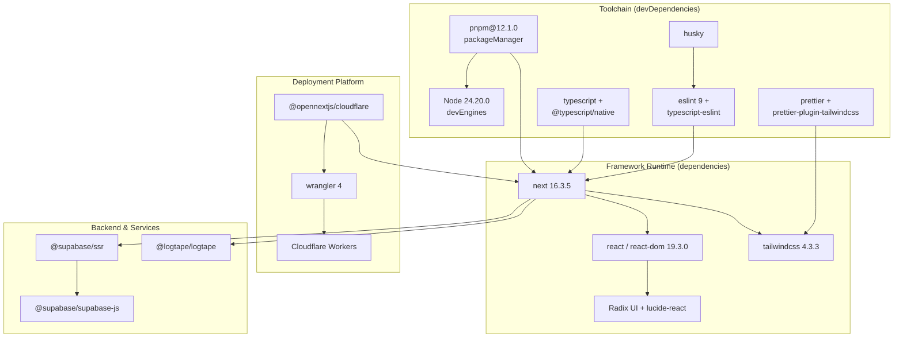
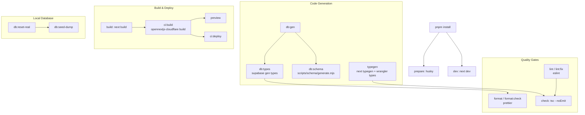
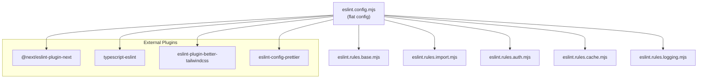

The Ozeaon v2 platform is a Next.js 16 application written in TypeScript, running on Cloudflare Workers via OpenNext, backed by Supabase, and orchestrated through a scripted pnpm workflow.

## Purpose and Scope

This page documents the **technology choices, dependency inventory, and npm/pnpm scripts** that define how Ozeaon v2 is built, checked, and deployed. It covers:

- The runtime and framework baseline (Node, Next.js, React, TypeScript).
- The full dependency surface declared in `package.json`, grouped by concern.
- Every script in the `scripts` block, what it does, and the toolchain it invokes.
- The TypeScript compiler configuration and path aliases.
- The Cloudflare/OpenNext deployment pipeline and how `next.config.ts` shapes the build.

This page is a **reference for what the project is built with**. It intentionally does not explain application-level architecture, data modeling, authentication flows, or feature behavior — those belong to sibling pages under the overview and feature sections. For repository layout and directory conventions, see the project structure page. For environment variables and secrets, see the configuration page.

## Overview

Ozeaon v2 is a **single Next.js application** targeting **Cloudflare Workers** as its production runtime. The stack is deliberately modern and mostly non-negotiable:

| Layer | Technology | Declared in |
|-------|-----------|-------------|
| Language | TypeScript (via `@typescript/typescript6` and `@typescript/native`) | [package.json](https://github.com/ozeaon/ozeaon-v2/blob/0a4f1a95824db87782f1221a4108019d174df3d9/package.json#L104-L120) |
| Framework | Next.js `16.3.5` with React `19.3.0` | [package.json](https://github.com/ozeaon/ozeaon-v2/blob/0a4f1a95824db87782f1221a4108019d174df3d9/package.json#L73-L79) |
| Package manager | `pnpm@12.1.0` | [package.json](https://github.com/ozeaon/ozeaon-v2/blob/0a4f1a95824db87782f1221a4108019d174df3d9/package.json#L124) |
| Runtime | Node `24.20.0` (auto-downloaded on mismatch) | [package.json](https://github.com/ozeaon/ozeaon-v2/blob/0a4f1a95824db87782f1221a4108019d174df3d9/package.json#L125-L131) |
| Deployment | `@opennextjs/cloudflare` + `wrangler` | [package.json](https://github.com/ozeaon/ozeaon-v2/blob/0a4f1a95824db87782f1221a4108019d174df3d9/package.json#L37), [package.json](https://github.com/ozeaon/ozeaon-v2/blob/0a4f1a95824db87782f1221a4108019d174df3d9/package.json#L122) |
| Backend | Supabase (`@supabase/ssr`, `@supabase/supabase-js`) | [package.json](https://github.com/ozeaon/ozeaon-v2/blob/0a4f1a95824db87782f1221a4108019d174df3d9/package.json#L53-L54) |
| Styling | Tailwind CSS `4.3.3` + `tw-animate-css` | [package.json](https://github.com/ozeaon/ozeaon-v2/blob/0a4f1a95824db87782f1221a4108019d174df3d9/package.json#L116), [package.json](https://github.com/ozeaon/ozeaon-v2/blob/0a4f1a95824db87782f1221a4108019d174df3d9/package.json#L119) |
| UI primitives | Radix UI, `lucide-react`, `cmdk`, `vaul`, `sonner` | [package.json](https://github.com/ozeaon/ozeaon-v2/blob/0a4f1a95824db87782f1221a4108019d174df3d9/package.json#L38-L90) |
| Forms & validation | `react-hook-form`, `zod`, `validator` | [package.json](https://github.com/ozeaon/ozeaon-v2/blob/0a4f1a95824db87782f1221a4108019d174df3d9/package.json#L80-L91) |
| Logging | `@logtape/logtape` + `@logtape/redaction` | [package.json](https://github.com/ozeaon/ozeaon-v2/blob/0a4f1a95824db87782f1221a4108019d174df3d9/package.json#L35-L36) |
| Rich text | Tiptap (`@tiptap/react` + extensions) | [package.json](https://github.com/ozeaon/ozeaon-v2/blob/0a4f1a95824db87782f1221a4108019d174df3d9/package.json#L56-L62) |

Two design decisions stand out and are worth calling out explicitly:

1. **The repository is `"type": "module"`** with `"private": true`, so all scripts and config files are ESM and the package is never published.
2. **Node and pnpm versions are pinned** (`devEngines.runtime` with `onFail: "download"` and `packageManager`). This makes local, CI, and Cloudflare build environments converge on the same toolchain rather than drifting.

## Architecture

The diagram below shows how the declared technology pieces relate to one another across the build, runtime, and data layers. Every node corresponds to a real dependency or script target from `package.json` or `next.config.ts`.



The diagram reflects the actual layering: `package.json` splits **dependencies** (shipped into the Worker bundle) from **devDependencies** (toolchain only). `Next` is the hub — it consumes React, Tailwind, Radix, Supabase, and LogTape, and is in turn consumed by the OpenNext adapter that Wrangler deploys to Cloudflare Workers.

> Sources: [package.json](https://github.com/ozeaon/ozeaon-v2/blob/0a4f1a95824db87782f1221a4108019d174df3d9/package.json#L30-L131), [next.config.ts](https://github.com/ozeaon/ozeaon-v2/blob/0a4f1a95824db87782f1221a4108019d174df3d9/next.config.ts#L1-L8)

## Core Framework Stack

### Next.js 16.3.5 with React 19

Next.js is pinned to an exact version (`"next": "16.3.5"`, no caret), which is unusual versus the other dependencies that use caret ranges. This is a deliberate choice for a framework whose minor releases frequently change build output — pinning guarantees the OpenNext adapter, Wrangler, and Cloudflare Worker output remain compatible.

```json
    "next": "16.3.5",
    "obscenity": "^0.4.6",
    "open-next": "^3.1.3",
```

> Source: [package.json](https://github.com/ozeaon/ozeaon-v2/blob/0a4f1a95824db87782f1221a4108019d174df3d9/package.json#L73-L75)

React and React DOM are both `^19.3.0`, and `reactStrictMode` is enabled in the Next config:

```json
  reactStrictMode: true,
```

> Source: [next.config.ts](https://github.com/ozeaon/ozeaon-v2/blob/0a4f1a95824db87782f1221a4108019d174df3d9/next.config.ts#L140)

Strict mode double-invokes render functions and effects in development; the fact that it is enabled signals the codebase is expected to be side-effect-clean during render.

### Notable `next.config.ts` Flags

The Next config enables several build-affecting and developer-experience features:

```typescript
const nextConfig: NextConfig = {
  cacheComponents: false,
  allowedDevOrigins: ["*.ngrok-free.dev", "192.168.1.71"],
  serverExternalPackages: ["pdfjs-dist"],
  enablePrerenderSourceMaps: false,
  productionBrowserSourceMaps: false,
  logging: {
    browserToTerminal: false,
    incomingRequests: {
      ignore: [/manifest.webmanifest/, /\/api\/storage/],
    },
  },
  experimental: {
    typedEnv: true,
    inlineCss: false,
    prefetchInlining: false,
    optimisticRouting: true,
    varyParams: true,
    prerenderEarlyExit: false,
    useTypeScriptCli: false,
  },
  typedRoutes: true,
  poweredByHeader: false,
```

> Source: [next.config.ts](https://github.com/ozeaon/ozeaon-v2/blob/0a4f1a95824db87782f1221a4108019d174df3d9/next.config.ts#L100-L122)

| Flag | Value | Why it matters |
|------|-------|----------------|
| `cacheComponents` | `false` | Disables the newer component-level cache model; caching is handled explicitly. |
| `serverExternalPackages` | `["pdfjs-dist"]` | Keeps `pdfjs-dist` out of the bundler so its worker/asset loading works server-side. |
| `typedRoutes` | `true` | Generates typed route strings — link `href`s are compile-time checked. |
| `typedEnv` | `true` | Environment variables declared in config are type-checked. |
| `optimisticRouting` | `true` | Enables optimistic client-side navigation. |
| `varyParams` | `true` | Ensures cached responses vary correctly by route params. |
| `poweredByHeader` | `false` | Removes the `X-Powered-By: Next.js` fingerprint from responses. |
| `productionBrowserSourceMaps` | `false` | Source maps are not shipped to production clients. |
| `logging.incomingRequests.ignore` | `[/manifest.webmanifest/, /\/api\/storage/]` | Suppresses noisy logs for the web manifest and storage API route. |

### Custom Image Loader and Remote Patterns

Images are served through a **custom loader file** rather than Next's built-in optimizer:

```typescript
  images: {
    loader: "custom",
    loaderFile: "./src/lib/image-loader.ts",
    qualities: [75, 85, 95],
    remotePatterns: [
      { hostname: "*.githubusercontent.com", protocol: "https" },
      { hostname: "*.googleusercontent.com", protocol: "https" },
      { hostname: "*.supabase.co", protocol: "https" },
      { hostname: "*.gstatic.com", protocol: "https" },
      ...(storageHost
        ? [{ hostname: storageHost, protocol: "https" as const }]
        : []),
    ],
    localPatterns: [{ pathname: "/**" }], // allow all local images
    formats: ["image/avif", "image/webp"],
    minimumCacheTTL: FOUR_DAYS,
  },
```

> Source: [next.config.ts](https://github.com/ozeaon/ozeaon-v2/blob/0a4f1a95824db87782f1221a4108019d174df3d9/next.config.ts#L123-L139)

The custom loader matters on Cloudflare Workers: the default Next image optimizer relies on a Node.js runtime and filesystem, neither of which exists in the Workers environment. `minimumCacheTTL` is set to `4 * 24 * 60 * 60` seconds (`FOUR_DAYS`), defined as a single constant reused by the cache headers.

### Security Headers and CSP

All non-development responses receive a suite of security headers, including a dynamically constructed Content Security Policy:

```typescript
      {
        source: "/:path*",
        headers: [
          { key: "Content-Security-Policy", value: _ContentSecurityPolicy },
          { key: "X-Frame-Options", value: "DENY" },
          { key: "X-Content-Type-Options", value: "nosniff" },
          { key: "Referrer-Policy", value: "strict-origin-when-cross-origin" },
          {
            key: "Strict-Transport-Security",
            value: "max-age=31536000; includeSubDomains",
          },
          {
            key: "Permissions-Policy",
            value: "geolocation=(), browsing-topics=()",
          },
          { key: "X-DNS-Prefetch-Control", value: "on" },
        ],
      },
```

> Source: [next.config.ts](https://github.com/ozeaon/ozeaon-v2/blob/0a4f1a95824db87782f1221a4108019d174df3d9/next.config.ts#L164-L181)

The CSP is assembled from runtime environment variables rather than hardcoded, because the allowed origins differ per deployment:

```typescript
const STORAGE_HOSTS = [
  ...new Set(
    ["storage-r2.ozeaon.com", "storage-r2.ozeaon.dev", storageHost].filter(
      Boolean,
    ),
  ),
].join(" ");
```

> Source: [next.config.ts](https://github.com/ozeaon/ozeaon-v2/blob/0a4f1a95824db87782f1221a4108019d174df3d9/next.config.ts#L31-L37)

The in-source comment documents the intent: article content and attachments store **absolute URLs against whichever environment uploaded them**, so both storage hosts must always be allowed — for `img-src` (rendering) and `connect-src` (the XHR reads pdf.js and downloads perform).

Because `pnpm preview` and `pnpm ci:build` emit production headers while still pointing at a **local Supabase**, local origins are derived from the configured URL instead of `NODE_ENV`:

```typescript
const localSupabaseOrigins = (() => {
  const url = process.env.NEXT_PUBLIC_SUPABASE_URL;
  if (!url) return "";
  try {
    const { host, hostname } = new URL(url);
    if (hostname !== "127.0.0.1" && hostname !== "localhost") return "";
    return `http://${host} ws://${host}`;
  } catch {
    return "";
  }
})();
```

> Source: [next.config.ts](https://github.com/ozeaon/ozeaon-v2/blob/0a4f1a95824db87782f1221a4108019d174df3d9/next.config.ts#L45-L55)

Headers are only attached when not in development:

```typescript
  async headers() {
    if (isDev) {
      return [];
    }
```

> Source: [next.config.ts](https://github.com/ozeaon/ozeaon-v2/blob/0a4f1a95824db87782f1221a4108019d174df3d9/next.config.ts#L141-L144)

### Conditional Cloudflare Dev Bindings

`initOpenNextCloudflareForDev()` is called **only** when `NODE_ENV === "development"`, with an explicit comment that it is skipped during typegen and build to prevent stalling:

```typescript
// Only initialize Cloudflare dev bindings when running the dev server
// Skip during typegen, build, or other CLI commands to prevent stalling
if (process.env.NODE_ENV === "development") {
  initOpenNextCloudflareForDev();
}
```

> Source: [next.config.ts](https://github.com/ozeaon/ozeaon-v2/blob/0a4f1a95824db87782f1221a4108019d174df3d9/next.config.ts#L4-L8)

This is a performance guard: unconditionally initializing Cloudflare bindings would add startup latency to every CLI invocation, including `tsc --noEmit`.

## Dependency Inventory by Concern

The `dependencies` block groups into distinct functional clusters. Understanding these clusters clarifies which library owns which responsibility.

### UI Primitives and Interaction

Radix UI provides the unstyled, accessible primitives; `class-variance-authority`, `clsx`, and `tailwind-merge` compose the styling variant system on top of Tailwind.

| Package | Purpose |
|---------|---------|
| `@radix-ui/react-accordion` … `react-tooltip` (17 packages) | Accessible unstyled UI primitives |
| `class-variance-authority` | Type-safe variant definitions for component styling |
| `clsx` | Conditional className joining |
| `tailwind-merge` | Deduplicates conflicting Tailwind utility classes |
| `lucide-react` | Icon set |
| `cmdk` | Command palette / combobox primitives |
| `vaul` | Drawer component |
| `sonner` | Toast notifications |
| `react-day-picker` | Calendar/date picker |
| `@dnd-kit/core`, `@dnd-kit/sortable`, `@dnd-kit/utilities` | Drag-and-drop and sortable lists |
| `@wojtekmaj/react-hooks` | Shared React hooks |

> Source: [package.json](https://github.com/ozeaon/ozeaon-v2/blob/0a4f1a95824db87782f1221a4108019d174df3d9/package.json#L31-L64)

The full Radix list is explicit — each primitive is imported individually rather than pulling a barrel package, which keeps the Worker bundle tree-shakeable:

```json
    "@radix-ui/react-accordion": "^1.2.20",
    "@radix-ui/react-avatar": "^1.2.6",
    "@radix-ui/react-checkbox": "^1.3.11",
    "@radix-ui/react-collapsible": "^1.1.20",
    "@radix-ui/react-dialog": "^1.1.23",
    "@radix-ui/react-dropdown-menu": "^2.1.24",
```

> Source: [package.json](https://github.com/ozeaon/ozeaon-v2/blob/0a4f1a95824db87782f1221a4108019d174df3d9/package.json#L38-L43)

### Content, Media, and Rich Text

| Package | Purpose |
|---------|---------|
| `@tiptap/core`, `@tiptap/react`, `@tiptap/starter-kit`, `@tiptap/extensions` | Rich text editor core |
| `@tiptap/extension-heading`, `extension-text-align`, `extension-underline` | Editor extensions |
| `react-pdf` + `pdfjs-dist` (externalized) | PDF rendering |
| `browser-image-compression` | Client-side image compression before upload |
| `react-image-crop` | Image cropping |
| `emoji-regex-xs` | Emoji detection |
| `xss` | Sanitizing untrusted HTML |
| `obscenity` | Profanity filtering |
| `transliteration` | Slugification/transliteration |
| `natural` | NLP utilities (tokenization, stemming) |

> Source: [package.json](https://github.com/ozeaon/ozeaon-v2/blob/0a4f1a95824db87782f1221a4108019d174df3d9/package.json#L56-L74)

The presence of both `xss` and `obscenity` alongside the Tiptap editor indicates the rich-text pipeline sanitizes on render and filters on input — two distinct defensive layers.

### Validation and Forms

```json
    "@hookform/resolvers": "^5.9.1",
    ...
    "react-hook-form": "^7.88.0",
    ...
    "validator": "^13.15.35",
    "zod": "^4.6.5"
```

> Source: [package.json](https://github.com/ozeaon/ozeaon-v2/blob/0a4f1a95824db87782f1221a4108019d174df3d9/package.json#L34-L91)

`@hookform/resolvers` bridges `react-hook-form` to schema validation (`zod`), while `validator` covers string-level checks (emails, URLs) and `@types/validator` supplies its types.

### Logging and Observability

LogTape is the structured logging library, split between the runtime package and a redaction companion:

```json
    "@logtape/logtape": "2.3.4",
    "@logtape/redaction": "2.3.4",
```

> Source: [package.json](https://github.com/ozeaon/ozeaon-v2/blob/0a4f1a95824db87782f1221a4108019d174df3d9/package.json#L35-L36)

Both are pinned **exactly** (no caret), and `@logtape/pretty` is a devDependency for formatted console output. The dedicated `@logtape/redaction` package signals that log output is scrubbed of sensitive values before emission — the repository also contains a dedicated `eslint.rules.logging.mjs` ruleset.

### Backend and Service Clients

```json
    "@supabase/ssr": "^0.12.7",
    "@supabase/supabase-js": "^2.116.0",
    ...
    "supabase": "^2.117.0",
```

> Source: [package.json](https://github.com/ozeaon/ozeaon-v2/blob/0a4f1a95824db87782f1221a4108019d174df3d9/package.json#L53-L85)

`@supabase/ssr` handles cookie-based session management in the Next.js App Router, while `@supabase/supabase-js` is the underlying client. The `supabase` CLI itself is a **runtime dependency** (not dev-only) because the `db:*` scripts invoke it during development and CI.

`server-only` and `client-only` are used to enforce module boundaries at build time:

```json
    "server-only": "^0.0.1",
```

> Source: [package.json](https://github.com/ozeaon/ozeaon-v2/blob/0a4f1a95824db87782f1221a4108019d174df3d9/package.json#L83)

### Runtime Environment Parity

```json
  "packageManager": "pnpm@12.1.0",
  "devEngines": {
    "runtime": {
      "name": "node",
      "version": "24.20.0",
      "onFail": "download"
    }
  }
```

> Source: [package.json](https://github.com/ozeaon/ozeaon-v2/blob/0a4f1a95824db87782f1221a4108019d174df3d9/package.json#L124-L131)

`onFail: "download"` means pnpm will fetch the exact Node version if the local one does not match. Combined with the exact-pinned `typescript` alias, this is a strong reproducibility guarantee.

## Scripts Reference

Every script in the `scripts` block is listed below with its command, toolchain, and intended use.

```json
  "scripts": {
    "dev": "next dev",
    "lint": "eslint .",
    "lint:fix": "eslint . --fix",
    "format:check": "prettier -c src",
    "format": "prettier -w -c src",
    "start": "next start",
    "prepare": "husky",
    "check": "tsc --noEmit",
    "clean-cache": "rm -rf .next .turbo node_modules/.cache .open-next .wrangler",
    "typegen": "next typegen && wrangler types --env-interface CloudflareEnv cloudflare-env.d.ts",
    "build": "next build",
    "preview": "opennextjs-cloudflare build && opennextjs-cloudflare preview --port 3000",
    "ci:build": "opennextjs-cloudflare build",
    "ci:deploy": "opennextjs-cloudflare deploy",
    "db:schema": "node scripts/schema/generate.mjs",
    "db:types": "supabase gen types typescript --local > src/types/supabase.ts && prettier --write src/types/supabase.ts",
    "db:gen": "pnpm db:schema && pnpm db:types",
    "db:seed-dump": "supabase db dump --data-only -f supabase/seed.sql",
    "db:reset-real": "supabase db reset && DB_URL=$(supabase status --output json | jq -er '.DB_URL') && psql \"$DB_URL\" -v ON_ERROR_STOP=1 -f supabase/seeds/00-truncate.sql -f supabase/seed.sql"
  },
```

> Source: [package.json](https://github.com/ozeaon/ozeaon-v2/blob/0a4f1a95824db87782f1221a4108019d174df3d9/package.json#L8-L28)

### Development and Quality Scripts

| Script | Command | Purpose |
|--------|---------|---------|
| `dev` | `next dev` | Start the Next.js dev server (triggers `initOpenNextCloudflareForDev()`) |
| `start` | `next start` | Serve a previously built Next.js app |
| `build` | `next build` | Standard Next.js production build (no Cloudflare adapter) |
| `lint` | `eslint .` | Lint the whole repository using the modular flat config |
| `lint:fix` | `eslint . --fix` | Lint and auto-apply safe fixes |
| `format:check` | `prettier -c src` | Verify formatting of `src` without writing |
| `format` | `prettier -w -c src` | Write formatting changes and report remaining issues |
| `check` | `tsc --noEmit` | Full type-check with no emit — the CI type gate |
| `prepare` | `husky` | Installs Git hooks on `pnpm install` |
| `clean-cache` | `rm -rf .next .turbo node_modules/.cache .open-next .wrangler` | Removes all build/tool caches when builds misbehave |

The `clean-cache` script enumerates **five** distinct cache directories, which maps directly to the tools in play: `.next` (Next.js), `.turbo` (Turborepo/Next caching), `node_modules/.cache` (transpilers, ESLint), `.open-next` (OpenNext build output), and `.wrangler` (Wrangler local state).

> Source: [package.json](https://github.com/ozeaon/ozeaon-v2/blob/0a4f1a95824db87782f1221a4108019d174df3d9/package.json#L17)

### Type Generation: `typegen`

```json
    "typegen": "next typegen && wrangler types --env-interface CloudflareEnv cloudflare-env.d.ts",
```

> Source: [package.json](https://github.com/ozeaon/ozeaon-v2/blob/0a4f1a95824db87782f1221a4108019d174df3d9/package.json#L18)

This script chains two generators:

1. `next typegen` — emits Next.js's generated route/link types.
2. `wrangler types --env-interface CloudflareEnv cloudflare-env.d.ts` — reads `wrangler.jsonc` bindings and emits an ambient `CloudflareEnv` interface.

The output file `cloudflare-env.d.ts` is explicitly included in `tsconfig.json`:

```json
  "include": [
    "next-env.d.ts",
    "cloudflare-env.d.ts",
    "**/*.ts",
    "**/*.tsx",
    ".next/types/**/*.ts",
    ".next/dev/types/**/*.ts"
  ],
```

> Source: [tsconfig.json](https://github.com/ozeaon/ozeaon-v2/blob/0a4f1a95824db87782f1221a4108019d174df3d9/tsconfig.json#L27-L34)

The result is that Cloudflare Worker bindings are **typed end to end** without hand-written declaration files — change `wrangler.jsonc` and regenerate.

### Cloudflare Build and Deploy: `preview`, `ci:build`, `ci:deploy`

```json
    "preview": "opennextjs-cloudflare build && opennextjs-cloudflare preview --port 3000",
    "ci:build": "opennextjs-cloudflare build",
    "ci:deploy": "opennextjs-cloudflare deploy",
```

> Source: [package.json](https://github.com/ozeaon/ozeaon-v2/blob/0a4f1a95824db87782f1221a4108019d174df3d9/package.json#L20-L22)

These three scripts define the production path. Note that `build` (`next build`) and `ci:build` (`opennextjs-cloudflare build`) are **different builds** — the latter compiles the Next.js output into a Cloudflare Worker bundle. `preview` runs the full Cloudflare build first, then serves it locally on port 3000 with real Worker semantics.

The OpenNext configuration is currently minimal — all optional cache/queue overrides are commented out:

```typescript
export default defineCloudflareConfig({
  // incrementalCache: r2IncrementalCache,
  // tagCache: d1NextTagCache,
  // queue: doQueue,
  // routePreloadingBehavior: "none",
});
```

> Source: [open-next.config.ts](https://github.com/ozeaon/ozeaon-v2/blob/0a4f1a95824db87782f1221a4108019d174df3d9/open-next.config.ts#L6-L11)

This is significant: the commented imports (`r2IncrementalCache`, `d1NextTagCache`, `doQueue`) show the intended caching architecture (R2 for incremental cache, D1 for tag cache, Durable Object queue) is acknowledged but **not yet enabled**. Until those are turned on, Next.js caching falls back to OpenNext defaults.

### Database Scripts

| Script | Command | Purpose |
|--------|---------|---------|
| `db:schema` | `node scripts/schema/generate.mjs` | Custom schema generation via a repo-local Node script |
| `db:types` | `supabase gen types typescript --local > src/types/supabase.ts && prettier --write src/types/supabase.ts` | Generate TS types from the local Supabase schema and format them |
| `db:gen` | `pnpm db:schema && pnpm db:types` | Run both schema generation and type generation |
| `db:seed-dump` | `supabase db dump --data-only -f supabase/seed.sql` | Dump data-only fixture to `supabase/seed.sql` |
| `db:reset-real` | `supabase db reset && … psql … -f supabase/seeds/00-truncate.sql -f supabase/seed.sql` | Reset the local DB and load real seed data |

`db:types` writes a **generated** file (`src/types/supabase.ts`) and immediately runs Prettier over it, ensuring generated types pass `format:check` in CI. This is an important convention: generated artifacts are still formatted.

`db:reset-real` is the most involved script and demonstrates several deliberate engineering choices:

```json
    "db:reset-real": "supabase db reset && DB_URL=$(supabase status --output json | jq -er '.DB_URL') && psql \"$DB_URL\" -v ON_ERROR_STOP=1 -f supabase/seeds/00-truncate.sql -f supabase/seed.sql"
```

> Source: [package.json](https://github.com/ozeaon/ozeaon-v2/blob/0a4f1a95824db87782f1221a4108019d174df3d9/package.json#L27)

Step by step:

1. `supabase db reset` — recreates the local database from migrations.
2. `supabase status --output json | jq -er '.DB_URL'` — extracts the connection URL programmatically. `jq -e` (with `-r` raw output) makes the pipeline **fail fast** if `.DB_URL` is missing rather than silently passing `null` into `psql`.
3. `psql "$DB_URL" -v ON_ERROR_STOP=1` — runs psql with `ON_ERROR_STOP` set, so the first SQL error aborts the script instead of leaving a half-seeded database.
4. Applies `supabase/seeds/00-truncate.sql` **before** `supabase/seed.sql`. The `00-` prefix encodes ordering: truncation must precede insertion so re-running the seed is idempotent.

### Script Dependency Flow



This diagram maps the real dependency chain: `db:gen` fans out to `db:schema` and `db:types`; `typegen` produces the ambient declarations that `check` consumes; and `ci:build` is the shared prerequisite for both `preview` and `ci:deploy`.

## TypeScript Configuration

The compiler configuration reflects modern Next.js App Router conventions with strictness turned up.

```json
{
  "compilerOptions": {
    "target": "ES2017",
    "lib": ["dom", "dom.iterable", "esnext"],
    "allowJs": true,
    "skipLibCheck": true,
    "strict": true,
    "forceConsistentCasingInFileNames": true,
    "noEmit": true,
    "esModuleInterop": true,
    "module": "esnext",
    "moduleResolution": "bundler",
    "moduleDetection": "force",
    "resolveJsonModule": true,
    "isolatedModules": true,
    "jsx": "react-jsx",
    "incremental": true,
    "plugins": [
      {
        "name": "next"
      }
    ],
    "paths": {
      "@/*": ["./src/*"]
    }
  },
```

> Source: [tsconfig.json](https://github.com/ozeaon/ozeaon-v2/blob/0a4f1a95824db87782f1221a4108019d174df3d9/tsconfig.json#L1-L26)

| Option | Value | Rationale |
|--------|-------|-----------|
| `strict` | `true` | Full type safety — no implicit any, strict null checks |
| `noEmit` | `true` | TypeScript is a checker only; Next/OpenNext owns bundling |
| `moduleResolution` | `"bundler"` | Matches modern bundler semantics; allows extensionless imports |
| `moduleDetection` | `"force"` | Every file is treated as a module, avoiding global-scope leaks |
| `isolatedModules` | `true` | Each file must be independently transpilable (required by bundlers) |
| `jsx` | `"react-jsx"` | Automatic JSX runtime — no `import React` needed |
| `resolveJsonModule` | `true` | JSON imports are typed |
| `incremental` | `true` | Persists build info for faster repeat checks |
| `target` | `"ES2017"` | Moderate output target; modern enough for all supported browsers |
| `skipLibCheck` | `true` | Skips type-checking of `.d.ts` files to keep `check` fast |

### Path Aliases

```json
    "paths": {
      "@/*": ["./src/*"]
    }
```

> Source: [tsconfig.json](https://github.com/ozeaon/ozeaon-v2/blob/0a4f1a95824db87782f1221a4108019d174df3d9/tsconfig.json#L23-L25)

A single alias, `@/*`, maps to `./src/*`. This is paired with a matching alias in the shadcn-style `components.json` at the repository root (which exists alongside `package.json`). The `@/` prefix is the canonical import root throughout the codebase; `eslint.rules.import.mjs` presumably governs import ordering and boundaries.

### Excluded Paths

```json
  "exclude": ["node_modules", ".next", ".open-next", "supabase/**"]
```

> Source: [tsconfig.json](https://github.com/ozeaon/ozeaon-v2/blob/0a4f1a95824db87782f1221a4108019d174df3d9/tsconfig.json#L35)

Three build output directories are excluded (`node_modules`, `.next`, `.open-next`) plus `supabase/**`, which contains SQL migrations and seed files that must never be type-checked. Note that `.wrangler` is **not** excluded here but is cleaned by `clean-cache` — Wrangler's generated types live in `cloudflare-env.d.ts` at the root, which is explicitly included.

### TypeScript Version Aliases

The project uses distribution aliases for both TypeScript variants:

```json
    "@typescript/native": "npm:typescript@^7.0.2",
    ...
    "typescript": "npm:@typescript/typescript6@^6.0.2",
```

> Source: [package.json](https://github.com/ozeaon/ozeaon-v2/blob/0a4f1a95824db87782f1221a4108019d174df3d9/package.json#L104), [package.json](https://github.com/ozeaon/ozeaon-v2/blob/0a4f1a95824db87782f1221a4108019d174df3d9/package.json#L120)

Both point to pre-release TypeScript 6/7 distributions via npm aliases. `@typescript/native` is the native (Go-based) compiler port, while `typescript` resolves to the TypeScript 6 package. This dual setup explains `experimental.useTypeScriptCli: false` in `next.config.ts` — Next.js is told not to shell out to the TypeScript CLI.

## ESLint Architecture

Linting is not a single config file. The root `eslint.config.mjs` composes **six** modular rulesets, each targeting a specific concern:



The existence of dedicated `auth`, `cache`, and `logging` rulesets is a strong signal of intentional architectural enforcement: the team encodes rules that prevent common mistakes in those subsystems (for example, importing a server-only auth helper from a client component, or bypassing the cache layer). Because these files were outside the exploration budget, the specific rules they contain are not enumerated here — consult each file directly.

Related devDependencies that power this config:

```json
    "@next/eslint-plugin-next": "^16.3.5",
    ...
    "eslint": "^9.39.5",
    "eslint-config-next": "16.3.5",
    "eslint-config-prettier": "^10.1.8",
    "eslint-plugin-better-tailwindcss": "^4.7.0",
    ...
    "typescript-eslint": "^8.70.0",
```

> Source: [package.json](https://github.com/ozeaon/ozeaon-v2/blob/0a4f1a95824db87782f1221a4108019d174df3d9/package.json#L95-L121)

`eslint-config-next` is version-pinned to exactly `16.3.5`, matching the `next` dependency — a requirement for the Next.js ESLint plugin to agree with the framework version.

## Toolchain Support Files

Beyond `package.json`, several root-level config files define the stack:

| File | Role |
|------|------|
| `next.config.ts` | Next.js build, headers, images, CSP |
| `open-next.config.ts` | Cloudflare adapter configuration |
| `wrangler.jsonc` | Cloudflare Worker bindings and environment config |
| `tsconfig.json` | TypeScript compiler options and path aliases |
| `eslint.config.mjs` | Flat ESLint config composing the six rulesets |
| `postcss.config.mjs` | PostCSS pipeline (Tailwind 4 via `@tailwindcss/postcss`) |
| `components.json` | shadcn/ui component generator configuration |
| `pnpm-workspace.yaml` | Workspace definition |
| `pnpm-lock.yaml` | Lockfile pinning the full dependency graph |
| `CLAUDE.md` | Project guidance for AI coding assistants |
| `DESIGN-CONSISTENCY-PLAN.md` | Design system consistency planning document |

> Source: [package.json](https://github.com/ozeaon/ozeaon-v2/blob/0a4f1a95824db87782f1221a4108019d174df3d9/package.json#L1-L3) and repository root listing

The Tailwind 4 pipeline uses the PostCSS plugin rather than a separate Tailwind CLI, as evidenced by `@tailwindcss/postcss` in devDependencies:

```json
    "@tailwindcss/postcss": "^4.3.3",
```

> Source: [package.json](https://github.com/ozeaon/ozeaon-v2/blob/0a4f1a95824db87782f1221a4108019d174df3d9/package.json#L97)

## Failure Modes and Edge Cases

Several script-level edge cases are handled explicitly in the source:

| Scenario | Handling | Evidence |
|----------|----------|----------|
| Node version mismatch | Auto-download the pinned version | `devEngines.runtime.onFail: "download"` — [package.json](https://github.com/ozeaon/ozeaon-v2/blob/0a4f1a95824db87782f1221a4108019d174df3d9/package.json#L125-L131) |
| `NEXT_PUBLIC_STORAGE_URL` missing or malformed | `storageHost` resolves to `""` and is filtered out of `STORAGE_HOSTS` | [next.config.ts](https://github.com/ozeaon/ozeaon-v2/blob/0a4f1a95824db87782f1221a4108019d174df3d9/next.config.ts#L15-L23) |
| `NEXT_PUBLIC_SUPABASE_URL` unparseable | `try/catch` returns `""`, so no local origins are added | [next.config.ts](https://github.com/ozeaon/ozeaon-v2/blob/0a4f1a95824db87782f1221a4108019d174df3d9/next.config.ts#L45-L55) |
| Cloudflare bindings stalling non-dev CLI commands | `initOpenNextCloudflareForDev()` gated on `NODE_ENV === "development"` | [next.config.ts](https://github.com/ozeaon/ozeaon-v2/blob/0a4f1a95824db87782f1221a4108019d174df3d9/next.config.ts#L4-L8) |
| `DB_URL` unavailable during seeding | `jq -er` fails the pipeline instead of passing null | [package.json](https://github.com/ozeaon/ozeaon-v2/blob/0a4f1a95824db87782f1221a4108019d174df3d9/package.json#L27) |
| SQL error mid-seed | `psql -v ON_ERROR_STOP=1` aborts immediately | [package.json](https://github.com/ozeaon/ozeaon-v2/blob/0a4f1a95824db87782f1221a4108019d174df3d9/package.json#L27) |
| Stale build artifacts | `clean-cache` removes all five cache directories | [package.json](https://github.com/ozeaon/ozeaon-v2/blob/0a4f1a95824db87782f1221a4108019d174df3d9/package.json#L17) |
| Security headers leaking into development | `headers()` returns `[]` when `isDev` | [next.config.ts](https://github.com/ozeaon/ozeaon-v2/blob/0a4f1a95824db87782f1221a4108019d174df3d9/next.config.ts#L141-L144) |

A subtle but important edge case is documented in `next.config.ts`: the CSP is derived from environment URLs **rather than `NODE_ENV`**, precisely because `pnpm preview` and `pnpm ci:build` produce production headers while still running against localhost. Deriving from `NODE_ENV` would incorrectly omit the local Supabase origin and break the app under preview.

## Performance and Operational Notes

- **Exact-pinned framework versions.** `next`, `eslint-config-next`, `@logtape/logtape`, and `@logtape/redaction` use exact versions rather than caret ranges. This trades upgrade convenience for build reproducibility.
- **Bundle size control.** `serverExternalPackages: ["pdfjs-dist"]` keeps the PDF engine out of the server bundle; individually imported Radix primitives keep the client bundle tree-shakeable.
- **Caching.** `minimumCacheTTL` (4 days) applies to optimized images, and long-lived `Cache-Control` headers are set for `/_next/image/*` (`stale-while-revalidate=86400`) and `/images/*` (`immutable`). The OpenNext incremental/tag/queue caches are configured but **commented out**, so cache behavior currently follows OpenNext defaults.
- **Dev origin allowlist.** `allowedDevOrigins: ["*.ngrok-free.dev", "192.168.1.71"]` allows tunneled and LAN access to the dev server, supporting mobile/device testing.
- **`clean-cache` is a genuine operational tool.** When `.open-next` or `.wrangler` state becomes inconsistent after swapping environments, clearing all five cache roots is the documented recovery path.

## Extension Points

| Extension | Mechanism |
|-----------|-----------|
| Add a UI primitive | Add a Radix package to `dependencies`; use `components.json` for shadcn generation |
| Enable Cloudflare caching | Uncomment `incrementalCache`, `tagCache`, `queue` in [open-next.config.ts](https://github.com/ozeaon/ozeaon-v2/blob/0a4f1a95824db87782f1221a4108019d174df3d9/open-next.config.ts#L1-L11) |
| Add/subtract security headers | Edit `headers()` in [next.config.ts](https://github.com/ozeaon/ozeaon-v2/blob/0a4f1a95824db87782f1221a4108019d174df3d9/next.config.ts#L141-L183) |
| Allow a new image host | Add to `images.remotePatterns` in [next.config.ts](https://github.com/ozeaon/ozeaon-v2/blob/0a4f1a95824db87782f1221a4108019d174df3d9/next.config.ts#L127-L135) |
| Add an env-dependent CSP origin | Extend `STORAGE_HOSTS` or add a sibling derived constant in [next.config.ts](https://github.com/ozeaon/ozeaon-v2/blob/0a4f1a95824db87782f1221a4108019d174df3d9/next.config.ts#L31-L55) |
| Add lint rules per concern | Add a new `eslint.rules.*.mjs` file and include it in `eslint.config.mjs` |
| Change image optimization | Replace `src/lib/image-loader.ts` referenced by `images.loaderFile` |
| Add a DB codegen step | Extend the `db:gen` script chain in [package.json](https://github.com/ozeaon/ozeaon-v2/blob/0a4f1a95824db87782f1221a4108019d174df3d9/package.json#L25) |

## Related Links

- [package.json](https://github.com/ozeaon/ozeaon-v2/blob/0a4f1a95824db87782f1221a4108019d174df3d9/package.json) — dependency inventory, scripts, engines, package manager
- [tsconfig.json](https://github.com/ozeaon/ozeaon-v2/blob/0a4f1a95824db87782f1221a4108019d174df3d9/tsconfig.json) — compiler options and `@/*` path alias
- [next.config.ts](https://github.com/ozeaon/ozeaon-v2/blob/0a4f1a95824db87782f1221a4108019d174df3d9/next.config.ts) — headers, CSP, images, experimental flags
- [open-next.config.ts](https://github.com/ozeaon/ozeaon-v2/blob/0a4f1a95824db87782f1221a4108019d174df3d9/open-next.config.ts) — Cloudflare adapter configuration
- [eslint.config.mjs](https://github.com/ozeaon/ozeaon-v2/blob/0a4f1a95824db87782f1221a4108019d174df3d9/eslint.config.mjs) — flat ESLint config entry point
- [pnpm-workspace.yaml](https://github.com/ozeaon/ozeaon-v2/blob/0a4f1a95824db87782f1221a4108019d174df3d9/pnpm-workspace.yaml) — workspace definition
- [components.json](https://github.com/ozeaon/ozeaon-v2/blob/0a4f1a95824db87782f1221a4108019d174df3d9/components.json) — shadcn/ui generator configuration
- [CLAUDE.md](https://github.com/ozeaon/ozeaon-v2/blob/0a4f1a95824db87782f1221a4108019d174df3d9/CLAUDE.md) — project conventions for contributors
