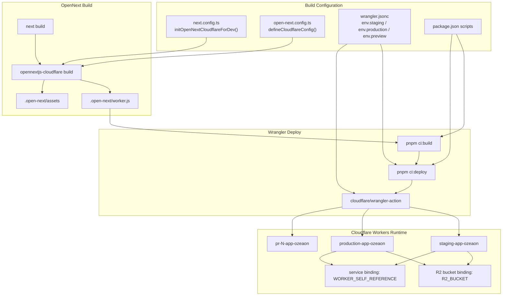
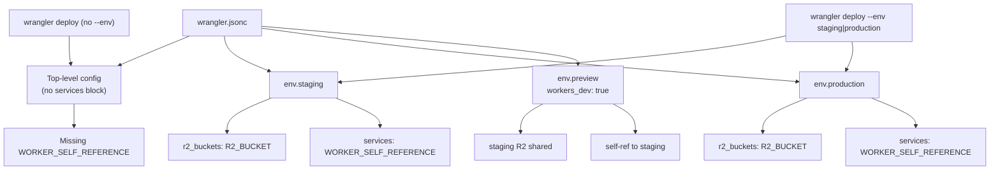
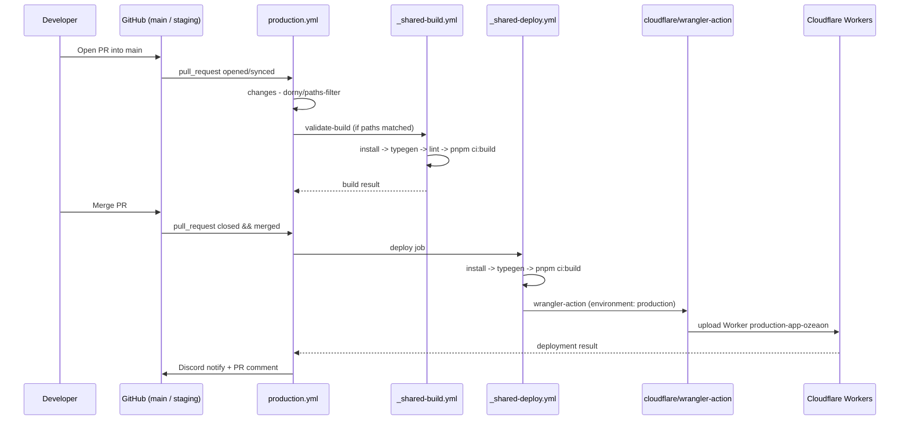
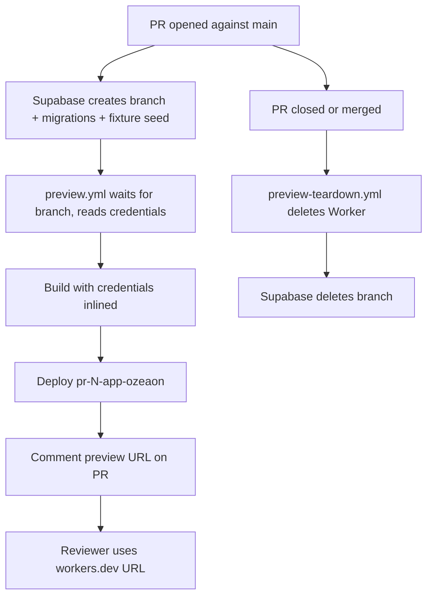

How the Ozeaon Next.js application is adapted to, built for, and deployed onto Cloudflare Workers using the `@opennextjs/cloudflare` adapter and the Wrangler CLI.

## Purpose and Scope

This page documents the **Cloudflare deployment pipeline**: how the Next.js 16 app is compiled into a Worker-compatible bundle via OpenNext, how that bundle is configured through `open-next.config.ts` and `wrangler.jsonc`, which npm scripts drive local preview and CI build/deploy, and the runtime constraints imposed by the Workers platform.

It covers:

- The OpenNext adapter surface (`defineCloudflareConfig`, overrides, the development hook).
- The `package.json` script contract (`ci:build`, `ci:deploy`, `preview`, `typegen`).
- Cloudflare binding requirements (`R2_BUCKET`, `WORKER_SELF_REFERENCE`) and the per-environment (`env.staging` / `env.production` / `env.preview`) configuration model.
- Why deployments must originate from GitHub Actions and never from a local machine.
- Worker runtime constraints (no Node.js APIs, `process.env` is build-time only, no long-running background tasks).
- The Durable Object export constraint that forces a Worker-per-PR preview strategy.

**Out of scope (sibling topics):**

- The GitHub Actions workflow graph itself (job ordering, reusability, notifications) belongs to the CI/CD workflow pages under operations. This page only describes the *build/deploy commands* those workflows invoke.
- Secrets provisioning conventions and environment-variable inventory belong to the Configuration / Environment pages.
- R2 object storage semantics and the `/api/storage` caching path belong to the storage pages; here R2 is only described as a deployment binding.
- Supabase branch-per-PR database mechanics belong to the Supabase pages; here the preview Worker flow is only referenced where it explains the deployment topology.

## Overview

Ozeaon is a Next.js App Router application. Cloudflare Workers is a V8-isolate runtime, not Node.js, so the Next.js server bundle cannot run on it directly. The **OpenNext** project (`@opennextjs/cloudflare`, pinned at `^1.20.6` in `package.json`) bridges the gap: it runs the Next.js build output through a transformation that produces a Worker entrypoint plus the assets and cache metadata the Worker needs.

Three artifacts define the deployment:

| Artifact | Role |
| --- | --- |
| `open-next.config.ts` | Declarative OpenNext configuration — selects optional cache/tag-cache/queue overrides. |
| `wrangler.jsonc` | Cloudflare resource topology — Worker name, per-environment bindings (R2, service bindings). |
| `package.json` scripts | The command contract that both developers and CI invoke (`ci:build`, `ci:deploy`, `preview`). |

The critical design decision is **CI-only deployment**. The repository explicitly forbids running the deploy command locally:

> ⚠️ **Deployment happens exclusively through GitHub Actions — never run `pnpm ci:deploy` from a local machine.** Merging to `staging` or `main` (or a manual `workflow_dispatch`) is the only supported path to a live environment; this keeps secrets off local machines and every deploy tied to a reviewed commit.

> Source: [ops-deployment.md](https://github.com/ozeaon/ozeaon-v2/blob/0a4f1a95824db87782f1221a4108019d174df3d9/docs/ops-deployment.md#L18-L20)

This means the script itself (`opennextjs-cloudflare deploy`) is intentionally left runnable, but is treated as a CI primitive: the repository's documentation states it exists "for reproducing a build failure locally, but not for deploying."

## Architecture

The following diagram shows how source configuration flows into the OpenNext build and then into Wrangler for upload to Cloudflare.



**Reading the diagram:**

- `next.config.ts` calls `initOpenNextCloudflareForDev()`, which wires the local `next dev` server against Cloudflare bindings (R2, KV, etc.) so that development and the deployed Worker see the same binding surface.
- `open-next.config.ts` is the adapter's declarative input. In this repository it is currently at **defaults** — every override is commented out.
- `opennextjs-cloudflare build` produces `.open-next/worker.js` and `.open-next/assets`; both are consumed by Wrangler.
- The three named Workers (`staging-app-ozeaon`, `production-app-ozeaon`, and `pr-<N>-app-ozeaon`) map to the `env.staging`, `env.production`, and `env.preview` blocks in `wrangler.jsonc`.

## OpenNext Configuration

`open-next.config.ts` is intentionally minimal. It is the single place where platform-specific cache and queue adapters are enabled, and the current state ships with all of them disabled:

```typescript
import { defineCloudflareConfig } from "@opennextjs/cloudflare";
// import r2IncrementalCache from "@opennextjs/cloudflare/overrides/incremental-cache/r2-incremental-cache";
// import d1NextTagCache from "@opennextjs/cloudflare/overrides/tag-cache/d1-next-tag-cache";
// import doQueue from "@opennextjs/cloudflare/overrides/queue/do-queue";

export default defineCloudflareConfig({
  // incrementalCache: r2IncrementalCache,
  // tagCache: d1NextTagCache,
  // queue: doQueue,
  // routePreloadingBehavior: "none",
});
```

> Source: [open-next.config.ts](https://github.com/ozeaon/ozeaon-v2/blob/0a4f1a95824db87782f1221a4108019d174df3d9/open-next.config.ts#L1-L11)

### Why the overrides are commented out

Each override corresponds to a distinct Cloudflare storage product that would otherwise be required:

| Override | Product it binds | Effect when enabled |
| --- | --- | --- |
| `incrementalCache` (`r2IncrementalCache`) | R2 | Stores ISR/fetch cache payloads in an R2 bucket instead of relying on defaults. |
| `tagCache` (`d1NextTagCache`) | D1 | Backs `revalidateTag()` tag invalidation with a D1 database. |
| `queue` (`doQueue`) | Durable Objects | Runs the revalidation queue on a Durable Object. |
| `routePreloadingBehavior` | — | Controls whether routes are preloaded at build time. |

Leaving them commented means the deployment runs with the adapter's built-in defaults and does **not** require D1 or a dedicated cache bucket to exist. This is a deliberate trade-off: fewer Cloudflare resources to provision, at the cost of the platform-native incremental cache.

Note that the Durable Object exports are still present in the built Worker regardless — `.open-next/worker.js` exports `DOQueueHandler`, `DOShardedTagCache`, and `BucketCachePurge` "even with every override in `open-next.config.ts` commented out."

> Source: [deployment-previews.md](https://github.com/ozeaon/ozeaon-v2/blob/0a4f1a95824db87782f1221a4108019d174df3d9/docs/deployment-previews.md#L22-L24)

This has a concrete operational consequence documented in the preview-deployment strategy (see [Preview Deployment Topology](#preview-deployment-topology) below).

### Design intent

The commented-out imports function as **documentation of the upgrade path**. When the project needs cross-instance cache sharing or tag-based revalidation at scale, an engineer uncomments the relevant lines and provisions the corresponding binding. The file is therefore a configuration *switchboard* rather than a live configuration.

Related forward-looking note in the repository: the project intends to adopt Next.js 16's `cacheComponents` model "when feature is stable with CloudFlare adapter."

> Source: [CLAUDE.md](https://github.com/ozeaon/ozeaon-v2/blob/0a4f1a95824db87782f1221a4108019d174df3d9/CLAUDE.md#L10)

## Build and Deploy Scripts

All Cloudflare interaction is funneled through a small set of `package.json` scripts. These are the exact commands CI invokes.

```json
"dev": "next dev",
"clean-cache": "rm -rf .next .turbo node_modules/.cache .open-next .wrangler",
"typegen": "next typegen && wrangler types --env-interface CloudflareEnv cloudflare-env.d.ts",
"build": "next build",
"preview": "opennextjs-cloudflare build && opennextjs-cloudflare preview --port 3000",
"ci:build": "opennextjs-cloudflare build",
"ci:deploy": "opennextjs-cloudflare deploy",
```

> Source: [package.json](https://github.com/ozeaon/ozeaon-v2/blob/0a4f1a95824db87782f1221a4108019d174df3d9/package.json#L8-L22)

| Script | Command | Purpose |
| --- | --- | --- |
| `dev` | `next dev` | Local dev server; Cloudflare bindings available via `initOpenNextCloudflareForDev()`. |
| `build` | `next build` | Plain Next.js build — **not** the Cloudflare artifact. |
| `preview` | `opennextjs-cloudflare build && opennextjs-cloudflare preview --port 3000` | Builds the Worker bundle and serves it locally on port 3000 through Wrangler's simulator. This is the closest local approximation of the deployed Worker. |
| `ci:build` | `opennextjs-cloudflare build` | Produces the deployable Worker bundle. This is the canonical "build" in CI; type errors surface here because the underlying `next build` runs inside it. |
| `ci:deploy` | `opennextjs-cloudflare deploy` | Uploads the Worker. **CI-only.** |
| `typegen` | `next typegen && wrangler types --env-interface CloudflareEnv cloudflare-env.d.ts` | Generates Next.js route types *and* the `CloudflareEnv` interface describing bindings. |
| `clean-cache` | `rm -rf .next .turbo node_modules/.cache .open-next .wrangler` | Purges every build artifact, including the OpenNext and Wrangler directories. |

### The `typegen` script and `CloudflareEnv`

`typegen` is the mechanism that gives the codebase type-safe access to Cloudflare bindings. `wrangler types --env-interface CloudflareEnv cloudflare-env.d.ts` reads `wrangler.jsonc` and emits a `cloudflare-env.d.ts` declaring the binding names and their types as the `CloudflareEnv` interface. Application code then reads bindings through that generated interface rather than through untyped casts.

This matters because `wrangler.jsonc` is the source of truth for bindings: change the binding in the JSONC, re-run `typegen`, and the mismatches become TypeScript errors. Any workflow that runs `ci:build` must run `typegen` first, which is exactly why every documented pipeline begins `install → typegen → lint → ci:build`.

### Cache directories

`clean-cache` names the two Cloudflare-specific build directories explicitly — `.open-next` and `.wrangler` — alongside the Next.js and Turborepo caches. Both are also excluded from ESLint (`.open-next/**`, `.wrangler/**`), confirming they are treated as generated, non-source trees.

> Source: [eslint.config.mjs](https://github.com/ozeaon/ozeaon-v2/blob/0a4f1a95824db87782f1221a4108019d174df3d9/eslint.config.mjs#L83-L84)

## Deployment Topology and Bindings

Cloudflare resources are declared per-environment in `wrangler.jsonc`. The documentation is explicit about which bindings matter and why the environment flag is mandatory:

> `wrangler.jsonc` defines `r2_buckets` and the `WORKER_SELF_REFERENCE` service binding per-environment under `env.staging` / `env.production`. If you ever do run `wrangler deploy` by hand for debugging, always pass `--env staging` or `--env production` — the top-level config has no `services` block, so omitting `--env` breaks `WORKER_SELF_REFERENCE`.

> Source: [ops-deployment.md](https://github.com/ozeaon/ozeaon-v2/blob/0a4f1a95824db87782f1221a4108019d174df3d9/docs/ops-deployment.md#L29-L32)

Two bindings carry real architectural weight:

- **`R2_BUCKET`** — the R2 bucket binding, used for object storage. It is configured as `R2_BUCKET` in `wrangler.jsonc`, and the documentation instructs provisioning it there rather than in the Cloudflare dashboard.
- **`WORKER_SELF_REFERENCE`** — a *service binding pointing at the Worker itself*. This is what lets a Worker request invoke another route on the same Worker through the normal fetch API. It is used for internal revalidation calls (`revalidateTag`), which is why the configuration must live inside the environment block.

### Why `--env` is not optional

Cloudflare's `wrangler deploy` serializes the top-level config merged with the selected `env.<name>` block. The top-level config deliberately has **no** `services` block, so `WORKER_SELF_REFERENCE` exists only inside `env.staging` / `env.production`. Deploying without `--env` produces a Worker with no self-reference binding — a failure that is silent at deploy time and only manifests when a code path tries to call back into the Worker.



### Worker naming

| Environment | Worker name | `wrangler.jsonc` block |
| --- | --- | --- |
| Staging | `staging-app-ozeaon` | `env.staging` |
| Production | `production-app-ozeaon` | `env.production` |
| Preview (per PR) | `pr-<N>-app-ozeaon` | `env.preview` |

> Source: [ops-deployment.md](https://github.com/ozeaon/ozeaon-v2/blob/0a4f1a95824db87782f1221a4108019d174df3d9/docs/ops-deployment.md#L71)

The `env.preview` configuration sets `workers_dev: true` and reuses staging's R2 bucket while self-referencing staging.

> Source: [deployment-previews.md](https://github.com/ozeaon/ozeaon-v2/blob/0a4f1a95824db87782f1221a4108019d174df3d9/docs/deployment-previews.md#L66)

## Core Flow: From Commit to Live Worker

Every supported deployment traverses the same path. The build and deploy commands are called by reusable GitHub Actions workflows (`_shared-build.yml`, `_shared-deploy.yml`), driven in turn by `production.yml` / `staging.yml`.



The `changes` gate is a `dorny/paths-filter` check that only triggers the build when the PR touches build-relevant paths: `src/**`, `next.config.ts`, `open-next.config.ts`, `package.json`, `pnpm-lock.yaml`, `tsconfig.json`, or `wrangler.jsonc`.

> Source: [ops-deployment.md](https://github.com/ozeaon/ozeaon-v2/blob/0a4f1a95824db87782f1221a4108019d174df3d9/docs/ops-deployment.md#L62-L63)

The **`deploy` job is strictly gated on `closed` + `merged == true`** — an unmerged close never deploys.

> Source: [ops-deployment.md](https://github.com/ozeaon/ozeaon-v2/blob/0a4f1a95824db87782f1221a4108019d174df3d9/docs/ops-deployment.md#L66-L67)

### Caching in the pipeline

Three caches are restored to keep `ci:build` fast:

- **pnpm store** — keyed on the `pnpm-lock.yaml` hash.
- **Next.js build** — `.next/cache`, `node_modules/.cache`, and (in the deploy job) `.open-next/cache`, keyed on lockfile hash + environment + source file hash with progressive fallbacks.
- **wrangler** — `~/.wrangler` and `node_modules/.cache/wrangler`, keyed on wrangler version + `wrangler.jsonc` hash.

> Source: [ops-deployment.md](https://github.com/ozeaon/ozeaon-v2/blob/0a4f1a95824db87782f1221a4108019d174df3d9/docs/ops-deployment.md#L106-L111)

The wrangler cache is keyed on `wrangler.jsonc` precisely because that file defines the binding surface; a binding change invalidates the cached Wrangler state. Similarly `.open-next/cache` is cached in the deploy job because the OpenNext transformation is the expensive step.

CI pins tool versions independently of local `package.json` ranges: pnpm `11.9.0`, Node `24.18.0`, Wrangler `4.114.0`.

> Source: [ops-deployment.md](https://github.com/ozeaon/ozeaon-v2/blob/0a4f1a95824db87782f1221a4108019d174df3d9/docs/ops-deployment.md#L113-L114)

## Runtime Constraints on Workers

Because the deploy target is V8 isolates rather than Node.js, the application code must obey hard platform rules. These are stated as deployment-time invariants:

> **Runtime constraints**: No Node.js APIs (`fs`, `path`, `Buffer`) at runtime. Use Web-standard APIs only (`fetch`, `Request`/`Response`, `crypto`). `process.env` is build-time only — use `src/config/env.ts`. No long-running background tasks.

> Source: [ops-deployment.md](https://github.com/ozeaon/ozeaon-v2/blob/0a4f1a95824db87782f1221a4108019d174df3d9/docs/ops-deployment.md#L38-L40)

Each constraint has a downstream implication:

| Constraint | Consequence | Mitigation in this repo |
| --- | --- | --- |
| No `fs` / `path` / `Buffer` | File-system access and Node buffer manipulation fail at runtime, even if they compile. | Use Web APIs (`fetch`, `Request`/`Response`, `crypto`). |
| `process.env` is build-time only | Env vars are inlined at build time, not read at request time. | All env access goes through `src/config/env.ts`, which is validated at build time. |
| No long-running background tasks | Work cannot outlive the request that spawned it. | Deferred work must be dispatched to a durable mechanism rather than fired-and-forgotten. |

### Build-time environment validation

Environment variables are declared and validated at build time via `src/config/env.ts`. The required set documented for `.env.local` is:

```dotenv
NEXT_PUBLIC_SUPABASE_URL=
NEXT_PUBLIC_SUPABASE_PUBLISHABLE_KEY=
SUPABASE_SERVICE_ROLE_KEY=
RESEND_API_KEY=
RESEND_SENDER_EMAIL=
NEXT_PUBLIC_STORAGE_URL=
```

> Source: [ops-deployment.md](https://github.com/ozeaon/ozeaon-v2/blob/0a4f1a95824db87782f1221a4108019d174df3d9/docs/ops-deployment.md#L7-L14)

Because `process.env` values are inlined into the bundle by the build, a misconfigured variable is a **build failure**, not a runtime 500. This is an intentional fail-fast design: the `ci:build` step in `_shared-deploy.yml` runs "with real environment vars/secrets injected", so a missing secret prevents the deploy rather than producing a broken Worker.

> Source: [ops-deployment.md](https://github.com/ozeaon/ozeaon-v2/blob/0a4f1a95824db87782f1221a4108019d174df3d9/docs/ops-deployment.md#L96)

### Secrets are injected at build, not read from the dashboard

Environment variables and secrets are set per environment in the GitHub repository (**Settings → Environments**), not in the Cloudflare dashboard, because "the workflows below inject them at build/deploy time."

> Source: [ops-deployment.md](https://github.com/ozeaon/ozeaon-v2/blob/0a4f1a95824db87782f1221a4108019d174df3d9/docs/ops-deployment.md#L34-L36)

The `CLOUDFLARE_API_TOKEN` used by the deploy requires the **Workers Scripts (Edit)** and **Account Settings (Read)** permissions.

> Source: [ops-deployment.md](https://github.com/ozeaon/ozeaon-v2/blob/0a4f1a95824db87782f1221a4108019d174df3d9/docs/ops-deployment.md#L128)

## Preview Deployment Topology

The preview strategy is the most instructive part of this deployment design, because it is driven directly by a constraint of the OpenNext Worker bundle.

> Every PR into `main` gets its own Worker and its own database.

> Source: [deployment-previews.md](https://github.com/ozeaon/ozeaon-v2/blob/0a4f1a95824db87782f1221a4108019d174df3d9/docs/deployment-previews.md#L3)

| | |
| --- | --- |
| URL | `https://pr-<N>-app-ozeaon.joseph-400.workers.dev` |
| Login | `alpha@ozeaon.com` … `tango@ozeaon.com` (20 accounts) — password `ozeaon-preview` |
| Lifetime | created on open, destroyed on close or merge |

> Source: [deployment-previews.md](https://github.com/ozeaon/ozeaon-v2/blob/0a4f1a95824db87782f1221a4108019d174df3d9/docs/deployment-previews.md#L5-L9)

### Why a Worker per PR instead of a Worker version

This is the key architectural insight:

> Cloudflare mints no preview URL for a Worker exporting a Durable Object. `.open-next/worker.js` exports three (`DOQueueHandler`, `DOShardedTagCache`, `BucketCachePurge`) even with every override in `open-next.config.ts` commented out. Uploads succeed silently and no URL is ever created.

> Source: [deployment-previews.md](https://github.com/ozeaon/ozeaon-v2/blob/0a4f1a95824db87782f1221a4108019d174df3d9/docs/deployment-previews.md#L22-L24)

Because the OpenNext bundle **always** exports Durable Object classes, Cloudflare's version-based preview mechanism cannot be used — it produces no preview URL. Uploads succeed without error but remain unreachable. The workaround is to deploy a *separate Worker* per PR, which is exempt from this limitation: "Deployed Workers are exempt — staging exports the same three."

> Source: [deployment-previews.md](https://github.com/ozeaon/ozeaon-v2/blob/0a4f1a95824db87782f1221a4108019d174df3d9/docs/deployment-previews.md#L26)



Roughly seven minutes end-to-end.

> Source: [deployment-previews.md](https://github.com/ozeaon/ozeaon-v2/blob/0a4f1a95824db87782f1221a4108019d174df3d9/docs/deployment-previews.md#L18)

### Per-deploy secret injection

> Secrets are written in full per deploy — a new Worker inherits none.

> Source: [deployment-previews.md](https://github.com/ozeaon/ozeaon-v2/blob/0a4f1a95824db87782f1221a4108019d174df3d9/docs/deployment-previews.md#L69)

This is a direct consequence of the Worker-per-PR model: each preview is a freshly created Worker with no inherited configuration, so **every** secret must be re-written on every deploy. The preview-specific overrides are:

| Variable | Purpose |
| --- | --- |
| `PREVIEW_RESEND_API_KEY` | Separate from production's key — previews **send real mail**. |
| `PREVIEW_MAILCHIMP_*` | Left unset so mailing-list writes fail rather than touching the live audience. |
| `PREVIEW_ACCESS_TOKEN` | Overrides the signup gate token (`ACCESS_TOKEN`); defaults to `ozeaon-preview`. |
| `PREVIEW_OPENAI_API_KEY` | Prevents previews from spending production's moderation quota; falls back to `OPENAI_API_KEY` if unset. |

> Source: [deployment-previews.md](https://github.com/ozeaon/ozeaon-v2/blob/0a4f1a95824db87782f1221a4108019d174df3d9/docs/deployment-previews.md#L69-L77)

### Preview gotchas that constrain deployment behavior

- **Seeds run at branch creation.** Editing the fixture requires recreating the branch (close and reopen the PR).
- **`revalidateTag` from a preview hits staging's code**, via `WORKER_SELF_REFERENCE` — and a self-reference cannot be created before the Worker exists.
- **R2 is shared with staging**, so uploads persist after teardown.
- **Branch limit is 10**; approximately `$0.013`/branch-hour.

> Source: [deployment-previews.md](https://github.com/ozeaon/ozeaon-v2/blob/0a4f1a95824db87782f1221a4108019d174df3d9/docs/deployment-previews.md#L81-L85)

The `WORKER_SELF_REFERENCE` ordering constraint is the most subtle: the service binding in `env.preview` points at staging, and this binding is what routes preview revalidation into staging. Because a self-reference cannot be created before the referenced Worker exists, the binding ordering is load-bearing for correctness of cache invalidation.

The fixture-emptiness assertion in `preview.yml` is also deployment-relevant: because "Credentials still resolve and the build still succeeds", an empty database would otherwise deploy silently. The workflow "asserts a few tables are non-empty and fails instead," with an escape hatch label `preview:allow-empty-db`.

> Source: [deployment-previews.md](https://github.com/ozeaon/ozeaon-v2/blob/0a4f1a95824db87782f1221a4108019d174df3d9/docs/deployment-previews.md#L37-L44)

## Configuration Reference

### `open-next.config.ts` options

Passed to `defineCloudflareConfig()` from `@opennextjs/cloudflare`. All options are currently commented out (defaults active).

| Option | Type | Default (current) | Description |
| --- | --- | --- | --- |
| `incrementalCache` | adapter | *disabled* | OpenNext incremental cache implementation. `r2IncrementalCache` would back it with R2. |
| `tagCache` | adapter | *disabled* | Tag-based revalidation store. `d1NextTagCache` would back it with D1. |
| `queue` | adapter | *disabled* | Revalidation queue. `doQueue` would run it on a Durable Object. |
| `routePreloadingBehavior` | `"none"` \| string | *disabled* | Controls build-time route preloading. |

> Source: [open-next.config.ts](https://github.com/ozeaon/ozeaon-v2/blob/0a4f1a95824db87782f1221a4108019d174df3d9/open-next.config.ts#L1-L11)

### `next.config.ts` integration

`next.config.ts` imports `initOpenNextCloudflareForDev` from `@opennextjs/cloudflare`, which attaches Cloudflare bindings to the local Next.js dev server so that `pnpm dev` matches the deployed runtime's binding availability.

> Source: [next.config.ts](https://github.com/ozeaon/ozeaon-v2/blob/0a4f1a95824db87782f1221a4108019d174df3d9/next.config.ts#L1)

### Environment configuration

| Variable | Scope | Notes |
| --- | --- | --- |
| `NEXT_PUBLIC_SUPABASE_URL` | GitHub Environment variable | Public Supabase endpoint. |
| `NEXT_PUBLIC_SUPABASE_PUBLISHABLE_KEY` | GitHub Environment variable | Public Supabase key. |
| `SUPABASE_SERVICE_ROLE_KEY` | GitHub Environment secret | Server-side Supabase key. |
| `RESEND_API_KEY` | GitHub Environment secret | Email provider key. |
| `RESEND_SENDER_EMAIL` | GitHub Environment secret | Email sender address. |
| `NEXT_PUBLIC_STORAGE_URL` | `.env.local` | Storage URL. |
| `NEXT_PUBLIC_BASE_URL` | GitHub Environment variable | e.g. `https://staging.ozeaon.com`. |
| `CLOUDFLARE_API_TOKEN` | GitHub Environment secret | Needs Workers Scripts (Edit) + Account Settings (Read). |
| `CLOUDFLARE_ACCOUNT_ID` | GitHub Environment secret | Cloudflare account identifier. |
| `DISCORD_WEBHOOK_URL` | Repo-level secret | Notifications; `continue-on-error` and silently skipped when unset. |

Sources: [ops-deployment.md](https://github.com/ozeaon/ozeaon-v2/blob/0a4f1a95824db87782f1221a4108019d174df3d9/docs/ops-deployment.md#L7-L14), [ops-deployment.md](https://github.com/ozeaon/ozeaon-v2/blob/0a4f1a95824db87782f1221a4108019d174df3d9/docs/ops-deployment.md#L126-L139)

### Cloudflare bindings

| Binding | Kind | Declared in | Purpose |
| --- | --- | --- | --- |
| `R2_BUCKET` | `r2_buckets` | `wrangler.jsonc` → `env.*` | Object storage (uploads, imagery). |
| `WORKER_SELF_REFERENCE` | `services` | `wrangler.jsonc` → `env.*` | Lets the Worker fetch its own routes, used for `revalidateTag` internal calls. |
| `CloudflareEnv` | generated TS interface | `cloudflare-env.d.ts` (via `wrangler types`) | Type surface for all bindings. |

Sources: [ops-deployment.md](https://github.com/ozeaon/ozeaon-v2/blob/0a4f1a95824db87782f1221a4108019d174df3d9/docs/ops-deployment.md#L29-L32), [package.json](https://github.com/ozeaon/ozeaon-v2/blob/0a4f1a95824db87782f1221a4108019d174df3d9/package.json#L18)

### Tool versions

| Tool | Version | Pinned where |
| --- | --- | --- |
| pnpm | `11.9.0` | Workflow `env:` blocks |
| Node.js | `24.18.0` | Workflow `env:` blocks |
| Wrangler | `4.114.0` | Workflow `env:` blocks |
| `@opennextjs/cloudflare` | `^1.20.6` | `package.json` dependencies |

Sources: [ops-deployment.md](https://github.com/ozeaon/ozeaon-v2/blob/0a4f1a95824db87782f1221a4108019d174df3d9/docs/ops-deployment.md#L113-L114), [package.json](https://github.com/ozeaon/ozeaon-v2/blob/0a4f1a95824db87782f1221a4108019d174df3d9/package.json#L37)

## API Reference (Script Contracts)

### `pnpm ci:build`

Runs `opennextjs-cloudflare build`. This is the canonical Cloudflare build. It drives the underlying `next build` and then the OpenNext transformation, emitting `.open-next/worker.js` and `.open-next/assets`.

**Prerequisite:** `pnpm typegen` must run first so that `cloudflare-env.d.ts` reflects the current binding set.

**Type errors**: they surface here via the embedded `next build`.

> Source: [package.json](https://github.com/ozeaon/ozeaon-v2/blob/0a4f1a95824db87782f1221a4108019d174df3d9/package.json#L21)

### `pnpm ci:deploy`

Runs `opennextjs-cloudflare deploy`. Uploads the Worker produced by `ci:build`.

**Warning:** Do not run locally. Reserved for `cloudflare/wrangler-action` inside `_shared-deploy.yml`. Running it by hand for debugging requires passing `--env staging` or `--env production`, otherwise `WORKER_SELF_REFERENCE` is silently omitted.

> Source: [package.json](https://github.com/ozeaon/ozeaon-v2/blob/0a4f1a95824db87782f1221a4108019d174df3d9/package.json#L22)

### `pnpm preview`

Runs `opennextjs-cloudflare build && opennextjs-cloudflare preview --port 3000`. Builds the Worker bundle and starts Wrangler's local runtime simulator on port 3000 — the closest local equivalent to the deployed Worker.

> Source: [package.json](https://github.com/ozeaon/ozeaon-v2/blob/0a4f1a95824db87782f1221a4108019d174df3d9/package.json#L20)

### `pnpm typegen`

Runs `next typegen && wrangler types --env-interface CloudflareEnv cloudflare-env.d.ts`. Generates Next.js route types and the `CloudflareEnv` interface from `wrangler.jsonc`.

**Note:** `typegen` is *not* the same as `db:gen`. Regenerating Supabase types requires `pnpm db:gen`, which runs the schema generator and `supabase gen types`.

> `pnpm db:gen` (not `typegen` — that regenerates Next.js route types + Cloudflare env types, unrelated to the DB schema)

> Source: [ops-deployment.md](https://github.com/ozeaon/ozeaon-v2/blob/0a4f1a95824db87782f1221a4108019d174df3d9/docs/ops-deployment.md#L160-L161)

### `pnpm clean-cache`

Runs `rm -rf .next .turbo node_modules/.cache .open-next .wrangler`. Removes all build output including the OpenNext and Wrangler state directories.

> Source: [package.json](https://github.com/ozeaon/ozeaon-v2/blob/0a4f1a95824db87782f1221a4108019d174df3d9/package.json#L17)

## Failure Modes and Operational Notes

### Deployment failed

The documented first step is to inspect the failing workflow run's step summary: `staging.yml` / `production.yml` write rollback instructions (`git revert` + push) directly into `$GITHUB_STEP_SUMMARY` on failure.

> **Never attempt to deploy manually as a workaround — fix forward with a new commit and let CI redeploy.**

> Source: [ops-deployment.md](https://github.com/ozeaon/ozeaon-v2/blob/0a4f1a95824db87782f1221a4108019d174df3d9/docs/ops-deployment.md#L165-L167)

Note the rollback mechanism: **`git revert` + push to trigger CI**, not `wrangler rollback`. Because the only supported deploy path is CI, the only supported rollback path is also CI.

### Build errors

```
pnpm clean-cache && rm -rf node_modules pnpm-lock.yaml && pnpm install
```

> Source: [ops-deployment.md](https://github.com/ozeaon/ozeaon-v2/blob/0a4f1a95824db87782f1221a4108019d174df3d9/docs/ops-deployment.md#L158)

### Environment-specific failure symptoms

| Symptom | Likely cause | Resolution |
| --- | --- | --- |
| Worker deployed but `revalidateTag` fails | Deployed without `--env`, so no `WORKER_SELF_REFERENCE` binding. | Redeploy with `--env staging`/`--env production`. |
| Preview deploy has no URL | Not applicable to per-PR Workers — this is why version-based previews are not used. | Deploy a separate Worker per PR (current approach). |
| Preview pages empty but build succeeded | Fixture out of date relative to a migration. | Update `seeds/10-preview-fixture.sql`, or label `preview:allow-empty-db`. |
| Build fails on env access | `process.env` inlined at build time; missing/invalid var. | Fix the GitHub Environment variable/secret; validation runs via `src/config/env.ts`. |
| `revalidateTag` from preview affects staging | Expected — `env.preview` self-references staging. | By design. |

### Known limitations

- **PR comment on merge** relies on the workflow's own `pull_request` event context, not commit-message parsing — safe for squash merges.
- **Performance report** only counts `completed` runs from the last 7 days; a quiet week produces a "no data" summary rather than an error.
- **Backmerge conflicts** are never resolved automatically — a labelled PR is opened against the target branch for manual resolution, and re-running won't duplicate it while that branch still exists.

> Source: [ops-deployment.md](https://github.com/ozeaon/ozeaon-v2/blob/0a4f1a95824db87782f1221a4108019d174df3d9/docs/ops-deployment.md#L145-L152)

### Preview lifecycle risks

- **Secret divergence risk**: because a new preview Worker "inherits none," a secret added to production but forgotten in the preview list is silently absent.
- **Real email side effect**: previews use `PREVIEW_RESEND_API_KEY`, so "whatever address you type in a sign-up or invite gets a real message."
- **Storage leakage**: previews share staging's R2 bucket, so "uploads persist after teardown."
- **Cost ceiling**: branch limit is 10 at ~`$0.013`/branch-hour.

> Sources: [deployment-previews.md](https://github.com/ozeaon/ozeaon-v2/blob/0a4f1a95824db87782f1221a4108019d174df3d9/docs/deployment-previews.md#L69-L85)

## Extension Points

| Extension | How |
| --- | --- |
| Enable R2-backed incremental cache | Uncomment `r2IncrementalCache` import and the `incrementalCache` property in `open-next.config.ts`; provision the R2 binding. |
| Enable D1-backed tag cache | Uncomment `d1NextTagCache` and set `tagCache`; provision the D1 binding. |
| Enable Durable Object queue | Uncomment `doQueue` and set `queue`. |
| Disable route preloading | Set `routePreloadingBehavior: "none"`. |
| Adopt Next.js 16 `cacheComponents` | Planned once the Cloudflare adapter stabilizes (see `CLAUDE.md`). |
| Add a new environment | Add an `env.<name>` block to `wrangler.jsonc`, re-run `pnpm typegen`, add the GitHub Environment, and extend `_shared-deploy.yml`'s environment choice. |
| Add a new binding | Declare it in `wrangler.jsonc` under the relevant `env.*` block, then re-run `pnpm typegen` — the regenerated `CloudflareEnv` makes mismatches compile-time errors. |

> Sources: [open-next.config.ts](https://github.com/ozeaon/ozeaon-v2/blob/0a4f1a95824db87782f1221a4108019d174df3d9/open-next.config.ts#L1-L11), [package.json](https://github.com/ozeaon/ozeaon-v2/blob/0a4f1a95824db87782f1221a4108019d174df3d9/package.json#L18), [CLAUDE.md](https://github.com/ozeaon/ozeaon-v2/blob/0a4f1a95824db87782f1221a4108019d174df3d9/CLAUDE.md#L10)

## Related Links

- [Environment, Deployment & Troubleshooting](https://github.com/ozeaon/ozeaon-v2/blob/0a4f1a95824db87782f1221a4108019d174df3d9/docs/ops-deployment.md) — the authoritative operations document this page is derived from.
- [Preview Deployments](https://github.com/ozeaon/ozeaon-v2/blob/0a4f1a95824db87782f1221a4108019d174df3d9/docs/deployment-previews.md) — Worker-per-PR topology and its platform constraints.
- [Workflows: Build for Cloudflare](https://github.com/ozeaon/ozeaon-v2/blob/0a4f1a95824db87782f1221a4108019d174df3d9/docs/workflows.md#L136) — workflow-level build guidance.
- [Logging Conventions](https://github.com/ozeaon/ozeaon-v2/blob/0a4f1a95824db87782f1221a4108019d174df3d9/docs/logging-conventions.md#L106-L107) — how the Cloudflare Workers runtime sink formats console output.
- [R2 Storage](https://github.com/ozeaon/ozeaon-v2/blob/0a4f1a95824db87782f1221a4108019d174df3d9/docs/r2-storage.md#L25-L26) — storage semantics for the `R2_BUCKET` binding.
- [open-next.config.ts](https://github.com/ozeaon/ozeaon-v2/blob/0a4f1a95824db87782f1221a4108019d174df3d9/open-next.config.ts) — the OpenNext switchboard.
- [next.config.ts](https://github.com/ozeaon/ozeaon-v2/blob/0a4f1a95824db87782f1221a4108019d174df3d9/next.config.ts) — `initOpenNextCloudflareForDev()` wiring.
- [package.json](https://github.com/ozeaon/ozeaon-v2/blob/0a4f1a95824db87782f1221a4108019d174df3d9/package.json#L8-L27) — the script contract.
- [eslint.config.mjs](https://github.com/ozeaon/ozeaon-v2/blob/0a4f1a95824db87782f1221a4108019d174df3d9/eslint.config.mjs#L83-L84) — ignored generated directories.
