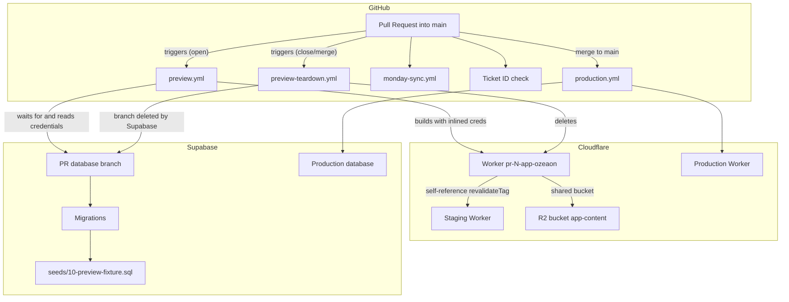
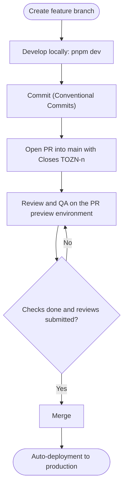
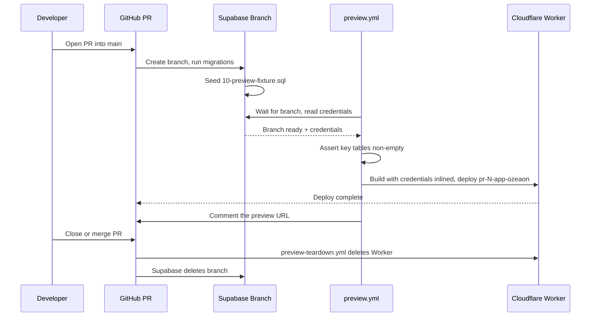
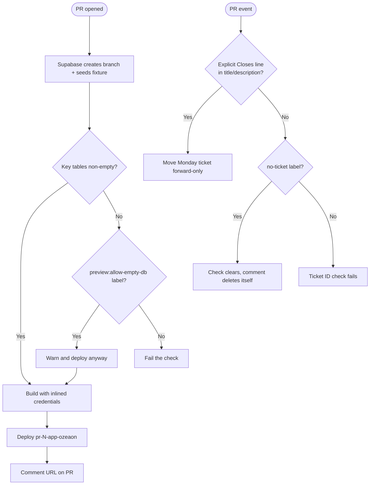

The ozeaon-v2 repository uses GitHub Actions together with Cloudflare Workers and Supabase branching to build, preview, and ship every change — every pull request into `main` gets its own Worker and its own isolated database.

## Purpose and Scope

This page documents the continuous integration and continuous delivery system of ozeaon-v2 end-to-end:

- The branch / PR / merge deployment flow and commit conventions it relies on
- The Monday ticket-linking automation and the **Ticket ID** status check
- The per-PR **preview deployment** lifecycle: how a Worker and a Supabase branch are created, seeded, deployed, and torn down
- The preview database fixture strategy and its migration-drift guard
- The configuration surfaces that drive these workflows (`wrangler.jsonc`, seed files, deployment commands)

It intentionally does **not** cover:

- Runtime environment/secrets provisioning and general operational troubleshooting — see the deployment and environment operations page (source: `docs/ops-deployment.md`)
- Supabase local development beyond the reset commands used by previews — see `docs/supabase-local.md`
- Application-level rendering/caching behavior — see the SSR rendering documentation

## Overview

The pipeline is built around three ideas:

1. **One environment per pull request.** Rather than sharing a staging mutable environment, each PR provisions a dedicated Cloudflare Worker named `pr-<N>-app-ozeaon` and a dedicated Supabase database branch. This makes QA on a PR side-effect-free relative to staging.
2. **Branch-scoped branching on both sides.** Git branches are mirrored by Supabase database branches, so schema changes ship with the code that needs them and are validated before merge.
3. **Deterministic, synthetic seed data.** Previews are seeded from a *committed fixture*, not from a dump of real data, because the real-data dump is gitignored and therefore invisible to the Supabase GitHub integration.

The primary workflow files are declared in the repository configuration:

| File | Purpose |
| --- | --- |
| `.github/workflows/preview.yml` | Build and deploy a per-PR Worker |
| `.github/workflows/preview-teardown.yml` | Delete the Worker on PR close or merge |
| `.github/workflows/monday-sync.yml` | Link PRs to Monday items and advance their status |
| `.github/workflows/staging.yml` | Staging deployment (badge in `README.md`) |
| `.github/workflows/production.yml` | Production deployment (badge in `README.md`) |
| `.github/CODEOWNERS` | Review enforcement for `src/`, `supabase/`, `.github/workflows/` |
| `.github/scripts/monday-ticket.mjs` | Shared ticket-parsing logic for the Monday sync jobs |

> Source: [workflows.md](https://github.com/ozeaon/ozeaon-v2/blob/0a4f1a95824db87782f1221a4108019d174df3d9/docs/workflows.md#L69-L70)

The README surfaces the CI status as badges, linking to the two long-lived environment workflows:

```markdown
[](https://github.com/ozeaon/ozeaon-v2/actions/workflows/staging.yml) [](https://github.com/ozeaon/ozeaon-v2/actions/workflows/production.yml)
```

> Source: [README.md](https://github.com/ozeaon/ozeaon-v2/blob/0a4f1a95824db87782f1221a4108019d174df3d9/README.md#L7)

## Architecture

The system spans GitHub, Cloudflare, and Supabase. Each actor owns one part of the lifecycle, and the workflow files are the glue that sequences them.



**Why this topology.** Previews cannot be implemented as *versions* of an existing Worker: Cloudflare mints no preview URL for a Worker that exports a Durable Object, and `.open-next/worker.js` exports three (`DOQueueHandler`, `DOShardedTagCache`, `BucketCachePurge`). Therefore each PR gets a whole Worker deployed under its own `workers_dev` hostname. Because each preview is a freshly created Worker, it inherits no secrets — every secret must be written in full on each deploy.

> Source: [deployment-previews.md](https://github.com/ozeaon/ozeaon-v2/blob/0a4f1a95824db87782f1221a4108019d174df3d9/docs/deployment-previews.md#L20-L26)

## Development & Deployment Flow

The everyday workflow is a linear path from a feature branch to production, with QA happening on the PR's own preview environment before merge.



The documented sequence is explicit about the QA step happening *before* merge, on the preview environment rather than on staging:

1. Create feature branch: `feat/feature-name`, `feat/tozn-051`
2. Develop locally: `pnpm dev`
3. Commit with Conventional Commits format
4. Push → Create PR to `main`, with `Closes TOZN-<n>` in the title or description
5. Review and QA on the PR's own preview environment
6. After checks done and reviews submitted → Merge
7. Auto-deployment to production

> Source: [workflows.md](https://github.com/ozeaon/ozeaon-v2/blob/0a4f1a95824db87782f1221a4108019d174df3d9/docs/workflows.md#L5-L13)

### Commit Conventions

Commits follow Conventional Commits, and the type directly determines semantic-versioning behavior:

```
<type>(<scope>): <description>

[optional body]

[optional footer]
```

| Type | Meaning | Version impact |
| --- | --- | --- |
| `feat` | New feature | Minor version bump |
| `fix` | Bug fix | Patch version bump |
| `docs` | Documentation only | — |
| `chore` | Maintenance | — |
| `ci` | CI/CD changes | — |
| `refactor` | Code improvement | — |

> Source: [workflows.md](https://github.com/ozeaon/ozeaon-v2/blob/0a4f1a95824db87782f1221a4108019d174df3d9/docs/workflows.md#L15-L35)

A representative commit message from the documentation, showing the body and footer convention:

```
feat(auth): add Google OAuth login

Implements OAuth2 flow with Google provider.
Uses @supabase/ssr for server-side auth.

Closes #123
```

> Source: [workflows.md](https://github.com/ozeaon/ozeaon-v2/blob/0a4f1a95824db87782f1221a4108019d174df3d9/docs/workflows.md#L38-L45)

Note the important caveat: the `Closes #123` footer is **GitHub issue syntax and is unrelated to Monday ticket linking** — the Monday automation never reads commit messages, only the PR title and description.

> Source: [workflows.md](https://github.com/ozeaon/ozeaon-v2/blob/0a4f1a95824db87782f1221a4108019d174df3d9/docs/workflows.md#L78)

### Branch Naming

| Pattern | Use |
| --- | --- |
| `feat/short-description` | New features |
| `feat/tozn-051` | Ticket-related feature, for human legibility only |
| `fix/issue-number-description` | Bug fixes |
| `chore/task-description` | Maintenance |
| `release/v1.2.0` | Release preparation |

> Source: [workflows.md](https://github.com/ozeaon/ozeaon-v2/blob/0a4f1a95824db87782f1221a4108019d174df3d9/docs/workflows.md#L47-L53)

The ticket ID in the branch name is deliberately **not** consumed by automation — it exists for human readability. Ticket linking requires an explicit closes line in the PR title or description.

### PR Requirements and the Enforcement Gap

| # | Requirement |
| --- | --- |
| 1 | **Title** matches the commit format |
| 2 | **Description** covers what changed, why, and how to test |
| 3 | **Ticket**: `Closes TOZN-<n>` or `Closes BOZN-<n>` in title/description, or the `no-ticket` label |
| 4 | **Tags**: relevant metadata tags added |
| 5 | **Review**: a Code Owner's approval, required for `src/`, `supabase/` and `.github/workflows/` by `.github/CODEOWNERS` |
| 6 | **Checks**: no status check is required on `main` yet |

> Source: [workflows.md](https://github.com/ozeaon/ozeaon-v2/blob/0a4f1a95824db87782f1221a4108019d174df3d9/docs/workflows.md#L55-L65)

Two documented limitations are worth highlighting because they shape operational risk:

- **No approval count is enforced by branch protection**, so a PR touching none of the CODEOWNERS paths can merge unreviewed.
- **No required status check on `main`**, so a red check blocks nothing — engineers must read them before merging. The preview workflow's own assertions (see below) are therefore advisory in the merge sense, even though they gate the preview deploy.

## Monday Ticket Automation

`.github/workflows/monday-sync.yml` links a PR to its Monday item and moves that item forward as the PR progresses. The link-detection rule lives in `.github/scripts/monday-ticket.mjs`, which **both jobs in the workflow share** — a single source of truth for what counts as a linked ticket.

> Source: [workflows.md](https://github.com/ozeaon/ozeaon-v2/blob/0a4f1a95824db87782f1221a4108019d174df3d9/docs/workflows.md#L69-L70)

### Link Detection Rules

A ticket is linked only by an explicit closes line in the PR **title or description**:

| Behavior | Example |
| --- | --- |
| **Links** | `Closes TOZN-402`, `closes bozn-235`, several in one PR |
| **Ignored** | an id in the branch name; a bare id with no `Closes`; anything inside backticks or a fenced block |
| **Not read at all** | commit messages — the `Closes #123` footer is unrelated GitHub issue syntax |

> Source: [workflows.md](https://github.com/ozeaon/ozeaon-v2/blob/0a4f1a95824db87782f1221a4108019d174df3d9/docs/workflows.md#L72-L78)

The backtick/fenced-block exclusion exists for a specific, documented reason: **a description explaining the rule in prose once moved five live tickets**. Ids in code spans are ignored so that documenting the syntax cannot itself trigger real board mutations. This is a defensive design against self-referential side effects.

> Source: [workflows.md](https://github.com/ozeaon/ozeaon-v2/blob/0a4f1a95824db87782f1221a4108019d174df3d9/docs/workflows.md#L80-L81)

### Status Transition Matrix

The automation maintains two boards — Tasks and Bugs Queue — with different target columns:

| Event | Tasks | Bugs Queue |
| --- | --- | --- |
| PR opened, reopened or marked ready | Code Review | Code Review |
| One approving review | QA | QA |
| Open PR turned back into a draft | Dev In Progress | Fixing |
| Merged | Done | Fixed |

> Source: [workflows.md](https://github.com/ozeaon/ozeaon-v2/blob/0a4f1a95824db87782f1221a4108019d174df3d9/docs/workflows.md#L85-L90)

**Moves are forward-only** along that order, so an edit, a reopen, or a second approval cannot drag a ticket back out of QA. The single exception is the draft return, and it applies **only while the ticket is still in Code Review**. Bug tickets additionally get the PR URL written into their GitHub Link field.

> Source: [workflows.md](https://github.com/ozeaon/ozeaon-v2/blob/0a4f1a95824db87782f1221a4108019d174df3d9/docs/workflows.md#L92-L94)

### Reporting and the Allowed Status Set

Each move is reported bidirectionally:

- The ticket's **Updates feed** receives the PR link, what happened, and who did it.
- The **PR** gets a comment naming the ticket, the column it landed in, and the board it is on — so the developer sees where the ticket went without opening Monday.

A run that moves nothing reports nothing in either place, avoiding noise.

> Source: [workflows.md](https://github.com/ozeaon/ozeaon-v2/blob/0a4f1a95824db87782f1221a4108019d174df3d9/docs/workflows.md#L96-L99)

The automation will only move a ticket already inside the dev pipeline — **Dev In Progress**, **Fixing**, **Code Review**, **QA**, **Done**, or **Fixed** — and it will also pull one in from **Ready for Dev**, a column both boards carry. Picking a ticket up should mean moving it to Dev In Progress (or Fixing) manually; the Ready for Dev entry is a safety net so that opening the PR takes the ticket to Code Review from wherever it sits, rather than leaving it in the backlog while its work goes through review.

**Every other status is left exactly as it is, including on merge**, and the run logs a warning saying so. That covers Backlog, Stuck, Change Request, Phase 2, Clarification, the design track's own states, and a closed bug — plus any status added to either board later, which defaults to untouched.

> Source: [workflows.md](https://github.com/ozeaon/ozeaon-v2/blob/0a4f1a95824db87782f1221a4108019d174df3d9/docs/workflows.md#L101-L112)

### The Monday Token: A Documented Exposure

The sync job runs with `MONDAY_API_TOKEN` in its environment on every PR event. The documentation is candid about the security trade-off:

> A same-repo PR runs its **own** copy of the workflow file, so anyone with push access can already run code with that token without review — pinning the checkout to the base commit does not change that, and would stop the workflow running on any PR that edits `monday-ticket.mjs`. Closing it properly means moving the sync to `pull_request_target`, which always executes the base branch's copy. Until then the exposure is bounded by keeping the token scoped to the two boards.

> Source: [workflows.md](https://github.com/ozeaon/ozeaon-v2/blob/0a4f1a95824db87782f1221a4108019d174df3d9/docs/workflows.md#L116-L121)

This is an important design-intent note: the mitigation is **least-privilege token scoping**, not workflow restructuring, because the clean fix (`pull_request_target`) would break the ability to test changes to the parsing script itself.

### The Ticket ID Check

A PR with no closes line fails the **Ticket ID** check, which posts a comment explaining the failure. Applying the `no-ticket` label for work that genuinely has no ticket (CI, docs, chores) clears the check **immediately, with no new commit required**, and the comment deletes itself. Draft PRs and bot PRs are skipped entirely.

> Source: [workflows.md](https://github.com/ozeaon/ozeaon-v2/blob/0a4f1a95824db87782f1221a4108019d174df3d9/docs/workflows.md#L123-L127)

## Preview Deployment Lifecycle

Every PR into `main` gets its own Worker **and** its own database. The service level is deliberately self-contained:

| Aspect | Value |
| --- | --- |
| URL | `https://pr-<N>-app-ozeaon.joseph-400.workers.dev` |
| Login | `alpha@ozeaon.com` … `tango@ozeaon.com` (20 accounts) — password `ozeaon-preview` |
| Lifetime | created on open, destroyed on close or merge |
| Wall-clock cost | roughly 7 minutes |

> Source: [deployment-previews.md](https://github.com/ozeaon/ozeaon-v2/blob/0a4f1a95824db87782f1221a4108019d174df3d9/docs/deployment-previews.md#L3-L18)

### End-to-End Flow



The flow as documented, step by step:

1. PR opens — Supabase creates a branch, runs migrations, seeds `supabase/seeds/10-preview-fixture.sql`
2. `preview.yml` waits for the branch, reads its credentials, builds with them inlined
3. Deploys `pr-<N>-app-ozeaon` and comments the URL
4. PR closes — `preview-teardown.yml` deletes the Worker; Supabase deletes the branch

> Source: [deployment-previews.md](https://github.com/ozeaon/ozeaon-v2/blob/0a4f1a95824db87782f1221a4108019d174df3d9/docs/deployment-previews.md#L11-L18)

Note the ordering constraint in step 2: the workflow must **wait** for the branch to exist before it can read credentials. Credentials are then **inlined at build time**, which is why a preview build is not a generic artifact that can be promoted — it is environment-bound.

### Why a Worker per PR Instead of a Version

This is the single most important architectural constraint of the preview system, and it is empirically documented:

> Cloudflare mints no preview URL for a Worker exporting a Durable Object. `.open-next/worker.js` exports three (`DOQueueHandler`, `DOShardedTagCache`, `BucketCachePurge`) even with every override in `open-next.config.ts` commented out. Uploads succeed silently and no URL is ever created.
>
> Deployed Workers are exempt — staging exports the same three.

> Source: [deployment-previews.md](https://github.com/ozeaon/ozeaon-v2/blob/0a4f1a95824db87782f1221a4108019d174df3d9/docs/deployment-previews.md#L20-L26)

The failure mode here is severe and silent: **uploads succeed but no URL is created**. The remedy is structural — deploy a full Worker per PR rather than a version.

This reasoning is corroborated by the inline comments in the Cloudflare configuration, which also explains why the preview Worker is named distinctly:

```jsonc
"env": {
    // Per-PR previews. Deployed as their own Worker (`--name pr-<N>-app-ozeaon`)
    // rather than as versions of staging: the built worker exports three Durable
    // Objects, and Cloudflare never mints preview URLs for a Worker that
    // implements one. Deployed Workers are unaffected by that restriction.
```

> Source: [wrangler.jsonc](https://github.com/ozeaon/ozeaon-v2/blob/0a4f1a95824db87782f1221a4108019d174df3d9/wrangler.jsonc#L38-L42)

### Why a Fixture Instead of the Real Dump

Previews are seeded from a committed fixture. The rationale is a hard technical blocker, not a preference:

- `supabase/seed.sql` is **gitignored**, so the Supabase GitHub integration cannot read it — branches seeded to nothing.
- `seeds/00-truncate.sql` is excluded from `sql_paths` for the same reason: without the dump it only destroys the reference data that migrations create (`member_roles`, `sdgs`, `article_types`).

> Source: [deployment-previews.md](https://github.com/ozeaon/ozeaon-v2/blob/0a4f1a95824db87782f1221a4108019d174df3d9/docs/deployment-previews.md#L28-L33)

The fixture file itself documents this contract at its top:

```sql
-- Synthetic seed data for preview branches and local `supabase db reset`.
--
-- supabase/seed.sql — the dump of real data — is gitignored, so the Supabase
-- GitHub integration cannot see it and preview branches came up empty. This
-- file is committed and contains no real data.
```

> Source: [10-preview-fixture.sql](https://github.com/ozeaon/ozeaon-v2/blob/0a4f1a95824db87782f1221a4108019d174df3d9/supabase/seeds/10-preview-fixture.sql#L1-L5)

### Migration Drift and the Empty-DB Guard

Seeds run **after** migrations. Therefore a migration that drops or renames something the fixture writes to leaves the branch empty — but **credentials still resolve and the build still succeeds**. The only visible symptom would be empty pages, which is a classic silent-failure hazard. To convert that silent failure into a loud one, `preview.yml` asserts that a few tables are non-empty and fails instead.

| Situation | Action |
| --- | --- |
| Fixture needs updating for your migration | Update `seeds/10-preview-fixture.sql` in the same PR |
| You want a preview before fixing it | Apply the `preview:allow-empty-db` label — the check warns and deploys anyway |

> Source: [deployment-previews.md](https://github.com/ozeaon/ozeaon-v2/blob/0a4f1a95824db87782f1221a4108019d174df3d9/docs/deployment-previews.md#L35-L44)

The `preview:allow-empty-db` label is an intentional escape hatch: it degrades a hard failure into a warning so a developer can still get a deploy before fixing the fixture. The documentation explicitly distinguishes this from the local workaround in `supabase-local.md` (remove migration → reseed → reapply), noting the fixture **ships with migrations** and so should be updated rather than worked around.

> Source: [deployment-previews.md](https://github.com/ozeaon/ozeaon-v2/blob/0a4f1a95824db87782f1221a4108019d174df3d9/docs/deployment-previews.md#L46-L48)

The fixture's own header reinforces why assertions matter — the design favors failing loudly over a green-but-empty preview:

```sql
-- = ...)` around them turns a renamed slug into a silent no-op, which seeds a
-- preview with blank sections and a green check; without it the NOT NULL column
-- rejects the row and the seed fails where the schema actually broke.
```

> Source: [10-preview-fixture.sql](https://github.com/ozeaon/ozeaon-v2/blob/0a4f1a95824db87782f1221a4108019d174df3d9/supabase/seeds/10-preview-fixture.sql#L14-L16)

### Secrets, Mail, and Sign-up Gating in Previews

Because each preview is a new Worker, **secrets are written in full per deploy — a new Worker inherits none**. Several secrets are deliberately *different* from production:

| Secret / setting | Behavior in preview |
| --- | --- |
| `PREVIEW_RESEND_API_KEY` | Separate from production's key, so **previews send real mail** — any address typed into a sign-up or invite receives a real message |
| `PREVIEW_MAILCHIMP_*` | Unset, so mailing-list writes **fail** rather than touching the live audience |
| `ACCESS_TOKEN` | Compared verbatim in `signup()`; previews use `ozeaon-preview` |
| `PREVIEW_ACCESS_TOKEN` | Optional override for the above |
| `PREVIEW_OPENAI_API_KEY` | Stops previews spending production's moderation quota; without it they fall back to `OPENAI_API_KEY` |

> Source: [deployment-previews.md](https://github.com/ozeaon/ozeaon-v2/blob/0a4f1a95824db87782f1221a4108019d174df3d9/docs/deployment-previews.md#L69-L77)

The design intent is clearest in the `ACCESS_TOKEN` choice: keeping a preview-specific sign-up token means **production's token never reaches a public `workers.dev` hostname**, while sign-up remains testable. Similarly, marking Mailchimp as unset is a deliberate write-failure rather than a read-only safeguard — failing closed is preferred over touching the live audience.

### Preview Configuration Surfaces

| File | Purpose |
| --- | --- |
| `.github/workflows/preview.yml` | build and deploy |
| `.github/workflows/preview-teardown.yml` | delete on close |
| `wrangler.jsonc` → `env.preview` | `workers_dev: true`, staging R2, self-ref to staging |
| `supabase/seeds/10-preview-fixture.sql` | 20 accounts, 3 organisations, projects and articles with content, posts, R2 imagery |

> Source: [deployment-previews.md](https://github.com/ozeaon/ozeaon-v2/blob/0a4f1a95824db87782f1221a4108019d174df3d9/docs/deployment-previews.md#L62-L67)

The preview environment's storage bindings point at a shared bucket. The configuration declares the same bucket for both primary and preview use:

```jsonc
"bucket_name": "app-content",
"preview_bucket_name": "app-content"
```

> Source: [wrangler.jsonc](https://github.com/ozeaon/ozeaon-v2/blob/0a4f1a95824db87782f1221a4108019d174df3d9/wrangler.jsonc#L32-L33)

### Preview Gotchas (Operational Caveats)

The documentation lists four caveats with direct operational consequences:

- **Seeds run at branch *creation*.** Editing the fixture needs the branch recreated — close and reopen the PR.
- **`revalidateTag` from a preview hits staging's code**, via `WORKER_SELF_REFERENCE`. A self-reference cannot be created before the Worker exists.
- **R2 is shared with staging.** Uploads persist after teardown.
- **Branch limit is 10**; cost is approximately **$0.013/branch-hour**.

> Source: [deployment-previews.md](https://github.com/ozeaon/ozeaon-v2/blob/0a4f1a95824db87782f1221a4108019d174df3d9/docs/deployment-previews.md#L79-L85)

The `WORKER_SELF_REFERENCE` point is a genuine ordering constraint: cache revalidation from previews is routed to staging's Worker, and that binding cannot be established until the Worker itself exists — which is why deployment order matters and why the deploy step cannot be trivially parallelized.

## Deployment Commands

All common operations are exposed as package scripts or direct tooling invocations.

### Local Preview

The preview script builds the OpenNext Cloudflare bundle first, then serves it locally on port 3000 — mirroring the same bundler used in CI:

```json
"preview": "opennextjs-cloudflare build && opennextjs-cloudflare preview --port 3000",
```

> Source: [package.json](https://github.com/ozeaon/ozeaon-v2/blob/0a4f1a95824db87782f1221a4108019d174df3d9/package.json#L19)

```bash
pnpm run preview
```

### Build for Cloudflare

```bash
pnpm run ci:build
```

### Deploy to Production

```bash
pnpm run ci:deploy
```

### Rollback

```bash
wrangler rollback
```

> Sources:
> - [workflows.md](https://github.com/ozeaon/ozeaon-v2/blob/0a4f1a95824db87782f1221a4108019d174df3d9/docs/workflows.md#L129-L153)
> - [package.json](https://github.com/ozeaon/ozeaon-v2/blob/0a4f1a95824db87782f1221a4108019d174df3d9/package.json#L19-L20)

### Local Database Parity

Preview branches and local development are kept aligned through the reset commands:

```
supabase db reset      # fixture, matches previews
pnpm db:reset-real     # truncate + supabase/seed.sql
```

> Source: [deployment-previews.md](https://github.com/ozeaon/ozeaon-v2/blob/0a4f1a95824db87782f1221a4108019d174df3d9/docs/deployment-previews.md#L50-L55)

`db:reset-real` shells out to `psql` and `jq`, and **stops if the local stack is not running** rather than letting `psql` fall through to whatever server is listening on the default port. This guard prevents an accidental migration/reset against an unintended database — an important safety property given the command truncates tables.

> Source: [deployment-previews.md](https://github.com/ozeaon/ozeaon-v2/blob/0a4f1a95824db87782f1221a4108019d174df3d9/docs/deployment-previews.md#L57-L58)

## Configuration Options

### Environment Variables

**Required for development:**

| Variable | Scope | Purpose |
| --- | --- | --- |
| `NEXT_PUBLIC_SUPABASE_URL` | public | Supabase project URL |
| `NEXT_PUBLIC_SUPABASE_ANON_KEY` | public | Supabase anon key |
| `SITE_URL` | server-only | Canonical site URL |
| `SUPABASE_SERVICE_ROLE_KEY` | server-only | Privileged Supabase access |

**Additionally required for production:**

| Variable | Scope | Purpose |
| --- | --- | --- |
| `CLOUDFLARE_API_TOKEN` | CI secret | Cloudflare deploy authentication |
| `CLOUDFLARE_ACCOUNT_ID` | CI secret | Target Cloudflare account |

> Source: [workflows.md](https://github.com/ozeaon/ozeaon-v2/blob/0a4f1a95824db87782f1221a4108019d174df3d9/docs/workflows.md#L155-L168)

Secrets are managed differently per environment:

- **Local**: `.env.local` (gitignored)
- **Production**: Cloudflare dashboard or `wrangler secret put`

> Source: [workflows.md](https://github.com/ozeaon/ozeaon-v2/blob/0a4f1a95824db87782f1221a4108019d174df3d9/docs/workflows.md#L170-L173)

### Preview-Specific Overrides

| Variable | Default in preview | Effect of setting it |
| --- | --- | --- |
| `PREVIEW_ACCESS_TOKEN` | `ozeaon-preview` | Overrides the sign-up gate compared verbatim in `signup()` |
| `PREVIEW_OPENAI_API_KEY` | falls back to `OPENAI_API_KEY` | Prevents previews from spending production's moderation quota |
| `PREVIEW_RESEND_API_KEY` | separate preview key | If unset, previews would not send mail; when set, previews send **real** email |
| `PREVIEW_MAILCHIMP_*` | unset | Unset by design so mailing-list writes fail instead of touching the live audience |

> Source: [deployment-previews.md](https://github.com/ozeaon/ozeaon-v2/blob/0a4f1a95824db87782f1221a4108019d174df3d9/docs/deployment-previews.md#L69-L77)

### Preview Worker Environment (`wrangler.jsonc` → `env.preview`)

| Setting | Value | Notes |
| --- | --- | --- |
| Worker name | `pr-<N>-app-ozeaon` | One Worker per PR |
| `workers_dev` | `true` | Required to obtain the `workers.dev` hostname |
| R2 binding | staging bucket (`app-content`) | Shared with staging; uploads persist after teardown |
| `WORKER_SELF_REFERENCE` | staging Worker | Routes `revalidateTag` to staging; cannot be created before the Worker exists |

> Source: [deployment-previews.md](https://github.com/ozeaon/ozeaon-v2/blob/0a4f1a95824db87782f1221a4108019d174df3d9/docs/deployment-previews.md#L62-L67)

## Failure Modes, Edge Cases & Concurrency

The workflows encode several deliberate defenses against silent failure. These are the most important behaviors to understand when debugging the pipeline.



| Failure mode | Detection | Mitigation / recovery |
| --- | --- | --- |
| Worker version has no preview URL | Silent (upload succeeds, no URL) | Deploy a full Worker per PR instead of a version |
| Preview branch seeds to nothing | Empty pages, green build | Committed fixture `seeds/10-preview-fixture.sql` |
| Migration renames/drops fixture targets | Empty pages; creds and build still succeed | `preview.yml` asserts key tables non-empty and fails |
| Preview needed before fixture is fixed | — | `preview:allow-empty-db` label downgrades to a warning |
| Fixture edited but branch unchanged | Seeds run at branch creation only | Close and reopen the PR to recreate the branch |
| `revalidateTag` from preview | Routes to staging code | Via `WORKER_SELF_REFERENCE`; requires the Worker to exist first |
| Working tree `psql` targets wrong server | Local stack not running | `db:reset-real` stops instead of falling through |
| Ticket not linked | No closes line | `no-ticket` label clears the check with no new commit |
| Five tickets moved by documentation prose | Backticked ids ignored | Ids inside backticks/fenced blocks are never parsed |
| Ticket regressed out of QA | Reopen / second approval | Moves are forward-only; only draft-return reverses, and only from Code Review |
| Preview leaks production sign-up token | — | Previews use `ozeaon-preview`, not production's `ACCESS_TOKEN` |
| Preview writes to live mailing list | — | `PREVIEW_MAILCHIMP_*` unset by design (fails closed) |
| Preview spends production AI quota | — | `PREVIEW_OPENAI_API_KEY` override |

**Concurrency and ordering constraints** that matter in practice:

- The branch must exist and be seeded before `preview.yml` can read credentials — the workflow waits.
- The Worker must exist before `WORKER_SELF_REFERENCE` can be established.
- Seeds run at branch *creation*, so fixture edits are not re-applied to an existing branch.
- The **branch limit is 10**, which effectively caps concurrent previews; combined with ~$0.013/branch-hour this is the practical scaling ceiling. Teardown on close/merge is what keeps the pool free.
- R2 is shared with staging and **uploads persist after teardown**, so preview artifacts are not isolated — teardown does not clean storage.

> Source: [deployment-previews.md](https://github.com/ozeaon/ozeaon-v2/blob/0a4f1a95824db87782f1221a4108019d174df3d9/docs/deployment-previews.md#L79-L85)

### Known Enforcement Gaps

Two gaps are documented rather than hidden, and they affect how much the pipeline actually enforces:

1. **No required status check on `main`.** A red check blocks nothing, so the preview assertions and the Ticket ID check are informational for merge purposes — engineers must read them.
2. **No approval count enforced.** A PR touching none of `src/`, `supabase/`, or `.github/workflows/` can merge unreviewed despite CODEOWNERS.
3. **Monday token reachable by same-repo PRs.** Bounded by scoping the token to the two boards; the correct fix is migrating to `pull_request_target`, which is deferred because it would prevent testing changes to `monday-ticket.mjs`.

> Sources:
> - [workflows.md](https://github.com/ozeaon/ozeaon-v2/blob/0a4f1a95824db87782f1221a4108019d174df3d9/docs/workflows.md#L64-L65)
> - [workflows.md](https://github.com/ozeaon/ozeaon-v2/blob/0a4f1a95824db87782f1221a4108019d174df3d9/docs/workflows.md#L116-L121)

## Operational Notes

- **Time budget**: a full preview cycle is roughly **7 minutes**, covering branch creation, migration, seeding, credentialed build, deploy, and URL comment.
- **Cost**: approximately **$0.013 per branch-hour**, with a hard limit of 10 branches.
- **Review ownership**: `.github/CODEOWNERS` governs `src/`, `supabase/` and `.github/workflows/`.
- **Mail safety**: previews send **real** email through a dedicated `PREVIEW_RESEND_API_KEY` — treat any address entered in a preview as a live recipient.
- **Teardown completeness**: the Worker and Supabase branch are removed, but **R2 uploads persist** because storage is shared with staging.
- **Script sharing**: `monday-ticket.mjs` is consumed by both Monday sync jobs, so any change to link parsing affects both the Tasks and Bugs Queue paths simultaneously.

## API / Entry Point Reference

The pipeline has no application HTTP API surface; its public interface is the set of workflow files and package scripts.

| Entry point | Trigger | Effect |
| --- | --- | --- |
| `.github/workflows/preview.yml` | PR opened/updated into `main` | Wait for Supabase branch, assert tables non-empty, build with inlined creds, deploy `pr-<N>-app-ozeaon`, comment URL |
| `.github/workflows/preview-teardown.yml` | PR closed or merged | Delete the preview Worker |
| `.github/workflows/monday-sync.yml` | Every PR event | Link PR to Monday item; move it forward-only on both boards |
| `.github/workflows/staging.yml` | Staging branch | Deploy staging Worker (badge in README) |
| `.github/workflows/production.yml` | `main` | Deploy production Worker (badge in README) |
| `.github/scripts/monday-ticket.mjs` | Imported by both sync jobs | Parse closes lines from PR title/description |
| `pnpm run preview` | Manual | OpenNext Cloudflare build + local preview on port 3000 |
| `pnpm run ci:build` | Manual / CI | Build for Cloudflare |
| `pnpm run ci:deploy` | Manual / CI | Deploy to production |
| `wrangler rollback` | Manual | Roll back the deployed Worker |
| `pnpm db:reset-real` | Manual | Truncate + load `supabase/seed.sql`, guarded against a missing local stack |

## Related Links

- [CI/CD Workflows source documentation](https://github.com/ozeaon/ozeaon-v2/blob/0a4f1a95824db87782f1221a4108019d174df3d9/docs/workflows.md) — branch flow, commit conventions, PR requirements, Monday automation, deployment commands, environment variables
- [Preview Deployments source documentation](https://github.com/ozeaon/ozeaon-v2/blob/0a4f1a95824db87782f1221a4108019d174df3d9/docs/deployment-previews.md) — per-PR Worker and Supabase branch lifecycle, fixture strategy, gotchas
- [Environment, Deployment & Troubleshooting](https://github.com/ozeaon/ozeaon-v2/blob/0a4f1a95824db87782f1221a4108019d174df3d9/docs/ops-deployment.md) — runtime environment and operational troubleshooting
- [Supabase local development](https://github.com/ozeaon/ozeaon-v2/blob/0a4f1a95824db87782f1221a4108019d174df3d9/docs/supabase-local.md) — local stack, migrations, and the seed dump workflow
- [Cloudflare Workers configuration](https://github.com/ozeaon/ozeaon-v2/blob/0a4f1a95824db87782f1221a4108019d174df3d9/wrangler.jsonc) — environment, R2 bindings, and preview Worker settings
- [Preview seed fixture](https://github.com/ozeaon/ozeaon-v2/blob/0a4f1a95824db87782f1221a4108019d174df3d9/supabase/seeds/10-preview-fixture.sql) — synthetic accounts, organisations, projects, articles, posts, and R2 imagery
- [Package scripts](https://github.com/ozeaon/ozeaon-v2/blob/0a4f1a95824db87782f1221a4108019d174df3d9/package.json) — `preview`, `ci:build`, `ci:deploy`, and database reset commands
- [Repository README](https://github.com/ozeaon/ozeaon-v2/blob/0a4f1a95824db87782f1221a4108019d174df3d9/README.md) — staging and production CI badges
