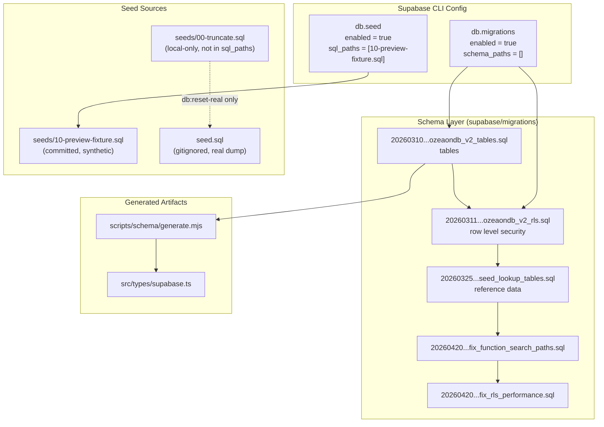
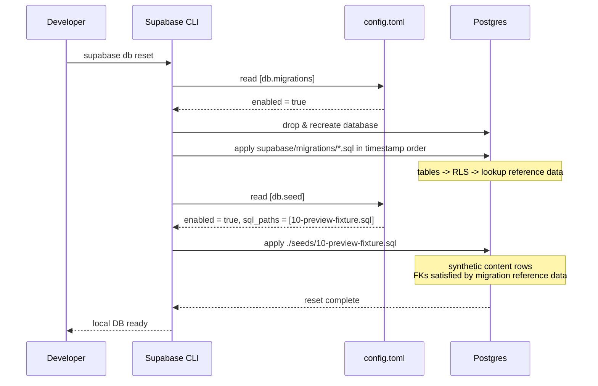
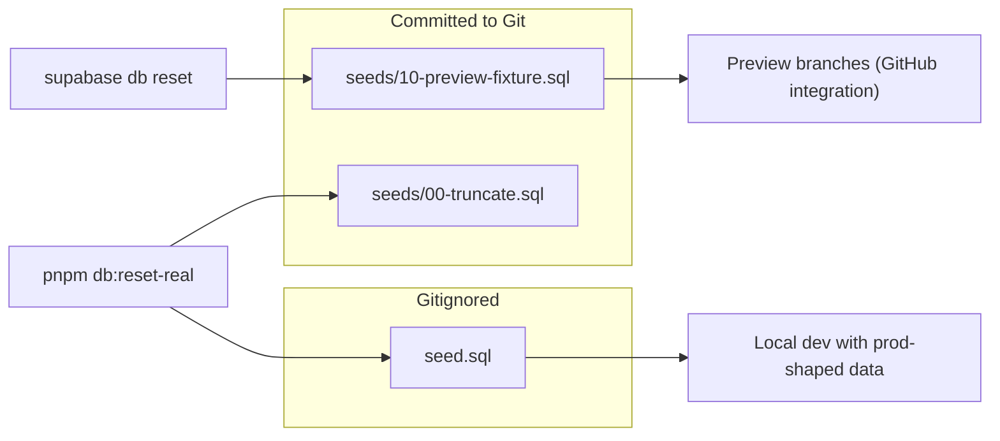
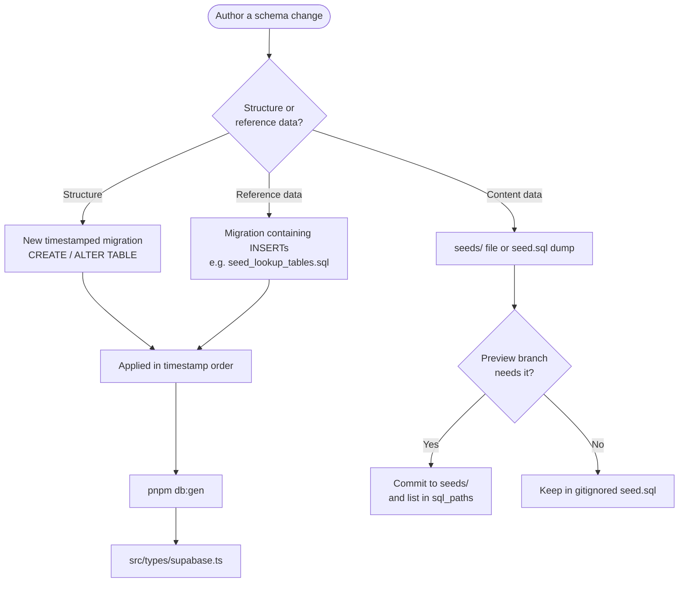

How Ozeaon's Supabase schema evolves over time through ordered SQL migrations, and how the database is populated with reference data, synthetic preview fixtures, and real-data dumps.

## Purpose and Scope

This page documents the database lifecycle management subsystem of Ozeaon: the ordered migration history under `supabase/migrations/`, the seeding configuration in `supabase/config.toml`, the `seed.sql` / `seeds/` split, and the `pnpm db:*` scripts that drive them.

It covers:

- The `[db.migrations]` and `[db.seed]` configuration blocks in [`supabase/config.toml`](https://github.com/ozeaon/ozeaon-v2/blob/0a4f1a95824db87782f1221a4108019d174df3d9/supabase/config.toml#L51-L73).
- The migration file naming convention and ordering semantics.
- The distinction between the *synthetic* preview fixture and the *real-data* dump, and why they are deliberately separated.
- The `db:schema`, `db:types`, `db:gen`, `db:seed-dump`, and `db:reset-real` scripts in [`package.json`](https://github.com/ozeaon/ozeaon-v2/blob/0a4f1a95824db87782f1221a4108019d174df3d9/package.json#L23-L27).
- How migrations interact with preview deployments and the `db-trigger` security convention.

Related operational topics — app deployment, preview environments, and CI — are covered by sibling pages in `10-operations/`. Backend code that consumes the generated types is documented under the application/data-access pages.

## Overview

Ozeaon's data layer is a hosted Supabase Postgres instance. There is no ORM-managed schema and no code-first migration generator: the schema is defined exclusively by an ordered, append-only list of SQL migration files under [`supabase/migrations/`](https://github.com/ozeaon/ozeaon-v2/blob/0a4f1a95824db87782f1221a4108019d174df3d9/supabase/migrations). Supabase applies them in lexicographic order of their timestamp prefix, so the filename encodes both the authoring time and the ordering contract.

Alongside the schema, the repository maintains **two distinct data populations**:

1. **Migration-embedded reference data** — lookup tables such as `member_roles`, `sdgs`, `article_types`, `resource_categories`, and `project_types` are created and populated directly inside migrations (see [`20260325000000_seed_lookup_tables.sql`](https://github.com/ozeaon/ozeaon-v2/blob/0a4f1a95824db87782f1221a4108019d174df3d9/supabase/migrations/20260325000000_seed_lookup_tables.sql)). Because these rows ship with the schema, every environment — local, preview, and production — gets them automatically.
2. **Data seeds** — the local seed pipeline, split between a committable **synthetic fixture** (`supabase/seeds/10-preview-fixture.sql`) and a gitignored **real-data dump** (`supabase/seed.sql`).

The core design intent, stated directly in the config comments, is that migrations own *structure and reference data*, while seeds own *content data*. The synthetic fixture exists so that environments which cannot see the gitignored real dump (notably Supabase preview branches built by the GitHub integration) still come up with usable, referential-integrity-respecting content.

## Architecture



**Why this shape.** The migration subgraph is a strict linear chain because Supabase migrations are order-dependent: `ozeaondb_v2_tables.sql` must land before `ozeaondb_v2_rls.sql`, because RLS policies reference tables that must already exist. The later `fix_*` migrations are corrective, applied last so they can override earlier definitions of functions and policies. The seed side branches into two independent sources keyed by *environment capability*: the fixture is committed (always available), the dump is gitignored (only available where a developer or CI job generates it), and `00-truncate.sql` is deliberately excluded from normal resets to preserve migration-created reference data.

## Migration Configuration

Migration behavior is configured in [`supabase/config.toml`](https://github.com/ozeaon/ozeaon-v2/blob/0a4f1a95824db87782f1221a4108019d174df3d9/supabase/config.toml#L51-L56).

```toml
[db.migrations]
# If disabled, migrations will be skipped during a db push or reset.
enabled = true
# Specifies an ordered list of schema files that describe your database.
# Supports glob patterns relative to supabase directory: "./schemas/*.sql"
schema_paths = []
```

> Source: [config.toml](https://github.com/ozeaon/ozeaon-v2/blob/0a4f1a95824db87782f1221a4108019d174df3d9/supabase/config.toml#L51-L56)

| Option | Type | Default | Description |
|--------|------|---------|-------------|
| `db.migrations.enabled` | boolean | `true` | When `true`, migrations run during `supabase db push` and `supabase db reset`. Setting this to `false` skips schema evolution entirely — useful only for debugging. |
| `db.migrations.schema_paths` | string array | `[]` | Optional declarative-schema glob list. Left empty here, which means the project is **migration-first**, not declarative-schema-first. Leaving it empty is intentional: authoritative schema changes must arrive as timestamped migration files so that history stays reproducible. |

The empty `schema_paths` value is a meaningful design decision rather than an omission. Supabase supports two schema modes: declarative (`schema_paths` globs that are diffed into migrations) and imperative (hand-written migration files). By leaving the list empty, Ozeaon commits to the imperative mode, which is what makes the security conventions embedded in migration history — `SECURITY DEFINER`, explicit `search_path`, and revoked grants — auditable and reviewable as code. [`CLAUDE.md`](https://github.com/ozeaon/ozeaon-v2/blob/0a4f1a95824db87782f1221a4108019d174df3d9/CLAUDE.md#L215-L217) documents this convention explicitly, directing authors to the `db-trigger` skill rather than hand-rolling trigger functions from memory.

## Migration Naming and Ordering

Migration files under [`supabase/migrations/`](https://github.com/ozeaon/ozeaon-v2/blob/0a4f1a95824db87782f1221a4108019d174df3d9/supabase/migrations) follow the Supabase timestamp convention:

```
YYYYMMDDHHMMSS_description.sql
```

Examples from the repository:

| Migration | Purpose (from filename) |
|-----------|------------------------|
| [`20260224141918_remote_schema.sql`](https://github.com/ozeaon/ozeaon-v2/blob/0a4f1a95824db87782f1221a4108019d174df3d9/supabase/migrations/20260224141918_remote_schema.sql) | Initial import of the remote schema |
| [`20260224142212_remote_schema.sql`](https://github.com/ozeaon/ozeaon-v2/blob/0a4f1a95824db87782f1221a4108019d174df3d9/supabase/migrations/20260224142212_remote_schema.sql) | Follow-up remote schema import |
| [`20260310232125_ozeaondb_v2_tables.sql`](https://github.com/ozeaon/ozeaon-v2/blob/0a4f1a95824db87782f1221a4108019d174df3d9/supabase/migrations/20260310232125_ozeaondb_v2_tables.sql) | Core `ozeaondb_v2` table definitions |
| [`20260311112434_ozeaondb_v2_rls.sql`](https://github.com/ozeaon/ozeaon-v2/blob/0a4f1a95824db87782f1221a4108019d174df3d9/supabase/migrations/20260311112434_ozeaondb_v2_rls.sql) | Row Level Security policies for those tables |
| [`20260313000000_reconcile_stats_function.sql`](https://github.com/ozeaon/ozeaon-v2/blob/0a4f1a95824db87782f1221a4108019d174df3d9/supabase/migrations/20260313000000_reconcile_stats_function.sql) | Statistics reconciliation function |
| [`20260323000000_move_view_count.sql`](https://github.com/ozeaon/ozeaon-v2/blob/0a4f1a95824db87782f1221a4108019d174df3d9/supabase/migrations/20260323000000_move_view_count.sql) | Relocates view-count storage |
| [`20260325000000_seed_lookup_tables.sql`](https://github.com/ozeaon/ozeaon-v2/blob/0a4f1a95824db87782f1221a4108019d174df3d9/supabase/migrations/20260325000000_seed_lookup_tables.sql) | Reference/lookup data seeding |
| [`20260328000000_articles_full_schema.sql`](https://github.com/ozeaon/ozeaon-v2/blob/0a4f1a95824db87782f1221a4108019d174df3d9/supabase/migrations/20260328000000_articles_full_schema.sql) | Full articles schema |
| [`20260414000000_project_faqs.sql`](https://github.com/ozeaon/ozeaon-v2/blob/0a4f1a95824db87782f1221a4108019d174df3d9/supabase/migrations/20260414000000_project_faqs.sql) | Project FAQs |
| [`20260414000001_project_team.sql`](https://github.com/ozeaon/ozeaon-v2/blob/0a4f1a95824db87782f1221a4108019d174df3d9/supabase/migrations/20260414000001_project_team.sql) | Project team members |
| [`20260414000002_documents.sql`](https://github.com/ozeaon/ozeaon-v2/blob/0a4f1a95824db87782f1221a4108019d174df3d9/supabase/migrations/20260414000002_documents.sql) | Documents |
| [`20260414000003_project_related_content.sql`](https://github.com/ozeaon/ozeaon-v2/blob/0a4f1a95824db87782f1221a4108019d174df3d9/supabase/migrations/20260414000003_project_related_content.sql) | Project related content |
| [`20260414000004_project_settings_constraints.sql`](https://github.com/ozeaon/ozeaon-v2/blob/0a4f1a95824db87782f1221a4108019d174df3d9/supabase/migrations/20260414000004_project_settings_constraints.sql) | Project settings constraints |
| [`20260420000001_fix_function_search_paths.sql`](https://github.com/ozeaon/ozeaon-v2/blob/0a4f1a95824db87782f1221a4108019d174df3d9/supabase/migrations/20260420000001_fix_function_search_paths.sql) | Security hardening: function `search_path` |
| [`20260420000002_fix_rls_performance.sql`](https://github.com/ozeaon/ozeaon-v2/blob/0a4f1a95824db87782f1221a4108019d174df3d9/supabase/migrations/20260420000002_fix_rls_performance.sql) | RLS performance corrections |

Two conventions are visible here. First, migration timestamps are **manually spaced** (`20260414000000`, `...000001`, `...000002`…) when several related migrations land together, which guarantees a deterministic order for a logical batch. Second, **corrective migrations never edit history**: [`20260420000001_fix_function_search_paths.sql`](https://github.com/ozeaon/ozeaon-v2/blob/0a4f1a95824db87782f1221a4108019d174df3d9/supabase/migrations/20260420000001_fix_function_search_paths.sql) and [`20260420000002_fix_rls_performance.sql`](https://github.com/ozeaon/ozeaon-v2/blob/0a4f1a95824db87782f1221a4108019d174df3d9/supabase/migrations/20260420000002_fix_rls_performance.sql) were appended rather than modifying the original `ozeaondb_v2_rls.sql`. This preserves the rule that a migration file is immutable once applied, so environments at any point in history converge on the same schema.

## Seeding Configuration

Seeding is configured by the `[db.seed]` block in [`supabase/config.toml`](https://github.com/ozeaon/ozeaon-v2/blob/0a4f1a95824db87782f1221a4108019d174df3d9/supabase/config.toml#L58-L73).

```toml
[db.seed]
# If enabled, seeds the database after migrations during a db reset.
enabled = true
# Specifies an ordered list of seed files to load during db reset.
# Supports glob patterns relative to supabase directory: "./seeds/*.sql"
# Synthetic fixture only. seed.sql (the real-data dump) is gitignored, so the
# Supabase GitHub integration cannot see it and preview branches came up empty.
#
# 00-truncate.sql is deliberately NOT listed: it exists to stop migration-inserted
# rows colliding with that dump, and without the dump it just destroys the
# reference data migrations create (member_roles, sdgs, article_types,
# resource_categories, project_types...), which the fixture depends on.
#
# To load the real dump locally instead:
#   psql "$DB" -f supabase/seeds/00-truncate.sql -f supabase/seed.sql
sql_paths = ["./seeds/10-preview-fixture.sql"]
```

> Source: [config.toml](https://github.com/ozeaon/ozeaon-v2/blob/0a4f1a95824db87782f1221a4108019d174df3d9/supabase/config.toml#L58-L73)

| Option | Type | Default | Description |
|--------|------|---------|-------------|
| `db.seed.enabled` | boolean | `true` | Seeds the database after migrations complete during `supabase db reset`. |
| `db.seed.sql_paths` | string array | `["./seeds/10-preview-fixture.sql"]` | Ordered list of seed files applied on reset. Supports globs relative to the `supabase/` directory. |

### The fixture/dump split — design rationale

The comments in the config file spell out a genuine operational problem and its resolution. The state is:

- `supabase/seed.sql` is the **real-data dump** (`pnpm db:seed-dump` writes it). It is **gitignored**.
- The Supabase GitHub integration creates a preview branch per pull request, but it builds from the repository — so it cannot see a gitignored file. Preview branches therefore came up **empty**.
- The fix: commit a **synthetic fixture** at `supabase/seeds/10-preview-fixture.sql` and list only that in `sql_paths`, so preview branches always have sufficient content to exercise the application.

`00-truncate.sql` is intentionally excluded from `sql_paths`. Its only job is to remove migration-inserted rows that would collide with the real dump's primary keys. Without the dump present, running it would simply erase the migration-created reference data (`member_roles`, `sdgs`, `article_types`, `resource_categories`, `project_types`, …) that the fixture itself depends on for foreign keys. Excluding it from the automatic path makes the two seed sources mutually exclusive by construction rather than by careful ordering.

## Core Flow: Reset, Migrate, Seed

`supabase db reset` is the canonical local workflow, and it is the flow that both `sql_paths` and `migrations` feed into. The sequence below reflects the configured behaviour.



The ordering is the load-bearing property: the fixture must run **after** migrations, because it references lookup rows the migrations insert. If `00-truncate.sql` were in `sql_paths`, it would run and delete those rows before the fixture needed them — the exact failure the config comment warns about.

### Real-data reset flow

When a developer needs production-shaped data locally, `pnpm db:reset-real` bypasses `sql_paths` and drives `psql` directly:

```json
"db:reset-real": "supabase db reset && DB_URL=$(supabase status --output json | jq -er '.DB_URL') && psql \"$DB_URL\" -v ON_ERROR_STOP=1 -f supabase/seeds/00-truncate.sql -f supabase/seed.sql"
```

> Source: [package.json](https://github.com/ozeaon/ozeaon-v2/blob/0a4f1a95824db87782f1221a4108019d174df3d9/package.json#L27)

The control flow of this one-liner, step by step:

1. `supabase db reset` — drops and recreates the database, applying all migrations and then the *fixture* (since `sql_paths` still points at it).
2. `supabase status --output json | jq -er '.DB_URL'` — extracts the connection string. The `-e` flag makes `jq` **exit non-zero** if `.DB_URL` is missing or null, which aborts the chain rather than letting an empty `$DB_URL` reach `psql`.
3. `psql "$DB_URL" -v ON_ERROR_STOP=1 -f supabase/seeds/00-truncate.sql -f supabase/seed.sql` — truncates the colliding rows, then loads the real dump. `ON_ERROR_STOP=1` ensures a mid-file SQL error halts immediately instead of silently producing a half-seeded database.

Note that `-f` is passed twice in a single `psql` invocation, so both files are processed in one session and in the stated order: truncate first, dump second. This is the ordering guarantee that `00-truncate.sql` exists to provide.

## Seed Sources



| Source file | Committed | Loaded by | Contents |
|-------------|-----------|-----------|----------|
| [`supabase/seeds/10-preview-fixture.sql`](https://github.com/ozeaon/ozeaon-v2/blob/0a4f1a95824db87782f1221a4108019d174df3d9/supabase/seeds/10-preview-fixture.sql) | Yes | `supabase db reset` (`db.seed.sql_paths`) | Synthetic fixture, intentionally narrow so it can be reliably maintained alongside migrations |
| [`supabase/seeds/00-truncate.sql`](https://github.com/ozeaon/ozeaon-v2/blob/0a4f1a95824db87782f1221a4108019d174df3d9/supabase/seeds/00-truncate.sql) | Yes | `pnpm db:reset-real` only | Truncation of migration-inserted rows to avoid PK collisions with the real dump |
| `supabase/seed.sql` | No (gitignored) | `pnpm db:reset-real` only | Real-data dump produced by `pnpm db:seed-dump` |

## Derived Artifacts and the `db:*` Scripts

The scripts in [`package.json`](https://github.com/ozeaon/ozeaon-v2/blob/0a4f1a95824db87782f1221a4108019d174df3d9/package.json#L23-L27) form the migration-adjacent toolchain:

```json
"db:schema": "node scripts/schema/generate.mjs",
"db:types": "supabase gen types typescript --local > src/types/supabase.ts && prettier --write src/types/supabase.ts",
"db:gen": "pnpm db:schema && pnpm db:types",
"db:seed-dump": "supabase db dump --data-only -f supabase/seed.sql",
"db:reset-real": "supabase db reset && DB_URL=$(supabase status --output json | jq -er '.DB_URL') && psql \"$DB_URL\" -v ON_ERROR_STOP=1 -f supabase/seeds/00-truncate.sql -f supabase/seed.sql"
```

> Source: [package.json](https://github.com/ozeaon/ozeaon-v2/blob/0a4f1a95824db87782f1221a4108019d174df3d9/package.json#L23-L27)

| Script | Command | Purpose |
|--------|---------|---------|
| `db:schema` | `node scripts/schema/generate.mjs` | Generates human-readable schema documentation from the local database |
| `db:types` | `supabase gen types typescript --local > src/types/supabase.ts && prettier --write src/types/supabase.ts` | Regenerates TypeScript types from the **local** database and formats the output |
| `db:gen` | `pnpm db:schema && pnpm db:types` | Composite: schema docs plus types |
| `db:seed-dump` | `supabase db dump --data-only -f supabase/seed.sql` | Dumps data (not schema) from a remote database into `supabase/seed.sql` |
| `db:reset-real` | see above | Full reset plus real-data load |

The `--data-only` flag on `db:seed-dump` is what makes the dump safe to load on top of an already-migrated schema: it emits `INSERT`/`COPY` statements without `CREATE TABLE`/`ALTER` statements, so the dump never competes with migration history for schema ownership. Likewise, `--local` on `db:types` is essential — types are generated from the developer's migrated local database, guaranteeing the committed `src/types/supabase.ts` matches the migration head rather than whatever happens to be deployed.

`db:gen` must be run **after** migrations (as [`CLAUDE.md`](https://github.com/ozeaon/ozeaon-v2/blob/0a4f1a95824db87782f1221a4108019d174df3d9/CLAUDE.md#L72) states), because both steps introspect the live local schema. Running it against a stale database silently produces outdated types.

## Migration Contents: Reference Data vs. Structure

A structural migration and a reference-data migration look different in intent. `ozeaondb_v2_tables.sql` defines structure; `seed_lookup_tables.sql` inserts the fixed vocabulary the rest of the system joins against.



The decision tree encodes the rule the config comments imply: if a preview branch requires the data to render the application meaningfully, it must be **committed** and referenced from `db.seed.sql_paths`. If it is only useful for local realism, it belongs in the gitignored dump.

Because lookup tables are populated inside migrations, the fixture can safely join against `member_roles`, `sdgs`, `article_types`, `resource_categories`, and `project_types` on a fresh preview branch with no additional setup. This is exactly the dependency the config comment calls out when explaining why `00-truncate.sql` is excluded from the automatic path.

## Failure Modes, Edge Cases & Operational Notes

| Failure mode | Trigger | Mitigation in source |
|--------------|---------|----------------------|
| Preview branch comes up empty | Supabase GitHub integration cannot read the gitignored `seed.sql` | Committed synthetic fixture `seeds/10-preview-fixture.sql` listed in `db.seed.sql_paths` ([config.toml](https://github.com/ozeaon/ozeaon-v2/blob/0a4f1a95824db87782f1221a4108019d174df3d9/supabase/config.toml#L63-L73)) |
| Reference data destroyed on reset | Running `00-truncate.sql` without the real dump present | `00-truncate.sql` deliberately omitted from `sql_paths`; only invoked by `db:reset-real` ([config.toml](https://github.com/ozeaon/ozeaon-v2/blob/0a4f1a95824db87782f1221a4108019d174df3d9/supabase/config.toml#L66-L69)) |
| Primary-key collision between migration-inserted rows and the dump | Loading `seed.sql` over rows the lookup migration already inserted | `00-truncate.sql` runs first inside the same `psql` invocation via repeated `-f` ([package.json](https://github.com/ozeaon/ozeaon-v2/blob/0a4f1a95824db87782f1221a4108019d174df3d9/package.json#L27)) |
| Empty `$DB_URL` reaching `psql` | `supabase status --output json` lacking `DB_URL` | `jq -er` fails the chain on missing/null value ([package.json](https://github.com/ozeaon/ozeaon-v2/blob/0a4f1a95824db87782f1221a4108019d174df3d9/package.json#L27)) |
| Partially applied dump | SQL error midway through `seed.sql` | `-v ON_ERROR_STOP=1` aborts the session ([package.json](https://github.com/ozeaon/ozeaon-v2/blob/0a4f1a95824db87782f1221a4108019d174df3d9/package.json#L27)) |
| Stale generated types | `db:gen` run before migrations are applied locally | `db:types` uses `--local`; [`CLAUDE.md`](https://github.com/ozeaon/ozeaon-v2/blob/0a4f1a95824db87782f1221a4108019d174df3d9/CLAUDE.md#L72) mandates running it *after* migrations |
| Schema drift between modes | Declarative schema files diverging from migration files | `db.migrations.schema_paths = []` forces the migration-first mode ([config.toml](https://github.com/ozeaon/ozeaon-v2/blob/0a4f1a95824db87782f1221a4108019d174df3d9/supabase/config.toml#L54-L56)) |
| Fixture out of sync with schema | A migration changes what the fixture writes to | [`CLAUDE.md`](https://github.com/ozeaon/ozeaon-v2/blob/0a4f1a95824db87782f1221a4108019d174df3d9/CLAUDE.md#L231-L233) requires the fixture update in the same PR |

### Fixture maintenance as a PR-time obligation

The coupling between migrations and the fixture is an explicit contractual obligation, documented in [`CLAUDE.md`](https://github.com/ozeaon/ozeaon-v2/blob/0a4f1a95824db87782f1221a4108019d174df3d9/CLAUDE.md#L231-L233): every PR into `main` receives its own Worker and Supabase branch seeded from `seeds/10-preview-fixture.sql`, and **a migration that changes what the fixture writes to needs the fixture updated in the same PR**. This is the mechanism that keeps preview environments trustworthy — the fixture is not optional scaffolding, it is the input that makes review environments representative.

### Security conventions are part of migration history

Because there is no declarative schema layer, the security posture of database functions and policies lives entirely in migrations. [`CLAUDE.md`](https://github.com/ozeaon/ozeaon-v2/blob/0a4f1a95824db87782f1221a4108019d174df3d9/CLAUDE.md#L215-L217) describes this as a security convention made up of `SECURITY DEFINER`, explicit `search_path`, and revoked grants, all **derived from migration history**. The corrective migrations [`20260420000001_fix_function_search_paths.sql`](https://github.com/ozeaon/ozeaon-v2/blob/0a4f1a95824db87782f1221a4108019d174df3d9/supabase/migrations/20260420000001_fix_function_search_paths.sql) and [`20260420000002_fix_rls_performance.sql`](https://github.com/ozeaon/ozeaon-v2/blob/0a4f1a95824db87782f1221a4108019d174df3d9/supabase/migrations/20260420000002_fix_rls_performance.sql) are the visible record of hardening that convention: rather than editing the original definitions, they re-declare functions with a fixed `search_path` and reissue policies for performance. Contributors adding triggers are directed to the `db-trigger` skill instead of writing the pattern from memory.

## Extension Points

- **Adding a schema change:** create a new timestamped file in [`supabase/migrations/`](https://github.com/ozeaon/ozeaon-v2/blob/0a4f1a95824db87782f1221a4108019d174df3d9/supabase/migrations). Never edit an applied migration; append a corrective one, following the `2026042000000x_fix_*.sql` pattern.
- **Adding committable seed content:** place it under `supabase/seeds/` and add it to `db.migrations`-adjacent `[db.seed].sql_paths` in [`supabase/config.toml`](https://github.com/ozeaon/ozeaon-v2/blob/0a4f1a95824db87782f1221a4108019d174df3d9/supabase/config.toml#L73). Files are applied in list order, so prefix names numerically (`00-`, `10-`) to control sequencing.
- **Adding local-only data:** populate `supabase/seed.sql` via `pnpm db:seed-dump` and keep it out of `sql_paths`.
- **Regenerating downstream artifacts:** run `pnpm db:gen` after any migration, which refreshes the generated schema documentation (via [`scripts/schema/generate.mjs`](https://github.com/ozeaon/ozeaon-v2/blob/0a4f1a95824db87782f1221a4108019d174df3d9/scripts/schema/generate.mjs)) and [`src/types/supabase.ts`](https://github.com/ozeaon/ozeaon-v2/blob/0a4f1a95824db87782f1221a4108019d174df3d9/src/types/supabase.ts).

## Related Links

- [Supabase configuration — `supabase/config.toml`](https://github.com/ozeaon/ozeaon-v2/blob/0a4f1a95824db87782f1221a4108019d174df3d9/supabase/config.toml#L51-L73)
- [Migration history — `supabase/migrations/`](https://github.com/ozeaon/ozeaon-v2/blob/0a4f1a95824db87782f1221a4108019d174df3d9/supabase/migrations)
- [Preview seed fixture — `supabase/seeds/10-preview-fixture.sql`](https://github.com/ozeaon/ozeaon-v2/blob/0a4f1a95824db87782f1221a4108019d174df3d9/supabase/seeds/10-preview-fixture.sql)
- [Truncation script — `supabase/seeds/00-truncate.sql`](https://github.com/ozeaon/ozeaon-v2/blob/0a4f1a95824db87782f1221a4108019d174df3d9/supabase/seeds/00-truncate.sql)
- [Database scripts — `package.json`](https://github.com/ozeaon/ozeaon-v2/blob/0a4f1a95824db87782f1221a4108019d174df3d9/package.json#L23-L27)
- [Schema generator — `scripts/schema/generate.mjs`](https://github.com/ozeaon/ozeaon-v2/blob/0a4f1a95824db87782f1221a4108019d174df3d9/scripts/schema/generate.mjs)
- [Generated types — `src/types/supabase.ts`](https://github.com/ozeaon/ozeaon-v2/blob/0a4f1a95824db87782f1221a4108019d174df3d9/src/types/supabase.ts)
- [Project conventions — `CLAUDE.md`](https://github.com/ozeaon/ozeaon-v2/blob/0a4f1a95824db87782f1221a4108019d174df3d9/CLAUDE.md#L72)
- [Deployment previews — `docs/deployment-previews.md`](https://github.com/ozeaon/ozeaon-v2/blob/0a4f1a95824db87782f1221a4108019d174df3d9/docs/deployment-previews.md)
