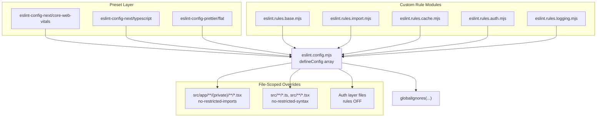
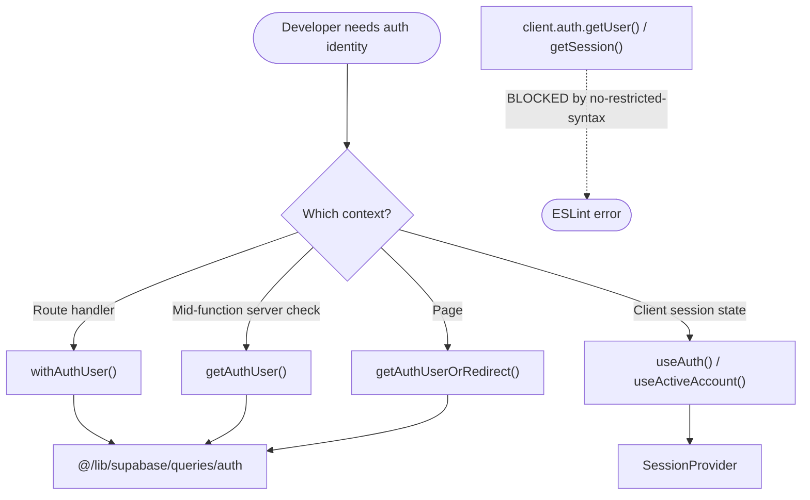
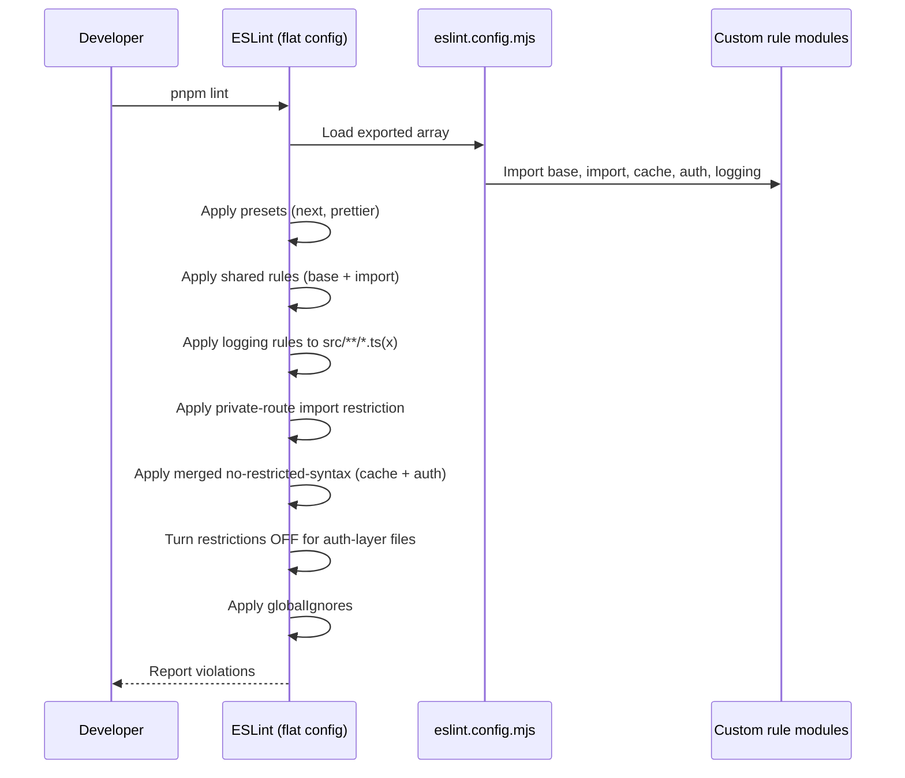

This page documents how the ozeaon-v2 repository enforces coding conventions through a composed ESLint configuration, Prettier formatting, and a set of project-specific custom rule modules that encode architectural invariants (authentication access, caching model, logging, and Tailwind usage).

## Purpose and Scope

This page covers the **static-analysis and formatting layer** of the repository:

- The root ESLint flat config ([`eslint.config.mjs`](https://github.com/ozeaon/ozeaon-v2/blob/0a4f1a95824db87782f1221a4108019d174df3d9/eslint.config.mjs)) and how it composes presets and custom rule modules.
- Each custom rule module: `eslint.rules.base.mjs`, `eslint.rules.import.mjs`, `eslint.rules.cache.mjs`, `eslint.rules.auth.mjs`, and `eslint.rules.logging.mjs`.
- The npm scripts that run linting, formatting, and type-checking (`package.json`).
- The architectural intent encoded by these rules: keeping authentication reads funneled through an approved layer, banning stray `console` logging, and validating Tailwind classes against the real stylesheet.

**Out of scope (see sibling pages):** The runtime authentication implementation itself (the `@/lib/supabase/queries/auth` helpers) and the structured logging implementation (LogTape helpers) are covered on their own pages. This page documents only the *rules that constrain* those subsystems, not their behavior. Deployment/CI execution of the lint step belongs to the operations/deployment page.

## Overview

The repository follows a single-project Next.js (App Router) + TypeScript stack. Rather than relying solely on off-the-shelf presets, it layers **custom rule modules** on top of `eslint-config-next` to enforce project-specific conventions that a generic linter cannot know about:

| Convention | Enforced By | Rationale |
|-----------|-------------|-----------|
| No direct `supabase.auth.getUser()` / `getSession()` | `eslint.rules.auth.mjs` | Funnels auth reads through vetted helpers so validation and redirect logic is never bypassed |
| No `console.*` logging | `eslint.rules.logging.mjs` | All logging must go through LogTape-backed helpers |
| No unknown Tailwind classes | `eslint.rules.base.mjs` | Catches typos by checking classes against `src/styles/globals.css` |
| No `any`; underscore-prefixed unused vars allowed | `eslint.rules.base.mjs` | Strict typing with an escape hatch for intentionally-unused bindings |
| Private routes must not import the public Supabase client | `eslint.config.mjs` (`no-restricted-imports`) | Prevents cookie-less clients leaking into authenticated surfaces |

The convention layer is *composed*, not monolithic: each concern lives in its own module and is spread into the config. This is a deliberate design choice — ESLint allows a given rule to be configured only once per config object, so rule modules that target the same ESLint rule (for example, multiple `no-restricted-syntax` selector sets) must be merged into a single declaration rather than spread as separate objects (see the module docstrings).

## Architecture

The configuration is a flat array of ESLint config objects. Presets come first, then a shared rules block, then file-scoped overrides, then a final override that re-enables restricted syntax inside the sanctioned auth layer, and finally the global ignore list.



The ordering in the array is semantically important, not cosmetic:

1. **Presets** (`nextVitals`, `nextTs`, `prettierRecommended`) establish the baseline rule set. `prettierRecommended` disables ESLint rules that would conflict with Prettier's formatting, so formatting is owned exclusively by Prettier.
2. **React settings block** pins `react.version` to `"19"` so version-dependent React lint rules apply correctly.
3. **Shared rules block** spreads `baseRules` and `importRules` and registers the `better-tailwindcss` plugin.
4. **Logging block** applies `loggingRules` only to `src/**/*.ts` and `src/**/*.tsx` — i.e., application source, not config or scripts.
5. **Private-route import block** restricts a specific import inside `src/app/**/(private)/**/*.tsx`.
6. **Restricted-syntax block** merges the `cache` and `auth` selector arrays into a single `no-restricted-syntax` declaration.
7. **Auth-layer override** must come *after* step 6 to turn those rules off for the handful of files that legitimately implement the auth layer.
8. **`globalIgnores`** excludes build output, generated files, and Supabase internals.

<!-- SOURCE FILE REFERENCES -->
> Sources:
> - [eslint.config.mjs](https://github.com/ozeaon/ozeaon-v2/blob/0a4f1a95824db87782f1221a4108019d174df3d9/eslint.config.mjs#L1-L91)
> - [eslint.rules.base.mjs](https://github.com/ozeaon/ozeaon-v2/blob/0a4f1a95824db87782f1221a4108019d174df3d9/eslint.rules.base.mjs#L1-L31)
> - [eslint.rules.auth.mjs](https://github.com/ozeaon/ozeaon-v2/blob/0a4f1a95824db87782f1221a4108019d174df3d9/eslint.rules.auth.mjs#L1-L19)
> - [eslint.rules.logging.mjs](https://github.com/ozeaon/ozeaon-v2/blob/0a4f1a95824db87782f1221a4108019d174df3d9/eslint.rules.logging.mjs#L1-L3)

## Configuration Composition in Detail

The root config uses ESLint's flat-config `defineConfig` API and `globalIgnores` from `eslint/config`:

```javascript
import { defineConfig, globalIgnores } from "eslint/config";
import nextVitals from "eslint-config-next/core-web-vitals";
import nextTs from "eslint-config-next/typescript";
import prettierRecommended from "eslint-config-prettier/flat";
import tailwindcss from "eslint-plugin-better-tailwindcss";
import baseRules from "./eslint.rules.base.mjs";
import cacheSelectors from "./eslint.rules.cache.mjs";
import importRules from "./eslint.rules.import.mjs";
import authSelectors from "./eslint.rules.auth.mjs";
import loggingRules from "./eslint.rules.logging.mjs";

export default defineConfig([
  ...nextVitals,
  ...nextTs,
  prettierRecommended,
  // ...
]);
```

> Source: [eslint.config.mjs](https://github.com/ozeaon/ozeaon-v2/blob/0a4f1a95824db87782f1221a4108019d174df3d9/eslint.config.mjs#L1-L22)

Note the use of **spread** for preset arrays (`...nextVitals`, `...nextTs`) versus **plain objects** for the custom rule modules. Presets are themselves arrays of config objects, so they are flattened into the top-level list. The custom modules export plain rule objects (or, for `auth` and `cache`, selector *arrays*) and are composed into specific config blocks.

### The Shared Rules Block

`baseRules` and `importRules` are spread into a single config object that also registers the `better-tailwindcss` plugin. This block applies to all linted files (it has no `files` key), so it acts as the project-wide baseline.

```javascript
{
  plugins: { "better-tailwindcss": tailwindcss },
  rules: {
    ...baseRules,
    ...importRules,
  },
},
```

> Source: [eslint.config.mjs](https://github.com/ozeaon/ozeaon-v2/blob/0a4f1a95824db87782f1221a4108019d174df3d9/eslint.config.mjs#L23-L29)

### Why Rule Modules Instead of One File

Each custom module carries a docstring explaining the composition constraint. From `eslint.rules.auth.mjs`:

```javascript
/**
 * `no-restricted-syntax` selectors for authentication reads.
 * Composed with the other selector sets in `eslint.config.mjs` — a rule can
 * only be configured once, so these must not be spread as a rules object.
 */
```

> Source: [eslint.rules.auth.mjs](https://github.com/ozeaon/ozeaon-v2/blob/0a4f1a95824db87782f1221a4108019d174df3d9/eslint.rules.auth.mjs#L1-L5)

This is the key architectural insight: `no-restricted-syntax` accepts an **array of selectors**. If two modules each exported a `{"no-restricted-syntax": [...]}` rules object and both were spread into one block, the later spread would silently overwrite the earlier one. The cache and auth modules therefore export **selector arrays**, not rule objects, and the config merges them explicitly:

```javascript
{
  files: ["src/**/*.ts", "src/**/*.tsx"],
  rules: {
    "no-restricted-syntax": ["error", ...cacheSelectors, ...authSelectors],
  },
},
```

> Source: [eslint.config.mjs](https://github.com/ozeaon/ozeaon-v2/blob/0a4f1a95824db87782f1221a4108019d174df3d9/eslint.config.mjs#L52-L57)

## Conventions Enforced by `eslint.rules.base.mjs`

The base module bundles the project's core TypeScript, React, and Tailwind conventions.

```javascript
export default {
  "better-tailwindcss/no-unknown-classes": [
    "error",
    {
      entryPoint: "src/styles/globals.css",
      ignore: [
        "article-content-section",
        "scroll-border-left",
        "bn-heading",
        "prose",
        "toaster",
        "toast",
        "next-error-h1",
        "g_id_signin",
        "collapsible-area",
        "collapsible-content",
        "transition-3s",
      ],
    },
  ],
  "react/no-unescaped-entities": "off",
  "react-hooks/exhaustive-deps": "off",
  "react-hooks/set-state-in-effect": "off",
  "no-unused-vars": "off", // "off" because we use the typescript version below
  "@typescript-eslint/no-unused-vars": [
    "error",
    { argsIgnorePattern: "^_", varsIgnorePattern: "^_" },
  ],
  "@typescript-eslint/no-empty-object-type": "off",
  "@typescript-eslint/no-explicit-any": "error",
};
```

> Source: [eslint.rules.base.mjs](https://github.com/ozeaon/ozeaon-v2/blob/0a4f1a95824db87782f1221a4108019d174df3d9/eslint.rules.base.mjs#L1-L31)

### Tailwind Class Validation

`better-tailwindcss/no-unknown-classes` is configured with `entryPoint: "src/styles/globals.css"`. This means the linter parses the project's real stylesheet to learn which utility/custom classes exist, and flags any class string in JSX/TSX that it cannot resolve. This turns typo'd Tailwind classes into build-time errors rather than silent visual bugs.

The `ignore` list enumerates classes that are legitimate but not discoverable from the entry point — e.g. classes injected by third-party libraries (`toaster`, `toast` from a toast library, `g_id_signin` from Google's sign-in script, `next-error-h1` from Next.js) or custom global classes defined outside the scanned entry point (`article-content-section`, `scroll-border-left`, `bn-heading`, `prose`, `collapsible-area`, `collapsible-content`, `transition-3s`). Each ignored entry is a documented exception; adding a new one should be treated as a deliberate decision.

### Deliberate Rule Deactivations

Several rules are intentionally turned **off**, each for a reason:

| Rule | Setting | Intent |
|------|---------|--------|
| `react/no-unescaped-entities` | off | Permits literal apostrophes/quotes in JSX text without escapes |
| `react-hooks/exhaustive-deps` | off | Allows intentional effect dependency omissions where re-running would be harmful |
| `react-hooks/set-state-in-effect` | off | Allows set-state patterns inside effects that the newer rule would flag |
| `no-unused-vars` | off | Superseded by the TypeScript-aware variant below |
| `@typescript-eslint/no-empty-object-type` | off | Permits `{}`-shaped type aliases used as placeholders |

### Strict Typing with an Escape Hatch

`@typescript-eslint/no-explicit-any` is `"error"` — bare `any` is banned project-wide. The unused-variables rule uses the TypeScript variant so type-only usages are understood correctly, and it allows underscore-prefixed names to be intentionally unused:

```javascript
"@typescript-eslint/no-unused-vars": [
  "error",
  { argsIgnorePattern: "^_", varsIgnorePattern: "^_" },
],
```

> Source: [eslint.rules.base.mjs](https://github.com/ozeaon/ozeaon-v2/blob/0a4f1a95824db87782f1221a4108019d174df3d9/eslint.rules.base.mjs#L25-L28)

The `^_` pattern is the idiomatic "I know this is unused" signal — for example, a callback that must accept a positional argument it does not need (`(_event) => ...`).

## Architectural Invariants: Authentication Read Restrictions

The most opinionated conventions in this repository are encoded as AST selectors in `eslint.rules.auth.mjs`. Rather than documenting auth rules in prose, the project makes them **mechanically enforceable** by banning the low-level Supabase auth calls outright.

```javascript
export default [
  {
    selector:
      "MemberExpression[object.property.name='auth'][property.name='getUser']",
    message:
      "Use withAuthUser() for route handlers, getAuthUser() for mid-function auth checks, or getAuthUserOrRedirect() in pages — all from @/lib/supabase/queries/auth.",
  },
  {
    selector:
      "MemberExpression[object.property.name='auth'][property.name='getSession']",
    message:
      "Don't read getSession() directly — it returns the UNVALIDATED local JWT. Use useAuth()/useActiveAccount() (SessionProvider) for client session state, or getAuthUser() server-side.",
  },
];
```

> Source: [eslint.rules.auth.mjs](https://github.com/ozeaon/ozeaon-v2/blob/0a4f1a95824db87782f1221a4108019d174df3d9/eslint.rules.auth.mjs#L6-L18)

### What These Selectors Match

These are `esquery` selectors that match **member-expression** access patterns:

- `MemberExpression[object.property.name='auth'][property.name='getUser']` matches any member access where the receiver's property is named `auth` and the accessed property is `getUser` — i.e. `client.auth.getUser(...)`.
- The second matches the identical shape for `getSession` — i.e. `client.auth.getSession(...)`.

Because the selector keys on property *names* rather than a specific variable, it triggers regardless of how the Supabase client is obtained or named, which is exactly the intent: the rule cannot be evaded by renaming the client.

### The Prescribed Replacement API

The error messages double as inline documentation, directing developers to the sanctioned alternatives:

| Context | Approved Helper | Source |
|---------|----------------|--------|
| Route handlers | `withAuthUser()` | `@/lib/supabase/queries/auth` |
| Mid-function server checks | `getAuthUser()` | `@/lib/supabase/queries/auth` |
| Pages | `getAuthUserOrRedirect()` | `@/lib/supabase/queries/auth` |
| Client session state | `useAuth()` / `useActiveAccount()` | `SessionProvider` |

The `getSession` rule is especially important: the message states that `getSession()` **returns the UNVALIDATED local JWT**. Reading it directly would allow unverified identity data to influence server logic — a real security footgun. The banned call forces developers onto helpers that validate the JWT against the auth server.



## The Auth-Layer Exception Contract

The auth restrictions would be impossible to implement if they applied to the auth module itself. The config solves this with a **carefully ordered** override that disables both `no-restricted-syntax` and `no-restricted-imports` for exactly five files:

```javascript
{
  // Must stay after the block above: this is the auth layer those selectors
  // funnel everything else into. Anywhere else needing a one-off exception
  // uses an inline eslint-disable-next-line with a reason, not this list.
  files: [
    "src/lib/supabase/queries/auth.ts",
    "src/lib/supabase/queries/reactions.ts",
    "src/lib/supabase/middleware.ts",
    "src/lib/supabase/actions.ts",
    "src/lib/supabase/auth.ts",
  ],
  rules: {
    "no-restricted-syntax": "off",
    "no-restricted-imports": "off",
  },
},
```

> Source: [eslint.config.mjs](https://github.com/ozeaon/ozeaon-v2/blob/0a4f1a95824db87782f1221a4108019d174df3d9/eslint.config.mjs#L58-L73)

Three design decisions are visible here:

1. **Ordering is a hard requirement.** The comment states the block "must stay after the block above." ESLint flat config applies later matching configs over earlier ones, so if this exception were placed before the restricted-syntax block, the restriction would be re-enabled and the auth layer would fail to lint.
2. **The exception list is deliberately tiny and explicit.** Only five files are whitelisted. This is the *single sanctioned funnel* for all auth reads.
3. **Exceptions outside the list must be inline and justified.** The comment explicitly directs developers to use `eslint-disable-next-line` with a reason rather than expanding this list — preserving the list's value as a strictly-audited allowlist.

## Private-Route Import Restrictions

Authenticated route segments under `src/app/**/(private)/` are forbidden from importing the public Supabase client:

```javascript
{
  files: ["src/app/**/(private)/**/*.tsx"],
  rules: {
    "no-restricted-imports": [
      "error",
      {
        paths: [
          {
            name: "@/lib/supabase/public",
            message: "Use createClient() in private routes.",
          },
        ],
      },
    ],
  },
},
```

> Source: [eslint.config.mjs](https://github.com/ozeaon/ozeaon-v2/blob/0a4f1a95824db87782f1221a4108019d174df3d9/eslint.config.mjs#L36-L51)

The `(private)` Next.js route group is a naming convention that signals an authenticated surface. The rule prevents a cookie-blind public client (`@/lib/supabase/public`) from being imported there, forcing use of `createClient()` instead. This ties the filesystem convention to an enforceable invariant — a private route cannot accidentally render data with an unauthenticated client.

## Logging Convention Enforcement

All application source is barred from using the console:

```javascript
export default {
  "no-console": "error",
};
```

> Source: [eslint.rules.logging.mjs](https://github.com/ozeaon/ozeaon-v2/blob/0a4f1a95824db87782f1221a4108019d174df3d9/eslint.rules.logging.mjs#L1-L3)

Scoped to `src/**/*.ts` and `src/**/*.tsx`, this makes `console.log`, `console.error`, `console.warn`, `console.debug`, and `console.info` lint errors. As documented in the project's logging guide, this is because the project uses structured logging via LogTape, and every path must go through the documented helpers rather than raw console calls:

> Structured logging via [LogTape](https://logtape.org/). Console logging (`console.log`/`error`/`warn`/`debug`/`info`) is banned by ESLint (`eslint.rules.logging.mjs`) — every path must go through the helpers documented here.
>
> Source: [docs/logging-conventions.md](https://github.com/ozeaon/ozeaon-v2/blob/0a4f1a95824db87782f1221a4108019d174df3d9/docs/logging-conventions.md#L1-L3)

The narrow `files` scope is intentional: build scripts (`scripts/**`), config files, and tooling can still log to the console, because they are not part of the request-serving application and do not benefit from structured logs.

For the LogTape helper API and how to emit structured logs, see the logging conventions page.

## Tooling Commands (package.json Scripts)

The lint/format/type-check pipeline is driven by npm scripts.

```json
"lint": "eslint .",
"lint:fix": "eslint . --fix",
"format:check": "prettier -c src",
"format": "prettier -w -c src",
```

> Source: [package.json](https://github.com/ozeaon/ozeaon-v2/blob/0a4f1a95824db87782f1221a4108019d174df3d9/package.json#L10-L13)

| Script | Command | Purpose |
|--------|---------|---------|
| `pnpm lint` | `eslint .` | Lint the whole repository using `eslint.config.mjs` |
| `pnpm lint:fix` | `eslint . --fix` | Lint and auto-apply fixable corrections |
| `pnpm check` | `tsc --noEmit` | Type check without emitting output |
| `pnpm format` | `prettier -w -c src` | Write Prettier formatting over `src` |
| `pnpm format:check` | `prettier -c src` | Verify formatting without modifying files |
| `pnpm typegen` | *(see package.json)* | Generate Next.js route types + Cloudflare env types |

> Sources:
> - [package.json](https://github.com/ozeaon/ozeaon-v2/blob/0a4f1a95824db87782f1221a4108019d174df3d9/package.json#L9-L13)
> - [CLAUDE.md](https://github.com/ozeaon/ozeaon-v2/blob/0a4f1a95824db87782f1221a4108019d174df3d9/CLAUDE.md#L66-L71)

Notice the **division of responsibilities**: ESLint (`pnpm lint`) owns code-quality and architectural rules; Prettier (`pnpm format`) owns pure formatting. This split is enforced by including `prettierRecommended` in the ESLint config, which switches off any ESLint rule that would fight Prettier. Consequently:

- Running `pnpm lint:fix` will fix rule violations but will not reformat code.
- Running `pnpm format` will reformat but will not fix rule violations.
- Both are needed for a fully clean tree.

Prettier also participates in code generation — generated Supabase types are formatted immediately after generation so the committed artifact matches project style:

```json
"db:types": "supabase gen types typescript --local > src/types/supabase.ts && prettier --write src/types/supabase.ts",
```

> Source: [package.json](https://github.com/ozeaon/ozeaon-v2/blob/0a4f1a95824db87782f1221a4108019d174df3d9/package.json#L24)

## Global Ignores

Certain paths are excluded from linting entirely, in a single `globalIgnores` call:

```javascript
globalIgnores([
  ".claude/**",
  ".next/**",
  "out/**",
  "build/**",
  "dist/**",
  "node_modules/**",
  ".turbo/**",
  ".cache/**",
  ".open-next/**",
  ".wrangler/**",
  "*.d.ts",
  "supabase/functions/*",
  "supabase/.branches/*",
  "supabase/.temp/*",
  "supabase/.snippets/*",
]),
```

> Source: [eslint.config.mjs](https://github.com/ozeaon/ozeaon-v2/blob/0a4f1a95824db87782f1221a4108019d174df3d9/eslint.config.mjs#L74-L90)

These fall into three categories:

1. **Build/tool output** — `.next`, `out`, `build`, `dist`, `.turbo`, `.cache`, `.open-next`, `.wrangler`. Notably `.open-next` and `.wrangler` correspond to the Cloudflare Workers/OpenNext deployment target, confirming the build output of that pipeline is excluded.
2. **Generated type declarations** — `*.d.ts`. These are machine-generated and must not be manually edited, so linting them would produce noise.
3. **Supabase internals** — `supabase/functions/*` (Deno edge functions with a distinct runtime), plus `.branches`, `.temp`, and `.snippets` (local Supabase CLI state).

`.claude/**` is excluded as agent/tooling scratch space.

## Failure Modes and Edge Cases

| Scenario | Behavior | Mitigation in Config |
|----------|----------|----------------------|
| Two modules target `no-restricted-syntax` | The later spread would silently overwrite the earlier array | Both `auth` and `cache` export *selector arrays*; `eslint.config.mjs` merges them with `...cacheSelectors, ...authSelectors` |
| Auth-layer exception placed before the restriction block | Restrictions re-enable over the auth layer, breaking its own code | The exception block is documented as "Must stay after the block above" |
| A new sanctioned auth helper is added elsewhere | It will fail lint unless the file is added to the allowlist | Comment directs developers to use `eslint-disable-next-line` with a reason instead of growing the allowlist |
| A legitimate non-Tailwind class is used | `no-unknown-classes` reports an error | Add it to the `ignore` array in `eslint.rules.base.mjs` with a deliberate decision |
| A generated file starts failing lint | Noise from machine-generated code | Covered by `*.d.ts` or directory ignores in `globalIgnores` |
| Intentional unused parameter | Flagged as unused | Name it with a leading underscore (`_arg`) to satisfy `argsIgnorePattern: "^_"` |
| Developer uses `any` | Lint error from `@typescript-eslint/no-explicit-any` | Use a precise type; there is no blanket exemption |

### Ordering Sensitivity

The correctness of the configuration depends on the order of blocks in the exported array. This is the single most fragile aspect of the setup, and it is called out in comments in two places:

- The auth-layer override comment: "Must stay after the block above."
- The private-route and restricted-syntax blocks are separate objects keyed by `files`, so they compose additively rather than overriding one another.



## Extension Points

Adding a new project-wide convention follows an established pattern:

1. **Create a new `eslint.rules.<concern>.mjs` module.** Plain rule sets export an object (`eslint.rules.base.mjs`, `eslint.rules.logging.mjs`); selector sets for `no-restricted-syntax` export an **array** (`eslint.rules.auth.mjs`, `eslint.rules.cache.mjs`).
2. **Import it into `eslint.config.mjs`** and compose it into the appropriate block — either the shared rules block (spread as a rules object) or the restricted-syntax block (spread into the selector array).
3. **If the rule needs a scoped exception**, add a later `files`-scoped block that sets the rule to `"off"`, and document *why* in a comment, mirroring the auth-layer block.
4. **Prefer inline `eslint-disable-next-line` with a reason** for one-off exceptions, reserving config-level allowlists for genuinely systemic funnel points.

The `ignore` array inside `eslint.rules.base.mjs` is the designated extension point for adding legitimate-but-undiscoverable Tailwind classes.

## Related Links

- Authentication helpers (`withAuthUser`, `getAuthUser`, `getAuthUserOrRedirect`) — see the authentication page; source: `src/lib/supabase/queries/auth.ts`
- Structured logging with LogTape — see [docs/logging-conventions.md](https://github.com/ozeaon/ozeaon-v2/blob/0a4f1a95824db87782f1221a4108019d174df3d9/docs/logging-conventions.md)
- CI lint step and build pipeline — see [docs/ops-deployment.md](https://github.com/ozeaon/ozeaon-v2/blob/0a4f1a95824db87782f1221a4108019d174df3d9/docs/ops-deployment.md) (the reusable `_shared-build.yml` workflow runs install → typegen → lint → `ci:build`)
- Project-wide developer instructions — see [CLAUDE.md](https://github.com/ozeaon/ozeaon-v2/blob/0a4f1a95824db87782f1221a4108019d174df3d9/CLAUDE.md)
- Source files: [eslint.config.mjs](https://github.com/ozeaon/ozeaon-v2/blob/0a4f1a95824db87782f1221a4108019d174df3d9/eslint.config.mjs), [eslint.rules.base.mjs](https://github.com/ozeaon/ozeaon-v2/blob/0a4f1a95824db87782f1221a4108019d174df3d9/eslint.rules.base.mjs), [eslint.rules.auth.mjs](https://github.com/ozeaon/ozeaon-v2/blob/0a4f1a95824db87782f1221a4108019d174df3d9/eslint.rules.auth.mjs), [eslint.rules.logging.mjs](https://github.com/ozeaon/ozeaon-v2/blob/0a4f1a95824db87782f1221a4108019d174df3d9/eslint.rules.logging.mjs), [package.json](https://github.com/ozeaon/ozeaon-v2/blob/0a4f1a95824db87782f1221a4108019d174df3d9/package.json)
