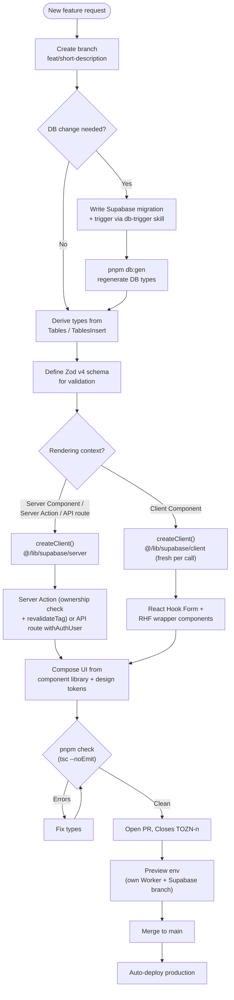
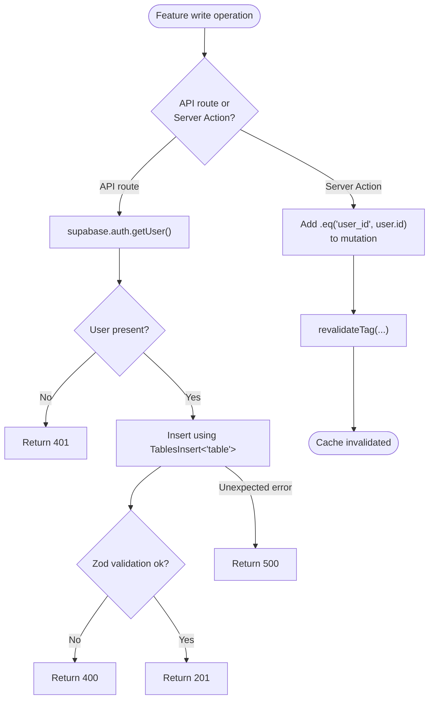
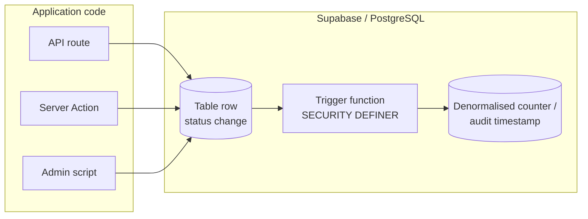
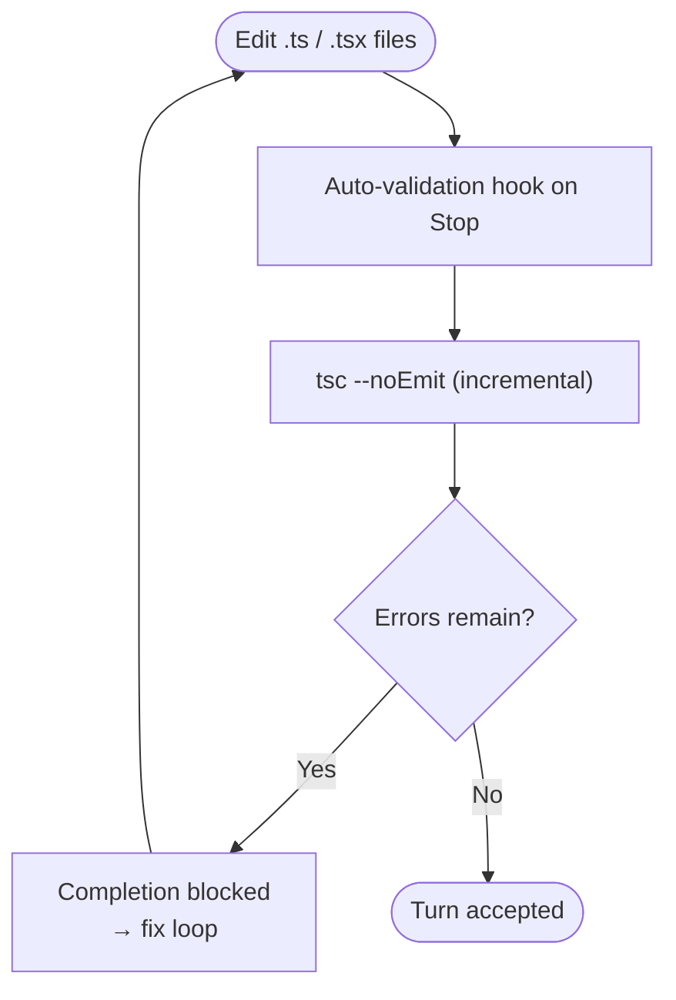

A practical, convention-driven walkthrough of how a new feature is designed, implemented, type-checked, reviewed, and shipped in OZEAON V2 — from branch creation to production deployment on Cloudflare Workers.

## Purpose and Scope

This page documents the **end-to-end developer workflow** for adding a new feature to the OZEAON V2 platform. It ties together the conventions that a contributor must respect at each layer of the stack:

- Branch, commit, and PR conventions
- Data access patterns (Supabase clients, RLS, type derivation)
- API route and Server Action patterns
- Component reuse and design-system constraints
- Type generation and type-checking gates
- Database migration/trigger conventions
- Preview environments and production deployment

This page is a **cross-cutting developer guide**. It does not re-document the internal mechanics of individual subsystems. For deeper reference material on those topics, see the sibling pages and the dedicated docs listed in [Related Links](#related-links). In particular:

- For the component inventory and RHF wrapper patterns, see the Component Library documentation.
- For the type scale and color tokens, see the Design System documentation.
- For storage upload/URL/delete flows, see the R2 Storage documentation.
- For environment variable validation and rollback, see the Ops/Deployment documentation.

## Overview

OZEAON V2 is a full-stack ocean conservation platform built with **Next.js (App Router)**, **React Server Components**, **TypeScript (strict)**, **Supabase (PostgreSQL + RLS)**, **Zod v4**, **React Hook Form**, and **Tailwind CSS v4**. It deploys to the edge via **OpenNext + Wrangler → Cloudflare Workers**.

Because the stack is convention-heavy, adding a feature is less about inventing new patterns and more about **fitting into existing ones**. The project's `CLAUDE.md` guidance is explicit that contributors should never hand-roll primitives, never hand-roll types, and never reinvent infrastructure that already exists. A successful feature PR therefore consists of:

1. A branch named per convention and a Conventional Commits message.
2. Zod schemas + derived TypeScript types from the generated Supabase types.
3. Data access through the **correct Supabase client** for the rendering context.
4. Mutations through Server Actions (with ownership checks and cache revalidation) or API routes (`withAuthUser`).
5. UI assembled from the existing component library and design tokens.
6. A database migration + regenerated types when new tables/columns are needed.
7. Type-checking that passes the automatic `tsc --noEmit` gate.
8. A PR that closes a Monday ticket and ships through the preview → production pipeline.



The diagram above encodes the real decision points a contributor encounters: whether a schema change is required, which Supabase client applies to the rendering context, and how mutations are expressed. Each of these is expanded in the sections below.

## Step 1 — Branching, Commits, and PR Conventions

Every feature starts from a branch named per the documented convention and is committed using Conventional Commits.

### Branch naming

| Pattern | Purpose |
| --- | --- |
| `feat/short-description` | New features |
| `feat/tozn-051` | Ticket-related feature (human legibility only) |
| `fix/issue-number-description` | Bug fixes |
| `chore/task-description` | Maintenance |
| `release/v1.2.0` | Release preparation |

> Source: [workflows.md](https://github.com/ozeaon/ozeaon-v2/blob/0a4f1a95824db87782f1221a4108019d174df3d9/docs/workflows.md#L47-L53)

### Commit format

The commit format is `<type>(<scope>): <description>`, followed by an optional body and footer.

```
<type>(<scope>): <description>

[optional body]

[optional footer]
```

Supported types and their release impact:

| Type | Meaning | Release impact |
| --- | --- | --- |
| `feat` | New feature | Minor version bump |
| `fix` | Bug fix | Patch version bump |
| `docs` | Documentation only | — |
| `chore` | Maintenance | — |
| `ci` | CI/CD changes | — |
| `refactor` | Code improvement | — |

> Sources: [workflows.md](https://github.com/ozeaon/ozeaon-v2/blob/0a4f1a95824db87782f1221a4108019d174df3d9/docs/workflows.md#L19-L45)

### PR requirements

A feature PR must satisfy these requirements before it can merge:

1. **Title** matches the commit format.
2. **Description** states what changed, why, and how to test.
3. **Ticket** linkage via `Closes TOZN-<n>` / `Closes BOZN-<n>` in the title or description, or a `no-ticket` label.
4. **Tags** added in metadata.
5. **Review** — a Code Owner's approval is required for `src/`, `supabase/`, and `.github/workflows/` per `.github/CODEOWNERS`.
6. **Checks** — no status check is currently required on `main`, so a red check blocks nothing. Read the checks before merging.

> Source: [workflows.md](https://github.com/ozeaon/ozeaon-v2/blob/0a4f1a95824db87782f1221a4108019d174df3d9/docs/workflows.md#L55-L65)

**Design intent:** The ticket link is deliberately restricted to an explicit `Closes` line in the PR title/description — commit messages are *not* read, and IDs inside backticks or fenced blocks are ignored. This prevents a PR that merely documents the syntax from accidentally moving a live ticket. See the Monday tickets section of the workflow guide for the full lifecycle table.

> Source: [workflows.md](https://github.com/ozeaon/ozeaon-v2/blob/0a4f1a95824db87782f1221a4108019d174df3d9/docs/workflows.md#L67-L127)

## Step 2 — Data Access: Choosing the Correct Supabase Client

OZEAON V2 exposes **four distinct Supabase clients**, and picking the right one is the single most important correctness decision when adding a feature. The choice determines both security (RLS enforcement) and rendering behavior (static prerender vs. dynamic).

| Client | Import | Use In |
| --- | --- | --- |
| Server | `@/lib/supabase/server` | Server Components, Server Actions, API routes |
| Browser | `@/lib/supabase/client` | Client Components (`"use client"`) — create fresh per call |
| Admin | `@/lib/supabase/admin` | API routes bypassing RLS (use sparingly) |
| Public | `@/lib/supabase/public` | Unauthenticated public queries |

> Source: [CLAUDE.md](https://github.com/ozeaon/ozeaon-v2/blob/0a4f1a95824db87782f1221a4108019d174df3d9/CLAUDE.md#L82-L89)

### The SSR dynamic-rendering signal

A critical design point: with `cacheComponents: false`, calling `await createClient()` (the server client) internally calls `cookies()`, which **automatically opts that route into dynamic rendering**. There is no need to declare `export const dynamic` — in fact you must **never** use the old model directives (`export const dynamic` / `revalidate` / `fetchCache` / `runtime`).

The safety rules that follow from this:

- Always use `createClient()` (server client) for **any user-specific data** — the `cookies()` call inside is the dynamic signal.
- Never use `createPublicClient()` or the admin client in a component that **also renders user-specific state**.
- Public pages (articles, profiles, etc.) that use only `createPublicClient()` will correctly prerender statically.

> Source: [CLAUDE.md](https://github.com/ozeaon/ozeaon-v2/blob/0a4f1a95824db87782f1221a4108019d174df3d9/CLAUDE.md#L11-L21)

### Server Component / API route pattern

```typescript
// Server Component / API route
import { createClient } from "@/lib/supabase/server";

const supabase = await createClient();
```

> Source: [CLAUDE.md](https://github.com/ozeaon/ozeaon-v2/blob/0a4f1a95824db87782f1221a4108019d174df3d9/CLAUDE.md#L91-L96)

### Client Component pattern

```typescript
// Client Component
"use client";
// ⚠️ Create fresh per request, never cache globally
import { createClient } from "@/lib/supabase/client";

const supabase = createClient();
```

> Source: [CLAUDE.md](https://github.com/ozeaon/ozeaon-v2/blob/0a4f1a95824db87782f1221a4108019d174df3d9/CLAUDE.md#L124-L131)

### Reusing the memoized auth client

Both `getAuthUser()` and `getAuthUserOrRedirect()` already return a `supabase` client **memoized by React `cache()` for the request**. Calling `createClient()` again after either of them creates a second, unnecessary client.

```typescript
// ❌ Wrong — two clients for one request
const supabase = await createClient();
const { user } = await getAuthUserOrRedirect();

// ✅ Correct — reuse the client from auth
const { user, supabase } = await getAuthUserOrRedirect();
```

> Source: [CLAUDE.md](https://github.com/ozeaon/ozeaon-v2/blob/0a4f1a95824db87782f1221a4108019d174df3d9/CLAUDE.md#L98-L107)

### Route handlers using `withAuthUser`

Route handlers wrapped in `withAuthUser` receive `supabase` via the handler context — never call `createClient()` inside such a handler:

```typescript
// ❌ Wrong
export const POST = withAuthUser(async (req, { user }) => {
  const supabase = await createClient();
  ...
});

// ✅ Correct
export const POST = withAuthUser(async (req, { user, supabase }) => {
  ...
});
```

> Source: [CLAUDE.md](https://github.com/ozeaon/ozeaon-v2/blob/0a4f1a95824db87782f1221a4108019d174df3d9/CLAUDE.md#L109-L122)

**Design intent:** Memoizing the client per request eliminates redundant auth round-trips and guarantees that the user identity observed during authorization and the data-access identity used by the handler are the **same** client instance — removing a class of subtle auth/RLS mismatches.

## Step 3 — Type System: Derive, Never Hand-Roll

All domain types must be **derived from the generated Supabase types** in `@/types/supabase`. Never hand-write row shapes. Domain types live in `src/types/` and must never be defined inside component files.

```typescript
type Project = Tables<"projects">; // full row
type Slug = Pick<Tables<"resource_subcategories">, "id" | "name" | "slug">; // projection
type Comment = Tables<"comments"> & { author: UserProfileForJoin }; // join
type Article = Omit<Tables<"articles">, "article_type"> & {
  // FK override
  article_type: { id: number; type: string } | null;
};
const insert: TablesInsert<"projects"> = { title, slug, created_by: user.id }; // mutation
```

> Source: [CLAUDE.md](https://github.com/ozeaon/ozeaon-v2/blob/0a4f1a95824db87782f1221a4108019d174df3d9/CLAUDE.md#L164-L179)

Type-verification rule: verify that every fix resolves the **exact** error, and check that field names match between **Zod schemas, DB types, and props** (for example `author_name` vs `display_name`). This three-way consistency check is the most common source of feature bugs.

> Source: [CLAUDE.md](https://github.com/ozeaon/ozeaon-v2/blob/0a4f1a95824db87782f1221a4108019d174df3d9/CLAUDE.md#L38-L42)

### Regenerating types after a migration

When a feature adds or changes a table, run:

```bash
pnpm db:gen
```

This regenerates the Supabase DB schema types. It must be run **after** migrations, before the derived types will compile.

> Source: [CLAUDE.md](https://github.com/ozeaon/ozeaon-v2/blob/0a4f1a95824db87782f1221a4108019d174df3d9/CLAUDE.md#L61-L78)

## Step 4 — Mutations: API Routes and Server Actions

The project defines distinct patterns for API routes and Server Actions.

### API routes

- Authenticate with `supabase.auth.getUser()`; return **`401`** if there is no user.
- Use `TablesInsert<"table">` for insert shapes.
- Return `201` on create, `400` on validation failure, `500` on error.

> Source: [CLAUDE.md](https://github.com/ozeaon/ozeaon-v2/blob/0a4f1a95824db87782f1221a4108019d174df3d9/CLAUDE.md#L140-L144)

### Server Actions

- **Always verify ownership** — add `.eq("user_id", user.id)` to mutations.
- Call `revalidateTag(...)` after writes.

> Source: [CLAUDE.md](https://github.com/ozeaon/ozeaon-v2/blob/0a4f1a95824db87782f1221a4108019d174df3d9/CLAUDE.md#L142-L144)



**Design intent:** Ownership enforcement is pushed into the mutation query itself (`.eq("user_id", user.id)`) rather than being a separate pre-check. This closes the time-of-check/time-of-use gap and keeps the authorization assertion atomic with the write. `revalidateTag(...)` immediately after the write ensures that any cached reads reflecting the old state are invalidated, which matters especially on statically-rendered public pages.

## Step 5 — UI: Reuse the Component Library and Design Tokens

Two hard constraints apply to every UI change.

### Never reinvent an existing primitive

Before writing new UI, check the component library documentation. The primitives most often reinvented as raw markup are:

| Primitive | Never use instead |
| --- | --- |
| `EmptyState` | A raw centered `<div>` |
| `GridLayout` | Raw `grid` classes |
| `Button` / `LoadingButton` | Icons via `iconLeft` / `iconRight` props, never JSX children |
| `ConfirmDialog` | `window.confirm()` |

> Source: [CLAUDE.md](https://github.com/ozeaon/ozeaon-v2/blob/0a4f1a95824db87782f1221a4108019d174df3d9/CLAUDE.md#L183-L189)

### Never use raw Tailwind size or color utilities

Styling must use the project's typography and color tokens, defined in `src/styles/typography.css` and `src/styles/globals.css`. Read the design-system documentation before touching any UI styling.

> Source: [CLAUDE.md](https://github.com/ozeaon/ozeaon-v2/blob/0a4f1a95824db87782f1221a4108019d174df3d9/CLAUDE.md#L193-L197)

### Import conventions

```typescript
import { useAuth } from "@/hooks"; // barrel exports
import { env, IMAGE_CONFIG } from "@/config";
import { validateFileType, generateUniqueKey } from "@/utils";
import { createClient } from "@/lib/supabase/server"; // explicit Supabase client imports
import { cn } from "@/utils/shadcn/utils";
import type { Tables, TablesInsert, TablesUpdate } from "@/types/supabase";
```

> Source: [CLAUDE.md](https://github.com/ozeaon/ozeaon-v2/blob/0a4f1a95824db87782f1221a4108019d174df3d9/CLAUDE.md#L150-L157)

Domain cards import from the domain's `cards/` subdirectory: `@/components/posts/cards`, `@/components/articles/cards`, etc.

> Source: [CLAUDE.md](https://github.com/ozeaon/ozeaon-v2/blob/0a4f1a95824db87782f1221a4108019d174df3d9/CLAUDE.md#L159-L160)

## Step 6 — Database Changes: Migrations and Triggers

If the feature needs new tables, columns, or derived state, the change belongs in a Supabase migration — not in application code.

### Schema overview

Core tables: `user_profiles`, `organizations`, `pods`, `projects`, `educational_resources`, `articles`, `posts`.

Relationship tables: `organization_members`, `project_participants`, `follows`, `reactions`, `comments`, `bookmarks`.

The full schema lives in `docs/db/schema.sql`.

> Source: [CLAUDE.md](https://github.com/ozeaon/ozeaon-v2/blob/0a4f1a95824db87782f1221a4108019d174df3d9/CLAUDE.md#L201-L207)

### Trigger convention

Use **PostgreSQL triggers** for any logic that is a deterministic side-effect of a row state change — audit timestamps, cascading inserts on status change, denormalised counters, invariant enforcement. Such logic must **never** live in API routes or Server Actions.

When writing a trigger, invoke the `db-trigger` skill rather than hand-rolling a trigger function. That skill encodes the project's full security convention (`SECURITY DEFINER`, `search_path`, revoke grants) derived from its migration history.

> Source: [CLAUDE.md](https://github.com/ozeaon/ozeaon-v2/blob/0a4f1a95824db87782f1221a4108019d174df3d9/CLAUDE.md#L211-L217)

**Design intent:** Moving deterministic side-effects into the database guarantees they hold regardless of which application path mutates the row (API route, Server Action, admin script, or direct SQL). Centralizing them in triggers removes the risk of an application path forgetting to maintain a counter or audit column.

### Preview fixture coupling

A migration that changes what the preview fixture writes to **must update the fixture in the same PR** (`supabase/seeds/10-preview-fixture.sql`).

> Source: [CLAUDE.md](https://github.com/ozeaon/ozeaon-v2/blob/0a4f1a95824db87782f1221a4108019d174df3d9/CLAUDE.md#L231-L233)



The diagram shows the key design principle: whatever path mutates the row, the trigger is the single source of truth for derived state.

## Step 7 — Storage: Always Use the StorageAdapter

For any file upload, URL generation, or deletion, always go through `StorageAdapter` (`@/lib/storage/adapter`). Never use the raw R2 binding or an S3-compatible client directly. The full upload/URL/delete pattern and image-caching notes live in the R2 Storage documentation.

> Source: [CLAUDE.md](https://github.com/ozeaon/ozeaon-v2/blob/0a4f1a95824db87782f1221a4108019d174df3d9/CLAUDE.md#L133-L136)

## Step 8 — Verification Gates

Two automated gates protect feature quality.

### TypeScript gate (automatic)

On Stop, if any `.ts`/`.tsx` files were edited during the turn, an **auto-validation hook** runs an incremental `tsc --noEmit` and **blocks completion** if errors remain, forcing a fix loop. There is no need to run `tsc` manually — but you can run it explicitly with:

```bash
pnpm check
```

> Sources: [CLAUDE.md](https://github.com/ozeaon/ozeaon-v2/blob/0a4f1a95824db87782f1221a4108019d174df3d9/CLAUDE.md#L38-L42), [CLAUDE.md](https://github.com/ozeaon/ozeaon-v2/blob/0a4f1a95824db87782f1221a4108019d174df3d9/CLAUDE.md#L61-L78)

### Lint and format

```bash
pnpm lint      # Run ESLint
pnpm lint:fix  # Run ESLint with auto-fix
pnpm format    # Format with Prettier
```

> Source: [CLAUDE.md](https://github.com/ozeaon/ozeaon-v2/blob/0a4f1a95824db87782f1221a4108019d174df3d9/CLAUDE.md#L61-L78)

### Route type generation

```bash
pnpm typegen   # Generate Next.js route types + Cloudflare env types
```

> Source: [CLAUDE.md](https://github.com/ozeaon/ozeaon-v2/blob/0a4f1a95824db87782f1221a4108019d174df3d9/CLAUDE.md#L61-L78)



## Step 9 — Shipping: Preview Environments and Production

### Development flow

The documented development flow is:

1. Create feature branch: `feat/feature-name`, `feat/tozn-051`
2. Develop locally: `pnpm dev`
3. Commit with Conventional Commits format
4. Push → Create PR to `main`, with `Closes TOZN-<n>` in the title or description
5. Review and QA on the PR's own preview environment
6. After checks are done and reviews are submitted → Merge
7. Auto-deployment to production

> Source: [workflows.md](https://github.com/ozeaon/ozeaon-v2/blob/0a4f1a95824db87782f1221a4108019d174df3d9/docs/workflows.md#L3-L13)

### Preview environments

Every PR into `main` gets its **own Worker and Supabase branch**, seeded from `supabase/seeds/10-preview-fixture.sql`. A migration that changes what the fixture writes to needs the fixture updated in the same PR.

> Source: [CLAUDE.md](https://github.com/ozeaon/ozeaon-v2/blob/0a4f1a95824db87782f1221a4108019d174df3d9/CLAUDE.md#L231-L233)

### Deployment commands

| Command | Description |
| --- | --- |
| `pnpm dev` | Start dev server with Turbopack (localhost:3000) |
| `pnpm build` | Production Next.js build |
| `pnpm preview` | Preview Cloudflare deployment locally |
| `pnpm ci:build` | Production build with Cloudflare adapter |
| `pnpm ci:deploy` | Deploy to Cloudflare |
| `pnpm clean-cache` | Clean all build caches |

> Source: [CLAUDE.md](https://github.com/ozeaon/ozeaon-v2/blob/0a4f1a95824db87782f1221a4108019d174df3d9/CLAUDE.md#L61-L78)

The production path is:

```
pnpm ci:build → pnpm ci:deploy
```

> Source: [CLAUDE.md](https://github.com/ozeaon/ozeaon-v2/blob/0a4f1a95824db87782f1221a4108019d174df3d9/CLAUDE.md#L221-L229)

### Deployment caveat: always pass `--env`

⚠️ Always pass `--env staging` or `--env production` to `ci:deploy`. The top-level config has no `services` block, so omitting `--env` breaks `WORKER_SELF_REFERENCE`.

> Source: [CLAUDE.md](https://github.com/ozeaon/ozeaon-v2/blob/0a4f1a95824db87782f1221a4108019d174df3d9/CLAUDE.md#L227-L229)

### Rollback and seed/database utilities

```bash
wrangler rollback      # Roll back a Cloudflare Worker deployment
pnpm db:seed-dump      # Dump remote data to supabase/seed.sql
pnpm db:reset-real     # Load the real dump instead of the preview fixture
```

> Sources: [workflows.md](https://github.com/ozeaon/ozeaon-v2/blob/0a4f1a95824db87782f1221a4108019d174df3d9/docs/workflows.md#L149-L153), [CLAUDE.md](https://github.com/ozeaon/ozeaon-v2/blob/0a4f1a95824db87782f1221a4108019d174df3d9/CLAUDE.md#L61-L78)

## Reference: Feature Checklist

A condensed checklist for a feature PR, distilled from the conventions above.

| # | Step | Command / Location |
| --- | --- | --- |
| 1 | Create branch with conventional name | `feat/short-description` |
| 2 | Add migration if schema changes | `supabase/` migrations |
| 3 | Add/verify trigger for derived state | `db-trigger` skill |
| 4 | Regenerate DB types | `pnpm db:gen` |
| 5 | Derive types from generated types | `@/types/supabase`, `src/types/` |
| 6 | Write Zod v4 schema for input validation | feature module |
| 7 | Select correct Supabase client per context | `@/lib/supabase/{server,client,admin,public}` |
| 8 | Implement Server Action with ownership + `revalidateTag`, or API route with correct status codes | feature code |
| 9 | Build UI from the component library and design tokens | `docs/component-library.md`, `docs/design-system.md` |
| 10 | Route storage through `StorageAdapter` if files are involved | `@/lib/storage/adapter` |
| 11 | Pass type-check and lint | `pnpm check`, `pnpm lint` |
| 12 | Update preview fixture if the migration affects it | `supabase/seeds/10-preview-fixture.sql` |
| 13 | Open PR with `Closes TOZN-<n>` | PR to `main` |
| 14 | QA on preview environment, then merge | PR preview Worker + Supabase branch |

## Failure Modes and Edge Cases

| Situation | Wrong approach | Correct approach |
| --- | --- | --- |
| User-specific data in a Server Component | Using `createPublicClient()` / admin client | Use `createClient()` — its internal `cookies()` call is the dynamic signal |
| Route handler wrapped in `withAuthUser` | Calling `createClient()` inside the handler | Destructure `supabase` from the handler context |
| Code after `getAuthUserOrRedirect()` | Calling `createClient()` again | Reuse `supabase` returned by the auth helper |
| Forcing dynamic/static rendering | `export const dynamic` / `revalidate` / `fetchCache` / `runtime` | Rely on the `cookies()` signal; never use old model directives |
| Client Component Supabase client | Caching a client globally | Create a fresh client per call |
| Mutation authorization | Separate pre-check then write | Add `.eq("user_id", user.id)` to the mutation |
| Cache staleness after write | Forgetting invalidation | Call `revalidateTag(...)` after writes |
| Derived state / counters | Application-level updates | Deterministic PostgreSQL trigger |
| Status codes | Ad-hoc codes | `201` create, `400` validation, `401` unauthorized, `500` error |

> Sources: [CLAUDE.md](https://github.com/ozeaon/ozeaon-v2/blob/0a4f1a95824db87782f1221a4108019d174df3d9/CLAUDE.md#L11-L21), [CLAUDE.md](https://github.com/ozeaon/ozeaon-v2/blob/0a4f1a95824db87782f1221a4108019d174df3d9/CLAUDE.md#L98-L122), [CLAUDE.md](https://github.com/ozeaon/ozeaon-v2/blob/0a4f1a95824db87782f1221a4108019d174df3d9/CLAUDE.md#L140-L144), [CLAUDE.md](https://github.com/ozeaon/ozeaon-v2/blob/0a4f1a95824db87782f1221a4108019d174df3d9/CLAUDE.md#L211-L217)

### Known coupling and consistency risks

- **Zod ↔ DB ↔ props field-name drift.** The documented example is `author_name` vs `display_name`. A mismatch here will usually pass TypeScript when the shape is structurally compatible and fail only at runtime. Always verify all three ends.
- **Migration ↔ preview fixture drift.** If a migration changes what the preview fixture writes but the fixture is not updated in the same PR, preview environments will diverge from the real schema.
- **Unreviewed merges.** Because no status check is required on `main`, a red CI check blocks nothing. Contributors must read the checks manually before merging. PRs touching none of `src/`, `supabase/`, or `.github/workflows/` can merge unreviewed.

> Sources: [CLAUDE.md](https://github.com/ozeaon/ozeaon-v2/blob/0a4f1a95824db87782f1221a4108019d174df3d9/CLAUDE.md#L38-L42), [CLAUDE.md](https://github.com/ozeaon/ozeaon-v2/blob/0a4f1a95824db87782f1221a4108019d174df3d9/CLAUDE.md#L231-L233), [workflows.md](https://github.com/ozeaon/ozeaon-v2/blob/0a4f1a95824db87782f1221a4108019d174df3d9/docs/workflows.md#L55-L65)

## Technology Constraints That Shape Implementation

Exact installed versions drift — check `package.json` rather than trusting a hand-copied table. The breaking changes that matter for how you write feature code:

- **Next.js:** `cookies()` / `headers()` are **async** (breaking change from 14) — always `await` them.
- **Zod:** the project is on **v4** — breaking changes from v3; do not use deprecated v3 APIs.
- **Tailwind CSS:** on **v4** — the config format differs from v3; do not reach for a `tailwind.config.js` pattern.
- **Package manager:** **pnpm only** — never `npm` or `yarn`.

> Source: [CLAUDE.md](https://github.com/ozeaon/ozeaon-v2/blob/0a4f1a95824db87782f1221a4108019d174df3d9/CLAUDE.md#L46-L57)

A forward-looking note from the project guidance: once the feature set is stable with the Cloudflare adapter, the project will move to `cacheComponents` — the newer cache model for Next.js 16.

> Source: [CLAUDE.md](https://github.com/ozeaon/ozeaon-v2/blob/0a4f1a95824db87782f1221a4108019d174df3d9/CLAUDE.md#L11-L12)

## Extension Points

The stack exposes the following well-defined extension points for new features:

| Extension point | Where | Notes |
| --- | --- | --- |
| Database triggers | Supabase migrations | Deterministic side-effects; use the `db-trigger` skill |
| Server Actions | Feature modules | Ownership-scoped mutations + `revalidateTag` |
| API routes | `withAuthUser` wrappers | Auth via context; no `createClient()` inside |
| Storage operations | `StorageAdapter` | Never the raw R2 binding |
| UI primitives | Component library | Reuse; never reinvent markup |
| Design tokens | `src/styles/typography.css`, `src/styles/globals.css` | Never raw Tailwind size/color utilities |
| Generated types | `@/types/supabase` | Regenerate with `pnpm db:gen` after migrations |

> Sources: [CLAUDE.md](https://github.com/ozeaon/ozeaon-v2/blob/0a4f1a95824db87782f1221a4108019d174df3d9/CLAUDE.md#L133-L136), [CLAUDE.md](https://github.com/ozeaon/ozeaon-v2/blob/0a4f1a95824db87782f1221a4108019d174df3d9/CLAUDE.md#L183-L197), [CLAUDE.md](https://github.com/ozeaon/ozeaon-v2/blob/0a4f1a95824db87782f1221a4108019d174df3d9/CLAUDE.md#L211-L217)

## Related Links

- [Development Workflow Guide](https://github.com/ozeaon/ozeaon-v2/blob/0a4f1a95824db87782f1221a4108019d174df3d9/docs/workflows.md) — branch, commit, PR, Monday ticket, and deployment commands
- [Deployment Guide](https://github.com/ozeaon/ozeaon-v2/blob/0a4f1a95824db87782f1221a4108019d174df3d9/docs/ops-deployment.md) — environment variables, `--env` requirement, troubleshooting
- [Deployment Previews](https://github.com/ozeaon/ozeaon-v2/blob/0a4f1a95824db87782f1221a4108019d174df3d9/docs/deployment-previews.md) — per-PR Worker and Supabase branch behavior
- [Component Library](https://github.com/ozeaon/ozeaon-v2/blob/0a4f1a95824db87782f1221a4108019d174df3d9/docs/component-library.md) — full primitive list, RHF wrappers, feed/skeleton patterns
- [Design System](https://github.com/ozeaon/ozeaon-v2/blob/0a4f1a95824db87782f1221a4108019d174df3d9/docs/design-system.md) — type scale, text color, and background token tables
- [Hook Form Components](https://github.com/ozeaon/ozeaon-v2/blob/0a4f1a95824db87782f1221a4108019d174df3d9/docs/hook-form-components.md) — React Hook Form wrapper components
- [R2 Storage](https://github.com/ozeaon/ozeaon-v2/blob/0a4f1a95824db87782f1221a4108019d174df3d9/docs/r2-storage.md) — upload/URL/delete patterns and image caching
- [Supabase Local](https://github.com/ozeaon/ozeaon-v2/blob/0a4f1a95824db87782f1221a4108019d174df3d9/docs/supabase-local.md) — local Supabase setup
- [Logging Conventions](https://github.com/ozeaon/ozeaon-v2/blob/0a4f1a95824db87782f1221a4108019d174df3d9/docs/logging-conventions.md) — logging standards
- [Project Guidance](https://github.com/ozeaon/ozeaon-v2/blob/0a4f1a95824db87782f1221a4108019d174df3d9/CLAUDE.md) — canonical source for all conventions referenced on this page
