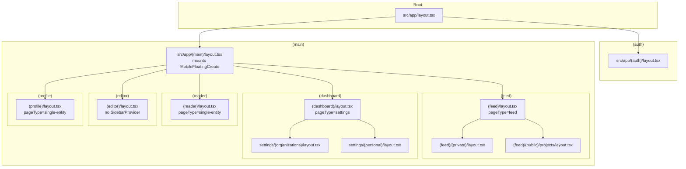
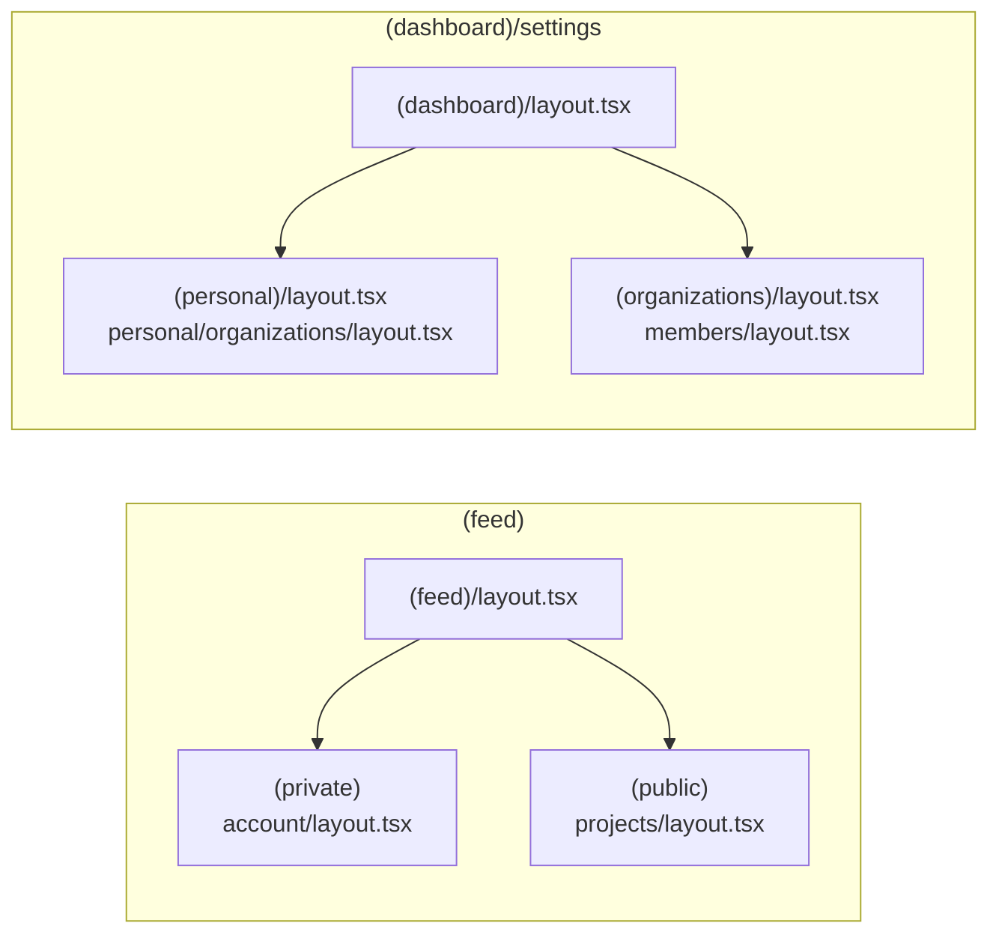
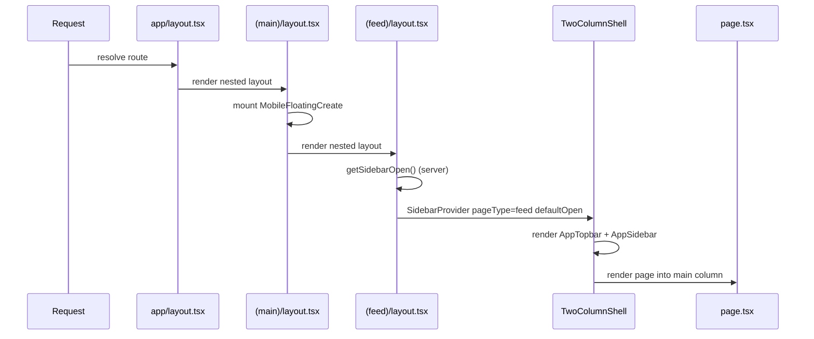
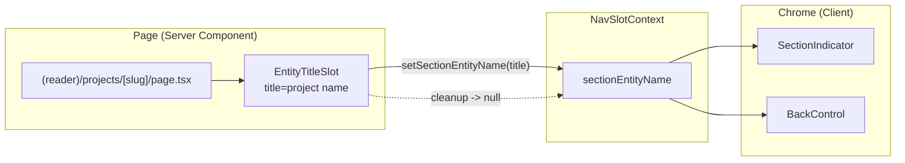

The Ozeaon v2 application is a Next.js App Router codebase whose route tree under `src/app` is organized into **parenthesized route groups** that partition the product into layout shells (feed, dashboard, reader, editor, profile, auth) rather than into URL segments. This page documents that structure: how route groups compose, which layout owns which shell, and the conventions that keep the tree navigable.

## Purpose and Scope

This page covers the physical layout of the `src/app` directory — the route-group taxonomy, the layout nesting chain (root → `(main)` → feature group → sub-group), the shell components each group instantiates, and the naming/convention rules that the codebase enforces on that tree.

It intentionally does **not** cover:

- The design specification for nav chrome (TopNav, MegaMenu, SideNav, floating create button) — that belongs to the navigation documentation.
- Logging category derivation mechanics beyond the route-group stripping rule — see the logging conventions page.
- Individual feature behaviour inside each group (feed, projects, articles, settings).

For route-group–aware category derivation in the logging system, see the logging conventions document referenced under Related Links.

## Overview

Next.js App Router supports **route groups**: a directory wrapped in parentheses (e.g. `(main)`) is *omitted from the URL path* but still participates in layout nesting. Ozeaon uses this feature for two distinct purposes:

1. **Layout partitioning** — a group exists because its members share a chrome shell (topbar + sidebar + shell primitive), not because they share a URL prefix. `(feed)`, `(dashboard)`, `(reader)`, `(editor)`, `(profile)`, and `(auth)` each select a different `SidebarProvider` `pageType` and shell configuration.
2. **Access-tier partitioning** — nested groups such as `(private)` and `(public)` inside `(feed)`, and `(personal)` / `(organizations)` inside `settings`, separate sub-trees that share the parent's layout but differ in auth requirement or data scope.

The consequence for the URL space is significant: routes like `/projects/[slug]` may be reached through `(main)/(reader)/projects/[slug]`, while `/projects` list routes live under `(main)/(feed)/(public)/projects`. **The same URL shape can be produced by different route groups**, so the group is a layout/authorization concept, not a URL concept. This is precisely why the logging convention forbids deriving categories from the *last* path segment and requires stripping parenthesized segments instead — see below.

### Terminology

| Term | Meaning in this codebase |
|------|--------------------------|
| Route group | A `(name)` directory under `src/app`; excluded from the URL |
| Layout | A `layout.tsx` file; wraps all descendants until the next `layout.tsx` |
| Shell | A `src/components/ui/layout/shells/*` primitive (`TwoColumnShell`, `SidebarShell`) that a layout renders |
| `pageType` | Prop passed to `SidebarProvider` that selects chrome behaviour per group |
| Slot | A Next.js parallel route (`@sidebar`) rendered by a layout as a named prop |

## Architecture

The route tree is a nested layout chain. Each level adds chrome and narrows the rendering contract for its descendants.



The diagram reflects the verified layout file set under `src/app`:

- `src/app/layout.tsx` — the single top-level layout.
- `src/app/(auth)/layout.tsx` — authentication chrome, sibling to `(main)`.
- `src/app/(main)/layout.tsx` — the authenticated application shell boundary; documented as the mount point for the mobile floating create control.
- Five feature groups directly under `(main)`, each contributing its own layout and shell configuration.

> Sources:
> - [layout.tsx](https://github.com/ozeaon/ozeaon-v2/blob/0a4f1a95824db87782f1221a4108019d174df3d9/src/app/(main)/(feed)/layout.tsx#L1-L18)
> - [layout.tsx](https://github.com/ozeaon/ozeaon-v2/blob/0a4f1a95824db87782f1221a4108019d174df3d9/src/app/(main)/(dashboard)/layout.tsx#L1-L31)
> - [layout.tsx](https://github.com/ozeaon/ozeaon-v2/blob/0a4f1a95824db87782f1221a4108019d174df3d9/src/app/(main)/(reader)/layout.tsx#L1-L37)
> - [layout.tsx](https://github.com/ozeaon/ozeaon-v2/blob/0a4f1a95824db87782f1221a4108019d174df3d9/src/app/(main)/(profile)/layout.tsx#L1-L23)
> - [DESIGN-CONSISTENCY-PLAN.md](https://github.com/ozeaon/ozeaon-v2/blob/0a4f1a95824db87782f1221a4108019d174df3d9/DESIGN-CONSISTENCY-PLAN.md#L571-L597)

## Route Group Taxonomy

### Top-level split: `(auth)` vs `(main)`

Two groups hang off the root layout:

- **`(auth)`** — holds login/registration routes. It has its own `layout.tsx` because auth screens do not want the application topbar/sidebar chrome. It is a sibling of `(main)`, not a child, so that the authenticated shell never wraps an unauthenticated screen.
- **`(main)`** — the authenticated application. Every feature group lives inside it. Because `(main)/layout.tsx` is upstream of all five feature groups, anything mounted there (such as the floating create button) is guaranteed to appear exactly once across the whole authenticated product.

### The five feature groups under `(main)`

Each feature group exists to select a distinct chrome configuration. The differentiator is the `pageType` prop handed to `SidebarProvider`, which drives sidebar behaviour downstream:

| Route group | `pageType` | Shell composition | Verified source |
|-------------|-----------|-------------------|-----------------|
| `(feed)` | `"feed"` | `TwoColumnShell` with `AppTopbar` + `AppSidebar`, sidebar open state read from server | [layout.tsx](https://github.com/ozeaon/ozeaon-v2/blob/0a4f1a95824db87782f1221a4108019d174df3d9/src/app/(main)/(feed)/layout.tsx#L13-L17) |
| `(dashboard)` (settings) | `"settings"` | `TwoColumnShell` with `DashboardNavSlot`, `defaultOpen={false}` | [layout.tsx](https://github.com/ozeaon/ozeaon-v2/blob/0a4f1a95824db87782f1221a4108019d174df3d9/src/app/(main)/(dashboard)/layout.tsx#L21-L30) |
| `(reader)` | `"single-entity"` | `SidebarProvider` + `Footer` + `STICKY_ASIDE_CLASS`, parallel `@sidebar` slot | [layout.tsx](https://github.com/ozeaon/ozeaon-v2/blob/0a4f1a95824db87782f1221a4108019d174df3d9/src/app/(main)/(reader)/layout.tsx#L18-L36) |
| `(profile)` | `"single-entity"` | `SidebarProvider` + `Footer`, sidebar open state from server | [layout.tsx](https://github.com/ozeaon/ozeaon-v2/blob/0a4f1a95824db87782f1221a4108019d174df3d9/src/app/(main)/(profile)/layout.tsx#L13-L22) |
| `(editor)` | *none* | **Deliberately not wrapped in `SidebarProvider`** | [DESIGN-CONSISTENCY-PLAN.md](https://github.com/ozeaon/ozeaon-v2/blob/0a4f1a95824db87782f1221a4108019d174df3d9/DESIGN-CONSISTENCY-PLAN.md#L586-L588) |

#### Why `(reader)` and `(profile)` share `pageType="single-entity"`

Both groups render entity-scoped pages (`/projects/[slug]`, `/articles/[slug]`, `/organisations/[handle]`, `/profile/[handle]`) where the page itself is the subject and the sidebar is secondary. Giving them the same `pageType` means the TopNav's section indicator can render the entity name rather than the section name — the mechanism wired by `EntityTitleSlot`.

#### Why `(editor)` has no `SidebarProvider`

The editor chrome is intentionally chrome-free: no sidebar, no sidebar toggle, no wordmark. Rather than adding a conditional branch inside a shell, the codebase achieves this by simply *not providing* a `SidebarProvider` for that group, relying on the `useSidebarSafe` fallback in `TopNav` to degrade gracefully when the context is absent.

> Source: [DESIGN-CONSISTENCY-PLAN.md](https://github.com/ozeaon/ozeaon-v2/blob/0a4f1a95824db87782f1221a4108019d174df3d9/DESIGN-CONSISTENCY-PLAN.md#L586-L588)

### Nested groups: sub-partitioning without new URLs

Groups nest when a sub-tree needs a different access tier or data scope than its siblings, while still inheriting the parent's shell:



The verified nested layout set:

- `(feed)/(private)/layout.tsx` and `(feed)/(private)/account/layout.tsx` — an auth-gated sub-tree (account surfaces) inside the feed.
- `(feed)/(public)/projects/layout.tsx` — a publicly reachable sub-tree inside the feed.
- `(dashboard)/settings/(personal)/layout.tsx` and `(dashboard)/settings/(personal)/organizations/layout.tsx` — personal-scope settings pages.
- `(dashboard)/settings/(organizations)/layout.tsx` and `(dashboard)/settings/(organizations)/members/layout.tsx` — organisation-scope settings pages.

Because `(private)`, `(public)`, `(personal)`, and `(organizations)` are all parenthesized, **none of them appear in the URL**. `/settings/members` and `/settings/organizations` are both reachable under `/settings`, distinguished only by which layout chain wraps them. This is the core reason the logging convention treats route-group stripping as mandatory rather than cosmetic.

> Sources:
> - [logging-conventions.md](https://github.com/ozeaon/ozeaon-v2/blob/0a4f1a95824db87782f1221a4108019d174df3d9/docs/logging-conventions.md#L7-L11)
> - [DESIGN-CONSISTENCY-PLAN.md](https://github.com/ozeaon/ozeaon-v2/blob/0a4f1a95824db87782f1221a4108019d174df3d9/DESIGN-CONSISTENCY-PLAN.md#L571-L600)

## Layout Chain and the Shell Contract

Every layout in the tree is short and declarative: it reads server-side state, selects a `pageType`, and renders a shell primitive with named props. This keeps chrome policy in one place per group and keeps pages free of layout concerns.

### The `(feed)` layout: server-read sidebar state

The feed layout demonstrates the canonical pattern — read the persisted sidebar open state on the server, then pass it to the provider so the shell renders without a client-side flash:

```tsx
import { AppSidebar, AppTopbar } from "@/components/nav";
import { SidebarProvider, TwoColumnShell } from "@/components/ui";
import { getSidebarOpen } from "@/utils/data/sidebar-state.server";
// ...
return (
  <SidebarProvider pageType="feed" defaultOpen={sidebarOpen}>
    <TwoColumnShell topbar={<AppTopbar />} sidebar={<AppSidebar />}>
```

> Source: [layout.tsx](https://github.com/ozeaon/ozeaon-v2/blob/0a4f1a95824db87782f1221a4108019d174df3d9/src/app/(main)/(feed)/layout.tsx#L1-L14)

The design intent: `defaultOpen` must be resolved *before* the first paint. `getSidebarOpen` (a `.server` module) reads the user's persisted preference server-side, so `SidebarProvider` can initialise with the correct state and the shell never renders an open sidebar that immediately collapses. `TwoColumnShell` receives `topbar` and `sidebar` as React nodes rather than as configuration, which makes the shell agnostic about what the chrome actually is.

### The `(dashboard)` layout: auth gate plus settings nav slot

The settings group adds an authorization gate in addition to its shell:

```tsx
import { DashboardNavSlot } from "@/components/nav/slots";
import { SidebarProvider, TwoColumnShell } from "@/components/ui";
import { getAuthUserOrRedirect } from "@/lib/supabase/queries/auth";
// ...
return (
  <SidebarProvider pageType="settings" defaultOpen={false}>
    <TwoColumnShell
```

> Source: [layout.tsx](https://github.com/ozeaon/ozeaon-v2/blob/0a4f1a95824db87782f1221a4108019d174df3d9/src/app/(main)/(dashboard)/layout.tsx#L3-L22)

Two things distinguish this layout. First, `getAuthUserOrRedirect` is invoked *in the layout*, meaning every descendant route is gated by the layout's execution — no individual settings page needs to repeat the check. Second, `defaultOpen={false}` is hardcoded rather than server-read: settings is a deliberate-visit surface, so the correct default is always collapsed regardless of the user's feed preference. The right-hand slot is supplied by `DashboardNavSlot` instead of a generic `AppSidebar`, which is how the settings-specific rail and its composite `rightSlot` (`BackControl` + `NavUser`) get injected.

### The `(reader)` layout: parallel route slot

The reader layout is the only group that consumes a Next.js **parallel route**:

```tsx
return (
  <SidebarProvider pageType="single-entity" defaultOpen={sidebarOpen}>
    <div className="flex w-full flex-col">
```

> Source: [layout.tsx](https://github.com/ozeaon/ozeaon-v2/blob/0a4f1a95824db87782f1221a4108019d174df3d9/src/app/(main)/(reader)/layout.tsx#L17-L19)

It imports `Footer`, `SidebarProvider`, and `STICKY_ASIDE_CLASS`, and keeps a parallel `@sidebar` slot — the reader's right rail. That slot is explicitly **out of scope** for the navigation-consistency work, i.e. it is a deliberate exception retained at this level rather than migrated into the shared shell:

> Keep the parallel `@sidebar` slot as-is — reader right rail is out of scope for these tickets.
> — [DESIGN-CONSISTENCY-PLAN.md](https://github.com/ozeaon/ozeaon-v2/blob/0a4f1a95824db87782f1221a4108019d174df3d9/DESIGN-CONSISTENCY-PLAN.md#L571-L575)

### `(profile)` layout: same entity semantics, simpler shell

```tsx
return (
  <SidebarProvider pageType="single-entity" defaultOpen={sidebarOpen}>
    <div className="flex w-full flex-col">
```

> Source: [layout.tsx](https://github.com/ozeaon/ozeaon-v2/blob/0a4f1a95824db87782f1221a4108019d174df3d9/src/app/(main)/(profile)/layout.tsx#L12-L14)

### Layout composition summary



Each layer only knows about the layer immediately below it. The root layout owns document/global concerns, `(main)` owns authenticated-product-wide overlays, the feature group owns chrome selection, the shell owns spatial composition, and the page owns content. This is why adding a new overlay that must appear everywhere in the authenticated app is a one-line change at `(main)/layout.tsx`.

## Shell Primitives Selected by Route Group

Route groups do not render raw HTML structure; they delegate to shell primitives in `src/components/ui/layout/shells/`. The two shells referenced by the layouts on this page are:

| Shell | Used by | Documented responsibility |
|-------|---------|--------------------------|
| `TwoColumnShell` | `(feed)`, `(dashboard)` | Topbar + sidebar column + main content column, `max-w-[1048px]` centred main, `md:min-w-[1024px]` outer container, sidebar sticky to viewport left edge |
| `SidebarShell` | Sidebar internals | `full` / `icon` / `hidden` size variants, 40px width in `icon` mode |

The `TwoColumnShell` behaviour is specified in the design plan as: left sidebar sticks to the viewport's left edge on wide screens; main content is `max-w-[1048px]` centred in the space right of the sidebar; when the sidebar is closed the fixed left column is **removed from the layout tree** (rather than collapsed to zero width) and main centres across the full viewport; an outer `md:min-w-[1024px]` is applied.

> Source: [DESIGN-CONSISTENCY-PLAN.md](https://github.com/ozeaon/ozeaon-v2/blob/0a4f1a95824db87782f1221a4108019d174df3d9/DESIGN-CONSISTENCY-PLAN.md#L560-L569)

The `(reader)` layout additionally bumps its `<main>` to `max-w-[1048px]`, aligning it with the shared content width so reader pages and feed pages share the same measure.

> Source: [DESIGN-CONSISTENCY-PLAN.md](https://github.com/ozeaon/ozeaon-v2/blob/0a4f1a95824db87782f1221a4108019d174df3d9/DESIGN-CONSISTENCY-PLAN.md#L574)

## Convention: Route Groups Are Stripped, Not Renamed

The most operationally important consequence of the route-group design is captured by a hard rule in the logging conventions:

> **Route groups are stripped, not renamed.** For files under `src/app`, derive the category from the real path with parenthesized route-group segments removed — never invent a replacement word. A file at `app/(main)/(feed)/(public)/(home)/page.tsx` → `["app", "feed"]` (first real segment after `app`), not `["app", "home"]`.

> Source: [logging-conventions.md](https://github.com/ozeaon/ozeaon-v2/blob/0a4f1a95824db87782f1221a4108019d174df3d9/docs/logging-conventions.md#L9)

This rule exists because the route groups are *layout* names, not *domain* names. `(feed)` is a valid logging category because it is a real directory on disk and a meaningful product area. `(home)`, `(public)`, and `(private)` are access-tier wrappers with no domain meaning, so promoting them into a logger category would produce misleading, low-cardinality noise. The rule therefore resolves the category from the **first real (non-parenthesized) segment after `app`** and discards everything else in the group chain.

Two adjacent rules reinforce the same principle:

- **Server Actions always use `["actions", X]`**, regardless of which route group they live under — an action's identity is its function, not its file location.
- **Root-level files use `["app", "root"]`** for files living directly under `src/` or `src/app` (`instrumentation.ts`, `middleware.ts`, `layout.tsx`, `error.tsx`), rather than inventing a second segment per file.

> Source: [logging-conventions.md](https://github.com/ozeaon/ozeaon-v2/blob/0a4f1a95824db87782f1221a4108019d174df3d9/docs/logging-conventions.md#L10-L11)

Applied to this page's topic, the derived categories are:

| Real file path | Derived logger category |
|----------------|------------------------|
| `src/app/(main)/(feed)/(public)/projects/page.tsx` | `["app", "feed"]` |
| `src/app/(main)/(dashboard)/settings/(personal)/layout.tsx` | `["app", "dashboard"]` |
| `src/app/(main)/(reader)/projects/[slug]/page.tsx` | `["app", "reader"]` |
| `src/app/layout.tsx` | `["app", "root"]` |
| `src/app/api/storage/route.ts` | API route — uses pathname-based logging |

> Sources:
> - [logging-conventions.md](https://github.com/ozeaon/ozeaon-v2/blob/0a4f1a95824db87782f1221a4108019d174df3d9/docs/logging-conventions.md#L7-L19)
> - [logging-conventions.md](https://github.com/ozeaon/ozeaon-v2/blob/0a4f1a95824db87782f1221a4108019d174df3d9/docs/logging-conventions.md#L89)

## Cross-Group Coordination: `EntityTitleSlot` and `NavSlotContext`

Route groups partition the tree, but the chrome rendered *by* a group sometimes needs information owned by a *page* deep inside it. Ozeaon solves this with a deliberately small client-side bridge rather than prop-drilling through layout boundaries.

The mechanism is `NavSlotContext`, exposed by `src/components/nav/NavSlotContext.tsx` with the contract:

```ts
{ sectionEntityName: string | null; setSectionEntityName: (v: string | null) => void }
```

> Source: [DESIGN-CONSISTENCY-PLAN.md](https://github.com/ozeaon/ozeaon-v2/blob/0a4f1a95824db87782f1221a4108019d174df3d9/DESIGN-CONSISTENCY-PLAN.md#L492)

A page mounts `EntityTitleSlot` to publish its title upward into that context, and clears it on unmount:

```tsx
"use client";
import { useEffect } from "react";
import { useNavSlot } from "@/components/nav/NavSlotContext";

export function EntityTitleSlot({ title }: { title: string }) {
  const { setSectionEntityName } = useNavSlot();
  useEffect(() => {
    setSectionEntityName(title);
    return () => setSectionEntityName(null);
  }, [title, setSectionEntityName]);
  return null;
}
```

> Source: [DESIGN-CONSISTENCY-PLAN.md](https://github.com/ozeaon/ozeaon-v2/blob/0a4f1a95824db87782f1221a4108019d174df3d9/DESIGN-CONSISTENCY-PLAN.md#L469-L482)

The components that consume this state are `SectionIndicator` (a client component reading `usePathname()` + `NavSlotContext.sectionEntityName` and resolving to a `SectionState`) and `BackControl` (a pill button taking `label` and `href`).

> Sources:
> - [DESIGN-CONSISTENCY-PLAN.md](https://github.com/ozeaon/ozeaon-v2/blob/0a4f1a95824db87782f1221a4108019d174df3d9/DESIGN-CONSISTENCY-PLAN.md#L494-L504)

### Which route groups mount it

`EntityTitleSlot` is mounted from each single-entity page's Server Component — which by construction means pages inside the two `pageType="single-entity"` groups:

| Route group | Mounting pages |
|-------------|---------------|
| `(reader)` | `(reader)/projects/[slug]/page.tsx`, `(reader)/articles/[slug]/page.tsx`, `(reader)/organisations/[handle]/page.tsx`, `(reader)/profile/[handle]/page.tsx` |
| `(editor)` | its editor counterparts |

> Sources:
> - [DESIGN-CONSISTENCY-PLAN.md](https://github.com/ozeaon/ozeaon-v2/blob/0a4f1a95824db87782f1221a4108019d174df3d9/DESIGN-CONSISTENCY-PLAN.md#L484-L490)

This is a direct architectural payoff of the route-group design: because `(reader)` and `(profile)` were assigned the same `pageType`, and because every single-entity page follows the same mounting convention, the TopNav can render "the entity's own name" instead of the section title uniformly, without the layout needing to know which entity type it is wrapping.



## Group-Owned Overlays: `MobileFloatingCreate`

Not all cross-cutting chrome is a slot. The mobile floating create button is a **group-owned overlay**, mounted exactly once from `(main)/layout.tsx`:

> New component (`src/components/nav/MobileFloatingCreate.tsx`), mounted once from `src/app/(main)/layout.tsx`.
> — [DESIGN-CONSISTENCY-PLAN.md](https://github.com/ozeaon/ozeaon-v2/blob/0a4f1a95824db87782f1221a4108019d174df3d9/DESIGN-CONSISTENCY-PLAN.md#L439)

It renders `fixed` to the bottom-right corner, does not move on scroll, uses a 36×36px minimum tap target with 16px screen-edge padding, and opens a Create menu with Article / Project / Organisation entries. Visitor taps redirect to `/login?redirect=<current-path>`.

> Source: [DESIGN-CONSISTENCY-PLAN.md](https://github.com/ozeaon/ozeaon-v2/blob/0a4f1a95824db87782f1221a4108019d174df3d9/DESIGN-CONSISTENCY-PLAN.md#L439-L445)

Crucially, it **handles its own route-based hide rules internally** rather than relying on the layout to decide. It is hidden on:

- Profile Settings and Organisation Settings
- Project form (`/projects/new`, `/projects/[slug]/edit`)
- Article form (create / edit)
- Organisation create form
- Any composer-open state
- Login / Registration

> Sources:
> - [DESIGN-CONSISTENCY-PLAN.md](https://github.com/ozeaon/ozeaon-v2/blob/0a4f1a95824db87782f1221a4108019d174df3d9/DESIGN-CONSISTENCY-PLAN.md#L447-L455)
> - [DESIGN-CONSISTENCY-PLAN.md](https://github.com/ozeaon/ozeaon-v2/blob/0a4f1a95824db87782f1221a4108019d174df3d9/DESIGN-CONSISTENCY-PLAN.md#L506-L508)

### Why the hide logic lives in the component, not the layout

Because route groups are invisible in the URL, `(main)/layout.tsx` cannot tell "project form" apart from "project reader page" by inspecting its own position in the tree — both are descendants of the same layout, and the distinguishing information is in the `[slug]` / `new` / `edit` URL segments resolved much further down. Centralising the exclusion list inside the component keeps the layout a pure mount point and keeps the (URL-shaped) exclusion rules co-located with the component that needs them.

## Failure Modes and Edge Cases

### Absent `SidebarProvider` (the `(editor)` case)

The `(editor)` group intentionally omits `SidebarProvider`. Any client chrome component that consumes sidebar context via a naive hook would crash. The codebase handles this with `useSidebarSafe`, a fallback used by `TopNav`:

> Do not wrap in `SidebarProvider`. The editor chrome (no sidebar, no toggle, no wordmark) is produced by the `useSidebarSafe` fallback in `TopNav`.
> — [DESIGN-CONSISTENCY-PLAN.md](https://github.com/ozeaon/ozeaon-v2/blob/0a4f1a95824db87782f1221a4108019d174df3d9/DESIGN-CONSISTENCY-PLAN.md#L588)

The lesson for anyone adding a new route group: if the group is not wrapped in `SidebarProvider`, every context-consuming chrome component downstream must go through the `*Safe` variant.

### Sidebar state mismatch

`(feed)` and `(reader)`/`(profile)` read `defaultOpen` from `getSidebarOpen`, while `(dashboard)` hardcodes `defaultOpen={false}`. A page moved between groups therefore inherits a *different* default sidebar state — this is intentional (settings is always collapsed) but is a real behavioural difference to be aware of when relocating routes.

### Route-group renaming breaks logging categories

Because logging categories are derived by stripping parenthesized segments and taking the first real segment, renaming or re-parenting a feature group changes every logger category beneath it. Renaming `(feed)` to something else silently re-tags all feed logs. The convention explicitly warns against the inverse mistake — inventing a replacement word for a stripped group ("`app/(feed)/(public)/(home)/page.tsx` → `['app', 'home']`" is called out as *wrong*).

> Source: [logging-conventions.md](https://github.com/ozeaon/ozeaon-v2/blob/0a4f1a95824db87782f1221a4108019d174df3d9/docs/logging-conventions.md#L9)

### Same URL, different group chain

Since `(private)`, `(public)`, `(personal)`, and `(organizations)` are stripped from the URL, two routes with similar URL shapes can be nested under different layouts with different auth requirements and different shells. Anyone debugging a layout that "isn't applying" should verify *which* group chain the route file physically lives in rather than trusting the URL.

## Extension Points

When adding to the application structure, the verified patterns suggest:

1. **New feature area with existing chrome** — add a directory under the appropriate existing group; no new layout needed if the shell is unchanged.
2. **New feature area needing distinct chrome** — create a new `(group)` directory under `(main)` with its own `layout.tsx`, choose a `pageType`, and pick the shell primitive (`TwoColumnShell` or `SidebarShell`).
3. **New access tier within an existing group** — nest a parenthesized sub-group (like `(private)` / `(public)`) rather than a named directory, so the URL space is unaffected.
4. **New global overlay** — mount from `(main)/layout.tsx`, and implement route-based visibility internally if the rules depend on URL segments.
5. **New context-consuming chrome** — go through the `*Safe` hook variants so the `(editor)`-style unwrapped group does not break.

## Related Links

- [Feed route group layout](https://github.com/ozeaon/ozeaon-v2/blob/0a4f1a95824db87782f1221a4108019d174df3d9/src/app/(main)/(feed)/layout.tsx) — `pageType="feed"` with server-read sidebar state
- [Dashboard (settings) route group layout](https://github.com/ozeaon/ozeaon-v2/blob/0a4f1a95824db87782f1221a4108019d174df3d9/src/app/(main)/(dashboard)/layout.tsx) — `pageType="settings"` with an auth gate
- [Reader route group layout](https://github.com/ozeaon/ozeaon-v2/blob/0a4f1a95824db87782f1221a4108019d174df3d9/src/app/(main)/(reader)/layout.tsx) — `pageType="single-entity"` with parallel `@sidebar` slot
- [Profile route group layout](https://github.com/ozeaon/ozeaon-v2/blob/0a4f1a95824db87782f1221a4108019d174df3d9/src/app/(main)/(profile)/layout.tsx) — `pageType="single-entity"` with footer
- [Auth route group layout](https://github.com/ozeaon/ozeaon-v2/blob/0a4f1a95824db87782f1221a4108019d174df3d9/src/app/(auth)/layout.tsx) — chrome-free authentication shell
- [Root layout](https://github.com/ozeaon/ozeaon-v2/blob/0a4f1a95824db87782f1221a4108019d174df3d9/src/app/layout.tsx) — top-level document layout
- [Logging Conventions](https://github.com/ozeaon/ozeaon-v2/blob/0a4f1a95824db87782f1221a4108019d174df3d9/docs/logging-conventions.md#L7-L11) — route-group stripping rule for logger categories
- [Design Consistency Plan](https://github.com/ozeaon/ozeaon-v2/blob/0a4f1a95824db87782f1221a4108019d174df3d9/DESIGN-CONSISTENCY-PLAN.md#L571-L600) — per-layout change specification for the navigation rework
