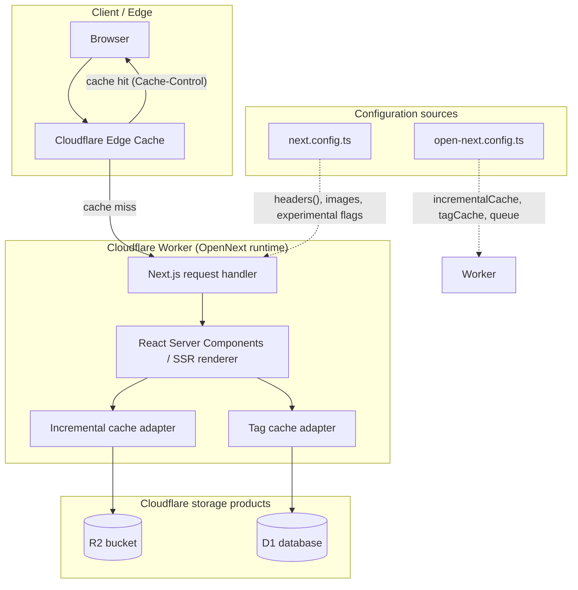
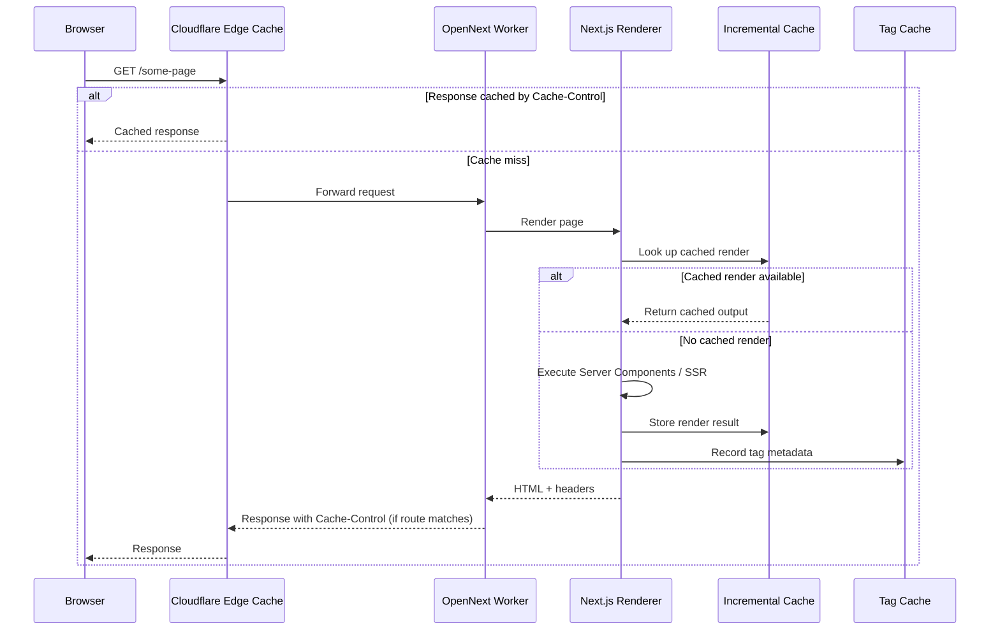

This page documents how ozeaon-v2 renders pages on the server, how the rendering model is configured for the Cloudflare/OpenNext deployment target, and how HTTP-level caching is applied to static and image assets.

## Purpose and Scope

This page covers the **rendering and caching configuration** of the ozeaon-v2 web application:

- The Next.js rendering model as configured in `next.config.ts` (App Router, prerendering behavior, experimental rendering flags).
- The OpenNext/Cloudflare adapter configuration in `open-next.config.ts` and how it defines the incremental cache, tag cache, and queue used by the SSR runtime.
- HTTP response caching rules that the app applies to `/_next/image`, `/images/*`, and the general `/:path*` route, including `Cache-Control` directives and security headers.
- Image loading and optimization behavior that sits on the caching boundary.

This page does **not** attempt to document individual pages, routes, or data-fetching functions themselves — those belong to the routing/data pages of the catalog. It also does not document authentication, storage, or database schemas except where they intersect the caching boundary (for example, the storage host allow-list used by the image loader and CSP). For those topics, see the corresponding sibling pages on routing, data access, and security.

> **Note on evidence:** This document is based on the configuration files `next.config.ts` and `open-next.config.ts` read directly from the repository. Where a behavior is defined by the framework rather than by explicit project configuration, that is stated as such rather than assumed.

## Overview

ozeaon-v2 is a **Next.js application deployed onto Cloudflare Workers via the OpenNext adapter**. That deployment model has a direct impact on the rendering strategy:

1. **Rendering happens at the edge.** Instead of a long-lived Node.js server, the request handler runs inside a Cloudflare Worker. Next.js server rendering (SSR), static prerendering, and on-demand revalidation therefore all execute against Workers-compatible APIs.
2. **The incremental cache must live in Cloudflare infrastructure.** Next.js normally caches rendered output (the Incremental Static Regeneration cache) and tag metadata. On Workers there is no local filesystem, so these caches must be backed by Cloudflare products — R2 for the incremental cache, D1 for the tag cache, and a Durable Object–backed queue for revalidation work. `open-next.config.ts` is the single place where those overrides are wired.
3. **Caching is also expressed at the HTTP layer.** Independent of the framework-level cache, the app sets explicit `Cache-Control` headers for optimized images and static image assets so that Cloudflare's edge cache and browsers can serve them without re-invoking the Worker.

These three layers — framework rendering, adapter cache bindings, and HTTP cache headers — together define the observable caching behavior of the site, and each is deliberately turned into an explicit, reviewable setting rather than left at defaults.

### Key concepts

| Concept | Meaning in this codebase |
| --- | --- |
| **SSR / server rendering** | React Server Components and route handlers executed inside the Cloudflare Worker through OpenNext. |
| **Prerendering** | Build-time generation of static HTML for eligible routes; controlled by `enablePrerenderSourceMaps` and `experimental.prerenderEarlyExit`. |
| **Incremental cache** | Framework-level store of rendered results (ISR). Backed by R2 in the recommended OpenNext setup. |
| **Tag cache** | Map of cache tags to revalidation metadata, used by `revalidateTag`. Backed by D1. |
| **Cache-Control** | HTTP header instructing Cloudflare and browsers how long a response may be reused. |

## Architecture

The following diagram shows how a request flows through the deployment, and how the two configuration files govern the rendering and caching layers.



**Reading the diagram:**

- Requests first hit the **Cloudflare Edge Cache**. If a response carries a reusable `Cache-Control` header (set by `headers()` in `next.config.ts`), the edge can answer without waking the Worker.
- On a miss, the request reaches the **OpenNext Worker handler**, which dispatches to the Next.js **renderer**.
- When the renderer needs a cached render or tag metadata, it goes through the **incremental cache** and **tag cache** adapters, whose concrete implementations are selected in `open-next.config.ts`.
- `next.config.ts` influences the handler's behavior via `headers()`, `images`, and `experimental` flags — i.e. it governs *what* is rendered and *what headers* are emitted, while `open-next.config.ts` governs *where cached data is stored*.

## The Next.js Rendering Model

The rendering model is configured in the `nextConfig` object in `next.config.ts`. Several options here are chosen specifically to make rendering behavior predictable on a Workers-based deployment.

```typescript
const nextConfig: NextConfig = {
  cacheComponents: false,
  allowedDevOrigins: ["*.ngrok-free.dev", "192.168.1.71"],
  serverExternalPackages: ["pdfjs-dist"],
  enablePrerenderSourceMaps: false,
  productionBrowserSourceMaps: false,
  logging: {
    browserToTerminal: false,
    incomingRequests: {
      ignore: [/manifest.webmanifest/, /\/api\/storage/],
    },
  },
  experimental: {
    typedEnv: true,
    inlineCss: false,
    prefetchInlining: false,
    optimisticRouting: true,
    varyParams: true,
    prerenderEarlyExit: false,
    useTypeScriptCli: false,
  },
  typedRoutes: true,
  poweredByHeader: false,
  // ...
};
```

> Source: [next.config.ts](https://github.com/ozeaon/ozeaon-v2/blob/0a4f1a95824db87782f1221a4108019d174df3d9/next.config.ts#L100-L122)

### `cacheComponents: false`

`cacheComponents` is explicitly disabled. This keeps the project on the classic Next.js caching semantics rather than the newer component-level cache model, which means caching behavior is controlled through the OpenNext incremental cache bindings and HTTP headers documented on this page rather than through component annotations. Setting this explicitly (instead of relying on a default) makes the intent reviewable: the team opted **out** of component caching on purpose.

### Prerendering controls

Two flags relate directly to how much work happens at build time versus request time:

| Flag | Value | Effect |
| --- | --- | --- |
| `enablePrerenderSourceMaps` | `false` | Prerendered pages are emitted without source maps, reducing the size of build artifacts shipped to the Worker bundle. |
| `experimental.prerenderEarlyExit` | `false` | Prevents the build from bailing out of prerendering early. Combined with the disabled source maps, this favors **complete, deterministic prerendering output** over build speed. |
| `productionBrowserSourceMaps` | `false` | No client source maps in production bundles — smaller payloads, less exposure of original source. |

### Experimental rendering flags

The `experimental` block contains flags that shape the request/response pipeline:

```typescript
experimental: {
  typedEnv: true,
  inlineCss: false,
  prefetchInlining: false,
  optimisticRouting: true,
  varyParams: true,
  prerenderEarlyExit: false,
  useTypeScriptCli: false,
},
```

> Source: [next.config.ts](https://github.com/ozeaon/ozeaon-v2/blob/0a4f1a95824db87782f1221a4108019d174df3d9/next.config.ts#L112-L120)

- **`typedEnv: true`** — environment variables are type-checked, so a missing or misnamed variable becomes a build error rather than a runtime `undefined`. This matters for the rendering config below, which reads several `NEXT_PUBLIC_*` variables at build time.
- **`inlineCss: false`** — CSS is not inlined into the HTML document. This keeps HTML responses smaller and let CSS be cached separately, which is friendlier to the edge cache.
- **`optimisticRouting: true`** — enables the router's optimistic navigation behavior for client-side transitions.
- **`varyParams: true`** — varies the route cache on route parameters, ensuring that two URLs differing only by params are not served the same cached response. This is a correctness safeguard for the framework-level cache.
- **`prefetchInlining: false`** — prefetched payloads are not inlined, reducing HTML/bloat.

### Other rendering-relevant settings

- `serverExternalPackages: ["pdfjs-dist"]` marks `pdfjs-dist` as external, so it is required from `node_modules` at runtime rather than bundled into the server output. This is a deliberate trade-off to avoid bundling a large library into the Worker.
- `logging.incomingRequests.ignore` suppresses request logging for `manifest.webmanifest` and `/api/storage` — high-frequency, low-signal endpoints — keeping the Worker logs focused on page renders.
- `poweredByHeader: false` removes the `X-Powered-By` header.
- `relativePath`-based `images.loaderFile: "./src/lib/image-loader.ts"` and `images.loader: "custom"` route image optimization through a project-owned loader, described in the caching section below.

## OpenNext / Cloudflare Adapter Configuration

The rendering runtime on Cloudflare is configured through `open-next.config.ts`, which is intentionally minimal:

```typescript
import { defineCloudflareConfig } from "@opennextjs/cloudflare";
// import r2IncrementalCache from "@opennextjs/cloudflare/overrides/incremental-cache/r2-incremental-cache";
// import d1NextTagCache from "@opennextjs/cloudflare/overrides/tag-cache/d1-next-tag-cache";
// import doQueue from "@opennextjs/cloudflare/overrides/queue/do-queue";

export default defineCloudflareConfig({
  // incrementalCache: r2IncrementalCache,
  // tagCache: d1NextTagCache,
  // queue: doQueue,
  // routePreloadingBehavior: "none",
});
```

> Source: [open-next.config.ts](https://github.com/ozeaon/ozeaon-v2/blob/0a4f1a95824db87782f1221a4108019d174df3d9/open-next.config.ts#L1-L10)

### What this config is responsible for

`defineCloudflareConfig` is the OpenNext entry point that tells the adapter how the deployed Worker should store and revalidate rendered output. The three named overrides are the ones that matter for the rendering model:

| Override | Cloudflare product | Responsibility |
| --- | --- | --- |
| `incrementalCache` | R2 (`r2IncrementalCache`) | Stores prerendered/ISR page output and fetch results that Next.js caches. |
| `tagCache` | D1 (`d1NextTagCache`) | Stores tag → revalidation metadata so `revalidateTag` works across instances. |
| `queue` | Durable Objects (`doQueue`) | Serializes revalidation work so it is not duplicated across Worker instances. |

### Design intent and current state

The three overrides are **present but commented out**, and the call to `defineCloudflareConfig` passes an empty object. This is a deliberate, minimal configuration: the project relies on OpenNext's default cache behavior rather than opting into the R2/D1/DO stack at this time. The commented imports act as documented, ready-to-enable extension points — swapping in `r2IncrementalCache`, `d1NextTagCache`, and `doQueue` is a one-line change each, requiring only that the corresponding Cloudflare bindings (R2 bucket, D1 database, Durable Object namespace) be provisioned in `wrangler` configuration.

Because the overrides are commented out, cache-persistence guarantees for the incremental and tag caches are whatever the adapter provides by default in this deployment, not R2/D1-backed. Any change here directly changes the durability and cross-instance consistency of the SSR output cache.

`routePreloadingBehavior: "none"` is likewise commented out; enabling it would disable OpenNext's route preloading. Its default behavior is currently in force.

### Development-time binding initialization

The Cloudflare bindings are only initialized for the local dev server, and only outside other CLI commands:

```typescript
// Only initialize Cloudflare dev bindings when running the dev server
// Skip during typegen, build, or other CLI commands to prevent stalling
if (process.env.NODE_ENV === "development") {
  initOpenNextCloudflareForDev();
}
```

> Source: [next.config.ts](https://github.com/ozeaon/ozeaon-v2/blob/0a4f1a95824db87782f1221a4108019d174df3d9/next.config.ts#L1-L8)

This guard is a rendering-relevant detail: `initOpenNextCloudflareForDev()` populates local Cloudflare bindings (R2, D1, KV, Durable Objects) so that locally rendered pages behave like they will in production. Restricting it to `NODE_ENV === "development"` prevents typegen/build runs from stalling on binding initialization, which would otherwise add startup latency to CI builds.

## HTTP Caching & Security Headers

Independent of the framework-level cache, `next.config.ts` defines HTTP `Cache-Control` headers through the `headers()` async function. These headers are the mechanism by which the Cloudflare edge cache (and the browser) can serve responses without invoking the Worker.

```typescript
const FOUR_DAYS = 4 * 24 * 60 * 60;

async headers() {
  if (isDev) {
    return [];
  }
  return [
    {
      source: "/_next/image/:path*",
      headers: [
        {
          key: "Cache-Control",
          value: `public, max-age=0, s-maxage=${FOUR_DAYS}, stale-while-revalidate=86400`,
        },
      ],
    },
    {
      source: "/images/:path*",
      headers: [
        {
          key: "Cache-Control",
          value: `public, max-age=${FOUR_DAYS}, immutable`,
        },
      ],
    },
    // ...
  ];
}
```

> Source: [next.config.ts](https://github.com/ozeaon/ozeaon-v2/blob/0a4f1a95824db87782f1221a4108019d174df3d9/next.config.ts#L98-L163)

### Cache policy per route

| Route pattern | `Cache-Control` | Rationale |
| --- | --- | --- |
| `/_next/image/:path*` | `public, max-age=0, s-maxage=172800, stale-while-revalidate=86400` | Optimized images are **not** cached by the browser (`max-age=0`) but are cached at the shared/CDN layer for four days, with a one-day stale-while-revalidate window so refreshes are non-blocking. |
| `/images/:path*` | `public, max-age=172800, immutable` | Bundled static images are content-addressed and never change at a given URL, so `immutable` is safe and both browser and edge cache for four days. |
| `/:path*` | Security headers only (no `Cache-Control`) | HTML responses deliberately receive no explicit cache directive here, leaving page caching to the rendering/cache layers rather than the HTTP header. |

The `FOUR_DAYS` constant (`4 * 24 * 60 * 60` = 172,800 seconds) is reused for both the image `Cache-Control` headers and `images.minimumCacheTTL` (see below), keeping the image cache lifetime defined in exactly one place. Changing this constant changes both the HTTP cache window and the image optimization TTL together — an intentional coupling.

### The dev-server short-circuit

```typescript
if (isDev) {
  return [];
}
```

> Source: [next.config.ts](https://github.com/ozeaon/ozeaon-v2/blob/0a4f1a95824db87782f1221a4108019d174df3d9/next.config.ts#L142-L144)

In development, `headers()` returns no headers at all. This prevents aggressively cached image responses from masking changes during local development and avoids enforcing the production CSP against dev tooling. The check uses `isDev`, derived from `NODE_ENV`.

### Security headers applied to all pages

For every non-dev response matching `/:path*`, the app sets a full security header suite alongside the rendering output:

```typescript
{
  source: "/:path*",
  headers: [
    { key: "Content-Security-Policy", value: _ContentSecurityPolicy },
    { key: "X-Frame-Options", value: "DENY" },
    { key: "X-Content-Type-Options", value: "nosniff" },
    { key: "Referrer-Policy", value: "strict-origin-when-cross-origin" },
    {
      key: "Strict-Transport-Security",
      value: "max-age=31536000; includeSubDomains",
    },
    {
      key: "Permissions-Policy",
      value: "geolocation=(), browsing-topics=()",
    },
    { key: "X-DNS-Prefetch-Control", value: "on" },
  ],
},
```

> Source: [next.config.ts](https://github.com/ozeaon/ozeaon-v2/blob/0a4f1a95824db87782f1221a4108019d174df3d9/next.config.ts#L164-L180)

These are emitted with the server-rendered document, so they are part of what the edge caches alongside the HTML. `X-DNS-Prefetch-Control: on` complements the rendering model by allowing the browser to pre-resolve hosts (storage, Supabase, Google OAuth endpoints) referenced in the rendered HTML.

### Content Security Policy construction

The CSP is built dynamically from environment variables rather than hardcoded, because the allowed origins differ between local and hosted environments:

```typescript
const storageHost = (() => {
  const url = process.env.NEXT_PUBLIC_STORAGE_URL;
  if (!url) return "";
  try {
    return new URL(url).host;
  } catch {
    return "";
  }
})();
```

> Source: [next.config.ts](https://github.com/ozeaon/ozeaon-v2/blob/0a4f1a95824db87782f1221a4108019d174df3d9/next.config.ts#L15-L23)

```typescript
const STORAGE_HOSTS = [
  ...new Set(
    ["storage-r2.ozeaon.com", "storage-r2.ozeaon.dev", storageHost].filter(
      Boolean,
    ),
  ),
].join(" ");
```

> Source: [next.config.ts](https://github.com/ozeaon/ozeaon-v2/blob/0a4f1a95824db87782f1221a4108019d174df3d9/next.config.ts#L31-L37)

The comments in the source explain the intent precisely: article content and attachments store **absolute URLs** against whichever environment uploaded them, so both production and development storage hosts must be allowed regardless of which host the current deployment writes to — both for images (`img-src`) and for XHR reads performed by pdf.js and document downloads (`connect-src`).

```typescript
const localSupabaseOrigins = (() => {
  const url = process.env.NEXT_PUBLIC_SUPABASE_URL;
  if (!url) return "";
  try {
    const { host, hostname } = new URL(url);
    if (hostname !== "127.0.0.1" && hostname !== "localhost") return "";
    return `http://${host} ws://${host}`;
  } catch {
    return "";
  }
})();
```

> Source: [next.config.ts](https://github.com/ozeaon/ozeaon-v2/blob/0a4f1a95824db87782f1221a4108019d174df3d9/next.config.ts#L45-L55)

Notably, local Supabase origins are derived from the configured URL **rather than from `NODE_ENV`**, because `pnpm preview` and `pnpm ci:build` emit production headers while still pointing at localhost — an explicit comment in the source documents this reasoning. This is a subtle correctness fix: keying the CSP off `NODE_ENV` would break those workflows.

The final CSP string is post-processed to collapse whitespace and trim:

```typescript
const _ContentSecurityPolicy = `
  default-src 'self';
  ...
`
  .replace(/\s{2,}/g, " ")
  .trim();
```

> Source: [next.config.ts](https://github.com/ozeaon/ozeaon-v2/blob/0a4f1a95824db87782f1221a4108019d174df3d9/next.config.ts#L57-L96)

Collapsing runs of whitespace matters here because the template literal is multi-line for readability but must be emitted as a single-line header value; the `.replace(/\s{2,}/g, " ")` step is what makes the readable source and the valid header value compatible.

## Image Optimization & the Cache Boundary

Image handling sits directly on the caching boundary, so its configuration is part of the rendering model:

```typescript
images: {
  loader: "custom",
  loaderFile: "./src/lib/image-loader.ts",
  qualities: [75, 85, 95],
  remotePatterns: [
    { hostname: "*.githubusercontent.com", protocol: "https" },
    { hostname: "*.googleusercontent.com", protocol: "https" },
    { hostname: "*.supabase.co", protocol: "https" },
    { hostname: "*.gstatic.com", protocol: "https" },
    ...(storageHost
      ? [{ hostname: storageHost, protocol: "https" as const }]
      : []),
  ],
  localPatterns: [{ pathname: "/**" }], // allow all local images
  formats: ["image/avif", "image/webp"],
  minimumCacheTTL: FOUR_DAYS,
},
```

> Source: [next.config.ts](https://github.com/ozeaon/ozeaon-v2/blob/0a4f1a95824db87782f1221a4108019d174df3d9/next.config.ts#L123-L139)

| Setting | Value | Rendering/caching impact |
| --- | --- | --- |
| `loader` / `loaderFile` | `"custom"` / `./src/lib/image-loader.ts` | Image URLs are generated by a project-owned loader instead of the Next.js default optimizer path. This lets the app emit URLs that match its storage/CDN setup. |
| `qualities` | `[75, 85, 95]` | Only three quality levels are permitted; any other `quality` prop is rejected, bounding the number of distinct optimized variants (and thus cache entries). |
| `remotePatterns` | GitHub, Google, Supabase, gstatic, plus the configured storage host | Allow-list of external image origins. The storage host is injected only when `NEXT_PUBLIC_STORAGE_URL` parses successfully, mirroring the CSP logic. |
| `formats` | `["image/avif", "image/webp"]` | Modern formats are served where supported, with format negotiation affecting the `Vary` dimension of the edge cache. |
| `minimumCacheTTL` | `FOUR_DAYS` | Optimized image outputs are cached for a minimum of four days — the same window used in the `/_next/image` `Cache-Control` header. This alignment is intentional: the HTTP cache lifetime and the optimizer's internal TTL do not disagree. |

## Core Rendering Flow

The following sequence walks a single page request through the rendering and caching layers, in the order the configuration actually governs them.



**Why this order matters:**

1. **Edge cache first, Worker second.** Because `/_next/image/*` and `/images/*` carry reusable `Cache-Control` values, the most cacheable content is answered at the edge without invoking the Worker — which is the primary cost saver on a per-request-billed platform like Workers.
2. **No explicit `Cache-Control` on HTML.** The catch-all `/:path*` rule emits security headers but no cache directive, so page caching is delegated to the incremental cache. This avoids double-caching HTML at the edge with a TTL that could conflict with tag-based revalidation.
3. **Tag metadata recorded alongside renders.** The tag cache write is what later makes tag-based invalidation possible; it is only meaningful when a tag cache adapter is configured (currently commented out in `open-next.config.ts`).

### Rendering-time environment coupling

Both configuration files read environment variables at build time (`typedEnv: true` makes these type-checked):

| Variable | Used in | Purpose |
| --- | --- | --- |
| `NEXT_PUBLIC_STORAGE_URL` | `next.config.ts` (CSP `img-src`/`connect-src`, `images.remotePatterns`) | Adds the deployment's storage host to the CSP and image allow-list. |
| `NEXT_PUBLIC_SUPABASE_URL` | `next.config.ts` (CSP `connect-src`) | Adds local Supabase HTTP/WS origins when the URL points at localhost. |
| `NODE_ENV` | `next.config.ts` (`initOpenNextCloudflareForDev`, `isDev`, `headers()`) | Gates dev-only binding initialization and header emission. |

Because `NEXT_PUBLIC_*` variables are inlined into the build, changing the storage or Supabase URL requires a **rebuild**, not just a runtime environment change. This is a direct consequence of the rendering model: the CSP and image patterns are baked into the build output.

## Configuration Options Reference

### `next.config.ts` — rendering and caching options

| Option | Type | Value | Description |
| --- | --- | --- | --- |
| `cacheComponents` | `boolean` | `false` | Disables Next.js component-level caching; uses classic cache semantics. |
| `enablePrerenderSourceMaps` | `boolean` | `false` | Omit source maps from prerendered output. |
| `productionBrowserSourceMaps` | `boolean` | `false` | Omit client source maps in production. |
| `serverExternalPackages` | `string[]` | `["pdfjs-dist"]` | Keep `pdfjs-dist` external to the server bundle. |
| `experimental.typedEnv` | `boolean` | `true` | Type-check environment variables at build time. |
| `experimental.inlineCss` | `boolean` | `false` | Do not inline CSS into the HTML document. |
| `experimental.prefetchInlining` | `boolean` | `false` | Do not inline prefetch payloads. |
| `experimental.optimisticRouting` | `boolean` | `true` | Enable optimistic client navigation. |
| `experimental.varyParams` | `boolean` | `true` | Vary route cache on route parameters. |
| `experimental.prerenderEarlyExit` | `boolean` | `false` | Do not exit prerendering early. |
| `experimental.useTypeScriptCli` | `boolean` | `false` | Use the internal type-checker rather than the TypeScript CLI. |
| `typedRoutes` | `boolean` | `true` | Generate typed link routes. |
| `poweredByHeader` | `boolean` | `false` | Omit the `X-Powered-By` header. |
| `images.loader` | `string` | `"custom"` | Use a project-owned image loader. |
| `images.loaderFile` | `string` | `"./src/lib/image-loader.ts"` | Path to the custom loader. |
| `images.qualities` | `number[]` | `[75, 85, 95]` | Allowed image quality levels. |
| `images.formats` | `string[]` | `["image/avif", "image/webp"]` | Output image formats. |
| `images.minimumCacheTTL` | `number` | `FOUR_DAYS` (172800s) | Minimum cache lifetime for optimized images. |
| `allowedDevOrigins` | `string[]` | `["*.ngrok-free.dev", "192.168.1.71"]` | Origins permitted during development. |
| `logging.incomingRequests.ignore` | `RegExp[]` | `[/manifest.webmanifest/, /\/api\/storage/]` | Suppress logs for noisy endpoints. |

### HTTP headers emitted by `headers()`

| Source | Header | Value |
| --- | --- | --- |
| `/_next/image/:path*` | `Cache-Control` | `public, max-age=0, s-maxage=172800, stale-while-revalidate=86400` |
| `/images/:path*` | `Cache-Control` | `public, max-age=172800, immutable` |
| `/:path*` | `Content-Security-Policy` | Dynamically built CSP (see above) |
| `/:path*` | `X-Frame-Options` | `DENY` |
| `/:path*` | `X-Content-Type-Options` | `nosniff` |
| `/:path*` | `Referrer-Policy` | `strict-origin-when-cross-origin` |
| `/:path*` | `Strict-Transport-Security` | `max-age=31536000; includeSubDomains` |
| `/:path*` | `Permissions-Policy` | `geolocation=(), browsing-topics=()` |
| `/:path*` | `X-DNS-Prefetch-Control` | `on` |

### `open-next.config.ts` — adapter options

| Option | Type | Status | Description |
| --- | --- | --- | --- |
| `incrementalCache` | OpenNext override | Commented out | Backs the ISR/render cache; intended to use `r2IncrementalCache`. |
| `tagCache` | OpenNext override | Commented out | Stores tag revalidation metadata; intended to use `d1NextTagCache`. |
| `queue` | OpenNext override | Commented out | Serializes revalidation; intended to use `doQueue`. |
| `routePreloadingBehavior` | `string` | Commented out | Would set route preloading to `"none"`. |

## API Reference

### `initOpenNextCloudflareForDev()`

Initializes Cloudflare bindings for the local development server.

- **Imported from:** `@opennextjs/cloudflare` (`next.config.ts`)
- **Called when:** `process.env.NODE_ENV === "development"` only.
- **Purpose:** Populates local R2/D1/KV/Durable Object bindings so that locally server-rendered pages and cached data behave like production.
- **Side effects avoided:** Deliberately skipped during typegen, build, and other CLI commands to prevent stalls (documented in the source comment).

> Source: [next.config.ts](https://github.com/ozeaon/ozeaon-v2/blob/0a4f1a95824db87782f1221a4108019d174df3d9/next.config.ts#L1-L8)

### `defineCloudflareConfig(config)`

Configures the OpenNext Cloudflare adapter for the deployed Worker.

- **Imported from:** `@opennextjs/cloudflare` (`open-next.config.ts`)
- **Parameter:** an object of adapter overrides — `incrementalCache`, `tagCache`, `queue`, `routePreloadingBehavior`.
- **Current invocation:** called with an empty object literal; all overrides are commented out.

> Source: [open-next.config.ts](https://github.com/ozeaon/ozeaon-v2/blob/0a4f1a95824db87782f1221a4108019d174df3d9/open-next.config.ts#L6-L11)

### `headers()`

Next.js config hook that produces response headers.

- **Signature:** `async headers(): Promise<Array<{ source: string; headers: Array<{ key: string; value: string }> }>>`
- **Returns:** an empty array when `isDev` is true; otherwise the three header rules described above.
- **Runtime role:** evaluated at build time to generate the routing/header manifest, so changes require a rebuild.

> Source: [next.config.ts](https://github.com/ozeaon/ozeaon-v2/blob/0a4f1a95824db87782f1221a4108019d174df3d9/next.config.ts#L141-L183)

## Failure Modes, Edge Cases & Concurrency

| Scenario | Behavior | Evidence |
| --- | --- | --- |
| `NEXT_PUBLIC_STORAGE_URL` is unset or malformed | `storageHost` resolves to `""`, so the storage host is omitted from both `STORAGE_HOSTS` and `images.remotePatterns`. The two hardcoded ozeaon storage hosts remain allowed. | `next.config.ts` lines 15–23, 31–37, 132–134 |
| Storage URL points at a non-oz... host | It is appended to the allow-list via `storageHost`, so the CSP and image patterns follow the configured URL. | `next.config.ts` lines 31–37 |
| Local Supabase in a production-like build | Local origins are still added because the check is URL-based, not `NODE_ENV`-based — specifically to support `pnpm preview` and `pnpm ci:build`. | `next.config.ts` lines 39–55 |
| Development server | `headers()` returns `[]`, so neither the CSP nor cache headers are applied; optimized images are not cached. | `next.config.ts` lines 141–144 |
| Request for an image with a disallowed quality | Only `[75, 85, 95]` are valid; other values are rejected by the framework. | `next.config.ts` line 126 |
| Incremental cache in use | With the `incrementalCache` override commented out, the R2-backed cache is **not** configured; persistence across Worker instances is whatever OpenNext's default provides. | `open-next.config.ts` lines 2, 7 |
| Tag-based revalidation | With `tagCache` commented out, no D1 tag cache is configured, so tag invalidation guarantees are the adapter default. | `open-next.config.ts` lines 3, 8 |
| Concurrent revalidation | With `queue` commented out, no Durable Object queue is configured to serialize revalidation work. | `open-next.config.ts` lines 4, 9 |

**Important correctness note:** the three opennext overrides being commented out is the single most consequential caching fact on this page. Enabling them changes the durability, cross-instance consistency, and de-duplication guarantees of the render cache. Any team member extending caching behavior should start by reviewing `open-next.config.ts` and the Cloudflare binding configuration that would accompany those overrides.

## Performance & Operational Considerations

- **Edge-first caching.** The two explicit `Cache-Control` rules are the primary performance lever: image bytes are served from the edge for up to four days without invoking the Worker, which reduces both latency and per-request billing on Cloudflare.
- **`stale-while-revalidate=86400` on `/_next/image`.** After the four-day `s-maxage` window elapses, the CDN may serve a stale image for up to one more day while refreshing in the background, avoiding a thundering herd of re-optimizations.
- **`max-age=0` for optimized images.** Browser caching is intentionally disabled for the optimizer path (because the URL may represent a transform that should be revalidated), while the shared cache retains the result. This is a deliberate split between browser and edge cache behavior.
- **`immutable` for `/images/*`.** Static images are treated as permanently valid at their URL, letting the browser skip revalidation entirely for four days.
- **Single source of the cache window.** `FOUR_DAYS` is defined once and consumed by both the HTTP headers and `images.minimumCacheTTL`, so the two cannot drift apart.
- **Reduced Worker bundle size.** Keeping `pdfjs-dist` external (`serverExternalPackages`), disabling prerender source maps, and disabling client and production source maps all shrink what is deployed and cached.
- **Typed environment variables.** `experimental.typedEnv: true` converts missing/incorrect `NEXT_PUBLIC_*` variables from silent runtime `undefined` values into build-time failures — important because those variables feed the CSP and image allow-lists that are baked into the build.

## Extension Points

| Extension | How to enable | File |
| --- | --- | --- |
| R2-backed incremental cache | Uncomment `r2IncrementalCache` import and the `incrementalCache` property, and provision the R2 binding. | [open-next.config.ts](https://github.com/ozeaon/ozeaon-v2/blob/0a4f1a95824db87782f1221a4108019d174df3d9/open-next.config.ts#L2) |
| D1-backed tag cache | Uncomment `d1NextTagCache` and the `tagCache` property, and provision the D1 database. | [open-next.config.ts](https://github.com/ozeaon/ozeaon-v2/blob/0a4f1a95824db87782f1221a4108019d174df3d9/open-next.config.ts#L3) |
| Durable Object revalidation queue | Uncomment `doQueue` and the `queue` property, and provision the Durable Object namespace. | [open-next.config.ts](https://github.com/ozeaon/ozeaon-v2/blob/0a4f1a95824db87782f1221a4108019d174df3d9/open-next.config.ts#L4) |
| Disable route preloading | Uncomment `routePreloadingBehavior: "none"`. | [open-next.config.ts](https://github.com/ozeaon/ozeaon-v2/blob/0a4f1a95824db87782f1221a4108019d174df3d9/open-next.config.ts#L10) |
| Change image cache TTL | Edit the `FOUR_DAYS` constant; it propagates to both `Cache-Control` and `images.minimumCacheTTL`. | [next.config.ts](https://github.com/ozeaon/ozeaon-v2/blob/0a4f1a95824db87782f1221a4108019d174df3d9/next.config.ts#L98) |
| Add an allowed image/CSP host | Add to `images.remotePatterns` and to the CSP template in the same change so the two stay consistent. | [next.config.ts](https://github.com/ozeaon/ozeaon-v2/blob/0a4f1a95824db87782f1221a4108019d174df3d9/next.config.ts#L57-L96), [next.config.ts](https://github.com/ozeaon/ozeaon-v2/blob/0a4f1a95824db87782f1221a4108019d174df3d9/next.config.ts#L127-L135) |

## Related Links

- [next.config.ts](https://github.com/ozeaon/ozeaon-v2/blob/0a4f1a95824db87782f1221a4108019d174df3d9/next.config.ts) — Next.js rendering model, HTTP headers, image optimization, and dev-time binding initialization.
- [open-next.config.ts](https://github.com/ozeaon/ozeaon-v2/blob/0a4f1a95824db87782f1221a4108019d174df3d9/open-next.config.ts) — OpenNext/Cloudflare cache and queue overrides.
- [src/lib/image-loader.ts](https://github.com/ozeaon/ozeaon-v2/blob/0a4f1a95824db87782f1221a4108019d174df3d9/src/lib/image-loader.ts) — custom image loader referenced by `images.loaderFile`.
- [eslint.config.mjs](https://github.com/ozeaon/ozeaon-v2/blob/0a4f1a95824db87782f1221a4108019d174df3d9/eslint.config.mjs) — linting configuration for the project.
- Sibling catalog pages: routing and data-access pages in the `2-architecture` section for route structure and data fetching; security pages for authentication and storage configuration that the CSP allow-list reflects.
