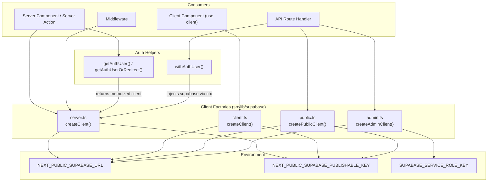
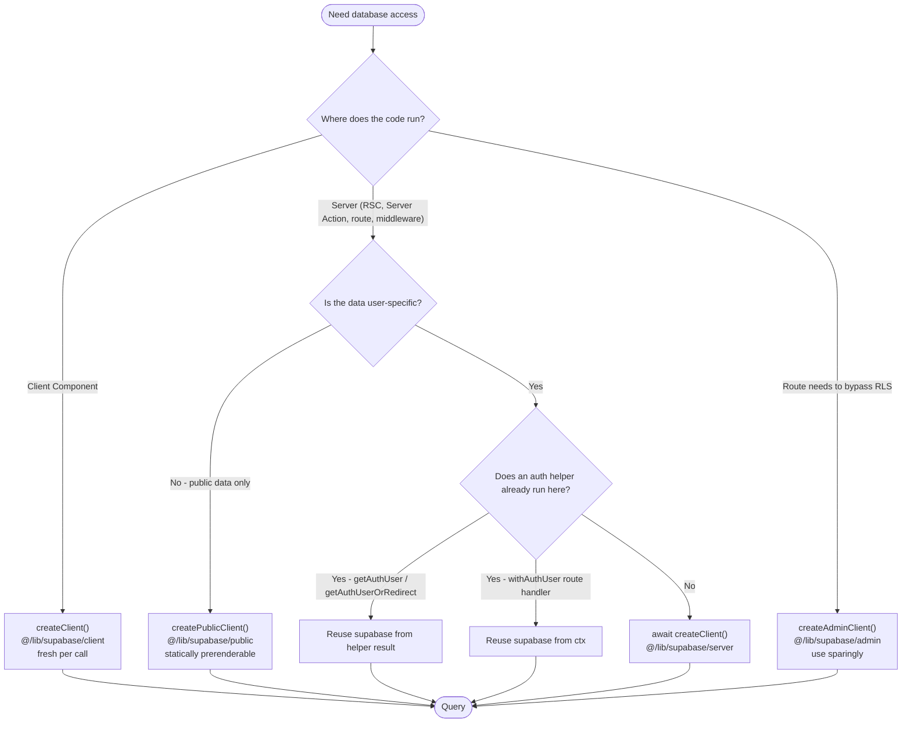
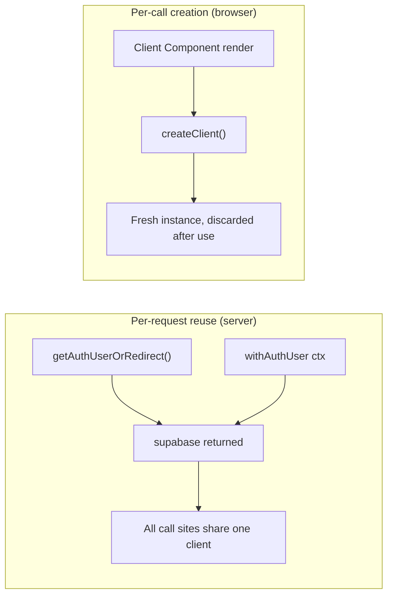
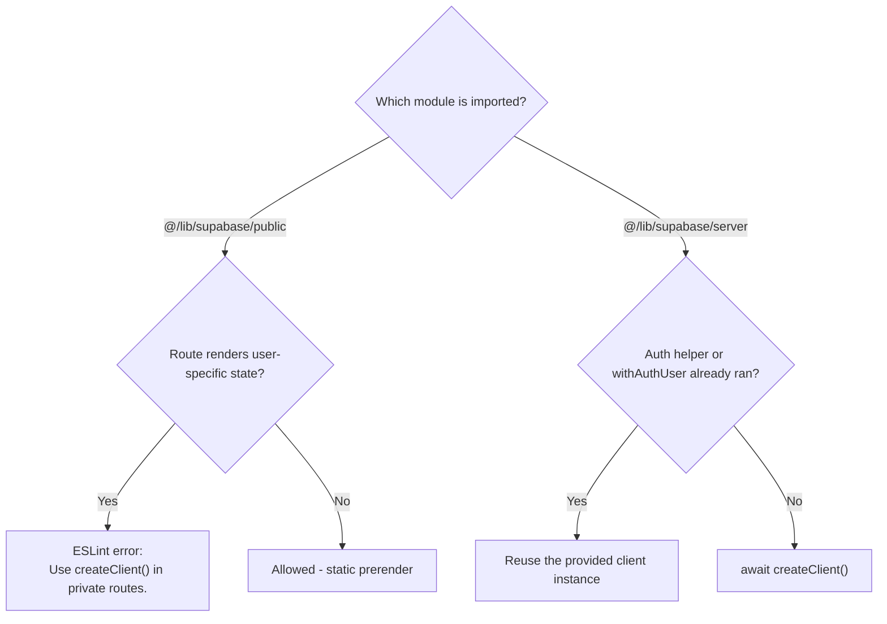

OZEAON V2 exposes four distinct Supabase client factories — server, browser, admin, and public — each with a different authorization model, runtime target, and rendering consequence. This page documents how each client is constructed, when it must be used, and how the choice affects Next.js caching and row-level security.

## Purpose and Scope

This page covers the Supabase client construction layer of the repository:

- The four client entry points listed in the project's client pattern table
- How each factory is constructed (credentials, `auth` options, typed schema binding)
- The rendering/caching consequences of using a cookie-aware client inside Next.js App Router
- The reuse rules around `createClient()` relative to `getAuthUser()` / `getAuthUserOrRedirect()` and `withAuthUser`
- ESLint guardrails that enforce the public/private client boundary

It intentionally does **not** cover:

- Individual query modules under `src/lib/supabase/queries/*` (see the query-layer documentation)
- Storage uploads (`StorageAdapter`) and R2 integration
- Row-level security policy definitions in the database schema
- Route handler authoring details beyond the client-injection contract

## Overview

The platform is a full-stack Next.js (App Router) application backed by Supabase, where server rendering, server actions, route handlers, middleware, and client components all need database access — but never with the same privilege level. A single shared client would either leak the service-role key into the browser or force every read through an RLS-bypassing connection.

The design therefore splits client creation into four explicit factories, each a small module with a single exported function:

| Client | Import | Use In | Runtime |
|--------|--------|--------|---------|
| Server | `@/lib/supabase/server` | Server Components, Server Actions, API routes | Node / Worker, cookie-bound |
| Browser | `@/lib/supabase/client` | Client Components (`"use client"`) | Browser |
| Admin | `@/lib/supabase/admin` | API routes bypassing RLS (use sparingly) | Server only |
| Public | `@/lib/supabase/public` | Unauthenticated public queries | Server only |

> Source: [CLAUDE.md](https://github.com/ozeaon/ozeaon-v2/blob/0a4f1a95824db87782f1221a4108019d174df3d9/CLAUDE.md#L82-L89)

The key concepts behind the split:

1. **Typed schema binding.** The public client binds the generated `Database` type from `@/types/supabase` and restricts it to the `"public"` schema, so query results and table names are statically checked.
2. **`server-only` guard.** Both the admin and public modules begin with `import "server-only";`, which turns any accidental import from a client component into a build-time error rather than a credential leak.
3. **Cookie-based dynamism as a rendering signal.** The server client calls `cookies()` internally (documented behavior in the project guidance). Because the project runs with `cacheComponents: false`, that `cookies()` call automatically opts the containing route into dynamic rendering — no `export const dynamic` directive is required, and the project explicitly forbids the legacy directives.

> Source: [CLAUDE.md](https://github.com/ozeaon/ozeaon-v2/blob/0a4f1a95824db87782f1221a4108019d174df3d9/CLAUDE.md#L13-L21)

## Architecture



The diagram reflects two structural facts visible in the source: the public client is a bare `@supabase/supabase-js` client with session persistence turned off, and the admin client is the same constructor fed the service-role key instead of the publishable key. Neither the admin nor the public client participates in cookie handling, which is why they are safe for statically prerenderable routes — and why they must never be mixed with user-specific state.

## Client Factory Implementations

### Public Client — `createPublicClient()`

The public client is used for unauthenticated reads (articles, public profiles) and is the only client that can render on a fully static path. It creates a fresh client per call, disables token refresh and session persistence, and binds the generated `Database` type.

```typescript
import "server-only";

import { Database } from "@/types/supabase";
import { createClient } from "@supabase/supabase-js";

export function createPublicClient() {
  return createClient<Database, "public">(
    process.env.NEXT_PUBLIC_SUPABASE_URL!,
    process.env.NEXT_PUBLIC_SUPABASE_PUBLISHABLE_KEY!,
    {
      auth: {
        autoRefreshToken: false,
        persistSession: false,
      },
    },
  );
}
```

> Source: [public.ts](https://github.com/ozeaon/ozeaon-v2/blob/0a4f1a95824db87782f1221a4108019d174df3d9/src/lib/supabase/public.ts#L1-L17)

Design intent and details:

- **`import "server-only"`** prevents bundling this module into client JavaScript. Even though the credentials are public-prefixed (`NEXT_PUBLIC_*`), the module is server-only because it is intended for server-side fetching and must not be confused with the browser client.
- **Two generic parameters**: `createClient<Database, "public">` types the client against the generated schema and narrows the rest-API schema name to `"public"`. This is what gives callers compile-time table and column checking.
- **`persistSession: false` + `autoRefreshToken: false`**: the public client has no identity to maintain, so cookie/localStorage writes are pointless work. Disabling them makes the client explicitly stateless.
- **`!` non-null assertions**: the environment variables are asserted rather than validated at runtime; a missing value surfaces as a Supabase request error, not a thrown configuration error. Contrast with the admin client, which does validate.

### Admin Client — `createAdminClient()`

The admin client bypasses row-level security by authenticating with the service-role key. Its source carries an inline warning in a comment, and it performs an explicit credential check before construction.

```typescript
import "server-only";
import { createClient } from "@supabase/supabase-js";

// Admin client that bypasses RLS - only use in API routes!
export function createAdminClient() {
  const supabaseUrl = process.env.NEXT_PUBLIC_SUPABASE_URL!;
  const supabaseServiceKey = process.env.SUPABASE_SERVICE_ROLE_KEY!;

  if (!supabaseUrl || !supabaseServiceKey) {
    throw new Error("Missing Supabase admin credentials");
  }

  return createClient(supabaseUrl, supabaseServiceKey, {
    auth: {
      autoRefreshToken: false,
      persistSession: false,
    },
  });
}
```

> Source: [admin.ts](https://github.com/ozeaon/ozeaon-v2/blob/0a4f1a95824db87782f1221a4108019d174df3d9/src/lib/supabase/admin.ts#L1-L19)

Design intent and details:

- **Service-role credentials** (`SUPABASE_SERVICE_ROLE_KEY`) are the RLS-bypass mechanism. This key must never reach the browser, which is enforced by `import "server-only"`.
- **Explicit runtime validation**: unlike the public client, the admin client reads the environment variables into locals and throws `Error("Missing Supabase admin credentials")` if either is falsy. This is deliberate — a missing service-role key is a security-relevant misconfiguration that should fail loudly rather than silently degrade into anonymous access.
- **Stateless auth options**: same as the public client, since the admin client acts on behalf of the application, not a logged-in user.
- **No schema type binding**: the admin client is not generic-bound to `Database` in this module, so admin queries are not type-checked against the generated schema.
- The module comment `// Admin client that bypasses RLS - only use in API routes!` is the stated usage boundary. The project guidance repeats this as "use sparingly."

### Server Client — `createClient()`

The server client is the cookie-aware client for user-specific data. It is imported from `@/lib/supabase/server` and must be awaited.

```typescript
//  Server Component / API route
import { createClient } from "@/lib/supabase/server";

const supabase = await createClient();
```

> Source: [CLAUDE.md](https://github.com/ozeaon/ozeaon-v2/blob/0a4f1a95824db87782f1221a4108019d174df3d9/CLAUDE.md#L91-L96)

The `await` is required because, as documented in the project guidance, the server client internally calls `cookies()`, which is async in this Next.js version (a breaking change from 14). That internal `cookies()` call is also the mechanism that marks the route as dynamic.

> Source: [CLAUDE.md](https://github.com/ozeaon/ozeaon-v2/blob/0a4f1a95824db87782f1221a4108019d174df3d9/CLAUDE.md#L13-L15)

The rule for safe usage is stated explicitly:

- Always use `createClient()` (server client) for any user-specific data — the `cookies()` call inside is the dynamic signal.
- Never use `createPublicClient()` or the admin client in a component that also renders user-specific state.
- Public pages (articles, profiles, etc.) that use only `createPublicClient()` will correctly prerender statically.

> Source: [CLAUDE.md](https://github.com/ozeaon/ozeaon-v2/blob/0a4f1a95824db87782f1221a4108019d174df3d9/CLAUDE.md#L17-L21)

### Browser Client — `createClient()`

The browser client is imported from `@/lib/supabase/client` and is synchronous (no `await`), because it has no request-scoped cookie store to resolve.

```typescript
// Client Component
"use client";
// ⚠️ Create fresh per request, never cache globally Client Component
import { createClient } from "@/lib/supabase/client";

const supabase = createClient();
```

> Source: [CLAUDE.md](https://github.com/ozeaon/ozeaon-v2/blob/0a4f1a95824db87782f1221a4108019d174df3d9/CLAUDE.md#L124-L131)

The inline warning — *create fresh per request, never cache globally* — is the critical constraint. A module-level singleton browser client would share mutable auth state across React renders and, in SSR-adjacent flows, across requests, which is exactly the class of bug the server/browser split exists to prevent.

## Client Selection Flow

Choosing a client is a decision with a caching consequence, not just an import preference. The flow below encodes the rules stated in the project guidance.



Two branches of this flow deserve emphasis:

1. **The public branch terminates in static rendering.** A route that only calls `createPublicClient()` never touches `cookies()`, so Next.js can prerender it.
2. **The user-specific branch always ends in a cookie-aware client**, either newly created with `await createClient()` or borrowed from a helper that already created one.

## Client Reuse Rules

The most consequential pattern in this codebase is *not creating* a server client when one has already been created for the request. Repeated `await createClient()` calls inside a single request produce redundant clients and redundant cookie reads.

### Rule 1 — Reuse the client returned by auth helpers

```typescript
// ❌ Wrong — two clients for one request
const supabase = await createClient();
const { user } = await getAuthUserOrRedirect();

// ✅ Correct — reuse the client from auth
const { user, supabase } = await getAuthUserOrRedirect();
```

> Source: [CLAUDE.md](https://github.com/ozeaon/ozeaon-v2/blob/0a4f1a95824db87782f1221a4108019d174df3d9/CLAUDE.md#L100-L107)

The reason given in the guidance is explicit: both `getAuthUser()` and `getAuthUserOrRedirect()` already return a `supabase` client that is **memoized by React `cache()` for the request**. React's `cache()` guarantees that repeated calls with the same arguments within one render pass resolve to the same value — which is precisely what makes it valid to hand the client out to multiple call sites in the same server render.

The failure mode of the wrong version is not a crash; it is silently doubled work: an extra client instantiation and an extra `cookies()` read per request.

> Source: [CLAUDE.md](https://github.com/ozeaon/ozeaon-v2/blob/0a4f1a95824db87782f1221a4108019d174df3d9/CLAUDE.md#L98)

### Rule 2 — Reuse the client injected by `withAuthUser`

Route handlers wrapped in `withAuthUser` receive the authenticated context — including `supabase` — through `ctx`. Creating a new client inside the handler contradicts the wrapper's purpose.

```typescript
// ❌ Wrong
export const POST = withAuthUser(async (req, { user }) => {
  const supabase = await createClient();
  ...
});

// ✅ Correct
export const POST = withAuthUser(async (req, { user, supabase }) => {
  ...
});
```

> Source: [CLAUDE.md](https://github.com/ozeaon/ozeaon-v2/blob/0a4f1a95824db87782f1221a4108019d174df3d9/CLAUDE.md#L111-L122)

The guidance states this as a flat prohibition: "Route handlers using `withAuthUser` receive `supabase` via ctx — never call `createClient()` inside a `withAuthUser` handler."

> Source: [CLAUDE.md](https://github.com/ozeaon/ozeaon-v2/blob/0a4f1a95824db87782f1221a4108019d174df3d9/CLAUDE.md#L109)

### Rule 3 — Never cache a browser client globally

Despite the heading about reuse, the browser client is the exception: it must be created fresh per call and never hoisted to a module-level singleton.

> Source: [CLAUDE.md](https://github.com/ozeaon/ozeaon-v2/blob/0a4f1a95824db87782f1221a4108019d174df3d9/CLAUDE.md#L127)



## ESLint Enforcement

The client boundary is partially machine-enforced. The ESLint configuration carries a custom rule that flags imports of the public client inside private routes, with the message "Use createClient() in private routes."

```javascript
              name: "@/lib/supabase/public",
              message: "Use createClient() in private routes.",
```

> Source: [eslint.config.mjs](https://github.com/ozeaon/ozeaon-v2/blob/0a4f1a95824db87782f1221a4108019d174df3d9/eslint.config.mjs#L44-L46)

A second, adjacent ESLint rules module targets the caching model, warning that a directive's effect is achievable with `await createClient()`:

```javascript
    message:
      "Make sure its intended and really needed. Same effect achieved using await createClient().",
```

> Source: [eslint.rules.cache.mjs](https://github.com/ozeaon/ozeaon-v2/blob/0a4f1a95824db87782f1221a4108019d174df3d9/eslint.rules.cache.mjs#L10-L12)

The intent of both rules is the same: the correct way to obtain dynamic, user-scoped rendering is the server client — not a manual cache directive, and not a public client. It is worth noting the two conflicting signals here that a reader should be aware of: the ESLint rule steers private routes toward `createClient()`, while Rules 1 and 2 above say that an existing auth helper or `withAuthUser` context client should be reused instead. The reconciliation is that the rule catches the *import of the wrong client module*, whereas the reuse rules govern *not creating a second instance of the right one*.



## Dependency and Version Constraints

The client factories are thin wrappers over two Supabase packages pinned in `package.json`:

| Package | Version | Role |
|---------|---------|------|
| `@supabase/ssr` | `^0.12.7` | SSR cookie-bound client support (server and middleware clients) |
| `@supabase/supabase-js` | `^2.116.0` | Core client used directly by the public and admin factories |
| `@supabase/auth-js` | `^2.116.0` | Auth primitives transitively consumed by the above |

> Sources:
> - [package.json](https://github.com/ozeaon/ozeaon-v2/blob/0a4f1a95824db87782f1221a4108019d174df3d9/package.json#L53-L54)
> - [package.json](https://github.com/ozeaon/ozeaon-v2/blob/0a4f1a95824db87782f1221a4108019d174df3d9/package.json#L96)

This split is visible in the source: `public.ts` and `admin.ts` import `createClient` directly from `@supabase/supabase-js` — not from `@supabase/ssr`. That is consistent with their behavior: neither needs cookie plumbing, because both explicitly disable session persistence. The `@supabase/ssr` package is what the server and middleware clients rely on to read and write the auth cookies that drive dynamic rendering.

## Configuration Options

### Public client (`createPublicClient`)

| Option | Type | Value | Description |
|--------|------|-------|-------------|
| `NEXT_PUBLIC_SUPABASE_URL` | string (env) | required, asserted | Supabase project URL |
| `NEXT_PUBLIC_SUPABASE_PUBLISHABLE_KEY` | string (env) | required, asserted | Anon/publishable key; subject to RLS |
| `auth.autoRefreshToken` | boolean | `false` | No identity to refresh |
| `auth.persistSession` | boolean | `false` | No cookie/localStorage session writes |
| schema generic | type | `"public"` | Rest-API schema the client targets |

> Source: [public.ts](https://github.com/ozeaon/ozeaon-v2/blob/0a4f1a95824db87782f1221a4108019d174df3d9/src/lib/supabase/public.ts#L6-L16)

### Admin client (`createAdminClient`)

| Option | Type | Value | Description |
|--------|------|-------|-------------|
| `NEXT_PUBLIC_SUPABASE_URL` | string (env) | required, validated | Supabase project URL; throws if falsy |
| `SUPABASE_SERVICE_ROLE_KEY` | string (env) | required, validated | Service-role key; **bypasses RLS** |
| `auth.autoRefreshToken` | boolean | `false` | No identity to refresh |
| `auth.persistSession` | boolean | `false` | No session persistence |

> Source: [admin.ts](https://github.com/ozeaon/ozeaon-v2/blob/0a4f1a95824db87782f1221a4108019d174df3d9/src/lib/supabase/admin.ts#L6-L18)

## API Reference

### `createPublicClient(): SupabaseClient<Database, "public">`

Creates a stateless, server-only Supabase client authenticated with the publishable key. Suitable for unauthenticated public reads on routes that should prerender statically.

**Parameters:** none.

**Returns:** A `SupabaseClient` typed against the generated `Database` schema and scoped to the `"public"` schema.

**Throws:** Does not throw on missing configuration; the `!` assertions mean a missing env var surfaces later as a request-level Supabase error.

> Source: [public.ts](https://github.com/ozeaon/ozeaon-v2/blob/0a4f1a95824db87782f1221a4108019d174df3d9/src/lib/supabase/public.ts#L6-L16)

### `createAdminClient(): SupabaseClient`

Creates a server-only Supabase client authenticated with the service-role key, bypassing row-level security.

**Parameters:** none.

**Returns:** A `SupabaseClient` with service-role privileges.

**Throws:**
- `Error("Missing Supabase admin credentials")` — when either `NEXT_PUBLIC_SUPABASE_URL` or `SUPABASE_SERVICE_ROLE_KEY` is falsy.

> Source: [admin.ts](https://github.com/ozeaon/ozeaon-v2/blob/0a4f1a95824db87782f1221a4108019d174df3d9/src/lib/supabase/admin.ts#L5-L18)

### `createClient()` — server (`@/lib/supabase/server`)

Creates the cookie-aware server client for user-specific data. Must be awaited.

**Returns:** A promise resolving to a Supabase client bound to the current request's cookies.

**Rendering effect:** Because it internally reads `cookies()`, calling it opts the route into dynamic rendering automatically, with no `dynamic`/`revalidate`/`fetchCache`/`runtime` export required.

> Source: [CLAUDE.md](https://github.com/ozeaon/ozeaon-v2/blob/0a4f1a95824db87782f1221a4108019d174df3d9/CLAUDE.md#L13-L19)

**Reuse contract:** Should not be called if `getAuthUser()` / `getAuthUserOrRedirect()` has run in the same request, or inside a `withAuthUser` handler.

### `getAuthUser()` / `getAuthUserOrRedirect()`

Auth helpers that return both a `user` and a `supabase` client memoized by React `cache()` for the request.

**Returns:** An object containing `user` and `supabase` (the exact shape is shown by the destructuring usage in the guidance).

> Source: [CLAUDE.md](https://github.com/ozeaon/ozeaon-v2/blob/0a4f1a95824db87782f1221a4108019d174df3d9/CLAUDE.md#L98-L106)

### `withAuthUser(handler)`

Route-handler wrapper that injects `{ user, supabase }` into the handler's context argument.

**Parameters:**
- `handler` — an async function `(req, ctx) => Response`, where `ctx` includes at least `user` and `supabase`.

> Source: [CLAUDE.md](https://github.com/ozeaon/ozeaon-v2/blob/0a4f1a95824db87782f1221a4108019d174df3d9/CLAUDE.md#L109-L122)

## Failure Modes and Edge Cases

| Failure | Trigger | Observed behavior | Mitigation in source |
|---------|---------|-------------------|----------------------|
| Missing admin credentials | `SUPABASE_SERVICE_ROLE_KEY` or URL unset | Throws `Error("Missing Supabase admin credentials")` | Explicit falsy check before construction |
| Missing public credentials | `NEXT_PUBLIC_SUPABASE_PUBLISHABLE_KEY` unset | No throw at construction; `!` assertion passes `undefined` through to the Supabase SDK | Rely on Supabase request error surface; the public client assumes correctly provisioned env |
| Duplicate server client | `await createClient()` followed by an auth helper | Two clients and two `cookies()` reads for one request; no crash | Guidance prohibits the ordering; reuse the `supabase` from the helper result |
| Duplicate server client in route handler | `await createClient()` inside `withAuthUser` | Redundant client; contradicts the wrapper contract | Guidance states a flat "never" |
| Singleton browser client | Hoisting `createClient()` to module scope in a client component | Shared mutable auth state across renders/requests | Inline warning: "Create fresh per request, never cache globally" |
| Service-role key reaching the browser | Importing `@/lib/supabase/admin` from a client component | Build error from `server-only` | `import "server-only";` on the module |
| Public client in a private route | Importing `@/lib/supabase/public` where user state renders | ESLint error: "Use createClient() in private routes." | Custom ESLint rule |
| Correct client, wrong lifecycle | Using the public or admin client in a component that also renders user-specific state | User-scoped rendering silently loses the dynamic signal | Guidance rule 2 in the safety list |
| Legacy cache directives | Adding `export const dynamic` / `revalidate` / `fetchCache` / `runtime` | Forbidden by project convention; unnecessary because `createClient()` already opts into dynamism | Guidance plus the cache ESLint rules module |

> Sources:
> - [admin.ts](https://github.com/ozeaon/ozeaon-v2/blob/0a4f1a95824db87782f1221a4108019d174df3d9/src/lib/supabase/admin.ts#L9-L11)
> - [public.ts](https://github.com/ozeaon/ozeaon-v2/blob/0a4f1a95824db87782f1221a4108019d174df3d9/src/lib/supabase/public.ts#L6-L16)
> - [CLAUDE.md](https://github.com/ozeaon/ozeaon-v2/blob/0a4f1a95824db87782f1221a4108019d174df3d9/CLAUDE.md#L12-L21)
> - [CLAUDE.md](https://github.com/ozeaon/ozeaon-v2/blob/0a4f1a95824db87782f1221a4108019d174df3d9/CLAUDE.md#L98-L122)
> - [eslint.config.mjs](https://github.com/ozeaon/ozeaon-v2/blob/0a4f1a95824db87782f1221a4108019d174df3d9/eslint.config.mjs#L44-L46)

### The mixing rule, stated precisely

The single most dangerous combination is a *component* that renders user-specific state while *reading* through a non-cookie client. The guidance forbids exactly this: "Never use `createPublicClient()` or admin client in a component that also renders user-specific state."

> Source: [CLAUDE.md](https://github.com/ozeaon/ozeaon-v2/blob/0a4f1a95824db87782f1221a4108019d174df3d9/CLAUDE.md#L20)

The consequence is not an authorization bypass (RLS still applies to the publishable key) but a **rendering correctness** problem: the component would be prerendered or cached in a context where per-user output is expected, and the user-specific portion would be evaluated without the request-scoped cookie signal.

## Performance and Operational Notes

- **Do not create clients speculatively.** Each `await createClient()` performs cookie reads. Per-request memoization via React `cache()` in the auth helpers is the mechanism that collapses N client needs into one instance — but only if callers reuse the returned client.
- **Admin client usage is costlier than it looks.** It bypasses RLS, which means the database does no per-row authorization filtering; queries must carry correct filters in application code. This is why the source comment and guidance both scope it to API routes and say "use sparingly."
- **Public client enables static output.** Because `createPublicClient()` never touches `cookies()`, routes that use it exclusively can be prerendered — a direct build-time and edge-latency win on Cloudflare Workers.
- **Disabling session persistence is a deliberate performance choice** on both stateless clients: skipping `autoRefreshToken` removes background refresh timers, and `persistSession: false` removes storage I/O.
- **`server-only` failures are build-time, not runtime.** A mistaken import of `admin.ts` or `public.ts` from a client component fails the build rather than shipping a credential to the browser.

## Extension Points

| Extension | How | Constraint |
|-----------|-----|------------|
| New stateless server client variant | Add a module under `src/lib/supabase/` following the `public.ts` shape | Start with `import "server-only";`; disable session persistence |
| New authenticated server capability | Add to the server client module or auth helpers rather than a new factory | Must remain cookie-aware so dynamic rendering is preserved |
| Additional typed schema scope | Change the second generic on `createClient<Database, "public">` | Only `public.ts` currently binds schema generics |
| New lint guardrail | Add a rule to the ESLint config or `eslint.rules.cache.mjs` | Preserve the existing public-in-private-route prohibition |

The extension point of note is that `public.ts` is the only factory that binds the `Database` type; the admin client does not. Extending admin-side type safety would mean applying the same generic pattern from `public.ts` to `admin.ts`.

## Related Documentation Links

- Next.js route types and Cloudflare env types: `pnpm typegen`
- Supabase schema type generation after migrations: `pnpm db:gen`
- Local Supabase workflow: [docs/supabase-local.md](https://github.com/ozeaon/ozeaon-v2/blob/0a4f1a95824db87782f1221a4108019d174df3d9/docs/supabase-local.md)
- Generated database types: [src/types/supabase.ts](https://github.com/ozeaon/ozeaon-v2/blob/0a4f1a95824db87782f1221a4108019d174df3d9/src/types/supabase.ts)
- Supabase error normalization: [src/utils/supabase-error.ts](https://github.com/ozeaon/ozeaon-v2/blob/0a4f1a95824db87782f1221a4108019d174df3d9/src/utils/supabase-error.ts)
- Query layer built on these clients: [src/lib/supabase/queries/index.ts](https://github.com/ozeaon/ozeaon-v2/blob/0a4f1a95824db87782f1221a4108019d174df3d9/src/lib/supabase/queries/index.ts)
- Client pattern source table and reuse rules: [CLAUDE.md](https://github.com/ozeaon/ozeaon-v2/blob/0a4f1a95824db87782f1221a4108019d174df3d9/CLAUDE.md#L82-L131)

## Summary

OZEAON V2 treats Supabase client creation as a deliberate architectural boundary rather than a utility. Four factories map onto four privilege/lifecycle models: `createPublicClient()` for stateless, prerenderable public reads; the server `createClient()` for cookie-bound, dynamic, user-scoped access; `createClient()` from `@/lib/supabase/client` for fresh-per-call browser usage; and `createAdminClient()` for explicit, sparing RLS bypass in API routes. The behavioral rules that matter most are the reuse rules — borrow the `supabase` client from `getAuthUserOrRedirect()` or the `withAuthUser` context instead of constructing a second one — and the mixing rule that forbids public or admin clients in any component that renders user-specific state.
