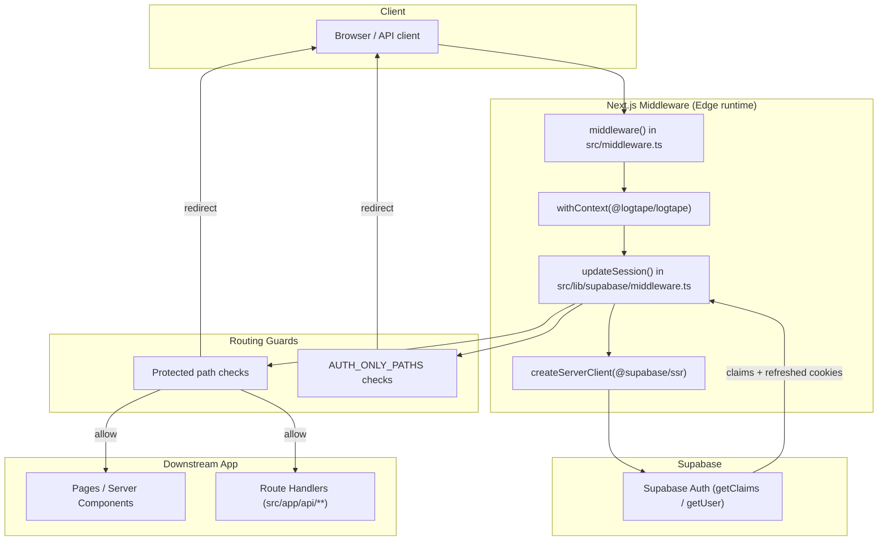
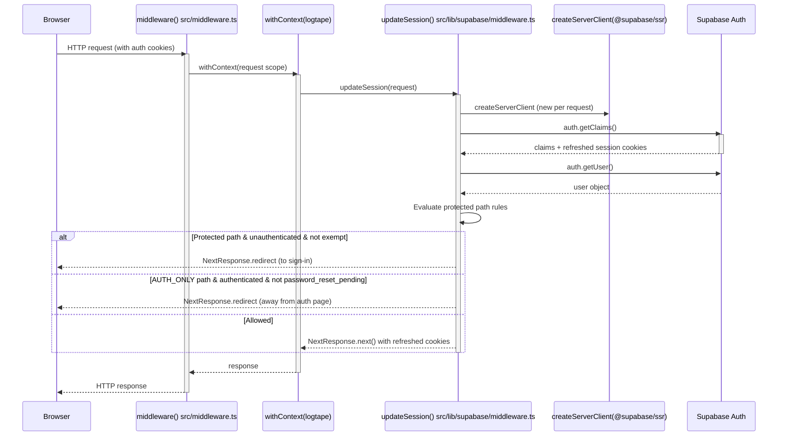

This page documents how the Ozeaon application intercepts every HTTP request through the Next.js Edge middleware, refreshes Supabase authentication sessions, and enforces route-level access rules (routing guards) before a request ever reaches a page or API handler.

## Purpose and Scope

This page covers the **request interception layer** of the application:

- The root Next.js middleware entry point and how it is composed with request-scoped logging context.
- The Supabase session-refresh logic that every request passes through.
- The routing guard rules that decide whether a request is allowed, redirected, or passed through.

This page intentionally **does not** cover:

- Page/Server Component rendering, data fetching, or layout composition — see the routing/app-structure pages.
- The Supabase client factory used inside Server Components and Route Handlers after the middleware has run.
- Business-level authorization (organization membership, post ownership, etc.) enforced inside `actions.ts` and `route.ts` handlers.

Because the middleware runs on **every matched request**, it is the single choke point where session validity and coarse-grained route protection are established for the rest of the application.

## Overview

Ozeaon is a Next.js (App Router) application that authenticates users with **Supabase Auth** over the `@supabase/ssr` server-side rendering helpers. SSR-based auth introduces a well-known problem: access tokens expire on a short interval, and cookies must be refreshed on the server so that Server Components and Route Handlers see a valid session.

The standard Supabase SSR pattern solves this by running a small piece of logic inside Next.js middleware on every request:

1. Create a server-side Supabase client bound to the incoming request cookies.
2. Call `supabase.auth.getClaims()` (and `getUser()`), which transparently refreshes the session if needed **and writes updated auth cookies back**.
3. Inspect the resulting claims to make routing decisions.

Ozeaon implements exactly this pattern, split across two files:

| File | Responsibility |
|------|----------------|
| `src/middleware.ts` | Next.js entry point; wraps the session logic in a request-scoped logging context and exports the `middleware` function. |
| `src/lib/supabase/middleware.ts` | The actual session-refresh + routing-guard implementation (`updateSession`). |

Key terminology used throughout this page:

- **Session refresh** — Exchanging the refresh token for a new access token and updating the `Set-Cookie` headers on the response.
- **Routing guard** — A conditional check inside middleware that redirects or blocks a request based on authentication state or claims.
- **Claims** — The decoded JWT payload returned by `supabase.auth.getClaims()`; includes `user_metadata` such as `password_reset_pending`.

## Architecture

The middleware sits between the browser and every server-rendered route. It is the outermost application concern, running before any Server Component, Route Handler, or static asset resolution for matched paths.



The design separates **concerns** deliberately: `src/middleware.ts` owns the framework integration and observability wrapping, while `src/lib/supabase/middleware.ts` owns the authentication protocol details. This keeps the framework entry point minimal and the Supabase logic testable and reusable.

## Middleware Entry Point

The Next.js middleware entry point is `src/middleware.ts`. It delegates all real work to two collaborators and does not itself contain any auth logic:

```typescript
import { withContext } from "@logtape/logtape";
import { updateSession } from "@/lib/supabase/middleware";
import type { NextRequest } from "next/server";

export async function middleware(request: NextRequest) {
  return await withContext(
```

> Source: [middleware.ts](https://github.com/ozeaon/ozeaon-v2/blob/0a4f1a95824db87782f1221a4108019d174df3d9/src/middleware.ts#L1-L6)

Two design decisions are visible here:

1. **`withContext` from `@logtape/logtape`** wraps the request handling in a logging context. This ensures every log line emitted during middleware execution is automatically annotated with request-scoped metadata (so that logs from concurrent requests can be correlated). Because middleware runs on *every* request, this is the correct place to establish the request's logging scope.
2. **`updateSession` from `@/lib/supabase/middleware`** is the single delegated action. The entry point is intentionally a thin adapter — it knows only *how to run* the session logic within the logging context, not *what* the session logic is.

### Why keep the entry point thin?

The Next.js App Router requires the middleware export to live at `src/middleware.ts` with the exact name `middleware` and signature `(request: NextRequest)`. By pushing Supabase-specific code into `@/lib/supabase/middleware`, the project avoids coupling the framework contract to the authentication provider. Swapping providers or adding a second concern (e.g., a rate limiter) would be a change inside `withContext(...)`, not a rewrite of the entry point.

## Session Refresh with Supabase SSR

`src/lib/supabase/middleware.ts` implements the canonical Supabase SSR cookie-refresh flow. Its imports establish the runtime contract:

```typescript
import { createServerClient } from "@supabase/ssr";
import { type NextRequest, NextResponse } from "next/server";
```

> Source: [middleware.ts](https://github.com/ozeaon/ozeaon-v2/blob/0a4f1a95824db87782f1221a4108019d174df3d9/src/lib/supabase/middleware.ts#L1-L2)

The client is created **fresh on every request** rather than being a module-level singleton:

```typescript
// variable. Always create a new one on each request.
const supabase = createServerClient(
  process.env.NEXT_PUBLIC_SUPABASE_URL!,
```

> Source: [middleware.ts](https://github.com/ozeaon/ozeaon-v2/blob/0a4f1a95824db87782f1221a4108019d174df3d9/src/lib/supabase/middleware.ts#L10-L12)

### Why a new client per request

Supabase's own guidance (quoted directly in the source comments) explains the constraint:

```typescript
// Do not run code between createServerClient and
// supabase.auth.getClaims(). A simple mistake could make it very hard to debug
```

> Source: [middleware.ts](https://github.com/ozeaon/ozeaon-v2/blob/0a4f1a95824db87782f1221a4108019d174df3d9/src/lib/supabase/middleware.ts#L45-L46)

Because the client is bound to the **per-request cookie jar**, a shared singleton would leak one user's session cookies into another concurrent request. The client is therefore instantiated locally, used immediately, and discarded when the request completes. The comment also warns against interleaving unrelated async work between client creation and `getClaims()`, since that window is where the cookie read/write handshake happens.

### The claims retrieval calls

The middleware performs two auth reads:

```typescript
const { data: claims } = await supabase.auth.getClaims();
```

> Source: [middleware.ts](https://github.com/ozeaon/ozeaon-v2/blob/0a4f1a95824db87782f1221a4108019d174df3d9/src/lib/supabase/middleware.ts#L51)

```typescript
      data: { user },
    } = await supabase.auth.getUser();
```

> Source: [middleware.ts](https://github.com/ozeaon/ozeaon-v2/blob/0a4f1a95824db87782f1221a4108019d174df3d9/src/lib/supabase/middleware.ts#L58-L59)

| Call | Purpose | Returns |
|------|---------|---------|
| `supabase.auth.getClaims()` | Verifies the JWT and, as a side effect, **refreshes the session** and rewrites auth cookies onto the response. | `{ data: claims }` |
| `supabase.auth.getUser()` | Fetches the authenticated user object. | `{ data: { user } }` |

`getClaims()` is the primary mechanism that keeps the session alive: any request arriving with an expired access token but a valid refresh token will be transparently renewed here, and the new cookies are attached to the response that flows back to the browser.

## Routing Guards

After the session is refreshed, the middleware evaluates **routing guard** rules against the request pathname. Two distinct rule sets exist, which together implement coarse-grained access control.

### Protected / auth-related paths

A list of paths is declared, including:

```typescript
    "/educational-resources",
    "/auth/signin",
    "/reset-password",
```

> Source: [middleware.ts](https://github.com/ozeaon/ozeaon-v2/blob/0a4f1a95824db87782f1221a4108019d174df3d9/src/lib/supabase/middleware.ts#L37-L39)

Paths in this group are involved in the authentication funnel and password reset. When an unauthenticated request targets one of these guarded paths (excluding a small set of exempt endpoints), the middleware can redirect the user toward sign-in.

### Exemptions from the redirect

Not every path under the auth funnel should force a redirect. The guard explicitly exempts several endpoints, e.g.:

```typescript
        request.nextUrl.pathname !== "/reset-password" &&
        request.nextUrl.pathname !== "/auth/signout"
```

> Source: [middleware.ts](https://github.com/ozeaon/ozeaon-v2/blob/0a4f1a95824db87782f1221a4108019d174df3d9/src/lib/supabase/middleware.ts#L64-L65)

The exempted paths include `/reset-password` and `/auth/signout`. This is important for correctness:

- `/reset-password` must be reachable by users who are **not** fully signed in (they clicked a reset link), so redirecting them to sign-in would trap them in a loop.
- `/auth/signout` must be reachable so a user can terminate a session; redirecting an authenticated user away from signout would make it impossible to log out.

### Reverse guard: authenticated users on auth-only pages

The second rule set blocks users **who are already authenticated** from landing on pages meant only for anonymous visitors:

```typescript
  // Redirect authenticated users away from auth-only pages
  const AUTH_ONLY_PATHS = ["/login", "/forgot-password", "/verify-email"];
```

> Source: [middleware.ts](https://github.com/ozeaon/ozeaon-v2/blob/0a4f1a95824db87782f1221a4108019d174df3d9/src/lib/supabase/middleware.ts#L78-L79)

The guard also checks `password_reset_pending` in the user metadata before redirecting:

```typescript
    !claims?.claims?.user_metadata?.password_reset_pending &&
    AUTH_ONLY_PATHS.includes(pathname)
```

> Source: [middleware.ts](https://github.com/ozeaon/ozeaon-v2/blob/0a4f1a95824db87782f1221a4108019d174df3d9/src/lib/supabase/middleware.ts#L82-L83)

This `password_reset_pending` check is the subtle part of the design. A user who has requested a password reset is technically authenticated (they hold a session) but must **not** be bounced away from the reset flow. By reading `user_metadata.password_reset_pending` from the claims and negating it, the guard ensures:

- Normal authenticated users hitting `/login`, `/forgot-password`, or `/verify-email` are redirected (they don't need these pages).
- A user mid-reset (`password_reset_pending === true`) is **allowed through**, so the reset journey is not interrupted.

## Core Flow

The following sequence walks through a single request end-to-end, matching the code order in the source: entry point → logging context → session refresh → guard evaluation → response.



The ordering is deliberate:

1. **Session refresh happens before guard evaluation.** The guards depend on `claims` and `user`, so the tokens must be verified and refreshed first. This also means that even requests destined to be redirected still leave with valid, refreshed cookies — avoiding the "random logout" failure mode Supabase warns about.
2. **Logging context wraps everything.** Because `withContext` is the outermost call in `middleware()`, every log line produced by the session logic — including guard decisions — is tagged with the request scope.

## Guard Decision Logic in Detail

The middleware produces exactly one of three outcomes per request. The table below maps each condition to its result and rationale.

| Condition | Outcome | Rationale |
|-----------|---------|-----------|
| Path in protected list, no valid session, path not exempt | Redirect toward sign-in | Anonymous users cannot access gated content. |
| Path is `/reset-password` or `/auth/signout` (exempt) | Pass through (`NextResponse.next()`) even when unauthenticated | These flows require an unauthenticated or self-terminating context; blocking them creates redirect loops. |
| Path in `AUTH_ONLY_PATHS`, authenticated, `password_reset_pending` is falsy | Redirect away from the auth page | Fully signed-in users should never see login/forgot-password/verify-email screens. |
| Path in `AUTH_ONLY_PATHS`, authenticated, `password_reset_pending === true` | Pass through | Users mid-reset must retain access to the reset/verification journey. |
| Any other path | Pass through with refreshed cookies | Default allow; fine-grained authorization is handled by server actions and route handlers. |

### Two-layer authorization model

This design intentionally implements only **coarse-grained** guards in middleware. The middleware answers questions like *"Is there a session at all?"* and *"Is this a page an anonymous user may see?"*. It does **not** answer questions like *"May this user edit this specific post?"* — those are enforced inside `actions.ts` and `route.ts` handlers (for example `src/app/(main)/(dashboard)/settings/actions.ts` and `src/app/api/**/route.ts`).

This separation is a deliberate trade-off:

- **Middleware advantages**: runs at the edge, before expensive rendering; centralizes session refresh; cannot be bypassed by a missing handler-level check.
- **Middleware limitations**: it only sees the request URL and auth claims — it has no database access to load resource ownership. Resource-level checks must therefore live closer to the data.

## Configuration Options

The middleware behavior is governed by environment variables and in-file constants.

| Option | Type | Source | Description |
|--------|------|--------|-------------|
| `NEXT_PUBLIC_SUPABASE_URL` | `string` (env var) | `process.env.NEXT_PUBLIC_SUPABASE_URL!` | Supabase project URL used to construct the server client. |
| (anon key) | `string` (env var) | passed to `createServerClient` | Supabase public anon key for client construction. |
| Protected paths | `string[]` (in-file) | includes `"/educational-resources"`, `"/auth/signin"`, `"/reset-password"` | Paths subject to authentication-aware redirects. |
| Exempt paths | `string[]` (in-file conditionals) | includes `"/reset-password"`, `"/auth/signout"` | Auth-funnel paths that must remain reachable regardless of session state. |
| `AUTH_ONLY_PATHS` | `string[]` (in-file) | `["/login", "/forgot-password", "/verify-email"]` | Pages restricted to anonymous visitors; authenticated users are redirected away. |
| `password_reset_pending` | `boolean` (JWT `user_metadata`) | read via `claims?.claims?.user_metadata` | When true, suppresses the auth-only redirect so the reset flow is not interrupted. |

> Note: the exact set of protected paths is not fully enumerable from the excerpt read; the list begins with `/educational-resources`, `/auth/signin`, and `/reset-password` at lines 37–39 of `src/lib/supabase/middleware.ts`. Additional entries may exist above line 37.

## API Reference

### `middleware(request: NextRequest): Promise<NextResponse>`

The Next.js middleware export, defined in `src/middleware.ts`. This is the function Next.js invokes for every matched request.

**Parameters:**
- `request` (`NextRequest`): The incoming request, including cookies, headers, and `nextUrl` (used by guards via `nextUrl.pathname`).

**Returns:** `Promise<NextResponse>` — produced by `updateSession`, either a pass-through response carrying refreshed auth cookies or a redirect.

**Throws:** No explicit throws in the entry point; it delegates to `updateSession` and wraps execution in `withContext`.

> Source: [middleware.ts](https://github.com/ozeaon/ozeaon-v2/blob/0a4f1a95824db87782f1221a4108019d174df3d9/src/middleware.ts#L5-L6)

### `updateSession(request): Promise<NextResponse>`

Defined in `src/lib/supabase/middleware.ts`. Performs Supabase client creation, session refresh, and routing-guard evaluation.

**Behavioral contract (verified from source):**
1. Constructs a per-request `createServerClient` bound to `NEXT_PUBLIC_SUPABASE_URL` and the request's cookie store.
2. Calls `supabase.auth.getClaims()` (line 51) — refreshes session and returns decoded claims.
3. Calls `supabase.auth.getUser()` (lines 58–59) — resolves the authenticated user.
4. Applies protected-path and `AUTH_ONLY_PATHS` guards, honoring the `/reset-password`, `/auth/signout`, and `password_reset_pending` exemptions.
5. Returns a `NextResponse` (pass-through with updated cookies, or a redirect).

**Key inputs:**
- `request.nextUrl.pathname` — the path matched against the guard lists (line 64–65, 83).
- Request cookies — the session source consumed by `createServerClient`.

> Source: [middleware.ts](https://github.com/ozeaon/ozeaon-v2/blob/0a4f1a95824db87782f1221a4108019d174df3d9/src/lib/supabase/middleware.ts#L11-L83)

## Failure Modes and Edge Cases

| Failure / Edge Case | Mechanism | Mitigation in source |
|---------------------|-----------|----------------------|
| Random user logouts | Reusing or sharing a Supabase client across requests, or running code between client creation and `getClaims()` | Source comment explicitly warns; a new client is created per request (line 10–11) and `getClaims()` is called immediately (line 45–51). |
| Redirect loop on password reset | Redirecting `/reset-password` for unauthenticated users | `/reset-password` is exempted from the redirect condition (line 64). |
| Inability to sign out | Redirecting authenticated users before `/auth/signout` executes | `/auth/signout` is exempted (line 65). |
| Authenticated user trapped on auth pages mid-reset | Naively redirecting all authenticated users away from `AUTH_ONLY_PATHS` would abort the reset | `password_reset_pending` check suppresses the redirect (line 82). |
| Concurrent requests cross-contaminating sessions | A module-level singleton client | Fresh client per request avoids cookie-jar sharing. |
| Missing env vars | `process.env.NEXT_PUBLIC_SUPABASE_URL!` uses a non-null assertion | Failure surfaces at client construction if the variable is absent; the `!` documents the assumed invariant. |

**Concurrency note:** Because middleware runs on the Edge and handles many concurrent requests, the per-request client instantiation is a *correctness* requirement, not merely a style choice. Sharing state across the `createServerClient` → `getClaims()` boundary would cause users to observe each other's sessions.

## Performance and Operational Considerations

- **Runs on every matched request.** The middleware is the hottest code path in the app. Two sequential auth round-trips (`getClaims()` then `getUser()`) are performed per request; keeping the rest of the middleware logic to in-memory array comparisons (no DB queries) keeps the added latency minimal.
- **Cookie write amplification.** Session refresh attaches `Set-Cookie` headers on every request where the token was renewed, which is the expected Supabase SSR behavior and the mechanism that keeps SSR sessions valid.
- **Observability.** All middleware logging is contextualized by `withContext` from `@logtape/logtape`, enabling per-request correlation of guard decisions and auth outcomes in the logs.
- **Statelessness.** The middleware holds no server-side session store; all session state travels in cookies, making the layer horizontally scalable and compatible with Edge/serverless runtimes.

## Related Links

- Root middleware entry point: [src/middleware.ts](https://github.com/ozeaon/ozeaon-v2/blob/0a4f1a95824db87782f1221a4108019d174df3d9/src/middleware.ts)
- Supabase session + guard implementation: [src/lib/supabase/middleware.ts](https://github.com/ozeaon/ozeaon-v2/blob/0a4f1a95824db87782f1221a4108019d174df3d9/src/lib/supabase/middleware.ts)
- Auth confirmation route: [src/app/(auth)/auth/confirm/route.ts](https://github.com/ozeaon/ozeaon-v2/blob/0a4f1a95824db87782f1221a4108019d174df3d9/src/app/(auth)/auth/confirm/route.ts)
- Server-side authorization examples (fine-grained checks): [src/app/(main)/(dashboard)/settings/actions.ts](https://github.com/ozeaon/ozeaon-v2/blob/0a4f1a95824db87782f1221a4108019d174df3d9/src/app/(main)/(dashboard)/settings/actions.ts), [src/app/(main)/(feed)/(private)/account/actions.ts](https://github.com/ozeaon/ozeaon-v2/blob/0a4f1a95824db87782f1221a4108019d174df3d9/src/app/(main)/(feed)/(private)/account/actions.ts)
- API route handlers guarded downstream: [src/app/api/account/posts/route.ts](https://github.com/ozeaon/ozeaon-v2/blob/0a4f1a95824db87782f1221a4108019d174df3d9/src/app/api/account/posts/route.ts), [src/app/api/active-account/route.ts](https://github.com/ozeaon/ozeaon-v2/blob/0a4f1a95824db87782f1221a4108019d174df3d9/src/app/api/active-account/route.ts)
