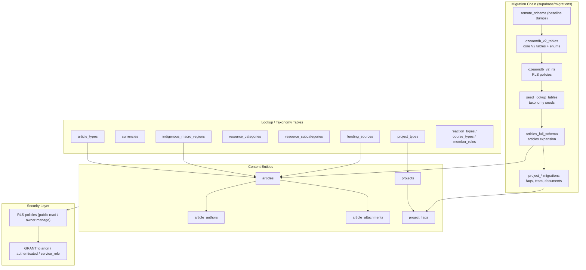
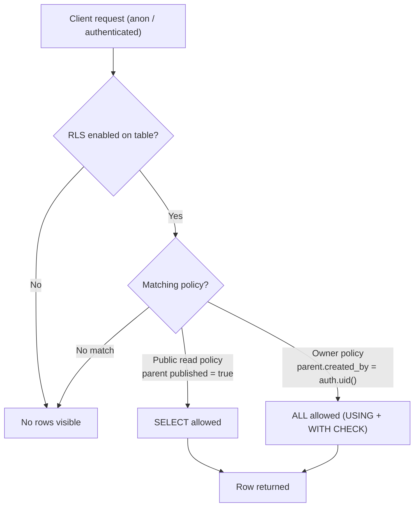
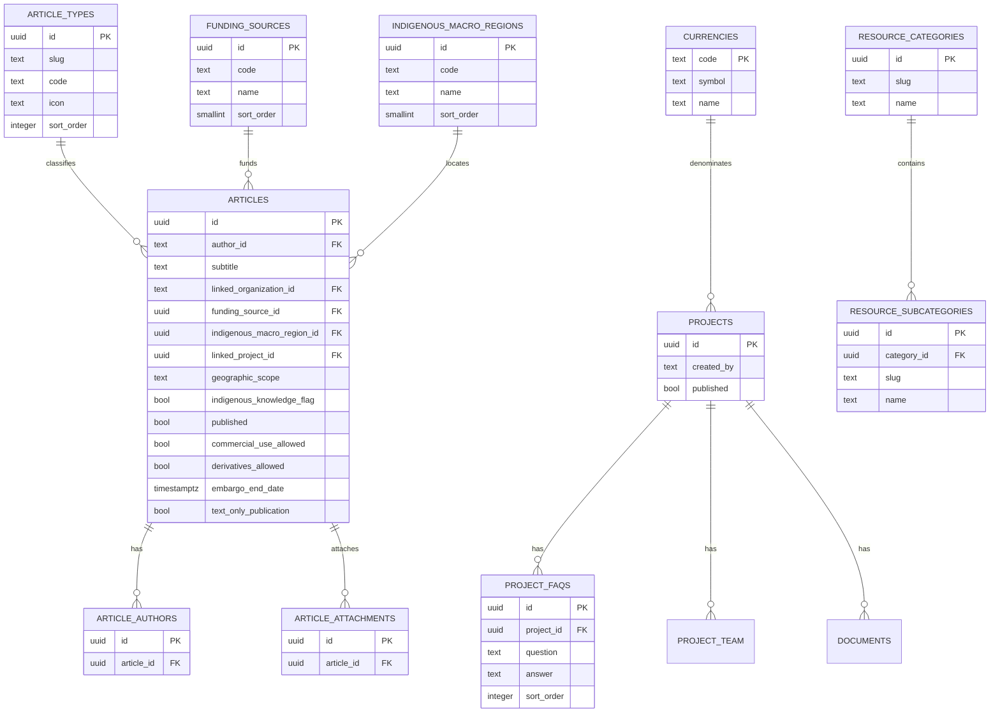
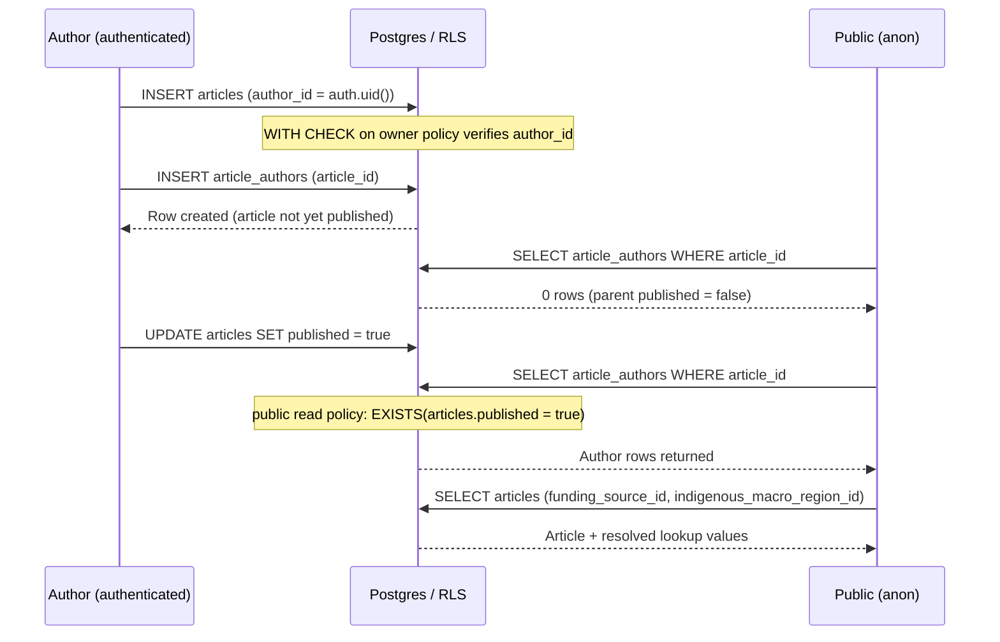

The Ozeaon V2 data model is a PostgreSQL schema hosted on Supabase, evolved through a linear series of versioned SQL migrations under `supabase/migrations/`. It defines the platform's content, governance, identity, and lookup entities together with their Row-Level Security (RLS) policies.

## Purpose and Scope

This page documents the **physical database schema** of Ozeaon V2: how tables, enums, lookup tables, foreign keys, and RLS policies are defined and evolved through the migration chain under [`supabase/migrations/`](https://github.com/ozeaon/ozeaon-v2/blob/0a4f1a95824db87782f1221a4108019d174df3d9/supabase/migrations).

It covers:

- The migration-based schema evolution strategy (single-transaction, idempotent DDL).
- The V2 core table set introduced by `20260310232125_ozeaondb_v2_tables.sql`.
- The Articles subsystem schema (`articles`, `article_authors`, `article_attachments`, funding/region lookups).
- The Project content tables added in April 2026 (`project_faqs`, plus the project team / documents / related-content / settings migration family).
- Lookup-table taxonomy and seed data.
- Security posture: RLS enablement and policy design.

**Out of scope / sibling pages.** Application-layer data access (Supabase client queries, service wrappers), authentication flow details, and API endpoint contracts are documented on their own architecture pages. This page stays at the schema-and-migration boundary. For the storage bucket objects referenced by article attachments and documents, see the storage/architecture pages. For the RLS runtime model at the API level, see the security/RLS page.

## Overview

Ozeaon V2's schema is not defined by a single declarative schema file; it is the cumulative result of an ordered migration chain. Each migration file is a timestamp-prefixed SQL script (Supabase convention: `YYYYMMDDHHMMSS_description.sql`) that mutates the live database state exactly once, in order. Earlier "remote schema" dumps (`20260224141918_remote_schema.sql`, `20260224142212_remote_schema.sql`) capture the pre-V2 baseline, and later files incrementally reshape it.

The design has three characteristics worth calling out up front:

1. **Additive, idempotent DDL.** Migrations guard every mutation with `IF NOT EXISTS` / `IF EXISTS` checks, `DO $$ ... $$` blocks that inspect `information_schema`, `pg_indexes`, and `pg_constraint`, and `CREATE TABLE IF NOT EXISTS`. This makes the chain safe to re-run or apply against a database that may already be partially migrated.
2. **Lookup-table discipline.** Enumerable concepts (article types, currencies, project types, resource categories/subcategories, SDGs, funding sources, indigenous macro regions) are modelled as lookup tables with a `slug`/`code` + `name` + `sort_order` shape rather than free-text columns or wide native enums. This keeps taxonomy extensible without DDL.
3. **RLS-first security.** Every new table enables Row-Level Security and carries explicit policies expressed relative to an owning parent row (e.g., "published article", "project created_by = auth.uid()").

### Key terminology

| Term | Meaning |
|------|---------|
| `public` schema | The single application schema; all tables live under `public`. |
| Lookup table | Small reference table (`slug`/`code`, `name`, `description`, `sort_order`, `created_at`) seeded at migration time. |
| RLS | Postgres Row-Level Security; enabled on every application table. |
| `auth.uid()` | Supabase helper returning the current authenticated user id, used in policies. |
| Published gate | Many child-table read policies key off a parent's `published = true` flag. |

## Architecture

The schema is best understood as a set of layered entity families, all rooted in the `public` schema, evolved by the migration chain.



**Reading the diagram.** The migration chain is strictly ordered and each link adds either (a) new tables/enums, (b) new columns on existing tables, or (c) security/grants. Lookup tables are leaves that content entities reference by FK. Content entities increasingly hang child rows off a parent (`articles` → `article_authors`/`article_attachments`; `projects` → `project_faqs`). The security layer is applied per-table, not centrally, which is why every migration that creates a table also (re)asserts RLS and grants.

## Migration-Based Schema Evolution

### The V2 cutover migration

The pivot point of the schema is `supabase/migrations/20260310232125_ozeaondb_v2_tables.sql`. It is explicitly written to run **inside a single transaction** so that any failure rolls back the whole change set — a deliberate safety choice for a large structural rewrite. Its header states the intent:

```sql
-- =============================================================================
-- OZEAON V2 MIGRATION
-- Generated: 2026-03-10
-- Apply via Supabase SQL editor or supabase db push
-- Run in a single transaction — roll back the whole migration on any failure.
-- =============================================================================

BEGIN;
```

> Source: [20260310232125_ozeaondb_v2_tables.sql](https://github.com/ozeaon/ozeaon-v2/blob/0a4f1a95824db87782f1221a4108019d174df3d9/supabase/migrations/20260310232125_ozeaondb_v2_tables.sql#L1-L8)

The migration proceeds in ordered steps: **drop stale functions/triggers → drop legacy tables/columns → create enums → create lookup tables → create core tables**. The ordering is load-bearing: triggers and functions that reference soon-to-be-dropped columns must be removed first, and dependent tables must be dropped before their parents.

### Step 1 — Dropping stale functions and triggers

Because V2 drops the legacy social/comments/tutorial surface, any trigger or function that references those columns must be removed *before* the tables are touched. The migration drops them defensively with `IF EXISTS ... CASCADE`:

```sql
-- Triggers on posts referencing dropped count columns
DROP TRIGGER IF EXISTS trg_increment_comment_total ON public.posts;
DROP TRIGGER IF EXISTS trg_decrement_comment_total ON public.posts;
DROP TRIGGER IF EXISTS trg_update_post_like_count ON public.posts;
DROP TRIGGER IF EXISTS trg_update_repost_total ON public.posts;

-- Functions that reference dropped columns/tables
DROP FUNCTION IF EXISTS public.decrement_post_comment_total() CASCADE;
DROP FUNCTION IF EXISTS public.increment_post_comment_total() CASCADE;
DROP FUNCTION IF EXISTS public.toggle_post_like(text, uuid) CASCADE;
DROP FUNCTION IF EXISTS public.toggle_comment_like(text, uuid) CASCADE;
```

> Source: [20260310232125_ozeaondb_v2_tables.sql](https://github.com/ozeaon/ozeaon-v2/blob/0a4f1a95824db87782f1221a4108019d174df3d9/supabase/migrations/20260310232125_ozeaondb_v2_tables.sql#L15-L37)

**Design intent:** `CASCADE` on the function drops is essential because functions may be referenced by triggers or views; without it the migration would fail on dependency errors. Dropping triggers explicitly first also documents the *intended* removal of the legacy comment/like/repost counting machinery.

### Step 2 — Dropping legacy tables

Legacy tables are dropped dependents-first, then parents, using `CASCADE`:

```sql
DROP TABLE IF EXISTS public.tutorial_step_tools_junction CASCADE;
DROP TABLE IF EXISTS public.tutorial_tools_junction CASCADE;
DROP TABLE IF EXISTS public.tutorial_comment_likes CASCADE;
DROP TABLE IF EXISTS public.tutorial_comments CASCADE;
DROP TABLE IF EXISTS public.tutorials CASCADE;

DROP TABLE IF EXISTS public.features_images CASCADE;
DROP TABLE IF EXISTS public.features CASCADE;

DROP TABLE IF EXISTS public.activities CASCADE;
DROP TABLE IF EXISTS public.reactions CASCADE;
DROP TABLE IF EXISTS public.comments CASCADE;
DROP TABLE IF EXISTS public.bookmarks CASCADE;
```

> Source: [20260310232125_ozeaondb_v2_tables.sql](https://github.com/ozeaon/ozeaon-v2/blob/0a4f1a95824db87782f1221a4108019d174df3d9/supabase/migrations/20260310232125_ozeaondb_v2_tables.sql#L48-L67)

This step effectively **retires** the pre-V2 tutorial subsystem (with its sections, steps, tools, participants, reviews, and category junctions) and the social engagement subsystem (`activities`, `reactions`, `comments`, `bookmarks`). The junction tables (`*_junction`) reveal the legacy model used many-to-many link tables that V2 replaces with lookup-taxonomy FKs.

### Step 3 — Native enums

V2 introduces native Postgres enums for tightly-bounded state machines — statuses whose value set is fixed and small. Representative definitions:

```sql
CREATE TYPE public.image_mime_type AS ENUM (
  'image/jpeg',
  'image/png',
  'image/webp',
  'image/gif',
  'image/svg+xml',
  'image/avif'
);

CREATE TYPE public.invite_status AS ENUM (
  'pending',
  'accepted',
  'declined',
  'expired'
);

CREATE TYPE public.connection_status AS ENUM (
  'pending',
  'accepted',
  'declined',
  'cancelled',
  'expired',
  'blocked'
);

CREATE TYPE public.vote_choice AS ENUM (
  'yes',
  'no',
  'abstain'
);

CREATE TYPE public.visibility_type AS ENUM (
  'public',
  'connections',
  'private'
);
```

> Source: [20260310232125_ozeaondb_v2_tables.sql](https://github.com/ozeaon/ozeaon-v2/blob/0a4f1a95824db87782f1221a4108019d174df3d9/supabase/migrations/20260310232125_ozeaondb_v2_tables.sql#L73-L121)

**Design intent — enums vs. lookup tables.** Values that are *state* (an invite can only be pending/accepted/declined/expired) are modelled as enums because the set is closed and referential checks are free. Values that are *taxonomy* (article types, resource categories) are modelled as lookup tables because they are user-facing, extendable, and carry metadata (`icon`, `sort_order`, `description`). This split is a deliberate and consistent convention across the schema.

The full enum set introduced here includes `image_mime_type`, `invite_status`, `request_status`, `connection_status`, `referral_status`, `vote_choice`, and `visibility_type`.

### Step 4 — Lookup table shape

Lookup tables created in this step share an identical skeleton. `proposal_types`, `organization_types`, `pod_types`, `notification_types`, `reaction_types`, `transaction_types`, `course_types`, `resource_types`, `difficulty_levels`, `member_roles`, and `project_section_types` all follow this shape:

```sql
CREATE TABLE public.proposal_types (
  id uuid PRIMARY KEY DEFAULT gen_random_uuid(),
  slug text NOT NULL UNIQUE,
  name text NOT NULL,
  description text,
  sort_order integer NOT NULL DEFAULT 0,
  created_at timestamptz NOT NULL DEFAULT now()
);
```

> Source: [20260310232125_ozeaondb_v2_tables.sql](https://github.com/ozeaon/ozeaon-v2/blob/0a4f1a95824db87782f1221a4108019d174df3d9/supabase/migrations/20260310232125_ozeaondb_v2_tables.sql#L127-L134)

The same pattern repeats for `organization_types`, `pod_types`, `notification_types`, and the rest:

> Source: [20260310232125_ozeaondb_v2_tables.sql](https://github.com/ozeaon/ozeaon-v2/blob/0a4f1a95824db87782f1221a4108019d174df3d9/supabase/migrations/20260310232125_ozeaondb_v2_tables.sql#L136-L227)

Some lookups are seeded inline at creation time. `reaction_types` is seeded with the five reaction kinds, using `ON CONFLICT (slug) DO NOTHING` to keep it idempotent, and `course_types` is seeded with a fixed education-level taxonomy:

```sql
INSERT INTO public.reaction_types (id, slug, name, sort_order)
VALUES
  (gen_random_uuid(), 'like', 'Like', 1),
  (gen_random_uuid(), 'celebrate', 'Celebrate', 2),
  (gen_random_uuid(), 'support', 'Support', 3),
  (gen_random_uuid(), 'insightful', 'Insightful', 4),
  (gen_random_uuid(), 'curious', 'Curious', 5)
ON CONFLICT (slug) DO NOTHING;
```

> Source: [20260310232125_ozeaondb_v2_tables.sql](https://github.com/ozeaon/ozeaon-v2/blob/0a4f1a95824db87782f1221a4108019d174df3d9/supabase/migrations/20260310232125_ozeaondb_v2_tables.sql#L172-L179)

```sql
INSERT INTO public.course_types (slug, name, sort_order) VALUES
  ('bachelors',        'Bachelor''s Degree',       0),
  ('masters',          'Master''s Degree',          1),
  ('phd',              'PhD / Doctorate',           2),
  ('professional',     'Professional Qualification',3),
  ('diploma',          'Diploma',                   4),
  ('certificate',      'Certificate',               5),
  ('online-course',    'Online Course',             6),
  ('bootcamp',         'Bootcamp',                  7),
  ('self-taught',      'Self-Taught',               8),
  ('other',            'Other',                     9);
```

> Source: [20260310232125_ozeaondb_v2_tables.sql](https://github.com/ozeaon/ozeaon-v2/blob/0a4f1a95824db87782f1221a4108019d174df3d9/supabase/migrations/20260310232125_ozeaondb_v2_tables.sql#L199-L209)

## Articles Subsystem Schema

The Articles subsystem is the most heavily evolved part of the schema. Its expansion happens in `20260328000000_articles_full_schema.sql`, a "gap-fill" migration that both corrects earlier mistakes and adds the full domain model for research/publication content.

### Declared scope of the migration

The migration's header enumerates its responsibilities, which is the authoritative statement of intent:

```sql
-- =============================================================================
-- ARTICLES FULL SCHEMA — Gap-fill migration
-- Date: 2026-03-28
-- Covers:
--   1. Fix RLS bug in article_authors (user_id → author_id)
--   2. Rename articles.organization_id → linked_organization_id
--   3. Add all missing columns to articles table
--   4. Create funding_sources lookup table + seed
--   5. Create indigenous_macro_regions lookup table + seed
--   6. Create article_attachments table
-- =============================================================================
```

> Source: [20260328000000_articles_full_schema.sql](https://github.com/ozeaon/ozeaon-v2/blob/0a4f1a95824db87782f1221a4108019d174df3d9/supabase/migrations/20260328000000_articles_full_schema.sql#L1-L11)

### Correcting the RLS bug and column rename

The migration first drops and recreates the `article_authors` policies because the original ones referenced a non-existent `articles.user_id` column; the correct column is `articles.author_id`:

```sql
CREATE POLICY "Anyone can read authors of published articles"
ON public.article_authors AS PERMISSIVE FOR SELECT
TO public
USING (
    exists (select 1 from public.articles where id = article_id and published = true)
    OR
    exists (select 1 from public.articles where id = article_id and author_id = (select auth.uid()))
);

CREATE POLICY "Author manages their article authors"
ON public.article_authors AS PERMISSIVE FOR ALL
TO authenticated
USING (
    exists (select 1 from public.articles where id = article_id and author_id = (select auth.uid()))
)
WITH CHECK (
    exists (select 1 from public.articles where id = article_id and author_id = (select auth.uid()))
);
```

> Source: [20260328000000_articles_full_schema.sql](https://github.com/ozeaon/ozeaon-v2/blob/0a4f1a95824db87782f1221a4108019d174df3d9/supabase/migrations/20260328000000_articles_full_schema.sql#L19-L39)

**Design intent:** the read policy encodes two audiences — the general public (only when the parent article is `published = true`) and the owning author (regardless of publish state). The `WITH CHECK` clause on the `ALL` policy ensures the same ownership predicate governs writes, closing a privilege-escalation gap.

The rename of `organization_id` → `linked_organization_id` is wrapped in existence checks against `information_schema.columns`, `pg_indexes`, and `pg_constraint`, so it is a no-op if already applied:

```sql
DO $$
BEGIN
    IF EXISTS (
        SELECT 1 FROM information_schema.columns
        WHERE table_schema = 'public'
          AND table_name   = 'articles'
          AND column_name  = 'organization_id'
    ) THEN
        ALTER TABLE public.articles RENAME COLUMN organization_id TO linked_organization_id;
    END IF;
END
$$;
```

> Source: [20260328000000_articles_full_schema.sql](https://github.com/ozeaon/ozeaon-v2/blob/0a4f1a95824db87782f1221a4108019d174df3d9/supabase/migrations/20260328000000_articles_full_schema.sql#L46-L57)

### Article column groups

The `articles` table is expanded with column groups added via `ADD COLUMN IF NOT EXISTS`, so repeated application is safe:

- **Core identity:** `subtitle`.
- **Access & license:** `custom_license`, `commercial_use_allowed`, `derivatives_allowed`, `attribution_text`, `jurisdiction_notes`, `embargo_end_date`.
- **Authorship:** `external_organization_name`, `external_organization_url`, `funding_source_id`, `funding_details`, `linked_project_id`.
- **Geographic / Indigenous:** `geographic_scope`, `location_details`, `indigenous_knowledge_flag`, `indigenous_macro_region_id`, `indigenous_sub_region`, `indigenous_peoples_nations`, `indigenous_local_territory`.
- **Details:** `summary`, `external_publish_date`, `journal_publisher`.
- **Content:** `text_only_publication`.

```sql
-- Access & License
ALTER TABLE public.articles
    ADD COLUMN IF NOT EXISTS custom_license         text,
    ADD COLUMN IF NOT EXISTS commercial_use_allowed boolean     not null default false,
    ADD COLUMN IF NOT EXISTS derivatives_allowed    boolean     not null default false,
    ADD COLUMN IF NOT EXISTS attribution_text       text,
    ADD COLUMN IF NOT EXISTS jurisdiction_notes     text,
    ADD COLUMN IF NOT EXISTS embargo_end_date       timestamptz;
```

> Source: [20260328000000_articles_full_schema.sql](https://github.com/ozeaon/ozeaon-v2/blob/0a4f1a95824db87782f1221a4108019d174df3d9/supabase/migrations/20260328000000_articles_full_schema.sql#L90-L97)

The geographic scope is constrained to a closed value set via a named `CHECK` constraint that is added `NOT VALID` and then validated in a second statement — a technique that avoids a long table lock on large tables:

```sql
ALTER TABLE public.articles
    ADD CONSTRAINT articles_geographic_scope_check
        CHECK (geographic_scope IN ('global', 'regional', 'local'))
    NOT VALID;

ALTER TABLE public.articles VALIDATE CONSTRAINT articles_geographic_scope_check;
```

> Source: [20260328000000_articles_full_schema.sql](https://github.com/ozeaon/ozeaon-v2/blob/0a4f1a95824db87782f1221a4108019d174df3d9/supabase/migrations/20260328000000_articles_full_schema.sql#L120-L125)

The schema also documents non-obvious semantics through `COMMENT ON COLUMN`, which is important because the constraints between columns are enforced by the application rather than the database:

```sql
COMMENT ON COLUMN public.articles.custom_license         IS 'Free-text license terms shown when license_type code = ''CUSTOM''.';
COMMENT ON COLUMN public.articles.embargo_end_date       IS 'Required when access_level code = ''embargoed''. Article becomes publicly accessible after this date.';
COMMENT ON COLUMN public.articles.summary IS 'Short plain-text summary (distinct from abstract). Optional.';
COMMENT ON COLUMN public.articles.text_only_publication IS 'True when the article has no PDF attachment and is text-only.';
```

> Source: [20260328000000_articles_full_schema.sql](https://github.com/ozeaon/ozeaon-v2/blob/0a4f1a95824db87782f1221a4108019d174df3d9/supabase/migrations/20260328000000_articles_full_schema.sql#L99-L139)

**Design intent:** these comments record *conditional* requirements (e.g., `embargo_end_date` is required when access level is `embargoed`) that are not expressible as simple `CHECK` constraints, so they are captured as documentation-of-record next to the column.

### Article-specific lookup tables

Two lookups support the article model: `funding_sources` and `indigenous_macro_regions`. Both use a leaner shape than the V2 lookup skeleton — `code`/`name`/`description`/`sort_order` with a `smallint` sort order:

```sql
CREATE TABLE IF NOT EXISTS public.funding_sources (
    id          uuid        NOT NULL DEFAULT gen_random_uuid(),
    code        text        NOT NULL,
    name        text        NOT NULL,
    description text,
    sort_order  smallint             DEFAULT 0,
    created_at  timestamptz NOT NULL DEFAULT now(),
    CONSTRAINT funding_sources_pkey PRIMARY KEY (id),
    CONSTRAINT funding_sources_code_key UNIQUE (code)
);

ALTER TABLE public.funding_sources ENABLE ROW LEVEL SECURITY;

GRANT DELETE, INSERT, REFERENCES, SELECT, TRIGGER, TRUNCATE, UPDATE
    ON TABLE public.funding_sources TO anon;
GRANT DELETE, INSERT, REFERENCES, SELECT, TRIGGER, TRUNCATE, UPDATE
    ON TABLE public.funding_sources TO authenticated;
GRANT DELETE, INSERT, REFERENCES, SELECT, TRIGGER, TRUNCATE, UPDATE
    ON TABLE public.funding_sources TO service_role;
```

> Source: [20260328000000_articles_full_schema.sql](https://github.com/ozeaon/ozeaon-v2/blob/0a4f1a95824db87782f1221a4108019d174df3d9/supabase/migrations/20260328000000_articles_full_schema.sql#L146-L164)

Note the explicit **named constraints** (`funding_sources_pkey`, `funding_sources_code_key`) rather than relying on Postgres auto-generated names — this makes later idempotent migrations (which must reference constraint names) reliable.

Seeding is guarded by an emptiness check and a policy-existence check, making both re-runnable:

```sql
DO $$
BEGIN
    IF NOT EXISTS (
        SELECT 1 FROM pg_policies
        WHERE schemaname = 'public'
          AND tablename  = 'funding_sources'
          AND policyname = 'Public read funding sources'
    ) THEN
        CREATE POLICY "Public read funding sources"
        ON public.funding_sources AS PERMISSIVE FOR SELECT
        TO public USING (true);
    END IF;
END
$$;

-- Seed
DO $$
BEGIN
    IF NOT EXISTS (SELECT 1 FROM public.funding_sources) THEN
        INSERT INTO public.funding_sources (code, name, sort_order) VALUES
            ('grant',        'Research Grant',    1),
            ('sponsor',      'Corporate Sponsor', 2),
            ('dao_treasury', 'DAO Treasury',      3),
            ('self_funded',  'Self-Funded',       4),
            ('crowdfunding', 'Crowdfunding',       5),
            ('ngo',          'NGO / Foundation',  6),
            ('government',   'Government',        7),
            ('other',        'Other',             8);
    END IF;
END
$$;
```

> Source: [20260328000000_articles_full_schema.sql](https://github.com/ozeaon/ozeaon-v2/blob/0a4f1a95824db87782f1221a4108019d174df3d9/supabase/migrations/20260328000000_articles_full_schema.sql#L166-L196)

`indigenous_macro_regions` follows the identical pattern (table + RLS + grants + guarded policy + guarded seed), creating a consistent template for "article taxonomy" tables.

> Source: [20260328000000_articles_full_schema.sql](https://github.com/ozeaon/ozeaon-v2/blob/0a4f1a95824db87782f1221a4108019d174df3d9/supabase/migrations/20260328000000_articles_full_schema.sql#L203-L240)

## Lookup Taxonomy & Seed Strategy

The standalone seed migration `20260325000000_seed_lookup_tables.sql` populates the seedable taxonomy tables — `article_types`, `currencies`, `project_types`, `resource_categories`, `resource_subcategories`, and `sdgs` — but only when they are empty.

### Empty-guard pattern

Every seed is wrapped in `IF NOT EXISTS (SELECT 1 FROM <table> LIMIT 1) THEN ... END IF`, so re-running the migration against an already-seeded database does nothing:

```sql
DO $$
BEGIN

  -- article_types
  IF NOT EXISTS (SELECT 1 FROM public.article_types LIMIT 1) THEN
    INSERT INTO public.article_types (name, slug, description, icon, code, sort_order) VALUES
      ('Research',                  'research',                   'Academic or scientific research publication',          'flask',          'research',             1),
      ('Innovation / Concept',      'innovation-concept',         'New ideas, concepts, or innovations',                  'lightbulb',      'innovation',           2),
      ('Field & Local Insight',     'field-local-insight',        'Field observations and local insights',                'map-pin',        'field_insight',        3),
      ...
  END IF;
```

> Source: [20260325000000_seed_lookup_tables.sql](https://github.com/ozeaon/ozeaon-v2/blob/0a4f1a95824db87782f1221a4108019d174df3d9/supabase/migrations/20260325000000_seed_lookup_tables.sql#L4-L18)

**Note the twin keys.** `article_types` carries both a human-facing `slug` and a stable `code`, plus an `icon` identifier (e.g., `flask`, `lightbulb`, `map-pin`) that the frontend uses to render type badges. This three-key design (surrogate `id` uuid, machine `code`, URL `slug`) recurs across taxonomy tables.

### Hierarchical lookup: categories → subcategories

`resource_categories` and `resource_subcategories` demonstrate a **self-referencing hierarchy expressed as a two-table parent/child relationship**. Subcategories are seeded by resolving their parent's `id` through a subquery on the parent's `slug`, and rows are combined with `UNION ALL`:

```sql
  -- resource_subcategories (depends on resource_categories being seeded first)
  IF NOT EXISTS (SELECT 1 FROM public.resource_subcategories LIMIT 1) THEN
    INSERT INTO public.resource_subcategories (category_id, slug, name, description, sort_order, summary)
    SELECT
      (SELECT id FROM public.resource_categories WHERE slug = 'ecosystem-services' LIMIT 1), 'tackling-climate-change',  'Tackling Climate Change',  NULL, 1, NULL
    UNION ALL SELECT
      (SELECT id FROM public.resource_categories WHERE slug = 'ecosystem-services' LIMIT 1), 'biodiversity',             'Biodiversity',             NULL, 2, NULL
    UNION ALL SELECT
      (SELECT id FROM public.resource_categories WHERE slug = 'health-biotech' LIMIT 1), 'biomaterials',             'Biomaterials',             NULL, 1, NULL
    ...
```

> Source: [20260325000000_seed_lookup_tables.sql](https://github.com/ozeaon/ozeaon-v2/blob/0a4f1a95824db87782f1221a4108019d174df3d9/supabase/migrations/20260325000000_seed_lookup_tables.sql#L63-L82)

**Design intent:** the migration comment explicitly flags the ordering dependency — *"depends on resource_categories being seeded first."* This is the classic lookup-seeding ordering hazard: the child resolves the parent by `slug`, so if the parent isn't inserted, the `SELECT id ... LIMIT 1` returns `NULL` and the FK is violated (or the row silently fails). Keeping the parent and child seeds in one transaction-ordered `DO` block ensures correct ordering within one migration.

The currencies seed shows a distinct shape — a currency lookup keyed by ISO `code` with a `symbol` column, distinct from the slug-based taxonomies:

```sql
  IF NOT EXISTS (SELECT 1 FROM public.currencies LIMIT 1) THEN
    INSERT INTO public.currencies (code, symbol, name) VALUES
      ('USD', '$',  'United States Dollar'),
      ('EUR', '€',  'Euro'),
      ('GBP', '£',  'British Pound Sterling'),
      ('JPY', '¥',  'Japanese Yen'),
      ...
  END IF;
```

> Source: [20260325000000_seed_lookup_tables.sql](https://github.com/ozeaon/ozeaon-v2/blob/0a4f1a95824db87782f1221a4108019d174df3d9/supabase/migrations/20260325000000_seed_lookup_tables.sql#L20-L33)

## Project Content Tables

The April 2026 migration family (`20260414000000` through `20260414000004`) extends projects with structured child content. Each follows the same template: a `project_id` FK to `public.projects`, RLS, parent-relative policies, and an `updated_at` trigger.

### `project_faqs`

```sql
CREATE TABLE public.project_faqs (
  id uuid DEFAULT gen_random_uuid() NOT NULL,
  project_id uuid NOT NULL,
  question text NOT NULL,
  answer text NOT NULL,
  sort_order integer DEFAULT 0 NOT NULL,
  created_at timestamp with time zone DEFAULT now() NOT NULL,
  updated_at timestamp with time zone DEFAULT now() NOT NULL,
  CONSTRAINT project_faqs_pkey PRIMARY KEY (id),
  CONSTRAINT project_faqs_project_id_fkey FOREIGN KEY (project_id) REFERENCES public.projects(id) ON DELETE CASCADE
);

ALTER TABLE public.project_faqs ENABLE ROW LEVEL SECURITY;

CREATE POLICY "Anyone can read FAQs of published projects" ON public.project_faqs FOR SELECT USING ((EXISTS ( SELECT 1 FROM public.projects WHERE ((projects.id = project_faqs.project_id) AND (projects.published = true)))));
CREATE POLICY "Project owner has full access to project FAQs" ON public.project_faqs TO authenticated USING ((EXISTS ( SELECT 1 FROM public.projects WHERE ((projects.id = project_faqs.project_id) AND (projects.created_by = ( SELECT auth.uid() AS uid)))))) WITH CHECK ((EXISTS ( SELECT 1 FROM public.projects WHERE ((projects.id = project_faqs.project_id) AND (projects.created_by = ( SELECT auth.uid() AS uid))))));

CREATE TRIGGER trg_updated_at_project_faqs BEFORE UPDATE ON public.project_faqs FOR EACH ROW EXECUTE FUNCTION public.update_updated_at();
```

> Source: [20260414000000_project_faqs.sql](https://github.com/ozeaon/ozeaon-v2/blob/0a4f1a95824db87782f1221a4108019d174df3d9/supabase/migrations/20260414000000_project_faqs.sql#L1-L18)

**Design intent highlights:**

- `ON DELETE CASCADE` on the FK means deleting a project removes its FAQs automatically — child content has no independent life.
- The read policy is a **published gate**: FAQs are public only while the parent project is `published = true`.
- The write policy uses `projects.created_by = auth.uid()` — ownership is expressed on the *parent*, not duplicated on the child, so ownership can never drift between parent and child.
- Reuse of the shared `public.update_updated_at()` trigger function keeps `updated_at` maintenance centralized.

The sibling migrations in this family add `project_team` (`20260414000001`), `documents` (`20260414000002`), `project_related_content` (`20260414000003`), and `project_settings_constraints` (`20260414000004`), following the same project-relative pattern.

## Security Model

Security is applied **per table** rather than once globally, so any migration that creates a table must also opt it into the RLS regime. The consistent recipe is:

1. `ALTER TABLE ... ENABLE ROW LEVEL SECURITY;`
2. `GRANT ... TO anon / authenticated / service_role;` (verb grants)
3. `CREATE POLICY` for public read (often gated on parent `published = true`).
4. `CREATE POLICY` for owner write, keyed on `auth.uid()`.



**Why this matters:** because ownership is always evaluated against the parent row's owner column (e.g., `projects.created_by`, `articles.author_id`), the schema avoids duplicating ownership state. A child row is owned *by virtue of* its parent, and the `WITH CHECK` clauses prevent a user from inserting a child row pointing at a parent they do not own.

Two later migrations harden this layer: `20260420000001_fix_function_search_paths.sql` addresses `search_path` on functions (a standard Postgres security hardening to prevent schema-shadowing attacks), and `20260420000002_fix_rls_performance.sql` optimizes policy evaluation. Both are evidence that RLS policy performance and safety are actively maintained concerns.

## Entity Relationship Model

The following ER diagram captures the verified FK relationships and lookup references observed in the migration sources. Entity identifiers use safe aliases (no dots/spaces).



**Notes on the diagram.** Column types are abbreviated for readability; the `id`/`created_at`/`sort_order` columns present on nearly every lookup table are shown only once for clarity. The `ARTICLES` entity lists only columns whose existence is directly evidenced by the migrations read for this page. `PROJECT_TEAM`, `DOCUMENTS`, and `PROJECT_RELATED_CONTENT` are shown as children of `PROJECTS` because they are created by the `20260414000001`–`20260414000004` migration family following the same parent-FK pattern.

## Core Data Flow: Article Publication

The schema encodes the article lifecycle through the interaction of the `published` flag, the `embargo_end_date`, and the `article_authors` RLS policies.



**Why this flow matters.** The read visibility of child rows (`article_authors`, `article_attachments`, and project FAQs) is *derived* from the parent's publish state at query time, not materialized. Publishing a parent article instantly exposes its children; unpublishing instantly hides them. This is a deliberate consistency choice: there is a single source of truth (`published`) and no denormalized visibility flag to keep in sync.

## Configuration & Conventions Reference

The schema's "configuration" is largely a set of conventions applied consistently across migrations.

| Convention | Value / Pattern | Evidence |
|-----------|-----------------|----------|
| Primary keys | `uuid` with `DEFAULT gen_random_uuid()` | All V2 tables |
| Timestamps | `timestamptz NOT NULL DEFAULT now()` | All lookup and content tables |
| `updated_at` maintenance | `BEFORE UPDATE` trigger calling `public.update_updated_at()` | `project_faqs` and project child tables |
| Lookup shape (V2) | `id`, `slug`, `name`, `description`, `sort_order`, `created_at` | `ozeaondb_v2_tables.sql` |
| Lookup shape (articles) | `id`, `code`, `name`, `description`, `sort_order smallint`, `created_at` | `funding_sources`, `indigenous_macro_regions` |
| Currency shape | `code` (ISO), `symbol`, `name` | `currencies` seed |
| Taxonomy keys | surrogate `id` + machine `code`/`slug` + `sort_order` | `article_types`, `project_types` |
| Child FK delete rule | `ON DELETE CASCADE` | `project_faqs_project_id_fkey` |
| RLS | Enabled on every application table | All table-creating migrations |
| Ownership expression | `parent.created_by = auth.uid()` (projects) / `parent.author_id = auth.uid()` (articles) | FAQ & article_authors policies |
| Conditional constraints | `COMMENT ON COLUMN` for app-enforced rules | `embargo_end_date`, `custom_license` |

## API Reference: Migration-Defined Database Objects

The schema exposes database objects consumed by the application. The following are the verified definitions.

### `public.articles` (columns added/redefined)

| Column | Type | Default | Notes |
|--------|------|---------|-------|
| `subtitle` | `text` | — | Core identity |
| `custom_license` | `text` | — | Shown when `license_type` code = `CUSTOM` |
| `commercial_use_allowed` | `boolean` | `false` | NOT NULL |
| `derivatives_allowed` | `boolean` | `false` | NOT NULL |
| `attribution_text` | `text` | — | |
| `jurisdiction_notes` | `text` | — | |
| `embargo_end_date` | `timestamptz` | — | Required when access level = `embargoed` (app-enforced) |
| `external_organization_name` | `text` | — | Authorship |
| `external_organization_url` | `text` | — | |
| `funding_source_id` | `uuid` | — | FK → `funding_sources` |
| `funding_details` | `text` | — | |
| `linked_project_id` | `uuid` | — | FK → `projects` |
| `linked_organization_id` | (renamed from `organization_id`) | — | Renamed in gap-fill migration |
| `geographic_scope` | `text` | `'global'` | NOT NULL, CHECK ∈ {global, regional, local} |
| `location_details` | `text` | — | |
| `indigenous_knowledge_flag` | `boolean` | `false` | NOT NULL |
| `indigenous_macro_region_id` | `uuid` | — | FK → `indigenous_macro_regions` |
| `indigenous_sub_region` | `text` | — | |
| `indigenous_peoples_nations` | `text` | — | |
| `indigenous_local_territory` | `text` | — | |
| `summary` | `text` | — | Distinct from abstract |
| `external_publish_date` | `timestamptz` | — | |
| `journal_publisher` | `text` | — | |
| `text_only_publication` | `boolean` | `false` | NOT NULL; true when no PDF attachment |

> Source: [20260328000000_articles_full_schema.sql](https://github.com/ozeaon/ozeaon-v2/blob/0a4f1a95824db87782f1221a4108019d174df3d9/supabase/migrations/20260328000000_articles_full_schema.sql#L86-L140)

### `public.funding_sources`

| Column | Type | Constraints |
|--------|------|-------------|
| `id` | `uuid` | PK, `DEFAULT gen_random_uuid()` |
| `code` | `text` | NOT NULL, UNIQUE (`funding_sources_code_key`) |
| `name` | `text` | NOT NULL |
| `description` | `text` | nullable |
| `sort_order` | `smallint` | `DEFAULT 0` |
| `created_at` | `timestamptz` | NOT NULL, `DEFAULT now()` |

> Source: [20260328000000_articles_full_schema.sql](https://github.com/ozeaon/ozeaon-v2/blob/0a4f1a95824db87782f1221a4108019d174df3d9/supabase/migrations/20260328000000_articles_full_schema.sql#L146-L155)

### `public.project_faqs`

| Column | Type | Constraints |
|--------|------|-------------|
| `id` | `uuid` | PK, `DEFAULT gen_random_uuid()` |
| `project_id` | `uuid` | NOT NULL, FK → `public.projects(id)` ON DELETE CASCADE |
| `question` | `text` | NOT NULL |
| `answer` | `text` | NOT NULL |
| `sort_order` | `integer` | NOT NULL, `DEFAULT 0` |
| `created_at` | `timestamptz` | NOT NULL, `DEFAULT now()` |
| `updated_at` | `timestamptz` | NOT NULL, `DEFAULT now()`; maintained by `trg_updated_at_project_faqs` |

> Source: [20260414000000_project_faqs.sql](https://github.com/ozeaon/ozeaon-v2/blob/0a4f1a95824db87782f1221a4108019d174df3d9/supabase/migrations/20260414000000_project_faqs.sql#L1-L18)

### Enum types

| Enum | Allowed values |
|------|----------------|
| `image_mime_type` | `image/jpeg`, `image/png`, `image/webp`, `image/gif`, `image/svg+xml`, `image/avif` |
| `invite_status` | `pending`, `accepted`, `declined`, `expired` |
| `request_status` | `pending`, `approved`, `rejected`, `cancelled` |
| `connection_status` | `pending`, `accepted`, `declined`, `cancelled`, `expired`, `blocked` |
| `referral_status` | `pending`, `completed`, `expired` |
| `vote_choice` | `yes`, `no`, `abstain` |
| `visibility_type` | `public`, `connections`, `private` |

> Source: [20260310232125_ozeaondb_v2_tables.sql](https://github.com/ozeaon/ozeaon-v2/blob/0a4f1a95824db87782f1221a4108019d174df3d9/supabase/migrations/20260310232125_ozeaondb_v2_tables.sql#L73-L121)

## Failure Modes, Edge Cases & Concurrency

The migration sources reveal several failure modes that the schema is explicitly designed to avoid or that remain as known hazards.

### Migration ordering hazards

- **Dependent-before-parent drop order.** Dropping a parent table before its dependents fails; the V2 cutover drops junction/child tables first (e.g., `tutorial_step_tools_junction` before `tutorial_tools`). Reordering these statements would break the migration.
- **Lookup seeding order.** `resource_subcategories` resolves parent ids by slug subquery; if `resource_categories` were not seeded first, the subquery yields `NULL` and the FK insert fails. The migration comment states this dependency explicitly.
- **Trigger/function staleness.** V2 must drop triggers referencing dropped columns before dropping the tables; otherwise the drop cascade would fail or leave dangling dependencies.

### Idempotency pitfalls

- Column renames (`organization_id` → `linked_organization_id`) and index/constraint renames are guarded by `information_schema`/`pg_indexes`/`pg_constraint` existence checks. Without these guards, a second application of the migration would raise "column does not exist" errors.
- `CREATE TABLE IF NOT EXISTS` is used for article lookups, but tables created in the V2 cutover (`CREATE TABLE public.proposal_types ...`) use plain `CREATE TABLE` — they are protected instead by the fact that the entire migration runs once inside a `BEGIN`/`COMMIT` transaction.
- The policy-existence guard (`IF NOT EXISTS (SELECT 1 FROM pg_policies ...)`) is needed because `CREATE POLICY` has no `IF NOT EXISTS` form in older Postgres versions.

### Constraint validation and locking

- `articles_geographic_scope_check` is added `NOT VALID` then `VALIDATE`d separately. This is a **concurrency-aware** choice: `VALIDATE CONSTRAINT` takes a weaker lock than adding a validating constraint to a large table, avoiding a long `ACCESS EXCLUSIVE` block.

### RLS correctness

- The `article_authors` policy bug (`user_id` → `author_id`) demonstrates that an incorrect predicate can either leak rows or hide legitimate ones. The lesson encoded in the schema is that ownership predicates must reference real columns and be verified against the actual table definition.
- Owner policies pair `USING` (which rows are visible/eligible) with `WITH CHECK` (which rows may be written). Omitting `WITH CHECK` would let an owner write rows for resources they do not own.

### Referential integrity

- Parent-relative RLS means a child row's safety depends on a *live subquery* to the parent on every access. Deleting the parent via `ON DELETE CASCADE` removes children and their policies become unreachable, which is safe; but any child table lacking `ON DELETE CASCADE` would leave orphan rows whose policies always evaluate false.
- The `search_path` hardening migration (`20260420000001_fix_function_search_paths.sql`) mitigates a known Postgres attack where a malicious caller manipulates `search_path` to redirect an unqualified function call.

## Performance & Operational Considerations

- **RLS policy performance.** A dedicated migration (`20260420000002_fix_rls_performance.sql`) exists specifically to optimize RLS policy evaluation, indicating that nested `EXISTS (SELECT ... FROM parent ...)` predicates — used pervasively across child tables — were identified as a performance hotspot. Child-table policies are inherently correlated subqueries and benefit from supporting indexes on the parent lookup columns.
- **Grants breadth.** All three Supabase roles (`anon`, `authenticated`, `service_role`) receive the full verb set (`DELETE, INSERT, REFERENCES, SELECT, TRIGGER, TRUNCATE, UPDATE`) on lookup tables. Because RLS is enabled and public-read policies are `USING (true)` for lookups, the effective anon capability is read-only; the broad `GRANT` is the Supabase default template for the `public` schema. This makes RLS the *sole* enforcement boundary for lookup tables — a point worth remembering during audits.
- **Single-transaction cutover.** The V2 migration wraps the entire restructure in one transaction, meaning a failure rolls back cleanly rather than leaving a half-migrated schema. The trade-off is that the transaction is large and may hold locks for its duration, so it is intended for controlled application via the Supabase SQL editor or `supabase db push` rather than hot-path execution.
- **Apply mechanism.** The migration header documents the two supported application paths: the Supabase SQL editor and `supabase db push`.

## Extension Points

The schema is designed to be extended along the same conventions rather than by restructuring:

1. **New taxonomy** → add a lookup table following the `slug`/`code` + `name` + `sort_order` shape, enable RLS, add a `USING (true)` public-read policy, and seed with an empty-guard `DO $$` block (see `funding_sources` for the canonical template).
2. **New child content under a parent** → create a table with a `parent_id uuid` FK with `ON DELETE CASCADE`, enable RLS, add a published-gated read policy and an owner write policy referencing the parent's owner column, and attach `trg_updated_at_*` using `public.update_updated_at()` (see `project_faqs` for the canonical template).
3. **New closed state set** → add a native enum via `CREATE TYPE ... AS ENUM` (use this only for truly closed, code-coupled value sets).
4. **New article attribute** → add via `ALTER TABLE ... ADD COLUMN IF NOT EXISTS`, preferring nullable columns or columns with defaults to remain backward-compatible, and document app-enforced rules with `COMMENT ON COLUMN`.

## Related Links

- V2 core tables and enums: [20260310232125_ozeaondb_v2_tables.sql](https://github.com/ozeaon/ozeaon-v2/blob/0a4f1a95824db87782f1221a4108019d174df3d9/supabase/migrations/20260310232125_ozeaondb_v2_tables.sql)
- V2 RLS policies: [20260311112434_ozeaondb_v2_rls.sql](https://github.com/ozeaon/ozeaon-v2/blob/0a4f1a95824db87782f1221a4108019d174df3d9/supabase/migrations/20260311112434_ozeaondb_v2_rls.sql)
- Lookup taxonomy seeds: [20260325000000_seed_lookup_tables.sql](https://github.com/ozeaon/ozeaon-v2/blob/0a4f1a95824db87782f1221a4108019d174df3d9/supabase/migrations/20260325000000_seed_lookup_tables.sql)
- Articles full schema: [20260328000000_articles_full_schema.sql](https://github.com/ozeaon/ozeaon-v2/blob/0a4f1a95824db87782f1221a4108019d174df3d9/supabase/migrations/20260328000000_articles_full_schema.sql)
- Project FAQs: [20260414000000_project_faqs.sql](https://github.com/ozeaon/ozeaon-v2/blob/0a4f1a95824db87782f1221a4108019d174df3d9/supabase/migrations/20260414000000_project_faqs.sql)
- Project team, documents, and related content: [20260414000001_project_team.sql](https://github.com/ozeaon/ozeaon-v2/blob/0a4f1a95824db87782f1221a4108019d174df3d9/supabase/migrations/20260414000001_project_team.sql), [20260414000002_documents.sql](https://github.com/ozeaon/ozeaon-v2/blob/0a4f1a95824db87782f1221a4108019d174df3d9/supabase/migrations/20260414000002_documents.sql), [20260414000003_project_related_content.sql](https://github.com/ozeaon/ozeaon-v2/blob/0a4f1a95824db87782f1221a4108019d174df3d9/supabase/migrations/20260414000003_project_related_content.sql), [20260414000004_project_settings_constraints.sql](https://github.com/ozeaon/ozeaon-v2/blob/0a4f1a95824db87782f1221a4108019d174df3d9/supabase/migrations/20260414000004_project_settings_constraints.sql)
- Security hardening: [20260420000001_fix_function_search_paths.sql](https://github.com/ozeaon/ozeaon-v2/blob/0a4f1a95824db87782f1221a4108019d174df3d9/supabase/migrations/20260420000001_fix_function_search_paths.sql), [20260420000002_fix_rls_performance.sql](https://github.com/ozeaon/ozeaon-v2/blob/0a4f1a95824db87782f1221a4108019d174df3d9/supabase/migrations/20260420000002_fix_rls_performance.sql)
- Consolidated schema reference: [docs/db/schema.sql](https://github.com/ozeaon/ozeaon-v2/blob/0a4f1a95824db87782f1221a4108019d174df3d9/docs/db/schema.sql)
