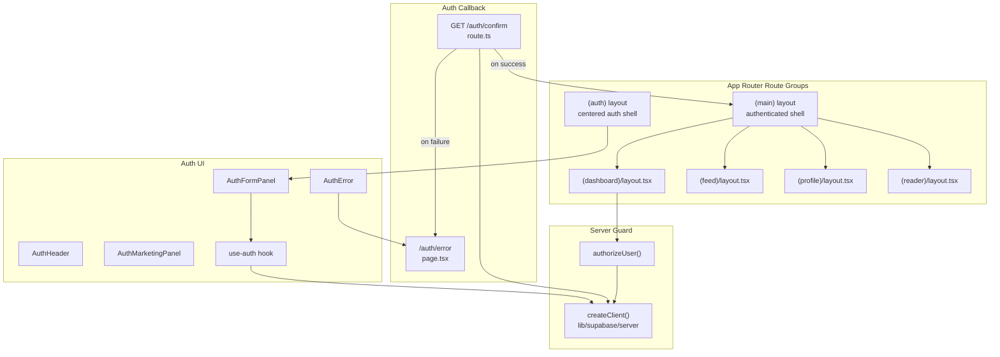
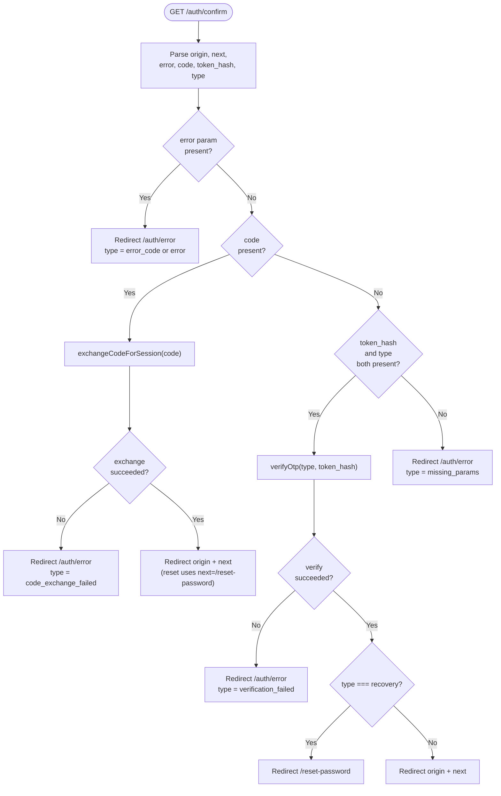
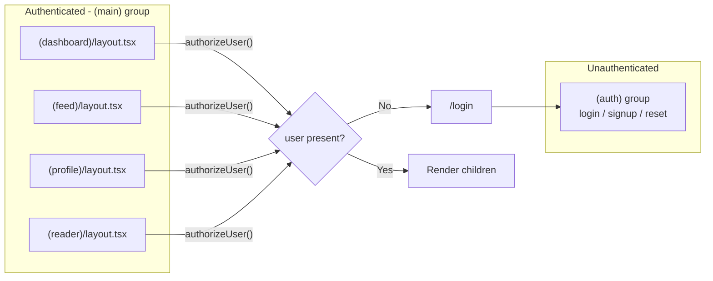
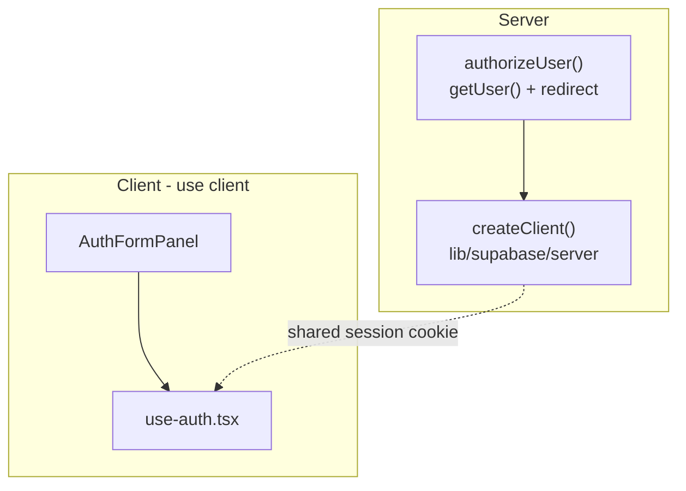
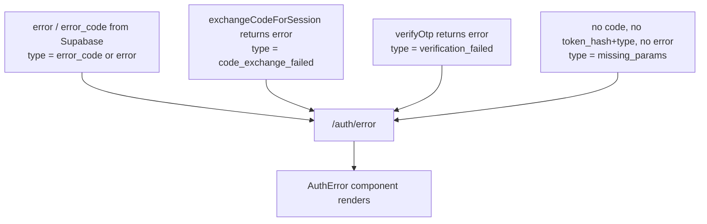

End-to-end walkthrough of how authentication requests move through the Ozeaon application — from the Next.js App Router route groups, through the Supabase server client, to the confirmation/error redirect pages that close every flow.

## Purpose and Scope

This page documents the **runtime authentication flows and the pages that render them**:

- How the auth route groups (`(auth)`, `(main)`) are laid out in the App Router.
- The `/auth/confirm` callback route: PKCE code exchange, legacy OTP verification, and error normalization.
- The `/auth/error` page and the structured query parameters it consumes.
- The server-side guard helper `authorizeUser()` and how authenticated layouts consume it.
- The auth UI component set under `src/components/auth/` and the `use-auth` hook that bridges client components to the session.

It does **not** cover account/organization data modelling, role assignment, or Row Level Security policy design. Those live on the account and organization pages of the *Auth and Accounts* section. For email delivery/provider configuration, see the Supabase configuration page.

## Overview

Ozeaon delegates identity to **Supabase Auth** and consumes it from Next.js **Server Components and Route Handlers**. There is no custom credential store and no hand-rolled session cookie: the session is owned by the Supabase SSR client and read on the server for every guarded render.

Two distinct concerns make up "auth flows" in this codebase:

| Concern | Entry point | Responsibility |
| --- | --- | --- |
| **Trusted server guard** | `authorizeUser()` in `src/lib/supabase/auth.ts` | Read the current user on the server; redirect unauthenticated visitors to `/login`. |
| **Callback orchestration** | `GET /auth/confirm` in `src/app/(auth)/auth/confirm/route.ts` | Turn an inbound email link (PKCE `code` or legacy `token_hash`) into an established session, then decide where to send the user next. |

The design intent is that **every email-delivered link lands on one route** (`/auth/confirm`), which is the only place that mutates session state from a URL. Everything else — sign-in, sign-up, password reset request — either runs client-side through the Supabase browser client or redirects into this single funnel. Having one funnel means email templates only ever need to point at one URL, and error handling is centralized rather than duplicated per flow.

Key terminology used throughout this page:

- **PKCE flow** — Proof Key for Code Exchange. The email link carries a short-lived `code`; the server exchanges it for a session via `exchangeCodeForSession`. This is the *modern* path and is what password reset uses by default.
- **OTP flow** — the *legacy* verification path, where the link carries `token_hash` plus a `type` (e.g. `signup`, `recovery`, `email`). Retained for backward compatibility with already-sent email verification links.
- **`next` parameter** — the post-authentication destination, threaded through the URL so the callback can return the user to where they started.
- **`origin`** — derived from the incoming request URL, so redirect targets stay on the correct host in preview and production environments.

## Architecture

The flows span three layers: the route groups that decide *what* renders, the server client that answers *who* the user is, and the components that *present* the forms.



Layer responsibilities:

- **Route groups** — `(auth)` is a parenthesized group, so it does not appear in the URL. It exists purely to give unauthenticated pages their own layout shell. `(main)` is the mirror image: the authenticated shell whose nested layouts (`dashboard`, `feed`, `profile`, `reader`) each enforce the guard.
- **Server guard** — a single function, `authorizeUser()`, is the only sanctioned way for a server component to demand a session. Centralizing it means redirect semantics cannot drift between layouts.
- **Auth callback** — `GET /auth/confirm` is the only route handler that establishes a session from a URL payload. It is intentionally permissive about *which* mechanism delivered the payload and strict about *normalizing* the outcome into either a redirect or a structured error.

## The `/auth/confirm` Callback Route

`src/app/(auth)/auth/confirm/route.ts` is the heart of the capability. It is a Next.js Route Handler exporting a single `GET` function, which is what makes it reachable from a link inside an email client — a GET request with query parameters, no body, no client JavaScript.

### Parameter extraction and the trust boundary

The handler builds a `URL` from `request.url` and immediately takes two things: the **`origin`** and the **`next`** destination.

```typescript
export async function GET(request: NextRequest) {
  const { searchParams, origin } = new URL(request.url);
  const next = searchParams.get("next") ?? "/";

  // Check for errors in URL (Supabase adds these when auth fails)
  const error = searchParams.get("error");
  const errorCode = searchParams.get("error_code");
  const errorDescription = searchParams.get("error_description");
```

> Source: [route.ts](https://github.com/ozeaon/ozeaon-v2/blob/0a4f1a95824db87782f1221a4108019d174df3d9/src/app/(auth)/auth/confirm/route.ts#L5-L12)

Two design notes worth calling out:

1. **`origin` is derived from the request, not from an environment variable.** Every redirect in this file is built as `` `${origin}${next}` ``. This means a preview deployment's callback link returns the user to the preview host rather than bouncing them to production. It also means the redirect host is whatever host the browser actually addressed — the callback does not need any host configuration to work across environments.
2. **`next` defaults to `/`.** The `?? "/"` fallback guarantees a valid absolute path is always available, so the final redirect can never be constructed from a null.

### Step 1 — Supabase-reported errors short-circuit first

Before any session work happens, the handler checks whether Supabase itself already flagged a failure. Supabase appends `error`, `error_code`, and `error_description` to the redirect URL when token validation fails upstream (for example an expired or already-used link).

```typescript
  if (error) {
    const encodedMessage = encodeURIComponent(
      errorDescription || "Authentication failed",
    );
    return NextResponse.redirect(
      `${origin}/auth/error?type=${errorCode || error}&message=${encodedMessage}`,
    );
  }
```

> Source: [route.ts](https://github.com/ozeaon/ozeaon-v2/blob/0a4f1a95824db87782f1221a4108019d174df3d9/src/app/(auth)/auth/confirm/route.ts#L14-L21)

The important behaviour here is **field coalescing**: `errorDescription` falls back to the literal `"Authentication failed"`, and `errorCode` falls back to `error`. This guarantees the error page always receives both a `type` and a `message`, so it never has to render an empty reason. The non-optional `message` is also why `next` is meaningless here — the flow is aborted, not continued.

### Step 2 — PKCE code exchange (the modern path)

If no Supabase error is present, the handler looks for a `code`. This is the PKCE authorization-code path and, per the inline comment, it is the default mechanism used by password reset.

```typescript
  // Handle PKCE flow (modern approach - used by password reset by default)
  const code = searchParams.get("code");
  if (code) {
    const supabase = await createClient();
    const { error } = await supabase.auth.exchangeCodeForSession(code);

    if (error) {
      const encodedMessage = encodeURIComponent(error.message);
      return NextResponse.redirect(
        `${origin}/auth/error?type=code_exchange_failed&message=${encodedMessage}`,
      );
    }

    // Password reset links will have next=/reset-password
    return NextResponse.redirect(`${origin}${next}`);
  }
```

> Source: [route.ts](https://github.com/ozeaon/ozeaon-v2/blob/0a4f1a95824db87782f1221a4108019d174df3d9/src/app/(auth)/auth/confirm/route.ts#L23-L38)

Critical implementation details:

- **The Supabase client is created lazily, inside the branch.** The import at the top of the file is just `createClient`; the client is only instantiated when there is actually a code to exchange. A request that arrives with none of the recognised parameters never constructs a client at all.
- **`exchangeCodeForSession` both validates and persists.** The returned `error` is checked immediately; success means the SSR client has stored the session (cookie handling lives inside `createClient()` from `@/lib/supabase/server`), so the subsequent `NextResponse.redirect` is already carrying the authenticated state.
- **The error `type` is a hardcoded discriminator, `code_exchange_failed`.** Unlike the upstream-error branch, this type is authored by the application, which lets the error page distinguish "Supabase rejected the link" from "our exchange with Supabase failed".
- **`next` is where the reset flow is encoded.** A password-reset email is generated with `next=/reset-password`, so the same callback serves reset as well as sign-in verification. The route itself does not hardcode `/reset-password` on the PKCE path — the destination is entirely data-driven by the email template.

### Step 3 — Legacy OTP verification

If there is no `code`, the handler falls back to the token-hash OTP path. The `type` is cast to Supabase's `EmailOtpType`, which is imported as a **type-only import** so no runtime code is pulled in from `@supabase/supabase-js`.

```typescript
  // Handle legacy OTP flow (for backward compatibility with email verification)
  const token_hash = searchParams.get("token_hash");
  const type = searchParams.get("type") as EmailOtpType | null;

  if (token_hash && type) {
    const supabase = await createClient();

    const { error } = await supabase.auth.verifyOtp({
      type,
      token_hash,
    });

    if (error) {
      const encodedMessage = encodeURIComponent(error.message);
      return NextResponse.redirect(
        `${origin}/auth/error?type=verification_failed&message=${encodedMessage}`,
      );
    }

    // For password recovery, redirect to reset password page
    if (type === "recovery") {
      return NextResponse.redirect(`${origin}/reset-password`);
    }

    // redirect user to specified redirect URL or root of app
    return NextResponse.redirect(`${origin}${next}`);
  }
```

> Source: [route.ts](https://github.com/ozeaon/ozeaon-v2/blob/0a4f1a95824db87782f1221a4108019d174df3d9/src/app/(auth)/auth/confirm/route.ts#L40-L66)

Design intent of the differences from the PKCE branch:

- **Both `token_hash` and `type` are required.** The guard is `if (token_hash && type)` — a `token_hash` alone cannot be verified, because `verifyOtp` needs to know what kind of token it is. Requests carrying only half the pair fall through to the terminal error.
- **Recovery is special-cased by `type`.** On the OTP path the destination is *not* data-driven: when `type === "recovery"` the handler redirects to a hardcoded `/reset-password`, ignoring `next`. This is the behavioural asymmetry with the PKCE branch, where `/reset-password` arrives via `next`. The reason is that legacy recovery links were generated before the `next` convention existed, so the route compensates server-side.
- **A different error discriminator, `verification_failed`,** separates OTP failures from PKCE failures for observability and for the error page's messaging.
- **The comment labels this path "for backward compatibility".** This code exists to keep verification links that were already delivered by email from breaking after the PKCE migration. It is not the path new emails should use.

### Step 4 — Terminal fallback

If the request carries neither a `code` nor a `token_hash`/`type` pair, and no `error` was reported, the route treats the URL as malformed.

```typescript
  // If no recognised parameters, show error
  return NextResponse.redirect(`${origin}/auth/error?type=missing_params`);
}
```

> Source: [route.ts](https://github.com/ozeaon/ozeaon-v2/blob/0a4f1a95824db87782f1221a4108019d174df3d9/src/app/(auth)/auth/confirm/route.ts#L68-L70)

Note that this branch passes **only `type`** and no `message`. The error page therefore has to tolerate a missing `message`, which is why the pattern elsewhere in the file always guards with `|| "..."`.

## Core Flow

The complete decision path through the callback, including every branch that terminates in an error redirect:



The ordering is deliberate and encodes a precedence contract: **reported errors beat codes, codes beat token hashes.** Because the branches are mutually exclusive `if` statements with early returns, a URL containing both a `code` and a `token_hash` will be resolved by the PKCE path — the legacy path is unreachable. Likewise a URL containing a `code` *and* an `error` is treated as a failure, because the error check runs first. This is a safe-by-default ordering: when the inbound link is contradictory, the flow refuses to establish a session rather than guessing.

## Server-Side Guard: `authorizeUser()`

Authenticated rendering is protected by a single small helper. It is the only place in the server layer that decides whether an unauthenticated visitor should be redirected.

```typescript
import { redirect } from "next/navigation";
import { createClient } from "@/lib/supabase/server";

export async function authorizeUser() {
  const supabase = await createClient();

  const { data, error } = await supabase.auth.getUser();

  if (error || !data.user) {
    redirect("/login");
  }

  return data;
}
```

> Source: [auth.ts](https://github.com/ozeaon/ozeaon-v2/blob/0a4f1a95824db87782f1221a4108019d174df3d9/src/lib/supabase/auth.ts#L1-L14)

### Why this shape

- **It returns `data`, not just `data.user`.** Callers that need both the user and an authenticated Supabase client get them from one call, so a layout never has to construct a second client. `src/app/(main)/(dashboard)/layout.tsx` destructures exactly this way: `const { user, supabase } = await getAuthUserOrRedirect();` — see [layout.tsx](https://github.com/ozeaon/ozeaon-v2/blob/0a4f1a95824db87782f1221a4108019d174df3d9/src/app/(main)/(dashboard)/layout.tsx#L9).
- **`redirect()` is used instead of returning a redirect response.** `next/navigation`'s `redirect` throws a framework control-flow signal, so TypeScript narrows the code after the `if` as unreachable-when-unauthenticated. That is why `return data` can be written without a null check on `data.user` — the type system knows the redirect never falls through. Any code placed after `redirect()` in the same branch would be dead.
- **The check is `error || !data.user`.** Both conditions are handled together: a transport/refresh error and a successfully-returned-but-null user both mean "not authenticated". Treating them identically prevents an error from silently rendering an empty authenticated shell.
- **The destination is hardcoded to `/login`.** The guard does not preserve the originally requested URL as a `next` parameter. Combined with the callback route's `next` handling, this means deep-link return-to-page behaviour is handled by the auth *forms* rather than by the guard.

### Where the guard is applied

The guard is invoked from the `(main)` group's nested layouts, which is what makes the grouping meaningful: `(dashboard)`, `(feed)`, `(profile)`, and `(reader)` each have their own `layout.tsx`, and these are the natural enforcement points in the App Router.



Placing the check at *layout* level rather than per-page means navigation between sibling routes inside the same group does not re-run the full shell when the layout is preserved. It also means a newly added page under `(main)` inherits protection automatically, which is a significant safety property: forgetting a guard on a leaf page cannot accidentally expose it, provided the leaf sits under a guarded layout.

## The Auth Error Page

Failures never render inside the flow that produced them. Every error branch in `/auth/confirm` redirects to a single dedicated page, `src/app/auth/error/page.tsx`, passing a normalized set of query parameters.

| Parameter | Source in callback | Required | Purpose |
| --- | --- | --- | --- |
| `type` | `error_code \|\| error`, or `code_exchange_failed`, or `verification_failed`, or `missing_params` | Yes | Machine-readable discriminator used to select the message/copy |
| `message` | `errorDescription \|\| "Authentication failed"`, or `error.message` | No — **absent** on the `missing_params` branch | Human-readable detail, URL-encoded |

The page component is declared with the App Router's `searchParams` contract:

```typescript
export default function AuthErrorPage({ searchParams }: ErrorPageProps) {
  return (
```

> Source: [page.tsx](https://github.com/ozeaon/ozeaon-v2/blob/0a4f1a95824db87782f1221a4108019d174df3d9/src/app/auth/error/page.tsx#L23-L24)

### Why a dedicated page rather than inline errors

Centralizing gives three concrete benefits that are visible in the callback source:

1. **One place to decode.** The callback URL-encodes every message with `encodeURIComponent`. A single page owns the inverse concern, so no other route has to think about encoding.
2. **Enumeration of failure types.** The full set of reachable `type` values — `code_exchange_failed`, `verification_failed`, `missing_params`, plus whatever Supabase supplies as `error_code` — is visible in one file rather than scattered across flow branches.
3. **No session leakage on failure.** Since the error page is reached by redirect *instead of* rendering the destination, a failed exchange can never accidentally render a partially-authenticated view.

### The `AuthError` component

The presentational counterpart lives at `src/components/auth/AuthError.tsx`, alongside the rest of the auth UI set. The labelling `errorCode` in the callback and the `AuthError` component name are the two halves of the same contract: the route produces a code, the component renders it.

## Auth UI Composition

The `src/components/auth/` directory contains the presentational layer. Each component has a single, narrow responsibility:

| Component | Role |
| --- | --- |
| `AuthFormPanel.tsx` | The primary credential form panel — the interactive surface for the auth flows |
| `AuthHeader.tsx` | Heading/branding block shared across auth pages |
| `AuthMarketingPanel.tsx` | The promotional/marketing side panel shown next to the form |
| `AuthError.tsx` | Error presentation, fed by the `type`/`message` contract above |

The layout that arranges these is `src/app/(auth)/layout.tsx`, which is a plain synchronous component — it applies the auth shell without performing any session work itself:

```typescript
export default function AuthLayout({
  children,
```

> Source: [layout.tsx](https://github.com/ozeaon/ozeaon-v2/blob/0a4f1a95824db87782f1221a4108019d174df3d9/src/app/(auth)/layout.tsx#L3-L4)

The fact that `(auth)`'s layout is a non-`async` function is meaningful: unauthenticated pages must render even when there is no session, so the auth shell deliberately does **not** call `authorizeUser()`. Conversely the guarded layouts are `async` and do call it. This `async`-vs-sync split is a reliable visual cue in the codebase for "this shell requires a session".

The `(auth)` group also hosts the callback route at `src/app/(auth)/auth/confirm/route.ts`. Putting the route handler inside the auth group keeps the whole unauthenticated surface — the forms, the error page, and the callback — under one layout boundary, even though route handlers do not render that layout.

### Client-side session bridge: `use-auth`

`src/hooks/use-auth.tsx` is the client-side counterpart to `authorizeUser()`. It is the hook that client components (including the auth form panel) use to observe and act on the session. The parallel structure is intentional:



`authorizeUser()` answers "is there a session?" for rendering decisions that must happen before HTML is sent. `use-auth` answers the same question for interaction that happens after hydration. Both read the same session; neither manages its own credential storage.

## Usage Examples

### Example 1 — POST-authentication redirect is data-driven via `next`

The callback composes its success redirect from the request-derived origin and the `next` parameter, so the exact same callback serves sign-in verification, email confirmation, and password reset simply by varying the link.

```typescript
    // Password reset links will have next=/reset-password
    return NextResponse.redirect(`${origin}${next}`);
  }
```

> Source: [route.ts](https://github.com/ozeaon/ozeaon-v2/blob/0a4f1a95824db87782f1221a4108019d174df3d9/src/app/(auth)/auth/confirm/route.ts#L36-L38)

### Example 2 — Normalizing a failure into the error page contract

Every failure branch follows an identical, copy-adapted shape: URL-encode the message, attach a discriminator, redirect. This is the pattern to reproduce if a new auth mechanism is added.

```typescript
    if (error) {
      const encodedMessage = encodeURIComponent(error.message);
      return NextResponse.redirect(
        `${origin}/auth/error?type=code_exchange_failed&message=${encodedMessage}`,
      );
    }
```

> Source: [route.ts](https://github.com/ozeaon/ozeaon-v2/blob/0a4f1a95824db87782f1221a4108019d174df3d9/src/app/(auth)/auth/confirm/route.ts#L29-L34)

### Example 3 — Branch-specific special-casing for recovery

On the legacy OTP path, recovery requires an explicit server-side redirect because the legacy links do not carry `next`:

```typescript
    // For password recovery, redirect to reset password page
    if (type === "recovery") {
      return NextResponse.redirect(`${origin}/reset-password`);
    }
```

> Source: [route.ts](https://github.com/ozeaon/ozeaon-v2/blob/0a4f1a95824db87782f1221a4108019d174df3d9/src/app/(auth)/auth/confirm/route.ts#L59-L62)

### Example 4 — Guarding an authenticated layout

The canonical consumer of the server guard. Note the destructuring of both `user` and `supabase` from one call, and the use of `supabase` for the follow-up authorized query.

```typescript
const { user, supabase } = await getAuthUserOrRedirect();
const adminOrgsPromise = getAdminOrgs(supabase, user.id).catch(() => []);
```

> Source: [layout.tsx](https://github.com/ozeaon/ozeaon-v2/blob/0a4f1a95824db87782f1221a4108019d174df3d9/src/app/(main)/(dashboard)/layout.tsx#L9-L10)

## Configuration Options

The callback route has **no environment-variable configuration of its own** — this is a deliberate property, not an omission. `origin` comes from the request and `next` from the query string, so no base URL needs to be set per environment.

The relevant configuration is therefore on the **Supabase Auth provider side**, in `supabase/config.toml`. Values that shape these flows:

| Option | Type | Default in repo | Effect on these flows |
| --- | --- | --- | --- |
| `auth.enable_signup` | bool | `true` | Master switch for new signups. When `false`, the signup flow terminates before any callback is issued. |
| `auth.email.enable_signup` | bool | `true` | Restricts signup specifically to the email provider. |
| `auth.email.enable_confirmations` | bool | `true` | **Directly determines whether the OTP/confirmation path is ever exercised.** With confirmations on, users must confirm before signing in, so verification links and therefore `/auth/confirm` are in the critical path. |
| `auth.email.max_frequency` | string | `"1s"` | Minimum interval between signup-confirmation or password-reset emails. Bounds how quickly a user can generate repeat callback links. |
| `auth.email.secure_password_change` | bool | `false` | When enabled, requires a recent session before allowing a password change — affects what a reset link can accomplish after landing on `/reset-password`. |
| `auth.email.double_confirm_changes` | bool | `true` | Requires confirmation on *both* the old and new address when email is changed; drives an additional confirmation round-trip through `/auth/confirm`. |
| `auth.sms.enable_signup` / `enable_confirmations` | bool | `false` / `false` | SMS is disabled, so no SMS-driven OTP reaches the callback. |

> Sources:
> - [config.toml](https://github.com/ozeaon/ozeaon-v2/blob/0a4f1a95824db87782f1221a4108019d174df3d9/supabase/config.toml#L172-L173)
> - [config.toml](https://github.com/ozeaon/ozeaon-v2/blob/0a4f1a95824db87782f1221a4108019d174df3d9/supabase/config.toml#L207-L217)
> - [config.toml](https://github.com/ozeaon/ozeaon-v2/blob/0a4f1a95824db87782f1221a4108019d174df3d9/supabase/config.toml#L244-L248)

Additionally, `docs/deployment-previews.md` documents that **sign-up is gated by an `ACCESS_TOKEN`, compared verbatim in `signup()`,** with previews using the `ozeaon-preview` token so production's token never reaches a public `workers.dev` hostname.

> Source: [deployment-previews.md](https://github.com/ozeaon/ozeaon-v2/blob/0a4f1a95824db87782f1221a4108019d174df3d9/docs/deployment-previews.md#L74)

## API Reference

### `GET /auth/confirm`

Route Handler that resolves an inbound authentication link into a session and a redirect.

**Query parameters:**

| Parameter | Type | Required | Description |
| --- | --- | --- | --- |
| `code` | string | Conditional | PKCE authorization code. Checked *after* `error`; when present, wins over `token_hash`. |
| `token_hash` | string | Conditional | Legacy OTP token hash. Must be accompanied by `type`. |
| `type` | `EmailOtpType` | Conditional | OTP token type (e.g. `recovery`). Required together with `token_hash`. |
| `next` | string | No | Post-success destination. Defaults to `/`. Ignored on the OTP recovery branch, which redirects to `/reset-password`. |
| `error` | string | No | Supabase-reported failure. Presence aborts the flow immediately. |
| `error_code` | string | No | Machine-readable Supabase error discriminator; becomes the error page's `type`. |
| `error_description` | string | No | Human-readable Supabase error; becomes the error page's `message`. |

**Returns:** `NextResponse.redirect` — always a redirect, never a rendered body. Destinations:

| Outcome | Destination |
| --- | --- |
| Upstream error | `/auth/error?type={error_code\|error}&message={encoded}` |
| PKCE exchange failure | `/auth/error?type=code_exchange_failed&message={encoded}` |
| OTP verification failure | `/auth/error?type=verification_failed&message={encoded}` |
| No recognised parameters | `/auth/error?type=missing_params` (no `message`) |
| OTP success with `type === "recovery"` | `/reset-password` |
| PKCE success, or OTP success without recovery | `{origin}{next}` |

**Throws:** No explicit throws. Failures from `exchangeCodeForSession` and `verifyOtp` are returned as `{ error }` and translated into error-page redirects rather than exceptions. Note that `redirect()` inside `authorizeUser()` (a different module) does raise a framework control-flow signal.

### `authorizeUser(): Promise<{ user, session, ... }>`

Server-only helper in `src/lib/supabase/auth.ts` that resolves the current user or redirects to `/login`.

**Parameters:** none.

**Returns:** The `data` object from `supabase.auth.getUser()` — i.e. `data.user` plus the accompanying session fields. Callers destructure `{ user, supabase }` when they also need the request-scoped client.

**Throws:** Propagates the `next/navigation` redirect signal when `error` is truthy or `data.user` is falsy. This is intentional: it makes the function's post-redirect return value type-safe and non-nullable at the call site.

**Side effects:** Performs a network call to Supabase to resolve/refresh the session, and may write refreshed session cookies via the SSR client from `@/lib/supabase/server`.

## Failure Modes, Edge Cases & Security Considerations

### Complete failure taxonomy

Every failure path in the callback collapses into a redirect to `/auth/error` with a distinct `type`. The taxonomy is deliberately small and each value has exactly one producer:



### Edge cases and how they resolve

| Edge case | Resolution | Evidence |
| --- | --- | --- |
| Link contains both `code` and `token_hash` | PKCE wins; the legacy branch is unreachable because the `code` block returns first. | [route.ts](https://github.com/ozeaon/ozeaon-v2/blob/0a4f1a95824db87782f1221a4108019d174df3d9/src/app/(auth)/auth/confirm/route.ts#L25-L38) |
| Link contains both an `error` and a `code` | The error check runs first, so no session is established. | [route.ts](https://github.com/ozeaon/ozeaon-v2/blob/0a4f1a95824db87782f1221a4108019d174df3d9/src/app/(auth)/auth/confirm/route.ts#L14-L21) |
| `token_hash` present but `type` missing (or vice versa) | The `&&` guard fails; falls through to `missing_params`. A half-formed token is never submitted to `verifyOtp`. | [route.ts](https://github.com/ozeaon/ozeaon-v2/blob/0a4f1a95824db87782f1221a4108019d174df3d9/src/app/(auth)/auth/confirm/route.ts#L44) |
| `error` present with no `error_code` | `error` itself becomes the `type`, so the discriminator is never undefined. | [route.ts](https://github.com/ozeaon/ozeaon-v2/blob/0a4f1a95824db87782f1221a4108019d174df3d9/src/app/(auth)/auth/confirm/route.ts#L19) |
| `error` present with no `error_description` | Falls back to the literal `"Authentication failed"`. | [route.ts](https://github.com/ozeaon/ozeaon-v2/blob/0a4f1a95824db87782f1221a4108019d174df3d9/src/app/(auth)/auth/confirm/route.ts#L15-L17) |
| `next` absent | Defaults to `/` via `?? "/"`. | [route.ts](https://github.com/ozeaon/ozeaon-v2/blob/0a4f1a95824db87782f1221a4108019d174df3d9/src/app/(auth)/auth/confirm/route.ts#L7) |
| `missing_params` reached | Redirect carries **no** `message`, so the error page must handle an undefined message. | [route.ts](https://github.com/ozeaon/ozeaon-v2/blob/0a4f1a95824db87782f1221a4108019d174df3d9/src/app/(auth)/auth/confirm/route.ts#L69) |
| Legacy recovery link with no `next` | Special-cased: redirects to `/reset-password` regardless of `next`. | [route.ts](https://github.com/ozeaon/ozeaon-v2/blob/0a4f1a95824db87782f1221a4108019d174df3d9/src/app/(auth)/auth/confirm/route.ts#L60-L62) |
| Error message contains characters requiring encoding | `encodeURIComponent` is applied before embedding in the redirect URL. | [route.ts](https://github.com/ozeaon/ozeaon-v2/blob/0a4f1a95824db87782f1221a4108019d174df3d9/src/app/(auth)/auth/confirm/route.ts#L15-L17) |
| Unauthenticated visitor hits a guarded layout | `authorizeUser()` redirects to `/login`. | [auth.ts](https://github.com/ozeaon/ozeaon-v2/blob/0a4f1a95824db87782f1221a4108019d174df3d9/src/lib/supabase/auth.ts#L9-L11) |
| Guard's Supabase call returns `error` with a non-null user | Treated as unauthenticated because the condition is `error \|\| !data.user`. | [auth.ts](https://github.com/ozeaon/ozeaon-v2/blob/0a4f1a95824db87782f1221a4108019d174df3d9/src/lib/supabase/auth.ts#L9) |
| Preview deployment callback link | Resolved against the preview `origin` derived from the request, not a production base URL. | [route.ts](https://github.com/ozeaon/ozeaon-v2/blob/0a4f1a95824db87782f1221a4108019d174df3d9/src/app/(auth)/auth/confirm/route.ts#L6) |

### Security properties worth noting

- **Single mutation point.** Only `/auth/confirm` converts URL-borne credentials into a session. Because it is a GET route handler with no side-effect-bearing form, no other surface needs to parse auth tokens.
- **Fail-closed precedence.** The contradictory-input cases (error + code, code + token_hash) are all resolved in the direction that refuses to establish a session. This is the correct default for a security boundary.
- **No secrets in the URL beyond the one-time token.** `next` is a path, `origin` is request-derived, and the credential (`code`/`token_hash`) is single-use and short-lived by construction. Note that `next` is inserted into the redirect as `` `${origin}${next}` `` without an explicit allow-list check in this file — the callback trusts the path component supplied by the link. Treat `next` as trusted input and only ever populate it from server-generated email templates.
- **Token type is client-supplied.** On the OTP path, `type` is cast from the query string rather than derived server-side. `verifyOtp` is the actual authority on whether the token is valid for that type, so a forged `type` cannot escalate — but it does mean the `type === "recovery"` redirect decision is based on an unvalidated value, which only matters *after* a successful verification.
- **`ACCESS_TOKEN` gates signup.** Per the deployment docs, signup compares a token verbatim, and previews use a separate token so the production token is never exposed on a public hostname. See [deployment-previews.md](https://github.com/ozeaon/ozeaon-v2/blob/0a4f1a95824db87782f1221a4108019d174df3d9/docs/deployment-previews.md#L74).

### Concurrency and session-refresh concerns

- **Single-use tokens make parallel callbacks inherently racy.** If an email client prefetches the link *and* the user clicks it, two concurrent requests can both reach `exchangeCodeForSession` with the same `code`. Exactly one can succeed; the other receives an error and is redirected to `/auth/error` with `code_exchange_failed`. This is expected behaviour, not a defect — but it means a user may see the error page even though their session was established.
- **`refresh_token_reuse_interval = 10`** in `supabase/config.toml` allows a refresh token to be reused within a 10-second window without being treated as a replay attack. This widens the tolerance for concurrent server renders that both attempt to refresh the same session.
- **`max_frequency = "1s"`** throttles outbound confirmation and reset emails, bounding how fast a user can mint new callback links.
- **Each guarded layout performs its own `getUser()` call.** Because `authorizeUser()` constructs its own client and does not memoize across calls, a request that passes through several nested layouts can issue more than one session lookup. Next.js request-level deduplication of the underlying fetch stringifies identically-shaped `getUser()` calls within a single render, but this is worth verifying when adding new guarded layouts.
- **`redirect()` throws.** Any `try`/`catch` wrapped around a call to `authorizeUser()` will intercept the redirect signal unless the error is re-thrown or checked via `isRedirectError`. The dashboard layout illustrates the safe pattern by confining `.catch()` to the follow-up query (`getAdminOrgs(supabase, user.id).catch(() => [])`) rather than to the guard itself — see [layout.tsx](https://github.com/ozeaon/ozeaon-v2/blob/0a4f1a95824db87782f1221a4108019d174df3d9/src/app/(main)/(dashboard)/layout.tsx#L10).

## Extension Points

The flows are designed so that new auth mechanisms slot in without restructuring:

1. **Adding a new post-auth destination.** No code change is required — generate the email link with a different `next` value. The PKCE branch honours it verbatim. Only the recovery-on-OTP case is hardcoded.
2. **Adding a new failure type.** Add a branch that redirects to `/auth/error` with a new `type` discriminator, then handle that value in `src/app/auth/error/page.tsx` / the `AuthError` component. The `type`/`message` contract is the stable interface.
3. **Adding a new guard.** Consume `authorizeUser()` from a new layout rather than calling `supabase.auth.getUser()` directly, so redirect semantics stay in one place.
4. **New providers.** Provider-specific settings belong in `supabase/config.toml` (the `[auth.email]`, `[auth.sms]` sections show the pattern). Providers that return over a redirect URL automatically flow through `/auth/confirm`.
5. **Deprecating the legacy OTP path.** The `token_hash` branch is explicitly marked "for backward compatibility with email verification". It can be removed once no outstanding verification links remain; the PKCE branch is independent and would keep working.

## Related Links

- **Supabase configuration** — `supabase/config.toml`, including `[auth]`, `[auth.email]`, and `[auth.sms]` sections that shape which flows are reachable: [config.toml](https://github.com/ozeaon/ozeaon-v2/blob/0a4f1a95824db87782f1221a4108019d174df3d9/supabase/config.toml)
- **Deployment previews** — signup `ACCESS_TOKEN` gating and preview-vs-production hostname separation: [deployment-previews.md](https://github.com/ozeaon/ozeaon-v2/blob/0a4f1a95824db87782f1221a4108019d174df3d9/docs/deployment-previews.md)
- **SSR session refactor notes** — design background for the server/client session split: [auth-session-refactor.md](https://github.com/ozeaon/ozeaon-v2/blob/0a4f1a95824db87782f1221a4108019d174df3d9/docs/ssr/auth-session-refactor.md)
- **Server guard implementation** — `authorizeUser()`: [auth.ts](https://github.com/ozeaon/ozeaon-v2/blob/0a4f1a95824db87782f1221a4108019d174df3d9/src/lib/supabase/auth.ts)
- **Auth callback route** — `GET /auth/confirm`: [route.ts](https://github.com/ozeaon/ozeaon-v2/blob/0a4f1a95824db87782f1221a4108019d174df3d9/src/app/(auth)/auth/confirm/route.ts)
- **Auth error page** — `AuthErrorPage`: [page.tsx](https://github.com/ozeaon/ozeaon-v2/blob/0a4f1a95824db87782f1221a4108019d174df3d9/src/app/auth/error/page.tsx)
- **Auth UI components** — `AuthFormPanel`, `AuthHeader`, `AuthError`, `AuthMarketingPanel`: [AuthFormPanel.tsx](https://github.com/ozeaon/ozeaon-v2/blob/0a4f1a95824db87782f1221a4108019d174df3d9/src/components/auth/AuthFormPanel.tsx), [AuthHeader.tsx](https://github.com/ozeaon/ozeaon-v2/blob/0a4f1a95824db87782f1221a4108019d174df3d9/src/components/auth/AuthHeader.tsx), [AuthError.tsx](https://github.com/ozeaon/ozeaon-v2/blob/0a4f1a95824db87782f1221a4108019d174df3d9/src/components/auth/AuthError.tsx), [AuthMarketingPanel.tsx](https://github.com/ozeaon/ozeaon-v2/blob/0a4f1a95824db87782f1221a4108019d174df3d9/src/components/auth/AuthMarketingPanel.tsx)
- **Client session hook** — `use-auth`: [use-auth.tsx](https://github.com/ozeaon/ozeaon-v2/blob/0a4f1a95824db87782f1221a4108019d174df3d9/src/hooks/use-auth.tsx)
- **Auth route-group layout** — `(auth)` shell: [layout.tsx](https://github.com/ozeaon/ozeaon-v2/blob/0a4f1a95824db87782f1221a4108019d174df3d9/src/app/(auth)/layout.tsx)
- **Guarded layout example** — `(dashboard)` calling the guard: [layout.tsx](https://github.com/ozeaon/ozeaon-v2/blob/0a4f1a95824db87782f1221a4108019d174df3d9/src/app/(main)/(dashboard)/layout.tsx)
