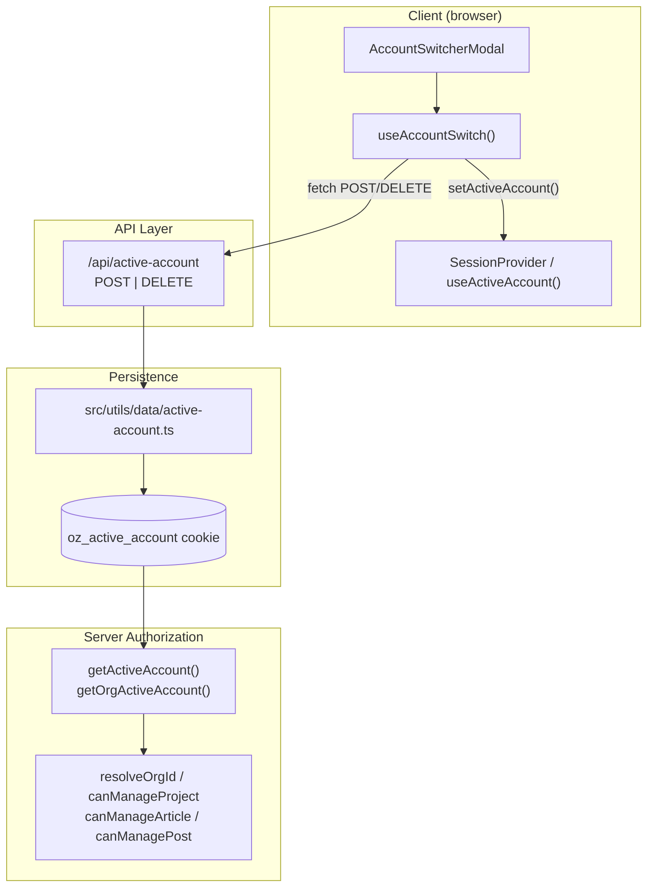
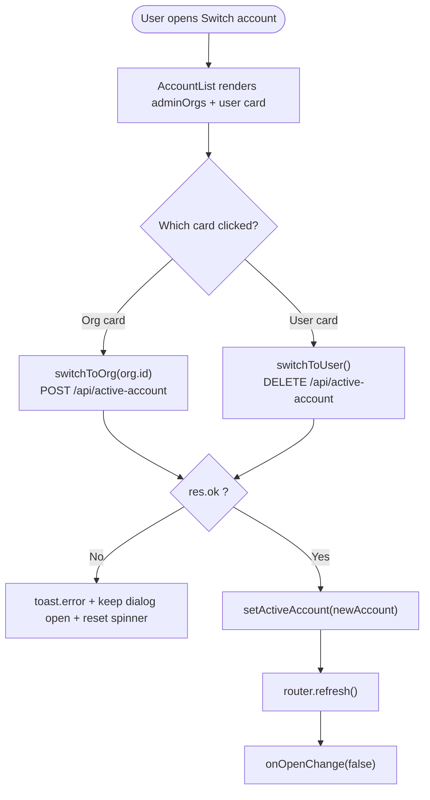
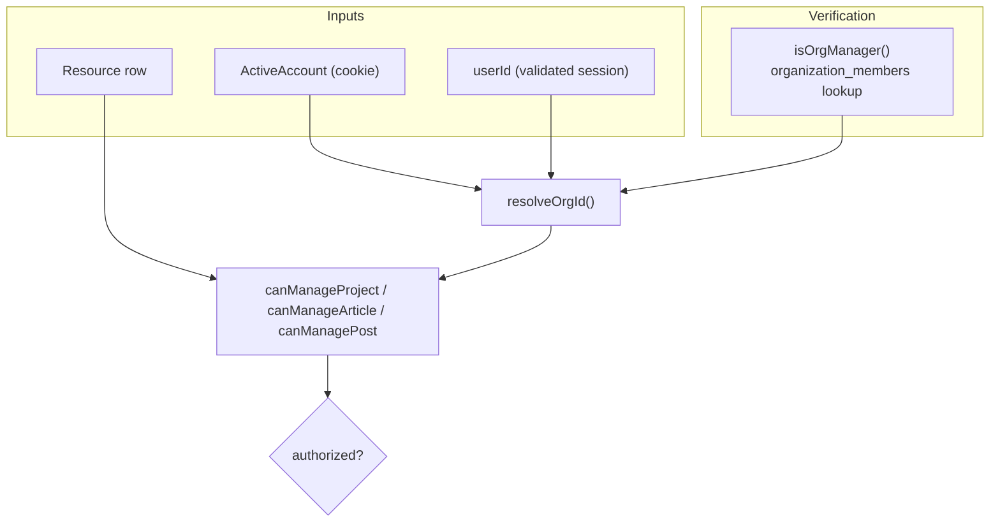
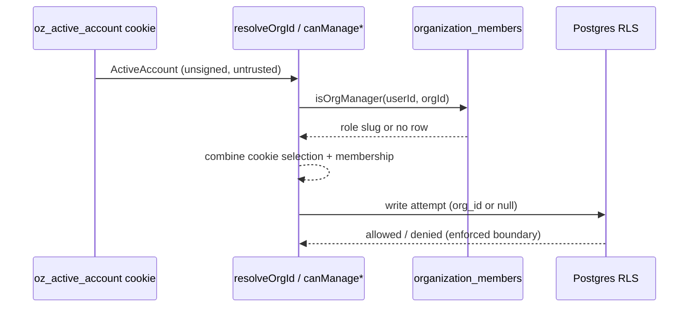
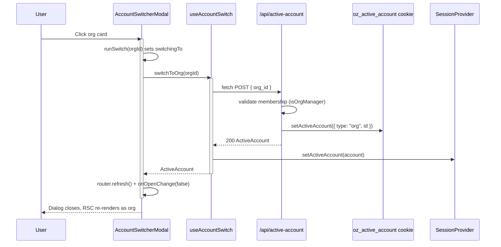

The account-switching subsystem lets a signed-in user act **either as themselves (personal mode) or as an organization they administer**, by persisting the current selection in a cookie and exposing it uniformly across the client and server. It is the mechanism behind the "Switch account" modal and the `oz_active_account` cookie.

## Purpose and Scope

This page documents the complete active-account mechanism of `ozeaon-v2`:

- The `ActiveAccount` domain type and its two variants (`user` / `org`).
- Server-side persistence and reading of the active account via the `oz_active_account` cookie.
- The `/api/active-account` HTTP endpoint (POST to switch to an org, DELETE to revert to user mode).
- The client abstraction `useAccountSwitch()` and its relationship to `useActiveAccount()` from `SessionProvider`.
- The `AccountSwitcherModal` UI component that drives the switch.
- The authorization helpers (`resolveOrgId`, `canManageProject`, `canManageArticle`, `canManagePost`) that consume the active account to gate mutations.

**Out of scope / sibling pages:**

- The broader authentication session model (login, `SessionProvider`, `AuthHydrator`, `/api/session`) is covered by the auth session pages. This page only references those pieces where account switching depends on them.
- Organization membership management (inviting members, roles, `/organizations/new`) is a separate concern; only the "Add New Account" link target is mentioned here.
- Row Level Security policies themselves are defined in the database layer; this page describes the application-level helpers that mirror them.

## Overview

In `ozeaon-v2`, authorization is **identity plus acting context**. A user is not merely themselves — they may own content personally *or* on behalf of an organization for which they hold the `owner` or `admin` role. The active account captures "who am I acting as right now."

Two design decisions shape the whole subsystem:

1. **The active account is a cookie, not a database column.** `oz_active_account` is an `httpOnly`, `sameSite: lax` cookie holding a JSON-serialized `ActiveAccount`. It is server-readable on every request (via `next/headers` `cookies()`), so server components and route handlers can gate behavior without a round-trip — while the client mirrors it in React state through `SessionProvider`.
2. **The cookie is *not* the security boundary.** The documentation in `src/utils/data/account.ts` is explicit: the active account is described as "only an unsigned cookie," and every helper re-verifies organization membership against the database rather than trusting the cookie value. The cookie selects *context*; RLS and membership lookups enforce *permission*.

Key terminology:

| Term | Meaning |
|------|---------|
| `ActiveAccount` | Discriminated union: `{ type: "user" }` or `{ type: "org", id: string }` |
| Active account / active org | The organization currently selected, or `user` mode when none |
| Switch | POST to `/api/active-account` with an `org_id`, or DELETE to revert |
| Acting as an org | `activeAccount.type === "org"` and `activeAccount.id` matches a resource's `organization_id` |

## Architecture

The subsystem spans four layers: a client hook and UI, an HTTP route handler, a cookie persistence utility, and server-side authorization helpers. The client and server share the single `ActiveAccount` type as their contract.



**Why this shape.** The switch is deliberately modeled as **one HTTP call with one response** rather than a client-side state mutation alone. `src/hooks/use-account-switch.ts` documents this rationale directly ("Single source of the account switch: one fetch, one error parse, one client-state update"). The server is authoritative because only it can write the `httpOnly` cookie; the client state update happens *after* a successful response so the two never diverge. The route handler is the only place that both validates membership and persists the choice.

The authorization helpers form a second consumer group: they read the resolved active account and combine it with a live membership lookup, ensuring that holding the cookie is never sufficient on its own.

## The `ActiveAccount` Type

`ActiveAccount` is a TypeScript discriminated union defined in `src/types/account.ts`. It has exactly two shapes:

- `{ type: "user" }` — personal mode, the default when no cookie is set.
- `{ type: "org", id: string }` — acting as an organization identified by `id`.

The discriminated `type` field makes downstream narrowing exhaustive and type-safe. `src/utils/data/active-account.ts` derives a narrowed alias for the org branch:

```typescript
type OrgAccount = Extract<ActiveAccount, { type: "org" }>;
```

> Source: [active-account.ts](https://github.com/ozeaon/ozeaon-v2/blob/0a4f1a95824db87782f1221a4108019d174df3d9/src/utils/data/active-account.ts#L6)

This alias is what allows `getOrgActiveAccount()` to return a *typed* org account after verifying the discriminant, removing the need for `as` casts at call sites. The rest of the codebase narrows with the same pattern (`activeAccount.type === "org" && activeAccount.id === ...`), which is why the union is preferred over an optional `orgId` field: an optional field would allow nonsensical states like "user mode but with an org id."

## Server-Side Cookie Persistence

`src/utils/data/active-account.ts` is the single owner of the `oz_active_account` cookie. It exposes four functions: a cached getter, a typed org-only getter, a setter, and a clearer.

```typescript
const COOKIE = "oz_active_account";

export const getActiveAccount = cache(async (): Promise<ActiveAccount> => {
  const jar = await cookies();
  const raw = jar.get(COOKIE)?.value;
  if (!raw) return { type: "user" };
  try {
    return JSON.parse(raw) as ActiveAccount;
  } catch {
    return { type: "user" };
  }
});
```

> Source: [active-account.ts](https://github.com/ozeaon/ozeaon-v2/blob/0a4f1a95824db87782f1221a4108019d174df3d9/src/utils/data/active-account.ts#L8-L19)

Design points worth noting:

- **`cache()` wrapper.** `getActiveAccount` is wrapped in React's `cache()`, so multiple server components in one request tree share a single cookie read. This matters because the active account is read by layout-level and page-level components alike; the cache bounds the cost to one `cookies()` call per request.
- **Fail-safe default.** If the cookie is absent *or* contains malformed JSON, the function returns `{ type: "user" }`. The `try/catch` around `JSON.parse` is the defensive branch — a corrupted cookie degrades to personal mode rather than throwing a 500. Personal mode is the safer default because it grants the least acting context.
- **Unsigned cookie, re-verified downstream.** Nothing here authenticates the cookie contents; the value is trusted only as a *selector*. This is explicitly documented in `src/utils/data/account.ts`, which states the active account is "only an unsigned cookie" and must never be the basis for authorization.

The setter writes the serialized account with hardened cookie attributes:

```typescript
export async function setActiveAccount(account: ActiveAccount): Promise<void> {
  const jar = await cookies();
  jar.set(COOKIE, JSON.stringify(account), {
    httpOnly: true,
    secure: process.env.NODE_ENV === "production",
    sameSite: "lax",
    path: "/",
    maxAge: 60 * 60 * 24 * 30,
  });
}

export async function clearActiveAccount(): Promise<void> {
  const jar = await cookies();
  jar.delete(COOKIE);
}
```

> Source: [active-account.ts](https://github.com/ozeaon/ozeaon-v2/blob/0a4f1a95824db87782f1221a4108019d174df3d9/src/utils/data/active-account.ts#L27-L41)

| Cookie attribute | Value | Rationale |
|------------------|-------|-----------|
| `httpOnly` | `true` | Prevents client scripts from reading/forging the acting context; only the server may write it. |
| `secure` | `NODE_ENV === "production"` | HTTPS-only in production, relaxed in local dev. |
| `sameSite` | `"lax"` | Mitigates CSRF while allowing normal top-level navigation. |
| `path` | `"/"` | The acting context applies app-wide, so the cookie must be sent on every route. |
| `maxAge` | `60 * 60 * 24 * 30` (30 days) | The selection survives across sessions for a month of inactivity. |

The 30-day `maxAge` reflects a UX decision: account choice is sticky. A user who switches to an org context expects to remain in that context across browser restarts, so the cookie outlives a typical session rather than being a session cookie.

### Typed Org-Only Access

Route handlers and pages that only make sense in an org context use `getOrgActiveAccount()`, which both reads and enforces the discriminant:

```typescript
export async function getOrgActiveAccount(): Promise<OrgAccount> {
  const account = await getActiveAccount();
  if (account.type !== "org") redirect("/settings");
  return account;
}
```

> Source: [active-account.ts](https://github.com/ozeaon/ozeaon-v2/blob/0a4f1a95824db87782f1221a4108019d174df3d9/src/utils/data/active-account.ts#L21-L25)

When the caller is in personal mode, this **redirects to `/settings`** rather than returning null or throwing. The redirect centralizes the "you must pick an org first" recovery path in one place, and the non-null return type means callers never have to re-check the discriminant themselves.

## The Switch HTTP Endpoint

`/api/active-account` is the single mutation surface for the active account. The client hook treats it as two operations over one URL:

- **POST** with body `{ "org_id": "<id>" }` — switch to an organization.
- **DELETE** — revert to user (personal) mode.

The client's error parsing is centralized so both verbs behave identically:

```typescript
async function requestAccountSwitch(init: RequestInit): Promise<ActiveAccount> {
  const res = await fetch("/api/active-account", init);
  if (!res.ok) {
    const body = (await res.json().catch(() => ({}))) as { error?: string };
    throw new Error(body.error ?? "Failed to switch account");
  }
  return (await res.json()) as ActiveAccount;
}
```

> Source: [use-account-switch.ts](https://github.com/ozeaon/ozeaon-v2/blob/0a4f1a95824db87782f1221a4108019d174df3d9/src/hooks/use-account-switch.ts#L7-L14)

Two robustness details stand out:

1. **Graceful error-body parsing.** `res.json().catch(() => ({}))` guards against a non-JSON error body (for example an HTML 500 page), so the hook never throws a `SyntaxError` while trying to surface the real error.
2. **Fallback message.** If the server error body lacks an `error` field, the message defaults to `"Failed to switch account"`, guaranteeing the caller always gets a human-readable `Error`.

The endpoint's response body is the **new `ActiveAccount`**, which the hook uses to update client state — meaning the server's view of the active account and the client's view are synchronized from a single source of truth per switch. Per the auth-session refactor notes, the GET method of this route was removed and superseded by `/api/session`; only POST and DELETE remain (org switch and revert).

## The `useAccountSwitch` Client Hook

`src/hooks/use-account-switch.ts` is the client-facing façade. It wires the two switch verbs to React state held by `SessionProvider`.

```typescript
export function useAccountSwitch() {
  const { setActiveAccount } = useActiveAccount();

  const switchToOrg = useCallback(
    async (orgId: string): Promise<ActiveAccount> => {
      const account = await requestAccountSwitch({
        method: "POST",
        headers: { "Content-Type": "application/json" },
        body: JSON.stringify({ org_id: orgId }),
      });
      setActiveAccount(account);
      return account;
    },
    [setActiveAccount],
  );

  const switchToUser = useCallback(async (): Promise<ActiveAccount> => {
    const account = await requestAccountSwitch({ method: "DELETE" });
    setActiveAccount(account);
    return account;
  }, [setActiveAccount]);

  return { switchToOrg, switchToUser };
}
```

> Source: [use-account-switch.ts](https://github.com/ozeaon/ozeaon-v2/blob/0a4f1a95824db87782f1221a4108019d174df3d9/src/hooks/use-account-switch.ts#L17-L39)

The flow inside each verb is intentionally linear: **fetch → set client state → return**. The state update happens only after the fetch resolves successfully, so a failed switch leaves the client showing the previous account — there is no optimistic update to roll back. `setActiveAccount` comes from `useActiveAccount()` in `src/hooks/use-auth.tsx` (`SessionProvider`), keeping a single owner of client-side active-account state. The hook is re-exported from the hooks barrel (`src/hooks/index.ts`) so consumers import a single path.

The two callbacks are wrapped in `useCallback` keyed on `setActiveAccount`, which is important because `AccountSwitcherModal` passes them into `onClick` handlers; identity stability avoids unnecessary re-renders of the account cards.

## The `AccountSwitcherModal` UI

The "Switch account" dialog is the primary entry point for a user. It renders one `AccountCard` per administered organization plus one card for the personal account.

```typescript
type SwitcherProps = {
  open: boolean;
  onOpenChange: (open: boolean) => void;
  user: AuthUser;
  activeAccount: ActiveAccount;
  adminOrgsPromise: Promise<AdminOrg[]>;
};
```

> Source: [AccountSwitcherModal.tsx](https://github.com/ozeaon/ozeaon-v2/blob/0a4f1a95824db87782f1221a4108019d174df3d9/src/components/nav/components/AccountSwitcherModal.tsx#L74-L80)

The component receives:

- `user: AuthUser` — used for display name, email, and avatar.
- `activeAccount: ActiveAccount` — determines which card shows the active checkmark.
- `adminOrgsPromise: Promise<AdminOrg[]>` — a **promise passed down from the server**, unwrapped with React's `use()` inside an inner `AccountList` wrapped in `<Suspense>`.

This promise-as-prop pattern lets the parent shell render the dialog instantly while the org list streams in; the fallback is a spinner:

```typescript
<Suspense fallback={<AccountListFallback />}>
  <AccountList
    user={user}
    activeAccount={activeAccount}
    adminOrgsPromise={adminOrgsPromise}
    onOpenChange={onOpenChange}
  />
</Suspense>
```

> Source: [AccountSwitcherModal.tsx](https://github.com/ozeaon/ozeaon-v2/blob/0a4f1a95824db87782f1221a4108019d174df3d9/src/components/nav/components/AccountSwitcherModal.tsx#L106-L113)

Inside `AccountList`, the promise is resolved synchronously with `use(adminOrgsPromise)` and rendered. The active-account comparison drives the checkmark:

```typescript
const isUserActive = activeAccount.type !== "org";
// ...
isActive={activeAccount.type === "org" && activeAccount.id === org.id}
```

> Source: [AccountSwitcherModal.tsx](https://github.com/ozeaon/ozeaon-v2/blob/0a4f1a95824db87782f1221a4108019d174df3d9/src/components/nav/components/AccountSwitcherModal.tsx#L162)

Note the asymmetry: a user card is active whenever the account is *not* an org (`type !== "org"`), while an org card is active only when both the type matches **and** the id matches that specific org. This correctly handles the "no org selected" default state, where personal mode is active.

### Switch Orchestration and Loading State

`AccountList` wraps each switch in a shared `runSwitch` helper that manages the per-card spinner, refresh, close, and error toast:

```typescript
async function runSwitch(target: string, switching: () => Promise<unknown>) {
  setSwitchingTo(target);
  try {
    await switching();
    router.refresh();
    onOpenChange(false);
  } catch {
    toast.error("Failed to switch account");
  } finally {
    setSwitchingTo(null);
  }
}
```

> Source: [AccountSwitcherModal.tsx](https://github.com/ozeaon/ozeaon-v2/blob/0a4f1a95824db87782f1221a4108019d174df3d9/src/components/nav/components/AccountSwitcherModal.tsx#L164-L175)

Behavior worth calling out:

- **Per-target loading.** `setSwitchingTo(target)` records which card is switching (an org id or the literal `"user"`), so only that card shows the `Loader2` spinner. `AccountCard` disables itself when `isSwitching` is true.
- **`router.refresh()` after success.** Because the cookie changed on the server, server components must re-render with the new acting context; `router.refresh()` forces the RSC payload to re-fetch. Without it, the UI would show stale server-rendered data for the previous account.
- **Close on success, stay open on error.** `onOpenChange(false)` runs only inside the `try`, so a failed switch keeps the dialog open (letting the user retry) and shows a `toast.error`.
- **`finally` cleanup.** `setSwitchingTo(null)` runs regardless of outcome, so the spinner never gets stuck.

The switch handlers are invoked for each card:

```typescript
onClick={() => void runSwitch(org.id, () => switchToOrg(org.id))}
// ...
onClick={() => void runSwitch("user", switchToUser)}
```

> Source: [AccountSwitcherModal.tsx](https://github.com/ozeaon/ozeaon-v2/blob/0a4f1a95824db87782f1221a4108019d174df3d9/src/components/nav/components/AccountSwitcherModal.tsx#L193-L209)

The `void` operator discards the returned promise, signaling that `runSwitch` handles its own errors — an explicit acknowledgement that the rejection is caught internally rather than left unhandled.

Each `AccountCard` renders an avatar, the account name, an optional subtitle (`"Organisation"` for orgs, the email for the user), and one of three trailing states: a spinner (`isSwitching`), an active check (`isActive`), or nothing. It uses `aria-current="true"` when active and disables the button when active or switching:

```typescript
<button
  onClick={onClick}
  disabled={isActive || isSwitching}
  aria-current={isActive ? "true" : undefined}
```

> Source: [AccountSwitcherModal.tsx](https://github.com/ozeaon/ozeaon-v2/blob/0a4f1a95824db87782f1221a4108019d174df3d9/src/components/nav/components/AccountSwitcherModal.tsx#L38-L41)

Finally, the modal always ends with an **"Add New Account"** link to `/organizations/new`, which closes the dialog on click. This connects account switching to org creation: if the user administers no organizations, the only actionable card is the personal account plus this link.



## Authorization: Consuming the Active Account

The active account is not just a UI selection — it is an input to authorization. `src/utils/data/account.ts` provides four helpers that combine the active account with a **live membership check**. This is where the "the cookie is not the security boundary" design becomes concrete.



### `isOrgManager` — the membership primitive

All org checks funnel through one private function that queries `organization_members` and inspects the joined role slug:

```typescript
const ORG_MANAGER_ROLES = ["owner", "admin"] as const;

async function isOrgManager(
  supabase: SupabaseClient,
  userId: string,
  organizationId: string,
): Promise<boolean> {
  const { data } = await supabase
    .from("organization_members")
    .select("role:member_roles!role_id(slug)")
    .eq("user_id", userId)
    .eq("organization_id", organizationId)
    .maybeSingle();

  const slug = (data as { role?: Pick<Tables<"member_roles">, "slug"> } | null)
    ?.role?.slug;

  return ORG_MANAGER_ROLES.some((role) => role === slug);
}
```

> Source: [account.ts](https://github.com/ozeaon/ozeaon-v2/blob/0a4f1a95824db87782f1221a4108019d174df3d9/src/utils/data/account.ts#L26-L44)

The JSDoc is candid about intent: this **mirrors** the `private.is_org_admin()` database function, and the comment warns that "drift makes an error message wrong, never a permission wrong — but keep the two in step anyway." In other words, RLS is the enforced boundary; these helpers exist so routes can return a clean `403` instead of an opaque database error. The `maybeSingle()` call plus optional chaining tolerates a non-member (no row) without throwing.

### `resolveOrgId` — validated org id for writes

When persisting a new record that should be attributed to the active org, callers use `resolveOrgId`, which returns the org id **only if membership is confirmed**, and `null` otherwise:

```typescript
export async function resolveOrgId(
  supabase: SupabaseClient,
  userId: string,
  account: ActiveAccount,
): Promise<string | null> {
  if (account.type !== "org") return null;

  return (await isOrgManager(supabase, userId, account.id)) ? account.id : null;
}
```

> Source: [account.ts](https://github.com/ozeaon/ozeaon-v2/blob/0a4f1a95824db87782f1221a4108019d174df3d9/src/utils/data/account.ts#L51-L59)

The contract is deliberately "safe to write straight to `organization_id`." A `null` result means either personal mode or an unconfirmable membership, and either way the caller should not attribute to the org. This prevents a forged cookie from causing writes against an org the user does not administer.

### Resource-level manage checks

Three sibling helpers decide whether the current session may manage a specific row, each mirroring a different table's RLS policy. They share an identical structure — an org branch and a personal branch — but differ in the personal predicate.

| Helper | Table | Org branch predicate | Personal branch predicate |
|--------|-------|----------------------|---------------------------|
| `canManageProject` | `projects` | active org matches `organization_id` **and** `isOrgManager` | `activeAccount.type !== "org"` **and** `owner_id === userId` |
| `canManageArticle` | `articles` | active org matches `organization_id` **and** `isOrgManager` | `activeAccount.type !== "org"` **and** `author_id === userId` |
| `canManagePost` | `posts` | active org matches `organization_id` **and** `isOrgManager` | `activeAccount.type !== "org"` **and** `user_id === userId` |

```typescript
export async function canManageArticle(
  supabase: SupabaseClient,
  article: Pick<Tables<"articles">, "author_id" | "organization_id">,
  userId: string,
  activeAccount: ActiveAccount,
): Promise<boolean> {
  if (article.organization_id) {
    return (
      activeAccount.type === "org" &&
      activeAccount.id === article.organization_id &&
      (await isOrgManager(supabase, userId, article.organization_id))
    );
  }

  return activeAccount.type !== "org" && article.author_id === userId;
}
```

> Source: [account.ts](https://github.com/ozeaon/ozeaon-v2/blob/0a4f1a95824db87782f1221a4108019d174df3d9/src/utils/data/account.ts#L92-L107)

Two design invariants make the branches exhaustive, both documented in the source:

1. **Single-column check constraints.** `projects_single_owner_check` and `articles_single_author_check` guarantee exactly one of `(owner_id/author_id, organization_id)` is set. Because `organization_id` being truthy implies the personal column is null (and vice versa), the `if (article.organization_id)` branch fully covers both cases without a fallback.
2. **Acting as the org is required.** The org branch demands `activeAccount.id === resource.organization_id`. Merely being an admin of an org is *not* enough — the user must currently be *acting as* that org. The source states this explicitly: managing an organisation's content "means acting as it — same rule as articles and posts."

The `posts` helper carries an extra nuance worth understanding:

```typescript
/**
 * Mirrors the `posts` DELETE RLS policy. Unlike articles, posts.user_id is
 * always set to the creating member's own id even for org-authored posts, so
 * organization_id (not a null user_id) is what distinguishes an org post — 
 * membership alone isn't enough to tell whether this session is acting as
 * that org, so the caller must also have it selected as their active account.
 */
```

> Source: [account.ts](https://github.com/ozeaon/ozeaon-v2/blob/0a4f1a95824db87782f1221a4108019d174df3d9/src/utils/data/account.ts#L109-L115)

For posts, an org-authored row still carries the creating member's `user_id`. That means the personal branch (`post.user_id === userId`) could otherwise *accidentally* match an org post. The distinguishing signal is therefore `organization_id`, and the helper forces the session to have that org selected as its active account — closing the loophole where a member could manage an org post without explicitly adopting the org's acting context. Requiring the explicit switch makes intent auditable.

### A note on the security model

The most important sentence in the subsystem lives in the `canManageArticle` JSDoc: the personal branch is "never derived from the active account, which is only an unsigned cookie." Combined with `isOrgManager`'s independent database lookup, the layered model is:



The cookie only *selects* context; membership and RLS *enforce* permission. Forging the cookie can change what the UI emphasizes, but it cannot grant a capability, because every org capability re-checks `organization_members` and ultimately passes through RLS.

## End-to-End Switch Flow

The following sequence traces a full org switch from the user click through persistence and re-render.



Reverting to personal mode is the mirror image using DELETE, with no request body; the server clears the acting context and returns `{ type: "user" }`.

## API Reference

### `getActiveAccount(): Promise<ActiveAccount>`

Reads and deserializes the `oz_active_account` cookie, cached per request.

- **Returns:** The parsed `ActiveAccount`, or `{ type: "user" }` when the cookie is missing or malformed.
- **Throws:** Never — malformed JSON is caught and falls back to user mode.

> Source: [active-account.ts](https://github.com/ozeaon/ozeaon-v2/blob/0a4f1a95824db87782f1221a4108019d174df3d9/src/utils/data/active-account.ts#L10-L19)

### `getOrgActiveAccount(): Promise<OrgAccount>`

Reads the active account and guarantees it is an org.

- **Returns:** A narrowed `OrgAccount` (`{ type: "org", id: string }`).
- **Redirects:** To `/settings` when the active account is not an org.

> Source: [active-account.ts](https://github.com/ozeaon/ozeaon-v2/blob/0a4f1a95824db87782f1221a4108019d174df3d9/src/utils/data/active-account.ts#L21-L25)

### `setActiveAccount(account: ActiveAccount): Promise<void>`

Persists the acting context to the `oz_active_account` cookie with hardened attributes (`httpOnly`, `secure` in production, `sameSite: lax`, `path: /`, 30-day `maxAge`).

> Source: [active-account.ts](https://github.com/ozeaon/ozeaon-v2/blob/0a4f1a95824db87782f1221a4108019d174df3d9/src/utils/data/active-account.ts#L27-L36)

### `clearActiveAccount(): Promise<void>`

Deletes the `oz_active_account` cookie, reverting to the implicit user default.

> Source: [active-account.ts](https://github.com/ozeaon/ozeaon-v2/blob/0a4f1a95824db87782f1221a4108019d174df3d9/src/utils/data/active-account.ts#L38-L41)

### `useAccountSwitch(): { switchToOrg, switchToUser }`

Client hook returning two async callbacks.

- **`switchToOrg(orgId: string): Promise<ActiveAccount>`** — POSTs `{ org_id }` to `/api/active-account`, updates `SessionProvider` state, returns the new account.
- **`switchToUser(): Promise<ActiveAccount>`** — DELETEs `/api/active-account`, updates state, returns the new account.
- **Throws:** `Error` with the server's `error` field, or `"Failed to switch account"` when absent.

> Source: [use-account-switch.ts](https://github.com/ozeaon/ozeaon-v2/blob/0a4f1a95824db87782f1221a4108019d174df3d9/src/hooks/use-account-switch.ts#L17-L39)

### `resolveOrgId(supabase, userId, account): Promise<string | null>`

Returns the org id **only** when the account is an org the user manages; `null` for personal mode or unconfirmed membership. Safe to assign directly to `organization_id`.

> Source: [account.ts](https://github.com/ozeaon/ozeaon-v2/blob/0a4f1a95824db87782f1221a4108019d174df3d9/src/utils/data/account.ts#L51-L59)

### `canManageProject` / `canManageArticle` / `canManagePost`

Each returns `Promise<boolean>` and takes `(supabase, resource, userId, activeAccount)`. See the table above for the exact branch predicates.

> Source: [account.ts](https://github.com/ozeaon/ozeaon-v2/blob/0a4f1a95824db87782f1221a4108019d174df3d9/src/utils/data/account.ts#L69-L131)

## Failure Modes, Edge Cases & Concurrency

| Scenario | Behavior | Source |
|----------|----------|--------|
| Cookie missing | `getActiveAccount` returns `{ type: "user" }` (personal mode is the least-privilege default). | [active-account.ts](https://github.com/ozeaon/ozeaon-v2/blob/0a4f1a95824db87782f1221a4108019d174df3d9/src/utils/data/active-account.ts#L12-L13) |
| Cookie contains malformed JSON | `JSON.parse` throws, caught, falls back to `{ type: "user" }`. No 500. | [active-account.ts](https://github.com/ozeaon/ozeaon-v2/blob/0a4f1a95824db87782f1221a4108019d174df3d9/src/utils/data/active-account.ts#L14-L18) |
| Switching with a bad/expired session | Request fails (`!res.ok`); hook throws with the server `error`; dialog stays open and shows a toast. | [use-account-switch.ts](https://github.com/ozeaon/ozeaon-v2/blob/0a4f1a95824db87782f1221a4108019d174df3d9/src/hooks/use-account-switch.ts#L9-L12), [AccountSwitcherModal.tsx](https://github.com/ozeaon/ozeaon-v2/blob/0a4f1a95824db87782f1221a4108019d174df3d9/src/components/nav/components/AccountSwitcherModal.tsx#L170-L171) |
| Error response is not JSON | `res.json().catch(() => ({}))` prevents a `SyntaxError`; falls back to the default message. | [use-account-switch.ts](https://github.com/ozeaon/ozeaon-v2/blob/0a4f1a95824db87782f1221a4108019d174df3d9/src/hooks/use-account-switch.ts#L10) |
| User in personal mode visits an org-only route | `getOrgActiveAccount` redirects to `/settings` instead of rendering. | [active-account.ts](https://github.com/ozeaon/ozeaon-v2/blob/0a4f1a95824db87782f1221a4108019d174df3d9/src/utils/data/active-account.ts#L23) |
| Clicking the already-active card | Button is `disabled` (`isActive`), so no redundant request is issued. | [AccountSwitcherModal.tsx](https://github.com/ozeaon/ozeaon-v2/blob/0a4f1a95824db87782f1221a4108019d174df3d9/src/components/nav/components/AccountSwitcherModal.tsx#L40) |
| Rapid double-click on a switching card | Button is `disabled` while `isSwitching`, and `finally` always resets `switchingTo`, preventing stuck spinners. | [AccountSwitcherModal.tsx](https://github.com/ozeaon/ozeaon-v2/blob/0a4f1a95824db87782f1221a4108019d174df3d9/src/components/nav/components/AccountSwitcherModal.tsx#L40), [L172-L174](https://github.com/ozeaon/ozeaon-v2/blob/0a4f1a95824db87782f1221a4108019d174df3d9/src/components/nav/components/AccountSwitcherModal.tsx#L172-L174) |
| Forged/tampered cookie value | Only the *selector* changes; `isOrgManager` and RLS still deny unauthorized org capabilities. | [account.ts](https://github.com/ozeaon/ozeaon-v2/blob/0a4f1a95824db87782f1221a4108019d174df3d9/src/utils/data/account.ts#L86-L91) |
| Membership drift vs. RLS roles | `ORG_MANAGER_ROLES = ["owner", "admin"]` mirrors `is_org_admin()`; drift affects error messages, not permissions. | [account.ts](https://github.com/ozeaon/ozeaon-v2/blob/0a4f1a95824db87782f1221a4108019d174df3d9/src/utils/data/account.ts#L20-L26) |

**Concurrency & consistency.** There is no optimistic client update, so client and server never diverge on a failed switch: state changes only after a successful response. The switch is a single HTTP request, so last-write-wins applies naturally to the cookie if a user triggers two switches in quick succession — though the UI's `disabled`/`isSwitching` guards make this unlikely from a single dialog. Because `getActiveAccount` is wrapped in React `cache()`, it is consistent *within* a request; a switch mid-request does not retroactively change components already rendered in that tree, which is exactly why `router.refresh()` is called after every successful switch to re-render with the new context.

## Extension Points

- **New switchable account kinds.** `ActiveAccount` is a discriminated union; adding a third variant (e.g. a team) means extending the union in `src/types/account.ts`, adding a branch to `requestAccountSwitch` callers in `useAccountSwitch`, and teaching the authorization helpers to narrow the new variant. The existing narrow-then-check pattern generalizes directly.
- **New managed resources.** A new table needing acting-context authorization should get a `canManage<Resource>` helper following the same shape: an org branch requiring `activeAccount.id === organization_id` plus `isOrgManager`, and a personal branch requiring `activeAccount.type !== "org"` plus the ownership column.
- **Adding an org from the switcher.** The modal already links to `/organizations/new`; org creation is intentionally left to a sibling feature page.
- **Removing switch capabilities.** `clearActiveAccount()` is available for contexts (such as logout) that need to drop the acting context explicitly rather than merely resetting it to personal mode.

## Related Links

- [src/types/account.ts](https://github.com/ozeaon/ozeaon-v2/blob/0a4f1a95824db87782f1221a4108019d174df3d9/src/types/account.ts) — the `ActiveAccount` discriminated union.
- [src/utils/data/active-account.ts](https://github.com/ozeaon/ozeaon-v2/blob/0a4f1a95824db87782f1221a4108019d174df3d9/src/utils/data/active-account.ts) — cookie persistence (`getActiveAccount`, `getOrgActiveAccount`, `setActiveAccount`, `clearActiveAccount`).
- [src/utils/data/account.ts](https://github.com/ozeaon/ozeaon-v2/blob/0a4f1a95824db87782f1221a4108019d174df3d9/src/utils/data/account.ts) — authorization helpers (`resolveOrgId`, `canManageProject`, `canManageArticle`, `canManagePost`).
- [src/hooks/use-account-switch.ts](https://github.com/ozeaon/ozeaon-v2/blob/0a4f1a95824db87782f1221a4108019d174df3d9/src/hooks/use-account-switch.ts) — client switch hook.
- [src/components/nav/components/AccountSwitcherModal.tsx](https://github.com/ozeaon/ozeaon-v2/blob/0a4f1a95824db87782f1221a4108019d174df3d9/src/components/nav/components/AccountSwitcherModal.tsx) — the switch dialog UI.
- [src/hooks/use-auth.tsx](https://github.com/ozeaon/ozeaon-v2/blob/0a4f1a95824db87782f1221a4108019d174df3d9/src/hooks/use-auth.tsx) — `SessionProvider`, `useAuth`, and `useActiveAccount` (the owner of client active-account state).
- [src/hooks/index.ts](https://github.com/ozeaon/ozeaon-v2/blob/0a4f1a95824db87782f1221a4108019d174df3d9/src/hooks/index.ts) — hooks barrel re-exporting `useActiveAccount`.
- [docs/ssr/auth-session-refactor.md](https://github.com/ozeaon/ozeaon-v2/blob/0a4f1a95824db87782f1221a4108019d174df3d9/docs/ssr/auth-session-refactor.md) — design notes on the unified session provider and active-account injection.
