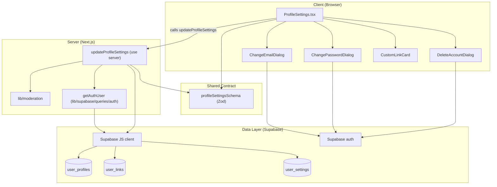
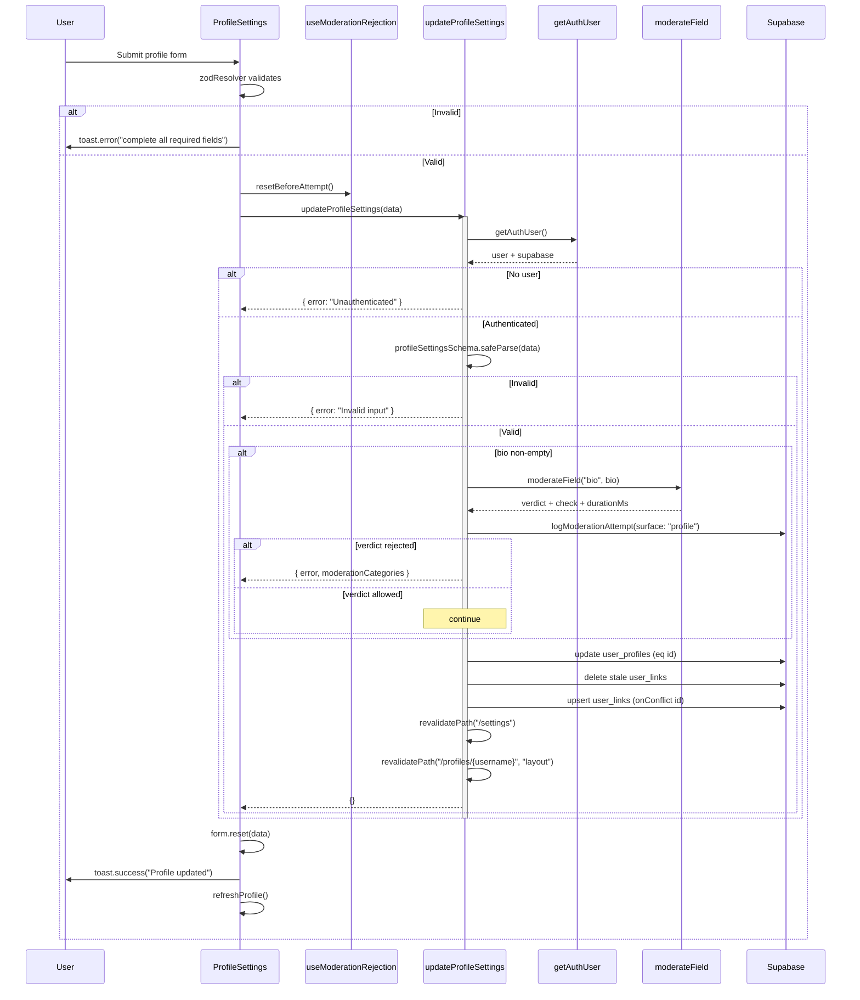
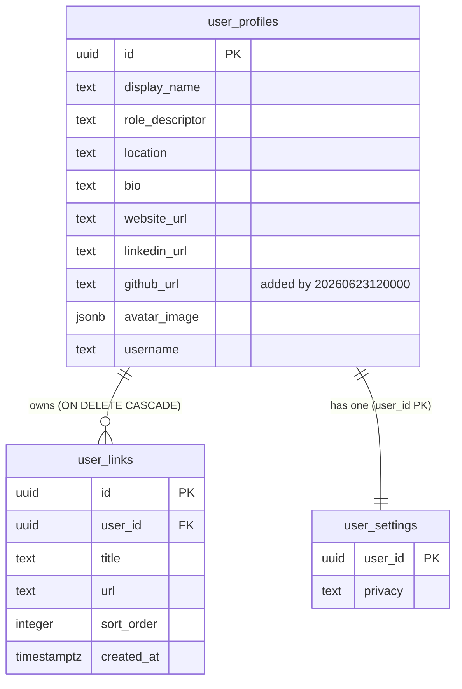
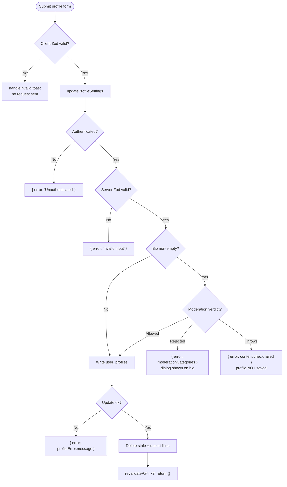

The user settings surface lets an authenticated account owner edit their public profile (identity, bio, links, avatar) and manage sensitive account operations such as changing email, changing password, and deleting the account.

## Purpose and Scope

This page documents the **User Settings & Account Management** capability of ozeaon-v2: the `/settings` page experience, the profile-settings form and its validation contract, the `updateProfileSettings` server action, and the persistence model (`user_profiles`, `user_links`, `user_settings`) that backs it, including the moderation gate applied to the profile bio.

In scope:

- The `ProfileSettings` client component and the account dialogs it wires up.
- The `profileSettingsSchema` Zod contract (`src/zod/profile/profileSettings.ts`).
- The `updateProfileSettings` server action (`src/app/(main)/(feed)/(private)/account/actions.ts`).
- The `user_links` table and its RLS policies (`supabase/migrations/20260623120000_profile_settings.sql`).
- The `user_settings` table and its RLS policies (privacy/preferences).

Related topics are intentionally left to sibling pages:

- For the broader authentication/session/RLS posture, see **Auth & Accounts** parent page.
- For organization-level settings, see the organization settings sibling page (`src/zod/organizations/settings.ts`, `src/components/organizations/form/OrganizationSettingsForm.tsx`).
- For the moderation subsystem internals (provider selection, categories), see the moderation page — this page only documents how the profile bio hooks into it.

## Overview

ozeaon-v2 treats a "user" as a set of concerns split across several tables rather than a single row:

| Concern | Table / Surface | Owner code |
|---------|-----------------|-----------|
| Public identity (name, bio, links, avatar) | `user_profiles`, `user_links` | `ProfileSettings.tsx`, `updateProfileSettings` |
| Preferences (e.g. `privacy`) | `user_settings` | Supabase RLS policies |
| Credentials (email, password) | Supabase `auth` | `ChangeEmailDialog`, `ChangePasswordDialog` |
| Account lifecycle (deletion) | Supabase `auth` + cascade | `DeleteAccountDialog` |

The **public profile** is edited through a single React Hook Form instance backed by a Zod schema that also serves as the server-side validation contract — the client and the server parse the *same* schema, so what the browser validates is exactly what the action re-validates. The **sensitive** operations (email, password, deletion) are deliberately *not* part of the bulk profile form; they live in dedicated modal dialogs so a user cannot accidentally trigger an irreversible account change while saving unrelated profile edits.

A key design intent: the profile form is a **single atomic save** that reconciles three independent resources — the `user_profiles` row, the moderated `bio` field, and a child collection of `user_links` rows (create/update/delete in one pass) — while the account dialogs are independent, dialog-scoped transactions.

## Architecture

The capability is layered: a client form, a server action, the Supabase client, and the underlying tables with RLS.



The diagram reflects the real dependency graph: `ProfileSettings.tsx` imports the schema for `zodResolver` and imports `updateProfileSettings` from the account actions module; the server action re-parses the same schema, resolves the authenticated user via `getAuthUser`, runs the bio through `moderateField`, and writes to `user_profiles` and `user_links` through the same Supabase client returned by `getAuthUser`. The three account dialogs operate directly against Supabase `auth` rather than through a shared action.

## The Profile Settings Form

`ProfileSettings` is a client component (`"use client"`) that receives four props and owns the entire profile-editing experience.

```tsx
type Props = {
  profile: UserProfile;
  initialLinks: UserLink[];
  email: string;
  isOrgOwner: boolean;
};

export function ProfileSettings({
  profile,
  initialLinks,
  email,
  isOrgOwner,
}: Props) {
```

> Source: [ProfileSettings.tsx](https://github.com/ozeaon/ozeaon-v2/blob/0a4f1a95824db87782f1221a4108019d174df3d9/src/components/account/ProfileSettings.tsx#L50-L62)

The component derives `avatarPath` from `profile.avatar_image?.path`, pulls `refreshProfile` from `useAuth()`, and keeps three pieces of dialog state plus the current email in `useState`. The email is stored locally (`currentEmail`) so a successful `ChangeEmailDialog` can update the read-only field without a full page reload.

### Form initialization and default values

The form is created with `useForm` in `onBlur` mode and a Zod resolver, mapping server-provided profile data into form defaults:

```tsx
const form = useForm<ProfileSettingsInput, unknown, ProfileSettingsOutput>({
  resolver: zodResolver(profileSettingsSchema),
  mode: "onBlur",
  defaultValues: {
    display_name: profile.display_name ?? "",
    role_descriptor: profile.role_descriptor ?? "",
    location: profile.location ?? "",
    bio: profile.bio ?? "",
    website_url: profile.website_url ?? "",
    linkedin_url: profile.linkedin_url ?? "",
    github_url: profile.github_url ?? "",
    custom_links: initialLinks.map((l) => ({
      id: l.id,
      title: l.title,
      url: l.url,
    })),
  },
});
```

> Source: [ProfileSettings.tsx](https://github.com/ozeaon/ozeaon-v2/blob/0a4f1a95824db87782f1221a4108019d174df3d9/src/components/account/ProfileSettings.tsx#L70-L87)

Two design points stand out:

1. **`mode: "onBlur"`** — validation runs when a field loses focus rather than on every keystroke, which avoids flashing errors while a user is mid-typing a URL.
2. **`ProfileSettingsInput` → `unknown` → `ProfileSettingsOutput`** — the three type parameters let the input (`ProfileSettingsInput`) and the transformed output (`ProfileSettingsOutput`) differ, which matters because the schema applies `.trim()`, `.default()`, and validators that can change the parsed shape. The submit handler therefore receives the *output* type.

The generic `custom_links` field array is managed with `useFieldArray`:

```tsx
const { fields, append, remove } = useFieldArray({
  control: form.control,
  name: "custom_links",
});
```

> Source: [ProfileSettings.tsx](https://github.com/ozeaon/ozeaon-v2/blob/0a4f1a95824db87782f1221a4108019d174df3d9/src/components/account/ProfileSettings.tsx#L104-L107)

### Avatar handling

Avatar upload is delegated to the `useProfileImageUpload` hook with per-surface constraints — a **0.5 MB** size cap and a **512 px** maximum dimension, plus localized success/error messages:

```tsx
const { uploadImage, removeImage } = useProfileImageUpload({
  type: "avatar",
  maxSizeMB: 0.5,
  maxWidthOrHeight: 512,
  messages: {
    uploadSuccess: "Profile picture updated successfully",
    uploadError: "Failed to upload avatar",
    removeSuccess: "Profile picture removed",
    removeError: "Failed to remove profile picture",
  },
  onRejected: moderation.applyImageRejection,
});
```

> Source: [ProfileSettings.tsx](https://github.com/ozeaon/ozeaon-v2/blob/0a4f1a95824db87782f1221a4108019d174df3d9/src/components/account/ProfileSettings.tsx#L91-L102)

The `onRejected` callback forwards to `moderation.applyImageRejection`, meaning a moderation-rejected avatar is surfaced through the same channel as a rejected bio.

### Required fields and the submit path

The form wraps its inputs in a `RequiredFieldsProvider` seeded from `PROFILE_REQUIRED_FIELDS`, and renders a submit button that is hidden on mobile (`hidden md:inline-flex`) because a sticky mobile action bar is used instead:

```tsx
<Form {...form}>
  <RequiredFieldsProvider fields={PROFILE_REQUIRED_FIELDS}>
    <form
      onSubmit={form.handleSubmit(handleSubmit, handleInvalid)}
      className="space-y-4 max-w-3xl pb-20 md:pb-0"
      noValidate
    >
```

> Source: [ProfileSettings.tsx](https://github.com/ozeaon/ozeaon-v2/blob/0a4f1a95824db87782f1221a4108019d174df3d9/src/components/account/ProfileSettings.tsx#L141-L147)

The second argument to `handleSubmit` is `handleInvalid`, which replaces the browser's native validation bubbles (disabled via `noValidate`) with a toast:

```tsx
const handleInvalid = () => {
  toast.error(
    "Please complete all required fields. Check all steps for missing required information",
    { position: "top-center" },
  );
};
```

> Source: [ProfileSettings.tsx](https://github.com/ozeaon/ozeaon-v2/blob/0a4f1a95824db87782f1221a4108019d174df3d9/src/components/account/ProfileSettings.tsx#L129-L134)

## Validation Contract

The Zod schema is the single source of truth for both client and server validation. It is defined in `src/zod/profile/profileSettings.ts`.

```ts
export const profileSettingsSchema = z.object({
  display_name: safeString({ profanity: true })
    .trim()
    .min(1, PROFILE_REQUIRED_FIELD_MESSAGES.display_name)
    .max(100, "Display name cannot exceed 100 characters")
    .refine((val) => DISPLAY_NAME_ALLOWED_RE.test(val), {
      error:
        "Display name can only contain letters, numbers, spaces, and the common punctuation",
    })
    .refine((val) => DISPLAY_NAME_HAS_ALPHANUM_RE.test(val), {
      error: "Display name must contain at least 1 character.",
    }),
  role_descriptor: safeString({ profanity: true })
    .trim()
    .min(1, PROFILE_REQUIRED_FIELD_MESSAGES.role_descriptor),
  location: safeString().optional().nullable(),
  bio: safeString().max(3000, "Maximum 3,000 characters").optional().nullable(),
  website_url: urlField({ profanity: true }),
  linkedin_url: urlField({ profanity: true }),
  github_url: urlField({ profanity: true }),
  custom_links: z.array(customLinkSchema).optional().default([]),
});
```

> Source: [profileSettings.ts](https://github.com/ozeaon/ozeaon-v2/blob/0a4f1a95824db87782f1221a4108019d174df3d9/src/zod/profile/profileSettings.ts#L19-L40)

### Display name rules

Two regexes govern the display name:

```ts
// Includes the curly apostrophe: iOS and macOS substitute it automatically.
const DISPLAY_NAME_ALLOWED_RE = /^[\p{L}\p{N} '’".\-,`()]*$/u;
const DISPLAY_NAME_HAS_ALPHANUM_RE = /[\p{L}\p{N}]/u;
```

> Source: [profileSettings.ts](https://github.com/ozeaon/ozeaon-v2/blob/0a4f1a95824db87782f1221a4108019d174df3d9/src/zod/profile/profileSettings.ts#L6-L8)

This is a Unicode-aware allowlist: any letter (`\p{L}`) or number (`\p{N}`) from any script, plus a curated punctuation set. The comment documents a real-world edge case — smart-quote substitution by Apple operating systems — which is why both the straight `'` and curly `’` apostrophes are permitted. The second regex guarantees the name is not composed solely of punctuation/whitespace.

### Custom links

Each custom link is validated by its own sub-schema, and the link `id` is optional because new links have no server-assigned ID yet:

```ts
const customLinkSchema = z.object({
  id: z.uuid().optional(),
  title: safeString({ profanity: true })
    .trim()
    .max(80, "Maximum 80 characters")
    .default(""),
  url: requiredUrlField({ profanity: true }),
});

export type UserCustomLink = z.infer<typeof customLinkSchema>;
```

> Source: [profileSettings.ts](https://github.com/ozeaon/ozeaon-v2/blob/0a4f1a95824db87782f1221a4108019d174df3d9/src/zod/profile/profileSettings.ts#L10-L17)

The presence/absence of `id` is the signal the server action uses to distinguish "update existing link" from "create new link", which is why it is optional rather than required.

### Field-level validation summary

| Field | Type | Required | Bounds / rule |
|-------|------|----------|---------------|
| `display_name` | string | Yes | 1–100 chars; Unicode allowlist; must contain ≥1 alphanumeric; profanity-checked |
| `role_descriptor` | string | Yes | ≥1 char after trim; profanity-checked |
| `location` | string | No | `nullable`; profanity not enabled |
| `bio` | string | No | ≤3000 chars; `nullable`; moderated server-side |
| `website_url` | URL | Uses `urlField` | profanity-checked |
| `linkedin_url` | URL | Uses `urlField` | profanity-checked |
| `github_url` | URL | Uses `urlField` | profanity-checked |
| `custom_links[]` | array | No (defaults to `[]`) | `title` ≤80 chars, `url` required, `id` optional UUID |

## The Server Action: `updateProfileSettings`

The server action is the trust boundary. It lives in `src/app/(main)/(feed)/(private)/account/actions.ts` under `"use server"` and returns a discriminated-ish result object rather than throwing:

```ts
export async function updateProfileSettings(
  data: ProfileSettingsPayload,
): Promise<{ error?: string; moderationCategories?: string[] }> {
  const { user, supabase } = await getAuthUser();
  if (!user) return { error: "Unauthenticated" };

  const parsed = profileSettingsSchema.safeParse(data);
  if (!parsed.success) return { error: "Invalid input" };

  const { custom_links, ...profileFields } = parsed.data;
```

> Source: [actions.ts](https://github.com/ozeaon/ozeaon-v2/blob/0a4f1a95824db87782f1221a4108019d174df3d9/src/app/(main)/(feed)/(private)/account/actions.ts#L17-L26)

Key decisions visible here:

- **Re-authentication is not assumed.** Even though the client form is gated behind an authenticated route, the action independently calls `getAuthUser()` and returns `{ error: "Unauthenticated" }` if no user is resolved. This defends against stale sessions and direct action invocation.
- **Re-validation is mandatory.** `safeParse` runs the identical schema client-side and server-side; a client that bypasses the resolver still cannot write an invalid profile.
- **`custom_links` is destructured out** so that the remaining properties (`profileFields`) map cleanly onto the `user_profiles` column set, while links are handled by their own reconciliation logic.

### Bio moderation gate

The bio is the only profile field routed through the moderation service. The action builds an `account` descriptor with `organizationId: null` (profile moderation is personal, not organizational), moderates, logs the attempt, and rejects on a `"rejected"` verdict:

```ts
if (profileFields.bio?.trim()) {
  const account = { ownerId: user.id, organizationId: null };
  try {
    const result = await moderateField("bio", profileFields.bio);
    await logModerationAttempt({
      supabase,
      surface: "profile",
      account,
      checks: [result.check],
      durationMs: result.durationMs,
    });
    if (result.verdict.decision === "rejected") {
      return {
        error: `We couldn't save your bio because it may contain ${result.verdict.categories.join(", ")}.`,
        moderationCategories: result.verdict.categories,
      };
    }
  } catch (error) {
    const failureReason =
      error instanceof ModerationError ? error.failureReason : "upstream";
    await logModerationAttempt({
      supabase,
      surface: "profile",
      account,
      checks: [
        buildFailedCheck({ field: "bio", inputText: profileFields.bio }),
      ],
      failureReason,
    });
    return {
      error: "We couldn't complete the content check. Please try again.",
    };
  }
}
```

> Source: [actions.ts](https://github.com/ozeaon/ozeaon-v2/blob/0a4f1a95824db87782f1221a4108019d174df3d9/src/app/(main)/(feed)/(private)/account/actions.ts#L28-L61)

Design intent worth calling out:

1. **Fail-closed on moderation outage.** If `moderateField` throws, the action does *not* save the profile — it logs a failed check via `buildFailedCheck` and returns a retryable error. This prevents a moderation outage from becoming a bypass.
2. **Attempt logging on both paths.** Whether the verdict is `rejected` or the call throws, `logModerationAttempt` is invoked, giving operators a complete audit trail of the `"profile"` surface.
3. **Categories are propagated to the client** via `moderationCategories`, which the form uses to open `ModerationRejectedDialog` rather than a generic toast.
4. **Empty bios skip moderation.** `profileFields.bio?.trim()` means clearing the bio is free and instantaneous.

### Profile write

```ts
const { data: updated, error: profileError } = await supabase
  .from("user_profiles")
  .update(profileFields as TablesUpdate<"user_profiles">)
  .eq("id", user.id)
  .select("username")
  .single();

if (profileError) return { error: profileError.message };
```

> Source: [actions.ts](https://github.com/ozeaon/ozeaon-v2/blob/0a4f1a95824db87782f1221a4108019d174df3d9/src/app/(main)/(feed)/(private)/account/actions.ts#L63-L70)

The `.select("username")` is not incidental — it fetches the username so the action can revalidate the public profile page path (`/profiles/{username}`). The `as TablesUpdate<"user_profiles">` cast aligns the schema-derived field object with the generated Supabase types.

### Link reconciliation (delete → upsert)

Custom links are reconciled with a deliberate **delete-then-upsert** ordering, guarded by a code comment that explains exactly why:

```ts
const links = custom_links ?? [];
const keptIds = links
  .filter((l): l is typeof l & { id: string } => !!l.id)
  .map((l) => l.id);

// Delete stale links first — before upsert so new rows are never swept away
const deleteQuery = supabase
  .from("user_links")
  .delete()
  .eq("user_id", user.id);
const { error: deleteError } = await (keptIds.length > 0
  ? deleteQuery.not("id", "in", `(${keptIds.join(",")})`)
  : deleteQuery);

if (deleteError) return { error: deleteError.message };

if (links.length > 0) {
  const rows = links.map((link, i) => ({
    ...(link.id ? { id: link.id } : {}),
    user_id: user.id,
    title: link.title,
    url: link.url,
    sort_order: i,
  }));
  const { error: upsertError } = await supabase
    .from("user_links")
    .upsert(rows, { onConflict: "id" });
  if (upsertError) return { error: upsertError.message };
}
```

> Source: [actions.ts](https://github.com/ozeaon/ozeaon-v2/blob/0a4f1a95824db87782f1221a4108019d174df3d9/src/app/(main)/(feed)/(private)/account/actions.ts#L71-L100)

The algorithm in detail:

1. Extract `keptIds` — the IDs of links the user kept (type-guarded to `string` with a predicate).
2. Delete all of the user's links **except** the kept ones. If the user kept nothing, delete *all* their links (the ternary drops the `.not()` filter).
3. Upsert the submitted links, assigning `sort_order` from the array index so display order is stable and server-owned.

**Why delete first?** If the upsert ran first, a newly-inserted row (with a fresh `id` not yet in `keptIds`) could be removed by the subsequent delete. Doing the delete first and constraining it to *non-kept* IDs means new rows can never be swept away. The `onConflict: "id"` keeps existing rows stable (preserving `created_at` and any ID references) while updating `title`/`url`/`sort_order`.

**Note on transactionality:** these are two independent Supabase calls, not a single transaction. If the delete succeeds and the upsert fails, the action returns the upsert error but the deletes are already committed. This is a real edge case in the current implementation.

### Cache revalidation

```ts
revalidatePath("/settings");
if (updated?.username)
  revalidatePath(`/profiles/${updated.username}`, "layout");
return {};
```

> Source: [actions.ts](https://github.com/ozeaon/ozeaon-v2/blob/0a4f1a95824db87782f1221a4108019d174df3d9/src/app/(main)/(feed)/(private)/account/actions.ts#L102-L105)

`revalidatePath("/settings")` refreshes the settings route. The profile path is revalidated with type `"layout"` so the entire public profile subtree — which may contain nested routes — is refreshed, not just the leaf page. A successful call returns `{}` (no `error` key), which the client treats as success.

## Core Flow

The end-to-end save flow, from submit to revalidation:



### Client-side result handling

The submit handler translates the action's return value into UI, including routing moderation rejections into the moderation dialog:

```tsx
const handleSubmit = async (data: ProfileSettingsOutput) => {
  moderation.resetBeforeAttempt();
  const result = await updateProfileSettings(data);
  if (result.error) {
    // Bio is the only moderated field, so the rejection maps straight onto
    // it - the dialog announces it, as on every other text surface.
    if (result.moderationCategories) {
      moderation.applyRejection([
        { field: "bio", categories: result.moderationCategories },
      ]);
      return;
    }
    toast.error(result.error, { position: "top-center" });
    return;
  }
  form.reset(data);
  toast.success("Profile updated", { position: "top-center" });
  await refreshProfile();
};
```

> Source: [ProfileSettings.tsx](https://github.com/ozeaon/ozeaon-v2/blob/0a4f1a95824db87782f1221a4108019d174df3d9/src/components/account/ProfileSettings.tsx#L109-L127)

Three behaviors are worth noting: `resetBeforeAttempt()` clears prior rejection state before each attempt so stale dialogs do not persist; `applyRejection` maps the server's `moderationCategories` back onto the `bio` field because the comment explicitly states bio is *the only moderated field*; and `form.reset(data)` after success clears the dirty state so the save button reflects the new baseline.

## Data Model & Persistence

The profile-settings capability spans three tables. `user_profiles` and `user_settings` were part of the original remote schema, while `user_links` and the `github_url` column were added by a dedicated profile-settings migration.



### `user_links` schema

```sql
CREATE TABLE public.user_links (
  id uuid DEFAULT gen_random_uuid() NOT NULL,
  user_id uuid NOT NULL,
  title text NOT NULL,
  url text NOT NULL,
  sort_order integer DEFAULT 0 NOT NULL,
  created_at timestamp with time zone DEFAULT now() NOT NULL,
  CONSTRAINT user_links_pkey PRIMARY KEY (id),
  CONSTRAINT user_links_user_id_fkey FOREIGN KEY (user_id) REFERENCES public.user_profiles(id) ON DELETE CASCADE
);
```

> Source: [20260623120000_profile_settings.sql](https://github.com/ozeaon/ozeaon-v2/blob/0a4f1a95824db87782f1221a4108019d174df3d9/supabase/migrations/20260623120000_profile_settings.sql#L5-L14)

- `id` defaults to `gen_random_uuid()`, so a client may submit a link *without* an ID and the database assigns one.
- `ON DELETE CASCADE` on `user_id` means deleting the owning profile removes all links automatically — an important property for account deletion.
- `sort_order` (default `0`) is server-owned; the action overwrites it with the array index on every save.

The same migration adds the `github_url` column to `user_profiles`:

```sql
ALTER TABLE public.user_profiles
  ADD COLUMN github_url text;
```

> Source: [20260623120000_profile_settings.sql](https://github.com/ozeaon/ozeaon-v2/blob/0a4f1a95824db87782f1221a4108019d174df3d9/supabase/migrations/20260623120000_profile_settings.sql#L2-L3)

### `user_settings` table

`user_settings` is keyed by `user_id` and backs preference data. Its primary key is the `user_id` column itself (unique btree index promoted to a PK in the remote schema):

```sql
CREATE UNIQUE INDEX user_settings_pkey ON public.user_settings USING btree (user_id);
...
alter table "public"."user_settings" add constraint "user_settings_pkey" PRIMARY KEY using index "user_settings_pkey";
```

> Sources:
> - [20260224142212_remote_schema.sql](https://github.com/ozeaon/ozeaon-v2/blob/0a4f1a95824db87782f1221a4108019d174df3d9/supabase/migrations/20260224142212_remote_schema.sql#L1746)
> - [20260224142212_remote_schema.sql](https://github.com/ozeaon/ozeaon-v2/blob/0a4f1a95824db87782f1221a4108019d174df3d9/supabase/migrations/20260224142212_remote_schema.sql#L1908)

A representative column is `privacy`, which drives post-feed visibility — the seed fixture inserts `user_settings (user_id, privacy)` with `'public'` values:

```sql
-- privacy drives post feed visibility.
INSERT INTO public.user_settings (user_id, privacy)
SELECT id, 'public' FROM public.user_profiles
```

> Source: [10-preview-fixture.sql](https://github.com/ozeaon/ozeaon-v2/blob/0a4f1a95824db87782f1221a4108019d174df3d9/supabase/seeds/10-preview-fixture.sql#L102-L104)

Because `Privacy` is a preference rather than a credential, it is enforced purely by Row Level Security policies rather than by any server action.

### Row Level Security policies

Row Level Security is enabled on `user_settings` and `user_links`, and the policies follow one consistent shape: **the row's `user_id` must equal `auth.uid()`**.

For `user_settings`, a later migration replaced the original policies with performance-optimized versions that wrap the auth call in a scalar subquery to force initplan evaluation:

```sql
-- user_settings (initplan only)
DROP POLICY IF EXISTS "Users can create own settings" ON public.user_settings;
DROP POLICY IF EXISTS "Users can update own settings" ON public.user_settings;
DROP POLICY IF EXISTS "Users can view own settings" ON public.user_settings;
CREATE POLICY "Users can create own settings" ON public.user_settings FOR INSERT TO authenticated
  WITH CHECK (((SELECT auth.uid()) = user_id));
CREATE POLICY "Users can update own settings" ON public.user_settings FOR UPDATE TO authenticated
  USING (((SELECT auth.uid()) = user_id)) WITH CHECK (((SELECT auth.uid()) = user_id));
CREATE POLICY "Users can view own settings" ON public.user_settings FOR SELECT TO authenticated
  USING (((SELECT auth.uid()) = user_id));
```

> Source: [20260420000002_fix_rls_performance.sql](https://github.com/ozeaon/ozeaon-v2/blob/0a4f1a95824db87782f1221a4108019d174df3d9/supabase/migrations/20260420000002_fix_rls_performance.sql#L587-L596)

The `SELECT auth.uid()` wrapping is a well-known Postgres/PostgREST performance pattern: evaluating `auth.uid()` once per statement via an initplan rather than once per row. This matters because these policies run on every settings read/write.

For `user_links`, the policy set is broader because links are a **public** profile artifact:

```sql
CREATE POLICY "Anyone can view user links" ON public.user_links
  FOR SELECT USING (true);

CREATE POLICY "Users can insert their own links" ON public.user_links
  FOR INSERT TO authenticated
  WITH CHECK ((SELECT auth.uid()) = user_id);

CREATE POLICY "Users can update their own links" ON public.user_links
  FOR UPDATE TO authenticated
  USING ((SELECT auth.uid()) = user_id)
  WITH CHECK ((SELECT auth.uid()) = user_id);

CREATE POLICY "Users can delete their own links" ON public.user_links
  FOR DELETE TO authenticated
  USING ((SELECT auth.uid()) = user_id);
```

> Source: [20260623120000_profile_settings.sql](https://github.com/ozeaon/ozeaon-v2/blob/0a4f1a95824db87782f1221a4108019d174df3d9/supabase/migrations/20260623120000_profile_settings.sql#L18-L32)

The asymmetry is intentional: `SELECT` is open to everyone (links are shown on the public profile page), while all mutations require `authenticated` and ownership. The `FOR UPDATE` policy specifies *both* `USING` and `WITH CHECK` so a user cannot mutate a row into someone else's ownership.

## API Reference

### `updateProfileSettings(data): Promise<{ error?: string; moderationCategories?: string[] }>`

Server action that validates, moderates, and persists profile settings.

**Parameters:**
- `data` (`ProfileSettingsPayload`, i.e. `z.input<typeof profileSettingsSchema>`): the raw form payload. Parsed again server-side; unparsed/extra fields are ignored.

**Returns:** an object with:
- `error` (optional `string`): human-readable failure message when the operation failed.
- `moderationCategories` (optional `string[]`): present only when the bio was rejected; the caller maps these onto the `bio` field.

Success is signaled by the absence of `error` (the action returns `{}`).

**Failure behavior (returns rather than throws):**
- No authenticated user → `{ error: "Unauthenticated" }`.
- Schema parse failure → `{ error: "Invalid input" }`.
- Bio rejected by moderation → `{ error, moderationCategories }`.
- Moderation infrastructure failure → `{ error: "We couldn't complete the content check. Please try again." }`.
- Profile update error → `{ error: profileError.message }`.
- Link delete error → `{ error: deleteError.message }`.
- Link upsert error → `{ error: upsertError.message }`.

> Source: [actions.ts](https://github.com/ozeaon/ozeaon-v2/blob/0a4f1a95824db87782f1221a4108019d174df3d9/src/app/(main)/(feed)/(private)/account/actions.ts#L15-L105)

### `profileSettingsSchema`

Zod object schema described in full in the [Validation Contract](#validation-contract) section. Exports `ProfileSettingsInput`, `ProfileSettingsOutput`, and `UserCustomLink` types.

> Source: [profileSettings.ts](https://github.com/ozeaon/ozeaon-v2/blob/0a4f1a95824db87782f1221a4108019d174df3d9/src/zod/profile/profileSettings.ts#L19-L44)

### `ProfileSettings` component props

| Prop | Type | Purpose |
|------|------|---------|
| `profile` | `UserProfile` | Seeds form defaults and provides `avatar_image`, `display_name` |
| `initialLinks` | `Pick<Tables<"user_links">, "id" \| "title" \| "url">[]` | Initial `custom_links` values |
| `email` | `string` | Displayed read-only; source of truth for `ChangeEmailDialog` |
| `isOrgOwner` | `boolean` | Flags org-ownership status for the settings experience |

> Source: [ProfileSettings.tsx](https://github.com/ozeaon/ozeaon-v2/blob/0a4f1a95824db87782f1221a4108019d174df3d9/src/components/account/ProfileSettings.tsx#L48-L55)

## Account Management Dialogs

Three account-level operations are extracted into self-contained dialogs and rendered from `ProfileSettings`:

```tsx
import { ChangeEmailDialog } from "@/components/account/ChangeEmailDialog";
import { ChangePasswordDialog } from "@/components/account/ChangePasswordDialog";
import { DeleteAccountDialog } from "@/components/account/DeleteAccountDialog";
```

> Source: [ProfileSettings.tsx](https://github.com/ozeaon/ozeaon-v2/blob/0a4f1a95824db87782f1221a4108019d174df3d9/src/components/account/ProfileSettings.tsx#L31-L33)

They are driven by three independent boolean state flags:

```tsx
const [currentEmail, setCurrentEmail] = useState(email);
const [changeEmailOpen, setChangeEmailOpen] = useState(false);
const [changePasswordOpen, setChangePasswordOpen] = useState(false);
const [deleteAccountOpen, setDeleteAccountOpen] = useState(false);
```

> Source: [ProfileSettings.tsx](https://github.com/ozeaon/ozeaon-v2/blob/0a4f1a95824db87782f1221a4108019d174df3d9/src/components/account/ProfileSettings.tsx#L65-L68)

This separation is a deliberate safety and UX decision:

- **Email** is shown as a disabled `Input` with an adjacent pencil button that opens `ChangeEmailDialog`. Because changing email typically requires a confirmation round-trip in Supabase `auth`, it must be a flow of its own rather than a field in the bulk save.
- **Password** and **account deletion** are irreversible or security-sensitive and therefore never participate in the dirty-state tracking of the profile form.
- The local `currentEmail` state allows the read-only input to reflect a successful email change without refetching the page.

```tsx
<Input
  value={currentEmail}
  readOnly
  className="flex-1 bg-bg-neutral"
/>
<Button
  type="button"
  variant="sunken"
  className="size-9 p-0 shrink-0"
  onClick={() => setChangeEmailOpen(true)}
  aria-label="Change email"
>
  <Pencil className="size-4" />
</Button>
```

> Source: [ProfileSettings.tsx](https://github.com/ozeaon/ozeaon-v2/blob/0a4f1a95824db87782f1221a4108019d174df3d9/src/components/account/ProfileSettings.tsx#L205-L218)

Custom links are edited through `CustomLinkCard`, using the `useFieldArray` `append`/`remove` helpers and the `Plus`/`Pencil` icons imported at the top of the component.

> Source: [ProfileSettings.tsx](https://github.com/ozeaon/ozeaon-v2/blob/0a4f1a95824db87782f1221a4108019d174df3d9/src/components/account/ProfileSettings.tsx#L7-L30)

## Failure Modes, Edge Cases & Concurrency

### Failure modes at a glance



### Notable edge cases

1. **Moderation is fail-closed.** A thrown `ModerationError` (or any error) aborts the save entirely and returns a retryable generic message. The `failureReason` is normalized: `error instanceof ModerationError ? error.failureReason : "upstream"`.

2. **Bio clearing bypasses moderation.** Because the gate is `if (profileFields.bio?.trim())`, an empty or whitespace-only bio is written without a content check. This is safe because removing content cannot introduce disallowed content.

3. **Non-transactional link reconciliation.** The delete and the upsert are separate calls with no wrapping transaction. A failure between them leaves the link set partially updated. Recovery is user-driven: re-submitting the form re-runs the full reconciliation and converges.

4. **`sort_order` is derived, not user-supplied.** The action sets `sort_order: i` from the array index, so the client cannot send duplicate or malicious ordering values.

5. **Duplicate IDs in a payload.** `keptIds` may contain duplicates if a client sends the same `id` twice; the resulting `not("id", "in", "(...)")` filter still behaves correctly (the row is simply kept), but the upsert payload would contain two rows with the same PK. Postgres would reject that as a conflict on the primary key, surfacing as `upsertError`. The schema does not currently deduplicate IDs.

6. **Orphaned new links on delete failure ordering.** Because deletes run first and only target *non-kept* IDs, newly added links (no `id`) can never be deleted in the same pass — this is the exact bug the code comment warns about.

7. **Stale session response.** `getAuthUser()` returning no user yields `"Unauthenticated"`; the client renders it through `toast.error` and does not clear the form, so the user does not lose edits.

### Concurrency considerations

- **Last-write-wins on `user_profiles`.** The update is a blind `.update(profileFields).eq("id", user.id)`. There is no optimistic-concurrency token (no `updated_at` version check), so two concurrent saves from two tabs will have the later one overwrite the earlier.
- **Link reconciliation is not idempotent across concurrent saves.** Two simultaneous saves in different tabs can interleave their delete/upsert phases: tab A's delete could remove a link tab B just inserted. In practice, the single-user, single-form nature of this surface makes this low-risk.
- **RLS enforces ownership at the database boundary.** Even with a forged `user_id` in a link row, the `WITH CHECK ((SELECT auth.uid()) = user_id)` policies reject the write, so the client cannot write links for another user.

## Performance & Operational Notes

- **RLS initplan optimization.** The `user_settings` policies wrap `auth.uid()` in a scalar subquery (`(SELECT auth.uid())`) so the call is evaluated once per statement rather than once per row. This migration (`20260420000002_fix_rls_performance.sql`) exists specifically to fix RLS performance across the schema.
- **Targeted revalidation.** `revalidatePath` is called only for `/settings` and, conditionally, `/profiles/{username}` with `"layout"` scope. The username is obtained from the update's `.select("username")`, avoiding an extra query while keeping the public profile cache fresh.
- **Avatar constraints reduce payload and storage cost.** A 0.5 MB cap and 512 px max dimension keep avatar uploads small; rejection is routed through `onRejected: moderation.applyImageRejection`.
- **Index coverage.** `user_settings` has a unique btree index on `user_id` (`user_settings_pkey`), making the PK lookup that gates every settings read/write O(log n). `user_links` is filtered by `user_id` in the delete step and has a PK on `id` for the upsert conflict target; the `user_id` foreign key is not separately indexed by this migration.
- **Seed/truncate awareness.** Any environment reset must account for these tables — `supabase/seeds/00-truncate.sql` truncates `public.user_settings` alongside `public.user_profiles` and other profile-adjacent tables.

## Extension Points

| Extension | Where | How |
|-----------|-------|-----|
| Add a profile field | `profileSettingsSchema` | Add the key, then it flows through `profileFields` into `user_profiles` automatically because the action spreads the parsed object |
| Moderate an additional field | `updateProfileSettings` | Add another `moderateField("<field>", value)` block; the client already supports multiple rejections via `moderation.applyRejection([{ field, categories }])` |
| Add a custom-link field | `customLinkSchema` + `updateProfileSettings` upsert mapping | Extend the sub-schema and add the column to the `rows` mapping |
| Change avatar limits | `useProfileImageUpload` call | `maxSizeMB` and `maxWidthOrHeight` are call-site options |
| Require a new profile field | `PROFILE_REQUIRED_FIELDS` / `PROFILE_REQUIRED_FIELD_MESSAGES` | Drives both the `RequiredFieldsProvider` UI and the Zod `.min(1, ...)` messages |
| Adjust display-name permitted characters | `DISPLAY_NAME_ALLOWED_RE` | Single regex constant governs the allowlist |

The design deliberately keeps the **shared Zod schema** as the contract seam: adding a validation rule in one place automatically applies on both the client (via `zodResolver`) and the server (via `safeParse`), which is why the schema file imports its messages from `@/config/constants/profile`.

## Related Links

- [ProfileSettings.tsx](https://github.com/ozeaon/ozeaon-v2/blob/0a4f1a95824db87782f1221a4108019d174df3d9/src/components/account/ProfileSettings.tsx) — the client form component
- [profileSettings.ts](https://github.com/ozeaon/ozeaon-v2/blob/0a4f1a95824db87782f1221a4108019d174df3d9/src/zod/profile/profileSettings.ts) — the shared validation contract
- [actions.ts](https://github.com/ozeaon/ozeaon-v2/blob/0a4f1a95824db87782f1221a4108019d174df3d9/src/app/(main)/(feed)/(private)/account/actions.ts) — `updateProfileSettings` server action
- [20260623120000_profile_settings.sql](https://github.com/ozeaon/ozeaon-v2/blob/0a4f1a95824db87782f1221a4108019d174df3d9/supabase/migrations/20260623120000_profile_settings.sql) — `user_links` table + RLS, `github_url` column
- [20260224142212_remote_schema.sql](https://github.com/ozeaon/ozeaon-v2/blob/0a4f1a95824db87782f1221a4108019d174df3d9/supabase/migrations/20260224142212_remote_schema.sql) — `user_settings` table and PK definition
- [20260420000002_fix_rls_performance.sql](https://github.com/ozeaon/ozeaon-v2/blob/0a4f1a95824db87782f1221a4108019d174df3d9/supabase/migrations/20260420000002_fix_rls_performance.sql) — RLS performance rewrite for `user_settings`
- [10-preview-fixture.sql](https://github.com/ozeaon/ozeaon-v2/blob/0a4f1a95824db87782f1221a4108019d174df3d9/supabase/seeds/10-preview-fixture.sql) — preview seed data showing `user_settings.privacy` usage
- Sibling topics: organization settings, moderation subsystem, and the parent **Auth & Accounts** page.
