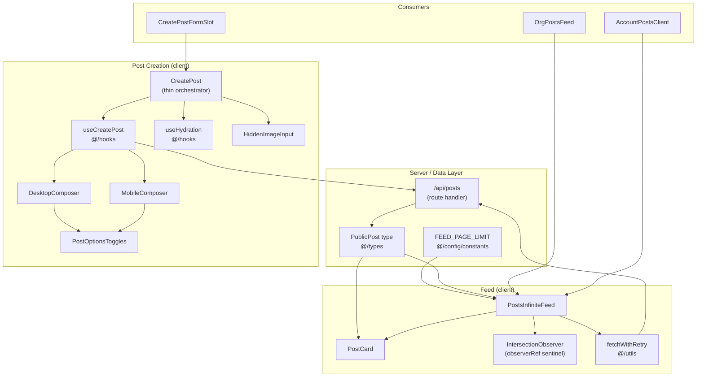
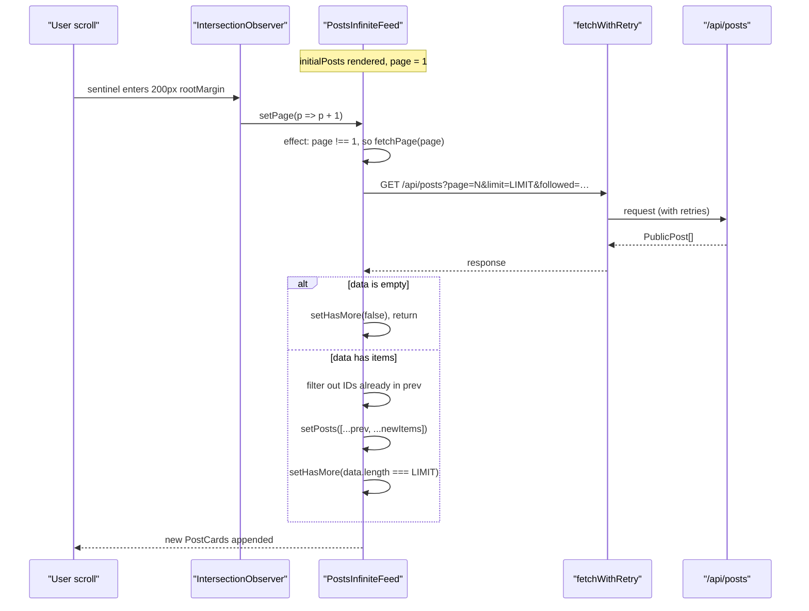
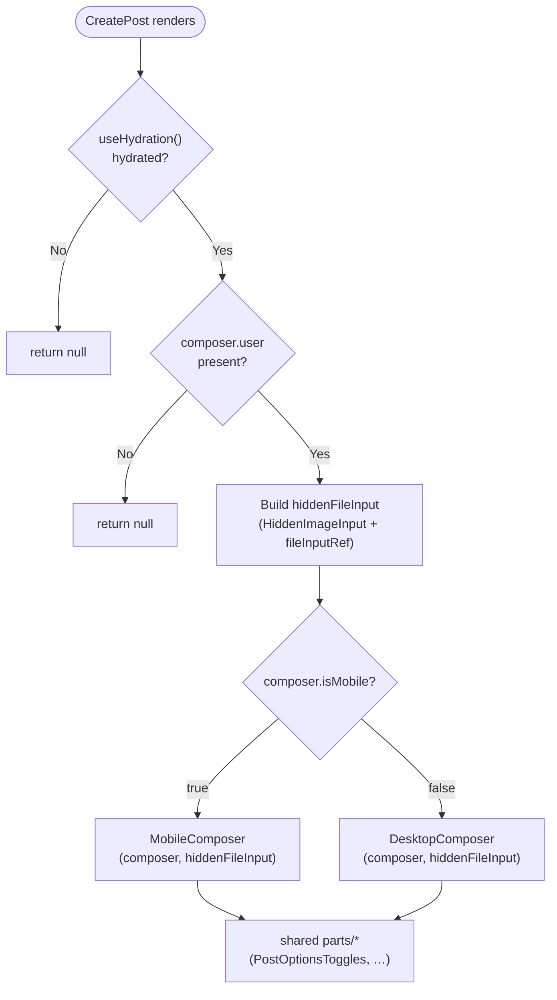

The posts subsystem implements the core social publishing loop of Ozeaon: users and organizations compose posts (with images and reposts), the feed renders them through a lazily-paginated infinite list, and interactions such as likes and reposts are surfaced both in the server-rendered initial payload and in the client-side feed.

## Purpose and Scope

This page documents the **posts feature** as a capability, specifically two tightly-coupled halves:

1. **The feed** — how an ordered stream of `PublicPost` records is fetched, paginated, de-duplicated, and rendered by `PostsInfiniteFeed`, including the per-user interaction state (`likedPosts`, `repostedPosts`).
2. **Post creation** — how the composer is assembled from desktop/mobile layouts and shared `parts/*` components, driven by the `useCreatePost` hook, including the hidden native file input used for image attachment.

Related but out-of-scope topics handled by sibling pages:

- **Post interactions in detail** (like/repost buttons, `PostInteractions`, `LikePostButton`, `RepostButton`) — see the interactions page under Features.
- **Attachments rendering** (`PostImages`, `PostAuthor`, `RepostingPost`, `UnavailablePost`) — see the post rendering/attachments page.
- **Organization-scoped feeds** (`OrgPostsFeed`, `AccountPostsClient`) — see the organizations and account pages; they are consumers of this feature, not redefinitions of it.

## Overview

At its core, the feature is a **server-rendered list hydrated into a client-side incremental feed**. The server provides an `initialPosts` array — which may be empty, full, or short — and the client component takes over from there, using an `IntersectionObserver` to request subsequent pages from `/api/posts`.

Three design decisions shape the implementation and are visible directly in the source:

| Decision | Where it appears | Why it matters |
|---|---|---|
| **Cursor-free numeric pagination** (`page` + `limit`) | `PostsInfiniteFeed.tsx` builds `URLSearchParams` with `page`, `limit`, `followed` | Keeps the server API trivial and cache-friendly; correctness is recovered on the client by ID-based de-duplication rather than by server-side cursors. |
| **`Set`-based lookups** | `likedSet` / `repostedSet` are `useMemo`'d `Set`s | Rendering a page of N posts needs an O(1) "is this post liked?" check per card instead of an O(N·M) `Array.includes` scan. |
| **Hook-owned composer logic** | `CreatePost` is a "thin orchestrator"; `useCreatePost` owns all state | Desktop and mobile layouts share one state machine and one image lifecycle, so behaviour cannot drift between breakpoints. |

Terminology used throughout this page:

- **`PublicPost`** — the client-visible post shape (`@/types`) used by the feed and cards.
- **`FEED_PAGE_LIMIT`** — the single page-size constant (`@/config/constants`) shared by the feed's initial-render heuristic and its fetch calls (`LIMIT`).
- **`fetchWithRetry`** — the repository's resilient fetch wrapper (`@/utils`) used for every page request.
- **Composer** — the create-post UI; a *layout* (desktop/mobile) plus shared *parts*.

## Architecture

The feature splits across a client component boundary: the server supplies an initial slice, and client components own both pagination and composition.



**Reading the diagram.** The `/api/posts` route is the only network boundary; everything else is either a client component or a shared constant/type. `PostsInfiniteFeed` is deliberately reusable — the account and organization surfaces (`AccountPostsClient`, `OrgPostsFeed`) mount the same feed component and simply pass different `userId` / `organizationId` scoping props, which is why scoping is expressed as props rather than as separate feed implementations.

The composer follows the classic **orchestrator + presentation layouts + shared parts** split: `CreatePost` decides *whether* to render (hydration and user presence) and *which layout* to render, while `useCreatePost` owns *what* the composer does.

> Source: [PostsInfiniteFeed.tsx](https://github.com/ozeaon/ozeaon-v2/blob/0a4f1a95824db87782f1221a4108019d174df3d9/src/components/posts/PostsInfiniteFeed.tsx#L1-L121)

> Source: [CreatePostForm.tsx](https://github.com/ozeaon/ozeaon-v2/blob/0a4f1a95824db87782f1221a4108019d174df3d9/src/components/posts/create-form/CreatePostForm.tsx#L1-L34)

## The Feed: Intersection-Driven Infinite Pagination

`PostsInfiniteFeed` is the heart of the reading experience. It is a client component (`"use client"`) that accepts the server's first page plus interaction state, then owns all subsequent loading.

### Props and state contract

The component's props define its two responsibilities — *scoping* and *interaction hydration*:

| Prop | Type | Required | Purpose |
|---|---|---|---|
| `initialPosts` | `PublicPost[]` | yes | Server-rendered first page; also seeds `hasMore` |
| `likedPosts` | `string[]` | yes | Post IDs the viewer has liked (`Set`-ified internally) |
| `repostedPosts` | `string[]` | yes | Post IDs the viewer has reposted (`Set`-ified internally) |
| `filterFollowed` | `boolean` | no | When true, requests the "followed-only" feed variant |
| `userId` | `string` | no | Scopes the feed to a single author |
| `organizationId` | `string` | no | Scopes the feed to an organization |

```tsx
type PostsInfiniteFeedProps = {
  initialPosts: PublicPost[];
  likedPosts: string[];
  repostedPosts: string[];
  filterFollowed?: boolean;
  userId?: string;
  organizationId?: string;
};

const LIMIT = FEED_PAGE_LIMIT;
```

> Source: [PostsInfiniteFeed.tsx](https://github.com/ozeaon/ozeaon-v2/blob/0a4f1a95824db87782f1221a4108019d174df3d9/src/components/posts/PostsInfiniteFeed.tsx#L11-L20)

Internal state is intentionally minimal — four pieces:

```tsx
const [posts, setPosts] = useState<PublicPost[]>(initialPosts ?? []);
const [page, setPage] = useState(1);
const [loading, setLoading] = useState(false);
const [hasMore, setHasMore] = useState(initialPosts.length === LIMIT);
const observerRef = useRef<HTMLDivElement | null>(null);
```

> Source: [PostsInfiniteFeed.tsx](https://github.com/ozeaon/ozeaon-v2/blob/0a4f1a95824db87782f1221a4108019d174df3d9/src/components/posts/PostsInfiniteFeed.tsx#L30-L34)

Note the initial `hasMore` heuristic: `initialPosts.length === LIMIT`. There is **no separate `total` count from the server** — if the first page came back exactly full, the feed assumes more data may exist. This is a deliberate trade-off: it avoids an extra count query at the cost of a single extra request when the total is an exact multiple of the page size (that request returns `[]` and flips `hasMore` to `false`).

### Interaction state: `Set` over `Array`

```tsx
// Use Sets for O(1) lookup performance
const likedSet = useMemo(() => new Set(likedPosts), [likedPosts]);
const repostedSet = useMemo(() => new Set(repostedPosts), [repostedPosts]);
```

> Source: [PostsInfiniteFeed.tsx](https://github.com/ozeaon/ozeaon-v2/blob/0a4f1a95824db87782f1221a4108019d174df3d9/src/components/posts/PostsInfiniteFeed.tsx#L36-L38)

The `useMemo` is what matters: without it, a new `Set` would be allocated on every render, and — more importantly — the identity of the lookup structure would change on every `loading`/`page` transition, defeating memoization of derived values downstream. The comment in the source states the intent explicitly.

### Re-synchronising with the server

Because the parent may call `router.refresh()` (e.g. after a successful create-post or interaction), the feed must reset itself when `initialPosts` changes:

```tsx
// Reset state when initialPosts changes (after router.refresh())
useEffect(() => {
  setPosts(initialPosts ?? []);
  setPage(1);
  setHasMore(initialPosts.length === LIMIT);
}, [initialPosts]);
```

> Source: [PostsInfiniteFeed.tsx](https://github.com/ozeaon/ozeaon-v2/blob/0a4f1a95824db87782f1221a4108019d174df3d9/src/components/posts/PostsInfiniteFeed.tsx#L40-L45)

This effect is the **only** path that rewinds `page` to `1`. Any component that mutates the server-side list must therefore produce a new `initialPosts` array identity, which the router does after a refresh.

### Fetching a page

```tsx
const fetchPage = useCallback(
  async (nextPage: number) => {
    setLoading(true);
    try {
      const params = new URLSearchParams({
        page: String(nextPage),
        limit: String(LIMIT),
        followed: String(!!filterFollowed),
      });
      if (userId) params.set("userId", userId);
      if (organizationId) params.set("organizationId", organizationId);

      const res = await fetchWithRetry(`/api/posts?${params}`);
      const data: PublicPost[] = await res.json();
      if (!data || data.length === 0) {
        setHasMore(false);
        return;
      }

      setPosts((prev) => {
        const existingIds = new Set(prev.map((p) => p.id));
        const newItems = data.filter((p) => !existingIds.has(p.id));
        return [...prev, ...newItems];
      });
      setHasMore(data.length === LIMIT);
    } catch {
      setHasMore(false);
    } finally {
      setLoading(false);
    }
  },
  [filterFollowed, userId, organizationId],
);
```

> Source: [PostsInfiniteFeed.tsx](https://github.com/ozeaon/ozeaon-v2/blob/0a4f1a95824db87782f1221a4108019d174df3d9/src/components/posts/PostsInfiniteFeed.tsx#L47-L79)

Four behaviours deserve emphasis:

1. **Query-string construction** always sends `page`, `limit`, and `followed` (stringified as `"true"`/`"false"`), and *conditionally* adds `userId` / `organizationId` only when present. This keeps the URL canonical for the unscoped global feed.
2. **Empty response short-circuits** — when the API returns an empty (or falsy) array, `hasMore` becomes `false` and the function returns *without* touching `posts`. That early return is what makes the `hasMore === true && length % LIMIT === 0` case terminate gracefully.
3. **ID-based de-duplication** builds a `Set` of already-held IDs and filters the incoming page before appending. This is the safety net for the numeric-pagination design: if a new post is published between page 1 and page 2, naive offset pagination would re-deliver the shifted item; the ID filter drops it instead of rendering a duplicate `PostCard`.
4. **Errors close the feed.** The `catch` block sets `hasMore` to `false` and swallows the error. `fetchWithRetry` has already exhausted its retries at this point, so the design choice is to stop paginating rather than surface a retry affordance — the already-rendered posts stay usable.

The dependency array `[filterFollowed, userId, organizationId]` is exactly the set of values that change the request URL, so the callback identity is stable across page transitions and the `useEffect` below will not re-fire spuriously.

### The sentinel and the observer

```tsx
useEffect(() => {
  const el = observerRef.current;
  if (!el || !hasMore || loading) return;

  const obs = new IntersectionObserver(
    (entries) => {
      if (entries[0].isIntersecting) {
        setPage((p) => p + 1);
      }
    },
    { rootMargin: "200px", threshold: 0.5 },
  );

  obs.observe(el);
  return () => obs.disconnect();
}, [hasMore, loading]);

useEffect(() => {
  if (page === 1) return;
  fetchPage(page);
}, [page, fetchPage]);
```

> Source: [PostsInfiniteFeed.tsx](https://github.com/ozeaon/ozeaon-v2/blob/0a4f1a95824db87782f1221a4108019d174df3d9/src/components/posts/PostsInfiniteFeed.tsx#L81-L101)

This is a two-effect pipeline that separates *detection* from *fetching*:

- The **observer effect** creates an `IntersectionObserver` on the sentinel `div` and, on intersection, merely increments `page`. The guards are load-bearing: `!hasMore` prevents observing after exhaustion, and `!loading` prevents re-creating the observer while a request is in flight. `rootMargin: "200px"` pre-fetches before the sentinel is actually visible; `threshold: 0.5` requires half the (zero-height) sentinel to intersect. The `disconnect()` cleanup means the observer never outlives a state change.
- The **fetch effect** reacts to `page` changes and skips `page === 1`, because page 1 is already present via `initialPosts`. This is precisely why `setPage(1)` in the reset effect does *not* trigger a redundant network call.

The `page` counter is a monotonic trigger, not a cursor: it is never decremented except by the reset effect, and each increment produces exactly one `fetchPage` invocation via the second effect.

### Render shape

```tsx
return (
  <div className="flex flex-col gap-3 mt-3">
    {posts.map((post) => (
      <PostCard
        key={post.id}
        post={post}
        liked={likedSet.has(post.id)}
        reposted={repostedSet.has(post.id)}
      />
    ))}

    <div ref={observerRef} className="m-0" aria-hidden="true" />

    <div className="py-3 text-center empty:py-1">
      {loading && <span className="animate-pulse">Loading more…</span>}
    </div>
  </div>
);
```

> Source: [PostsInfiniteFeed.tsx](https://github.com/ozeaon/ozeaon-v2/blob/0a4f1a95824db87782f1221a4108019d174df3d9/src/components/posts/PostsInfiniteFeed.tsx#L103-L120)

`key={post.id}` is required for React reconciliation and pairs with the de-duplication logic — the two together guarantee stable card identity. The sentinel carries `aria-hidden="true"` because it is purely a scroll trigger, and `className="m-0"` keeps it from contributing layout height.

### Full pagination flow



Note that on error the sequence terminates identically to the empty case from the UI's perspective — `hasMore` becomes `false`.

## Post Creation: The Composer

Post creation is deliberately split into three layers so that mobile and desktop cannot diverge in behaviour.

### The orchestrator

```tsx
const CreatePost = () => {
  const hydrate = useHydration();
  const composer = useCreatePost();

  if (!hydrate) return null;
  if (!composer.user) return null;
  ...
};
```

> Source: [CreatePostForm.tsx](https://github.com/ozeaon/ozeaon-v2/blob/0a4f1a95824db87782f1221a4108019d174df3d9/src/components/posts/create-form/CreatePostForm.tsx#L13-L18)

The doc comment above the component states the contract precisely:

```tsx
/**
 * Post composer. Thin orchestrator: it owns no logic — {@link useCreatePost}
 * holds the form, composer state, image lifecycle, and submit flow, while the
 * mobile/desktop layouts compose the shared `parts/*`.
 */
```

> Source: [CreatePostForm.tsx](https://github.com/ozeaon/ozeaon-v2/blob/0a4f1a95824db87782f1221a4108019d174df3d9/src/components/posts/create-form/CreatePostForm.tsx#L8-L12)

Two guard conditions gate rendering:

- **`useHydration()`** — prevents a server/client markup mismatch. The composer reads viewport-dependent state (`composer.isMobile`) and user state, both of which differ between the server render and the first client render. Returning `null` until hydrated is the standard remedy and is why the composer "pops in" rather than flashing the wrong layout.
- **`composer.user`** — an unauthenticated visitor gets no composer at all, so the create-post affordance is not shown to users who cannot use it.

### Layout selection and the shared file input

```tsx
const hiddenFileInput = (
  <HiddenImageInput
    fileInputRef={composer.fileInputRef}
    onSelect={composer.handleImageSelect}
  />
);

return composer.isMobile ? (
  <MobileComposer composer={composer} hiddenFileInput={hiddenFileInput} />
) : (
  <DesktopComposer composer={composer} hiddenFileInput={hiddenFileInput} />
);
```

> Source: [CreatePostForm.tsx](https://github.com/ozeaon/ozeaon-v2/blob/0a4f1a95824db87782f1221a4108019d174df3d9/src/components/posts/create-form/CreatePostForm.tsx#L20-L32)

This is the key architectural trick: **the hidden file input is created once by the orchestrator and passed down as a prop to whichever layout renders.** The native `<input type="file">` is a single React element whose ref is owned by the hook (`composer.fileInputRef`), so both an in-form attached-image row and a mobile toolbar button can open the same OS file picker regardless of which layout is active. Because it is only rendered in one branch at a time, there is exactly one live input in the DOM — no duplicate refs, no ambiguity about which element receives the selected `File`.



### Structure of the composer package

The directory layout mirrors the layering, which is worth knowing when navigating the source:

| Path | Role |
|---|---|
| `create-form/CreatePostForm.tsx` | Orchestrator: hydration/user guards + layout selection |
| `create-form/CreatePostButton.tsx` | The trigger/affordance that opens the composer |
| `create-form/layouts/DesktopComposer.tsx` | Desktop presentation, consumes the composer object |
| `create-form/layouts/MobileComposer.tsx` | Mobile presentation, consumes the composer object |
| `create-form/parts/HiddenImageInput.tsx` | The shared native file input element |
| `create-form/parts/PostOptionsToggles.tsx` | Shared option toggles used by both layouts |

Both layouts receive the **same `composer` object**, which is why switching breakpoints cannot change semantics — only chrome.

> Source: [CreatePostForm.tsx](https://github.com/ozeaon/ozeaon-v2/blob/0a4f1a95824db87782f1221a4108019d174df3d9/src/components/posts/create-form/CreatePostForm.tsx#L1-L6)

> Source: [CreatePostForm.tsx](https://github.com/ozeaon/ozeaon-v2/blob/0a4f1a95824db87782f1221a4108019d174df3d9/src/components/posts/create-form/CreatePostForm.tsx#L3-L5)

### Mounting in the home feed

The composer is injected into the feed surface through `src/components/home/CreatePostFormSlot.tsx`, a dedicated slot component. Using a named slot keeps the home page layout free of composer-specific concerns and lets the composer's `null`-returning guards (hydration, unauthenticated) simply render as an empty slot rather than forcing conditional logic into the page layout.

> Source: [CreatePostFormSlot.tsx](https://github.com/ozeaon/ozeaon-v2/blob/0a4f1a95824db87782f1221a4108019d174df3d9/src/components/home/CreatePostFormSlot.tsx)

## Usage Examples

### Rendering the feed with interaction state

The canonical consumer pattern: pass the server-rendered first page, plus the viewer's like/repost ID lists, and optionally scope the feed.

```tsx
export default function PostsInfiniteFeed({
  likedPosts,
  initialPosts,
  filterFollowed,
  repostedPosts,
  userId,
  organizationId,
}: PostsInfiniteFeedProps) {
```

> Source: [PostsInfiniteFeed.tsx](https://github.com/ozeaon/ozeaon-v2/blob/0a4f1a95824db87782f1221a4108019d174df3d9/src/components/posts/PostsInfiniteFeed.tsx#L22-L29)

### Scoping the feed to a user or organization

Scoping is purely prop-driven; the same component instance then builds scoped request URLs:

```tsx
if (userId) params.set("userId", userId);
if (organizationId) params.set("organizationId", organizationId);

const res = await fetchWithRetry(`/api/posts?${params}`);
```

> Source: [PostsInfiniteFeed.tsx](https://github.com/ozeaon/ozeaon-v2/blob/0a4f1a95824db87782f1221a4108019d174df3d9/src/components/posts/PostsInfiniteFeed.tsx#L56-L59)

This is why `AccountPostsClient` and `OrgPostsFeed` can reuse the feed wholesale — see [AccountPostsClient.tsx](https://github.com/ozeaon/ozeaon-v2/blob/0a4f1a95824db87782f1221a4108019d174df3d9/src/app/(main)/(feed)/(private)/account/posts/AccountPostsClient.tsx) and [OrgPostsFeed.tsx](https://github.com/ozeaon/ozeaon-v2/blob/0a4f1a95824db87782f1221a4108019d174df3d9/src/components/profiles/organizations/sections/OrgPostsFeed.tsx).

### Composing a post card with interaction flags

Each card receives `post` plus two booleans derived from the `Set`s, keeping `PostCard` free of any global state access:

```tsx
<PostCard
  key={post.id}
  post={post}
  liked={likedSet.has(post.id)}
  reposted={repostedSet.has(post.id)}
/>
```

> Source: [PostsInfiniteFeed.tsx](https://github.com/ozeaon/ozeaon-v2/blob/0a4f1a95824db87782f1221a4108019d174df3d9/src/components/posts/PostsInfiniteFeed.tsx#L106-L111)

### The composer entry point

```tsx
import { DesktopComposer } from "./layouts/DesktopComposer";
import { MobileComposer } from "./layouts/MobileComposer";
import { HiddenImageInput } from "./parts/HiddenImageInput";
import { useCreatePost, useHydration } from "@/hooks";
```

> Source: [CreatePostForm.tsx](https://github.com/ozeaon/ozeaon-v2/blob/0a4f1a95824db87782f1221a4108019d174df3d9/src/components/posts/create-form/CreatePostForm.tsx#L3-L6)

Both hooks come from the `@/hooks` barrel, so `useCreatePost` and `useHydration` are public hook APIs of the application, not private to the posts folder.

## API Reference

### `GET /api/posts`

The single network entry point used by the feed. The route handler was referenced by URL in the client code (`/api/posts?...`); its file location under `src/app/api/posts/` was not read within this page's source budget, so the contract documented below is restricted to what the client provably sends and consumes.

**Query parameters constructed by the client:**

| Parameter | Type | Always sent | Description |
|---|---|---|---|
| `page` | string (numeric) | yes | 1-based page index; the client starts at `2` after `initialPosts` |
| `limit` | string (numeric) | yes | Always `String(FEED_PAGE_LIMIT)` |
| `followed` | string (`"true"` / `"false"`) | yes | `String(!!filterFollowed)`; `"false"` means the global feed variant |
| `userId` | string | only if provided | Restricts results to one author |
| `organizationId` | string | only if provided | Restricts results to one organization |

**Response body:** a JSON array of `PublicPost`.

**Interpretation rules applied by the client:**

- A falsy or empty array means *end of feed* → `hasMore = false`.
- An array of length exactly `LIMIT` means *more may exist* → `hasMore = true`.
- Any other length means *this was the last page* → `hasMore = false`.
- IDs already present in `posts` are discarded, so the array may legitimately contain overlaps with previously fetched pages.

> Source: [PostsInfiniteFeed.tsx](https://github.com/ozeaon/ozeaon-v2/blob/0a4f1a95824db87782f1221a4108019d174df3d9/src/components/posts/PostsInfiniteFeed.tsx#L47-L79)

### `PostsInfiniteFeed` component

```tsx
function PostsInfiniteFeed(props: PostsInfiniteFeedProps): JSX.Element
```

**Props:**

- `initialPosts` (`PublicPost[]`): Server-supplied first page. Also determines the initial `hasMore` value.
- `likedPosts` (`string[]`): IDs of posts the viewer has liked.
- `repostedPosts` (`string[]`): IDs of posts the viewer has reposted.
- `filterFollowed` (`boolean`, optional): Switches the request to the followed-only feed.
- `userId` (`string`, optional): Author scope.
- `organizationId` (`string`, optional): Organization scope.

**Behaviour:** keeps an internal `posts` array; appends newly fetched, not-yet-present posts; renders a `PostCard` per post; renders an invisible sentinel that triggers the next page. Returns no loading placeholder for page 1 — the initial render is whatever the server provided.

> Source: [PostsInfiniteFeed.tsx](https://github.com/ozeaon/ozeaon-v2/blob/0a4f1a95824db87782f1221a4108019d174df3d9/src/components/posts/PostsInfiniteFeed.tsx#L11-L121)

### `CreatePost` component

```tsx
function CreatePost(): JSX.Element | null
```

**Returns:** `null` when the app has not hydrated or when `composer.user` is falsy; otherwise a `MobileComposer` or `DesktopComposer` (selected by `composer.isMobile`), each receiving the shared `hiddenFileInput` element.

**Dependencies (from the hook, see below):** `composer.user`, `composer.isMobile`, `composer.fileInputRef`, `composer.handleImageSelect`.

> Source: [CreatePostForm.tsx](https://github.com/ozeaon/ozeaon-v2/blob/0a4f1a95824db87782f1221a4108019d174df3d9/src/components/posts/create-form/CreatePostForm.tsx#L13-L32)

### `useCreatePost()` / `useHydration()`

Both are imported from the `@/hooks` barrel. Based on consumption sites, the `useCreatePost()` return value — referred to as `composer` — exposes at least:

| Member | Type (inferred from usage) | Used by |
|---|---|---|
| `user` | truthy user object or `null` | `CreatePost` render guard |
| `isMobile` | `boolean` | `CreatePost` layout switch |
| `fileInputRef` | `RefObject<HTMLInputElement>` | passed to `HiddenImageInput` |
| `handleImageSelect` | `(event) => void`-style handler | passed to `HiddenImageInput` as `onSelect` |

The hook is described in-source as holding "the form, composer state, image lifecycle, and submit flow."

> Source: [CreatePostForm.tsx](https://github.com/ozeaon/ozeaon-v2/blob/0a4f1a95824db87782f1221a4108019d174df3d9/src/components/posts/create-form/CreatePostForm.tsx#L8-L15)

> Source: [CreatePostForm.tsx](https://github.com/ozeaon/ozeaon-v2/blob/0a4f1a95824db87782f1221a4108019d174df3d9/src/components/posts/create-form/CreatePostForm.tsx#L20-L24)

## Failure Modes, Edge Cases & Concurrency

### Network failure during pagination

`fetchWithRetry` performs the retry policy; when it ultimately throws, `PostsInfiniteFeed` catches the error, sets `hasMore = false`, and clears `loading`. The consequence is a **silently truncated feed**: previously loaded posts remain interactive, but no further pages will be requested for that prop combination, and the user is given no error message or retry button.

This is a conscious prioritisation of "degrade quietly" over "interrupt the reading experience" — but it is also the most user-visible limitation of the design, and a natural place to extend if a retry affordance is ever wanted.

> Source: [PostsInfiniteFeed.tsx](https://github.com/ozeaon/ozeaon-v2/blob/0a4f1a95824db87782f1221a4108019d174df3d9/src/components/posts/PostsInfiniteFeed.tsx#L72-L76)

### Duplicate posts from concurrent inserts

With offset-based pagination, a post created between fetching page `N` and page `N+1` shifts the window and would cause the last item of page `N+1` to repeat. The feed neutralises this client-side:

```tsx
setPosts((prev) => {
  const existingIds = new Set(prev.map((p) => p.id));
  const newItems = data.filter((p) => !existingIds.has(p.id));
  return [...prev, ...newItems];
});
```

> Source: [PostsInfiniteFeed.tsx](https://github.com/ozeaon/ozeaon-v2/blob/0a4f1a95824db87782f1221a4108019d174df3d9/src/components/posts/PostsInfiniteFeed.tsx#L66-L70)

De-duplication is by `post.id` only, so **reposts are treated as distinct entities with their own IDs** — a repost of an existing post will render as a separate card, which matches the existence of `RepostingPost.tsx` as an attachment renderer. Note that the de-duplication cannot recover the *opposite* case: a post that appears on page `N` and is thereafter deleted will simply never be fetched again.

### Page-size boundary

`hasMore` is derived from strict equality with `LIMIT`. Two boundary consequences:

- If the total number of posts is an exact multiple of `FEED_PAGE_LIMIT`, exactly one extra request is issued; it returns `[]`, the empty branch sets `hasMore = false`, and the "Loading more…" indicator disappears. The cost is bounded and harmless.
- If the server ever returns **more** than `LIMIT` items, `hasMore` becomes `false` and pagination stops early. The client side assumes the server honours `limit`; this is an implicit contract.

> Source: [PostsInfiniteFeed.tsx](https://github.com/ozeaon/ozeaon-v2/blob/0a4f1a95824db87782f1221a4108019d174df3d9/src/components/posts/PostsInfiniteFeed.tsx#L33-L33)

> Source: [PostsInfiniteFeed.tsx](https://github.com/ozeaon/ozeaon-v2/blob/0a4f1a95824db87782f1221a4108019d174df3d9/src/components/posts/PostsInfiniteFeed.tsx#L61-L64)

### Concurrent fetch protection

There is no explicit in-flight lock beyond the `loading` flag, but the `page`-triggered effect gives effective serialisation: the `IntersectionObserver` guard `if (!el || !hasMore || loading) return;` releases the observer while a request is in flight, and the client re-observes only after `loading` flips back. A rapid flurry of intersections therefore cannot enqueue multiple fetches for the same page.

There is one theoretical race: two `setPage((p) => p + 1)` calls could be coalesced (the functional updater makes this safe and monotonic), but a request for page `N` completing *after* a request for page `N+1` could interleave appends. Since appends are order-independent for a de-duplicated set of posts, the visible result is still a correct union — posts may just appear slightly out of strict chronological order in that path.

> Source: [PostsInfiniteFeed.tsx](https://github.com/ozeaon/ozeaon-v2/blob/0a4f1a95824db87782f1221a4108019d174df3d9/src/components/posts/PostsInfiniteFeed.tsx#L81-L96)

### Server/client hydration mismatch in the composer

`composer.isMobile` is viewport-derived. Rendering the composer during SSR would produce markup that mismatches the first client render, so `useHydration()` returns falsy on the first pass and `CreatePost` returns `null`. The trade-off is a layout shift when the composer appears after hydration — accepted in exchange for correctness.

> Source: [CreatePostForm.tsx](https://github.com/ozeaon/ozeaon-v2/blob/0a4f1a95824db87782f1221a4108019d174df3d9/src/components/posts/create-form/CreatePostForm.tsx#L14-L18)

### Reset versus `router.refresh()`

After a mutation (new post, new like), the parent calls `router.refresh()`, producing a new `initialPosts` array. The reset effect re-seeds `posts`, rewinds `page` to `1`, and recomputes `hasMore` — but the previously fetched pages `2..N` are discarded and will only be re-fetched as the user scrolls again. This keeps the feed consistent with the server's authoritative ordering at the cost of re-fetching later pages. Because the reset sets `page` to `1`, the fetch effect's `if (page === 1) return;` guard prevents an immediate duplicate request for the first page.

> Source: [PostsInfiniteFeed.tsx](https://github.com/ozeaon/ozeaon-v2/blob/0a4f1a95824db87782f1221a4108019d174df3d9/src/components/posts/PostsInfiniteFeed.tsx#L41-L45)

> Source: [PostsInfiniteFeed.tsx](https://github.com/ozeaon/ozeaon-v2/blob/0a4f1a95824db87782f1221a4108019d174df3d9/src/components/posts/PostsInfiniteFeed.tsx#L98-L101)

## Performance & Operational Considerations

The implementation makes several explicit performance choices; each is traceable to a line of source.

| Concern | Mechanism | Source evidence |
|---|---|---|
| Interaction lookup cost | `Set` instead of `Array.prototype.includes` | `"Use Sets for O(1) lookup performance"` comment above the two `useMemo` calls |
| Avoiding re-created lookup structures | `useMemo(..., [likedPosts])` / `[repostedPosts]` | dependency arrays on both `useMemo` calls |
| Avoiding redundant network requests | `if (page === 1) return;` in the fetch effect | page 1 arrives via SSR, never re-fetched on mount |
| Avoiding duplicate `PostCard` keys | `existingIds` `Set` built inside the `setPosts` updater | `new Set(prev.map((p) => p.id))` |
| Avoiding observer churn | `if (!el || !hasMore || loading) return;` plus `obs.disconnect()` cleanup | observer effect body and its return value |
| Prefetching for smooth scroll | `rootMargin: "200px"` | `IntersectionObserver` options |
| Stable callback identity | `useCallback(..., [filterFollowed, userId, organizationId])` | matches exactly the values that change the URL |

Two operational notes follow from these:

1. **`FEED_PAGE_LIMIT` is the single tuning knob.** It controls both the initial-`hasMore` heuristic and every request's `limit`, so changing it changes both the SSR payload size and the scroll cadence. There is no per-surface override — the constant is imported once and aliased to a module-level `LIMIT`.
2. **The feed is network-bound, not render-bound.** Because de-duplication and appends are O(page size) with `Set` lookups, adding more posts to an already-long feed does not degrade the per-page cost. The dominant risk is the size of the DOM as the user scrolls arbitrarily far; there is no windowing/virtualisation in the component.

> Source: [PostsInfiniteFeed.tsx](https://github.com/ozeaon/ozeaon-v2/blob/0a4f1a95824db87782f1221a4108019d174df3d9/src/components/posts/PostsInfiniteFeed.tsx#L20-L20)

> Source: [PostsInfiniteFeed.tsx](https://github.com/ozeaon/ozeaon-v2/blob/0a4f1a95824db87782f1221a4108019d174df3d9/src/components/posts/PostsInfiniteFeed.tsx#L36-L38)

> Source: [PostsInfiniteFeed.tsx](https://github.com/ozeaon/ozeaon-v2/blob/0a4f1a95824db87782f1221a4108019d174df3d9/src/components/posts/PostsInfiniteFeed.tsx#L91-L91)

## Extension Points

The design exposes several clean seams for extending the feature without rewriting it:

- **New feed scopes** — add another optional scoping prop and a corresponding `params.set(...)` call in `fetchPage`. No new component is needed; the existing `userId` / `organizationId` pair demonstrates the pattern, and this is exactly how `AccountPostsClient` and `OrgPostsFeed` reuse the feed.
- **New feed variants** — `filterFollowed` shows how a boolean toggles the request into `followed=true`. Further variants (e.g. trending) would follow the same pattern of a prop → query param → server variant.
- **Custom filtering UI** — `src/components/posts/utils/CustomPostFilters.tsx` is the designated place for filter controls that drive such props.
- **Card variants** — `PostCard` receives `post`, `liked`, and `reposted`; alternative card surfaces can be produced by the same feed or by dedicated wrappers, as already happens for skeletons (`PostSkeleton.tsx`).
- **Composer parts** — new composer controls belong in `create-form/parts/*` and must be consumed by *both* `DesktopComposer` and `MobileComposer` to preserve the "layout-independent behaviour" guarantee. Any new state they need should be added to `useCreatePost`, not held in a layout, otherwise mobile and desktop will drift.
- **Alternative attachment inputs** — `HiddenImageInput` is passed down as a node rather than rendered inside a layout, so replacing the input element (e.g. with a camera capture variant) is a change in one place.
- **Retry affordance for failed pages** — because the error path currently ends the feed, the natural extension is to keep `hasMore` true on error and expose an explicit retry that re-invokes `fetchPage(page)`. `fetchPage` is already a stable `useCallback` reference, so this is a low-risk change.

## Component Inventory

The following table indexes every file in the posts feature family with its verified role. Entries marked *(referenced only)* were discovered by search but not read within this page's source budget; their exact internals are not asserted here.

| File | Role |
|---|---|
| [PostsInfiniteFeed.tsx](https://github.com/ozeaon/ozeaon-v2/blob/0a4f1a95824db87782f1221a4108019d174df3d9/src/components/posts/PostsInfiniteFeed.tsx) | Infinite, paginated feed with `IntersectionObserver` |
| [cards/PostCard.tsx](https://github.com/ozeaon/ozeaon-v2/blob/0a4f1a95824db87782f1221a4108019d174df3d9/src/components/posts/cards/PostCard.tsx) | Post card rendered per feed entry *(referenced only)* |
| [create-form/CreatePostForm.tsx](https://github.com/ozeaon/ozeaon-v2/blob/0a4f1a95824db87782f1221a4108019d174df3d9/src/components/posts/create-form/CreatePostForm.tsx) | Composer orchestrator; hydration/user guards, layout switch |
| [create-form/CreatePostButton.tsx](https://github.com/ozeaon/ozeaon-v2/blob/0a4f1a95824db87782f1221a4108019d174df3d9/src/components/posts/create-form/CreatePostButton.tsx) | Composer trigger *(referenced only)* |
| [create-form/parts/PostOptionsToggles.tsx](https://github.com/ozeaon/ozeaon-v2/blob/0a4f1a95824db87782f1221a4108019d174df3d9/src/components/posts/create-form/parts/PostOptionsToggles.tsx) | Shared option toggles for both layouts *(referenced only)* |
| [create-form/parts/HiddenImageInput.tsx](https://github.com/ozeaon/ozeaon-v2/blob/0a4f1a95824db87782f1221a4108019d174df3d9/src/components/posts/create-form/parts/HiddenImageInput.tsx) | Shared native file input, ref owned by `useCreatePost` |
| [home/CreatePostFormSlot.tsx](https://github.com/ozeaon/ozeaon-v2/blob/0a4f1a95824db87782f1221a4108019d174df3d9/src/components/home/CreatePostFormSlot.tsx) | Home-page slot that mounts the composer *(referenced only)* |
| [attachments/PostImages.tsx](https://github.com/ozeaon/ozeaon-v2/blob/0a4f1a95824db87782f1221a4108019d174df3d9/src/components/posts/attachments/PostImages.tsx) | Image attachment rendering *(referenced only)* |
| [attachments/PostAuthor.tsx](https://github.com/ozeaon/ozeaon-v2/blob/0a4f1a95824db87782f1221a4108019d174df3d9/src/components/posts/attachments/PostAuthor.tsx) | Author header rendering *(referenced only)* |
| [attachments/RepostingPost.tsx](https://github.com/ozeaon/ozeaon-v2/blob/0a4f1a95824db87782f1221a4108019d174df3d9/src/components/posts/attachments/RepostingPost.tsx) | Nested repost target rendering *(referenced only)* |
| [attachments/UnavailablePost.tsx](https://github.com/ozeaon/ozeaon-v2/blob/0a4f1a95824db87782f1221a4108019d174df3d9/src/components/posts/attachments/UnavailablePost.tsx) | Deleted/inaccessible post placeholder *(referenced only)* |
| [LikePostButton.tsx](https://github.com/ozeaon/ozeaon-v2/blob/0a4f1a95824db87782f1221a4108019d174df3d9/src/components/posts/LikePostButton.tsx) | Like interaction *(referenced only)* |
| [RepostButton.tsx](https://github.com/ozeaon/ozeaon-v2/blob/0a4f1a95824db87782f1221a4108019d174df3d9/src/components/posts/RepostButton.tsx) | Repost interaction *(referenced only)* |
| [PostInteractions.tsx](https://github.com/ozeaon/ozeaon-v2/blob/0a4f1a95824db87782f1221a4108019d174df3d9/src/components/posts/PostInteractions.tsx) | Interaction toolbar *(referenced only)* |
| [PostActions.tsx](https://github.com/ozeaon/ozeaon-v2/blob/0a4f1a95824db87782f1221a4108019d174df3d9/src/components/posts/PostActions.tsx) | Post-level action menu *(referenced only)* |
| [utils/CustomPostFilters.tsx](https://github.com/ozeaon/ozeaon-v2/blob/0a4f1a95824db87782f1221a4108019d174df3d9/src/components/posts/utils/CustomPostFilters.tsx) | Feed filter controls *(referenced only)* |
| [ui/skeletons/PostSkeleton.tsx](https://github.com/ozeaon/ozeaon-v2/blob/0a4f1a95824db87782f1221a4108019d174df3d9/src/components/ui/skeletons/PostSkeleton.tsx) | Loading skeleton *(referenced only)* |
| [account/posts/AccountPostsClient.tsx](https://github.com/ozeaon/ozeaon-v2/blob/0a4f1a95824db87782f1221a4108019d174df3d9/src/app/(main)/(feed)/(private)/account/posts/AccountPostsClient.tsx) | Account-scoped feed consumer *(referenced only)* |
| [organizations/sections/OrgPostsFeed.tsx](https://github.com/ozeaon/ozeaon-v2/blob/0a4f1a95824db87782f1221a4108019d174df3d9/src/components/profiles/organizations/sections/OrgPostsFeed.tsx) | Organization-scoped feed consumer *(referenced only)* |
| [config/constants/postgres.ts](https://github.com/ozeaon/ozeaon-v2/blob/0a4f1a95824db87782f1221a4108019d174df3d9/src/config/constants/postgres.ts) | Constants module, including `FEED_PAGE_LIMIT`'s declaration site family *(referenced only)* |

## Related Links

- [PostsInfiniteFeed.tsx](https://github.com/ozeaon/ozeaon-v2/blob/0a4f1a95824db87782f1221a4108019d174df3d9/src/components/posts/PostsInfiniteFeed.tsx) — the paginated feed implementation
- [CreatePostForm.tsx](https://github.com/ozeaon/ozeaon-v2/blob/0a4f1a95824db87782f1221a4108019d174df3d9/src/components/posts/create-form/CreatePostForm.tsx) — the composer orchestrator
- [PostCard.tsx](https://github.com/ozeaon/ozeaon-v2/blob/0a4f1a95824db87782f1221a4108019d174df3d9/src/components/posts/cards/PostCard.tsx) — per-post rendering
- [PostInteractions.tsx](https://github.com/ozeaon/ozeaon-v2/blob/0a4f1a95824db87782f1221a4108019d174df3d9/src/components/posts/PostInteractions.tsx) — like/repost interaction surface
- [CreatePostFormSlot.tsx](https://github.com/ozeaon/ozeaon-v2/blob/0a4f1a95824db87782f1221a4108019d174df3d9/src/components/home/CreatePostFormSlot.tsx) — home-feed mount point for the composer
- [OrgPostsFeed.tsx](https://github.com/ozeaon/ozeaon-v2/blob/0a4f1a95824db87782f1221a4108019d174df3d9/src/components/profiles/organizations/sections/OrgPostsFeed.tsx) — organization-scoped consumer of the same feed
- [AccountPostsClient.tsx](https://github.com/ozeaon/ozeaon-v2/blob/0a4f1a95824db87782f1221a4108019d174df3d9/src/app/(main)/(feed)/(private)/account/posts/AccountPostsClient.tsx) — account-scoped consumer of the same feed
- [postgres.ts](https://github.com/ozeaon/ozeaon-v2/blob/0a4f1a95824db87782f1221a4108019d174df3d9/src/config/constants/postgres.ts) — constants module referenced by the feed for `FEED_PAGE_LIMIT`
