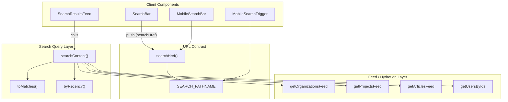
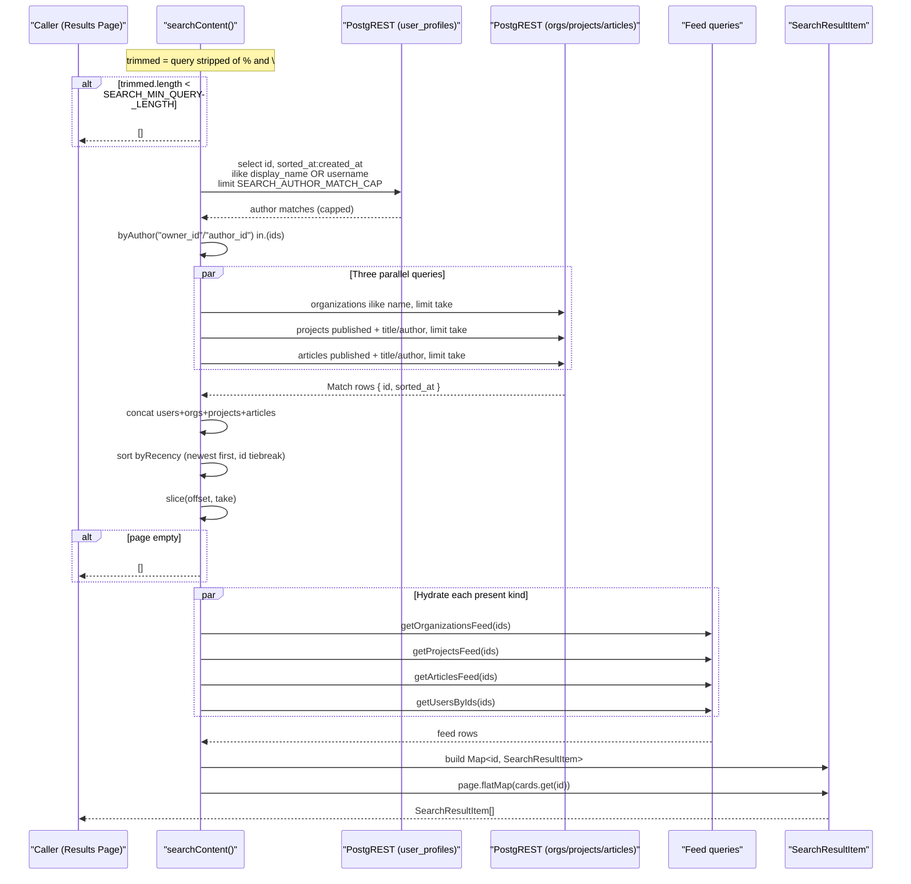
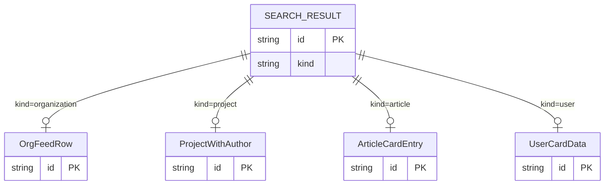
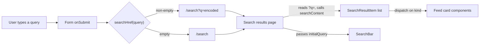

Keyword search across organisations, projects, articles and people, implemented as a merged, newest-first federated query hydrated by the platform's existing feed queries.

## Purpose and Scope

This page documents the **Search & Discovery** capability of the Ozeaon platform: how a user-supplied keyword is turned into a ranked, paginated, fully-hydrated list of mixed-entity results, and how the client-side search affordances (the URL contract, the desktop `SearchBar`, the results feed, and the mobile docking point) wire into it.

This page covers:

- The public entry point `searchContent()` and its federated match/merge/hydrate algorithm.
- The `SearchKind` / `SearchResultItem` result contract.
- The URL contract (`/search`, `?q=`, `searchHref()`).
- The `SearchBar` client component and its query-seeding behaviour.
- Configuration constants that bound page size, minimum query length, and author matching.
- The ranking, pagination and failure-handling semantics of the merged list.

This page intentionally leaves to sibling pages:

- The individual feed queries (`getArticlesFeed`, `getProjectsFeed`, `getOrganizationsFeed`, `getUsersByIds`) that this feature reuses for hydration — see the respective content/publishing pages.
- The card components (`ArticleCardEntry`, `ProjectWithAuthor`, `OrgFeedRow`, `UserCardData`) rendered from the hydrated result — see the UI/component pages.
- The Supabase client construction (`createPublicClient`) and row-level security model — see the data-access and security pages.

## Overview

Search is deliberately **not** a dedicated search index. Instead of adding a search backend (the lockfile does reference `@redis/search` transitively via the Redis client, but the application query path does not use it), Ozeaon implements search as a *federated keyword query* built directly on the same PostgREST queries that power the public feeds. The design bet is that at the platform's scale, per-entity `ilike` matches merged in memory are simpler and cheaper to operate than a separate index — and they return **exactly the same hydrated objects** the feed already knows how to render.

The result is a search feature with three cleanly separated concerns:

1. **Match** — each entity type is queried with a single `ilike` predicate over its searchable columns, projecting **only ids and a normalised sort date**.
2. **Merge** — all matches are combined, sorted globally newest-first, and sliced to the requested page.
3. **Hydrate** — the page's ids are handed to the *normal feed queries*, producing full-fidelity card data keyed by id, then re-ordered to preserve the merged ranking.

Key terminology used in the source:

| Term | Meaning |
|------|---------|
| **Kind** | One of `organization`, `project`, `article`, `user` — the entity type of a result (`SearchKind`). |
| **Match row** | A bare `{ id, sorted_at }` pair returned by a match query. |
| **Sorted at** | A per-entity date aliased to a common name so all kinds sort on one axis. |
| **Hydration** | Re-fetching matched ids through the full feed query to obtain renderable card objects. |
| **Author match** | An article/project matching because its owner/author matched the people query. |

The searchable fields, per the entry point doc comment, are: organisation **name**, project **title**, article **title**, and a profile's **display name or username**. Projects and articles *additionally* match on their **owner/author**, derived from the people matches.

## Architecture

The feature spans four layers: client components, the URL contract, the server-side query facade, and the reused feed/hydration queries.



**Why this shape:** `searchContent` performs no rendering work and knows nothing about components. It speaks only in ids and dates on the way in, and delegates *all* card shape production to the feed queries. `byRecency` implements the total ordering, and `toMatches` is the single point where a failed match query is logged and degraded to an empty array — localising error handling to one function. The client components talk only to the URL helper and the query entry point, never to the database directly.

## The Search Query Implementation

All search behaviour lives in [search.ts](https://github.com/ozeaon/ozeaon-v2/blob/0a4f1a95824db87782f1221a4108019d174df3d9/src/lib/supabase/queries/search.ts). The exported surface is a single function, `searchContent`, plus its options type.

### 1. Query normalisation and wildcard hardening

Before any database work, the raw query is trimmed and stripped of SQL wildcard metacharacters:

```typescript
// `%` and `\` are dropped before the length check, so a term of nothing but
// wildcards can't clear it and match every row. `_` stays: titles and display
// names contain it, and it only ever widens a match by a single character.
const trimmed = query.trim().replace(/[%\\]/g, "");
if (trimmed.length < SEARCH_MIN_QUERY_LENGTH) return [];
```

> Source: [search.ts](https://github.com/ozeaon/ozeaon-v2/blob/0a4f1a95824db87782f1221a4108019d174df3d9/src/lib/supabase/queries/search.ts#L76-L80)

The design intent is defensive: a query of `"%%%"` would otherwise expand to `ilike '%%%%%%'` and match **every row**. Stripping `%` and `\` *before* the `SEARCH_MIN_QUERY_LENGTH` check means a term made only of wildcards collapses to the empty string and is rejected by length. `_` is deliberately preserved because it legitimately appears in titles and display names and only ever widens a match by one character.

### 2. Building safe `ilike` filters

The search term is then embedded into PostgREST `or()` filter lists:

```typescript
// Quoted so a term holding `,` `(` `)` or `"` can't break out of an or() list.
const like = `"%${trimmed.replace(/"/g, '\\"')}%"`;
const or = (columns: string[], extra?: string) =>
  [
    ...columns.map((column) => `${column}.ilike.${like}`),
    ...(extra ? [extra] : []),
  ].join(",");
```

> Source: [search.ts](https://github.com/ozeaon/ozeaon-v2/blob/0a4f1a95824db87782f1221a4108019d174df3d9/src/lib/supabase/queries/search.ts#L87-L93)

The `like` value is wrapped in double quotes and any embedded `"` is escaped. This is required because PostgREST's `or=(...)` grammar uses `,` and parentheses as structural delimiters and quotes for literals — an unquoted term containing `,` or `(` would silently corrupt the filter list. The `or()` helper takes the column list plus an optional extra predicate expression, so callers can append the author-matching `in.(...)` clause alongside column matches in a single filter.

### 3. People matched first (the author anchor)

The user query runs **before** the other entities because its ids also drive author matching on projects and articles:

```typescript
// People first: their ids are what also makes an article or project match by
// author. Capped rather than taken to the current page, so the set below is
// the same on every page.
const authors = toMatches(
  "user",
  await supabase
    .from("user_profiles")
    .select("id, sorted_at:created_at")
    .or(or(["display_name", "username"]))
    .order("created_at", newestFirst)
    .limit(SEARCH_AUTHOR_MATCH_CAP),
);
```

> Source: [search.ts](https://github.com/ozeaon/ozeaon-v2/blob/0a4f1a95824db87782f1221a4108019d174df3d9/src/lib/supabase/queries/search.ts#L95-L106)

The critical detail is `limit(SEARCH_AUTHOR_MATCH_CAP)` rather than `limit(take)`. The author set must be **page-independent**, otherwise the author-based matches on projects and articles would change as the user pages deeper, breaking the global ordering invariant (explained in the ranking section). The trade-off is explicit: author matches are bounded by a fixed cap.

### 4. The three parallel entity queries

Organisations, projects and articles are then queried concurrently with `Promise.all`:

```typescript
const [organizations, projects, articles] = await Promise.all([
  supabase
    .from("organizations")
    .select("id, sorted_at:created_at")
    .or(or(["name"]))
    .order("created_at", newestFirst)
    .limit(take)
    .then((result) => toMatches("organization", result)),

  supabase
    .from("projects")
    .select("id, sorted_at:published_at")
    .eq("published", true)
    .or(or(["title"], byAuthor("owner_id")))
    .order("published_at", newestFirst)
    .limit(take)
    .then((result) => toMatches("project", result)),

  supabase
    .from("articles")
    .select("id, sorted_at:published_at")
    .eq("published", true)
    .or(or(["title"], byAuthor("author_id")))
    .order("published_at", newestFirst)
    .limit(take)
    .then((result) => toMatches("article", result)),
]);
```

> Source: [search.ts](https://github.com/ozeaon/ozeaon-v2/blob/0a4f1a95824db87782f1221a4108019d174df3d9/src/lib/supabase/queries/search.ts#L116-L142)

Several deliberate choices are visible here:

- **Projection is ids + a date alias only.** Every match query selects `id, sorted_at:<date>`, so the merged ranking can be computed without transferring card payloads for rows that may not survive the page slice.
- **Different date axes per entity** reflect the domain: organisations sort by `created_at`, projects and articles by `published_at` (aliased to `sorted_at`).
- **Projects and articles are gated on `published = true`**, so drafts and unpublished content never surface in search results.
- **Author matching is appended via the `extra` argument** of `or()` — `byAuthor("owner_id")` / `byAuthor("author_id")` produce an `in.(id,id,...)` predicate, omitted entirely when there were no author matches.
- **`limit(take)` where `take = offset + limit`.** Each entity is asked for the full range up to the current page, not just the page width — this is the key to exact paging, as explained below.

The `byAuthor` helper conditionally builds the author predicate:

```typescript
const byAuthor = (column: string) =>
  authors.length > 0
    ? `${column}.in.(${authors.map((author) => author.id).join(",")})`
    : undefined;
```

> Source: [search.ts](https://github.com/ozeaon/ozeaon-v2/blob/0a4f1a95824db87782f1221a4108019d174df3d9/src/lib/supabase/queries/search.ts#L108-L111)

## Core Flow: Match → Merge → Slice → Hydrate

The following sequence shows the full lifecycle of a single `searchContent` call.



The step order is not arbitrary. People must run first because their ids feed the author predicates. The entity queries must run before the merge, and the merge before hydration, because hydration is driven by the *surviving page ids only*. The final `flatMap` over the page (rather than over the hydration results) is what guarantees the merged order survives.

### Ranking: the total ordering

```typescript
/** Newest first, with a stable id tiebreak so pages never overlap or gap. */
function byRecency(a: Match, b: Match) {
  const aTime = a.sorted_at ? Date.parse(a.sorted_at) : 0;
  const bTime = b.sorted_at ? Date.parse(b.sorted_at) : 0;
  if (aTime !== bTime) return bTime - aTime;
  return a.id < b.id ? -1 : 1;
}
```

> Source: [search.ts](https://github.com/ozeaon/ozeaon-v2/blob/0a4f1a95824db87782f1221a4108019d174df3d9/src/lib/supabase/queries/search.ts#L45-L51)

Ranking is purely recency-based — there is **no relevance scoring**. Two design details matter:

- **Missing dates sort last.** An unset date yields `0`, so it falls to the end. This mirrors the database side's `.order(..., { ascending: false, nullsFirst: false })`, meaning the in-memory and database orderings agree.
- **The id tiebreak makes the order *total*.** Without it, rows sharing a timestamp could appear in different relative positions across separate page requests, causing items to be *duplicated* or *skipped* between pages. The `a.id < b.id ? -1 : 1` comparator is a deterministic, stable secondary key.

The ordering config is shared:

```typescript
// Nulls last so an unset date sorts the same way here as it does in byRecency.
const newestFirst = { ascending: false, nullsFirst: false } as const;
```

> Source: [search.ts](https://github.com/ozeaon/ozeaon-v2/blob/0a4f1a95824db87782f1221a4108019d174df3d9/src/lib/supabase/queries/search.ts#L84-L85)

### Why paging is exact: asking for `offset + limit` per entity

The correctness argument is captured in the entry point's doc comment:

> Asking every entity for the full range up to this page keeps paging exact: the global newest-first slice can only hold rows from each entity's own slice. That holds only while each entity's match predicate is page-independent, which is why the author filter draws on a fixed cap of profile matches rather than the current page's worth.

> Source: [search.ts](https://github.com/ozeaon/ozeaon-v2/blob/0a4f1a95824db87782f1221a4108019d174df3d9/src/lib/supabase/queries/search.ts#L53-L70)

The reasoning: the global newest-first page `[offset, offset+limit)` can only contain rows that are themselves within the top `offset + limit` of their own entity. So fetching `take = offset + limit` from each entity is **sufficient** — no relevant row is missed. This only holds if the predicate itself doesn't shift with the page. That's precisely why the author set is capped at `SEARCH_AUTHOR_MATCH_CAP` and *sliced for people results* rather than being re-fetched per page; if it were derived from the current page's authors, deeper pages would match against a different author set and the invariant would break.

The people results, being drawn from that capped set, therefore **run out at the cap**:

```typescript
// People results page through the capped set, so they run out at the cap.
const users = authors.slice(0, take);
```

> Source: [search.ts](https://github.com/ozeaon/ozeaon-v2/blob/0a4f1a95824db87782f1221a4108019d174df3d9/src/lib/supabase/queries/search.ts#L113-L114)

## Hydration: reusing the feed queries

Once the page slice is known, ids are grouped by kind and each non-empty group is hydrated through its normal feed query:

```typescript
const idsOf = (kind: SearchKind) =>
  page.filter((match) => match.kind === kind).map((match) => match.id);
const [orgIds, projectIds, articleIds, userIds] = [
  idsOf("organization"),
  idsOf("project"),
  idsOf("article"),
  idsOf("user"),
];

// Each hydration is skipped when the page holds none of that kind, since an
// empty `ids` filter would fetch the unfiltered feed instead.
const [orgRows, projectRows, articleRows, userRows] = await Promise.all([
  orgIds.length > 0
    ? getOrganizationsFeed({ client: supabase, ids: orgIds, limit: orgIds.length, offset: 0 })
    : [],
  projectIds.length > 0
    ? getProjectsFeed({ ids: projectIds, limit: projectIds.length })
    : [],
  articleIds.length > 0
    ? getArticlesFeed({ ids: articleIds, limit: articleIds.length })
    : [],
  getUsersByIds(userIds),
]);
```

> Source: [search.ts](https://github.com/ozeaon/ozeaon-v2/blob/0a4f1a95824db87782f1221a4108019d174df3d9/src/lib/supabase/queries/search.ts#L150-L177)

Two subtle, load-bearing decisions:

1. **Empty id lists are never passed to feed queries.** The comment is explicit: an empty `ids` filter would be interpreted as *no filter* and would fetch the entire unfiltered feed — a correctness bug *and* a performance hazard. The `: []` fallbacks guard this.
2. **`limit` is set to `ids.length`** so the feed returns at most exactly the requested ids, and hydration runs for all four kinds in parallel.

Hydration output is indexed into a `Map<id, SearchResultItem>` so lookup is O(1), then the merged page order is reapplied:

```typescript
const cards = new Map<string, SearchResultItem>([
  ...orgRows.map((org) => [org.id, { id: org.id, kind: "organization", organization: org }] as const),
  ...projectRows.map((project) => [project.id, { id: project.id, kind: "project", project }] as const),
  ...articleRows.map((article) => [article.id, { id: article.id, kind: "article", article }] as const),
  ...userRows.map((user) => [user.id, { id: user.id, kind: "user", user }] as const),
]);

// Keeps the merged order, dropping anything hydration didn't return.
return page.flatMap((match) => cards.get(match.id) ?? []);
```

> Source: [search.ts](https://github.com/ozeaon/ozeaon-v2/blob/0a4f1a95824db87782f1221a4108019d174df3d9/src/lib/supabase/queries/search.ts#L179-L201)

The final `flatMap` is what enforces ranking: iterating `page` (the ranking) and looking each id up by map means the output order is exactly the merged ranking. Any id hydration failed to return is silently dropped (`?? []`) — a graceful degradation that keeps search results rendering even if one entity's feed query fails.

## Data Model: the result contract

The result type is a discriminated union on `kind`, where each variant wraps the **exact** object shape the corresponding full-width feed card already consumes:

```typescript
/** Hydrated result, carrying the exact shape each full-width card already expects. */
export type SearchResultItem =
  | { id: string; kind: "organization"; organization: OrgFeedRow }
  | { id: string; kind: "project"; project: ProjectWithAuthor }
  | { id: string; kind: "article"; article: ArticleCardEntry }
  | { id: string; kind: "user"; user: UserCardData };

export type SearchKind = SearchResultItem["kind"];
```

> Source: [search.ts](https://github.com/ozeaon/ozeaon-v2/blob/0a4f1a95824db87782f1221a4108019d174df3d9/src/types/search.ts#L6-L13)

This is the central design decision of the feature: **search results are not a bespoke type**. Because hydration goes through the standard feed queries, the result union reuses `OrgFeedRow`, `ProjectWithAuthor`, `ArticleCardEntry`, and `UserCardData` directly. The rendering layer can therefore dispatch on `kind` and hand each variant to the same card component the corresponding feed page already uses — no adapter, no duplicated card markup, and no drift between feed and search presentation.



The internal match pipeline uses a lighter type that projects only ids and dates:

```typescript
/** Every match query selects its id and aliases its own date to `sorted_at`. */
type MatchRow = {
  id: Tables<"user_profiles">["id"];
  sorted_at: Tables<"articles">["published_at"];
};

/** A matched row — enough to order the merged list and look its card up after. */
type Match = { kind: SearchKind } & MatchRow;
```

> Source: [search.ts](https://github.com/ozeaon/ozeaon-v2/blob/0a4f1a95824db87782f1221a4108019d174df3d9/src/lib/supabase/queries/search.ts#L24-L31)

`MatchRow` is the minimal projection for ranking (`id` + normalised date); `Match` merely tags it with its `kind`. This separation is what lets the merge operate on tiny rows and defer the expensive card hydration to the surviving page only.

## Usage Examples

### Basic: calling `searchContent`

```typescript
import { searchContent } from "@/lib/supabase/queries/search";

// Default page: SEARCH_PAGE_LIMIT results from offset 0.
const results = await searchContent({ query: "climate" });
```

> Source: [search.ts](https://github.com/ozeaon/ozeaon-v2/blob/0a4f1a95824db87782f1221a4108019d174df3d9/src/lib/supabase/queries/search.ts#L71-L75)

### Paged: supplying `limit` and `offset`

```typescript
type SearchOptions = {
  query: string;
  limit?: number;
  offset?: number;
};
```

> Source: [search.ts](https://github.com/ozeaon/ozeaon-v2/blob/0a4f1a95824db87782f1221a4108019d174df3d9/src/lib/supabase/queries/search.ts#L18-L22)

Both `limit` and `offset` are optional. `limit` defaults to `SEARCH_PAGE_LIMIT` and `offset` defaults to `0`; internally `take = offset + limit` determines how much of each entity's match set is fetched.

### Building a search link

```typescript
/** The results page, which the mobile nav docks its search field on. */
export const SEARCH_PATHNAME = "/search";

/** Destination for a submitted search box — bare `/search` when the query is empty. */
export function searchHref(query: string) {
  const trimmed = query.trim();
  return trimmed
    ? `${SEARCH_PATHNAME}?q=${encodeURIComponent(trimmed)}`
    : SEARCH_PATHNAME;
}
```

> Source: [search.ts](https://github.com/ozeaon/ozeaon-v2/blob/0a4f1a95824db87782f1221a4108019d174df3d9/src/utils/url/search.ts#L1-L10)

`searchHref` is the single source of truth for the search URL contract. It trims the query, encodes it into the `?q=` parameter, and collapses an empty query to the bare `/search` path — so submitting an empty box navigates to the search page rather than producing a dangling `?q=`.

### The desktop `SearchBar` component

```tsx
export function SearchBar({ initialQuery, className }: SearchBarProps) {
  const router = useRouter();
  const searchParams = useSearchParams();
  const [value, setValue] = useState(
    initialQuery ?? searchParams.get("q") ?? "",
  );

  return (
    <form
      role="search"
      className={cn("w-full max-w-80", className)}
      onSubmit={(event) => {
        event.preventDefault();
        router.push(searchHref(value));
      }}
    >
      <SearchInput ... />
    </form>
  );
}
```

> Source: [SearchBar.tsx](https://github.com/ozeaon/ozeaon-v2/blob/0a4f1a95824db87782f1221a4108019d174df3d9/src/components/search/SearchBar.tsx#L16-L31)

Note the controlled-input seeding precedence: `initialQuery` (explicit server-rendered value) wins over the `?q=` search param, which wins over the empty string. This lets the search page pass exactly what it rendered, avoiding a hydration mismatch where the client would otherwise read a stale or absent `?q=`. Submission is a full navigation via `router.push(searchHref(value))` — the search field does **not** issue the query itself; the results page does.

The `SearchBarProps` contract documents the seeding intent:

```typescript
interface SearchBarProps {
  /** Seeds the box, overriding `?q=` — the search page passes what it rendered. */
  initialQuery?: string;
  className?: string;
}
```

> Source: [SearchBar.tsx](https://github.com/ozeaon/ozeaon-v2/blob/0a4f1a95824db87782f1221a4108019d174df3d9/src/components/search/SearchBar.tsx#L10-L14)

The input uses `type="search"` with `autoComplete="off"`, hides the native WebKit cancel button (`[&::-webkit-search-cancel-button]:hidden`), and renders a custom clear button as a `trailing` slot only when the field is non-empty:

```tsx
trailing={
  value && (
    <button
      type="button"
      onClick={() => setValue("")}
      aria-label="Clear search"
      className="hover:text-primary transition-colors"
    >
      <X className="size-4" />
    </button>
  )
}
```

> Source: [SearchBar.tsx](https://github.com/ozeaon/ozeaon-v2/blob/0a4f1a95824db87782f1221a4108019d174df3d9/src/components/search/SearchBar.tsx#L44-L55)

## URL Contract and Navigation Model

Search is a **URL-driven** feature: the query lives in `?q=` and the results page reads it, so results are shareable, bookmarkable, and work with browser back/forward.



The `SEARCH_PATHNAME` constant (`/search`) is also the docking anchor for the mobile navigation — the mobile nav renders its search field on the results page. Mobile entry points are the `MobileSearchTrigger` (nav) and `MobileSearchBar` components, both of which converge on the same `searchHref`/`SEARCH_PATHNAME` contract as the desktop bar, so desktop and mobile share one navigation model rather than diverging.

## Configuration Options

Search is tuned by three constants imported from `@/config/constants` at the top of the query module:

```typescript
import {
  SEARCH_AUTHOR_MATCH_CAP,
  SEARCH_MIN_QUERY_LENGTH,
  SEARCH_PAGE_LIMIT,
} from "@/config/constants";
```

> Source: [search.ts](https://github.com/ozeaon/ozeaon-v2/blob/0a4f1a95824db87782f1221a4108019d174df3d9/src/lib/supabase/queries/search.ts#L1-L5)

| Constant | Type | Role | Effect |
|----------|------|------|--------|
| `SEARCH_PAGE_LIMIT` | `number` | Default `limit` for `searchContent` | Results per page when the caller passes no `limit`. |
| `SEARCH_MIN_QUERY_LENGTH` | `number` | Minimum effective query length | Queries shorter than this (after stripping `%`/`\`) short-circuit to `[]`. |
| `SEARCH_AUTHOR_MATCH_CAP` | `number` | Cap on matched profiles | Bounds the author set used for project/article author matching **and** the total number of people results. |

The `SearchOptions` values are themselves the per-call configuration:

| Option | Type | Default | Description |
|--------|------|---------|-------------|
| `query` | `string` | — (required) | User keyword; trimmed and stripped of `%`/`\` before use. |
| `limit` | `number` | `SEARCH_PAGE_LIMIT` | Maximum results returned for the page. |
| `offset` | `number` | `0` | Zero-based start index into the merged ranking. |

**Design note on `SEARCH_AUTHOR_MATCH_CAP`:** it serves double duty and creates a boundary users can observe. It caps the author predicate (keeping paging exact) *and*, because people results are drawn from the same set, it is the point at which **user results stop appearing** no matter how deep the caller pages. Raising it widens both author-matching coverage and the number of reachable people results, at the cost of a longer `in.(...)` list and a larger capped fetch on every search request.

## API Reference

### `searchContent(options: SearchOptions): Promise<SearchResultItem[]>`

Keyword search across organisations, projects, articles and people.

**Parameters:**

- `options.query` (`string`): The user keyword. Trimmed, and `%` and `\` removed, before the length check. If the resulting string is shorter than `SEARCH_MIN_QUERY_LENGTH`, the function returns `[]` immediately.
- `options.limit` (`number`, optional): Page size. Defaults to `SEARCH_PAGE_LIMIT`.
- `options.offset` (`number`, optional): Zero-based offset into the merged newest-first ranking. Defaults to `0`.

**Returns:** A `Promise<SearchResultItem[]>` preserving the merged newest-first order, containing only rows hydration returned. Returns `[]` when the query fails the minimum-length check or when the merged page slice is empty.

**Throws:** The function does **not** throw on individual match-query failures — those are caught inside `toMatches` and degrade to empty arrays. It uses `createPublicClient()` so it operates against the public (RLS-scoped) view of the data.

**Behavioural contract:**

- Only `published = true` projects and articles are returned.
- Searchable fields: organisation `name`; project `title`; article `title`; profile `display_name` and `username`.
- Projects additionally match on `owner_id` and articles on `author_id` when those ids appear in the capped profile match set.
- The global order is recency (unset dates last) with a stable id tiebreak.

### `toMatches(kind, result): Match[]`

Internal helper that maps a PostgREST response to kind-tagged matches.

```typescript
function toMatches(
  kind: SearchKind,
  { data, error }: PostgrestResponse<MatchRow>,
): Match[] {
  if (error) {
    logError(logger, "searchContent match query failed", error, { kind });
    return [];
  }

  return (data ?? []).map((row) => ({ kind, ...row }));
}
```

> Source: [search.ts](https://github.com/ozeaon/ozeaon-v2/blob/0a4f1a95824db87782f1221a4108019d174df3d9/src/lib/supabase/queries/search.ts#L33-L43)

**Parameters:** `kind` (`SearchKind`) — the entity type to tag; the destructured PostgREST response containing `data` and `error`.

**Returns:** `Match[]` — kind-tagged rows, or `[]` on error or when `data` is null.

**Side effects:** On error, logs via `logError(logger, "searchContent match query failed", error, { kind })` and swallows the error. This is the single funnel through which every match failure is handled, so a failure in any one entity degrades that entity to no results without failing the whole search.

### `byRecency(a, b): number`

Internal comparator implementing the newest-first, id-tiebreak total order.

**Parameters:** `a`, `b` (`Match`).

**Returns:** negative, zero, or positive per standard comparator semantics; note the comparator returns `-1`/`1` on the tiebreak path rather than `0`, since ids are unique.

### `searchHref(query: string): string`

Builds the results URL for a submitted search box.

**Parameters:** `query` (`string`) — raw, untrimmed user input.

**Returns:** `/search?q=<encoded>` for a non-empty (after trim) query, or `/search` for an empty one. Uses `encodeURIComponent` for the parameter value.

> Source: [search.ts](https://github.com/ozeaon/ozeaon-v2/blob/0a4f1a95824db87782f1221a4108019d174df3d9/src/utils/url/search.ts#L4-L10)

## Failure Modes, Edge Cases & Concurrency

### Wildcard injection and degenerate queries

The `%`/`\` stripping plus the pre-length-check ordering is the defence against a wildcard-only query matching every row. Without it, a crafted `%%%` query would expand to an unbounded `ilike` match. `_` is intentionally allowed (single-character widening only). Note the trade-off: a user genuinely searching for a literal `%` or `\` character cannot — those are removed from the term rather than escaped.

### Filter-list breakout

Because the term is embedded in a PostgREST `or()` string, unescaped `,`, `(`, `)`, or `"` would alter the filter grammar. The `like` value is double-quoted with embedded `"` escaped, neutralising this. This is a correctness and injection-safety concern handled at string-construction time rather than via parameter binding, because PostgREST filter strings are part of the URL.

### Partial failure of match queries

Each of the four match queries is wrapped by `toMatches`. If any one fails, it logs and returns `[]`, so search still returns the entities that succeeded. There is no retry, no throw, and no user-visible error path from the query layer — the failure is observable only through the logger.

### Empty-page short-circuit

After the merged slice, `if (page.length === 0) return [];` avoids issuing four hydration queries for an empty page. This matters both for latency and because empty hydration calls are exactly the case that would otherwise fetch unfiltered feeds.

### The empty-`ids` hazard

The most important edge case is documented inline: an empty `ids` filter on a feed query does **not** mean "no results" — it means "no filter", i.e. the entire feed. The code guards every hydration by checking `ids.length > 0` before calling. `getUsersByIds(userIds)` is called unconditionally, which implies it handles an empty id list safely.

### Duplicate-id collision in the hydration map

The `cards` map is keyed by **bare id**, not by `kind + id`. If an organisation and a project ever shared an id value, one entry would overwrite the other in the map. Given the union's discriminant is intended to be the kind, this relies on ids being unique across entity types (UUID semantics).

### Pagination stability under concurrent writes

The total order (`byRecency` with id tiebreak) plus the fixed author cap is what makes pages non-overlapping and gap-free. Under concurrent inserts, a newly created row can shift the global ranking between page requests — the standard offset-pagination caveat — but the deterministic comparator at least guarantees that a *static* dataset pages exactly, with no duplicates or omissions.

### Concurrency of the parallel fan-out

The three entity queries execute concurrently via `Promise.all`, and the four hydrations likewise. There is no shared mutable state between them; the author query is the only sequential dependency (it must precede the entity queries). Total latency is therefore roughly the author query plus the slower of two parallel rounds, rather than the sum of all queries.

## Performance & Operational Considerations

- **Two network rounds.** Round one: the author query, then the three parallel entity queries. Round two: the four parallel hydrations. The author query is sequential because its result parameterises the entity predicates.
- **Minimal transfer on the match path.** Match queries project only `id` + one date, so the size of the merged candidate set is small relative to hydrating every candidate's card.
- **Bounded work per request.** Every query is `.limit(...)`-bounded: `take` for entities, `SEARCH_AUTHOR_MATCH_CAP` for authors. There is no unbounded scan.
- **`ilike` without a prefix.** Because the pattern is `%term%`, PostgREST/Postgres cannot use a leading-prefix btree index for these predicates; the cost of `ilike` scans grows with table size. The design compensates by bounding row counts and projecting few columns rather than by indexing — a deliberate simplicity trade-off appropriate to the platform's scale.
- **No caching layer.** Every `searchContent` call hits the database. The transitive `@redis/search` entry in the lockfile reflects the Redis client's bundled module, not an application search path.
- **Hydration fan-out is op-count-bound.** Exactly four feed queries run per non-empty page regardless of page size, since each uses `limit: ids.length`.

## Extension Points

The feature is structured so that new entity types can be added without redesigning the pipeline:

1. **Add a `SearchKind` variant** to `SearchResultItem` in `search.ts`, wrapping the new entity's existing feed row type.
2. **Add a match query** to the `Promise.all` block, projecting `id, sorted_at:<date>` and using the shared `or()` helper for its searchable columns. Apply `byAuthor(...)` if the entity has an owner/author.
3. **Add a hydration branch** to the second `Promise.all`, guarded by `ids.length > 0`, mapping rows into the `cards` map under the appropriate `kind`.

Because `byRecency` is kind-agnostic (it only reads `sorted_at` and `id`) and the final `flatMap` is driven by the page slice, no change to the ranking or ordering logic is needed. Searchable columns are not centralised — they are declared per query in the `or([...])` call — so there is no single list to update.

Client-side extension is similarly localised: any new navigation affordance links via `searchHref()` and reads `?q=` on the results page, inheriting the existing URL contract.

## Related Links

- Query implementation: [src/lib/supabase/queries/search.ts](https://github.com/ozeaon/ozeaon-v2/blob/0a4f1a95824db87782f1221a4108019d174df3d9/src/lib/supabase/queries/search.ts)
- Result contract: [src/types/search.ts](https://github.com/ozeaon/ozeaon-v2/blob/0a4f1a95824db87782f1221a4108019d174df3d9/src/types/search.ts)
- URL helpers: [src/utils/url/search.ts](https://github.com/ozeaon/ozeaon-v2/blob/0a4f1a95824db87782f1221a4108019d174df3d9/src/utils/url/search.ts)
- Desktop search bar: [src/components/search/SearchBar.tsx](https://github.com/ozeaon/ozeaon-v2/blob/0a4f1a95824db87782f1221a4108019d174df3d9/src/components/search/SearchBar.tsx)
- Mobile search bar: [src/components/search/MobileSearchBar.tsx](https://github.com/ozeaon/ozeaon-v2/blob/0a4f1a95824db87782f1221a4108019d174df3d9/src/components/search/MobileSearchBar.tsx)
- Mobile search trigger: [src/components/nav/components/MobileSearchTrigger.tsx](https://github.com/ozeaon/ozeaon-v2/blob/0a4f1a95824db87782f1221a4108019d174df3d9/src/components/nav/components/MobileSearchTrigger.tsx)
- Results feed: [src/components/search/SearchResultsFeed.tsx](https://github.com/ozeaon/ozeaon-v2/blob/0a4f1a95824db87782f1221a4108019d174df3d9/src/components/search/SearchResultsFeed.tsx)
- Shared input primitives: [src/components/ui/inputs/SearchInput.tsx](https://github.com/ozeaon/ozeaon-v2/blob/0a4f1a95824db87782f1221a4108019d174df3d9/src/components/ui/inputs/SearchInput.tsx)

Sibling catalog pages: see the Articles, Projects and Organisations feature pages for the feed queries reused during hydration, and the component pages for the card types carried by `SearchResultItem`.
