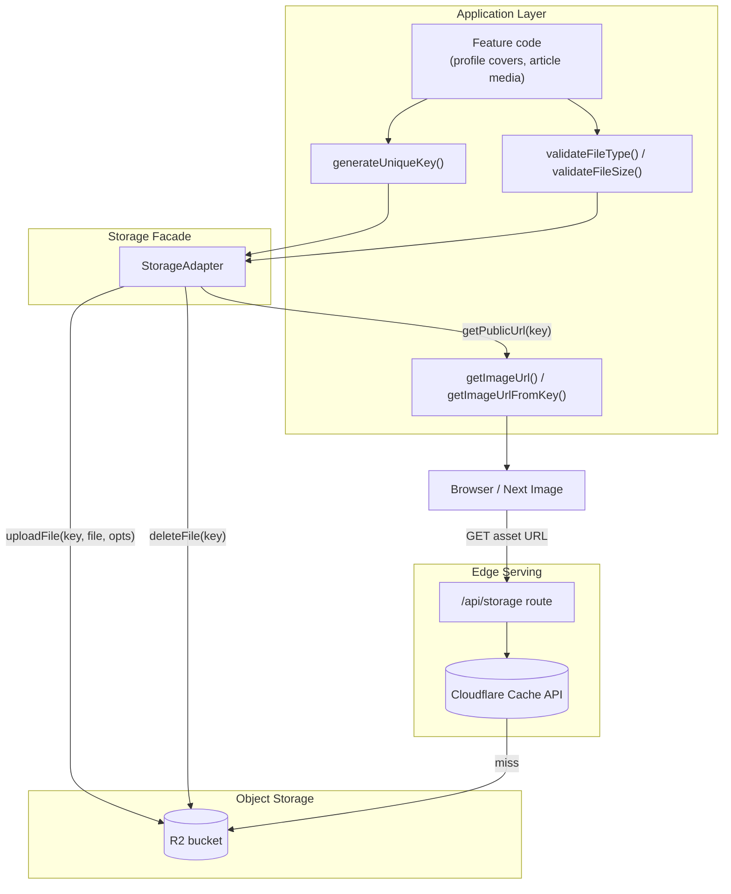
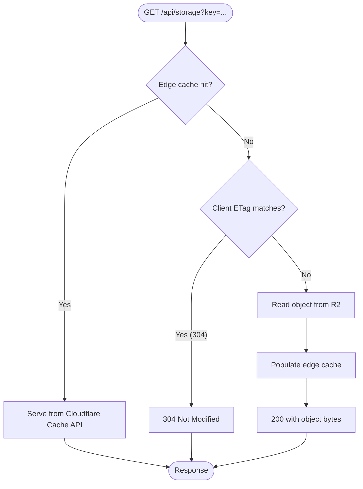
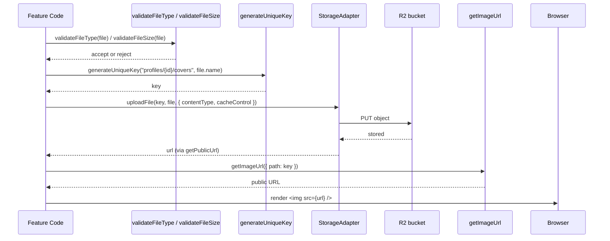

This page documents how Ozeaon stores, serves, and references binary media assets — file uploads, profile images, article covers, and other attachments — using an R2-compatible object storage backend exposed through a `StorageAdapter` abstraction.

## Purpose and Scope

This page covers the **storage and media-serving subsystem**: the `StorageAdapter` upload/delete/public-URL API, the key-generation and validation helpers (`generateUniqueKey`, `validateFileType`, `validateFileSize`), the image-URL helpers (`getImageUrl`, `getImageUrlFromKey`), and the caching behavior of the `/api/storage` route.

Related topics are intentionally left to sibling pages:

- For environment configuration, deployment topology, and CSP/security headers, see the deployment and operations documentation.
- For the database schema that references stored media keys, see the database schema documentation.
- For form-level behavior that embeds these uploads (e.g. article covers, profile edits), see the article-form and component-library documentation.

> **Coverage note.** This page is built from the repository's first-party storage notes (`docs/r2-storage.md`) and the storage-host content-security-policy wiring in `next.config.ts`. The full implementation of `@/lib/storage/adapter` and `@/utils/url/image` lives under `src/` and was not read during the writing of this page; the descriptions below are anchored to the documented public surface. Where internal behavior is not evidenced in the read sources, it is explicitly marked as **not evidenced in source**.

## Overview

Ozeaon treats media as **objects in a blob store, not rows in the database**. Every uploaded asset is written to an R2-style object store under a generated, collision-resistant key, and the database (or application code) persists only that key. Rendering code then converts the key back into a URL through a single image-URL helper.

This key-based indirection is the central design decision of the subsystem, and it buys three things:

1. **A single source of truth for asset locations.** Application code never concatenates storage hosts or paths by hand; it calls `getImageUrl` / `getImageUrlFromKey`, so a change to the CDN host or bucket layout is a one-file change.
2. **Cache-friendly, immutable URLs.** Uploads are written with long-lived `immutable` cache headers, which is only safe because keys are unique per upload rather than reused per entity. A new cover image produces a new key, so cached responses never go stale.
3. **Uniform validation.** File-type and file-size policy is applied through shared helpers rather than at each call site.

### Key Concepts

| Concept | Meaning |
| --- | --- |
| **Key** | The object-store path for an asset, e.g. `profiles/{userId}/covers/<unique>-<filename>`. This is the durable reference stored/held by the app. |
| **`StorageAdapter`** | The facade over the object store. Exposes `uploadFile`, `deleteFile`, and `getPublicUrl`. |
| **Public URL** | The externally reachable URL for a key, produced by `StorageAdapter.getPublicUrl(key)` or by the image helpers. |
| **`/api/storage`** | The file-serving route that fronts the bucket with edge caching. |
| **`STORAGE_HOSTS`** | Build-time constant injected into the Content-Security-Policy so the browser is allowed to load media from the storage host. |

## Architecture

The subsystem has three layers: application code that produces and consumes keys, a storage facade that talks to the object store, and an edge-cached serving path that delivers bytes to browsers.



**Why this shape.** Uploads are deliberately funneled through one facade (`StorageAdapter`) so the upload call sites stay two lines long: generate a key, then hand the bytes to the adapter with an explicit `contentType` and `cacheControl`. Reads go through a different path (`/api/storage`) because they have a completely different performance profile — reads are hot, cacheable, and browser-facing, whereas writes are rare and authenticated.

## The Upload Path

Uploading is a three-step sequence: **validate → generate a unique key → hand bytes to the adapter**. The documented usage in `docs/r2-storage.md` is the canonical example and shows all three steps plus the metadata the adapter expects.

```typescript
import { StorageAdapter } from "@/lib/storage/adapter";
import { generateUniqueKey, validateFileType, validateFileSize } from "@/utils";
import { getImageUrl, getImageUrlFromKey } from "@/utils/url/image";

// Upload
const key = generateUniqueKey(`profiles/${userId}/covers`, file.name);
await StorageAdapter.uploadFile(key, file, {
  contentType: file.type,
  cacheControl: "public, max-age=31536000, immutable",
});

// Get URL & Delete
const url = StorageAdapter.getPublicUrl(key);
await StorageAdapter.deleteFile(key);

// Get URL to display/download file
const urlFromFile = getImageUrl({ path: key });

const urlFromPath_1 = getImageUrl(key);
const urlFromPath_2 = getImageUrlFromKey(key);
```

> Source: [r2-storage.md](https://github.com/ozeaon/ozeaon-v2/blob/0a4f1a95824db87782f1221a4108019d174df3d9/docs/r2-storage.md#L1-L26)

### Step 1 — Key generation

`generateUniqueKey(prefix, filename)` composes a namespaced, collision-resistant key. The prefix is a logical folder — in the example, everything for a user's cover images lives under `profiles/{userId}/covers` — while the function is responsible for making the final segment unique.

**Design intent.** Two properties matter here:

- **Namespace by owner.** Prefixing with `profiles/{userId}/...` keeps a user's assets grouped, which makes bulk operations (account deletion, per-user auditing) tractable, and it makes accidental cross-user overwrites impossible as long as the prefix is derived from the authenticated principal.
- **Uniqueness over reuse.** Because the key is unique per upload rather than stable per entity, the paired `immutable` cache header is correct: a URL identifies exactly one version of one asset forever.

`generateUniqueKey` and the validators are re-exported from the `@/utils` barrel, which is why the import is a single statement rather than three deep paths.

### Step 2 — Validation

`validateFileType` and `validateFileSize` are imported alongside the key generator and are part of the same utility barrel. In the documented flow they are available at the same call site as the upload, which is the intended pattern: **validate before touching storage**.

**Design intent.** Validation is split into two independent predicates rather than one combined `validateFile`, so callers can apply type and size policy independently — for example, rejecting oversized images with a different user-facing message than an unsupported MIME type. Applying validation before `uploadFile` also means a rejected file never consumes a storage write.

> **Not evidenced in source.** The specific allowed MIME types, the maximum byte size, and the exception/return shape of these validators are defined in `@/utils` and were not read for this page. Consult `src/utils` for the authoritative rules.

### Step 3 — `StorageAdapter.uploadFile`

`StorageAdapter.uploadFile(key, file, options)` takes the key, the file, and an options object. The documented options are:

| Option | Value used in example | Purpose |
| --- | --- | --- |
| `contentType` | `file.type` | Explicit MIME type for the stored object, so the serving path can return a correct `Content-Type` without sniffing. |
| `cacheControl` | `"public, max-age=31536000, immutable"` | One-year immutable caching, safe because keys are unique. |

Passing `contentType` explicitly rather than relying on the adapter to infer it from the filename is deliberate: filenames are user-controlled and unreliable, while `file.type` comes from the browser's own type detection on the `File` object.

The `1 year + immutable` combination is the aggressive end of HTTP caching and is only defensible in a key-per-upload model. It also means **asset replacement must not overwrite a key** — overwriting would leave clients serving the stale object for up to a year.

## The Read Path and Edge Caching

Reads are served by the `/api/storage` route, which is documented as a three-tier cache chain:

```
Cloudflare Cache API → ETag 304 → R2 read
```

> Source: [r2-storage.md](https://github.com/ozeaon/ozeaon-v2/blob/0a4f1a95824db87782f1221a4108019d174df3d9/docs/r2-storage.md#L26)



Each tier exists for a different reason:

1. **Cloudflare Cache API** absorbs the bulk of traffic at the edge, so repeat requests for the same asset never traverse to the origin worker or the bucket. This is the tier that makes the media path cheap at scale.
2. **ETag / `304 Not Modified`** handles conditional requests from browsers that already hold the bytes. A revalidation costs a round trip but transfers no body, which matters most for large covers on repeat page loads.
3. **R2 read** is the last resort and the only tier that costs object-storage egress.

**Design intent.** Ordering the cache before the ETag check is the key decision: a warm edge cache can answer with bytes directly, and only a cold edge frame needs to fall through to conditional revalidation. Combined with the `immutable` cache header written at upload time, the common case (second and later visitors of a page) is served entirely from the edge.

**Not evidenced in source.** The `/api/storage` route's authentication/authorization policy, its query-parameter shape, and whether it supports range requests were not read for this page.

## Consuming Keys: The Image URL Helpers

Application code holds **keys**, not URLs. To render an asset it calls one of the three documented equivalences:

```typescript
// Object-argument form
const urlFromFile = getImageUrl({ path: key });

// Bare-string form
const urlFromPath_1 = getImageUrl(key);
const urlFromPath_2 = getImageUrlFromKey(key);
```

> Source: [r2-storage.md](https://github.com/ozeaon/ozeaon-v2/blob/0a4f1a95824db87782f1221a4108019d174df3d9/docs/r2-storage.md#L19-L23)

Three call shapes exist for the same conceptual operation, which reflects two distinct call-site needs:

- **`getImageUrl({ path: key })`** — the object form. This is the shape to prefer for new code because it is extensible: additional options (transform width/quality, fit mode, format) can be added to the options object without changing the call sites.
- **`getImageUrl(key)`** — the shorthand for the common case where no options are needed.
- **`getImageUrlFromKey(key)`** — an explicit, self-documenting alias that makes it unambiguous at the call site that the argument is a storage key rather than a path or a URL.

This is the counterpart to `StorageAdapter.getPublicUrl(key)`: both turn a key into a displayable URL, and the "get URL & Delete" line in the documented flow shows they are interchangeable in practice.



## Deletion

Deletion is a single adapter call keyed by the same key used for the upload:

```typescript
await StorageAdapter.deleteFile(key);
```

> Source: [r2-storage.md](https://github.com/ozeaon/ozeaon-v2/blob/0a4f1a95824db87782f1221a4108019d174df3d9/docs/r2-storage.md#L17)

**Design intent.** Because the key is the only handle to the object and the bucket is the only copy, `deleteFile` is the complete removal operation — there is no secondary index or CDN purge step in the documented flow. This is consistent with the immutable-key model: deleting and re-uploading the same logical asset yields a *new* key, so there is no cache-invalidation problem to solve.

Two operational consequences follow from this and should be considered by any feature that stores keys:

- **Dangling references.** If a database row holds a key and the object is deleted (or never written because upload failed), the read path will fail. The database column holding the key is a soft reference, not a foreign key into the bucket.
- **Orphans.** Conversely, deleting the database row without calling `deleteFile` leaves an unreferenced object in the bucket. Any account-deletion or cleanup flow must delete objects explicitly using the recorded keys.

## Configuration

| Setting | Where it appears | Evidence |
| --- | --- | --- |
| `STORAGE_HOSTS` | Interpolated into the `img-src` directive of the Content-Security-Policy in `next.config.ts` | [next.config.ts](https://github.com/ozeaon/ozeaon-v2/blob/0a4f1a95824db87782f1221a4108019d174df3d9/next.config.ts#L77-L78) |
| `img-src 'self' data: blob: ${STORAGE_HOSTS}` | CSP header | [next.config.ts](https://github.com/ozeaon/ozeaon-v2/blob/0a4f1a95824db87782f1221a4108019d174df3d9/next.config.ts#L77-L78) |
| `media-src 'self'` | CSP header — restricts `<audio>`/`<video>` sources to same-origin | [next.config.ts](https://github.com/ozeaon/ozeaon-v2/blob/0a4f1a95824db87782f1221a4108019d174df3d9/next.config.ts#L90) |
| `worker-src 'self' blob:` / `child-src 'self'` | CSP header | [next.config.ts](https://github.com/ozeaon/ozeaon-v2/blob/0a4f1a95824db87782f1221a4108019d174df3d9/next.config.ts#L91-L92) |

The CSP wiring is important and easy to get wrong: **any host that serves media must be listed in `STORAGE_HOSTS`**, otherwise the browser will block the image even though the URL is valid and the object exists. The `data:` and `blob:` allowances in `img-src` in turn permit inline and client-side-generated previews during upload flows before the asset reaches the bucket.

Note the asymmetry between `img-src` and `media-src`: images may be loaded from configured storage hosts plus `data:`/`blob:`, but `media-src` is restricted to `'self'`. Features that intend to stream audio or video from the bucket would need `media-src` extended; as written, that is not permitted.

> **Not evidenced in source.** The bucket name, R2 endpoint, access-key handling, and the concrete value of `STORAGE_HOSTS` are environment-specific and were not read. See the deployment/operations documentation for environment setup.

## Failure Modes and Edge Cases

| Scenario | Observable behavior | Mitigation implied by the design |
| --- | --- | --- |
| Upload attempted with a disallowed type or oversized file | Rejected by `validateFileType` / `validateFileSize` before `uploadFile` runs | Validate first; never write an object you intend to reject. |
| Same filename uploaded twice for the same owner | Two distinct keys, two distinct objects — no overwrite | `generateUniqueKey` owns uniqueness; never hand-build keys. |
| Asset replaced for an entity | Old URL remains valid and cached for up to a year | Write a new key and update the stored reference; do not overwrite. |
| Media host missing from CSP | Browser blocks a valid asset; object store shows the object present | Every serving host must be in `STORAGE_HOSTS`. |
| Cache miss at edge | Falls through to ETag revalidation, then an R2 read | Expected; the first visitor to an asset pays origin cost. |
| Key referenced but object absent (or deleted) | Read path fails for that asset | Treat the stored key as a soft reference; validate existence where the UX requires it. |

## Extension Points

- **New asset categories.** Add a new prefix to `generateUniqueKey` (e.g. `articles/{id}/media`) rather than introducing a parallel storage path. The prefix is the only namespacing mechanism and keeps all assets under one facade.
- **URL transformations.** Add width/quality/format options to the `getImageUrl({ path, ... })` object form. This is precisely why the object form exists — prefer it in new code so transformation options can be threaded through without touching call sites.
- **Serving behavior.** Caching policy for reads lives in the `/api/storage` route, so tuning cache TTL, adding range support, or changing the ETag strategy is localized there.
- **Storage backend.** `StorageAdapter` is the seam. Application code depends on the adapter's `uploadFile` / `deleteFile` / `getPublicUrl` surface rather than the R2 SDK directly, so swapping or fronting the backend does not require changes at upload call sites.

## Related Links

- [R2 Storage Patterns](https://github.com/ozeaon/ozeaon-v2/blob/0a4f1a95824db87782f1221a4108019d174df3d9/docs/r2-storage.md) — the first-party storage usage notes this page is built from.
- [Storage adapter](https://github.com/ozeaon/ozeaon-v2/blob/0a4f1a95824db87782f1221a4108019d174df3d9/src/lib/storage/adapter.ts) — `StorageAdapter` implementation.
- [Image URL helper](https://github.com/ozeaon/ozeaon-v2/blob/0a4f1a95824db87782f1221a4108019d174df3d9/src/utils/url/image.ts) — `getImageUrl` / `getImageUrlFromKey`.
- [Storage utilities](https://github.com/ozeaon/ozeaon-v2/blob/0a4f1a95824db87782f1221a4108019d174df3d9/src/utils/index.ts) — `generateUniqueKey`, `validateFileType`, `validateFileSize` barrel exports.
- [Next.js configuration](https://github.com/ozeaon/ozeaon-v2/blob/0a4f1a95824db87782f1221a4108019d174df3d9/next.config.ts#L77-L92) — CSP `img-src`/`media-src` wiring and `STORAGE_HOSTS`.
- [Deployment & operations](https://github.com/ozeaon/ozeaon-v2/blob/0a4f1a95824db87782f1221a4108019d174df3d9/docs/ops-deployment.md) — environment and deployment configuration.
