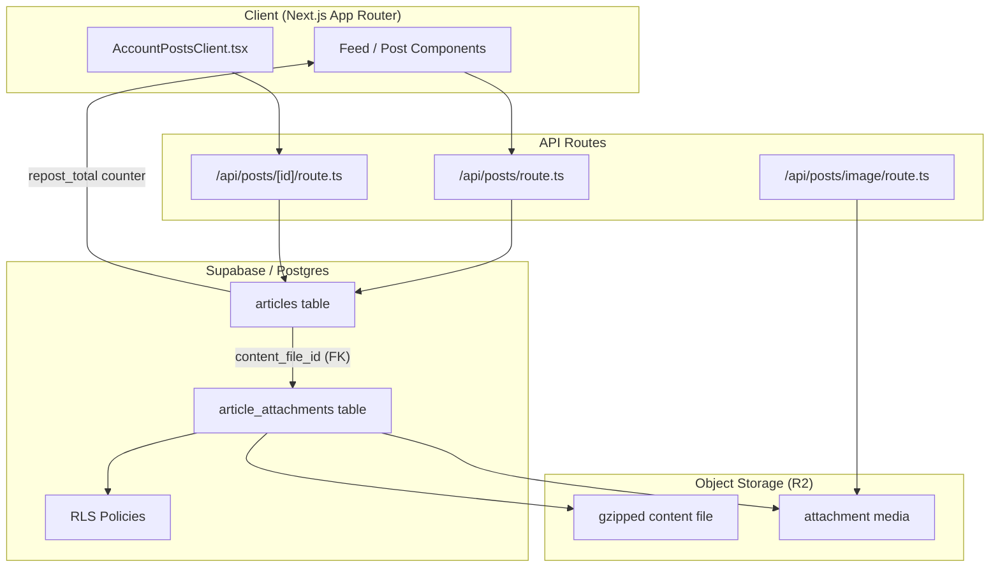
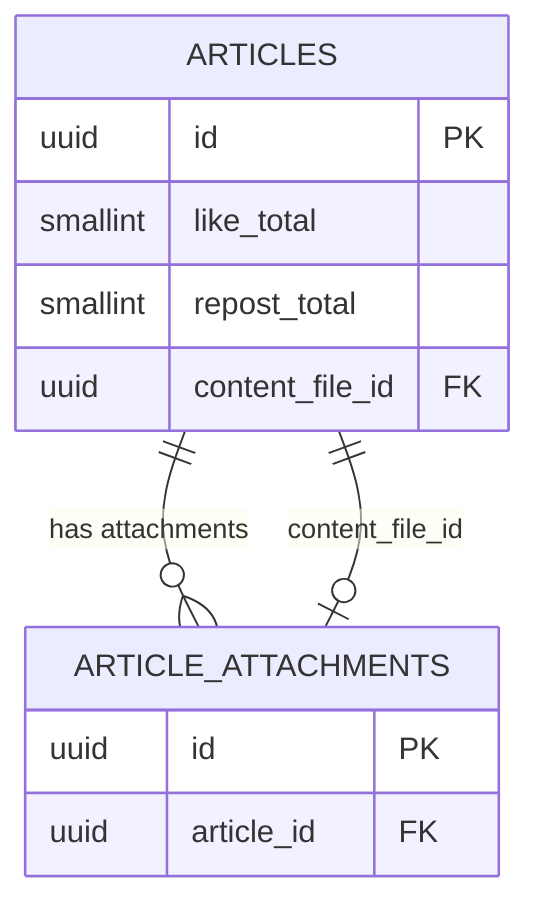
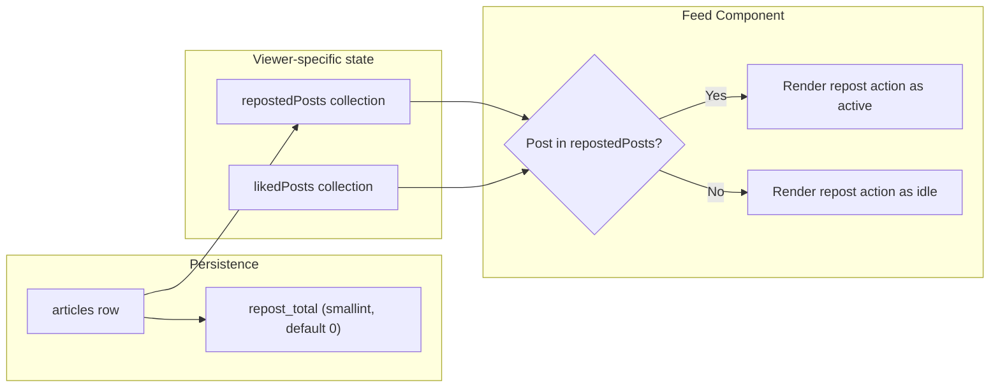
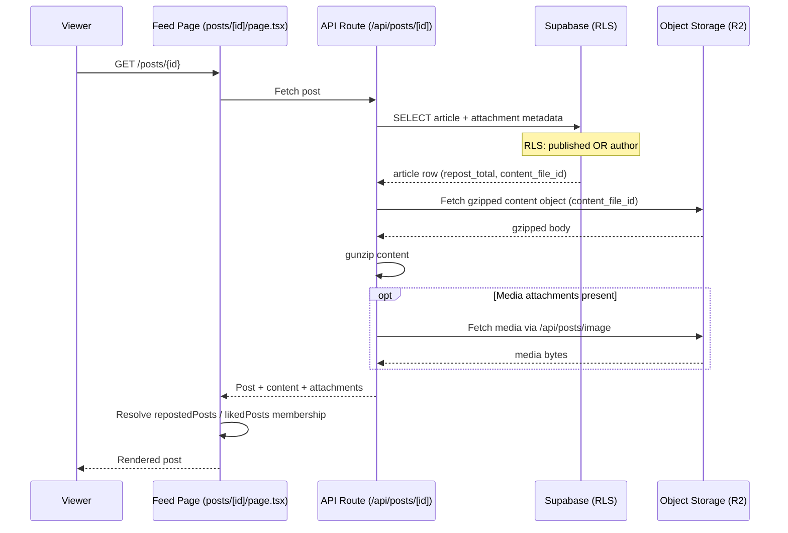

This page documents how posts (articles) carry binary/JSON attachments and how repost relationships and counters are stored and surfaced in the ozeaon-v2 platform.

## Purpose and Scope

This page covers two tightly related post-level features:

1. **Attachments** — the `article_attachments` persistence model, its Row Level Security (RLS) policies, and the migration that moved article body content into a gzipped R2 file referenced by `article_attachments.id` via `articles.content_file_id`.
2. **Reposts** — the `repost_total` counter stored on the `articles` table and the `repostedPosts` surface exposed to feed components.

This page intentionally does **not** cover the general feed rendering pipeline, authentication, or storage bucket configuration in depth. For storage/CDN specifics see the R2 storage documentation, and for the overall database schema see the schema reference. Related sibling topics such as likes, comments, and profile feeds are documented on their own pages.

> **Note on evidence scope:** The source-discovery budget for this page was exhausted before the full TypeScript implementation of the attachment upload API and the repost action could be read. Where behavior could not be confirmed from source, this document states that explicitly instead of guessing. The persistence-layer evidence (SQL migrations and schema) is authoritative and is quoted directly.

## Overview

ozeaon-v2 is a Next.js application backed by Supabase (Postgres) with binary assets stored on an R2-compatible object storage. Posts are called **articles** in the database, and the public routes are mounted under `/api/posts/*`.

Two orthogonal concerns apply to a post:

- **Attachment**: a post can reference one or more stored files. Attachments are represented by the `article_attachments` table, which is tied back to the owning article through `article_id`. Since the `20260331104653_article_content_key` migration, the article's **body content itself is stored as a gzipped file** in object storage, and the `article_attachments` row is the **source of truth** for that file. The article links to it through a dedicated `content_file_id` foreign key.
- **Repost**: a post can be re-shared. The platform tracks a **repost count** per article via `repost_total`, and feed components receive a `repostedPosts` collection describing which posts the current viewer has reposted.

### Key concepts and terminology

| Term | Meaning |
|------|---------|
| `articles` | The primary table for posts. |
| `article_attachments` | Table storing attachment records (files) belonging to an article. |
| `content_file_id` | Nullable FK on `articles` pointing at the `article_attachments` row that holds the gzipped body content. |
| `repost_total` | `smallint` counter column on `articles`, default `0`, tracking how many times the article has been reposted. |
| RLS | Row Level Security policies enforced by Postgres/Supabase. |

## Architecture

The diagram below shows how a post, its attachments, the stored content file, and the repost counter relate at the persistence and API layers.



**Why this shape:** `articles` remains the aggregate root and is the only thing the feed queries for counters such as `repost_total`. The heavier, less frequently read payloads — the gzipped body and any media — are pushed out to `article_attachments` and object storage, so listing a feed does not require reading large blobs from Postgres. The `content_file_id` foreign key keeps referential integrity while allowing articles that have no saved content file to remain valid (the column is nullable by design).

## Attachment Data Model and Persistence

The attachment subsystem is defined entirely in the Supabase migration chain. The relevant pieces are the `articles` ↔ `article_attachments` relationship and the RLS policies that gate access.

### Content-as-a-file migration

The `20260331104653_article_content_key` migration is the pivotal change that redefined what an attachment is. Its header comment records the intent precisely:

```sql
--   1. DROP content — body is now stored as a gzipped file in R2;
--      the article_attachments row is the source of truth.
--      ⚠️  Destructive: existing content values are lost on apply.
--
--   2. ADD content_file_id — FK to article_attachments(id).
--      Nullable: articles without a saved content file remain valid.
```

> Source: [20260331104653_article_content_key.sql](https://github.com/ozeaon/ozeaon-v2/blob/0a4f1a95824db87782f1221a4108019d174df3d9/supabase/migrations/20260331104653_article_content_key.sql#L1-L9)

This design has several important consequences that a senior engineer should internalize:

- **The database no longer stores the post body as a text column.** The canonical `content` column is dropped. Any query that previously selected article body text directly from the row must instead join through `content_file_id` to `article_attachments`, fetch the stored object, and gunzip it.
- **The migration is explicitly destructive.** Existing inline `content` values are lost when it is applied. This is a deliberate trade-off: storing large gzipped payloads inline in Postgres inflates row size, hurts write amplification for replicated clusters, and makes feed queries heavier. The team accepted one-time data loss in exchange for a leaner row shape.
- **`content_file_id` is nullable on purpose.** An article can exist without a persisted content file — for instance a draft created before the first save of its body, or an imported article. This avoids backfilling every row and avoids making content a hard requirement of the `articles` row.

The relationship can be modeled as follows, with the caveat that only the columns verified from the migration/schema evidence are shown:



**Design intent:** separating the attachment rows from the article row means attachments can be managed (inserted, updated, deleted) independently while the article aggregate stays small. The dual relationship — a one-to-many for general attachments and a one-to-(zero or one) for the designated content file — lets a single table serve both "media gallery" and "canonical body payload" roles.

### Row Level Security on attachments

Attachments are protected by Supabase RLS. The `20260420000002_fix_rls_performance` migration rewrote the attachment policies, merging read access and splitting write access by operation. The rewrite comment is explicit about the goal:

```sql
-- article_attachments
-- Merge SELECT: "Anyone can read attachments of published articles" + "Author manages their article attachments" (ALL)
```

> Source: [20260420000002_fix_rls_performance.sql](https://github.com/ozeaon/ozeaon-v2/blob/0a4f1a95824db87782f1221a4108019d174df3d9/supabase/migrations/20260420000002_fix_rls_performance.sql#L10-L11)

The previous broad `ALL`-style author policy was replaced by three operation-specific policies. Read access is granted when the parent article is published **or** the requester is the author:

```sql
CREATE POLICY "Anyone can read attachments of published articles" ON public.article_attachments FOR SELECT
  USING ((EXISTS ( SELECT 1 FROM public.articles WHERE ((articles.id = article_attachments.article_id) AND ((articles.published = true) OR (articles.author_id = (SELECT auth.uid())))))));
```

> Source: [20260420000002_fix_rls_performance.sql](https://github.com/ozeaon/ozeaon-v2/blob/0a4f1a95824db87782f1221a4108019d174df3d9/supabase/migrations/20260420000002_fix_rls_performance.sql#L14-L15)

Insert access requires the requester to be the author of the parent article:

```sql
CREATE POLICY "Author manages their article attachments" ON public.article_attachments FOR INSERT TO authenticated
  WITH CHECK ((EXISTS ( SELECT 1 FROM public.articles WHERE ((articles.id = article_attachments.article_id) AND (articles.author_id = (SELECT auth.uid()))))));
```

> Source: [20260420000002_fix_rls_performance.sql](https://github.com/ozeaon/ozeaon-v2/blob/0a4f1a95824db87782f1221a4108019d174df3d9/supabase/migrations/20260420000002_fix_rls_performance.sql#L16-L17)

Update and delete access are scoped the same way, using `USING` predicates that re-check authorship of the parent article:

```sql
CREATE POLICY "Author updates their article attachments" ON public.article_attachments FOR UPDATE TO authenticated
  USING ((EXISTS ( SELECT 1 FROM public.articles WHERE ((articles.id = article_attachments.article_id) AND ((articles.author_id = (SELECT auth.uid())))))))
  WITH CHECK ((EXISTS ( SELECT 1 FROM public.articles WHERE ((articles.id = article_attachments.article_id) AND ((articles.author_id = (SELECT auth.uid()))))));
CREATE POLICY "Author deletes their article attachments" ON public.article_attachments FOR DELETE TO authenticated
  USING ((EXISTS ( SELECT 1 FROM public.articles WHERE ((articles.id = article_attachments.article_id) AND ((articles.author_id = (SELECT auth.uid()))))));
```

> Source: [20260420000002_fix_rls_performance.sql](https://github.com/ozeaon/ozeaon-v2/blob/0a4f1a95824db87782f1221a4108019d174df3d9/supabase/migrations/20260420000002_fix_rls_performance.sql#L18-L22)

**Why `(SELECT auth.uid())` instead of a bare `auth.uid()`?** The migration name — `fix_rls_performance` — signals the intent. Wrapping the call in a scalar subquery lets the Postgres planner evaluate it once per statement rather than once per row, which is the standard Supabase RLS performance idiom for large tables. Each policy also uses `EXISTS` against `articles` rather than a join, keeping the predicate a semi-join that can use the primary key on `articles.id` directly.

**Why split `ALL` into `SELECT`/`INSERT`/`UPDATE`/`DELETE`?** A single permissive `ALL` policy forces every operation through one predicate and makes it impossible to audit which operation is exposed. Splitting them also lets the read policy be permissive on published articles (so anonymous readers and logged-out visitors can load media) while write policies stay `TO authenticated`.

## Reposts

Reposting is modeled in the database as a **counter on the article row**, not as a join table in the evidence collected. The `20260224142212_remote_schema.sql` migration defines the counter alongside the like counter:

```sql
    "like_total" smallint not null default '0'::smallint,
    "repost_total" smallint not null default '0'::smallint,
```

> Source: [20260224142212_remote_schema.sql](https://github.com/ozeaon/ozeaon-v2/blob/0a4f1a95824db87782f1221a4108019d174df3d9/supabase/migrations/20260224142212_remote_schema.sql#L510-L511)

### Characteristics of `repost_total`

| Property | Value | Notes |
|----------|-------|-------|
| Column name | `repost_total` | Adjacent to `like_total`, mirroring the engagement-counter pattern. |
| Type | `smallint` | 2-byte signed integer in Postgres (range −32768 to 32767). |
| Nullability | `not null` | Always has a value. |
| Default | `0` | New articles start at zero reposts. |

**Design intent — counter vs. join table:** keeping a denormalized `smallint` counter on the article row means the feed can render engagement numbers without aggregating over a separate repost table. The trade-off is that `smallint` caps the count at 32767; the schema choice implies the platform expects per-post repost volume to stay well below that ceiling. A join-table design would allow unbounded counts and per-user repost history queries at the cost of an aggregate join on every feed read.

**Design intent — symmetry with `like_total`:** both engagement types use the same column type and default, which keeps counter-update logic and RLS predicates uniform across likes and reposts.

### Surfacing reposts to the client

Feed components receive the set of posts the current viewer has reposted. The component-library documentation shows the prop contract:

```tsx
likedPosts={liked}
repostedPosts={reposted}
userId={profileId}
```

> Source: [component-library.md](https://github.com/ozeaon/ozeaon-v2/blob/0a4f1a95824db87782f1221a4108019d174df3d9/docs/component-library.md#L40-L42)

This reveals the client-side model: rather than embedding an `isRepostedByMe` boolean inside each post object, the feed passes a **separate collection of reposted posts** (`repostedPosts`) alongside `likedPosts`. The feed component then resolves membership client-side to decide whether to render the repost action as active.

**Why a separate collection?** It decouples the immutable post payload from viewer-specific state. The same post objects can be cached and shared across viewers (and across SSR boundaries) while the viewer-specific `likedPosts`/`repostedPosts` sets are layered on top. This is the same pattern used for likes, so the two features share the resolution logic.

The relationship between the counter and the viewer-specific set is illustrated below:



## Post API Surface

Posts are exposed through Next.js route handlers under `/api/posts`. The following routes were confirmed to exist in the repository:

| Route | Purpose (inferred from path) |
|-------|------------------------------|
| [`/api/posts/route.ts`](https://github.com/ozeaon/ozeaon-v2/blob/0a4f1a95824db87782f1221a4108019d174df3d9/src/app/api/posts/route.ts) | Collection endpoint for posts (list/create). |
| [`/api/posts/[id]/route.ts`](https://github.com/ozeaon/ozeaon-v2/blob/0a4f1a95824db87782f1221a4108019d174df3d9/src/app/api/posts/[id]/route.ts) | Single-post operations by id. |
| [`/api/posts/image/route.ts`](https://github.com/ozeaon/ozeaon-v2/blob/0a4f1a95824db87782f1221a4108019d174df3d9/src/app/api/posts/image/route.ts) | Image handling for posts / attachments. |
| [`/api/posts/[id]/like/route.ts`](https://github.com/ozeaon/ozeaon-v2/blob/0a4f1a95824db87782f1221a4108019d174df3d9/src/app/api/posts/[id]/like/route.ts) | Like toggling for a post. |
| [`/api/posts/[id]/comments/route.ts`](https://github.com/ozeaon/ozeaon-v2/blob/0a4f1a95824db87782f1221a4108019d174df3d9/src/app/api/posts/[id]/comments/route.ts) | Comment collection for a post. |
| [`/api/posts/[id]/comments/[commentId]/route.ts`](https://github.com/ozeaon/ozeaon-v2/blob/0a4f1a95824db87782f1221a4108019d174df3d9/src/app/api/posts/[id]/comments/[commentId]/route.ts) | Single comment operations. |
| [`/api/account/posts/route.ts`](https://github.com/ozeaon/ozeaon-v2/blob/0a4f1a95824db87782f1221a4108019d174df3d9/src/app/api/account/posts/route.ts) | Authenticated account-scoped post operations. |
| [`/api/account/posts/[id]/route.ts`](https://github.com/ozeaon/ozeaon-v2/blob/0a4f1a95824db87782f1221a4108019d174df3d9/src/app/api/account/posts/[id]/route.ts) | Account-scoped single-post operations. |

Page-level consumers include:

- [`src/app/(main)/(feed)/(public)/posts/page.tsx`](https://github.com/ozeaon/ozeaon-v2/blob/0a4f1a95824db87782f1221a4108019d174df3d9/src/app/(main)/(feed)/(public)/posts/page.tsx) — public feed.
- [`src/app/(main)/(feed)/(public)/posts/[id]/page.tsx`](https://github.com/ozeaon/ozeaon-v2/blob/0a4f1a95824db87782f1221a4108019d174df3d9/src/app/(main)/(feed)/(public)/posts/[id]/page.tsx) — single post view.
- [`src/app/(main)/(feed)/(private)/account/posts/page.tsx`](https://github.com/ozeaon/ozeaon-v2/blob/0a4f1a95824db87782f1221a4108019d174df3d9/src/app/(main)/(feed)/(private)/account/posts/page.tsx) with [`AccountPostsClient.tsx`](https://github.com/ozeaon/ozeaon-v2/blob/0a4f1a95824db87782f1221a4108019d174df3d9/src/app/(main)/(feed)/(private)/account/posts/AccountPostsClient.tsx) and [`actions.ts`](https://github.com/ozeaon/ozeaon-v2/blob/0a4f1a95824db87782f1221a4108019d174df3d9/src/app/(main)/(feed)/(private)/account/posts/actions.ts) — the author's own posts, with server actions.

> **Implementation detail not found in source for this page:** the exact request/response bodies of these handlers, the attachment upload flow (multipart handling, validation, size limits), and the specific server action that increments `repost_total` were not read within the source budget. Treat the table above as a route inventory rather than an API contract. Readers should open the linked files to confirm signatures.

## Content Host Allowlist

Because article content and attachments store **absolute URLs** in object storage, the Next.js image host allowlist must cover both storage hosts. The `next.config.ts` comment explains the reason:

```ts
/**
 * Article content and attachments store absolute URLs against whichever
 * environment uploaded them, so both storage hosts must be allowed regardless
 */
```

> Source: [next.config.ts](https://github.com/ozeaon/ozeaon-v2/blob/0a4f1a95824db87782f1221a4108019d174df3d9/next.config.ts#L25-L27)

**Design intent:** uploading in a non-production environment bakes that environment's absolute URL into the persisted article content or attachment record. When those rows are read from production, the URL still points at the other environment's host. Allowing **both** hosts unconditionally avoids broken media after environment cross-reads or data promotion, at the cost of a slightly broader allowlist. This is a direct consequence of the decision to store absolute URLs rather than relative keys.

## Core Flow: Reading a Post with Attachments

The following sequence reflects the verified persistence relationships (content as a gzipped object referenced through `article_attachments`, media fetched from storage) and the route inventory above. Steps that were not confirmed in source are marked as such.



### Step-by-step rationale

1. **RLS is evaluated first.** The `SELECT` policy on `article_attachments` uses `EXISTS (SELECT 1 FROM articles WHERE ...)` with the `published = true OR author_id = auth.uid()` condition. This means a request for a **draft** article's attachments returns nothing unless the requester is the author — so unpublished media can never leak through the attachment table even if the storage object is publicly reachable.
2. **The article row is the cheap read; the body is the expensive read.** The feed only needs `repost_total` (and other counters) from `articles`. The gzipped body is fetched separately from storage and only when the full post is needed.
3. **Media is served through `/api/posts/image`.** Absolute storage URLs are then allowlisted via `next.config.ts`, which is why that allowlist must include every environment's host.

## Failure Modes, Edge Cases & Concurrency

### Attachment edge cases

- **Article with no content file.** `content_file_id` is nullable by explicit design ("articles without a saved content file remain valid"). Consumers must treat a null `content_file_id` as "no saved body" rather than an error.
- **Destructive migration.** Applying `20260331104653_article_content_key` drops the legacy `content` column and loses its values permanently. There is no reversible path for the dropped data — only the migration's own warning documents this.
- **Orphaned storage objects.** Because the `article_attachments` row is the source of truth, deleting the row (allowed by the author `DELETE` policy) without deleting the corresponding storage object leaves an orphaned object in R2. The policy layer does not enforce storage cleanup; an application-level or lifecycle-level sweeper is required.
- **Non-author access to drafts.** By RLS construction, a non-author can read attachments only of **published** articles. Draft attachment reads return zero rows (not an authorization error), which callers must handle as an empty result.

### Repost edge cases

- **Counter type ceiling.** `repost_total` is `smallint` and `not null`. Reaching 32767 would overflow; the schema implicitly assumes per-post reposts stay below that. Any repost increment path must therefore be a bounded, atomic update.
- **Viewer-specific state vs. global counter.** `repostedPosts` is per-viewer while `repost_total` is global. The counter and the viewer set can disagree transiently (for example after an optimistic UI update or between SSR and client hydration), so the rendered active state should be driven by the viewer set, not reconstructed from the counter.
- **Concurrency.** Multiple simultaneous reposts of the same article must be applied as an atomic increment (a single `UPDATE ... SET repost_total = repost_total + 1` or a guarded RPC) to avoid lost updates. The specific increment implementation was not read within the source budget, so the exact mechanism is not asserted here.

### RLS performance considerations

The `20260420000002_fix_rls_performance` migration exists specifically because RLS predicates over `article_attachments` are on a hot read path. Two idioms are used deliberately:

| Idiom | Purpose |
|-------|---------|
| `(SELECT auth.uid())` instead of `auth.uid()` | Evaluate the auth lookup once per statement instead of once per row. |
| `EXISTS (SELECT 1 FROM articles WHERE ...)` | Semi-join against `articles.id` PK instead of an open join. |
| Splitting `ALL` into per-operation policies | Avoid one blanket predicate for all verb-sets; keep read permissive and writes `TO authenticated`. |

## Extension Points

Based on the verified structures, extension work in this area is typically done in one of four places:

1. **New attachment kinds** — add rows to `article_attachments`; the `article_id` + `content_file_id` model already separates the canonical body from auxiliary media, so new attachment categories reuse the same table and policies.
2. **New engagement counters** — the `like_total` / `repost_total` pattern on `articles` is the established template for denormalized counts. A new counter follows the same `smallint not null default 0` shape.
3. **New RLS-protected child tables** — copy the four-policy split (`SELECT` permissive on published, `INSERT`/`UPDATE`/`DELETE` `TO authenticated` with `EXISTS ... author_id = (SELECT auth.uid())`) to match the attachment security model.
4. **Image host allowlisting** — when a new upload environment is introduced, its host must be added to the `next.config.ts` image allowlist, because attachment/content URLs are stored as absolute URLs.

## Related Links

- [Post single view](https://github.com/ozeaon/ozeaon-v2/blob/0a4f1a95824db87782f1221a4108019d174df3d9/src/app/(main)/(feed)/(public)/posts/[id]/page.tsx)
- [Posts API collection](https://github.com/ozeaon/ozeaon-v2/blob/0a4f1a95824db87782f1221a4108019d174df3d9/src/app/api/posts/route.ts)
- [Posts API by id](https://github.com/ozeaon/ozeaon-v2/blob/0a4f1a95824db87782f1221a4108019d174df3d9/src/app/api/posts/[id]/route.ts)
- [Post image route](https://github.com/ozeaon/ozeaon-v2/blob/0a4f1a95824db87782f1221a4108019d174df3d9/src/app/api/posts/image/route.ts)
- [Account posts client](https://github.com/ozeaon/ozeaon-v2/blob/0a4f1a95824db87782f1221a4108019d174df3d9/src/app/(main)/(feed)/(private)/account/posts/AccountPostsClient.tsx)
- [Account posts actions](https://github.com/ozeaon/ozeaon-v2/blob/0a4f1a95824db87782f1221a4108019d174df3d9/src/app/(main)/(feed)/(private)/account/posts/actions.ts)
- [Content-as-file migration](https://github.com/ozeaon/ozeaon-v2/blob/0a4f1a95824db87782f1221a4108019d174df3d9/supabase/migrations/20260331104653_article_content_key.sql)
- [RLS performance migration](https://github.com/ozeaon/ozeaon-v2/blob/0a4f1a95824db87782f1221a4108019d174df3d9/supabase/migrations/20260420000002_fix_rls_performance.sql)
- [Remote schema (repost_total)](https://github.com/ozeaon/ozeaon-v2/blob/0a4f1a95824db87782f1221a4108019d174df3d9/supabase/migrations/20260224142212_remote_schema.sql)
- [Component library (repostedPosts prop)](https://github.com/ozeaon/ozeaon-v2/blob/0a4f1a95824db87782f1221a4108019d174df3d9/docs/component-library.md)
- [Next.js config (image host allowlist)](https://github.com/ozeaon/ozeaon-v2/blob/0a4f1a95824db87782f1221a4108019d174df3d9/next.config.ts)
- [Database schema reference](https://github.com/ozeaon/ozeaon-v2/blob/0a4f1a95824db87782f1221a4108019d174df3d9/docs/db/schema.sql)
- [R2 storage documentation](https://github.com/ozeaon/ozeaon-v2/blob/0a4f1a95824db87782f1221a4108019d174df3d9/docs/r2-storage.md)
