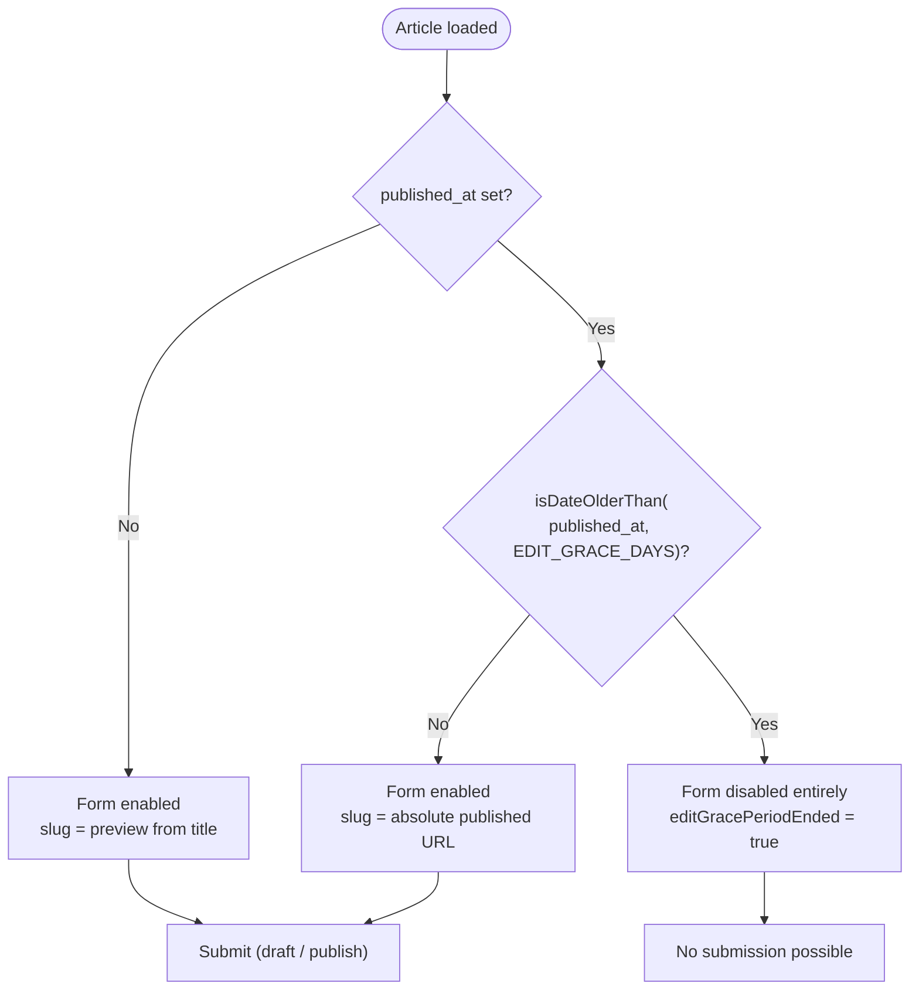

The Articles feature lets authenticated users write, save as draft, and publish long-form content — with rich-text bodies, authors, licensing, SDGs, categories, attachments, and moderation — then exposes the published results as public reader pages and infinite feeds.

## Purpose and Scope

This page documents the **authoring and publishing** capability of the Articles subsystem:

- The article form state model (`ArticleForm`), its Zod schemas, defaults, and lifecycle.
- The editor route (`/articles/new`) that loads reference data and hydrates an existing draft.
- The draft-vs-publish submission model, including the implicit draft create and the edit grace period.
- Attachments (cover, gallery, paper, annexes) as they are assembled for the form.
- The reader route (`/articles/[slug]`) that serves published articles, and how the feed/settings routes relate.

Related topics intentionally left to sibling pages:

- **Authentication, accounts, and RLS authorization** — see the Authentication / accounts pages; this page only describes how `getAuthUserOrRedirect` and `canManageArticle` are *used* by the editor route.
- **Reading & feeds** (`ArticlesInfiniteFeed`, article cards, comments rendering) — see the Feeds and Components pages.
- **Shared form primitives** (`InputText`, `ShowWhen`, `useFormState`, `FormSectionCard`) — see the Form Components page.
- **Storage/uploads and attachment limits** — see the Storage page; this page covers only how attachments are mapped into the form.

## Overview

The Articles feature is a two-sided capability:

1. **Authoring** happens in the `(editor)` route group at `/articles/new`. The same page serves both "create new article" and "edit existing article", switching on an `articleId` search parameter. Authoring is form-centric: a single large react-hook-form instance (`ArticleForm`) owns all fields, validation is driven by Zod schemas, and every section of the UI is a subcomponent wired to that one form.

2. **Publishing** is a state transition on the same record. Rather than a separate publish UI, the boolean `published` field is part of the form data, and the record is persisted either as a draft (incomplete) or as published (validated against a stricter schema). Publishing locks the URL (`slug`) to keep links stable, and after an edit grace period the form becomes read-only.

The design intent is that *a draft and a published article are the same row*, so the editor, the reader, and the management lists all operate on one model. This avoids a separate "draft entity" and duplicate persistence paths, at the cost of a more complex form schema (which is why `articleDraftSchema` and `articlePublishSchema` exist side by side).

Key terminology used throughout this page:

| Term | Meaning |
| --- | --- |
| Draft | An article row created/kept with `published = false`; validated by `articleDraftSchema`. |
| Published | `published = true` and `published_at` set; validated by `articlePublishSchema`. |
| Implicit draft create | The form creating a row server-side without the user clicking "Save draft", so attachments have a parent id. |
| Edit grace period | A window (`EDIT_GRACE_DAYS`) after `published_at` during which a published article remains editable. |
| Slug | The URL segment. Auto-generated from the title while a draft; locked to an absolute published URL after publishing. |
| Content handle | `InputContentHandle`, the imperative handle to the rich-text editor holding the body. |

## Architecture

The authoring capability spans three layers: route entries, the form component tree, and the shared query/validation layer. The diagram below reflects the actual modules involved.

```mermaid
flowchart TD
    subgraph sg_Routes["Route Layer (src/app)"]
        NewPage["articles/new/page.tsx<br/>create & edit"]
        FeedPublic["(public)/articles/page.tsx"]
        ReaderPage["(reader)/articles/[slug]/page.tsx"]
        MyArticles["settings/(personal)/my-articles/page.tsx"]
        OrgArticles["settings/(organizations)/articles/page.tsx"]
    end

    subgraph sg_Form["Form Layer (components/articles/form)"]
        ArticleForm["ArticleForm"]
        FormNav["ArticleFormNav"]
        FormSidebar["ArticleFormSidebar"]
        ContentSection["ContentSection"]
        Attachments["useArticleAttachments"]
        CoverUpload["ArticleCoverUpload"]
        GalleryUpload["ArticleGalleryUpload"]
        PaperUpload["ArticlePaperUpload"]
        AnnexesUpload["ArticleAnnexesUpload"]
    end

    subgraph sg_Sections["Reusable Sections"]
        AuthorInput["AuthorInput"]
        Licensing["LicensingAccessSection"]
        Provenance["ProvenanceSection"]
        Categories["CategoriesSection"]
        Comments["CommentsSection"]
    end

    subgraph sg_Shared["Shared / Data Layer"]
        Queries["lib/supabase/queries"]
        ZodSchemas["zod/articles"]
        Constants["config/constants/articles"]
        Utils["utils/form, utils/generators"]
        Account["utils/data/account"]
    end

    NewPage --> ArticleForm
    ReaderPage --> Queries
    FeedPublic --> ReaderPage
    MyArticles --> ArticleForm
    OrgArticles --> ArticleForm

    ArticleForm --> FormNav
    ArticleForm --> FormSidebar
    ArticleForm --> ContentSection
    ArticleForm --> AuthorInput
    ArticleForm --> Licensing
    ArticleForm --> Provenance
    ArticleForm --> Categories
    ArticleForm --> Comments
    ArticleForm --> CoverUpload
    ArticleForm --> Attachments
    Attachments --> GalleryUpload
    Attachments --> PaperUpload
    Attachments --> AnnexesUpload

    NewPage --> Queries
    NewPage --> Account
    ArticleForm --> ZodSchemas
    ArticleForm --> Constants
    ArticleForm --> Utils
    ArticleForm --> Queries
```



The important structural fact is that **`ArticleForm` is the hub**: it imports the section components, the Zod schemas, the constants, the mappers, and the query hooks. Routes are thin — they resolve auth and reference data, then hand everything to `ArticleForm` as props.

## The Editor Route: Create vs. Edit

`NewArticlePage` is a single async server component that handles both modes. Its entire behavior is driven by one optional search parameter.

```tsx
interface NewArticlePageProps {
  searchParams: Promise<{ articleId?: string }>;
}

export async function generateMetadata({
  searchParams,
}: NewArticlePageProps): Promise<Metadata> {
  const { articleId } = await searchParams;
  return {
    title: articleId ? "Edit Article" : "Create New Article",
  };
}
```

> Source: [page.tsx](https://github.com/ozeaon/ozeaon-v2/blob/0a4f1a95824db87782f1221a4108019d174df3d9/src/app/(main)/(editor)/articles/new/page.tsx#L20-L31)

The `generateMetadata` implementation is the first signal of the dual-mode design: the page title is derived purely from the presence of `articleId`. There is no separate "edit" route — editing is `/articles/new?articleId=<id>`.

### Authorization Comes From the Row, Not the Cookie

The most important design decision in this route is documented explicitly in a comment: authorization is resolved from the article row itself, not from the active-account cookie.

```tsx
if (draftId) {
  // Authorisation comes from the row itself, mirroring the articles RLS
  // policies — never from the active-account cookie, which an org admin
  // editing under their personal account would not have set.
  const { data, error } = await getArticleForForm(supabase, draftId, "id");

  // Falling through on a missing row would render a blank create form and a
  // submit would silently make a second article.
  if (error || !data) notFound();

  if (!(await canManageArticle(supabase, data, user.id, activeAccount))) {
    return (
      <ErrorFallback
        title="Permission Denied"
        description="You do not have permission to edit this article."
        className="h-[calc(100vh-10rem)]"
      />
    );
  }

  initialDraftData = mapArticleToFormData(mapApiDataToFormData(data));
  initialArticleId = data.id;
}
```

> Source: [page.tsx](https://github.com/ozeaon/ozeaon-v2/blob/0a4f1a95824db87782f1221a4108019d174df3d9/src/app/(main)/(editor)/articles/new/page.tsx#L46-L68)

Three distinct behaviors are encoded here, each with a clear rationale:

| Condition | Behavior | Why |
| --- | --- | --- |
| Row missing or query error | `notFound()` | Falling through would render a blank *create* form, and a submit would silently create a **second** article. |
| `canManageArticle` returns false | Render `ErrorFallback` "Permission Denied" | A 200 response with an explanatory panel rather than a hard 404 — the user is authenticated but not authorized. |
| Both pass | Map to `ArticleFormData` via `mapArticleToFormData(mapApiDataToFormData(data))` | The two-stage mapping keeps API-shape concerns separate from form-shape concerns. |

Note the two-stage mapping: `mapApiDataToFormData` normalizes the raw API/database shape, then `mapArticleToFormData` converts it into the form's expected shape. Both live in `@/utils/form` (imported elsewhere in the file as `@/utils`, which is a re-export barrel).

### Reference Data Loading

In both create and edit modes — and even when `draftId` is absent — the route fetches the full set of lookup tables in one parallel batch.

```tsx
const [
  categories,
  articleTypes,
  sdgs,
  accessLevels,
  licenseTypes,
  fundingSources,
  articleWithDocs,
] = await Promise.all([
  getCategoriesWithSubcategories(supabase),
  getArticleTypes(supabase),
  getSDGs(supabase),
  getAccessLevels(supabase),
  getLicenseTypes(supabase),
  getFundingSources(supabase),
  getArticleAttachments(supabase, initialArticleId),
]);
```

> Source: [page.tsx](https://github.com/ozeaon/ozeaon-v2/blob/0a4f1a95824db87782f1221a4108019d174df3d9/src/app/(main)/(editor)/articles/new/page.tsx#L71-L87)

Design intent: the editor form is entirely dropdown-driven (types, access levels, licenses, funding sources, SDGs, categories). Fetching all of them with a single `Promise.all` avoids waterfall round-trips, which matters because the form cannot render meaningfully until every option list is present. `getArticleAttachments` is passed `initialArticleId`, so it returns nothing in create mode and the real attachment set in edit mode.

All of these functions live in `@/lib/supabase/queries` and take the Supabase client as the first argument — the request-scoped client produced by `getAuthUserOrRedirect`, so RLS applies naturally.

### Attachment Assembly

The route flattens one `pdf_file` plus `article_documents` plus `article_images` into a single typed `ArticleAttachment[]` for the form.

```tsx
if (articleWithDocs.data) {
  if (articleWithDocs.data.pdf_file) {
    const pdf = articleWithDocs.data.pdf_file;
    articleAttachments.push({
      id: pdf.id,
      title: pdf.title ?? pdf.filename ?? "Paper",
      file_size_bytes: pdf.file_size_bytes,
      mime_type: "application/pdf",
      type: "pdf" as AttachmentType,
      path: pdf.path,
      page_count: pdf.page_count,
    });
  }

  articleWithDocs.data.article_documents.forEach((doc) => {
    articleAttachments.push({
      id: doc.document.id,
      title: doc.document.title,
      file_size_bytes: doc.document.file_size_bytes,
      mime_type: doc.document.type.mime_type,
      type: (doc.attachment_type as AttachmentType) ?? "annex",
      path: doc.document.path,
      page_count: doc.document.page_count,
    });
  });
```

> Source: [page.tsx](https://github.com/ozeaon/ozeaon-v2/blob/0a4f1a95824db87782f1221a4108019d174df3d9/src/app/(main)/(editor)/articles/new/page.tsx#L91-L115)

Two normalization rules are worth noting:

- The PDF's `title` falls back through `pdf.title ?? pdf.filename ?? "Paper"`, so the paper attachment always has a display label.
- A document's `type` falls back to `"annex"` when `attachment_type` is null, meaning annexes are the default document kind. The storefront treats the paper (PDF), the gallery images, and the annex files as three separate attachment categories that all surface in the same form list.

## The Article Form: State Model

`ArticleForm` is a client component (`"use client"`) and receives every lookup table plus the initial draft as props. Its props interface is the contract between the route and the form.

```tsx
interface ArticleFormProps {
  sdgs: SDG[];
  categories: CategoryWithSubcategories[];
  articleTypes: ArticleType[];
  accessLevels: ArticleAccessLevel[];
  licenseTypes: ArticleLicenseType[];
  fundingSources: ArticleFundingSource[];
  attachments: ArticleAttachment[];
  initialDraftData: ArticleFormData | null;
  initialArticleId: string | null;
}
```

> Source: [ArticleForm.tsx](https://github.com/ozeaon/ozeaon-v2/blob/0a4f1a95824db87782f1221a4108019d174df3d9/src/components/articles/form/ArticleForm.tsx#L85-L95)

### Schema Selection

```tsx
const SelectedSchema = articleDraftSchema;

type FormInput = z.input<typeof SelectedSchema>;
type FormOutput = z.output<typeof SelectedSchema>;
```

> Source: [ArticleForm.tsx](https://github.com/ozeaon/ozeaon-v2/blob/0a4f1a95824db87782f1221a4108019d174df3d9/src/components/articles/form/ArticleForm.tsx#L111-L114)

The form distinguishes between `z.input` and `z.output` — the type before and after Zod transforms/coercions. Input defaults are declared as `Partial<FormInput>`, and `useForm` is parameterized `<FormInput, unknown, FormOutput>`, so the resolver validates input and produces output. Two schemas exist in `@/zod/articles` — `articleDraftSchema` and `articlePublishSchema` — and the draft schema is the baseline used for the form's resolver, with the publish schema applied for the stricter publish path. This split is the mechanism that lets a user save an *incomplete* article as a draft while still being forced to provide everything required before publishing.

### Default Values and the Published Flag

```tsx
const initialData: Partial<FormInput> = {
  published: false,
  comments_enabled: true,
  derivatives_allowed: true,
  commercial_use_allowed: true,
  text_only_publication: false,
  slug: "",
  tags: "",
  title: "",
  subtitle: "",
  summary: "",
  subcategories: [],
  sdgs: [],
  article_type_id: defaultArticleType.id,
  article_type: defaultArticleType,
  access_level_id: accessLevels[0].id,
  access_level: accessLevels[0],
  license_type_id: licenseTypes[0].id,
  license_type: licenseTypes[0],
  attribution_text: "",
  language: "en",
  content: null,
  content_text: "",
  geographic_scope: "global",
  geographic_scope_country: "",
  authors: [
    {
      user_id: "",
      display_name: "",
      is_corresponding: true,
      role: "Primary Author",
      orcid: "",
    },
  ],
};
```

> Source: [ArticleForm.tsx](https://github.com/ozeaon/ozeaon-v2/blob/0a4f1a95824db87782f1221a4108019d174df3d9/src/components/articles/form/ArticleForm.tsx#L165-L199)

This literal is the canonical default state and reveals the product defaults:

| Field | Default | Meaning |
| --- | --- | --- |
| `published` | `false` | New articles start as drafts. |
| `comments_enabled` | `true` | Comments on by default. |
| `derivatives_allowed` / `commercial_use_allowed` | `true` | Permissive Creative-Commons-style defaults. |
| `text_only_publication` | `false` | The article is expected to carry rich content/attachments. |
| `article_type_id` | `defaultArticleType.id` | Falls back to blog or first type (see below). |
| `access_level_id` / `license_type_id` | first entry of each list | Ordered so the first row is the intended default. |
| `language` | `"en"` | English only today. |
| `geographic_scope` | `"global"` | Global by default; country empty. |
| `authors` | one entry, `is_corresponding: true`, `role: "Primary Author"` | Every article starts with exactly one corresponding author slot. |

The default article type is resolved defensively:

```tsx
const defaultArticleType =
  articleTypes.find((t) => t.code === ArticleTypeCode.blog) ??
  articleTypes[0];
```

> Source: [ArticleForm.tsx](https://github.com/ozeaon/ozeaon-v2/blob/0a4f1a95824db87782f1221a4108019d174df3d9/src/components/articles/form/ArticleForm.tsx#L116-L118)

Rather than assuming a blog type exists, it searches by `ArticleTypeCode.blog` and falls back to the first available type — so a misconfigured or empty `article_types` table cannot crash the editor.

### Language Options

```tsx
const languageOptions = useMemo(
  () =>
    Object.entries(ISO_LANGUAGE_CODES).map(([key, name]) => ({
      value: key,
      label: name,
      disabled: key !== "en",
    })),
  [],
);
```

> Source: [ArticleForm.tsx](https://github.com/ozeaon/ozeaon-v2/blob/0a4f1a95824db87782f1221a4108019d174df3d9/src/components/articles/form/ArticleForm.tsx#L131-L139)

`ISO_LANGUAGE_CODES` (from `@/config/constants/articles`) populates the whole ISO list, but every option except `en` is `disabled`. This is deliberate forward-compatibility: the full list is rendered so the UI is visibly multilingual-ready, while the current product supports English only. The select is generated from constants rather than hardcoded.

## Form Lifecycle: Meta State, Refs, and Guard Flags

`ArticleForm` keeps a `meta` object holding everything that is *not* a form field but affects rendering and submission behavior.

```tsx
const [meta, setMeta] = useState<ArticleFormMeta>({
  title: initialDraftData?.title ?? null,
  articleId: initialArticleId,
  lastSavedDate: initialDraftData?.updated_at,
  isPublished: initialDraftData?.published ?? false,
  publishedAt: initialDraftData?.published_at ?? null,
  articleAttachments: attachments,
  editGracePeriodEnded: Boolean(
    initialDraftData?.published &&
    initialDraftData.published_at &&
    isDateOlderThan(initialDraftData.published_at, EDIT_GRACE_DAYS),
  ),
});
```

> Source: [ArticleForm.tsx](https://github.com/ozeaon/ozeaon-v2/blob/0a4f1a95824db87782f1221a4108019d174df3d9/src/components/articles/form/ArticleForm.tsx#L143-L155)

The `editGracePeriodEnded` computation is a three-way conjunction: the article must be published **and** have a `published_at` **and** that timestamp must be older than `EDIT_GRACE_DAYS` (from `@/config/constants/attachments`). If any part is missing, the period has not ended. This single boolean drives two things:

1. **The form's disabled state** — `useForm({ disabled: ... })`.
2. **Read-only rendering** in the nav/sidebar sections.

### The Read-Only Gate

```tsx
const form = useForm<FormInput, unknown, FormOutput>({
  resolver: zodResolver(SelectedSchema),
  // NOTE: shouldUnregister: false is required — ShowWhen fields must retain their
  // values when hidden, and unregistered fields (slug) must be readable via useWatch.
  shouldUnregister: false,
  shouldFocusError: true,
  disabled: initialDraftData?.published_at
    ? isDateOlderThan(initialDraftData.published_at, EDIT_GRACE_DAYS)
    : false,
  criteriaMode: "all",
  defaultValues: initialDraftData
    ? {
        ...initialDraftData,
        // content is loaded async by the rich-text editor; null is the clean baseline
        content: null,
        content_text: "",
        slug: meta.isPublished
          ? generatePublishedUrl("articles", initialDraftData.slug)
          : generateSlugPreview(
              "articles",
              initialDraftData.title,
              initialArticleId,
            ),
      }
    : initialData,
  mode: initialArticleId ? "onBlur" : "onSubmit",
  reValidateMode: "onChange",
});
```

> Source: [ArticleForm.tsx](https://github.com/ozeaon/ozeaon-v2/blob/0a4f1a95824db87782f1221a4108019d174df3d9/src/components/articles/form/ArticleForm.tsx#L211-L238)

Each option here encodes a specific requirement:

| Option | Value | Rationale |
| --- | --- | --- |
| `resolver` | `zodResolver(SelectedSchema)` | All validation is Zod-driven, single source of truth. |
| `shouldUnregister` | `false` | **Required.** `ShowWhen` (conditional) fields must retain values when hidden, and the unregistered `slug` field must remain readable via `useWatch`. |
| `shouldFocusError` | `true` | Accessibility: focus the first failing field. |
| `disabled` | derived from grace period | The *entire form* is disabled once the edit grace period has ended. This is the enforcement point for post-publish immutability. |
| `criteriaMode` | `"all"` | Collect all validation issues per field, not just the first. |
| `mode` | `"onBlur"` for edit, `"onSubmit"` for create | Editing validates as you leave fields (faster feedback on long forms); creating validates only on submit (avoids scolding a user mid-first-draft). |
| `reValidateMode` | `"onChange"` | After the first validation, errors clear as the user types. |

The `content` field is deliberately reset to `null` even when `initialDraftData` has content: the body is loaded asynchronously by the rich-text editor via `richTextRef`, so `null` is the honest baseline. `content_text` (the plain-text extraction used for search/validation) is likewise reset to `""` and repopulated by the editor.

### Slug Handling

```tsx
const slugDescription = useMemo(
  () =>
    meta.isPublished
      ? "Url is locked after publishing to maintain URL stability."
      : "Url is automatically generated based on Article's Title.",
  [meta.isPublished],
);
```

> Source: [ArticleForm.tsx](https://github.com/ozeaon/ozeaon-v2/blob/0a4f1a95824db87782f1221a4108019d174df3d9/src/components/articles/form/ArticleForm.tsx#L157-L163)

The slug has two rendering modes driven by `meta.isPublished`:

- **Draft** — `generateSlugPreview("articles", title, initialArticleId)` produces a *preview* of what the URL will be. It is a preview because the slug is not yet the source of truth; it is derived from the title (and, before first save, a temporary id).
- **Published** — `generatePublishedUrl("articles", slug)` produces the *absolute, locked* URL. The comment in the description string states the intent plainly: *"Url is locked after publishing to maintain URL stability."*

This is why the slug field is intentionally **unregistered** in the form while remaining readable via `useWatch` — the user never types it, but the UI displays it and the persistence layer needs its value.

### The Reference Trio for Implicit Draft Creation

```tsx
const richTextRef = useRef<InputContentHandle>(null);
// Holds the row a submit created before meta caught up, so a retry updates it.
const createdArticleIdRef = useRef<string | null>(initialArticleId);
// In-flight implicit draft create, shared by every caller waiting on the id.
const createdDraftRef = useRef<Promise<string | null> | null>(null);
const [isLoading, setIsLoading] = useState(false);
const [isPublishing, setIsPublishing] = useState(false);
// Never cleared — the form unmounts once the article page renders.
const [isRedirecting, setIsRedirecting] = useState(false);
```

> Source: [ArticleForm.tsx](https://github.com/ozeaon/ozeaon-v2/blob/0a4f1a95824db87782f1221a4108019d174df3d9/src/components/articles/form/ArticleForm.tsx#L201-L209)

These five declarations solve a genuinely tricky problem: **attachments cannot be uploaded until an article row exists**, but the user should not have to explicitly save before attaching. The solution is an *implicit draft create*:

| Declaration | Purpose |
| --- | --- |
| `richTextRef` | Imperative handle to the rich-text editor so the body can be read/flushed on submit rather than living in plain form state. |
| `createdArticleIdRef` | Remembers the id of a row created by a submit before `meta` had a chance to update, so a **retry updates** that row instead of creating another. |
| `createdDraftRef` | A shared in-flight `Promise<string \| null>` for the implicit draft create — **every concurrent caller awaiting the id awaits the same promise**, preventing duplicate inserts. |
| `isLoading` | Generic request-in-flight flag. |
| `isPublishing` | Separate flag so the publish button can show its own state. |
| `isRedirecting` | **Never cleared** — the form unmounts once the article page renders, so there is no need to reset it, and clearing it would risk a flash of the form during navigation. |

The deduplication strategy is the important part: the promise-caching ref means two quick actions (e.g. clicking "save" and dropping a file) that both need the article id will not race to create two rows. The row-id ref then guarantees idempotency across retries.

## Core Flow: Draft Save vs. Publish

The following sequence reflects the real division of responsibility between the route, the form, the schemas, the queries, and Supabase.

```mermaid
sequenceDiagram
    participant User
    participant Page as NewArticlePage (server)
    participant Auth as getAuthUserOrRedirect
    participant Queries as lib/supabase/queries
    participant Guard as canManageArticle
    participant Form as ArticleForm (client)
    participant Editor as ContentSection (rich text)
    participant Router as useTransitionRouter

    User->>Page: GET /articles/new?articleId=...
    Page->>Auth: resolve user, supabase, activeAccount
    Auth-->>Page: context
    alt articleId present
        Page->>Queries: getArticleForForm(supabase, draftId, "id")
        Queries-->>Page: row or error
        Page->>Guard: canManageArticle(supabase, data, user.id, activeAccount)
        Guard-->>Page: allowed / denied
    end
    Page->>Queries: Promise.all(reference data + attachments)
    Queries-->>Page: sdgs, categories, types, licenses, ...
    Page-->>Form: props (lookups + initialDraftData)
    Form->>Editor: mount, ref = richTextRef
    Note over Form: meta computed, editGracePeriodEnded evaluated

    User->>Form: edit fields / add attachments
    Note over Form: implicit draft create via createdDraftRef promise
    User->>Form: submit (draft or publish)
    Form->>Editor: read body via richTextRef
    Form->>Form: zodResolver validates (draft vs publish schema)
    alt validation passes
        Form->>Queries: persist row
        Form->>Form: setMeta (articleId, isPublished)
        Form->>Router: redirect to reader page
        Note over Form: isRedirecting stays true; form unmounts
    else validation fails
        Form->>User: errors, focus first invalid field
    end
```

### Flow Rationale, Step by Step

1. **Auth first, data second.** The route resolves `getAuthUserOrRedirect` before any query, because every query needs the request-scoped Supabase client.
2. **Load the row, then authorize.** `getArticleForForm` fetches the row; `canManageArticle` decides. Fetching before authorizing is intentional because authorization depends on the row's ownership fields — a deliberate order, and the reason missing rows call `notFound()` instead of falling back to create mode.
3. **Parallel reference data.** One `Promise.all` for all lookups so the form mounts fully populated.
4. **Client-side form owns validation.** The server component performs no validation — it only resolves identity and data. `zodResolver(SelectedSchema)` is the validation gate, so invalid submissions never reach the database.
5. **The rich-text body is imperative.** Because the body is read via `richTextRef` rather than registered field state, the submit handler must flush it; `content`/`content_text` are the channels it writes into.
6. **Draft vs. publish is a schema choice plus a boolean.** `published` is a form field with a default of `false`; the publish action validates against the stricter `articlePublishSchema`.
7. **Redirect on success, `isRedirecting` never resets.** Conflicts following a successful write are handled by the router, and the flag prevents the form from flashing back into an editable state.

Publishing also interacts with moderation: `ARTICLE_FIELD_LIMITS` and `articleTextFieldsSchema` / `isResearchOrIP` / `isVolunteeringOrField` (imported from `@/zod/articles/combined`) indicate that certain article types gate additional required fields. The form imports `ModerationRejectedDialog` and `useModerationRejection`, meaning a submitted article can be rejected by moderation and surfaced back to the author through a dedicated dialog rather than a generic error toast.

### Grace Period and Conditional Fields



The grace period exists so an author can fix typos and broken links immediately after publishing, while preventing silent rewrites of content that readers may already have cited. Because the check is `isDateOlderThan(published_at, EDIT_GRACE_DAYS)` — a pure function of a timestamp and a constant — the rule is deterministic and does not depend on when the page was built. Note the asymmetry: `aria`/UX text mentions URL stability as the reason the slug is locked, but the slug lock applies from the moment of publishing, whereas the *form-wide* lock only applies after the grace period.

## Route Map

The Articles capability is spread across several route groups, each with a distinct responsibility. None of the "management" routes duplicate the form — they all reuse the same `ArticleForm` entry point.

| Route | Group | Purpose |
| --- | --- | --- |
| `/articles/new` | `(editor)` | Create a new article, or edit one via `?articleId=`. |
| `/articles` | `(feed)/(public)` | Public article feed. |
| `/articles/[slug]` | `(reader)` | Public article reader (published content). |
| `@sidebar/articles/[slug]` | `(reader)` | Parallel route slot providing entity-specific context for the reader layout. |
| `/settings/my-articles` | `(dashboard)/(personal)` | Personal article management. |
| `/settings/.../articles` | `(dashboard)/(organizations)` | Organization article management. |
| `/profiles/[username]/articles` | `(profile)` | Articles authored by a user profile. |
| `/organizations/[slug]/(tabs)/articles` | `(profile)` | Articles belonging to an organization. |

> Sources: [new/page.tsx](https://github.com/ozeaon/ozeaon-v2/blob/0a4f1a95824db87782f1221a4108019d174df3d9/src/app/(main)/(editor)/articles/new/page.tsx#L1), [public articles page](https://github.com/ozeaon/ozeaon-v2/blob/0a4f1a95824db87782f1221a4108019d174df3d9/src/app/(main)/(feed)/(public)/articles/page.tsx), [reader page](https://github.com/ozeaon/ozeaon-v2/blob/0a4f1a95824db87782f1221a4108019d174df3d9/src/app/(main)/(reader)/articles/[slug]/page.tsx), [my-articles](https://github.com/ozeaon/ozeaon-v2/blob/0a4f1a95824db87782f1221a4108019d174df3d9/src/app/(main)/(dashboard)/settings/(personal)/my-articles/page.tsx), [org articles](https://github.com/ozeaon/ozeaon-v2/blob/0a4f1a95824db87782f1221a4108019d174df3d9/src/app/(main)/(dashboard)/settings/(organizations)/articles/page.tsx)

The layout classification is documented in the design plan: `/articles` is a **feed** page type (open, no sidebar, 1048px), `/articles/[slug]` is a **single-entity / reader** page (closed, retains the `@sidebar` parallel slot for article Authors, Funding, and Bounty context), and the editor routes are **editor** page type (no provider, `max-w-7xl`).

> Source: [DESIGN-CONSISTENCY-PLAN.md](https://github.com/ozeaon/ozeaon-v2/blob/0a4f1a95824db87782f1221a4108019d174df3d9/DESIGN-CONSISTENCY-PLAN.md#L114-L119)

There is also a loading state for the whole editor segment, so navigating into the editor shows a skeleton rather than a blank frame.

> Source: [loading.tsx](https://github.com/ozeaon/ozeaon-v2/blob/0a4f1a95824db87782f1221a4108019d174df3d9/src/app/(main)/(editor)/articles/loading.tsx)

## Usage Examples

### Resolving the editor mode from search params

```tsx
export async function generateMetadata({
  searchParams,
}: NewArticlePageProps): Promise<Metadata> {
  const { articleId } = await searchParams;
  return {
    title: articleId ? "Edit Article" : "Create New Article",
  };
}
```

> Source: [page.tsx](https://github.com/ozeaon/ozeaon-v2/blob/0a4f1a95824db87782f1221a4108019d174df3d9/src/app/(main)/(editor)/articles/new/page.tsx#L24-L31)

`searchParams` is typed as `Promise<...>` and awaited — this is the Next.js App Router convention. The same pattern is repeated in the page body (`const params = await searchParams;`), so metadata and rendering agree on the mode.

### Guarding the edit path

```tsx
if (!(await canManageArticle(supabase, data, user.id, activeAccount))) {
  return (
    <ErrorFallback
      title="Permission Denied"
      description="You do not have permission to edit this article."
      className="h-[calc(100vh-10rem)]"
    />
  );
}
```

> Source: [page.tsx](https://github.com/ozeaon/ozeaon-v2/blob/0a4f1a95824db87782f1221a4108019d174df3d9/src/app/(main)/(editor)/articles/new/page.tsx#L56-L64)

`canManageArticle` receives the row (`data`), the acting user id, and `activeAccount` — the last of which is what allows organization-managed articles to be edited by an org admin. Returning `ErrorFallback` (rather than `redirect` or `notFound`) keeps the user on a meaningful page with an explanation.

### Normalizing a document attachment

```tsx
articleWithDocs.data.article_documents.forEach((doc) => {
  articleAttachments.push({
    id: doc.document.id,
    title: doc.document.title,
    file_size_bytes: doc.document.file_size_bytes,
    mime_type: doc.document.type.mime_type,
    type: (doc.attachment_type as AttachmentType) ?? "annex",
    path: doc.document.path,
    page_count: doc.document.page_count,
  });
});
```

> Source: [page.tsx](https://github.com/ozeaon/ozeaon-v2/blob/0a4f1a95824db87782f1221a4108019d174df3d9/src/app/(main)/(editor)/articles/new/page.tsx#L105-L115)

The nested shape (`doc.document.type.mime_type`) is flattened into a single `ArticleAttachment`, and the `?? "annex"` fallback is the only place the default attachment kind is defined for existing rows.

### Building the form with explicit, documented options

```tsx
const form = useForm<FormInput, unknown, FormOutput>({
  resolver: zodResolver(SelectedSchema),
  // NOTE: shouldUnregister: false is required — ShowWhen fields must retain their
  // values when hidden, and unregistered fields (slug) must be readable via useWatch.
  shouldUnregister: false,
  shouldFocusError: true,
  disabled: initialDraftData?.published_at
    ? isDateOlderThan(initialDraftData.published_at, EDIT_GRACE_DAYS)
    : false,
  criteriaMode: "all",
  // ...
  mode: initialArticleId ? "onBlur" : "onSubmit",
  reValidateMode: "onChange",
});
```

> Source: [ArticleForm.tsx](https://github.com/ozeaon/ozeaon-v2/blob/0a4f1a95824db87782f1221a4108019d174df3d9/src/components/articles/form/ArticleForm.tsx#L211-L237)

This is the canonical example, in-repo, of how form options are chosen deliberately rather than by default. The inline comment on `shouldUnregister` documents a non-obvious invariant that would otherwise be silently broken by a refactor.

## Configuration Options

### Article constant configuration

| Constant | Module | Role |
| --- | --- | --- |
| `ARTICLE_FIELD_LIMITS` | `@/config/constants/articles` | Max lengths / limits per article text field, consumed by the Zod schemas and the `InputText` / `InputTextarea` components. |
| `ISO_LANGUAGE_CODES` | `@/config/constants/articles` | Map of ISO language code → display name; populates the language select (all non-`en` entries disabled). |
| `EDIT_GRACE_DAYS` | `@/config/constants/attachments` | Number of days after `published_at` during which a published article stays editable. |

> Sources: [ArticleForm.tsx](https://github.com/ozeaon/ozeaon-v2/blob/0a4f1a95824db87782f1221a4108019d174df3d9/src/components/articles/form/ArticleForm.tsx#L31-L34), [ArticleForm.tsx](https://github.com/ozeaon/ozeaon-v2/blob/0a4f1a95824db87782f1221a4108019d174df3d9/src/components/articles/form/ArticleForm.tsx#L81)

### Form default values

| Field | Type | Default | Description |
| --- | --- | --- | --- |
| `published` | boolean | `false` | New articles are drafts. |
| `comments_enabled` | boolean | `true` | Comments open by default. |
| `derivatives_allowed` | boolean | `true` | Derivation permitted by default. |
| `commercial_use_allowed` | boolean | `true` | Commercial use permitted by default. |
| `text_only_publication` | boolean | `false` | Attachments/rich content expected. |
| `language` | string | `"en"` | Only English is enabled. |
| `geographic_scope` | string | `"global"` | Global by default. |
| `authors[0].is_corresponding` | boolean | `true` | First author is the corresponding author. |
| `authors[0].role` | string | `"Primary Author"` | Default author role. |
| `article_type_id` | string | blog type, else first type | Resolved via `ArticleTypeCode.blog`. |
| `access_level_id` / `license_type_id` | string | first entry of each list | Order of the lookup table defines the default. |

> Source: [ArticleForm.tsx](https://github.com/ozeaon/ozeaon-v2/blob/0a4f1a95824db87782f1221a4108019d174df3d9/src/components/articles/form/ArticleForm.tsx#L165-L199)

### Form behavior options

| Option | Value | Notes |
| --- | --- | --- |
| `shouldUnregister` | `false` | Required by `ShowWhen` and by the unregistered `slug` field. |
| `shouldFocusError` | `true` | Focuses first invalid field on submit. |
| `criteriaMode` | `"all"` | All issues per field. |
| `mode` | `"onBlur"` (edit) / `"onSubmit"` (create) | Depends on `initialArticleId`. |
| `reValidateMode` | `"onChange"` | Errors clear while typing. |
| `disabled` | grace-period derived | Locks the form after `EDIT_GRACE_DAYS`. |

> Source: [ArticleForm.tsx](https://github.com/ozeaon/ozeaon-v2/blob/0a4f1a95824db87782f1221a4108019d174df3d9/src/components/articles/form/ArticleForm.tsx#L211-L237)

## API Reference

### `NewArticlePage(props: NewArticlePageProps): Promise<JSX.Element>`

Server component rendering the create/edit article experience.

**Parameters:**
- `props.searchParams` (`Promise<{ articleId?: string }>`): Awaited to read the optional draft/article id.

**Returns:** The `ArticleForm` populated with reference data, or an `ErrorFallback` when the acting user cannot manage the article.

**Behavior:**
- Calls `getAuthUserOrRedirect()` to obtain `{ user, supabase, activeAccount }`, redirecting unauthenticated visitors.
- When `articleId` is present, calls `getArticleForForm(supabase, draftId, "id")` and `notFound()` on error/missing data, then `canManageArticle(supabase, data, user.id, activeAccount)`.
- Fetches all lookup tables and attachments via `Promise.all`.

> Source: [page.tsx](https://github.com/ozeaon/ozeaon-v2/blob/0a4f1a95824db87782f1221a4108019d174df3d9/src/app/(main)/(editor)/articles/new/page.tsx#L33-L87)

### `ArticleForm(props: ArticleFormProps): JSX.Element`

Client component owning the entire authoring form.

**Props:** `sdgs`, `categories`, `articleTypes`, `accessLevels`, `licenseTypes`, `fundingSources`, `attachments`, `initialDraftData` (`ArticleFormData | null`), `initialArticleId` (`string | null`).

**Internal state:**
- `meta: ArticleFormMeta` — title, articleId, lastSavedDate, isPublished, publishedAt, articleAttachments, `editGracePeriodEnded`.
- `showCancelDialog`, `showDeleteDialog` — dialog visibility.
- `isLoading`, `isPublishing`, `isRedirecting` — request/navigation flags.

**Refs:** `richTextRef` (`InputContentHandle`), `createdArticleIdRef`, `createdDraftRef`.

> Source: [ArticleForm.tsx](https://github.com/ozeaon/ozeaon-v2/blob/0a4f1a95824db87782f1221a4108019d174df3d9/src/components/articles/form/ArticleForm.tsx#L85-L209)

### Query functions consumed by the editor

| Function | Signature (as used) | Returns |
| --- | --- | --- |
| `getAuthUserOrRedirect` | `()` | `{ user, supabase, activeAccount }` or redirects. |
| `getArticleForForm` | `(supabase, draftId, "id")` | `{ data, error }` for the article row. |
| `canManageArticle` | `(supabase, data, userId, activeAccount)` | `Promise<boolean>`. |
| `getCategoriesWithSubcategories` | `(supabase)` | `CategoryWithSubcategories[]`. |
| `getArticleTypes` | `(supabase)` | `ArticleType[]`. |
| `getSDGs` | `(supabase)` | `SDG[]`. |
| `getAccessLevels` | `(supabase)` | `ArticleAccessLevel[]`. |
| `getLicenseTypes` | `(supabase)` | `ArticleLicenseType[]`. |
| `getFundingSources` | `(supabase)` | `ArticleFundingSource[]`. |
| `getArticleAttachments` | `(supabase, articleId)` | Article-with-docs payload (`pdf_file`, `article_documents`, `article_images`). |

> Source: [page.tsx](https://github.com/ozeaon/ozeaon-v2/blob/0a4f1a95824db87782f1221a4108019d174df3d9/src/app/(main)/(editor)/articles/new/page.tsx#L3-L12), [page.tsx](https://github.com/ozeaon/ozeaon-v2/blob/0a4f1a95824db87782f1221a4108019d174df3d9/src/app/(main)/(editor)/articles/new/page.tsx#L71-L87)

### Utility functions

| Function | Module | Role |
| --- | --- | --- |
| `generateSlugPreview(entity, title, id)` | `@/utils/generators` | Preview URL for a draft. |
| `generatePublishedUrl(entity, slug)` | `@/utils/generators` | Absolute URL once published. |
| `extractSlugPath(entity, ...)` | `@/utils/generators` | Extract the slug segment. |
| `isDateOlderThan(date, days)` | `@/utils/generators` | Grace-period comparison. |
| `monthFromNow()` | `@/utils/generators/date` | Relative date helper. |
| `mapApiDataToFormData` / `mapArticleToFormData` | `@/utils/form` | Two-stage row → form mapping. |
| `getImageUrl` | `@/utils` | Resolve stored image paths to URLs. |
| `coerceEmptySchemaObject` | `@/utils/formatters` | Normalize empty schema objects. |
| `showErrorToast` | `@/utils/toast` | Surface errors to the user. |

> Source: [ArticleForm.tsx](https://github.com/ozeaon/ozeaon-v2/blob/0a4f1a95824db87782f1221a4108019d174df3d9/src/components/articles/form/ArticleForm.tsx#L54-L69)

## Failure Modes, Edge Cases & Concurrency

| Scenario | Handling | Evidence |
| --- | --- | --- |
| Editing a non-existent/unauthorized row | `notFound()` — prevents an accidental second article on submit | [page.tsx](https://github.com/ozeaon/ozeaon-v2/blob/0a4f1a95824db87782f1221a4108019d174df3d9/src/app/(main)/(editor)/articles/new/page.tsx#L52-L54) |
| Authenticated but not permitted | `ErrorFallback` "Permission Denied" | [page.tsx](https://github.com/ozeaon/ozeaon-v2/blob/0a4f1a95824db87782f1221a4108019d174df3d9/src/app/(main)/(editor)/articles/new/page.tsx#L56-L64) |
| Concurrent actions needing an article id | Shared in-flight promise via `createdDraftRef` | [ArticleForm.tsx](https://github.com/ozeaon/ozeaon-v2/blob/0a4f1a95824db87782f1221a4108019d174df3d9/src/components/articles/form/ArticleForm.tsx#L205) |
| Retry after a create where `meta` lagged | `createdArticleIdRef` makes the retry an **update** | [ArticleForm.tsx](https://github.com/ozeaon/ozeaon-v2/blob/0a4f1a95824db87782f1221a4108019d174df3d9/src/components/articles/form/ArticleForm.tsx#L203) |
| Edit after the grace period | Whole form `disabled`; `editGracePeriodEnded = true` | [ArticleForm.tsx](https://github.com/ozeaon/ozeaon-v2/blob/0a4f1a95824db87782f1221a4108019d174df3d9/src/components/articles/form/ArticleForm.tsx#L150-L154) |
| Empty or missing `article_types` table | Falls back to `articleTypes[0]` | [ArticleForm.tsx](https://github.com/ozeaon/ozeaon-v2/blob/0a4f1a95824db87782f1221a4108019d174df3d9/src/components/articles/form/ArticleForm.tsx#L116-L118) |
| Missing PDF title | `pdf.title ?? pdf.filename ?? "Paper"` | [page.tsx](https://github.com/ozeaon/ozeaon-v2/blob/0a4f1a95824db87782f1221a4108019d174df3d9/src/app/(main)/(editor)/articles/new/page.tsx#L96) |
| Null `attachment_type` | Defaults to `"annex"` | [page.tsx](https://github.com/ozeaon/ozeaon-v2/blob/0a4f1a95824db87782f1221a4108019d174df3d9/src/app/(main)/(editor)/articles/new/page.tsx#L111) |
| Validation failure on submit | Zod errors via `criteriaMode: "all"`, focus first invalid field | [ArticleForm.tsx](https://github.com/ozeaon/ozeaon-v2/blob/0a4f1a95824db87782f1221a4108019d174df3d9/src/components/articles/form/ArticleForm.tsx#L211-L220) |
| Content rejected by moderation | `ModerationRejectedDialog` + `useModerationRejection` | [ArticleForm.tsx](https://github.com/ozeaon/ozeaon-v2/blob/0a4f1a95824db87782f1221a4108019d174df3d9/src/components/articles/form/ArticleForm.tsx#L19-L20), [ArticleForm.tsx](https://github.com/ozeaon/ozeaon-v2/blob/0a4f1a95824db87782f1221a4108019d174df3d9/src/components/articles/form/ArticleForm.tsx#L38) |
| Failed API call | `ApiError` type + `showErrorToast` | [ArticleForm.tsx](https://github.com/ozeaon/ozeaon-v2/blob/0a4f1a95824db87782f1221a4108019d174df3d9/src/components/articles/form/ArticleForm.tsx#L59-L69) |
| Navigation after success | `isRedirecting` set and **never cleared**; form unmounts | [ArticleForm.tsx](https://github.com/ozeaon/ozeaon-v2/blob/0a4f1a95824db87782f1221a4108019d174df3d9/src/components/articles/form/ArticleForm.tsx#L208-L209) |

### The concurrency design, in detail

The `createdDraftRef` / `createdArticleIdRef` pair is the only concurrency defense in the authoring path, and it addresses a specific race: two independent user actions firing at nearly the same time (for example, submitting the draft and dropping a cover file), both of which require an article id. Without the cached promise, both would issue an insert; without the id ref, a retry after a failure would insert again. The comment *"Never cleared — the form unmounts once the article page renders"* on `isRedirecting` documents the complementary decision to let React's unmount — rather than an explicit reset — retire the flag, avoiding a setState-after-unmount hazard during navigation.

## Performance & Operational Notes

- **Parallel reference loading.** The editor issues one `Promise.all` batch for six lookup queries plus attachments, so time-to-interactive scales with the slowest query rather than their sum.
- **No server-side validation.** Validation is entirely client-side via Zod, which keeps the server component cheap and the feedback loop instant, at the cost of trusting the client for UI-level checks (the database is assumed to enforce the durable constraints).
- **Rich text is loaded lazily.** The body is fetched by the editor after mount, and `content`/`content_text` start as `null`/`""`, so the initial payload does not include the full article body.
- **Storage hosts.** Article content and attachments store **absolute URLs** against whichever environment uploaded them, so both storage hosts must be permitted in `next.config.ts` image/host configuration.

> Sources: [ArticleForm.tsx](https://github.com/ozeaon/ozeaon-v2/blob/0a4f1a95824db87782f1221a4108019d174df3d9/src/components/articles/form/ArticleForm.tsx#L223-L226), [next.config.ts](https://github.com/ozeaon/ozeaon-v2/blob/0a4f1a95824db87782f1221a4108019d174df3d9/next.config.ts#L25-L27)

- **Public reader prerendering.** Public pages that use only `createPublicClient()` prerender statically, but the codebase convention warns against mixing `createPublicClient()` or an admin client into a component that also renders user-specific state — relevant to article pages that show author/bounty context.

> Source: [CLAUDE.md](https://github.com/ozeaon/ozeaon-v2/blob/0a4f1a95824db87782f1221a4108019d174df3d9/CLAUDE.md#L20-L21)

## Extension Points

| Extension | Where | How |
| --- | --- | --- |
| New article type | `article_types` table + `ArticleTypeCode` | Types are data-driven; `ArticleForm` maps them to select options generically. |
| Type-specific required fields | `@/zod/articles/combined` (`isResearchOrIP`, `isVolunteeringOrField`) | Add predicates consumed by the combined schema. |
| Additional language | `ISO_LANGUAGE_CODES` (`@/config/constants/articles`) | Flip `disabled: key !== "en"` to allow more languages. |
| Field limits | `ARTICLE_FIELD_LIMITS` | Single constant drives both schema and inputs. |
| Grace period length | `EDIT_GRACE_DAYS` (`@/config/constants/attachments`) | One constant governs the form-wide lock. |
| New attachment kind | `ArticleAttachment.type` / `AttachmentType` | Add a category and a paired upload component in `form/sections/attachments/`. |
| Form sections | `form/sections/*` | Sections are composed into `ArticleForm` and share the same form instance. |

## Related Links

- Editor route: [src/app/(main)/(editor)/articles/new/page.tsx](https://github.com/ozeaon/ozeaon-v2/blob/0a4f1a95824db87782f1221a4108019d174df3d9/src/app/(main)/(editor)/articles/new/page.tsx)
- Main form: [src/components/articles/form/ArticleForm.tsx](https://github.com/ozeaon/ozeaon-v2/blob/0a4f1a95824db87782f1221a4108019d174df3d9/src/components/articles/form/ArticleForm.tsx)
- Form navigation: [src/components/articles/form/ArticleFormNav.tsx](https://github.com/ozeaon/ozeaon-v2/blob/0a4f1a95824db87782f1221a4108019d174df3d9/src/components/articles/form/ArticleFormNav.tsx)
- Form sidebar: [src/components/articles/form/ArticleFormSidebar.tsx](https://github.com/ozeaon/ozeaon-v2/blob/0a4f1a95824db87782f1221a4108019d174df3d9/src/components/articles/form/ArticleFormSidebar.tsx)
- Attachments: [useArticleAttachments.ts](https://github.com/ozeaon/ozeaon-v2/blob/0a4f1a95824db87782f1221a4108019d174df3d9/src/components/articles/form/sections/attachments/useArticleAttachments.ts) · [ArticleCoverUpload.tsx](https://github.com/ozeaon/ozeaon-v2/blob/0a4f1a95824db87782f1221a4108019d174df3d9/src/components/articles/form/sections/attachments/ArticleCoverUpload.tsx) · [ArticleGalleryUpload.tsx](https://github.com/ozeaon/ozeaon-v2/blob/0a4f1a95824db87782f1221a4108019d174df3d9/src/components/articles/form/sections/attachments/ArticleGalleryUpload.tsx) · [ArticlePaperUpload.tsx](https://github.com/ozeaon/ozeaon-v2/blob/0a4f1a95824db87782f1221a4108019d174df3d9/src/components/articles/form/sections/attachments/ArticlePaperUpload.tsx) · [ArticleAnnexesUpload.tsx](https://github.com/ozeaon/ozeaon-v2/blob/0a4f1a95824db87782f1221a4108019d174df3d9/src/components/articles/form/sections/attachments/ArticleAnnexesUpload.tsx)
- Reader page: [src/app/(main)/(reader)/articles/[slug]/page.tsx](https://github.com/ozeaon/ozeaon-v2/blob/0a4f1a95824db87782f1221a4108019d174df3d9/src/app/(main)/(reader)/articles/[slug]/page.tsx)
- Public feed: [src/app/(main)/(feed)/(public)/articles/page.tsx](https://github.com/ozeaon/ozeaon-v2/blob/0a4f1a95824db87782f1221a4108019d174df3d9/src/app/(main)/(feed)/(public)/articles/page.tsx)
- Feed component: [ArticlesInfiniteFeed.tsx](https://github.com/ozeaon/ozeaon-v2/blob/0a4f1a95824db87782f1221a4108019d174df3d9/src/components/articles/ArticlesInfiniteFeed.tsx)
- Article cards: [ArticleCard.tsx](https://github.com/ozeaon/ozeaon-v2/blob/0a4f1a95824db87782f1221a4108019d174df3d9/src/components/articles/cards/ArticleCard.tsx) · [MyArticleCard.tsx](https://github.com/ozeaon/ozeaon-v2/blob/0a4f1a95824db87782f1221a4108019d174df3d9/src/components/articles/cards/MyArticleCard.tsx) · [CondensedArticleCard.tsx](https://github.com/ozeaon/ozeaon-v2/blob/0a4f1a95824db87782f1221a4108019d174df3d9/src/components/articles/cards/CondensedArticleCard.tsx)
- Deletion: [ArticleDeleteDialog.tsx](https://github.com/ozeaon/ozeaon-v2/blob/0a4f1a95824db87782f1221a4108019d174df3d9/src/components/articles/ArticleDeleteDialog.tsx)
- Form reference documentation: [docs/article-form/article-form-reference.md](https://github.com/ozeaon/ozeaon-v2/blob/0a4f1a95824db87782f1221a4108019d174df3d9/docs/article-form/article-form-reference.md)
- Layout conventions: [DESIGN-CONSISTENCY-PLAN.md](https://github.com/ozeaon/ozeaon-v2/blob/0a4f1a95824db87782f1221a4108019d174df3d9/DESIGN-CONSISTENCY-PLAN.md)
