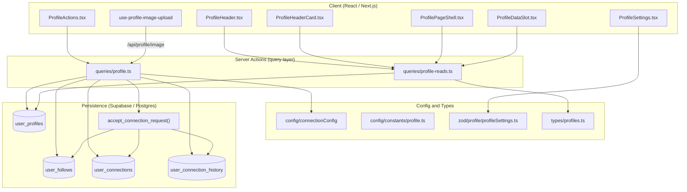
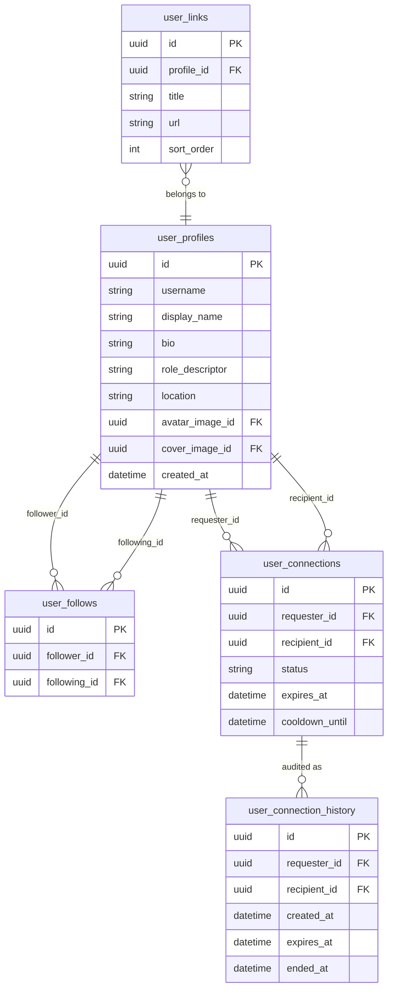
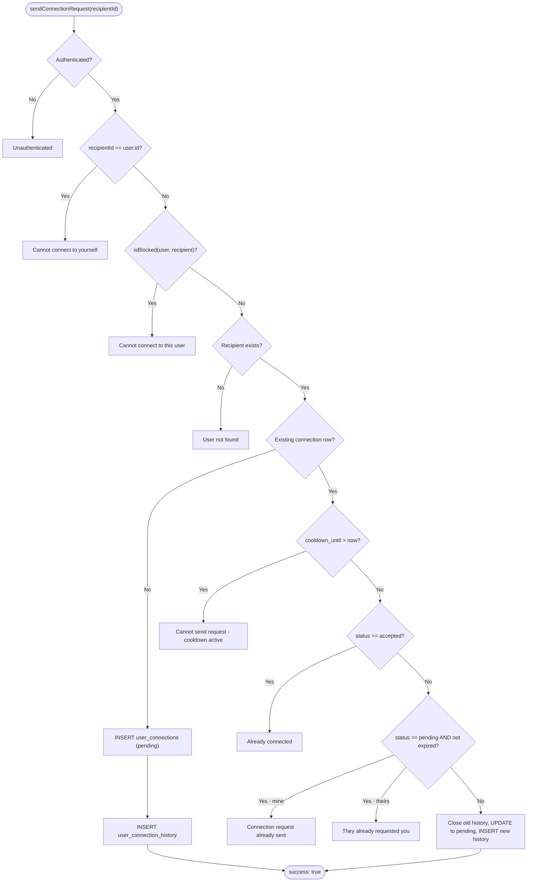
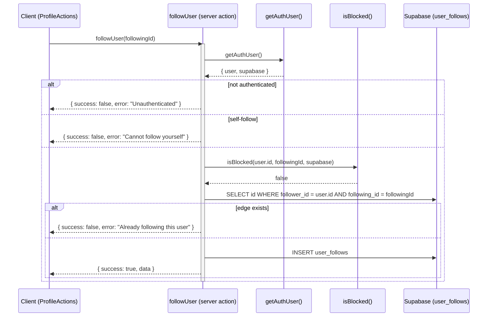
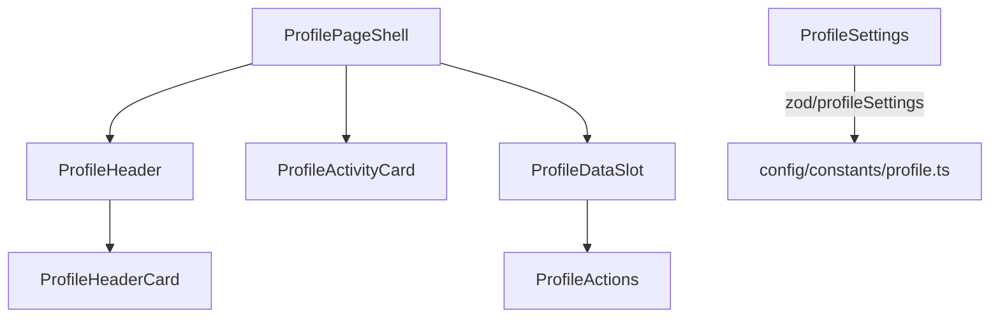

The User Profiles & Social Graph subsystem owns how a member is represented on Ozeaon (their public profile, avatar, cover image, links and role descriptor) and how members relate to each other through directed follows, bilateral connection requests, blocks, and the audit history that surrounds them.

## Purpose and Scope

This page documents the end-to-end implementation of two tightly-coupled capabilities:

- **Profiles** — the `user_profiles` record, its projections for cards and hero panels, the image upload pipeline for avatars and cover images, and the settings/validation layer.
- **Social graph** — the directed `user_follows` edge, the bilateral `user_connections` request lifecycle (pending → accepted / declined / cancelled / expired), the `user_connection_history` audit trail, and the blocking rules that gate both.

Related topics that are intentionally left to sibling pages:

- Authentication, session handling and `getAuthUser()` internals are covered by the authentication page; this page only consumes them.
- Generic image moderation/upload infrastructure (`useImageModeration`, `uploadModeratedImage`) is documented with the media/upload feature — this page documents only how the profile-specific upload hook wires into it.
- Organization follows (`organization_follows`) are an organization-feature concern and are not part of the user-to-user social graph described here.

## Overview

Ozeaon models two distinct kinds of user-to-user relationship, and the distinction is deliberate:

| Relationship | Table | Semantics | Consent |
|--------------|-------|-----------|---------|
| **Follow** | `user_follows` | Asymmetric, one-directional "interest" edge (`follower_id` → `following_id`) | None needed — anyone may follow anyone |
| **Connection** | `user_connections` | Bilateral, mutual relationship that requires an invitation and acceptance | Explicit — the recipient must accept |

A **connection** carries an emergent side effect: accepting a connection request creates *mutual follows*. This is why `acceptConnectionRequest` is delegated to a single Postgres function (`accept_connection_request`) that performs the status update, the mutual follow inserts, the cooldown clearing, and the audit history write **atomically** — the comment in the source states this explicitly:

```ts
// Handles status update, mutual follows, cooldown clearing, and audit history atomically
const { data, error } = await supabase.rpc("accept_connection_request", {
  p_request_id: requestId,
  p_recipient_id: user.id,
});
```

> Source: [profile.ts](https://github.com/ozeaon/ozeaon-v2/blob/0a4f1a95824db87782f1221a4108019d174df3d9/src/lib/supabase/queries/profile.ts#L169-L173)

The connection lifecycle is additionally governed by two configuration values exposed from a dedicated config module:

- `getConnectionRequestCooldownEnd()` — how long a party must wait before re-requesting after a terminal outcome.
- `getConnectionRequestExpiration()` — the TTL stamped onto a `pending` request (`expires_at`).

These are imported at the top of the profile query module, which keeps the time-policy in one place rather than scattered across call sites:

```ts
import {
  getConnectionRequestCooldownEnd,
  getConnectionRequestExpiration,
} from "@/config/connectionConfig";
```

> Source: [profile.ts](https://github.com/ozeaon/ozeaon-v2/blob/0a4f1a95824db87782f1221a4108019d174df3d9/src/lib/supabase/queries/profile.ts#L3-L6)

### Key concepts

- **Profile projection** — profiles are read through named column projections rather than `select("*")` so that cards fetch only what they render. `USER_CARD_SELECT` and `USER_GRID_CARD_SELECT` are the canonical examples.
- **Request reuse** — a row in `user_connections` is never deleted for expired/declined/cancelled outcomes; it is *reused* (`status` reset to `pending`, `requester_id`/`recipient_id` possibly swapped) so a single physical row tracks the relationship between two users over time.
- **Audit history** — every pending window is mirrored into `user_connection_history` with `created_at` / `expires_at` / `ended_at`, closing the current window whenever the outcome becomes terminal.
- **Blocking gate** — both `sendConnectionRequest` and `followUser` call `isBlocked(user.id, targetId, supabase)` before writing, and fail with a generic "Cannot …" message that does not leak whether a block exists.

## Architecture

The subsystem is layered: React components and hooks on the client, Next.js Server Actions for all mutations, and Supabase (with one Postgres function for the atomic accept path) for persistence.



**Why this shape:** all mutations live behind `"use server"` in `queries/profile.ts`. Client components never talk to the tables directly — they call exported async functions, so authorization (`getAuthUser()`), block checks, and time-policy enforcement are applied uniformly on the server. Reads, by contrast, use `createPublicClient()` and are wrapped in React's `cache()` so that a profile page rendering several cards does not re-query the same username.

## Profile Data Model and Projections

A `UserProfile` is the raw `user_profiles` row augmented with joined relations. The type is defined by intersecting the generated table type with optional joined fields:

```ts
export type UserProfile = Tables<"user_profiles"> & {
  avatar_image?: Image | null;
  cover_image?: Image | null;
  user_links?: Pick<Tables<"user_links">, "id" | "title" | "url">[];
  user_metadata?: Record<string, string>;
  email?: string;
};
```

> Source: [profiles.ts](https://github.com/ozeaon/ozeaon-v2/blob/0a4f1a95824db87782f1221a4108019d174df3d9/src/types/profiles.ts#L4-L10)

Note that `avatar_image` and `cover_image` are *relation-shaped* (`Image` from `types/shared`), not raw IDs — the query layer resolves the `images!avatar_image_id` foreign key in the same `select`, so the type mirrors the wire shape.

### Card projections

Rather than selecting `*`, the read layer exposes two reusable projection strings. This keeps card payloads small and consistent across every surface that renders a user:

```ts
/** The projection behind UserCardData. Nest it wherever a profile is joined for a card. */
export const USER_CARD_SELECT =
  "id, username, display_name, bio, role_descriptor, avatar_image_id, avatar_image:images!avatar_image_id(id, path, alt)";

/** The projection behind UserGridCardData — USER_CARD_SELECT plus the card's meta row. */
export const USER_GRID_CARD_SELECT = `${USER_CARD_SELECT}, location, created_at`;
```

> Source: [profile-reads.ts](https://github.com/ozeaon/ozeaon-v2/blob/0a4f1a95824db87782f1221a4108019d174df3d9/src/lib/supabase/queries/profile-reads.ts#L8-L13)

`USER_CARD_SELECT` is intentionally composable: because it embeds the foreign-key alias syntax (`avatar_image:images!avatar_image_id`), it can be nested inside any other query that joins a profile, and it can be extended by string interpolation (as `USER_GRID_CARD_SELECT` does) to add the grid-only meta columns `location` and `created_at`.

### Read functions



The `user_connection_history` entity is the audit companion of `user_connections`: it is keyed by the *pair* (`requester_id`, `recipient_id`), and closing a window is expressed as setting `ended_at` on the row where `ended_at IS NULL` — a partial-uniqueness pattern that lets the code find "the current window" without a separate flag.

The read side exposes four cached helpers plus two list helpers:

| Function | Purpose | Caching |
|----------|---------|---------|
| `getNetworkProfiles(limit, offset)` | Newest-first network directory page | None (list) |
| `getUsersByIds(ids)` | Card data for an explicit set of ids | None (list) |
| `getProfileIdByUsername(username)` | Resolve username → profile UUID, or `null` | `cache()` |
| `getProfileHeroDataByUsername(username)` | Full hero profile with avatar, cover, ordered links | `cache()` |
| `getProfileActivityCounts(profileId)` | Published project & article counts | `cache()` |

`getNetworkProfiles` and the remaining list/aggregate reads are shown below — note the graceful degradation: a query error is logged and an empty result is returned rather than thrown, so one failing read cannot break an otherwise-renderable page.

```ts
/** Newest profiles first, for the network directory. */
export async function getNetworkProfiles(
  limit = 24,
  offset = 0,
): Promise<UserGridCardData[]> {
  const supabase = createPublicClient();
  const { data, error } = await supabase
    .from("user_profiles")
    .select(USER_GRID_CARD_SELECT)
    .order("created_at", { ascending: false })
    .range(offset, offset + limit - 1);

  if (error) {
    logError(logger, "getNetworkProfiles failed", error, { limit, offset });
    return [];
  }

  return data ?? [];
}
```

> Source: [profile-reads.ts](https://github.com/ozeaon/ozeaon-v2/blob/0a4f1a95824db87782f1221a4108019d174df3d9/src/lib/supabase/queries/profile-reads.ts#L15-L33)

The hero read resolves both images and the ordered `user_links` relation in a single request, ordering the nested table by `sort_order`:

```ts
export const getProfileHeroDataByUsername = cache(
  async (username: string): Promise<UserProfile | null> => {
    const supabase = createPublicClient();
    const { data: profile } = await supabase
      .from("user_profiles")
      .select(
        "*, avatar_image:images!avatar_image_id(id, path, alt), cover_image:images!cover_image_id(id, path, alt), user_links(id, title, url, sort_order)",
      )
      .eq("username", username)
      .order("sort_order", { referencedTable: "user_links" })
      .single();

    return profile ?? null;
  },
);
```

> Source: [profile-reads.ts](https://github.com/ozeaon/ozeaon-v2/blob/0a4f1a95824db87782f1221a4108019d174df3d9/src/lib/supabase/queries/profile-reads.ts#L67-L81)

`getProfileActivityCounts` runs the two counts concurrently with `Promise.all`, using `count: "exact", head: true` so no rows are transferred — only the aggregate counts. Note the article predicate excludes organization-authored articles (`organization_id IS NULL`) so the count reflects only personally-authored, published work.

```ts
export const getProfileActivityCounts = cache(
  async (
    profileId: string,
  ): Promise<{ projectCount: number; articleCount: number }> => {
    const supabase = createPublicClient();
    const [{ count: projectCount }, { count: articleCount }] =
      await Promise.all([
        supabase
          .from("projects")
          .select("id", { count: "exact", head: true })
          .eq("owner_id", profileId)
          .eq("published", true),
        supabase
          .from("articles")
          .select("id", { count: "exact", head: true })
          .eq("author_id", profileId)
          .is("organization_id", null)
          .eq("published", true),
      ]);

    return {
      projectCount: projectCount ?? 0,
      articleCount: articleCount ?? 0,
    };
  },
);
```

> Source: [profile-reads.ts](https://github.com/ozeaon/ozeaon-v2/blob/0a4f1a95824db87782f1221a4108019d174df3d9/src/lib/supabase/queries/profile-reads.ts#L83-L107)

## Connection Request Lifecycle

The connection flow is the heart of the social graph. `sendConnectionRequest` is a single Server Action that must decide between five mutually exclusive outcomes for an existing row. The ordering of the checks matters and follows a deliberate precedence:

1. **Authentication** — reject immediately if there is no `user`.
2. **Self-request** — reject `recipientId === user.id`.
3. **Blocking** — `isBlocked(...)` short-circuits before any other DB work.
4. **Recipient existence** — a `maybeSingle()` lookup guards against orphan requests.
5. **Existing row** — cooldown → already-accepted → pending (mine vs theirs) → expired/declined/cancelled reuse.



### The cooldown gate

The cooldown is stored on the connection row itself (`cooldown_until`), not derived on the fly, and it is checked before any other status logic. This means a cooldown takes precedence over a stale `pending` or an `accepted` status:

```ts
if (existingRequest) {
  // Check cooldown on the existing connection row
  if (
    existingRequest.cooldown_until &&
    new Date(existingRequest.cooldown_until) > new Date()
  ) {
    return {
      success: false,
      error: "Cannot send request - cooldown period active",
      cooldownUntil: existingRequest.cooldown_until,
    };
  }
  if (existingRequest.status === "accepted") {
    return { success: false, error: "Already connected with this user" };
  }
```

> Source: [profile.ts](https://github.com/ozeaon/ozeaon-v2/blob/0a4f1a95824db87782f1221a4108019d174df3d9/src/lib/supabase/queries/profile.ts#L57-L71)

The error response carries `cooldownUntil` so the UI can show a specific "try again at" message rather than a generic failure.

### Detecting the direction of a pending request

Because `user_connections` stores one row per *pair*, the code must distinguish "I sent it" from "they sent it". The `.or(...)` filter fetches the row regardless of direction, and the `requester_id` comparison then picks the message:

```ts
const { data: existingRequest } = await supabase
  .from("user_connections")
  .select(
    "id, status, requester_id, recipient_id, expires_at, cooldown_until",
  )
  .or(
    `and(requester_id.eq.${user.id},recipient_id.eq.${recipientId}),and(requester_id.eq.${recipientId},recipient_id.eq.${user.id})`,
  )
  .maybeSingle();
```

> Source: [profile.ts](https://github.com/ozeaon/ozeaon-v2/blob/0a4f1a95824db87782f1221a4108019d174df3d9/src/lib/supabase/queries/profile.ts#L47-L55)

This non-directional lookup is what makes a reciprocal request impossible: if a pending request exists in either direction, the code refuses to create a second one, instead telling the user "This user has already sent you a connection request".

### Reuse rather than delete

Expired, declined, and cancelled rows are *revived*. The revival closes the open history window, flips the row back to `pending`, and — importantly — **reassigns `requester_id` to the current caller**, so a previously declined recipient can now become the requester:

```ts
// Reuse expired, declined, or cancelled request
if (
  isExpired ||
  existingRequest.status === "declined" ||
  existingRequest.status === "cancelled"
) {
  // Close old history
  await supabase
    .from("user_connection_history")
    .update({ ended_at: new Date().toISOString() })
    .eq("requester_id", existingRequest.requester_id)
    .eq("recipient_id", existingRequest.recipient_id)
    .is("ended_at", null);

  // Update request
  const { data, error } = await supabase
    .from("user_connections")
    .update({
      status: "pending",
      requester_id: user.id,
      recipient_id: recipientId,
      expires_at: getConnectionRequestExpiration(),
    })
    .eq("id", existingRequest.id)
    .select()
    .single();
```

> Source: [profile.ts](https://github.com/ozeaon/ozeaon-v2/blob/0a4f1a95824db87782f1221a4108019d174df3d9/src/lib/supabase/queries/profile.ts#L89-L114)

### Accepting — the atomic path

Acceptance is the only operation that spans three tables (connection status, both follow edges, and history), so it is delegated to a Postgres function. The Server Action is a thin wrapper that simply forwards the request id and the caller's id and interprets the JSON result:

```ts
export async function acceptConnectionRequest(requestId: string) {
  const { user, supabase } = await getAuthUser();

  if (!user) {
    return { success: false, error: "Unauthenticated" };
  }

  // Handles status update, mutual follows, cooldown clearing, and audit history atomically
  const { data, error } = await supabase.rpc("accept_connection_request", {
    p_request_id: requestId,
    p_recipient_id: user.id,
  });

  if (error) {
    return { success: false, error: error.message };
  }

  const result = data as AcceptConnectionResult | null;

  if (!result || !result.success) {
    return {
      success: false,
      error: result?.error || "Failed to accept request",
    };
  }

  return { success: true, data: result.data };
}
```

> Source: [profile.ts](https://github.com/ozeaon/ozeaon-v2/blob/0a4f1a95824db87782f1221a4108019d174df3d9/src/lib/supabase/queries/profile.ts#L162-L189)

The RPC returns a structured envelope typed as:

```ts
type AcceptConnectionResult = {
  success: boolean;
  error?: string;
  data?: { connection_id: string; follow_id: string };
};
```

> Source: [profile.ts](https://github.com/ozeaon/ozeaon-v2/blob/0a4f1a95824db87782f1221a4108019d174df3d9/src/lib/supabase/queries/profile.ts#L12-L16)

Passing `p_recipient_id: user.id` is a deliberate authorization check *inside* the database function: even though the function is called over the server-side client, it re-verifies that the caller is the intended recipient rather than trusting the application layer.

### Declining and cancelling

Decline and cancel are implemented application-side (they do not touch the follow edges), but they still enforce the two invariants:

- **Recipient identity** — the decline update is scoped with `.eq("recipient_id", user.id)`, so a non-recipient cannot decline a request.
- **History closure** — the matched history window is closed by setting `ended_at` where `ended_at IS NULL`.

```ts
// Get request details
const { data: connectionRequest } = await supabase
  .from("user_connections")
  .select("requester_id, recipient_id")
  .eq("id", requestId)
  .eq("recipient_id", user.id)
  .maybeSingle();

if (!connectionRequest) {
  return { success: false, error: "Request not found" };
}

// Update status
const { data, error } = await supabase
  .from("user_connections")
  .update({ status: "declined" })
  .eq("id", requestId)
  .eq("recipient_id", user.id)
  .select()
  .single();
```

> Source: [profile.ts](https://github.com/ozeaon/ozeaon-v2/blob/0a4f1a95824db87782f1221a4108019d174df3d9/src/lib/supabase/queries/profile.ts#L198-L217)

## Follow Graph

Following is intentionally simpler than connecting: no consent, no expiry, no history. It is guarded only by the same block check and a duplicate-edge check.



The guard sequence reads directly from the source: self-follow rejection, then the block gate, then the duplicate-edge check keyed on the `(follower_id, following_id)` pair.

```ts
export async function followUser(followingId: string) {
  const { user, supabase } = await getAuthUser();

  if (followingId === user.id) {
    return { success: false, error: "Cannot follow yourself" };
  }

  // Check if either user has blocked the other
  const blocked = await isBlocked(user.id, followingId, supabase);
  if (blocked) {
    return { success: false, error: "Cannot follow this user" };
  }

  // Check if already following
  const { data: existing } = await supabase
    .from("user_follows")
    .select("id")
    .eq("follower_id", user.id)
    .eq("following_id", followingId)
```

> Source: [profile.ts](https://github.com/ozeaon/ozeaon-v2/blob/0a4f1a95824db87782f1221a4108019d174df3d9/src/lib/supabase/queries/profile.ts#L332-L354)

**Design intent:** because blocks are checked in *both* `followUser` and `sendConnectionRequest`, a block is enforced consistently across every write path in the social graph without the block table needing to be consulted by the UI. The error strings are deliberately vague ("Cannot follow this user") so that a blocked user cannot distinguish a block from a generic failure.

## Profile Image Upload Pipeline

Avatars and cover images share one hook parameterized by image type, which keeps the two upload paths identical in behavior (moderation, error mapping, refresh) while differing only in the API type query parameter.

```ts
type ProfileImageType = "avatar" | "coverImage";

interface UseProfileImageUploadOptions {
  type: ProfileImageType;
  // ...
}
```

> Sources:
> - [use-profile-image-upload.ts](https://github.com/ozeaon/ozeaon-v2/blob/0a4f1a95824db87782f1221a4108019d174df3d9/src/hooks/use-profile-image-upload.ts#L10-L12)

The hook delegates to the shared `uploadModeratedImage` helper for the actual upload (and therefore inherits content moderation), targeting a type-scoped endpoint:

```ts
const result = await uploadModeratedImage(
  `/api/profile/image?type=${type}`,
  named,
```

> Source: [use-profile-image-upload.ts](https://github.com/ozeaon/ozeaon-v2/blob/0a4f1a95824db87782f1221a4108019d174df3d9/src/hooks/use-profile-image-upload.ts#L49-L51)

After a successful upload it refreshes the cached profile and the Next.js route cache so the new image appears immediately without a full reload:

```ts
await refreshProfile();
router.refresh();
```

> Source: [use-profile-image-upload.ts](https://github.com/ozeaon/ozeaon-v2/blob/0a4f1a95824db87782f1221a4108019d174df3d9/src/hooks/use-profile-image-upload.ts#L63-L64)

Removal follows the same refresh pattern but issues a `DELETE` to the same endpoint:

```ts
const response = await fetch(`/api/profile/image?type=${type}`, {
  method: "DELETE",
```

> Source: [use-profile-image-upload.ts](https://github.com/ozeaon/ozeaon-v2/blob/0a4f1a95824db87782f1221a4108019d174df3d9/src/hooks/use-profile-image-upload.ts#L80-L81)

The hook pulls `refreshProfile` from the auth context (`useAuth()`), which is why the profile image state is shared with the rest of the session rather than being component-local.

## Profile Component Surface

The profile UI is decomposed into a shell, a header, an activity card, and user-specific action/data slots:



- **`ProfilePageShell`** provides the shared page chrome used by both user and organization profiles.
- **`ProfileHeader` / `ProfileHeaderCard`** render the hero data resolved by `getProfileHeroDataByUsername`.
- **`ProfileActivityCard`** surfaces the counts from `getProfileActivityCounts`.
- **`ProfileActions`** is the user-specific slot (follow / connect / block controls) that calls into the Server Actions documented above.
- **`ProfileDataSlot`** is the data-fetching boundary for user profiles.
- **`ProfileSettings`** is the owner-facing editor, validated by `zod/profile/profileSettings.ts` against the shared constants in `config/constants/profile.ts`.

Because the shell is shared, user and organization profiles stay visually consistent while their action slots remain fully independent — a separation that prevents the social-graph actions (which only make sense for users) from leaking into the organization profile surface.

## API Reference

All mutations are Next.js Server Actions exported from `src/lib/supabase/queries/profile.ts`. Every one of them follows the same envelope contract: an object with `success: boolean`, an optional `error: string`, and an optional `data` payload. None of them throw for expected failures — the caller branches on `success`.

### `sendConnectionRequest(recipientId: string)`

Initiates a connection request, reusing an existing row when the prior outcome was terminal.

**Parameters:**
- `recipientId` (string): the `user_profiles.id` of the intended recipient.

**Returns:** `{ success: true, data }` on success; on failure `{ success: false, error: string }`, and additionally `cooldownUntil: string` when the failure is a cooldown.

**Failure modes:** `"Unauthenticated"`, `"Cannot connect to yourself"`, `"Cannot connect to this user"` (blocked), `"User not found"`, `"Cannot send request - cooldown period active"`, `"Already connected with this user"`, `"Connection request already sent"`, `"This user has already sent you a connection request"`, or a raw Postgres `error.message`.

### `acceptConnectionRequest(requestId: string)`

Accepts a pending request. Delegates to the `accept_connection_request` Postgres function, which atomically updates the status, creates mutual follows, clears the cooldown, and closes the audit history.

**Parameters:**
- `requestId` (string): the `user_connections.id`.

**Returns:** `{ success: true, data }` where `data` is `{ connection_id: string; follow_id: string }`.

**Failure modes:** `"Unauthenticated"`, `"Failed to accept request"`, or the error returned inside the RPC envelope.

### `declineConnectionRequest(requestId: string)`

Declines a pending request directed at the caller.

**Parameters:**
- `requestId` (string): the `user_connections.id`.

**Returns:** `{ success: true, data }` with the updated row.

**Failure modes:** `"Unauthenticated"`, `"Request not found"` (scoped to `recipient_id = user.id`).

### `cancelConnectionRequest(requestId: string)`

Cancels a pending request the caller previously sent.

**Parameters:**
- `requestId` (string): the `user_connections.id`.

**Returns:** `{ success: true, data }` with the updated row.

**Failure modes:** `"Unauthenticated"` plus the row-level error from the scoped update.

### `followUser(followingId: string)`

Creates a directed follow edge.

**Parameters:**
- `followingId` (string): the target `user_profiles.id`.

**Returns:** `{ success: true, data }` with the inserted edge.

**Failure modes:** `"Unauthenticated"`, `"Cannot follow yourself"`, `"Cannot follow this user"` (blocked), `"Already following this user"`.

### Read API

| Function | Signature | Returns |
|----------|-----------|---------|
| `getNetworkProfiles` | `(limit = 24, offset = 0)` | `Promise<UserGridCardData[]>` — empty array on error |
| `getUsersByIds` | `(ids: string[])` | `Promise<UserCardData[]>` — `[]` for empty input or error |
| `getProfileIdByUsername` | `(username: string)` | `Promise<string \| null>` — memoized via `cache()` |
| `getProfileHeroDataByUsername` | `(username: string)` | `Promise<UserProfile \| null>` — memoized |
| `getProfileActivityCounts` | `(profileId: string)` | `Promise<{ projectCount; articleCount }>` — memoized, zeroed on null counts |

## Configuration Options

| Option | Source | Purpose |
|--------|--------|---------|
| `getConnectionRequestCooldownEnd()` | `@/config/connectionConfig` | Derives the `cooldown_until` value applied after a terminal connection outcome |
| `getConnectionRequestExpiration()` | `@/config/connectionConfig` | Derives the `expires_at` stamped on every `pending` request; a `pending` row past this time is treated as reusable |
| `ProfileImageType` (`"avatar" \| "coverImage"`) | `hooks/use-profile-image-upload.ts` | Selects which image slot the hook uploads/removes, via `?type=` on `/api/profile/image` |
| Profile settings schema | `zod/profile/profileSettings.ts` | Validates the owner-facing profile editor payload |
| Profile constants | `config/constants/profile.ts` | Shared limits/constraints consumed by both the settings schema and UI components |

> The concrete default values for the cooldown and expiration windows live in `src/config/connectionConfig`; this page documents how they are consumed, and the connection config module is the authoritative source for their numeric defaults.

## Failure Modes, Edge Cases & Concurrency

**Direction-agnostic uniqueness.** The `.or(...)` two-way filter in `sendConnectionRequest` is the mechanism that prevents two opposing pending requests from existing simultaneously. There is no unique constraint doing this at the application visible layer — it is enforced by the read-then-branch logic, so any change to that filter risks allowing a reciprocal duplicate.

**Cooldown precedence.** Cooldown is evaluated *before* the `accepted` and `pending` branches. A row with an active `cooldown_until` therefore reports a cooldown error even if its status would otherwise produce a more specific message.

**Expiry is computed, not scheduled.** `isExpired` is derived at read time (`status === "pending" && expires_at < now`). There is no background job flipping expired rows; expiry only takes effect the next time someone attempts to send a request.

**Atomicity on accept only.** Acceptance is the sole operation with cross-table writes (status + two follows + history) and is therefore pushed into a Postgres function. Decline and cancel touch the connection row and history separately as two sequential statements — a failure between them can leave an open history window, which is why the history closure is best-effort-style and keyed on `ended_at IS NULL`.

**Blocking is a gate, not a filter.** `isBlocked` is called at write time in both `followUser` and `sendConnectionRequest`. Blocked relationships are rejected with generic messages that do not disclose the block. Blocking also does not retro-actively delete existing follow edges — it prevents new ones.

**Silent degradation on reads.** Every read helper catches the Supabase error, logs it through `logError(logger, ...)` with structured context (e.g. `{ limit, offset }` or `{ ids }`), and returns an empty/null result. A single failed join cannot turn a profile page into a 500.

**Self-targeting guardrails.** Both `followUser` and `sendConnectionRequest` reject `targetId === user.id` before any database access, so self-edges cannot exist even if a caller bypasses the UI.

## Performance & Operational Notes

- **Projection discipline.** `USER_CARD_SELECT` / `USER_GRID_CARD_SELECT` avoid `*`, and `getProfileActivityCounts` uses `head: true` count-only queries — card lists and profile headers never transfer row bodies they will not render.
- **Server-side memoization.** `cache()` on `getProfileIdByUsername`, `getProfileHeroDataByUsername`, and `getProfileActivityCounts` deduplicates per-request work; a page that resolves a username in several components performs one query.
- **Parallel aggregates.** The two activity counts run under a single `Promise.all` instead of sequentially, halving the latency of the header statistics.
- **Single-round-trip hero.** Avatar, cover, and ordered links are resolved in one nested `select` with `referencedTable: "user_links"` ordering, avoiding a second request for links.
- **Pagination by range.** `getNetworkProfiles` uses `.range(offset, offset + limit - 1)` against `created_at DESC`, giving stable keyset-free pagination suitable for an infinite-scroll directory.

## Extension Points

- **Adding a card variant** — extend `USER_CARD_SELECT` by interpolation, mirroring `USER_GRID_CARD_SELECT`, rather than writing a new ad-hoc select string.
- **Changing connection time policy** — adjust `getConnectionRequestExpiration()` / `getConnectionRequestCooldownEnd()` in `config/connectionConfig`; both the insert path and the reuse path read from the same functions, so the policy stays consistent.
- **New image slots** — extend the `ProfileImageType` union and handle the new `?type=` value in `/api/profile/image`; the hook requires no other change.
- **Relationship semantics** — new cross-table relationship operations should follow the `accept_connection_request` precedent and be implemented as Postgres functions so they remain atomic.

## Related Links

- Connection config: [src/config/connectionConfig](https://github.com/ozeaon/ozeaon-v2/blob/0a4f1a95824db87782f1221a4108019d174df3d9/src/config/connectionConfig)
- Profile query actions: [src/lib/supabase/queries/profile.ts](https://github.com/ozeaon/ozeaon-v2/blob/0a4f1a95824db87782f1221a4108019d174df3d9/src/lib/supabase/queries/profile.ts)
- Profile read projections: [src/lib/supabase/queries/profile-reads.ts](https://github.com/ozeaon/ozeaon-v2/blob/0a4f1a95824db87782f1221a4108019d174df3d9/src/lib/supabase/queries/profile-reads.ts)
- Profile types: [src/types/profiles.ts](https://github.com/ozeaon/ozeaon-v2/blob/0a4f1a95824db87782f1221a4108019d174df3d9/src/types/profiles.ts)
- Profile image upload hook: [src/hooks/use-profile-image-upload.ts](https://github.com/ozeaon/ozeaon-v2/blob/0a4f1a95824db87782f1221a4108019d174df3d9/src/hooks/use-profile-image-upload.ts)
- Profile settings schema: [src/zod/profile/profileSettings.ts](https://github.com/ozeaon/ozeaon-v2/blob/0a4f1a95824db87782f1221a4108019d174df3d9/src/zod/profile/profileSettings.ts)
- Profile constants: [src/config/constants/profile.ts](https://github.com/ozeaon/ozeaon-v2/blob/0a4f1a95824db87782f1221a4108019d174df3d9/src/config/constants/profile.ts)
- Profile components: [src/components/profiles](https://github.com/ozeaon/ozeaon-v2/blob/0a4f1a95824db87782f1221a4108019d174df3d9/src/components/profiles)
- Profile settings UI: [src/components/account/ProfileSettings.tsx](https://github.com/ozeaon/ozeaon-v2/blob/0a4f1a95824db87782f1221a4108019d174df3d9/src/components/account/ProfileSettings.tsx)
- Profile migrations: [20260622111000_add_user_profile_role_descriptor.sql](https://github.com/ozeaon/ozeaon-v2/blob/0a4f1a95824db87782f1221a4108019d174df3d9/supabase/migrations/20260622111000_add_user_profile_role_descriptor.sql), [20260623120000_profile_settings.sql](https://github.com/ozeaon/ozeaon-v2/blob/0a4f1a95824db87782f1221a4108019d174df3d9/supabase/migrations/20260623120000_profile_settings.sql)
