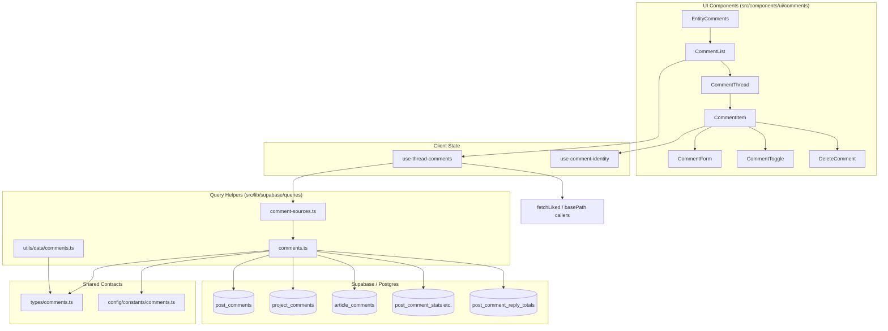
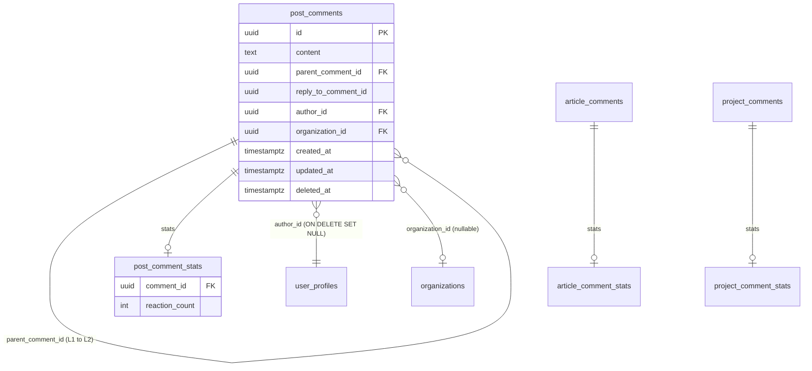
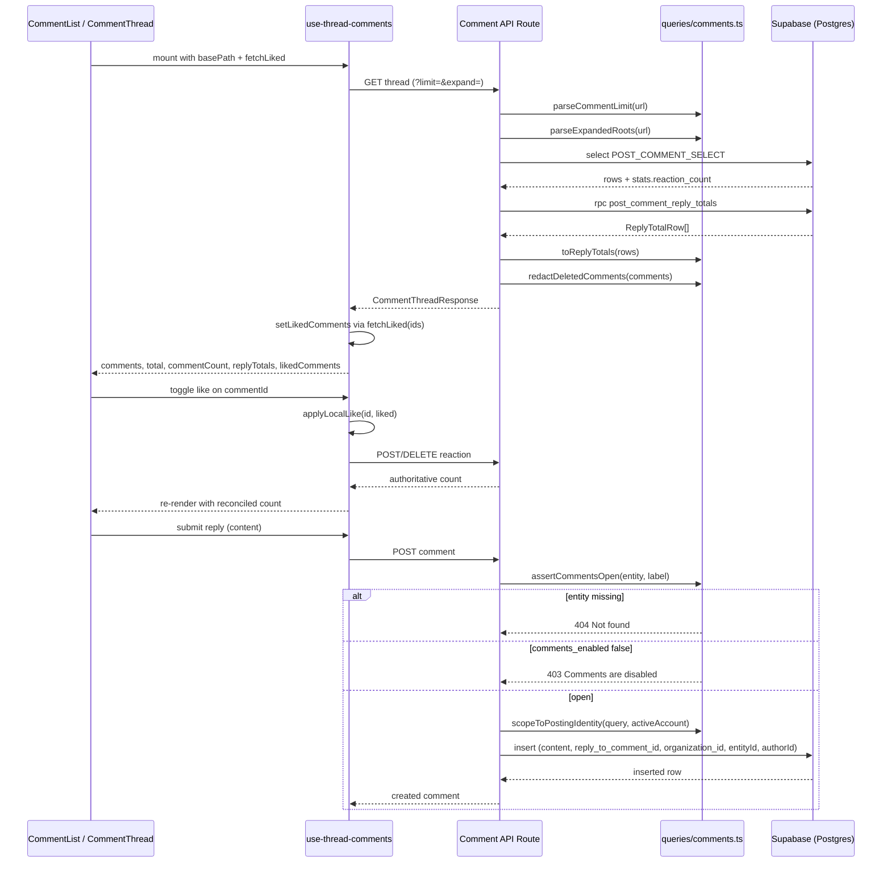

The Comments & Reactions subsystem provides entity-agnostic threaded discussions (posts, projects, and articles) with soft deletion, organisation-vs-user identity authorship, realtime updates, and per-comment reaction counting.

## Purpose and Scope

This page documents the full comment and reaction capability: the shared TypeScript type model, the Supabase query helpers that every comment route reuses, the configuration constants that govern pagination and folding, the client hook that drives thread state and optimistic likes, and the database-level mechanisms (realtime publication, soft deletion, reply totals) that back them.

It intentionally stays within the comment/reaction boundary. The following related topics are covered by sibling pages:

- **Authentication and active-account switching** — the `ActiveAccount` type used by authorship scoping is defined by the account subsystem; see the accounts/identity documentation for how an "acting identity" is determined.
- **Profiles and organisations** — `UserProfileForJoin`, `authoring_org` joins, and avatar/logo image resolution are part of the profile and organisation pages.
- **Posts, Projects and Articles** — this page explains how those entities *host* a comment thread (`comments_enabled` gating, entity FK columns), but the entities themselves belong to their own catalog pages.
- **Notifications** — reaction and reply notification delivery is not implemented in the files reviewed here; see the notifications page.

## Overview

Comments are modelled once and projected onto three entity tables (`post_comments`, `project_comments`, `article_comments`). Rather than three parallel implementations, the codebase derives an entity-agnostic shape from a single canonical table and re-adds the entity-specific foreign key at the edge. This is the central design intent of the subsystem: **write the thread logic once, let each entity contribute only its foreign key**.

Key concepts:

| Concept | Meaning |
| --- | --- |
| **Thread** | The ordered set of Level 1 comments plus their Level 2 replies for one entity instance. |
| **Level 1 / Level 2** | A root comment and a reply. `parent_comment_id` is null on roots and set on replies. |
| **`reply_to_comment_id`** | Insert-time pointer recording which comment a reply answers (distinct from `parent_comment_id`, which anchors the thread). |
| **Acting identity** | A user *or* an organisation. `organization_id` on the comment row records which hat was worn. |
| **Soft delete** | `deleted_at` is set; the row survives so replies keep their anchor, but `content` is stripped. |
| **Redaction** | The server-side step that empties `content` on deleted rows before they leave the API. |
| **Reaction count** | A denormalised counter carried on the `*_comment_stats` view/table, surfaced as `stats.reaction_count`. |

Reactions are intentionally thin: the feed exposes a **count** per comment and a per-viewer **liked set**, not a full reaction ledger. The count comes from the database aggregations joined into the select; the "did I like this" answer is fetched separately through a caller-supplied `fetchLiked` function.

## Architecture



The layering is deliberate. `types/comments.ts` sits at the bottom and depends only on the generated Supabase `Database` type, so a fourth comment table entering the schema automatically widens the union type. `lib/supabase/queries/comments.ts` holds the route-shared helpers and the three select projections. The `use-thread-comments` hook owns all mutable client-side thread state, keeping the presentational `CommentList`/`CommentItem` components free of data-fetching concerns.

## Type Model and Entity Genericity

The type layer is where most of the subsystem's design intent is encoded. Every comment-bearing entity shares the same row shape; only the foreign key differs.

### Deriving the entity list from the schema

Instead of hardcoding `"post" | "project" | "article"`, the entity list is computed from the generated database type by template-literal matching:

```typescript
/** The three entities that carry a comment thread, read off the schema so a
 * fourth comment table joins the union on its own. */
export type CommentEntity =
  Extract<
    keyof Database["public"]["Tables"],
    `${string}_comments`
  > extends infer Table
    ? Table extends `${infer Entity}_comments`
      ? Entity
      : never
    : never;
```

> Source: [comments.ts](https://github.com/ozeaon/ozeaon-v2/blob/0a4f1a95824db87782f1221a4108019d174df3d9/src/types/comments.ts#L22-L32)

This is a deliberate trade-off: adding a `poll_comments` table to the schema widens `CommentEntity` to include `"poll"` with no type-layer edits. It also means a misnamed table (for example `comment_threads`) simply never participates.

### The shared thread shape

`ThreadComment` is derived from `post_comments` with the entity FK removed via `Omit`, then re-augmented with the joined relations:

```typescript
export type ThreadComment = Omit<Tables<"post_comments">, "post_id"> & {
  author: UserProfileForJoin | null;
  authoring_org:
    | (Pick<Tables<"organizations">, "id" | "name" | "slug" | "verified"> & {
        logo_image: Pick<Tables<"images">, "path"> | null;
      })
    | null;
  stats: Pick<Tables<"post_comment_stats">, "reaction_count"> | null;
};
```

> Source: [comments.ts](https://github.com/ozeaon/ozeaon-v2/blob/0a4f1a95824db87782f1221a4108019d174df3d9/src/types/comments.ts#L12-L20)

Two details matter operationally:

- `author` is **nullable** because `author_id` uses `ON DELETE SET NULL`. An orphaned comment renders as "deleted user" rather than disappearing.
- `authoring_org` is **nullable** because user-authored comments leave `organization_id` null. Exactly one of `author` / `authoring_org` is the credited identity; `AuthoredComment` captures the pair for display purposes.

### The gating entity

Writing requires the host entity's `comments_enabled` flag, which is why a separate narrower type exists:

```typescript
export type CommentableEntity =
  | Pick<Tables<"posts">, "comments_enabled">
  | Pick<Tables<"projects">, "comments_enabled">
  | Pick<Tables<"articles">, "comments_enabled">;
```

> Source: [comments.ts](https://github.com/ozeaon/ozeaon-v2/blob/0a4f1a95824db87782f1221a4108019d174df3d9/src/types/comments.ts#L34-L38)

### Response envelope

The thread response is richer than a plain array, because the UI needs counts that cannot be inferred from the loaded (capped) rows:

```typescript
export interface CommentThreadResponse<T> {
  comments: T[];
  /** Level 1 comments in the thread, used to size the Show more control. */
  total: number;
  /** Every live comment and reply in the thread (CO-05). */
  commentCount: number;
  /** Replies held per Level 1 comment; the loaded rows are capped below it. */
  replyTotals: Record<string, number>;
}
```

> Source: [comments.ts](https://github.com/ozeaon/ozeaon-v2/blob/0a4f1a95824db87782f1221a4108019d174df3d9/src/types/comments.ts#L85-L93)

The distinction between `total`, `commentCount`, and `replyTotals` is the crux of the pagination design: `comments` holds only what was fetched, `total` sizes the "Show more" control, `commentCount` powers a full-thread badge, and `replyTotals` reports replies that exist but were not returned.

## Query Layer: Shared Helpers

`src/lib/supabase/queries/comments.ts` is imported by every comment route. It contains the select projections, the identity-scoping helpers, the deleted-comment redaction pass, and the pagination parsers.

### Select projections are literal strings

```typescript
// Kept as literal strings — Supabase infers row types from the select text, so a
// dynamically built select would collapse to an untyped result.
export const POST_COMMENT_SELECT = `
  *,
  author:user_profiles(id,display_name,username,avatar_image_id,avatar_image:images!avatar_image_id(id,path,alt)),
  authoring_org:organizations!post_comments_organization_id_fkey(id,name,slug,verified,logo_image:images!organizations_logo_image_id_fkey(path)),
  stats:post_comment_stats(reaction_count)
` as const;
```

> Source: [comments.ts](https://github.com/ozeaon/ozeaon-v2/blob/0a4f1a95824db87782f1221a4108019d174df3d9/src/lib/supabase/queries/comments.ts#L12-L19)

The comment above the constant explains a real constraint: because Supabase's client infers result types from the *select string literal*, building the select dynamically (for example `select(\`*, stats:${table}_stats(...)\`)`) would erase the inferred types. The cost of type safety here is three near-identical constants — `POST_COMMENT_SELECT`, `PROJECT_COMMENT_SELECT`, and `ARTICLE_COMMENT_SELECT` — each naming its own foreign key constraint explicitly (`!post_comments_organization_id_fkey`, `!project_comments_organization_id_fkey`, `!article_comments_organization_id_fkey`). The `!constraint` disambiguation syntax is required because `organizations` is reachable from a comment row by more than one path after the joins are added.

Each projection embeds the reaction count through the entity's stats relation, which is why `stats.reaction_count` is available on `ThreadComment` without a second round trip.

### Identity-scoped mutations

Edit and delete must be limited to the comment written by the *currently acting* identity. Authorship alone is insufficient:

```typescript
export function scopeToPostingIdentity<
  Q extends {
    eq(column: "organization_id", value: string): Q;
    is(column: "organization_id", value: null): Q;
  },
>(query: Q, activeAccount: ActiveAccount): Q {
  return activeAccount.type === "org"
    ? query.eq("organization_id", activeAccount.id)
    : query.is("organization_id", null);
}
```

> Source: [comments.ts](https://github.com/ozeaon/ozeaon-v2/blob/0a4f1a95824db87782f1221a4108019d174df3d9/src/lib/supabase/queries/comments.ts#L64-L73)

The doc comment above it states the intent precisely: *"someone commenting for an organisation must be wearing the same hat to edit or delete it."* A user who does not currently hold the org context cannot delete a comment the org posted, and vice versa. Switching identities therefore changes what you can mutate even though `author_id` is unchanged.

`scopeToOwnComment` composes that with the comment id and author id:

```typescript
export function scopeToOwnComment<
  Q extends {
    eq(column: "id", value: string): Q;
    eq(column: "author_id", value: string): Q;
    eq(column: "organization_id", value: string): Q;
    is(column: "organization_id", value: null): Q;
  },
>(query: Q, { commentId, authorId, activeAccount }: CommentScope): Q {
  return scopeToPostingIdentity(
    query.eq("id", commentId).eq("author_id", authorId),
    activeAccount,
  );
}
```

> Source: [comments.ts](https://github.com/ozeaon/ozeaon-v2/blob/0a4f1a95824db87782f1221a4108019d174df3d9/src/lib/supabase/queries/comments.ts#L75-L92)

Both helpers use a **fluent generic constraint** rather than importing a concrete query-builder type: the parameter `Q` is constrained to whatever object supports the needed `.eq`/`.is` calls, and the same `Q` is returned. This lets the helpers chain into any Supabase query builder without the caller losing type information, and it keeps these functions testable with plain stub objects.

Note the deliberate omission recorded in the doc comment: the entity foreign key is *not* applied here, because it is "the one column of the four that is named differently in every comment table" (`post_id`, `project_id`, `article_id`). The caller — the entity-specific route — adds it.

### Enabling checks are shared but separate from existence

```typescript
export function assertCommentsOpen(
  entity: CommentableEntity | null,
  label: string,
): NextResponse | null {
  if (!entity) {
    return NextResponse.json({ error: "Not found" }, { status: 404 });
  }

  if (!entity.comments_enabled) {
    return NextResponse.json(
      { error: `Comments are disabled for this ${label}` },
      { status: 403 },
    );
  }

  return null;
}
```

> Source: [comments.ts](https://github.com/ozeaon/ozeaon-v2/blob/0a4f1a95824db87782f1221a4108019d174df3d9/src/lib/supabase/queries/comments.ts#L94-L114)

The function returns `NextResponse | null` — a `null` return means "proceed". This makes route handlers read as `const denied = assertCommentsOpen(...); if (denied) return denied;`. The split between 404 and 403 is intentional and documented as AC-48: *"keeping the two apart so a bad id never reads as a disabled thread."* Returning 404 for a nonexistent entity prevents a caller from probing which post ids exist by observing whether the failure says "disabled".

### Soft-delete redaction

```typescript
export function redactDeletedComments<T extends RedactableComment>(
  comments: T[],
): T[] {
  return comments.map((comment) =>
    comment.deleted_at
      ? { ...comment, content: "", updated_at: null }
      : comment,
  );
}
```

> Source: [comments.ts](https://github.com/ozeaon/ozeaon-v2/blob/0a4f1a95824db87782f1221a4108019d174df3d9/src/lib/supabase/queries/comments.ts#L44-L57)

The doc comment spells out the data-retention contract (AC-23): a deleted comment keeps its author, timestamp and like count so the placeholder is still meaningful, and **the row itself is preserved** so replies stay anchored and can render "Reply to deleted comment". Redaction happens in the API response layer, not in the database — the row in Postgres still contains the original content.

## Pagination, Folding and Counting

The constants in `src/config/constants/comments.ts` define the whole pagination contract:

```typescript
export const COMMENT_MAX_LENGTH = 500;

/** Level 1 comments fetched per batch (CO-13). */
export const COMMENT_BATCH_SIZE = 5;

/** Level 2 replies shown before the Show replies control appears (RL-01). */
export const REPLY_FOLD_THRESHOLD = 2;

/**
 * Replies loaded per Level 1 comment once its thread is expanded. Threads are
 * capped rather than unbounded so one loud thread cannot blow the row ceiling
 * and silently starve its neighbours of replies.
 */
export const REPLY_EXPANDED_LIMIT = 200;

export const MAX_COMMENT_LIMIT = 200;
```

> Source: [comments.ts](https://github.com/ozeaon/ozeaon-v2/blob/0a4f1a95824db87782f1221a4108019d174df3d9/src/config/constants/comments.ts#L1-L16)

| Constant | Value | Role |
| --- | --- | --- |
| `COMMENT_MAX_LENGTH` | `500` | Character ceiling enforced on comment content. |
| `COMMENT_BATCH_SIZE` | `5` | Default page size for Level 1 comments (CO-13). |
| `REPLY_FOLD_THRESHOLD` | `2` | Replies shown before the "Show replies" control appears (RL-01). |
| `REPLY_EXPANDED_LIMIT` | `200` | Hard cap on replies loaded per expanded root. |
| `MAX_COMMENT_LIMIT` | `200` | Hard cap on Level 1 comments per request, and on `expand` ids. |

`REPLY_EXPANDED_LIMIT`'s comment documents the reason for a cap rather than unbounded expansion: without it, one high-traffic thread would consume the entire row budget and **silently starve its neighbours of replies** in the same response.

### Request parsing

```typescript
export function parseCommentLimit(url: string) {
  const requested = Number(new URL(url).searchParams.get("limit"));
  if (!Number.isFinite(requested) || requested < COMMENT_BATCH_SIZE) {
    return COMMENT_BATCH_SIZE;
  }
  return Math.min(Math.trunc(requested), MAX_COMMENT_LIMIT);
}
```

> Source: [comments.ts](https://github.com/ozeaon/ozeaon-v2/blob/0a4f1a95824db87782f1221a4108019d174df3d9/src/lib/supabase/queries/comments.ts#L35-L42)

The parser clamps in both directions: anything below the batch size (including `NaN`, negative values, and a missing parameter) falls back to `COMMENT_BATCH_SIZE`, and anything above `MAX_COMMENT_LIMIT` is truncated. `Math.trunc` normalises fractional inputs so `?limit=7.9` cannot produce a fractional SQL limit.

### Expanded-root parsing

```typescript
export function parseExpandedRoots(url: string): string[] {
  const raw = new URL(url).searchParams.get("expand");
  if (!raw) return [];

  return raw.split(",").filter(isUuid).slice(0, MAX_COMMENT_LIMIT);
}
```

> Source: [comments.ts](https://github.com/ozeaon/ozeaon-v2/blob/0a4f1a95824db87782f1221a4108019d174df3d9/src/lib/supabase/queries/comments.ts#L116-L122)

`expand` is a comma-separated list of Level 1 comment ids whose replies the client is currently rendering in full. Each entry passes the `isUuid` validator before reaching the database, so malformed tokens are dropped rather than sent as query parameters — this both prevents injection of unexpected SQL-ish values and keeps the `in()` filter list clean. The `slice` bounds the union of expanded threads to `MAX_COMMENT_LIMIT`.

### Reply totals

The loaded rows cannot answer "how many replies does this root actually have", because they are capped. A dedicated database function supplies the truth:

```typescript
export function toReplyTotals(rows: ReplyTotalRow[]): Record<string, number> {
  return Object.fromEntries(
    rows.map(({ root_id, reply_total }) => [root_id, reply_total]),
  );
}
```

> Source: [comments.ts](https://github.com/ozeaon/ozeaon-v2/blob/0a4f1a95824db87782f1221a4108019d174df3d9/src/lib/supabase/queries/comments.ts#L124-L132)

`ReplyTotalRow` is itself derived from the generated function return type rather than hand-written:

```typescript
export type ReplyTotalRow =
  Database["public"]["Functions"]["post_comment_reply_totals"]["Returns"][number];
```

> Source: [comments.ts](https://github.com/ozeaon/ozeaon-v2/blob/0a4f1a95824db87782f1221a4108019d174df3d9/src/types/comments.ts#L79-L80)

This is what makes the label **"Show {N} more replies"** accurate: `replyTotals[rootId]` is the authoritative count, while `comments[i].replies.length` is only the number currently loaded. Without this split, the control would either undercount or the API would have to return every reply.

### Thread assembly shape

```typescript
export type CommentThreadNode<T extends CommentThreadFields> = {
  comment: T;
  replies: T[];
};
```

> Source: [comments.ts](https://github.com/ozeaon/ozeaon-v2/blob/0a4f1a95824db87782f1221a4108019d174df3d9/src/types/comments.ts#L68-L71)

Threading needs only three columns, captured by `CommentThreadFields` (`id`, `parent_comment_id`, `created_at`) — identity, nesting level, and ordering.



The self-referencing relationship on `post_comments` is what makes Level 1 → Level 2 threading possible directly in one table; `deleted_at` is what allows the parent row to survive so that relationship is never broken.

## Client State: `use-thread-comments`

`src/hooks/use-thread-comments.ts` is the single owner of mutable thread state. Its option contract takes the entity-specific pieces as injected dependencies, which is how the hook stays entity-agnostic:

```typescript
fetchLiked: (commentIds: string[]) => Promise<string[]>;
```

> Source: [use-thread-comments.ts](https://github.com/ozeaon/ozeaon-v2/blob/0a4f1a95824db87782f1221a4108019d174df3d9/src/hooks/use-thread-comments.ts#L51)

The hook options include `basePath`, `fetchLiked`, and an optional `onCountChange` callback — meaning the hook never knows whether it is loading a post, project, or article thread, and never knows the reaction API's URL shape.

Tracked state:

```typescript
const [likedComments, setLikedComments] = useState<string[]>([]);
```

> Source: [use-thread-comments.ts](https://github.com/ozeaon/ozeaon-v2/blob/0a4f1a95824db87782f1221a4108019d174df3d9/src/hooks/use-thread-comments.ts#L63)

| State | Purpose |
| --- | --- |
| `likedComments` | Which comment ids the current viewer has reacted to. |
| `replyTotals` | Authoritative per-root reply counts (from `toReplyTotals`). |
| `isLoading` | Request-in-flight flag for the thread. |

### Optimistic reactions

Liking is applied to local state first, then reconciled:

```typescript
const applyLocalLike = useCallback((commentId: string, liked: boolean) => {
    setLikedComments((prev) =>
      liked ? [...prev, commentId] : prev.filter((id) => id !== commentId),
    );
```

> Source: [use-thread-comments.ts](https://github.com/ozeaon/ozeaon-v2/blob/0a4f1a95824db87782f1221a4108019d174df3d9/src/hooks/use-thread-comments.ts#L220-L223)

The id set and the displayed count are updated together, with the count floored at zero:

```typescript
stats: {
  reaction_count: Math.max(
    (comment.stats?.reaction_count ?? 0) + (liked ? 1 : -1),
```

> Source: [use-thread-comments.ts](https://github.com/ozeaon/ozeaon-v2/blob/0a4f1a95824db87782f1221a4108019d174df3d9/src/hooks/use-thread-comments.ts#L229-L231)

The `Math.max(..., 0)` guard is defensive: if a client's notion of "not liked" disagrees with the server's count (for example two tabs, or a count that arrived stale), decrementing cannot drive the display negative.

### Fetching the viewer's liked set

```typescript
const fetchLikedComments = useCallback(
    async (commentIds: string[]) => {
```

> Source: [use-thread-comments.ts](https://github.com/ozeaon/ozeaon-v2/blob/0a4f1a95824db87782f1221a4108019d174df3d9/src/hooks/use-thread-comments.ts#L244-L245)

```typescript
setLikedComments(await fetchLiked(commentIds));
```

> Source: [use-thread-comments.ts](https://github.com/ozeaon/ozeaon-v2/blob/0a4f1a95824db87782f1221a4108019d174df3d9/src/hooks/use-thread-comments.ts#L248)

The result replaces the whole set rather than merging. Failures are logged and swallowed with structured context:

```typescript
logError(logger, "Failed to fetch liked comments", err, {
  commentCount: commentIds.length,
```

> Source: [use-thread-comments.ts](https://github.com/ozeaon/ozeaon-v2/blob/0a4f1a95824db87782f1221a4108019d174df3d9/src/hooks/use-thread-comments.ts#L250-L251)

This is a deliberate degradation: a failed `fetchLiked` leaves every comment rendered as un-liked rather than breaking the thread. The count from `stats.reaction_count` is still correct, so only the highlight state is lost.

### Identity changes invalidate like state

```typescript
// a like the new identity never placed.
const resetLikedComments = useCallback(() => setLikedComments([]), []);
```

> Source: [use-thread-comments.ts](https://github.com/ozeaon/ozeaon-v2/blob/0a4f1a95824db87782f1221a4108019d174df3d9/src/hooks/use-thread-comments.ts#L260-L261)

Because likes are per-identity, switching from a personal account to an organisation (or back) must clear the cached liked set and refetch — otherwise the UI would display a like the new identity never placed. This mirrors the same "wearing a different hat" concern that `scopeToPostingIdentity` enforces server-side.

## Core Flow



The ordering inside the GET handler is significant. Pagination is parsed before the query so limits are applied in SQL rather than client-side; `replyTotals` is read through a function because the capped rows cannot compute it; and `redactDeletedComments` runs **last**, immediately before serialisation, so no downstream consumer can accidentally observe the original content of a deleted comment.
