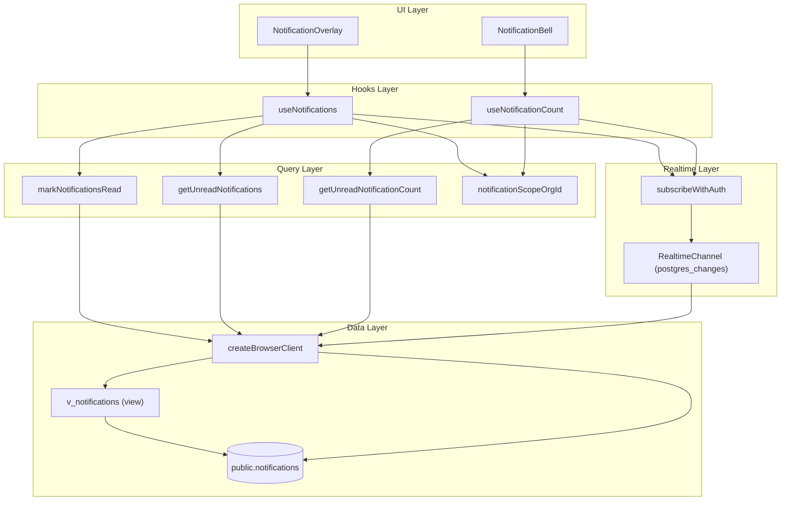
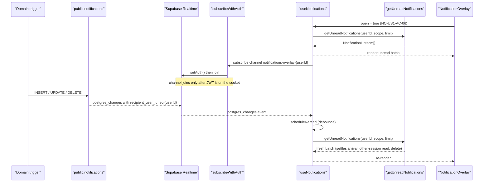
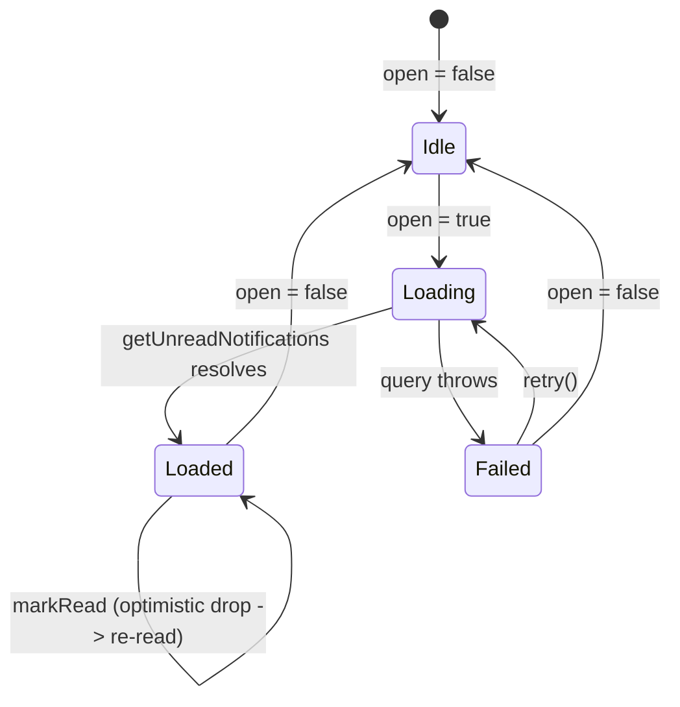

The notifications subsystem delivers per-user, account-scoped notification events to the app's notification bell and overlay, keeping unread counts and the unread list live through Supabase Realtime (Postgres change streams).

## Purpose and Scope

This page documents the client-side and data-access machinery behind Ozeaon's notifications feature:

- The `notifications` table read/write query layer (`src/lib/supabase/queries/notifications.ts`).
- The React state hooks that drive the bell and the overlay (`useNotificationCount`, `useNotifications`).
- The Realtime subscription helper (`subscribeWithAuth`) and how Postgres change events are filtered and consumed.
- The account-scoping model (individual vs. organization) that governs which rows a user sees.
- Mark-as-read semantics and the re-read-based reconciliation strategy.

**In scope:** read path, realtime live-update path, mark-read write path, account scoping, and the debounce/re-read design.

**Out of scope (sibling pages):**
- Notification *generation* — which database triggers raise notification rows on domain events (comments, invitations, requests) — belongs to the database/schema and social-feature pages.
- The `notification_types` reference table and RLS policies — see the database schema / security pages.
- The overlay and bell visual components themselves (`NotificationOverlay`, `NotificationRow`, `NotificationBell`) — see the UI components pages.

## Overview

Notifications in Ozeaon are **row-based and event-backed**: a domain event (a comment, an invitation, a join request) causes a trigger to insert one row per recipient into `public.notifications`. The frontend never invents notification rows; it only reads, groups, and marks them read.

The client feature is split across three concerns:

1. **A query layer** (`getUnreadNotificationCount`, `getUnreadNotifications`, `markNotificationsRead`) that talks directly to Supabase from the browser. There is deliberately no `"use server"` directive — the same module runs against the browser client so the bell can work without a server round trip.
2. **Two state hooks.** `useNotificationCount` powers the bell badge (`CONV-05.7`) by seeding from a server-rendered count and re-reading on realtime events. `useNotifications` powers the overlay's unread batch (`NO-CO-1`), loading on open and staying current while open.
3. **A realtime subscription helper** (`subscribeWithAuth`) that guarantees a channel only joins after the socket carries the session JWT, because an anonymous channel is dropped by Row Level Security.

### Key concepts and terminology

| Term | Meaning |
| --- | --- |
| **Scope** | The account a user is currently acting as. `null` = the individual-account copy; a UUID = the organization-account copy. |
| **Recipient copy** | A user holds a *separate* notification row per role/account they hold for the same underlying event. This is why every query is scoped. |
| **Batch** | The unread list shown behind the overlay, capped at `NOTIFICATION_BATCH_SIZE`. |
| **Re-read** | The strategy of re-querying the list on every realtime event instead of patching it in place. |
| **Acting-as cookie** | The unsigned cookie recording the active account. Scoping is *display only*; the real security boundary is the `recipient_user_id` RLS predicate. |

### Design intent: why re-read instead of patch

The system makes a deliberate trade-off: **one extra read buys a list that is correct for an arrival, a read in another session, and a delete, without three reconciliation paths** (as documented in the source). Re-reading is also what naturally pulls the *next* batch up after "mark all as read" empties the current one. Because Realtime sends one event per row, re-reads are debounced so a multi-row write costs a single read.

## Architecture



**How to read this diagram:**

- The **UI layer** (bell and overlay) is decoupled from data by the two hooks.
- The **hooks** translate the reactive account scope (from `useActiveAccount`) into a concrete `scopeOrgId` via `notificationScopeOrgId`, then call the **query layer**.
- The **query layer** reads the `v_notifications` view (for the list) or the base `notifications` table (for the count and the mark-read update), always against `createBrowserClient`.
- The **realtime layer** is a thin wrapper (`subscribeWithAuth`) providing authenticated channel joins; both hooks subscribe through it but with different event filters.
- Crucially, the realtime callbacks do **not** carry data into state — they simply trigger a re-read through the query layer.

> Source: [use-notifications.ts](https://github.com/ozeaon/ozeaon-v2/blob/0a4f1a95824db87782f1221a4108019d174df3d9/src/hooks/use-notifications.ts#L50-L78), [use-notification-count.ts](https://github.com/ozeaon/ozeaon-v2/blob/0a4f1a95824db87782f1221a4108019d174df3d9/src/hooks/use-notification-count.ts#L32-L103), [notifications.ts](https://github.com/ozeaon/ozeaon-v2/blob/0a4f1a95824db87782f1221a4108019d174df3d9/src/lib/supabase/queries/notifications.ts#L12-L17)

## Account Scoping

Every notification read is scoped to the account the user is currently acting as. The mapping is a single, small function:

```ts
/** NULL means the individual-account copy, which is how the rows are scoped. */
export function notificationScopeOrgId(
  activeAccount: ActiveAccount,
): string | null {
  return activeAccount.type === "org" ? activeAccount.id : null;
}
```

> Source: [notifications.ts](https://github.com/ozeaon/ozeaon-v2/blob/0a4f1a95824db87782f1221a4108019d174df3d9/src/lib/supabase/queries/notifications.ts#L12-L17)

The scope is applied by two mutually exclusive query branches repeated across the count and list functions: when `scopeOrgId` is a UUID the query adds `.eq("recipient_org_id", scopeOrgId)`; when it is `null` the query uses `.is("recipient_org_id", null)`. Individual-account rows are therefore *explicitly* represented by a `NULL` recipient org rather than by absence, and the two branches can never overlap.

This scoping is **display-only**. The security boundary is enforced server-side by the `recipient_user_id` RLS predicate, because the acting-as cookie is unsigned. A user cannot escalate visibility by lying about their scope, but they *can* legitimately see the individual copy of every event addressed to them.

### Why scope is held in a ref

Both hooks keep the current scope in a `useRef` rather than reading the hook closure directly. The reason is documented in the source: the realtime callback must read the *current* scope **without the subscription tearing down and rebuilding on every account switch**. If the scope were a dependency of the subscription effect, switching accounts would drop and re-establish the websocket channel, which is wasteful and racy. Instead:

```ts
// Held in a ref so the realtime callback reads the current scope without the
// subscription tearing down and rebuilding on every account switch.
const scopeRef = useRef(scopeOrgId);
```

> Source: [use-notifications.ts](https://github.com/ozeaon/ozeaon-v2/blob/0a4f1a95824db87782f1221a4108019d174df3d9/src/hooks/use-notifications.ts#L45-L48)

The ref is synced in its own effect that is declared *before* the load effect so the ref is current by the time the load reads it:

```ts
// Declared before the load below so the ref is current by the time it reads.
useEffect(() => {
  scopeRef.current = scopeOrgId;
}, [scopeOrgId]);
```

> Source: [use-notifications.ts](https://github.com/ozeaon/ozeaon-v2/blob/0a4f1a95824db87782f1221a4108019d174df3d9/src/hooks/use-notifications.ts#L85-L88)

## The Unread Count Hook (Bell)

`useNotificationCount(userId, initialCount)` powers the bell badge (`CONV-05.7`). It **seeds from the server-rendered count** passed as `initialCount`, then re-reads whenever a notification for this user is written.

```ts
export function useNotificationCount(userId: string, initialCount: number) {
  const { activeAccount } = useActiveAccount();
  const scopeOrgId = notificationScopeOrgId(activeAccount);
  const [count, setCount] = useState(initialCount);
  const scopeRef = useRef(scopeOrgId);

  const refresh = useCallback(
    async (orgId: string | null) => {
      try {
        setCount(
          await getUnreadNotificationCount(
            createBrowserClient(),
            userId,
            orgId,
          ),
        );
      } catch (err) {
        logError(logger, "Failed to read unread notification count", err);
      }
    },
    [userId],
  );
```

> Source: [use-notification-count.ts](https://github.com/ozeaon/ozeaon-v2/blob/0a4f1a95824db87782f1221a4108019d174df3d9/src/hooks/use-notification-count.ts#L26-L47)

Two subtle behaviors are worth noting:

- **Seeding avoids a first-render fetch.** `useState(initialCount)` means the badge renders the correct value immediately from SSR; the switch effect only refreshes *on a switch*, not on mount.
- **Count failures are non-fatal.** On error the hook logs and leaves the previous count in place; there is no `hasFailed` state for the badge, unlike the overlay.

### Realtime events subscribed by the bell

The count hook subscribes to **three** event kinds on one per-user channel:

| Event | Filter | Callback behavior |
| --- | --- | --- |
| `INSERT` | `recipient_user_id=eq.{userId}` | Re-read if the new row is in scope |
| `UPDATE` | `recipient_user_id=eq.{userId}` | Re-read if the new row is in scope |
| `DELETE` | `recipient_user_id=eq.{userId}` | Always re-read |

The reason the filter is per-user rather than per-scope is a hard Realtime constraint: **Realtime allows only one filter**, so the channel must be keyed by user and the account scope applied client-side. A row addressed to another of this user's accounts arrives and is discarded without touching the count:

```ts
const inScope = (row: NotificationRealtimeRow | null) =>
  (row?.recipient_org_id ?? null) === scopeRef.current;
```

> Source: [use-notification-count.ts](https://github.com/ozeaon/ozeaon-v2/blob/0a4f1a95824db87782f1221a4108019d174df3d9/src/hooks/use-notification-count.ts#L59-L60)

Deletes are treated differently — they always re-read — for a documented reason: the table is `REPLICA IDENTITY FULL`, but clients still receive just the key on `DELETE`, so the scope cannot be read off the payload. The re-read settles whether this account was affected.

## The Unread List Hook (Overlay)

`useNotifications(userId, open)` loads the unread batch behind the overlay when it opens (`NO-US1-AC-06`) and keeps it current while it stays open.

### State model

The hook tracks **the scope the list was last loaded or failed for**, not boolean flags. This is what keeps the previous account's rows off screen after a switch:

```ts
const [notifications, setNotifications] = useState<NotificationListItem[]>([]);
// The scope the list was last loaded or failed for. Tracking the scope rather
// than a flag keeps the previous account's rows off screen after a switch.
const [loadedScope, setLoadedScope] = useState<string | null>();
const [failedScope, setFailedScope] = useState<string | null>();
```

> Source: [use-notifications.ts](https://github.com/ozeaon/ozeaon-v2/blob/0a4f1a95824db87782f1221a4108019d174df3d9/src/hooks/use-notifications.ts#L38-L44)

The returned `hasLoaded` / `hasFailed` flags are derived by comparing the tracked scope to the *current* scope:

```ts
return {
  notifications,
  hasLoaded: loadedScope === scopeOrgId,
  hasFailed: failedScope === scopeOrgId,
  retry,
  markRead,
};
```

> Source: [use-notifications.ts](https://github.com/ozeaon/ozeaon-v2/blob/0a4f1a95824db87782f1221a4108019d174df3d9/src/hooks/use-notifications.ts#L142-L148)

### Stale-read guard

Because a re-read can resolve *after* the user switched accounts, `refresh` guards against landing stale rows by re-comparing the scope captured at call time against the ref:

```ts
const rows = await getUnreadNotifications(
  createBrowserClient(),
  userId,
  orgId,
  NOTIFICATION_BATCH_SIZE,
);
// A read that started before an account switch belongs to the old scope.
if (orgId !== scopeRef.current) return;
setNotifications(rows);
setLoadedScope(orgId);
setFailedScope(undefined);
```

> Source: [use-notifications.ts](https://github.com/ozeaon/ozeaon-v2/blob/0a4f1a95824db87782f1221a4108019d174df3d9/src/hooks/use-notifications.ts#L50-L63)

The failure path applies the same guard, so a stale failed read cannot mark the *new* scope as failed.

### Debounced re-read

Realtime emits one event per row, so the hook debounces re-reads by `NOTIFICATION_REREAD_DEBOUNCE_MS`. The timer is cleared and reset on each event:

```ts
const scheduleReread = useCallback(() => {
  clearTimeout(rereadTimer.current);
  rereadTimer.current = setTimeout(
    () => void refresh(scopeRef.current),
    NOTIFICATION_REREAD_DEBOUNCE_MS,
  );
}, [refresh]);
```

> Source: [use-notifications.ts](https://github.com/ozeaon/ozeaon-v2/blob/0a4f1a95824db87782f1221a4108019d174df3d9/src/hooks/use-notifications.ts#L72-L78)

A multi-row write therefore costs a **single** read. The timer is cleared on teardown so a pending re-read does not fire after the overlay closes.

## Core Flow

The following sequence shows the end-to-end path from a domain event to a rendered overlay row.



> Source: [use-notifications.ts](https://github.com/ozeaon/ozeaon-v2/blob/0a4f1a95824db87782f1221a4108019d174df3d9/src/hooks/use-notifications.ts#L90-L117), [realtime.ts](https://github.com/ozeaon/ozeaon-v2/blob/0a4f1a95824db87782f1221a4108019d174df3d9/src/lib/supabase/realtime.ts#L12-L32)

### Why the order matters

1. **Load before subscribe** is implicit: the open effect loads the batch, and the subscription effect re-affirms correctness on every subsequent event. If an event arrives during the initial load, the debounced re-read converges on the truth.
2. **Auth before join** (from `subscribeWithAuth`) is mandatory. A channel that joins before the session loads is anonymous, and *RLS drops every event it would receive* — the subscription would silently appear to work while receiving nothing.
3. **Event → re-read, never event → patch** is the single reconciliation strategy that makes arrival, cross-session read, and delete all correct without special-casing.

## Mark-as-Read

Marking notifications read is the write path, and it is what removes rows from the overlay (`NO-US2-AC-03`, `NO-US4-AC-02`). It uses a strict, idempotent update: only the caller's own rows and only still-unread rows are touched.

```ts
export async function markNotificationsRead(
  supabase: NotificationsClient,
  userId: string,
  ids: string[],
): Promise<void> {
  if (ids.length === 0) return;

  const { error } = await supabase
    .from("notifications")
    .update({ read_at: new Date().toISOString() })
    .in("id", ids)
    .eq("recipient_user_id", userId)
    .is("read_at", null);

  if (error) throw error;
}
```

> Source: [notifications.ts](https://github.com/ozeaon/ozeaon-v2/blob/0a4f1a95824db87782f1221a4108019d174df3d9/src/lib/supabase/queries/notifications.ts#L97-L117)

Two predicates matter for correctness:

- `.eq("recipient_user_id", userId)` — you can only mark *your own* notifications read.
- `.is("read_at", null)` — **already-read rows are left alone so a reader racing another session does not move a timestamp** that downstream counting depends on (`CONV-05.31`).

### Optimistic local drop with failure recovery

The hook drops the rows from local state *before* the write lands, "so the row leaves under the pointer rather than a round trip later," and then relies on the re-read to settle the list — including pulling up the *next* batch:

```ts
const markRead = useCallback(
  async (ids: string[]) => {
    if (ids.length === 0) return;
    const dropped = new Set(ids);
    setNotifications((current) => current.filter((n) => !dropped.has(n.id)));

    try {
      await markNotificationsRead(createBrowserClient(), userId, ids);
    } catch (err) {
      logError(logger, "Failed to mark notifications read", err);
      // The re-read below puts the rows back, so say why they returned.
      toast.error("Could not mark as read. Please try again.");
    }
    scheduleReread();
  },
  [userId, scheduleReread],
);
```

> Source: [use-notifications.ts](https://github.com/ozeaon/ozeaon-v2/blob/0a4f1a95824db87782f1221a4108019d174df3d9/src/hooks/use-notifications.ts#L119-L140)

The design is intentionally self-healing: there is **no rollback logic**. If the write fails, a `toast.error` is shown and the subsequent re-read restores the rows naturally. This avoids maintaining a separate optimistic-update reverse path.

## Read Path Details

### The list query

The overlay list reads from a **view** (`v_notifications`), not the base table, and selects an explicit column set:

```ts
const LIST_ITEM_COLUMNS =
  "id, type, actor_name, actor_avatar_path, snippet, event_count, last_event_at, destination_path";

export async function getUnreadNotifications(
  supabase: NotificationsClient,
  userId: string,
  scopeOrgId: string | null,
  limit: number,
): Promise<NotificationListItem[]> {
  const query = supabase
    .from("v_notifications")
    .select(LIST_ITEM_COLUMNS)
    .eq("recipient_user_id", userId)
    .is("read_at", null)
    .order("last_event_at", { ascending: false })
    .limit(limit);

  const { data, error } = await (scopeOrgId
    ? query.eq("recipient_org_id", scopeOrgId)
    : query.is("recipient_org_id", null));

  if (error) throw error;

  return (data ?? []).flatMap(toListItem);
}
```

> Source: [notifications.ts](https://github.com/ozeaon/ozeaon-v2/blob/0a4f1a95824db87782f1221a4108019d174df3d9/src/lib/supabase/queries/notifications.ts#L44-L75)

**Ordering rationale (documented in source):** rows are ordered on `last_event_at` rather than `created_at` so a *grouped* notification rises when its newest event arrives (`CONV-05.28`). The covering index is on the same column, so the ordering is index-backed.

### Nullable-view coercion

Because every view column reads as nullable to the type system even though the base table guarantees five of them, a coercion function filters out unusable rows and applies defaults:

```ts
/** Every view column reads as nullable; the base table guarantees these five. */
function toListItem(
  row: Pick<NotificationWithDestination, keyof NotificationListItem>,
): NotificationListItem[] {
  if (!row.id || !row.type || !row.actor_name || !row.last_event_at) return [];

  return [
    {
      id: row.id,
      type: row.type,
      actor_name: row.actor_name,
      actor_avatar_path: row.actor_avatar_path,
      snippet: row.snippet,
      event_count: row.event_count ?? 1,
      last_event_at: row.last_event_at,
      destination_path: row.destination_path,
    },
  ];
}
```

> Source: [notifications.ts](https://github.com/ozeaon/ozeaon-v2/blob/0a4f1a95824db87782f1221a4108019d174df3d9/src/lib/supabase/queries/notifications.ts#L77-L95)

Note `event_count: row.event_count ?? 1` — a grouped notification with no count defaults to `1`, reflecting that an ungrouped row represents a single event.

### The count query

The bell count uses a `head: true` exact count — it never transfers rows, only the count:

```ts
const query = supabase
  .from("notifications")
  .select("id", { count: "exact", head: true })
  .eq("recipient_user_id", userId)
  .is("read_at", null);
```

> Source: [notifications.ts](https://github.com/ozeaon/ozeaon-v2/blob/0a4f1a95824db87782f1221a4108019d174df3d9/src/lib/supabase/queries/notifications.ts#L31-L35)

The return coerces null to zero: `return count ?? 0;`.

## API Reference

### `notificationScopeOrgId(activeAccount: ActiveAccount): string | null`

Maps the active account to its notification scope. Returns the org UUID for organization accounts, `null` for individual accounts.

- **Parameters:** `activeAccount` — the account object from `useActiveAccount()`.
- **Returns:** `string | null` — the scope used as `recipient_org_id` predicate.
- **Throws:** never.

> Source: [notifications.ts](https://github.com/ozeaon/ozeaon-v2/blob/0a4f1a95824db87782f1221a4108019d174df3d9/src/lib/supabase/queries/notifications.ts#L12-L17)

### `getUnreadNotificationCount(supabase, userId, scopeOrgId): Promise<number>`

Returns the exact unread count for one account. Selects with `count: "exact", head: true`.

- **Parameters:** `supabase: NotificationsClient`, `userId: string`, `scopeOrgId: string | null`.
- **Returns:** `Promise<number>` — `count ?? 0`.
- **Throws:** no explicit throw; the awaited result's error is not checked (returns 0 on null count).

> Source: [notifications.ts](https://github.com/ozeaon/ozeaon-v2/blob/0a4f1a95824db87782f1221a4108019d174df3d9/src/lib/supabase/queries/notifications.ts#L26-L42)

### `getUnreadNotifications(supabase, userId, scopeOrgId, limit): Promise<NotificationListItem[]>`

Returns the unread batch, newest `last_event_at` first, capped at `limit`.

- **Parameters:** `supabase: NotificationsClient`, `userId: string`, `scopeOrgId: string | null`, `limit: number`.
- **Returns:** `Promise<NotificationListItem[]>` — rows that survive `toListItem` coercion.
- **Throws:** re-throws the Supabase error if the query fails.

> Source: [notifications.ts](https://github.com/ozeaon/ozeaon-v2/blob/0a4f1a95824db87782f1221a4108019d174df3d9/src/lib/supabase/queries/notifications.ts#L54-L75)

### `markNotificationsRead(supabase, userId, ids): Promise<void>`

Sets `read_at` to the current timestamp for the given ids, restricted to the caller's own unread rows.

- **Parameters:** `supabase: NotificationsClient`, `userId: string`, `ids: string[]`.
- **Returns:** `Promise<void>` — resolves immediately when `ids` is empty.
- **Throws:** re-throws the Supabase error if the update fails.

> Source: [notifications.ts](https://github.com/ozeaon/ozeaon-v2/blob/0a4f1a95824db87782f1221a4108019d174df3d9/src/lib/supabase/queries/notifications.ts#L102-L117)

### `subscribeWithAuth(supabase, build): () => void`

Subscribes once the socket carries the session JWT; returns a teardown function for `useEffect` cleanup.

- **Parameters:** `supabase: SupabaseClient`, `build: () => RealtimeChannel` — a factory that configures the channel's handlers.
- **Returns:** `() => void` — the unsubscribe/cleanup function; removes the channel if one was built.
- **Behavior:** a failed `setAuth()` is logged, not thrown; the channel is simply not created.

> Source: [realtime.ts](https://github.com/ozeaon/ozeaon-v2/blob/0a4f1a95824db87782f1221a4108019d174df3d9/src/lib/supabase/realtime.ts#L12-L32)

### `useNotificationCount(userId: string, initialCount: number): number`

- **Returns:** the current live unread count.

> Source: [use-notification-count.ts](https://github.com/ozeaon/ozeaon-v2/blob/0a4f1a95824db87782f1221a4108019d174df3d9/src/hooks/use-notification-count.ts#L26-L106)

### `useNotifications(userId: string, open: boolean)`

- **Returns:** `{ notifications, hasLoaded, hasFailed, retry, markRead }`.
  - `notifications: NotificationListItem[]`
  - `hasLoaded: boolean` — true when `loadedScope === scopeOrgId`.
  - `hasFailed: boolean` — true when `failedScope === scopeOrgId`.
  - `retry: () => void` — clears the failed scope and re-reads.
  - `markRead: (ids: string[]) => Promise<void>`

> Source: [use-notifications.ts](https://github.com/ozeaon/ozeaon-v2/blob/0a4f1a95824db87782f1221a4108019d174df3d9/src/hooks/use-notifications.ts#L142-L148)

## Failure Modes, Edge Cases & Concurrency

### Failure handling matrix

| Failure | Where handled | Behavior |
| --- | --- | --- |
| `getUnreadNotifications` query error | `useNotifications.refresh` | Logs via `logError`; sets `failedScope` only if the scope has not changed. UI exposes `hasFailed` + `retry`. |
| `getUnreadNotificationCount` query error | `useNotificationCount.refresh` | Logs; leaves the previous count in place (no failed state on the bell). |
| `markNotificationsRead` write error | `useNotifications.markRead` | Logs + `toast.error("Could not mark as read. Please try again.")`; the scheduled re-read restores the dropped rows. |
| Realtime `setAuth()` rejection | `subscribeWithAuth` | Logs `"Failed to authorise realtime channel"`; channel is never created, so no events arrive. |
| Stale read resolving after an account switch | `useNotifications.refresh` | Guard `if (orgId !== scopeRef.current) return;` discards the result. |

### Concurrency concerns

- **Cross-session races on read.** Two sessions marking the same notification read simultaneously are safe because `markNotificationsRead` includes `.is("read_at", null)`. The second writer matches zero rows and cannot move an already-set timestamp.
- **Realtime event storms.** A bulk write produces one event per row. The `NOTIFICATION_REREAD_DEBOUNCE_MS` timer collapses them into a single re-read, so the read load is bounded regardless of how many rows change.
- **Channel churn on account switch.** Avoided by holding scope in a `useRef`; the subscription dependencies (`open`, `userId`, `scheduleReread`) do not include `scopeOrgId`, so switching accounts does not tear down the socket.
- **Late reads crossing a switch.** Neutralized by the scope guard described above.

### Edge cases

- **Empty ids.** Both `markRead` (hook) and `markNotificationsRead` (query) short-circuit on `ids.length === 0`, so no pointless request is issued.
- **Grouped notifications without a count.** `event_count` defaults to `1` in `toListItem`.
- **Rows arriving for another of the user's accounts.** The bell's `inScope` check discards them; the overlay's re-read naturally excludes them because the query is scope-filtered.
- **Overlay closed.** Both load and subscribe effects early-return when `open` is false, so no fetch or channel is created until the overlay opens.
- **Partial view rows.** `toListItem` returns `[]` for a row missing any of `id`, `type`, `actor_name`, or `last_event_at`, dropping malformed rows rather than rendering blanks.

### State transitions (overlay list)



`hasLoaded` and `hasFailed` are derived from `loadedScope`/`failedScope` compared against the live `scopeOrgId`, so an account switch immediately flips the overlay back to a non-loaded state without an explicit reset.

## Configuration Options

| Constant | Type | Purpose |
| --- | --- | --- |
| `NOTIFICATION_BATCH_SIZE` | number | Maximum rows in the overlay's unread batch, passed as the `limit` to `getUnreadNotifications`. |
| `NOTIFICATION_REREAD_DEBOUNCE_MS` | number | Debounce window collapsing bursts of realtime events into one re-read. |

Both are imported from `@/config` (re-exported from `src/config/constants/notifications.ts`).

> Source: [use-notifications.ts](https://github.com/ozeaon/ozeaon-v2/blob/0a4f1a95824db87782f1221a4108019d174df3d9/src/hooks/use-notifications.ts#L6-L9)

## Realtime Channel Naming & Filtering

| Hook | Channel name | Events | Filter |
| --- | --- | --- | --- |
| `useNotificationCount` | `notifications-{userId}` | `INSERT`, `UPDATE`, `DELETE` | `recipient_user_id=eq.{userId}` |
| `useNotifications` | `notifications-overlay-{userId}` | `*` | `recipient_user_id=eq.{userId}` |

Distinct channel names keep the two subscriptions independent — the bell is always live, while the overlay's subscription exists only while the overlay is open. Both use the **same** single filter (`recipient_user_id`) because Realtime permits only one filter per subscription; account scope is resolved client-side.

> Source: [use-notification-count.ts](https://github.com/ozeaon/ozeaon-v2/blob/0a4f1a95824db87782f1221a4108019d174df3d9/src/hooks/use-notification-count.ts#L62-L102), [use-notifications.ts](https://github.com/ozeaon/ozeaon-v2/blob/0a4f1a95824db87782f1221a4108019d174df3d9/src/hooks/use-notifications.ts#L100-L111)

## Performance & Operational Notes

- **Count reads never hydrate rows.** `head: true` with `count: "exact"` keeps the badge's payload to a single integer.
- **List ordering is index-backed.** `ORDER BY last_event_at DESC` matches the covering index on that column, and `.limit()` bounds the scan.
- **Debounce bounds realtime-driven reads.** One read per burst instead of one per row.
- **Subscriptions are scoped to lifecycle.** The overlay's channel is created on open and removed on close/unmount (`unsubscribe()` plus `clearTimeout`), preventing leaked channels and stray timers.
- **No server round trip for reads.** The query module is intentionally not `"use server"`; the bell and overlay read directly with the browser client, so both work offline-ish/optimistically and avoid an app-server hop.
- **Server-rendered seed.** The bell starts from a server-rendered count, so its first paint is already correct and no client fetch is needed on mount.

## Extension Points

- **New event types / grouping.** Because the list orders by `last_event_at` and renders `event_count`, the UI already supports grouped notifications; a new grouping producer can write grouped rows without frontend changes (referenced as `TOZN-465` in source comments).
- **New destination target.** `destination_path` flows from the `v_notifications` view into `NotificationListItem`, so new notification types can point anywhere by populating that column.
- **Additional realtime consumers.** New features can reuse `subscribeWithAuth` to obtain an authenticated channel without re-implementing the JWT-before-join dance.
- **Widening the batch.** Changing `NOTIFICATION_BATCH_SIZE` changes the overlay page size only; the re-read strategy is size-agnostic.

## Related Links

- Query layer: [notifications.ts](https://github.com/ozeaon/ozeaon-v2/blob/0a4f1a95824db87782f1221a4108019d174df3d9/src/lib/supabase/queries/notifications.ts)
- Realtime helper: [realtime.ts](https://github.com/ozeaon/ozeaon-v2/blob/0a4f1a95824db87782f1221a4108019d174df3d9/src/lib/supabase/realtime.ts)
- Hooks: [use-notifications.ts](https://github.com/ozeaon/ozeaon-v2/blob/0a4f1a95824db87782f1221a4108019d174df3d9/src/hooks/use-notifications.ts), [use-notification-count.ts](https://github.com/ozeaon/ozeaon-v2/blob/0a4f1a95824db87782f1221a4108019d174df3d9/src/hooks/use-notification-count.ts)
- Types & constants: [src/types/notifications.ts](https://github.com/ozeaon/ozeaon-v2/blob/0a4f1a95824db87782f1221a4108019d174df3d9/src/types/notifications.ts), [src/config/constants/notifications.ts](https://github.com/ozeaon/ozeaon-v2/blob/0a4f1a95824db87782f1221a4108019d174df3d9/src/config/constants/notifications.ts)
- UI consumers: [NotificationOverlay.tsx](https://github.com/ozeaon/ozeaon-v2/blob/0a4f1a95824db87782f1221a4108019d174df3d9/src/components/notifications/NotificationOverlay.tsx), [NotificationBell.tsx](https://github.com/ozeaon/ozeaon-v2/blob/0a4f1a95824db87782f1221a4108019d174df3d9/src/components/nav/components/NotificationBell.tsx)
- Schema & triggers: [notifications_foundation.sql](https://github.com/ozeaon/ozeaon-v2/blob/0a4f1a95824db87782f1221a4108019d174df3d9/supabase/migrations/20260918000000_notifications_foundation.sql), [notifications_triggers.sql](https://github.com/ozeaon/ozeaon-v2/blob/0a4f1a95824db87782f1221a4108019d174df3d9/supabase/migrations/20260921000000_notifications_triggers.sql)
