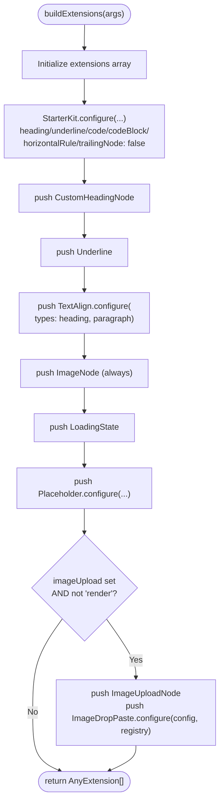
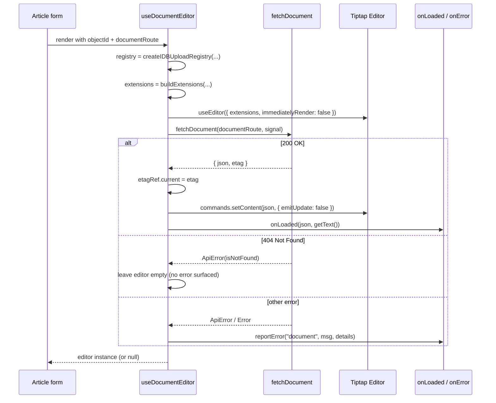
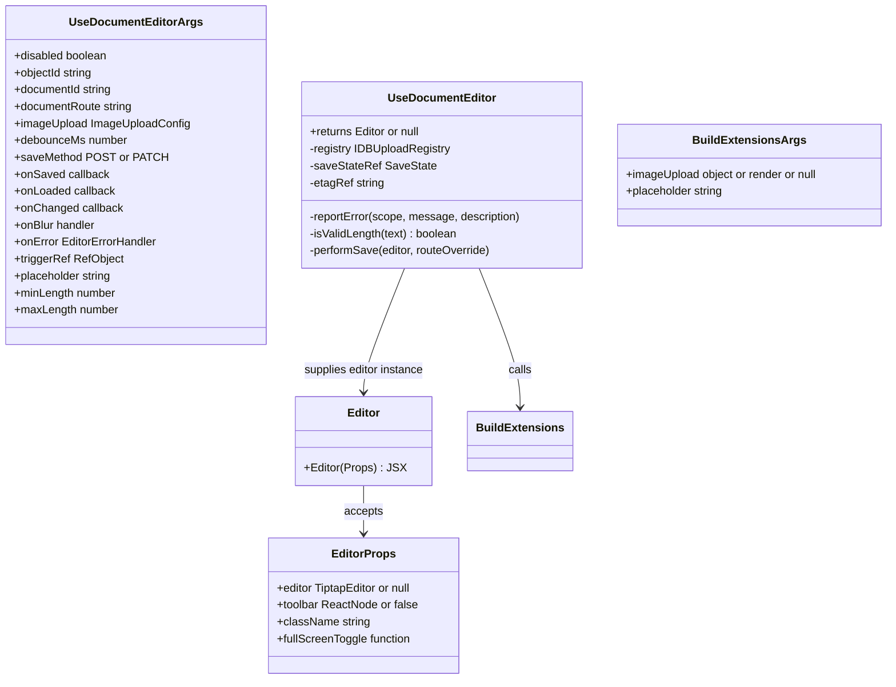
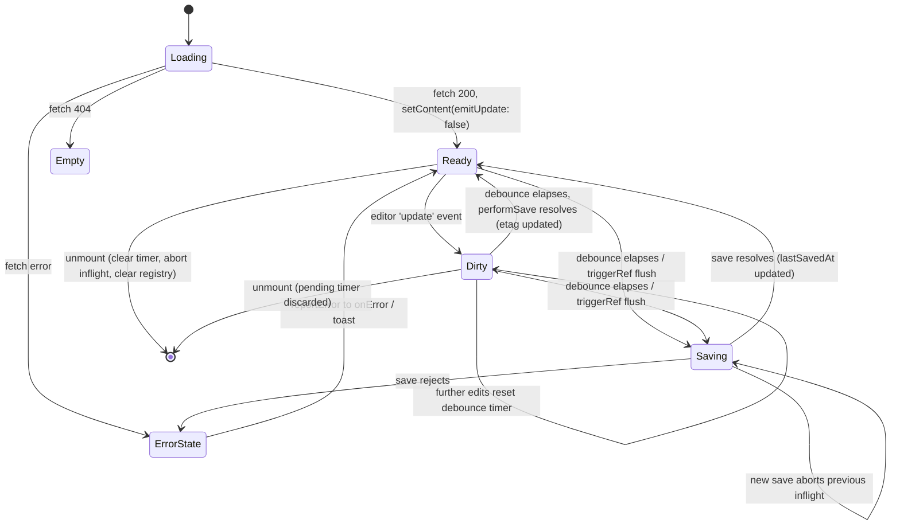

The rich-text editing subsystem of ozeaon-v2, built on Tiptap 3.x (`@tiptap/core`, `@tiptap/react`, `@tiptap/starter-kit`) with a custom extension layer for headings, images, uploads, drag/paste handling, and loading state.

## Purpose and Scope

This page documents the **core editor engine and its extension architecture** under `src/components/tiptap/`:

- How the extension list is assembled and configured (`buildExtensions`).
- How the editor instance is created, fed initial content, and torn down (`useDocumentEditor`).
- The presentational shell that renders the editor surface (`Editor`).
- The custom nodes/plugins/extensions that differentiate ozeaon's editor from a stock Tiptap setup.
- The dependency contract with Tiptap packages declared in `package.json`.

This page intentionally does **not** cover the surrounding authoring UX: the toolbar controls, the full autosave/persistence protocol, and the image upload transport pipeline each belong to sibling editor pages. Where a boundary matters, the section says so explicitly. For the document save/fetch protocol, see the editor persistence topic; for toolbar behaviour, see the toolbar topic; for image handling end-to-end, see the image extension topic.

## Overview

ozeaon's editor is deliberately split into three responsibilities so that each can evolve independently:

| Layer | Artifact | Responsibility |
| --- | --- | --- |
| **Engine** | `useDocumentEditor` | Owns the Tiptap lifecycle: build → init → autosave → teardown |
| **Composition** | `buildExtensions` | Builds the immutable extension array for a given session mode |
| **Presentation** | `Editor` | Renders `EditorContent` plus a toolbar slot; contains no behaviour |

The design intent is stated directly in the shell component's own commentary: the editor component "should rarely change — extending the editor means adding extensions/nodes, not modifying this component." This is an open/closed design: new capability arrives through `buildExtensions`, not by editing render code.

Two concepts recur throughout the subsystem:

1. **Session mode for images.** The `imageUpload` argument to `buildExtensions` is a three-state discriminant rather than a boolean: an object `{ config, registry }` (uploads enabled), the literal `"render"` (SSR/read-only serialization), or `null` (editor mode with uploads disabled). This tri-state exists so that a single extension builder can serve the interactive editor, the read-only renderer, and an upload-less editor without branching inside node definitions.
2. **Stable references.** React memoization is used as a correctness mechanism, not just an optimization: the upload registry is `useMemo`-stabilized, the extension array depends only on `[imageUpload, registry, placeholder]`, and the editor is recreated only on `[objectId, documentRoute, Boolean(imageUpload)]`.

## Architecture

The subsystem is layered: consumers (article forms) hold the hook, the hook holds the editor instance and the extension array, and the extension array is composed from Tiptap built-ins plus ozeaon's custom extension artefacts.

```mermaid
flowchart TD
    subgraph sg_Consumer["Consumer Layer"]
        ArticleForm["Article form / page"]
    end

    subgraph sg_Hooks["Hook Layer (src/components/tiptap/hooks)"]
        UseDocumentEditor["useDocumentEditor"]
        UploadRegistry["createIDBUploadRegistry"]
        BlockCounter["countNonInlineBlocksDetailed"]
    end

    subgraph sg_Presentation["Presentation Layer"]
        EditorComponent["Editor"]
        DefaultToolbar["DefaultToolbar"]
        EditorContent["EditorContent"]
    end

    subgraph sg_Composition["Composition Layer (extensions)"]
        BuildExtensions["buildExtensions"]
    end

    subgraph sg_Extensions["Extension Artefacts"]
        StarterKit["StarterKit"]
        CustomHeadingNode["CustomHeadingNode"]
        Underline["Underline"]
        TextAlign["TextAlign"]
        ImageNode["ImageNode"]
        ImageUploadNode["ImageUploadNode"]
        ImageDropPaste["ImageDropPaste"]
        LoadingState["LoadingState"]
        Placeholder["Placeholder"]
    end

    subgraph sg_Lib["Lib Layer (lib)"]
        ApiLib["fetchDocument / saveDocument"]
        TypesLib["ImageUploadConfig / SaveTrigger"]
    end

    ArticleForm --> UseDocumentEditor
    UseDocumentEditor --> BuildExtensions
    UseDocumentEditor --> UploadRegistry
    UseDocumentEditor --> BlockCounter
    UseDocumentEditor --> ApiLib
    UseDocumentEditor --> EditorComponent
    EditorComponent --> DefaultToolbar
    EditorComponent --> EditorContent
    BuildExtensions --> StarterKit
    BuildExtensions --> CustomHeadingNode
    BuildExtensions --> Underline
    BuildExtensions --> TextAlign
    BuildExtensions --> ImageNode
    BuildExtensions --> ImageUploadNode
    BuildExtensions --> ImageDropPaste
    BuildExtensions --> LoadingState
    BuildExtensions --> Placeholder
    BuildExtensions --> TypesLib
```



The arrow direction encodes the real dependency direction: the consumer never touches Tiptap directly. It hands the editor instance produced by `useDocumentEditor` to `Editor`, and the toolbar reads state off that same instance rather than through props.

> Source: [Editor.tsx](https://github.com/ozeaon/ozeaon-v2/blob/0a4f1a95824db87782f1221a4108019d174df3d9/src/components/tiptap/Editor.tsx#L20-L24)

Note the strict separation between the **presentation layer** and the **composition layer**: there is no edge from `EditorComponent` to `BuildExtensions`. The render shell is unaware of which extensions exist, which is precisely what allows extensions to be added without touching UI code.

## Dependency Contract

The Tiptap surface area is pinned to a single minor line (`^3.31.3`) across every package, including the ProseMirror peer (`@tiptap/pm`). Keeping `@tiptap/core`, `@tiptap/react`, `@tiptap/starter-kit`, `@tiptap/extensions`, `@tiptap/pm`, and the individual extension packages on the same version is load-bearing: Tiptap extensions are peer-dependent on `@tiptap/core`, and the lockfile shows the resolved graph threading `@tiptap/core@3.31.3(@tiptap/pm@3.31.3)` through every extension entry.

| Package | Declared range | Role |
| --- | --- | --- |
| `@tiptap/core` | `^3.31.3` | Engine, `AnyExtension`, `EditorEvents` types |
| `@tiptap/react` | `^3.31.3` | `useEditor`, `EditorContent`, `Editor` type |
| `@tiptap/starter-kit` | `^3.31.3` | Baseline node/mark bundle (paragraphs, bold, italic, history…) |
| `@tiptap/extensions` | `^3.31.3` | `Placeholder` and other packaged utilities |
| `@tiptap/pm` | `^3.31.3` | Direct ProseMirror access (peer of the above) |
| `@tiptap/extension-underline` | `^3.31.3` | Underline mark (excluded from StarterKit, added explicitly) |
| `@tiptap/extension-heading` | `^3.31.3` | Heading node (superseded by `CustomHeadingNode`) |
| `@tiptap/extension-text-align` | `^3.31.3` | Alignment attribute on selected node types |

> Sources:
> - [package.json](https://github.com/ozeaon/ozeaon-v2/blob/0a4f1a95824db87782f1221a4108019d174df3d9/package.json#L56-L63)
> - [package.json](https://github.com/ozeaon/ozeaon-v2/blob/0a4f1a95824db87782f1221a4108019d174df3d9/package.json#L98)

`@floating-ui/dom` is pulled in as a transitive dependency of the Tiptap React/UI stack and appears in the resolved lockfile entry for `@tiptap/react`; the editor core itself does not import it directly.

> Source: [pnpm-lock.yaml](https://github.com/ozeaon/ozeaon-v2/blob/0a4f1a95824db87782f1221a4108019d174df3d9/pnpm-lock.yaml#L207-L209)

## Extension Composition — `buildExtensions`

`buildExtensions` is the single source of truth for *what exists* in the editor document schema. It is a pure function of session mode and placeholder text, returning `AnyExtension[]`.

### StarterKit is suppressed selectively, not disabled

Rather than replacing StarterKit, ozeaon configures it to **drop the capabilities it wants to own itself**:

```typescript
export function buildExtensions({
  imageUpload,
  placeholder,
}: BuildExtensionsArgs) {
  const extensions: AnyExtension[] = [
    StarterKit.configure({
      heading: false,
      underline: false,
      code: false,
      codeBlock: false,
      horizontalRule: false,
      trailingNode: false,
      dropcursor: {
        color: "var(--text-primary)",
        width: 1,
      },
    }),
    CustomHeadingNode,
    Underline,
    TextAlign.configure({
      types: ["heading", "paragraph"],
      defaultAlignment: undefined,
    }),
    ImageNode,
    LoadingState,
    Placeholder.configure({
      placeholder: placeholder ?? "Type something...",
      showOnlyCurrent: true,
    }),
  ];
```

> Source: [BuildExtensions.ts](https://github.com/ozeaon/ozeaon-v2/blob/0a4f1a95824db87782f1221a4108019d174df3d9/src/components/tiptap/extensions/BuildExtensions.ts#L41-L70)

Each suppression has a distinct rationale:

- **`heading: false` + `CustomHeadingNode`** — heading levels are constrained to 1–3 per ozeaon's content spec, which StarterKit's stock heading (levels 1–6) cannot express. Disabling the built-in and registering a custom node keeps the schema authoritative.
- **`underline: false` + explicit `Underline`** — the underline mark is registered from its own package rather than inherited from the kit, making the mark's presence explicit at the composition site. (Functionally the mark is the same; the explicit import documents intent and survives StarterKit default changes.)
- **`code`, `codeBlock`, `horizontalRule: false`** — these nodes are deliberately removed from the schema. Content containing them cannot be authored, which is a schema-level guarantee rather than a UI-level restriction.
- **`trailingNode: false`** — no automatic trailing paragraph is appended.
- **`dropcursor`** — restyled to the app's design token (`var(--text-primary)`) at 1px width so the drag affordance matches the theme rather than using StarterKit's default blue.

The extension ordering is also meaningful: `ImageNode` is registered **before** `LoadingState` and `Placeholder`, and `CustomHeadingNode` is placed immediately after StarterKit so that it overrides the suppressed heading slot in the same position of the priority chain.

### TextAlign is scoped deliberately

```typescript
    TextAlign.configure({
      types: ["heading", "paragraph"],
      defaultAlignment: undefined,
    }),
```

> Source: [BuildExtensions.ts](https://github.com/ozeaon/ozeaon-v2/blob/0a4f1a95824db87782f1221a4108019d174df3d9/src/components/tiptap/extensions/BuildExtensions.ts#L60-L63)

`TextAlign` applies **only** to `heading` and `paragraph` — not to lists or blockquotes. This is a schema-level restriction that prevents alignment attributes from ever landing on container nodes where they would be meaningless or visually harmful. `defaultAlignment: undefined` means no node carries an alignment attribute until the user explicitly applies one, keeping serialized JSON minimal and avoiding an attribute on every paragraph.

### The tri-state image mode

```typescript
  if (imageUpload && imageUpload !== "render") {
    extensions.push(ImageUploadNode);
    extensions.push(
      ImageDropPaste.configure({
        config: imageUpload.config,
        registry: imageUpload.registry,
      }),
    );
  }

  return extensions;
}
```

> Source: [BuildExtensions.ts](https://github.com/ozeaon/ozeaon-v2/blob/0a4f1a95824db87782f1221a4108019d174df3d9/src/components/tiptap/extensions/BuildExtensions.ts#L72-L82)

The documented contract for the three states is explicit in the type:

```typescript
  /**
   * - object: editor mode with uploads enabled. Includes ImageNode + upload node + drop/paste.
   * - 'render': SSR/read-only render. Includes ImageNode for serialization but no upload pieces.
   * - null: editor mode without uploads. ImageNode still present so existing images render.
   */
  imageUpload:
    | { config: ImageUploadConfig; registry: IDBUploadRegistry }
    | "render"
    | null;
```

> Source: [BuildExtensions.ts](https://github.com/ozeaon/ozeaon-v2/blob/0a4f1a95824db87782f1221a4108019d174df3d9/src/components/tiptap/extensions/BuildExtensions.ts#L14-L26)

The key invariant: **`ImageNode` is always registered**. The transient `ImageUploadNode` and the `ImageDropPaste` plugin register only when uploads are live in this session. The consequence is that a document saved with images always deserializes correctly — in the editor, in the read-only renderer, and in a session where uploads are disabled — while the upload machinery (which carries a config object and a live IndexedDB registry) is never instantiated where it cannot be used. This avoids paying for upload capability in server-render paths and avoids leaking a registry into read-only contexts.

### Extension composition flow



## Custom Extension Artefacts

The composition function imports five artefacts unique to ozeaon. They live under `extensions/` in three categories, which mirrors the Tiptap taxonomy (nodes, plugins, standalone extensions):

| Category | Path | Artefact |
| --- | --- | --- |
| Nodes | `extensions/nodes/` | `CustomHeadingNode`, `ImageNode`, `ImageNodeView`, `ImageUploadNode`, `ImageUploadNodeView` |
| Plugins | `extensions/plugins/` | `ImageDropPaste` |
| Extensions | `extensions/extensions/` | `LoadingState` |

> Source: [BuildExtensions.ts](https://github.com/ozeaon/ozeaon-v2/blob/0a4f1a95824db87782f1221a4108019d174df3d9/src/components/tiptap/extensions/BuildExtensions.ts#L6-L11)

The node/view split is conventional Tiptap: each interactive node declares a NodeView component (`ImageNodeView.tsx`, `ImageUploadNodeView.tsx`) so the node's rendered DOM is a React component rather than a ProseMirror-generated element. That is what makes progressive image-loading UI possible inside the document without serializing transient state into the saved JSON.

Note the distinction between `ImageNode` (permanent, serialized into the document) and `ImageUploadNode` (transient, only present while an upload is in flight). This is the schema-level expression of the "upload placeholder" pattern: a placeholder node exists in the document during the upload, then is replaced by a real `ImageNode` once the asset is persisted. Because `ImageUploadNode` is only registered when uploads are enabled, a render-only pass cannot accidentally produce upload placeholders in output.

`LoadingState` is a standalone extension exposing the `setLoading` command that the save path invokes (`editorInstance.commands.setLoading(true)`). It is not a node or mark — it contributes a command and, via its own storage/state, allows the UI to reflect an in-flight persistence operation without the render shell needing to know about save internals.

## Editor Lifecycle — `useDocumentEditor`

`useDocumentEditor` is the only stateful surface in the subsystem. Its documented contract:

> "Owns the editor lifecycle: fetch → init → autosave → teardown. Returns the Editor instance (or null while loading)."

> Source: [use-document-editor.ts](https://github.com/ozeaon/ozeaon-v2/blob/0a4f1a95824db87782f1221a4108019d174df3d9/src/components/tiptap/hooks/use-document-editor.ts#L69-L75)

### Stabilized inputs

Before the editor is built, two inputs are stabilized:

```typescript
  // Stable upload registry per editor instance. Cleared on unmount.
  const registry = useMemo(
    () =>
      imageUpload ? createIDBUploadRegistry("OZNArticleImagesDatabase") : null,
    [imageUpload],
  );
```

> Source: [use-document-editor.ts](https://github.com/ozeaon/ozeaon-v2/blob/0a4f1a95824db87782f1221a4108019d174df3d9/src/components/tiptap/hooks/use-document-editor.ts#L95-L100)

The registry is the bridge between the editor and blob storage: uploads are staged in IndexedDB under the `OZNArticleImagesDatabase` database name. It is memoized on `imageUpload` and **cleared on unmount** (see teardown below), which bounds IndexedDB growth to the lifetime of an editing session.

The extension array is memoized separately:

```typescript
  const extensions = useMemo(
    () =>
      buildExtensions({
        placeholder,
        imageUpload:
          imageUpload && registry ? { config: imageUpload, registry } : null,
      }),
    [imageUpload, registry, placeholder],
  );
```

> Source: [use-document-editor.ts](https://github.com/ozeaon/ozeaon-v2/blob/0a4f1a95824db87782f1221a4108019d174df3d9/src/components/tiptap/hooks/use-document-editor.ts#L142-L150)

This is where the tri-state is derived: if no `imageUpload` config was supplied (or the registry failed to build), the builder receives `null` and skips the upload node and drop/paste plugin. The `"render"` state is not produced by this hook — it is reserved for the SSR/read-only render path, which calls `buildExtensions` directly.

### Editor construction

```typescript
  // Build the editor. `immediatelyRender: false` is required for Next.js SSR.
  const editor = useEditor(
    {
      extensions,
      content: "",
      immediatelyRender: false,
      editable: !disabled,
      onBlur: (e) => {
        if (isValidLength(e.editor.getText({ blockSeparator: " " }))) {
          onBlur?.(e.event as unknown as React.FocusEvent<HTMLInputElement>);
        }
      },
      editorProps: {
        attributes: {
          role: "textbox",
          "aria-label": "Rich Text Editor",
          "aria-multiline": "true",
          class:
            "max-w-none focus:outline-none min-h-80 px-6 py-4 prose prose-sm article-content-section",
        },
      },
    },
    [objectId, documentRoute, Boolean(imageUpload)],
  );
```

> Source: [use-document-editor.ts](https://github.com/ozeaon/ozeaon-v2/blob/0a4f1a95824db87782f1221a4108019d174df3d9/src/components/tiptap/hooks/use-document-editor.ts#L152-L175)

Four decisions worth calling out:

1. **`immediatelyRender: false`** — required for Next.js SSR. Without it, Tiptap would attempt to render on the server and produce a hydration mismatch, because ProseMirror needs a live DOM.
2. **`content: ""`** — the editor always starts empty. Content arrives asynchronously through the fetch effect, using `setContent(..., { emitUpdate: false })`. Starting empty and hydrating avoids a flash of stale content and, critically, prevents the hydration from being interpreted as a user edit.
3. **`editorProps.attributes`** — accessibility and styling are declared at the ProseMirror level (`role="textbox"`, `aria-multiline="true"`, `aria-label`), plus the Tailwind typography stack (`prose prose-sm article-content-section`) that matches the read-only rendered output. Styling the editable surface with the same `article-content-section` class as the renderer is what keeps WYSIWYG fidelity between authoring and display.
4. **Dependency array `[objectId, documentRoute, Boolean(imageUpload)]`** — the editor is destroyed and recreated when the *identity of the document* or the *availability of uploads* changes, but not when callbacks change. Callback freshness is handled by refs instead:

```typescript
  const onErrorRef = useRef(onError);
  const onSavedRef = useRef(onSaved);
  const onChangedRef = useRef(onChanged);
  const onLoadedRef = useRef(onLoaded);
  useEffect(() => {
    onErrorRef.current = onError;
    onSavedRef.current = onSaved;
    onChangedRef.current = onChanged;
    onLoadedRef.current = onLoaded;
  });
```

> Source: [use-document-editor.ts](https://github.com/ozeaon/ozeaon-v2/blob/0a4f1a95824db87782f1221a4108019d174df3d9/src/components/tiptap/hooks/use-document-editor.ts#L113-L122)

This ref-mirroring pattern (no dependency array, so it runs after every render) is what allows inline arrow-function callbacks to be passed without tearing down the editor on every parent render — a common source of cursor-position loss in rich-text integrations.

`editable` is also kept in sync *after* construction, so toggling `disabled` does not rebuild the editor:

```typescript
  useEffect(() => {
    if (!editor) return;
    editor.setEditable(!disabled);
  }, [editor, disabled]);
```

> Source: [use-document-editor.ts](https://github.com/ozeaon/ozeaon-v2/blob/0a4f1a95824db87782f1221a4108019d174df3d9/src/components/tiptap/hooks/use-document-editor.ts#L177-L180)

## Initial Document Load

Content hydration is a separate effect rather than part of editor construction, which keeps the build synchronous and the fetch cancellable:

```typescript
  // Initial document fetch.
  useEffect(() => {
    if (!editor || !objectId) return;
    const ctrl = new AbortController();
    let cancelled = false;
    (async () => {
      try {
        const result = await fetchDocument(documentRoute, ctrl.signal);
        if (cancelled || editor.isDestroyed) return;
        etagRef.current = result.etag;
        editor.commands.setContent(result.json, { emitUpdate: false });
        // Use onLoaded (not onChanged) here — this is a sync from the server,
        // not a user edit, and must not mark the field dirty.
        onLoadedRef.current?.(
          result.json,
          editor.getText({ blockSeparator: " " }),
        );
      } catch (e) {
        if (cancelled || (e as Error).name === "AbortError") return;
        // A 404 means no content has been saved yet — leave the editor empty.
        if (e instanceof ApiError && e.isNotFound) return;
        const msg = e instanceof Error ? e.message : "Failed to load document";
        const details = e instanceof ApiError ? e.details : undefined;
        reportError("document", msg, details);
      }
    })();
    return () => {
      cancelled = true;
      ctrl.abort();
    };
  }, [editor, documentRoute, objectId]);
```

> Source: [use-document-editor.ts](https://github.com/ozeaon/ozeaon-v2/blob/0a4f1a95824db87782f1221a4108019d174df3d9/src/components/tiptap/hooks/use-document-editor.ts#L182-L212)

This effect encodes four independent correctness concerns:

- **Double-guard against staleness.** Both a `cancelled` boolean and `editor.isDestroyed` are checked before touching the editor. The boolean handles React StrictMode/effect re-runs; `isDestroyed` handles the case where the editor instance was torn down by the `useEditor` dependency array changing mid-flight.
- **`emitUpdate: false`.** Programmatic hydration must not fire the `update` event, otherwise autosave would immediately re-save the content it just loaded — an infinite-ish write loop and a spurious "dirty" state.
- **The 404-is-not-an-error rule.** `ApiError.isNotFound` is treated as "no content yet," leaving the editor empty. This is how a new, unsaved article works without special-casing at the call site.
- **`onLoaded` instead of `onChanged`.** The comment states the intent explicitly: a server sync must not mark the form field dirty.

`etagRef` is populated here and reused on save to enable a skip-on-no-change optimization (see below). The `AbortController` is aborted in cleanup, so navigating away mid-fetch does not produce a late `setContent` on a destroyed editor.

### Load sequence



## Save Path and Autosave Scheduling

The save scheduler lives in a ref so that scheduling never re-creates the editor:

```typescript
  // Refs for values the save scheduler needs without re-creating the editor.
  const saveStateRef = useRef<{
    timer: ReturnType<typeof setTimeout> | null;
    inflight: AbortController | null;
    pendingResolvers: Array<() => void>;
    lastSavedAt: number;
  }>({ timer: null, inflight: null, pendingResolvers: [], lastSavedAt: 0 });

  // Tracks the etag returned by the last successful save to enable skip-on-no-change.
  const etagRef = useRef<string | undefined>(undefined);
```

> Source: [use-document-editor.ts](https://github.com/ozeaon/ozeaon-v2/blob/0a4f1a95824db87782f1221a4108019d174df3d9/src/components/tiptap/hooks/use-document-editor.ts#L102-L111)

Four fields, each with a distinct job: `timer` is the debounce handle, `inflight` is the abortable in-progress request, `pendingResolvers` holds the promise continuations of callers waiting on a flush (used by `triggerRef`), and `lastSavedAt` records the last successful write time.

The debounce default is documented as tuned for the storage backend:

```typescript
  /** Debounce window for autosave. Defaults to 30000ms (30s) — tuned for object storage rewrites. */
  debounceMs?: number;
  /** Method used by autosave once the doc exists. Use 'POST' for first save. */
  saveMethod?: "POST" | "PATCH";
```

> Source: [use-document-editor.ts](https://github.com/ozeaon/ozeaon-v2/blob/0a4f1a95824db87782f1221a4108019d174df3d9/src/components/tiptap/hooks/use-document-editor.ts#L41-L44)

A 30-second default is a deliberate trade of write latency against backend cost: rich-text content is stored as whole-object rewrites, so batching edits into fewer, larger writes is materially cheaper than near-real-time saving. `saveMethod` exists because the persistence API distinguishes creation (`POST`) from update (`PATCH`); the default is `PATCH` since the common case is an existing document.

### `performSave`

```typescript
  // The actual save. Always grabs the latest JSON from the editor at call time.
  const performSave = useCallback(
    async (editorInstance: Editor, routeOverride?: string): Promise<void> => {
      logger.info("Saving rich text content...");
      const state = saveStateRef.current;
      state.inflight?.abort();
      const ctrl = new AbortController();
      state.inflight = ctrl;
      try {
        editorInstance.commands.setLoading(true);
        const json = editorInstance.getJSON();
        const html = editorInstance.getHTML();
        // The etag tracks the document at `documentRoute`, so it means nothing to
        // an override route pointing at a different record.
        const result = await saveDocument(
          routeOverride ?? documentRoute,
          documentId,
```

> Source: [use-document-editor.ts](https://github.com/ozeaon/ozeaon-v2/blob/0a4f1a95824db87782f1221a4108019d174df3d9/src/components/tiptap/hooks/use-document-editor.ts#L224-L239)

Observations from the visible portion of `performSave`:

- **Latest-state-at-call-time.** The comment states that the editor JSON/HTML is read at call time, not captured when the save was scheduled. This is the correct choice for a debounced writer: a save scheduled at T1 writes the content as of T2, so a burst of edits collapses to a single, current write.
- **Abort-previous.** Any prior in-flight save is aborted before starting a new one. Combined with the shared `state.inflight` handle, this guarantees at most one save request is live at a time, avoiding out-of-order writes.
- **Loading signalling through the editor.** `setLoading(true)` is a command contributed by the `LoadingState` extension, so the editor's own state — not an external React flag — drives the in-flight indicator. This keeps the render shell thin.
- **Both representations are captured.** The save payload carries `getJSON()` (canonical, re-editable) and `getHTML()` (for rendering), so the backend can serve read paths without instantiating a ProseMirror schema.
- **`routeOverride` invalidates the etag.** The inline comment explains that the etag identifies the document at `documentRoute`; if a flush targets a different route (for example a draft record), the etag must not be used for change detection. This is why the override is threaded through `performSave` explicitly rather than mutating the hook's configured route.

### Length gating

```typescript
  // Gates autosave on max length only — oversized content never reaches the server.
  // Min length is a publish-time constraint (enforced in the article schema), not a
  // save constraint, so short work-in-progress drafts still autosave.
  const isValidLength = useCallback(
    (text: string) =>
      maxLength === undefined || text.trim().length <= maxLength,
    [maxLength],
  );
```

> Source: [use-document-editor.ts](https://github.com/ozeaon/ozeaon-v2/blob/0a4f1a95824db87782f1221a4108019d174df3d9/src/components/tiptap/hooks/use-document-editor.ts#L133-L140)

This is a notable asymmetry with clear design reasoning: **`maxLength` gates saves, `minLength` does not**. Oversized payloads are blocked client-side so they never reach the server. But a minimum length is a *publication* constraint, enforced by the article schema — so a half-written draft still autosaves and nothing is lost. The same gate is applied on blur:

```typescript
      onBlur: (e) => {
        if (isValidLength(e.editor.getText({ blockSeparator: " " }))) {
          onBlur?.(e.event as unknown as React.FocusEvent<HTMLInputElement>);
        }
      },
```

> Source: [use-document-editor.ts](https://github.com/ozeaon/ozeaon-v2/blob/0a4f1a95824db87782f1221a4108019d174df3d9/src/components/tiptap/hooks/use-document-editor.ts#L159-L163)

Note the shared text-extraction convention: `getText({ blockSeparator: " " })` is used for both the blur gate and the `onLoaded` callback, so length measurements are consistent across the subsystem. Using a space separator rather than the default newline prevents block boundaries from inflating the character count.

### Error reporting with a default sink

```typescript
  const reportError = (
    scope: "document" | "image",
    message: string,
    description?: string,
  ) => {
    if (onErrorRef.current) onErrorRef.current({ scope, message, description });
    else toast.error(message, { description });
  };
```

> Source: [use-document-editor.ts](https://github.com/ozeaon/ozeaon-v2/blob/0a4f1a95824db87782f1221a4108019d174df3d9/src/components/tiptap/hooks/use-document-editor.ts#L124-L131)

The `scope` discriminant (`"document" | "image"`) lets consumers route document errors and image errors differently — for example, to attach document errors to a form field while showing image errors as transient toasts. When no `onError` is supplied, the fallback is a `sonner` toast, so the editor is never silently failing.

## Teardown and Resource Management

```typescript
  // Cleanup on unmount: cancel inflight save, drop blob URLs.
  useEffect(() => {
    const state = saveStateRef.current;
    return () => {
      if (state.timer) clearTimeout(state.timer);
      state.inflight?.abort();
      registry?.clear();
    };
  }, [registry]);
```

> Source: [use-document-editor.ts](https://github.com/ozeaon/ozeaon-v2/blob/0a4f1a95824db87782f1221a4108019d174df3d9/src/components/tiptap/hooks/use-document-editor.ts#L214-L222)

Teardown addresses three independent resource classes:

1. **Pending debounce timer** — cleared so a scheduled save cannot fire after unmount and reference a destroyed editor.
2. **In-flight request** — aborted so the network round-trip does not outlive the session.
3. **Upload registry** — `registry.clear()` releases the IndexedDB-backed staging area, including any generated blob URLs that would otherwise leak.

The effect's dependency is `[registry]` rather than `[]`. Because `registry` is memoized on `imageUpload`, this cleanup runs when the upload configuration identity changes (a session-mode switch) as well as on unmount — which is correct, since a new registry is being created in that case and the old one must be released.

## Rendering the Editor — `Editor`

The component is explicitly documented as behaviour-free:

```typescript
/**
 * Presentational component. All behaviour lives in the editor instance and
 * the hook that built it. This file should rarely change — extending the
 * editor means adding extensions/nodes, not modifying this component.
 */
export function Editor({
  editor,
  toolbar,
  className,
  fullScreenToggle,
}: Props) {
  if (!editor) {
    return (
      <div className={cn("overflow-hidden rounded-sm border", className)}>
        <div className="bg-bg-subtle h-12 border-b p-6" />
        <div className="bg-bg-subtle min-h-75 animate-pulse" />
      </div>
    );
  }
```

> Source: [Editor.tsx](https://github.com/ozeaon/ozeaon-v2/blob/0a4f1a95824db87782f1221a4108019d174df3d9/src/components/tiptap/Editor.tsx#L20-L38)

Three behaviours are worth noting:

- **`editor: TiptapEditor | null`** is the contract with the hook. `useDocumentEditor` returns `null` while the editor is being constructed, and the component renders a skeleton in that case. The skeleton mirrors the real layout (a 12-unit toolbar strip plus a pulsing body) so there is no layout shift when the editor appears.
- **The toolbar slot** accepts three different shapes, documented on the prop itself:

```typescript
  /**
   * Override the default toolbar. Pass a ReactNode to render in its place,
   * or `false` to render no toolbar at all. When omitted, the default
   * toolbar is rendered.
   */
  toolbar?: ReactNode | false;
```

> Source: [Editor.tsx](https://github.com/ozeaon/ozeaon-v2/blob/0a4f1a95824db87782f1221a4108019d174df3d9/src/components/tiptap/Editor.tsx#L10-L15)

  This tri-state (`ReactNode` / `false` / omitted) covers embedding cases: full authoring (omitted → `DefaultToolbar`), a custom control set (a `ReactNode`), and read-only or chrome-less contexts (`false`). The discriminated rendering is:

```typescript
      {toolbar === false
        ? null
        : (toolbar ?? (
            <DefaultToolbar
              toggleFullScreen={fullScreenToggle}
              editor={editor}
            />
          ))}
      <EditorContent editor={editor} className="max-h-150 overflow-scroll" />
```

> Source: [Editor.tsx](https://github.com/ozeaon/ozeaon-v2/blob/0a4f1a95824db87782f1221a4108019d174df3d9/src/components/tiptap/Editor.tsx#L47-L55)

  Because `false` and `ReactNode` are distinct, the code must test `=== false` explicitly before falling back with `??` — a plain falsy check would incorrectly treat `false` and `undefined` identically. This is a small but deliberate type-safety detail.

- **`EditorContent` owns nothing.** The toolbar receives the `editor` instance directly and reads state from it (via `useEditorState` + selectors, per the hook's commentary). There is no prop-drilling of editor state through `Editor`, which is why the component needs no re-render machinery of its own.

## Component Relationship Detail



## Configuration Options

The editor is configured entirely through `UseDocumentEditorArgs`. Values below are the contract as declared in the interface, with defaults from the destructuring block.

| Option | Type | Default | Description |
| --- | --- | --- | --- |
| `disabled` | `boolean` | — | Applied via `editor.setEditable(!disabled)`; does not rebuild the editor. |
| `objectId` | `string` | — | Owner record ID (e.g. `articleId`). Gates the initial fetch; part of the editor's identity deps. |
| `documentId` | `string` | — required | Forwarded to the save endpoint. Documented as reserved for future revision routing and POST↔PATCH switching, kept now to avoid a breaking change. |
| `documentRoute` | `string` | — required | Full path to the document endpoint, e.g. `/api/articles/123/content`. |
| `imageUpload` | `ImageUploadConfig` | — | Reference **must be stable**. Its presence toggles the upload node + drop/paste plugin. |
| `debounceMs` | `number` | `30000` | Autosave debounce window; tuned for object-storage rewrites. |
| `saveMethod` | `"POST" \| "PATCH"` | `"PATCH"` | HTTP verb used by autosave; `POST` for first save. |
| `onSaved` | `(value: unknown) => void` | — | Called after every successful debounced save. |
| `onLoaded` | `(value: unknown, text: string) => void` | — | Called after the initial document load. Must not mark the field dirty. |
| `onChanged` | `(value: string \| null) => void` | — | Called after every editor `update` event. |
| `onBlur` | FocusEventHandler | — | Invoked only when content passes the length gate. |
| `onError` | `EditorErrorHandler` | `toast.error` fallback | Surfaces fetch/save/upload/delete errors with a `scope` of `"document"` or `"image"`. |
| `triggerRef` | `RefObject<SaveTrigger \| null>` | — | Parent-controlled force-flush (e.g. on form submit); resolves once the round-trip completes. |
| `placeholder` | `string` | `"Type something..."` | Forwarded to `Placeholder`; `showOnlyCurrent: true`. |
| `minLength` | `number` | — | Declared, but **not** used to gate saves (publish-time constraint lives in the article schema). |
| `maxLength` | `number` | — | Gates autosave and blur: oversized content never reaches the server. |

> Sources:
> - [use-document-editor.ts](https://github.com/ozeaon/ozeaon-v2/blob/0a4f1a95824db87782f1221a4108019d174df3d9/src/components/tiptap/hooks/use-document-editor.ts#L26-L65)
> - [use-document-editor.ts](https://github.com/ozeaon/ozeaon-v2/blob/0a4f1a95824db87782f1221a4108019d174df3d9/src/components/tiptap/hooks/use-document-editor.ts#L77-L93)
> - [BuildExtensions.ts](https://github.com/ozeaon/ozeaon-v2/blob/0a4f1a95824db87782f1221a4108019d174df3d9/src/components/tiptap/extensions/BuildExtensions.ts#L66-L69)

## API Reference

### `useDocumentEditor(args: UseDocumentEditorArgs): Editor | null`

Owns the editor lifecycle — fetch, init, autosave, teardown — and returns the Tiptap `Editor` instance, or `null` while it is being constructed (which is also the loading signal consumed by `Editor`).

**Parameters:** see the Configuration Options table above.

**Returns:** `Editor | null` — the Tiptap editor instance, intended to be handed directly to `<Editor editor={editor} />`. The hook deliberately exposes no other surface; the toolbar reads editor state directly via `useEditorState` + selectors.

**Behavioural contract:**
- Recreates the editor when `objectId`, `documentRoute`, or `Boolean(imageUpload)` changes.
- Does *not* recreate the editor for callback changes (callbacks are mirrored into refs).
- Marks `loading` on the editor via the `LoadingState` command during saves.
- Treats HTTP 404 on initial load as "empty document," not an error.

> Source: [use-document-editor.ts](https://github.com/ozeaon/ozeaon-v2/blob/0a4f1a95824db87782f1221a4108019d174df3d9/src/components/tiptap/hooks/use-document-editor.ts#L69-L76)

### `buildExtensions(args: BuildExtensionsArgs): AnyExtension[]`

Pure builder for the extension array. Pure by design: given the same `imageUpload` state and `placeholder`, it returns the same extension list, which is what makes the `useMemo` in the hook safe.

**Parameters:**
- `imageUpload` (`{ config: ImageUploadConfig; registry: IDBUploadRegistry } | "render" | null`) — session mode; see the tri-state discussion above.
- `placeholder` (`string | undefined`) — falls back to `"Type something..."`.

**Returns:** `AnyExtension[]` — StarterKit (configured), `CustomHeadingNode`, `Underline`, `TextAlign`, `ImageNode`, `LoadingState`, `Placeholder`, plus `ImageUploadNode` and `ImageDropPaste` when uploads are live.

**Invariants:**
- `ImageNode` is always present.
- `ImageUploadNode` and `ImageDropPaste` are present iff `imageUpload` is a non-`"render"` object.

> Source: [BuildExtensions.ts](https://github.com/ozeaon/ozeaon-v2/blob/0a4f1a95824db87782f1221a4108019d174df3d9/src/components/tiptap/extensions/BuildExtensions.ts#L41-L83)

### `Editor(props)`

Presentational React component. Props: `editor` (`TiptapEditor | null`), `toolbar` (`ReactNode | false`, optional), `className` (`string`, optional), `fullScreenToggle` (`() => void`, optional — forwarded to `DefaultToolbar`). Renders a skeleton when `editor` is `null`; otherwise renders the toolbar slot followed by `EditorContent` with `max-h-150 overflow-scroll`.

> Source: [Editor.tsx](https://github.com/ozeaon/ozeaon-v2/blob/0a4f1a95824db87782f1221a4108019d174df3d9/src/components/tiptap/Editor.tsx#L8-L57)

## Failure Modes, Edge Cases & Concurrency

The subsystem's defensive behaviour is concentrated in the hook. The table below maps each guarded condition to the mechanism and its observable effect.

| Condition | Guard | Effect |
| --- | --- | --- |
| No saved content yet (HTTP 404) | `e instanceof ApiError && e.isNotFound` → early return | Editor stays empty; no error surfaced. New articles work without special-casing. |
| Fetch aborted (navigation/unmount) | `e.name === "AbortError"` → early return, plus `cancelled` flag + `ctrl.abort()` in cleanup | No late state write on a destroyed editor; no spurious toast. |
| Editor destroyed mid-fetch | `if (cancelled \|\| editor.isDestroyed) return` | Prevents `setContent` on a torn-down instance. |
| Hydration triggering a save loop | `setContent(result.json, { emitUpdate: false })` | The `update` event never fires for server-synced content. |
| Server sync marking the form dirty | `onLoadedRef` used instead of `onChangedRef` / `onChanged` | Form field is not marked dirty by a load. |
| Oversized content | `isValidLength` (maxLength-only) | Over-limit payloads never reach the server; autosave and blur are both gated. |
| Concurrent saves / out-of-order writes | `state.inflight?.abort()` before assigning a new controller | At most one save request is in flight; the newest save wins. |
| Save scheduled then unmounted | `clearTimeout(state.timer)` in cleanup | No save fires against a destroyed editor. |
| Leaked blob URLs / registry growth | `registry?.clear()` in cleanup | IndexedDB staging and blob URLs released; cleanup also runs on registry identity change. |
| Editor rebuilt while a save is pending | Scheduler state lives in `saveStateRef`, not effect-local state | In-flight handle survives re-renders without re-creating the editor. |
| Callback identity churn from inline arrows | Ref mirroring in an effect with no dependency array | Editor is not rebuilt on parent re-render → cursor position preserved. |
| Route override corrupting change detection | `routeOverride` threaded as a parameter, with the etag caveat documented inline | The etag is never applied to a route it does not describe. |
| Silent failures when no `onError` is provided | `reportError` falls back to `toast.error` | Errors always surface somewhere. |
| Upload registry without config (or vice versa) | `imageUpload && registry ? {...} : null` | Degrades to upload-less editor mode instead of passing a partially-formed config. |

### Concurrency model



The critical property of this state machine is that **`Saving` is a single-slot state**: entering it aborts whatever was there before. There is no queue of pending writes, which means the system is "last write wins" at the window level and cannot produce reordered requests. `pendingResolvers` (the array in `saveStateRef`) is the mechanism by which callers awaiting a flush — the `triggerRef` contract — are released once the round-trip completes, which is what makes it safe for a form submit handler to `await` the flush before proceeding.

## Performance & Operational Considerations

- **Debounce default of 30s is a cost decision, not a latency decision.** The hook comments explicitly tie it to object-storage rewrites. Because each save serializes the *entire* document (`getJSON()` + `getHTML()`), treating content as a whole-object write, longer debounce windows directly reduce backend write volume. Deployments that need tighter durability can lower `debounceMs` per call site.
- **Whole-document serialization on every save.** The save path always captures both representations. There is no incremental/delta writing, so save cost scales with document size rather than edit size. `maxLength` is therefore also the practical bound on per-save payload size.
- **ETag-based skip-on-no-change.** `etagRef` records the etag of the last successful save. This provides a server-negotiated basis for skipping writes when content is unchanged — important given the 30s cadence, which will otherwise produce many identical rewrites during idle-but-open editing sessions.
- **`useEditorState` + selectors in the toolbar.** The toolbar reads state through selectors rather than subscribing to the whole editor, so toolbar re-renders are scoped to the slices each control depends on. This keeps typing latency independent of toolbar complexity.
- **`immediatelyRender: false` shifts work to the client.** The editor is not server-rendered; the skeleton from `Editor` covers the gap so perceived load is a placeholder rather than a blank region.
- **Lazy capability loading.** Because `ImageUploadNode` and `ImageDropPaste` only exist when uploads are enabled, render-only and upload-less sessions avoid constructing the upload config and the IndexedDB registry entirely — no `OZNArticleImagesDatabase` connection is opened for a read-only render.
- **Registry is per-session and eagerly released.** The `OZNArticleImagesDatabase` staging store is bounded by editor lifetime, so a long-running SPA session does not accumulate orphaned blobs across document switches.

## Extension Points

The architecture is designed so that adding editor capability is a local change. Three distinct extension surfaces are available:

1. **Add an extension to `buildExtensions`.** This is the primary, supported path — the shell component's own documentation directs extension work here. Pushing onto the `AnyExtension[]` array is sufficient; no UI changes are required to make a new mark or node work.
2. **Swap or suppress a StarterKit feature.** The established pattern is `StarterKit.configure({ <feature>: false })` followed by an explicit import of ozeaon's replacement, as done for `heading` (→ `CustomHeadingNode`) and `underline` (→ explicit `Underline`). This keeps the schema authoritative at the composition site rather than relying on StarterKit defaults.
3. **Override the toolbar via the `toolbar` prop.** Passing a `ReactNode` replaces `DefaultToolbar`; passing `false` renders no toolbar. This is the supported route for read-only or custom-chrome embeds without touching the core.

Two additional seams matter operationally:

- **`onError` is injectable with a `scope` discriminant** (`"document" | "image"`), so consumers can route different failure classes to different surfaces instead of accepting the global toast fallback.
- **`documentId` is explicitly a reserved parameter.** Its doc comment explains it is currently forwarded to the save endpoint but exists now to enable per-revision routing and POST↔PATCH switching later without a breaking API change — a forward-compatibility seam rather than a currently-exercised capability.

Extension-authoring checklist implied by the composition code:
- Register the artefact in `buildExtensions` (nodes before plugins that depend on them).
- If the node renders interactive UI, provide a NodeView component alongside the node definition (the `ImageNode` / `ImageNodeView` pairing).
- If the capability is session-conditional, express it as a state of the `imageUpload` discriminant (or an analogous new argument) rather than branching inside the node — this is what keeps SSR and read-only paths free of transient nodes.
- If the capability needs to be callable from outside the document, expose it as a Tiptap *command* through a standalone extension (the `LoadingState` / `setLoading` pattern), not as a prop threaded through `Editor`.

## Related Links

- Editor presentation shell — [src/components/tiptap/Editor.tsx](https://github.com/ozeaon/ozeaon-v2/blob/0a4f1a95824db87782f1221a4108019d174df3d9/src/components/tiptap/Editor.tsx)
- Extension composition — [src/components/tiptap/extensions/BuildExtensions.ts](https://github.com/ozeaon/ozeaon-v2/blob/0a4f1a95824db87782f1221a4108019d174df3d9/src/components/tiptap/extensions/BuildExtensions.ts)
- Editor lifecycle hook — [src/components/tiptap/hooks/use-document-editor.ts](https://github.com/ozeaon/ozeaon-v2/blob/0a4f1a95824db87782f1221a4108019d174df3d9/src/components/tiptap/hooks/use-document-editor.ts)
- Custom heading node — [src/components/tiptap/extensions/nodes/CustomHeadingNode.ts](https://github.com/ozeaon/ozeaon-v2/blob/0a4f1a95824db87782f1221a4108019d174df3d9/src/components/tiptap/extensions/nodes/CustomHeadingNode.ts)
- Image node and its NodeView — [src/components/tiptap/extensions/nodes/ImageNode.ts](https://github.com/ozeaon/ozeaon-v2/blob/0a4f1a95824db87782f1221a4108019d174df3d9/src/components/tiptap/extensions/nodes/ImageNode.ts), [ImageNodeView.tsx](https://github.com/ozeaon/ozeaon-v2/blob/0a4f1a95824db87782f1221a4108019d174df3d9/src/components/tiptap/extensions/nodes/ImageNodeView.tsx)
- Transient upload node and its NodeView — [src/components/tiptap/extensions/nodes/ImageUploadNode.ts](https://github.com/ozeaon/ozeaon-v2/blob/0a4f1a95824db87782f1221a4108019d174df3d9/src/components/tiptap/extensions/nodes/ImageUploadNode.ts), [ImageUploadNodeView.tsx](https://github.com/ozeaon/ozeaon-v2/blob/0a4f1a95824db87782f1221a4108019d174df3d9/src/components/tiptap/extensions/nodes/ImageUploadNodeView.tsx)
- Drag/paste capture plugin — [src/components/tiptap/extensions/plugins/ImageDropPaste.ts](https://github.com/ozeaon/ozeaon-v2/blob/0a4f1a95824db87782f1221a4108019d174df3d9/src/components/tiptap/extensions/plugins/ImageDropPaste.ts)
- Loading command extension — [src/components/tiptap/extensions/extensions/LoadingState.ts](https://github.com/ozeaon/ozeaon-v2/blob/0a4f1a95824db87782f1221a4108019d174df3d9/src/components/tiptap/extensions/extensions/LoadingState.ts)
- Block counting utility — [src/components/tiptap/hooks/block-counter.ts](https://github.com/ozeaon/ozeaon-v2/blob/0a4f1a95824db87782f1221a4108019d174df3d9/src/components/tiptap/hooks/block-counter.ts)
- Upload registry — [src/components/tiptap/hooks/upload-registry.ts](https://github.com/ozeaon/ozeaon-v2/blob/0a4f1a95824db87782f1221a4108019d174df3d9/src/components/tiptap/hooks/upload-registry.ts)
- Persistence client — [src/components/tiptap/lib/api.ts](https://github.com/ozeaon/ozeaon-v2/blob/0a4f1a95824db87782f1221a4108019d174df3d9/src/components/tiptap/lib/api.ts)
- Shared types — [src/components/tiptap/lib/types.ts](https://github.com/ozeaon/ozeaon-v2/blob/0a4f1a95824db87782f1221a4108019d174df3d9/src/components/tiptap/lib/types.ts)
- Serialization/validation helpers — [src/components/tiptap/lib/render.ts](https://github.com/ozeaon/ozeaon-v2/blob/0a4f1a95824db87782f1221a4108019d174df3d9/src/components/tiptap/lib/render.ts), [src/components/tiptap/lib/validation.ts](https://github.com/ozeaon/ozeaon-v2/blob/0a4f1a95824db87782f1221a4108019d174df3d9/src/components/tiptap/lib/validation.ts)
- Subsystem notes — [src/components/tiptap/README.md](https://github.com/ozeaon/ozeaon-v2/blob/0a4f1a95824db87782f1221a4108019d174df3d9/src/components/tiptap/README.md)
