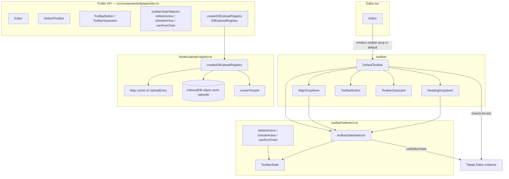
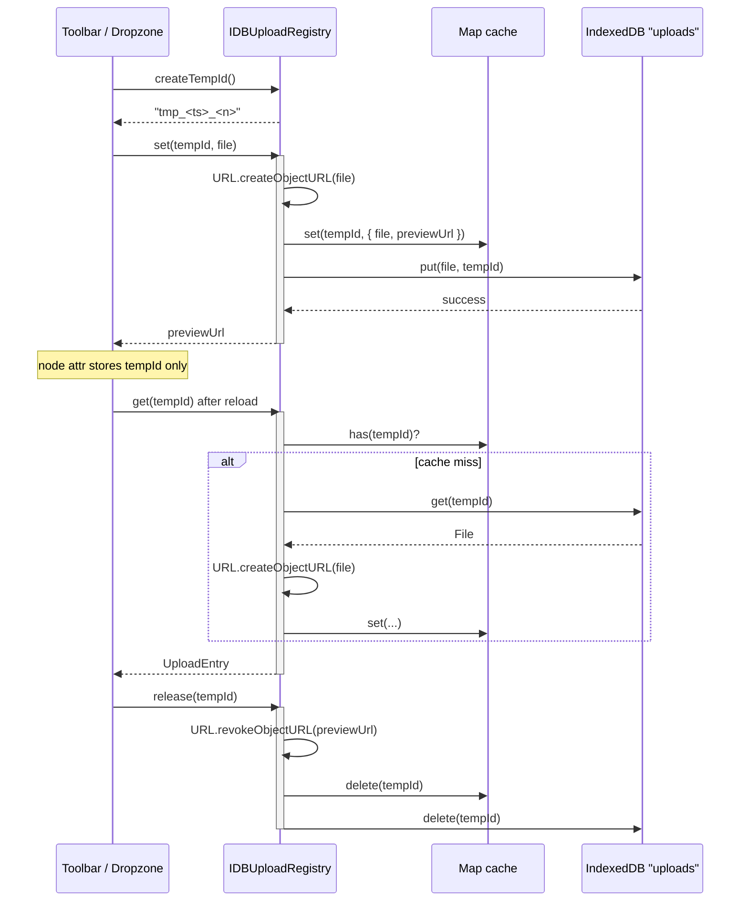
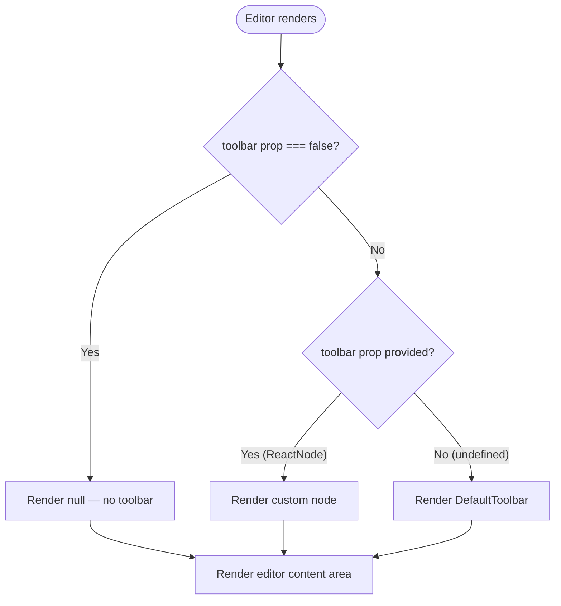

The public-facing tooling layer of the Tiptap editor integration: the default toolbar UI, the aggregate state selectors that drive it, the IndexedDB-backed upload registry that keeps `File` objects out of ProseMirror state, and the curated public API surface exported from `src/components/tiptap/index.ts`.

## Purpose and Scope

This page documents the consumer-facing surface of the in-house Tiptap editor package:

- **Toolbar** — `DefaultToolbar` and the button primitives (`ToolbarButton`, `ToolbarSeparator`), plus the dropdown sub-components (`HeadingDropdown`, `AlignDropdown`) that live inside the default toolbar.
- **Toolbar selectors** — `toolbarStateSelector`, `isMarkActive`, `isNodeActive`, `canRunChain`, and the `ToolbarState` type that make the toolbar re-render once per transaction instead of once per button.
- **Upload registry** — `createIDBUploadRegistry`, the `IDBUploadRegistry` type, `UploadEntry`, and `createTempId`, which together solve the problem of holding `File` blobs outside of serializable editor state.
- **Editor API surface** — the curated named exports from `src/components/tiptap/index.ts` that form the contract consumers code against.

This page intentionally does **not** cover the editor construction lifecycle or extension kit assembly (`useDocumentEditor`, `buildExtensions`), the persisted document model, or the rendering/serialization helpers (`renderDocumentHTML`, `getDocumentText`) — those belong to sibling pages of the editor section. The `Editor` component wrapper is described here only as the host that injects the toolbar.

## Overview

The editor package is deliberately layered: a small number of React components and hooks are exported as a **stable public surface**, and everything else is treated as internal. The comment at the top of the barrel file makes this contract explicit:

> "Public surface. Keep this list curated — anything not exported here is internal and may change without notice."

```typescript
// Public surface. Keep this list curated — anything not exported here is
// internal and may change without notice.

// Core
export { Editor } from "./Editor";

// Hooks
export { useDocumentEditor } from "./hooks/use-document-editor";
export type { UseDocumentEditorArgs } from "./hooks/use-document-editor";
export { createIDBUploadRegistry } from "./hooks/upload-registry";
export type { IDBUploadRegistry } from "./hooks/upload-registry";

// Toolbar
export { DefaultToolbar } from "./toolbar/Toolbar";
export { ToolbarButton, ToolbarSeparator } from "./toolbar/ToolbarButton";
export {
  toolbarStateSelector,
  isMarkActive,
  isNodeActive,
  canRunChain,
} from "./toolbar/selectors";
export type { ToolbarState } from "./toolbar/selectors";

// Extensions — re-exported so consumers can build their own kit
export { buildExtensions } from "./extensions/BuildExtensions";

// Library
export { renderDocumentHTML, getDocumentText } from "./lib/render";
export type {
  ImageUploadConfig,
  ImageMetadata,
  DocumentPayload,
  DocumentFetchResult,
  SaveResult,
  SaveTrigger,
  EditorErrorHandler,
  ErrorScope,
} from "./lib/types";
```

> Source: [index.ts](https://github.com/ozeaon/ozeaon-v2/blob/0a4f1a95824db87782f1221a4108019d174df3d9/src/components/tiptap/index.ts#L1-L38)

Two design themes dominate this layer:

1. **Single-subscription state aggregation.** Rather than having each toolbar button subscribe independently to the editor (which would mean *N* re-renders per keystroke), the toolbar uses one `useEditorState` call with `toolbarStateSelector`, returning a single flat object of primitives.
2. **Serialization discipline for binary data.** `File` objects cannot survive ProseMirror node attributes or JSON snapshots, so the upload registry externalizes them behind string `tempId` handles with precise object-URL lifecycle management.

## Architecture

The diagram below shows how the toolbar, selectors, upload registry, and Editor wrapper relate to one another and to the underlying Tiptap runtime.



### Component roles

| Component | File | Responsibility |
|-----------|------|----------------|
| `Editor` | `src/components/tiptap/Editor.tsx` | Host wrapper; renders the `toolbar` prop, or `DefaultToolbar`, or nothing. |
| `DefaultToolbar` | `src/components/tiptap/toolbar/Toolbar.tsx` | Aggregates all toolbar buttons into one subscription; wires formatting commands. |
| `HeadingDropdown` | `src/components/tiptap/toolbar/Toolbar.tsx` | Heading level picker (H2/H3/H4) plus paragraph reset. |
| `AlignDropdown` | `src/components/tiptap/toolbar/Toolbar.tsx` | Text alignment picker (left/center/right/justify). |
| `ToolbarButton` / `ToolbarSeparator` | `src/components/tiptap/toolbar/ToolbarButton.tsx` | Low-level presentational primitives used by the toolbar and available to consumers. |
| `toolbarStateSelector` | `src/components/tiptap/toolbar/selectors.ts` | Single aggregate selector producing all active/disabled state. |
| `isMarkActive` / `isNodeActive` / `canRunChain` | `src/components/tiptap/toolbar/selectors.ts` | Composable selector factories for custom toolbars. |
| `createIDBUploadRegistry` | `src/components/tiptap/hooks/upload-registry.ts` | Per-editor registry mapping `tempId` → `UploadEntry` (file + preview URL), backed by IndexedDB. |

## Toolbar Implementation

### `DefaultToolbar`

`DefaultToolbar` is the default formatting bar. Its signature takes the Tiptap `Editor` instance and an optional fullscreen toggle callback, and it owns a single aggregate subscription plus one event listener for loading state.

```typescript
/**
 * Default toolbar. Single subscription via `toolbarStateSelector` aggregates
 * every button's active/disabled state into one object so the toolbar
 * re-renders once per editor transaction, not per button.
 *
 * Consumers wanting a different toolbar build their own component, import
 * the selectors they need, and pass it via `<Editor toolbar={...} />`.
 */
export function DefaultToolbar({
  editor,
  toggleFullScreen,
}: {
  editor: Editor;
  toggleFullScreen?: () => void;
}) {
  const [isLoading, setIsLoading] = useState(false);
  const state = useEditorState({ editor, selector: toolbarStateSelector });
  const chain = () => editor.chain().focus();

  useEffect(() => {
    if (!editor) return;
    const handleLoadingChange = (event: EditorEvents["loadingStateChange"]) => {
      setIsLoading(event.isLoading);
    };
    editor.on("loadingStateChange", handleLoadingChange);
    return () => {
      editor.off("loadingStateChange", handleLoadingChange);
    };
  }, [editor]);
```

> Source: [Toolbar.tsx](https://github.com/ozeaon/ozeaon-v2/blob/0a4f1a95824db87782f1221a4108019d174df3d9/src/components/tiptap/toolbar/Toolbar.tsx#L186-L214)

Two implementation details matter here:

- **`chain = () => editor.chain().focus()`** — every command is executed through a freshly built, focused chain. Calling `.focus()` first is what guarantees the command applies at the document selection even after the user's pointer moved onto a toolbar `<button>` (which would otherwise blur the editor and lose the selection).
- **Loading state via event, not selector** — the `loadingStateChange` editor event is subscribed to imperatively in a `useEffect` with proper cleanup (`editor.off`). This is deliberately separate from `toolbarStateSelector`, because loading is an event-driven side channel rather than a derived document-state value.

The returned JSX renders an accessible toolbar container with `role="toolbar"` and `aria-label="Editor toolbar"`, followed by the heading dropdown, undo/redo, and (further in the file) the remaining buttons and separators:

```typescript
  return (
    <div
      aria-label="Editor toolbar"
      role="toolbar"
      className="flex flex-wrap items-center gap-1 border-b bg-bg-subtle px-4 py-2"
    >
      <HeadingDropdown editor={editor} />
      <ToolbarSeparator />
      <ToolbarButton
        onClick={() => chain().undo().run()}
        active={state.canUndo}
        disabled={!state.canUndo}
        label="Undo"
      >
        <UndoIcon />
      </ToolbarButton>
      <ToolbarButton
        onClick={() => chain().redo().run()}
        active={state.canRedo}
        disabled={!state.canRedo}
        label="Redo"
      >
        <RedoIcon />
      </ToolbarButton>
      <ToolbarSeparator />
```

> Source: [Toolbar.tsx](https://github.com/ozeaon/ozeaon-v2/blob/0a4f1a95824db87782f1221a4108019d174df3d9/src/components/tiptap/toolbar/Toolbar.tsx#L216-L240)

Note the undo/redo pattern: `active` and `disabled` are both bound to the same `canUndo`/`canRedo` flags. This means an unavailable action is visually disabled and never falsely highlighted as active — a common toolbar bug avoided by deriving both properties from the *same* capability check.

### `HeadingDropdown`

`HeadingDropdown` demonstrates the canonical pattern for any custom toolbar sub-control: subscribe to `toolbarStateSelector`, derive the icon from current state, and dispatch via `editor.chain().focus()`.

```typescript
function HeadingDropdown({ editor }: { editor: Editor }) {
  const state = useEditorState({ editor, selector: toolbarStateSelector });

  const [open, setOpen] = useState(false);

  const setLevel = (level: 0 | 2 | 3 | 4) => {
    const chain = editor.chain().focus();
    if (level === 0) chain.setParagraph().run();
    else chain.toggleHeading({ level }).run();
    setOpen(false);
  };

  const Icon = state.h2
    ? Heading2
    : state.h3
      ? Heading3
      : state.h4
        ? Heading4
        : Heading;
```

> Source: [Toolbar.tsx](https://github.com/ozeaon/ozeaon-v2/blob/0a4f1a95824db87782f1221a4108019d174df3d9/src/components/tiptap/toolbar/Toolbar.tsx#L35-L53)

Key behaviors:

- **Level `0` maps to no heading.** `setLevel(0)` calls `setParagraph()`, so the dropdown doubles as a "reset to body text" affordance without a separate button.
- **The trigger reflects current state.** The icon cascades `state.h2 → state.h3 → state.h4 → Heading`, so the trigger always shows the active heading level.
- **Editable gating.** Every button sets `disabled={!editor.isEditable}`, which is how read-only documents get an inert toolbar without a separate read-only toolbar variant.

The dropdown is built on the shadcn `DropdownMenu` primitives and exposes the icon as the trigger via `asChild`, with `active={state.isHeading}` on the wrapper button:

```typescript
    <DropdownMenu open={open} onOpenChange={setOpen}>
      <ToolbarButton
        asChild
        label="Heading"
        active={state.isHeading}
        disabled={!editor.isEditable}
      >
        <DropdownMenuTrigger>
          <Icon />
        </DropdownMenuTrigger>
      </ToolbarButton>
```

> Source: [Toolbar.tsx](https://github.com/ozeaon/ozeaon-v2/blob/0a4f1a95824db87782f1221a4108019d174df3d9/src/components/tiptap/toolbar/Toolbar.tsx#L56-L66)

### `AlignDropdown`

`AlignDropdown` is structurally identical to `HeadingDropdown` but is additionally gated on a capability flag, `state.canAlign`, showing how `editor.can()` results are used to disable the trigger when the current selection cannot be aligned.

```typescript
function AlignDropdown({ editor }: { editor: Editor }) {
  const state = useEditorState({ editor, selector: toolbarStateSelector });

  const [open, setOpen] = useState(false);

  type TextAlign = typeof editor.schema.marks.textAlign;

  const Icon = state.alignLeft
    ? TextIcon
    : state.alignRight
      ? AlignRightIcon
      : state.alignCenter
        ? AlignCenterIcon
        : AlignJustifyIcon;

  const alignText = (alignment?: TextAlign["name"]) => {
    const chain = editor.chain().focus();
    if (!alignment) chain.unsetTextAlign().run();
    else chain.toggleTextAlign(alignment).run();
    setOpen(false);
  };
```

> Source: [Toolbar.tsx](https://github.com/ozeaon/ozeaon-v2/blob/0a4f1a95824db87782f1221a4108019d174df3d9/src/components/tiptap/toolbar/Toolbar.tsx#L110-L130)

Note the type extraction `typeof editor.schema.marks.textAlign` — the alignment argument type is derived from the live schema rather than hand-written, keeping the component's types consistent with the installed extension. When `alignment` is `undefined`, the command switches to `unsetTextAlign()`, i.e. the same "clear the attribute" idiom as the heading dropdown's paragraph reset.

The trigger disables on either editability or capability:

```typescript
      <ToolbarButton
        asChild
        label="Align text"
        active={state.isAligned}
        disabled={!editor.isEditable || !state.canAlign}
      >
        <DropdownMenuTrigger>
          <Icon />
        </DropdownMenuTrigger>
      </ToolbarButton>
```

> Source: [Toolbar.tsx](https://github.com/ozeaon/ozeaon-v2/blob/0a4f1a95824db87782f1221a4108019d174df3d9/src/components/tiptap/toolbar/Toolbar.tsx#L134-L142)

## Toolbar Selectors

### Design intent: one subscription, not N

The header comment in `selectors.ts` states the rationale directly:

```typescript
/**
 * Selectors used by `useEditorState`. Returning primitives (or fixed-shape
 * objects of primitives with stable keys) lets the default shallow equality
 * check skip re-renders when nothing actually changed.
 */
```

> Source: [selectors.ts](https://github.com/ozeaon/ozeaon-v2/blob/0a4f1a95824db87782f1221a4108019d174df3d9/src/components/tiptap/toolbar/selectors.ts#L3-L7)

`useEditorState` performs a shallow equality comparison on the selector result. By returning a **fixed-shape object of primitives** (booleans, numbers, strings) the comparison is both cheap and correct: re-render happens only when a value actually flips. Nested objects or arrays would compare by reference and cause false-positive re-renders.

### The aggregate selector

`toolbarStateSelector` is the single source of toolbar truth. It folds every active-state and capability check into one flat object:

```typescript
/**
 * Aggregate selector — pulls everything the default toolbar needs in one
 * subscription, so we get one re-render per editor update instead of N.
 */
export const toolbarStateSelector = (ctx: { editor: Editor }) => {
  const e = ctx.editor;
  return {
    canUndo: e.can().chain().undo().run() ?? false,
    canRedo: e.can().chain().redo().run() ?? false,

    bold: e.isActive("bold"),
    italic: e.isActive("italic"),
    strike: e.isActive("strike"),
    underline: e.isActive("underline"),

    blockquote: e.isActive("blockquote"),
    canBlockquote: e.can().chain().toggleBlockquote().run(),

    bulletList: e.isActive("bulletList"),
    orderedList: e.isActive("orderedList"),

    paragraph: e.isActive("paragraph"),

    h2: e.isActive("heading", { level: 2 }),
    h3: e.isActive("heading", { level: 3 }),
    h4: e.isActive("heading", { level: 4 }),
    isHeading: e.isActive("heading"),
```

> Source: [selectors.ts](https://github.com/ozeaon/ozeaon-v2/blob/0a4f1a95824db87782f1221a4108019d174df3d9/src/components/tiptap/toolbar/selectors.ts#L34-L60)

The selector maps two distinct Tiptap query mechanisms onto the same flat shape:

| Pattern | API | Meaning | Example keys |
|---------|-----|---------|--------------|
| **Active state** | `e.isActive(...)` | Whether the mark/node is currently applied at the selection. | `bold`, `italic`, `blockquote`, `h2`, `alignLeft` |
| **Capability** | `e.can().chain()....run()` | Whether the command *would* succeed (simulated without dispatch). | `canUndo`, `canBold`, `canAlign`, `canLiftListItem` |

The distinction is what allows the toolbar to render disabled buttons accurately: `bold` says "is bold on?", while `canBold` says "can bold even be toggled here?".

### Alignment and list-item capabilities

```typescript
    alignLeft: e.isActive({ textAlign: "left" }),
    alignCenter: e.isActive({ textAlign: "center" }),
    alignRight: e.isActive({ textAlign: "right" }),
    alignJustify: e.isActive({ textAlign: "justify" }),
    isAligned:
      e.isActive({ textAlign: "left" }) ||
      e.isActive({ textAlign: "center" }) ||
      e.isActive({ textAlign: "right" }) ||
      e.isActive({ textAlign: "justify" }),

    canAlign: e.can().chain().toggleTextAlign("right").run(),

    canSinkListItem: e.can().sinkListItem("listItem"),
    canLiftListItem: e.can().liftListItem("listItem"),

    canBulletList: e.can().toggleBulletList(),
    canOrderedList: e.can().toggleOrderedList(),
```

> Source: [selectors.ts](https://github.com/ozeaon/ozeaon-v2/blob/0a4f1a95824db87782f1221a4108019d174df3d9/src/components/tiptap/toolbar/selectors.ts#L62-L78)

`isAligned` is a derived boolean — a disjunction of the four alignment checks — used to highlight the dropdown trigger whenever *any* alignment is applied. `canAlign` uses a representative alignment (`"right"`) as a proxy capability probe: if any alignment can be toggled, alignment commands apply to the selection.

### Image capability probe

```typescript
    imagesEnable: e.can().chain().insertImageUploadEmpty
      ? e.can().chain().insertImageUploadEmpty?.().run()
      : false,
```

> Source: [selectors.ts](https://github.com/ozeaon/ozeaon-v2/blob/0a4f1a95824db87782f1221a4108019d174df3d9/src/components/tiptap/toolbar/selectors.ts#L80-L82)

This is a guarded capability probe: it first checks that the custom `insertImageUploadEmpty` command exists on the chain (it is supplied by this project's image extension, not core Tiptap), and only then invokes it. If the extension is absent — for example in a consumer that built a custom, narrower extension kit via `buildExtensions` — the selector degrades to `false` instead of throwing. This is important because `toolbarStateSelector` runs on *every* transaction; an unguarded call to a missing command would crash the toolbar for any editor built without the image extension.

### Mark formatting capabilities and character count

```typescript
    canBold: e.can().chain().toggleBold().run(),
    canItalic: e.can().chain().toggleItalic().run(),
    canUnder: e.can().chain().toggleUnderline().run(),
    canStrike: e.can().chain().toggleStrike().run(),

    characterCount: e.storage.characterCount?.characters(),
  };
};

export type ToolbarState = ReturnType<typeof toolbarStateSelector>;
```

> Source: [selectors.ts](https://github.com/ozeaon/ozeaon-v2/blob/0a4f1a95824db87782f1221a4108019d174df3d9/src/components/tiptap/toolbar/selectors.ts#L84-L93)

`characterCount` reads through `e.storage.characterCount?.characters()`. The optional chaining `?.` makes the selector tolerant of an extension kit without the character-count extension — the value becomes `undefined` rather than throwing. `ToolbarState` is then derived via `ReturnType<typeof toolbarStateSelector>`, so the type stays automatically in sync with the selector body.

### Composable selector factories

For consumers building a *custom* toolbar, the three factory selectors are exported. Each takes a configuration argument and returns a `(ctx: { editor: Editor }) => T` selector suitable for `useEditorState`.

```typescript
export const isMarkActive = (mark: string) => (ctx: { editor: Editor }) =>
  ctx.editor.isActive(mark);

export const isNodeActive =
  (node: string, attrs?: Record<string, unknown>) =>
  (ctx: { editor: Editor }) =>
    ctx.editor.isActive(node, attrs);
```

> Source: [selectors.ts](https://github.com/ozeaon/ozeaon-v2/blob/0a4f1a95824db87782f1221a4108019d174df3d9/src/components/tiptap/toolbar/selectors.ts#L9-L15)

`isNodeActive` accepts optional `attrs`, which is how the aggregate selector distinguishes heading levels (`isActive("heading", { level: 2 })`).

`canRunChain` is the most interesting factory — it lets a consumer probe arbitrary chain capabilities with a graceful failure mode:

```typescript
export const canRunChain =
  (
    fn: (
      chain: ReturnType<Editor["can"]>["chain"] extends () => infer C
        ? C
        : never,
    ) => boolean,
  ) =>
  (ctx: { editor: Editor }) => {
    // `editor.can()` returns a chain that simulates execution without dispatching.
    try {
      return fn(ctx.editor.can().chain().focus());
    } catch {
      return false;
    }
  };
```

> Source: [selectors.ts](https://github.com/ozeaon/ozeaon-v2/blob/0a4f1a95824db87782f1221a4108019d174df3d9/src/components/tiptap/toolbar/selectors.ts#L17-L32)

Design points worth calling out:

- The `fn` argument receives a **simulation chain** (`editor.can().chain().focus()`), not the real editor. Commands executed against it return booleans and dispatch nothing — so a capability probe is always side-effect free.
- The `try/catch` returning `false` is defensive: a command that is not registered on the current extension kit would throw, and a capability probe should never take down the toolbar render.

## Upload Registry

### The problem it solves

The registry's header comment explains the constraint precisely:

```typescript
/**
 * `File` objects can't live in ProseMirror node attrs (they don't serialize
 * and would explode JSON snapshots). Instead each upload node carries a
 * `tempId` string, and the actual File is stored here, scoped to one editor
 * instance via the registry returned from `createUploadRegistry`.
 *
 * The registry also tracks object URLs created from those files so we can
 * revoke them precisely (no global revocation, no leaks).
 */
```

> Source: [upload-registry.ts](https://github.com/ozeaon/ozeaon-v2/blob/0a4f1a95824db87782f1221a4108019d174df3d9/src/components/tiptap/hooks/upload-registry.ts#L1-L9)

This is a **handle/table indirection** pattern. ProseMirror document state must be serializable, so a binary `File` is replaced by an opaque string handle (`tempId`). The registry is the side table that resolves handles back to real files, and it owns the derived resource (the object URL) so it can release it deterministically.

### The registry contract

```typescript
export type UploadEntry = {
  file: File;
  previewUrl: string;
};

let counter = 0;
export function createTempId(): string {
  counter += 1;
  return `tmp_${Date.now().toString(36)}_${counter.toString(36)}`;
}

export type IDBUploadRegistry = {
  ready: Promise<void>;
  set: (tempId: string, file: File) => Promise<string>;
  get: (tempId: string) => Promise<UploadEntry | undefined>;
  release: (tempId: string) => Promise<void>;
  clear: () => Promise<void>;
  keys: () => Promise<string[]>;
};
```

> Source: [upload-registry.ts](https://github.com/ozeaon/ozeaon-v2/blob/0a4f1a95824db87782f1221a4108019d174df3d9/src/components/tiptap/hooks/upload-registry.ts#L11-L29)

`createTempId` combines a base-36 timestamp with a monotonically increasing module-level counter. The counter guarantees uniqueness even when several files are added within the same millisecond; the timestamp keeps ids monotonic-ish across reloads for debuggability. The public API is deliberately small and entirely promise-based, because the backing store is IndexedDB.

### Construction and IndexedDB setup

```typescript
export function createIDBUploadRegistry(dbName: string): IDBUploadRegistry {
  const STORE = "uploads";
  const cache = new Map<string, UploadEntry>();

  let db!: IDBDatabase;
  const ready = new Promise<void>((resolve, reject) => {
    const req = indexedDB.open(dbName, 1);
    req.onupgradeneeded = () => req.result.createObjectStore(STORE);
    req.onsuccess = () => {
      db = req.result;
      resolve();
    };
    req.onerror = () => reject(req.error);
  });

  function store(mode: IDBTransactionMode) {
    return db.transaction(STORE, mode).objectStore(STORE);
  }

  function wrap<T>(req: IDBRequest<T>): Promise<T> {
    return new Promise((res, rej) => {
      req.onsuccess = () => res(req.result);
      req.onerror = () => rej(req.error);
    });
  }
```

> Source: [upload-registry.ts](https://github.com/ozeaon/ozeaon-v2/blob/0a4f1a95824db87782f1221a4108019d174df3d9/src/components/tiptap/hooks/upload-registry.ts#L31-L55)

Implementation notes:

- **DB name is a parameter.** `createIDBUploadRegistry(dbName)` lets the host scope storage per editor or per document, so multiple open editors do not collide in one object store. The store name inside is always `"uploads"` (version `1`).
- **Two-layer storage: a synchronous `Map` cache in front of async IndexedDB.** This is a deliberate performance choice — see `set`/`get` below.
- **`wrap<T>` promisifies raw `IDBRequest`s**, which is necessary because the IDB event API is callback-based.

### Per-method behavior

**`set(tempId, file)`** creates the object URL eagerly, populates the cache *before* awaiting IndexedDB, then persists — and returns the preview URL:

```typescript
    async set(tempId, file) {
      const previewUrl = URL.createObjectURL(file);
      cache.set(tempId, { file, previewUrl });
      await ready;
      await wrap(store("readwrite").put(file, tempId));
      return previewUrl;
    },
```

> Source: [upload-registry.ts](https://github.com/ozeaon/ozeaon-v2/blob/0a4f1a95824db87782f1221a4108019d174df3d9/src/components/tiptap/hooks/upload-registry.ts#L59-L65)

The cache is written first so that a `get` issued immediately after (before IDB resolves) still finds the entry synchronously — avoiding an async race where a node inserted right after upload would fail to resolve its preview.

**`get(tempId)`** is cache-first, and on a cache miss it reconstructs the entry (including a *new* object URL) from IndexedDB:

```typescript
    async get(tempId) {
      if (cache.has(tempId)) return cache.get(tempId);
      await ready;
      const file = await wrap<File | undefined>(store("readonly").get(tempId));
      if (!file) return undefined;
      const previewUrl = URL.createObjectURL(file);
      const entry: UploadEntry = { file, previewUrl };
      cache.set(tempId, entry);
      return entry;
    },
```

> Source: [upload-registry.ts](https://github.com/ozeaon/ozeaon-v2/blob/0a4f1a95824db87782f1221a4108019d174df3d9/src/components/tiptap/hooks/upload-registry.ts#L66-L75)

The cache-miss path is exactly what enables **restoring a document after reload**: the ProseMirror document still contains only `tempId` strings, and the previously-persisted `File` blobs are re-hydrated from IndexedDB on demand. This is why IndexedDB (rather than in-memory-only storage) is used.

**`release(tempId)`** revokes the URL, drops the cache entry, and deletes from IndexedDB:

```typescript
    async release(tempId) {
      const entry = cache.get(tempId);
      if (entry) {
        URL.revokeObjectURL(entry.previewUrl);
        cache.delete(tempId);
      }
      await ready;
      await wrap(store("readwrite").delete(tempId));
    },
```

> Source: [upload-registry.ts](https://github.com/ozeaon/ozeaon-v2/blob/0a4f1a95824db87782f1221a4108019d174df3d9/src/components/tiptap/hooks/upload-registry.ts#L76-L84)

**`clear()`** revokes *every* URL in the cache, empties the cache, and clears the store — the "editor unmounted / document closed" cleanup path:

```typescript
    async clear() {
      for (const entry of cache.values()) URL.revokeObjectURL(entry.previewUrl);
      cache.clear();
      await ready;
      await wrap(store("readwrite").clear());
    },
```

> Source: [upload-registry.ts](https://github.com/ozeaon/ozeaon-v2/blob/0a4f1a95824db87782f1221a4108019d174df3d9/src/components/tiptap/hooks/upload-registry.ts#L85-L90)

**`keys()`** returns all persisted handles, giving the host a way to enumerate and reconcile orphaned uploads:

```typescript
    async keys() {
      await ready;
      return wrap<string[]>(
        store("readonly").getAllKeys() as IDBRequest<string[]>,
      );
    },
```

> Source: [upload-registry.ts](https://github.com/ozeaon/ozeaon-v2/blob/0a4f1a95824db87782f1221a4108019d174df3d9/src/components/tiptap/hooks/upload-registry.ts#L91-L96)

### Upload lifecycle



## Editor API Surface

### The `Editor` host component

`Editor` is the component that binds the toolbar into the editor. It accepts a `toolbar` prop that is a three-state override: a `ReactNode` to replace the default, `false` to suppress it entirely, or `undefined` to use `DefaultToolbar`.

```typescript
import { DefaultToolbar } from "./toolbar/Toolbar";
import { cn } from "@/utils";
```

> Source: [Editor.tsx](https://github.com/ozeaon/ozeaon-v2/blob/0a4f1a95824db87782f1221a4108019d174df3d9/src/components/tiptap/Editor.tsx#L5-L6)

The prop is documented inline:

```typescript
  /**
   * Override the default toolbar. Pass a ReactNode to render in its place,
   * or `false` to render no toolbar at all. When omitted, the default
   * toolbar is rendered.
   */
  toolbar?: ReactNode | false;
  className?: string;
```

> Source: [Editor.tsx](https://github.com/ozeaon/ozeaon-v2/blob/0a4f1a95824db87782f1221a4108019d174df3d9/src/components/tiptap/Editor.tsx#L10-L16)

The resolution logic is a single ternary chain — `false` yields `null`, otherwise the provided `toolbar` node, otherwise `DefaultToolbar`:

```typescript
      {toolbar === false
        ? null
        : (toolbar ?? (
            <DefaultToolbar
```

> Source: [Editor.tsx](https://github.com/ozeaon/ozeaon-v2/blob/0a4f1a95824db87782f1221a4108019d174df3d9/src/components/tiptap/Editor.tsx#L47-L50)

**Why `false` and not just "omit"?** Because `toolbar={undefined}` and `toolbar={null}` would be indistinguishable from "not provided" under normal optional-prop semantics. Using an explicit `false` sentinel makes "render no toolbar" a deliberate, expressible choice — important for embedding the editor in contexts (e.g. a read-only preview) where a formatting bar is inappropriate.

### Toolbar override flow



### Public exports reference

The barrel file defines four export groups. Consumers should import exclusively from `@/components/tiptap` (or the relative equivalent) rather than reaching into subdirectories.

| Export | Kind | Symbol Origin | Purpose |
|--------|------|---------------|---------|
| `Editor` | Component | `./Editor` | Editor host wrapper; renders toolbar + content. |
| `useDocumentEditor` | Hook | `./hooks/use-document-editor` | Builds/owns the Tiptap editor instance for a document. |
| `UseDocumentEditorArgs` | Type | `./hooks/use-document-editor` | Argument shape for the hook. |
| `createIDBUploadRegistry` | Factory | `./hooks/upload-registry` | Creates the IndexedDB-backed upload registry. |
| `IDBUploadRegistry` | Type | `./hooks/upload-registry` | Registry contract. |
| `DefaultToolbar` | Component | `./toolbar/Toolbar` | Default formatting toolbar. |
| `ToolbarButton` | Component | `./toolbar/ToolbarButton` | Toolbar button primitive. |
| `ToolbarSeparator` | Component | `./toolbar/ToolbarButton` | Visual separator primitive. |
| `toolbarStateSelector` | Selector | `./toolbar/selectors` | Aggregate toolbar state selector. |
| `isMarkActive` | Selector factory | `./toolbar/selectors` | Mark-active selector factory. |
| `isNodeActive` | Selector factory | `./toolbar/selectors` | Node-active selector factory (with optional attrs). |
| `canRunChain` | Selector factory | `./toolbar/selectors` | Capability probe factory for arbitrary chains. |
| `ToolbarState` | Type | `./toolbar/selectors` | Type of the aggregate selector output. |
| `buildExtensions` | Factory | `./extensions/BuildExtensions` | Builds the extension kit (custom kits supported). |
| `renderDocumentHTML` | Function | `./lib/render` | Renders stored document to HTML. |
| `getDocumentText` | Function | `./lib/render` | Extracts plain text from a document. |
| `ImageUploadConfig`, `ImageMetadata`, `DocumentPayload`, `DocumentFetchResult`, `SaveResult`, `SaveTrigger`, `EditorErrorHandler`, `ErrorScope` | Types | `./lib/types` | Document persistence, image, save, and error-handling contracts. |

> Source: [index.ts](https://github.com/ozeaon/ozeaon-v2/blob/0a4f1a95824db87782f1221a4108019d174df3d9/src/components/tiptap/index.ts#L4-L38)

## Usage Examples

### Basic usage — the default toolbar

The simplest consumption is to let the `Editor` host render `DefaultToolbar` by not passing the `toolbar` prop at all. The default renders when the prop is `undefined`:

```typescript
      {toolbar === false
        ? null
        : (toolbar ?? (
            <DefaultToolbar
```

> Source: [Editor.tsx](https://github.com/ozeaon/ozeaon-v2/blob/0a4f1a95824db87782f1221a4108019d174df3d9/src/components/tiptap/Editor.tsx#L47-L50)

### Suppressing the toolbar

For a read-only or preview surface, pass `false` to render no toolbar while keeping the editor body:

```typescript
  /**
   * Override the default toolbar. Pass a ReactNode to render in its place,
   * or `false` to render no toolbar at all. When omitted, the default
   * toolbar is rendered.
   */
  toolbar?: ReactNode | false;
```

> Source: [Editor.tsx](https://github.com/ozeaon/ozeaon-v2/blob/0a4f1a95824db87782f1221a4108019d174df3d9/src/components/tiptap/Editor.tsx#L10-L15)

### Building a custom toolbar from the exported selectors

The documented extension path is to build a custom component and pass it via the `toolbar` prop, importing only the selectors you need:

```typescript
/**
 * Default toolbar. Single subscription via `toolbarStateSelector` aggregates
 * every button's active/disabled state into one object so the toolbar
 * re-renders once per editor transaction, not per button.
 *
 * Consumers wanting a different toolbar build their own component, import
 * the selectors they need, and pass it via `<Editor toolbar={...} />`.
 */
```

> Source: [Toolbar.tsx](https://github.com/ozeaon/ozeaon-v2/blob/0a4f1a95824db87782f1221a4108019d174df3d9/src/components/tiptap/toolbar/Toolbar.tsx#L186-L193)

The factory selectors show the intended composition pattern — a custom toolbar subscribes with a selector it defines itself, reusing `isMarkActive`/`canRunChain`:

```typescript
export const isMarkActive = (mark: string) => (ctx: { editor: Editor }) =>
  ctx.editor.isActive(mark);
```

> Source: [selectors.ts](https://github.com/ozeaon/ozeaon-v2/blob/0a4f1a95824db87782f1221a4108019d174df3d9/src/components/tiptap/toolbar/selectors.ts#L9-L10)

```typescript
  (ctx: { editor: Editor }) => {
    // `editor.can()` returns a chain that simulates execution without dispatching.
    try {
      return fn(ctx.editor.can().chain().focus());
    } catch {
      return false;
    }
  };
```

> Source: [selectors.ts](https://github.com/ozeaon/ozeaon-v2/blob/0a4f1a95824db87782f1221a4108019d174df3d9/src/components/tiptap/toolbar/selectors.ts#L25-L32)

### Creating and using the upload registry

The registry is created per editor instance with a caller-chosen IndexedDB name, then used to store files behind `tempId` handles:

```typescript
export function createIDBUploadRegistry(dbName: string): IDBUploadRegistry {
  const STORE = "uploads";
  const cache = new Map<string, UploadEntry>();

  let db!: IDBDatabase;
  const ready = new Promise<void>((resolve, reject) => {
    const req = indexedDB.open(dbName, 1);
    req.onupgradeneeded = () => req.result.createObjectStore(STORE);
```

> Source: [upload-registry.ts](https://github.com/ozeaon/ozeaon-v2/blob/0a4f1a95824db87782f1221a4108019d174df3d9/src/components/tiptap/hooks/upload-registry.ts#L31-L38)

Generating the handles that go into node attributes:

```typescript
let counter = 0;
export function createTempId(): string {
  counter += 1;
  return `tmp_${Date.now().toString(36)}_${counter.toString(36)}`;
}
```

> Source: [upload-registry.ts](https://github.com/ozeaon/ozeaon-v2/blob/0a4f1a95824db87782f1221a4108019d174df3d9/src/components/tiptap/hooks/upload-registry.ts#L16-L20)

## API Reference

### `createIDBUploadRegistry(dbName: string): IDBUploadRegistry`

Creates an upload registry backed by an IndexedDB object store named `"uploads"` inside database `dbName` (schema version `1`).

**Parameters:**
- `dbName` (`string`): The IndexedDB database name. Choose per-editor or per-document to avoid collisions between concurrently open editors.

**Returns:** An `IDBUploadRegistry` object, described below.

**Behavior:** The returned object exposes a `ready: Promise<void>` that resolves once the database is open. All async methods internally `await ready` before touching the store, so callers do not need to gate their calls on `ready` themselves.

> Source: [upload-registry.ts](https://github.com/ozeaon/ozeaon-v2/blob/0a4f1a95824db87782f1221a4108019d174df3d9/src/components/tiptap/hooks/upload-registry.ts#L31-L44)

### `IDBUploadRegistry` methods

| Method | Signature | Returns | Notes |
|--------|-----------|---------|-------|
| `ready` | `Promise<void>` | — | Resolves when the DB is open; rejects on `indexedDB.open` error. |
| `set` | `(tempId: string, file: File) => Promise<string>` | The object (preview) URL | Creates the URL, fills the cache first, then persists the `File`. |
| `get` | `(tempId: string) => Promise<UploadEntry \| undefined>` | Entry or `undefined` | Cache-first; on miss rehydrates from IndexedDB and creates a new preview URL. |
| `release` | `(tempId: string) => Promise<void>` | — | Revokes the URL, removes the cache entry, deletes the IDB record. |
| `clear` | `() => Promise<void>` | — | Revokes all cached URLs, empties cache, clears the store. |
| `keys` | `() => Promise<string[]>` | All persisted `tempId`s | Uses `getAllKeys()` on the store. |

> Source: [upload-registry.ts](https://github.com/ozeaon/ozeaon-v2/blob/0a4f1a95824db87782f1221a4108019d174df3d9/src/components/tiptap/hooks/upload-registry.ts#L22-L96)

### `createTempId(): string`

Returns a unique handle of the form `tmp_<base36 timestamp>_<base36 counter>`.

**Returns:** A string unique within the current page session.

**Design intent:** The module-level `counter` guarantees uniqueness for multiple files created in the same millisecond, while the timestamp component keeps ids loosely ordered for debugging. Ids are stored in ProseMirror node attributes instead of the `File` itself.

> Source: [upload-registry.ts](https://github.com/ozeaon/ozeaon-v2/blob/0a4f1a95824db87782f1221a4108019d174df3d9/src/components/tiptap/hooks/upload-registry.ts#L16-L20)

### Selector factories

#### `isMarkActive(mark: string)`

Returns a selector `(ctx: { editor: Editor }) => boolean` reporting whether the named mark is active at the current selection.

- `mark` (`string`): The mark name, e.g. `"bold"`, `"italic"`, `"underline"`.

> Source: [selectors.ts](https://github.com/ozeaon/ozeaon-v2/blob/0a4f1a95824db87782f1221a4108019d174df3d9/src/components/tiptap/toolbar/selectors.ts#L9-L10)

#### `isNodeActive(node: string, attrs?: Record<string, unknown>)`

Returns a selector reporting whether the named node (optionally matching `attrs`) is active.

- `node` (`string`): The node name, e.g. `"heading"`, `"blockquote"`, `"bulletList"`.
- `attrs` (`Record<string, unknown>`, optional): Attribute constraints, e.g. `{ level: 2 }`.

> Source: [selectors.ts](https://github.com/ozeaon/ozeaon-v2/blob/0a4f1a95824db87782f1221a4108019d174df3d9/src/components/tiptap/toolbar/selectors.ts#L12-L15)

#### `canRunChain(fn)`

Returns a capability-probe selector. `fn` receives a **simulated** chain (`editor.can().chain().focus()`) and must return a boolean.

- `fn` (`(chain) => boolean`): Predicate run against the simulation chain. The chain type is inferred from `ReturnType<Editor["can"]>["chain"]`.

**Returns:** A selector that runs `fn` inside a `try/catch`, returning `false` if the command throws (e.g. an extension providing it is not installed).

**Design intent:** Probes are side-effect free because `editor.can()` dispatches nothing, and the `try/catch` keeps a missing-extension command from breaking toolbar rendering.

> Source: [selectors.ts](https://github.com/ozeaon/ozeaon-v2/blob/0a4f1a95824db87782f1221a4108019d174df3d9/src/components/tiptap/toolbar/selectors.ts#L17-L32)

### `toolbarStateSelector(ctx: { editor: Editor }): ToolbarState`

The aggregate selector consumed by `DefaultToolbar`. Returns a flat object of primitives covering undo/redo capability, mark states, block states, heading levels, alignment states and capability, list-item capabilities, list capabilities, image capability, mark-toggle capabilities, and character count.

**Returns:** `ToolbarState` (defined as `ReturnType<typeof toolbarStateSelector>`), designed as a fixed-shape object of primitives so `useEditorState`'s shallow comparison avoids spurious re-renders.

> Source: [selectors.ts](https://github.com/ozeaon/ozeaon-v2/blob/0a4f1a95824db87782f1221a4108019d174df3d9/src/components/tiptap/toolbar/selectors.ts#L38-L93)

## Failure Modes, Edge Cases & Concurrency

### Graceful degradation for absent extensions

The selector layer is explicitly written to tolerate extension kits that omit pieces of the default kit. Two mechanisms do this:

- **Optional chaining** on `e.storage.characterCount?.characters()` — returns `undefined` rather than throwing when the character-count extension is absent.
- **Existence guard + `try/catch`** for `insertImageUploadEmpty` and `canRunChain` — a missing custom command yields `false`.

Since `toolbarStateSelector` runs on every editor transaction, an unguarded call would break the entire toolbar for any custom kit. This defensiveness is a direct consequence of `buildExtensions` being re-exported "so consumers can build their own kit".

### Object URL lifetime

Object URLs are a finite browser resource. The registry never revokes globally — `release` revokes exactly one URL and `clear` iterates the cache. Two subtleties:

- `get` on a cache miss generates a **new** `URL.createObjectURL(file)` and caches it. Because the URL is stored in the cache entry, the subsequent `release`/`clear` revokes the correct one. Any URL not held in the cache is unreachable and therefore unrevocable — which is why `get` always stores what it creates.
- `set` writes the cache **before** awaiting IndexedDB, so a synchronous-ish `get` immediately afterward hits the cache and does not create a duplicate URL.

### IndexedDB race on first use

`await ready` before every store operation means callers can invoke `set`/`get`/`release`/`clear`/`keys` immediately after `createIDBUploadRegistry(...)` without waiting for `ready` manually. The tradeoff is that a failed `indexedDB.open` rejects `ready` and therefore rejects all subsequent operations — there is no automatic retry in this implementation.

### Toolbar active-state correctness

Undo/redo bind both `active` and `disabled` to the same `canUndo`/`canRedo` flag. This prevents the common bug where a button is styled "active" while being unclickable. Similarly, `AlignDropdown`'s trigger is disabled by `!state.canAlign`, so alignment cannot be invoked where the schema does not permit it.

## Performance & Operational Notes

- **One re-render per transaction.** The central performance decision: `DefaultToolbar` uses a single `useEditorState` subscription with `toolbarStateSelector`. If each of the ~15 buttons subscribed individually, every keystroke would trigger ~15 React re-render checks. The aggregate selector reduces this to one shallow comparison.
- **Primitives enable cheap shallow equality.** The comment in `selectors.ts` notes this explicitly — fixed-shape objects of primitives let the default shallow check skip re-renders "when nothing actually changed". `characterCount` being a number (not an object) supports this.
- **Memory cache in front of IndexedDB.** `get` short-circuits to a `Map` lookup on the hot path, avoiding async IDB round-trips during normal editing and during the common case of re-rendering an already-loaded image node.
- **Command chains use `can()` for probing.** `e.can().chain()...` simulates without dispatching, so state checks are side-effect free and cheap.
- **`set`/`get` stringify nothing.** `File` blobs are stored structurally in IndexedDB (which supports `File`/`Blob` natively), avoiding base64 inflation in the database.

## Extension Points

| Extension point | Mechanism | Evidence |
|-----------------|-----------|----------|
| Replace the toolbar entirely | `<Editor toolbar={<MyToolbar/>} />` | `toolbar?: ReactNode \| false` on `Editor`. |
| Remove the toolbar | `<Editor toolbar={false} />` | Same prop; `false` sentinel yields `null`. |
| Custom state subscriptions | Import `isMarkActive`, `isNodeActive`, `canRunChain`, `toolbarStateSelector` | Exported from `toolbar/selectors`. |
| Custom capabilities | Compose a selector with `canRunChain(fn)` | Simulation chain + `try/catch` fallback. |
| Custom extension kit | Import `buildExtensions` and pass your own kit | Re-exported "so consumers can build their own kit". |
| Per-scope upload storage | Pass a distinct `dbName` to `createIDBUploadRegistry` | `dbName` parameter. |
| Reconcile orphaned uploads | Call `keys()` and diff against document `tempId`s | `keys(): Promise<string[]>` exposed on the registry. |

## Related Links

- [Editor.tsx](https://github.com/ozeaon/ozeaon-v2/blob/0a4f1a95824db87782f1221a4108019d174df3d9/src/components/tiptap/Editor.tsx) — the host component that injects the toolbar.
- [toolbar/Toolbar.tsx](https://github.com/ozeaon/ozeaon-v2/blob/0a4f1a95824db87782f1221a4108019d174df3d9/src/components/tiptap/toolbar/Toolbar.tsx) — `DefaultToolbar`, `HeadingDropdown`, `AlignDropdown`.
- [toolbar/selectors.ts](https://github.com/ozeaon/ozeaon-v2/blob/0a4f1a95824db87782f1221a4108019d174df3d9/src/components/tiptap/toolbar/selectors.ts) — aggregate and composable selectors.
- [toolbar/ToolbarButton.tsx](https://github.com/ozeaon/ozeaon-v2/blob/0a4f1a95824db87782f1221a4108019d174df3d9/src/components/tiptap/toolbar/ToolbarButton.tsx) — `ToolbarButton` / `ToolbarSeparator` primitives.
- [hooks/upload-registry.ts](https://github.com/ozeaon/ozeaon-v2/blob/0a4f1a95824db87782f1221a4108019d174df3d9/src/components/tiptap/hooks/upload-registry.ts) — IndexedDB upload registry.
- [index.ts](https://github.com/ozeaon/ozeaon-v2/blob/0a4f1a95824db87782f1221a4108019d174df3d9/src/components/tiptap/index.ts) — the curated public API surface.
- [hook-form-components.md](https://github.com/ozeaon/ozeaon-v2/blob/0a4f1a95824db87782f1221a4108019d174df3d9/docs/hook-form-components.md) — documents a reduced-toolbar configuration ("Block type selector, bold, italic, underline, nest/unnest; code, links, emoji, slash menu, and side menu are disabled").

For editor construction and the `useDocumentEditor` lifecycle, see the sibling editor pages. For the persisted document model, `renderDocumentHTML`/`getDocumentText`, and the `DocumentPayload`/`SaveResult` contracts, see the sibling rendering & persistence pages.
