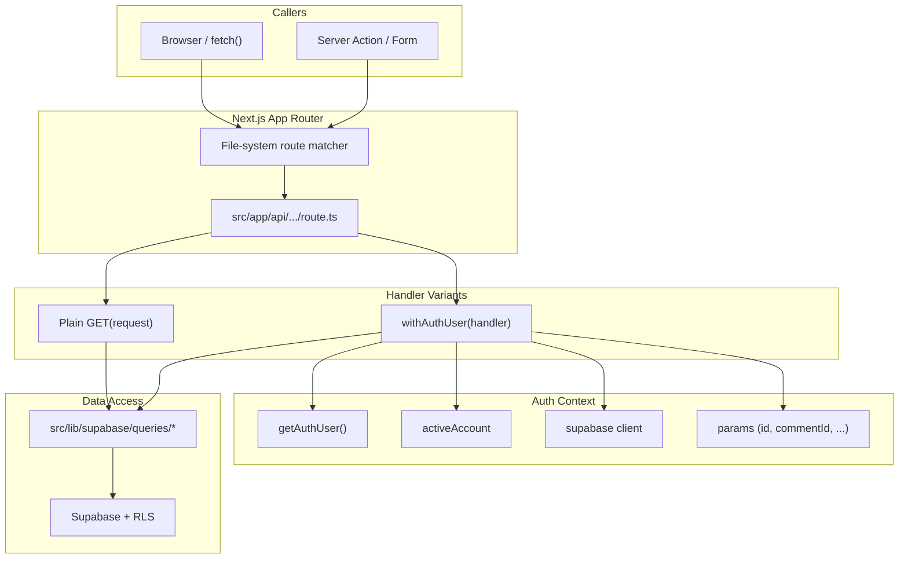
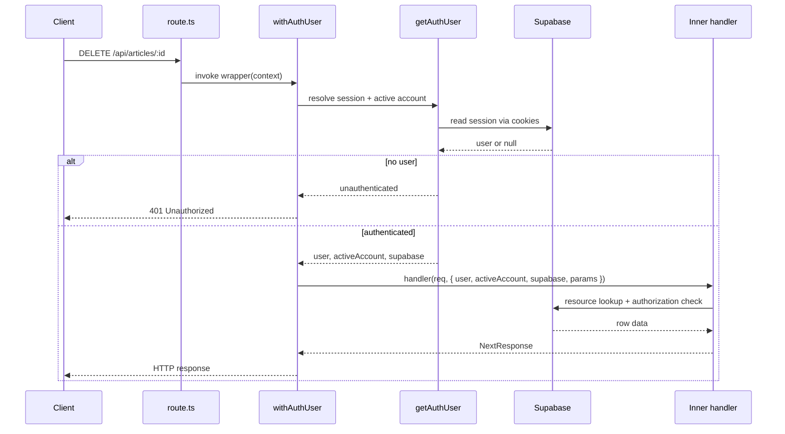

The ozeaon-v2 application exposes its HTTP surface through the Next.js App Router file-system convention under `src/app/api/**/route.ts`. This page documents how route handlers are organized, how authentication and authorization are layered onto them, and the shared conventions (validation, status codes, error envelopes) that every endpoint follows.

## Purpose and Scope

This page covers the **structural and conventional contract** of the API layer:

- Directory-to-URL mapping for `src/app/api/**`.
- The `route.ts` handler convention (`GET`, `POST`, `DELETE`, … exports).
- Dynamic route segments (`[id]`, `[commentId]`, `[userId]`) and typed `params`.
- The `withAuthUser` higher-order wrapper that injects user, active account, Supabase client, and parsed params.
- Standard response envelopes (`{ data }`, `{ error, message }`) and status code usage.
- Validation and ownership-resolution patterns found in route handlers.

Out of scope for this page (covered by sibling pages under `6-api-layer`):

- The internal implementation of specific resource families such as projects, articles, comments, and account endpoints.
- Supabase client construction details and Row-Level-Security policies.
- The server actions layer (`src/lib/supabase/actions.ts`) used by forms rather than HTTP routes.

## Overview

There is no single Express-style router file in this codebase. Instead, routing is derived entirely from the file system, and each endpoint is a **module of exported HTTP method functions**. Next.js discovers these files, maps the path segments to a URL, and invokes the matching export based on the incoming request method.

Two conventions dominate the codebase:

1. **Public read endpoints** export a plain `async function GET(request)` and build their own Supabase client, applying row filters (like `.eq("published", true)`) explicitly.
2. **Authenticated / mutating endpoints** export the result of `withAuthUser(...)`, a higher-order function that performs the auth handshake once and hands the handler a fully resolved context.

This split exists because authentication is expensive (it requires reading cookies and resolving the active account), and only some endpoints need it. Read paths that must remain publicly cacheable avoid the wrapper entirely, while every write path routes through it so that authorization cannot be forgotten.

The route tree under `src/app/api` is flat and resource-oriented, mirroring the domain entities of the platform: `articles`, `projects`, `categories`, `blocks`, `connections`, `currencies`, `events`, and account-scoped collections such as `account/posts`.

## Architecture

The diagram below shows how a request flows from the network edge into a route module and onward into the shared data-access layer.



The key structural insight is that `route.ts` files are thin: they parse and validate input, delegate to query functions under `src/lib/supabase/queries/`, and shape the HTTP response. Business logic and database access live in the query layer, not in the route module. This keeps each handler short and makes the route layer a consistent, predictable boundary.

## Route Tree and URL Mapping

Next.js maps directory names directly to URL segments, and dynamic segments (folders wrapped in square brackets) become named parameters.

| Route file | HTTP method(s) | URL | Params |
|------------|----------------|-----|--------|
| `src/app/api/articles/route.ts` | `GET`, `POST` | `/api/articles` | — |
| `src/app/api/articles/[id]/route.ts` | `GET`, `DELETE` | `/api/articles/:id` | `id` |
| `src/app/api/articles/search/route.ts` | `GET` | `/api/articles/search` | — |
| `src/app/api/articles/[id]/comments/route.ts` | `GET`, `POST` | `/api/articles/:id/comments` | `id` |
| `src/app/api/articles/[id]/comments/[commentId]/route.ts` | `DELETE`, … | `/api/articles/:id/comments/:commentId` | `id`, `commentId` |
| `src/app/api/articles/[id]/content/route.ts` | `GET` | `/api/articles/:id/content` | `id` |
| `src/app/api/articles/[id]/content/image/route.ts` | `POST`, … | `/api/articles/:id/content/image` | `id` |
| `src/app/api/articles/[id]/attachment/route.ts` | `GET` | `/api/articles/:id/attachment` | `id` |
| `src/app/api/articles/[id]/image/route.ts` | `POST`, … | `/api/articles/:id/image` | `id` |
| `src/app/api/account/posts/route.ts` | `GET`, `POST` | `/api/account/posts` | — |
| `src/app/api/account/posts/[id]/route.ts` | `GET`, `PATCH`, `DELETE` | `/api/account/posts/:id` | `id` |
| `src/app/api/active-account/route.ts` | `GET`, `POST` | `/api/active-account` | — |
| `src/app/api/blocks/route.ts` | `GET`, `POST` | `/api/blocks` | — |
| `src/app/api/blocks/[userId]/route.ts` | `DELETE` | `/api/blocks/:userId` | `userId` |
| `src/app/api/categories/route.ts` | `GET` | `/api/categories` | — |
| `src/app/api/categories/[id]/route.ts` | `GET` | `/api/categories/:id` | `id` |
| `src/app/api/connections/route.ts` | `GET`, `POST` | `/api/connections` | — |
| `src/app/api/connections/[userId]/route.ts` | `DELETE` | `/api/connections/:userId` | `userId` |
| `src/app/api/currencies/route.ts` | `GET` | `/api/currencies` | — |
| `src/app/api/events/[id]/route.ts` | `GET`, `PATCH` | `/api/events/:id` | `id` |
| `src/app/api/projects/route.ts` | `GET`, `POST` | `/api/projects` | — |

Three filename conventions are worth calling out:

- **`route.ts` is the handler file.** A folder containing `route.ts` becomes an endpoint; folders without it are plain directories.
- **`[name]` folders are dynamic segments.** The name inside the brackets is not cosmetic — it is the key used to retrieve the value from the `params` object.
- **`search` and `content` are literal segments**, not dynamic ones, which is why `/api/articles/search` does not collide with `/api/articles/[id]` in practice (Next.js prefers static segments over dynamic ones).

### Dynamic Segments and Typed Params

In App Router, `params` is a promise that must be awaited. Route modules that are not wrapped read it from the second argument:

```typescript
export async function GET(
  _req: NextRequest,
  { params }: RouteContext<"/api/articles/[id]">,
) {
  const { id: articleID } = await params;
```

> Source: [route.ts](https://github.com/ozeaon/ozeaon-v2/blob/0a4f1a95824db87782f1221a4108019d174df3d9/src/app/api/articles/[id]/route.ts#L11-L15)

The `RouteContext<"/api/articles/[id]">` type is a Next.js generated helper that infers the exact parameter shape from the route path string, so `id` is guaranteed to exist on the destructured object. The segment name `[id]` becomes the property `id`; this is why the folder naming is significant.

Wrapped handlers receive `params` differently — `withAuthUser` is generic over the params type and resolves them for the inner handler, as shown by the type argument `withAuthUser<{ id: string }>(...)` in the article deletion handler.

## Handler Conventions

### Public Read Handlers

A public handler is a bare exported async function. It receives the `Request`, parses the URL and query parameters, builds a Supabase client, applies filters, and returns a JSON response.

```typescript
/**
 * GET /api/projects
 *
 * Returns a paginated list of published projects for the infinite feed.
 * Query params: page (default 1), limit (default 5, max 100)
 */
export async function GET(request: Request) {
  try {
    const { searchParams } = new URL(request.url);
    const page = Math.max(1, Number(searchParams.get("page") ?? 1));
    const limit = Math.min(
      100,
      Math.max(1, Number(searchParams.get("limit") ?? 5)),
    );
```

> Source: [route.ts](https://github.com/ozeaon/ozeaon-v2/blob/0a4f1a95824db87782f1221a4108019d174df3d9/src/app/api/projects/route.ts#L31-L44)

Several conventions are visible here and recur across the codebase:

- **JSDoc header comment** documents the path, the purpose, and the query parameters with defaults and caps.
- **Pagination clamping** is done with `Math.max`/`Math.min` rather than trusting the client. `page` is floored at 1 and `limit` is bounded to `[1, 100]` — a client cannot request an unbounded page size.
- **Single try/catch** wraps the entire body, converting thrown errors into a 500 response rather than letting them escape as an unhandled rejection.

### Authenticated Handlers via `withAuthUser`

Mutating endpoints are not plain functions. They are the *return value* of `withAuthUser`, a higher-order function imported from the auth query module and applied at module scope as a `const` export.

```typescript
import { getAuthUser, withAuthUser } from "@/lib/supabase/queries/auth";

export const POST = withAuthUser(
  async (request, { user, activeAccount, supabase }) => {
    try {
      const body = (await request.json()) as Record<string, unknown>;
      // ...
```

> Source: [route.ts](https://github.com/ozeaon/ozeaon-v2/blob/0a4f1a95824db87782f1221a4108019d174df3d9/src/app/api/projects/route.ts#L4-L109)

The inner handler receives a **context object** instead of raw Next.js arguments. The destructured fields observed in the source are:

| Context field | Meaning |
|---------------|---------|
| `user` | The authenticated Supabase user (has `.id`) |
| `activeAccount` | The currently selected account, discriminated by `type` (`"user"` or `"org"`) |
| `supabase` | A request-scoped Supabase client, already bound to the session |
| `params` | The resolved dynamic route parameters, typed by the generic argument |

This design centralizes three concerns that would otherwise be duplicated in every write handler:

1. **Session resolution** — reading auth cookies and rejecting anonymous callers.
2. **Client construction** — building the request-scoped Supabase client exactly once.
3. **Parameter resolution** — awaiting the `params` promise so inner handlers can use it synchronously.

Because the wrapper is applied at export time, a route module can mix both styles: `/api/articles/[id]` exports a plain `GET` for public reads and a wrapped `DELETE` for authorized mutations.



## Validation and Input Handling

Route handlers validate input before touching the database. Two distinct strategies appear in the source: **query-parameter schemas** and **body schemas**.

### Query Parameter Validation with Zod

Because some query parameters are interpolated into PostgREST filter expressions, they are validated as strict UUIDs. The `projects` route defines an inline schema for exactly this reason:

```typescript
// These reach getProjectsFeed's ownership filter, which composes a raw
// PostgREST `or(...)` expression, so anything that isn't a uuid is rejected
// rather than interpolated into the filter grammar. Rejected rather than
// dropped: silently ignoring the filter would widen a request for one
// profile's projects into the whole feed.
const ownershipParamsSchema = z.object({
  userId: z.uuid().nullable(),
  organizationId: z.uuid().nullable(),
});
```

> Source: [route.ts](https://github.com/ozeaon/ozeaon-v2/blob/0a4f1a95824db87782f1221a4108019d174df3d9/src/app/api/projects/route.ts#L21-L29)

This comment states the design intent precisely. Two failure modes are being prevented at once:

- **Injection into filter grammar** — a non-UUID value in an `or(...)` expression could alter the query's meaning. Rejecting the request at the schema boundary keeps the grammar safe.
- **Silent privilege widening** — if an invalid filter were merely dropped, a request scoped to one profile would return the entire feed. Failing loudly preserves the caller's intent to be scoped.

The schema is consumed with `safeParse` and a manual 400 response rather than `.parse()`, so the error message can be controlled:

```typescript
const ownership = ownershipParamsSchema.safeParse({
  userId: searchParams.get("userId"),
  organizationId: searchParams.get("organizationId"),
});
if (!ownership.success) {
  return NextResponse.json(
    { error: "userId and organizationId must be uuids" },
    { status: 400 },
  );
}
```

> Source: [route.ts](https://github.com/ozeaon/ozeaon-v2/blob/0a4f1a95824db87782f1221a4108019d174df3d9/src/app/api/projects/route.ts#L45-L54)

### Body Validation with Discriminated Schemas

The project creation handler selects its schema based on the payload itself. A `published: true` flag switches validation from the draft schema to the stricter publish schema:

```typescript
const body = (await request.json()) as Record<string, unknown>;

// Determine if publishing or saving draft
const isPublishing = body.published === true;
const schema = isPublishing ? projectPublishSchema : projectDraftSchema;

const result = schema.safeParse(body);

if (!result.success) {
  return NextResponse.json(
    {
      error: "Validation failed",
      errors: result.error.flatten().fieldErrors,
    },
    { status: 400 },
  );
}
```

> Source: [route.ts](https://github.com/ozeaon/ozeaon-v2/blob/0a4f1a95824db87782f1221a4108019d174df3d9/src/app/api/projects/route.ts#L109-L125)

Note the shape of the error envelope. Validation failures return a **field-keyed error map** produced by `result.error.flatten().fieldErrors`, which lets a form render messages next to the offending inputs. This is distinct from the generic `{ error, message }` envelope used for unexpected failures.

### Referential Integrity Checks

Validation does not stop at shape. Foreign-key inputs are verified against the database before insertion, and each failure returns a 400 with the specific field named:

```typescript
// Verify currency exists if provided
if (validatedData.currency_id) {
  const { data: currencyRecord } = await supabase
    .from("currencies")
    .select("id")
    .eq("id", validatedData.currency_id)
    .single();

  if (!currencyRecord) {
    return NextResponse.json(
      {
        error: "Validation failed",
        errors: { currency_id: `Invalid currency ID` },
      },
      { status: 400 },
    );
  }
}
```

> Source: [route.ts](https://github.com/ozeaon/ozeaon-v2/blob/0a4f1a95824db87782f1221a4108019d174df3d9/src/app/api/projects/route.ts#L129-L146)

The same pattern is applied to `project_type_id` and to the subcategory array, where the count of returned rows is compared against the count of requested IDs:

```typescript
if (
  subcategoryError ||
  !subcategories ||
  subcategories.length !== subcategoryIds.length
) {
  return NextResponse.json(
    {
      error: "Validation failed",
      errors: { subcategories: "One or more invalid subcategory IDs" },
    },
    { status: 400 },
  );
}
```

> Source: [route.ts](https://github.com/ozeaon/ozeaon-v2/blob/0a4f1a95824db87782f1221a4108019d174df3d9/src/app/api/projects/route.ts#L177-L189)

Comparing lengths rather than merely checking for a query error is deliberate: a partial match would otherwise insert a project with silently missing associations. The parent category IDs are then derived by de-duplicating the returned `category_id` values.

## Authorization Patterns

### Ownership Resolution and Explicit Mode Checks

Writing as an organization requires resolving the organization from the active account. The route delegates this to `resolveOrgId` and then treats a `null` result as a hard failure when the caller intended to act as an org:

```typescript
// Ownership is exclusive: a project authored as an organisation belongs to
// that organisation and carries no individual owner.
const organizationId = await resolveOrgId(
  supabase,
  user.id,
  activeAccount,
);

// resolveOrgId returns null both for a user-mode account and for an org
// the caller can't publish as. Silently downgrading the second case would
// hand back a personal project the author never asked for.
if (activeAccount.type === "org" && !organizationId) {
  return NextResponse.json(
    {
      error: "You don't have permission to publish as this organisation.",
```

> Source: [route.ts](https://github.com/ozeaon/ozeaon-v2/blob/0a4f1a95824db87782f1221a4108019d174df3d9/src/app/api/projects/route.ts#L226-L240)

This is a subtle and important authorization decision. `resolveOrgId` returns `null` for two very different situations — a user-mode account, and an org the caller is not permitted to publish as. Since the function alone cannot distinguish them, the route inspects `activeAccount.type` to disambiguate. Returning a 403 here prevents the dangerous fallback of creating a personal project when the author asked for an organizational one.

### Dashboard Scoping with 401 vs 403

The `GET /api/projects` handler authenticates only when the request is for the dashboard, and it distinguishes "not signed in" from "signed in but asking for someone else's data":

```typescript
if (dashboard) {
  const { user } = await getAuthUser();
  if (!user) {
    return NextResponse.json({ error: "Unauthorized" }, { status: 401 });
  }
  if (userId && userId !== user.id) {
    return NextResponse.json({ error: "Forbidden" }, { status: 403 });
  }
}
```

> Source: [route.ts](https://github.com/ozeaon/ozeaon-v2/blob/0a4f1a95824db87782f1221a4108019d174df3d9/src/app/api/projects/route.ts#L64-L72)

Because this is a plain handler (not `withAuthUser`), it calls `getAuthUser()` directly. The conditional wrapper is what allows the same endpoint to serve a fully public feed and a private dashboard from one code path.

### Resource-Level Authorization

For per-resource mutations, authorization is delegated to a domain helper after the row is fetched. The article deletion handler loads the ownership fields, asks `canManageArticle`, and then performs a defensive delete:

```typescript
const { data, error } = await supabase
  .from("articles")
  .select("id,published,author_id,organization_id")
  .eq("id", articleID)
  .single();

if (error) throw error;

if (!(await canManageArticle(supabase, data, user.id, activeAccount))) {
  return NextResponse.json(
    { error: "Not authorized to delete this article" },
    { status: 403 },
  );
}
```

> Source: [route.ts](https://github.com/ozeaon/ozeaon-v2/blob/0a4f1a95824db87782f1221a4108019d174df3d9/src/app/api/articles/[id]/route.ts#L53-L66)

The subsequent delete is written defensively, with an explanatory comment about why `.select()` is chained:

```typescript
// Without .select() a row an RLS policy refused to touch is
// indistinguishable from one that was deleted.
const { data: deleted, error: deleteError } = await supabase
  .from("articles")
  .delete()
  .eq("id", articleID)
  .select("id")
  .maybeSingle();
if (deleteError) throw deleteError;
if (!deleted) {
  return NextResponse.json(
    { error: "Not authorized to delete this article" },
    { status: 403 },
  );
}
```

> Source: [route.ts](https://github.com/ozeaon/ozeaon-v2/blob/0a4f1a95824db87782f1221a4108019d174df3d9/src/app/api/articles/[id]/route.ts#L68-L82)

This is defense in depth. The application-level `canManageArticle` check runs first, but the database's Row-Level Security policy is the ultimate authority. Without `.select("id")`, a delete that RLS silently filtered out would return success with no rows affected — indistinguishable from a real deletion. By requesting the affected row back and using `.maybeSingle()`, the handler can detect the blocked case and return 403 instead of a misleading `{ success: true }`.

## Response Conventions

Every handler writes JSON through `NextResponse.json`. Three envelope shapes are used consistently across the API.

| Envelope | When used | Example |
|----------|-----------|---------|
| `{ data }` | Successful read of a single resource | `NextResponse.json({ data })` |
| bare payload (`NextResponse.json(data)`) | Successful read of a collection/feed | `NextResponse.json(data)` for the projects feed |
| `{ success: true }` | Successful mutation with no body to return | Article deletion |
| `{ error, message }` | Unexpected/server failure | `{ error: "Failed to fetch article", message }` |
| `{ error, errors }` | Validation failure with per-field detail | `{ error: "Validation failed", errors: { currency_id: ... } }` |

A representative example of the `{ data }` envelope:

```typescript
const { data, error } = await supabase
  .from("articles")
  .select("id,title,slug")
  .eq("id", articleID)
  .eq("published", true)
  .single();

if (error) throw error;
return NextResponse.json({ data });
```

> Source: [route.ts](https://github.com/ozeaon/ozeaon-v2/blob/0a4f1a95824db87782f1221a4108019d174df3d9/src/app/api/articles/[id]/route.ts#L23-L31)

And the generic error envelope, which always includes the underlying message for diagnosability:

```typescript
} catch (error) {
  const message = error instanceof Error ? error.message : "Unknown error";
  return NextResponse.json(
    { error: "Failed to fetch article", message },
    { status: 500 },
  );
}
```

> Source: [route.ts](https://github.com/ozeaon/ozeaon-v2/blob/0a4f1a95824db87782f1221a4108019d174df3d9/src/app/api/articles/[id]/route.ts#L32-L38)

### Status Code Semantics

The handlers in the source use a small, disciplined set of status codes:

| Code | Meaning in this API | Triggered by |
|------|---------------------|--------------|
| `200` | Success | Default for any `NextResponse.json` without an explicit status |
| `400` | Malformed or invalid input | Missing required segment, failed Zod parse, invalid foreign key |
| `401` | No authenticated user | `getAuthUser()` returned no user in a protected path |
| `403` | Authenticated but not permitted | Ownership mismatch, `canManageArticle` false, RLS-filtered mutation, org mode without permission |
| `500` | Unexpected failure | Any error thrown inside the `try` block |

The 401/403 split is applied consistently, which matters for clients: a 401 signals "re-authenticate", while a 403 signals "this will not succeed regardless of credentials".

The 400 path also covers a **missing route parameter**, which is returned before any database work:

```typescript
const { id: articleID } = await params;

if (!articleID) {
  return NextResponse.json({ error: "Missing article ID" }, { status: 400 });
}
```

> Source: [route.ts](https://github.com/ozeaon/ozeaon-v2/blob/0a4f1a95824db87782f1221a4108019d174df3d9/src/app/api/articles/[id]/route.ts#L15-L19)

## Failure Modes and Edge Cases

### Supabase Errors Are Propagated by Throwing

Supabase returns errors in the resolved value rather than rejecting the promise. Every handler therefore explicitly checks and rethrows:

```typescript
if (error) throw error;
```

> Source: [route.ts](https://github.com/ozeaon/ozeaon-v2/blob/0a4f1a95824db87782f1221a4108019d174df3d9/src/app/api/articles/[id]/route.ts#L30)

This is what routes the failure into the handler's `catch` block, where it becomes a uniform 500 with a message. The pattern is repeated identically in the delete path (`if (deleteError) throw deleteError;`). Handlers that omit this check would continue with `data === null` and produce misleading success responses.

### RLS-Filtered Writes

As documented above, a mutation blocked by RLS does not produce an error — it produces zero affected rows. The article delete handler defends against this by chaining `.select("id").maybeSingle()` and treating a `null` result as a 403. Any handler performing deletes or updates against RLS-protected tables must use the same technique.

### Error Message Leakage

The `{ error, message }` envelope surfaces the raw database or runtime error message to the client. This is a deliberate diagnosability trade-off; it is present in both the read and delete paths of the articles route.

### Unbounded Query Parameters

Query parameters read with `Number(...)` can become `NaN` if the client sends non-numeric text. The projects route guards against this by clamping with `Math.max`/`Math.min` rather than validating the parse result:

```typescript
const page = Math.max(1, Number(searchParams.get("page") ?? 1));
const limit = Math.min(
  100,
  Math.max(1, Number(searchParams.get("limit") ?? 5)),
);
```

> Source: [route.ts](https://github.com/ozeaon/ozeaon-v2/blob/0a4f1a95824db87782f1221a4108019d174df3d9/src/app/api/projects/route.ts#L40-L44)

This guarantees `page >= 1` and `1 <= limit <= 100` even for garbage input, because `Math.max(1, NaN)` returns `NaN` and the subsequent offset computation would be affected — so any new pagination code should validate numerically rather than relying solely on clamping.

### Optional Authentication

The `dashboard` flag in `/api/projects` makes authentication conditional within a single handler. A caller requesting the public feed never pays the auth cost, while a dashboard caller is forced through the 401/403 checks. This is a rare pattern in the codebase and should be used carefully, since it means a single URL has two different authorization postures depending on a query string.

## Performance and Operational Notes

- **Bounds on every list endpoint.** `limit` is capped at 100 by the handler, so a client cannot exhaust the database with a single oversized page request. The default is 5, tuned for the infinite-scroll feed described in the handler's JSDoc.
- **Offset-based pagination.** The route computes `const offset = (page - 1) * limit;` and passes `limit`/`offset` to `getProjectsFeed`. Deep pagination costs grow with `offset`; there is no cursor mechanism in this handler.
- **Conditional auth cost.** Because `/api/projects` only calls `getAuthUser()` when `dashboard=true`, anonymous feed traffic avoids a session lookup per request.
- **SLUG generation.** Project creation builds a placeholder slug using `buildSlugBase(...)` plus a random UUID fragment (`crypto.randomUUID().slice(0, 8)`) to guarantee uniqueness before the row's real ID exists; the comment states it is replaced with a clean, ID-derived slug on publish.
- **Single client per request.** Wrapped handlers receive one `supabase` instance from the context, so a request does not construct multiple clients across validation and mutation steps.
- **Route-module scoped logging.** The projects route creates a namespaced logger at module scope: `const logger = getLogger(["api", "projects"]);`. Because it is module-level, it is created once per server instance rather than per request. See the logging conventions for the corresponding request-scoped pattern.

## Extension Points

Adding a new endpoint follows a small, mechanical checklist derived from the conventions above:

1. **Create the folder** under `src/app/api/` matching the desired URL segments, using `[name]` folders for dynamic parameters.
2. **Add `route.ts`** and export the HTTP methods you need.
3. **Choose the handler style:** a plain `async function GET(request)` for public reads, or `export const POST = withAuthUser(async (request, { user, activeAccount, supabase, params }) => { ... })` for anything requiring identity.
4. **Validate at the boundary.** For query strings, define an inline Zod schema (as `ownershipParamsSchema` does) whenever a parameter is interpolated into a filter expression. For bodies, use `safeParse` and return `{ error: "Validation failed", errors: result.error.flatten().fieldErrors }`.
5. **Push data access into `src/lib/supabase/queries/`.** Route modules resolve ownership and shape responses; query modules compose PostgREST expressions.
6. **Return a consistent envelope** — `{ data }`, bare payload, `{ success: true }`, or `{ error, message }`.
7. **Wrap the body in `try/catch`** and convert unexpected errors to a 500 using `getErrorMessage(error)`.
8. **Check RLS-affected mutations** with `.select(...).maybeSingle()` before reporting success.

Existing route modules such as `src/app/api/articles/[id]/route.ts` serve as the canonical template, since they demonstrate both handler styles, a 400 on missing params, an authorization helper, and the RLS-defensive delete in a single file.

## API Reference

### `withAuthUser<TParams>(handler)`

The higher-order wrapper applied at module scope to produce an authenticated route export.

**Signature (from usage in the source):**

```typescript
export function withAuthUser<
  TParams extends Record<string, string> = Record<string, string>,
>
```

> Source: [auth.ts](https://github.com/ozeaon/ozeaon-v2/blob/0a4f1a95824db87782f1221a4108019d174df3d9/src/lib/supabase/queries/auth.ts#L57-L58)

**Type parameter:**
- `TParams` — the shape of the dynamic route parameters. Defaults to `Record<string, string>`; supply an explicit object type (e.g. `withAuthUser<{ id: string }>(...)`) when the handler needs to access `params`.

**Handler parameters:**
- `request` — the incoming request (a `NextRequest`/`Request` depending on call site).
- `context` — an object destructured as `{ user, activeAccount, supabase, params }` in observed usage:
  - `user` — the authenticated user; carries `id`.
  - `activeAccount` — the selected account, discriminated by `type` (`"user"` | `"org"`).
  - `supabase` — request-scoped Supabase client bound to the caller's session.
  - `params` — the awaited dynamic route parameters, typed by `TParams`.

**Returns:** A route handler export suitable for assignment to `export const GET/POST/DELETE/...`.

**Behavior:** Resolves the session before invoking the inner handler. Requests without an authenticated user are rejected before the handler body runs (nested handlers also issue explicit 401 responses in the code paths examined, e.g. in `GET /api/projects`).

### `getAuthUser()`

Called directly by non-wrapped handlers that need conditional authentication.

**Returns:** An object containing `{ user }`, where `user` may be `null` for anonymous callers.

**Usage in source:**

```typescript
const { user } = await getAuthUser();
if (!user) {
  return NextResponse.json({ error: "Unauthorized" }, { status: 401 });
}
```

> Source: [route.ts](https://github.com/ozeaon/ozeaon-v2/blob/0a4f1a95824db87782f1221a4108019d174df3d9/src/app/api/projects/route.ts#L65-L68)

### `resolveOrgId(supabase, userId, activeAccount)`

Resolves the organization ID to attribute ownership to when the active account is an organization.

**Parameters:**
- `supabase` — the request-scoped client from the auth context.
- `userId` — the authenticated user's ID (`user.id`).
- `activeAccount` — the active account object.

**Returns:** An organization ID `string`, or `null`. `null` is overloaded: it means either a user-mode account **or** an organization the caller cannot publish as. Callers must disambiguate using `activeAccount.type`.

**Call site:**

```typescript
const organizationId = await resolveOrgId(
  supabase,
  user.id,
  activeAccount,
);
```

> Source: [route.ts](https://github.com/ozeaon/ozeaon-v2/blob/0a4f1a95824db87782f1221a4108019d174df3d9/src/app/api/projects/route.ts#L228-L232)

## Related Links

- Sibling topic — API Layer overview: `6-api-layer`
- Authentication and session resolution: `src/lib/supabase/queries/auth.ts`
- Logging conventions used by route modules: [logging-conventions.md](https://github.com/ozeaon/ozeaon-v2/blob/0a4f1a95824db87782f1221a4108019d174df3d9/docs/logging-conventions.md)
- Reference route modules: [projects/route.ts](https://github.com/ozeaon/ozeaon-v2/blob/0a4f1a95824db87782f1221a4108019d174df3d9/src/app/api/projects/route.ts), [articles/[id]/route.ts](https://github.com/ozeaon/ozeaon-v2/blob/0a4f1a95824db87782f1221a4108019d174df3d9/src/app/api/articles/[id]/route.ts)
- Data-access layer: `src/lib/supabase/queries/`
