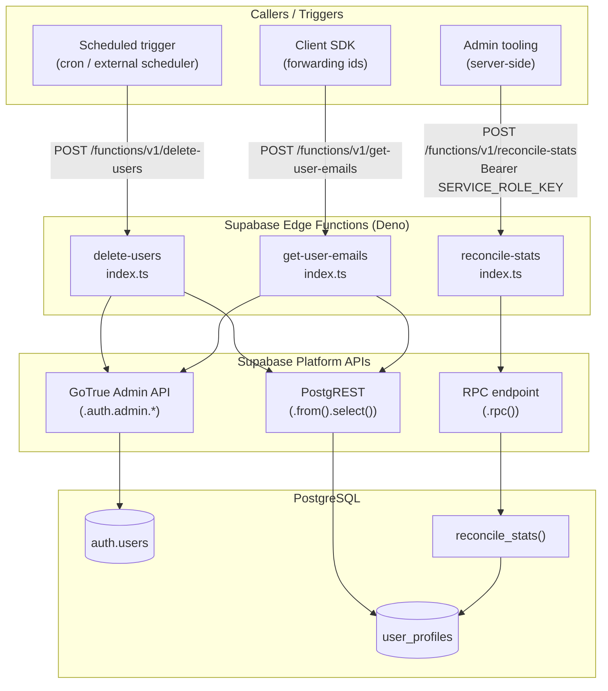
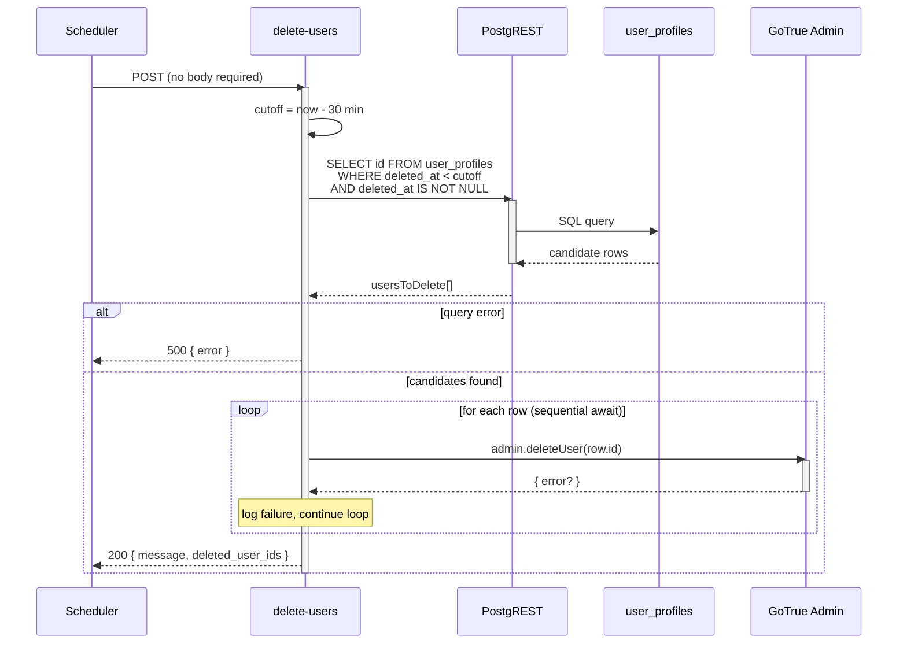
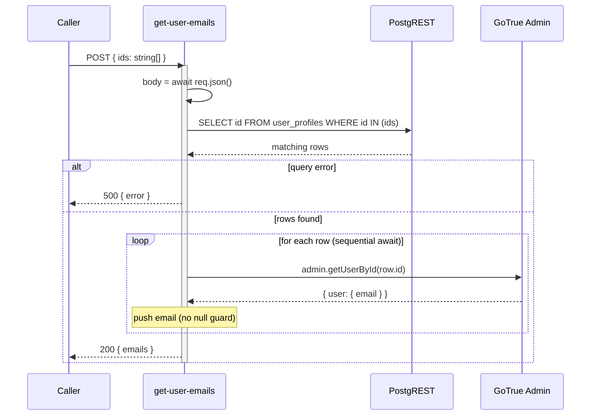
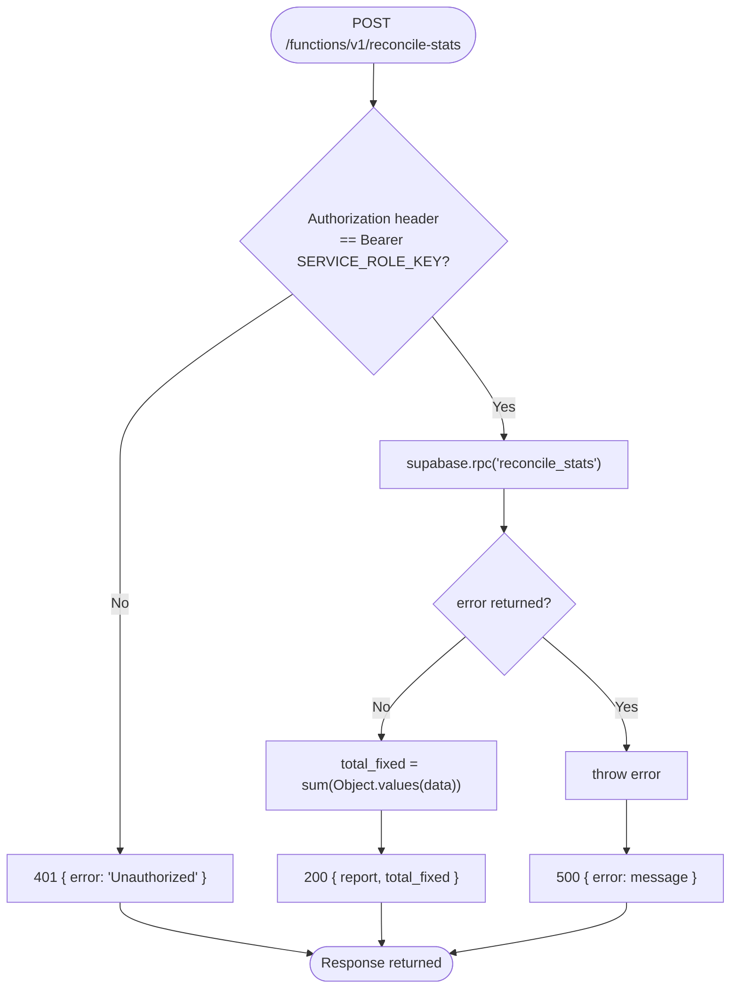

The `ozeaon-v2` backend exposes a small set of Supabase Edge Functions (Deno runtime) that perform privileged, admin-scoped operations that must never be reachable from the browser client: hard-deleting soft-deleted users, resolving user emails, and reconciling aggregate statistics.

## Purpose and Scope

This page documents the Edge Function layer of the API surface: the three Deno functions under `supabase/functions/`, their authentication posture, how they obtain privileged database access via the Supabase service-role key, and the exact request/response contracts they implement.

**In scope:**

- `supabase/functions/delete-users/index.ts` — time-based hard-delete sweep of soft-deleted users
- `supabase/functions/get-user-emails/index.ts` — batch email resolution for a list of user IDs
- `supabase/functions/reconcile-stats/index.ts` — authenticated trigger for the `reconcile_stats` database RPC

**Out of scope (see sibling pages):**

- The PostgreSQL schema, RLS policies, soft-delete semantics of `user_profiles`, and the `reconcile_stats` SQL implementation — for these, see the database/schema pages.
- The client-side SDK wrappers that call these functions — for those, see the client API layer pages.
- The broader REST/PostgREST access path for normal, user-scoped data — see the API Layer overview.

> For the API layer as a whole, see [6-api-layer](https://github.com/ozeaon/ozeaon-v2/blob/0a4f1a95824db87782f1221a4108019d174df3d9/6-api-layer). For the database objects invoked here (`user_profiles`, `reconcile_stats`), see the database section.

## Overview

Supabase Edge Functions are TypeScript modules executed on the Deno runtime at the network edge. In this repository there is **no shared framework, no router, and no shared helper module**: each function is a self-contained `index.ts` file that wires up its own Supabase client and calls `Deno.serve(...)` once.

Every function follows the same structural skeleton:

1. Import `jsr:@supabase/functions-js/edge-runtime.d.ts` for runtime type definitions.
2. Import `createClient` from `https://esm.sh/@supabase/supabase-js` (CDN-pinned ESM import, not an npm/bare specifier).
3. Construct a module-level Supabase client using `SUPABASE_URL` and `SUPABASE_SERVICE_ROLE_KEY` environment variables — i.e. a **service-role client that bypasses Row Level Security**.
4. Register a single request handler with `Deno.serve(async (req) => ...)`.
5. Return `Response` objects with `Content-Type: application/json`, status `200` on success and `500` on failure.

The design intent is clear: these are **trusted infrastructure tasks**, not user-facing endpoints. They exist precisely because the operations they perform (admin user deletion, admin email lookup, global stats repair) require the service-role privilege that the anonymous/authenticated browser client must not hold.

### Key concepts

| Concept | Meaning in this codebase |
|---|---|
| Service-role key | `SUPABASE_SERVICE_ROLE_KEY` — grants RLS-bypassing admin access to PostgREST and GoTrue admin APIs |
| Soft delete | `user_profiles.deleted_at` timestamp; non-null means the row is pending hard deletion |
| Hard delete | `supabase.auth.admin.deleteUser(id)` — removes the identity from the auth schema |
| Edge runtime | Deno-based serverless runtime; `Deno.serve` is the entrypoint, `Deno.env.get` reads secrets |
| `@ts-nocheck` | All three files disable TypeScript checking on line 1 |

## Architecture



The diagram reflects the fact that all three functions construct their client identically (`createClient(Deno.env.get("SUPABASE_URL"), Deno.env.get("SUPABASE_SERVICE_ROLE_KEY"))`) but diverge in which Supabase API surface they touch:

- **`delete-users`** is a two-phase operation: query PostgREST for candidates, then call the GoTrue Admin API to delete each one.
- **`get-user-emails`** is likewise two-phase: query PostgREST for the given IDs, then call the GoTrue Admin API per row to read the email.
- **`reconcile-stats`** is a single RPC call, and is the **only** function that performs its own authentication check.

Because the clients are created at module scope (not inside the handler), they are reused across warm invocations of the same isolate — a deliberate cold-start optimization.

## Shared Function Anatomy

Every function in this directory is built from the same template. Understanding the template once explains all three implementations.

```typescript
// @ts-nocheck
import "jsr:@supabase/functions-js/edge-runtime.d.ts";
import { createClient } from "https://esm.sh/@supabase/supabase-js";
const supabase = createClient(
  Deno.env.get("SUPABASE_URL"),
  Deno.env.get("SUPABASE_SERVICE_ROLE_KEY"),
);
```

> Source: [reconcile-stats/index.ts](https://github.com/ozeaon/ozeaon-v2/blob/0a4f1a95824db87782f1221a4108019d174df3d9/supabase/functions/reconcile-stats/index.ts#L1-L8)

Three deliberate choices are visible here:

1. **`// @ts-nocheck`** — the Supabase JS SDK is loaded from a URL (`esm.sh`), which the local TypeScript tooling cannot resolve into types, so checking is disabled rather than fighting the resolver. The `edge-runtime.d.ts` import is what supplies the `Deno` global definitions the editor would otherwise miss.
2. **URL-imported `createClient`** — the edge runtime does not have a `node_modules` install step for this SDK; importing from `esm.sh` guarantees a fetchable ESM build at cold start.
3. **Service-role credentials** — using `SUPABASE_SERVICE_ROLE_KEY` instead of an anon key is the entire reason these functions can perform admin operations. It also means the secret must only ever live in the function's environment, never in client bundles.

The handler is always wrapped in `try/catch`, returning JSON in both branches, which gives every function a uniform error contract (`{ error: string }` + HTTP 500).

## delete-users

**Responsibility:** Permanently remove users whose profile was soft-deleted more than 30 minutes ago. The 30-minute grace window is the design centerpiece — it gives an accidental soft delete a short recovery period before the identity becomes unrecoverable.

### Implementation walkthrough

```typescript
Deno.serve(async (_req) => {
  try {
    // Find users soft-deleted more than 30 minutes ago
    const cutoff = new Date(Date.now() - 30 * 60 * 1000).toISOString();
    console.log(`Looking for users with deleted_at < ${cutoff}`);
    const { data: usersToDelete, error } = await supabase
      .from("user_profiles")
      .select("id")
      .lt("deleted_at", cutoff)
      .not("deleted_at", "is", null);
    if (error) {
      console.error("Query error:", error);
      throw error;
    }
```

> Source: [delete-users/index.ts](https://github.com/ozeaon/ozeaon-v2/blob/0a4f1a95824db87782f1221a4108019d174df3d9/supabase/functions/delete-users/index.ts#L9-L22)

The candidate query is a two-condition filter on `user_profiles`:

- `.lt("deleted_at", cutoff)` selects rows whose soft-delete timestamp is older than the cutoff.
- `.not("deleted_at", "is", null)` is the **critical guard**: without it, PostgREST/SQL three-valued logic means `deleted_at < cutoff` would still be evaluated for `NULL` rows, and the intent (only sweep rows that were actually soft-deleted) would be ambiguous. The explicit `IS NOT NULL` makes "soft-deleted" a positive requirement.

```typescript
    if (usersToDelete && usersToDelete.length > 0) {
      for (const row of usersToDelete) {
        console.log(`Deleting user: ${row.id}`);
        const { error: deleteError } = await supabase.auth.admin.deleteUser(
          row.id,
        ); // Changed from row.user_id to row.id
        if (deleteError) {
          console.error(`Failed to delete user ${row.id}:`, deleteError);
        }
      }
    }
```

> Source: [delete-users/index.ts](https://github.com/ozeaon/ozeaon-v2/blob/0a4f1a95824db87782f1221a4108019d174df3d9/supabase/functions/delete-users/index.ts#L24-L34)

Key behaviors:

- **Iteration is sequential**, one `await` per user. There is no `Promise.all` batching, so a large backlog extends the function's wall-clock duration. This trades throughput for a bounded number of concurrent admin API calls.
- **Per-user errors are swallowed, not thrown.** A failed `deleteUser` is logged and the loop continues. Only the initial PostgREST query error aborts the run. This is an intentional partial-success model: one bad row should not block the rest of the sweep.
- **The inline comment `// Changed from row.user_id to row.id`** documents a historical bug fix. The function now uses `row.id` because `user_profiles.id` is the column that carries the auth user UUID, and the code was previously reading a non-existent/incorrect field.

### Success response shape

```typescript
    return new Response(
      JSON.stringify({
        message: `Deleted ${usersToDelete?.length || 0} users`,
        deleted_user_ids: usersToDelete?.map((u) => u.id) || [],
      }),
      {
        headers: {
          "Content-Type": "application/json",
        },
        status: 200,
      },
    );
```

> Source: [delete-users/index.ts](https://github.com/ozeaon/ozeaon-v2/blob/0a4f1a95824db87782f1221a4108019d174df3d9/supabase/functions/delete-users/index.ts#L35-L46)

Note that `deleted_user_ids` reports **all candidates**, not only the ones whose `deleteUser` call succeeded — the handler does not maintain a separate success list. This is a reporting fidelity limitation worth knowing when reconciling logs: a failure appears in `console.error` but the ID still appears in `deleted_user_ids`.

### Response contract

| Field | Type | Description |
|---|---|---|
| `message` | `string` | Human-readable count, e.g. `Deleted 3 users` |
| `deleted_user_ids` | `string[]` | UUIDs of every candidate row (includes any that failed, per above) |

Because the handler ignores its argument (`async (_req) =>`), the function takes **no request body and inspects no headers**. It is a pure "invoke and sweep" endpoint.

## get-user-emails

**Responsibility:** Given a list of profile IDs, return the corresponding auth email addresses — something the client cannot do itself because emails live in `auth.users`, not in the readable `user_profiles` projection.

### Implementation walkthrough

```typescript
Deno.serve(async (req) => {
  try {
    const body = await req.json();
    const { data: users, error } = await supabase
      .from("user_profiles")
      .select("id")
      .in("id", body.ids);
    if (error) {
      console.error("Query error:", error);
      throw error;
    }
    const emails = [];
    if (users && users.length > 0) {
      for (const row of users) {
        const { data } = await supabase.auth.admin.getUserById(row.id);
        emails.push(data.user.email);
      }
    }
```

> Source: [get-user-emails/index.ts](https://github.com/ozeaon/ozeaon-v2/blob/0a4f1a95824db87782f1221a4108019d174df3d9/supabase/functions/get-user-emails/index.ts#L8-L25)

Design points:

- **`.in("id", body.ids)`** performs a single batched PostgREST query, so the ID filter is one round trip regardless of list size. The result is then used only as an enumeration source for the per-user admin lookups.
- **The PostgREST query result is effectively discarded** apart from `row.id`. Emails cannot be read from PostgREST here, so the query acts as an existence/authorization filter that constrains which IDs are eligible for email resolution. IDs not present in `user_profiles` produce no email entry.
- **Per-row GoTrue calls** (`supabase.auth.admin.getUserById(row.id)`) mirror `delete-users`' sequential pattern. Two consequences follow:
  1. The returned `emails` array preserves the order of the `users` result set, but is **not index-aligned with the input `body.ids`** — the caller must not assume `emails[i]` corresponds to `body.ids[i]`.
  2. `data.user.email` is read without a null check on `data` or `data.user`. If GoTrue returns an error for a given ID, this dereference can throw and the whole request becomes a 500, losing all previously collected emails.

### Response contract

| Field | Type | Description |
|---|---|---|
| `emails` | `string[]` | Email addresses for every ID found in `user_profiles`, in result-set order |

### Request contract

| Field | Type | Required | Description |
|---|---|---|---|
| `ids` | `string[]` | Yes | Profile UUIDs to resolve. Passed directly to `.in("id", body.ids)`; no validation or length cap is applied |

Unlike `delete-users`, this function **does read `req`** and parses the JSON body, making it the only function here with a genuine request payload.

## reconcile-stats

**Responsibility:** Trigger the `reconcile_stats` database function, which repairs aggregate/counter columns, and report the number of rows fixed. This is the only function with an explicit authentication gate.

### Authentication gate

```typescript
Deno.serve(async (req) => {
  const authHeader = req.headers.get("Authorization");
  if (authHeader !== `Bearer ${Deno.env.get("SUPABASE_SERVICE_ROLE_KEY")}`) {
    return new Response(JSON.stringify({ error: "Unauthorized" }), {
      status: 401,
      headers: { "Content-Type": "application/json" },
    });
  }
```

> Source: [reconcile-stats/index.ts](https://github.com/ozeaon/ozeaon-v2/blob/0a4f1a95824db87782f1221a4108019d174df3d9/supabase/functions/reconcile-stats/index.ts#L12-L19)

This is a **shared-secret bearer check**: the `Authorization` header must be exactly `Bearer <SUPABASE_SERVICE_ROLE_KEY>`. Design intent and properties:

- The platform already verifies the JWT signature before the function runs (Supabase Functions require a valid JWT by default), so this check adds a second layer: the caller must possess the service-role secret specifically, not merely any authenticated session.
- The comparison is a plain `!==` string equality, not a constant-time comparison. For a high-entropy service-role key this is acceptable in practice, though it is theoretically timing-sensitive.
- The guard is **outside** the `try/catch`, so an unauthorized request never enters the error-handling path — it returns 401 directly.
- This check returns 401, whereas downstream failures return 500, giving callers a clean way to distinguish "you are not allowed" from "the operation failed".

### RPC invocation and reporting

```typescript
  try {
    const { data, error } = await supabase.rpc("reconcile_stats");

    if (error) throw error;

    const totalFixed = Object.values(data as Record<string, number>).reduce(
      (a, b) => a + b,
      0,
    );
    console.log(
      `Reconciliation complete. Total rows fixed: ${totalFixed}`,
      data,
    );

    return new Response(
      JSON.stringify({ report: data, total_fixed: totalFixed }),
      {
        headers: { "Content-Type": "application/json" },
        status: 200,
      },
    );
```

> Source: [reconcile-stats/index.ts](https://github.com/ozeaon/ozeaon-v2/blob/0a4f1a95824db87782f1221a4108019d174df3d9/supabase/functions/reconcile-stats/index.ts#L21-L41)

The reporting logic reveals the expected shape of `reconcile_stats`: it returns a **JSON object of `{label: count}`** pairs, where each value is a number of rows repaired per category (for example, several distinct counter tables or columns). The function:

1. Calls the RPC with no arguments.
2. Converts the result to a `Record<string, number>` and sums all values to produce `total_fixed`.
3. Returns **both** the raw per-category `report` and the aggregate `total_fixed`, so operators can see the breakdown while dashboards/monitors can watch the single scalar.

Because the sum is taken over `Object.values(data)`, any non-numeric value returned by the RPC would produce `NaN`. The contract is therefore implicitly typed: `reconcile_stats` must return only numeric counts.

## Core Flows

### delete-users: scheduled hard-delete sweep



The ordering matters: the cutoff is computed **before** the query, so the window is anchored to handler entry time. The sweep is idempotent by construction — a row that fails to hard-delete remains in `user_profiles` with its old `deleted_at`, so the next invocation retries it automatically. That is why per-row failures can safely be logged rather than thrown.

### get-user-emails: two-phase identity resolution



The two-phase structure exists because of where the data lives: `user_profiles` is the RLS-protected application table, while `email` is only available through the GoTrue admin API. The PostgREST phase therefore doubles as a scoping filter — only IDs that exist as profiles are passed to the admin API.

### reconcile-stats: authorized RPC trigger



The gate is evaluated before the `try` block, so the three outcomes (401 / 200 / 500) are cleanly separated with no overlap.

## Invocation Contract Summary

All three functions are registered as a single `Deno.serve` handler in their own `index.ts`, which Supabase exposes at `/functions/v1/<function-directory-name>`. Because the directory name is the route, the function names are fixed by the folder structure: `delete-users`, `get-user-emails`, `reconcile-stats`.

| Function | HTTP body | Response `200` fields | Explicit auth check |
|---|---|---|---|
| `delete-users` | Ignored (`_req`) | `message`, `deleted_user_ids` | None in code |
| `get-user-emails` | `{ ids: string[] }` | `emails` | None in code |
| `reconcile-stats` | None used | `report`, `total_fixed` | Yes — bearer service-role key |

## Failure Modes, Edge Cases & Concurrency

### Failure handling matrix

| Function | Failure | Behavior |
|---|---|---|
| `delete-users` | Candidate query fails | `console.error` then `throw` → `500 { error: err.message }` |
| `delete-users` | `admin.deleteUser` fails for one ID | Logged via `console.error`, loop continues, ID still reported in `deleted_user_ids` |
| `get-user-emails` | `req.json()` throws (malformed body) | Caught by outer `catch` → `500` |
| `get-user-emails` | `.in("id", body.ids)` fails | `throw` → `500` |
| `get-user-emails` | GoTrue returns no `data.user` for an ID | Unguarded `data.user.email` dereference can throw → whole request `500`, earlier emails discarded |
| `get-user-emails` | `body.ids` missing/not an array | No validation; the `.in()` call receives an invalid filter and behavior depends on PostgREST's coercion |
| `reconcile-stats` | Bad/missing Authorization header | `401 { error: "Unauthorized" }`, RPC never invoked |
| `reconcile-stats` | RPC returns an error | `throw` → `500` |
| `reconcile-stats` | RPC returns non-numeric values | `total_fixed` becomes `NaN` |

### Edge cases worth noting

- **Boundary at exactly 30 minutes** — the comparison is strict (`lt`), so a row whose `deleted_at` equals the cutoff instant is not yet eligible; it becomes eligible on the next run.
- **Empty candidate set** — `delete-users` still returns `200` with `Deleted 0 users` and an empty `deleted_user_ids`; the guard `usersToDelete && usersToDelete.length > 0` simply skips the loop. Same for `get-user-emails`, which returns `{ emails: [] }`.
- **No pagination** — the candidate `select` has no `.limit()`/`.range()`. Default PostgREST row limits apply, so a backlog larger than the configured maximum would be processed across multiple invocations rather than in one pass. Since the sweep is idempotent, this degrades gracefully.
- **Unbounded input** — `get-user-emails` performs one GoTrue admin call per matched ID with no cap, so a very large `ids` array translates into a long sequential loop and a correspondingly long edge-function execution time.

### Concurrency

Both `delete-users` and `get-user-emails` process their collections **sequentially with `await` inside a `for...of` loop**. This is significant:

- Requests are internally serialized — no two admin API calls are in flight at once. The upside is bounded concurrency against GoTrue (avoiding rate-limit bursts); the downside is linear latency growth with result-set size.
- **No locking or idempotency key** protects `delete-users`. If the scheduler fires two invocations concurrently, both may select the same candidate rows and both attempt `admin.deleteUser` for the same ID. The second call will fail for an already-deleted user, be logged, and the loop proceeds — so the outcome is still correct, but logs will show spurious failures. The recommended operational posture is a single serialized schedule (e.g. a cron that does not overlap).
- Each isolate holds a module-scope `supabase` client. Concurrent invocations on the same warm isolate share it; the Supabase JS client is stateless per-request apart from auth headers, so this reuse is safe here.

### Security posture (the most important design constraint)

The confidentiality boundary of this layer rests entirely on `SUPABASE_SERVICE_ROLE_KEY`:

- All three functions instantiate clients with the **service-role key**, so any invocation that reaches the handler body runs with RLS bypassed. The Supabase platform's default JWT verification is therefore the primary protection for `delete-users` and `get-user-emails`.
- `reconcile-stats` adds an explicit second check so that even a valid project JWT is insufficient — the caller must present the service-role secret itself.
- The `_req` parameter in `delete-users` means the function does not inspect the caller at all; it is designed to be invoked only by a trusted scheduler whose access is controlled at the platform/network layer.

## Performance & Operational Considerations

| Concern | Observation from source |
|---|---|
| Cold start | SDK is fetched from `https://esm.sh/@supabase/supabase-js`; client creation is hoisted to module scope to be reused across warm invocations |
| Latency shape | Both bulk functions are `O(n)` sequential network calls; total time ≈ n × (admin API round trip) |
| Error visibility | Structured `console.log`/`console.error` lines (`Looking for users with deleted_at < ...`, `Found N users to delete`, `Deleting user: <id>`, `Reconciliation complete. Total rows fixed: N`, plus the raw report object) provide an audit trail in the Edge Function logs |
| Reporting accuracy | `delete-users` counts candidates, not confirmed deletions; monitor `console.error` for real failures rather than trusting `deleted_user_ids.length` |
| Idempotency | `delete-users` retries naturally because failed rows keep their `deleted_at`; `reconcile-stats` is a repair operation that should converge to `total_fixed = 0` when data is already consistent |
| Scheduling | `delete-users` is clearly designed for a recurring schedule (the 30-minute cutoff only makes sense with periodic invocation); its response payload is also useful for a one-off manual run |
| Observability endpoint | `reconcile-stats` returning both `report` and `total_fixed` makes it directly usable as a cron-driven health probe — a non-zero `total_fixed` signals drift in the aggregate tables |

## Extension Points & Conventions

There is no shared utility module in this layer, which means extension follows a consistent, low-ceremony pattern rather than an interface implementation:

1. **Add a function** — create `supabase/functions/<name>/index.ts` with the standard header (the `edge-runtime.d.ts` import, the `esm.sh` `createClient`, the module-scope service-role client) and a single `Deno.serve` handler. The directory name becomes the route.
2. **Follow the response convention** — `200` with a JSON object on success, `500` with `{ error: <message> }` on failure, always with `Content-Type: application/json`. `reconcile-stats` extends this with the `401` unauthorized variant.
3. **Add privileged auth when the function is externally reachable** — copy the `reconcile-stats` bearer-secret guard if the function must not be callable by ordinary authenticated sessions.
4. **Reuse `@ts-nocheck`** — required in practice because the URL-imported SDK does not resolve for the type checker.

The absence of a shared helper is itself a design decision: each function stays independently deployable and readable, at the cost of duplicating the ~7-line client bootstrap. If this layer grows, extracting that bootstrap into a shared `_shared/` module would be the natural first refactor.

## API Reference

### `Deno.serve(handler)` — `delete-users`

```typescript
Deno.serve(async (_req: Request) => Promise<Response>)
```

**Parameters:** `_req` is accepted but unused; the function takes no input.

**Returns:** `Response` — `200` with `{ message: string, deleted_user_ids: string[] }`, or `500` with `{ error: string }`.

**Throws (internally, caught):** the PostgREST query error object is re-thrown to the outer `catch`.

> Source: [delete-users/index.ts](https://github.com/ozeaon/ozeaon-v2/blob/0a4f1a95824db87782f1221a4108019d174df3d9/supabase/functions/delete-users/index.ts#L9-L61)

### `Deno.serve(handler)` — `get-user-emails`

```typescript
Deno.serve(async (req: Request) => Promise<Response>)
```

**Request body:**

- `ids` (`string[]`, required): profile UUIDs. Consumed by `.in("id", body.ids)` with no validation.

**Returns:** `Response` — `200` with `{ emails: string[] }`, or `500` with `{ error: string }`.

**Throws (internally, caught):** PostgREST `error` is re-thrown; a JSON parse failure or an unguarded `data.user.email` dereference also surfaces as `500`.

> Source: [get-user-emails/index.ts](https://github.com/ozeaon/ozeaon-v2/blob/0a4f1a95824db87782f1221a4108019d174df3d9/supabase/functions/get-user-emails/index.ts#L8-L50)

### `Deno.serve(handler)` — `reconcile-stats`

```typescript
Deno.serve(async (req: Request) => Promise<Response>)
```

**Headers:**

- `Authorization` (required): must equal `Bearer ${SUPABASE_SERVICE_ROLE_KEY}`. Anything else yields `401` before any database work.

**Returns:** `Response` — `200` with `{ report: Record<string, number>, total_fixed: number }`, `401` with `{ error: "Unauthorized" }`, or `500` with `{ error: string }`.

**Database call:** `supabase.rpc("reconcile_stats")` — no arguments; expected to return a `{ label: count }` object.

> Source: [reconcile-stats/index.ts](https://github.com/ozeaon/ozeaon-v2/blob/0a4f1a95824db87782f1221a4108019d174df3d9/supabase/functions/reconcile-stats/index.ts#L12-L49)

## Environment Variables

| Variable | Used by | Purpose |
|---|---|---|
| `SUPABASE_URL` | all three functions | Base URL passed to `createClient`; determines the project PostgREST/GoTrue/RPC endpoints |
| `SUPABASE_SERVICE_ROLE_KEY` | all three functions | Second `createClient` argument (RLS bypass) **and** the expected bearer token in `reconcile-stats`' auth check |

Both are read with `Deno.env.get(...)` — the standard mechanism for Supabase Edge Function secrets. No other environment variables are referenced in these files.

## Testing

No test files exist within `supabase/functions/` in this repository — there is no `_test.ts` alongside any of the three `index.ts` modules, and the functions export no testable units (the handlers are registered anonymously inside `Deno.serve` and nothing is exported). Verification is therefore observational: exercise the function and inspect the structured `console.log`/`console.error` output plus the JSON response body.

## Related Links

- API Layer overview — [6-api-layer](https://github.com/ozeaon/ozeaon-v2/blob/0a4f1a95824db87782f1221a4108019d174df3d9/6-api-layer)
- Database schema, RLS policies, and the `reconcile_stats` RPC implementation — see the database section of this wiki
- Client-side callers of these functions — see the client API layer pages

### Source files

- [supabase/functions/delete-users/index.ts](https://github.com/ozeaon/ozeaon-v2/blob/0a4f1a95824db87782f1221a4108019d174df3d9/supabase/functions/delete-users/index.ts)
- [supabase/functions/get-user-emails/index.ts](https://github.com/ozeaon/ozeaon-v2/blob/0a4f1a95824db87782f1221a4108019d174df3d9/supabase/functions/get-user-emails/index.ts)
- [supabase/functions/reconcile-stats/index.ts](https://github.com/ozeaon/ozeaon-v2/blob/0a4f1a95824db87782f1221a4108019d174df3d9/supabase/functions/reconcile-stats/index.ts)
