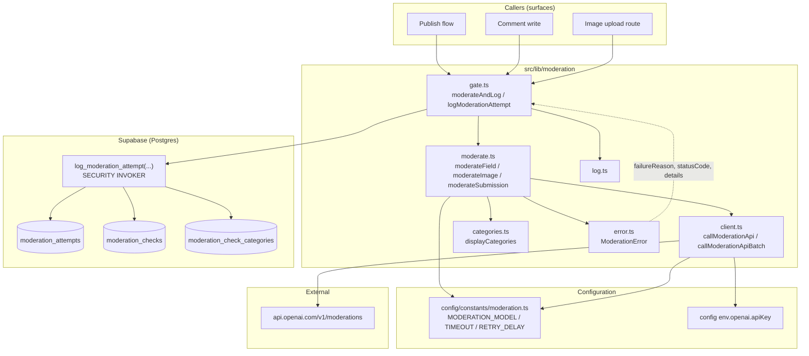
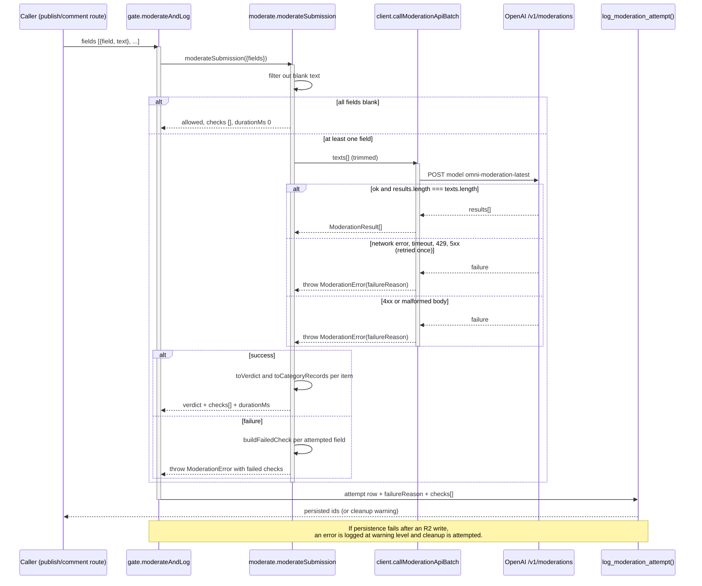
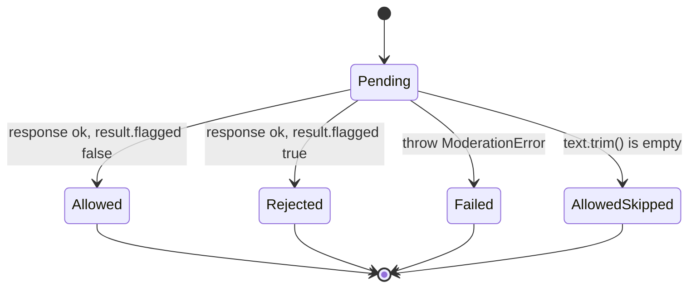
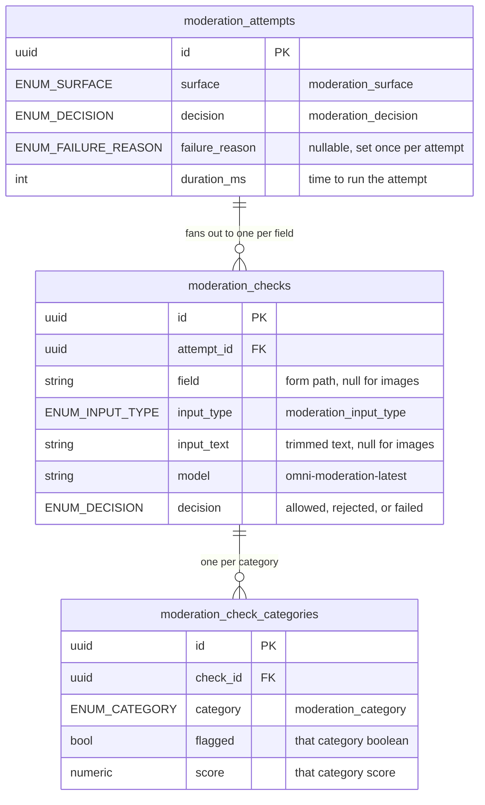

A single-modality moderation gate built on OpenAI's `/v1/moderations` endpoint, wrapped in a typed client, a pure verdict-mapping layer, and a normalised Postgres audit log (`moderation_attempts` → `moderation_checks` → `moderation_check_categories`).

## Purpose and Scope

This page documents the content-moderation capability as a coherent end-to-end subsystem:

- **Constants and policy knobs** — model selection, timeouts, retry delay, the user-facing report form (`src/config/constants/moderation.ts`).
- **Transport layer** — the Edge-compatible OpenAI client: header construction, timeout, single retry, status classification, and the two calling shapes (single multi-part call vs. batched text call) (`src/lib/moderation/client.ts`).
- **Verdict and log-record mapping** — how a raw `ModerationResult` becomes a `ModerationVerdict` plus the row-shaped `ModerationCheckLog` records that the database expects (`src/lib/moderation/moderate.ts`).
- **The persistence contract** — the normalised `moderation_attempts` / `moderation_checks` / `moderation_check_categories` schema and the `log_moderation_attempt(...)` writer function described in `supabase/migrations/20260826000000_moderation_checks.sql`.

The following are intentionally **not** covered here, as they belong to sibling pages under *Moderation and Storage*:

- Image upload, storage buckets, R2 lifecycle and cleanup — see the storage pages. This page only covers the moderation *check* performed at upload time, not the upload path itself.
- Comment and submission write flows (the surfaces that *call* the gate) — this page documents the gate contract, not each caller's business rules.
- The rejection UI surfaces (`ModerationRejectedDialog`, `use-moderation-rejection`, `use-image-moderation`) — they consume the verdict type documented here; their rendering behaviour belongs with the UI surfaces.

## Overview

Moderation in this repository is deliberately **fail-closed at the call level and explicit at the logging level**. Every user action that can publish text or an image funnels through a small set of functions in `src/lib/moderation/`, which:

1. normalise the input (trim, filter empties),
2. send one request per check to `https://api.openai.com/v1/moderations`,
3. convert OpenAI's thirteen boolean categories plus their scores into one of exactly two decisions (`allowed` / `rejected`, or `failed` when the call could not complete),
4. and return both the decision *and* the complete set of rows needed to audit it.

The design is driven by three stated constraints visible in the source:

| Constraint | Where it comes from | Consequence |
|---|---|---|
| Edge runtime compatibility | `client.ts` module doc: "Edge-compatible, native fetch only… no SDK" | Native `fetch` + `AbortSignal.timeout`, lazy config validation, no SDK dependency |
| Exactly one model can score images | `MODERATION_MODEL` doc: "Only model that supports image inputs on the `/v1/moderations` endpoint" | `omni-moderation-latest` is pinned in one constant and reused in every log row |
| A rejection must name the exact failing field | migration doc: "a rejection can be reported against the exact field that failed" | `moderateField` takes a form path string; `moderateSubmission` fans out and returns `rejectedFields` |

A fourth, less obvious constraint shapes the whole persistence design: the system refuses to store arrays or JSON blobs for moderation data. The migration states the reason directly — an earlier draft held `flagged_categories` as `text[]` and the API payload as `raw_response jsonb`, and both were rejected because they are repeating groups that violate first normal form. The final schema is three tables, one row per attempt, per check, and per category per check.

### Key concepts and terminology

| Term | Meaning in this codebase |
|---|---|
| **Attempt** | One user action that triggers moderation — a publish, a comment write, an image upload. `moderation_attempts` has one row per attempt. |
| **Check** | One call to `/v1/moderations`. Because a single call is single-modality by construction, one attempt fans out to one check per moderated field. |
| **Field** | The form path a rejection is reported against, e.g. `summary`, `sections.2.body`, `faqs.0.answer`. `null` for image checks. |
| **Category** | One of the thirteen OpenAI moderation category keys, carrying that category's boolean and score. |
| **Verdict** | The derived decision: `allowed`, `rejected` (with categories or fields), or, at the row level, `failed`. |

## Architecture

The pipeline is layered so that policy (constants), transport (client), mapping (moderate), and persistence (SQL) never leak into each other. `moderate.ts` never touches `fetch`; `client.ts` never decides what a flag *means*; the SQL writer receives a fully-formed payload.



**Why this shape.** The arrows reveal the single most important architectural property of the subsystem: `ModerationError` is the only channel that carries failure metadata upward. `client.ts` produces it (with a `failureReason`), `moderate.ts` re-throws it while *attaching per-field `failed` check records*, and `gate.ts` catches it and decides how to log and respond. That means `moderate.ts` stays free of any logging concern, and the failure reason is logged exactly once, on the attempt row.

The client is also the only module that knows about `env.openai.apiKey` and about OpenAI's URL. Everything above it works with plain `ModerationResult` objects.

### The three OpenAI input shapes

`client.ts` exposes two functions, and the difference between them is not cosmetic — it changes how OpenAI scores the payload:

| Function | Input form | Scoring semantics |
|---|---|---|
| `callModerationApi(input: ModerationInputPart[])` | Object array (`{type:"text",...}` / `{type:"image_url",...}`) | The parts are scored as **one combined input** |
| `callModerationApiBatch(texts: string[])` | Plain string array | OpenAI returns **one result per element, in order** |

This distinction is documented in the source and is the reason `moderateSubmission` can check N fields for the price of one call, while `moderateField` and `moderateImage` use the multi-part form.

## The Transport Layer: `client.ts`

`client.ts` is a hand-rolled client, not an SDK wrapper. Its module doc names the deliberate precedent: it "mirrors `src/lib/marketing/mailchimp.ts`: lazy config validation, no SDK, `AbortSignal.timeout` for the request deadline." The stated reason for all three choices is Edge compatibility — an SDK would pull in Node-only dependencies that the Edge runtime cannot satisfy.

### Lazy API-key validation

The key is validated inside `getHeaders()`, at call time, not at module load. A missing key produces a `500 / not_configured` error rather than crashing the bundler or process startup:

```typescript
function getHeaders(): HeadersInit {
  if (!env.openai.apiKey) {
    throw new ModerationError(
      "OPENAI_API_KEY is not configured",
      500,
      "not_configured",
    );
  }
  return {
    Authorization: `Bearer ${env.openai.apiKey}`,
    "Content-Type": "application/json",
  };
}
```

> Source: [client.ts](https://github.com/ozeaon/ozeaon-v2/blob/0a4f1a95824db87782f1221a4108019d174df3d9/src/lib/moderation/client.ts#L24-L36)

This matters operationally because it turns a deployment misconfiguration into a per-request `not_configured` failure reason on the attempt row — visible in the audit log — instead of a boot-time crash. It also means `PREVIEW_OPENAI_API_KEY` can be supplied to preview deployments to avoid spending the production moderation quota, as noted in the deployment previews documentation.

### The retry loop

`postModerations` is the single shared transport for both calling shapes. Its retry policy is asymmetric and deliberate:

```typescript
for (let attempt = 0; attempt < 2; attempt++) {
    let response: Response;
    try {
      response = await fetch(ENDPOINT, {
        method: "POST",
        headers,
        body: JSON.stringify({ model: MODERATION_MODEL, input }),
        signal: AbortSignal.timeout(MODERATION_TIMEOUT_MS),
      });
    } catch (error) {
      if (attempt === 0) {
        await new Promise((resolve) =>
          setTimeout(resolve, MODERATION_RETRY_DELAY_MS),
        );
        continue;
      }
      throw new ModerationError(
        "Moderation request failed",
        undefined,
        "timeout",
        error,
      );
    }
```

> Source: [client.ts](https://github.com/ozeaon/ozeaon-v2/blob/0a4f1a95824db87782f1221a4108019d174df3d9/src/lib/moderation/client.ts#L88-L110)

And for HTTP-level failures, the retry condition is explicit:

```typescript
    if ((response.status === 429 || response.status >= 500) && attempt === 0) {
      await new Promise((resolve) =>
        setTimeout(resolve, MODERATION_RETRY_DELAY_MS),
      );
      continue;
    }
```

> Source: [client.ts](https://github.com/ozeaon/ozeaon-v2/blob/0a4f1a95824db87782f1221a4108019d174df3d9/src/lib/moderation/client.ts#L127-L132)

The doc comment states the rationale plainly: "Retries once on a network error, timeout, 429 or 5xx, with a 500ms delay — 4xx responses fail immediately since they will not recover from retry. Worst case is two attempts within 10s each."

This is a **bounded** retry policy with no exponential backoff. The design intent is that the worst case is computable and small: 2 × `MODERATION_TIMEOUT_MS` (10s) plus one 500ms sleep ≈ 20.5s, which fits inside a serverless request budget. Adding jitter or more attempts would push past that. Note also that a non-retryable 4xx skips the sleep and throws immediately.

There is a defensive fall-through at the bottom of the loop — if the loop somehow completes without returning or throwing, it throws a `timeout`-classified error. In practice the `continue` on attempt 0 leads to a throw on attempt 1, so this is unreachable, but it keeps the function's return type honest.

### Failure classification

Every failure is tagged with a `ModerationFailureReason` so the audit log can distinguish "OpenAI was down" from "the operator forgot the key" from "that image URL was not retrievable":

```typescript
function classifyStatus(
  status: number,
  hasImage: boolean,
  errorBody: unknown,
): ModerationFailureReason {
  if (status === 401 || status === 403) return "auth";
  if (status === 429) return "rate_limit";
  if (status >= 500) return "upstream";
  if (status === 400 && hasImage) {
    const message = errorMessage(errorBody);
    // OpenAI's 400 for an image is either "we couldn't retrieve this URL" or
    // "this image is too large/unsupported" - the message text is the only
    // signal that distinguishes them.
    return message.includes("download") ||
      message.includes("fetch") ||
      message.includes("retrieve") ||
      message.includes("url")
      ? "image_fetch"
      : "image_invalid";
  }
  return "malformed";
}
```

> Source: [client.ts](https://github.com/ozeaon/ozeaon-v2/blob/0a4f1a95824db87782f1221a4108019d174df3d9/src/lib/moderation/client.ts#L47-L68)

Two things are worth calling out. First, the image-fetch-vs-invalid split is done by **substring matching on the error message**, which the comment justifies: for a 400 on an image, "the message text is the only signal that distinguishes them." This is an intentionally pragmatic heuristic on an unreliable signal — it is best-effort, and anything unrecognised falls through to `image_invalid`. Second, `errorMessage()` lowercases the message and returns `""` for any shape that is not `{ error: { message: string } }`, so a non-JSON or unexpected error body degrades to `image_invalid` rather than throwing.

### Response validation

An `ok` response is still validated before use, because a 200 with unexpected JSON would otherwise surface as a `TypeError` far from its cause:

```typescript
    if (response.ok) {
      const body = (await response
        .json()
        .catch(() => null)) as ModerationResponse | null;
      if (!body?.results?.length) {
        throw new ModerationError(
          "Moderation response was malformed",
          response.status,
          "malformed",
          body,
        );
      }
      return body.results;
    }
```

> Source: [client.ts](https://github.com/ozeaon/ozeaon-v2/blob/0a4f1a95824db87782f1221a4108019d174df3d9/src/lib/moderation/client.ts#L112-L125)

And the batch wrapper adds an arity check that the single-call path cannot make:

```typescript
export async function callModerationApiBatch(
  texts: string[],
): Promise<ModerationResult[]> {
  const results = await postModerations(texts, false);
  if (results.length !== texts.length) {
    throw new ModerationError(
      "Moderation response length did not match request",
      undefined,
      "malformed",
      results,
    );
  }
  return results;
}
```

> Source: [client.ts](https://github.com/ozeaon/ozeaon-v2/blob/0a4f1a95824db87782f1221a4108019d174df3d9/src/lib/moderation/client.ts#L161-L173)

The length check is essential for correctness rather than hygiene: `moderateSubmission` pairs `results[i]` with `items[i]` positionally. A short response would silently misattribute categories to the wrong field. Note that the returned array is the raw OpenAI array — "Returns every result OpenAI sent back, one per `input` element — the caller decides how many it expects."

## Verdict Mapping: `moderate.ts`

`moderate.ts` is where OpenAI's raw shape becomes this system's shape. It contains three pure mapping helpers and three entry points.

### Pure mappers

```typescript
/** Each call is single-modality by construction, so no cross-modality merge is needed. */
function flaggedKeys(result: ModerationResult): ModerationCategoryKey[] {
  return (Object.keys(result.categories) as ModerationCategoryKey[]).filter(
    (key) => result.categories[key],
  );
}

function toVerdict(result: ModerationResult): ModerationVerdict {
  if (!result.flagged) return { decision: "allowed" };
  return {
    decision: "rejected",
    categories: displayCategories(flaggedKeys(result)),
  };
}
```

> Source: [moderate.ts](https://github.com/ozeaon/ozeaon-v2/blob/0a4f1a95824db87782f1221a4108019d174df3d9/src/lib/moderation/moderate.ts#L17-L30)

Two design decisions are encoded here:

1. **`result.flagged` is the authority, not the category booleans.** OpenAI returns both an overall boolean and per-category booleans. This code trusts the overall flag for the decision and uses the per-category booleans only to *describe* the rejection via `displayCategories(...)`.
2. **There is no cross-modality merge.** The comment explains why: "Each call is single-modality by construction, so no cross-modality merge is needed." Because `callModerationApi` is used only for a single text field or a single image — never text-plus-image together — the pipeline never has to reconcile two verdicts.

Logging, however, is *not* sparse — every category is recorded, flagged or not:

```typescript
/** All thirteen categories, flagged and not. */
function toCategoryRecords(result: ModerationResult) {
  return (Object.keys(result.categories) as ModerationCategoryKey[]).map(
    (category) => ({
      category,
      flagged: result.categories[category],
      score: result.category_scores[category] ?? 0,
    }),
  );
}
```

> Source: [moderate.ts](https://github.com/ozeaon/ozeaon-v2/blob/0a4f1a95824db87782f1221a4108019d174df3d9/src/lib/moderation/moderate.ts#L32-L41)

Storing all thirteen rows per check — rather than only the flagged ones — is what makes the `moderation_check_categories` table useful for later threshold analysis: a near-miss at `score: 0.48` is invisible if you only persist flags. The `?? 0` guards against a category appearing in `categories` but missing from `category_scores`.

### Image input: `toDataUrl` and `toImagePart`

Images take one of two paths depending on whether the object's public URL is fetchable by OpenAI. The local-development fallback is to inline the bytes as a base64 `data:` URL:

```typescript
/** Converts bytes to a base64 data: URL in chunks, avoiding a giant string-concat pass. */
function toDataUrl(bytes: ArrayBuffer, mimeType: string): string {
  const view = new Uint8Array(bytes);
  const chunkSize = 8192;
  let binary = "";
  for (let i = 0; i < view.length; i += chunkSize) {
    binary += String.fromCharCode(...view.subarray(i, i + chunkSize));
  }
  return `data:${mimeType};base64,${btoa(binary)}`;
}
```

> Source: [moderate.ts](https://github.com/ozeaon/ozeaon-v2/blob/0a4f1a95824db87782f1221a4108019d174df3d9/src/lib/moderation/moderate.ts#L43-L52)

The 8192-byte chunking exists for a specific reason stated in the comment: `String.fromCharCode(...spread)` on a multi-megabyte array would blow the argument-count limit, and building the string in chunks avoids "a giant string-concat pass." The dispatcher then picks the URL or the data URL:

```typescript
function toImagePart(image: ModerationImage): ModerationInputPart {
  const url =
    "url" in image ? image.url : toDataUrl(image.bytes, image.mimeType);
  return { type: "image_url", image_url: { url } };
}
```

> Source: [moderate.ts](https://github.com/ozeaon/ozeaon-v2/blob/0a4f1a95824db87782f1221a4108019d174df3d9/src/lib/moderation/moderate.ts#L54-L58)

The discriminated union is narrowed by `"url" in image`, so `ModerationImage` is a union of `{url}` and `{bytes, mimeType}`. This is the local-dev vs. deployed distinction enforced at the type level.

## The Three Entry Points

### Single field: `moderateField`

One call, one field. The `field` argument is the form path that a rejection is reported against.

```typescript
export async function moderateField(
  field: string,
  text: string,
): Promise<ModerationCallResult> {
  const start = Date.now();
  const input = text.trim();
  const result = await callModerationApi([{ type: "text", text: input }]);
  const verdict = toVerdict(result);

  return {
    verdict,
    check: {
      field,
      inputType: "text",
      inputText: input,
      model: MODERATION_MODEL,
      decision: verdict.decision,
      categories: toCategoryRecords(result),
    },
    durationMs: Date.now() - start,
  };
}
```

> Source: [moderate.ts](https://github.com/ozeaon/ozeaon-v2/blob/0a4f1a95824db87782f1221a4108019d174df3d9/src/lib/moderation/moderate.ts#L98-L119)

Note that `inputText` stores the **trimmed** text, not the raw text, so the logged input is exactly what was sent to OpenAI. `durationMs` is measured around the network call only, using `Date.now()` deltas — a coarse but sufficient latency signal for the log.

### Single image: `moderateImage`

```typescript
export async function moderateImage(
  image: ModerationImage,
): Promise<ModerationCallResult> {
  const start = Date.now();
  const result = await callModerationApi([toImagePart(image)]);
  const verdict = toVerdict(result);

  return {
    verdict,
    check: {
      field: null,
      inputType: "image",
      inputText: null,
      model: MODERATION_MODEL,
      decision: verdict.decision,
      categories: toCategoryRecords(result),
    },
    durationMs: Date.now() - start,
  };
}
```

> Source: [moderate.ts](https://github.com/ozeaon/ozeaon-v2/blob/0a4f1a95824db87782f1221a4108019d174df3d9/src/lib/moderation/moderate.ts#L126-L145)

The doc comment scopes this precisely: "**upload routes only**. Images are never re-checked elsewhere." That is a significant architectural statement — image moderation happens exactly once, at upload, and the resulting verdict is trusted thereafter. This avoids re-scoring the same bytes on every subsequent read, and it means the `moderation_checks` row for an image has `field = null` and `inputText = null` (there is no field path and no text to store).

### Batched submission: `moderateSubmission`

This is the most involved function and the one whose failure semantics need the most explanation.

```typescript
export async function moderateSubmission(input: {
  fields: Array<{ field: string; text: string }>;
}): Promise<SubmissionModerationResult> {
  const items: SubmissionItem[] = input.fields.filter(({ text }) =>
    text.trim(),
  );
  if (items.length === 0) {
    return { verdict: { decision: "allowed" }, checks: [], durationMs: 0 };
  }
```

> Source: [moderate.ts](https://github.com/ozeaon/ozeaon-v2/blob/0a4f1a95824db87782f1221a4108019d174df3d9/src/lib/moderation/moderate.ts#L161-L169)

Empty and whitespace-only fields are dropped **before** the call, not after. This yields three useful properties: no API spend on blank fields, no `malformed` length mismatch from sending empty strings, and no field that could ever be "rejected" for containing nothing. The all-blank case short-circuits to `allowed` with `durationMs: 0` — no call is made at all.

The batch call itself, and its unit-failure semantics:

```typescript
  const start = Date.now();
  let results: ModerationResult[];
  try {
    results = await callModerationApiBatch(
      items.map(({ text }) => text.trim()),
    );
  } catch (error) {
    const failureReason =
      error instanceof ModerationError ? error.failureReason : "upstream";
    throw new ModerationError(
      error instanceof Error ? error.message : "Moderation call failed",
      error instanceof ModerationError ? error.statusCode : undefined,
      failureReason,
      error instanceof ModerationError ? error.details : error,
      items.map((item) => failedCheckFor(item)),
    );
  }
```

> Source: [moderate.ts](https://github.com/ozeaon/ozeaon-v2/blob/0a4f1a95824db87782f1221a4108019d174df3d9/src/lib/moderation/moderate.ts#L171-L187)

The key insight, stated in the function's doc comment: "**The batch succeeds or fails as a unit**: on failure, throws `ModerationError` carrying a `failed` check for every field that was attempted, since none of them completed."

This is a real trade-off. Batching N fields into one request is cheap, but it means a single upstream hiccup invalidates all N results — there is no partial success, and no retry of only the sub-request that failed (the client's retry is all-or-nothing at the request level too). The compensation for losing granularity is that the error carries a synthetic `failed` check for *every* attempted field, so the log still records which fields were in flight. The `failedCheckFor` helper produces exactly "the check a failed call would have produced, named after its own input."

Note the fallback semantics: a non-`ModerationError` thrown from the batch is re-wrapped with `failureReason: "upstream"` — an unclassifiable error defaults to blaming the upstream rather than being recorded as `malformed`. The original error becomes `details`, preserving it for debugging.

On success, results are paired positionally with the *filtered* `items` array:

```typescript
  items.forEach((item, i) => {
    const verdict = toVerdict(results[i]);
    checks.push({
      field: item.field,
      inputType: "text",
      inputText: item.text.trim(),
      model: MODERATION_MODEL,
      decision: verdict.decision,
      categories: toCategoryRecords(results[i]),
    });
    if (verdict.decision === "rejected") {
      rejectedFields.push({
        field: item.field,
        categories: verdict.categories,
      });
    }
  });

  const verdict: SubmissionVerdict =
    rejectedFields.length > 0
      ? { decision: "rejected", fields: rejectedFields }
      : { decision: "allowed" };
```

> Source: [moderate.ts](https://github.com/ozeaon/ozeaon-v2/blob/0a4f1a95824db87782f1221a4108019d174df3d9/src/lib/moderation/moderate.ts#L193-L216)

Two important details. First, `checks` always contains **one entry per attempted field**, allowed or rejected — so a successful submission still writes a full set of `moderation_checks` rows. Second, `rejectedFields` produces a per-field rejection payload (`{field, categories}`), which is what lets the UI highlight the exact form control that failed rather than rejecting the whole form anonymously. If any field is rejected, the submission verdict is `rejected` — there is no partial-accept path.

## Failed-Call Record Construction

When a call cannot complete, the pipeline still wants a row per attempted field. `buildFailedCheck` builds that synthetic record:

```typescript
export function buildFailedCheck(
  params:
    | { inputType?: "text"; field: string; inputText?: string | null }
    | { inputType: "image" },
): ModerationCheckLog {
  const base = {
    model: MODERATION_MODEL,
    decision: "failed" as const,
    categories: [],
  };

  return params.inputType === "image"
    ? { ...base, field: null, inputType: "image", inputText: null }
    : {
        ...base,
        field: params.field,
        inputType: "text",
        inputText: params.inputText ?? null,
      };
}
```

> Source: [moderate.ts](https://github.com/ozeaon/ozeaon-v2/blob/0a4f1a95824db87782f1221a4108019d174df3d9/src/lib/moderation/moderate.ts#L71-L90)

The doc comment explains both the API shape and the responsibility split: the caller already knows what it was checking ("a field's name and text, or that it was an image"), because that information lives in its own local variables at the point it catches the thrown `ModerationError`. It also explains what is deliberately **absent**: "The failure reason itself is not part of this — it is logged once on the attempt (`logModerationAttempt`'s `failureReason` param), not repeated on every check row."

That is a normalisation decision with a direct storage consequence. Because one attempt can fan out to N failed checks, inlining the reason on each check row would duplicate it N times. Carrying it once on the attempt row respects the same 1NF reasoning that motivated the schema. And the comment gives the reason text checks always name their field: "the table requires one, and a failure that can't say what it was checking is not worth logging."

Failed checks also always carry `categories: []` — a call that never returned has no category booleans to record, and fabricating zeros would be worse than recording nothing.

## End-to-End Flow

The full lifecycle of a submission, from caller to audit rows, including both the happy path and the batched-failure path:



The final note reflects the logging convention documented in this repository: "R2 cleanup after moderation failed" is logged as a `warning` with the storage key as context — meaning that in flows where an object is written to R2 before moderation is confirmed, a persistence failure triggers best-effort cleanup rather than leaving an orphaned object.

### Decision states

Each check row resolves to exactly one of three decisions, and the mapping is total — every outcome from the transport layer lands in one:



`AllowedSkipped` is the case where a field never reached the API at all — it is filtered out, so no row is produced for it. `Failed` is the only state that propagates a `failureReason` upward, and it is logged on the attempt, not on the check.

## Data Model and Persistence

The persistence contract is defined in `supabase/migrations/20260826000000_moderation_checks.sql`. The migration's own header block is the authoritative summary of the design, and it is unusually explicit about intent — worth reading in full because it explains both what was built and what was deliberately rejected.

### What the migration adds

| # | Object | Purpose (from the migration header) |
|---|---|---|
| 1 | Five enums: `moderation_surface`, `moderation_decision`, `moderation_input_type`, `moderation_failure_reason`, `moderation_category` | Closed domains; `moderation_category` holds the 13 OpenAI category keys |
| 2 | `public.moderation_attempts` | One row per user action that triggers moderation (a publish, a comment write, an image upload) |
| 3 | `public.moderation_checks` | One row per `/v1/moderations` call; one attempt fans out to one check per moderated field, so a rejection can be reported against the exact field that failed |
| 4 | `public.moderation_check_categories` | One row per category per check, carrying that category's boolean and score |
| 5 | *(link rows)* | Some attempts have no link row — see the open-questions note below |
| 6 | `public.log_moderation_attempt(...)` | A plain `SECURITY INVOKER` function that writes an entire attempt: the attempt row, every check, and every category |

### Entity relationships

Because the schema is deliberately normalised rather than JSONB-based, the relationships are strictly one-to-many at each level:



**Relationship cardinality rationale.** One attempt → N checks exists because an attempt like "publish a submission" may cover many moderated fields, and each field gets its own call only in the non-batched path — but even in the batched path, `moderateSubmission` emits one `ModerationCheckLog` per field, so the fan-out is at the *record* level regardless of batching. One check → 13 categories exists because `toCategoryRecords` maps every key in `result.categories`, "flagged and not."

### Why no array or JSONB columns

The migration devotes an explicit section to this, and it is the single most important schema decision:

> An earlier draft held `flagged_categories` as `text[]` and the whole API payload as `raw_response jsonb`. Both are repeating groups — the first fails 1NF…

The reasoning generalises to the failure reason as well: because `failureReason` is set once per attempt and an attempt may have many checks, storing it per check would duplicate one fact many times. Similarly, `NOTIFICATIONS_FOUNDATION` in a later migration explicitly cites this file's reasoning when deciding to use enums instead of lookup tables, saying only "lookup tables; this is neither. Same reasoning as the enums in `20260826000000_moderation_checks.sql`" — so this migration established a normalisation precedent that later tables follow.

### The writer function: `log_moderation_attempt(...)`

`log_moderation_attempt(...)` is described in the migration header as "a plain `SECURITY INVOKER` function that writes an entire attempt — the attempt row, every check, and every category."

Two properties matter for operations:

- **`SECURITY INVOKER`** means the function runs with the privileges of the calling user rather than a privileged owner. Any RLS policy on the three tables therefore applies to the write. The pipeline's logging is not a privilege-escalation bypass.
- **It writes the whole attempt atomically from the caller's perspective.** One call takes the attempt payload plus its checks plus their categories, so a partially-written attempt (a check without its attempt, or a category without its check) is not expressible as a normal outcome of a single call.

The function's parameters map directly onto the client-side types: the `failureReason` param is the attempt-level field that `buildFailedCheck` deliberately omits from check rows, and the check payload is the `ModerationCheckLog[]` array produced by `moderateField`, `moderateImage`, or `moderateSubmission`.

One note recorded in the migration that is worth flagging as a known edge: the header describes point 5 as link rows that some attempts do not get — "…time, so they get no link row." This indicates that certain attempt flavours (notably image uploads, which have `field = null` and `inputText = null`) are not associated with a moderated text field and therefore produce no corresponding link row. The full text of that point is truncated in the migration header, so the exact set of attempt types that skip link rows is **not fully verifiable from the lines available** — treat this as a documented open question rather than a settled rule.

## Configuration Options

All tunables live in one constants module, and every one of them is exported rather than inlined:

| Option | Type | Default | Description |
|---|---|---|---|
| `MODERATION_MODEL` | string | `"omni-moderation-latest"` | The model sent as `model` in every request body. The comment notes it is the "only model that supports image inputs on the `/v1/moderations` endpoint" — hence image and text checks share it. |
| `MODERATION_TIMEOUT_MS` | number | `10_000` | Per-attempt request deadline, passed as `AbortSignal.timeout(MODERATION_TIMEOUT_MS)`. "Per-attempt" matters: a retried request gets a fresh 10s, so worst case is 20s of waiting plus the 500ms sleep. |
| `MODERATION_RETRY_DELAY_MS` | number | `500` | Fixed delay before the single retry on a 429, 5xx, or network failure. No backoff, no jitter. |
| `MODERATION_REPORT_URL` | string | Google Forms URL | The "report an issue" form linked from every moderation rejection surface. Hardcoded in the constant rather than duplicated per UI component, so there is one place to change it. |

> Source: [moderation.ts](https://github.com/ozeaon/ozeaon-v2/blob/0a4f1a95824db87782f1221a4108019d174df3d9/src/config/constants/moderation.ts#L1-L12)

Environment configuration:

| Variable | Type | Required | Description |
|---|---|---|---|
| `OPENAI_API_KEY` | string | Yes (lazy) | Read via `env.openai.apiKey` inside `getHeaders()`. Missing → `500 / not_configured` per request, not a build failure. |
| `PREVIEW_OPENAI_API_KEY` | string | Optional | Documented for preview deployments so previews "stop previews spending production's moderation quota"; without it, previews fall back to `OPENAI_API_KEY`. |
| `PREVIEW_ACCESS_TOKEN` | string | Optional | The preview-access override referenced alongside the key above. |

The timeout and retry delay are compile-time constants rather than environment variables. That is consistent with the Edge/no-SDK posture: fewer runtime knobs means fewer ways to misconfigure a deployment, and the constants are documented and exported so behaviour is discoverable from code.

## API Reference

The module surface is gathered in `src/lib/moderation/index.ts`; the following are the functions verified from the source files read for this page.

### `callModerationApi(input: ModerationInputPart[]): Promise<ModerationResult>`

One call with one multi-part input — text and/or image parts scored together as a combined input.

- **Parameters:** `input` — array of `{type: "text", text}` or `{type: "image_url", image_url: {url}}` parts.
- **Returns:** The first element of the response's `results`.
- **Throws:** `ModerationError` — `not_configured` (missing key), `timeout` (network failure or abort on both attempts), `auth`, `rate_limit`, `upstream`, `image_fetch`, `image_invalid`, `malformed`.

> Source: [client.ts](https://github.com/ozeaon/ozeaon-v2/blob/0a4f1a95824db87782f1221a4108019d174df3d9/src/lib/moderation/client.ts#L147-L153)

### `callModerationApiBatch(texts: string[]): Promise<ModerationResult[]>`

One call, N independent text inputs, with one result per element in order.

- **Parameters:** `texts` — plain string array (the form that makes OpenAI return one result per element).
- **Returns:** `ModerationResult[]` of the same length as `texts`.
- **Throws:** Any `ModerationError` from the transport, plus `malformed` when `results.length !== texts.length`.

> Source: [client.ts](https://github.com/ozeaon/ozeaon-v2/blob/0a4f1a95824db87782f1221a4108019d174df3d9/src/lib/moderation/client.ts#L161-L173)

### `moderateField(field: string, text: string): Promise<ModerationCallResult>`

One call, one field. `field` is the form path a rejection is reported against.

- **Parameters:** `field` (string) — e.g. `summary`, `sections.2.body`, `faqs.0.answer`; `text` (string) — trimmed before sending and before logging.
- **Returns:** `{ verdict, check, durationMs }`.
- **Throws:** `ModerationError` from the transport — the caller decides how to log and respond (see `moderateAndLog` in `./gate`).

> Source: [moderate.ts](https://github.com/ozeaon/ozeaon-v2/blob/0a4f1a95824db87782f1221a4108019d174df3d9/src/lib/moderation/moderate.ts#L98-L119)

### `moderateImage(image: ModerationImage): Promise<ModerationCallResult>`

One call, one image — upload routes only.

- **Parameters:** `image` — either `{url}` (fetchable by OpenAI) or `{bytes, mimeType}` (local-dev fallback, converted to a chunked base64 data URL).
- **Returns:** `{ verdict, check, durationMs }` with `check.field = null`, `check.inputType = "image"`, `check.inputText = null`.
- **Throws:** `ModerationError` from the transport.

> Source: [moderate.ts](https://github.com/ozeaon/ozeaon-v2/blob/0a4f1a95824db87782f1221a4108019d174df3d9/src/lib/moderation/moderate.ts#L126-L145)

### `moderateSubmission(input: { fields: Array<{ field: string; text: string }> }): Promise<SubmissionModerationResult>`

Every moderated field in one batched request.

- **Parameters:** `input.fields` — field/text pairs; blank and whitespace-only entries are filtered out.
- **Returns:** `{ verdict, checks, durationMs }` where `verdict` is `{decision: "allowed"}` or `{decision: "rejected", fields: [{field, categories}]}`, and `checks` has one entry per attempted field.
- **Throws:** `ModerationError` carrying a `failed` check for every attempted field, since a batch succeeds or fails as a unit.
- **Special case:** when no field has content, returns `{ verdict: { decision: "allowed" }, checks: [], durationMs: 0 }` without any API call.

> Source: [moderate.ts](https://github.com/ozeaon/ozeaon-v2/blob/0a4f1a95824db87782f1221a4108019d174df3d9/src/lib/moderation/moderate.ts#L161-L217)

### `buildFailedCheck(params): ModerationCheckLog`

Builds the log entry for a call that never completed.

- **Parameters:** either `{ inputType?: "text", field: string, inputText?: string | null }` or `{ inputType: "image" }`.
- **Returns:** `{ model, decision: "failed", categories: [], field, inputType, inputText }` — `field`/`inputText` are `null` for images.
- **Note:** A text check always names its field; the failure reason is not included here by design.

> Source: [moderate.ts](https://github.com/ozeaon/ozeaon-v2/blob/0a4f1a95824db87782f1221a4108019d174df3d9/src/lib/moderation/moderate.ts#L71-L90)

## Failure Modes, Edge Cases and Concurrency

### Failure mode catalogue

Every failure path in the transport is classified before it leaves `client.ts`, which is what makes the `moderation_failure_reason` enum actionable rather than a catch-all:

| Failure reason | Trigger | Retried? | Interpretation |
|---|---|---|---|
| `not_configured` | `env.openai.apiKey` empty | No | Deployment/secret misconfiguration. Should page an operator, not a user. |
| `auth` | HTTP 401 or 403 | No | Key revoked, rotated, or lacking access to the endpoint. |
| `rate_limit` | HTTP 429 | Yes, once | Quota pressure — possibly a preview deployment spending production quota without `PREVIEW_OPENAI_API_KEY`. |
| `upstream` | HTTP 5xx | Yes, once | OpenAI-side outage. Also the default for unclassified errors thrown by `moderateSubmission`'s catch block. |
| `image_fetch` | HTTP 400 on an image, message mentions download/fetch/retrieve/url | No | OpenAI could not retrieve the URL — the object may not be publicly reachable. |
| `image_invalid` | HTTP 400 on an image with any other message | No | Unsupported or oversized image; also the fallback when the error body shape is unrecognised. |
| `timeout` | `fetch` threw (network error or `AbortSignal` abort) on both attempts | Yes, once | Network-level failure or the 10s deadline elapsed. |
| `malformed` | HTTP 200 with empty/missing `results`; batch arity mismatch; any unclassified status | No | Response contract violated. Deliberately conservative — an unrecognised status becomes `malformed` rather than being silently accepted. |

### Fail-closed behaviour and its limits

The pipeline is **fail-closed in the sense that a failed check is never reported as `allowed`**. `toVerdict` only returns `allowed` when `result.flagged` is explicitly falsy on a successfully-parsed response; there is no code path where an error is coerced into a passing verdict. Failed calls produce `decision: "failed"` rows and a thrown `ModerationError`, leaving the caller to decide the user-facing response.

However, **the transport client does not decide the caller's policy**. `moderateField` and `moderateImage` re-throw and let `gate.ts` respond; the response for a *failure* (as opposed to a *rejection*) is a caller-level decision that is not visible in the files read for this page. Whether a `not_configured` or `upstream` failure blocks a publish or merely logs and proceeds is determined at the gate/caller layer — this is the most important behaviour to verify when extending the pipeline, and it is **not verifiable from the source read here**.

### Edge cases handled explicitly

| Edge case | Handling | Source |
|---|---|---|
| Whitespace-only or empty field | Filtered before the call; all-blank submission short-circuits to `allowed` with zero API calls | [moderate.ts](https://github.com/ozeaon/ozeaon-v2/blob/0a4f1a95824db87782f1221a4108019d174df3d9/src/lib/moderation/moderate.ts#L164-L169) |
| Text logged differs from text sent | Both are `text.trim()` — the logged input is exactly the sent input | [moderate.ts](https://github.com/ozeaon/ozeaon-v2/blob/0a4f1a95824db87782f1221a4108019d174df3d9/src/lib/moderation/moderate.ts#L102-L112) |
| OpenAI returns fewer results than inputs | `malformed` error, because positional pairing would otherwise misattribute categories | [client.ts](https://github.com/ozeaon/ozeaon-v2/blob/0a4f1a95824db87782f1221a4108019d174df3d9/src/lib/moderation/client.ts#L165-L172) |
| 200 response with no `results` | `malformed` error | [client.ts](https://github.com/ozeaon/ozeaon-v2/blob/0a4f1a95824db87782f1221a4108019d174df3d9/src/lib/moderation/client.ts#L116-L123) |
| Error body not shaped like `{error:{message}}` | `errorMessage()` returns `""`, so classification falls through to `image_invalid` (for images) or `malformed` | [client.ts](https://github.com/ozeaon/ozeaon-v2/blob/0a4f1a95824db87782f1221a4108019d174df3d9/src/lib/moderation/client.ts#L39-L45) |
| Large image bytes in local dev | Chunked base64 conversion (8 KiB chunks) avoids an argument-count blowout from spread | [moderate.ts](https://github.com/ozeaon/ozeaon-v2/blob/0a4f1a95824db87782f1221a4108019d174df3d9/src/lib/moderation/moderate.ts#L43-L52) |
| A category missing from `category_scores` | Score defaults to `0` via `?? 0` instead of persisting `undefined` | [moderate.ts](https://github.com/ozeaon/ozeaon-v2/blob/0a4f1a95824db87782f1221a4108019d174df3d9/src/lib/moderation/moderate.ts#L38) |
| Failure with no classifiable cause | `failureReason` defaults to `"upstream"` and the original error is preserved in `details` | [moderate.ts](https://github.com/ozeaon/ozeaon-v2/blob/0a4f1a95824db87782f1221a4108019d174df3d9/src/lib/moderation/moderate.ts#L178-L184) |
| Failed text check with no field name | `buildFailedCheck` requires one; the comment states such a failure "is not worth logging" | [moderate.ts](https://github.com/ozeaon/ozeaon-v2/blob/0a4f1a95824db87782f1221a4108019d174df3d9/src/lib/moderation/moderate.ts#L60-L70) |

### Concurrency and consistency

The per-request functions (`moderateField`, `moderateImage`, `moderateSubmission`) hold **no shared mutable state** — each call measures its own duration with `Date.now()` deltas and returns a fresh object graph. There is no module-level cache of verdicts, no rate-limiter state, and no memoisation. Consequences:

1. **Requests are independently rate-limited only by OpenAI.** Because there is no client-side throttle or shared token bucket, a burst of concurrent submissions produces a burst of concurrent `/v1/moderations` calls. The `rate_limit` classification plus single retry is the only mitigation, and 500ms with no jitter means that concurrent retries can re-collide.
2. **No verdict caching means repeated identical submissions re-score.** Trimming is the only normalisation; identical text is not deduplicated. This is a deliberate correctness-over-cost choice, but it means cost scales linearly with submission volume.
3. **Batch atomicity is the flow's consistency boundary.** Within `moderateSubmission`, either all fields are scored or the whole submission throws. There is no state where some fields have verdicts and others do not, which keeps the downstream "reject the whole submission if any field is rejected" rule simple.
4. **Persistence is a separate step from scoring.** The scoring functions return plain data; the write happens via `log_moderation_attempt(...)`. A crash between scoring and persisting therefore loses the audit row while the caller has already received a verdict. In flows that also write an object to storage (image uploads), this asymmetry is why the codebase logs and attempts cleanup: `logError(logger, "R2 cleanup after moderation failed", e, { path: key }, "warning")`. A moderation verdict that was computed but never recorded leaves an object that must be cleaned up rather than an object that was never created.
5. **`SECURITY INVOKER` means writes are subject to RLS.** Concurrent writes from different users are isolated by whatever policy the tables declare; the writer function does not bypass it.

### Cost and latency characteristics

| Property | Value | Where it comes from |
|---|---|---|
| Calls per single-field check | 1 (2 on retry) | `moderateField` → `callModerationApi` |
| Calls per N-field submission | 1 (2 on retry), not N | `moderateSubmission` → `callModerationApiBatch` |
| Calls per image upload | 1 (2 on retry), once ever | `moderateImage`; "Images are never re-checked elsewhere" |
| Log rows per successful N-field submission | N checks × 13 categories | `toCategoryRecords` maps all keys, flagged and not |
| Worst-case wall clock per attempt | ≈ 2 × 10s + 500ms | Two attempts at `MODERATION_TIMEOUT_MS`, one `MODERATION_RETRY_DELAY_MS` |
| Cost-saving shortcut | Blank-only submissions cost nothing | Early return before any fetch |

The batching decision is the single largest cost lever: batching turns an N-field submission from N requests into 1. The price paid is the atomic-failure semantics described above — a downside that is accepted because the error still carries a `failed` check for every attempted field, so the audit trail is complete even when the batch dies.

## Extension Points

The module boundaries suggest where changes can be made safely:

| Goal | Safe change | Constraint to respect |
|---|---|---|
| Swap the moderation provider | Replace `client.ts` internals; keep the `(input) => Promise<ModerationResult>` and `(texts) => Promise<ModerationResult[]>` contracts | `moderate.ts` and above depend only on those contracts and on `ModerationError` carrying `statusCode`/`failureReason`/`details` |
| Change the model | Edit `MODERATION_MODEL` in the constants module | It is read by both the request body and every `ModerationCheckLog.model`, so a change is automatically reflected in future log rows; existing rows keep the old value |
| Tune resilience | Edit `MODERATION_TIMEOUT_MS` / `MODERATION_RETRY_DELAY_MS` | The retry is hardcoded to two attempts (`attempt < 2`); changing the count means editing `postModerations`, not just the constants |
| Add a failure category | Extend `ModerationFailureReason` and the `moderation_failure_reason` enum together, in a new migration | The enum is a closed domain; adding a value requires a migration, not a code change alone |
| Add a new moderation surface | Extend the `moderation_surface` enum in a migration and set it on the attempt | Enums are closed domains; the migration explicitly chose enums over lookup tables for these |
| Moderation of a new field type | Call `moderateField` with a new form path, or add it to `moderateSubmission`'s `fields` array | The `field` string is stored verbatim, so the form path is the contract between the UI and the log |
| Different rejection UX | Consume `ModerationVerdict` / `SubmissionVerdict` in the UI layer | Keep the verdict types as the interface; do not re-derive decisions in the UI |

There is no pluggable "moderation provider" interface declared in the code read here — the seam is structural (module boundary), not an injected interface. If multiple providers were needed, an interface would have to be introduced; today `moderate.ts` imports `./client` directly.

## Related Links

### Sibling topics

- **Storage and object lifecycle** — R2 upload paths, bucket policy, and the cleanup referenced by the "R2 cleanup after moderation failed" warning. See the storage pages under *Moderation and Storage*.
- **Notifications** — `supabase/migrations/20260918000000_notifications_foundation.sql` explicitly reuses this migration's enum-vs-lookup-table reasoning and its "separate subject columns rather than a polymorphic pair" argument, so the design precedent documented here applies there too.

### Source files

- [`src/lib/moderation/client.ts`](https://github.com/ozeaon/ozeaon-v2/blob/0a4f1a95824db87782f1221a4108019d174df3d9/src/lib/moderation/client.ts) — OpenAI transport, retry, failure classification
- [`src/lib/moderation/moderate.ts`](https://github.com/ozeaon/ozeaon-v2/blob/0a4f1a95824db87782f1221a4108019d174df3d9/src/lib/moderation/moderate.ts) — verdict and log-record mapping, the three entry points
- [`src/config/constants/moderation.ts`](https://github.com/ozeaon/ozeaon-v2/blob/0a4f1a95824db87782f1221a4108019d174df3d9/src/config/constants/moderation.ts) — model, timeout, retry delay, report URL
- [`src/lib/moderation/gate.ts`](https://github.com/ozeaon/ozeaon-v2/blob/0a4f1a95824db87782f1221a4108019d174df3d9/src/lib/moderation/gate.ts) — `moderateAndLog`, the logging/response orchestration layer
- [`src/lib/moderation/error.ts`](https://github.com/ozeaon/ozeaon-v2/blob/0a4f1a95824db87782f1221a4108019d174df3d9/src/lib/moderation/error.ts) — `ModerationError`
- [`src/lib/moderation/categories.ts`](https://github.com/ozeaon/ozeaon-v2/blob/0a4f1a95824db87782f1221a4108019d174df3d9/src/lib/moderation/categories.ts) — `displayCategories`
- [`src/lib/moderation/log.ts`](https://github.com/ozeaon/ozeaon-v2/blob/0a4f1a95824db87782f1221a4108019d174df3d9/src/lib/moderation/log.ts) — persistence call into `log_moderation_attempt(...)`
- [`src/lib/moderation/index.ts`](https://github.com/ozeaon/ozeaon-v2/blob/0a4f1a95824db87782f1221a4108019d174df3d9/src/lib/moderation/index.ts) — public module surface
- [`src/types/moderation.ts`](https://github.com/ozeaon/ozeaon-v2/blob/0a4f1a95824db87782f1221a4108019d174df3d9/src/types/moderation.ts) — `ModerationResult`, `ModerationVerdict`, `SubmissionVerdict`, `ModerationCheckLog`, `ModerationFailureReason`, `ModerationCategoryKey`
- [`supabase/migrations/20260826000000_moderation_checks.sql`](https://github.com/ozeaon/ozeaon-v2/blob/0a4f1a95824db87782f1221a4108019d174df3d9/supabase/migrations/20260826000000_moderation_checks.sql) — the normalised moderation log schema
- [`src/lib/images/moderate.ts`](https://github.com/ozeaon/ozeaon-v2/blob/0a4f1a95824db87782f1221a4108019d174df3d9/src/lib/images/moderate.ts) — image-specific moderation integration
- [`src/lib/api/comments/moderation.ts`](https://github.com/ozeaon/ozeaon-v2/blob/0a4f1a95824db87782f1221a4108019d174df3d9/src/lib/api/comments/moderation.ts) — comment-surface moderation integration
- [`src/hooks/use-image-moderation.ts`](https://github.com/ozeaon/ozeaon-v2/blob/0a4f1a95824db87782f1221a4108019d174df3d9/src/hooks/use-image-moderation.ts), [`src/hooks/use-moderation-rejection.ts`](https://github.com/ozeaon/ozeaon-v2/blob/0a4f1a95824db87782f1221a4108019d174df3d9/src/hooks/use-moderation-rejection.ts) — client hooks consuming verdicts
- [`src/components/ui/overlays/ModerationRejectedDialog.tsx`](https://github.com/ozeaon/ozeaon-v2/blob/0a4f1a95824db87782f1221a4108019d174df3d9/src/components/ui/overlays/ModerationRejectedDialog.tsx) — the rejection UI surface

### Repository documentation

- [`docs/logging-conventions.md`](https://github.com/ozeaon/ozeaon-v2/blob/0a4f1a95824db87782f1221a4108019d174df3d9/docs/logging-conventions.md) — logging levels and the R2-cleanup-after-moderation warning pattern
- [`docs/deployment-previews.md`](https://github.com/ozeaon/ozeaon-v2/blob/0a4f1a95824db87782f1221a4108019d174df3d9/docs/deployment-previews.md) — `PREVIEW_OPENAI_API_KEY` and moderation quota isolation for preview deployments
