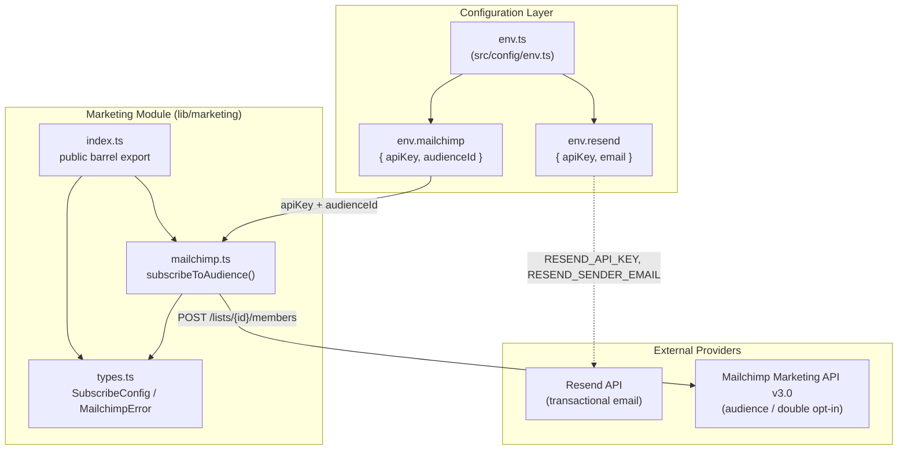
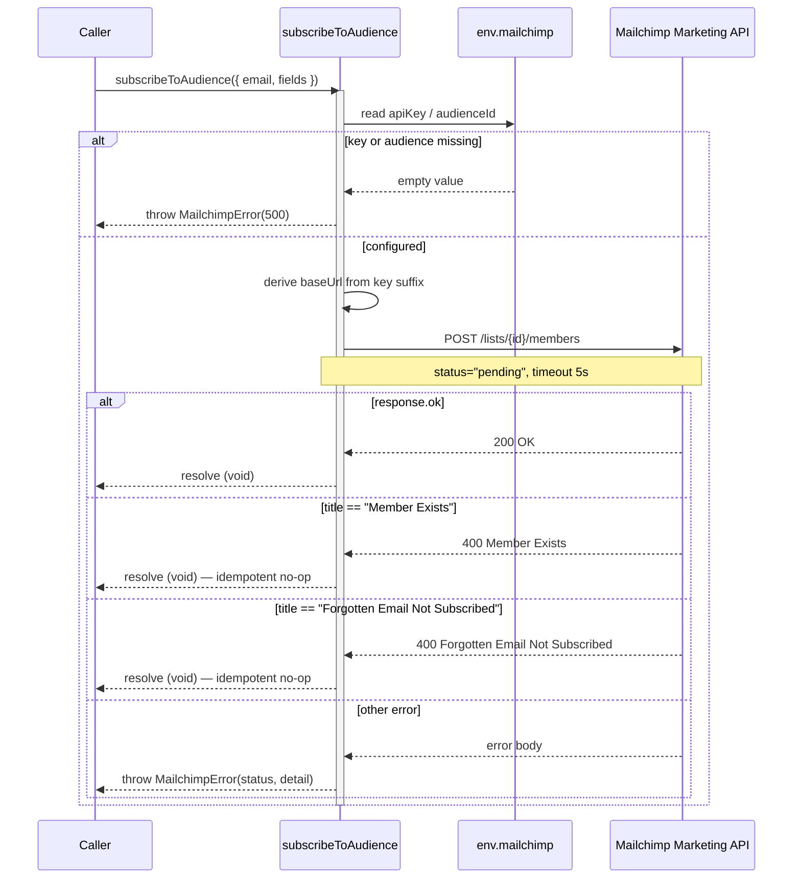

Transactional email delivery via Resend and marketing audience management via the Mailchimp Marketing API, both implemented as edge-compatible clients for Cloudflare Workers.

## Purpose and Scope

This page documents the outbound **email** and **marketing** integrations of the platform:

- The **Mailchimp Marketing API client** in `src/lib/marketing/` — how the platform adds subscribers to an audience using Mailchimp's double opt-in flow.
- The **Resend transactional email configuration** exposed through `src/config/env.ts`, which supplies the API key and sender address used for system-generated messages (sign-up confirmation, invitations, etc.).
- The **environment variables and operational configuration** that govern both integrations, including the preview-environment behavior described in `docs/deployment-previews.md` and `docs/ops-deployment.md`.

This page deliberately does **not** cover:

- The notification/persistence pipeline that triggers outbound messages — for that see the notification foundation schema and related moderation/notification pages under `7-moderation-and-storage`.
- Object/asset storage integrations — see the storage sibling page under `7-moderation-and-storage`.
- General deployment and environment setup beyond the email/marketing-specific variables — see the operational deployment docs referenced in [Related Links](#related-links).

## Overview

The platform separates its outbound communication into two distinct concerns, each backed by a dedicated third-party provider:

| Concern | Provider | Responsibility | System of record |
|---------|----------|----------------|------------------|
| Transactional email | **Resend** | Delivers one-off, system-triggered messages (confirmation, invitations) to a specific address | The platform |
| Marketing audience | **Mailchimp** | Manages newsletter/audience subscription state, double opt-in, and unsubscribe links | Mailchimp |

The key design decision documented in the source is that **Mailchimp is the system of record for subscription state**. The platform's marketing module "only ever adds addresses" and never removes them:

```typescript
/**
 * Marketing module - audience management via Mailchimp Marketing API
 *
 * @module lib/marketing
 * @description Edge-compatible audience client for Cloudflare Workers
 *
 * Mailchimp is the system of record for subscription state — this module only
 * ever adds addresses. Unsubscribes are handled by Mailchimp's own links.
 */

export { subscribeToAudience } from "./mailchimp";
export type { SubscribeConfig } from "./types";
export { MailchimpError } from "./types";
```

> Source: [index.ts](https://github.com/ozeaon/ozeaon-v2/blob/0a4f1a95824db87782f1221a4108019d174df3d9/src/lib/marketing/index.ts#L1-L13)

This one-way model avoids the classic consistency problem of maintaining a mirrored subscription list: the platform never has to reconcile a local "subscribed/unsubscribed" flag against the provider's state. It only needs to *propose* a subscription; Mailchimp owns everything downstream (opt-in confirmation, unsubscribe, bounce handling).

Both integrations are deliberately built for the **edge runtime**. The Mailchimp client explicitly avoids the Node.js SDK and uses the native `fetch` API so it can run inside Cloudflare Workers.

## Architecture

The two integrations are wired through a shared central configuration module (`src/config/env.ts`), which normalizes environment variables into structured `env.resend` and `env.mailchimp` objects. Consumers import from the appropriate library entry point.



**Reading the diagram:** the configuration layer is the single source of truth for credentials. `env.resend` is consumed by whichever service sends transactional mail (Resend is reached directly with the API key + sender email). `env.mailchimp` is injected into the marketing client, which builds the datacenter-specific base URL and posts new members directly to the Mailchimp API.

## Mailchimp Audience Client (Deep Dive)

The entire marketing integration lives in `src/lib/marketing/mailchimp.ts`. It is a small, purpose-built HTTP client rather than a wrapper around the Mailchimp SDK.

### Edge compatibility as a design constraint

The module header states the intent explicitly:

```typescript
/**
 * Mailchimp Marketing API client - Edge-compatible audience management
 *
 * Uses native fetch API for Cloudflare Workers compatibility.
 * No Node.js dependencies, no Mailchimp SDK.
 */
```

> Source: [mailchimp.ts](https://github.com/ozeaon/ozeaon-v2/blob/0a4f1a95824db87782f1221a4108019d174df3d9/src/lib/marketing/mailchimp.ts#L1-L6)

This is a deliberate trade-off. The official Mailchimp SDK pulls in Node.js built-ins that are unavailable in the Cloudflare Workers runtime. By using `fetch`, `btoa`, and `AbortSignal.timeout`, the module stays within the standard Web Platform APIs available at the edge — at the cost of hand-rolling URL construction, auth headers, and error mapping.

### Datacenter-derived base URL

Mailchimp's API is sharded by datacenter, and the datacenter is encoded as the suffix of the API key (e.g. `...-us15`). Rather than requiring a separate configuration variable, `getBaseUrl()` derives the host from the key itself:

```typescript
function getBaseUrl(): string {
  if (!env.mailchimp.apiKey) {
    throw new MailchimpError("MAILCHIMP_API_KEY is not configured", 500);
  }

  // The datacenter prefix is the suffix of the API key, e.g. `...-us15`
  const datacenter = env.mailchimp.apiKey.split("-").pop();

  if (!datacenter || datacenter === env.mailchimp.apiKey) {
    throw new MailchimpError(
      "MAILCHIMP_API_KEY is missing its datacenter suffix",
      500,
    );
  }

  return `https://${datacenter}.api.mailchimp.com/3.0`;
}
```

> Source: [mailchimp.ts](https://github.com/ozeaon/ozeaon-v2/blob/0a4f1a95824db87782f1221a4108019d174df3d9/src/lib/marketing/mailchimp.ts#L12-L28)

Two validation paths are worth calling out:

1. **Missing key** → `MailchimpError("MAILCHIMP_API_KEY is not configured", 500)`. This turns a misconfigured deployment into an explicit, typed failure rather than a confusing 401 from the provider.
2. **Malformed key** → the check `datacenter === env.mailchimp.apiKey` catches the case where the key contains no `-` separator. `String.prototype.split("-").pop()` returns the whole string when there is no separator, so without this guard a key like `abc123` would produce the nonsensical host `https://abc123.api.mailchimp.com`.

### Authentication header

Mailchimp uses HTTP Basic auth where the username is arbitrary and the API key is the password. The client encodes this with `btoa`:

```typescript
function getHeaders(): HeadersInit {
  return {
    Authorization: `Basic ${btoa(`anystring:${env.mailchimp.apiKey}`)}`,
    "Content-Type": "application/json",
  };
}
```

> Source: [mailchimp.ts](https://github.com/ozeaon/ozeaon-v2/blob/0a4f1a95824db87782f1221a4108019d174df3d9/src/lib/marketing/mailchimp.ts#L30-L35)

Using the literal `anystring` as the username is the documented Mailchimp convention — the API ignores the username portion and validates only the key.

### Audience ID validation

```typescript
function getAudienceId(): string {
  if (!env.mailchimp.audienceId) {
    throw new MailchimpError("MAILCHIMP_AUDIENCE_ID is not configured", 500);
  }
  return env.mailchimp.audienceId;
}
```

> Source: [mailchimp.ts](https://github.com/ozeaon/ozeaon-v2/blob/0a4f1a95824db87782f1221a4108019d174df3d9/src/lib/marketing/mailchimp.ts#L37-L42)

Like `getBaseUrl()`, this fails fast with a `500` `MailchimpError` rather than sending a request with an empty audience ID that would return a generic 404.

## Core Flow — Subscribing an Address

The public API is a single function, `subscribeToAudience`. Its contract is documented in its own doc comment:

```typescript
/**
 * Add an address to the audience as `pending`, triggering Mailchimp's
 * double opt-in confirmation email.
 *
 * Already-present addresses resolve successfully rather than throwing —
 * Mailchimp owns subscription state, so a repeat signup is a no-op.
 */
export async function subscribeToAudience(
  config: SubscribeConfig,
): Promise<void> {
  const response = await fetch(
    `${getBaseUrl()}/lists/${getAudienceId()}/members`,
    {
      method: "POST",
      headers: getHeaders(),
      signal: AbortSignal.timeout(5000),
      body: JSON.stringify({
        email_address: config.email,
        status: "pending",
        merge_fields: config.fields,
      }),
    },
  );
```

> Source: [mailchimp.ts](https://github.com/ozeaon/ozeaon-v2/blob/0a4f1a95824db87782f1221a4108019d174df3d9/src/lib/marketing/mailchimp.ts#L44-L66)

Key behaviors in this request:

- **`status: "pending"`** — the address is added in Mailchimp's `pending` state, which is what triggers the double opt-in confirmation email. The platform never marks an address `subscribed` directly; the subscriber must confirm.
- **`merge_fields: config.fields`** — arbitrary key/value merge data (e.g. first name) is forwarded from the caller-supplied `SubscribeConfig`.
- **`signal: AbortSignal.timeout(5000)`** — a hard 5-second timeout ensures a slow Mailchimp response cannot hang an edge request.

### Idempotency and error mapping

```typescript
  if (response.ok) return;

  const error = (await response
    .json()
    .catch(() => ({}))) as MailchimpErrorResponse;

  // Both states are terminal in Mailchimp — re-adding over the API is a no-op
  if (error.title === "Member Exists") return;
  if (error.title === "Forgotten Email Not Subscribed") return;

  throw new MailchimpError(
    `Mailchimp subscribe failed: ${error.detail || response.statusText}`,
    response.status,
    error,
  );
}
```

> Source: [mailchimp.ts](https://github.com/ozeaon/ozeaon-v2/blob/0a4f1a95824db87782f1221a4108019d174df3d9/src/lib/marketing/mailchimp.ts#L68-L83)

This is the heart of the "add-only, Mailchimp owns state" design. Two Mailchimp error titles are treated as **success-equivalent**:

| Mailchimp `title` | Meaning | Handling |
|-------------------|---------|----------|
| `Member Exists` | The address is already in the audience | Return normally (no-op) |
| `Forgotten Email Not Subscribed` | Address previously unsubscribed/cleaned and cannot be re-added via API | Return normally (no-op) |

Because the platform does not track subscription state, a repeated sign-up would otherwise surface as an error to the user. Treating these as no-ops makes the operation effectively **idempotent** from the caller's perspective: requesting a subscription twice is safe and produces the same outward result.

Note also the defensive JSON parse: `await response.json().catch(() => ({}))` guards against a non-JSON error body (e.g. an HTML error page from an upstream proxy), so the function still produces a useful `MailchimpError` via the `response.statusText` fallback.



## Resend Transactional Email Configuration

Unlike the Mailchimp client, the Resend integration is represented in the codebase primarily through its **configuration surface** rather than a dedicated client module. `src/config/env.ts` reads the two Resend variables and exposes them under a structured `env.resend` object:

```typescript
const RESEND_API_KEY = process.env.RESEND_API_KEY;
const RESEND_SENDER_EMAIL = process.env.RESEND_SENDER_EMAIL;
// ...
const MAILCHIMP_API_KEY = process.env.MAILCHIMP_API_KEY;
const MAILCHIMP_AUDIENCE_ID = process.env.MAILCHIMP_AUDIENCE_ID;
```

> Source: [env.ts](https://github.com/ozeaon/ozeaon-v2/blob/0a4f1a95824db87782f1221a4108019d174df3d9/src/config/env.ts#L10-L13)

```typescript
  resend: {
    apiKey: RESEND_API_KEY || "",
    email: RESEND_SENDER_EMAIL || "",
  },
  mailchimp: {
    apiKey: MAILCHIMP_API_KEY || "",
    audienceId: MAILCHIMP_AUDIENCE_ID || "",
  },
```

> Source: [env.ts](https://github.com/ozeaon/ozeaon-v2/blob/0a4f1a95824db87782f1221a4108019d174df3d9/src/config/env.ts#L34-L41)

### Design intent: empty strings, not undefined

Both blocks coalesce missing values to `""` rather than leaving them `undefined`. This gives the downstream clients a **stable shape** to validate against: `env.resend.apiKey` is always a string, so a consumer can check `if (!env.resend.apiKey)` deterministically. The Mailchimp client relies on exactly this pattern in `getBaseUrl()` and `getAudienceId()` — an unset variable becomes an empty string, which the truthiness check catches and converts into a typed `MailchimpError`.

### Required variables

The operational deployment documentation lists the variables that must be supplied per deployment:

```
RESEND_API_KEY=
RESEND_SENDER_EMAIL=
```

> Source: [ops-deployment.md](https://github.com/ozeaon/ozeaon-v2/blob/0a4f1a95824db87782f1221a4108019d174df3d9/docs/ops-deployment.md#L11-L12)

`RESEND_API_KEY` and `RESEND_SENDER_EMAIL` are also named in the list of secrets that must be provided to the Worker (alongside `CLOUDFLARE_ACCOUNT_ID`):

> Source: [ops-deployment.md](https://github.com/ozeaon/ozeaon-v2/blob/0a4f1a95824db87782f1221a4108019d174df3d9/docs/ops-deployment.md#L129-L131)

## Environment & Preview Behavior

A notable operational detail is how email and marketing behave differently in **preview deployments**. Secrets are written in full on every deploy, and a new Worker inherits none, so previews are given an explicitly separate set of credentials:

> Secrets are written in full per deploy — a new Worker inherits none. Email uses `PREVIEW_RESEND_API_KEY`, separate from production's key, so **previews send real mail** — whatever address you type in a sign-up or invite gets a real message. `PREVIEW_MAILCHIMP_*` are unset, so...

> Source: [deployment-previews.md](https://github.com/ozeaon/ozeaon-v2/blob/0a4f1a95824db87782f1221a4108019d174df3d9/docs/deployment-previews.md#L69-L71)

Two important operational consequences follow from this:

1. **Previews send real transactional mail.** Because the preview uses a *separate but live* `PREVIEW_RESEND_API_KEY`, any sign-up or invitation performed in a preview environment delivers an actual email to the address entered. This is intentional — it lets reviewers exercise the full email path — but it means preview activity is externally visible and must not be pointed at real end-user addresses.

2. **Previews do not touch the production marketing audience.** The `PREVIEW_MAILCHIMP_*` variables are unset, so the Mailchimp paths cannot be exercised against the live audience from a preview. Because the Mailchimp client treats a missing key/audience as a `MailchimpError(500)`, a preview that attempts a subscription will fail loudly rather than silently polluting or mutating the production list.

This separation is a deliberate blast-radius control: transactional email is safe (and useful) to fire from previews, while audience mutations are isolated to production.

## Configuration Options

| Variable | Group | Type | Default | Purpose |
|----------|-------|------|---------|---------|
| `RESEND_API_KEY` | `env.resend` | `string` | `""` | Resend API key for transactional email delivery |
| `RESEND_SENDER_EMAIL` | `env.resend` | `string` | `""` | Verified "from" address used as the sender |
| `MAILCHIMP_API_KEY` | `env.mailchimp` | `string` | `""` | Mailchimp API key; its `-<datacenter>` suffix determines the API host |
| `MAILCHIMP_AUDIENCE_ID` | `env.mailchimp` | `string` | `""` | Target audience/list ID for `subscribeToAudience` |

**Preview variants** (from `docs/deployment-previews.md`):

| Variable | Behavior in preview |
|----------|---------------------|
| `PREVIEW_RESEND_API_KEY` | Separate live key; previews send real mail |
| `PREVIEW_MAILCHIMP_*` | Unset; marketing audience mutations are disabled in preview |

> Sources: [env.ts](https://github.com/ozeaon/ozeaon-v2/blob/0a4f1a95824db87782f1221a4108019d174df3d9/src/config/env.ts#L10-L13), [env.ts](https://github.com/ozeaon/ozeaon-v2/blob/0a4f1a95824db87782f1221a4108019d174df3d9/src/config/env.ts#L34-L41), [deployment-previews.md](https://github.com/ozeaon/ozeaon-v2/blob/0a4f1a95824db87782f1221a4108019d174df3d9/docs/deployment-previews.md#L69-L71)

## API Reference

### `subscribeToAudience(config: SubscribeConfig): Promise<void>`

Adds an email address to the configured Mailchimp audience as `pending`, triggering Mailchimp's double opt-in confirmation email. Re-subscribing an existing or previously-unsubscribed address resolves successfully (no-op).

**Parameters:**

- `config` (`SubscribeConfig`): Subscription request. Based on its use in the request body, it carries:
  - `config.email` (`string`): the address to add, sent as `email_address`.
  - `config.fields` (`Record<string, unknown>` / merge fields): forwarded verbatim as `merge_fields`.

  > The exact `SubscribeConfig` field types are declared in `src/lib/marketing/types.ts`, which was not read within the source budget; only the two members referenced by `mailchimp.ts` are documented here.

**Returns:** `Promise<void>` — resolves on success, on `Member Exists`, and on `Forgotten Email Not Subscribed`.

**Throws:**

- `MailchimpError("MAILCHIMP_API_KEY is not configured", 500)` — key is empty.
- `MailchimpError("MAILCHIMP_API_KEY is missing its datacenter suffix", 500)` — key has no `-` separator.
- `MailchimpError("MAILCHIMP_AUDIENCE_ID is not configured", 500)` — audience ID is empty.
- `MailchimpError("Mailchimp subscribe failed: ...", response.status, error)` — any other non-OK response.

> Source: [mailchimp.ts](https://github.com/ozeaon/ozeaon-v2/blob/0a4f1a95824db87782f1221a4108019d174df3d9/src/lib/marketing/mailchimp.ts#L44-L83)

### Exported symbols

| Symbol | Kind | Source |
|--------|------|--------|
| `subscribeToAudience` | function | `src/lib/marketing/mailchimp.ts` |
| `SubscribeConfig` | type | `src/lib/marketing/types.ts` |
| `MailchimpError` | class | `src/lib/marketing/types.ts` |
| `MailchimpErrorResponse` | type | `src/lib/marketing/types.ts` (internal, not re-exported) |

The barrel `index.ts` re-exports `subscribeToAudience` (value) and `SubscribeConfig` + `MailchimpError` (type/value respectively), making them the module's public contract.

> Source: [index.ts](https://github.com/ozeaon/ozeaon-v2/blob/0a4f1a95824db87782f1221a4108019d174df3d9/src/lib/marketing/index.ts#L11-L13)

## Failure Modes, Edge Cases & Concurrency

| Scenario | Behavior | Evidence |
|----------|----------|----------|
| `MAILCHIMP_API_KEY` unset | Throws `MailchimpError(500)` before any network call | [mailchimp.ts#L13-L15](https://github.com/ozeaon/ozeaon-v2/blob/0a4f1a95824db87782f1221a4108019d174df3d9/src/lib/marketing/mailchimp.ts#L13-L15) |
| Key without datacenter suffix | Throws `MailchimpError(500)` — prevents a garbage host | [mailchimp.ts#L20-L25](https://github.com/ozeaon/ozeaon-v2/blob/0a4f1a95824db87782f1221a4108019d174df3d9/src/lib/marketing/mailchimp.ts#L20-L25) |
| `MAILCHIMP_AUDIENCE_ID` unset | Throws `MailchimpError(500)` before request | [mailchimp.ts#L38-L40](https://github.com/ozeaon/ozeaon-v2/blob/0a4f1a95824db87782f1221a4108019d174df3d9/src/lib/marketing/mailchimp.ts#L38-L40) |
| Address already a member | Resolved as no-op (`Member Exists`) | [mailchimp.ts#L75](https://github.com/ozeaon/ozeaon-v2/blob/0a4f1a95824db87782f1221a4108019d174df3d9/src/lib/marketing/mailchimp.ts#L75) |
| Address previously unsubscribed | Resolved as no-op (`Forgotten Email Not Subscribed`) | [mailchimp.ts#L76](https://github.com/ozeaon/ozeaon-v2/blob/0a4f1a95824db87782f1221a4108019d174df3d9/src/lib/marketing/mailchimp.ts#L76) |
| Non-JSON error body | Parsed defensively to `{}`; falls back to `response.statusText` | [mailchimp.ts#L70-L72](https://github.com/ozeaon/ozeaon-v2/blob/0a4f1a95824db87782f1221a4108019d174df3d9/src/lib/marketing/mailchimp.ts#L70-L72) |
| Slow Mailchimp response | Aborted after 5s via `AbortSignal.timeout(5000)` | [mailchimp.ts#L59](https://github.com/ozeaon/ozeaon-v2/blob/0a4f1a95824db87782f1221a4108019d174df3d9/src/lib/marketing/mailchimp.ts#L59) |

**Concurrency / consistency.** The client issues no shared mutable state, so concurrent calls are independent. The idempotency handling for `Member Exists` is what makes concurrent duplicate subscriptions safe: even if two requests race to add the same address, the loser receives `Member Exists` and resolves normally. Because unsubscribe state lives entirely in Mailchimp, there is no local cache to invalidate and no risk of the platform's view diverging from the provider's.

**Edge case — unsubscribed addresses.** The `Forgotten Email Not Subscribed` no-op means a re-request to subscribe an address that previously unsubscribed will *not* re-subscribe it and will *not* error. The platform has no mechanism to override this; a previously-unsubscribed address must go through Mailchimp's own flow. This is consistent with the module doc: "Unsubscribes are handled by Mailchimp's own links."

## Performance & Operational Considerations

- **Edge-first, zero dependencies.** Using native `fetch` and `btoa` avoids shipping the Mailchimp SDK into the Worker bundle, keeping cold-start cost and bundle size low.
- **Bounded latency.** The 5-second `AbortSignal.timeout` caps how long a subscription attempt can block an edge request.
- **Per-deployment secret provisioning.** Secrets are written in full on each deploy and are not inherited; a new Worker with unset `RESEND_API_KEY` / `MAILCHIMP_API_KEY` will fail on first use. The fail-fast `MailchimpError(500)` paths make such misconfiguration visible immediately rather than manifesting as opaque provider errors.
- **Preview isolation.** Marketing credentials are intentionally absent in previews, preventing accidental audience mutation from non-production environments, while transactional email remains testable end-to-end.

## Extension Points

- **Additional merge fields.** The client forwards `config.fields` untouched as `merge_fields`, so callers can pass arbitrary audience merge data without changing the client — provided the fields exist in the Mailchimp audience.
- **New marketing operations.** The module is a barrel (`src/lib/marketing/index.ts`) that re-exports from focused files; adding e.g. an audience-update or tag operation would follow the same edge-compatible `fetch` pattern and be re-exported from `index.ts`.
- **Transactional email senders.** `env.resend` is a structured config object; any module needing to send mail can consume `env.resend.apiKey` and `env.resend.email` without depending on a specific client implementation.

## Related Links

- [Marketing module barrel export](https://github.com/ozeaon/ozeaon-v2/blob/0a4f1a95824db87782f1221a4108019d174df3d9/src/lib/marketing/index.ts)
- [Mailchimp Marketing API client](https://github.com/ozeaon/ozeaon-v2/blob/0a4f1a95824db87782f1221a4108019d174df3d9/src/lib/marketing/mailchimp.ts)
- [Environment configuration](https://github.com/ozeaon/ozeaon-v2/blob/0a4f1a95824db87782f1221a4108019d174df3d9/src/config/env.ts)
- [Deployment previews (preview credentials behavior)](https://github.com/ozeaon/ozeaon-v2/blob/0a4f1a95824db87782f1221a4108019d174df3d9/docs/deployment-previews.md#L69-L71)
- [Operational deployment (required secrets)](https://github.com/ozeaon/ozeaon-v2/blob/0a4f1a95824db87782f1221a4108019d174df3d9/docs/ops-deployment.md#L11-L12)
- Sibling topic: moderation and notifications pipeline under `7-moderation-and-storage`
