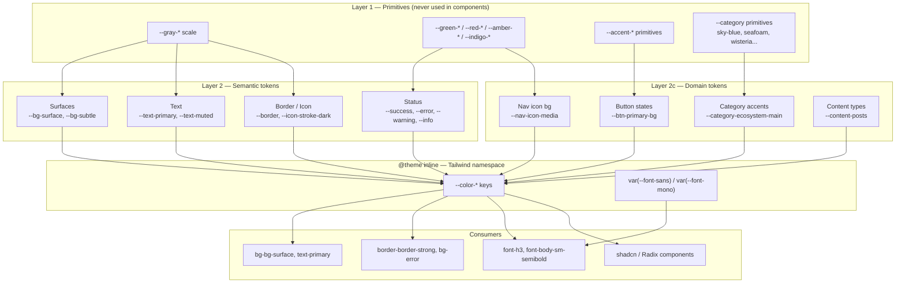
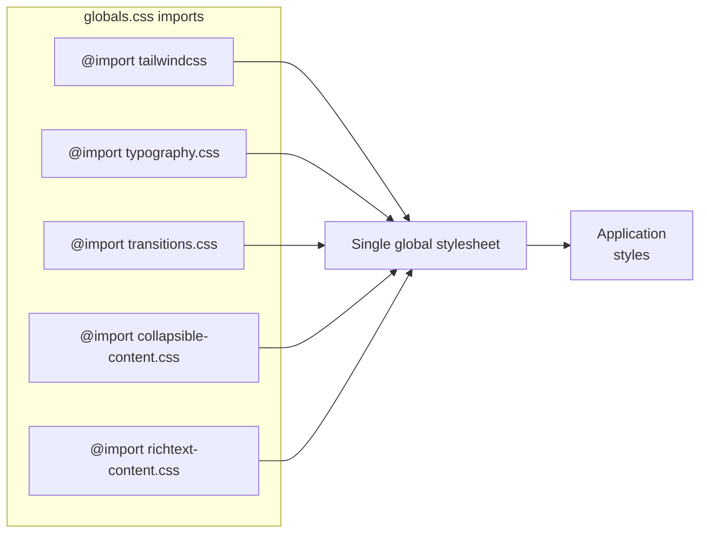
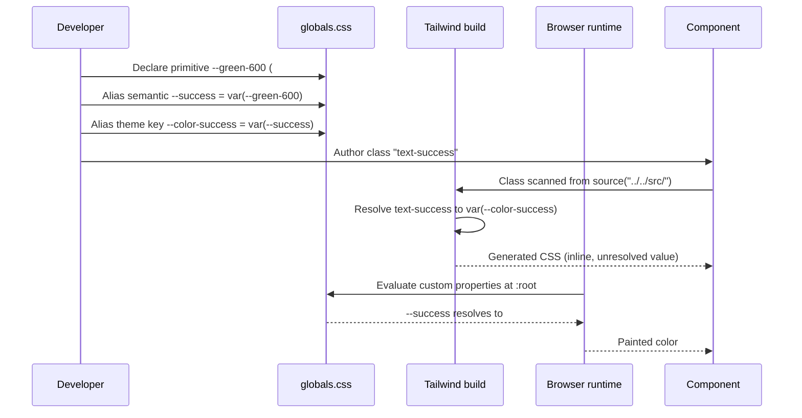

The visual language of the application is defined as a three-layer CSS custom-property token system (`primitives → semantic → domain`), paired with a fixed Figma-derived type scale exposed as Tailwind utilities. Components are forbidden from using raw Tailwind size or color utilities and must consume the tokens defined in `src/styles/typography.css` and `src/styles/globals.css`.

## Purpose and Scope

This page documents the design-token foundation used across the entire UI:

- The **layered CSS variable architecture** in `src/styles/globals.css` (Layer 1 primitives, Layer 2 semantic tokens, Layer 2c domain tokens) and how they are re-exported to Tailwind through `@theme inline`.
- The **typography system** in `src/styles/typography.css` — the type scale utilities (`font-h1`, `font-body`, `font-mono`, …), font families, and base element styles.
- The **color semantics** — text, surface, border, icon, status, and category palettes.
- The **shadcn/Radix compatibility bridge**, which maps the library's required custom properties onto semantic tokens.

**Out of scope (covered by sibling pages):**

- Component-level composition rules (buttons, cards, forms) belong to the component library pages.
- Layout, spacing, and grid conventions belong to the Layout System page.
- The full design-consistency remediation plan (tracked as `DESIGN-CONSISTENCY-PLAN.md`) is an internal planning document and is not reproduced here beyond its token-related references.

For the authoritative prose reference used by contributors, see [`docs/design-system.md`](https://github.com/ozeaon/ozeaon-v2/blob/0a4f1a95824db87782f1221a4108019d174df3d9/docs/design-system.md#L1-L36), which states the hard rule:

> ⚠️ Never use raw Tailwind size or color utilities. Use design system tokens from `src/styles/typography.css` and `src/styles/globals.css`.

> Source: [design-system.md](https://github.com/ozeaon/ozeaon-v2/blob/0a4f1a95824db87782f1221a4108019d174df3d9/docs/design-system.md#L1-L4)

## Overview

The design system exists to make the Figma file **OZEAON-DESIGN-2.0** the single source of visual truth in code. Rather than letting individual components choose arbitrary hex values and font sizes, the codebase defines every color and every text style once, names it after its Figma counterpart (comments in the CSS frequently cite the Figma path, e.g. `Figma: color/background/`), and then exposes it as a Tailwind utility.

Three design goals drive the implementation:

1. **One source of truth per decision.** A primitive such as `--green-600: #00786f` is declared exactly once. Semantic tokens (`--success`, `--primary-green`) alias that primitive. Domain tokens (`--category-ecosystem-main`) alias either a primitive or a secondary palette entry. Changing `#00786f` in one place updates the brand, success states, and lifecycle accents simultaneously.
2. **A strict layering contract.** Layer 1 comments explicitly warn: *"never reference directly in components"*. Components are expected to consume Layer 2/2c semantic names. This prevents components from being coupled to raw palette values like `--gray-1000` that carry no intent.
3. **Tailwind-native ergonomics.** The `@theme inline` block translates every token into a Tailwind theme key so authors write `bg-bg-surface`, `text-primary`, `border-border-strong`, or `font-h3` — never `bg-gray-100` or `text-[13px]`.

The type system follows the same philosophy and additionally encodes **exact pixel line-height** rather than unitless ratios, per the file header comment *"Line heights are exact px values, not ratios"*, to guarantee pixel-faithful reproduction of the Figma text styles.

### Key terminology

| Term | Meaning |
| --- | --- |
| **Primitive** | A raw, intent-free value (`--gray-50`, `--green-600`). Layer 1. |
| **Semantic token** | An intent-named alias of a primitive (`--bg-surface`, `--text-primary`, `--error`). Layer 2. |
| **Domain token** | A product-concept alias (`--category-health-main`, `--nav-icon-media`, `--btn-primary-bg`). Layer 2c. |
| **Utility** | A Tailwind class generated from a token (`bg-bg-surface`, `font-body-sm-semibold`). |
| **Type scale** | The set of `font-*` utilities defined with `@utility` in `typography.css`. |

## Architecture

The system is a four-stage pipeline: raw values are declared in `:root`, re-exported into Tailwind's theme namespace via `@theme inline`, and finally consumed as utilities. Typography runs in parallel, contributing `@utility` classes and `@layer base` element defaults.



Two structural details are worth calling out because they explain otherwise-surprising syntax:

- **Surface utilities are double-prefixed** (`bg-bg-surface`). The token is named `--bg-surface` (it describes *which* surface), and the Tailwind theme key is `--color-bg-surface` (`globals.css` comment: *"Surfaces — bg-bg-* in usage"*). Tailwind prepends the `bg-` utility prefix, producing `bg-bg-surface`.
- **Text utilities use short names.** The theme keys drop the `text-` token prefix (`--color-primary: var(--text-primary)`), so the class is `text-primary` rather than `text-text-primary`.



> Source: [globals.css](https://github.com/ozeaon/ozeaon-v2/blob/0a4f1a95824db87782f1221a4108019d174df3d9/src/styles/globals.css#L1-L8)

## Color System — Layer 1: Primitives

Primitives are declared in `:root` under an explicit banner comment warning that they must never be referenced directly by components:

```css
@layer base {
  :root {
    /* ══════════════════════════════════════════════════════════
       LAYER 1: PRIMITIVES — never reference directly in components
       ══════════════════════════════════════════════════════════ */

    /* ── Gray scale ── */
    --gray-0: #ffffff;
    --gray-50: #f7f8fa;
    --gray-sm-hover: #f1f2f5; /* button SM hover — no Figma token */
    --gray-100: #eff3fc;
    --gray-200: #e4ecf6;
    --gray-300: #d8e4f0;
    --gray-400: #c5d4e6;
    --gray-500: #a8bac8;
    --gray-600: #94a6b2;
    --gray-700: #8898a9;
    --gray-800: #677888;
    --gray-900: #4a5565;
    --gray-950: #374150;
    --gray-1000: #1c2b3a;
  }
}
```

> Source: [globals.css](https://github.com/ozeaon/ozeaon-v2/blob/0a4f1a95824db87782f1221a4108019d174df3d9/src/styles/globals.css#L10-L30)

The gray scale is non-linear at the ends: it starts at `--gray-0` (pure white) rather than `--gray-50`, and the darkest step is `--gray-1000` (#1c2b3a). Both are deliberate — `--gray-0` maps to the `--bg-surface` semantic token, while `--gray-1000` maps to `--text-primary`. There is also an out-of-band `--gray-sm-hover` explicitly annotated *"no Figma token"*, documenting a code-only addition rather than a designer-authored value.

### Primitive families

| Family | Tokens | Purpose |
| --- | --- | --- |
| Gray scale | `--gray-0` … `--gray-1000`, `--gray-sm-hover` | All neutral surfaces, text, borders |
| Accent | `--accent-yellow-primitive`, `--accent-blue-primitive`, `--accent-green-primitive`, `--accent-purple-primitive`, `--accent-pink-primitive` | Soft pastel backgrounds |
| Secondary backgrounds | `--lavender-*`, `--body-parchment`, `--old-lace`, `--soft-blush`, `--azure-mist`, `--lemon-chiffon`, `--eggshell`, `--pale-sky` | Figma `color/secondary background/` |
| Category | `--sky-blue`, `--ice-blue`, `--golden-yellow`, `--seafoam`, `--seafoam-light`, `--wisteria`, `--burnt-coral`, `--chartreuse`, `--chartreuse-light` | Figma `color/categories/` |
| Red | `--red-50`, `--red-100`, `--red-600` | Destructive / error |
| Amber | `--amber-100`, `--amber-700` | Warning |
| Indigo | `--indigo-100`, `--indigo-600` | Info / links |
| Ink | `--ink-900`, `--ink-700`, `--ink-400` | Neutral darks *with no blue tint* |
| Green | `--green-50`, `--green-75`, `--green-100` … `--green-900` | Brand / success |
| One-off | `--neutral-400`, `--divider-gray`, `--slate-blue` | Values Figma exposed as non-scale colors |

A design-intent detail: the `Ink` family is separated from the gray scale specifically because its values (#222222, #33363f, #7e869e) carry *no blue tint*, whereas the gray scale is slightly blue-shifted (#1c2b3a). Ink is reserved for icons, which in Figma are specified as `fill_icon`, `Duotone`, and `Line_icon` — three distinct icon roles that would be wrong if aliased to the blue-tinted gray scale.

## Color System — Layer 2: Semantic Tokens

Layer 2 is labeled *"SEMANTIC TOKENS — single source of truth"*. It is subdivided into **2a: core semantic** (surfaces, text, border, icon) and **2b: system tokens** (status, radius, elevation).

### 2a — Surfaces

```css
    /* ── Surfaces — Figma: color/background/ ── */
    --bg-surface: var(--gray-0); /* #ffffff */
    --bg-light-cold: var(--gray-50); /* #f7f8fa */
    --bg-subtle: var(--gray-100); /* #eff3fc */
    --bg-sunken: var(--gray-200); /* #e4ecf6 */
    --bg-inverse: var(
      --green-700
    ); /* dark/brand surface — pair with --text-inverse */
    --bg-neutral: var(
      --gray-50
    ); /* Figma: neutral-light-gray (alias of bg-light-cold) */

    /* ── Overlays ── */
    --overlay-frosted: rgba(243, 247, 255, 0.8);
    --overlay-scrim: rgba(26, 35, 48, 0.3);
    --overlay-scrim-half: rgba(26, 35, 48, 0.5);
```

> Source: [globals.css](https://github.com/ozeaon/ozeaon-v2/blob/0a4f1a95824db87782f1221a4108019d174df3d9/src/styles/globals.css#L121-L136)

| Token | Tailwind class | Value | Use for |
| --- | --- | --- | --- |
| `--bg-surface` | `bg-bg-surface` | `#ffffff` | Cards, panels |
| `--bg-light-cold` | `bg-bg-cold` | `#f7f8fa` | Default button background |
| `--bg-neutral` | `bg-bg-neutral` | `#f7f8fa` | Input backgrounds |
| `--bg-subtle` | `bg-bg-subtle` | `#eff3fc` | Tag pills, button hover states |
| `--bg-sunken` | `bg-bg-sunken` | `#e4ecf6` | Inset sections |
| `--bg-inverse` | `bg-bg-inverse` | green-700 `#006059` | Dark/brand surface; pair with `--text-inverse` |

The `--bg-inverse` token is the one surface documented with an explicit *pairing contract*: it must be used together with `--text-inverse`, which resolves to `--gray-0` (white). This encodes contrast safety in the token names rather than in per-component review.

Note the deliberate duplication: `--bg-neutral` and `--bg-light-cold` resolve to the identical primitive. The comment records that Figma names them `neutral-light-gray` while the code exposes both aliases, preserving designer vocabulary and code vocabulary simultaneously.

Overlay tokens are the exception to the "alias a primitive" rule — `--overlay-frosted` and the two scrims are raw `rgba()` literals because opacity cannot be expressed by aliasing an opaque primitive.

### 2a — Text

```css
    /* ── Text — Figma: color/text/ ── */
    --text-primary: var(--gray-1000); /* #1c2b3a */
    --text-secondary: var(--gray-900); /* #4a5565 */
    --text-muted: var(--gray-800); /* #677888 */
    --text-subtle: var(--gray-700); /* #8898a9 */
    --text-placeholder: var(--gray-600); /* #94a6b2 */
    --text-soft: var(--neutral-400); /* Figma: text/soft-400 */
    --text-link: var(--indigo-600); /* #424bb3 */
    --text-inverse: var(--gray-0);
```

> Source: [globals.css](https://github.com/ozeaon/ozeaon-v2/blob/0a4f1a95824db87782f1221a4108019d174df3d9/src/styles/globals.css#L138-L146)

The five-step muted ladder (`primary → secondary → muted → subtle → placeholder`) descends monotonically through the gray scale, giving a predictable contrast ramp for text hierarchy. `--text-link` is intentionally *not* on the gray scale: links are indigo (#424bb3) so that they remain distinguishable from body copy in dense UI.

> Note that `docs/design-system.md` lists `text-secondary` as `#677888` and `text-muted` as `#8898a9`, whereas the source of truth in `globals.css` resolves these to `--gray-900` (#4a5565) and `--gray-800` (#677888) respectively. The CSS file is authoritative — the documentation table lags by one step.

### 2a — Borders and Icons

```css
    /* ── Border — Figma: color/background/border-* ── */
    --border: var(--gray-300); /* #d8e4f0 */
    --border-strong: var(--gray-400); /* #c5d4e6 */
    --border-stronger: var(
      --gray-600
    ); /* #94a6b2 — mid-contrast, e.g. card section dividers */
    --border-focus: var(--gray-800); /* #677888 */
    --divider: var(
      --divider-gray
    ); /* Figma: Stroke — intentionally off gray scale */

    /* ── Icon — hardcoded per Figma, not gray-scale aliases ── */
    --icon: var(--ink-900); /* Figma: fill_icon */
    --icon-muted: var(--ink-400); /* Figma: Duotone */
    --icon-stroke-dark: var(--ink-700); /* Figma: Line_icon */
```

> Source: [globals.css](https://github.com/ozeaon/ozeaon-v2/blob/0a4f1a95824db87782f1221a4108019d174df3d9/src/styles/globals.css#L148-L162)

Three border weights exist because different UI surfaces need different separation strengths: `--border` for standard outlines, `--border-strong` for emphasized edges, and `--border-stronger` (a mid-contrast step, used for card section dividers). `--divider` is explicitly annotated *"intentionally off gray scale"*, meaning the divider color (#ecedf0) is a Figma `Stroke` style that does not correspond to any gray step — a case where forcing it onto the scale would have introduced a visual regression.

The icon comment *"hardcoded per Figma, not gray-scale aliases"* is a maintenance warning: the three icon roles resolve to the `Ink` family, so anyone "tidying up" icons to use `--gray-*` would break the tint-free icon appearance.

### 2b — Status Tokens

```css
    /* ── Status — Figma: color/functional/ ── */
    --success: var(
      --green-600
    ); /* #00786f — same primitive as --primary-green today */
    --success-hover: var(
      --green-700
    ); /* #006059 — hover state for bg-success */
    --success-surface: var(--green-50); /* #edfff3 */
    --error: var(--red-600);
    --error-surface: var(--red-50);
    --error-surface-hover: var(
      --red-100
    ); /* #ffd5d9 — hover state for bg-error-surface */
    --warning: var(--amber-700);
    --warning-surface: var(--amber-100);
    --info: var(--indigo-600);
    --info-surface: var(--indigo-100);
```

> Source: [globals.css](https://github.com/ozeaon/ozeaon-v2/blob/0a4f1a95824db87782f1221a4108019d174df3d9/src/styles/globals.css#L166-L182)

Status tokens follow a consistent **three-role pattern**: a solid foreground color (`--success`), an optional hover variant (`--success-hover`, `--error-surface-hover`), and a tinted surface (`--success-surface`, `--error-surface`, `--warning-surface`, `--info-surface`). This lets an alert component be assembled entirely from semantic names without picking gray steps by hand.

The comment on `--success` — *"same primitive as `--primary-green` today"* — is a deliberate signal. It documents that brand green and success green currently coincide by coincidence of design, not by contract; the two tokens remain separate so they can diverge without a breaking rename.

### 2b — Radius and Elevation

```css
    /* ── Radius — prefixed --r- to avoid self-reference in @theme inline ── */
    --r-sm: 0.5rem; /* 8px  — Figma: radius-8 */
    --r-md: 0.75rem; /* 12px */
    --r-lg: 1rem; /* 16px */
    --r-xl: 1.125rem; /* 18px */

    /* ── Elevation — Figma: Elevation WIP ── */
    --elevation-xs: 0 2px 2px -1px rgba(0, 0, 0, 0.25);
    --elevation-sm:
      0 1px 4px rgba(0, 0, 0, 0.06), inset 0 0 0.5px rgba(0, 0, 0, 0.1);
    --elevation-md:
      2px 2px 2px -1px rgba(54, 65, 83, 0.25),
      -2px 2px 2px -1px rgba(54, 65, 83, 0.25);
    --elevation-fab:
      -4px 4px 4px -1px rgba(54, 65, 83, 0.25),
      4px 4px 2px -1px rgba(54, 65, 83, 0.25);
```

> Source: [globals.css](https://github.com/ozeaon/ozeaon-v2/blob/0a4f1a95824db87782f1221a4108019d174df3d9/src/styles/globals.css#L184-L199)

The radius prefix is a **technical workaround documented inline**: `--r-sm` rather than `--radius-sm`. The comment explains why — a token named `--radius-sm` would self-reference when Tailwind's `@theme inline` machinery is applied, so the shorter prefix breaks the cycle. This is a concrete example of a naming decision driven by toolchain behavior rather than aesthetics.

Elevation values are annotated *"Figma: Elevation WIP"*, flagging them as not-yet-final design output. `--elevation-fab` is split out from `--elevation-md` because the floating action button uses an asymmetric, outward-spreading shadow (`-4px 4px` and `4px 4px`) that a generic medium elevation cannot express.

## Color System — Layer 2c: Domain Tokens

Domain tokens map product concepts — categories, navigation destinations, content types, button states — onto colors. They are the layer components are *most* expected to consume, because they carry product meaning.

```css
    /* ── Category accents — Figma: color/categories/ ── */
    --category-ecosystem-main: #36d47e; /* Ecosystem Services Main */
    --category-ecosystem-bg: var(--green-75); /* Ecosystem Services Light */
    --category-health-main: #6bd3ff; /* Health-BioTech Main */
    --category-health-bg: #e6f8ff; /* Health-BioTech Light */
    --category-food-main: #ffd226; /* Food Main */
    --category-food-bg: var(--lemon-chiffon); /* Food Light */
    --category-economy-main: #70ecbf; /* Economy-Industry Main */
    --category-economy-bg: #dcfcf1; /* Economy-Industry Light */
    --category-design-main: #c9b1fd; /* Design-Biomaterials Main */
    --category-design-bg: var(--lavender-1); /* Design-Biomaterials Light */
    --category-social-main: #ea7a53; /* Social Emp Main */
    --category-social-bg: var(--lavender-blush-1); /* Social Emp Light */
    --category-regulations-main: var(--gray-500); /* Regulations Main */
```

> Source: [globals.css](https://github.com/ozeaon/ozeaon-v2/blob/0a4f1a95824db87782f1221a4108019d174df3d9/src/styles/globals.css#L227-L240)

Every category exposes a matched **`-main` / `-bg` pair**, so a category badge, chip, or header icon can be rendered from one concept name without the caller choosing a tint. Some `-main` values are raw hex (because the Figma category palette is its own color family, not a gray/green alias), while some point at declared category primitives (`--sky-blue`, `--seafoam`, `--wisteria`, `--burnt-coral`); the `-bg` values alias secondary-background tokens where one exists. `--category-regulations-main` is the outlier: it uses `--gray-500` semantically to signal that "Regulations" is intentionally colorless relative to the other six categories.

### Navigation icons, content types, and badges

```css
    --nav-icon-community: var(--lavender-blush-1);
    --nav-icon-organisations: var(--accent-blue);
    --nav-icon-resources: var(--accent-yellow);

    /* ── Content-type accents — code-only, used by profile tabs ── */
    --content-posts: var(--accent-blue);
    --content-projects: var(--accent-green);
    --content-articles: var(--accent-yellow);
    --content-images: var(--accent-pink);
    --content-diy: var(--accent-purple);
    --content-nfts: var(--accent-pink);
    --content-about: var(--gray-400);

    /* ── Badge — code-only, used by MegaMenuLink (placeholder) ── */
    --badge-new-bg: var(--accent-blue);
    --badge-new-text: var(--text-primary);
```

> Source: [globals.css](https://github.com/ozeaon/ozeaon-v2/blob/0a4f1a95824db87782f1221a4108019d174df3d9/src/styles/globals.css#L290-L305)

Two provenance annotations appear here that matter for maintenance:

- **"code-only"** marks tokens with no designer-authored counterpart. `--content-*` tokens exist solely because the profile tabs need a stable accent per content type; they are derived by aliasing the accent primitives, not from a Figma color style.
- **"placeholder"** on `--badge-new-bg` explicitly marks the badge token as provisional, so future work knows it is not yet a locked design decision.

The content-type set also demonstrates intentional aliasing reuse: `--content-images` and `--content-nfts` both resolve to `--accent-pink`, meaning groups that belong together visually can share one primitive while remaining independently nameable.

## The shadcn / Radix Compatibility Bridge

Third-party component primitives (shadcn/Radix) require a fixed set of custom properties (`--background`, `--foreground`, `--card`, `--ring`, …). The design system satisfies that contract by aliasing each required property onto an existing semantic token, with a guard comment:

```css
    /* ── shadcn compatibility ──
       Required by shadcn/Radix components.
       Map to semantic tokens — never use these directly in custom components. */
    --background: var(--bg-surface);
    --foreground: var(--text-primary);
    --card: var(--bg-surface);
    --card-foreground: var(--text-primary);
    --popover: var(--bg-surface);
    --popover-foreground: var(--text-primary);
    --accent: #f3f7ff; /* code-only — no Figma source, heavily used by shadcn hover states */
    --accent-foreground: var(--gray-950);
    --destructive: var(--error);
    --destructive-foreground: var(--gray-0);
    --input: var(--bg-light-cold);
    --ring: var(--border-focus);
```

> Source: [globals.css](https://github.com/ozeaon/ozeaon-v2/blob/0a4f1a95824db87782f1221a4108019d174df3d9/src/styles/globals.css#L307-L321)

Design intent: this block exists purely so that generated shadcn components inherit the Ozeaon palette automatically instead of defaulting to shadcn's zinc/neutral theme. The comment *"never use these directly in custom components"* prevents the bridge from becoming a second, competing semantic layer — custom code must use `--bg-surface` and `--text-primary`, not `--background` and `--foreground`.

`--accent` is annotated *"code-only — no Figma source, heavily used by shadcn hover states"*. This is a rare case where a third-party library's requirements forced a value with no design counterpart; the inline comment ensures no one hunts Figma for it.

| shadcn property | Aliased semantic token | Effective value |
| --- | --- | --- |
| `--background` | `--bg-surface` | `#ffffff` |
| `--foreground` | `--text-primary` | `#1c2b3a` |
| `--card` / `--popover` | `--bg-surface` | `#ffffff` |
| `--accent` | *(raw, code-only)* | `#f3f7ff` |
| `--destructive` | `--error` | `--red-600` |
| `--input` | `--bg-light-cold` | `#f7f8fa` |
| `--ring` | `--border-focus` | `#677888` |

## Token → Tailwind Export (`@theme inline`)

The `@theme inline` block is the mechanical bridge from CSS variables to Tailwind theme keys. Every key is prefixed `--color-` (Tailwind's convention for anything reachable through color utilities), and the value is a `var()` reference — which is exactly why the block is `inline`: Tailwind must not resolve the value at build time, because the underlying variable can change per theme scope.

```css
@theme inline {
  /* ── shadcn required (only non-conflicting tokens) ── */
  --color-background: var(--background);
  --color-foreground: var(--foreground);
  --color-card: var(--card);
  --color-card-foreground: var(--card-foreground);
  --color-popover: var(--popover);
  --color-popover-foreground: var(--popover-foreground);
  --color-accent: var(--accent);
  --color-accent-foreground: var(--accent-foreground);
  --color-destructive: var(--destructive);
  --color-destructive-foreground: var(--destructive-foreground);
  --color-border: var(--border);
  --color-input: var(--input);
  --color-ring: var(--ring);

  /* ── Primary ── */
  --color-primary-green: var(--primary-green);
  --color-ozeaon-blue: var(--ozeaon-blue);
  --color-ozeaon-blue-hover: var(--ozeaon-blue-hover);
```

> Source: [globals.css](https://github.com/ozeaon/ozeaon-v2/blob/0a4f1a95824db87782f1221a4108019d174df3d9/src/styles/globals.css#L325-L344)

### Deliberate naming collisions

The text block uses intentionally shortened keys, and the comments document the aliasing hazard explicitly:

```css
  /* ── Text — short names: text-primary, text-secondary, etc. ── */
  --color-primary: var(--text-primary);
  --color-secondary: var(--text-secondary);
  --color-muted: var(--text-muted);
  --color-subtle: var(--text-subtle);
  --color-placeholder: var(--text-placeholder);
  --color-soft: var(--text-soft);
  --color-inverse: var(--text-inverse);
  --color-link: var(--text-link);

  /* ── Shortcuts — shorter class names for commonly-used semantic tokens ──
     NOTE: text-brand (green, brand action) ≠ text-text-link (gray, body link text).
     Components using text-brand for branded links should use text-brand.
     Non-branded inline links should use text-text-link. */
  --color-brand: var(--primary-green); /* bg-brand, text-brand */
  --color-success: var(--success); /* bg-success, text-success */
```

> Source: [globals.css](https://github.com/ozeaon/ozeaon-v2/blob/0a4f1a95824db87782f1221a4108019d174df3d9/src/styles/globals.css#L357-L372)

This is the single most important convention on the page: **there are two different "link" colors and they are not interchangeable.**

| Utility | Resolves to | When to use |
| --- | --- | --- |
| `text-brand` | `--primary-green` (`#00786f`) | Branded/action links, brand emphasis |
| `text-text-link` | `--text-link` (`--indigo-600`, `#424bb3`) | Non-branded inline links in body copy |

A second asymmetry exists for success text: `--color-primary-green` produces `text-primary-green`, while `--color-brand` produces `text-brand` for the same underlying green. Both are intentional — one is the explicit token name, the other a convenience shortcut for the most commonly used brand color.

### Scale

The full size of the bridge is substantial: the file enumerates roughly 26 color groups (see the `--color-…` series from `globals.css#L327` onward), covering shadcn compatibility, primary colors, surfaces, text, borders, icons, status, accent palette, secondary backgrounds, founding-member badge gradients, button states, nav-icon backgrounds, content types, badges, metric cards, and category accents.

```css
  /* ── Nav icon backgrounds ── */
  --color-nav-icon-education: var(--nav-icon-education);
  --color-nav-icon-media: var(--nav-icon-media);
  --color-nav-icon-articles: var(--nav-icon-articles);
  --color-nav-icon-projects: var(--nav-icon-projects);
  --color-nav-icon-nfts: var(--nav-icon-nfts);
  --color-nav-icon-open-calls: var(--nav-icon-open-calls);
  --color-nav-icon-community: var(--nav-icon-community);
  --color-nav-icon-organisations: var(--nav-icon-organisations);
  --color-nav-icon-resources: var(--nav-icon-resources);
```

> Source: [globals.css](https://github.com/ozeaon/ozeaon-v2/blob/0a4f1a95824db87782f1221a4108019d174df3d9/src/styles/globals.css#L444-L453)

## Typography System

`src/styles/typography.css` is imported first among the local stylesheets in `globals.css`, so the type scale is available to every later sheet. Its header states the provenance and a critical implementation constraint:

```css
/**
 * Typography System
 *
 * Type scale from Figma OZEAON-DESIGN-2.0
 * Font families: Manrope (all non-mono), DM Mono (code), Lora (content title serif)
 * Line heights are exact px values, not ratios
 */
```

> Source: [typography.css](https://github.com/ozeaon/ozeaon-v2/blob/0a4f1a95824db87782f1221a4108019d174df3d9/src/styles/typography.css#L1-L7)

### Design intent: exact px line-heights

Most design systems use unitless line-height ratios (e.g. `1.5`) so that line spacing scales with font size. This system deliberately does the opposite — each utility declares an absolute `line-height` in px (e.g. `font-h2` is `24px / 32px`). The rationale, per the header comment, is **pixel-faithful reproduction of Figma text styles**: Figma defines line-height as an absolute value, and a ratio would drift from design at every size.

The trade-off is visible in the token set: the body-family utilities are the *only* ones that keep a ratio (`line-height: 1.65`), because long-form prose needs responsive line spacing. Heading, label, caption, and mono utilities all use fixed px values.

### Font families

| CSS variable | Family | Role |
| --- | --- | --- |
| `--font-sans` | **Manrope** | All non-mono text — body, headings, buttons, labels |
| `--font-mono` | **DM Mono** | Code, filled inputs |
| `--font-heading` | **Lora** (serif) | Content titles (`font-content-title*`) |

The third family is easy to miss: `--font-heading` powers the `font-content-title` series, a serif ramp used for long-form content titles, separate from the Manrope `font-h1`–`font-h4` UI heading ramp. This gives editorial content a distinct voice from application chrome.

> Source: [design-system.md](https://github.com/ozeaon/ozeaon-v2/blob/0a4f1a95824db87782f1221a4108019d174df3d9/docs/design-system.md#L33-L36)

### The type scale

Every utility is defined with Tailwind v4 `@utility`. The heading ramp:

```css
@utility font-display {
  font-family: var(--font-sans);
  font-size: 40px;
  font-weight: 700;
  line-height: 48px;
}

@utility font-h1 {
  font-family: var(--font-sans);
  font-size: 32px;
  font-weight: 700;
  line-height: 36px;
}

@utility font-h2 {
  font-family: var(--font-sans);
  font-size: 24px;
  font-weight: 700;
  line-height: 32px;
}

@utility font-h3 {
  font-family: var(--font-sans);
  font-size: 18px;
  font-weight: 700;
  line-height: 26px;
}

@utility font-h4 {
  font-family: var(--font-sans);
  font-size: 15px;
  font-weight: 500;
  line-height: 20px;
}
```

> Source: [typography.css](https://github.com/ozeaon/ozeaon-v2/blob/0a4f1a95824db87782f1221a4108019d174df3d9/src/styles/typography.css#L13-L46)

Note that `font-h4` breaks the "headings are 700 weight" pattern — it is 500. The 15px/500 combination is the card-title style, visually a heading but intentionally lighter than section headings so it does not compete with `font-h3` at 18px/700.

The body ramp, showing the responsive override technique:

```css
@utility font-body-lg {
  font-family: var(--font-sans);
  font-size: 18px;
  font-weight: 400;
  line-height: 1.65;

  @media (min-width: 40rem) and (max-width: 96rem) {
    font-size: 16px;
  }
}

@utility font-body {
  font-family: var(--font-sans);
  font-size: 16px;
  font-weight: 400;
  line-height: 1.65;

  @media (min-width: 40rem) and (max-width: 96rem) {
    font-size: 15px;
  }
}
```

> Source: [typography.css](https://github.com/ozeaon/ozeaon-v2/blob/0a4f1a95824db87782f1221a4108019d174df3d9/src/styles/typography.css#L48-L68)

This is a **tablet-ramp** design decision worth understanding. Between `40rem` (640px) and `96rem` (1536px) — the tablet/laptop band — the two largest body styles *step down* one size (18→16px, 16→15px). The intent is to prevent prose from becoming too wide-leaded on mid-size viewports without requiring authors to add breakpoint variants at every call site. The override is baked into the utility, so `font-body-lg` is self-adapting.

### Complete type scale reference

| Utility | Family | Size | Weight | Line height | Use for |
| --- | --- | --- | --- | --- | --- |
| `font-display` | Manrope | 40px | 700 | 48px | Hero headings |
| `font-h1` | Manrope | 32px | 700 | 36px | Page titles |
| `font-h2` | Manrope | 24px | 700 | 32px | Section titles |
| `font-h3` | Manrope | 18px | 700 | 26px | Sub-section titles |
| `font-h4` | Manrope | 15px | 500 | 20px | Card titles |
| `font-body-lg` | Manrope | 18px (16px @640–1536) | 400 | 1.65 | Lead paragraphs |
| `font-body` | Manrope | 16px (15px @640–1536) | 400 | 1.65 | Body text |
| `font-body-sm` | Manrope | 13px | 400 | 16px | Secondary text |
| `font-body-medium` | Manrope | 14px | 500 | 1.65 | Emphasized body |
| `font-body-semibold` | Manrope | 14px | 600 | 1.65 | Prominent body |
| `font-body-sm-medium` | Manrope | 13px | 500 | 1.65 | Compact emphasized metadata |
| `font-body-sm-semibold` | Manrope | 13px | 600 | 1.65 | Compact prominent metadata |
| `font-body-lg-semibold` | Manrope | 16px | 600 | 1.65 | Large card titles |
| `font-label` | Manrope | 12px | 600 | 15px | Labels |
| `font-label-medium` | Manrope | 12px | 500 | 15px | Soft labels |
| `font-label-sm` | Manrope | 11px | 500 | 14px | Badge text |
| `font-caption` | Manrope | 11px | 400 | 14px | Captions |
| `font-caption-xs` | Manrope | 10px | 500 | 15px | Micro labels |
| `font-mono` | DM Mono | 13px | 400 | 16px | Code, filled inputs |
| `font-mono-sm` | DM Mono | 11px | 400 | 14px | Inline code |
| `font-mono-lg` | DM Mono | 16px | 400 | 18px | Prominent code |
| `font-content-title-sm` | Lora | 18px | 400 | 24px | Content title (small) |
| `font-content-title` | Lora | 24px | 500 | 32px | Content title |
| `font-content-title-md` | Lora | 26px | 500 | 32px | Content title (medium) |
| `font-content-title-lg` | Lora | 32px | 500 | 36px | Content title (large) |
| `font-inherit` | inherit | inherit | — | — | Reset font size to parent |

> Sources:
> - [typography.css](https://github.com/ozeaon/ozeaon-v2/blob/0a4f1a95824db87782f1221a4108019d174df3d9/src/styles/typography.css#L13-L198)
> - [design-system.md](https://github.com/ozeaon/ozeaon-v2/blob/0a4f1a95824db87782f1221a4108019d174df3d9/docs/design-system.md#L6-L18)

The `font-inherit` utility is a small but purposeful escape hatch: it sets only `font-size: inherit`, letting a nested element opt out of the scale while keeping the parent's family and weight.

### Mono utilities and the Lora content ramp

```css
@utility font-mono {
  font-family: var(--font-mono);
  font-size: 13px;
  font-weight: 400;
  line-height: 16px;
}

@utility font-mono-sm {
  font-family: var(--font-mono);
  font-size: 11px;
  font-weight: 400;
  line-height: 14px;
}

@utility font-mono-lg {
  font-family: var(--font-mono);
  font-size: 16px;
  font-weight: 400;
  line-height: 18px;
}

@utility font-content-title-sm {
  font-family: var(--font-heading);
  font-size: 18px;
  font-weight: 400;
  line-height: 24px;
}

@utility font-content-title {
  font-family: var(--font-heading);
  font-size: 24px;
  font-weight: 500;
  line-height: 32px;
}
```

> Source: [typography.css](https://github.com/ozeaon/ozeaon-v2/blob/0a4f1a95824db87782f1221a4108019d174df3d9/src/styles/typography.css#L147-L180)

`font-mono` is documented as the style for **filled inputs**, not only for code blocks — the design system treats a filled input's value as code-like text requiring unambiguous glyph disambiguation (monospace distinguishes `1`/`l`, `0`/`O`).

### Base element styles

Typography is applied to raw HTML elements in `@layer base`, so unstyled semantic markup is already on-system:

```css
@layer base {
  html {
    font-family: var(--font-sans);
    font-size: 16px;
    -webkit-font-smoothing: antialiased;
    -moz-osx-font-smoothing: grayscale;
  }

  h1,
  h2,
  h3 {
    font-family: var(--font-sans);
    font-weight: 700;
    color: var(--text-primary);
  }

  h4,
  h5,
  h6 {
    font-family: var(--font-sans);
    font-weight: 600;
    color: var(--text-primary);
  }

  h1 {
    @apply font-h1;
  }

  h2 {
    @apply font-h2;
  }

  h3 {
    @apply font-h3;
  }
}
```

> Source: [typography.css](https://github.com/ozeaon/ozeaon-v2/blob/0a4f1a95824db87782f1221a4108019d174df3d9/src/styles/typography.css#L204-L239)

Three things are worth noting:

1. **Font smoothing is enabled globally** (`-webkit-font-smoothing: antialiased`, `-moz-osx-font-smoothing: grayscale`). This is applied at the `html` level rather than per component, so all text renders consistently across the app and matches the Figma render.
2. **Headings carry `color: var(--text-primary)`**, meaning a heading is automatically on-palette even when the author never writes a text color utility.
3. **Weight split at the `h4` boundary** — `h1`–`h3` are 700, `h4`–`h6` are 600. The `h3` block `@apply font-h3` then reinforces the scale utility, so the element default and the utility agree.

## Core Flow — How a Token Reaches the Browser

The following sequence traces a single token from its declaration to a rendered pixel. Understanding this order explains why the layering is enforceable and why `@theme inline` must use `var()` references.



The critical step is the **`@theme inline`** flag: if the theme block were not `inline`, Tailwind would substitute the literal value `#00786f` into `.text-success` at build time. Because the value stays as `var(--color-success)`, the token remains live at runtime and can be re-scoped (for dark mode, theming, or a scoped override) without a rebuild.

### Content scanning and scope

The entry stylesheet limits Tailwind's class detection to the `src/` tree using a `source()` hint:

```css
@import "tailwindcss" source("../../src/");
@import "tw-animate-css";
@import "./typography.css";
@import "./collapsible-content.css";
@import "./transitions.css";
@import "./richtext-content.css";

@plugin "@tailwindcss/typography";
```

> Source: [globals.css](https://github.com/ozeaon/ozeaon-v2/blob/0a4f1a95824db87782f1221a4108019d174df3d9/src/styles/globals.css#L1-L8)

`source("../../src/")` narrows content detection to `src/`, which keeps the build fast and avoids generating utilities from unrelated directories. `@plugin "@tailwindcss/typography"` is a separate concern from the token system: it adds the `prose` classes used for rich-text rendering (the [`@tailwindcss/typography`](https://www.npmjs.com/package/@tailwindcss/typography) package, declared as `^0.5.20` in `package.json`). Note this is *not* the same as the custom `font-*` token utilities.

## Usage Examples

### Example 1 — Consuming surfaces and text tokens

The documented surface/text pairing table is the primary contract for building a panel:

```css
/* Card surface with primary text — the canonical pairing */
.card {
  background-color: var(--bg-surface); /* #ffffff */
  color: var(--text-primary); /* #1c2b3a */
}

/* Inset section inside a card */
.card__inset {
  background-color: var(--bg-sunken); /* #e4ecf6 */
}

/* Inverted (brand-dark) surface — must pair with inverse text */
.card--brand {
  background-color: var(--bg-inverse); /* --green-700 */
  color: var(--text-inverse); /* --gray-0 */
}
```

> Source: [globals.css](https://github.com/ozeaon/ozeaon-v2/blob/0a4f1a95824db87782f1221a4108019d174df3d9/src/styles/globals.css#L121-L146)

### Example 2 — Status alert composed entirely from semantic tokens

```css
/* Error banner — surface + hover + solid foreground */
.alert--error {
  background-color: var(--error-surface); /* --red-50 */
  color: var(--error); /* --red-600 */
}
.alert--error:hover {
  background-color: var(--error-surface-hover); /* --red-100 */
}

/* Success banner */
.alert--success {
  background-color: var(--success-surface); /* --green-50 */
  color: var(--success); /* --green-600 */
}
.alert--success:hover {
  background-color: var(--success-hover); /* --green-700 */
}
```

> Source: [globals.css](https://github.com/ozeaon/ozeaon-v2/blob/0a4f1a95824db87782f1221a4108019d174df3d9/src/styles/globals.css#L166-L182)

This example shows the value of the three-role status pattern: no raw color is chosen by the author, and the hover state is a named token rather than an ad-hoc opacity change.

### Example 3 — Category badge using a paired accent

```css
/* Category header badge — main color for the icon, bg for the tinted chip */
.category-badge--health {
  color: var(--category-health-main); /* #6bd3ff */
  background-color: var(--category-health-bg); /* #e6f8ff */
}

.category-badge--ecosystem {
  color: var(--category-ecosystem-main); /* #36d47e */
  background-color: var(--category-ecosystem-bg); /* --green-75 */
}
```

> Source: [globals.css](https://github.com/ozeaon/ozeaon-v2/blob/0a4f1a95824db87782f1221a4108019d174df3d9/src/styles/globals.css#L227-L235)

Because each category ships as a `main`/`bg` pair, adding a seventh category is a one-line-per-token change rather than a per-component design decision.

### Example 4 — Applying the type scale

```css
/* Hero section */
.hero__title {
  /* font-display: 40px / 700 / 48px */
}

/* Editorial content title uses the Lora ramp, not the UI heading ramp */
.article__title {
  /* font-content-title-lg: 32px / 500 / 36px, Lora */
}

/* Metadata row */
.article__meta {
  /* font-body-sm-medium: 13px / 500 / 1.65 */
}

/* Code block */
.article__code {
  /* font-mono: 13px / 400 / 16px, DM Mono */
}
```

> Source: [typography.css](https://github.com/ozeaon/ozeaon-v2/blob/0a4f1a95824db87782f1221a4108019d174df3d9/src/styles/typography.css#L13-L198)

### Example 5 — The two link colors

```css
/* Non-branded inline link in body copy — indigo */
.prose a {
  color: var(--text-link); /* --indigo-600, #424bb3 */
}

/* Branded action link — brand green */
.cta-link {
  color: var(--primary-green); /* --green-600, #00786f */
}
```

> Source: [globals.css](https://github.com/ozeaon/ozeaon-v2/blob/0a4f1a95824db87782f1221a4108019d174df3d9/src/styles/globals.css#L145-L146)

This is the most commonly misused pair in the system. The `@theme inline` comment states the rule directly: *"text-brand (green, brand action) ≠ text-text-link (gray, body link text)"*.

## Configuration Options

There is no runtime configuration object — the "configuration" surface is the CSS custom-property layer itself. The table below lists the token groups an implementer would edit and their effect radius.

| Token group | Declared at | Layer | Effect of changing |
| --- | --- | --- | --- |
| `--gray-*` | `globals.css#L16-L30` | 1 | Recolors every surface, text, border, and divider simultaneously |
| `--green-*` | `globals.css#L90-L101` | 1 | Brand, success, and `--bg-inverse` all shift |
| `--red-*` / `--amber-*` / `--indigo-*` | `globals.css#L67-L78` | 1 | Error / warning / info families |
| `--accent-*-primitive` | `globals.css#L32-L37` | 1 | Soft backgrounds plus content-type accents |
| `--category-*` primitives | `globals.css#L56-L65` | 1 | Six lifecycle category colors |
| `--bg-*`, `--text-*`, `--border*`, `--icon*` | `globals.css#L121-L162` | 2a | Semantic core — the intended edit surface |
| `--success`, `--error`, `--warning`, `--info` (+ `-surface`, `-hover`) | `globals.css#L166-L182` | 2b | Status presentation |
| `--r-sm` … `--r-xl` | `globals.css#L184-L188` | 2b | All corner radii |
| `--elevation-xs` … `--elevation-fab` | `globals.css#L190-L199` | 2b | All shadow depths |
| `--category-*-main` / `-bg` | `globals.css#L227-L240` | 2c | Category badges and headers |
| `--nav-icon-*` | `globals.css#L280-L292` | 2c | Mega-menu icon backgrounds |
| `--content-*` | `globals.css#L294-L301` | 2c | Profile tab accents |
| `--btn-*` | `globals.css` (Layer 2c) | 2c | Button variant backgrounds/text |
| `@theme inline` `--color-*` | `globals.css#L325+` | Bridge | Adds/removes utilities; **must** pair with a `:root` declaration |
| `@utility font-*` | `typography.css#L13-L198` | Typography | Type scale |
| `--font-sans` / `--font-mono` / `--font-heading` | external (Next.js font loading) | Typography | Font families globally |

**Critical constraint:** a new token must be declared in `:root` *and* re-exported in `@theme inline` to become a utility. Declaring only in `:root` yields a usable `var()` but no Tailwind class; declaring only in `@theme inline` yields a broken `var()` reference.

## API Reference

The "API" of this subsystem is the set of CSS custom properties and generated utility classes. Selected contract-critical entries:

### `var(--bg-inverse)` / `var(--text-inverse)`

**Purpose:** Dark/brand surface with its mandatory foreground pairing.

- `--bg-inverse` → `var(--green-700)` (`#006059`)
- `--text-inverse` → `var(--gray-0)` (`#ffffff`)

**Contract:** Always use together. The source comment reads *"dark/brand surface — pair with `--text-inverse`"*.

> Source: [globals.css](https://github.com/ozeaon/ozeaon-v2/blob/0a4f1a95824db87782f1221a4108019d174df3d9/src/styles/globals.css#L126-L128)

### `var(--r-sm)` … `var(--r-xl)`

**Type:** `<length>` values in `rem`.

| Token | rem | px |
| --- | --- | --- |
| `--r-sm` | 0.5rem | 8px |
| `--r-md` | 0.75rem | 12px |
| `--r-lg` | 1rem | 16px |
| `--r-xl` | 1.125rem | 18px |

**Note:** The `--r-` prefix is required to avoid a self-reference in `@theme inline`. Do not rename to `--radius-*`.

> Source: [globals.css](https://github.com/ozeaon/ozeaon-v2/blob/0a4f1a95824db87782f1221a4108019d174df3d9/src/styles/globals.css#L184-L188)

### `@utility font-body-lg` / `@utility font-body`

**Type:** Tailwind utility (declared with `@utility`, not `@theme`).

**Behaviour:** Sets `font-family`, `font-size`, `font-weight`, and `line-height` as a single atomic unit, and includes a built-in downgrade between `40rem` and `96rem`.

| Utility | Base size | Tablet band size |
| --- | --- | --- |
| `font-body-lg` | 18px | 16px |
| `font-body` | 16px | 15px |

> Source: [typography.css](https://github.com/ozeaon/ozeaon-v2/blob/0a4f1a95824db87782f1221a4108019d174df3d9/src/styles/typography.css#L48-L68)

### `@utility font-content-title*`

**Type:** Tailwind utility; **uses `--font-heading` (Lora)**, unlike every `font-h*` and `font-body*` utility which uses `--font-sans`.

**Variants:** `font-content-title-sm` (18px/400), `font-content-title` (24px/500), `font-content-title-md` (26px/500), `font-content-title-lg` (32px/500).

> Source: [typography.css](https://github.com/ozeaon/ozeaon-v2/blob/0a4f1a95824db87782f1221a4108019d174df3d9/src/styles/typography.css#L168-L194)

## Failure Modes, Edge Cases & Consistency Concerns

Because this is a CSS token layer rather than executable code, its "failure modes" are silent visual regressions and naming hazards. Each item below is grounded in an explicit inline comment or observed structure.

### F1 — Bypassing the layers (highest-severity hazard)

Layer 1 carries a banner warning: *"PRIMITIVES — never reference directly in components"*. Using `var(--gray-1000)` or `bg-gray-1000` in a component compiles and renders correctly, but severs the semantic contract: a future palette change to `--gray-1000` would propagate to the component even if the component's intent ("brand text") should have tracked a different token. This failure is **silent** — there is no lint error and no build failure.

### F2 — The two-link-color trap

`text-brand` (green) and `text-text-link` (indigo) are visually similar in weight and both readable on white, so a reviewer may not notice a swap. The `@theme inline` comment exists specifically to prevent this. The failure mode is a branded link rendering indigo, or a body link rendering brand green.

### F3 — Double-prefix confusion on surfaces

`--bg-surface` becomes `bg-bg-surface`, not `bg-surface`. An author who writes `bg-surface` gets no output (the utility does not exist) and may fall back to a raw Tailwind color. Similarly `--text-primary` becomes `text-primary`, so writing `text-text-primary` yields nothing.

### F4 — Documentation drift

`docs/design-system.md` states `text-secondary` = `#677888` and `text-muted` = `#8898a9`, but `globals.css` resolves them to `--gray-900` (`#4a5565`) and `--gray-800` (`#677888`). The values in the doc correspond to the *next* step down the ladder. The CSS file is the executable source of truth; the Markdown table is a summary and can lag. **Implication:** when a value matters, read `globals.css`, not the doc.

> Sources:
> - [design-system.md](https://github.com/ozeaon/ozeaon-v2/blob/0a4f1a95824db87782f1221a4108019d174df3d9/docs/design-system.md#L20)
> - [globals.css](https://github.com/ozeaon/ozeaon-v2/blob/0a4f1a95824db87782f1221a4108019d174df3d9/src/styles/globals.css#L138-L143)

### F5 — Removing the radius prefix

Renaming `--r-sm` to `--radius-sm` re-triggers the self-reference described in the source comment (*"prefixed --r- to avoid self-reference in @theme inline"*) and breaks the generated radius utilities. The comment is the only guard against well-intentioned cleanup.

> Source: [globals.css](https://github.com/ozeaon/ozeaon-v2/blob/0a4f1a95824db87782f1221a4108019d174df3d9/src/styles/globals.css#L184)

### F6 — Coincidental token equality

`--success` and `--primary-green` currently resolve to the same primitive (`--green-600`), and `--bg-neutral` resolves to the same value as `--bg-light-cold`. Both are documented with comments precisely so that a future "deduplication" refactor does not merge them. Merging would destroy the ability of brand green and success green (or input background and default button background) to diverge.

> Sources:
> - [globals.css](https://github.com/ozeaon/ozeaon-v2/blob/0a4f1a95824db87782f1221a4108019d174df3d9/src/styles/globals.css#L129-L131)
> - [globals.css](https://github.com/ozeaon/ozeaon-v2/blob/0a4f1a95824db87782f1221a4108019d174df3d9/src/styles/globals.css#L167-L169)

### F7 — Alpha tokens cannot be aliased

Overlay tokens (`--overlay-frosted`, `--overlay-scrim`, `--overlay-scrim-half`) and `--accent` are raw `rgba()` / hex literals rather than `var()` aliases, because translucency and Figma-unrepresented values have no opaque primitive to point at. Anyone converting them to aliases would lose the alpha channel.

### F8 — Provenance-blind editing

Tokens marked `code-only`, `placeholder`, `no Figma token`, and `Elevation WIP` are not designer-locked. Editing a locked token requires a Figma sync; editing these does not. Treating them identically leads to either unnecessary escalation or unauthorized changes to Figma-owned values.

| Marker | Tokens | Meaning |
| --- | --- | --- |
| `no Figma token` | `--gray-sm-hover` | Code-added value with no design counterpart |
| `code-only` | `--accent`, `--content-*` | Not designer-authored |
| `placeholder` | `--badge-new-bg` | Provisional, expected to change |
| `Elevation WIP` | `--elevation-*` | Design output not final |
| `intentionally off gray scale` | `--divider` | Do not "fix" onto the scale |

### F9 — Bridge-property leakage

The shadcn bridge defines `--background`, `--foreground`, `--card`, `--accent`. Custom code using these directly re-introduces a competing semantic layer, and a future shadcn upgrade could redefine them. The guard comment (*"never use these directly in custom components"*) is the only protection.

## Concurrency and Cascade Considerations

- **All tokens are declared on `:root` inside `@layer base`.** The cascade layer matters: `@layer base` sits below `components` and `utilities`, so a utility class always wins over a base declaration. This is what allows `@layer base` to set `h1 { color: var(--text-primary) }` while a component can still override with `text-secondary`.
- **`@theme inline` preserves live `var()` references.** Because values are not resolved at build time, a token can be re-scoped at runtime without a rebuild — e.g. wrapping a subtree in a selector that redefines `--bg-surface`. No such scoped override currently exists in the files read, but the architecture permits it.
- **No `@media (prefers-color-scheme: dark)` block exists** in the sections read; the only color-aware media query in the read material is the typography tablet band. Theme switching is therefore not implemented through this token layer as read.
- **`@utility` declarations are static.** Unlike `@theme` keys, `@utility` blocks in `typography.css` emit fixed CSS and are not themable via variable override (except through `--font-sans` / `--font-mono` / `--font-heading`).

## Performance and Operational Notes

- **Content scanning is scoped** to `src/` via `@import "tailwindcss" source("../../src/")`, keeping the generated stylesheet limited to utilities actually reachable from application code.
- **The type scale avoids runtime breakpoint variants.** The tablet-band downgrade is compiled into `font-body` and `font-body-lg` themselves, so authors do not add `md:text-[15px] lg:text-base` chains. This reduces the number of distinct utility permutations Tailwind must generate in component markup.
- **`font-smoothing` is set once on `html`**, avoiding per-component declarations and the associated specificity churn.
- **Token count is high but flat.** The `@theme inline` block is long (hundreds of `--color-*` keys), which slightly increases the size of the emitted theme variables, but each is a single `var()` indirection with no cascade cost.
- **Adding a token requires two edits** (`:root` + `@theme inline`). Skipping the second edit is the most common operational mistake and produces a dead utility name.

## Extension Points

| Extension | How | Where |
| --- | --- | --- |
| Add a semantic color | Declare in `:root` Layer 2a/2b, then export a `--color-*` key | `globals.css#L121` area + `@theme inline` |
| Add a new category | Add `--category-<name>-main` and `-bg`, then two `--color-category-*` exports | `globals.css#L227` area |
| Add a nav icon background | Add `--nav-icon-<name>` then `--color-nav-icon-<name>` | `globals.css#L280` area |
| Add a type style | Add an `@utility font-<name>` block using `--font-sans` / `--font-mono` / `--font-heading` | `typography.css` |
| Re-skin shadcn components | Change only the `--background`/`--foreground`/… bridge block | `globals.css#L307` |
| Introduce a serif family | Already available via `--font-heading`; reuse `font-content-title*` | `typography.css#L168` area |
| Theme a subtree | Redefine tokens in a scoped selector; `inline` theme keeps references live | Any scoped selector |

### Extension recipe — adding a token end to end

```css
/* Step 1 — Layer 2c declaration (intent-named, aliasing a primitive) */
:root {
  --my-accent-surface: var(--accent-green);
}

/* Step 2 — Export to the Tailwind theme namespace (@theme inline) */
@theme inline {
  --color-my-accent-surface: var(--my-accent-surface);
}

/* Step 3 — Consume as a utility */
/* <div className="bg-my-accent-surface"> */
```

> Sources:
> - [globals.css](https://github.com/ozeaon/ozeaon-v2/blob/0a4f1a95824db87782f1221a4108019d174df3d9/src/styles/globals.css#L32-L37)
> - [globals.css](https://github.com/ozeaon/ozeaon-v2/blob/0a4f1a95824db87782f1221a4108019d174df3d9/src/styles/globals.css#L325-L353)

## Related Links

### Source files

- [src/styles/globals.css](https://github.com/ozeaon/ozeaon-v2/blob/0a4f1a95824db87782f1221a4108019d174df3d9/src/styles/globals.css) — Layer 1/2/2c declarations, shadcn bridge, `@theme inline` exports
- [src/styles/typography.css](https://github.com/ozeaon/ozeaon-v2/blob/0a4f1a95824db87782f1221a4108019d174df3d9/src/styles/typography.css) — Type scale utilities, base element styles, font families
- [docs/design-system.md](https://github.com/ozeaon/ozeaon-v2/blob/0a4f1a95824db87782f1221a4108019d174df3d9/docs/design-system.md) — Contributor-facing summary of the type scale and color tables
- [package.json](https://github.com/ozeaon/ozeaon-v2/blob/0a4f1a95824db87782f1221a4108019d174df3d9/package.json#L55) — `@tailwindcss/typography` dependency providing the `prose` classes
- [CLAUDE.md](https://github.com/ozeaon/ozeaon-v2/blob/0a4f1a95824db87782f1221a4108019d174df3d9/CLAUDE.md#L193) — Repository guidance pointing contributors at the token files

### Related pages in this catalog

- **Design System** — parent page for the visual language overview
- **Layout System** — spacing, grid, and structure conventions (documented separately)
- **Component Library** — how buttons, cards, and forms consume these tokens
- **Rich Text & Content Rendering** — uses the `@tailwindcss/typography` plugin and `font-content-title*` serif ramp
