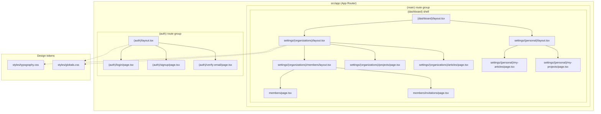
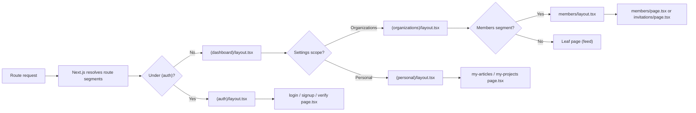
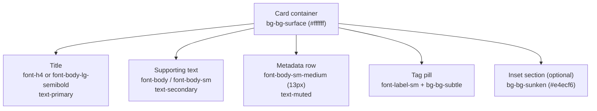
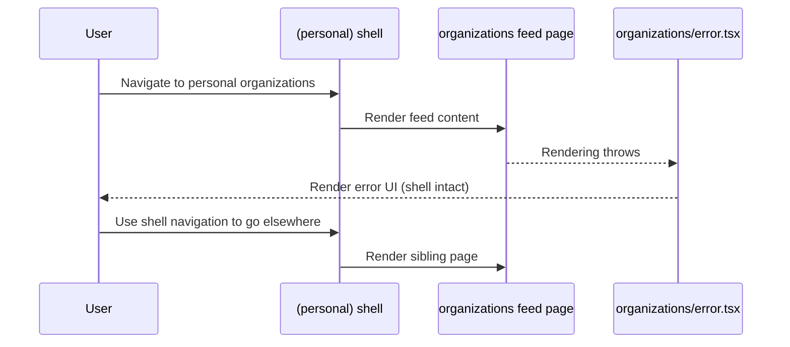

Surface, card, and layout-shell primitives in the `ozeaon-v2` design system: the reusable presentational containers and Next.js App Router layouts that wrap dashboard, settings, and auth surfaces.

## Purpose and Scope

This page documents the **layout and surface layer** of the `ozeaon-v2` design system: how content is framed on screen through:

- **Layout shells** — Next.js App Router `layout.tsx` files under `src/app/(main)/(dashboard)` and their nested settings/auth route groups.
- **Cards and surfaces** — the token-driven background and typography conventions that establish card, panel, and inset-section styling.
- **Feeds and lists** — the page-level composition of repeated card/row items inside the dashboard and settings shells.

It intentionally stays within the catalog boundary of *visual shells and containers*. Related topics are covered by sibling pages:

- For the type scale and color tokens used by cards and shells, see **Typography & Color System**.
- For buttons, inputs, badges, and other interactive controls placed *inside* these shells, see the interactive component pages in the design-system section.
- For data loading, caching, and rendering semantics of the route groups documented here, see the SSR / rendering pages.
- For deployment and build configuration referenced by the layout files, see **Deployment & Operations**.

## Overview

`ozeaon-v2` is a Next.js App Router application. Its presentation layer is organized so that **structure lives in `layout.tsx` files and visual styling lives in design tokens**, rather than being duplicated across pages. This page explains how those two halves combine to produce cards, feeds, and the layout shells that host them.

The system has three cooperating abstractions:

| Abstraction | Where it lives | Responsibility |
| --- | --- | --- |
| Route-group layout shells | `src/app/**/layout.tsx` | Persistent chrome around page content (dashboard, settings, auth). |
| Surface / card styling | `src/styles/globals.css` + `src/styles/typography.css` | Backgrounds, borders, radii, elevation, and the type scale that titles and metadata inside cards use. |
| Page composition (feeds) | `src/app/**/page.tsx` | Repeats card rows for lists such as members, invitations, articles, and projects. |

### Key concepts and terminology

- **Surface** — an opaque background layer that visually separates content from the page background. In this system the canonical card surface is `bg-bg-surface` (`#ffffff`) sitting on a colder page background.
- **Layout shell** — a `layout.tsx` that persists across navigations within its route segment, holding navigation, padding, and shared framing.
- **Route group** — a parenthesized directory such as `(main)`, `(dashboard)`, `(organizations)`, or `(personal)` that groups routes for **layout sharing** without appearing in the URL path. This is what makes a single shell apply to many sibling pages.
- **Feed** — a vertically stacked, repeated sequence of cards/rows rendered by a page for a collection (members, invitations, articles, projects).

### Why this design

Two forces drive the structure:

1. **Shells should not re-render per route.** By placing chrome in `layout.tsx`, navigation between sibling settings pages keeps the surrounding frame mounted, so only the inner page swaps. This is the App Router mechanism the directory structure is deliberately built around — the `(dashboard)` and nested `(organizations)` / `(personal)` groups exist purely to layer these shells.
2. **Cards should not invent their own colors.** The design-system rule below forbids raw Tailwind color/size utilities, forcing every card, panel, and feed row onto the same shared tokens. That is what keeps a card in *settings → members* identical to a card in *my-articles*.

## Architecture

The diagram below maps the real directory structure observed in the repository: the App Router route groups, their layout shells, and the token layer that styles everything inside them.



**Reading the diagram:**

- The solid edges are the **real nesting hierarchy** of the App Router. `(dashboard)/layout.tsx` wraps every settings route because those routes live beneath it. `settings/(organizations)/layout.tsx` and `settings/(personal)/layout.tsx` are *sibling shells* that fork the settings area into organization-scoped and user-scoped surfaces.
- The **feeds** are the leaf `page.tsx` files: `members/page.tsx`, `members/invitations/page.tsx`, `projects/page.tsx`, `articles/page.tsx`, `my-articles/page.tsx`, `my-projects/page.tsx`. Each renders a collection of cards inside the shell above it.
- The **dotted edges** represent styling dependency, not code structure: shells and the cards within them consume the token files `styles/typography.css` and `styles/globals.css` rather than raw utility values.
- The `(auth)` shell is deliberately separate from `(dashboard)`: authentication screens should not inherit the dashboard chrome, so they get their own minimal `layout.tsx` wrapping `login`, `signup`, and `verify-email`.

## Layout Shells

### The `(dashboard)` shell

`src/app/(main)/(dashboard)/layout.tsx` is the outermost persistent frame for authenticated, application-facing routes. Everything under the dashboard — including settings — is rendered as its `children`. Its central design responsibility is to keep the surrounding chrome (navigation, page frame, background) mounted while inner segments swap.

Because this file is a Next.js layout, it is **not re-executed on client-side navigation between its children**. That property is the entire reason the settings area was split into route groups instead of independent pages: the dashboard frame stays mounted, and only the leaf page (e.g. the members feed) is re-rendered.

### Sibling settings shells: `(organizations)` vs `(personal)`

Settings content is split by *ownership scope*, and the two scopes get **different shells**:

- `src/app/(main)/(dashboard)/settings/(organizations)/layout.tsx` — wraps organization-scoped management surfaces (members, invitations, projects, organization articles).
- `src/app/(main)/(dashboard)/settings/(personal)/layout.tsx` — wraps user-scoped surfaces (my-articles, my-projects, personal invitations/organizations).

This split exists because the two areas present different navigation and different context (an organization context vs. the signed-in user). Putting them behind separate `layout.tsx` files means each can render its own sub-navigation without any page-level branching.

### Nested shells: `members`

The members area adds a deeper shell at `src/app/(main)/(dashboard)/settings/(organizations)/members/layout.tsx`. This shell wraps the member list (`members/page.tsx`) and the pending-invitations feed (`members/invitations/page.tsx`), plus the related requests surface. The nesting demonstrates that shells compose: a members tab-bar lives in the `members` layout, inside the organizations layout, inside the dashboard layout.

### The `(auth)` shell

`src/app/(auth)/layout.tsx` wraps the unauthenticated screens listed in the repository: `login/page.tsx`, `signup/page.tsx`, `forgot-password/page.tsx`, `reset-password/page.tsx`, and `verify-email/page.tsx`. It is intentionally a **flat** shell with no dashboard chrome, since these routes must render before a session exists.



The flow diagram makes explicit a property that is easy to miss when reading files one at a time: **shell selection is determined entirely by directory position, not by runtime conditionals.** There is no `if (isOrganization)` branch choosing a shell — the route group does it.

## Cards & Surfaces

Cards in `ozeaon-v2` are **not a bespoke component with a hard-coded palette**; they are a token contract. The design-system documentation states the governing rule directly:

> ⚠️ Never use raw Tailwind size or color utilities. Use design system tokens from `src/styles/typography.css` and `src/styles/globals.css`.

The practical consequence for a card is that its surface, its title, and its metadata are each pinned to a named token rather than a literal value. The tokens below are the ones a card/panel author selects from.

### Surface tokens (card backgrounds)

| Class | Value | Use for |
| --- | --- | --- |
| `bg-bg-surface` | `#ffffff` | Cards, panels |
| `bg-bg-cold` | `#f7f8fa` | Default button bg |
| `bg-bg-neutral` | `#f7f8fa` | Input backgrounds |
| `bg-bg-subtle` | `#eff3fc` | Tag pills, button hover states |
| `bg-bg-sunken` | `#e4ecf6` | Inset sections |
| `bg-lavender-mist` | `#f9f4ff` | Soft accent areas |

> Source: [design-system.md](https://github.com/ozeaon/ozeaon-v2/blob/0a4f1a95824db87782f1221a4108019d174df3d9/docs/design-system.md#L24-L31)

The layering intent is visible in the table itself: a card is `bg-bg-surface` (`#ffffff`) — the brightest layer — placed on top of a colder page background (`bg-bg-cold` / `bg-bg-neutral`, `#f7f8fa`). Anything *inside* a card that needs to recede (an inset section, a metadata strip) uses a **darker** token, `bg-bg-sunken` (`#e4ecf6`), so nesting reads as depth rather than as a second, competing card. `bg-bg-subtle` (`#eff3fc`) is reserved for the small, high-frequency "pill" shapes — tag pills and hover states — where a full card surface would be too heavy.

### Card typography tokens

Card titles and their supporting text are drawn from a fixed type scale rather than ad-hoc sizes:

| Utility | Size | Weight | Use for |
| --- | --- | --- | --- |
| `font-h1` / `font-h2` / `font-h3` / `font-h4` | 32/24/18/15px | 700/700/700/500 | Page / section / sub / **card titles** |
| `font-body-lg` / `font-body` / `font-body-sm` | 16/14/13px | 400 | Lead / body / secondary text |
| `font-body-semibold` / `font-body-medium` | 14px | 600/500 | Prominent / emphasized body |
| `font-body-sm-semibold` / `font-body-sm-medium` | 13px | 600/500 | Compact prominent / emphasized metadata |
| `font-body-lg-semibold` | 16px | 600 | **Large card titles** |
| `font-label` / `font-label-medium` / `font-label-sm` | 12/12/11px | 600/500/500 | Labels / soft labels / badge text |
| `font-caption` | 11px | 400 | Captions |

> Source: [design-system.md](https://github.com/ozeaon/ozeaon-v2/blob/0a4f1a95824db87782f1221a4108019d174df3d9/docs/design-system.md#L6-L18)

Two entries are card-specific and worth calling out:

- **`font-h4` (15px / 500) is the default card title.** It is the smallest heading in the scale — a deliberate choice, since a dense feed of cards must not compete with the page-level `font-h1`/`font-h2` headings rendered by the shell.
- **`font-body-lg-semibold` (16px / 600) exists specifically for "Large card titles."** The existence of a *second* card-title token signals that the system supports at least two card weights: a compact feed card (`font-h4`) and a prominent feature/hero card (`font-body-lg-semibold`).

Above the title, `font-body-sm-medium`/`font-body-sm-semibold` (13px) covers the compact metadata line common in feed rows (timestamps, roles, status), and `font-label-sm` (11px / 500) covers badge text — matching `bg-bg-subtle` as the badge/pill background token.

### Text-color ramp for card content

| Token | Value | Role |
| --- | --- | --- |
| `text-primary` | `#1c2b3a` | Card title / primary content |
| `text-secondary` | `#677888` | Supporting text |
| `text-muted` | `#8898a9` | De-emphasized metadata |
| `text-subtle` | `#94a6b2` | Lowest-emphasis text |
| `text-placeholder` | `#a8bac8` | Placeholder text in inputs |

> Source: [design-system.md](https://github.com/ozeaon/ozeaon-v2/blob/0a4f1a95824db87782f1221a4108019d174df3d9/docs/design-system.md#L20)

This five-step ramp is what makes a card's visual hierarchy possible without borders: `text-primary` for the title, `text-secondary` for the descriptive line, and `text-muted`/`text-subtle` for metadata. Because all five steps are cool-toned greys/blues rather than pure black-to-grey, a card built from them stays consistent with the `#f7f8fa`/`#eff3fc` background family.

### Font families

- `--font-sans` → **Manrope** — all non-mono text (body, headings, buttons, labels), including all card text.
- `--font-mono` → **DM Mono** — code and filled inputs, via `font-mono` (13px) and `font-mono-sm` (11px).

> Source: [design-system.md](https://github.com/ozeaon/ozeaon-v2/blob/0a4f1a95824db87782f1221a4108019d174df3d9/docs/design-system.md#L33-L36)

### Composing a card

Combining the tables above yields the canonical card recipe used throughout the feeds:



Because each element resolves to a named token, the **card is reproducible from tokens alone** — there is no separate card component API to learn. A developer composing a new feed row selects `bg-bg-surface` for the container, `font-h4` + `text-primary` for the title, and `font-body-sm-medium` + `text-muted` for the metadata, and the result is automatically consistent with every existing card in the system.

## Feeds & Page Composition

A **feed** in this system is a leaf `page.tsx` that renders a repeated sequence of cards inside its enclosing shell. The repository contains several such feeds, and their names reveal a consistent pattern of *scope + subject*:

| Feed page | Shell hosting it | Subject |
| --- | --- | --- |
| `settings/(organizations)/members/page.tsx` | `members/layout.tsx` → `(organizations)/layout.tsx` → `(dashboard)/layout.tsx` | Organization members |
| `settings/(organizations)/members/invitations/page.tsx` | `members/layout.tsx` (same shell as members) | Pending invitations |
| `settings/(organizations)/projects/page.tsx` | `(organizations)/layout.tsx` | Organization projects |
| `settings/(organizations)/articles/page.tsx` | `(organizations)/layout.tsx` | Organization articles |
| `settings/(personal)/my-articles/page.tsx` | `(personal)/layout.tsx` | Current user's articles |
| `settings/(personal)/my-projects/page.tsx` | `(personal)/layout.tsx` | Current user's projects |
| `settings/(personal)/organizations/invitations/page.tsx` | `(personal)/layout.tsx` | Invitations addressed to the user |

Two structural observations follow directly from this table:

1. **Members and invitations share a shell.** Because `members/invitations/page.tsx` nests under `members/layout.tsx`, the member list and the invitations feed render inside the *same* frame with the same tab/navigation context. Switching between "members" and "invitations" is an inner-page swap, not a shell reload — exactly the behaviour the route-group layout mechanism is designed to produce.
2. **`my-*` pages are separated by scope, not by subject.** `my-articles` and the organization's `articles` cover the same *subject* but live in different route groups under different shells, because they answer different questions ("my content" vs. "our content") and need different surrounding navigation.

### The `(personal)` error boundary

`src/app/(main)/(dashboard)/settings/(personal)/organizations/error.tsx` is a Next.js **error boundary** co-located with the personal organizations feed. Its presence is significant for feed design: a Next.js error boundary catches errors thrown while rendering its sibling route segment *including the pages nested below it*, so a failing data fetch in the organizations feed degrades to this component **while the `(personal)` shell above it stays mounted and usable**. The navigation the user needs in order to leave the broken page is therefore never lost.



This is the concrete payoff of the layering shown in the architecture diagram: because error UI is placed *below* the shell in the tree, a feed failure is always a **partial** failure. For the data-fetching, caching, and rendering semantics behind these pages, see the SSR / rendering pages.

### Feed layout rules

Applying the card and shell boundaries together gives the layout rules a feed author follows:

- **The page does not render chrome.** Padding, max-width, background, and navigation belong to the shell(s) above; a feed page renders only the collection.
- **The page does not set its own colors.** Every card in the feed uses `bg-bg-surface` and the type-scale tokens; there is no per-page palette.
- **Repeated rows are uniform.** Because titles and metadata come from `font-h4`/`font-body-lg-semibold` and `font-body-sm-medium` respectively, every row in a feed shares baseline rhythm regardless of which feature added the row.
- **Empty/loading/error states are framed by the shell.** A feed that has nothing to show still renders inside the mounted shell, so the shell's navigation remains available.

## Usage Examples

### Reading the design-system rule before composing a card

The single most important snippet for anyone building a card or shell is the rule at the top of the design-system document, because it defines what a card *is* in this codebase:

```markdown
⚠️ Never use raw Tailwind size or color utilities. Use design system tokens from `src/styles/typography.css` and
`src/styles/globals.css`.
```

> Source: [design-system.md](https://github.com/ozeaon/ozeaon-v2/blob/0a4f1a95824db87782f1221a4108019d174df3d9/docs/design-system.md#L3-L4)

**Why this matters:** it converts "make a card" from a design decision into a *lookup*. A new card cannot drift from existing cards, because there is no permitted way to write `bg-white` or `text-[15px]` — the only legal spellings are `bg-bg-surface`, `font-h4`, `text-primary`, and so on. This is enforced as an architectural constraint in the same family as the ESLint rule files present at the repository root (`eslint.rules.base.mjs`, `eslint.config.mjs`).

### Picking a card surface

```text
| Class              | Value     | Use for                        |
| ------------------ | --------- | ------------------------------- |
| `bg-bg-surface`    | `#ffffff` | Cards, panels                  |
| `bg-bg-cold`       | `#f7f8fa` | Default button bg              |
| `bg-bg-neutral`    | `#f7f8fa` | Input backgrounds              |
| `bg-bg-subtle`     | `#eff3fc` | Tag pills, button hover states |
| `bg-bg-sunken`     | `#e4ecf6` | Inset sections                 |
| `bg-lavender-mist` | `#f9f4ff` | Soft accent areas              |
```

> Source: [design-system.md](https://github.com/ozeaon/ozeaon-v2/blob/0a4f1a95824db87782f1221a4108019d174df3d9/docs/design-system.md#L24-L31)

The "Use for" column is the contract: a card body uses `bg-bg-surface`; an inset block *within* a card uses `bg-bg-sunken`; a tag pill inside the card's metadata row uses `bg-bg-subtle`. Choosing the wrong row is the most common source of layout inconsistency, precisely because all six values are legal classes — the table, not the compiler, is the guardrail.

### Choosing a card title token

```text
| `font-h1` / `font-h2` / `font-h3` / `font-h4`        | 32/24/18/15px | 700/700/700/500 | Page / section / sub / card titles      |
...
| `font-body-lg-semibold`                              | 16px          | 600             | Large card titles                       |
```

> Source: [design-system.md](https://github.com/ozeaon/ozeaon-v2/blob/0a4f1a95824db87782f1221a4108019d174df3d9/docs/design-system.md#L11-L15)

A feed row title uses `font-h4` (15px/500). A single prominent card on a page uses `font-body-lg-semibold` (16px/600). Both are "card titles," so the distinction is *intentional emphasis within a card layer* — the larger token exists so a hero card can stand out in a page that also contains compact feed cards, without escalating to a page-level heading.

### Pairing title color with title size

```text
**Text colors**: `text-primary` (#1c2b3a) · `text-secondary` (#677888) · `text-muted` (#8898a9) · `text-subtle` (#94a6b2) · `text-placeholder` (#a8bac8)
```

> Source: [design-system.md](https://github.com/ozeaon/ozeaon-v2/blob/0a4f1a95824db87782f1221a4108019d174df3d9/docs/design-system.md#L20)

The ramp is used **positionally** inside a card: `text-primary` for the title, `text-secondary` for the supporting line, `text-muted`/`text-subtle` for metadata. Because every step is available and every step is a cool grey-blue, a card author never needs a border or divider to separate title from metadata — the color step alone does the work.

## Configuration Options

There is no runtime configuration object for cards and shells. Their "configuration" is the token set, and the options are:

| Option (token) | Type | Value / Default | Applies to |
| --- | --- | --- | --- |
| `bg-bg-surface` | background token | `#ffffff` | Card and panel containers |
| `bg-bg-cold` / `bg-bg-neutral` | background token | `#f7f8fa` | Page/shell background, button bg, inputs |
| `bg-bg-subtle` | background token | `#eff3fc` | Tag pills, hover states |
| `bg-bg-sunken` | background token | `#e4ecf6` | Inset sections within cards |
| `bg-lavender-mist` | background token | `#f9f4ff` | Soft accent areas |
| `font-h4` | typography token | 15px / 500 | Default card title |
| `font-body-lg-semibold` | typography token | 16px / 600 | Large (hero) card title |
| `font-body-sm-medium` / `font-body-sm-semibold` | typography token | 13px / 500–600 | Compact metadata in feed rows |
| `font-label-sm` | typography token | 11px / 500 | Badge / pill text |
| `font-caption` | typography token | 11px / 400 | Captions |
| `font-mono` / `font-mono-sm` | typography token | 13px / 11px, DM Mono | Code and filled inputs |
| `text-primary` … `text-placeholder` | color token | `#1c2b3a` … `#a8bac8` | Text hierarchy within cards |

> Sources:
> - [design-system.md](https://github.com/ozeaon/ozeaon-v2/blob/0a4f1a95824db87782f1221a4108019d174df3d9/docs/design-system.md#L6-L18)
> - [design-system.md](https://github.com/ozeaon/ozeaon-v2/blob/0a4f1a95824db87782f1221a4108019d174df3d9/docs/design-system.md#L20-L31)

These tokens are defined in `src/styles/typography.css` and `src/styles/globals.css`. The two font families are wired through CSS variables `--font-sans` (Manrope) and `--font-mono` (DM Mono).

## API Reference

### Route-group layout shells

Layout shells expose the Next.js App Router layout contract — they receive `children` and return the framed tree. There is no custom API surface.

| Shell | Path | Wraps |
| --- | --- | --- |
| Dashboard shell | [layout.tsx](https://github.com/ozeaon/ozeaon-v2/blob/0a4f1a95824db87782f1221a4108019d174df3d9/src/app/(main)/(dashboard)/layout.tsx) | All `(dashboard)` routes, including settings |
| Organizations settings shell | [layout.tsx](https://github.com/ozeaon/ozeaon-v2/blob/0a4f1a95824db87782f1221a4108019d174df3d9/src/app/(main)/(dashboard)/settings/(organizations)/layout.tsx) | Organization members, invitations, projects, articles |
| Personal settings shell | [layout.tsx](https://github.com/ozeaon/ozeaon-v2/blob/0a4f1a95824db87782f1221a4108019d174df3d9/src/app/(main)/(dashboard)/settings/(personal)/layout.tsx) | `my-articles`, `my-projects`, personal invitations/organizations |
| Members nested shell | [layout.tsx](https://github.com/ozeaon/ozeaon-v2/blob/0a4f1a95824db87782f1221a4108019d174df3d9/src/app/(main)/(dashboard)/settings/(organizations)/members/layout.tsx) | Members list + invitations feed |
| Auth shell | [layout.tsx](https://github.com/ozeaon/ozeaon-v2/blob/0a4f1a95824db87782f1221a4108019d174df3d9/src/app/(auth)/layout.tsx) | login, signup, forgot/reset password, verify email |

### Feed pages

| Page | Path |
| --- | --- |
| Members feed | [page.tsx](https://github.com/ozeaon/ozeaon-v2/blob/0a4f1a95824db87782f1221a4108019d174df3d9/src/app/(main)/(dashboard)/settings/(organizations)/members/page.tsx) |
| Invitations feed | [page.tsx](https://github.com/ozeaon/ozeaon-v2/blob/0a4f1a95824db87782f1221a4108019d174df3d9/src/app/(main)/(dashboard)/settings/(organizations)/members/invitations/page.tsx) |
| Organization projects feed | [page.tsx](https://github.com/ozeaon/ozeaon-v2/blob/0a4f1a95824db87782f1221a4108019d174df3d9/src/app/(main)/(dashboard)/settings/(organizations)/projects/page.tsx) |
| Organization articles feed | [page.tsx](https://github.com/ozeaon/ozeaon-v2/blob/0a4f1a95824db87782f1221a4108019d174df3d9/src/app/(main)/(dashboard)/settings/(organizations)/articles/page.tsx) |
| My articles feed | [page.tsx](https://github.com/ozeaon/ozeaon-v2/blob/0a4f1a95824db87782f1221a4108019d174df3d9/src/app/(main)/(dashboard)/settings/(personal)/my-articles/page.tsx) |
| My projects feed | [page.tsx](https://github.com/ozeaon/ozeaon-v2/blob/0a4f1a95824db87782f1221a4108019d174df3d9/src/app/(main)/(dashboard)/settings/(personal)/my-projects/page.tsx) |
| Personal invitations feed | [page.tsx](https://github.com/ozeaon/ozeaon-v2/blob/0a4f1a95824db87782f1221a4108019d174df3d9/src/app/(main)/(dashboard)/settings/(personal)/organizations/invitations/page.tsx) |

### Error boundary

| Component | Path | Segment it protects |
| --- | --- | --- |
| Personal organizations error boundary | [error.tsx](https://github.com/ozeaon/ozeaon-v2/blob/0a4f1a95824db87782f1221a4108019d174df3d9/src/app/(main)/(dashboard)/settings/(personal)/organizations/error.tsx) | The personal organizations route segment and its children |

## Failure Modes, Edge Cases & Concurrency

| Concern | Behaviour | Evidence |
| --- | --- | --- |
| A feed page throws during render | Caught by the co-located `error.tsx`; the `(personal)` shell stays mounted so navigation remains usable | [error.tsx](https://github.com/ozeaon/ozeaon-v2/blob/0a4f1a95824db87782f1221a4108019d174df3d9/src/app/(main)/(dashboard)/settings/(personal)/organizations/error.tsx) |
| A card author reaches for a raw utility | Prohibited by the documented rule; the token set is the only sanctioned vocabulary | [design-system.md](https://github.com/ozeaon/ozeaon-v2/blob/0a4f1a95824db87782f1221a4108019d174df3d9/docs/design-system.md#L3-L4) |
| Two cards with different visual weight on one page | Resolved by token choice (`font-h4` vs `font-body-lg-semibold`), not by bespoke sizing | [design-system.md](https://github.com/ozeaon/ozeaon-v2/blob/0a4f1a95824db87782f1221a4108019d174df3d9/docs/design-system.md#L11-L15) |
| Nesting a block inside a card | Must use the darker `bg-bg-sunken` so depth reads correctly rather than presenting as a competing card | [design-system.md](https://github.com/ozeaon/ozeaon-v2/blob/0a4f1a95824db87782f1221a4108019d174df3d9/docs/design-system.md#L30) |
| Understanding why navigation persists across feeds | Shells persist across segment navigation by App Router design; the route-group structure is what activates it | Architecture diagram, [layout.tsx](https://github.com/ozeaon/ozeaon-v2/blob/0a4f1a95824db87782f1221a4108019d174df3d9/src/app/(main)/(dashboard)/layout.tsx) |

**Edge case — scope confusion:** `articles` (organization) and `my-articles` (personal) are near-identically named but sit in different route groups and therefore different shells. A change to one feed's framing does not propagate to the other.

## Performance & Operational Notes

- **Shell persistence reduces work.** Because `layout.tsx` files are not re-rendered on navigation between their children, moving between members and invitations (same `members/layout.tsx`) or between organization settings pages (same `(organizations)/layout.tsx`) preserves the shell and re-renders only the leaf feed.
- **Token-driven styling keeps the CSS small.** Because cards and shells only ever reference a fixed set of tokens (`bg-bg-*`, `font-*`, `text-*`), the set of generated classes is bounded by the token list rather than by the number of pages that use them.
- **Co-located error boundaries bound blast radius.** Placing `error.tsx` at the segment level means a single feed failure does not take down the surrounding shell or its siblings.
- **Font loading is centralized.** Manrope (`--font-sans`) and DM Mono (`--font-mono`) are declared once in the token files rather than per component.

For build, deployment, and environment configuration of the Next.js app that hosts these shells, see the deployment pages.

## Extension Points

| To add… | Do this | Why it stays consistent |
| --- | --- | --- |
| A new feed page | Create a `page.tsx` under the appropriate existing route group | It automatically inherits the correct shell |
| A new settings sub-area with its own chrome | Add a `layout.tsx` in a new or existing route group | The shell persists across its children by construction |
| A new card variant | Compose from existing surface + typography tokens | No new palette or size enters the system |
| A new badge/pill | `bg-bg-subtle` + `font-label-sm` | Matches the documented tag-pill convention |
| A new inset block inside a card | `bg-bg-sunken` | Preserves the depth ordering of the background family |
| Error handling for a new segment | Co-locate an `error.tsx` at that segment | Confines failures below the shell |

## Related Links

- [Typography & Color System](https://github.com/ozeaon/ozeaon-v2/blob/0a4f1a95824db87782f1221a4108019d174df3d9/8.1-typography-and-color) — the token definitions (`src/styles/typography.css`, `src/styles/globals.css`) that every card and shell consumes.
- [Design System overview](https://github.com/ozeaon/ozeaon-v2/blob/0a4f1a95824db87782f1221a4108019d174df3d9/8-design-system) — the parent section this page belongs to.
- [Design system tokens](https://github.com/ozeaon/ozeaon-v2/blob/0a4f1a95824db87782f1221a4108019d174df3d9/docs/design-system.md) — source document for the type scale, text colors, and background tokens.
- [Dashboard shell](https://github.com/ozeaon/ozeaon-v2/blob/0a4f1a95824db87782f1221a4108019d174df3d9/src/app/(main)/(dashboard)/layout.tsx) — outermost authenticated layout.
- [Organizations settings shell](https://github.com/ozeaon/ozeaon-v2/blob/0a4f1a95824db87782f1221a4108019d174df3d9/src/app/(main)/(dashboard)/settings/(organizations)/layout.tsx) — organization-scoped settings layout.
- [Personal settings shell](https://github.com/ozeaon/ozeaon-v2/blob/0a4f1a95824db87782f1221a4108019d174df3d9/src/app/(main)/(dashboard)/settings/(personal)/layout.tsx) — user-scoped settings layout.
- [Members nested shell](https://github.com/ozeaon/ozeaon-v2/blob/0a4f1a95824db87782f1221a4108019d174df3d9/src/app/(main)/(dashboard)/settings/(organizations)/members/layout.tsx) — members + invitations frame.
- [Auth shell](https://github.com/ozeaon/ozeaon-v2/blob/0a4f1a95824db87782f1221a4108019d174df3d9/src/app/(auth)/layout.tsx) — unauthenticated layout.
- [Personal organizations error boundary](https://github.com/ozeaon/ozeaon-v2/blob/0a4f1a95824db87782f1221a4108019d174df3d9/src/app/(main)/(dashboard)/settings/(personal)/organizations/error.tsx) — segment-level failure UI.
