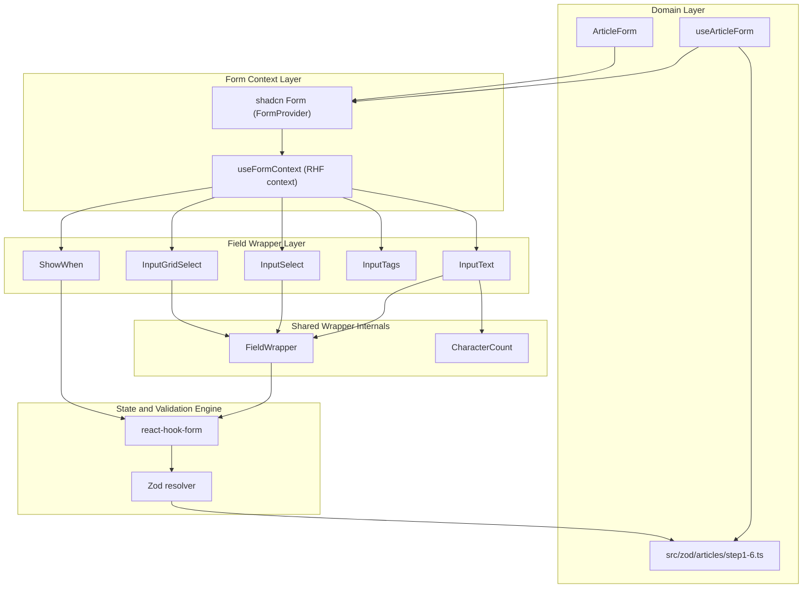
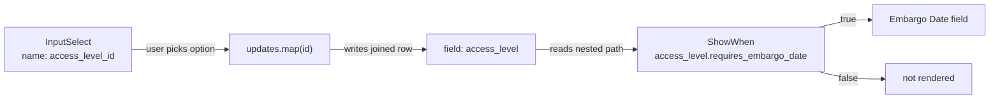
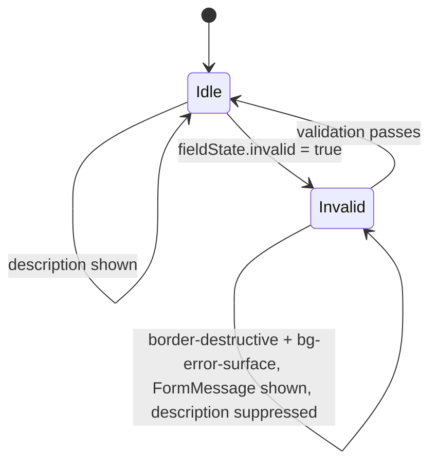
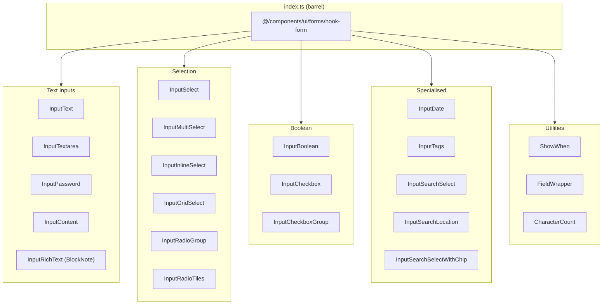
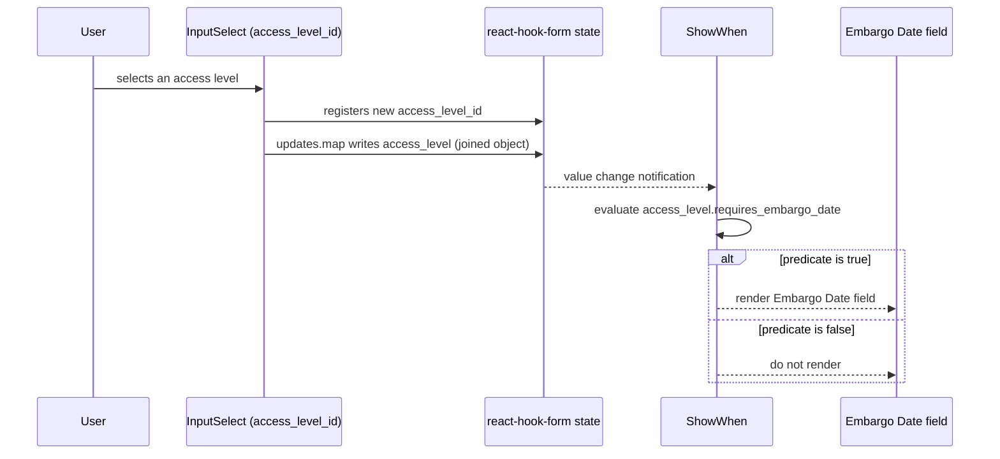
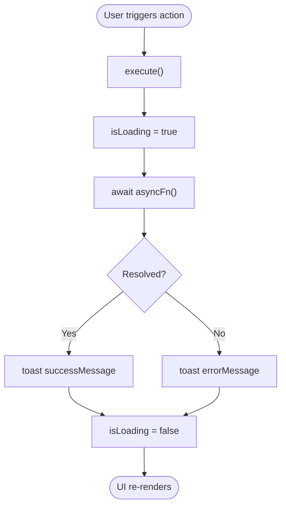
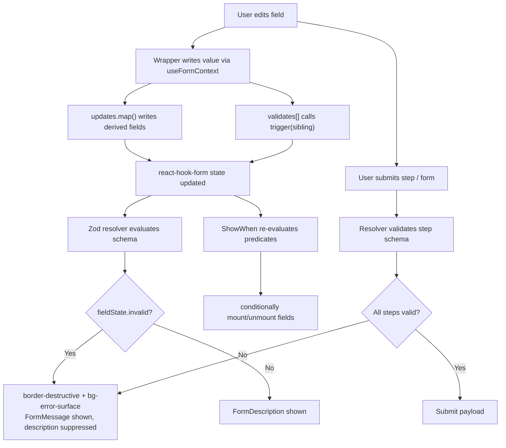

How Ozeaon wires React Hook Form into shadcn primitives: a family of `FormProvider`-connected field wrappers, cross-field derivation via `updates`/`validates`, conditional rendering with `ShowWhen`, and Zod-schema-backed multi-step domain form hooks.

## Purpose and Scope

This page documents the **form layer** of the Ozeaon design system:

- The `FormProvider` / `useFormContext` contract that every field wrapper obeys.
- The field-wrapper catalogue in `src/components/ui/forms/hook-form/` and what each wrapper does.
- The cross-field mechanisms: `updates` (write derived values into other fields), `validates` (re-trigger validation of sibling fields), and `ShowWhen` (conditional field visibility driven by form state).
- Error/description styling rules shared by all wrappers.
- Domain form hooks (`useArticleForm`, `useProjectForm`) and their Zod step schemas.
- The generic `useAsyncAction` hook used for imperative async actions that surround forms.

**Out of scope (sibling pages):** the general primitive library (`EmptyState`, `DateDisplay`, `GridLayout`, `Button`, `ConfirmDialog`) is covered by the Component Library page. Infinite feed components are covered by their own page. Server-side environment validation (`src/config/env.ts`) is an operational concern covered by the deployment docs. This page covers only **client-side form state, field composition, and validation flow**.

## Overview

Ozeaon's forms are built on three cooperating layers:

| Layer | Technology | Responsibility |
| --- | --- | --- |
| State engine | `react-hook-form` (`^7.88.0`) | Holds form values, dirty/touched state, field registration, validation triggering |
| Schema validation | Zod (`4.6.5`) + a resolver (`5.9.1`) | Declarative, typed validation rules per step / per form |
| Presentation | shadcn `Form` primitives + `src/components/ui/forms/hook-form/*` | Renders labeled, described, error-aware fields that read/write the nearest form context |

The design intent is **radical consistency**: a developer never hand-rolls a labeled input. Instead they render `<InputText name="title" label="Title" />` and get, for free:

- automatic registration with `react-hook-form` via `useFormContext`,
- a `FormLabel`, optional `FormDescription`, and `FormMessage` wired to `fieldState`,
- destructive border + error-surface background when the field is invalid,
- number coercion for `type="number"`, and
- hooks for cross-field derivation.

Because none of the wrappers accept a `control` prop and all of them call `useFormContext` internally, they can be dropped anywhere beneath a `<Form>` (which wraps `FormProvider`) without prop drilling. That is the single most important architectural constraint of this subsystem.

**Import** — all wrappers are re-exported from one barrel:

```typescript
import {
  InputText, InputTextarea, InputSelect, InputMultiSelect,
  InputGridSelect, InputTags, InputBoolean, InputCheckbox,
  InputDate, InputRichText, ShowWhen,
} from "@/components/ui/forms/hook-form";
```

> Source: [hook-form-components.md](https://github.com/ozeaon/ozeaon-v2/blob/0a4f1a95824db87782f1221a4108019d174df3d9/docs/hook-form-components.md#L7-L14)

## Architecture

The wrappers are thin, context-consuming adapters. The diagram below shows how a form component, the shadcn `Form` provider, the wrappers, `react-hook-form` state, and the Zod resolver relate.



Each wrapper's only job is to translate a `name` path into the RHF context, render the appropriate Radix/shadcn primitive, and let `FieldWrapper` apply the uniform label/description/error treatment. `ShowWhen` is the one member that renders **nothing** — it reads values and gates its children. The domain hooks supply the resolver and the step-level Zod schemas; the wrappers stay entirely schema-agnostic.

## The `FormProvider` Contract

Every wrapper in `src/components/ui/forms/hook-form/` behaves identically with respect to context:

- It consumes the **nearest** `FormProvider` context (`useFormContext`).
- It **never** accepts a `control` prop.
- It **must** be rendered inside a shadcn `<Form>`, which itself wraps `FormProvider`.

> All components consume the nearest `FormProvider` context — they must be rendered inside a shadcn `<Form>` (which wraps `FormProvider`). None accept a `control` prop; they call `useFormContext` internally.
>
> Source: [hook-form-components.md](https://github.com/ozeaon/ozeaon-v2/blob/0a4f1a95824db87782f1221a4108019d174df3d9/docs/hook-form-components.md#L5)

### Why this matters (design intent)

The `control`-prop pattern forces every intermediate component to forward the RHF control object, which pollutes props, complicates memoization, and makes conditional composition awkward. By centralizing on context:

1. **Composition is positional** — a wrapper can be moved, wrapped in layout components, or conditionally rendered without threading props.
2. **`ShowWhen` becomes possible** — a wrapper that renders its children only when form values satisfy a predicate requires that children be *values*, not pre-bound elements. If fields needed a `control` prop, `ShowWhen` could not gate them without also producing the control.
3. **Barrel exports stay uniform** — every wrapper shares the same minimal prop surface (`name`, `label`, `description`, plus primitive-specific props), so a developer can swap `InputText` for `InputTextarea` without touching anything else.

### Shared cross-field mechanisms

Three mechanisms are shared across the wrapper family and form the heart of Ozeaon's "validation patterns":

| Mechanism | Available on | Purpose |
| --- | --- | --- |
| `updates` | `InputText`, `InputTextarea`, `InputSelect`, `InputBoolean` | Write derived values into **other** fields when this field changes |
| `validates` | `InputText`, `InputBoolean` | Re-trigger validation of sibling fields on blur/change |
| `ShowWhen` | standalone wrapper | Conditionally render children based on form values |

## Cross-Field Derivation with `updates`

The `updates` prop lets a field write derived values into **other** fields whenever its value changes. Available on `InputText`, `InputTextarea`, `InputSelect`, `InputBoolean`.

```typescript
type FieldUpdate<TSourceValue = string> = {
  name: string;        // target field path (dot notation ok)
  map: (value: TSourceValue) => unknown; // transform fn
};
```

> Source: [hook-form-components.md](https://github.com/ozeaon/ozeaon-v2/blob/0a4f1a95824db87782f1221a4108019d174df3d9/docs/hook-form-components.md#L24-L29)

### Design intent: why `name` is typed as `string`

> **Why not generic on `TFormValues`?** Making `FieldUpdate` depend on the form's type causes bidirectional inference to over-constrain `TFormValues` when both `name` and `updates` are on the same component. The `name` field is intentionally typed as `string`.
>
> Source: [hook-form-components.md](https://github.com/ozeaon/ozeaon-v2/blob/0a4f1a95824db87782f1221a4108019d174df3d9/docs/hook-form-components.md#L31)

This is a deliberate trade-off: full type-safety on the `updates[].name` path is sacrificed to keep the wrapper's `name` prop typeable. If `FieldUpdate` were generic over the form's value type, TypeScript would have to infer the form type from *two* independent positions on the same JSX element (the `name` prop and the `updates` prop), and inference would collapse. Typing the target path as a plain `string` breaks that bidirectional constraint while keeping the wrapper ergonomic.

### Pattern 1 — auto-generating a slug from a title

```tsx
// ArticleForm.tsx:313
<InputText
  name="title"
  label="Title"
  updates={[{
    name: "slug",
    map: (val: string) => slugify(val?.substring(0, 50) ?? ""),
  }]}
/>
```

> Source: [hook-form-components.md](https://github.com/ozeaon/ozeaon-v2/blob/0a4f1a95824db87782f1221a4108019d174df3d9/docs/hook-form-components.md#L37-L44)

The `map` function is pure and receives only the source field's new value. The `?? ""` fallback guards against `undefined` during initial render, and `substring(0, 50)` bounds slug length before `slugify` runs.

### Pattern 2 — syncing a joined object alongside its foreign key

```tsx
// ArticleForm.tsx:302
<InputSelect
  label="Article Type"
  name="article_type_id"
  options={articleTypeOptions}
  updates={[{
    name: "article_type",
    map: (id) => articleTypes.find((t) => t.id === id),
  }]}
/>
```

> Source: [hook-form-components.md](https://github.com/ozeaon/ozeaon-v2/blob/0a4f1a95824db87782f1221a4108019d174df3d9/docs/hook-form-components.md#L47-L55)

> The second pattern is common throughout the form: a select stores the FK id (e.g. `access_level_id`) but also keeps the full joined object (`access_level`) in sync so that `ShowWhen` can read nested properties like `access_level.requires_embargo_date`.
>
> Source: [hook-form-components.md](https://github.com/ozeaon/ozeaon-v2/blob/0a4f1a95824db87782f1221a4108019d174df3d9/docs/hook-form-components.md#L58)

**This is the key architectural idea of the `updates` mechanism:** a `<select>` stores a scalar ID, but conditional logic often needs *properties of the selected row*. Rather than re-deriving those properties at render time (which would require every consumer to have the option list in scope), the select mirrors the full joined object into a second field path. `ShowWhen` then evaluates nested paths uniformly.



## Cross-Field Re-validation with `validates`

Available on `InputText` and `InputBoolean`. It fires `control.trigger(fieldName)` on blur/change for each listed field name — useful when one field's validity depends on another.

```tsx
// ArticleForm.tsx:572 — re-validate funding_source_id when funding_details changes
<InputText
  name="funding_details"
  label="Funding Source Details"
  validates={["funding_source_id"]}
/>
```

> Source: [hook-form-components.md](https://github.com/ozeaon/ozeaon-v2/blob/0a4f1a95824db87782f1221a4108019d174df3d9/docs/hook-form-components.md#L66-L73)

### Design intent

React Hook Form validates a field when *that* field changes. But some rules are cross-field: "`funding_source_id` is required if `funding_details` is filled." When the user types into `funding_details`, `funding_source_id` will not re-validate on its own, leaving a stale error (or a missing one). `validates` is a declarative escape hatch: instead of writing a `useEffect` that watches `funding_details` and calls `trigger("funding_source_id")`, the dependency is declared inline on the field that owns the trigger.

Note the direction of the dependency: `validates` lists **targets to re-check**, not sources to watch. The field that *changes* declares the fields that *must be re-validated*.

## Error State & Description Styling

All wrappers share a uniform visual contract for validity:

- `border-destructive` + `bg-error-surface` classes are applied when `fieldState.invalid` is true.
- The `description` text is **suppressed** when there is an active error (`fieldState.error`) — the `FormMessage` takes its place.

> All components apply `border-destructive bg-error-surface` classes when `fieldState.invalid` is true. The `description` text is suppressed when there is an active error (`fieldState.error`) — the `FormMessage` takes its place.
>
> Source: [hook-form-components.md](https://github.com/ozeaon/ozeaon-v2/blob/0a4f1a95824db87782f1221a4108019d174df3d9/docs/hook-form-components.md#L79)

### Design intent

Showing both a static hint and a validation error simultaneously produces contradictory UI and forces the user to read two lines to find the actionable one. Suppressing `description` while an error is present means the field occupies the same vertical space and shows exactly one message — the one that matters. This also makes field height stable across valid/invalid states, avoiding layout shift.



## Field Wrapper Catalogue

The wrappers live in `src/components/ui/forms/hook-form/`. The barrel `index.ts` re-exports them. The full directory listing is the authoritative inventory:



| Component | Use for |
| --- | --- |
| `InputText` / `InputTextarea` | Text input / multi-line |
| `InputPassword` | Password with show/hide |
| `InputDate` | Date picker |
| `InputSelect` / `InputMultiSelect` | Single / multi select |
| `InputCheckbox` / `InputCheckboxGroup` / `InputRadioGroup` | Checkbox / group / radio |
| `InputBoolean` | Toggle switch |
| `InputGridSelect` | Card-grid single/multi select |
| `InputTags` | Free-form tags |
| `InputSearchSelect` | Async search single select |
| `InputRichText` | BlockNote rich text editor |
| `OtpInput` | OTP input — standalone, not RHF-connected |

> Source: [component-library.md](https://github.com/ozeaon/ozeaon-v2/blob/0a4f1a95824db87782f1221a4108019d174df3d9/docs/component-library.md#L66-L78)

### Notable exception: `OtpInput`

`OtpInput` is the **only** entry in the catalogue documented as *standalone and not RHF-connected*. It exists in `src/components/ui/forms/` (referenced in the component-library table) rather than following the `useFormContext` contract, because OTP entry typically needs imperative control over focus advancement and paste handling across N boxes and is usually consumed as a controlled component by its host. Treat it as the exception that proves the `FormProvider` rule.

### Utility components

- **`FieldWrapper`** — the shared layout/state primitive. Every field wrapper renders through it to get the uniform label/description/error anatomy. It is the concrete implementation site of the "description suppressed on error" rule.
- **`CharacterCount`** — renders the remaining-character indicator used by length-bounded fields (see `InputTextarea`).

## Field Deep Dives

### `InputText`

Single-line text input. Also handles `type="number"` — converts `valueAsNumber` and passes `undefined` (not `NaN`) when empty.

```typescript
type Props = {
  name: string;
  label?: string;           // if omitted, uses name; rendered invisible (preserves layout)
  description?: string;
  className?: string;
  containerClassName?: string;
  updates?: FieldUpdate[];
  validates?: string[];     // field names to re-trigger on blur
  labelProps?: FieldLabelProps;
  messageProps?: FieldMessageProps;
  descriptionProps?: FieldDescriptionProps;
} & InputHTMLAttributes<HTMLInputElement>;
```

> Source: [hook-form-components.md](https://github.com/ozeaon/ozeaon-v2/blob/0a4f1a95824db87782f1221a4108019d174df3d9/docs/hook-form-components.md#L89-L102)

Three details worth calling out:

1. **`label` is optional and falls back to `name`.** When omitted, the label is still rendered but made *invisible* so vertical rhythm is preserved. This lets a form show an unlabeled field without breaking alignment with neighbors.
2. **`valueAsNumber` handling.** For `type="number"` inputs, RHF's `valueAsNumber` yields `NaN` for an empty input. The wrapper normalizes empty to `undefined`, which keeps Zod's `.optional()` / `.nullable()` semantics honest and avoids `NaN` leaking into payloads.
3. **Full native prop passthrough.** The `& InputHTMLAttributes<HTMLInputElement>` intersection means `placeholder`, `readOnly`, `maxLength`, etc. work without wrapper-specific props.

**Usage:**

```tsx
<InputText name="title" label="Title" placeholder="Enter article title" />

// Read-only system field
<InputText
  name="attribution_text"
  label="Attribution Text (system generated)"
  className="pointer-events-none opacity-50"
  readOnly
/>
```

> Source: [hook-form-components.md](https://github.com/ozeaon/ozeaon-v2/blob/0a4f1a95824db87782f1221a4108019d174df3d9/docs/hook-form-components.md#L106-L114)

The read-only pattern combines the native `readOnly` attribute with `pointer-events-none opacity-50` so the field is visually inert and cannot receive focus clicks, while still being *registered* with RHF and therefore included in the submitted payload. This is how "system generated" fields (like an attribution string derived server-side) participate in the form without being editable.

### `InputTextarea`

Multi-line textarea with an optional character counter. The counter only appears when ≤ 50 characters remain (amber) or at the limit (red) — unless `showRemaining` is set.

```typescript
type Props = {
  name: string;
  label: string;
  description?: string;
  maxLength?: number;       // default: 3000
  showRemaining?: boolean;  // always show remaining count
  resize?: boolean;         // default: true
  updates?: FieldUpdate[];
  // + standard TextareaHTMLAttributes
};
```

> Source: [hook-form-components.md](https://github.com/ozeaon/ozeaon-v2/blob/0a4f1a95824db87782f1221a4108019d174df3d9/docs/hook-form-components.md#L124-L133)

Note the contrast with `InputText`: here `label` is **required**, because a multi-line free-text field without a label is almost always a mistake.

The progressive-disclosure counter is a deliberate UX choice: an always-visible "3000 remaining" is noise for most writers, but a counter that appears at 50-remaining gives a timely nudge exactly when the constraint becomes relevant.

**Usage:**

```tsx
<InputTextarea
  name="summary"
  label="Summary"
  rows={6}
  resize={false}
  placeholder="Write a short summary..."
  description="80–200 characters. Shown in article cards."
/>
```

> Source: [hook-form-components.md](https://github.com/ozeaon/ozeaon-v2/blob/0a4f1a95824db87782f1221a4108019d174df3d9/docs/hook-form-components.md#L138-L145)

### `InputSelect`

Single-select dropdown built on Radix `Select`. The selected option's `description` field — if present — **replaces** the static `description` prop below the input, giving contextual per-option help text.

```typescript
type SelectOption = {
  value: string;
  label: string;
  description?: string | null;
};

type Props = {
  name: string;
  label: string;
  options: SelectOption[];
  placeholder?: string;     // default: "Select an option"
  description?: string;
  updates?: FieldUpdate[];
  // + styling / label props
};
```

> Source: [hook-form-components.md](https://github.com/ozeaon/ozeaon-v2/blob/0a4f1a95824db87782f1221a4108019d174df3d9/docs/hook-form-components.md#L155-L169)

**Usage:**

```tsx
<InputSelect
  label="Access Level"
  name="access_level_id"
  options={accessLevelOptions}
  description="Controls who can read this article."
  updates={[{
    name: "access_level",
    map: (id) => accessLevels.find((t) => t.id === id),
  }]}
/>
```

> Source: [hook-form-components.md](https://github.com/ozeaon/ozeaon-v2/blob/0a4f1a95824db87782f1221a4108019d174df3d9/docs/hook-form-components.md#L174-L184)

> When the selected option has a `description`, it overrides the static `description` prop — so users see the description of what they just picked rather than a generic hint.
>
> Source: [hook-form-components.md](https://github.com/ozeaon/ozeaon-v2/blob/0a4f1a95824db87782f1221a4108019d174df3d9/docs/hook-form-components.md#L186)

This per-option description precedence is a small but important pattern: the generic `description` acts as *pre-selection* guidance, and the option's own `description` takes over once a choice is made. It removes the need for a separate "what does this option mean?" tooltip.

### `InputMultiSelect`

Multi-select with Command-palette search and grouped options. Stores an **array** of selected values and renders selected items as removable badges inline.

```typescript
type MultiSelectOption = {
  value: string;
  label: string;
  group?: string;  // group heading — options with the same group are grouped together
};

type Props = {
  name: string;
  label: string;
  options: MultiSelectOption[];
  description?: string;
  placeholder?: string;
  searchPlaceholder?: string;  // default: "Search..."
  emptyMessage?: string;       // default: "No results found."
  // + styling / label props
};
```

> Source: [hook-form-components.md](https://github.com/ozeaon/ozeaon-v2/blob/0a4f1a95824db87782f1221a4108019d174df3d9/docs/hook-form-components.md#L197-L212)

**Usage — building grouped options from a two-level category tree:**

```tsx
// Categories grouped by parent category
const categoryOptions = categories.flatMap((category) =>
  category.subcategories.map((sub) => ({
    value: sub.id,
    label: sub.name,
    group: category.name,  // becomes a CommandGroup heading
  })),
);

<InputMultiSelect
  label="Categories"
  name="subcategories"
  options={categoryOptions}
  placeholder="Select relevant categories"
/>
```

> Source: [hook-form-components.md](https://github.com/ozeaon/ozeaon-v2/blob/0a4f1a95824db87782f1221a4108019d174df3d9/docs/hook-form-components.md#L218-L231)

The `flatMap` shape is the canonical way to feed this component: the domain model is two-level (category → subcategories) but the field value is a flat array of subcategory IDs. The wrapper's flat `MultiSelectOption[]` input keeps it decoupled from any particular domain hierarchy, and the `group` string restores the visual hierarchy inside the Command palette.

### `InputGridSelect`

Card-grid multi-select. Each option renders as a card button with a circle indicator, supports optional per-option `description` text, and selected items appear as removable badges above the grid.

> Source: [hook-form-components.md](https://github.com/ozeaon/ozeaon-v2/blob/0a4f1a95824db87782f1221a4108019d174df3d9/docs/hook-form-components.md#L236-L238)

`InputGridSelect` is the "high-affordance" selection primitive: when the option set is small enough that showing all choices at once is better than a dropdown (e.g. picking article types), the grid renders every option as a tappable card. It is listed in the component-library table as supporting **single or multi** select and as the general-purpose card-grid selector. It is an RHF wrapper, so it obeys the same `name`-based context contract as every other field.

## Conditional Rendering with `ShowWhen`

`ShowWhen` is exported from the same barrel as the field wrappers but is not itself a field — it gates its children based on form values. Combined with the `updates` FK-plus-joined-object pattern, it enables conditional form sections driven purely by declared form state.



The critical consequence of `ShowWhen` **not rendering** its children (rather than hiding them with CSS): a field inside a false `ShowWhen` is unmounted, so it does not register with RHF during that render. This is what makes conditional required-ness work — an embargo date is only required when the selected access level demands it, because the field literally does not exist otherwise.

## Domain Form Hooks

Two multi-step domain hooks are built on this layer:

| Hook | Steps | Step schemas |
| --- | --- | --- |
| `useArticleForm` | 6 | `src/zod/articles/step1–6.ts` |
| `useProjectForm` | 5 | (parallel step-schema structure) |

> Domain form hooks: `useArticleForm` (6 steps, `src/zod/articles/step1–6.ts`), `useProjectForm` (5 steps).
>
> Source: [component-library.md](https://github.com/ozeaon/ozeaon-v2/blob/0a4f1a95824db87782f1221a4108019d174df3d9/docs/component-library.md#L80)

### Design intent: step-scoped schemas

Splitting validation into `step1.ts` … `step6.ts` rather than one monolithic schema is what makes a wizard usable. Each step validates only the fields it owns, so a user is never blocked by an error in a step they have not reached, and the "Next" button can validate incrementally. The single source of truth for validation lives in `src/zod/articles/`, keeping the derived TypeScript types co-located with the rules, while `useArticleForm` owns the orchestration: current step, accumulated values, per-step validation gating, and final submission.

The supporting dependencies are declared in the project manifest:

```json
"react-dom": "^19.3.0",
"react-hook-form": "^7.88.0",
"react-image-crop": "^11.1.2",
```

> Source: [package.json](https://github.com/ozeaon/ozeaon-v2/blob/0a4f1a95824db87782f1221a4108019d174df3d9/package.json#L79-L81)

The resolver in the lockfile confirms the wiring — a `@hookform/resolvers`-style package at `5.9.1` with peer support for `react-hook-form@7.88.0`, `zod@4.6.5`, `valibot`, and `ajv`:

```
version: 5.9.1(@standard-schema/spec@1.1.0)(ajv@8.20.0)(react-hook-form@7.88.0(react@19.3.0))(valibot@1.4.2(@typescript/typescript6@6.0.2))(zod@4.6.5)
```

> Source: [pnpm-lock.yaml](https://github.com/ozeaon/ozeaon-v2/blob/0a4f1a95824db87782f1221a4108019d174df3d9/pnpm-lock.yaml#L128)

## The `useAsyncAction` Hook

Forms are only half of the interaction story. Surrounding mutations (submit, follow, delete) use a separate, non-RHF hook.

**`useAsyncAction`** — replaces manual `useState + try/catch + toast`:

```typescript
const { execute: handleFollow, isLoading } = useAsyncAction(
  () => followUser(targetUserId),
  { successMessage: "Followed!", errorMessage: "Failed to follow" },
);
```

> Source: [component-library.md](https://github.com/ozeaon/ozeaon-v2/blob/0a4f1a95824db87782f1221a4108019d174df3d9/docs/component-library.md#L55-L62)

### Design intent

Without it, every imperative action repeats the same four-line boilerplate: a loading `useState`, a `try`, a success `toast`, and a `catch` that toasts an error. `useAsyncAction` collapses that into one declaration that returns an `execute` function plus the `isLoading` flag the UI needs to drive a `LoadingButton`. The design system's `LoadingButton` primitive (documented for "imperative async actions") is the intended consumer of that `isLoading` flag. Because success/error messaging is passed as configuration rather than written inline, notification copy stays consistent across the app and is trivially auditable.



## Validation Flow End-to-End

The complete lifecycle from user keystroke to submit, showing where each layer participates.



### Why validation is centralized in Zod

All validation rules live in Zod schemas (`src/zod/articles/step1–6.ts` and peers), not in the field wrappers. This keeps three concerns separable:

1. **Presentation** — the wrapper decides *how* an error looks (border, surface, message slot).
2. **Rule** — the Zod schema decides *whether* a value is an error.
3. **Orchestration** — the domain hook decides *when* a given schema runs (per step).

A wrapper never contains business validation logic. Consequently, the same schema can be used for client-side step gating, final submit validation, and (potentially) server-side re-validation, with a single source of truth in `src/zod/`.

## API Reference

### `FieldUpdate<TSourceValue>`

```typescript
type FieldUpdate<TSourceValue = string> = {
  name: string;
  map: (value: TSourceValue) => unknown;
};
```

> Source: [hook-form-components.md](https://github.com/ozeaon/ozeaon-v2/blob/0a4f1a95824db87782f1221a4108019d174df3d9/docs/hook-form-components.md#L25-L28)

**Fields:**
- `name` (**required**, `string`): Target field path to write. Dot notation is supported, so nested paths work. Intentionally not generic — see design rationale above.
- `map` (**required**, `(value: TSourceValue) => unknown`): Pure transform from the source field's new value to the value written into the target field.

**Used by:** `InputText`, `InputTextarea`, `InputSelect`, `InputBoolean`.

---

### `InputText` props

| Prop | Type | Required | Default | Description |
| --- | --- | --- | --- | --- |
| `name` | `string` | ✅ | — | Field path registered with RHF |
| `label` | `string` | ❌ | falls back to `name` | Rendered invisible when omitted to preserve layout |
| `description` | `string` | ❌ | — | Helper text; suppressed when an error is active |
| `className` | `string` | ❌ | — | Applied to the input element |
| `containerClassName` | `string` | ❌ | — | Applied to the field container |
| `updates` | `FieldUpdate[]` | ❌ | — | Derived writes into other fields |
| `validates` | `string[]` | ❌ | — | Sibling fields to re-trigger on blur/change |
| `labelProps` | `FieldLabelProps` | ❌ | — | Pass-through to the label |
| `messageProps` | `FieldMessageProps` | ❌ | — | Pass-through to `FormMessage` |
| `descriptionProps` | `FieldDescriptionProps` | ❌ | — | Pass-through to `FormDescription` |
| *(native)* | `InputHTMLAttributes<HTMLInputElement>` | ❌ | — | `type`, `placeholder`, `readOnly`, etc. |

> Source: [hook-form-components.md](https://github.com/ozeaon/ozeaon-v2/blob/0a4f1a95824db87782f1221a4108019d174df3d9/docs/hook-form-components.md#L89-L102)

**Special behavior:** with `type="number"`, the value is read as `valueAsNumber` and an empty input is passed as `undefined` rather than `NaN`.

---

### `InputTextarea` props

| Prop | Type | Required | Default | Description |
| --- | --- | --- | --- | --- |
| `name` | `string` | ✅ | — | Field path |
| `label` | `string` | ✅ | — | Label text (required, unlike `InputText`) |
| `description` | `string` | ❌ | — | Helper text |
| `maxLength` | `number` | ❌ | `3000` | Character limit |
| `showRemaining` | `boolean` | ❌ | — | Always show the remaining count |
| `resize` | `boolean` | ❌ | `true` | Allow vertical resize |
| `updates` | `FieldUpdate[]` | ❌ | — | Derived writes |
| *(native)* | `TextareaHTMLAttributes` | ❌ | — | `rows`, `placeholder`, etc. |

> Source: [hook-form-components.md](https://github.com/ozeaon/ozeaon-v2/blob/0a4f1a95824db87782f1221a4108019d174df3d9/docs/hook-form-components.md#L124-L133)

**Special behavior:** the character counter appears only when ≤ 50 chars remain (amber) or at the limit (red), unless `showRemaining` is `true`.

---

### `InputSelect` props

| Prop | Type | Required | Default | Description |
| --- | --- | --- | --- | --- |
| `name` | `string` | ✅ | — | Field path |
| `label` | `string` | ✅ | — | Label text |
| `options` | `SelectOption[]` | ✅ | — | `{ value, label, description? }` |
| `placeholder` | `string` | ❌ | `"Select an option"` | Trigger placeholder |
| `description` | `string` | ❌ | — | Static hint; overridden by the selected option's `description` |
| `updates` | `FieldUpdate[]` | ❌ | — | Derived writes |

> Source: [hook-form-components.md](https://github.com/ozeaon/ozeaon-v2/blob/0a4f1a95824db87782f1221a4108019d174df3d9/docs/hook-form-components.md#L155-L169)

---

### `InputMultiSelect` props

| Prop | Type | Required | Default | Description |
| --- | --- | --- | --- | --- |
| `name` | `string` | ✅ | — | Field path (stores an array) |
| `label` | `string` | ✅ | — | Label text |
| `options` | `MultiSelectOption[]` | ✅ | — | `{ value, label, group? }` |
| `description` | `string` | ❌ | — | Helper text |
| `placeholder` | `string` | ❌ | — | Trigger placeholder |
| `searchPlaceholder` | `string` | ❌ | `"Search..."` | Command palette search placeholder |
| `emptyMessage` | `string` | ❌ | `"No results found."` | Shown when the search yields nothing |

> Source: [hook-form-components.md](https://github.com/ozeaon/ozeaon-v2/blob/0a4f1a95824db87782f1221a4108019d174df3d9/docs/hook-form-components.md#L197-L212)

---

### `useAsyncAction`

```typescript
const { execute: handleFollow, isLoading } = useAsyncAction(
  () => followUser(targetUserId),
  { successMessage: "Followed!", errorMessage: "Failed to follow" },
);
```

> Source: [component-library.md](https://github.com/ozeaon/ozeaon-v2/blob/0a4f1a95824db87782f1221a4108019d174df3d9/docs/component-library.md#L55-L62)

**Parameters:**
- `asyncFn` — the async operation to invoke when `execute` is called.
- `options.successMessage` — toast text on resolution.
- `options.errorMessage` — toast text on rejection.

**Returns:**
- `execute` — the wrapped async action to bind to a click handler or `LoadingButton`.
- `isLoading` — boolean flag for in-flight state.

## Failure Modes, Edge Cases & Concurrency

| Scenario | Behavior / Handling | Evidence |
| --- | --- | --- |
| Wrapper rendered outside a `<Form>` | No `FormProvider` context is available; `useFormContext` cannot resolve the field. Wrappers **must** be inside a shadcn `<Form>`. | [hook-form-components.md](https://github.com/ozeaon/ozeaon-v2/blob/0a4f1a95824db87782f1221a4108019d174df3d9/docs/hook-form-components.md#L5) |
| Empty numeric input | `InputText` normalizes `NaN` → `undefined` so optional/nullable Zod rules behave correctly. | [hook-form-components.md](https://github.com/ozeaon/ozeaon-v2/blob/0a4f1a95824db87782f1221a4108019d174df3d9/docs/hook-form-components.md#L87) |
| Cross-field rule goes stale | Solved declaratively with `validates`; the triggering field re-runs `trigger(target)` on blur/change. | [hook-form-components.md](https://github.com/ozeaon/ozeaon-v2/blob/0a4f1a95824db87782f1221a4108019d174df3d9/docs/hook-form-components.md#L64) |
| Conditional field required only sometimes | `ShowWhen` unmounts children, so incompatible fields never register with RHF. | [hook-form-components.md](https://github.com/ozeaon/ozeaon-v2/blob/0a4f1a95824db87782f1221a4108019d174df3d9/docs/hook-form-components.md#L58) |
| `updates.map` receives `undefined` on first render | Handled at the call site, e.g. `val?.substring(0, 50) ?? ""`. | [hook-form-components.md](https://github.com/ozeaon/ozeaon-v2/blob/0a4f1a95824db87782f1221a4108019d174df3d9/docs/hook-form-components.md#L42) |
| User submitted while an async action is in flight | `useAsyncAction` exposes `isLoading`; consumers bind it to `LoadingButton` to prevent double submission. | [component-library.md](https://github.com/ozeaon/ozeaon-v2/blob/0a4f1a95824db87782f1221a4108019d174df3d9/docs/component-library.md#L55-L62) |
| Async action rejects | Caught internally and surfaced via `toast` using `errorMessage`; the `isLoading` flag is cleared so the UI is not left stuck. | [component-library.md](https://github.com/ozeaon/ozeaon-v2/blob/0a4f1a95824db87782f1221a4108019d174df3d9/docs/component-library.md#L58-L61) |
| Two fields derive from one another | `updates` is a **one-way** write. Bidirectional derivation is not provided and would be a source of infinite loops; the documented patterns are strictly FK → joined-object and title → slug. | [hook-form-components.md](https://github.com/ozeaon/ozeaon-v2/blob/0a4f1a95824db87782f1221a4108019d174df3d9/docs/hook-form-components.md#L22) |

### Concurrency note

The wrapper family holds no independent state — all state lives in `react-hook-form`. This means there is no wrapper-level synchronization problem: two wrappers writing the same target path via `updates` would simply race at the RHF level in the order the effects run, and the last write wins. Designs should therefore give each derived path exactly one writer.

## Performance & Operational Notes

- **Unmount-based conditionals reduce work.** Because `ShowWhen` unmounts rather than hides, fields in inactive branches are neither rendered nor validated. Deep conditional forms therefore validate fewer fields per keystroke than a CSS-hidden equivalent.
- **Validation is triggered, not continuous.** RHF validates on the configured trigger mode plus the explicit `validates` targets. The design avoids global re-validation on every keystroke across all fields.
- **Progressive counter rendering** (`InputTextarea`) avoids per-keystroke DOM updates for the counter until the final 50 characters, where the information becomes actionable.
- **Command-based multi-select** (`InputMultiSelect`) filters client-side over the provided `options` array; very large option sets are the case for the async `InputSearchSelect` sibling instead.

## Extension Points

The form layer is extended without modifying existing wrappers:

1. **New field wrapper** — create a component in `src/components/ui/forms/hook-form/`, consume `useFormContext`, render through `FieldWrapper`, and re-export from `index.ts`. It inherits error/description styling automatically.
2. **New cross-field rule** — prefer declaring `updates` (derivation) or `validates` (re-validation) at the call site. Only reach for `useEffect` when the dependency cannot be expressed by either.
3. **New validation rule** — add it to the relevant Zod schema in `src/zod/`, not to a component. This keeps the type and the rule co-located.
4. **New domain form** — follow the `useArticleForm` / `useProjectForm` pattern: a `use*Form` hook plus numbered step schemas.
5. **New imperative action** — use `useAsyncAction` with success/error message configuration rather than hand-rolling `useState` + `toast`.
6. **shadcn primitives** — always add via the CLI (`pnpm dlx shadcn@latest add <component-name>`); never hand-write shadcn files or install `@radix-ui/react-*` directly. React Hook Form's own context is the only state mechanism wrappers may consume.

> Always use the CLI — never manually write shadcn files or install `@radix-ui/react-*` packages directly:
>
> ```bash
> pnpm dlx shadcn@latest add <component-name>
> ```
>
> Source: [component-library.md](https://github.com/ozeaon/ozeaon-v2/blob/0a4f1a95824db87782f1221a4108019d174df3d9/docs/component-library.md#L82-L88)

## Related Links

- [Hook Form Components reference](https://github.com/ozeaon/ozeaon-v2/blob/0a4f1a95824db87782f1221a4108019d174df3d9/docs/hook-form-components.md) — full wrapper catalogue, props, and usage
- [Component Library Reference](https://github.com/ozeaon/ozeaon-v2/blob/0a4f1a95824db87782f1221a4108019d174df3d9/docs/component-library.md) — primitives, hooks, and the RHF wrapper table
- [hook-form barrel export](https://github.com/ozeaon/ozeaon-v2/blob/0a4f1a95824db87782f1221a4108019d174df3d9/src/components/ui/forms/hook-form/index.ts)
- [`InputText` implementation](https://github.com/ozeaon/ozeaon-v2/blob/0a4f1a95824db87782f1221a4108019d174df3d9/src/components/ui/forms/hook-form/InputText.tsx)
- [`InputBoolean` implementation](https://github.com/ozeaon/ozeaon-v2/blob/0a4f1a95824db87782f1221a4108019d174df3d9/src/components/ui/forms/hook-form/InputBoolean.tsx)
- [`InputSelect` implementation](https://github.com/ozeaon/ozeaon-v2/blob/0a4f1a95824db87782f1221a4108019d174df3d9/src/components/ui/forms/hook-form/InputSelect.tsx)
- [`FieldWrapper` shared layout/state primitive](https://github.com/ozeaon/ozeaon-v2/blob/0a4f1a95824db87782f1221a4108019d174df3d9/src/components/ui/forms/hook-form/FieldWrapper.tsx)
- [`CharacterCount`](https://github.com/ozeaon/ozeaon-v2/blob/0a4f1a95824db87782f1221a4108019d174df3d9/src/components/ui/forms/hook-form/CharacterCount.tsx)
- [Project manifest (`react-hook-form` dependency)](https://github.com/ozeaon/ozeaon-v2/blob/0a4f1a95824db87782f1221a4108019d174df3d9/package.json#L79-L81)
