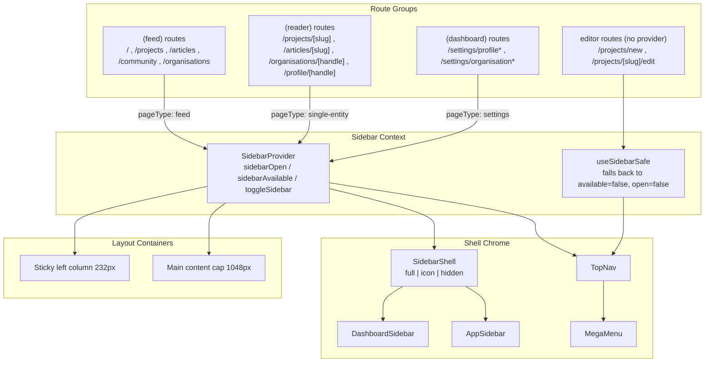
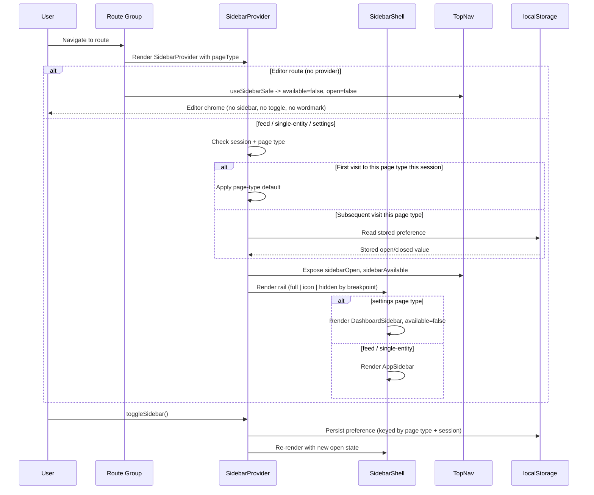

The navigation system defines the platform shell — the persistent TopNav, the collapsible left sidebar, the MegaMenu, and the layout/column system that every route resolves into. This page documents the target spec and the structural rules that drive it.

## Purpose and Scope

This page documents the **navigation and layout shell** of the Ozeaon platform as specified in the navigation and layout implementation brief for tickets **TOZN-370, TOZN-393, TOZN-394, and TOZN-396**. It covers:

- The **page-type taxonomy** (`feed`, `single-entity`, `settings`, plus the implicit editor case) that every route resolves to, and how layout, sidebar defaults, and TopNav composition key off that type.
- The **layout system**: column widths, the 1048px content cap, wide-screen pinning behaviour, gutters, and breakpoints.
- The **Sidebar** (`SidebarProvider` API, `AppSidebar`, `DashboardSidebar`, `SidebarShell` variants, persistence rules).
- The **TopNav** structure and the fixed 32px logo/section gap rule.
- The **MegaMenu** and **mobile behaviour**.
- The **design tokens** that the shell consumes.

**Out of scope / sibling pages:** the typography and color token catalog itself is documented as part of the design system typography page — this page only lists the tokens the shell consumes for convenience. Component-level documentation for unrelated UI primitives (article form, hook-form components, etc.) belongs to their own component pages. Removal of the reader right rail is explicitly **out of scope** for this work.

## Overview

The platform shell is not a single component but a **contract between route groups and shared chrome**. Three ideas drive the design:

1. **Page-type taxonomy.** Every route resolves to exactly one of four page types. Layout behaviour, sidebar defaults, and TopNav composition all key off this type. This is the central organizing concept of the whole navigation overhaul — it means navigation behaviour is *derived* from the route, not configured ad-hoc per page.

2. **Derived chrome, not duplicated chrome.** Instead of each page rendering its own sidebar and toggle, a `SidebarProvider` exposes the shell state, and consumer components read it — with a safe fallback (`useSidebarSafe`) for routes that deliberately have no provider (the editors).

3. **Content-first layout.** The main content block is capped at **1048px** and never stretches beyond it. On wide screens the sidebar **pins sticky** to the left edge and the content centres in the remaining space, with equal gutters opening as the viewport grows (a Reddit-style pinning model).

The shell is composed of the `TopNav`, the left sidebar (`AppSidebar` or `DashboardSidebar`), the `MegaMenu` overlay, and the layout containers that enforce the column system.

### Key terminology

| Term | Meaning |
| :--- | :--- |
| **Page type** | One of `feed`, `single-entity`, `settings`, or the implicit editor case. Determines layout, sidebar default, and TopNav composition. |
| **`SidebarProvider`** | The context provider that holds sidebar open state and availability for a route group. |
| **`useSidebarSafe`** | Consumer hook that falls back to a safe "not rendered" state when no provider exists (editor routes). |
| **`AppSidebar`** | The platform navigation rail (Create dropdown, Platform section, My Library). |
| **`DashboardSidebar`** | The settings-specific rail rendered instead of `AppSidebar` on settings routes. |
| **`SidebarShell`** | The presentational shell supporting `full` / `icon` / `hidden` variants. |
| **`MegaMenu`** | The large overlay navigation menu; covers the screen on mobile. |

## Architecture

The shell is a composition of a context provider, presentational rails, and layout containers. The diagram below reflects the actual page-type → chrome mapping documented in the implementation brief.



**Reading the diagram:** Route groups inject their own `pageType` into `SidebarProvider`. The provider drives both the TopNav (toggle visibility) and the sidebar (`SidebarShell` → `AppSidebar` or `DashboardSidebar`). Editor routes have no provider at all — they read through `useSidebarSafe`, which reports `sidebarAvailable: false` and `open: false`, yielding the editor chrome (no sidebar, no toggle, no wordmark) without introducing a fourth page type.

For the typography and color tokens the shell consumes, see the design system typography page. For unrelated UI primitives, see their dedicated component pages.

## Page-Type Taxonomy

Every route resolves to exactly one of four page types. This is the foundational rule of the navigation system: **layout behaviour, sidebar defaults, and TopNav composition all key off this type**.

| Page type | Examples | Sidebar default | Right rail | Main width |
| :--- | :--- | :--- | :--- | :--- |
| `feed` | `/`, `/projects`, `/articles`, `/community`, `/organisations` | Open | None | 1048px |
| `single-entity` | `/projects/[slug]`, `/articles/[slug]`, `/organisations/[handle]`, `/profile/[handle]` | Closed | Retained (reader `@sidebar` slot) | 1048px |
| `settings` | `/settings/profile*`, `/settings/organisation*` | `AppSidebar` not rendered; `DashboardSidebar` shown | None | 1048px |
| editor (no provider) | `/projects/new`, `/projects/[slug]/edit`, article/organisation create/edit | Not rendered (`useSidebarSafe` fallback) | None | `max-w-7xl` |

> Source: [DESIGN-CONSISTENCY-PLAN.md](https://github.com/ozeaon/ozeaon-v2/blob/0a4f1a95824db87782f1221a4108019d174df3d9/DESIGN-CONSISTENCY-PLAN.md#L112-L117)

**Design intent.** The taxonomy replaces per-page chrome configuration with a single derived decision. Feed pages open the sidebar because browsing benefits from persistent navigation; single-entity (reader) pages close it because the entity content is the focus; settings pages swap the platform rail for a settings-specific rail. Editors sidestep the taxonomy entirely by not rendering a provider, which is why there are effectively four behaviours from three declared page types.

### Column model

Feed, settings, and editor page types are **two columns** (left rail + main). Single-entity (reader) retains its parallel `@sidebar` route slot for entity-specific context (article Authors / Funding / Bounty, project section nav). Removing the reader right rail is out of scope for TOZN-370/393/394/396.

> Source: [DESIGN-CONSISTENCY-PLAN.md](https://github.com/ozeaon/ozeaon-v2/blob/0a4f1a95824db87782f1221a4108019d174df3d9/DESIGN-CONSISTENCY-PLAN.md#L119)

### Column widths at 1280px

- **Sidebar open**: left bar 232px · main content 1048px
- **Sidebar closed**: main content 1048px centred, 116px gutters each side

> Source: [DESIGN-CONSISTENCY-PLAN.md](https://github.com/ozeaon/ozeaon-v2/blob/0a4f1a95824db87782f1221a4108019d174df3d9/DESIGN-CONSISTENCY-PLAN.md#L123-L124)

### Wide-screen behaviour (>1280px)

Reddit-style pinning:

- The left sidebar is `position: sticky`, pinned to the viewport's left edge, width 232px.
- The main content is `max-w-[1048px]`, centred within the space to the right of the sidebar.
- Equal gutters open on either side of the main content as the viewport grows.

> Source: [DESIGN-CONSISTENCY-PLAN.md](https://github.com/ozeaon/ozeaon-v2/blob/0a4f1a95824db87782f1221a4108019d174df3d9/DESIGN-CONSISTENCY-PLAN.md#L130-L132)

**Gutter table (sidebar open):**

| Viewport | Left bar | Remaining | Main | Gutter each side |
| :--- | :--- | :--- | :--- | :--- |
| 1280px | 232px | 1048px | 1048px | 0px |
| 1600px | 232px | 1368px | 1048px | 160px |
| 1920px | 232px | 1688px | 1048px | 320px |

> Source: [DESIGN-CONSISTENCY-PLAN.md](https://github.com/ozeaon/ozeaon-v2/blob/0a4f1a95824db87782f1221a4108019d174df3d9/DESIGN-CONSISTENCY-PLAN.md#L136-L140)

When the sidebar is **closed**, the fixed left column is removed from the layout tree and the main content centres across the full viewport:

- 1280px closed: 1048px main · 116px gutters
- 1600px closed: 1048px main · 276px gutters
- 1920px closed: 1048px main · 436px gutters

> Source: [DESIGN-CONSISTENCY-PLAN.md](https://github.com/ozeaon/ozeaon-v2/blob/0a4f1a95824db87782f1221a4108019d174df3d9/DESIGN-CONSISTENCY-PLAN.md#L144-L146)

### Breakpoints

| Range | Name | Behaviour |
| :--- | :--- | :--- |
| <768px | Mobile | Single column; no sidebar; mega menu covers screen |
| 768–1024px | Tablet | Icon-only sidebar (40px) |
| 1024–1280px | Desktop | Full layout; content fills available width |
| 1280–1600px | Large | Content block centres; small gutters open |
| >1600px | XL / Wide | Content block stays fixed; gutters grow |

> Source: [DESIGN-CONSISTENCY-PLAN.md](https://github.com/ozeaon/ozeaon-v2/blob/0a4f1a95824db87782f1221a4108019d174df3d9/DESIGN-CONSISTENCY-PLAN.md#L150-L156)

### Structural rules

- Content max-width is 1048px. Never stretches beyond that.
- Outer desktop container has `md:min-w-[1024px]` to prevent collapse below tablet rules.
- Left sidebar uses `position: sticky` so navigation stays visible on long scroll.
- Active section label in the top nav uses a fixed 32px flex gap from the logo cluster — never a hardcoded x offset.

> Source: [DESIGN-CONSISTENCY-PLAN.md](https://github.com/ozeaon/ozeaon-v2/blob/0a4f1a95824db87782f1221a4108019d174df3d9/DESIGN-CONSISTENCY-PLAN.md#L160-L163)

**Design intent.** The combination of a sticky 232px rail and a 1048px capped content block means the content position is stable across the entire 1280px–1920px+ range — the reader's eye does not have to re-track text as the window resizes. The `md:min-w-[1024px]` floor prevents the layout from silently collapsing into tablet rules on a mis-sized desktop window. The "fixed 32px flex gap rather than hardcoded x offset" rule keeps the section label anchored to the logo cluster's real width, so if the logo cluster changes size the label follows automatically.

## Sidebar

### SidebarProvider API

The sidebar state is exposed through a context provider. The documented shape is:

```ts
type PageType = "feed" | "single-entity" | "settings";

interface SidebarContext {
  sidebarOpen: boolean;
  sidebarAvailable: boolean; // false for settings
  toggleSidebar: () => void;
}
```

> Source: [DESIGN-CONSISTENCY-PLAN.md](https://github.com/ozeaon/ozeaon-v2/blob/0a4f1a95824db87782f1221a4108019d174df3d9/DESIGN-CONSISTENCY-PLAN.md#L171-L179)

The provider accepts `pageType` as a prop; each layout passes its own type. Editor routes deliberately do **not** render a `SidebarProvider` — consumers there fall back to `useSidebarSafe`, which reports `sidebarAvailable: false` and `open: false`. That yields the correct editor chrome (no sidebar, no toggle, no wordmark) without adding a fourth page type.

> Source: [DESIGN-CONSISTENCY-PLAN.md](https://github.com/ozeaon/ozeaon-v2/blob/0a4f1a95824db87782f1221a4108019d174df3d9/DESIGN-CONSISTENCY-PLAN.md#L181)

**Design intent.** Exposing `sidebarAvailable` separately from `sidebarOpen` lets consumers distinguish "the sidebar exists but is closed" from "there is no sidebar on this route." The TopNav toggle is hidden when `sidebarAvailable === false` (settings routes), while the sidebar *rail* is simply not rendered in that case. This avoids the anti-pattern of a toggle button that toggles nothing.

### Defaults per page type

| Page type | Default |
| :--- | :--- |
| `feed` | Open |
| `single-entity` | Closed |
| `settings` | Not rendered |

Editor routes: no provider; falls through to `useSidebarSafe` (behaves as "not rendered").

> Source: [DESIGN-CONSISTENCY-PLAN.md](https://github.com/ozeaon/ozeaon-v2/blob/0a4f1a95824db87782f1221a4108019d174df3d9/DESIGN-CONSISTENCY-PLAN.md#L185-L191)

### Persistence

- When the user toggles the sidebar, persist the choice to `localStorage`, keyed by page type + session id.
- **First visit to a page type in the current session**: apply the page-type default, ignoring any stored preference.
- **Subsequent navigation within the same page type**: apply the stored preference.
- Cross-page-type navigation on first visit uses the default for the new type.

> Source: [DESIGN-CONSISTENCY-PLAN.md](https://github.com/ozeaon/ozeaon-v2/blob/0a4f1a95824db87782f1221a4108019d174df3d9/DESIGN-CONSISTENCY-PLAN.md#L195-L198)

**Design intent.** The "first visit in the session uses the default, subsequent visits honour the user's choice" rule prevents a stale preference from one page type leaking into another on entry. The preference is scoped to the page type and session, so a user who collapses the sidebar while reading articles will still see the feed sidebar open when they first land on the feed.

### Sidebar variants

`SidebarShell` supports a size prop: `full` | `icon` | `hidden`.

| Breakpoint | Variant |
| :--- | :--- |
| <768px | `hidden` |
| 768–1024px | `icon` |
| ≥1024px | `full` |

Icon variant: 40px wide, section icons only, tooltip labels, no text or counts.

> Source: [DESIGN-CONSISTENCY-PLAN.md](https://github.com/ozeaon/ozeaon-v2/blob/0a4f1a95824db87782f1221a4108019d174df3d9/DESIGN-CONSISTENCY-PLAN.md#L202-L210)

### Sidebar contents

- **AppSidebar** (`(feed)` and `(reader)` layouts): Create dropdown, Platform section (Community, Articles, Projects, Organisations), My Library collapsible (Notes and Bookmarks disabled with Coming Soon indicators).
- **DashboardSidebar** (`(dashboard)` layout): Create button + settings-page links per user or organisation account.

> Source: [DESIGN-CONSISTENCY-PLAN.md](https://github.com/ozeaon/ozeaon-v2/blob/0a4f1a95824db87782f1221a4108019d174df3d9/DESIGN-CONSISTENCY-PLAN.md#L220-L221)

### Settings pages — DashboardSidebar

Settings routes render `DashboardSidebar` (a settings-specific rail), not the platform `AppSidebar`. `sidebarAvailable === false` in `SidebarProvider` on settings routes so the TopNav sidebar toggle is not shown.

`DashboardSidebar` contains the Create button standalone (per spec) plus settings-page links (Settings / Members for org; Profile Settings / My Organisations for user). The Create button on the organisation variant currently has an empty `DropdownMenuContent` — populate it with Article / Project / Organisation items and route them through `useCreateAction`.

> Source: [DESIGN-CONSISTENCY-PLAN.md](https://github.com/ozeaon/ozeaon-v2/blob/0a4f1a95824db87782f1221a4108019d174df3d9/DESIGN-CONSISTENCY-PLAN.md#L214-L216)

### Same-page navigation

Clicking a sidebar link for the page the user is already on: prevent navigation. If the mega menu is open, still close it.

> Source: [DESIGN-CONSISTENCY-PLAN.md](https://github.com/ozeaon/ozeaon-v2/blob/0a4f1a95824db87782f1221a4108019d174df3d9/DESIGN-CONSISTENCY-PLAN.md#L225)

### Coming Soon indicators

Unavailable items are always shown with a Coming Soon indicator — never hidden. Non-navigable. Label text ("Soon", "Coming Soon", "In development") can vary per placement per Figma; audit Sidebar and MegaMenu Coming Soon labels against Figma before finalising.

> Source: [DESIGN-CONSISTENCY-PLAN.md](https://github.com/ozeaon/ozeaon-v2/blob/0a4f1a95824db87782f1221a4108019d174df3d9/DESIGN-CONSISTENCY-PLAN.md#L229)

**Design intent.** Showing unavailable features as disabled entries (rather than hiding them) communicates the roadmap and prevents the navigation tree from shifting shape as features land.

## TopNav

### Structure

The left region is a single flex container with `gap-8` (32px) between siblings:

```tsx
<div className="flex items-center gap-8">
```

> Source: [DESIGN-CONSISTENCY-PLAN.md](https://github.com/ozeaon/ozeaon-v2/blob/0a4f1a95824db87782f1221a4108019d174df3d9/DESIGN-CONSISTENCY-PLAN.md#L237-L240)

**Design intent.** A single flex container with a uniform 32px gap — rather than stacked margins or a hardcoded x offset — means the logo cluster, the active section label, and any siblings reflow together as their widths change. This directly implements the structural rule that the active section label uses a fixed 32px flex gap from the logo cluster rather than a hardcoded offset.

### TopNav composition by page type

TopNav composition keys off page type via `SidebarProvider`. On settings routes `sidebarAvailable === false`, so the sidebar toggle is not rendered. On editor routes there is no provider and `useSidebarSafe` reports unavailable, producing editor chrome (no sidebar, no toggle, no wordmark).

> Sources:
> - [DESIGN-CONSISTENCY-PLAN.md](https://github.com/ozeaon/ozeaon-v2/blob/0a4f1a95824db87782f1221a4108019d174df3d9/DESIGN-CONSISTENCY-PLAN.md#L110)
> - [DESIGN-CONSISTENCY-PLAN.md](https://github.com/ozeaon/ozeaon-v2/blob/0a4f1a95824db87782f1221a4108019d174df3d9/DESIGN-CONSISTENCY-PLAN.md#L181)
> - [DESIGN-CONSISTENCY-PLAN.md](https://github.com/ozeaon/ozeaon-v2/blob/0a4f1a95824db87782f1221a4108019d174df3d9/DESIGN-CONSISTENCY-PLAN.md#L214)

## MegaMenu

The MegaMenu is the large overlay navigation surface. On mobile it **covers the screen** (see the breakpoint table: `<768px` → "Single column; no sidebar; mega menu covers screen").

Key behaviours:

- Opening the mega menu and then clicking the sidebar link for the current page: navigation is prevented, but the mega menu **still closes**.
- Coming Soon labels appear in the MegaMenu as well as the Sidebar and must be audited against Figma.

> Sources:
> - [DESIGN-CONSISTENCY-PLAN.md](https://github.com/ozeaon/ozeaon-v2/blob/0a4f1a95824db87782f1221a4108019d174df3d9/DESIGN-CONSISTENCY-PLAN.md#L152)
> - [DESIGN-CONSISTENCY-PLAN.md](https://github.com/ozeaon/ozeaon-v2/blob/0a4f1a95824db87782f1221a4108019d174df3d9/DESIGN-CONSISTENCY-PLAN.md#L225)
> - [DESIGN-CONSISTENCY-PLAN.md](https://github.com/ozeaon/ozeaon-v2/blob/0a4f1a95824db87782f1221a4108019d174df3d9/DESIGN-CONSISTENCY-PLAN.md#L229)

The MegaMenu content is specified against Figma node `9475-45061` (mobile + desktop).

> Source: [DESIGN-CONSISTENCY-PLAN.md](https://github.com/ozeaon/ozeaon-v2/blob/0a4f1a95824db87782f1221a4108019d174df3d9/DESIGN-CONSISTENCY-PLAN.md#L42)

## Mobile Behaviour

Mobile (<768px) collapses to a **single column with no sidebar**; the mega menu covers the screen instead of occupying a rail. Tablet (768–1024px) shows an **icon-only** sidebar at 40px. This transition is driven by the `SidebarShell` variant mapping (`hidden` → `icon` → `full`).

> Sources:
> - [DESIGN-CONSISTENCY-PLAN.md](https://github.com/ozeaon/ozeaon-v2/blob/0a4f1a95824db87782f1221a4108019d174df3d9/DESIGN-CONSISTENCY-PLAN.md#L150-L156)
> - [DESIGN-CONSISTENCY-PLAN.md](https://github.com/ozeaon/ozeaon-v2/blob/0a4f1a95824db87782f1221a4108019d174df3d9/DESIGN-CONSISTENCY-PLAN.md#L204-L208)

## Core Flow

The following sequence walks through what happens when a user navigates between routes and toggles the sidebar, following the derivation rules in the spec.



**Walking the flow:** the route group is the first decision point. Editor routes short-circuit through `useSidebarSafe` and never engage the persistence logic. For provider-backed routes, the provider resolves the initial open state — default on first session visit to a page type, stored preference afterwards — then renders both the TopNav (which reads `sidebarAvailable` to decide whether to show the toggle) and the `SidebarShell`. Which rail renders depends on page type (settings → `DashboardSidebar`, otherwise `AppSidebar`), while the breakpoint determines the shell variant. A user toggle writes the new preference back to `localStorage`.

## Design Tokens

The shell consumes design system tokens — **never raw hex or raw Tailwind size/color utilities**. Tokens are pulled from Figma variables on the referenced nodes and must map to existing Tailwind tokens.

### Color tokens used by the shell

```
color/text/text-primary        #1c2b3a
color/text/text-secondary      #4a5565
color/text/text-muted          #677888
color/text/text-subtle         #8898a9
color/text/text-placeholder    #94a6b2
color/text/text-link           #424bb3
color/background/bg-surface    #ffffff
color/background/bg-cold       #f7f8fa
color/background/bg-subtle     #eff3fc
color/background/bg-sunken     #e4ecf6
color/background/border-default              #d8e4f0
color/background/overlay-scrim-default       #1a233080
color/background/overlay-frosted             #f3f7ffcc
```

> Source: [DESIGN-CONSISTENCY-PLAN.md](https://github.com/ozeaon/ozeaon-v2/blob/0a4f1a95824db87782f1221a4108019d174df3d9/DESIGN-CONSISTENCY-PLAN.md#L54-L66)

The overlay tokens (`overlay-scrim-default`, `overlay-frosted`) are what the MegaMenu uses to scrim/frost the underlying page.

### Type scale used by the shell

```
type-display        40/48  700
type-h1             32/36  700
type-h2             24/28  700
type-h3             18/24  700
type-h4             15/20  500
body-lg             16/20  400
type-body           14/18  400
type-body-sm        13/16  400
type-label          12/15  600
type-label-sm       11/14  500
type-caption        11/14  400
type-mono           13/16  400  (Spline Sans Mono)
type-mono-sm        11/14  400  (Spline Sans Mono)
```

> Source: [DESIGN-CONSISTENCY-PLAN.md](https://github.com/ozeaon/ozeaon-v2/blob/0a4f1a95824db87782f1221a4108019d174df3d9/DESIGN-CONSISTENCY-PLAN.md#L85-L99)

The Tailwind utilities documented in `CLAUDE.md` (Typography & Color System) expose these.

> Source: [DESIGN-CONSISTENCY-PLAN.md](https://github.com/ozeaon/ozeaon-v2/blob/0a4f1a95824db87782f1221a4108019d174df3d9/DESIGN-CONSISTENCY-PLAN.md#L102)

The design system typography reference confirms the utility names — for example `font-display` (40px/700), `font-h1`…`font-h4`, `font-body*`, `font-label*`, `font-caption`, and `font-mono` (DM Mono, 13/11px) — along with the text color classes (`text-primary`, `text-secondary`, `text-muted`, `text-subtle`, `text-placeholder`) and background classes (`bg-bg-surface`, `bg-bg-cold`, `bg-bg-neutral`, `bg-bg-subtle`, `bg-bg-sunken`, `bg-lavender-mist`).

> Source: [docs/design-system.md](https://github.com/ozeaon/ozeaon-v2/blob/0a4f1a95824db87782f1221a4108019d174df3d9/docs/design-system.md#L8-L31)

> Note: the implementation brief lists `type-mono` as **Spline Sans Mono**, while the design-system typography reference names the mono font **DM Mono**. Treat the design-system reference (`DM Mono`) as authoritative for the loaded font and reconcile the brief during implementation.

## Configuration Reference

The navigation shell is primarily configured through **page type** and **breakpoints** rather than environment settings. The effective configuration surface is:

| Setting | Type | Default | Description |
| :--- | :--- | :--- | :--- |
| `pageType` (SidebarProvider prop) | `"feed" \| "single-entity" \| "settings"` | per route group | Determines sidebar default, TopNav composition, and right-rail presence. |
| `sidebarOpen` (context) | boolean | derived from page type | Current open state, exposed to consumers. |
| `sidebarAvailable` (context) | boolean | `false` for settings | Whether a sidebar exists on this route; controls TopNav toggle visibility. |
| `SidebarShell` size | `"full" \| "icon" \| "hidden"` | derived from breakpoint | Presentational variant of the rail. |
| Content max-width | `1048px` | `1048px` | Hard cap on the main content block. |
| Left rail width | `232px` | `232px` | Sticky pinned column when sidebar is open. |
| Icon rail width | `40px` | `40px` | Tablet icon-only variant width. |
| Desktop min-width | `md:min-w-[1024px]` | — | Prevents layout collapse below tablet rules. |
| Sidebar toggle gap | `32px` (`gap-8`) | `32px` | Fixed flex gap between logo cluster and section label. |
| Sidebar persistence | `localStorage` | — | Keyed by page type + session id. |

> Sources:
> - [DESIGN-CONSISTENCY-PLAN.md](https://github.com/ozeaon/ozeaon-v2/blob/0a4f1a95824db87782f1221a4108019d174df3d9/DESIGN-CONSISTENCY-PLAN.md#L112-L117)
> - [DESIGN-CONSISTENCY-PLAN.md](https://github.com/ozeaon/ozeaon-v2/blob/0a4f1a95824db87782f1221a4108019d174df3d9/DESIGN-CONSISTENCY-PLAN.md#L123-L124)
> - [DESIGN-CONSISTENCY-PLAN.md](https://github.com/ozeaon/ozeaon-v2/blob/0a4f1a95824db87782f1221a4108019d174df3d9/DESIGN-CONSISTENCY-PLAN.md#L161-L163)
> - [DESIGN-CONSISTENCY-PLAN.md](https://github.com/ozeaon/ozeaon-v2/blob/0a4f1a95824db87782f1221a4108019d174df3d9/DESIGN-CONSISTENCY-PLAN.md#L171-L179)
> - [DESIGN-CONSISTENCY-PLAN.md](https://github.com/ozeaon/ozeaon-v2/blob/0a4f1a95824db87782f1221a4108019d174df3d9/DESIGN-CONSISTENCY-PLAN.md#L195)
> - [DESIGN-CONSISTENCY-PLAN.md](https://github.com/ozeaon/ozeaon-v2/blob/0a4f1a95824db87782f1221a4108019d174df3d9/DESIGN-CONSISTENCY-PLAN.md#L202-L208)

## API Reference

### `SidebarContext`

The context contract exposed by `SidebarProvider` and consumed by `useSidebarSafe` / sidebar-aware components.

**Properties:**

- `sidebarOpen` (boolean): Current open state of the sidebar.
- `sidebarAvailable` (boolean): Whether a sidebar exists on the current route. Documented as `false` for settings.
- `toggleSidebar` (function): `() => void` — toggles the sidebar open state and triggers persistence.

> Source: [DESIGN-CONSISTENCY-PLAN.md](https://github.com/ozeaon/ozeaon-v2/blob/0a4f1a95824db87782f1221a4108019d174df3d9/DESIGN-CONSISTENCY-PLAN.md#L174-L178)

### `PageType`

```ts
type PageType = "feed" | "single-entity" | "settings";
```

> Source: [DESIGN-CONSISTENCY-PLAN.md](https://github.com/ozeaon/ozeaon-v2/blob/0a4f1a95824db87782f1221a4108019d174df3d9/DESIGN-CONSISTENCY-PLAN.md#L172)

**Note:** Editor routes do not form part of this union. They are represented by the *absence* of a `SidebarProvider`, and consumers observe that absence through `useSidebarSafe`.

### `useSidebarSafe`

Not defined with an explicit signature in the source documents, but its documented behaviour is precise: when no `SidebarProvider` is present, it reports `sidebarAvailable: false` and `open: false`, producing the editor chrome (no sidebar, no toggle, no wordmark).

> Source: [DESIGN-CONSISTENCY-PLAN.md](https://github.com/ozeaon/ozeaon-v2/blob/0a4f1a95824db87782f1221a4108019d174df3d9/DESIGN-CONSISTENCY-PLAN.md#L181)

> Implementation details for the exact `useSidebarSafe` return type were not found in the source documents read for this page.

### `SidebarShell` (size prop)

`SidebarShell` is a presentational shell accepting a `size` prop of `full`, `icon`, or `hidden`, mapped from breakpoints as described above.

> Source: [DESIGN-CONSISTENCY-PLAN.md](https://github.com/ozeaon/ozeaon-v2/blob/0a4f1a95824db87782f1221a4108019d174df3d9/DESIGN-CONSISTENCY-PLAN.md#L202-L208)

## Failure Modes, Edge Cases & Concurrency

| Scenario | Documented behaviour | Source |
| :--- | :--- | :--- |
| Editor route rendered | No `SidebarProvider`; `useSidebarSafe` returns `available=false, open=false`; editor chrome (no sidebar, no toggle, no wordmark). | [L181](https://github.com/ozeaon/ozeaon-v2/blob/0a4f1a95824db87782f1221a4108019d174df3d9/DESIGN-CONSISTENCY-PLAN.md#L181) |
| Settings route | `sidebarAvailable === false` so the TopNav sidebar toggle is not shown; `DashboardSidebar` renders instead of `AppSidebar`. | [L214](https://github.com/ozeaon/ozeaon-v2/blob/0a4f1a95824db87782f1221a4108019d174df3d9/DESIGN-CONSISTENCY-PLAN.md#L214) |
| Clicking the sidebar link for the current page | Navigation is prevented; if the mega menu is open it still closes. | [L225](https://github.com/ozeaon/ozeaon-v2/blob/0a4f1a95824db87782f1221a4108019d174df3d9/DESIGN-CONSISTENCY-PLAN.md#L225) |
| First visit to a page type in a session | Page-type default is applied, **ignoring** any stored preference. | [L196](https://github.com/ozeaon/ozeaon-v2/blob/0a4f1a95824db87782f1221a4108019d174df3d9/DESIGN-CONSISTENCY-PLAN.md#L196) |
| Subsequent navigation within the same page type | Stored `localStorage` preference is applied. | [L197](https://github.com/ozeaon/ozeaon-v2/blob/0a4f1a95824db87782f1221a4108019d174df3d9/DESIGN-CONSISTENCY-PLAN.md#L197) |
| Cross-page-type navigation on first visit | Default for the new type is used. | [L198](https://github.com/ozeaon/ozeaon-v2/blob/0a4f1a95824db87782f1221a4108019d174df3d9/DESIGN-CONSISTENCY-PLAN.md#L198) |
| Unavailable sidebar items | Always shown with a Coming Soon indicator, never hidden; non-navigable. | [L229](https://github.com/ozeaon/ozeaon-v2/blob/0a4f1a95824db87782f1221a4108019d174df3d9/DESIGN-CONSISTENCY-PLAN.md#L229) |
| Organisation-variant Create button | Currently has an empty `DropdownMenuContent` (placeholder state); must be populated with Article / Project / Organisation items via `useCreateAction`. | [L216](https://github.com/ozeaon/ozeaon-v2/blob/0a4f1a95824db87782f1221a4108019d174df3d9/DESIGN-CONSISTENCY-PLAN.md#L216) |
| Mono font inconsistency | Brief says Spline Sans Mono; design reference says DM Mono. Reconcile before implementation. | [L98](https://github.com/ozeaon/ozeaon-v2/blob/0a4f1a95824db87782f1221a4108019d174df3d9/DESIGN-CONSISTENCY-PLAN.md#L98), [docs/design-system.md](https://github.com/ozeaon/ozeaon-v2/blob/0a4f1a95824db87782f1221a4108019d174df3d9/docs/design-system.md#L18) |

**Consistency note on the sidebar toggle.** Because `sidebarOpen` and `sidebarAvailable` are independent, the TopNav must gate the toggle on `sidebarAvailable` — and not merely on `sidebarOpen`. A toggle rendered when `sidebarAvailable === false` would control nothing, which is precisely why settings routes set it to `false`.

## Extension Points

- **Adding a page type.** The declared union is `"feed" | "single-entity" | "settings"`. Rather than extending this union, the spec intentionally reuses the *absence* of a provider for editor routes. New chrome-less routes should follow the same pattern (omit the provider) instead of adding a new enum member.
- **`SidebarShell` size prop.** The `full | icon | hidden` triple is the extension point for new responsive rail presentations; adding a variant is localized to the shell.
- **`DashboardSidebar` Create dropdown.** The organisation variant's `DropdownMenuContent` is the designated extension point for creating Article / Project / Organisation entities via `useCreateAction`.
- **Coming Soon placeholders.** Disabled navigation entries are a first-class extension point for staging unreleased features visibly.

> Sources:
> - [DESIGN-CONSISTENCY-PLAN.md](https://github.com/ozeaon/ozeaon-v2/blob/0a4f1a95824db87782f1221a4108019d174df3d9/DESIGN-CONSISTENCY-PLAN.md#L181)
> - [DESIGN-CONSISTENCY-PLAN.md](https://github.com/ozeaon/ozeaon-v2/blob/0a4f1a95824db87782f1221a4108019d174df3d9/DESIGN-CONSISTENCY-PLAN.md#L202)
> - [DESIGN-CONSISTENCY-PLAN.md](https://github.com/ozeaon/ozeaon-v2/blob/0a4f1a95824db87782f1221a4108019d174df3d9/DESIGN-CONSISTENCY-PLAN.md#L216)
> - [DESIGN-CONSISTENCY-PLAN.md](https://github.com/ozeaon/ozeaon-v2/blob/0a4f1a95824db87782f1221a4108019d174df3d9/DESIGN-CONSISTENCY-PLAN.md#L229)

## Operational Notes

- **Implementation order** and the exact codebase impact list are enumerated in the source brief (`Codebase impact`, `Implementation order` sections).
- **Source specs** are signed off v1.1 (22.07.26, author Olena Kozak): `CONV-01. Mobile Version — Unified Requirements` and `CONV-02. Platform Navigation`.
- **Figma references:** file key `Y7P66cqHVJYOw83eqAk1m`, design system project "OZEAON DESIGN 2.0". Key nodes: MegaMenu content `9475-45061`, big-screens layout `8858-14417`, sidebar behaviour `8447-29539`, single-entity TopNav `3788-32705`.
- **Pre-finalisation audit required:** audit Sidebar and MegaMenu Coming Soon labels against Figma, since label text can vary per placement.

> Sources:
> - [DESIGN-CONSISTENCY-PLAN.md](https://github.com/ozeaon/ozeaon-v2/blob/0a4f1a95824db87782f1221a4108019d174df3d9/DESIGN-CONSISTENCY-PLAN.md#L5-L8)
> - [DESIGN-CONSISTENCY-PLAN.md](https://github.com/ozeaon/ozeaon-v2/blob/0a4f1a95824db87782f1221a4108019d174df3d9/DESIGN-CONSISTENCY-PLAN.md#L35-L45)
> - [DESIGN-CONSISTENCY-PLAN.md](https://github.com/ozeaon/ozeaon-v2/blob/0a4f1a95824db87782f1221a4108019d174df3d9/DESIGN-CONSISTENCY-PLAN.md#L229)

## Related Links

- [Design system typography & color reference](https://github.com/ozeaon/ozeaon-v2/blob/0a4f1a95824db87782f1221a4108019d174df3d9/docs/design-system.md)
- [Navigation and layout specification (source brief)](https://github.com/ozeaon/ozeaon-v2/blob/0a4f1a95824db87782f1221a4108019d174df3d9/DESIGN-CONSISTENCY-PLAN.md)
- [Design system overview](https://github.com/ozeaon/ozeaon-v2/blob/0a4f1a95824db87782f1221a4108019d174df3d9/docs/design-system.md)
- [Component library reference](https://github.com/ozeaon/ozeaon-v2/blob/0a4f1a95824db87782f1221a4108019d174df3d9/docs/component-library.md)
