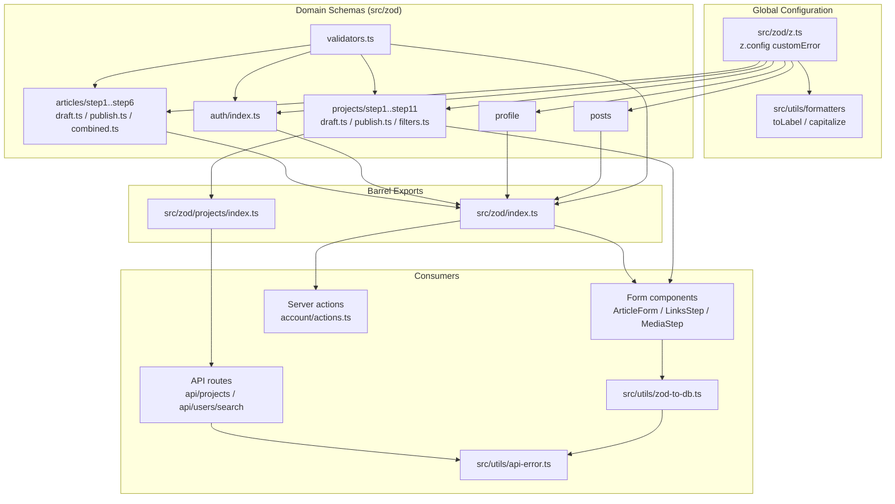
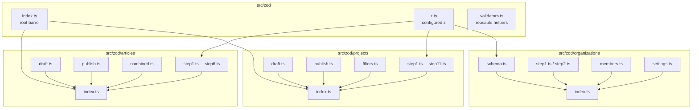
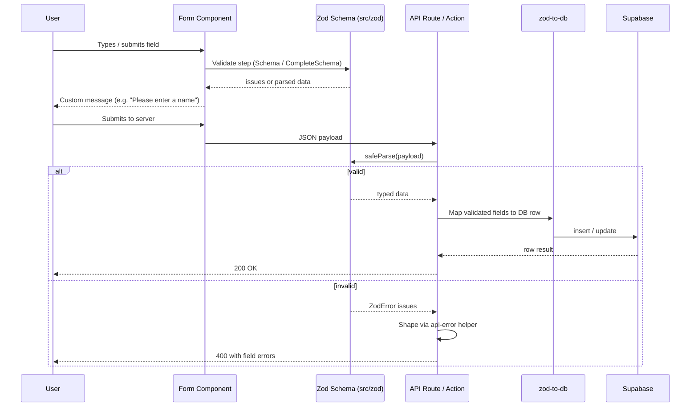

A centralized, modular Zod schema layer that validates every user-facing form and API request in the application, organized by domain with a shared global error-message configuration.

## Purpose and Scope

This page documents the Zod validation subsystem: where schemas live, how the global `z.config(...)` custom-error hook works, how domain schemas are composed for multi-step forms, and how the same schema objects are reused across client forms and server-side API routes.

Covered here:

- The shared `z` instance and its global `customError` behavior in `src/zod/z.ts`.
- The schema directory layout and per-domain barrel exports (`src/zod/index.ts`, `src/zod/projects/index.ts`, `src/zod/articles/index.ts`, etc.).
- The *draft / complete / publish / schemaObject* schema quartet used by multi-step form wizards.
- Reusable validator helpers exported from `src/zod/validators.ts`.
- The bridge between validated form data and database rows (`src/utils/zod-to-db.ts`) and API error shaping (`src/utils/api-error.ts`).

Related topics intentionally left to sibling pages:

- For general formatting/utility helpers such as `toLabel` and `capitalize` used by the error hook, see the other pages under `9-config-and-utils`.
- For the Supabase-generated `TablesUpdate` types consumed by the database mapping layer, see the database/types pages.
- For the form components that consume these schemas (`ArticleForm`, `ProjectIdentitySection`, `LinksStep`, `MediaStep`), see the component/form pages.

## Overview

Rather than scattering inline `z.object({...})` definitions across UI components, the codebase centralizes every validation contract under `src/zod/`. This produces three concrete benefits:

1. **Single source of truth.** A field's length limits, enum membership, and URL/email formats are declared once and reused by both the client-side form resolver and the server-side API route handler.
2. **Consistent user-facing copy.** A single global configuration intercepts Zod's low-level issue codes (`invalid_type`, `too_big`, `too_small`) and rewrites them into human sentence fragments such as `Please enter a first name` or `Bio cannot exceed 500 characters`. Without this, each schema would have to hand-write every message.
3. **Per-domain, per-step composition.** Large flows (project creation with 11 steps, article creation with 6 steps) are split into one file per step, then recombined into draft/publish schemas so that a partially-filled wizard can be persisted early while a final submission is strictly validated.

The terminology below is used throughout this page:

| Term | Meaning |
| --- | --- |
| `z` | The customized Zod instance re-exported from `src/zod/z.ts`; every schema file imports this, not `zod` directly. |
| `customError` | The global error-message callback registered via `z.config(...)`. |
| `*SchemaObject` | A raw `z.object` shape (a plain object of Zod fields) that can be `.extend()`ed or `.pick()`ed by other schemas. |
| `*Schema` | A runnable `ZodObject` schema, typically produced from the corresponding `*SchemaObject`. |
| `*CompleteSchema` | A schema requiring that every field be provided (used to gate step completion). |
| `*PublishSchema` | A stricter schema applied at final submission time. |

## Architecture

The subsystem has four layers: a global configuration layer, a domain-schema layer, a composition/barrel layer, and a set of consumers (forms, API routes, DB mapping).



Each arrow above corresponds to a verified import: the schema files import the customized `z` instance from `src/zod/z.ts`, the domain barrels re-export step files, and consumers import either the domain barrel (`@/zod/projects`, `@/zod/organizations`) or the root barrel.

> Sources:
> - [z.ts](https://github.com/ozeaon/ozeaon-v2/blob/0a4f1a95824db87782f1221a4108019d174df3d9/src/zod/z.ts#L1-L37)
> - [index.ts](https://github.com/ozeaon/ozeaon-v2/blob/0a4f1a95824db87782f1221a4108019d174df3d9/src/zod/index.ts#L1-L17)
> - [index.ts](https://github.com/ozeaon/ozeaon-v2/blob/0a4f1a95824db87782f1221a4108019d174df3d9/src/zod/projects/index.ts#L1-L95)
> - [api-error.ts](https://github.com/ozeaon/ozeaon-v2/blob/0a4f1a95824db87782f1221a4108019d174df3d9/src/utils/api-error.ts#L1-L2)

## The Global `z` Instance and Custom Error Messages

Every schema in the repository imports `z` from the internal module rather than from the `zod` package, because that module registers a **global** error-message strategy at import time. This is the single most important design decision in the subsystem: it lets individual schemas stay terse (no per-field `message` strings) while still producing fully-formed English sentences in the UI.

```typescript
import { z } from "zod";
import { toLabel, capitalize } from "@/utils/formatters";

z.config({
  customError: (iss) => {
    if (
      iss.code === "invalid_type" &&
      (iss.input === undefined || iss.input === null)
    ) {
      const name = iss.path?.at(-1);
      if (typeof name === "string") {
        const label = toLabel(name);
        const article = /^[aeiou]/i.test(label) ? "an" : "a";
        return `Please enter ${article} ${label}`;
      }
      return "This field is required";
    }

    if (iss.code === "too_big" && iss.origin === "string") {
      const name = iss.path?.at(-1);
      if (typeof name === "string") {
        return `${capitalize(toLabel(name))} cannot exceed ${iss.maximum} characters`;
      }
      return `Cannot exceed ${iss.maximum} characters`;
    }

    if (iss.code === "too_small" && iss.origin === "string") {
      const name = iss.path?.at(-1);
      if (typeof name === "string") {
        return `${capitalize(toLabel(name))} must be at least ${iss.minimum} characters`;
      }
      return `Must be at least ${iss.minimum} characters`;
    }
  },
});

export { z };
```

> Source: [z.ts](https://github.com/ozeaon/ozeaon-v2/blob/0a4f1a95824db87782f1221a4108019d174df3d9/src/zod/z.ts#L1-L37)

### How the hook builds a message

The callback receives a single Zod issue (`iss`) and returns a string or `undefined`. Returning `undefined` tells Zod to fall back to its built-in message for that issue. The three handled branches are:

| Issue code | Guard | Derived field name | Produced message |
| --- | --- | --- | --- |
| `invalid_type` | `iss.input` is `undefined` or `null` | `iss.path.at(-1)` | `Please enter a first name` / `Please enter an email` (article chosen by vowel test) |
| `too_big` | `iss.origin === "string"` | `iss.path.at(-1)` | `Bio cannot exceed 500 characters` |
| `too_small` | `iss.origin === "string"` | `iss.path.at(-1)` | `Bio must be at least 10 characters` |

Key implementation details worth noting for anyone extending this:

1. **The field name comes from the last path segment.** `iss.path?.at(-1)` intentionally reads only the *leaf* key. For a nested field such as `socials.linkedin`, the message says "Linkedin …" rather than the full dotted path — a deliberate choice to keep messages short because each form label already provides context.
2. **A/an is computed, not hardcoded.** `/^[aeiou]/i.test(label)` selects the indefinite article, so `email` renders "Please enter an email" while `name` renders "Please enter a name".
3. **Missing-name fallbacks exist.** If the path is empty or the leaf key is not a string (e.g. an array index in a list field), the branch falls back to generic copy: `This field is required`, `Cannot exceed N characters`, or `Must be at least N characters`.
4. **Only string origins are rewritten for size errors.** `too_big`/`too_small` issues on numbers, arrays, or dates fall through to `undefined` and therefore keep Zod's default wording. This prevents nonsensical "cannot exceed 3 characters" copy on a numeric field.
5. **The hook returns `undefined` implicitly** for all other codes (e.g. `invalid_format`, `invalid_enum_value`, `custom`), so schemas that need specific `refine`/`regex` messages must still supply them locally.

### Why a global hook instead of per-field messages

The alternative — attaching `message:` to every `.min()`/`.max()` call — would duplicate near-identical strings hundreds of times across the domain schema files. The global hook collapses that into roughly 30 lines and guarantees that changing the tone of the copy is a one-file change. The trade-off is that the hook is *path-shape sensitive*: field keys are converted to labels mechanically by `toLabel`, so a schema key like `linkedinUrl` produces the label "Linkedin Url" unless `toLabel` handles the casing.

## Schema Directory Layout and Organization

Schemas are grouped by **domain**, and within a domain by **wizard step**, with dedicated files for the draft/publish variants.



> Sources:
> - [index.ts](https://github.com/ozeaon/ozeaon-v2/blob/0a4f1a95824db87782f1221a4108019d174df3d9/src/zod/index.ts#L1-L17)
> - [index.ts](https://github.com/ozeaon/ozeaon-v2/blob/0a4f1a95824db87782f1221a4108019d174df3d9/src/zod/projects/index.ts#L1-L95)
> - [z.ts](https://github.com/ozeaon/ozeaon-v2/blob/0a4f1a95824db87782f1221a4108019d174df3d9/src/zod/z.ts#L37)
> - [LinksStep.tsx](https://github.com/ozeaon/ozeaon-v2/blob/0a4f1a95824db87782f1221a4108019d174df3d9/src/components/organizations/form/steps/LinksStep.tsx#L8-L9)

## The Four-Variant Schema Pattern

The most distinctive convention in this codebase is that **every wizard step exports four related symbols** with a predictable naming scheme. The projects barrel makes the contract explicit:

```typescript
// Step 1 schemas (project type)
export {
  projectStep1Schema,
  projectStep1CompleteSchema,
  projectStep1PublishSchema,
  projectStep1SchemaObject,
} from "./step1";
```

> Source: [index.ts](https://github.com/ozeaon/ozeaon-v2/blob/0a4f1a95824db87782f1221a4108019d174df3d9/src/zod/projects/index.ts#L7-L13)

That same quartet is repeated for steps 1 through 11, which lets the form wizard ask different questions at different moments without maintaining parallel schema copies:

| Symbol suffix | Purpose | Validation posture |
| --- | --- | --- |
| `...SchemaObject` | The raw `z.object` field map. Exported so other schemas can `.extend()` or `.pick()` individual fields without re-declaring them. | None on its own — a shape, not a validator. |
| `...Schema` | The step's default schema. Used for live/partial validation as the user types or advances. | Minimal — only what must be true to keep editing. |
| `...CompleteSchema` | Requires all fields to be present. Used to decide whether a step is "done" and to enable the next-step control. | All fields required, sizes still enforced. |
| `...PublishSchema` | Applied at final submission. | Strictest — cross-field rules and format checks that are acceptable to defer during editing. |

### Why four variants rather than one

A single strict schema would make a multi-step wizard unusable: a user cannot be blocked on step 1 because a field belonging to step 9 is empty. Conversely, a single loose schema would let incomplete data reach the database. Splitting by *completeness level* gives the wizard three distinct validation moments — "can I edit this?", "is this step done?", "is the whole project submittable?" — while sharing one field definition source.

### Draft vs. publish at the aggregate level

Beyond per-step variants, each fully-built domain also exposes aggregate draft and publish schemas. The projects barrel documents this split directly in its comments:

```typescript
// Draft schema (minimal validation)
export { projectDraftSchema, type ProjectDraft } from "./draft";

// Publish schema (strict validation)
export { projectPublishSchema, type ProjectPublish } from "./publish";
```

> Source: [index.ts](https://github.com/ozeaon/ozeaon-v2/blob/0a4f1a95824db87782f1221a4108019d174df3d9/src/zod/projects/index.ts#L1-L5)

The accompanying comment on step 7 records a deliberate *absence* of schema, which is equally important to understand when wiring the wizard:

```typescript
// Step 7 (documents) has no schema — uploads are handled outside the form
```

> Source: [index.ts](https://github.com/ozeaon/ozeaon-v2/blob/0a4f1a95824db87782f1221a4108019d174df3d9/src/zod/projects/index.ts#L55)

Uploads bypass form validation entirely because file selection and storage are managed by a separate upload path, so no field in the wizard model needs to represent them.

### Deferred / detached sections

A second documented exception concerns the comments step, which is currently unwired from the wizard but whose exports are retained:

```typescript
// Step 11 schemas (comments)
// TODO: rewire after phase 0 — exports kept while the Comments section is
// detached from the project creation form.
export {
  projectStep11Schema,
  projectStep11CompleteSchema,
  projectStep11PublishSchema,
  projectStep11SchemaObject,
} from "./step11";
```

> Source: [index.ts](https://github.com/ozeaon/ozeaon-v2/blob/0a4f1a95824db87782f1221a4108019d174df3d9/src/zod/projects/index.ts#L81-L89)

Keeping the exports in place means the schema layer does not need to change when the section is reattached — only the consuming form does.

## Root Barrel and Reusable Validators

The root barrel assembles the entire schema surface into one import path and is organized as commented groups, which makes the domain inventory self-documenting:

```typescript
// Auth schemas
export * from "./auth";

// Article schemas
export * from "./articles";

// Profile schemas
export * from "./profile";

// Project schemas
export * from "./projects";

// Post schemas
export * from "./posts";

// Reusable validation helpers
export * from "./validators";
```

> Source: [index.ts](https://github.com/ozeaon/ozeaon-v2/blob/0a4f1a95824db87782f1221a4108019d174df3d9/src/zod/index.ts#L1-L17)

The final line is the notable one for this page: `validators.ts` exists specifically to hold **cross-domain** primitives (things like a shared URL or email field) so that, for example, the organization `LinksStep` and the project contact step can validate a LinkedIn URL identically instead of each defining its own regex.

### Shared field-level messages

Project field messaging is *not* defined in the schema layer at all — it is imported from constants and re-exported through the projects barrel:

```typescript
// Field configuration
export { REQUIRED_FIELD_MESSAGES } from "../../config/constants/projects";
```

> Source: [index.ts](https://github.com/ozeaon/ozeaon-v2/blob/0a4f1a95824db87782f1221a4108019d174df3d9/src/zod/projects/index.ts#L94-L95)

This means the schema layer adopts the config/constants layer's canonical copy for "required" prompts rather than duplicating strings, keeping validation messaging and display messaging in sync.

## Typed Schema Consumption in Forms

Form step components consume schemas purely as *types*, deriving their prop shapes from the schema via `z.infer`. This keeps the component signature locked to the schema: if a field is added to the schema, the component's generics change automatically.

```typescript
import type { z } from "zod";
import type { organizationSchema } from "@/zod/organizations";
```

> Source: [LinksStep.tsx](https://github.com/ozeaon/ozeaon-v2/blob/0a4f1a95824db87782f1221a4108019d174df3d9/src/components/organizations/form/steps/LinksStep.tsx#L8-L9)

```typescript
import type { z } from "zod";
import type { organizationSchema } from "@/zod/organizations";
```

> Source: [MediaStep.tsx](https://github.com/ozeaon/ozeaon-v2/blob/0a4f1a95824db87782f1221a4108019d174df3d9/src/components/organizations/form/steps/MediaStep.tsx#L11-L12)

```typescript
import type { z } from "zod";
import type { projectPublishSchema } from "@/zod/projects";
```

> Source: [ProjectIdentitySection.tsx](https://github.com/ozeaon/ozeaon-v2/blob/0a4f1a95824db87782f1221a4108019d174df3d9/src/components/projects/form/steps/ProjectIdentitySection.tsx#L20-L21)

Note the pattern: components import `z` as a **type-only** import for `z.infer<typeof schema>` and import the schema itself as a type too. This is a deliberate choice to avoid shipping the schema runtime into client bundles that only need the inferred TypeScript type. The `ArticleForm` component is the exception where the runtime `z` is imported directly, because it performs validation inline:

```typescript
import { z } from "zod";
import { EDIT_GRACE_DAYS } from "@/config/constants/attachments";
```

> Source: [ArticleForm.tsx](https://github.com/ozeaon/ozeaon-v2/blob/0a4f1a95824db87782f1221a4108019d174df3d9/src/components/articles/form/ArticleForm.tsx#L80-L81)

Careful readers should verify whether the `z` import there is constructed by the `zod` package default or by the configured instance — components that need the *customized* messages must import from `@/zod/z`, not `zod`, or the global `customError` hook will not be registered for that schema.

## Server-Side Validation in API Routes

The same schema contracts are enforced at the API boundary. Route handlers import the runtime `z` instance directly and call `safeParse` on query parameters or request bodies:

```typescript
import { NextResponse } from "next/server";
import { z } from "zod";
import { isProjectStatusFilter } from "@/config/constants";
```

> Source: [route.ts](https://github.com/ozeaon/ozeaon-v2/blob/0a4f1a95824db87782f1221a4108019d174df3d9/src/app/api/projects/route.ts#L1-L3)

```typescript
import { NextResponse } from "next/server";
import { z } from "zod";
import { getImageUrl } from "@/utils";
```

> Source: [route.ts](https://github.com/ozeaon/ozeaon-v2/blob/0a4f1a95824db87782f1221a4108019d174df3d9/src/app/api/projects/search/route.ts#L2-L4)

```typescript
import { NextResponse } from "next/server";
import { z } from "zod";
```

> Source: [route.ts](https://github.com/ozeaon/ozeaon-v2/blob/0a4f1a95824db87782f1221a4108019d174df3d9/src/app/api/users/search/route.ts#L3-L4)

Server actions follow the same convention, additionally deriving database update types from the validated shape:

```typescript
import type { TablesUpdate } from "@/types/supabase";
import type { z } from "zod";
import { getAuthUser } from "@/lib/supabase/queries/auth";
```

> Source: [actions.ts](https://github.com/ozeaon/ozeaon-v2/blob/0a4f1a95824db87782f1221a4108019d174df3d9/src/app/(main)/(feed)/(private)/account/actions.ts#L5-L7)

The `import type { z }` in the server action is type-only — the schema *values* used there come from the domain barrels, and the inferred type is fed into `TablesUpdate<...>` so that a schema change surfaces as a TypeScript error at the persistence call site rather than as a silent column mismatch.

## Request Validation Flow

The end-to-end path from a user action to a persisted row involves validation at two independent checkpoints, unified by the shared schema.



Two properties of this flow are worth emphasizing:

1. **The schemas are shared, but the `z` import source may differ.** A form component that imports `z` from the `zod` package gets Zod's *default* messages, while anything importing from `src/zod/z.ts` gets the customized copy. Correct copy on both checkpoints depends on importing the configured instance (or, better, importing the schema objects, which were already constructed with the configured instance).
2. **The DB mapping step is separate from validation.** Validation guarantees shape and size; `zod-to-db` translates the validated object into the column names Supabase expects. These are distinct concerns and distinct files.

## Data Mapping and Error Shaping

Two utilities sit immediately downstream of validation:

| Utility | File | Role |
| --- | --- | --- |
| `zod-to-db` | [zod-to-db.ts](https://github.com/ozeaon/ozeaon-v2/blob/0a4f1a95824db87782f1221a4108019d174df3d9/src/utils/zod-to-db.ts) | Converts a validated form object into the database row shape (snake_case columns, dropped UI-only fields). |
| `api-error` | [api-error.ts](https://github.com/ozeaon/ozeaon-v2/blob/0a4f1a95824db87782f1221a4108019d174df3d9/src/utils/api-error.ts) | Converts a `ZodError` (or generic error) into a structured API response, using the logger for diagnostics. |

The error utility imports both a Zod type and the application logger, confirming that validation failures are logged server-side while a sanitized message is returned to the client:

```typescript
import type { z } from "zod";
import { getLogger, logError } from "@/lib/logger";
```

> Source: [api-error.ts](https://github.com/ozeaon/ozeaon-v2/blob/0a4f1a95824db87782f1221a4108019d174df3d9/src/utils/api-error.ts#L1-L2)

## Failure Modes and Edge Cases

The following behaviors follow directly from the implementation of the global hook and the schema layout:

| Scenario | Behavior | Where it comes from |
| --- | --- | --- |
| Field is missing or `null` | Message becomes `Please enter a/an <label>`; article chosen by vowel test | `invalid_type` branch, [z.ts](https://github.com/ozeaon/ozeaon-v2/blob/0a4f1a95824db87782f1221a4108019d174df3d9/src/zod/z.ts#L6-L17) |
| Field key has no usable leaf name (e.g. array index) | Falls back to `This field is required` | `typeof name === "string"` guard, [z.ts](https://github.com/ozeaon/ozeaon-v2/blob/0a4f1a95824db87782f1221a4108019d174df3d9/src/zod/z.ts#L11-L16) |
| String exceeds `max()` | `<Label> cannot exceed N characters` | `too_big` branch, [z.ts](https://github.com/ozeaon/ozeaon-v2/blob/0a4f1a95824db87782f1221a4108019d174df3d9/src/zod/z.ts#L19-L25) |
| String below `min()` | `<Label> must be at least N characters` | `too_small` branch, [z.ts](https://github.com/ozeaon/ozeaon-v2/blob/0a4f1a95824db87782f1221a4108019d174df3d9/src/zod/z.ts#L27-L33) |
| Number/array/date size violation | Zod's default message, because `iss.origin !== "string"` | Guard clauses in [z.ts](https://github.com/ozeaon/ozeaon-v2/blob/0a4f1a95824db87782f1221a4108019d174df3d9/src/zod/z.ts#L19-L33) |
| Invalid format (email, url, uuid) | Zod's default message — no branch handles it | Hook returns `undefined`, [z.ts](https://github.com/ozeaon/ozeaon-v2/blob/0a4f1a95824db87782f1221a4108019d174df3d9/src/zod/z.ts#L4-L35) |
| Invalid enum value | Zod's default message | Same as above |
| Schema built without the configured `z` | Custom copy is lost; comments/steps differ | Import-source dependency, [z.ts](https://github.com/ozeaon/ozeaon-v2/blob/0a4f1a95824db87782f1221a4108019d174df3d9/src/zod/z.ts#L37) |
| Step 7 (documents) validation | No schema exists; uploads validated elsewhere | Comment in [index.ts](https://github.com/ozeaon/ozeaon-v2/blob/0a4f1a95824db87782f1221a4108019d174df3d9/src/zod/projects/index.ts#L55) |
| Step 11 (comments) validation | Exports exist but are unwired from the wizard | TODO in [index.ts](https://github.com/ozeaon/ozeaon-v2/blob/0a4f1a95824db87782f1221a4108019d174df3d9/src/zod/projects/index.ts#L81-L83) |

### Concurrency and statefulness

`z.config(...)` mutates **global** Zod state and executes at module-evaluation time in `src/zod/z.ts`. Consequences:

- The hook must be registered before any schema is constructed for the custom messages to apply to it. Because schemas import `z` from the same module, evaluation order within that module graph guarantees the config runs first.
- There is exactly one hook; later `z.config` calls elsewhere in the codebase would overwrite it. Search results show no second `z.config` call, so the invariant currently holds.
- Schemas are pure value objects and are safe to share across concurrent requests; only the global config is mutated, and only once.

## Extension Points

| To add… | Do this | Evidence |
| --- | --- | --- |
| A new wizard step | Create `stepN.ts` exporting the four-symbol quartet, then add an `export { ... } from "./stepN"` block to the domain barrel | Pattern in [index.ts](https://github.com/ozeaon/ozeaon-v2/blob/0a4f1a95824db87782f1221a4108019d174df3d9/src/zod/projects/index.ts#L7-L89) |
| A field reused across domains | Add it to `src/zod/validators.ts`; it is already public via the root barrel | `export * from "./validators"` in [index.ts](https://github.com/ozeaon/ozeaon-v2/blob/0a4f1a95824db87782f1221a4108019d174df3d9/src/zod/index.ts#L16-L17) |
| A new domain | Add the folder, then add a commented `export * from "./domain"` group to the root barrel | Grouped exports in [index.ts](https://github.com/ozeaon/ozeaon-v2/blob/0a4f1a95824db87782f1221a4108019d174df3d9/src/zod/index.ts#L1-L15) |
| Better global copy | Edit the `customError` callback in `src/zod/z.ts` | [z.ts](https://github.com/ozeaon/ozeaon-v2/blob/0a4f1a95824db87782f1221a4108019d174df3d9/src/zod/z.ts#L4-L35) |
| A message for a code not yet handled | Add a new `iss.code` branch before the function returns `undefined` | Current three branches in [z.ts](https://github.com/ozeaon/ozeaon-v2/blob/0a4f1a95824db87782f1221a4108019d174df3d9/src/zod/z.ts#L6-L33) |
| A schema that reuses another step's fields | Import the `*SchemaObject` and `.extend()`/`.pick()` it | Object variants exported per step, [index.ts](https://github.com/ozeaon/ozeaon-v2/blob/0a4f1a95824db87782f1221a4108019d174df3d9/src/zod/projects/index.ts#L12) |

## API Reference

### `z.config(options)`

Registers global Zod behavior. In this codebase it is called exactly once, at module load, with a `customError` callback.

**Parameters:**

- `options.customError` (`(iss: z.core.$ZodIssue) => string | undefined`): Receives a Zod issue and returns a message override, or `undefined` to defer to Zod's default.

**Returns:** `void`.

**Recognized issue codes (by this implementation):**

| `iss.code` | Extra guard | Uses `iss.path`, `iss.input`, `iss.maximum`, `iss.minimum` |
| --- | --- | --- |
| `invalid_type` | `iss.input === undefined \|\| iss.input === null` | `path`, `input` |
| `too_big` | `iss.origin === "string"` | `path`, `maximum` |
| `too_small` | `iss.origin === "string"` | `path`, `minimum` |

> Source: [z.ts](https://github.com/ozeaon/ozeaon-v2/blob/0a4f1a95824db87782f1221a4108019d174df3d9/src/zod/z.ts#L1-L37)

### Exported schema symbols (projects domain)

For each step `N` in `1..6` and `8..11`:

- `projectStepNSchema`
- `projectStepNCompleteSchema`
- `projectStepNPublishSchema`
- `projectStepNSchemaObject`

Aggregate schemas:

- `projectDraftSchema` / type `ProjectDraft` — minimal validation, for early persistence.
- `projectPublishSchema` / type `ProjectPublish` — strict validation, for final submission.
- `projectFiltersSchema` / type `ProjectFilters` — query-parameter filtering.

> Source: [index.ts](https://github.com/ozeaon/ozeaon-v2/blob/0a4f1a95824db87782f1221a4108019d174df3d9/src/zod/projects/index.ts#L1-L92)

### Exported schema symbols (articles domain)

Articles follow the same split, with per-step files plus `draft.ts`, `publish.ts`, and `combined.ts`, surfaced through `src/zod/articles/index.ts`. The `combined.ts` module is the article-domain analogue of the aggregate draft/publish composition used by projects.

> Source: [index.ts](https://github.com/ozeaon/ozeaon-v2/blob/0a4f1a95824db87782f1221a4108019d174df3d9/src/zod/index.ts#L4-L5)

## Operational Notes

- **Bundle impact.** Form components prefer `import type { z } from "zod"` and `import type { schema }`, which keeps the schema runtime out of client-only code paths where typing alone is needed.
- **Copy consistency.** Because most messages are generated, a rename of a schema key automatically renames the message label. Verify that `toLabel` produces acceptable output for camelCase and compound keys before renaming widely.
- **Coverage checkpoints.** Validation exists at three levels — step schema, step complete schema, publish schema — plus the API boundary. When debugging a "field disappeared" bug, confirm which level dropped it: draft schemas intentionally omit strict rules, so data can survive a draft save and be rejected later at publish time.

## Related Links

- [Zod global configuration](https://github.com/ozeaon/ozeaon-v2/blob/0a4f1a95824db87782f1221a4108019d174df3d9/src/zod/z.ts)
- [Root schema barrel](https://github.com/ozeaon/ozeaon-v2/blob/0a4f1a95824db87782f1221a4108019d174df3d9/src/zod/index.ts)
- [Projects schema barrel](https://github.com/ozeaon/ozeaon-v2/blob/0a4f1a95824db87782f1221a4108019d174df3d9/src/zod/projects/index.ts)
- [Projects draft schema](https://github.com/ozeaon/ozeaon-v2/blob/0a4f1a95824db87782f1221a4108019d174df3d9/src/zod/projects/draft.ts)
- [Projects publish schema](https://github.com/ozeaon/ozeaon-v2/blob/0a4f1a95824db87782f1221a4108019d174df3d9/src/zod/projects/publish.ts)
- [Projects filters schema](https://github.com/ozeaon/ozeaon-v2/blob/0a4f1a95824db87782f1221a4108019d174df3d9/src/zod/projects/filters.ts)
- [Articles schema barrel](https://github.com/ozeaon/ozeaon-v2/blob/0a4f1a95824db87782f1221a4108019d174df3d9/src/zod/articles/index.ts)
- [Validated form → DB mapping](https://github.com/ozeaon/ozeaon-v2/blob/0a4f1a95824db87782f1221a4108019d174df3d9/src/utils/zod-to-db.ts)
- [API error shaping](https://github.com/ozeaon/ozeaon-v2/blob/0a4f1a95824db87782f1221a4108019d174df3d9/src/utils/api-error.ts)
- [Projects API route](https://github.com/ozeaon/ozeaon-v2/blob/0a4f1a95824db87782f1221a4108019d174df3d9/src/app/api/projects/route.ts)
- [Users search API route](https://github.com/ozeaon/ozeaon-v2/blob/0a4f1a95824db87782f1221a4108019d174df3d9/src/app/api/users/search/route.ts)
- [Account server actions](https://github.com/ozeaon/ozeaon-v2/blob/0a4f1a95824db87782f1221a4108019d174df3d9/src/app/(main)/(feed)/(private)/account/actions.ts)
