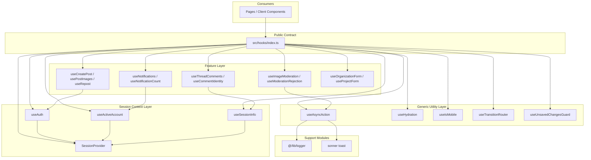
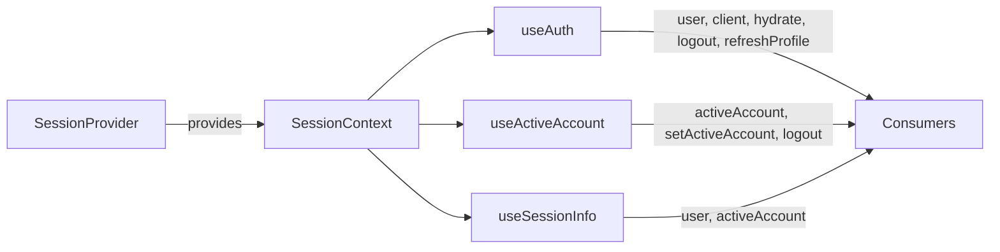
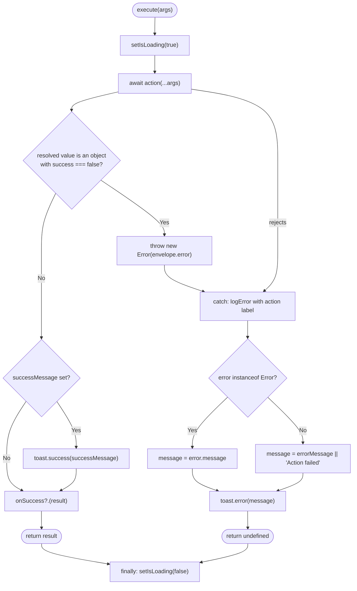

The `src/hooks` directory is the repository-wide collection of reusable React hooks that encapsulate cross-cutting client behavior — session/auth access, async action orchestration, SSR hydration detection, notifications, comments, moderation, and form workflows.

## Purpose and Scope

This page documents the **Shared Hooks Library**: the public hook surface exported from [`src/hooks/index.ts`](https://github.com/ozeaon/ozeaon-v2/blob/0a4f1a95824db87782f1221a4108019d174df3d9/src/hooks/index.ts), the conventions those hooks follow, and the composition patterns they rely on (context-backed session state, async action orchestration, and browser-store synchronization).

In scope:

- The barrel export contract of `src/hooks/index.ts`
- The session context hooks (`SessionProvider`, `useSessionInfo`, `useAuth`, `useActiveAccount`) and the invariant that `user` is display-only
- The generic async orchestration hook `useAsyncAction` and its success/error envelope handling
- Client-only utilities such as `useHydration` and `useIsMobile`
- Feature hooks that build on the above (notifications, comments, moderation, posting, forms, navigation guards)

Out of scope (covered by sibling pages):

- Editor-specific hooks under `src/components/tiptap/hooks` (document editor, upload registry, block counter)
- Top-level configuration and utility modules (`src/config`, `src/lib`) that these hooks import from — for example the logger used by `useAsyncAction`
- Route/page components that consume these hooks; this page treats them only as call sites

## Overview

The hooks library exists to keep client-side stateful behavior out of page components. Instead of every component re-implementing "run an async call, show a toast, toggle a spinner", the repeated behaviors are centralized into named hooks with stable signatures. The directory is deliberately flat and file-per-hook: one hook concept per file, named `use-<concept>.ts(x)`, with a single barrel file re-exporting the public surface.

Two structural conventions are visible directly in the source:

1. **Barrel re-export only.** Consumers import from `@/hooks`, not from deep paths. [`src/hooks/index.ts`](https://github.com/ozeaon/ozeaon-v2/blob/0a4f1a95824db87782f1221a4108019d174df3d9/src/hooks/index.ts#L1-L26) is the single public contract, and it also re-exports associated TypeScript types (`ComposerForm`, `UseCreatePostReturn`, `PostImage`, `PostImageError`).
2. **`"use client"` directives and React primitives for anything stateful.** Hooks that touch context, `useState`, or browser APIs carry `"use client"` and are written as plain `.ts`/`.tsx` modules — no barrel-level logic, no abstraction layer imposed on the hooks themselves.

The library mixes two categories of hook:

| Category | Examples | Characteristic |
|---|---|---|
| Generic infrastructure hooks | `useAsyncAction`, `useHydration`, `useIsMobile`, `useTransitionRouter` | Domain-agnostic; usable in any feature |
| Feature/domain hooks | `useNotifications`, `useThreadComments`, `useCreatePost`, `useRepost`, `useOrganizationForm`, `useProjectForm`, `useProfileImageUpload`, `useDeleteArticle`, `useImageModeration`, `useModerationRejection`, `useAccountSwitch`, `useCommentIdentity` | Bind to a specific domain concept and usually compose the infrastructure hooks |

## Architecture

The library is layered: a context layer provides session state, a generic utility layer provides orchestration primitives, and a feature layer composes both.



The diagram reflects verified imports and exports: `index.ts` re-exports all four session symbols from `./use-auth`, and `useAsyncAction` imports `getLogger`/`logError` from `@/lib/logger` and `toast` from `sonner`. Feature hooks such as `useCreatePost` and `useCommentIdentity` consume the session hooks (`useAuth` / `useSessionInfo` / `useActiveAccount`) as captured in their source.

## Public Export Contract

The barrel file defines a small, explicit API. Anything not listed here is an implementation detail of its own module.

```typescript
export {
  SessionProvider,
  useSessionInfo,
  useAuth,
  useActiveAccount,
} from "./use-auth";
export { useAccountSwitch } from "./use-account-switch";
export { useHydration } from "./use-hydration";
export { useIsMobile } from "./use-is-mobile";
export { useCommentIdentity } from "./use-comment-identity";
export { useThreadComments } from "./use-thread-comments";
export { useNotificationCount } from "./use-notification-count";
export { useNotifications } from "./use-notifications";
export { useProjectForm } from "./use-project-form";
export { useModerationRejection } from "./use-moderation-rejection";
export { useRepost, RepostProvider } from "./use-repost";
export { useAsyncAction } from "./use-async-action";
export { useDeleteArticle } from "./use-delete-article";
export { useImageModeration } from "./use-image-moderation";
export { useProfileImageUpload } from "./use-profile-image-upload";
export { useTransitionRouter } from "./use-transition-router";
export { useUnsavedChangesGuard } from "./use-unsaved-changes-guard";
export { useCreatePost } from "./use-create-post";
export type { ComposerForm, UseCreatePostReturn } from "./use-create-post";
export { usePostImages } from "./use-post-images";
export type { PostImage, PostImageError } from "./use-post-images";
```

> Source: [index.ts](https://github.com/ozeaon/ozeaon-v2/blob/0a4f1a95824db87782f1221a4108019d174df3d9/src/hooks/index.ts#L1-L26)

Design notes visible in this file:

- **Value exports and type exports are separated.** Types are exported with `export type { ... }` so they are erased at build time and never become runtime imports.
- **Two provider components are exported alongside hooks**: `SessionProvider` and `RepostProvider`. This is the pattern used for hooks that require a context — the provider lives in the same module as the consumer hook, guaranteeing they cannot drift apart.
- **Notably absent from the barrel**: `useArticleValidation` and `useIsMobile` is exported but `useAsyncAction` types (`UseAsyncActionOptions`, `UseAsyncActionReturn`) are *not* re-exported, unlike the `use-create-post` types. Type re-exporting is per-hook, not uniform.

## Session Context Layer

`use-auth.tsx` is the foundation of the identity-related half of the library. It defines a single `SessionContext`, a provider that memoizes the context value, a private `useSession()` accessor, and then three narrowly-scoped public hooks.

### Context value and memoization

```tsx
const value = useMemo<SessionContextValue>(
  () => ({
    user,
    activeAccount,
    client,
    hydrate,
    setActiveAccount,
    logout,
    refreshProfile,
  }),
  [user, activeAccount, client, hydrate, logout, refreshProfile],
);

return (
  <SessionContext.Provider value={value}>{children}</SessionContext.Provider>
);
```

> Source: [use-auth.tsx](https://github.com/ozeaon/ozeaon-v2/blob/0a4f1a95824db87782f1221a4108019d174df3d9/src/hooks/use-auth.tsx#L181-L197)

The value is memoized on every one of its own members so that consumers do not re-render merely because the provider re-rendered. `setActiveAccount`, `logout`, and `refreshProfile` are treated as stable identities for this purpose.

### Guarded accessor

```tsx
function useSession() {
  const ctx = useContext(SessionContext);
  if (!ctx) throw new Error("useSession must be used within SessionProvider");
  return ctx;
}
```

> Source: [use-auth.tsx](https://github.com/ozeaon/ozeaon-v2/blob/0a4f1a95824db87782f1221a4108019d174df3d9/src/hooks/use-auth.tsx#L199-L203)

`useSession` is intentionally **not exported**. It fails fast with a descriptive error rather than returning `null` and letting downstream code produce a `Cannot read property of null` deep inside a component. All three public hooks funnel through it, so the provider requirement is enforced once.

### The three public session hooks

```tsx
/** Identity + browser client + session actions. `user` is display-only (invariant #2). */
export function useAuth() {
  const { user, client, hydrate, logout, refreshProfile } = useSession();
  return { user, client, hydrate, logout, refreshProfile };
}

/** Active account (personal vs org) + switch/logout actions. */
export function useActiveAccount() {
  const { activeAccount, setActiveAccount, logout } = useSession();
  return { activeAccount, setActiveAccount, logout };
}

export function useSessionInfo() {
  const { user, activeAccount } = useSession();
  return { user, activeAccount };
}
```

> Source: [use-auth.tsx](https://github.com/ozeaon/ozeaon-v2/blob/0a4f1a95824db87782f1221a4108019d174df3d9/src/hooks/use-auth.tsx#L205-L220)

This is the key design decision of the module: rather than letting every component subscribe to the entire session context, the hooks **project a subset** of the context. A component that only needs the active account cannot accidentally depend on `client` or `hydrate`. The doc comments encode an explicit project invariant — *"`user` is display-only (invariant #2)"* — signalling that `user` must not be used for authorization decisions client-side.



Consumers observed in source: [`use-create-post.ts`](https://github.com/ozeaon/ozeaon-v2/blob/0a4f1a95824db87782f1221a4108019d174df3d9/src/hooks/use-create-post.ts#L52) calls `useAuth()`, [`use-comment-identity.ts`](https://github.com/ozeaon/ozeaon-v2/blob/0a4f1a95824db87782f1221a4108019d174df3d9/src/hooks/use-comment-identity.ts#L13) destructures `{ user, activeAccount }` from `useSessionInfo()`, and [`use-notification-count.ts`](https://github.com/ozeaon/ozeaon-v2/blob/0a4f1a95824db87782f1221a4108019d174df3d9/src/hooks/use-notification-count.ts#L27) and [`use-notifications.ts`](https://github.com/ozeaon/ozeaon-v2/blob/0a4f1a95824db87782f1221a4108019d174df3d9/src/hooks/use-notifications.ts#L36) both call `useActiveAccount()`. This confirms the subset-projection pattern is actually used as intended — each feature hook takes only the slice it needs.

## Generic Infrastructure Hooks

### `useAsyncAction` — async orchestration with an envelope protocol

`useAsyncAction` is the most reusable hook in the library. It wraps an arbitrary async function with loading state, toast feedback, logging, and an **error-envelope convention**.

```typescript
interface UseAsyncActionOptions<T = void> {
  onSuccess?: (result: T) => void;
  successMessage?: string;
  errorMessage?: string;
  /**
   * Identifies this action in logs. `action.name` is empty for the inline
   * arrow functions every call site passes, so without this every failure
   * logs as the same unattributable "Async action error".
   */
  actionName?: string;
}

interface UseAsyncActionReturn<T = void> {
  execute: (...args: unknown[]) => Promise<T | undefined>;
  isLoading: boolean;
}
```

> Source: [use-async-action.ts](https://github.com/ozeaon/ozeaon-v2/blob/0a4f1a95824db87782f1221a4108019d174df3d9/src/hooks/use-async-action.ts#L9-L24)

The `actionName` option exists for a concrete, documented reason captured in its own comment: call sites pass **inline arrow functions**, whose `.name` is empty. Without an explicit label, every failure would log identically as `"Async action error"`, making production logs unattributable. This is a deliberate observability affordance, not incidental configuration.

### The envelope convention

```typescript
const execute = useCallback(
  async (...args: unknown[]): Promise<T | undefined> => {
    setIsLoading(true);
    try {
      const result = (await action(...args)) as T;

      if (
        result &&
        typeof result === "object" &&
        "success" in result &&
        result.success === false
      ) {
        const errorResult = result as { success: false; error?: string };
        throw new Error(errorResult.error || "Action failed");
      }

      if (successMessage) {
        toast.success(successMessage);
      }

      onSuccess?.(result);
      return result;
    } catch (error) {
      logError(logger, "Async action error", error, {
        action: actionName || action.name || "unknown",
      });
      const message =
        error instanceof Error
          ? error.message
          : errorMessage || "Action failed";
      toast.error(message);
    } finally {
      setIsLoading(false);
    }
  },
  [action, onSuccess, successMessage, errorMessage, actionName],
);
```

> Source: [use-async-action.ts](https://github.com/ozeaon/ozeaon-v2/blob/0a4f1a95824db87782f1221a4108019d174df3d9/src/hooks/use-async-action.ts#L33-L69)

Behavior worth noting for anyone extending this hook:

- **Result envelopes are normalized into throws.** If the wrapped action *resolves* with `{ success: false }`, the hook reinterprets it as a failure and throws. This lets server actions return structured error results without each call site writing its own check — the hook is the single place that decides "resolve-with-success-false means failed".
- **Error message precedence is inverted between branches.** Inside `catch`, if the thrown value is an `Error`, its `.message` wins *and `errorMessage` is ignored*; only a non-`Error` throw falls back to `errorMessage`. So `errorMessage` functions as a fallback for non-`Error` rejections, not an override for real error messages.
- **`isLoading` is always cleared**, including on the error path, because the reset lives in `finally`.
- **The return type is `Promise<T | undefined>`** — the error path returns nothing (the `catch` block has no `return`), so callers must handle `undefined`.

The logger is created once at module scope with a namespaced tag:

```typescript
const logger = getLogger(["hooks", "use-async-action"]);
```

> Source: [use-async-action.ts](https://github.com/ozeaon/ozeaon-v2/blob/0a4f1a95824db87782f1221a4108019d174df3d9/src/hooks/use-async-action.ts#L7)

This nested-array namespace convention lets log output be filtered by subsystem path (`hooks` → `use-async-action`). For the logger implementation, see the configuration and utilities pages; this page treats `@/lib/logger` as an external support module.



### `useHydration` — SSR-safe client detection

```typescript
"use client";

import { useSyncExternalStore } from "react";

export function useHydration() {
  return useSyncExternalStore(
    () => () => {}, // noop subscribe
    () => true, // getSnapshot (client)
    () => false, // getServerSnapshot (server)
  );
}
```

> Source: [use-hydration.tsx](https://github.com/ozeaon/ozeaon-v2/blob/0a4f1a95824db87782f1221a4108019d174df3d9/src/hooks/use-hydration.tsx#L1-L11)

This is the idiomatic hydration guard: it returns `false` during server rendering and the first client render, then `true` afterwards. Using `useSyncExternalStore` rather than the older `useState` + `useEffect` pattern means React itself arbitrates the server/client snapshot difference, avoiding an extra render pass and the hydration mismatch warnings that come with ad-hoc `mounted` flags. The noop `subscribe` correctly communicates "this store never changes" — the value is stable per environment.

The same state-synchronization primitive is used for the media-query hook and, by naming convention, the browser-store hooks:

```
src/hooks/use-hydration.tsx
src/hooks/use-is-mobile.tsx
```

Both are `.tsx` files despite `useHydration` returning a boolean with no JSX — a minor inconsistency in the file-naming convention that does not affect behavior.

### Other generic hooks

| Hook | File | Exported symbols |
|---|---|---|
| `useAsyncAction` | [`use-async-action.ts`](https://github.com/ozeaon/ozeaon-v2/blob/0a4f1a95824db87782f1221a4108019d174df3d9/src/hooks/use-async-action.ts) | `useAsyncAction` |
| `useHydration` | [`use-hydration.tsx`](https://github.com/ozeaon/ozeaon-v2/blob/0a4f1a95824db87782f1221a4108019d174df3d9/src/hooks/use-hydration.tsx) | `useHydration` |
| `useIsMobile` | [`use-is-mobile.tsx`](https://github.com/ozeaon/ozeaon-v2/blob/0a4f1a95824db87782f1221a4108019d174df3d9/src/hooks/use-is-mobile.tsx) | `useIsMobile` |
| `useTransitionRouter` | [`use-transition-router.ts`](https://github.com/ozeaon/ozeaon-v2/blob/0a4f1a95824db87782f1221a4108019d174df3d9/src/hooks/use-transition-router.ts) | `useTransitionRouter` |
| `useUnsavedChangesGuard` | [`use-unsaved-changes-guard.ts`](https://github.com/ozeaon/ozeaon-v2/blob/0a4f1a95824db87782f1221a4108019d174df3d9/src/hooks/use-unsaved-changes-guard.ts) | `useUnsavedChangesGuard` |

The presence of `useTransitionRouter` and `useUnsavedChangesGuard` alongside the navigation-independent hooks shows the library absorbs **navigation concerns** too: routing must go through a wrapper hook (likely to coordinate view transitions), and unsaved-work protection is provided as a reusable guard rather than reimplemented per form. Implementation details of those two modules were not read for this page.
