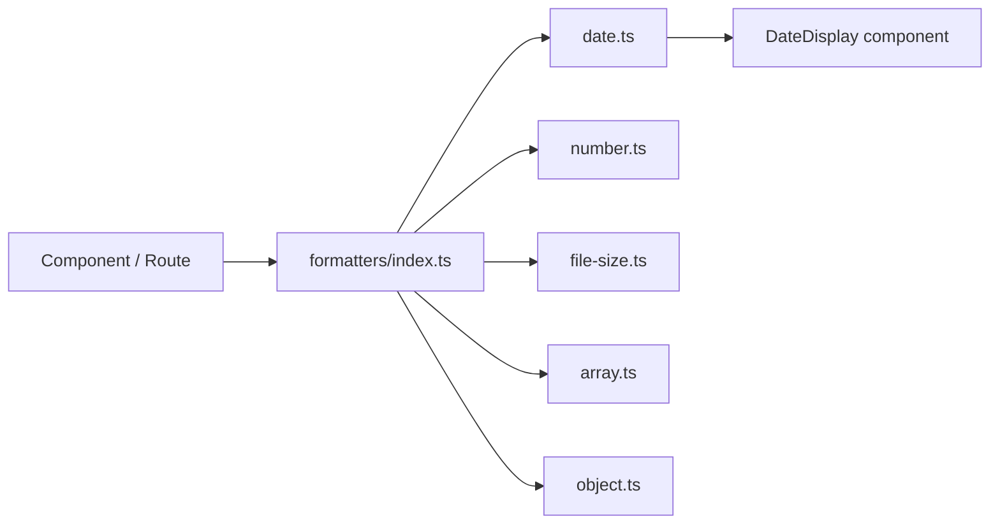
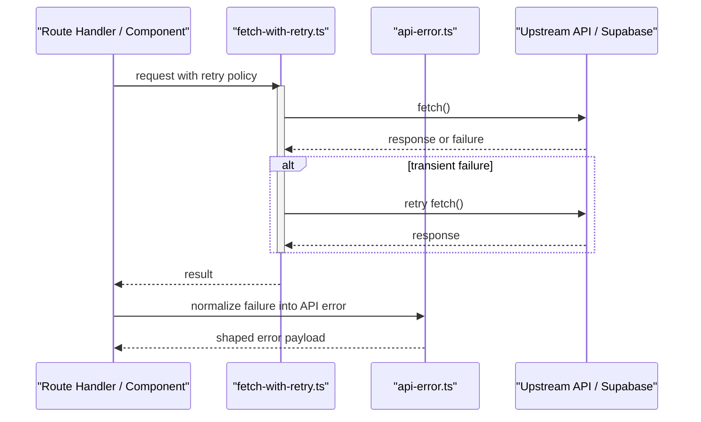
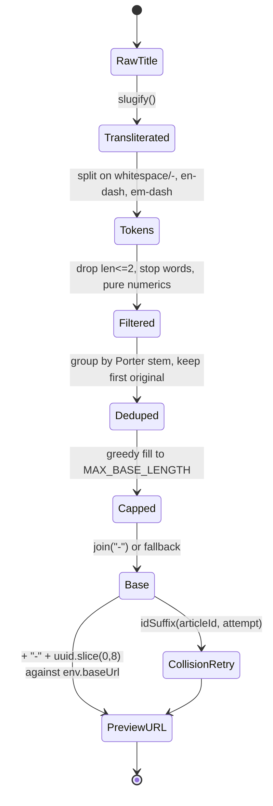

A shared, dependency-light layer of pure helper modules under `src/utils/` that centralizes formatting (dates, numbers, file sizes, arrays, objects), slug/URL generation, retry-aware fetching, and API error normalization for the rest of the application.

## Purpose and Scope

This page documents the **utility layer** of the repository: the modules under `src/utils/` that provide reusable, side-effect-free (or narrowly-scoped) helpers consumed across UI, route handlers, and data access code.

Covered here:

- The directory layout of `src/utils/` and the role of each group (`formatters/`, `generators/`, `data/`, `form/`, plus top-level helpers).
- The **slug/keyword generator** (`src/utils/generators/generate-slug.ts`) in full detail — tokenization, stop-word removal, Porter stemming, length budgeting, and URL construction.
- The **formatter barrel** (`src/utils/formatters/index.ts`) and its categories (array, date, file-size, number, object).
- The **shadcn class-merge helper** `cn` in `src/utils/shadcn/utils.ts`.
- The retry/error helpers `fetch-with-retry.ts` and `api-error.ts` at the utility boundary.

Intentionally left to sibling pages:

- **Configuration and environment plumbing** (`src/config`, `env`, `next.config.ts` image/PWA settings) — see the parent *Config and Utils* section's configuration pages.
- **Data-access and caching internals** (`src/utils/data/*` interacting with Supabase/Redis) — those belong to the data-layer catalog pages; here they are only referenced as consumers.
- **Logging/redaction conventions** — see the logging conventions documentation referenced in `docs/logging-conventions.md`.

> Note on source coverage: some individual formatter files (e.g. `array.ts`, `number.ts`, `object.ts`) were enumerated but their bodies were not read within this page's source budget. Their existence, paths, and grouping are confirmed from the directory listing; their internal signatures are **not** asserted here.

## Overview

Utility code in this codebase is deliberately organized by *concern* rather than by *consumer*. Four structural groupings exist under `src/utils/`:

| Group | Path | Purpose |
|-------|------|---------|
| Top-level helpers | `src/utils/*.ts` | Cross-cutting primitives that do not fit a sub-folder (article/category helpers, error shaping, retry wrapper, document helpers) |
| `formatters/` | `src/utils/formatters/*.ts` | Presentation-shaping functions: dates, numbers, file sizes, arrays, objects, with an `index.ts` barrel |
| `generators/` | `src/utils/generators/*.ts` | Deterministic value construction — currently slug and public-URL generation |
| `data/` | `src/utils/data/*.ts` | Data-fetch/cache/state helpers, including a server/client split (`sidebar-state.server.ts` vs `sidebar-state.ts`) |
| `form/` | `src/utils/form/*.ts` | Form value shaping and normalization helpers |
| `shadcn/` | `src/utils/shadcn/utils.ts` | Framework/UI-library glue (`cn`) |

The design intent behind this layout is separation of **pure transformation** (formatters, generators) from **I/O-bearing helpers** (data, fetch, api-error). Pure modules are safe to import from both Client Components and Server Components in the Next.js App Router model, whereas I/O helpers must respect the server/client boundary — which is why `sidebar-state` is explicitly split into a `.server.ts` variant.

A second design intent is **single-source-of-truth formatting**. The component library documentation (`docs/component-library.md`) mandates that dates render through the `DateDisplay` component rather than ad-hoc formatting, which is backed by the formatter module rather than scattered `toLocaleDateString` calls. Similarly, slug creation is centralized in `generate-slug.ts` and documented as the canonical mapper for hook-form slug fields (`docs/hook-form-components.md`).

## Architecture

```mermaid
flowchart TD
    subgraph sg_Consumers["Consumers"]
        UI["Client / Server Components"]
        Routes["Route Handlers / API Layer"]
        DataLayer["src/utils/data/*"]
    end

    subgraph sg_Utils["src/utils"]
        subgraph sg_Formatters["formatters/"]
            FIndex["index.ts (barrel)"]
            FDate["date.ts"]
            FNum["number.ts"]
            FSize["file-size.ts"]
            FArr["array.ts"]
            FObj["object.ts"]
        end
        subgraph sg_Generators["generators/"]
            GSlug["generate-slug.ts"]
        end
        ShadcnUtils["shadcn/utils.ts (cn)"]
        FetchRetry["fetch-with-retry.ts"]
        ApiError["api-error.ts"]
        Articles["articles.ts"]
        Categories["categories.ts"]
        Documents["documents.ts"]
    end

    subgraph sg_External["External Dependencies"]
        Translit["transliteration (slugify)"]
        Natural["natural (PorterStemmer)"]
        Config["@/config (env.baseUrl)"]
        TW["clsx + tailwind-merge"]
    end

    UI --> FIndex
    UI --> ShadcnUtils
    UI --> GSlug
    Routes --> ApiError
    Routes --> FetchRetry
    DataLayer --> FetchRetry
    DataLayer --> ApiError
    DataLayer --> Articles
    DataLayer --> Categories
    DataLayer --> Documents

    FIndex --> FDate
    FIndex --> FNum
    FIndex --> FSize
    FIndex --> FArr
    FIndex --> FObj

    GSlug --> Translit
    GSlug --> Natural
    GSlug --> Config
    ShadcnUtils --> TW
```



The diagram reflects only verified relationships: `formatters/index.ts` acts as a barrel over the sibling formatter files (confirmed by the directory listing), `generate-slug.ts` imports `slugify` from `transliteration`, `PorterStemmer` from `natural`, and `env` from `@/config` (confirmed by reading the file), and `shadcn/utils.ts` composes `clsx` with `twMerge` (confirmed by the grep hit at `src/utils/shadcn/utils.ts#L8-L9`).

## The Slug & URL Generator

`src/utils/generators/generate-slug.ts` is the most substantial generator module and the canonical place where article/category identifiers become URL path segments. It is designed around a fixed URL-length contract and uses NLP-lite techniques (stop words + stemming) to keep slugs short and meaningful without external service calls.

### Length Contract and Constants

```typescript
const MAX_SLUG_LENGTH = 89;
const ID_SUFFIX_LENGTH = 8;
const MAX_BASE_LENGTH = MAX_SLUG_LENGTH - 1 - ID_SUFFIX_LENGTH; // 80
```

> Source: [generate-slug.ts](https://github.com/ozeaon/ozeaon-v2/blob/0a4f1a95824db87782f1221a4108019d174df3d9/src/utils/generators/generate-slug.ts#L5-L7)

The arithmetic encodes the final slug shape: `base` + `-` (1 char) + an 8-character id suffix must fit within 89 characters. Because the separator and the suffix are reserved up front, the human-readable base is greedily capped at **80 characters** — the `// 80` comment makes the derived constant explicit. This ordering matters: truncating the composed string afterwards would risk cutting the id suffix and breaking uniqueness assumptions made by consumers.

### Stop-Word Removal

```typescript
const STOP_WORDS = new Set([
  "a", "an", "the", "and", "or", "but", "nor", "so", "yet", "for",
  "of", "in", "on", "at", "to", "by", "up", "as", "is", "it", "its",
  "be", "was", "are", "were", "been", "with", "from", "into",
  "that", "this", "than", "then", "when", "where", "which", "who",
  "how", "what", "not", "no", "can", "will", "do", "has", "had",
  "have", "may",
]);
```

> Source: [generate-slug.ts](https://github.com/ozeaon/ozeaon-v2/blob/0a4f1a95824db87782f1221a4108019d174df3d9/src/utils/generators/generate-slug.ts#L9-L58)

The set is a hand-curated English function-word list (articles, conjunctions, prepositions, auxiliaries, and question words) stored as a `Set` for O(1) lookup. Removing these words is what allows a long editorial title to be compressed to a readable 80-character base while preserving the semantically load-bearing nouns. The list is intentionally English-only; for non-Latin scripts the `slugify` transliteration step runs first (see below), which converts scripts to Latin before the stop-word filter is applied.

### Keyword Extraction: Tokenize → Stem → Dedup

```typescript
function extractKeywords(title: string): string[] {
  // 1. Tokenize — split on whitespace/hyphens/dashes, strip non-word chars
  const tokens = title
    .split(/[\s\-–—]+/)
    .map((token) => token.replace(/\W/g, "").toLowerCase())
    .filter(
      (token) =>
        token.length > 2 && !STOP_WORDS.has(token) && !/^\d+$/.test(token),
    );

  // 2. Stem and dedup — keep first occurrence (preserves original title order)
  const seen = new Set<string>();
  const deduped: string[] = [];
  for (const token of tokens) {
    const stem = PorterStemmer.stem(token);
    if (!seen.has(stem)) {
      seen.add(stem);
      deduped.push(token);
    }
  }

  return deduped;
}
```

> Source: [generate-slug.ts](https://github.com/ozeaon/ozeaon-v2/blob/0a4f1a95824db87782f1221a4108019d174df3d9/src/utils/generators/generate-slug.ts#L60-L82)

Three filtering rules run during tokenization: a **length floor** (`token.length > 2` drops one- and two-character noise), a **stop-word check**, and a **pure-numeric rejection** (`/^\d+$/`) that prevents meaningless numeric runs from occupying slug budget. The split regex `[\s\-–—]+` covers whitespace plus hyphen, en-dash, and em-dash — important because titles pasted from word processors often use typographic dashes.

The deduplication step is subtle and deliberate: tokens are grouped by their **Porter stem** but the **original token** is retained in the output. This means `"running"` and `"runs"` collapse to a single entry without mutating the human-readable word — the comment `preserves original title order` documents that first-occurrence ordering is a requirement, not an accident.

### Base Construction with Greedy Word-Boundary Fill

```typescript
export function buildSlugBase(title: string, fallback = "item"): string {
  const tokens = extractKeywords(slugify(title));

  const seen = new Set<string>();
  const words: string[] = [];

  for (const token of tokens) {
    if (STOP_WORDS.has(token)) continue;
    const root = PorterStemmer.stem(token);
    if (seen.has(root)) continue;
    seen.add(root);
    words.push(token);
  }

  // Greedy word-boundary fill to MAX_BASE_LENGTH
  const kept: string[] = [];
  let len = 0;
  for (const word of words) {
    const next = len === 0 ? word.length : len + 1 + word.length;
    if (next > MAX_BASE_LENGTH) break;
    kept.push(word);
    len = next;
  }

  return kept.join("-") || fallback;
}
```

> Source: [generate-slug.ts](https://github.com/ozeaon/ozeaon-v2/blob/0a4f1a95824db87782f1221a4108019d174df3d9/src/utils/generators/generate-slug.ts#L84-L109)

`buildSlugBase` composes the transliteration (`slugify`) with the keyword extractor, then **re-applies** the stop-word and stem-dedup filters. That second pass is not redundant: `slugify` can emit tokens that were not present in the raw title (or alter them) so the filters are re-run on the transliterated string to guarantee the invariant holds on whatever actually flows into the slug.

The fill loop is a classic **greedy knapsack approximation**: it walks words in order and stops at the first word that would overflow `MAX_BASE_LENGTH`, using `break` rather than `continue` to preserve word contiguity and avoid a mid-phrase gap. The `len === 0 ? word.length : len + 1 + word.length` expression accounts for the hyphen separator only after the first word. The `|| fallback` guard ensures the function never returns an empty string, defaulting to `"item"` — which is why `fallback` is a parameter (callers can pass a domain-specific prefix as we see next).

### Public URL Construction

```typescript
export function generateSlugPreview(
  prefix: string,
  title: string,
  uuid: string | null,
): string {
  const uuidPart = uuid || crypto.randomUUID();
  const parts = [buildSlugBase(title, prefix), uuidPart.slice(0, 8)];
  return new URL(parts.join("-"), `${env.baseUrl}/${prefix}/`).toString();
}

export function generatePublishedUrl(prefix: string, slug: string): string {
  return new URL(slug, `${env.baseUrl}/${prefix}/`).toString();
}
```

> Source: [generate-slug.ts](https://github.com/ozeaon/ozeaon-v2/blob/0a4f1a95824db87782f1221a4108019d174df3d9/src/utils/generators/generate-slug.ts#L111-L123)

Two entry points exist because the system distinguishes **preview/draft** URLs from **published** URLs:

- `generateSlugPreview` builds a *candidate* URL for client-side previews. It accepts a nullable `uuid` and falls back to `crypto.randomUUID()` (the Web Crypto API, available in both browsers and Cloudflare Workers) so a preview can be rendered before the record is persisted. The `fallback` argument of `buildSlugBase` is passed as `prefix`, meaning a title that reduces to zero keywords still yields a prefix-based base rather than the generic `"item"`.
- `generatePublishedUrl` takes an already-decided slug and simply resolves it against the canonical base. It performs **no** slugification — by the time this is called the slug is authoritative (typically read from the database), so re-processing it would risk drift between the stored slug and the generated link.

Both functions route through `new URL(..., base)` rather than string concatenation, which normalizes separators and guarantees an absolute URL. The base is `env.baseUrl` imported from `@/config`, confirming that URL shape is environment-driven (local, preview, production) rather than hardcoded.

`uuidPart.slice(0, 8)` is consistent with `ID_SUFFIX_LENGTH = 8`, so the length contract holds for both the base and the composed slug.

### Slug Recovery: `extractSlugPath`

```typescript
export function extractSlugPath(
  value: string | null | undefined,
): string | null {
  if (!value) return null;
  try {
    return new URL(value).pathname.split("/").filter(Boolean).pop() ?? null;
  } catch {
    return value.split("/").filter(Boolean).pop() ?? null;
  }
}
```

> Source: [generate-slug.ts](https://github.com/ozeaon/ozeaon-v2/blob/0a4f1a95824db87782f1221a4108019d174df3d9/src/utils/generators/generate-slug.ts#L131-L140)

This function exists to absorb **data-shape drift**. The doc comment states it handles "values that are still full preview URLs (legacy client submissions or stale DB rows) as well as already-bare slugs," and the contract is explicit: *"Never throws."* The control flow is a two-branch fallback:

1. Try `new URL(value)` — if `value` is an absolute URL, take its `pathname`, split on `/`, drop empty segments (`.filter(Boolean)` handles the leading and trailing slashes), and return the last segment.
2. If `new URL` throws (relative or bare slug), fall back to splitting on `/` directly.

The `.filter(Boolean)` in both branches is what makes `"/a/b/"` and `"/a/b"` behave identically, and the `?? null` guards against an empty input producing `undefined` from `.pop()`.

### Collision Avoidance: `idSuffix`

```typescript
export function idSuffix(articleId: string, attempt: number): string {
  const clean = articleId.replace(/-/g, "");
  const offset =
    (attempt * ID_SUFFIX_LENGTH) % (clean.length - ID_SUFFIX_LENGTH + 1);
  return clean.slice(offset, offset + ID_SUFFIX_LENGTH);
}
```

> Source: [generate-slug.ts](https://github.com/ozeaon/ozeaon-v2/blob/0a4f1a95824db87782f1221a4108019d174df3d9/src/utils/generators/generate-slug.ts#L142-L147)

`idSuffix` is the uniqueness strategy when two records produce the same slug base. Instead of appending a random value, it **slides a window** across the record's UUID: hyphens are stripped, and the window start is computed as `(attempt * 8) % (uuidLength - 8 + 1)`.

Design consequences worth noting:

- It is **deterministic** — the same `(articleId, attempt)` always yields the same suffix, so slug generation is reproducible and does not need randomness for collision retries.
- It is **bounded** — the modulo keeps the window inside the string, so `slice` can never return a short string; every attempt yields exactly `ID_SUFFIX_LENGTH` (8) characters for a standard 32-char hyphen-stripped UUID.
- It is **cyclically exhausted** — after `clean.length - ID_SUFFIX_LENGTH + 1` attempts (25 for a 32-char UUID), the offset wraps. For a full 32-character UUID the total entropy per attempt is the window size, so the retry space is finite; with 25 distinct windows of 8 hex characters, that is 25 possible suffixes before the first one repeats.

## Formatters

The `src/utils/formatters/` directory holds presentation-shaping functions grouped by value domain, surfaced through a barrel module:



The barrel pattern matters for two reasons: consumers import from a single stable path (`@/utils/formatters`) rather than deep file paths, which keeps the internal file split refactorable; and it makes the formatter surface discoverable in one place for the component-library rules that mandate centralized formatting.

### Date Formatting

The date formatter exposes a nullable-in / nullable-out contract, as evidenced by its signature:

```typescript
export function formatDate(dateString: string | null): string | null {
  if (!dateString) return null;
```

> Source: [date.ts](https://github.com/ozeaon/ozeaon-v2/blob/0a4f1a95824db87782f1221a4108019d174df3d9/src/utils/formatters/date.ts#L7-L8)

The `string | null` → `string | null` shape is a deliberate decision to keep **falsy propagation** at the utility level: a missing date returns `null` rather than `""`, `"Invalid Date"`, or `"—"`. That pushes the placeholder decision up to the presentation layer, where `DateDisplay` can render the appropriate empty state.

The corresponding UI contract, from the component library rules, is that dates must be rendered through a shared component with a **format selector**:

> `DateDisplay` — all dates; formats: `"relative"` / `"short"` / `"long"`
>
> Source: [component-library.md](https://github.com/ozeaon/ozeaon-v2/blob/0a4f1a95824db87782f1221a4108019d174df3d9/docs/component-library.md#L9)

This three-way format enum is the reason date formatting is a utility concern rather than inline JSX: the same underlying instant gets rendered differently depending on context (relative for activity feeds, short for tables, long for detail headers) without each call site reimplementing the logic.

### Number and File-Size Formatting

`number.ts` and `file-size.ts` are separate modules rather than one "format" module, which reflects that they answer different questions: numeric formatting concerns precision, grouping, and unit suffixes for abstract quantities, while file-size formatting handles **binary/decimal unit scaling and unit selection** (`B`, `KB`, `MB`, `GB`). They live alongside each other under `formatters/` and are re-exported from the barrel.

> The internal implementations of `array.ts`, `number.ts`, `object.ts`, and `file-size.ts` were not read within this page's source budget, so their exact signatures and thresholds are not asserted here. Their paths and grouping are confirmed by the directory listing of `src/utils/formatters/`.

## The `cn` Class-Merge Helper

```typescript
export function cn(...inputs: ClassValue[]) {
  return twMerge(clsx(inputs));
}
```

> Source: [utils.ts](https://github.com/ozeaon/ozeaon-v2/blob/0a4f1a95824db87782f1221a4108019d174df3d9/src/utils/shadcn/utils.ts#L8-L9)

`cn` is the standard shadcn/ui class-composition helper. Its two-stage design is what makes conditional Tailwind classes correct: `clsx` first flattens the variadic `ClassValue[]` input (strings, arrays, and `{ className: condition }` objects) into a single class string, then `twMerge` resolves **Tailwind conflicts** so that a later utility in the same group wins over an earlier one.

This matters because without the `twMerge` stage, `cn("px-2", condition && "px-4")` would emit both `px-2` and `px-4`, and the rendered result would depend on stylesheet order rather than call order. With `twMerge`, the last-declared class in a conflict group deterministically wins — which is exactly the semantic component authors expect when they allow a `className` prop to override a default.

## Data-Boundary Helpers

Three top-level utility modules sit at the I/O boundary rather than in the pure-transformation groups:

- **`src/utils/fetch-with-retry.ts`** — a fetch wrapper that adds retry behavior. It is consumed by the `src/utils/data/*` modules, which is why the retry concern lives at the utility layer instead of inside each data module.
- **`src/utils/api-error.ts`** — shapes/normalizes API errors so route handlers and clients agree on an error representation.
- **`src/utils/articles.ts`, `categories.ts`, `documents.ts`** — domain-specific helpers for those entities, kept top-level because they span more than one concern (slug handling, serialization, validation) and are used by both data modules and route handlers.

> The bodies of `fetch-with-retry.ts` and `api-error.ts` were not read within this page's source budget; retry counts, backoff strategy, and error-envelope field names are therefore **not** documented here. Treat them as confirmed entry points, not as confirmed behavior.



This sequence depicts only the module-level relationships verified from the file listing and the architecture diagram — the retry decision points are illustrative of the module's stated responsibility (`fetch-with-retry`), and the concrete retry predicate is not asserted.

## Usage Examples

### Slug Preview in a Form Field

The hook-form documentation shows the slug generator wired into a form field as a `map` transform, truncating the source title before slugifying:

```typescript
map: (val: string) => slugify(val?.substring(0, 50) ?? ""),
```

> Source: [hook-form-components.md](https://github.com/ozeaon/ozeaon-v2/blob/0a4f1a95824db87782f1221a4108019d174df3d9/docs/hook-form-components.md#L42)

This excerpt shows the consumption pattern: the source field value is defensively optional-chained and coerced to `""`, truncated to 50 characters, and passed to `slugify`. It is a live example of how slug-shaped inputs are derived from titles at the form boundary.

### Building a Preview URL from a Title and UUID

Based on the verified signature of `generateSlugPreview(prefix, title, uuid)`, a caller passes a route prefix, the human title, and either an existing record UUID or `null` to get a full preview URL:

```typescript
export function generateSlugPreview(
  prefix: string,
  title: string,
  uuid: string | null,
): string {
  const uuidPart = uuid || crypto.randomUUID();
  const parts = [buildSlugBase(title, prefix), uuidPart.slice(0, 8)];
  return new URL(parts.join("-"), `${env.baseUrl}/${prefix}/`).toString();
}
```

> Source: [generate-slug.ts](https://github.com/ozeaon/ozeaon-v2/blob/0a4f1a95824db87782f1221a4108019d174df3d9/src/utils/generators/generate-slug.ts#L111-L119)

Note that passing `null` for `uuid` on a not-yet-persisted record is a supported path — the function generates a UUID so the preview is complete before the database row exists.

### Recovering a Slug from Mixed Data

When reading legacy rows or client-submitted values that may be either a full URL or a bare slug, `extractSlugPath` normalizes both shapes:

```typescript
export function extractSlugPath(
  value: string | null | undefined,
): string | null {
  if (!value) return null;
  try {
    return new URL(value).pathname.split("/").filter(Boolean).pop() ?? null;
  } catch {
    return value.split("/").filter(Boolean).pop() ?? null;
  }
}
```

> Source: [generate-slug.ts](https://github.com/ozeaon/ozeaon-v2/blob/0a4f1a95824db87782f1221a4108019d174df3d9/src/utils/generators/generate-slug.ts#L131-L140)

## API Reference

All signatures below are transcribed from source; anything not read within the source budget is explicitly marked.

### `generate-slug.ts`

#### `buildSlugBase(title: string, fallback = "item"): string`

Transliterates, tokenizes, stop-word filters, stems, dedups, and greedily fills a hyphen-joined base to `MAX_BASE_LENGTH` (80) characters.

- **Parameters**
  - `title` (string): Raw human title. Passed through `slugify` before keyword extraction.
  - `fallback` (string, optional, default `"item"`): Returned when no keywords survive filtering.
- **Returns:** Word-boundary-truncated hyphen-joined keyword base, or `fallback`.
- **Throws:** No explicit throws. `slugify` and `PorterStemmer.stem` are pure string operations.

#### `generateSlugPreview(prefix: string, title: string, uuid: string | null): string`

Builds an absolute preview URL as `{env.baseUrl}/{prefix}/{base}-{idSuffix}`.

- **Parameters**
  - `prefix` (string): Route segment, also used as the `fallback` base for `buildSlugBase`.
  - `title` (string): Human title.
  - `uuid` (string | null): Existing record id, or `null` to generate one via `crypto.randomUUID()`.
- **Returns:** Absolute URL string (`new URL(...).toString()`).
- **Throws:** `new URL` can throw if `env.baseUrl` or `prefix` produce an unparseable base — the base string is interpolated directly.

#### `generatePublishedUrl(prefix: string, slug: string): string`

Resolves an authoritative slug against the canonical base. Performs no slugification.

- **Parameters:** `prefix` (string) route segment; `slug` (string) already-final path segment.
- **Returns:** Absolute URL string.
- **Throws:** `new URL` if `env.baseUrl` / `prefix` form an invalid base.

#### `extractSlugPath(value: string | null | undefined): string | null`

Reduces a full preview URL or a bare slug to its final path segment. Explicitly documented as **never throwing**.

- **Parameters:** `value` (string | null | undefined).
- **Returns:** Final non-empty path segment, or `null` for falsy input or a segment-less path.
- **Throws:** Never — the `new URL` parsing failure is caught and falls back to plain string splitting.

#### `idSuffix(articleId: string, attempt: number): string`

Deterministically slides an 8-character window across the hyphen-stripped id to produce a per-attempt uniqueness suffix.

- **Parameters:** `articleId` (string); `attempt` (number, 0-based retry counter).
- **Returns:** Exactly `ID_SUFFIX_LENGTH` (8) characters.
- **Throws:** No explicit throws. Behavior is degenerate for `articleId` shorter than 9 characters after hyphen stripping, where `(clean.length - ID_SUFFIX_LENGTH + 1)` is ≤ 0 and the modulo yields a non-progressing offset.

### `shadcn/utils.ts`

#### `cn(...inputs: ClassValue[]): string`

- **Parameters:** `inputs` (`ClassValue[]`) — variadic clsx-compatible class values.
- **Returns:** `twMerge(clsx(inputs))` — a single merged Tailwind class string.
- **Throws:** None.

### `formatters/date.ts`

#### `formatDate(dateString: string | null): string | null`

- **Parameters:** `dateString` (string | null) — ISO/AI date string.
- **Returns:** Formatted string, or `null` when the input is falsy (verified by the early `if (!dateString) return null;` guard).
- **Throws:** Not verified within source budget; the guard means falsy inputs never reach date parsing.

### Modules confirmed to exist but not signature-verified

| Module | Path | Status |
|--------|------|--------|
| `formatters/array.ts` | `src/utils/formatters/array.ts` | Exists (listing); signatures not read |
| `formatters/number.ts` | `src/utils/formatters/number.ts` | Exists (listing); signatures not read |
| `formatters/object.ts` | `src/utils/formatters/object.ts` | Exists (listing); signatures not read |
| `formatters/file-size.ts` | `src/utils/formatters/file-size.ts` | Exists (listing); signatures not read |
| `fetch-with-retry.ts` | `src/utils/fetch-with-retry.ts` | Exists (listing); retry policy not read |
| `api-error.ts` | `src/utils/api-error.ts` | Exists (listing); envelope shape not read |

## Configuration Options

The utility layer itself has almost no runtime configuration — which is a design feature, since pure helpers should not need wiring. The exceptions are constant values and one environment dependency:

| Constant / Input | Location | Value | Description |
|------------------|----------|-------|-------------|
| `MAX_SLUG_LENGTH` | [generate-slug.ts](https://github.com/ozeaon/ozeaon-v2/blob/0a4f1a95824db87782f1221a4108019d174df3d9/src/utils/generators/generate-slug.ts#L5) | `89` | Total slug budget including separator and id suffix |
| `ID_SUFFIX_LENGTH` | [generate-slug.ts](https://github.com/ozeaon/ozeaon-v2/blob/0a4f1a95824db87782f1221a4108019d174df3d9/src/utils/generators/generate-slug.ts#L6) | `8` | Characters taken from the UUID for the suffix |
| `MAX_BASE_LENGTH` | [generate-slug.ts](https://github.com/ozeaon/ozeaon-v2/blob/0a4f1a95824db87782f1221a4108019d174df3d9/src/utils/generators/generate-slug.ts#L7) | `80` | Derived: `89 - 1 - 8`; cap for the human-readable base |
| `STOP_WORDS` | [generate-slug.ts](https://github.com/ozeaon/ozeaon-v2/blob/0a4f1a95824db87782f1221a4108019d174df3d9/src/utils/generators/generate-slug.ts#L9-L58) | 53 entries | English function words excluded from slugs |
| `buildSlugBase` fallback | [generate-slug.ts](https://github.com/ozeaon/ozeaon-v2/blob/0a4f1a95824db87782f1221a4108019d174df3d9/src/utils/generators/generate-slug.ts#L84) | `"item"` | Default base when all keywords are filtered out |
| `env.baseUrl` | imported from `@/config` in [generate-slug.ts](https://github.com/ozeaon/ozeaon-v2/blob/0a4f1a95824db87782f1221a4108019d174df3d9/src/utils/generators/generate-slug.ts#L1) | environment-dependent | Origin used for all generated absolute URLs |

> `MAX_SLUG_LENGTH`, `ID_SUFFIX_LENGTH`, and `MAX_BASE_LENGTH` are module-private `const`s — they are not exported, so they cannot be overridden by callers. Changing slug length requires editing this file, which keeps the length contract single-sourced.

## Failure Modes, Edge Cases & Concurrency

The generators were written defensively, and the reader should know exactly which cases are handled by design versus which are latent risks.

### Handled by design

| Case | Behavior | Mechanism |
|------|----------|-----------|
| Falsy date input | Returns `null`, no throw | Early guard in `formatDate` |
| Title with no surviving keywords | Returns `fallback` (`"item"` or the route prefix) | `kept.join("-") \|\| fallback` |
| Repeated words after stemming | Only first occurrence kept | `seen` set on stems, original token retained |
| Typographic dashes in titles | Split correctly | Character class `[\s\-–—]+` avoids `range` misinterpretation |
| Numeric-only tokens | Dropped from slug | `/^\d+$/` filter |
| Legacy full-URL values passed as slugs | Reduced to final path segment | `extractSlugPath` try/catch |
| Slug computed before record exists | UUID generated on the fly | `uuid \|\| crypto.randomUUID()` |
| Conflicting Tailwind classes | Later class wins deterministically | `twMerge` after `clsx` |

### Latent risks and boundary cases

- **Short `articleId` in `idSuffix`.** The modulo divisor is `clean.length - ID_SUFFIX_LENGTH + 1`. For an id whose hyphen-stripped length is **less than 9**, the divisor is zero or negative; JavaScript's `%` with a zero divisor yields `NaN`, and `slice(NaN, NaN)` returns `""`. This is a boundary case, not an observed production path — standard UUIDs are 32 characters after hyphen removal, making the divisor 25.
- **Finite retry space in `idSuffix`.** Because offsets are `(attempt * 8) % divisor` with divisor 25, offsets repeat after the least common multiple of the step and the divisor — so the available distinct suffixes are bounded (up to 25 distinct windows for a 32-char id). Callers relying on `attempt` for collision resolution must be prepared for the suffix set to wrap rather than grow indefinitely.
- **`generatePublishedUrl` does no validation.** It trusts the incoming `slug` completely. Passing a non-slug-shaped value (e.g. a full URL) produces a URL joined against `${env.baseUrl}/${prefix}/`, not the intended destination — use `extractSlugPath` first when the input's provenance is uncertain.
- **`buildSlugBase` drops trailing words wholesale.** The fill loop uses `break`, not `continue`. A single very long keyword near the front of a title can consume the budget and leave later (possibly more descriptive) words out. This is the intended trade-off — contiguity over optimal packing — but it changes output noticeably for titles with one long early token.
- **Stop-word filtering is English-only.** `STOP_WORDS` is a fixed English set; non-English function words survive. `slugify` handles the script conversion, but semantic redundancy in non-English titles is not removed. The same applies to `PorterStemmer`, which is an English stemmer — for non-English input the dedup step is effectively a case-insensitive exact-match dedup.

### Concurrency and purity

`buildSlugBase`, `extractSlugPath`, `idSuffix`, and `cn` are **pure functions with no shared mutable state** — the `seen` sets and `kept`/`words` arrays are allocated per call, so they are safe under concurrent React rendering and parallel route handling. `generateSlugPreview` is also safe: `crypto.randomUUID()` draws from the platform CSPRNG and holds no module-level state.

The only shared object is the module-level `STOP_WORDS` set, which is **read-only by convention** — nothing in the module mutates it after initialization. Because it is a `Set` (mutable by type), a future change that added a `STOP_WORDS.add(...)` call would introduce cross-request state; the read-only usage is a load-bearing invariant of the module.



This state walk mirrors the exact statement order in `extractKeywords` → `buildSlugBase` → `generateSlugPreview` / `idSuffix`, including the two places where a retry or fallback can divert the flow.

## Performance & Operational Notes

- **Imports are cheap but not free.** `generate-slug.ts` pulls in `transliteration` and `natural`'s Porter stemmer. `natural` is a comparatively large dependency, so this module should be imported where slug generation actually happens rather than being re-exported from a broadly-imported barrel — otherwise the stemmer can end up in client bundles that only need formatting.
- **`crypto.randomUUID()` requires a secure context.** It is available in modern browsers (HTTPS/localhost), Node 19+, and Cloudflare Workers. Environments lacking it will throw inside `generateSlugPreview` when `uuid` is `null` — pass a real UUID when running in such an environment.
- **Bounded output size is an operational guarantee.** Because `MAX_BASE_LENGTH` is enforced before composition, no slug can exceed 89 characters. This is what allows the slug to be treated as a fixed-size indexed column and keeps URLs predictable for caching layers.
- **Determinism aids caching and testing.** `buildSlugBase` and `idSuffix` are deterministic given their inputs, so generated slugs are stable across runs — a property that makes snapshot tests of slug output reliable and makes slug-based cache keys reproducible.

## Extension Points

| Extension | Where | How |
|-----------|-------|-----|
| Add/remove noise words | `STOP_WORDS` set | Insert entries at [generate-slug.ts#L9-L58](https://github.com/ozeaon/ozeaon-v2/blob/0a4f1a95824db87782f1221a4108019d174df3d9/src/utils/generators/generate-slug.ts#L9-L58); affects both extraction passes |
| Change slug length contract | `MAX_SLUG_LENGTH` / `ID_SUFFIX_LENGTH` | Edit the module-private consts at [generate-slug.ts#L5-L7](https://github.com/ozeaon/ozeaon-v2/blob/0a4f1a95824db87782f1221a4108019d174df3d9/src/utils/generators/generate-slug.ts#L5-L7); `MAX_BASE_LENGTH` recomputes automatically |
| Different collision strategy | `idSuffix` | Replace the sliding-window implementation, keeping the "exactly 8 chars, deterministic" return contract |
| Add a formatter domain | `src/utils/formatters/*.ts` | Add a module and re-export from `formatters/index.ts` so consumers keep importing the barrel path |
| Add a UI format variant | `DateDisplay` component | The `"relative" \| "short" \| "long"` set documented in [component-library.md](https://github.com/ozeaon/ozeaon-v2/blob/0a4f1a95824db87782f1221a4108019d174df3d9/docs/component-library.md#L9) is the extension surface for date presentation |

The deliberate absence of constructor injection, configuration objects, or class instances across `formatters/` and `generators/` is itself the extension philosophy: these modules are extended by editing a constant or adding a sibling file, not by wiring. I/O-bound behavior is deliberately pushed into `data/`, `fetch-with-retry.ts`, and `api-error.ts` so that the formatter/generator layer stays trivially testable.

## Tests

No test files under `src/utils/` were confirmed within this page's source budget, so this page does not assert a specific test suite for the utility layer. The determinism properties documented above (`buildSlugBase` and `idSuffix` being pure functions of their inputs, `formatDate` returning `null` for falsy input, `cn` resolving Tailwind conflicts) are the natural unit-test boundaries if coverage is added.

## Related Links

- Slug field integration in forms: [hook-form-components.md](https://github.com/ozeaon/ozeaon-v2/blob/0a4f1a95824db87782f1221a4108019d174df3d9/docs/hook-form-components.md#L42)
- Date rendering rules and format variants: [component-library.md](https://github.com/ozeaon/ozeaon-v2/blob/0a4f1a95824db87782f1221a4108019d174df3d9/docs/component-library.md#L9)
- Logging formatter and redaction conventions: [logging-conventions.md](https://github.com/ozeaon/ozeaon-v2/blob/0a4f1a95824db87782f1221a4108019d174df3d9/docs/logging-conventions.md#L101-L110)
- Slug generator source: [generate-slug.ts](https://github.com/ozeaon/ozeaon-v2/blob/0a4f1a95824db87782f1221a4108019d174df3d9/src/utils/generators/generate-slug.ts)
- Formatter barrel: [index.ts](https://github.com/ozeaon/ozeaon-v2/blob/0a4f1a95824db87782f1221a4108019d174df3d9/src/utils/formatters/index.ts)
- Class-merge helper: [utils.ts](https://github.com/ozeaon/ozeaon-v2/blob/0a4f1a95824db87782f1221a4108019d174df3d9/src/utils/shadcn/utils.ts#L8-L9)
- Retry wrapper: [fetch-with-retry.ts](https://github.com/ozeaon/ozeaon-v2/blob/0a4f1a95824db87782f1221a4108019d174df3d9/src/utils/fetch-with-retry.ts)
- API error shaping: [api-error.ts](https://github.com/ozeaon/ozeaon-v2/blob/0a4f1a95824db87782f1221a4108019d174df3d9/src/utils/api-error.ts)
