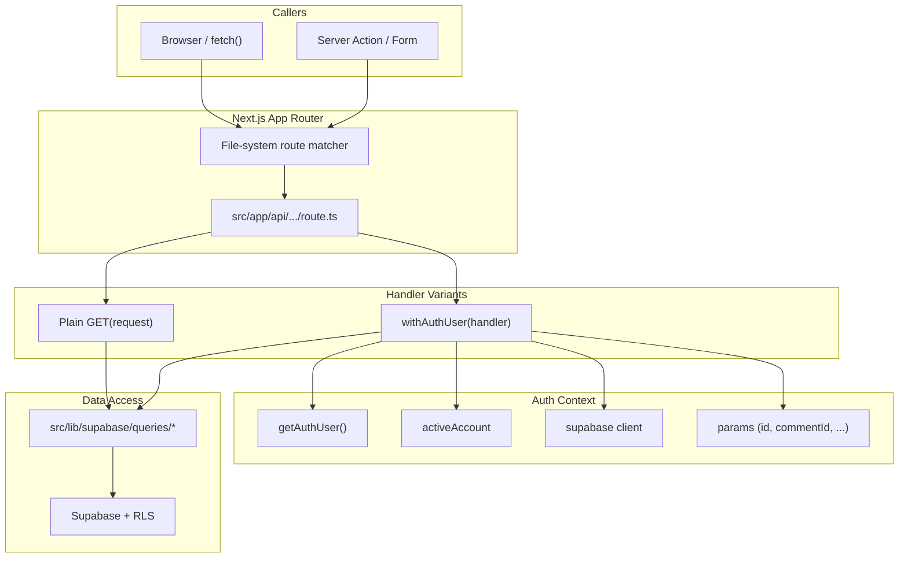

The API surface of OZEAON is a file-system-routed set of Next.js route handlers under [`src/app/api`](https://github.com/ozeaon/ozeaon-v2/tree/0a4f1a95824db87782f1221a4108019d174df3d9/src/app/api). Each `route.ts` file exports HTTP method functions; there is no central router. This page covers the two handler patterns, the route families and their status, and the conventions for validation, authorization, and responses that apply across the tree.

## Overview

Two patterns appear across the route tree:

1. **Public read handlers** — a plain `async function GET(request)` that builds its own Supabase client and applies row filters. No session cost. Used for publicly cacheable feeds and reference data.
2. **Authenticated handlers** — `export const POST = withAuthUser(async (request, { user, activeAccount, supabase, params }) => { ... })`. The wrapper resolves the session once, injects a typed context object, and returns 401 for anonymous callers before the inner handler runs.

Route modules are thin: they parse and validate input, delegate to query functions under [`src/lib/supabase/queries/`](https://github.com/ozeaon/ozeaon-v2/tree/0a4f1a95824db87782f1221a4108019d174df3d9/src/lib/supabase/queries), and shape the HTTP response. Business logic lives in the query layer, not in the route module.

## Architecture



A route module can mix both styles: `/api/articles/[id]` exports a plain `GET` for public reads and a wrapped `DELETE` for mutations. Because `withAuthUser` is applied at export time, its 401 check runs before any handler body.

## Route Families

The full route tree is in [`src/app/api`](https://github.com/ozeaon/ozeaon-v2/tree/0a4f1a95824db87782f1221a4108019d174df3d9/src/app/api). Families are live unless marked **roadmap**.

**Articles** — CRUD for articles, their comments, content images, and cover images. The delete handler demonstrates both handler styles (public `GET`, wrapped `DELETE`) and the RLS-defensive delete pattern.

**Account Posts** — the signed-in user's own posts feed; `GET` and `POST` on the collection, full CRUD on individual posts.

**Active Account** — `GET`/`POST` to read and switch the active-account cookie. Validates caller is owner or admin of the requested org before writing the cookie. See [Account Switching](../../auth-and-accounts/account-switching/).

**Organisations** — the largest family: org feed and creation, settings, logo/cover upload, search, invites, join requests, custom links, and membership management. Org creation has a four-step gate (ownership cap, Zod validation, slug pre-check, text moderation). Invite revocation allows the invitee to decline their own invite; otherwise owner/admin is required. Membership `PATCH` maps a custom Postgres error (`X0001`) to 409 when a role change would demote the last admin. See [Organisations](../../organisations/organisations/).

**Profile** — the caller's own profile row, bio, education, experience, and avatar/cover images. Education and experience are full-CRUD routes; `DELETE` takes a row `id` as a query parameter rather than a dynamic segment, the only CRUD family shaped this way.

**Projects** — project feed (public and dashboard modes from one code path), creation, comments, PDF documents, section images, section deletion, and cover/logo upload. The `userId`/`organizationId` ownership params are validated as UUIDs before interpolation into a PostgREST `or()` filter — a non-UUID value would alter the query grammar, and silently dropping it would widen a scoped request to the entire feed. Creation selects between `projectDraftSchema` and `projectPublishSchema` based on `published: true` in the payload.

**Posts** — `GET`/`POST` on the posts collection, `GET`/`PATCH`/`DELETE` on individual posts, and post image upload at `/api/posts/image`. Post comments use the shared comment factory (see [Comments & Reactions](../../community/comments-and-reactions/)).

**Storage** — `/api/storage` serves R2 objects with an immutable `Cache-Control` and a quoted ETag. See [Storage & R2](../../storage/storage-r2/).

**Follows** — read-only endpoints for followers/following lists and follow status. Follow and unfollow are server actions in `queries/profile.ts`, not routes. The status endpoint (`/api/follows/:userId/status`) degrades gracefully for anonymous callers, returning `{ isFollowing: false }` rather than 401. See [Profiles & Social Graph](../../profiles/profiles-and-social-graph/).

**Search** — `GET /api/search` delegates to `searchContent`, which matches over org names, project/article titles, and profile names and usernames. Global search (posts, body text, tags, SDGs) is **planned**. See [Search](../../community/search/).

**Session** — `GET /api/session` is the client bootstrap for `SessionProvider`. It also repairs a stale active-account cookie pointing at a deleted org, downgrading the response to user mode in the same request — the only place the cookie can be written in a read path.

**Users** — public profile directory, memberships across org/pod/project tables, per-user connection list, and per-user stats. The stats endpoint applies a block check before returning counts: a caller who blocks or is blocked by the target gets a 404 rather than numbers. The memberships endpoint queries the `pod_members` table; pods are **roadmap**.

**Health** — `GET /api/health` returns `{ status: "ok" }` with no auth or database access. A liveness probe.

**Categories** — public read for `resource_categories`.

**Currencies** — public read for `currencies` reference data.

**Locations** — `GET /api/locations/search` passes through to the Photon geocoder; upstream failures degrade to an empty result so a geocoder outage does not break the location picker.

**Events** — `GET`/`POST` on events, `GET`/`PATCH` on individual events. The routes exist but `NewEventDialog` is unmounted; events are **roadmap**.

**Blocks** — `GET`/`POST` to list and create blocks, `DELETE` to remove one. No UI calls these endpoints; blocking is **roadmap** (though `isBlocked` still affects stats and other guards — see [Server Actions & Queries](../server-actions-and-queries/)).

**Connections** — `GET`/`POST` on connection requests, `DELETE` to remove one. No UI calls these; connections are **roadmap**.

**Users/Connections** — `GET /api/users/:userId/connections` reads accepted connection rows. No UI calls it; connections are **roadmap**.

**Labels** — note labels for the signed-in user. Notes & Bookmarks is **roadmap**; no UI calls these endpoints. The `POST` handler maps the Postgres unique-violation code (`23505`) to a 409 with a user-facing duplicate message.

**Subcategories** — CRUD over `resource_subcategories`. The write verbs carry no application-level authorization and no Zod validation; access rests entirely on RLS. No application code calls the write endpoints.

**User Settings** — `GET`/`PUT` over `user_settings.privacy`. The `GET` lazily provisions the settings row on first call. No UI currently calls `PUT` to change privacy; the settings surface is **roadmap**.

## Handler Conventions

### `withAuthUser`

Mutating endpoints are the return value of `withAuthUser`, applied at module scope:

```typescript
import { withAuthUser } from "@/lib/supabase/queries/auth";

export const POST = withAuthUser(
  async (request, { user, activeAccount, supabase, params }) => {
    // handler body
  }
);
```

The context object provides: `user` (authenticated user, has `.id`), `activeAccount` (discriminated by `type: "user" | "org"`), `supabase` (request-scoped client), and `params` (awaited dynamic route params, typed by the generic argument). Because the wrapper is applied at export time, Next.js receives a ready-made handler and the 401 check cannot be bypassed.

### Validation

Query parameters that are interpolated into PostgREST filter expressions are validated as strict UUIDs rather than dropped on failure. Dropping an invalid filter would widen a scoped request to the full feed, which is worse than a 400:

```typescript
const ownershipParamsSchema = z.object({
  userId: z.uuid().nullable(),
  organizationId: z.uuid().nullable(),
});
```

Body validation uses `safeParse` and returns a field-keyed error map: `{ error: "Validation failed", errors: { currency_id: "Invalid currency ID" } }`.

### Authorization and RLS-Defensive Deletes

Resource-level authorization uses domain helpers after fetching the row. The article delete pattern shows defense in depth — the application check runs first, but RLS is the ultimate authority. Without `.select()`, a delete blocked by RLS is indistinguishable from a successful one:

```typescript
// Without .select() a row an RLS policy refused to touch is
// indistinguishable from one that was deleted.
const { data: deleted } = await supabase
  .from("articles")
  .delete()
  .eq("id", articleID)
  .select("id")
  .maybeSingle();

if (!deleted) {
  return NextResponse.json({ error: "Not authorized" }, { status: 403 });
}
```

## Response Conventions

| Envelope | When used |
|----------|-----------|
| `{ data }` | Successful read of a single resource |
| bare payload | Successful read of a collection or feed |
| `{ success: true }` | Successful mutation with no body to return |
| `{ error, message }` | Unexpected failure (500) — raw error message included for diagnosability |
| `{ error, errors }` | Validation failure with per-field detail (400) |

### Status Codes

| Code | Meaning |
|------|---------|
| 200 | Success |
| 201 | Created |
| 400 | Malformed or invalid input |
| 401 | No authenticated user |
| 403 | Authenticated but not permitted |
| 404 | Resource not found (or masked 403 where existence should be hidden) |
| 409 | Conflict (slug taken, duplicate membership, duplicate label) |
| 422 | Rejected by content moderation (with categories in response body) |
| 503 | Moderation service unavailable |
| 500 | Unexpected failure |

The 401/403 split is applied consistently: 401 signals "re-authenticate", 403 signals "this will not succeed regardless of credentials".

## Failure Modes & Edge Cases

**RLS-filtered writes.** A mutation blocked by RLS produces zero affected rows, not an error. The `.select("id").maybeSingle()` pattern detects this and returns 403 rather than a misleading success response.

**Supabase errors are propagated by throwing.** Supabase resolves errors in the value rather than rejecting the promise. Every handler checks `if (error) throw error` to route them into the `catch` block, where they become a uniform 500.

**Error message leakage.** The `{ error, message }` envelope surfaces the raw database or runtime error message to the client. This is a deliberate diagnosability trade-off present across the tree.

**Numeric query parameters.** `Number(nonNumericString)` returns `NaN`. Clamping with `Math.max`/`Math.min` passes `NaN` through rather than bounding it — new pagination code should validate numerically rather than relying solely on clamping.

**Optional authentication in a single handler.** `/api/projects` serves both a public feed and a private dashboard from one code path, switching on the `dashboard` query parameter. A single URL has two authorization postures depending on query string; this is a rare pattern in the tree.

## Extension Points

To add an endpoint:
1. Create a folder under `src/app/api/` with `[name]` brackets for dynamic segments.
2. Add `route.ts` and export the HTTP methods needed.
3. Use a plain `async function GET(request)` for public reads or `export const VERB = withAuthUser(...)` for anything requiring identity.
4. Validate query strings with an inline Zod schema when they are interpolated into filter expressions. Validate bodies with `safeParse` and return `{ error: "Validation failed", errors: result.error.flatten().fieldErrors }`.
5. Push data access into `src/lib/supabase/queries/`.
6. Wrap every handler body in `try/catch`; convert thrown errors to 500 using `getErrorMessage(error)`.
7. Chain `.select("id").maybeSingle()` on deletes and updates against RLS-protected tables and check the result before reporting success.

## Related Links

- [src/app/api](https://github.com/ozeaon/ozeaon-v2/tree/0a4f1a95824db87782f1221a4108019d174df3d9/src/app/api) — full route tree
- [withAuthUser — src/lib/supabase/queries/auth.ts](https://github.com/ozeaon/ozeaon-v2/blob/0a4f1a95824db87782f1221a4108019d174df3d9/src/lib/supabase/queries/auth.ts)
- [Server Actions & Queries](../server-actions-and-queries/) — data-access layer below the route handlers
- [Edge Functions](../edge-functions/) — Supabase edge functions
- [Content Moderation](../../moderation/moderation/) — the `moderateAndLog` pipeline called by routes
- [Storage & R2](../../storage/storage-r2/) — image and document upload
- [Comments & Reactions](../../community/comments-and-reactions/) — comment thread rules and shared factory
- [Organisations](../../organisations/organisations/) — org membership model
- [Profiles & Social Graph](../../profiles/profiles-and-social-graph/) — follows and blocks
- [Search](../../community/search/) — search rules and coverage
- [Account Switching](../../auth-and-accounts/account-switching/) — active-account cookie
