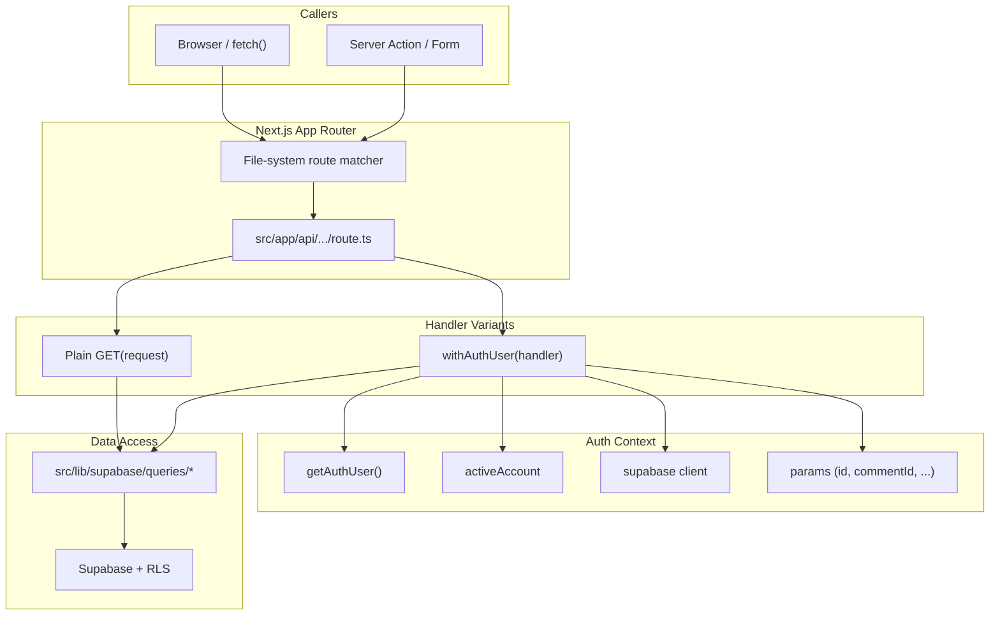
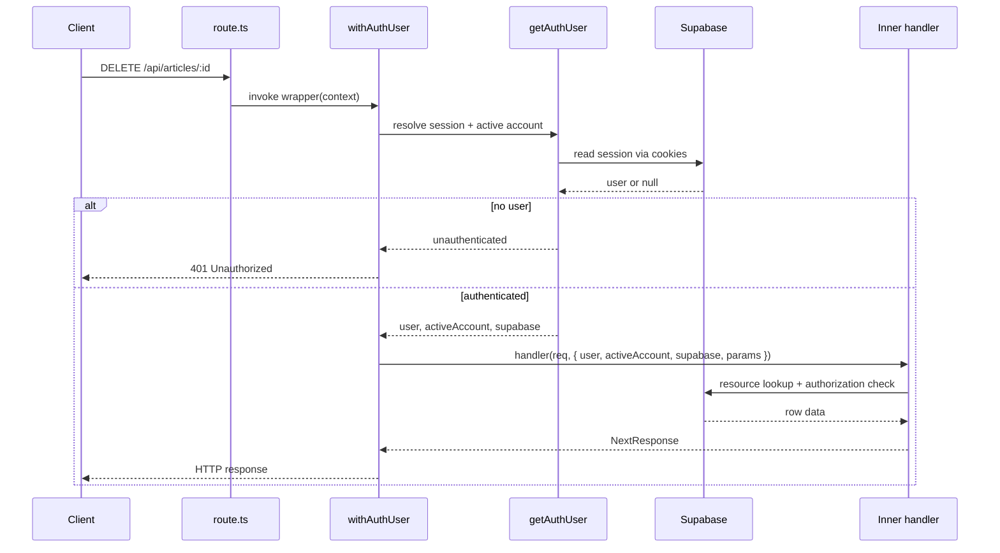

The ozeaon-v2 application exposes its HTTP surface through the Next.js App Router file-system convention under `src/app/api/**/route.ts`. This page documents how route handlers are organized, how authentication and authorization are layered onto them, and the shared conventions (validation, status codes, error envelopes) that every endpoint follows.

## Purpose and Scope

This page covers the **structural and conventional contract** of the API layer:

- Directory-to-URL mapping for `src/app/api/**`.
- The `route.ts` handler convention (`GET`, `POST`, `DELETE`, … exports).
- Dynamic route segments (`[id]`, `[commentId]`, `[userId]`) and typed `params`.
- The `withAuthUser` higher-order wrapper that injects user, active account, Supabase client, and parsed params.
- Standard response envelopes (`{ data }`, `{ error, message }`) and status code usage.
- Validation and ownership-resolution patterns found in route handlers.
- A per-file inventory of the route tree, grouped by family, with the HTTP contract of each endpoint (see [Route Family Reference](#route-family-reference)).

Out of scope for this page (covered by sibling pages under `6-api-layer`):

- The internal implementation of specific resource families such as projects, articles, comments, and account endpoints.
- Supabase client construction details and Row-Level-Security policies.
- The server actions layer (`src/lib/supabase/actions.ts`) used by forms rather than HTTP routes.

## Overview

There is no single Express-style router file in this codebase. Instead, routing is derived entirely from the file system, and each endpoint is a **module of exported HTTP method functions**. Next.js discovers these files, maps the path segments to a URL, and invokes the matching export based on the incoming request method.

Two conventions dominate the codebase:

1. **Public read endpoints** export a plain `async function GET(request)` and build their own Supabase client, applying row filters (like `.eq("published", true)`) explicitly.
2. **Authenticated / mutating endpoints** export the result of `withAuthUser(...)`, a higher-order function that performs the auth handshake once and hands the handler a fully resolved context.

This split exists because authentication is expensive (it requires reading cookies and resolving the active account), and only some endpoints need it. Read paths that must remain publicly cacheable avoid the wrapper entirely, while every write path routes through it so that authorization cannot be forgotten.

The route tree under `src/app/api` is flat and resource-oriented, mirroring the domain entities of the platform: `articles`, `projects`, `categories`, `blocks`, `connections`, `currencies`, `events`, `organizations`, `follows`, `profile`, `users`, and account-scoped collections such as `account/posts`, alongside cross-cutting endpoints (`search`, `session`, `health`, `labels`, `locations`, `subcategories`, `user-settings`).

## Architecture

The diagram below shows how a request flows from the network edge into a route module and onward into the shared data-access layer.



The key structural insight is that `route.ts` files are thin: they parse and validate input, delegate to query functions under `src/lib/supabase/queries/`, and shape the HTTP response. Business logic and database access live in the query layer, not in the route module. This keeps each handler short and makes the route layer a consistent, predictable boundary.

## Route Tree and URL Mapping

Next.js maps directory names directly to URL segments, and dynamic segments (folders wrapped in square brackets) become named parameters.

| Route file | HTTP method(s) | URL | Params |
|------------|----------------|-----|--------|
| `src/app/api/articles/route.ts` | `GET`, `POST` | `/api/articles` | — |
| `src/app/api/articles/[id]/route.ts` | `GET`, `DELETE` | `/api/articles/:id` | `id` |
| `src/app/api/articles/search/route.ts` | `GET` | `/api/articles/search` | — |
| `src/app/api/articles/[id]/comments/route.ts` | `GET`, `POST` | `/api/articles/:id/comments` | `id` |
| `src/app/api/articles/[id]/comments/[commentId]/route.ts` | `DELETE`, … | `/api/articles/:id/comments/:commentId` | `id`, `commentId` |
| `src/app/api/articles/[id]/content/route.ts` | `GET` | `/api/articles/:id/content` | `id` |
| `src/app/api/articles/[id]/content/image/route.ts` | `POST`, … | `/api/articles/:id/content/image` | `id` |
| `src/app/api/articles/[id]/attachment/route.ts` | `GET` | `/api/articles/:id/attachment` | `id` |
| `src/app/api/articles/[id]/image/route.ts` | `POST`, … | `/api/articles/:id/image` | `id` |
| `src/app/api/account/posts/route.ts` | `GET`, `POST` | `/api/account/posts` | — |
| `src/app/api/account/posts/[id]/route.ts` | `GET`, `PATCH`, `DELETE` | `/api/account/posts/:id` | `id` |
| `src/app/api/active-account/route.ts` | `GET`, `POST` | `/api/active-account` | — |
| `src/app/api/blocks/route.ts` | `GET`, `POST` | `/api/blocks` | — |
| `src/app/api/blocks/[userId]/route.ts` | `DELETE` | `/api/blocks/:userId` | `userId` |
| `src/app/api/categories/route.ts` | `GET` | `/api/categories` | — |
| `src/app/api/categories/[id]/route.ts` | `GET` | `/api/categories/:id` | `id` |
| `src/app/api/connections/route.ts` | `GET`, `POST` | `/api/connections` | — |
| `src/app/api/connections/[userId]/route.ts` | `DELETE` | `/api/connections/:userId` | `userId` |
| `src/app/api/currencies/route.ts` | `GET` | `/api/currencies` | — |
| `src/app/api/events/route.ts` | `GET`, `POST` | `/api/events` | — |
| `src/app/api/events/[id]/route.ts` | `GET`, `PATCH` | `/api/events/:id` | `id` |
| `src/app/api/follows/[userId]/followers/route.ts` | `GET` | `/api/follows/:userId/followers` | `userId` |
| `src/app/api/follows/[userId]/following/route.ts` | `GET` | `/api/follows/:userId/following` | `userId` |
| `src/app/api/follows/[userId]/status/route.ts` | `GET` | `/api/follows/:userId/status` | `userId` |
| `src/app/api/health/route.ts` | `GET` | `/api/health` | — |
| `src/app/api/labels/route.ts` | `GET`, `POST` | `/api/labels` | — |
| `src/app/api/locations/search/route.ts` | `GET` | `/api/locations/search` | — |
| `src/app/api/organizations/route.ts` | `GET`, `POST` | `/api/organizations` | — |
| `src/app/api/organizations/[id]/route.ts` | `PATCH`, `DELETE` | `/api/organizations/:id` | `id` |
| `src/app/api/organizations/image/route.ts` | `POST`, `DELETE` | `/api/organizations/image` | — |
| `src/app/api/organizations/search/route.ts` | `GET` | `/api/organizations/search` | — |
| `src/app/api/organizations/[id]/invites/route.ts` | `GET` | `/api/organizations/:id/invites` | `id` |
| `src/app/api/organizations/[id]/invites/[inviteId]/route.ts` | `DELETE` | `/api/organizations/:id/invites/:inviteId` | `id`, `inviteId` |
| `src/app/api/organizations/[id]/join-requests/route.ts` | `GET` | `/api/organizations/:id/join-requests` | `id` |
| `src/app/api/organizations/[id]/join-requests/[requestId]/route.ts` | `DELETE` | `/api/organizations/:id/join-requests/:requestId` | `id`, `requestId` |
| `src/app/api/organizations/[id]/links/[linkId]/route.ts` | `DELETE` | `/api/organizations/:id/links/:linkId` | `id`, `linkId` |
| `src/app/api/organizations/[id]/members/route.ts` | `GET`, `POST` | `/api/organizations/:id/members` | `id` |
| `src/app/api/organizations/[id]/members/[userId]/route.ts` | `PATCH`, `DELETE` | `/api/organizations/:id/members/:userId` | `id`, `userId` |
| `src/app/api/profile/route.ts` | `GET`, `PUT` | `/api/profile` | — |
| `src/app/api/profile/bio/route.ts` | `PUT` | `/api/profile/bio` | — |
| `src/app/api/profile/education/route.ts` | `GET`, `POST`, `PUT`, `DELETE` | `/api/profile/education` | — |
| `src/app/api/profile/experience/route.ts` | `GET`, `POST`, `PUT`, `DELETE` | `/api/profile/experience` | — |
| `src/app/api/profile/image/route.ts` | `POST`, `DELETE` | `/api/profile/image` | — |
| `src/app/api/projects/route.ts` | `GET`, `POST` | `/api/projects` | — |
| `src/app/api/projects/[id]/comments/route.ts` | `GET`, `POST` | `/api/projects/:id/comments` | `id` |
| `src/app/api/projects/[id]/comments/[commentId]/route.ts` | `PATCH`, `DELETE` | `/api/projects/:id/comments/:commentId` | `id`, `commentId` |
| `src/app/api/projects/[id]/documents/route.ts` | `GET`, `POST`, `DELETE` | `/api/projects/:id/documents` | `id` |
| `src/app/api/projects/[id]/section-image/route.ts` | `POST`, `DELETE` | `/api/projects/:id/section-image` | `id` |
| `src/app/api/projects/[id]/sections/[slug]/route.ts` | `DELETE` | `/api/projects/:id/sections/:slug` | `id`, `slug` |
| `src/app/api/projects/image/route.ts` | `POST`, `DELETE` | `/api/projects/image` | — |
| `src/app/api/search/route.ts` | `GET` | `/api/search` | — |
| `src/app/api/session/route.ts` | `GET` | `/api/session` | — |
| `src/app/api/subcategories/route.ts` | `GET`, `POST` | `/api/subcategories` | — |
| `src/app/api/subcategories/[id]/route.ts` | `GET`, `PUT`, `DELETE` | `/api/subcategories/:id` | `id` |
| `src/app/api/user-settings/route.ts` | `GET`, `PUT` | `/api/user-settings` | — |
| `src/app/api/users/route.ts` | `GET` | `/api/users` | — |
| `src/app/api/users/[userId]/connections/route.ts` | `GET` | `/api/users/:userId/connections` | `userId` |
| `src/app/api/users/[userId]/stats/route.ts` | `GET` | `/api/users/:userId/stats` | `userId` |
| `src/app/api/users/memberships/route.ts` | `GET` | `/api/users/memberships` | — |

Three filename conventions are worth calling out:

- **`route.ts` is the handler file.** A folder containing `route.ts` becomes an endpoint; folders without it are plain directories.
- **`[name]` folders are dynamic segments.** The name inside the brackets is not cosmetic — it is the key used to retrieve the value from the `params` object.
- **`search` and `content` are literal segments**, not dynamic ones, which is why `/api/articles/search` does not collide with `/api/articles/[id]` in practice (Next.js prefers static segments over dynamic ones).

### Dynamic Segments and Typed Params

In App Router, `params` is a promise that must be awaited. Route modules that are not wrapped read it from the second argument:

```typescript
export async function GET(
  _req: NextRequest,
  { params }: RouteContext<"/api/articles/[id]">,
) {
  const { id: articleID } = await params;
```

> Source: [route.ts](https://github.com/ozeaon/ozeaon-v2/blob/0a4f1a95824db87782f1221a4108019d174df3d9/src/app/api/articles/[id]/route.ts#L11-L15)

The `RouteContext<"/api/articles/[id]">` type is a Next.js generated helper that infers the exact parameter shape from the route path string, so `id` is guaranteed to exist on the destructured object. The segment name `[id]` becomes the property `id`; this is why the folder naming is significant.

Wrapped handlers receive `params` differently — `withAuthUser` is generic over the params type and resolves them for the inner handler, as shown by the type argument `withAuthUser<{ id: string }>(...)` in the article deletion handler.

## Route Family Reference

The table above maps route files to URLs. This section records, family by family, what each endpoint exports, how it authenticates, what it validates, and where it delegates. Domain behaviour — what a follow means, how an invite is accepted — is documented on the feature pages linked from each family; this page records only the HTTP contract. Families whose routes are already used as walkthrough material above (articles, account posts, projects feed) are not repeated here.

### Events

`/api/events` serves owner-scoped calendar data. `GET` returns the caller's `events` rows ordered by `start_time`, optionally windowed by `start_date`/`end_date`, and `POST` inserts one after a manual presence check on `title`, `start_time` and `end_time`. Both exports are `withAuthUser` handlers; there is no Zod schema and no public read — every query filters on `user_id`, so a caller can only ever see their own calendar. Creation returns 201 with the inserted row.

> Source: [route.ts](https://github.com/ozeaon/ozeaon-v2/blob/0a4f1a95824db87782f1221a4108019d174df3d9/src/app/api/events/route.ts)

### Follows

The follow endpoints are read-only; follow and unfollow are performed by server actions in `src/lib/supabase/queries/profile.ts`, not route handlers. The social graph is documented in [User Profiles & Social Graph](../../features/profiles-and-social-graph/).

- `/api/follows/:userId/followers` and `/api/follows/:userId/following` are plain `GET` handlers with no auth wrapper. Each builds a client with `createClient()`, reads `user_follows` filtered on the target id, and joins the counterpart profiles through a named foreign-key hint (`user_profiles!user_follows_follower_id_fkey`). Visibility is whatever RLS grants the request's client, and the result is a bare array of profile rows. Query failures are passed to `handleSupabaseError` (a structured log with operation context) and then rethrown into the standard 500 catch.

  > Source: [followers/route.ts](https://github.com/ozeaon/ozeaon-v2/blob/0a4f1a95824db87782f1221a4108019d174df3d9/src/app/api/follows/[userId]/followers/route.ts), [following/route.ts](https://github.com/ozeaon/ozeaon-v2/blob/0a4f1a95824db87782f1221a4108019d174df3d9/src/app/api/follows/[userId]/following/route.ts)

- `/api/follows/:userId/status` answers "do I follow this user?" and is deliberately graceful rather than strict. It resolves the session with `getAuthUser()` directly, returns `{ isFollowing: false }` for anonymous callers instead of a 401, and collapses query errors and thrown errors into the same `false` response — a "does the button show as active" check must not break the page that renders it.

  > Source: [route.ts](https://github.com/ozeaon/ozeaon-v2/blob/0a4f1a95824db87782f1221a4108019d174df3d9/src/app/api/follows/[userId]/status/route.ts#L11-L15)

### Health

`/api/health` returns `{ status: "ok" }`. No auth, no database access, no `try/catch` — a liveness probe for uptime monitoring, nothing more.

> Source: [route.ts](https://github.com/ozeaon/ozeaon-v2/blob/0a4f1a95824db87782f1221a4108019d174df3d9/src/app/api/health/route.ts)

### Labels

Note labels for the signed-in user. `GET` returns the caller's `note_labels` ordered by name; `POST` validates `name` by hand (non-empty after trimming, 400) and maps the Postgres unique violation (`23505`) to a 409 with a user-facing duplicate message — one of the few routes that distinguishes "already exists" from "failed". Both exports are wrapped, and both log through a module-scoped `getLogger(["api", "labels"])` using the `logError` helper.

> Source: [route.ts](https://github.com/ozeaon/ozeaon-v2/blob/0a4f1a95824db87782f1221a4108019d174df3d9/src/app/api/labels/route.ts)

### Locations Search

`/api/locations/search` is a pass-through to the public [Photon](https://photon.komoot.io) geocoder, not a database endpoint. `q` is required (a blank query short-circuits to `{ data: [] }`), `layer` defaults to `city`, and `limit` is capped at 10. An upstream failure is converted to an empty result rather than an error — a geocoder outage must not break the location picker. Results are reshaped to `{ id, title, meta: { latitude, longitude } }`, the same autocomplete shape the organization search endpoint returns. No authentication.

> Source: [route.ts](https://github.com/ozeaon/ozeaon-v2/blob/0a4f1a95824db87782f1221a4108019d174df3d9/src/app/api/locations/search/route.ts#L30-L38)

### Organizations

The organization family is the largest in the tree; the membership model and the roles behind `owner`/`admin` checks below are documented in [Organizations: Profiles, Membership & Roles](../features/organizations/). All gated routes resolve the caller's role with `getUserOrgRole`, which returns `"owner" | "admin" | "member" | null` from a single `organization_members` → `member_roles` join.

#### Feed and Creation

`GET /api/organizations` is the public org feed: pagination clamped to `limit` ≤ 100, delegated to `getOrganizationsFeed`. Identity is optional and conditional, like the projects dashboard pattern above — `getAuthUser()` is called, and the viewer id is passed to the query only when the active account is in user mode, so an org-mode session sees the anonymous view.

`POST /api/organizations` is the widest write path in the family, with a four-step gate before any insert:

1. **Ownership cap** — a head-count over `organization_members` joined to the `owner` role; a 403 past three organisations.
2. **Schema validation** — `organizationSchema` from `@/zod/organizations`, returning 400 with `details: parsed.error.flatten()`.
3. **Slug pre-check** — a `maybeSingle` lookup so a taken slug costs no moderation call; the insert's unique-violation handler catches a slug claimed in between.
4. **Text moderation** — `mission` and `description` through `moderateAndLog` on the `profile` surface (see [Content Moderation Pipeline](../../moderation-and-storage/moderation/)).

The unique violation itself maps to a 409 carrying a distinct `{ code: "slug_taken", error, message }` envelope. The creator is then seeded as an `owner` member from the `member_roles` seed; if that insert fails, the just-created organisation row is deleted — a compensating write, since no transaction spans the two. `custom_links` rows are inserted with a label derived from each URL's hostname, falling back to the raw URL when it does not parse.

> Source: [route.ts](https://github.com/ozeaon/ozeaon-v2/blob/0a4f1a95824db87782f1221a4108019d174df3d9/src/app/api/organizations/route.ts#L52-L185)

#### Settings and Deletion

`PATCH /api/organizations/:id` is gated to `owner`/`admin` and validates with `organizationSettingsSchema`. Three behaviours are worth noting:

- **Presence off the raw body.** Whether an optional field was sent is read from the unparsed body, not from parse output — the schema's nullable helpers rewrite absent keys to `null`, so `parsed.data` always carries every optional field and cannot distinguish "clear this field" from "leave it alone".
- **Cookie rewrite on rename.** The active-account cookie carries the org slug every org-scoped page looks up, so a successful slug change rewrites it in the same request (see [Account Switching](../../auth-and-accounts/account-switching/)).
- **Client-minted link ids.** `custom_links` are upserted with ids taken from the payload or minted via `crypto.randomUUID()`, and the response returns them positionally so the settings form can target individual links on the next save.

A unique violation on the update returns the same 409 `slug_taken` envelope as creation.

`DELETE /api/organizations/:id` is owner-only. It calls the `delete_organization` RPC, which returns the organisation's storage keys; the keys are purged from R2 through `StorageAdapter.deleteFiles` on a best-effort basis — the org is gone either way, and a failed purge only leaks objects (see [Storage Abstraction & R2 Integration](../../moderation-and-storage/storage-r2/)). If the caller's active-account cookie pointed at the deleted org, it is cleared.

> Source: [route.ts](https://github.com/ozeaon/ozeaon-v2/blob/0a4f1a95824db87782f1221a4108019d174df3d9/src/app/api/organizations/[id]/route.ts#L180-L221)

#### Logo and Cover Upload

`/api/organizations/image` handles both image slots through a `type` query parameter (`logo` | `cover`) plus `orgId`; each type maps to a storage subpath and a size cap in a local `TYPE_CONFIG`. The flow is the full upload pipeline in one handler:

1. Owner/admin gate, then a multipart `file` validated by type and size against `IMAGE_CONFIG`.
2. The storage key is generated under `organizations/<orgId>/logos|covers` — keyed by the organisation rather than the uploader, because the asset belongs to the org and a per-member prefix cannot be enumerated for cleanup.
3. `StorageAdapter.uploadFile` writes the object with immutable cache headers.
4. The image is moderated with `checkUploadedImage`: `rejected` returns 422 with the matching categories, an unavailable checker returns 503, and the R2 object is cleaned up either way.
5. The `images` row is inserted, then the `logo_image_id`/`cover_image_id` FK is updated immediately — not deferred to Save Changes. Each step rolls back the previous one on failure.

The replaced image is purged through `deleteImageById` on an **admin** client: the `images` DELETE policy is uploader-only, so an admin clearing an image another admin uploaded would otherwise match no row and leak it. The role check at the top of the handler is the actual gate for that purge.

> Source: [route.ts](https://github.com/ozeaon/ozeaon-v2/blob/0a4f1a95824db87782f1221a4108019d174df3d9/src/app/api/organizations/image/route.ts#L33-L43)

`DELETE /api/organizations/image` mirrors the tail of that flow: null the FK, then purge the current image through the same admin-client path. Both handlers `revalidatePath("/")` so cached pages drop the old asset. The generic upload/moderation pipeline is described in [Media, Images & Attachments](../features/media-and-images/).

#### Search

`GET /api/organizations/search` is a wrapped handler (unusual for a read) that runs an `ilike` match on `organization.name` with a limit defaulting to 10, joins the logo through `images!logo_image_id`, and maps rows to `{ id, title, meta: { avatar_url } }` for the shared autocomplete component.

> Source: [route.ts](https://github.com/ozeaon/ozeaon-v2/blob/0a4f1a95824db87782f1221a4108019d174df3d9/src/app/api/organizations/search/route.ts)

#### Invites

Listing pending invites (`GET /api/organizations/:id/invites`) is owner/admin only and returns each invite with its role and invitee profile joined through named foreign keys. `DELETE /api/organizations/:id/invites/:inviteId` has two-leg authorization: the invitee may decline their own invite, and otherwise the caller must be owner/admin. The fetch is scoped to `status = "pending"` and tolerates the `PGRST116` no-rows code, so a consumed or missing invite is a 404 rather than a 500.

> Source: [invites/route.ts](https://github.com/ozeaon/ozeaon-v2/blob/0a4f1a95824db87782f1221a4108019d174df3d9/src/app/api/organizations/[id]/invites/route.ts), [invites/[inviteId]/route.ts](https://github.com/ozeaon/ozeaon-v2/blob/0a4f1a95824db87782f1221a4108019d174df3d9/src/app/api/organizations/[id]/invites/[inviteId]/route.ts#L30-L36)

#### Join Requests

The listing mirrors invites (owner/admin, pending only, requester profile joined). `DELETE /api/organizations/:id/join-requests/:requestId` changes behaviour by caller identity: the requester cancelling their own request **hard-deletes** the row, while an owner/admin rejecting it flips `status` to `"rejected"` and keeps the row as an audit record.

> Source: [join-requests/[requestId]/route.ts](https://github.com/ozeaon/ozeaon-v2/blob/0a4f1a95824db87782f1221a4108019d174df3d9/src/app/api/organizations/[id]/join-requests/[requestId]/route.ts#L31-L53)

#### Links

`DELETE /api/organizations/:id/links/:linkId` removes a custom link immediately rather than on Save Changes, per the in-source comment. The delete chains `.select("id").maybeSingle()` and turns a `null` result into a 404 — the same RLS-defensive technique documented under [Authorization Patterns](#authorization-patterns).

> Source: [route.ts](https://github.com/ozeaon/ozeaon-v2/blob/0a4f1a95824db87782f1221a4108019d174df3d9/src/app/api/organizations/[id]/links/[linkId]/route.ts#L19-L30)

#### Members

- `GET /api/organizations/:id/members` is owner/admin gated and delegates to `getOrganizationMembersById`.
- `POST /api/organizations/:id/members` is dual-purpose. With no `user_id` (or the caller's own), it means "accept my pending invite": the role comes from the pending invite row, and a missing invite is a 403. Naming another user requires owner/admin, with the role resolved from `member_roles` by slug (defaulting to `member`). A duplicate membership is a 409.
- `PATCH /api/organizations/:id/members/:userId` reassigns roles between `admin` and `member` via `MemberRoleUpdateSchema` (400 otherwise), refuses to touch owners, and maps the custom `X0001` Postgres error — raised by a trigger when the change would demote the last admin — to a 409.
- `DELETE /api/organizations/:id/members/:userId` lets any member remove themselves, and owner/admin remove anyone else; owners cannot be removed (403).

> Source: [members/route.ts](https://github.com/ozeaon/ozeaon-v2/blob/0a4f1a95824db87782f1221a4108019d174df3d9/src/app/api/organizations/[id]/members/route.ts#L45-L82), [members/[userId]/route.ts](https://github.com/ozeaon/ozeaon-v2/blob/0a4f1a95824db87782f1221a4108019d174df3d9/src/app/api/organizations/[id]/members/[userId]/route.ts#L58-L66)

### Profile

The profile family owns the caller's own `user_profiles` row and its satellite tables; the client-side forms it backs are covered in [User Settings & Account Management](../../auth-and-accounts/user-settings/) and the social-graph context in [User Profiles & Social Graph](../features/profiles-and-social-graph/).

- `/api/profile` — `GET` returns the caller's row; `PUT` casts the entire body to `TablesUpdate<"user_profiles">` and applies it. There is no Zod schema at this boundary — shape validation happens client-side through the schemas on the [Zod Schemas & Form Validation](../../config-and-utils/zod-validation/) page, and RLS confines the write to the caller's own row.
- `/api/profile/bio` — single-field `PUT` over `user_profiles.bio`, same pattern in miniature.
- `/api/profile/education` and `/api/profile/experience` — parallel full-CRUD routes (`GET`, `POST`, `PUT`, `DELETE`) over `user_education` and `user_experience`. `GET` returns ordered lists, current-first; education joins `course_types` for the course label. `POST`/`PUT` enforce one conditional rule each by hand: `year_completed` (education) or `end_date` (experience) is required when `is_current` is false. `PUT` and `DELETE` scope every query by both row id and `user_id`, so ownership is enforced in the `WHERE` clause rather than through an authorization helper. `DELETE` takes the row id as an `id` query parameter instead of a dynamic segment — the only CRUD family in the tree shaped this way.

  > Source: [education/route.ts](https://github.com/ozeaon/ozeaon-v2/blob/0a4f1a95824db87782f1221a4108019d174df3d9/src/app/api/profile/education/route.ts#L77-L93), [experience/route.ts](https://github.com/ozeaon/ozeaon-v2/blob/0a4f1a95824db87782f1221a4108019d174df3d9/src/app/api/profile/experience/route.ts)

- `/api/profile/image` — avatar/cover upload. A `type` query parameter selects `avatar` | `coverImage` and, with it, the FK field (`avatar_image_id` | `cover_image_id`), storage subpath, and size cap. The pipeline matches the org image route: type/size validation, R2 upload under `profiles/<userId>/avatars|covers` with upload metadata, moderation (422 rejected with categories / 503 unavailable, R2 cleanup on both), `images` insert, profile FK update with compensating deletes. Two differences: the replaced image is removed in a **fire-and-forget background promise** rather than awaited, and the response returns the public URL plus the storage key rather than an image id.

  > Source: [route.ts](https://github.com/ozeaon/ozeaon-v2/blob/0a4f1a95824db87782f1221a4108019d174df3d9/src/app/api/profile/image/route.ts#L188-L213)

### Project Comments

The two project comment routes are four and six lines long. Both delegate to shared factories in `src/lib/api/comments`, closed over `PROJECT_COMMENT_SOURCE` at module load:

```typescript
export const { GET, POST } = createCommentThreadRoutes(PROJECT_COMMENT_SOURCE);
export const { PATCH, DELETE } = createCommentItemRoutes(PROJECT_COMMENT_SOURCE);
```

> Source: [comments/route.ts](https://github.com/ozeaon/ozeaon-v2/blob/0a4f1a95824db87782f1221a4108019d174df3d9/src/app/api/projects/[id]/comments/route.ts), [comments/[commentId]/route.ts](https://github.com/ozeaon/ozeaon-v2/blob/0a4f1a95824db87782f1221a4108019d174df3d9/src/app/api/projects/[id]/comments/[commentId]/route.ts)

The factories hold the logic shared with the post and article comment routes (already covered by the table above); only the storage differs — `project_comments` keyed by `project_id`. Behaviour per verb:

- `GET` is a plain public handler. It validates the entity id with `isUuid`, loads the root comments and the live thread count in parallel, splits roots into folded and expanded sets (`expand` query param) capped by `REPLY_FOLD_THRESHOLD` / `REPLY_EXPANDED_LIMIT`, redacts soft-deleted comments, and returns `{ comments, total, commentCount, replyTotals }`.
- `POST` is wrapped. It validates with `commentBodySchema` (`content` plus optional `reply_to_comment_id` — the parent linkage is derived by a database trigger, so replies cannot nest past level 2), checks the entity exists and has comments enabled via `assertCommentsOpen` (404 / 403), verifies a reply target exists and is not deleted (404), moderates the text through `moderateComment` (422 / 503), and inserts with org attribution from `resolveOrgId`. Returns 201 with the comment.
- `PATCH` re-validates content with `commentContentSchema`, runs the same open and moderation checks (this time with a linked moderation target, since the comment row exists), and updates — scoped to the identity that posted the comment, so a mismatch is a 404 rather than a silent no-op.
- `DELETE` keeps a comment that still carries replies as a redacted placeholder and removes leaf comments outright; a `RESTRICT_VIOLATION` from the trigger that guards against a reply landing mid-delete falls back to the placeholder branch. The response distinguishes the two: `{ success: true, deleted: "placeholder" }` vs `{ deleted: "removed" }`.

The comment domain (threading rules, placeholders, moderation surfaces) is documented in [Comments & Reactions](../features/comments-and-reactions/).

### Project Documents

`/api/projects/:id/documents` manages PDF attachments on a project. `GET` is a wrapped handler any authenticated caller can hit; `POST` and `DELETE` gate on `canManageProject` after fetching the project's owner fields — and report failure as **404 "Project not found"** rather than 403, masking the existence of unmanaged projects.

- `GET` lists documents joined through `project_documents`, ordered by `sort_order`, flattening each link row to the document plus its `attachment_type`.
- `POST` takes a multipart file, enforces `DOCUMENT_CONFIG.maxSizeMB`, and delegates to `uploadDocument` (`src/lib/documents/upload.ts`), which resolves the `document_types` row by MIME type (400 when unsupported), extracts the PDF page count, uploads with `cache-control: private`, and inserts the `documents` row; the route then inserts the `project_documents` link.
- `DELETE` reads `documentId` from the JSON body and resolves the document **through the project's own link row** (an `!inner` join), so a document belonging to another project 404s instead of being deletable through this project's URL. The R2 object is removed best-effort before the row delete.

> Source: [route.ts](https://github.com/ozeaon/ozeaon-v2/blob/0a4f1a95824db87782f1221a4108019d174df3d9/src/app/api/projects/[id]/documents/route.ts#L140-L155)

### Project Section Images

`POST /api/projects/:id/section-image` uploads an image for a project section. The gate and moderation account mirror the documents route (`canManageProject`, owner/org derived from the project row), but everything else — type/size validation, R2 upload under `projects/<id>/sections`, moderation, the `images` row — is delegated to the shared `uploadImage` helper in `src/lib/images/upload.ts`. `width`/`height` form fields are passed through, and the response returns `{ image_url, image_id }`.

`DELETE /api/projects/:id/section-image` removes an image by `imageId` query parameter. A section image is attached to its section only when the draft saves, so an image not yet attached may be removed by its uploader alone; once attached, the manage gate suffices. The removal goes through `deleteImageById`, whose outcome type (`deleted` / `referenced` / `blocked` / `failed`) distinguishes an RLS-blocked or still-referenced image from a real delete.

> Source: [route.ts](https://github.com/ozeaon/ozeaon-v2/blob/0a4f1a95824db87782f1221a4108019d174df3d9/src/app/api/projects/[id]/section-image/route.ts#L122-L147)

### Project Sections

`DELETE /api/projects/:id/sections/:slug` removes a custom section from a project draft. It looks the section type up by slug (an unknown slug is an idempotent 200), deletes the project's section row for that type, removes the section's image via `deleteImageById`, and finally deletes the section type row itself **only when `created_by_id` is set** — built-in section types survive the call.

> Source: [route.ts](https://github.com/ozeaon/ozeaon-v2/blob/0a4f1a95824db87782f1221a4108019d174df3d9/src/app/api/projects/[id]/sections/[slug]/route.ts#L25-L57)

### Project Cover and Logo

`/api/projects/image` uploads and removes a project's cover or logo via `type` (`cover` | `logo`) and an optional `projectId` query parameter. With `projectId`, the handler gates through `canManageProject` and attributes the moderation check to the project's owner or organisation; without one, it is a pre-create upload attributed to whichever identity the caller is currently authoring as (`resolveOrgId`). The upload, moderation, `images` insert and old-image cleanup follow the same pipeline as the other image routes; with `projectId` the FK is updated and the replaced image is cleaned up in a background IIFE.

The `DELETE` verb is the outlier in the image family: it is a **plain exported handler** that calls `getAuthUser()` directly and returns an explicit 401, rather than a `withAuthUser` export like its siblings. It also requires `projectId` (there is no pre-create equivalent for removal), nulls the FK first, and then removes the R2 object and the `images` row.

> Source: [route.ts](https://github.com/ozeaon/ozeaon-v2/blob/0a4f1a95824db87782f1221a4108019d174df3d9/src/app/api/projects/image/route.ts#L275-L281)

### Search

`GET /api/search` is the federated search endpoint. It is public, takes `q`, `page`, and `limit` (clamped to `[1, 50]`, defaulting to `SEARCH_PAGE_LIMIT`), and delegates entirely to `searchContent` in `src/lib/supabase/queries/search.ts`, which runs per-entity match queries on a public client, merges the hits newest-first, and hydrates the winners through the feed queries. The query layer logs and swallows individual match failures, so one broken entity degrades to fewer results rather than a 500. The matching rules per entity are documented in [Search & Discovery](../features/search/).

> Source: [route.ts](https://github.com/ozeaon/ozeaon-v2/blob/0a4f1a95824db87782f1221a4108019d174df3d9/src/app/api/search/route.ts)

### Session

`GET /api/session` is the client bootstrap for the `SessionProvider`: one `withAuthUser` round-trip returning `{ profile, activeAccount }`, replacing an older pair of calls (a browser-side profile fetch plus `GET /api/active-account`), per the handler's JSDoc. Anonymous callers get the wrapper's 401.

Its notable behaviour is cookie repair. If the active-account cookie points at an organisation that no longer exists — deleted by its owner while this member was acting as it — the route verifies the org row with `maybeSingle`, calls `clearActiveAccount()`, and downgrades the response's `activeAccount` to user mode in the same request. A route handler is the only place the cookie can be written, so the authorization dead-end is resolved here instead of surfacing as a `PGRST116` error on the next page render.

> Source: [route.ts](https://github.com/ozeaon/ozeaon-v2/blob/0a4f1a95824db87782f1221a4108019d174df3d9/src/app/api/session/route.ts#L21-L31)

### Subcategories

`/api/subcategories` exposes the `resource_subcategories` reference table. `GET` is public and ordered by `sort_order`; `GET /:id` returns one row or 404. The write verbs (`POST`, `PUT`, `DELETE`) are wrapped for identity but perform **no application-level authorization and no schema validation** — the body is cast straight to the generated insert/update types. Write access rests entirely on the table's RLS policies, which makes this family the exception to the validate-at-the-boundary convention above.

> Source: [route.ts](https://github.com/ozeaon/ozeaon-v2/blob/0a4f1a95824db87782f1221a4108019d174df3d9/src/app/api/subcategories/route.ts#L26-L45), [subcategories/[id]/route.ts](https://github.com/ozeaon/ozeaon-v2/blob/0a4f1a95824db87782f1221a4108019d174df3d9/src/app/api/subcategories/[id]/route.ts)

### User Settings

`GET /api/user-settings` lazily provisions the caller's `user_settings` row: a `PGRST116` (no rows) error triggers an insert of the defaults (`privacy: "public"`) and returns the new row, so a first-time caller never sees an empty settings object. `PUT` accepts only `privacy`, validated against a literal `"public" | "connections" | "private"` tuple (no Zod), and upserts with a fresh `updated_at`. The settings surface around this endpoint is documented in [User Settings & Account Management](../../auth-and-accounts/user-settings/).

> Source: [route.ts](https://github.com/ozeaon/ozeaon-v2/blob/0a4f1a95824db87782f1221a4108019d174df3d9/src/app/api/user-settings/route.ts#L12-L30)

### Users

- `GET /api/users` is the public profile directory: pagination clamped (default 20, cap 100), delegated to `getNetworkProfiles`, which reads a public client and returns grid-card data. Query failures inside the query layer are logged and swallowed into an empty array, so the route's 500 catch rarely fires.
- `GET /api/users/memberships` is wrapped. `role` filters on an exact `member_roles.slug` match and `entities` is a comma list filtered against the `organization | pod | project` allow-list (default: all three). Three parallel queries run over `organization_members`, `pod_members` and `project_team`, each joined to `member_roles`, and the rows are flattened to `{ data: [{ id, title, type }] }`.
- `GET /api/users/:userId/connections` is public and reads accepted `user_connections` rows in both directions (`or(requester_id…, recipient_id…)`), mapping each row to the profile on the other side of the relationship.
- `GET /api/users/:userId/stats` returns `{ followersCount, followingCount, connectionsCount }` from three head-count queries. Authentication is optional and affects the result: a signed-in caller who blocks — or is blocked by — the target gets a 404 masked as "User not found" via `isBlocked` before any counting; anonymous callers skip that check and always get counts.

> Source: [users/route.ts](https://github.com/ozeaon/ozeaon-v2/blob/0a4f1a95824db87782f1221a4108019d174df3d9/src/app/api/users/route.ts), [memberships/route.ts](https://github.com/ozeaon/ozeaon-v2/blob/0a4f1a95824db87782f1221a4108019d174df3d9/src/app/api/users/memberships/route.ts), [connections/route.ts](https://github.com/ozeaon/ozeaon-v2/blob/0a4f1a95824db87782f1221a4108019d174df3d9/src/app/api/users/[userId]/connections/route.ts), [stats/route.ts](https://github.com/ozeaon/ozeaon-v2/blob/0a4f1a95824db87782f1221a4108019d174df3d9/src/app/api/users/[userId]/stats/route.ts#L16-L21)

## Handler Conventions

### Public Read Handlers

A public handler is a bare exported async function. It receives the `Request`, parses the URL and query parameters, builds a Supabase client, applies filters, and returns a JSON response.

```typescript
/**
 * GET /api/projects
 *
 * Returns a paginated list of published projects for the infinite feed.
 * Query params: page (default 1), limit (default 5, max 100)
 */
export async function GET(request: Request) {
  try {
    const { searchParams } = new URL(request.url);
    const page = Math.max(1, Number(searchParams.get("page") ?? 1));
    const limit = Math.min(
      100,
      Math.max(1, Number(searchParams.get("limit") ?? 5)),
    );
```

> Source: [route.ts](https://github.com/ozeaon/ozeaon-v2/blob/0a4f1a95824db87782f1221a4108019d174df3d9/src/app/api/projects/route.ts#L31-L44)

Several conventions are visible here and recur across the codebase:

- **JSDoc header comment** documents the path, the purpose, and the query parameters with defaults and caps.
- **Pagination clamping** is done with `Math.max`/`Math.min` rather than trusting the client. `page` is floored at 1 and `limit` is bounded to `[1, 100]` — a client cannot request an unbounded page size.
- **Single try/catch** wraps the entire body, converting thrown errors into a 500 response rather than letting them escape as an unhandled rejection.

### Authenticated Handlers via `withAuthUser`

Mutating endpoints are not plain functions. They are the *return value* of `withAuthUser`, a higher-order function imported from the auth query module and applied at module scope as a `const` export.

```typescript
import { getAuthUser, withAuthUser } from "@/lib/supabase/queries/auth";

export const POST = withAuthUser(
  async (request, { user, activeAccount, supabase }) => {
    try {
      const body = (await request.json()) as Record<string, unknown>;
      // ...
```

> Source: [route.ts](https://github.com/ozeaon/ozeaon-v2/blob/0a4f1a95824db87782f1221a4108019d174df3d9/src/app/api/projects/route.ts#L4-L109)

The inner handler receives a **context object** instead of raw Next.js arguments. The destructured fields observed in the source are:

| Context field | Meaning |
|---------------|---------|
| `user` | The authenticated Supabase user (has `.id`) |
| `activeAccount` | The currently selected account, discriminated by `type` (`"user"` or `"org"`) |
| `supabase` | A request-scoped Supabase client, already bound to the session |
| `params` | The resolved dynamic route parameters, typed by the generic argument |

This design centralizes three concerns that would otherwise be duplicated in every write handler:

1. **Session resolution** — reading auth cookies and rejecting anonymous callers.
2. **Client construction** — building the request-scoped Supabase client exactly once.
3. **Parameter resolution** — awaiting the `params` promise so inner handlers can use it synchronously.

Because the wrapper is applied at export time, a route module can mix both styles: `/api/articles/[id]` exports a plain `GET` for public reads and a wrapped `DELETE` for authorized mutations.



## Validation and Input Handling

Route handlers validate input before touching the database. Two distinct strategies appear in the source: **query-parameter schemas** and **body schemas**.

### Query Parameter Validation with Zod

Because some query parameters are interpolated into PostgREST filter expressions, they are validated as strict UUIDs. The `projects` route defines an inline schema for exactly this reason:

```typescript
// These reach getProjectsFeed's ownership filter, which composes a raw
// PostgREST `or(...)` expression, so anything that isn't a uuid is rejected
// rather than interpolated into the filter grammar. Rejected rather than
// dropped: silently ignoring the filter would widen a request for one
// profile's projects into the whole feed.
const ownershipParamsSchema = z.object({
  userId: z.uuid().nullable(),
  organizationId: z.uuid().nullable(),
});
```

> Source: [route.ts](https://github.com/ozeaon/ozeaon-v2/blob/0a4f1a95824db87782f1221a4108019d174df3d9/src/app/api/projects/route.ts#L21-L29)

This comment states the design intent precisely. Two failure modes are being prevented at once:

- **Injection into filter grammar** — a non-UUID value in an `or(...)` expression could alter the query's meaning. Rejecting the request at the schema boundary keeps the grammar safe.
- **Silent privilege widening** — if an invalid filter were merely dropped, a request scoped to one profile would return the entire feed. Failing loudly preserves the caller's intent to be scoped.

The schema is consumed with `safeParse` and a manual 400 response rather than `.parse()`, so the error message can be controlled:

```typescript
const ownership = ownershipParamsSchema.safeParse({
  userId: searchParams.get("userId"),
  organizationId: searchParams.get("organizationId"),
});
if (!ownership.success) {
  return NextResponse.json(
    { error: "userId and organizationId must be uuids" },
    { status: 400 },
  );
}
```

> Source: [route.ts](https://github.com/ozeaon/ozeaon-v2/blob/0a4f1a95824db87782f1221a4108019d174df3d9/src/app/api/projects/route.ts#L45-L54)

### Body Validation with Discriminated Schemas

The project creation handler selects its schema based on the payload itself. A `published: true` flag switches validation from the draft schema to the stricter publish schema:

```typescript
const body = (await request.json()) as Record<string, unknown>;

// Determine if publishing or saving draft
const isPublishing = body.published === true;
const schema = isPublishing ? projectPublishSchema : projectDraftSchema;

const result = schema.safeParse(body);

if (!result.success) {
  return NextResponse.json(
    {
      error: "Validation failed",
      errors: result.error.flatten().fieldErrors,
    },
    { status: 400 },
  );
}
```

> Source: [route.ts](https://github.com/ozeaon/ozeaon-v2/blob/0a4f1a95824db87782f1221a4108019d174df3d9/src/app/api/projects/route.ts#L109-L125)

Note the shape of the error envelope. Validation failures return a **field-keyed error map** produced by `result.error.flatten().fieldErrors`, which lets a form render messages next to the offending inputs. This is distinct from the generic `{ error, message }` envelope used for unexpected failures.

### Referential Integrity Checks

Validation does not stop at shape. Foreign-key inputs are verified against the database before insertion, and each failure returns a 400 with the specific field named:

```typescript
// Verify currency exists if provided
if (validatedData.currency_id) {
  const { data: currencyRecord } = await supabase
    .from("currencies")
    .select("id")
    .eq("id", validatedData.currency_id)
    .single();

  if (!currencyRecord) {
    return NextResponse.json(
      {
        error: "Validation failed",
        errors: { currency_id: `Invalid currency ID` },
      },
      { status: 400 },
    );
  }
}
```

> Source: [route.ts](https://github.com/ozeaon/ozeaon-v2/blob/0a4f1a95824db87782f1221a4108019d174df3d9/src/app/api/projects/route.ts#L129-L146)

The same pattern is applied to `project_type_id` and to the subcategory array, where the count of returned rows is compared against the count of requested IDs:

```typescript
if (
  subcategoryError ||
  !subcategories ||
  subcategories.length !== subcategoryIds.length
) {
  return NextResponse.json(
    {
      error: "Validation failed",
      errors: { subcategories: "One or more invalid subcategory IDs" },
    },
    { status: 400 },
  );
}
```

> Source: [route.ts](https://github.com/ozeaon/ozeaon-v2/blob/0a4f1a95824db87782f1221a4108019d174df3d9/src/app/api/projects/route.ts#L177-L189)

Comparing lengths rather than merely checking for a query error is deliberate: a partial match would otherwise insert a project with silently missing associations. The parent category IDs are then derived by de-duplicating the returned `category_id` values.

## Authorization Patterns

### Ownership Resolution and Explicit Mode Checks

Writing as an organization requires resolving the organization from the active account. The route delegates this to `resolveOrgId` and then treats a `null` result as a hard failure when the caller intended to act as an org:

```typescript
// Ownership is exclusive: a project authored as an organisation belongs to
// that organisation and carries no individual owner.
const organizationId = await resolveOrgId(
  supabase,
  user.id,
  activeAccount,
);

// resolveOrgId returns null both for a user-mode account and for an org
// the caller can't publish as. Silently downgrading the second case would
// hand back a personal project the author never asked for.
if (activeAccount.type === "org" && !organizationId) {
  return NextResponse.json(
    {
      error: "You don't have permission to publish as this organisation.",
```

> Source: [route.ts](https://github.com/ozeaon/ozeaon-v2/blob/0a4f1a95824db87782f1221a4108019d174df3d9/src/app/api/projects/route.ts#L226-L240)

This is a subtle and important authorization decision. `resolveOrgId` returns `null` for two very different situations — a user-mode account, and an org the caller is not permitted to publish as. Since the function alone cannot distinguish them, the route inspects `activeAccount.type` to disambiguate. Returning a 403 here prevents the dangerous fallback of creating a personal project when the author asked for an organizational one.

### Dashboard Scoping with 401 vs 403

The `GET /api/projects` handler authenticates only when the request is for the dashboard, and it distinguishes "not signed in" from "signed in but asking for someone else's data":

```typescript
if (dashboard) {
  const { user } = await getAuthUser();
  if (!user) {
    return NextResponse.json({ error: "Unauthorized" }, { status: 401 });
  }
  if (userId && userId !== user.id) {
    return NextResponse.json({ error: "Forbidden" }, { status: 403 });
  }
}
```

> Source: [route.ts](https://github.com/ozeaon/ozeaon-v2/blob/0a4f1a95824db87782f1221a4108019d174df3d9/src/app/api/projects/route.ts#L64-L72)

Because this is a plain handler (not `withAuthUser`), it calls `getAuthUser()` directly. The conditional wrapper is what allows the same endpoint to serve a fully public feed and a private dashboard from one code path.

### Resource-Level Authorization

For per-resource mutations, authorization is delegated to a domain helper after the row is fetched. The article deletion handler loads the ownership fields, asks `canManageArticle`, and then performs a defensive delete:

```typescript
const { data, error } = await supabase
  .from("articles")
  .select("id,published,author_id,organization_id")
  .eq("id", articleID)
  .single();

if (error) throw error;

if (!(await canManageArticle(supabase, data, user.id, activeAccount))) {
  return NextResponse.json(
    { error: "Not authorized to delete this article" },
    { status: 403 },
  );
}
```

> Source: [route.ts](https://github.com/ozeaon/ozeaon-v2/blob/0a4f1a95824db87782f1221a4108019d174df3d9/src/app/api/articles/[id]/route.ts#L53-L66)

The subsequent delete is written defensively, with an explanatory comment about why `.select()` is chained:

```typescript
// Without .select() a row an RLS policy refused to touch is
// indistinguishable from one that was deleted.
const { data: deleted, error: deleteError } = await supabase
  .from("articles")
  .delete()
  .eq("id", articleID)
  .select("id")
  .maybeSingle();
if (deleteError) throw deleteError;
if (!deleted) {
  return NextResponse.json(
    { error: "Not authorized to delete this article" },
    { status: 403 },
  );
}
```

> Source: [route.ts](https://github.com/ozeaon/ozeaon-v2/blob/0a4f1a95824db87782f1221a4108019d174df3d9/src/app/api/articles/[id]/route.ts#L68-L82)

This is defense in depth. The application-level `canManageArticle` check runs first, but the database's Row-Level Security policy is the ultimate authority. Without `.select("id")`, a delete that RLS silently filtered out would return success with no rows affected — indistinguishable from a real deletion. By requesting the affected row back and using `.maybeSingle()`, the handler can detect the blocked case and return 403 instead of a misleading `{ success: true }`.

## Response Conventions

Every handler writes JSON through `NextResponse.json`. Three envelope shapes are used consistently across the API.

| Envelope | When used | Example |
|----------|-----------|---------|
| `{ data }` | Successful read of a single resource | `NextResponse.json({ data })` |
| bare payload (`NextResponse.json(data)`) | Successful read of a collection/feed | `NextResponse.json(data)` for the projects feed |
| `{ success: true }` | Successful mutation with no body to return | Article deletion |
| `{ error, message }` | Unexpected/server failure | `{ error: "Failed to fetch article", message }` |
| `{ error, errors }` | Validation failure with per-field detail | `{ error: "Validation failed", errors: { currency_id: ... } }` |

A representative example of the `{ data }` envelope:

```typescript
const { data, error } = await supabase
  .from("articles")
  .select("id,title,slug")
  .eq("id", articleID)
  .eq("published", true)
  .single();

if (error) throw error;
return NextResponse.json({ data });
```

> Source: [route.ts](https://github.com/ozeaon/ozeaon-v2/blob/0a4f1a95824db87782f1221a4108019d174df3d9/src/app/api/articles/[id]/route.ts#L23-L31)

And the generic error envelope, which always includes the underlying message for diagnosability:

```typescript
} catch (error) {
  const message = error instanceof Error ? error.message : "Unknown error";
  return NextResponse.json(
    { error: "Failed to fetch article", message },
    { status: 500 },
  );
}
```

> Source: [route.ts](https://github.com/ozeaon/ozeaon-v2/blob/0a4f1a95824db87782f1221a4108019d174df3d9/src/app/api/articles/[id]/route.ts#L32-L38)

### Status Code Semantics

The handlers in the source use a small, disciplined set of status codes:

| Code | Meaning in this API | Triggered by |
|------|---------------------|--------------|
| `200` | Success | Default for any `NextResponse.json` without an explicit status |
| `400` | Malformed or invalid input | Missing required segment, failed Zod parse, invalid foreign key |
| `401` | No authenticated user | `getAuthUser()` returned no user in a protected path |
| `403` | Authenticated but not permitted | Ownership mismatch, `canManageArticle` false, RLS-filtered mutation, org mode without permission |
| `500` | Unexpected failure | Any error thrown inside the `try` block |

The 401/403 split is applied consistently, which matters for clients: a 401 signals "re-authenticate", while a 403 signals "this will not succeed regardless of credentials".

The 400 path also covers a **missing route parameter**, which is returned before any database work:

```typescript
const { id: articleID } = await params;

if (!articleID) {
  return NextResponse.json({ error: "Missing article ID" }, { status: 400 });
}
```

> Source: [route.ts](https://github.com/ozeaon/ozeaon-v2/blob/0a4f1a95824db87782f1221a4108019d174df3d9/src/app/api/articles/[id]/route.ts#L15-L19)

## Failure Modes and Edge Cases

### Supabase Errors Are Propagated by Throwing

Supabase returns errors in the resolved value rather than rejecting the promise. Every handler therefore explicitly checks and rethrows:

```typescript
if (error) throw error;
```

> Source: [route.ts](https://github.com/ozeaon/ozeaon-v2/blob/0a4f1a95824db87782f1221a4108019d174df3d9/src/app/api/articles/[id]/route.ts#L30)

This is what routes the failure into the handler's `catch` block, where it becomes a uniform 500 with a message. The pattern is repeated identically in the delete path (`if (deleteError) throw deleteError;`). Handlers that omit this check would continue with `data === null` and produce misleading success responses.

### RLS-Filtered Writes

As documented above, a mutation blocked by RLS does not produce an error — it produces zero affected rows. The article delete handler defends against this by chaining `.select("id").maybeSingle()` and treating a `null` result as a 403. Any handler performing deletes or updates against RLS-protected tables must use the same technique.

### Error Message Leakage

The `{ error, message }` envelope surfaces the raw database or runtime error message to the client. This is a deliberate diagnosability trade-off; it is present in both the read and delete paths of the articles route.

### Unbounded Query Parameters

Query parameters read with `Number(...)` can become `NaN` if the client sends non-numeric text. The projects route guards against this by clamping with `Math.max`/`Math.min` rather than validating the parse result:

```typescript
const page = Math.max(1, Number(searchParams.get("page") ?? 1));
const limit = Math.min(
  100,
  Math.max(1, Number(searchParams.get("limit") ?? 5)),
);
```

> Source: [route.ts](https://github.com/ozeaon/ozeaon-v2/blob/0a4f1a95824db87782f1221a4108019d174df3d9/src/app/api/projects/route.ts#L40-L44)

This guarantees `page >= 1` and `1 <= limit <= 100` even for garbage input, because `Math.max(1, NaN)` returns `NaN` and the subsequent offset computation would be affected — so any new pagination code should validate numerically rather than relying solely on clamping.

### Optional Authentication

The `dashboard` flag in `/api/projects` makes authentication conditional within a single handler. A caller requesting the public feed never pays the auth cost, while a dashboard caller is forced through the 401/403 checks. This is a rare pattern in the codebase and should be used carefully, since it means a single URL has two different authorization postures depending on a query string.

## Performance and Operational Notes

- **Bounds on every list endpoint.** `limit` is capped at 100 by the handler, so a client cannot exhaust the database with a single oversized page request. The default is 5, tuned for the infinite-scroll feed described in the handler's JSDoc.
- **Offset-based pagination.** The route computes `const offset = (page - 1) * limit;` and passes `limit`/`offset` to `getProjectsFeed`. Deep pagination costs grow with `offset`; there is no cursor mechanism in this handler.
- **Conditional auth cost.** Because `/api/projects` only calls `getAuthUser()` when `dashboard=true`, anonymous feed traffic avoids a session lookup per request.
- **SLUG generation.** Project creation builds a placeholder slug using `buildSlugBase(...)` plus a random UUID fragment (`crypto.randomUUID().slice(0, 8)`) to guarantee uniqueness before the row's real ID exists; the comment states it is replaced with a clean, ID-derived slug on publish.
- **Single client per request.** Wrapped handlers receive one `supabase` instance from the context, so a request does not construct multiple clients across validation and mutation steps.
- **Route-module scoped logging.** The projects route creates a namespaced logger at module scope: `const logger = getLogger(["api", "projects"]);`. Because it is module-level, it is created once per server instance rather than per request. See the logging conventions for the corresponding request-scoped pattern.

## Extension Points

Adding a new endpoint follows a small, mechanical checklist derived from the conventions above:

1. **Create the folder** under `src/app/api/` matching the desired URL segments, using `[name]` folders for dynamic parameters.
2. **Add `route.ts`** and export the HTTP methods you need.
3. **Choose the handler style:** a plain `async function GET(request)` for public reads, or `export const POST = withAuthUser(async (request, { user, activeAccount, supabase, params }) => { ... })` for anything requiring identity.
4. **Validate at the boundary.** For query strings, define an inline Zod schema (as `ownershipParamsSchema` does) whenever a parameter is interpolated into a filter expression. For bodies, use `safeParse` and return `{ error: "Validation failed", errors: result.error.flatten().fieldErrors }`.
5. **Push data access into `src/lib/supabase/queries/`.** Route modules resolve ownership and shape responses; query modules compose PostgREST expressions.
6. **Return a consistent envelope** — `{ data }`, bare payload, `{ success: true }`, or `{ error, message }`.
7. **Wrap the body in `try/catch`** and convert unexpected errors to a 500 using `getErrorMessage(error)`.
8. **Check RLS-affected mutations** with `.select(...).maybeSingle()` before reporting success.

Existing route modules such as `src/app/api/articles/[id]/route.ts` serve as the canonical template, since they demonstrate both handler styles, a 400 on missing params, an authorization helper, and the RLS-defensive delete in a single file.

## API Reference

### `withAuthUser<TParams>(handler)`

The higher-order wrapper applied at module scope to produce an authenticated route export.

**Signature (from usage in the source):**

```typescript
export function withAuthUser<
  TParams extends Record<string, string> = Record<string, string>,
>
```

> Source: [auth.ts](https://github.com/ozeaon/ozeaon-v2/blob/0a4f1a95824db87782f1221a4108019d174df3d9/src/lib/supabase/queries/auth.ts#L57-L58)

**Type parameter:**
- `TParams` — the shape of the dynamic route parameters. Defaults to `Record<string, string>`; supply an explicit object type (e.g. `withAuthUser<{ id: string }>(...)`) when the handler needs to access `params`.

**Handler parameters:**
- `request` — the incoming request (a `NextRequest`/`Request` depending on call site).
- `context` — an object destructured as `{ user, activeAccount, supabase, params }` in observed usage:
  - `user` — the authenticated user; carries `id`.
  - `activeAccount` — the selected account, discriminated by `type` (`"user"` | `"org"`).
  - `supabase` — request-scoped Supabase client bound to the caller's session.
  - `params` — the awaited dynamic route parameters, typed by `TParams`.

**Returns:** A route handler export suitable for assignment to `export const GET/POST/DELETE/...`.

**Behavior:** Resolves the session before invoking the inner handler. Requests without an authenticated user are rejected before the handler body runs (nested handlers also issue explicit 401 responses in the code paths examined, e.g. in `GET /api/projects`).

### `getAuthUser()`

Called directly by non-wrapped handlers that need conditional authentication.

**Returns:** An object containing `{ user }`, where `user` may be `null` for anonymous callers.

**Usage in source:**

```typescript
const { user } = await getAuthUser();
if (!user) {
  return NextResponse.json({ error: "Unauthorized" }, { status: 401 });
}
```

> Source: [route.ts](https://github.com/ozeaon/ozeaon-v2/blob/0a4f1a95824db87782f1221a4108019d174df3d9/src/app/api/projects/route.ts#L65-L68)

### `resolveOrgId(supabase, userId, activeAccount)`

Resolves the organization ID to attribute ownership to when the active account is an organization.

**Parameters:**
- `supabase` — the request-scoped client from the auth context.
- `userId` — the authenticated user's ID (`user.id`).
- `activeAccount` — the active account object.

**Returns:** An organization ID `string`, or `null`. `null` is overloaded: it means either a user-mode account **or** an organization the caller cannot publish as. Callers must disambiguate using `activeAccount.type`.

**Call site:**

```typescript
const organizationId = await resolveOrgId(
  supabase,
  user.id,
  activeAccount,
);
```

> Source: [route.ts](https://github.com/ozeaon/ozeaon-v2/blob/0a4f1a95824db87782f1221a4108019d174df3d9/src/app/api/projects/route.ts#L228-L232)

## Related Links

- Sibling topic — API Layer overview: `6-api-layer`
- Authentication and session resolution: `src/lib/supabase/queries/auth.ts`
- Logging conventions used by route modules: [logging-conventions.md](https://github.com/ozeaon/ozeaon-v2/blob/0a4f1a95824db87782f1221a4108019d174df3d9/docs/logging-conventions.md)
- Reference route modules: [projects/route.ts](https://github.com/ozeaon/ozeaon-v2/blob/0a4f1a95824db87782f1221a4108019d174df3d9/src/app/api/projects/route.ts), [articles/[id]/route.ts](https://github.com/ozeaon/ozeaon-v2/blob/0a4f1a95824db87782f1221a4108019d174df3d9/src/app/api/articles/[id]/route.ts)
- Data-access layer: `src/lib/supabase/queries/`
- Feature pages for the route families above: [Organizations](../features/organizations/), [Comments & Reactions](../features/comments-and-reactions/), [User Profiles & Social Graph](../features/profiles-and-social-graph/), [Search & Discovery](../features/search/), [Media, Images & Attachments](../features/media-and-images/)
- Cross-cutting concerns invoked by these routes: [Content Moderation Pipeline](../../moderation-and-storage/moderation/), [Storage Abstraction & R2 Integration](../../moderation-and-storage/storage-r2/), [Zod Schemas & Form Validation](../../config-and-utils/zod-validation/), [Middleware, Sessions & Routing Guards](../../architecture/middleware-sessions/), [Account Switching](../../auth-and-accounts/account-switching/), [User Settings & Account Management](../../auth-and-accounts/user-settings/)
