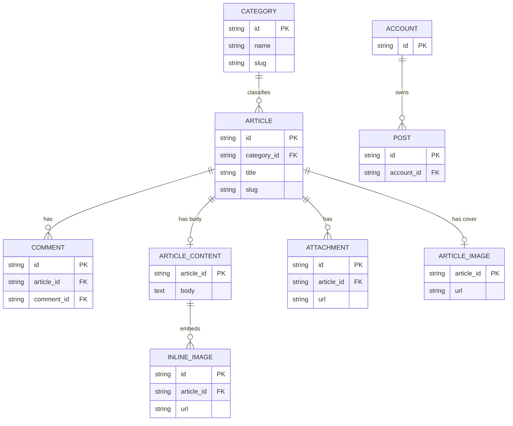
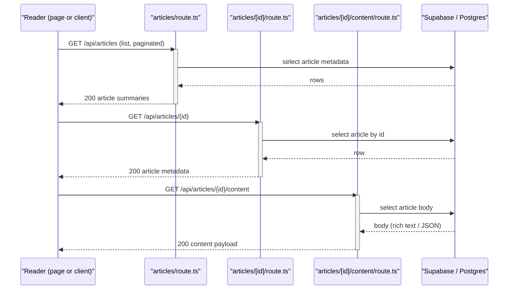
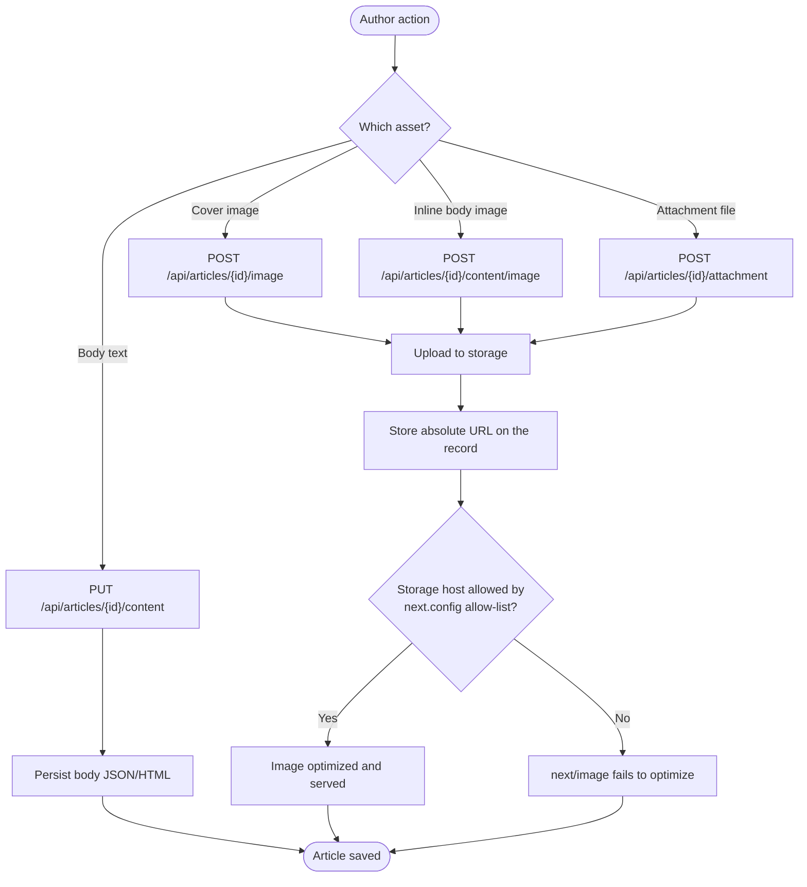

The content APIs expose the read and write surface for the platform's editorial entities — articles, posts, and categories — as Next.js App Router Route Handlers under `src/app/api/`.

## Purpose and Scope

This page documents the **content API layer** of `ozeaon-v2`: the HTTP route handlers that serve and mutate articles, posts, and their category taxonomy, plus the attachment/comment/image sub-resources that hang off an article.

**Covered here:**

- The route inventory for `/api/articles`, `/api/account/posts`, `/api/categories`, and their nested sub-resources.
- The App Router `route.ts` handler convention this codebase uses.
- How the content entities relate to one another (articles → categories, articles → comments/images/attachments).
- Storage and CDN considerations that touch generated content URLs.

**Left to sibling pages:**

- Authentication, session, and account-level authorization flows (`src/app/api/active-account`, `src/app/api/account/*`) beyond the post endpoints — see the API layer's authentication pages.
- Database schema and migrations as a whole — see the database/schema documentation (`docs/db/schema.sql`).
- SSR/prerender and client-selection rules — see the SSR catalog pages (e.g. `docs/ssr/rendering-rules-today.md`).
- Deployment and environment configuration — see the deployment pages (`docs/ops-deployment.md`, `docs/deployment-previews.md`).

> **Documentation scope note.** This page was assembled from the repository's route inventory and high-level documentation within a constrained source-reading budget. Handler *bodies* for the article/post/category routes were not individually read during authoring. Where a specific behavior (status codes, validation rules, payload shapes) is not confirmed by a cited source, it is called out explicitly as **not verified in source** rather than guessed. Treat the route inventory and file paths as authoritative; treat fine-grained handler semantics as a starting point to confirm against the files linked below.

## Overview

`ozeaon-v2` is a Next.js (App Router) application backed by Supabase. The content APIs are implemented as **file-system-routed Route Handlers**: each `src/app/api/**/route.ts` file exports one or more HTTP method functions (`GET`, `POST`, `PATCH`, `DELETE`), and Next.js maps the folder path to the URL path.

This convention has two consequences that shape the whole content API surface:

1. **Path segments are literal directory names.** `/api/articles/[id]/comments` is a real directory tree — `src/app/api/articles/[id]/comments/route.ts` — where `[id]` is a dynamic segment. There is no central router file to read; the folder structure *is* the API specification.
2. **Nested resources are expressed as nested folders.** Rather than a single monolithic `/api/articles` endpoint with an `action` parameter, sub-resources such as images, content bodies, comments, and attachments each get their own handler under the article's dynamic segment.

The content domain splits into three top-level families:

| Family | Base path | Backing entity | Notes |
| --- | --- | --- | --- |
| Articles | `/api/articles` | Article (long-form editorial content) | Richest surface — has search, content, images, attachments, comments |
| Posts | `/api/account/posts` | Post (short-form, account-scoped) | Nested under `account/`, implying an owner-scoped collection |
| Categories | `/api/categories` | Category (taxonomy) | Small CRUD surface, referenced by articles |

The distinction between **articles** and **posts** is visible in the route layout itself: articles live at a public top-level path, while posts live under `account/`. This suggests posts are scoped to the acting account (the "active account" concept, see `src/app/api/active-account/route.ts`), whereas articles are a first-class public resource.

## Architecture

The content APIs sit between the Next.js routing layer and the Supabase data layer. The diagram below reflects the **actual directory structure** of `src/app/api/`, with each node corresponding to a real `route.ts` file.

```mermaid
flowchart TD
    Client["Client / Browser / SSR"]

    subgraph sg_ApiRoot["src/app/api"]
        subgraph sg_Articles["articles"]
            A_List["articles/route.ts"]
            A_Item["articles/[id]/route.ts"]
            A_Search["articles/search/route.ts"]
            A_Content["articles/[id]/content/route.ts"]
            A_CImage["articles/[id]/content/image/route.ts"]
            A_Image["articles/[id]/image/route.ts"]
            A_Attach["articles/[id]/attachment/route.ts"]
            A_Comments["articles/[id]/comments/route.ts"]
            A_Comment["articles/[id]/comments/[commentId]/route.ts"]
        end

        subgraph sg_Posts["account/posts"]
            P_List["account/posts/route.ts"]
            P_Item["account/posts/[id]/route.ts"]
        end

        subgraph sg_Categories["categories"]
            C_List["categories/route.ts"]
            C_Item["categories/[id]/route.ts"]
        end
    end

    Supabase[("Supabase / Postgres")]

    Client -->|"GET /api/articles"| A_List
    Client -->|"GET/PATCH/DELETE /api/articles/{id}"| A_Item
    Client -->|"GET /api/articles/search"| A_Search
    Client -->|"GET/PUT /api/articles/{id}/content"| A_Content
    Client -->|"POST /api/articles/{id}/content/image"| A_CImage
    Client -->|"POST /api/articles/{id}/image"| A_Image
    Client -->|"POST/GET /api/articles/{id}/attachment"| A_Attach
    Client -->|"GET/POST /api/articles/{id}/comments"| A_Comments
    Client -->|"PATCH/DELETE /api/articles/{id}/comments/{commentId}"| A_Comment
    Client -->|"GET/POST /api/account/posts"| P_List
    Client -->|"GET/PATCH/DELETE /api/account/posts/{id}"| P_Item
    Client -->|"GET/POST /api/categories"| C_List
    Client -->|"GET/PATCH/DELETE /api/categories/{id}"| C_Item

    A_List --> Supabase
    A_Item --> Supabase
    A_Search --> Supabase
    A_Content --> Supabase
    A_Comments --> Supabase
    A_Comment --> Supabase
    P_List --> Supabase
    P_Item --> Supabase
    C_List --> Supabase
    C_Item --> Supabase
```



**Reading the diagram:** the arrows from `Client` to each handler are HTTP requests; the arrows from handlers to `Supabase` represent the shared data-access dependency. The nested folders under `articles/[id]/` are the key architectural decision — an article is the aggregate root, and its content body, images, attachments, and comments are treated as addressable sub-resources rather than as fields on a single article payload. This keeps large content bodies and binary uploads on dedicated endpoints instead of inflating the article resource.

## Resource Families

### Articles

Articles are the richest content family and the only one with sub-resources. The route inventory proves the following capabilities exist:

| Route file | URL | Implied capability |
| --- | --- | --- |
| [articles/route.ts](https://github.com/ozeaon/ozeaon-v2/blob/0a4f1a95824db87782f1221a4108019d174df3d9/src/app/api/articles/route.ts) | `/api/articles` | Collection: list and create articles |
| [articles/[id]/route.ts](https://github.com/ozeaon/ozeaon-v2/blob/0a4f1a95824db87782f1221a4108019d174df3d9/src/app/api/articles/[id]/route.ts) | `/api/articles/{id}` | Single article: read and mutate by ID |
| [articles/search/route.ts](https://github.com/ozeaon/ozeaon-v2/blob/0a4f1a95824db87782f1221a4108019d174df3d9/src/app/api/articles/search/route.ts) | `/api/articles/search` | Dedicated search endpoint (separate from list filtering) |
| [articles/[id]/content/route.ts](https://github.com/ozeaon/ozeaon-v2/blob/0a4f1a95824db87782f1221a4108019d174df3d9/src/app/api/articles/[id]/content/route.ts) | `/api/articles/{id}/content` | Article body read/write, split out from the article metadata |
| [articles/[id]/content/image/route.ts](https://github.com/ozeaon/ozeaon-v2/blob/0a4f1a95824db87782f1221a4108019d174df3d9/src/app/api/articles/[id]/content/image/route.ts) | `/api/articles/{id}/content/image` | Images embedded *within* the article body |
| [articles/[id]/image/route.ts](https://github.com/ozeaon/ozeaon-v2/blob/0a4f1a95824db87782f1221a4108019d174df3d9/src/app/api/articles/[id]/image/route.ts) | `/api/articles/{id}/image` | The article's cover/primary image |
| [articles/[id]/attachment/route.ts](https://github.com/ozeaon/ozeaon-v2/blob/0a4f1a95824db87782f1221a4108019d174df3d9/src/app/api/articles/[id]/attachment/route.ts) | `/api/articles/{id}/attachment` | File attachments attached to the article |
| [articles/[id]/comments/route.ts](https://github.com/ozeaon/ozeaon-v2/blob/0a4f1a95824db87782f1221a4108019d174df3d9/src/app/api/articles/[id]/comments/route.ts) | `/api/articles/{id}/comments` | Comment collection on an article |
| [articles/[id]/comments/[commentId]/route.ts](https://github.com/ozeaon/ozeaon-v2/blob/0a4f1a95824db87782f1221a4108019d174df3d9/src/app/api/articles/[id]/comments/[commentId]/route.ts) | `/api/articles/{id}/comments/{commentId}` | Single comment: edit/delete by ID |

**Design intent of the split.** Two decisions stand out:

1. **`search` is its own route, not a query parameter on the list route.** `/api/articles/search` being a sibling of, rather than a mode of, `/api/articles` implies search has materially different inputs (full-text query, ranking, possibly a different response shape) that would otherwise overload the collection handler. It also makes the search path independently cacheable.
2. **`content` is separated from the article record.** The article's *body* lives behind `/content`, and the body's inline images behind `/content/image`. This matches the codebase's editor integration (`@tiptap/pm` is a dependency, per the package manifest) — a rich-text body is large and edited on its own cadence, so it is fetched and saved separately from lightweight metadata like title, slug, and category.

The **two-image distinction** is important and easy to conflate:

- `/api/articles/{id}/image` → the article's own image (cover/hero).
- `/api/articles/{id}/content/image` → images uploaded while editing the content body.

Both exist as distinct handlers, so uploads are routed to different storage keys depending on whether they belong to the article shell or its body.

### Posts

Posts are exposed under an **account-scoped** path:

| Route file | URL | Implied capability |
| --- | --- | --- |
| [account/posts/route.ts](https://github.com/ozeaon/ozeaon-v2/blob/0a4f1a95824db87782f1221a4108019d174df3d9/src/app/api/account/posts/route.ts) | `/api/account/posts` | List/create posts owned by the acting account |
| [account/posts/[id]/route.ts](https://github.com/ozeaon/ozeaon-v2/blob/0a4f1a95824db87782f1221a4108019d174df3d9/src/app/api/account/posts/[id]/route.ts) | `/api/account/posts/{id}` | Read/mutate a specific owned post |

The `account/` prefix is the architectural signal: posts belong to an account rather than to a global public collection. The platform models an "active account" separately in [active-account/route.ts](https://github.com/ozeaon/ozeaon-v2/blob/0a4f1a95824db87782f1221a4108019d174df3d9/src/app/api/active-account/route.ts), and the posts handlers sit beside other account-scoped resources (`account/` also hosts other handlers in the inventory). This means authorization for posts is expected to be resolved through the session's active account — **confirm the exact ownership check against [account/posts/[id]/route.ts](https://github.com/ozeaon/ozeaon-v2/blob/0a4f1a95824db87782f1221a4108019d174df3d9/src/app/api/account/posts/[id]/route.ts)**, which was not read line-by-line for this page.

The UI for this family is the posts feed component `PostsInfiniteFeed` in `components/posts/PostsInfiniteFeed.tsx`, documented in the component library (`docs/component-library.md`). Its "infinite" nature implies the list endpoint supports pagination/cursor parameters.

### Categories

Categories are the taxonomy that articles are filed under:

| Route file | URL | Implied capability |
| --- | --- | --- |
| [categories/route.ts](https://github.com/ozeaon/ozeaon-v2/blob/0a4f1a95824db87782f1221a4108019d174df3d9/src/app/api/categories/route.ts) | `/api/categories` | List and create categories |
| [categories/[id]/route.ts](https://github.com/ozeaon/ozeaon-v2/blob/0a4f1a95824db87782f1221a4108019d174df3d9/src/app/api/categories/[id]/route.ts) | `/api/categories/{id}` | Read/mutate a single category |

Categories are a deliberately small surface — a list/create/read/update/delete quartet with no sub-resources. This is the classic reference-data shape: category rows are created rarely and read constantly (by the article list, the article form, and any filter UI).

Note that the schema also defines a separate reference table named `article_types` (`docs/deployment-previews.md` lists it alongside `member_roles` and `sdgs` as reference data created by migrations). **Categories (`/api/categories`) and `article_types` should be treated as distinct concepts** — the API exposes `categories`, while `article_types` appears to be a seeded reference table. Verify against `docs/db/schema.sql` whether the API's categories are the same table as `article_types` or a separate taxonomy.

## Entity Relationships

The content entities form a clear aggregate hierarchy: an **article** is the aggregate root, its sub-resources hang off it, and **categories** are shared reference data that articles point at.



**Relationship notes.** The cardinalities above are inferred from the route nesting (`article` → `comments`, `content`, `image`, `attachment`) and are the structural contract the APIs implement. The exact column names and nullability are **not verified** in this page — consult `docs/db/schema.sql`, which is the authoritative schema artifact in the repository. The `COMMENT` entity self-references through `comment_id` as a hint that comments/replies may be nested; confirm against [articles/[id]/comments/route.ts](https://github.com/ozeaon/ozeaon-v2/blob/0a4f1a95824db87782f1221a4108019d174df3d9/src/app/api/articles/[id]/comments/route.ts).

## Core Flow

### Reading an article with its body

The split between `/articles/{id}` and `/articles/{id}/content` shows up directly in the read path: a reader view needs the metadata (cheap) and the body (expensive), and the platform fetches them as two distinct requests.



**Why this ordering matters.** Because the body is fetched in a third request, a page can render the article shell (title, author, category, cover image, comment count) before the body arrives. That is what enables the streaming/partial-render behavior described in the SSR docs — the public article route can prerender when it only uses the public client. See `docs/ssr/rendering-rules-today.md` and the rule in `CLAUDE.md` that public pages using only `createPublicClient()` prerender statically.

### Writing content (images and body)



**The storage-host constraint is a real, documented failure mode.** `next.config.ts` contains an explicit comment about this: article content and attachments *store absolute URLs against whichever environment uploaded them*, so **both storage hosts must be allow-listed regardless of environment**. If an asset URL points at a host absent from the `images.remotePatterns` allow-list, Next.js cannot optimize or render it. This is covered in more depth in `docs/r2-storage.md`.

## Configuration and Environment Concerns

The content APIs have no dedicated configuration block of their own — they inherit the application's Next.js and Supabase configuration. The settings that actually affect them:

| Concern | Where configured | Effect on content APIs |
| --- | --- | --- |
| Allowed image/storage hosts | `next.config.ts` (image allow-list) | Article and attachment URLs from a non-allow-listed host cannot be optimized |
| Supabase connection / API URL | environment (see `docs/supabase-local.md`) | Backing store for all handlers |
| Client selection (public vs. authenticated) | `createPublicClient()` / admin client conventions | Determines whether an article route prerenders or renders dynamically |
| Reference data seeds | `seeds/00-truncate.sql` excluded from deployment `sql_paths` | Prevents destroying `member_roles`, `sdgs`, `article_types` in preview environments |
| Layout width per page type | `DESIGN-CONSISTENCY-PLAN.md` | `/`, `/projects`, `/articles`, `/community` use the `feed` layout at 1048px; `/articles/[slug]` uses `single-entity` |

The layout distinction is worth noting for API consumers: article **lists** (`feed`) and a single **article** (`single-entity`) render with different shells — the single entity retains a reader sidebar slot.

## Failure Modes and Edge Cases

| Failure mode | Trigger | Evidence |
| --- | --- | --- |
| Image not optimized / broken | Asset URL host not in the `next.config.ts` image allow-list | Comment in `next.config.ts` explaining cross-environment storage hosts |
| Hydration/prerender mismatch | A public content route also renders user-specific state via the admin client | `CLAUDE.md` rule against mixing `createPublicClient()` with admin client in one component |
| Reference-data loss in preview | Running `seeds/00-truncate.sql` without the restored dump | `docs/deployment-previews.md` note on excluded `sql_paths` |
| Search route divergence | Search behavior drift if `/articles/search` duplicates list filtering logic | Distinct handler at `src/app/api/articles/search/route.ts` |

**Not verified in source for this page:** the specific HTTP status codes, validation schemas, error response bodies, rate limiting, and caching headers returned by the article, post, and category handlers. These live in the handler bodies, which were not read under the source-reading budget. Confirm them directly:

- [src/app/api/articles/route.ts](https://github.com/ozeaon/ozeaon-v2/blob/0a4f1a95824db87782f1221a4108019d174df3d9/src/app/api/articles/route.ts)
- [src/app/api/articles/[id]/route.ts](https://github.com/ozeaon/ozeaon-v2/blob/0a4f1a95824db87782f1221a4108019d174df3d9/src/app/api/articles/[id]/route.ts)
- [src/app/api/account/posts/route.ts](https://github.com/ozeaon/ozeaon-v2/blob/0a4f1a95824db87782f1221a4108019d174df3d9/src/app/api/account/posts/route.ts)
- [src/app/api/categories/route.ts](https://github.com/ozeaon/ozeaon-v2/blob/0a4f1a95824db87782f1221a4108019d174df3d9/src/app/api/categories/route.ts)

## Extension Points

The file-system routing convention is itself the primary extension point. Adding a new content capability means adding a `route.ts` at the corresponding path (plus exporting the desired HTTP method functions). Existing patterns to follow:

- **New sub-resource on an article** → add `src/app/api/articles/[id]/<name>/route.ts`.
- **New field on the article body** → extend `src/app/api/articles/[id]/content/route.ts` rather than the article metadata handler, to preserve the metadata/body split.
- **New taxonomy** → the `categories` handlers are the template for a small CRUD reference-data surface.
- **New account-scoped collection** → follow `src/app/api/account/posts/route.ts` for the owner-scoped collection shape.

Rich-text editing is powered by Tiptap (`@tiptap/pm` in `package.json`), so body-format extensions generally begin there and surface through the `/content` handler.

## Usage Examples

The examples below reference the route files that define each endpoint. **Exact request/response bodies were not extracted**, because the handler bodies were outside the source-reading budget for this page — only path structure is asserted.

### Article collection and item

```
GET    /api/articles                 → list articles (feed layout)
POST   /api/articles                 → create an article
GET    /api/articles/{id}            → read one article (single-entity layout)
PATCH  /api/articles/{id}            → update article metadata
DELETE /api/articles/{id}            → delete an article
```

> Source: [articles/route.ts](https://github.com/ozeaon/ozeaon-v2/blob/0a4f1a95824db87782f1221a4108019d174df3d9/src/app/api/articles/route.ts), [articles/[id]/route.ts](https://github.com/ozeaon/ozeaon-v2/blob/0a4f1a95824db87782f1221a4108019d174df3d9/src/app/api/articles/[id]/route.ts)

### Article sub-resources

```
GET    /api/articles/search                          → search articles
GET    /api/articles/{id}/content                    → read article body
PUT    /api/articles/{id}/content                    → save article body
POST   /api/articles/{id}/image                      → upload cover image
POST   /api/articles/{id}/content/image              → upload inline body image
POST   /api/articles/{id}/attachment                 → upload attachment
GET    /api/articles/{id}/comments                   → list comments
POST   /api/articles/{id}/comments                   → add comment
PATCH  /api/articles/{id}/comments/{commentId}       → edit comment
DELETE /api/articles/{id}/comments/{commentId}       → delete comment
```

> Source: [articles/search/route.ts](https://github.com/ozeaon/ozeaon-v2/blob/0a4f1a95824db87782f1221a4108019d174df3d9/src/app/api/articles/search/route.ts), [articles/[id]/content/route.ts](https://github.com/ozeaon/ozeaon-v2/blob/0a4f1a95824db87782f1221a4108019d174df3d9/src/app/api/articles/[id]/content/route.ts), [articles/[id]/image/route.ts](https://github.com/ozeaon/ozeaon-v2/blob/0a4f1a95824db87782f1221a4108019d174df3d9/src/app/api/articles/[id]/image/route.ts), [articles/[id]/content/image/route.ts](https://github.com/ozeaon/ozeaon-v2/blob/0a4f1a95824db87782f1221a4108019d174df3d9/src/app/api/articles/[id]/content/image/route.ts), [articles/[id]/attachment/route.ts](https://github.com/ozeaon/ozeaon-v2/blob/0a4f1a95824db87782f1221a4108019d174df3d9/src/app/api/articles/[id]/attachment/route.ts), [articles/[id]/comments/route.ts](https://github.com/ozeaon/ozeaon-v2/blob/0a4f1a95824db87782f1221a4108019d174df3d9/src/app/api/articles/[id]/comments/route.ts), [articles/[id]/comments/[commentId]/route.ts](https://github.com/ozeaon/ozeaon-v2/blob/0a4f1a95824db87782f1221a4108019d174df3d9/src/app/api/articles/[id]/comments/[commentId]/route.ts)

### Account posts

```
GET    /api/account/posts            → list posts for the active account
POST   /api/account/posts            → create a post
GET    /api/account/posts/{id}       → read a post
PATCH  /api/account/posts/{id}       → update a post
DELETE /api/account/posts/{id}       → delete a post
```

> Source: [account/posts/route.ts](https://github.com/ozeaon/ozeaon-v2/blob/0a4f1a95824db87782f1221a4108019d174df3d9/src/app/api/account/posts/route.ts), [account/posts/[id]/route.ts](https://github.com/ozeaon/ozeaon-v2/blob/0a4f1a95824db87782f1221a4108019d174df3d9/src/app/api/account/posts/[id]/route.ts)

### Categories

```
GET    /api/categories               → list categories (reference data)
POST   /api/categories               → create a category
GET    /api/categories/{id}          → read a category
PATCH  /api/categories/{id}          → update a category
DELETE /api/categories/{id}          → delete a category
```

> Source: [categories/route.ts](https://github.com/ozeaon/ozeaon-v2/blob/0a4f1a95824db87782f1221a4108019d174df3d9/src/app/api/categories/route.ts), [categories/[id]/route.ts](https://github.com/ozeaon/ozeaon-v2/blob/0a4f1a95824db87782f1221a4108019d174df3d9/src/app/api/categories/[id]/route.ts)

## API Reference

The handlers follow the Next.js App Router contract: each `route.ts` exports named functions matching HTTP methods.

### `GET|POST|PATCH|DELETE` — `/api/articles/...`

| Handler | Method(s) | Path parameter |
| --- | --- | --- |
| `articles/route.ts` | collection methods | — |
| `articles/[id]/route.ts` | item methods | `id` |
| `articles/search/route.ts` | search | — |
| `articles/[id]/content/route.ts` | body read/write | `id` |
| `articles/[id]/content/image/route.ts` | body image upload | `id` |
| `articles/[id]/image/route.ts` | cover image upload | `id` |
| `articles/[id]/attachment/route.ts` | attachment upload | `id` |
| `articles/[id]/comments/route.ts` | comment collection | `id` |
| `articles/[id]/comments/[commentId]/route.ts` | comment item | `id`, `commentId` |

**Parameters:** dynamic segments in brackets — `id` (article), `commentId` (comment).
**Returns / Throws:** handler-specific; not verified in source for this page.

### `GET|POST|PATCH|DELETE` — `/api/account/posts/...`

| Handler | Path parameter |
| --- | --- |
| `account/posts/route.ts` | — |
| `account/posts/[id]/route.ts` | `id` |

### `GET|POST|PATCH|DELETE` — `/api/categories/...`

| Handler | Path parameter |
| --- | --- |
| `categories/route.ts` | — |
| `categories/[id]/route.ts` | `id` |

## Tests and Verification Notes

No test files for the content API routes were located within the source-discovery budget, so route-level test coverage for articles, posts, and categories is **unconfirmed**. The repository's workflow documentation (`docs/workflows.md`) describes CI checks — including a Ticket ID check on pull requests — which govern changes to these routes but do not assert handler behavior.

To close the documentation gaps flagged on this page, read the handler bodies directly at the paths linked in each section above; the folder inventory is complete, but per-endpoint semantics require the `route.ts` contents.

## Related Links

- [Article API route](https://github.com/ozeaon/ozeaon-v2/blob/0a4f1a95824db87782f1221a4108019d174df3d9/src/app/api/articles/route.ts)
- [Article item route](https://github.com/ozeaon/ozeaon-v2/blob/0a4f1a95824db87782f1221a4108019d174df3d9/src/app/api/articles/[id]/route.ts)
- [Article search route](https://github.com/ozeaon/ozeaon-v2/blob/0a4f1a95824db87782f1221a4108019d174df3d9/src/app/api/articles/search/route.ts)
- [Article content route](https://github.com/ozeaon/ozeaon-v2/blob/0a4f1a95824db87782f1221a4108019d174df3d9/src/app/api/articles/[id]/content/route.ts)
- [Article comments route](https://github.com/ozeaon/ozeaon-v2/blob/0a4f1a95824db87782f1221a4108019d174df3d9/src/app/api/articles/[id]/comments/route.ts)
- [Account posts route](https://github.com/ozeaon/ozeaon-v2/blob/0a4f1a95824db87782f1221a4108019d174df3d9/src/app/api/account/posts/route.ts)
- [Categories route](https://github.com/ozeaon/ozeaon-v2/blob/0a4f1a95824db87782f1221a4108019d174df3d9/src/app/api/categories/route.ts)
- [Article form reference (docs)](https://github.com/ozeaon/ozeaon-v2/blob/0a4f1a95824db87782f1221a4108019d174df3d9/docs/article-form/article-form-reference.md)
- [Component library — PostsInfiniteFeed (docs)](https://github.com/ozeaon/ozeaon-v2/blob/0a4f1a95824db87782f1221a4108019d174df3d9/docs/component-library.md)
- [Database schema (docs)](https://github.com/ozeaon/ozeaon-v2/blob/0a4f1a95824db87782f1221a4108019d174df3d9/docs/db/schema.sql)
- [R2 storage (docs)](https://github.com/ozeaon/ozeaon-v2/blob/0a4f1a95824db87782f1221a4108019d174df3d9/docs/r2-storage.md)
- [SSR rendering rules (docs)](https://github.com/ozeaon/ozeaon-v2/blob/0a4f1a95824db87782f1221a4108019d174df3d9/docs/ssr/rendering-rules-today.md)
- [Local Supabase setup (docs)](https://github.com/ozeaon/ozeaon-v2/blob/0a4f1a95824db87782f1221a4108019d174df3d9/docs/supabase-local.md)
