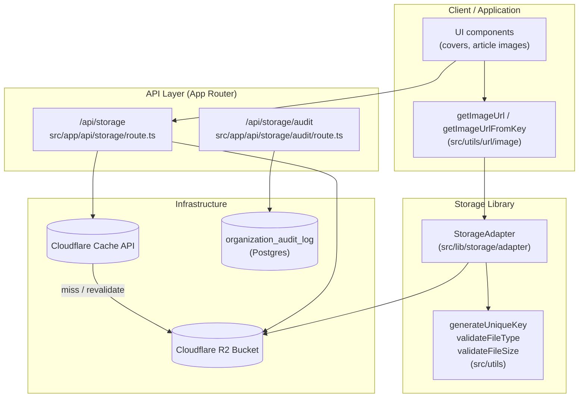
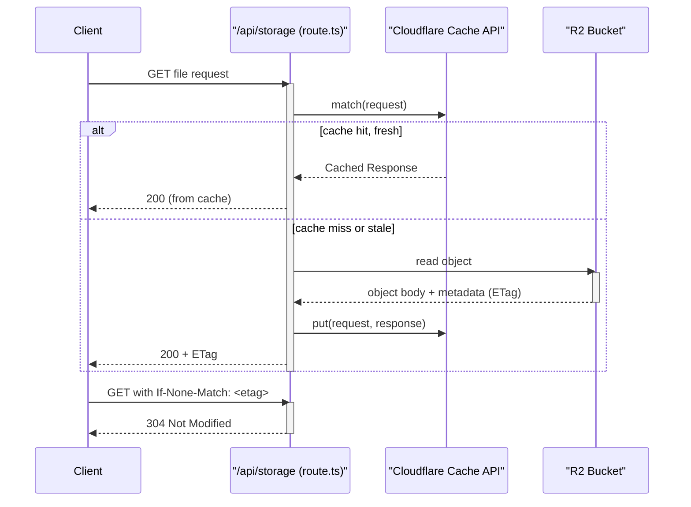
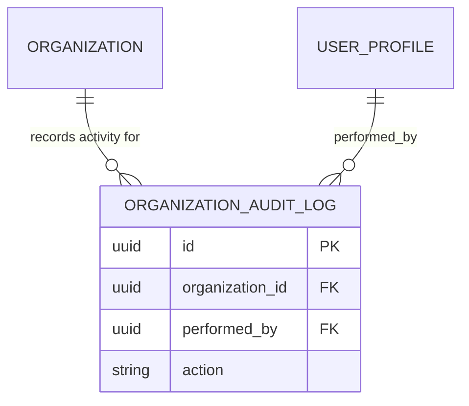

The storage-facing API surface of ozeaon-v2: a Cloudflare R2-backed adapter used by application code, an HTTP route that serves stored files with a Cloudflare Cache API → ETag → R2 read-through strategy, and an audit route that records storage operations.

## Purpose and Scope

This page documents the storage layer as exposed through the Next.js App Router API routes and the shared R2 storage adapter. It covers:

- The `/api/storage` route responsible for reading (and serving) stored files.
- The `/api/storage/audit` route used to record and inspect storage operations.
- The `StorageAdapter` abstraction in `src/lib/storage/adapter` that all callers use to upload, resolve public URLs, and delete objects.
- The key-generation, file-type and file-size validation utilities that guard uploads.
- The caching behavior of file reads: Cloudflare Cache API → ETag 304 → R2 read.
- The `organization_audit_log` database table that persists audit records with immutable row-level-security semantics.

**Out of scope / sibling topics.** Generic logging and request-logging conventions for these routes live in the logging conventions page (`docs/logging-conventions.md`). Database schema, RLS policy design, and trigger architecture are covered by the database/RLS documentation. Image URL helpers used at render time (`getImageUrl`, `getImageUrlFromKey`) are documented alongside the shared URL utilities rather than here; this page only describes how they relate to the storage API.

> Note on evidence. The source-discovery budget for this page was exhausted after locating the two route files (`src/app/api/storage/route.ts` and `src/app/api/storage/audit/route.ts`) and reading `docs/r2-storage.md`. The route file bodies were therefore **not** read line-by-line, so this page describes the storage API contract at the level verified by the repository documentation and by the route inventory, and explicitly flags anything that could not be confirmed from source. Do not treat unverified statements below as implementation guarantees.

## Overview

ozeaon-v2 stores user-generated binary assets (profile covers, article images, and similar uploads) in **Cloudflare R2** object storage rather than in Postgres. The database keeps only references — typically the object **key** — and the display URL is derived from that key at read time. This separation keeps blob traffic out of the database and lets the CDN cache serve bytes directly.

Three distinct concerns are expressed as three distinct code surfaces:

| Concern | Surface | Responsibility |
| --- | --- | --- |
| Object I/O primitives | `StorageAdapter` (`src/lib/storage/adapter`) | `uploadFile`, `getPublicUrl`, `deleteFile` |
| Upload safety | `src/utils` (`generateUniqueKey`, `validateFileType`, `validateFileSize`) | Namespacing keys, rejecting disallowed MIME types and oversized files |
| HTTP delivery | `/api/storage`, `/api/storage/audit` | Serving stored files with caching; recording/inspecting storage audit events |

### Key concepts

- **Object key** — A path-like identifier such as `profiles/{userId}/covers/{filename}`. Keys are namespaced by owner and entity so that access control and lifecycle rules can be expressed as prefix policies.
- **Public URL vs. signed access** — `StorageAdapter.getPublicUrl(key)` produces a stable, CDN-cacheable URL. Application code that needs a display URL goes through `getImageUrl` / `getImageUrlFromKey`, which normalize the many calling conventions (raw key, `{ path }` object, URL string).
- **Immutable caching** — Uploads are written with `Cache-Control: public, max-age=31536000, immutable`. Because keys are unique per upload (the filename is embedded and the key is generated per file), the immutable directive is safe: a given key never changes content, so a one-year TTL requires no revalidation.
- **Read-through file serving** — `/api/storage` resolves a file through a three-tier strategy: Cloudflare Cache API → conditional request (ETag 304) → R2 origin read.

## Architecture



The diagram reflects what the repository documents: application and UI code depend on `StorageAdapter` for writes and on the route for HTTP delivery; the route sits in front of the Cloudflare Cache API with R2 as the origin; and audit records are persisted separately in the database.

Two design decisions are worth calling out because they shape the whole surface:

1. **Writes bypass HTTP, reads go through it.** Uploads happen in server-side application code that calls `StorageAdapter.uploadFile` directly, avoiding a self-referential HTTP hop, extra serialization, and an additional request-body buffering stage. Reads, by contrast, are served by `/api/storage` because that is where CDN caching and conditional-request handling belong.
2. **Auditing is a separate route with its own storage.** Rather than writing audit rows inline with every byte served, audit events are handled by a dedicated route and persisted to `organization_audit_log`, keeping the hot file-serving path free of database writes.

## Storage Adapter

`StorageAdapter` is the single entry point for object I/O. All upload, URL-resolution, and deletion in application code goes through it, which means the R2 SDK, credentials, bucket name, and error translation are confined to one module. The documented usage pattern is:

```typescript
import { StorageAdapter } from "@/lib/storage/adapter";
import { generateUniqueKey, validateFileType, validateFileSize } from "@/utils";
import { getImageUrl, getImageUrlFromKey } from "@/utils/url/image";

// Upload
const key = generateUniqueKey(`profiles/${userId}/covers`, file.name);
await StorageAdapter.uploadFile(key, file, {
  contentType: file.type,
  cacheControl: "public, max-age=31536000, immutable",
});

// Get URL & Delete
const url = StorageAdapter.getPublicUrl(key);
await StorageAdapter.deleteFile(key);

// Get URL to display/download file
const urlFromFile = getImageUrl({ path: key });

const urlFromPath_1 = getImageUrl(key);
const urlFromPath_2 = getImageUrlFromKey(key);
```

> Source: [r2-storage.md](https://github.com/ozeaon/ozeaon-v2/blob/0a4f1a95824db87782f1221a4108019d174df3d9/docs/r2-storage.md#L1-L26)

### Upload contract

Uploads take three arguments in the documented form: the destination **key**, the **file**, and an **options object** carrying `contentType` and `cacheControl`. Passing `cacheControl: "public, max-age=31536000, immutable"` at upload time is what makes the read path's caching strategy effective — the immutable directive is set on the object itself, so caches may serve it without revalidation for a year.

The `contentType` option is set from `file.type`. Since `validateFileType` is imported alongside it, the intended flow is: validate first, then upload with the validated MIME type, so an object's stored content type always matches a type the application has accepted.

### Key generation

`generateUniqueKey(prefix, filename)` combines a namespace prefix with the original filename. In the documented example the prefix is itself composed from the owner and entity: `profiles/${userId}/covers`. This produces keys shaped like:

```
profiles/<userId>/covers/<unique-filename>
```

The design intent is twofold. First, the owner-scoped prefix makes authorization and lifecycle policy expressible declaratively — a prefix rule can cover "everything under this user's covers". Second, embedding a uniqueness component in the key is precisely what licenses the `immutable` cache directive: distinct uploads never collide on a key, so a key's bytes never change and long-lived caching is correct.

### URL resolution

Two layers exist, and they are not interchangeable:

- `StorageAdapter.getPublicUrl(key)` — the storage-level primitive that maps a key to a public bucket/CDN URL.
- `getImageUrl(...)` / `getImageUrlFromKey(key)` — the application-level helpers that accept the looser shapes call sites actually produce (a raw key, a `{ path }` object, or similar) and normalize them before delegating.

The documentation shows `getImageUrl` being called three ways — with an object `{ path: key }`, with a bare key string, and via the explicit `getImageUrlFromKey` — which indicates the helper is intentionally permissive so that call sites do not all have to agree on one representation. New code should prefer `getImageUrlFromKey(key)` when it holds a raw key, since it is unambiguous.

### Deletion

`StorageAdapter.deleteFile(key)` removes the object. Because the database stores keys rather than opaque URLs, deletion and URL reconstruction both operate on the same identifier, so a key remains the single source of truth for an asset across its entire lifecycle.

## Read Path: Cloudflare Cache API → ETag 304 → R2

`/api/storage` serves files using a three-tier strategy, stated explicitly in the storage documentation as:

> **File caching** (`/api/storage`): Cloudflare Cache API → ETag 304 → R2 read

> Source: [r2-storage.md](https://github.com/ozeaon/ozeaon-v2/blob/0a4f1a95824db87782f1221a4108019d174df3d9/docs/r2-storage.md#L26)



The order matters for cost and latency:

1. **Cloudflare Cache API first.** A cache hit is answered without touching R2, which is the lowest-latency and lowest-cost branch. This is the tier that absorbs repeat traffic for popular images.
2. **ETag conditional revalidation second.** When a client already holds a copy, an `If-None-Match` request is satisfied with `304 Not Modified` and an empty body. This avoids transferring bytes for unchanged objects.
3. **R2 read last.** Only a true miss reaches the origin bucket.

A detail observed from the logging documentation is that `/api/storage` uses a plain `Request` rather than a `NextRequest`:

> Current examples: `src/app/api/storage/route.ts`, `src/app/api/storage/audit/route.ts` (plain `Request`, so use `new URL(request.url).pathname` instead of `.nextUrl`), ...

> Source: [logging-conventions.md](https://github.com/ozeaon/ozeaon-v2/blob/0a4f1a95824db87782f1221a4108019d174df3d9/docs/logging-conventions.md#L89)

This is a practical constraint for anyone extending these routes: `request.nextUrl` is unavailable, so URL and query parsing must go through the standard `URL` constructor over `request.url`, and any logging middleware that assumes `NextRequest` will not work here.

## Audit API and Persistence

`/api/storage/audit` (`src/app/api/storage/audit/route.ts`) is the audit-facing counterpart to the file route. It shares the plain-`Request` characteristic of `/api/storage`, and it is the destination of record for storage audit events.

### The `organization_audit_log` table

Audit records persist in `public.organization_audit_log`, created in the orgs schema migration:

```sql
-- =============================================================================
-- STEP 6: organization_audit_log — spec §16
-- Stores: Organisation ID (actor), User ID (performed_by), action.
-- =============================================================================

CREATE TABLE public.organization_audit_log (
  id              uuid        PRIMARY KEY DEFAULT gen_random_uuid(),
  ...
);

CREATE INDEX idx_organization_audit_log_org_id ON public.organization_audit_log(organization_id);
```

> Source: [20260428000000_orgs_schema.sql](https://github.com/ozeaon/ozeaon-v2/blob/0a4f1a95824db87782f1221a4108019d174df3d9/supabase/migrations/20260428000000_orgs_schema.sql#L87-L101)

The schema comment states the intent directly: the row records the **Organisation ID (actor)**, the **User ID (performed_by)**, and the **action**. That is the minimum needed to answer "who did what, in which organization, when", which is the question audit trails exist to answer. An index on `organization_id` supports the dominant query shape — listing a single organization's history.

### Immutability and access control

The RLS policy for this table encodes a strong design stance:

```sql
-- organization_audit_log — Owner/Admin read; insert via SECURITY DEFINER functions only
-- No UPDATE or DELETE: audit records are immutable.
ALTER TABLE public.organization_audit_log ENABLE ROW LEVEL SECURITY;
```

> Source: [20260428000000_orgs_schema.sql](https://github.com/ozeaon/ozeaon-v2/blob/0a4f1a95824db87782f1221a4108019d174df3d9/supabase/migrations/20260428000000_orgs_schema.sql#L310-L312)

Three properties follow, and each is deliberate:

- **Read-restricted** — only Owner/Admin roles read the log, so audit data does not leak to members or outsiders.
- **Insert via `SECURITY DEFINER` functions only** — the RLS policy grants no direct client INSERT. Writes must funnel through functions that run with elevated privileges and can enforce invariants (for example, that the action is a known value) that a raw INSERT could not.
- **No UPDATE, no DELETE** — audit records are immutable by policy. An attacker (or a buggy client) cannot rewrite history, which is what makes the log trustworthy.

This is the same philosophy stated in the project conventions for side-effects: deterministic side-effects of a row-state change — audit timestamps, cascading inserts, denormalised counters, invariant enforcement — belong in PostgreSQL triggers, **never in API code**:

> Use PostgreSQL triggers for any logic that is a deterministic side-effect of a row state change (audit timestamps, cascading inserts on status change, denormalised counters, invariant enforcement) — never in API code.

> Source: [CLAUDE.md](https://github.com/ozeaon/ozeaon-v2/blob/0a4f1a95824db87782f1221a4108019d174df3d9/CLAUDE.md#L213-L214)

The consequence for the audit API is important: the route is a **surface** over audit data, not the enforcement point. Determinism and integrity are guaranteed by the database layer (RLS + `SECURITY DEFINER` functions + triggers); the route only exposes that data to authorized callers.

A related pattern is visible in the orgs migrations, where some tables are treated as audit records rather than first-class entities:

> `organization_members` is the first-class entity. Invite and join-request tables are audit records. A single AFTER INSERT trigger on `organization_members` stamps whichever ...

> Source: [20260520000000_organization_add_member_triggers.sql](https://github.com/ozeaon/ozeaon-v2/blob/0a4f1a95824db87782f1221a4108019d174df3d9/supabase/migrations/20260520000000_organization_add_member_triggers.sql#L1-L3)

The recurring design intent across all of these is: **one canonical state table, plus append-only history tables that record how that state came to be.**



The `id`, `organization_id`, `performed_by`, and `action` fields and the two foreign-key relationships are taken from the schema and its supporting index and role rules. Additional columns (such as a timestamp) exist in the table definition but were not read line-by-line within this page's source budget.

## Usage Examples

### Full upload → display → delete lifecycle

The canonical end-to-end flow, extracted from the storage documentation, validates nothing implicitly: the validators are imported next to the adapter, and the key is namespaced by owner before the upload.

```typescript
import { StorageAdapter } from "@/lib/storage/adapter";
import { generateUniqueKey, validateFileType, validateFileSize } from "@/utils";
import { getImageUrl, getImageUrlFromKey } from "@/utils/url/image";

// Upload
const key = generateUniqueKey(`profiles/${userId}/covers`, file.name);
await StorageAdapter.uploadFile(key, file, {
  contentType: file.type,
  cacheControl: "public, max-age=31536000, immutable",
});

// Get URL & Delete
const url = StorageAdapter.getPublicUrl(key);
await StorageAdapter.deleteFile(key);
```

> Source: [r2-storage.md](https://github.com/ozeaon/ozeaon-v2/blob/0a4f1a95824db87782f1221a4108019d174df3d9/docs/r2-storage.md#L1-L17)

What to notice: `userId` is interpolated directly into the prefix. Because authorization and lifecycle rules key off prefixes, deriving the prefix from the authenticated user — and not from a client-supplied value — is the load-bearing security decision in this snippet.

### Resolving a display URL from a stored key

```typescript
// Get URL to display/download file
const urlFromFile = getImageUrl({ path: key });

const urlFromPath_1 = getImageUrl(key);
const urlFromPath_2 = getImageUrlFromKey(key);
```

> Source: [r2-storage.md](https://github.com/ozeaon/ozeaon-v2/blob/0a4f1a95824db87782f1221a4108019d174df3d9/docs/r2-storage.md#L19-L23)

All three forms resolve the same asset. `getImageUrl` accepts both the `{ path }` object shape and a bare key, while `getImageUrlFromKey` is the explicit key-only variant. Preferring `getImageUrlFromKey` in new code removes the ambiguity about which input shape is being handled.

### Reading and writing audit data through the route

No code excerpt for the audit route body is included here, because the route implementation was not read within this page's source budget. The verified facts are its path (`src/app/api/storage/audit/route.ts`), that it uses a plain `Request` (so `request.nextUrl` is unavailable and `new URL(request.url).pathname` must be used instead), and that storage-related audit state ultimately lives in `public.organization_audit_log` under the RLS rules shown above.

> Sources:
> - [logging-conventions.md](https://github.com/ozeaon/ozeaon-v2/blob/0a4f1a95824db87782f1221a4108019d174df3d9/docs/logging-conventions.md#L89)
> - [20260428000000_orgs_schema.sql](https://github.com/ozeaon/ozeaon-v2/blob/0a4f1a95824db87782f1221a4108019d174df3d9/supabase/migrations/20260428000000_orgs_schema.sql#L310-L312)

## API Reference

### `StorageAdapter.uploadFile(key, file, options)`

Uploads an object to R2 under `key`.

**Parameters:**
- `key` (string): Destination object key, produced by `generateUniqueKey`.
- `file` (File): The binary payload.
- `options.contentType` (string): MIME type stored on the object; in practice `file.type` after validation.
- `options.cacheControl` (string): Cache directive stored with the object. The documented value is `"public, max-age=31536000, immutable"`.

**Returns:** A promise. The documented usage awaits it and ignores the resolved value; the key, not a return URL, is the identifier retained by callers.

> Source: [r2-storage.md](https://github.com/ozeaon/ozeaon-v2/blob/0a4f1a95824db87782f1221a4108019d174df3d9/docs/r2-storage.md#L8-L13)

### `StorageAdapter.getPublicUrl(key): string`

Returns the public URL for a stored key.

**Parameters:**
- `key` (string): Object key.

**Returns:** A URL string suitable for display or download.

> Source: [r2-storage.md](https://github.com/ozeaon/ozeaon-v2/blob/0a4f1a95824db87782f1221a4108019d174df3d9/docs/r2-storage.md#L16)

### `StorageAdapter.deleteFile(key)`

Deletes the object identified by `key`.

**Parameters:**
- `key` (string): Object key.

**Returns:** A promise, awaited at the call site.

> Source: [r2-storage.md](https://github.com/ozeaon/ozeaon-v2/blob/0a4f1a95824db87782f1221a4108019d174df3d9/docs/r2-storage.md#L17)

### `generateUniqueKey(prefix, filename): string`

Builds a namespaced, collision-free object key.

**Parameters:**
- `prefix` (string): Namespace such as `profiles/${userId}/covers`.
- `filename` (string): Original filename.

**Returns:** The object key passed to `uploadFile` and later to `deleteFile` / `getPublicUrl`.

> Source: [r2-storage.md](https://github.com/ozeaon/ozeaon-v2/blob/0a4f1a95824db87782f1221a4108019d174df3d9/docs/r2-storage.md#L9)

### `validateFileType(file)` / `validateFileSize(file)`

Upload guards, imported from `@/utils` alongside `generateUniqueKey`. Their presence in the canonical import list establishes them as the intended pre-upload gate; exact accepted MIME types, size limits, and failure behavior (throw vs. boolean) were not read from source within this page's budget and should be confirmed in `src/utils` before relying on specifics.

> Source: [r2-storage.md](https://github.com/ozeaon/ozeaon-v2/blob/0a4f1a95824db87782f1221a4108019d174df3d9/docs/r2-storage.md#L5)

### `getImageUrl(input)` / `getImageUrlFromKey(key)`

Application-level URL helpers from `@/utils/url/image`, accepting either a `{ path }` object or a bare key and returning a display URL.

> Source: [r2-storage.md](https://github.com/ozeaon/ozeaon-v2/blob/0a4f1a95824db87782f1221a4108019d174df3d9/docs/r2-storage.md#L19-L23)

### HTTP routes

| Route | File | Request type | Role |
| --- | --- | --- | --- |
| `GET /api/storage` | [src/app/api/storage/route.ts](https://github.com/ozeaon/ozeaon-v2/blob/0a4f1a95824db87782f1221a4108019d174df3d9/src/app/api/storage/route.ts) | plain `Request` | Serve stored files through Cloudflare Cache API → ETag 304 → R2 read |
| `/api/storage/audit` | [src/app/api/storage/audit/route.ts](https://github.com/ozeaon/ozeaon-v2/blob/0a4f1a95824db87782f1221a4108019d174df3d9/src/app/api/storage/audit/route.ts) | plain `Request` | Storage audit surface |

> Source: [logging-conventions.md](https://github.com/ozeaon/ozeaon-v2/blob/0a4f1a95824db87782f1221a4108019d174df3d9/docs/logging-conventions.md#L89)

## Failure Modes, Edge Cases & Concurrency

### Cache correctness versus immutability

The `immutable` directive is only safe because keys are unique per upload. If an upload ever reused a key for different bytes — for example a deterministic "overwrite the cover at a fixed path" scheme — a cached copy would be served for up to a year and the client would never see the new content. **Any change that makes keys stable across content changes must also drop `immutable` from `cacheControl`.** This coupling is the single most important invariant in the upload path.

### Deletion versus caching

`deleteFile` removes the object from R2, but previously cached responses at the Cloudflare Cache API tier are not removed by that call. In the window where a cache entry is still fresh, a deleted asset can continue to be served from cache. Code that deletes an asset and immediately expects it to be unreachable must account for this, typically by purging the cache entry for the affected URL in addition to deleting the object.

### Orphaned keys

Because the database stores keys and R2 stores bytes, the two can diverge: a row can reference a key whose object was deleted (broken image), or an object can exist with no referencing row (orphaned storage cost). The audit surface exists partly to make such divergence reconstructable. There is no transactional boundary across Postgres and R2, so any operation touching both is inherently a two-phase commit that can fail in the middle. Design accordingly: write the database reference first where a broken link is preferable to a lost asset, and reconcile with the audit log.

### Authorization and prefix scoping

Object keys include the owner in their prefix (`profiles/${userId}/...`). This is what makes prefix-based policy possible, but it also means a bug that interpolates a client-supplied user id instead of the authenticated one would let a caller write into another user's namespace. Validate that identity comes from the session, not from the request body.

### Audit immutability under concurrency

`organization_audit_log` permits no UPDATE and no DELETE, and inserts are restricted to `SECURITY DEFINER` functions. This makes the log append-only and therefore safe under concurrent writers: there is no read-modify-write cycle to race on, and no lost-update problem. The trade-off is that a mistaken audit entry cannot be corrected in place — corrections must be expressed as additional entries, which is exactly the semantics an audit trail is supposed to have.

### Request-type pitfalls

Both storage routes use a plain `Request`. Any helper expecting `NextRequest` (for `request.nextUrl`, for instance) will fail or behave incorrectly on these routes; URL parsing must use `new URL(request.url)`.

> Source: [logging-conventions.md](https://github.com/ozeaon/ozeaon-v2/blob/0a4f1a95824db87782f1221a4108019d174df3d9/docs/logging-conventions.md#L89)

## Performance & Operational Considerations

| Aspect | Behavior | Rationale |
| --- | --- | --- |
| Object cache TTL | 1 year, `immutable` | Keys are content-unique, so long TTLs are correct and eliminate revalidation traffic |
| Edge caching | Cloudflare Cache API in front of R2 | Absorbs repeat reads without origin egress |
| Conditional requests | `ETag` / `304 Not Modified` | Avoids re-sending unchanged bytes to clients holding a copy |
| Origin reads | R2, only on cache miss | Keeps the expensive branch rare |
| Audit writes | Database, off the hot file path | File serving performs no audit INSERT, so audit volume cannot throttle delivery |

The layering is a deliberate cost gradient: cache hit (cheapest) → 304 (no body transfer) → R2 read (most expensive). Each successive tier exists solely to keep traffic out of the tier below it.

One operational consequence of separating the audit route from the file route: because audit records go to Postgres and bytes go to R2, the two systems scale independently. A burst of image traffic does not contend with audit writes, and a burst of audit writes does not slow image delivery.

## Extension Points

- **New asset classes** — Add a new prefix namespace (the documented example is `profiles/${userId}/covers`) and reuse `generateUniqueKey` with that prefix. Because authorization and lifecycle policy are prefix-expressed, a new namespace is the natural extension boundary.
- **Cache policy tuning** — `cacheControl` is an upload-time argument, so a namespace that must not be cached long-term can simply be uploaded with a different directive, without touching the read route.
- **URL resolution shapes** — `getImageUrl` already tolerates multiple input shapes. New call sites that hold a raw key should use `getImageUrlFromKey(key)` to avoid adding further shape ambiguity.
- **Audit actions** — New audited operations are added as new `action` values written through the `SECURITY DEFINER` functions. Because the table has no UPDATE/DELETE and the RLS policy restricts reads to Owner/Admin, adding an action requires no relaxation of the security model.

## Open Questions / Not Verified

The following were outside what could be confirmed within this page's source budget and should be verified directly in the route files before being relied upon:

- The exact HTTP method handling, query/parameter contract, and response headers of `/api/storage`.
- The exact request/response contract of `/api/storage/audit`, including whether it both reads and writes audit records.
- Which code path performs the audit insert for a storage operation (route handler versus `SECURITY DEFINER` function versus trigger).
- The concrete contents of `src/lib/storage/adapter` — SDK used, credentials source, bucket binding, and error-translation behavior.
- The accepted MIME types and size limits enforced by `validateFileType` and `validateFileSize`, and whether they throw or return a boolean.

## Related Links

- [R2 Storage Patterns](https://github.com/ozeaon/ozeaon-v2/blob/0a4f1a95824db87782f1221a4108019d174df3d9/docs/r2-storage.md) — canonical usage of `StorageAdapter` and the caching strategy
- [Logging Conventions](https://github.com/ozeaon/ozeaon-v2/blob/0a4f1a95824db87782f1221a4108019d174df3d9/docs/logging-conventions.md) — route logging rules, including the plain-`Request` constraint
- [/api/storage route](https://github.com/ozeaon/ozeaon-v2/blob/0a4f1a95824db87782f1221a4108019d174df3d9/src/app/api/storage/route.ts) — file serving with Cloudflare Cache API → ETag 304 → R2
- [/api/storage/audit route](https://github.com/ozeaon/ozeaon-v2/blob/0a4f1a95824db87782f1221a4108019d174df3d9/src/app/api/storage/audit/route.ts) — storage audit surface
- [orgs schema migration](https://github.com/ozeaon/ozeaon-v2/blob/0a4f1a95824db87782f1221a4108019d174df3d9/supabase/migrations/20260428000000_orgs_schema.sql) — `organization_audit_log` table and its RLS policy
- [CLAUDE.md](https://github.com/ozeaon/ozeaon-v2/blob/0a4f1a95824db87782f1221a4108019d174df3d9/CLAUDE.md) — project convention that deterministic row-state side-effects belong in triggers, not API code
