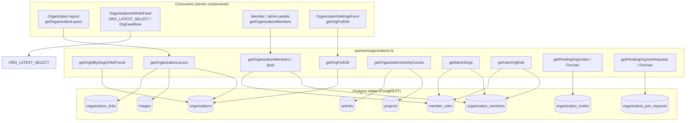
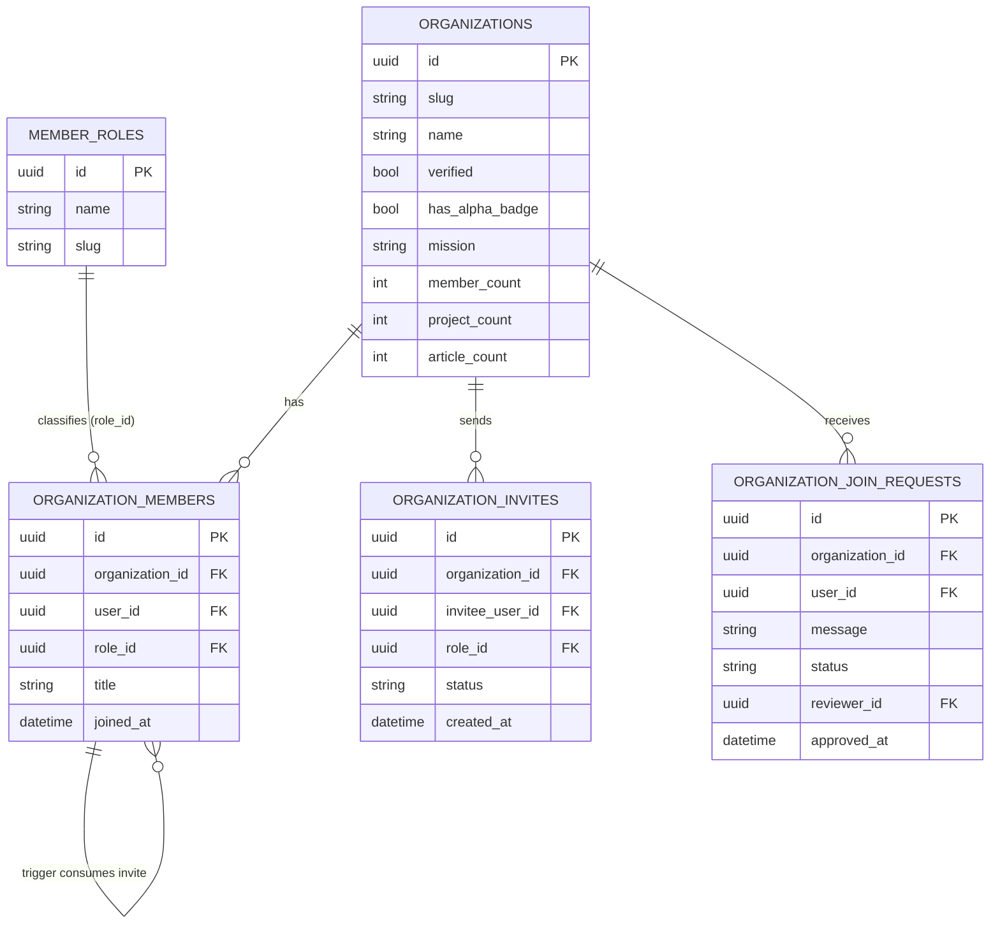
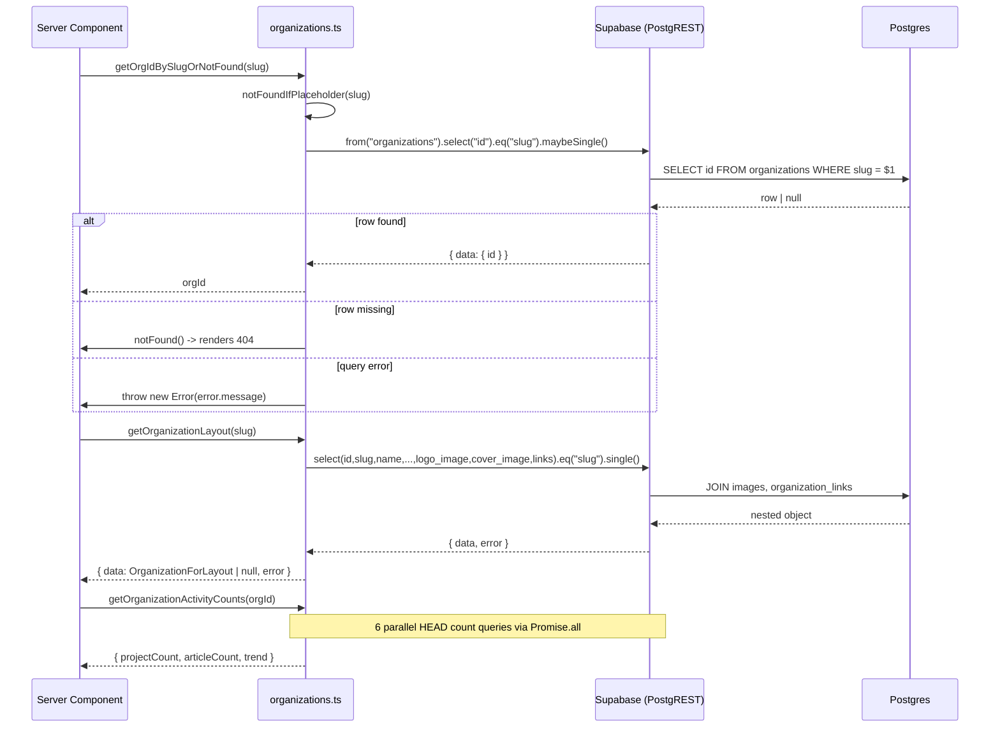
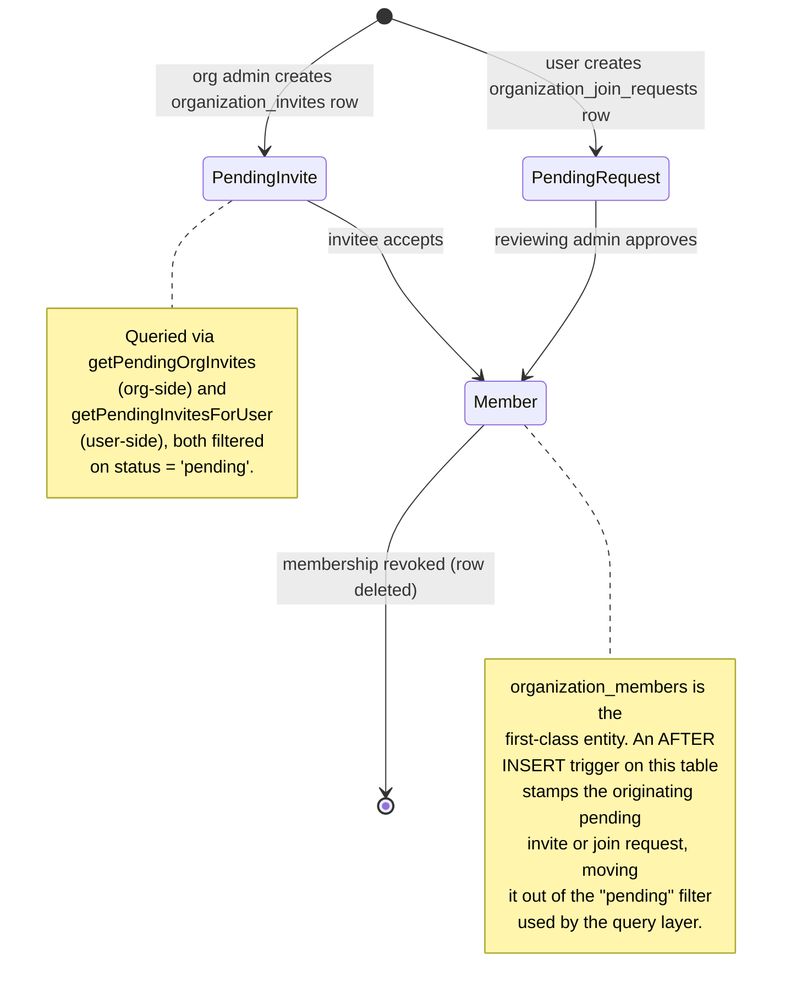

Data-access layer in `src/lib/supabase/queries/organizations.ts` that exposes organizations, their projects and articles, and the membership model (members, roles, invites, join requests) to the application's server components.

## Purpose and Scope

This page documents the **organizational data-access API**: the query functions, type contracts, and membership model that back organization profiles, project/article feeds, and the membership lifecycle (roles, invites, join requests) of `ozeaon-v2`.

In scope:

- The query module [`src/lib/supabase/queries/organizations.ts`](https://github.com/ozeaon/ozeaon-v2/blob/0a4f1a95824db87782f1221a4108019d174df3d9/src/lib/supabase/queries/organizations.ts) — every exported read helper and its embedded PostgREST `select` strings.
- The type contracts in [`src/types/organizations.ts`](https://github.com/ozeaon/ozeaon-v2/blob/0a4f1a95824db87782f1221a4108019d174df3d9/src/types/organizations.ts) — the shapes returned to the UI.
- The membership model: `organization_members`, `member_roles`, `organization_invites`, `organization_join_requests`, and the trigger that reconciles them.
- The organizations↔projects relationship and the aggregate counters (`member_count`, `project_count`, `article_count`).

Out of scope (covered by sibling pages):

- **User/profile APIs** — profile reads are pulled in here only via the shared `USER_CARD_SELECT` constant from the profile-read query module.
- **Posts and articles authoring APIs** — this page covers how an organization's articles are *read*, not how they are authored.
- **Authentication and RLS policy internals** — this page notes the relevant RLS behaviors only where they change the query result set.
- **Project authoring/lifecycle APIs** — the project status helper `withStatuses` lives in the projects query module; only its consumption here is described.

## Overview

The organization subsystem is a **read-heavy, aggregating data layer**. Server components (profile layouts, organization feeds, admin/member panels) call these functions instead of talking to PostgREST directly. Each function carries its own hard-coded, deeply-nested PostgREST `select` string that pulls in related rows through foreign-key joins — images, links, member roles, user profiles, projects, articles, SDGs, and follows.

Three design decisions dominate the module:

1. **Nested relational selects instead of multiple round-trips.** A single query such as `getOrganizationLayout` returns the organization, its logo/cover images, and all of its links in one request. The select strings are declared as module-level constants (`ORG_MEMBER_SELECT`, `ORG_PUBLIC_SELECT`, `ORG_LATEST_SELECT`, `ORG_PROJECTS_SELECT`, `ORG_ARTICLES_SELECT`) so the same projection is reused across functions.

2. **`cache()` wrapping for per-request deduplication.** Functions that are called from multiple components in the same render pass — `getAdminOrgs`, `getOrganizationActivityCounts` — are wrapped in React's `cache()` so the same arguments only hit the database once per request.

3. **Graceful degradation over throwing.** Most read helpers return a discriminated `{ data, error }` tuple and resolve errors to empty arrays (`?? []`) rather than throwing. Only `getOrgIdBySlugOrNotFound` and `getUserOrgRole` deliberately throw.



The diagram reflects the actual join graph implied by the module's `select` strings: organizations fan out to `images`, `organization_links`, `organization_members`, `projects`, and `articles`, while memberships pivot through `member_roles` and `user_profiles`.

## Architecture

### Module responsibilities

`organizations.ts` is organized by concern rather than by table:

| Concern | Functions | Notes |
|---------|-----------|-------|
| Slug → id resolution | `getOrgIdBySlugOrNotFound` | Throws `notFound()` for missing slugs |
| Profile layout | `getOrganizationLayout` | Single page-load payload |
| Editing | `getOrgForEdit` | Full editable column set, `maybeSingle` |
| Membership listing | `getOrganizationMembers`, `getOrganizationMembersById` | Two entry points: by slug and by id |
| Membership authorization | `getUserOrgRole`, `getAdminOrgs` | Role lookup + admin org list |
| Activity metrics | `getOrganizationActivityCounts` | Aggregates published projects/articles |
| Organization invites | `getPendingOrgInvites`, `getPendingOrgInviteCount` | Admin-side view |
| Join requests | `getPendingOrgJoinRequests`, `getPendingOrgJoinRequestCount` | Admin-side view |
| User-side inbox | `getPendingInvitesForUser`, `getPendingJoinRequestsForUser` + counts | Inbox view |

The symmetry between "admin-side" and "user-side" functions is intentional: the same two tables (`organization_invites`, `organization_join_requests`) are queried from both perspectives, filtered by `organization_id` in one case and by `invitee_user_id`/`user_id` in the other.

### Type contracts

[`src/types/organizations.ts`](https://github.com/ozeaon/ozeaon-v2/blob/0a4f1a95824db87782f1221a4108019d174df3d9/src/types/organizations.ts) composes types from the generated Supabase `Tables<...>` helper, narrowing each entity to the exact columns actually selected. This is the mechanism that keeps query projections and UI props in sync — if a `select` string omits a column, the corresponding type omits it too.

```typescript
export type OrganizationForLayout = Pick<
  Tables<"organizations">,
  | "id"
  | "slug"
  | "name"
  | "verified"
  | "has_alpha_badge"
  | "mission"
  | "member_count"
  | "project_count"
  | "contact_email"
  | "website_url"
  | "linkedin_url"
> & {
  logo_image: Image | null;
  cover_image: Image | null;
  links: Pick<Tables<"organization_links">, "id" | "label" | "url">[];
};
```

> Source: [organizations.ts](https://github.com/ozeaon/ozeaon-v2/blob/0a4f1a95824db87782f1221a4108019d174df3d9/src/types/organizations.ts#L60-L77)

The role union is the type-level embodiment of the membership model:

```typescript
export type OrgMemberRole = "owner" | "admin" | "member";
```

> Source: [organizations.ts](https://github.com/ozeaon/ozeaon-v2/blob/0a4f1a95824db87782f1221a4108019d174df3d9/src/types/organizations.ts#L163)

`OrgFeedRow` is notable because it carries a **viewer-relative** field, `viewer_role`, which is `null` for anonymous visitors:

```typescript
export type OrgFeedRow = Pick<
  Tables<"organizations">,
  | "id"
  | "slug"
  | "name"
  | "mission"
  | "member_count"
  | "project_count"
  | "article_count"
> & {
  logo_image: Pick<Tables<"images">, "path" | "alt"> | null;
  viewer_role: OrgMemberRole | null;
};
```

> Source: [organizations.ts](https://github.com/ozeaon/ozeaon-v2/blob/0a4f1a95824db87782f1221a4108019d174df3d9/src/types/organizations.ts#L165-L177)

## Implementation Walkthrough

### Shared projection constants

The module defines its projections once and reuses them. `ORG_MEMBER_SELECT` is the most reused — it is embedded inside `ORG_PUBLIC_SELECT`, and pulled into both member-listing functions.

```typescript
const ORG_MEMBER_SELECT = `
  id, role_id, title, joined_at,
  member_role:member_roles!role_id(id, name, slug),
  user_profile:user_profiles!user_id(${USER_CARD_SELECT})
`;
```

> Source: [organizations.ts](https://github.com/ozeaon/ozeaon-v2/blob/0a4f1a95824db87782f1221a4108019d174df3d9/src/lib/supabase/queries/organizations.ts#L76-L80)

Two things are worth noting here:

- The `member_role:member_roles!role_id(...)` syntax is PostgREST's **aliased embedded resource** form. The `!role_id` hint disambiguates the foreign key when multiple FKs exist between the two tables. The result is flattened onto a `member_role` key rather than nested under the table name.
- `USER_CARD_SELECT` is imported from the profile-read query module, so the user card projection is shared across the whole app rather than redefined. This is the only cross-module query coupling in the file.

`ORG_LATEST_SELECT` drives the organizations feed and is a good example of pulling in two many-to-many collections in the same request:

```typescript
export const ORG_LATEST_SELECT = `
  id, slug, name, verified, mission, member_count, project_count,
  logo_image:images!logo_image_id(path, alt),
  cover_image:images!cover_image_id(path, alt),
  links:organization_links(id, label, url),
  follows:organization_follows(id),
  sdgs!organization_sdgs(id,title)
`;
```

> Source: [organizations.ts](https://github.com/ozeaon/ozeaon-v2/blob/0a4f1a95824db87782f1221a4108019d174df3d9/src/lib/supabase/queries/organizations.ts#L299-L306)

`follows:organization_follows(id)` and `sdgs!organization_sdgs(id,title)` are both fetched purely for counting/display in feed cards — the trailing `(id)` on follows indicates only the row key is needed.

### Slug resolution and 404 semantics

`getOrgIdBySlugOrNotFound` is the one function that converts a routing concern into a data concern: it resolves a slug to an id **or terminates the render with a 404**.

```typescript
export async function getOrgIdBySlugOrNotFound(slug: string): Promise<string> {
  notFoundIfPlaceholder(slug);
  const supabase = createPublicClient();
  const { data, error } = await supabase
    .from("organizations")
    .select("id")
    .eq("slug", slug)
    .maybeSingle();

  if (error) throw new Error(error.message);
  if (!data) notFound();
  return data.id;
}
```

> Source: [organizations.ts](https://github.com/ozeaon/ozeaon-v2/blob/0a4f1a95824db87782f1221a4108019d174df3d9/src/lib/supabase/queries/organizations.ts#L82-L94)

Design intent: by resolving the id here and calling Next.js's `notFound()`, downstream pages can assume a valid organization id without re-checking. The `notFoundIfPlaceholder(slug)` guard (from `@/utils`) rejects reserved/placeholder slugs before the database is even hit. The deliberate `throw new Error(error.message)` — versus the silent `return []` pattern used elsewhere — reflects that a database error on this path cannot be meaningfully degraded: the page has no organization to render.

### Layout payload

`getOrganizationLayout` is the heaviest single-read function and returns a `{ data, error }` tuple rather than throwing, so a layout component can render a degraded shell:

```typescript
export async function getOrganizationLayout(
  slug: string,
): Promise<{ data: OrganizationForLayout | null; error: Error | null }> {
  const supabase = createPublicClient();
  const { data, error } = await supabase
    .from("organizations")
    .select(
      `
      id, slug, name, verified, has_alpha_badge, mission, member_count, project_count,
      contact_email, website_url, linkedin_url,
      logo_image:images!logo_image_id(path, alt),
      cover_image:images!cover_image_id(path, alt),
      links:organization_links(id, label, url)
    `,
    )
    .eq("slug", slug)
    .single();

  return {
    data: data as OrganizationForLayout | null,
    error: error as Error | null,
  };
}
```

> Source: [organizations.ts](https://github.com/ozeaon/ozeaon-v2/blob/0a4f1a95824db87782f1221a4108019d174df3d9/src/lib/supabase/queries/organizations.ts#L96-L118)

The casts (`as OrganizationForLayout | null`) are necessary because PostgREST returns a loosely-typed nested object; the manual aliases in the select string define the runtime shape but are invisible to the generated `Tables<>` types.

### Members listing — two entry points

There are two member-listing variants because the profile is reachable both by slug (public routing) and by id (already-resolved contexts such as the edit page):

```typescript
export async function getOrganizationMembers(
  supabase: SupabaseClient,
  slug: string,
): Promise<{ data: OrganizationMember[]; error: Error | null }> {
  const { data, error } = await supabase
    .from("organizations")
    .select(`members:organization_members(${ORG_MEMBER_SELECT})`)
    .eq("slug", slug)
    .maybeSingle();

  return {
    data: (data as { members: OrganizationMember[] } | null)?.members ?? [],
    error: error as Error | null,
  };
}
```

> Source: [organizations.ts](https://github.com/ozeaon/ozeaon-v2/blob/0a4f1a95824db87782f1221a4108019d174df3d9/src/lib/supabase/queries/organizations.ts#L259-L273)

`getOrganizationMembers` queries from the `organizations` side and embeds `organization_members`, whereas `getOrganizationMembersById` queries `organization_members` directly and filters by `organization_id`, ordering by `joined_at` ascending:

```typescript
export async function getOrganizationMembersById(
  supabase: SupabaseClient,
  orgId: string,
): Promise<{ data: OrganizationMember[]; error: Error | null }> {
  const { data, error } = await supabase
    .from("organization_members")
    .select(ORG_MEMBER_SELECT)
    .eq("organization_id", orgId)
    .order("joined_at", { ascending: true });

  return {
    data: (data as OrganizationMember[] | null) ?? [],
    error: error as Error | null,
  };
}
```

> Source: [organizations.ts](https://github.com/ozeaon/ozeaon-v2/blob/0a4f1a95824db87782f1221a4108019d174df3d9/src/lib/supabase/queries/organizations.ts#L275-L289)

The ordering difference is intentional and reflects two use cases: the by-id variant is used where **chronology matters** (membership lists, tenure), while the by-slug variant simply returns whatever the embed yields. Both resolve to `[]` on error, making them safe to spread into lists.

### Editing payload with `maybeSingle`

`getOrgForEdit` returns the full mutable column set and uses `maybeSingle()` — with an explicit comment explaining why:

```typescript
    .eq("slug", slug)
    // maybeSingle, so a deleted organisation is a null the caller can handle
    // rather than a PGRST116 thrown at whatever rendered it.
    .maybeSingle();
```

> Source: [organizations.ts](https://github.com/ozeaon/ozeaon-v2/blob/0a4f1a95824db87782f1221a4108019d174df3d9/src/lib/supabase/queries/organizations.ts#L248-L251)

This is a deliberate contrast with `getOrganizationLayout`, which uses `.single()` and therefore surfaces a `PGRST116` error for a missing row. The edit path prefers a `null` it can render as "not found" in a form context.

### Authorization helpers

`getUserOrgRole` is the module's authorization primitive. It reads the caller's role slug for a given organization:

```typescript
export async function getUserOrgRole(
  supabase: SupabaseClient,
  orgId: string,
  userId: string,
): Promise<"owner" | "admin" | "member" | null> {
  const { data, error } = await supabase
    .from("organization_members")
    .select("member_roles!role_id(slug)")
    .eq("organization_id", orgId)
    .eq("user_id", userId)
    .maybeSingle();

  if (error) throw error;

  const slug = (
    data as { member_roles: Pick<Tables<"member_roles">, "slug"> | null } | null
  )?.member_roles?.slug;
  if (slug === "owner" || slug === "admin" || slug === "member") return slug;
  return null;
}
```

> Source: [organizations.ts](https://github.com/ozeaon/ozeaon-v2/blob/0a4f1a95824db87782f1221a4108019d174df3d9/src/lib/supabase/queries/organizations.ts#L211-L230)

Key behaviors:

- **Unknown/renamed roles collapse to `null`.** The explicit three-way check means a role slug not in the known set is treated as "no role" rather than passed through. This fails closed.
- **Empty role slug degrades safely.** If a membership exists but the embedded `member_roles` row returns `null`, the optional chain yields `undefined` and the function returns `null`.
- **Throws on database errors**, unlike the member-listing functions — because an authorization check that cannot determine the role must not be silently treated as authorized.

`getAdminOrgs` builds on the same role concept but returns the opposite projection — the orgs the user can administer:

```typescript
export const getAdminOrgs = cache(
  async (supabase: SupabaseClient, userId: string): Promise<AdminOrg[]> => {
    const { data, error } = await supabase
      .from("organization_members")
      .select(
        `
      role:member_roles!role_id(slug),
      organization:organizations!organization_id(
        id, name, slug,
        logo_image:images!logo_image_id(path)
      )
    `,
      )
      .eq("user_id", userId);

    if (error || !data) return [];

    return (data as unknown as AdminMembershipRow[])
      .filter((m) => {
        const slug = m.role?.slug;
        return slug === "owner" || slug === "admin";
      })
      ...
```

> Source: [organizations.ts](https://github.com/ozeaon/ozeaon-v2/blob/0a4f1a95824db87782f1221a4108019d174df3d9/src/lib/supabase/queries/organizations.ts#L39-L72)

Note that the **role filter is applied in JavaScript, not in SQL** (`owner`/`admin` only). The `.eq("user_id", userId)` narrows to the user's memberships, and the role restriction is applied client-side afterwards. This works because a user's membership count is small, but it does mean the `member`-role rows are fetched and discarded.

### Activity metrics

`getOrganizationActivityCounts` is the module's aggregation function. It computes three things: published project count, published article count, and a month-over-month trend.

```typescript
function computeOrgTrend(thisMonth: number, lastMonth: number) {
  if (lastMonth > 0) {
    const pct = Math.round(((thisMonth - lastMonth) / lastMonth) * 100);
    return { value: `${pct >= 0 ? "+" : ""}${pct}%`, positive: pct >= 0 };
  }
  if (thisMonth > 0) return { value: "+100%", positive: true };
  return { value: "+0%", positive: true };
}
```

> Source: [organizations.ts](https://github.com/ozeaon/ozeaon-v2/blob/0a4f1a95824db87782f1221a4108019d174df3d9/src/lib/supabase/queries/organizations.ts#L126-L133)

The trend helper encodes the **divide-by-zero policy explicitly**: a zero baseline with any activity is reported as `+100%`, and a zero-to-zero month is `+0%` rather than `NaN`. This prevents `Infinity`/`NaN` from leaking into the UI.

The counts themselves come from `head: true` count-only queries with a shared base-builder closure:

```typescript
    const projectsBase = () =>
      supabase
        .from("projects")
        .select("id", { count: "exact", head: true })
        .eq("organization_id", orgId)
        .eq("published", true);
```

> Source: [organizations.ts](https://github.com/ozeaon/ozeaon-v2/blob/0a4f1a95824db87782f1221a4108019d174df3d9/src/lib/supabase/queries/organizations.ts#L150-L155)

Three variants of each base are executed (total, this month, last month) — **six queries in one `Promise.all`**:

```typescript
    const [
      projectsTotal,
      projectsThisMonth,
      projectsLastMonth,
      articlesTotal,
      articlesThisMonth,
      articlesLastMonth,
    ] = await Promise.all([
      projectsBase(),
      projectsBase().gte("published_at", thisMonthStart),
      projectsBase()
        .gte("published_at", lastMonthStart)
        .lt("published_at", thisMonthStart),
      articlesBase(),
      articlesBase().gte("published_at", thisMonthStart),
      articlesBase()
        .gte("published_at", lastMonthStart)
        .lt("published_at", thisMonthStart),
    ]);
```

> Source: [organizations.ts](https://github.com/ozeaon/ozeaon-v2/blob/0a4f1a95824db87782f1221a4108019d174df3d9/src/lib/supabase/queries/organizations.ts#L164-L182)

Design intent: `select("id", { count: "exact", head: true })` issues a `HEAD` request returning only the count, so no row payload crosses the wire. Batching all six in `Promise.all` reduces latency to the slowest single query. Errors are **collected and logged, not thrown**:

```typescript
    const errors = [
      projectsTotal.error,
      projectsThisMonth.error,
      projectsLastMonth.error,
      articlesTotal.error,
      articlesThisMonth.error,
      articlesLastMonth.error,
    ].filter(Boolean);
    if (errors.length > 0) {
      logError(logger, "getOrganizationActivityCounts failed", errors[0], {
        orgId,
      });
    }
```

> Source: [organizations.ts](https://github.com/ozeaon/ozeaon-v2/blob/0a4f1a95824db87782f1221a4108019d174df3d9/src/lib/supabase/queries/organizations.ts#L184-L196)

Because failed sub-queries yield `count === null` and the code coalesces with `?? 0`, a partial failure produces a **dashboard with zeroed metrics plus a logged error**, rather than a crashed page. The month boundaries are computed with local-time `Date` constructors and converted with `.toISOString()`, so the reporting window follows the server's local month, not UTC.

## Membership Model

The membership subsystem is the most complex part of the schema. Its governing principle is stated explicitly in the migration:

```sql
-- organization_members is the first-class entity.
-- Invite and join-request tables are audit records.
-- A single AFTER INSERT trigger on organization_members stamps whichever
-- pending invite or join request led to the membership.
```

> Source: [20260520000000_organization_add_member_triggers.sql](https://github.com/ozeaon/ozeaon-v2/blob/0a4f1a95824db87782f1221a4108019d174df3d9/supabase/migrations/20260520000000_organization_add_member_triggers.sql#L1-L4)

This is the key architectural insight: **`organization_members` is the source of truth**, and both `organization_invites` and `organization_join_requests` are audit trails that are *reconciled* by a trigger when a membership row appears. That means a code path can simply insert into `organization_members` and let the database mark the originating invite/request as consumed, instead of coordinating two writes in application code.

The same migration renamed audit columns to reflect that they describe the *decision*:

```sql
ALTER TABLE public.organization_join_requests
  RENAME COLUMN reviewed_by TO reviewer_id;
ALTER TABLE public.organization_join_requests
  RENAME COLUMN reviewed_at TO approved_at;
```

> Source: [20260520000000_organization_add_member_triggers.sql](https://github.com/ozeaon/ozeaon-v2/blob/0a4f1a95824db87782f1221a4108019d174df3d9/supabase/migrations/20260520000000_organization_add_member_triggers.sql#L6-L10)

The organization query layer reads the two perspectives (org-side pending invites/requests and user-side inbox) without caring how the reconciliation happens.



The ER diagram is derived from the selected columns and FK hint syntax (`!role_id`, `!organization_id`, `!invitee_user_id`, `!user_id`) used throughout the query module. Role classification is indirect: `organization_members` stores a `role_id` into `member_roles`, and the application-facing role is the `slug` (`owner` | `admin` | `member`).

### Status filtering

Both invite and join-request reads hard-filter on `status = 'pending'`:

- Org-side: `getPendingOrgInvites` / `getPendingOrgJoinRequests` — `.eq("status", "pending")` scoped by `organization_id`.
- User-side: `getPendingInvitesForUser` / `getPendingJoinRequestsForUser` — `.eq("status", "pending")` scoped by `invitee_user_id` / `user_id`.

Ordering is deliberately asymmetric and encodes queue semantics:

| Function | Scope | Order | Rationale |
|----------|-------|-------|-----------|
| `getPendingOrgInvites` | `organization_id` | `created_at` **descending** | Newest invites surface first for admins |
| `getPendingOrgJoinRequests` | `organization_id` | `created_at` **ascending** | Oldest request handled first (FIFO review queue) |
| `getPendingInvitesForUser` | `invitee_user_id` | `created_at` **descending** | Newest inbox items first |
| `getPendingJoinRequestsForUser` | `user_id` | `created_at` **descending** | Newest inbox items first |

> Sources:
> - [organizations.ts](https://github.com/ozeaon/ozeaon-v2/blob/0a4f1a95824db87782f1221a4108019d174df3d9/src/lib/supabase/queries/organizations.ts#L337-L352)
> - [organizations.ts](https://github.com/ozeaon/ozeaon-v2/blob/0a4f1a95824db87782f1221a4108019d174df3d9/src/lib/supabase/queries/organizations.ts#L375-L390)
> - [organizations.ts](https://github.com/ozeaon/ozeaon-v2/blob/0a4f1a95824db87782f1221a4108019d174df3d9/src/lib/supabase/queries/organizations.ts#L414-L429)
> - [organizations.ts](https://github.com/ozeaon/ozeaon-v2/blob/0a4f1a95824db87782f1221a4108019d174df3d9/src/lib/supabase/queries/organizations.ts#L452-L467)

The ascending ordering on org-side join requests is the only exception to newest-first, and it makes the admin queue behave like a work queue rather than a feed.

### Count-only companion functions

Every pending-list function has a paired count function using `head: true`, so badge counts can be rendered without fetching rows:

```typescript
export async function getPendingOrgInviteCount(
  supabase: SupabaseClient,
  orgId: string,
): Promise<{ count: number; error: Error | null }> {
  const { count, error } = await supabase
    .from("organization_invites")
    .select("id", { count: "exact", head: true })
    .eq("organization_id", orgId)
    .eq("status", "pending");

  return { count: count ?? 0, error: error as Error | null };
}
```

> Source: [organizations.ts](https://github.com/ozeaon/ozeaon-v2/blob/0a4f1a95824db87782f1221a4108019d174df3d9/src/lib/supabase/queries/organizations.ts#L354-L365)

The paired functions are `getPendingOrgInviteCount`, `getPendingOrgJoinRequestCount`, `getPendingInviteCountForUser`, and `getPendingJoinRequestCountForUser`.

## Core Flows

### Organization profile page load

The profile layout path exercises `getOrgIdBySlugOrNotFound` → `getOrganizationLayout` → optionally `getOrganizationActivityCounts`. Each stage degrades differently on failure.



The three failure policies visible in the sequence — `notFound()` for absence, `throw` for hard errors, `{ data: null }` for degradable reads — are the module's core error contract.

### Membership reconciliation

The trigger-driven design means application code that creates a membership does not itself need to close out the invite or join request. The flow below reflects the design stated in the migration comment, with the query layer reading the resulting state.



Both the invite and the join-request paths converge on the same first-class entity. Because the query layer filters strictly on `status = "pending"`, a reconciled record automatically disappears from every pending list without additional application-side filtering.

## Usage Examples

### Resolving an organization slug in a page

The idiomatic entry point: resolve the id (or 404) before doing anything else.

```typescript
import { getOrgIdBySlugOrNotFound } from "@/lib/supabase/queries/organizations";

const orgId = await getOrgIdBySlugOrNotFound(slug);
// Safe to assume orgId exists past this point — the helper
// already called notFound() for a missing slug.
```

> Source: [organizations.ts](https://github.com/ozeaon/ozeaon-v2/blob/0a4f1a95824db87782f1221a4108019d174df3d9/src/lib/supabase/queries/organizations.ts#L82-L94)

### Rendering the layout payload

`getOrganizationLayout` returns the union of scalar organization columns and the embedded image/link resources in one object.

```typescript
const { data, error } = await getOrganizationLayout(slug);

if (error || !data) {
  return <OrganizationFallback />;
}

// data.name, data.mission, data.member_count, data.project_count,
// data.logo_image?.path, data.cover_image?.path, data.links[]
```

> Source: [organizations.ts](https://github.com/ozeaon/ozeaon-v2/blob/0a4f1a95824db87782f1221a4108019d174df3d9/src/lib/supabase/queries/organizations.ts#L96-L118)

### Listing members with their roles and cards

```typescript
const { data: members, error } = await getOrganizationMembersById(supabase, orgId);
// Each member: { id, role_id, title, joined_at, member_role, user_profile }
```

> Source: [organizations.ts](https://github.com/ozeaon/ozeaon-v2/blob/0a4f1a95824db87782f1221a4108019d174df3d9/src/lib/supabase/queries/organizations.ts#L275-L289)

Every `member` carries `member_role` (the resolved `{ id, name, slug }`) and `user_profile` (hydrated via the shared `USER_CARD_SELECT`), so rendering role badges and avatar cards requires no secondary lookups.

### Checking a viewer's role before showing admin actions

```typescript
const { data: role } = await getUserOrgRole(supabase, orgId, userId);

if (role === "owner" || role === "admin") {
  // render management controls
}
```

> Source: [organizations.ts](https://github.com/ozeaon/ozeaon-v2/blob/0a4f1a95824db87782f1221a4108019d174df3d9/src/lib/supabase/queries/organizations.ts#L211-L230)

### Fetching an organization's admin list

```typescript
const orgs = await getAdminOrgs(supabase, userId);
// AdminOrg[]: { id, name, slug, logo_path }
```

> Source: [organizations.ts](https://github.com/ozeaon/ozeaon-v2/blob/0a4f1a95824db87782f1221a4108019d174df3d9/src/lib/supabase/queries/organizations.ts#L39-L74)

Because `getAdminOrgs` is wrapped in `cache()`, calling it from several components in the same request only performs one query.

### Building the pending-work badges

```typescript
const [{ count: inviteCount }, { count: requestCount }] = await Promise.all([
  getPendingOrgInviteCount(supabase, orgId),
  getPendingOrgJoinRequestCount(supabase, orgId),
]);
```

> Sources:
> - [organizations.ts](https://github.com/ozeaon/ozeaon-v2/blob/0a4f1a95824db87782f1221a4108019d174df3d9/src/lib/supabase/queries/organizations.ts#L354-L365)
> - [organizations.ts](https://github.com/ozeaon/ozeaon-v2/blob/0a4f1a95824db87782f1221a4108019d174df3d9/src/lib/supabase/queries/organizations.ts#L392-L403)

Both return `count: 0` on error, so a failed count renders as an empty badge rather than an exception.

## API Reference

### `getOrgIdBySlugOrNotFound(slug: string): Promise<string>`

Resolves a public slug to an organization id.

**Parameters**
- `slug` (string): The organization's URL slug.

**Returns:** The organization `id` as a string.

**Throws / Terminates**
- Terminates the render with Next.js `notFound()` if the slug is a placeholder (via `notFoundIfPlaceholder`) or if no organization matches.
- Throws `Error(error.message)` if the database query itself fails.

> Source: [organizations.ts](https://github.com/ozeaon/ozeaon-v2/blob/0a4f1a95824db87782f1221a4108019d174df3d9/src/lib/supabase/queries/organizations.ts#L82-L94)

### `getOrganizationLayout(slug: string): Promise<{ data: OrganizationForLayout | null; error: Error | null }>`

Loads the public profile layout payload: scalar columns plus `logo_image`, `cover_image`, and `links`. Uses `.single()`.

> Source: [organizations.ts](https://github.com/ozeaon/ozeaon-v2/blob/0a4f1a95824db87782f1221a4108019d174df3d9/src/lib/supabase/queries/organizations.ts#L96-L118)

### `getOrganizationActivityCounts(orgId: string): Promise<OrganizationActivityCounts>`

Wrapped in `cache()`. Returns published project/article totals and a month-over-month trend.

```typescript
export type OrganizationActivityCounts = {
  projectCount: number;
  articleCount: number;
  trend: { value: string; positive: boolean };
};
```

> Source: [organizations.ts](https://github.com/ozeaon/ozeaon-v2/blob/0a4f1a95824db87782f1221a4108019d174df3d9/src/lib/supabase/queries/organizations.ts#L120-L124)

**Behavior notes:** Only rows with `published = true` are counted. `projectCount`/`articleCount` are all-time totals; `trend` compares the current local month against the previous local month. Sub-query failures are logged via `logError` and coerced to `0`.

### `getUserOrgRole(supabase, orgId, userId): Promise<"owner" | "admin" | "member" | null>`

**Returns:** The caller's role slug, or `null` when there is no membership or the role is outside the known set.

**Throws:** Propagates the Supabase error object on query failure.

> Source: [organizations.ts](https://github.com/ozeaon/ozeaon-v2/blob/0a4f1a95824db87782f1221a4108019d174df3d9/src/lib/supabase/queries/organizations.ts#L211-L230)

### `getAdminOrgs(supabase, userId): Promise<AdminOrg[]>`

Wrapped in `cache()`. Returns organizations where the user's role slug is `owner` or `admin`, projected to `{ id, name, slug, logo_path }` (with `logo_path` defaulting to `null`).

> Source: [organizations.ts](https://github.com/ozeaon/ozeaon-v2/blob/0a4f1a95824db87782f1221a4108019d174df3d9/src/lib/supabase/queries/organizations.ts#L39-L74)

### `getOrgForEdit(supabase, slug): Promise<{ data: OrgForEdit | null; error: Error | null }>`

Returns the full editable column set, including `organization_type_id`, `description`, `location`, `logo_image_id`, `cover_image_id`, and `links`. Uses `.maybeSingle()` so a deleted organization yields `null` rather than `PGRST116`.

> Source: [organizations.ts](https://github.com/ozeaon/ozeaon-v2/blob/0a4f1a95824db87782f1221a4108019d174df3d9/src/lib/supabase/queries/organizations.ts#L232-L257)

### `getOrganizationMembers(supabase, slug)` / `getOrganizationMembersById(supabase, orgId)`

**Returns:** `{ data: OrganizationMember[]; error: Error | null }`, defaulting to `[]`.

`getOrganizationMembers` embeds members from the `organizations` side by slug. `getOrganizationMembersById` queries `organization_members` directly and orders by `joined_at` ascending.

> Sources:
> - [organizations.ts](https://github.com/ozeaon/ozeaon-v2/blob/0a4f1a95824db87782f1221a4108019d174df3d9/src/lib/supabase/queries/organizations.ts#L259-L273)
> - [organizations.ts](https://github.com/ozeaon/ozeaon-v2/blob/0a4f1a95824db87782f1221a4108019d174df3d9/src/lib/supabase/queries/organizations.ts#L275-L289)

### Pending invites and join requests

| Function | Filter | Order | Returns |
|----------|--------|-------|---------|
| `getPendingOrgInvites(supabase, orgId)` | `organization_id`, `status=pending` | `created_at` desc | `{ data: OrgInvite[]; error }` |
| `getPendingOrgInviteCount(supabase, orgId)` | `organization_id`, `status=pending` | — | `{ count: number; error }` |
| `getPendingOrgJoinRequests(supabase, orgId)` | `organization_id`, `status=pending` | `created_at` asc | `{ data: OrgJoinRequest[]; error }` |
| `getPendingOrgJoinRequestCount(supabase, orgId)` | `organization_id`, `status=pending` | — | `{ count: number; error }` |
| `getPendingInvitesForUser(supabase, userId)` | `invitee_user_id`, `status=pending` | `created_at` desc | `{ data: UserInvite[]; error }` |
| `getPendingInviteCountForUser(supabase, userId)` | `invitee_user_id`, `status=pending` | — | `{ count: number; error }` |
| `getPendingJoinRequestsForUser(supabase, userId)` | `user_id`, `status=pending` | `created_at` desc | `{ data: UserJoinRequest[]; error }` |
| `getPendingJoinRequestCountForUser(supabase, userId)` | `user_id`, `status=pending` | — | `{ count: number; error }` |

> Sources:
> - [organizations.ts](https://github.com/ozeaon/ozeaon-v2/blob/0a4f1a95824db87782f1221a4108019d174df3d9/src/lib/supabase/queries/organizations.ts#L337-L365)
> - [organizations.ts](https://github.com/ozeaon/ozeaon-v2/blob/0a4f1a95824db87782f1221a4108019d174df3d9/src/lib/supabase/queries/organizations.ts#L375-L403)
> - [organizations.ts](https://github.com/ozeaon/ozeaon-v2/blob/0a4f1a95824db87782f1221a4108019d174df3d9/src/lib/supabase/queries/organizations.ts#L414-L442)
> - [organizations.ts](https://github.com/ozeaon/ozeaon-v2/blob/0a4f1a95824db87782f1221a4108019d174df3d9/src/lib/supabase/queries/organizations.ts#L452-L475)

### Exported select constants

| Constant | Purpose |
|----------|---------|
| `ORG_MEMBER_SELECT` | Member + resolved role + user card; embedded by other selects |
| `ORG_PUBLIC_SELECT` | Full org row + images + links + members |
| `ORG_LATEST_SELECT` | Feed projection incl. `follows` and `sdgs` |
| `ORG_PROJECTS_SELECT` | Project cards with cover image, subcategories, author, authoring org |
| `ORG_ARTICLES_SELECT` | Article cards with subcategories, authoring and linked orgs |

> Source: [organizations.ts](https://github.com/ozeaon/ozeaon-v2/blob/0a4f1a95824db87782f1221a4108019d174df3d9/src/lib/supabase/queries/organizations.ts#L76-L326)

## Failure Modes, Edge Cases & Concurrency

| Scenario | Behavior | Evidence |
|----------|----------|----------|
| Missing organization slug on layout lookup | `notFound()` terminates render (404) | [L92](https://github.com/ozeaon/ozeaon-v2/blob/0a4f1a95824db87782f1221a4108019d174df3d9/src/lib/supabase/queries/organizations.ts#L92) |
| Placeholder/reserved slug | Rejected before querying via `notFoundIfPlaceholder` | [L83](https://github.com/ozeaon/ozeaon-v2/blob/0a4f1a95824db87782f1221a4108019d174df3d9/src/lib/supabase/queries/organizations.ts#L83) |
| Layout query uses `.single()` | A missing row surfaces as `PGRST116` error rather than `null` | [L112](https://github.com/ozeaon/ozeaon-v2/blob/0a4f1a95824db87782f1221a4108019d174df3d9/src/lib/supabase/queries/organizations.ts#L112) |
| Edit query uses `.maybeSingle()` | Missing row yields `null`; comment documents the deliberate choice | [L249-L251](https://github.com/ozeaon/ozeaon-v2/blob/0a4f1a95824db87782f1221a4108019d174df3d9/src/lib/supabase/queries/organizations.ts#L249-L251) |
| Member/feed list query error | Coerced to `[]` via `?? []`, page still renders | [L270](https://github.com/ozeaon/ozeaon-v2/blob/0a4f1a95824db87782f1221a4108019d174df3d9/src/lib/supabase/queries/organizations.ts#L270) |
| Unknown or renamed role slug | `getUserOrgRole` returns `null` (fails closed) | [L228-L229](https://github.com/ozeaon/ozeaon-v2/blob/0a4f1a95824db87782f1221a4108019d174df3d9/src/lib/supabase/queries/organizations.ts#L228-L229) |
| Role check database error | `getUserOrgRole` throws instead of degrading | [L223](https://github.com/ozeaon/ozeaon-v2/blob/0a4f1a95824db87782f1221a4108019d174df3d9/src/lib/supabase/queries/organizations.ts#L223) |
| Zero-count baseline month | `computeOrgTrend` returns `+100%`, never `NaN` | [L131](https://github.com/ozeaon/ozeaon-v2/blob/0a4f1a95824db87782f1221a4108019d174df3d9/src/lib/supabase/queries/organizations.ts#L131) |
| Partial metric query failure | Errors collected, `logError` called, counts default to `0` | [L184-L206](https://github.com/ozeaon/ozeaon-v2/blob/0a4f1a95824db87782f1221a4108019d174df3d9/src/lib/supabase/queries/organizations.ts#L184-L206) |
| Concurrent requests for same counts | `cache()` deduplicates per request pass | [L135](https://github.com/ozeaon/ozeaon-v2/blob/0a4f1a95824db87782f1221a4108019d174df3d9/src/lib/supabase/queries/organizations.ts#L135) |

**Concurrency and consistency notes.** The query layer performs no writes and holds no locks — membership mutations happen in the database, and the `AFTER INSERT` trigger on `organization_members` reconciles the audit tables. This makes invitation acceptance a single-row operation from the application's perspective, with the trigger providing atomic reconciliation. The read side is eventually consistent with respect to that trigger only within a single request; because every pending query filters on `status = "pending"`, a reconciled record simply stops appearing.

**Denormalized counters.** `member_count`, `project_count`, and `article_count` are stored on `organizations` rather than computed by the query layer. `getOrganizationActivityCounts` deliberately reads live counts from `projects`/`articles` (via `head` count queries) rather than the denormalized columns, while the layout and feed payloads read the stored columns. This means the layout can be slightly stale relative to the activity panel.

## Performance & Operational Considerations

- **`cache()` deduplication.** `getAdminOrgs` and `getOrganizationActivityCounts` are wrapped in React's `cache()`, so repeated calls with identical arguments within a request hit the database once. This matters most for `getAdminOrgs`, which is typically needed by both navigation and page content.
- **`head: true` count queries.** All counters use `select("id", { count: "exact", head: true })`, issuing `HEAD` requests that return only a count header and no row payload. Exact counts are used (not `planned`/`estimated`), trading accuracy-preserving cost for predictability.
- **Parallelized aggregation.** `getOrganizationActivityCounts` fires six count queries in a single `Promise.all`, so added latency is bounded by the slowest query rather than the sum.
- **Nested embeds vs. N+1.** The aliased FK-hint embeds (`!role_id`, `!logo_image_id`, `!organization_id`) collapse what would otherwise be dozens of round-trips into single requests, at the cost of wide, denormalized responses.
- **Client-side role filtering in `getAdminOrgs`.** The `owner`/`admin` restriction is applied in JavaScript after fetching all of the user's memberships. This keeps the query simple but transfers `member`-role rows unnecessarily; the design assumes a user belongs to a small number of organizations.
- **Local-time month boundaries.** `computeOrgTrend` windows are built with local `Date` constructors and serialized with `toISOString()`, so the reporting month follows the server timezone. Deployments spanning timezones will see boundary skew for activity close to midnight on the first of the month.
- **Error logging.** Failures are routed through `getLogger(["lib", "supabase"])` and `logError`, giving the Supabase query layer a distinct logger namespace for operational filtering.

## Extension Points

- **Adding a field to a page.** Extend the relevant module-level `select` constant (e.g. `ORG_LATEST_SELECT`) and add the column to the matching `Pick<Tables<"...">, ...>` type in [`src/types/organizations.ts`](https://github.com/ozeaon/ozeaon-v2/blob/0a4f1a95824db87782f1221a4108019d174df3d9/src/types/organizations.ts). Because types are derived from explicit `Pick` unions, the compiler enforces that the type and the select stay aligned.
- **New role slugs.** `getUserOrgRole`'s explicit allow-list and `getAdminOrgs`' JavaScript filter both define which roles are recognized. Introducing a new role requires updating both, plus `OrgMemberRole` in the types module.
- **New embedded resources.** Follow the existing alias pattern (`follows:organization_follows(id)`) to add collections without changing function signatures.
- **Consumers to update.** Organization-scoped UI components live under [`src/components/organizations/`](https://github.com/ozeaon/ozeaon-v2/blob/0a4f1a95824db87782f1221a4108019d174df3d9/src/components/organizations/OrganizationsInfiniteFeed.tsx), [`src/components/profiles/organizations/`](https://github.com/ozeaon/ozeaon-v2/blob/0a4f1a95824db87782f1221a4108019d174df3d9/src/components/profiles/organizations/OrganizationDataSlot.tsx), and the form hook [`src/hooks/use-organization-form.ts`](https://github.com/ozeaon/ozeaon-v2/blob/0a4f1a95824db87782f1221a4108019d174df3d9/src/hooks/use-organization-form.ts). The feed consumes `OrgFeedRow`; the settings form consumes `OrgForEdit`.

## Related Links

- Source module: [src/lib/supabase/queries/organizations.ts](https://github.com/ozeaon/ozeaon-v2/blob/0a4f1a95824db87782f1221a4108019d174df3d9/src/lib/supabase/queries/organizations.ts)
- Type contracts: [src/types/organizations.ts](https://github.com/ozeaon/ozeaon-v2/blob/0a4f1a95824db87782f1221a4108019d174df3d9/src/types/organizations.ts)
- Organization constants: [src/config/constants/organizations.ts](https://github.com/ozeaon/ozeaon-v2/blob/0a4f1a95824db87782f1221a4108019d174df3d9/src/config/constants/organizations.ts)
- Organization form hook: [src/hooks/use-organization-form.ts](https://github.com/ozeaon/ozeaon-v2/blob/0a4f1a95824db87782f1221a4108019d174df3d9/src/hooks/use-organization-form.ts)
- Feed component: [OrganizationsInfiniteFeed.tsx](https://github.com/ozeaon/ozeaon-v2/blob/0a4f1a95824db87782f1221a4108019d174df3d9/src/components/organizations/OrganizationsInfiniteFeed.tsx)
- Profile data slot: [OrganizationDataSlot.tsx](https://github.com/ozeaon/ozeaon-v2/blob/0a4f1a95824db87782f1221a4108019d174df3d9/src/components/profiles/organizations/OrganizationDataSlot.tsx)
- Membership trigger migration: [20260520000000_organization_add_member_triggers.sql](https://github.com/ozeaon/ozeaon-v2/blob/0a4f1a95824db87782f1221a4108019d174df3d9/supabase/migrations/20260520000000_organization_add_member_triggers.sql)
- Organization id on content tables: [20260507000000_add_organization_id_to_content_tables.sql](https://github.com/ozeaon/ozeaon-v2/blob/0a4f1a95824db87782f1221a4108019d174df3d9/supabase/migrations/20260507000000_add_organization_id_to_content_tables.sql)
- Projects linked organization: [20260511000000_projects_linked_organization_id.sql](https://github.com/ozeaon/ozeaon-v2/blob/0a4f1a95824db87782f1221a4108019d174df3d9/supabase/migrations/20260511000000_projects_linked_organization_id.sql)
- Organization article count: [20260805223000_organization_article_count.sql](https://github.com/ozeaon/ozeaon-v2/blob/0a4f1a95824db87782f1221a4108019d174df3d9/supabase/migrations/20260805223000_organization_article_count.sql)
- RLS policies (organizations/invites/join requests): [20260420000002_fix_rls_performance.sql](https://github.com/ozeaon/ozeaon-v2/blob/0a4f1a95824db87782f1221a4108019d174df3d9/supabase/migrations/20260420000002_fix_rls_performance.sql)
