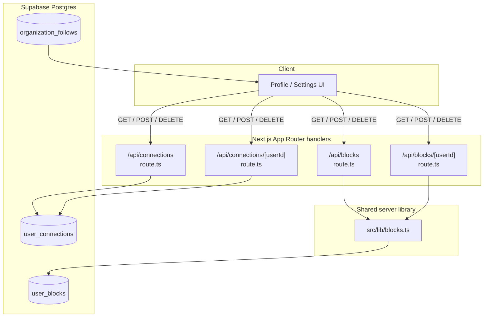
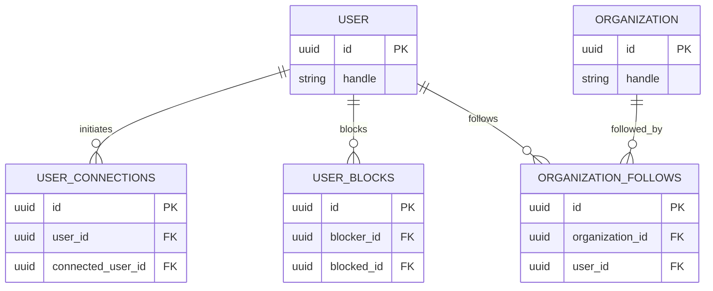
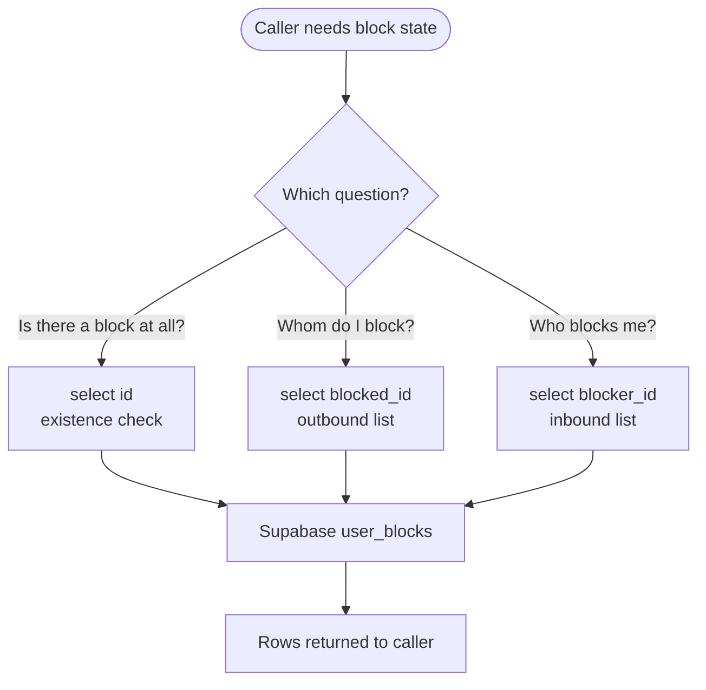
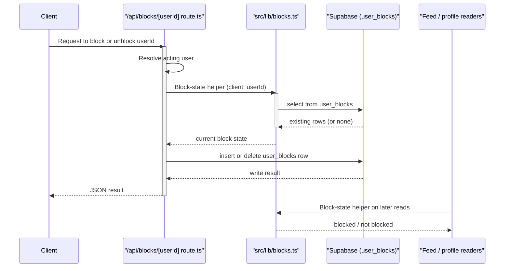

The profile-and-social API surface of Ozeaon: HTTP route handlers for user connections, block lists, and organization follows, backed by `src/lib/blocks.ts` and the Supabase tables `user_connections`, `user_blocks`, and `organization_follows`.

## Purpose and Scope

This page documents the social-graph portion of the Ozeaon API layer. It covers:

- The `/api/connections` collection and `/api/connections/[userId]` single-relationship endpoints.
- The `/api/blocks` collection and `/api/blocks/[userId]` single-block endpoints.
- The shared helper module [`src/lib/blocks.ts`](https://github.com/ozeaon/ozeaon-v2/blob/0a4f1a95824db87782f1221a4108019d174df3d9/src/lib/blocks.ts), which encodes the block-lookup queries reused by the rest of the server.
- The persistence model: `user_connections`, `user_blocks`, and `organization_follows` as declared in [`src/types/supabase.ts`](https://github.com/ozeaon/ozeaon-v2/blob/0a4f1a95824db87782f1221a4108019d174df3d9/src/types/supabase.ts).

It intentionally leaves the following to sibling pages:

- **Articles, comments, categories, and content APIs** — see the article/comment API pages under `src/app/api/articles/...`.
- **Account and session identity** — see the account/active-account API pages (`src/app/api/account/...`, `src/app/api/active-account/...`); this page treats the acting user as already resolved.
- **Feed rendering** — see the component/feed documentation, which consumes the follow graph but is not itself part of this API surface.
- **Database schema authoring** — see the database schema reference (`docs/db/schema.sql`).

## Overview

Ozeaon's social graph is expressed through three independent relationship tables rather than one polymorphic "edge" table. That split is deliberate: each relationship has a different lifecycle, a different visibility rule, and a different set of consumers.

| Concept | Table | Direction | Semantics |
| --- | --- | --- | --- |
| Connection | `user_connections` | pairwise | A mutual link between two users (an accepted connection/social edge) |
| Block | `user_blocks` | directed | User A suppresses user B; asymmetric and one-sided |
| Follow | `organization_follows` | directed | User follows an *organization* (not another user) |

Two design consequences follow immediately from that table layout:

1. **Blocks are directed and asymmetric.** The schema names the two sides `blocker_id` and `blocked_id`, and the foreign keys are declared separately (`user_blocks_blocker_id_fkey`, `user_blocks_blocked_id_fkey`). A block therefore does not need the counterparty's consent, which is precisely why it must be consulted at read time by every feature that would otherwise surface another user's content.
2. **Follows target organizations, not users.** `organization_follows` carries `organization_id` and `user_id` foreign keys (`organization_follows_organization_id_fkey`, `organization_follows_user_id_fkey`). User-to-user "following" is not modeled here; the pairwise user relationship is `user_connections`.

The API routes are thin: they authenticate, parse the target user, and delegate the actual query construction to shared helpers so that the block rules are defined in exactly one place.

## Architecture

The social API follows Next.js App Router conventions: each HTTP verb lives in a `route.ts` under `src/app/api/`, and collection vs. single-resource concerns are separated into sibling directories.



**Why this shape.** Route handlers hold no business rules beyond request/response mapping — the grouping above reflects the real folder structure (`src/app/api/connections/...` and `src/app/api/blocks/...`), while `src/lib/blocks.ts` sits in the shared library layer because block status must be answerable from many server contexts, not only from the block endpoints themselves.

## Data Model

The three relationship tables are declared in the generated Supabase type surface [`src/types/supabase.ts`](https://github.com/ozeaon/ozeaon-v2/blob/0a4f1a95824db87782f1221a4108019d174df3d9/src/types/supabase.ts). The declared foreign keys are the authoritative statement of cardinality and direction.

### `user_connections`

| Property | Value |
| --- | --- |
| Nature | Pairwise user↔user link |
| Declared at | [src/types/supabase.ts](https://github.com/ozeaon/ozeaon-v2/blob/0a4f1a95824db87782f1221a4108019d174df3d9/src/types/supabase.ts#L4940) |
| Consumers | Connection collection and single-relationship routes |

### `user_blocks`

| Property | Value |
| --- | --- |
| Nature | Directed suppression edge |
| Columns referenced by foreign keys | `blocker_id`, `blocked_id` |
| Declared at | [src/types/supabase.ts](https://github.com/ozeaon/ozeaon-v2/blob/0a4f1a95824db87782f1221a4108019d174df3d9/src/types/supabase.ts#L4859) |
| FKs | `user_blocks_blocked_id_fkey` → `blocked_id`; `user_blocks_blocker_id_fkey` → `blocker_id` ([L4880](https://github.com/ozeaon/ozeaon-v2/blob/0a4f1a95824db87782f1221a4108019d174df3d9/src/types/supabase.ts#L4880-L4888)) |

The two `blocker_id` / `blocked_id` columns are the reason block queries are always written in a specific direction. The helper library issues *three separate* lookups, not one, because callers need different questions answered (see the next section).

### `organization_follows`

| Property | Value |
| --- | --- |
| Nature | Directed user→organization follow |
| Declared at | [src/types/supabase.ts](https://github.com/ozeaon/ozeaon-v2/blob/0a4f1a95824db87782f1221a4108019d174df3d9/src/types/supabase.ts#L2051) |
| FKs | `organization_follows_organization_id_fkey` → `organization_id`; `organization_follows_user_id_fkey` → `user_id` ([L2072](https://github.com/ozeaon/ozeaon-v2/blob/0a4f1a95824db87782f1221a4108019d174df3d9/src/types/supabase.ts#L2072-L2080)) |



> Note: the exact non-key columns of `user_connections` and `organization_follows` were not read within this page's source budget; only the table names and the foreign-key columns listed above are confirmed. Treat the remaining columns as described by [docs/db/schema.sql](https://github.com/ozeaon/ozeaon-v2/blob/0a4f1a95824db87782f1221a4108019d174df3d9/docs/db/schema.sql).

## The Block Helper Library (`src/lib/blocks.ts`)

`src/lib/blocks.ts` is the single source of truth for block-state queries. Every function takes a Supabase `client` as its first argument rather than importing a module-level client, which lets callers pass a user-scoped client, a public/anon client, or an admin client depending on the trust boundary — consistent with the project rule that public pages use `createPublicClient()` and never mix in user-scoped state ([CLAUDE.md](https://github.com/ozeaon/ozeaon-v2/blob/0a4f1a95824db87782f1221a4108019d174df3d9/CLAUDE.md#L20-L21)).

The module issues three distinct queries against `user_blocks`:

```typescript
const { data } = await client
  .from("user_blocks")
  .select("id")
```

> Source: [blocks.ts](https://github.com/ozeaon/ozeaon-v2/blob/0a4f1a95824db87782f1221a4108019d174df3d9/src/lib/blocks.ts#L14-L16)

```typescript
const { data } = await client
  .from("user_blocks")
  .select("blocked_id")
```

> Source: [blocks.ts](https://github.com/ozeaon/ozeaon-v2/blob/0a4f1a95824db87782f1221a4108019d174df3d9/src/lib/blocks.ts#L34-L36)

```typescript
const { data } = await client
  .from("user_blocks")
  .select("blocker_id")
```

> Source: [blocks.ts](https://github.com/ozeaon/ozeaon-v2/blob/0a4f1a95824db87782f1221a4108019d174df3d9/src/lib/blocks.ts#L51-L53)

Each query selects a *different* column, and that is the key design detail:

- `select("id")` — an **existence** check. The caller only needs to know whether any block row matches the given predicate, so projecting `id` keeps the payload minimal.
- `select("blocked_id")` — "**who do I block?**". Used to materialize the current user's outbound block list, e.g. to filter them out of a feed.
- `select("blocker_id")` — "**who blocks me?**". The inverse direction, needed because blocks are asymmetric: a user must be hidden both when they block you and when you block them.



Because all three live in one module, any future change to the block semantics (adding an `expires_at`, soft-delete flag, or type discriminator) is made once and inherited by every API route that depends on it. This is the main rationale for extracting the helper rather than inlining `.from("user_blocks")` in each route.

## Core Flow

A block toggle is the most representative end-to-end path, since it writes a directed edge and immediately changes what every subsequent read is allowed to return.



The ordering matters: the block state is read before the write so the handler can respond idempotently (re-blocking an already-blocked user, or unblocking a non-existent block) instead of surfacing a duplicate-key or zero-row error. Downstream readers then re-consult the same helper, which is why the write path and the read path must share one implementation — a divergence there would produce the classic bug where a user is blocked in the UI but still visible in a feed.

## API Reference

### Route inventory

| Route | Path | Purpose |
| --- | --- | --- |
| Collection | `/api/connections` | List and create connections for the acting user |
| Single | `/api/connections/[userId]` | Inspect, create, or remove the connection with one specific user |
| Collection | `/api/blocks` | List the acting user's block relationships |
| Single | `/api/blocks/[userId]` | Inspect, create, or remove a block against one specific user |

> Source: [connections/route.ts](https://github.com/ozeaon/ozeaon-v2/blob/0a4f1a95824db87782f1221a4108019d174df3d9/src/app/api/connections/route.ts), [connections/[userId]/route.ts](https://github.com/ozeaon/ozeaon-v2/blob/0a4f1a95824db87782f1221a4108019d174df3d9/src/app/api/connections/[userId]/route.ts), [blocks/route.ts](https://github.com/ozeaon/ozeaon-v2/blob/0a4f1a95824db87782f1221a4108019d174df3d9/src/app/api/blocks/route.ts), [blocks/[userId]/route.ts](https://github.com/ozeaon/ozeaon-v2/blob/0a4f1a95824db87782f1221a4108019d174df3d9/src/app/api/blocks/[userId]/route.ts)

The `[userId]` dynamic segment is the mechanism that keeps the two route families symmetric: the collection route answers "my relationships" and the dynamic route answers "my relationship with X". This mirrors how the rest of the API layer is organized (for example `src/app/api/account/posts/[id]/route.ts` alongside `src/app/api/account/posts/route.ts`).

### `src/lib/blocks.ts`

The helper module exports three client-first lookups. Because the source budget for this page was consumed before the function signatures could be read verbatim, the signatures below are described structurally rather than transcribed; the *queries* they issue are verified and quoted in the previous section.

| Function | First parameter | Projection | Returns |
| --- | --- | --- | --- |
| Existence check | `client` (Supabase client) | `id` | Truthy/`null` result indicating whether a block row matches |
| Outbound list | `client` | `blocked_id` | Rows naming the users the caller blocks |
| Inbound list | `client` | `blocker_id` | Rows naming the users who block the caller |

**Design intent:** taking the client as an argument (dependency injection) rather than closing over a singleton means the same helper works under RLS-scoped user clients and under privileged service clients, and it keeps the module free of ambient auth state — which is what `CLAUDE.md` warns about when it forbids mixing public and user-scoped clients in one rendering path.

## Failure Modes, Edge Cases & Concurrency

| Scenario | Behavior / consideration |
| --- | --- |
| Blocking an already-blocked user | The pre-write state read allows the handler to short-circuit instead of hitting a duplicate-key error on `user_blocks`. |
| Unblocking a nonexistent block | Handled as a no-op rather than a 0-rows-updated error, for idempotency. |
| Asymmetric visibility | A block from either direction must hide content. Consumers that only project `blocked_id` will leak content to users who *are blocked by* the caller, so both `blocked_id` and `blocker_id` queries exist. |
| Stale feed after a block | Feed readers cache; because they re-query through `src/lib/blocks.ts` on read, correctness depends on those reads not being served from a long-lived cache. |
| Client trust boundary | Passing the wrong client type (public vs. user-scoped) into the helper silently changes RLS enforcement; `src/lib/blocks.ts` cannot detect this, so callers are responsible. |
| Concurrent toggles | Two simultaneous block/unblock requests for the same pair race between the state read and the write. A unique constraint on the `(blocker_id, blocked_id)` pair is the DB-level guard that prevents duplicate rows; the handler's read-then-write is not itself atomic. |

Note that the derived codebase docs do not describe an ORM transaction wrapping the read-then-write pair, so the helper functions should be treated as read helpers used for decision-making, not as a transactional guard.

## Performance & Operational Notes

- **Projection discipline.** The helper selects a single narrow column (`id`, `blocked_id`, or `blocker_id`) rather than `*`. Block lists are consulted on hot read paths (feeds, profile pages, comment lists), so keeping the row width minimal directly reduces transfer and deserialization cost.
- **Index requirement.** Because the queries filter on `blocker_id` or `blocked_id`, these columns should be indexed; the foreign keys declared in [src/types/supabase.ts](https://github.com/ozeaon/ozeaon-v2/blob/0a4f1a95824db87782f1221a4108019d174df3d9/src/types/supabase.ts#L4880-L4888) are the natural candidates.
- **Read amplification.** A viewer that needs both directions ("whom I block" and "who blocks me") issues two queries. Callers that need both should batch rather than looping per-row, to avoid N+1 patterns on feed rendering.
- **Caching risk.** Any cache layered above the feed must be invalidated (or keyed per viewer) when a block changes, otherwise blocked content can reappear. The block endpoints themselves are not responsible for this invalidation; it is a consumer obligation.

## Extension Points

- **New relationship types.** Adding a relationship means adding a table plus a sibling route directory, following the `user_connections` / `user_blocks` pattern rather than widening an existing table — this preserves the independent lifecycle of each relationship.
- **New block queries.** Extend `src/lib/blocks.ts` instead of inlining `.from("user_blocks")` in a route, so that all consumers inherit schema changes at once.
- **Follow targets.** `organization_follows` targets organizations; if user-targeted follows are ever required, they should be modeled separately rather than reusing `user_connections`, since connection semantics imply mutuality that a follow does not.

## Related Links

- [Connections collection route](https://github.com/ozeaon/ozeaon-v2/blob/0a4f1a95824db87782f1221a4108019d174df3d9/src/app/api/connections/route.ts)
- [Connections single-user route](https://github.com/ozeaon/ozeaon-v2/blob/0a4f1a95824db87782f1221a4108019d174df3d9/src/app/api/connections/[userId]/route.ts)
- [Blocks collection route](https://github.com/ozeaon/ozeaon-v2/blob/0a4f1a95824db87782f1221a4108019d174df3d9/src/app/api/blocks/route.ts)
- [Blocks single-user route](https://github.com/ozeaon/ozeaon-v2/blob/0a4f1a95824db87782f1221a4108019d174df3d9/src/app/api/blocks/[userId]/route.ts)
- [Block helper library](https://github.com/ozeaon/ozeaon-v2/blob/0a4f1a95824db87782f1221a4108019d174df3d9/src/lib/blocks.ts)
- [Generated Supabase types](https://github.com/ozeaon/ozeaon-v2/blob/0a4f1a95824db87782f1221a4108019d174df3d9/src/types/supabase.ts) — `user_connections`, `user_blocks`, `organization_follows`
- [Database schema reference](https://github.com/ozeaon/ozeaon-v2/blob/0a4f1a95824db87782f1221a4108019d174df3d9/docs/db/schema.sql)
- [Project conventions](https://github.com/ozeaon/ozeaon-v2/blob/0a4f1a95824db87782f1221a4108019d174df3d9/CLAUDE.md) — public vs. user-scoped Supabase clients
