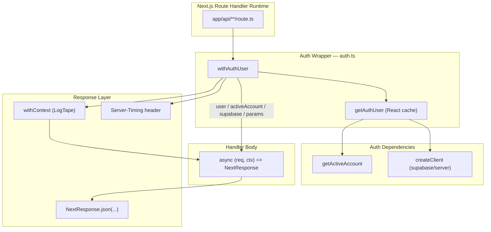
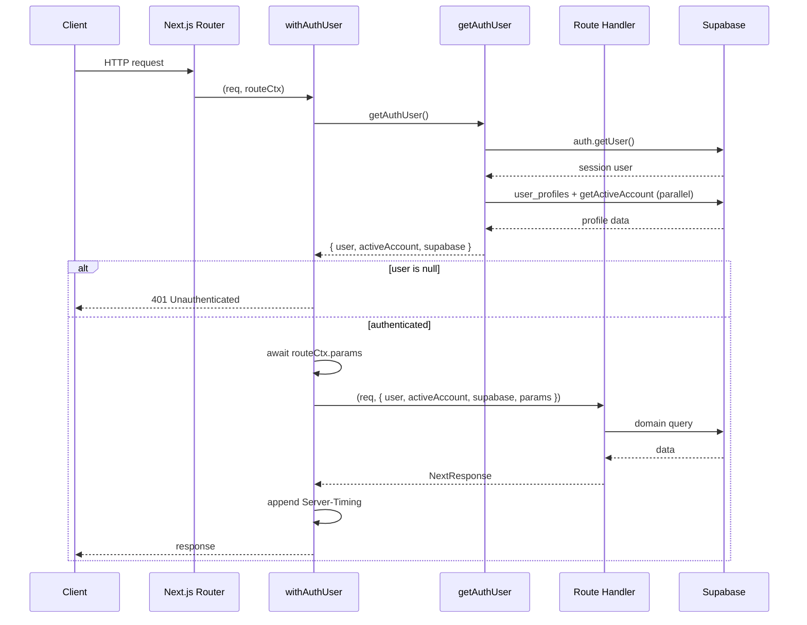
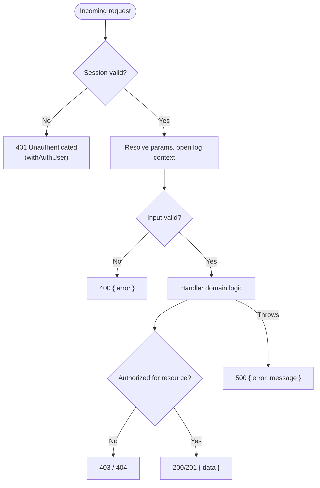

The `ozeaon-v2` API layer is built on a small set of composable handler patterns: Next.js Route Handlers (`GET`, `POST`, `PUT`, `DELETE`) are wrapped by the `withAuthUser` higher-order function, which authenticates the request, resolves the caller's active account, injects a per-request Supabase client, and runs the handler inside a logging context.

## Purpose and Scope

This page documents the **server-side Route Handler conventions** used across `src/app/api/**` and the **authentication/authorization wrapper** defined in `src/lib/supabase/queries/auth.ts`. It covers:

- The `withAuthUser` wrapper and how it wires auth, context, and timing into every protected route.
- The `getAuthUser` / `getAuthUserOrRedirect` helpers and their caching semantics.
- The standard response shape, error handling, and pagination conventions observed in the routes.
- Dynamic-route param resolution and how `params` reach the handler.

This page does **not** cover the underlying Supabase client construction (`src/lib/supabase/server.ts`), the domain-specific query functions (e.g. `src/lib/supabase/queries/articles.ts`), Zod schema definitions in `src/zod/**`, or the storage/moderation subsystems. Those belong to their own catalog pages.

## Overview

Every protected HTTP endpoint in the application follows the same shape: instead of exporting a bare async function as a Next.js Route Handler, the file exports the result of calling `withAuthUser(...)` with an inline async closure. The wrapper owns the cross-cutting concerns so that each handler body can focus purely on business logic.

The core design goals visible in the source are:

1. **Single auth source of truth** — authentication, profile hydration, and active-account resolution are centralized in one cached call, so a handler never re-implements session checks.
2. **Uniform failure semantics** — unauthenticated requests return a consistent `401 { error: "Unauthenticated" }` before the handler body ever runs.
3. **Structured observability** — each request executes inside a LogTape `withContext` scope carrying a `requestId`, `userId`, `route`, and `method`, and the auth cost is reported via a `Server-Timing` header.
4. **Explicit typing of injected dependencies** — the handler receives `user`, `activeAccount`, `supabase`, and `params` in a strongly-typed context object rather than reaching for globals.

The central abstraction is exported from [auth.ts](https://github.com/ozeaon/ozeaon-v2/blob/0a4f1a95824db87782f1221a4108019d174df3d9/src/lib/supabase/queries/auth.ts).

## Architecture

The following diagram shows how a request flows from the Next.js router through the wrapper into the handler, and which helpers the wrapper depends on.



The wrapper is the only component that knows about authentication. Handlers are pure consumers of the injected context. This separation means that swapping the auth backend (for example, changing how the profile is joined) only requires editing `auth.ts`, not the ~dozens of route files.

## The `withAuthUser` Wrapper

The wrapper is a generic higher-order function. It accepts a handler that operates on an authenticated context and returns a Next.js-compatible Route Handler function.

```typescript
type AuthedHandlerParams<TParams extends Record<string, string>> = {
  user: AuthUser;
  activeAccount: ActiveAccount;
  supabase: SupabaseServerClient;
  params: TParams;
};

export function withAuthUser<
  TParams extends Record<string, string> = Record<string, string>,
>(
  handler: (
    req: NextRequest,
    ctx: AuthedHandlerParams<TParams>,
  ) => Promise<NextResponse>,
) {
  return async (req: NextRequest, routeCtx?: { params: Promise<TParams> }) => {
    const authStart = performance.now();
    const { user, activeAccount, supabase } = await getAuthUser();
    const authMark = `auth_wrapper;dur=${(performance.now() - authStart).toFixed(1)}`;
    if (!user)
      return NextResponse.json({ error: "Unauthenticated" }, { status: 401 });
    const params = (routeCtx?.params ? await routeCtx.params : {}) as TParams;
    const res = await withContext(
      {
        requestId: crypto.randomUUID(),
        userId: user.id,
        route: req.nextUrl?.pathname,
        method: req.method,
      },
      () => handler(req, { user, activeAccount, supabase, params }),
    );
    const existing = res.headers.get("Server-Timing");
    res.headers.set(
      "Server-Timing",
      existing ? `${existing}, ${authMark}` : authMark,
    );
    return res;
  };
}
```

> Source: [auth.ts](https://github.com/ozeaon/ozeaon-v2/blob/0a4f1a95824db87782f1221a4108019d174df3d9/src/lib/supabase/queries/auth.ts#L50-L88)

### Walkthrough of the control flow

The returned function executes the following steps in strict order, and the ordering is deliberate:

1. **Start the auth timer.** `performance.now()` is captured *before* `getAuthUser()` so the measured duration reflects the true auth cost ([auth.ts](https://github.com/ozeaon/ozeaon-v2/blob/0a4f1a95824db87782f1221a4108019d174df3d9/src/lib/supabase/queries/auth.ts#L66)).
2. **Resolve the auth context.** `getAuthUser()` returns `{ user, activeAccount, supabase }`. This is the single dependency-injection point ([auth.ts](https://github.com/ozeaon/ozeaon-v2/blob/0a4f1a95824db87782f1221a4108019d174df3d9/src/lib/supabase/queries/auth.ts#L67)).
3. **Format the timing mark.** The `Server-Timing` metric is named `auth_wrapper`, following the standard `name;dur=value` format, with one decimal of millisecond precision ([auth.ts](https://github.com/ozeaon/ozeaon-v2/blob/0a4f1a95824db87782f1221a4108019d174df3d9/src/lib/supabase/queries/auth.ts#L68)).
4. **Fail fast on unauthenticated requests.** If `user` is `null`, the wrapper short-circuits with `401 { error: "Unauthenticated" }`. Crucially, this happens **before** the handler runs and **before** `params` are resolved, so no domain logic or database work occurs for anonymous callers ([auth.ts](https://github.com/ozeaon/ozeaon-v2/blob/0a4f1a95824db87782f1221a4108019d174df3d9/src/lib/supabase/queries/auth.ts#L69-L70)).
5. **Resolve dynamic route params.** Only after authentication does the wrapper await `routeCtx.params`. Next.js 15+ passes `params` as a Promise, and the wrapper normalizes the optional `routeCtx` to `{}` for static routes ([auth.ts](https://github.com/ozeaon/ozeaon-v2/blob/0a4f1a95824db87782f1221a4108019d174df3d9/src/lib/supabase/queries/auth.ts#L71)).
6. **Establish the logging context.** `withContext` from `@logtape/logtape` binds a fresh `crypto.randomUUID()` request id plus `userId`, `route`, and `method`. Because the handler is invoked *inside* the context callback, every log line the handler emits is automatically enriched with these fields ([auth.ts](https://github.com/ozeaon/ozeaon-v2/blob/0a4f1a95824db87782f1221a4108019d174df3d9/src/lib/supabase/queries/auth.ts#L72-L80)).
7. **Merge the timing header.** The wrapper reads any pre-existing `Server-Timing` header and appends the auth mark, preserving metrics set by downstream code instead of overwriting them ([auth.ts](https://github.com/ozeaon/ozeaon-v2/blob/0a4f1a95824db87782f1221a4108019d174df3d9/src/lib/supabase/queries/auth.ts#L81-L86)).

### Design intent

- **Why a wrapper instead of middleware?** Middleware in Next.js runs on the edge and cannot easily attach a hydrated `user_profiles` row or a Supabase server client scoped to the request. The wrapper runs in the Node/Route Handler context, where full session and database access is available, and it can hand the handler *typed, ready-to-use* dependencies.
- **Why `crypto.randomUUID()` per request?** It gives every invocation a correlation id that appears in all logs produced within the context, which is essential for tracing a single request across the Supabase queries and helpers a route may call.
- **Why preserve existing `Server-Timing`?** Handlers and query functions may append their own timings; merging rather than setting avoids losing those measurements.

## Auth Resolution: `getAuthUser` and `getAuthUserOrRedirect`

The wrapper delegates all credential and identity work to `getAuthUser`, which is memoized per request with React's `cache`.

```typescript
export const getAuthUser = cache(async (): Promise<AuthResult> => {
  const supabase = await createClient();
  const { data } = await supabase.auth.getUser();
  if (!data.user)
    return { user: null, activeAccount: { type: "user" }, supabase };

  const [profile, activeAccount] = await Promise.all([
    supabase
      .from("user_profiles")
      .select(
        "*, avatar_image:images!avatar_image_id(id, path, alt), cover_image:images!cover_image_id(id, path, alt)",
      )
      .eq("id", data.user.id)
      .single()
      .then((r) => r.data),
    getActiveAccount(),
  ]);

  const user: AuthUser = profile
    ? { ...data.user, platform_meta: profile }
    : data.user;
  return { user, activeAccount, supabase };
});
```

> Source: [auth.ts](https://github.com/ozeaon/ozeaon-v2/blob/0a4f1a95824db87782f1221a4108019d174df3d9/src/lib/supabase/queries/auth.ts#L18-L40)

### Resolution steps

| Step | Operation | Notes |
|------|-----------|-------|
| 1 | `createClient()` | Builds the Supabase server client bound to the request cookies ([auth.ts](https://github.com/ozeaon/ozeaon-v2/blob/0a4f1a95824db87782f1221a4108019d174df3d9/src/lib/supabase/queries/auth.ts#L19)) |
| 2 | `supabase.auth.getUser()` | Validates the session and returns the auth user ([auth.ts](https://github.com/ozeaon/ozeaon-v2/blob/0a4f1a95824db87782f1221a4108019d174df3d9/src/lib/supabase/queries/auth.ts#L20)) |
| 3 | Early return when anonymous | Returns `user: null` but still supplies a Supabase client and a default `{ type: "user" }` active account ([auth.ts](https://github.com/ozeaon/ozeaon-v2/blob/0a4f1a95824db87782f1221a4108019d174df3d9/src/lib/supabase/queries/auth.ts#L21-L22)) |
| 4 | Parallel fetch | `user_profiles` (with avatar and cover image joins) and `getActiveAccount()` run concurrently via `Promise.all` ([auth.ts](https://github.com/ozeaon/ozeaon-v2/blob/0a4f1a95824db87782f1221a4108019d174df3d9/src/lib/supabase/queries/auth.ts#L24-L34)) |
| 5 | Profile merge | If a profile row exists, it is attached as `platform_meta`; otherwise the raw auth user is returned ([auth.ts](https://github.com/ozeaon/ozeaon-v2/blob/0a4f1a95824db87782f1221a4108019d174df3d9/src/lib/supabase/queries/auth.ts#L36-L38)) |

### Why `cache()` matters

`getAuthUser` is wrapped in React's `cache`, which deduplicates calls **within a single request/render pass**. Since the wrapper calls it on every request and server components may also call it, the cache ensures the session validation and profile query execute at most once per request. This is why the wrapper can afford to call `getAuthUser()` unconditionally at the top of each handler without a performance penalty.

### The redirect variant

For server components (not route handlers) that must force a login, `getAuthUserOrRedirect` wraps `getAuthUser` and redirects to `/login` when there is no user. Its return type narrows `user` to non-nullable so callers do not need further null checks.

```typescript
export const getAuthUserOrRedirect = async (): Promise<
  Omit<AuthResult, "user"> & { user: AuthUser }
> => {
  const result = await getAuthUser();
  if (!result.user) redirect("/login");
  return result as Omit<AuthResult, "user"> & { user: AuthUser };
};
```

> Source: [auth.ts](https://github.com/ozeaon/ozeaon-v2/blob/0a4f1a95824db87782f1221a4108019d174df3d9/src/lib/supabase/queries/auth.ts#L42-L48)

Because it calls `redirect()`, this helper is only valid in server component / server action contexts, not inside `withAuthUser` (which uses a `401` JSON response instead). This distinction is a deliberate boundary: JSON APIs must return a status code, while page navigations must redirect.

## Standard Route Handler Pattern

A typical route file exports one or more HTTP-method constants, each assigned to the result of `withAuthUser(...)`. The handler receives the request and the injected context and returns `NextResponse`.



### Full example: list + create with pagination

The account posts route demonstrates the canonical GET (paginated list) and PUT (create) pattern, including input validation and try/catch error normalization.

```typescript
export const GET = withAuthUser(async (request, { user, supabase }) => {
  try {
    const url = new URL(request.url);
    const limit = Math.min(
      parseInt(url.searchParams.get("limit") || "20", 10),
      100,
    );
    const offset = parseInt(url.searchParams.get("offset") || "0", 10);

    if (Number.isNaN(limit) || limit <= 0)
      return NextResponse.json({ error: "Invalid limit" }, { status: 400 });
    if (Number.isNaN(offset) || offset < 0)
      return NextResponse.json({ error: "Invalid offset" }, { status: 400 });

    const { data, error } = await supabase
      .from("posts")
      .select(
        "id,message,user_id,comments_enabled,allow_recommend,allow_repost,created_at,show_in_feed",
      )
      .eq("user_id", user.id)
      .order("created_at", { ascending: false })
      .range(offset, offset + limit - 1);

    if (error) throw error;
    return NextResponse.json({ data, limit, offset, count: data?.length || 0 });
  } catch (error) {
    const message = getErrorMessage(error);
    return NextResponse.json(
      { error: "Failed to fetch posts", message },
      { status: 500 },
    );
  }
});
```

> Source: [route.ts](https://github.com/ozeaon/ozeaon-v2/blob/0a4f1a95824db87782f1221a4108019d174df3d9/src/app/api/account/posts/route.ts#L6-L38)

Notable conventions encoded here:

- **Pagination clamping** — `limit` defaults to `20` and is capped at `100` with `Math.min`, preventing clients from requesting unbounded result sets ([route.ts](https://github.com/ozeaon/ozeaon-v2/blob/0a4f1a95824db87782f1221a4108019d174df3d9/src/app/api/account/posts/route.ts#L9-L12)).
- **Explicit validation** — non-numeric or out-of-range `limit`/`offset` produce `400` responses with a stable `{ error }` shape before any database access ([route.ts](https://github.com/ozeaon/ozeaon-v2/blob/0a4f1a95824db87782f1221a4108019d174df3d9/src/app/api/account/posts/route.ts#L15-L18)).
- **Ownership scoping** — `.eq("user_id", user.id)` ensures a caller can only list their own rows; `user.id` comes from the wrapper, never from the request body ([route.ts](https://github.com/ozeaon/ozeaon-v2/blob/0a4f1a95824db87782f1221a4108019d174df3d9/src/app/api/account/posts/route.ts#L25)).
- **Error normalization** — internal Supabase errors are converted with `getErrorMessage(error)` into a `500` payload; the raw error object is not leaked directly ([route.ts](https://github.com/ozeaon/ozeaon-v2/blob/0a4f1a95824db87782f1221a4108019d174df3d9/src/app/api/account/posts/route.ts#L29-L36)).

### Create variant with server-controlled ownership

```typescript
export const PUT = withAuthUser(async (request, { user, supabase }) => {
  try {
    const payload: TablesInsert<"posts"> = await request.json();
    const { data, error } = await supabase
      .from("posts")
      .insert({ ...payload, user_id: user.id })
      .select()
      .single();

    if (error) throw error;
    return NextResponse.json({ data }, { status: 201 });
  } catch (error) {
    const message = getErrorMessage(error);
    return NextResponse.json(
      { error: "Failed to create post", message },
      { status: 500 },
    );
  }
});
```

> Source: [route.ts](https://github.com/ozeaon/ozeaon-v2/blob/0a4f1a95824db87782f1221a4108019d174df3d9/src/app/api/account/posts/route.ts#L40-L57)

The insert spreads the client payload but **overrides `user_id` with `user.id`** ([route.ts](https://github.com/ozeaon/ozeaon-v2/blob/0a4f1a95824db87782f1221a4108019d174df3d9/src/app/api/account/posts/route.ts#L45)). This is the key security invariant of the pattern: identity fields are always taken from the authenticated context, so a malicious client cannot spoof ownership by including `user_id` in the JSON body. `TablesInsert<"posts">` provides compile-time checking that the payload matches the generated Supabase schema types.

### Dynamic route params

Handlers that operate on a resource id receive `params` in the context. Because the wrapper awaits the Next.js `params` Promise and injects the resolved object, the handler reads ids synchronously from `ctx.params`:

```typescript
export const GET = withAuthUser<{ id: string }>(async (req, { params, supabase }) => {
  // ...
});
```

> Source pattern injected by [auth.ts](https://github.com/ozeaon/ozeaon-v2/blob/0a4f1a95824db87782f1221a4108019d174df3d9/src/lib/supabase/queries/auth.ts#L57-L71)

The generic parameter `TParams` (defaulting to `Record<string, string>`) types the dynamic segments for each route. Files under dynamic segments such as `src/app/api/account/posts/[id]/route.ts` use this to access the `[id]` segment with type safety.

## Advanced Handler: the Articles Route

The articles routes are the most complex consumers of the pattern and illustrate how much can be layered inside a `withAuthUser` handler while keeping the auth boilerplate out. `src/app/api/articles/route.ts` imports a broad set of domain helpers and composes them within the handler body.

```typescript
import { withAuthUser } from "@/lib/supabase/queries/auth";
import { createClient } from "@/lib/supabase/server";
import {
  transformArticleForCreate,
  transformArticleForUpdate,
  canManageArticle,
  parseRequestBody,
  UnsupportedContentTypeError,
  getErrorMessage,
} from "@/utils";
import { moderateAndLog } from "@/lib/moderation";
import { articleDraftSchema, articlePublishSchema } from "@/zod/articles";
import { getLogger, logError } from "@/lib/logger";

const logger = getLogger(["api", "articles"]);
```

> Source: [route.ts](https://github.com/ozeaon/ozeaon-v2/blob/0a4f1a95824db87782f1221a4108019d174df3d9/src/app/api/articles/route.ts#L1-L48)

Key additional patterns visible in this route:

- **Module-scoped logger** — `getLogger(["api", "articles"])` creates a namespaced logger at module load. Combined with the wrapper's `withContext`, every log line is both namespaced and request-correlated ([route.ts](https://github.com/ozeaon/ozeaon-v2/blob/0a4f1a95824db87782f1221a4108019d174df3d9/src/app/api/articles/route.ts#L46-L48)).
- **Validation via Zod schemas** — `articleDraftSchema`, `articlePublishSchema`, and related schemas validate distinct lifecycle stages (draft vs. publish) rather than one monolithic schema ([route.ts](https://github.com/ozeaon/ozeaon-v2/blob/0a4f1a95824db87782f1221a4108019d174df3d9/src/app/api/articles/route.ts#L38-L43)).
- **Moderation hook** — `moderateAndLog` and `collectArticleModerationTexts` run moderation as part of the write path, collecting the text that needs to be scanned ([route.ts](https://github.com/ozeaon/ozeaon-v2/blob/0a4f1a95824db87782f1221a4108019d174df3d9/src/app/api/articles/route.ts#L28-L30)).
- **Content-aware parsing** — `parseRequestBody` and `UnsupportedContentTypeError` indicate the route accepts multiple content types and rejects unsupported ones explicitly ([route.ts](https://github.com/ozeaon/ozeaon-v2/blob/0a4f1a95824db87782f1221a4108019d174df3d9/src/app/api/articles/route.ts#L21-L22)).
- **Compressed content storage** — `compressJSON` / `decompressJSON` show article bodies are stored compressed, with the route responsible for transparently decoding when reading ([route.ts](https://github.com/ozeaon/ozeaon-v2/blob/0a4f1a95824db87782f1221a4108019d174df3d9/src/app/api/articles/route.ts#L16-L19)).
- **Orphaned-image detection** — `findOrphanedImages` reconstructs the image ids referenced by stored content and queries `article_images` for rows no longer referenced, enabling cleanup after edits ([route.ts](https://github.com/ozeaon/ozeaon-v2/blob/0a4f1a95824db87782f1221a4108019d174df3d9/src/app/api/articles/route.ts#L81-L108)).

```typescript
async function getStoredContentText(
  supabase: Awaited<ReturnType<typeof createClient>>,
  contentFileId: string | null,
): Promise<string> {
  if (!contentFileId) return "";
  // ...
}
```

> Source: [route.ts](https://github.com/ozeaon/ozeaon-v2/blob/0a4f1a95824db87782f1221a4108019d174df3d9/src/app/api/articles/route.ts#L115-L120)

This helper demonstrates the convention of threading `supabase` explicitly into module-level helper functions: the client obtained from `withAuthUser` is passed down rather than re-created, so the helper stays testable and shares the request's RLS-scoped session ([route.ts](https://github.com/ozeaon/ozeaon-v2/blob/0a4f1a95824db87782f1221a4108019d174df3d9/src/app/api/articles/route.ts#L81-L84)).

## Response Conventions

All routes converge on `NextResponse.json(...)` with a consistent body shape. The table below summarizes the observed contract.

| Status | Body shape | When |
|--------|-----------|------|
| `200` | `{ data, ...paging }` | Successful read |
| `201` | `{ data }` | Successful create (`PUT` on posts) |
| `400` | `{ error: "<field message>" }` | Invalid query/body input |
| `401` | `{ error: "Unauthenticated" }` | No session (set by the wrapper) |
| `500` | `{ error: "<operation>", message: <normalized> }` | Unhandled domain/database error |

The `404` and `403` cases are produced by individual handlers (for example when a resource is missing or when `canManageArticle` returns false); the wrapper never emits them because it only owns authentication, not resource authorization.



## Configuration Options

The wrapper itself is not configurable via environment variables; its behavior is fixed by code. The behaviors that act as implicit "options" are:

| Aspect | Value | Source |
|--------|-------|--------|
| Unauthenticated response | `401 { error: "Unauthenticated" }` | [auth.ts](https://github.com/ozeaon/ozeaon-v2/blob/0a4f1a95824db87782f1221a4108019d174df3d9/src/lib/supabase/queries/auth.ts#L69-L70) |
| Timing metric name | `auth_wrapper` with `dur=` in ms | [auth.ts](https://github.com/ozeaon/ozeaon-v2/blob/0a4f1a95824db87782f1221a4108019d174df3d9/src/lib/supabase/queries/auth.ts#L68) |
| Log context fields | `requestId`, `userId`, `route`, `method` | [auth.ts](https://github.com/ozeaon/ozeaon-v2/blob/0a4f1a95824db87782f1221a4108019d174df3d9/src/lib/supabase/queries/auth.ts#L73-L78) |
| Default `limit` (posts list) | `20`, capped at `100` | [route.ts](https://github.com/ozeaon/ozeaon-v2/blob/0a4f1a95824db87782f1221a4108019d174df3d9/src/app/api/account/posts/route.ts#L9-L12) |
| Default `offset` (posts list) | `0` | [route.ts](https://github.com/ozeaon/ozeaon-v2/blob/0a4f1a95824db87782f1221a4108019d174df3d9/src/app/api/account/posts/route.ts#L13) |
| Profile image joins | `avatar_image`, `cover_image` via `images!*_id` | [auth.ts](https://github.com/ozeaon/ozeaon-v2/blob/0a4f1a95824db87782f1221a4108019d174df3d9/src/lib/supabase/queries/auth.ts#L27-L29) |
| Login redirect target | `/login` | [auth.ts](https://github.com/ozeaon/ozeaon-v2/blob/0a4f1a95824db87782f1221a4108019d174df3d9/src/lib/supabase/queries/auth.ts#L46) |

## API Reference

### `withAuthUser<TParams>(handler)`

Wraps a handler so it only runs for authenticated requests, injecting resolved auth context.

**Type parameters:**
- `TParams extends Record<string, string>` — shape of dynamic route params; defaults to `Record<string, string>`.

**Parameters:**
- `handler` — `(req: NextRequest, ctx: AuthedHandlerParams<TParams>) => Promise<NextResponse>`.

**Returns:** `(req: NextRequest, routeCtx?: { params: Promise<TParams> }) => Promise<NextResponse>` — a Next.js-compatible Route Handler.

**Behavior:**
- Returns `401 { error: "Unauthenticated" }` when no session exists.
- Awaits `routeCtx.params` and injects it as `ctx.params`.
- Runs the handler inside a LogTape `withContext` scope with `requestId`, `userId`, `route`, `method`.
- Appends an `auth_wrapper;dur=<ms>` entry to the `Server-Timing` response header.

> Source: [auth.ts](https://github.com/ozeaon/ozeaon-v2/blob/0a4f1a95824db87782f1221a4108019d174df3d9/src/lib/supabase/queries/auth.ts#L57-L88)

### `getAuthUser(): Promise<AuthResult>`

Memoized (React `cache`) auth resolver. Returns `AuthResult`:

| Field | Type | Description |
|-------|------|-------------|
| `user` | `AuthUser \| null` | Auth user merged with `platform_meta` profile when available |
| `activeAccount` | `ActiveAccount` | Result of `getActiveAccount()`; defaults to `{ type: "user" }` when anonymous |
| `supabase` | `SupabaseServerClient` | Request-scoped Supabase server client |

> Source: [auth.ts](https://github.com/ozeaon/ozeaon-v2/blob/0a4f1a95824db87782f1221a4108019d174df3d9/src/lib/supabase/queries/auth.ts#L18-L40)

### `getAuthUserOrRedirect(): Promise<AuthResult with non-null user>`

Server-component variant that redirects to `/login` when unauthenticated. Not used by route handlers (they use the `401` path instead).

> Source: [auth.ts](https://github.com/ozeaon/ozeaon-v2/blob/0a4f1a95824db87782f1221a4108019d174df3d9/src/lib/supabase/queries/auth.ts#L42-L48)

## Failure Modes, Edge Cases & Concurrency

Because the wrapper centralizes a set of decisions, its edge cases are shared by every route. The following are derived directly from the source.

### Profile missing but session valid

If `supabase.auth.getUser()` returns a user but the `user_profiles` query yields no row, `getAuthUser` falls back to returning the raw auth user without `platform_meta` ([auth.ts](https://github.com/ozeaon/ozeaon-v2/blob/0a4f1a95824db87782f1221a4108019d174df3d9/src/lib/supabase/queries/auth.ts#L36-L38)). Handlers that depend on profile data must therefore treat `platform_meta` as optional. This prevents a missing profile from breaking authentication entirely.

### Anonymous access still gets a client

For unauthenticated requests, `getAuthUser` returns early with `user: null` but **still constructs a Supabase client and a default active account** ([auth.ts](https://github.com/ozeaon/ozeaon-v2/blob/0a4f1a95824db87782f1221a4108019d174df3d9/src/lib/supabase/queries/auth.ts#L21-L22)). This is what allows `getAuthUserOrRedirect` and other consumers to proceed until they explicitly check the user, and it means the `supabase` client is always non-null in the context type.

### Dynamic params resolution ordering

`routeCtx.params` is only awaited **after** the auth check passes ([auth.ts](https://github.com/ozeaon/ozeaon-v2/blob/0a4f1a95824db87782f1221a4108019d174df3d9/src/lib/supabase/queries/auth.ts#L69-L71)). If `routeCtx` is undefined (static route), the wrapper substitutes `{}` and casts to `TParams`. A handler on a dynamic route that assumes `params` is populated will receive an empty object if invoked without a route context, so relying on `params` presence is only safe for routes that actually have dynamic segments.

### Concurrency and request isolation

- **Per-request client** — `createClient()` is called inside `getAuthUser`, and memoization via `cache` is scoped to a single request, so concurrent requests never share a Supabase client ([auth.ts](https://github.com/ozeaon/ozeaon-v2/blob/0a4f1a95824db87782f1221a4108019d174df3d9/src/lib/supabase/queries/auth.ts#L19)).
- **Unique request id** — `crypto.randomUUID()` is generated per invocation inside the wrapper, so parallel requests receive distinct correlation ids ([auth.ts](https://github.com/ozeaon/ozeaon-v2/blob/0a4f1a95824db87782f1221a4108019d174df3d9/src/lib/supabase/queries/auth.ts#L74)).
- **Header mutation** — the wrapper mutates the response header on the `NextResponse` object returned by the handler. Since each invocation builds its own response object, there is no cross-request header bleed.

### Error normalization

Route handlers wrap their bodies in `try/catch` and surface errors through `getErrorMessage(error)` rather than throwing. Unhandled throws that escape a handler would propagate out of `withAuthUser`; the wrapper does **not** catch them, so any response-shaping guarantees depend on the handler's own try/catch discipline ([route.ts](https://github.com/ozeaon/ozeaon-v2/blob/0a4f1a95824db87782f1221a4108019d174df3d9/src/app/api/account/posts/route.ts#L31-L37)). This is a deliberate trade-off: the wrapper stays minimal and predictable, while each route chooses its own error taxonomy.

## Performance & Operational Notes

| Concern | Mechanism | Source |
|---------|-----------|--------|
| Duplicate auth work per request | React `cache` memoizes `getAuthUser` within a request | [auth.ts](https://github.com/ozeaon/ozeaon-v2/blob/0a4f1a95824db87782f1221a4108019d174df3d9/src/lib/supabase/queries/auth.ts#L18) |
| Profile + account latency | `Promise.all` fetches both concurrently | [auth.ts](https://github.com/ozeaon/ozeaon-v2/blob/0a4f1a95824db87782f1221a4108019d174df3d9/src/lib/supabase/queries/auth.ts#L24-L34) |
| Auth cost visibility | `Server-Timing: auth_wrapper;dur=<ms>` | [auth.ts](https://github.com/ozeaon/ozeaon-v2/blob/0a4f1a95824db87782f1221a4108019d174df3d9/src/lib/supabase/queries/auth.ts#L68-L86) |
| Two query round-trips | `auth.getUser()` then `user_profiles` select | [auth.ts](https://github.com/ozeaon/ozeaon-v2/blob/0a4f1a95824db87782f1221a4108019d174df3d9/src/lib/supabase/queries/auth.ts#L20-L31) |
| Unbounded result sets | `limit` capped at `100` in posts list | [route.ts](https://github.com/ozeaon/ozeaon-v2/blob/0a4f1a95824db87782f1221a4108019d174df3d9/src/app/api/account/posts/route.ts#L9-L12) |

The `Server-Timing` header is the primary operational signal for this layer: it lets operators measure how much of each request's latency is spent on authentication separately from the handler's domain queries. Because the wrapper merges rather than replaces the header, other layers can contribute their own timing marks.

## Extension Points

The pattern is designed to be extended in two directions:

1. **New routes** — add a `route.ts` file under `src/app/api/**` and export method constants assigned to `withAuthUser(...)`. Supply the dynamic param generic (`withAuthUser<{ id: string }>`) for routes with segments. Ownership scoping (`.eq("user_id", user.id)`) and input validation belong in the handler.
2. **Cross-cutting behavior** — because auth, context, and timing are centralized in `withAuthUser`, adding a new cross-cutting concern (rate limiting, audit logging, additional timing marks) requires editing only [auth.ts](https://github.com/ozeaon/ozeaon-v2/blob/0a4f1a95824db87782f1221a4108019d174df3d9/src/lib/supabase/queries/auth.ts) rather than every route. This is the concrete payoff of the higher-order-function design.

Note that the wrapper owns **authentication** but not **authorization**. Resource-level permission checks are performed inside handlers using helpers such as `canManageArticle` ([route.ts](https://github.com/ozeaon/ozeaon-v2/blob/0a4f1a95824db87782f1221a4108019d174df3d9/src/app/api/articles/route.ts#L23-L24)). Introducing a new permission rule does not change the wrapper; it changes the specific handler that enforces it.

## Related Links

- Auth wrapper and helpers: [src/lib/supabase/queries/auth.ts](https://github.com/ozeaon/ozeaon-v2/blob/0a4f1a95824db87782f1221a4108019d174df3d9/src/lib/supabase/queries/auth.ts)
- Example paginated route: [src/app/api/account/posts/route.ts](https://github.com/ozeaon/ozeaon-v2/blob/0a4f1a95824db87782f1221a4108019d174df3d9/src/app/api/account/posts/route.ts)
- Example complex route: [src/app/api/articles/route.ts](https://github.com/ozeaon/ozeaon-v2/blob/0a4f1a95824db87782f1221a4108019d174df3d9/src/app/api/articles/route.ts)
- Supabase server client construction: [src/lib/supabase/server.ts](https://github.com/ozeaon/ozeaon-v2/blob/0a4f1a95824db87782f1221a4108019d174df3d9/src/lib/supabase/server.ts)
- Article domain queries: [src/lib/supabase/queries/articles.ts](https://github.com/ozeaon/ozeaon-v2/blob/0a4f1a95824db87782f1221a4108019d174df3d9/src/lib/supabase/queries/articles.ts)
