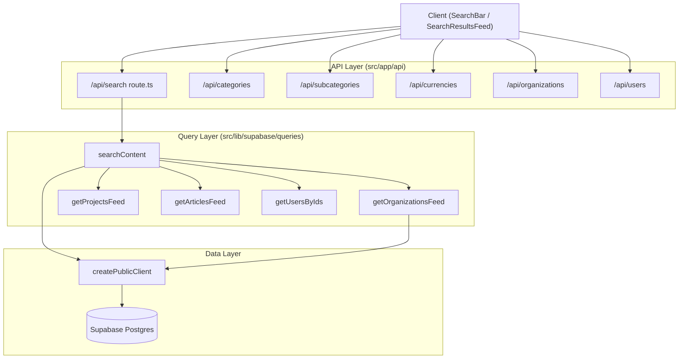
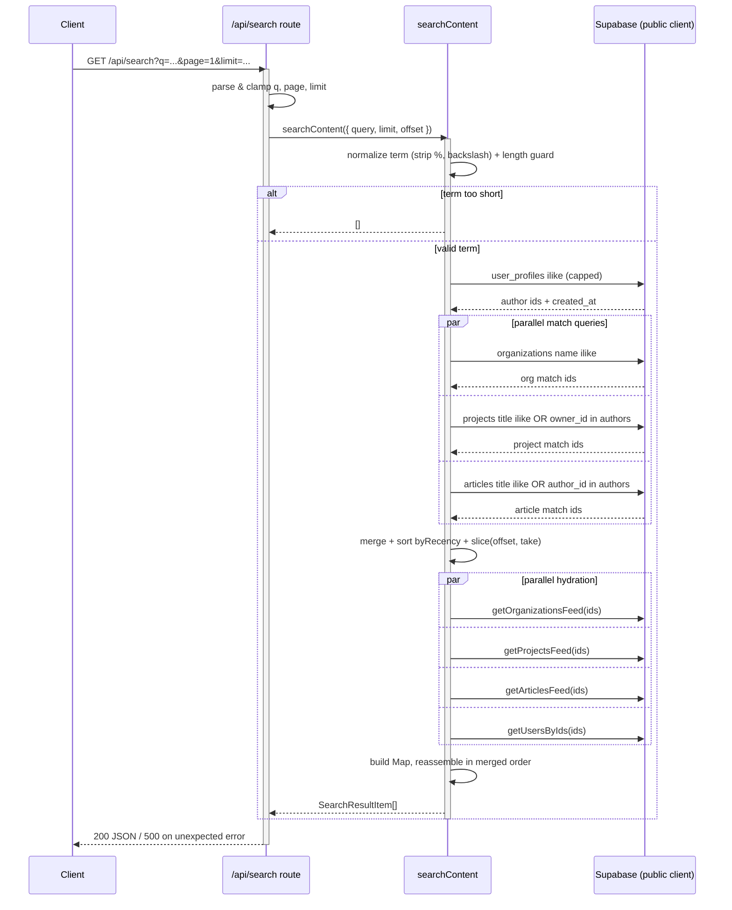
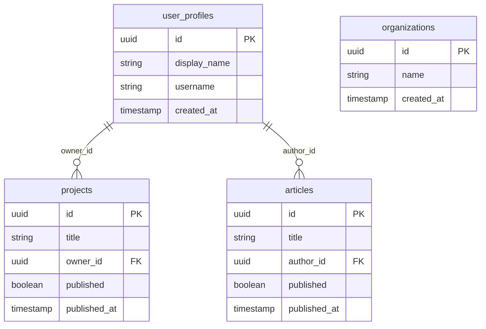

A collection of read-only, unauthenticated JSON endpoints that power the global search experience and the small "lookup" datasets (categories, subcategories, currencies, organizations, users) used to populate search selectors and location inputs across the application.

## Purpose and Scope

This page documents the public-facing lookup surface of the API layer:

- The **global keyword search** endpoint (`/api/search`) and the `searchContent` query function that backs it.
- The **lookup endpoints** that supply enumerable reference data — categories, subcategories, and currencies — plus the directory-style endpoints for organizations and users.

It covers endpoint contracts, query-string validation, the merging/pagination algorithm, and the failure-handling behavior that is visible from the route handlers and the search query implementation.

The following related topics are intentionally left to sibling pages:

- **Feed APIs** for the full articles / projects / organizations listings (the search endpoint *reuses* those feed queries for hydration — see [Search & Lookup internals](#search--lookup-internals)).
- **Content CRUD APIs** (create/update/delete) are out of scope; this page only covers reads.
- **Supabase client setup, RLS, and database schema** belong to the data-access and database pages.

## Overview

The application exposes two categories of read endpoints that share a common purpose: returning small, cheap, cacheable payloads that the client uses to render search bars, filter chips, and directory previews.

| Endpoint | Handler | Backing source | Role |
|----------|---------|----------------|------|
| `/api/search` | [route.ts](https://github.com/ozeaon/ozeaon-v2/blob/0a4f1a95824db87782f1221a4108019d174df3d9/src/app/api/search/route.ts) | `searchContent` | Cross-entity keyword search |
| `/api/categories` | [route.ts](https://github.com/ozeaon/ozeaon-v2/blob/0a4f1a95824db87782f1221a4108019d174df3d9/src/app/api/categories/route.ts) | Supabase table | Category taxonomy lookup |
| `/api/subcategories` | [route.ts](https://github.com/ozeaon/ozeaon-v2/blob/0a4f1a95824db87782f1221a4108019d174df3d9/src/app/api/subcategories/route.ts) | Supabase table | Subcategory taxonomy lookup |
| `/api/currencies` | [route.ts](https://github.com/ozeaon/ozeaon-v2/blob/0a4f1a95824db87782f1221a4108019d174df3d9/src/app/api/currencies/route.ts) | Supabase table | Currency code lookup |
| `/api/organizations` | [route.ts](https://github.com/ozeaon/ozeaon-v2/blob/0a4f1a95824db87782f1221a4108019d174df3d9/src/app/api/organizations/route.ts) | `getOrganizationsFeed` | Organization directory |
| `/api/users` | [route.ts](https://github.com/ozeaon/ozeaon-v2/blob/0a4f1a95824db87782f1221a4108019d174df3d9/src/app/api/users/route.ts) | profile reads | User directory |

The **search endpoint is the only endpoint in this group with query parameters**, and it is the only one that performs multi-source merging. The lookup endpoints are effectively thin pass-throughs to a single Supabase table or feed function, which keeps them fast and trivially cacheable.

### Key concepts

- **`SearchKind`** — the discriminant (`"organization" | "project" | "article" | "user"`) that identifies which entity a search hit belongs to, derived from the `SearchResultItem` union.
- **Match-then-hydrate** — search first collects *ids only* from cheap `ilike` queries, orders the merged id list, cuts the page, and only then fetches full cards for the surviving ids.
- **Lookup data** — small, enumerable reference sets that drive selectors rather than full content feeds.

## Architecture

The search endpoint sits on top of the existing feed query layer. Rather than duplicating card-shaping logic, it matches ids cheaply and delegates card construction to the same feed functions the rest of the app uses.



The arrow from `searchContent` into the four feed functions is the defining architectural decision of this subsystem: **search is a composition layer over feeds**, not a parallel implementation. This guarantees that a search result card is byte-for-byte identical to the same item rendered in a normal feed, because it is produced by the same code.

### Why this shape

Because each entity lives in its own table with its own card projection, a naive approach would need one giant SQL join or four duplicated projection queries. The match-then-hydrate design instead keeps each entity's match query tiny (`select id, alias(created_at|published_at)`) and pushes the expensive projection work into the already-tested feed functions. The cost is one extra round-trip per entity per page; the benefit is a single place that defines what a "card" looks like.

## The Search Endpoint

The route handler is deliberately thin: it parses and clamps query parameters, delegates to `searchContent`, and wraps the result in a JSON response with a 500 fallback.

```typescript
export async function GET(request: Request) {
  try {
    const { searchParams } = new URL(request.url);
    const query = searchParams.get("q") ?? "";
    const page = Math.max(1, Math.trunc(Number(searchParams.get("page")) || 1));
    const limit = Math.min(
      50,
      Math.max(
        1,
        Math.trunc(Number(searchParams.get("limit")) || SEARCH_PAGE_LIMIT),
      ),
    );

    const data = await searchContent({
      query,
      limit,
      offset: (page - 1) * limit,
    });

    return NextResponse.json(data);
  } catch (error) {
    const message = getErrorMessage(error);
    return NextResponse.json(
      { error: "Failed to run search", message },
      { status: 500 },
    );
  }
}
```

> Source: [route.ts](https://github.com/ozeaon/ozeaon-v2/blob/0a4f1a95824db87782f1221a4108019d174df3d9/src/app/api/search/route.ts#L6-L32)

### Query parameter contract

| Parameter | Type | Default | Clamping rule | Notes |
|-----------|------|---------|---------------|-------|
| `q` | string | `""` | None (over-length handled downstream) | Free-text keyword; empty string returns `[]` |
| `page` | integer | `1` | `Math.max(1, trunc(n))` | 1-based; invalid/non-numeric falls back to 1 |
| `limit` | integer | `SEARCH_PAGE_LIMIT` | clamped to `[1, 50]` | `Math.trunc` drops fractions |

Three defensive details are worth calling out:

1. **`Number(...) || 1` pattern** — `Number("abc")` yields `NaN`, which is falsy, so the `|| 1` (or `|| SEARCH_PAGE_LIMIT`) fallback fires. This means a malformed `page=foo` degrades gracefully to page 1 rather than producing `offset: NaN`.
2. **`Math.trunc` before clamping** — truncing first ensures e.g. `limit=10.9` becomes `10`, and `page=2.7` becomes `2`, so offsets are always integers.
3. **Hard ceiling of 50** — `Math.min(50, ...)` caps the page size regardless of what the client requests, preventing a single request from hydrating an unbounded number of cards.

### Error handling

Any thrown error (network failure to Supabase, unexpected exception in a feed) is caught, serialized via `getErrorMessage`, and returned as `{ error, message }` with HTTP **500**. The handler does not distinguish between error classes — it is a single failure path. Importantly, `searchContent` itself swallows per-entity query errors (see below), so a `500` here means a truly unexpected failure, not a single failing entity query.

## The `searchContent` Algorithm

`searchContent` is the heart of the subsystem. It implements a **match → merge → page → hydrate** pipeline.

```typescript
export async function searchContent({
  query,
  limit = SEARCH_PAGE_LIMIT,
  offset = 0,
}: SearchOptions): Promise<SearchResultItem[]> {
```

> Source: [search.ts](https://github.com/ozeaon/ozeaon-v2/blob/0a4f1a95824db87782f1221a4108019d174df3d9/src/lib/supabase/queries/search.ts#L71-L75)

### Step 1 — Normalize and guard the query

```typescript
// `%` and `\` are dropped before the length check, so a term of nothing but
// wildcards can't clear it and match every row. `_` stays: titles and display
// names contain it, and it only ever widens a match by a single character.
const trimmed = query.trim().replace(/[%\\]/g, "");
if (trimmed.length < SEARCH_MIN_QUERY_LENGTH) return [];
```

> Source: [search.ts](https://github.com/ozeaon/ozeaon-v2/blob/0a4f1a95824db87782f1221a4108019d174df3d9/src/lib/supabase/queries/search.ts#L76-L80)

This is a **security and cost guard**, not just formatting. Because the term is later interpolated into a PostgREST `ilike` pattern, an unescaped `%` would become a SQL wildcard; a query of `"%%%"` would therefore match every row. Stripping `%` (and the escape character `\`) *before* the length check defeats that: after stripping, `"%%%"` has length 0 and fails the minimum-length check. The underscore is deliberately preserved because it appears legitimately in usernames/titles and only widens a match by one character.

### Step 2 — Build the `ilike` fragment safely

```typescript
// Quoted so a term holding `,` `(` `)` or `"` can't break out of an or() list.
const like = `"%${trimmed.replace(/"/g, '\\"')}%"`;
const or = (columns: string[], extra?: string) =>
  [
    ...columns.map((column) => `${column}.ilike.${like}`),
    ...(extra ? [extra] : []),
  ].join(",");
```

> Source: [search.ts](https://github.com/ozeaon/ozeaon-v2/blob/0a4f1a95824db87782f1221a4108019d174df3d9/src/lib/supabase/queries/search.ts#L87-L93)

PostgREST's `or=col.ilike.value,...` syntax is comma-separated, so an unescaped comma, parenthesis, or quote inside the user term could inject additional filter clauses or break the parser. Wrapping the value in `"..."` and escaping embedded quotes makes the term opaque to the PostgREST grammar. The `or()` helper then assembles the per-column predicate list, optionally appending an `extra` clause (used for author matching).

### Step 3 — Resolve the author set first

People are queried **before** everything else because their ids are reused to make articles and projects match by their author/owner.

```typescript
const authors = toMatches(
  "user",
  await supabase
    .from("user_profiles")
    .select("id, sorted_at:created_at")
    .or(or(["display_name", "username"]))
    .order("created_at", newestFirst)
    .limit(SEARCH_AUTHOR_MATCH_CAP),
);

const byAuthor = (column: string) =>
  authors.length > 0
    ? `${column}.in.(${authors.map((author) => author.id).join(",")})`
    : undefined;

// People results page through the capped set, so they run out at the cap.
const users = authors.slice(0, take);
```

> Source: [search.ts](https://github.com/ozeaon/ozeaon-v2/blob/0a4f1a95824db87782f1221a4108019d174df3d9/src/lib/supabase/queries/search.ts#L98-L114)

The cap `SEARCH_AUTHOR_MATCH_CAP` is the crux of **pagination correctness**: the author set must be identical on every page, so it draws on a *fixed* cap rather than "this page's worth." The doc comment explains the invariant precisely:

> That holds only while each entity's match predicate is page-independent, which is why the author filter draws on a fixed cap of profile matches rather than the current page's worth.

`byAuthor` returns `undefined` when there are no author matches, letting `or()` omit the clause entirely (an empty `in.()` would match nothing the way it's wanted, but returning `undefined` is cleaner and avoids generating an invalid filter).

### Step 4 — Match the other three entities in parallel

```typescript
const [organizations, projects, articles] = await Promise.all([
  supabase
    .from("organizations")
    .select("id, sorted_at:created_at")
    .or(or(["name"]))
    .order("created_at", newestFirst)
    .limit(take)
    .then((result) => toMatches("organization", result)),

  supabase
    .from("projects")
    .select("id, sorted_at:published_at")
    .eq("published", true)
    .or(or(["title"], byAuthor("owner_id")))
    .order("published_at", newestFirst)
    .limit(take)
    .then((result) => toMatches("project", result)),

  supabase
    .from("articles")
    .select("id, sorted_at:published_at")
    .eq("published", true)
    .or(or(["title"], byAuthor("author_id")))
    .order("published_at", newestFirst)
    .limit(take)
    .then((result) => toMatches("article", result)),
]);
```

> Source: [search.ts](https://github.com/ozeaon/ozeaon-v2/blob/0a4f1a95824db87782f1221a4108019d174df3d9/src/lib/supabase/queries/search.ts#L116-L142)

Each of the three queries follows the same template:

- `select("id, sorted_at:<date>" )` — **only** the id and the entity's sort date, aliased to the uniform `sorted_at` column so all kinds can be merged with one comparator.
- `.eq("published", true)` on projects and articles — drafts are never searchable.
- `.or(...)` — matches the primary text column, plus the author/owner clause derived from the people step.
- `.limit(take)` where `take = offset + limit` — **not** `limit`. Fetching up to the current page boundary is what makes paging exact (see the invariant below).
- `.order(<date>, newestFirst)` — `{ ascending: false, nullsFirst: false }` so unset dates sink, matching the in-memory comparator.

The three run under `Promise.all`, so the wall-clock cost is the slowest query, not their sum.

### Step 5 — Merge, sort, and cut the page

```typescript
const page = [...users, ...organizations, ...projects, ...articles]
  .sort(byRecency)
  .slice(offset, take);

if (page.length === 0) return [];
```

> Source: [search.ts](https://github.com/ozeaon/ozeaon-v2/blob/0a4f1a95824db87782f1221a4108019d174df3d9/src/lib/supabase/queries/search.ts#L144-L148)

`byRecency` gives newest-first with a stable id tiebreak:

```typescript
/** Newest first, with a stable id tiebreak so pages never overlap or gap. */
function byRecency(a: Match, b: Match) {
  const aTime = a.sorted_at ? Date.parse(a.sorted_at) : 0;
  const bTime = b.sorted_at ? Date.parse(b.sorted_at) : 0;
  if (aTime !== bTime) return bTime - aTime;
  return a.id < b.id ? -1 : 1;
}
```

> Source: [search.ts](https://github.com/ozeaon/ozeaon-v2/blob/0a4f1a95824db87782f1221a4108019d174df3d9/src/lib/supabase/queries/search.ts#L45-L51)

Two things make this comparator correct:

1. **Null handling** — an unset `sorted_at` is coerced to `0` (epoch), so nulls sort to the end, mirroring `nullsFirst: false` in the SQL `order`.
2. **Id tiebreak** — equal timestamps are broken deterministically by id, which prevents an item from appearing on two adjacent pages (or vanishing between them) due to unstable sort order.

### Step 6 — Hydrate the page's ids into full cards

```typescript
const idsOf = (kind: SearchKind) =>
  page.filter((match) => match.kind === kind).map((match) => match.id);
const [orgIds, projectIds, articleIds, userIds] = [
  idsOf("organization"),
  idsOf("project"),
  idsOf("article"),
  idsOf("user"),
];

// Each hydration is skipped when the page holds none of that kind, since an
// empty `ids` filter would fetch the unfiltered feed instead.
const [orgRows, projectRows, articleRows, userRows] = await Promise.all([
  orgIds.length > 0
    ? getOrganizationsFeed({ client: supabase, ids: orgIds, limit: orgIds.length, offset: 0 })
    : [],
  projectIds.length > 0
    ? getProjectsFeed({ ids: projectIds, limit: projectIds.length })
    : [],
  articleIds.length > 0
    ? getArticlesFeed({ ids: articleIds, limit: articleIds.length })
    : [],
  getUsersByIds(userIds),
]);
```

> Source: [search.ts](https://github.com/ozeaon/ozeaon-v2/blob/0a4f1a95824db87782f1221a4108019d174df3d9/src/lib/supabase/queries/search.ts#L150-L177)

The `ids.length > 0` guards are load-bearing: passing an empty `ids` array to a feed would cause it to fall back to the **unfiltered** feed (fetching unrelated rows). By skipping empty kinds, only the kinds actually present on the page trigger a query. Note `getUsersByIds` is called unconditionally — it is designed to handle an empty id list safely.

### Step 7 — Reassemble in merged order

```typescript
const cards = new Map<string, SearchResultItem>([
  ...orgRows.map((org) => [org.id, { id: org.id, kind: "organization", organization: org }] as const),
  ...projectRows.map((project) => [project.id, { id: project.id, kind: "project", project }] as const),
  ...articleRows.map((article) => [article.id, { id: article.id, kind: "article", article }] as const),
  ...userRows.map((user) => [user.id, { id: user.id, kind: "user", user }] as const),
]);

// Keeps the merged order, dropping anything hydration didn't return.
return page.flatMap((match) => cards.get(match.id) ?? []);
```

> Source: [search.ts](https://github.com/ozeaon/ozeaon-v2/blob/0a4f1a95824db87782f1221a4108019d174df3d9/src/lib/supabase/queries/search.ts#L179-L201)

A `Map` keyed by id turns the final assembly into O(n) lookups. Crucially, the output is built by iterating `page` (the merged, sorted list) and looking each match up — **not** by iterating the `Map`. This preserves the newest-first order established in Step 5. The `?? []` inside `flatMap` silently drops any id that hydration failed to return (e.g. a project unpublished between the match and hydrate step), keeping the response consistent with the actual visible cards.

## Core Flow



The flow has **three sequential phases separated by concurrency barriers**: (1) authors must resolve first because their ids feed the other queries; (2) the three non-author match queries run concurrently; (3) hydration runs concurrently across the four kinds after the page has been cut. This ordering is not incidental — each barrier exists because a later phase depends on data produced by the earlier one.

## Lookup Endpoints

The remaining endpoints in this subsystem are single-purpose reads that return enumerable reference data. Each is a short handler that opens a try/catch around a Supabase call and returns JSON.

```typescript
export async function GET() {
  try {
    // ...single Supabase query for the lookup table...
  } catch (error) {
    // standardized error envelope
  }
}
```

> Sources:
> - [categories/route.ts](https://github.com/ozeaon/ozeaon-v2/blob/0a4f1a95824db87782f1221a4108019d174df3d9/src/app/api/categories/route.ts#L7)
> - [subcategories/route.ts](https://github.com/ozeaon/ozeaon-v2/blob/0a4f1a95824db87782f1221a4108019d174df3d9/src/app/api/subcategories/route.ts#L7)
> - [currencies/route.ts](https://github.com/ozeaon/ozeaon-v2/blob/0a4f1a95824db87782f1221a4108019d174df3d9/src/app/api/currencies/route.ts#L9)

`/api/users` and `/api/organizations` additionally accept a `Request` (and `NextRequest`), because they mirror the feed endpoints and support the same filtering/paging parameters as those feeds:

- [`/api/users/route.ts`](https://github.com/ozeaon/ozeaon-v2/blob/0a4f1a95824db87782f1221a4108019d174df3d9/src/app/api/users/route.ts#L5) — `export async function GET(request: Request)`
- [`/api/organizations/route.ts`](https://github.com/ozeaon/ozeaon-v2/blob/0a4f1a95824db87782f1221a4108019d174df3d9/src/app/api/organizations/route.ts#L23) — `export async function GET(request: Request)`

### Consistency of the lookup contract

All lookup handlers share the same conventions:

1. **No authentication gate at the route level** — they rely on the public Supabase client so the data is readable by anonymous visitors. This is why they are suitable for populating search bars before a user signs in.
2. **JSON via `NextResponse.json`** — the same response primitive used by the search route.
3. **`try/catch` with a labeled error envelope** — errors surface as a JSON body rather than an HTML error page, so client code can handle failures uniformly.

### Relationship between lookup endpoints and the search endpoint

The lookup endpoints and the search endpoint are complementary, not overlapping:

- **Lookups** answer "what are the valid values?" (categories, subcategories, currencies) — small, bounded, fully enumerable.
- **Search** answers "which entities match this keyword?" — unbounded, paginated, cross-entity.

The `/api/organizations` and `/api/users` endpoints double as directory listings; the search endpoint reuses the *same* underlying feed functions (`getOrganizationsFeed`, `getUsersByIds`) to hydrate its results, so a directory card and a search card are produced by identical code.

## Data Model and Result Shapes

Search results are a **discriminated union** keyed on `kind`. Every variant carries an `id` and a `kind`, plus the pre-shaped card for that entity under a kind-specific property. This is what lets the client render each result with the same full-width card component it already uses in feeds.

```typescript
/** Hydrated result, carrying the exact shape each full-width card already expects. */
export type SearchResultItem =
  | { id: string; kind: "organization"; organization: OrgFeedRow }
  | { id: string; kind: "project"; project: ProjectWithAuthor }
  | { id: string; kind: "article"; article: ArticleCardEntry }
  | { id: string; kind: "user"; user: UserCardData };

export type SearchKind = SearchResultItem["kind"];
```

> Source: [search.ts](https://github.com/ozeaon/ozeaon-v2/blob/0a4f1a95824db87782f1221a4108019d174df3d9/src/types/search.ts#L6-L13)

`SearchKind` is derived from the union rather than declared separately, so it can never drift out of sync with `SearchResultItem`.

### The internal `Match` type

Before hydration, matches are represented by a minimal shape shared by all kinds:

```typescript
/** Every match query selects its id and aliases its own date to `sorted_at`. */
type MatchRow = {
  id: Tables<"user_profiles">["id"];
  sorted_at: Tables<"articles">["published_at"];
};

/** A matched row — enough to order the merged list and look its card up after. */
type Match = { kind: SearchKind } & MatchRow;
```

> Source: [search.ts](https://github.com/ozeaon/ozeaon-v2/blob/0a4f1a95824db87782f1221a4108019d174df3d9/src/lib/supabase/queries/search.ts#L24-L31)

`MatchRow.id` reuses the generated `Tables<"user_profiles">["id"]` type while `sorted_at` reuses `Tables<"articles">["published_at"]` — both are string-typed timestamps, so a single `MatchRow` can represent every entity after the SQL aliasing step. This is the type-level expression of the "alias every date to `sorted_at`" convention noted in the code comment.

### Entity-to-sort-date mapping

| `kind` | Source table | Match columns | Sort date column | `published` filter |
|--------|--------------|---------------|------------------|--------------------|
| `user` | `user_profiles` | `display_name`, `username` | `created_at` | none |
| `organization` | `organizations` | `name` | `created_at` | none |
| `project` | `projects` | `title`, `owner_id` (via authors) | `published_at` | `.eq("published", true)` |
| `article` | `articles` | `title`, `author_id` (via authors) | `published_at` | `.eq("published", true)` |



The two foreign-key relationships are exactly the ones exploited by the author-match clause: matching a `user_profile` by name widens the article and project queries through `author_id` and `owner_id` respectively.

## Failure Modes and Edge Cases

### Per-entity match failures are swallowed

```typescript
function toMatches(
  kind: SearchKind,
  { data, error }: PostgrestResponse<MatchRow>,
): Match[] {
  if (error) {
    logError(logger, "searchContent match query failed", error, { kind });
    return [];
  }

  return (data ?? []).map((row) => ({ kind, ...row }));
}
```

> Source: [search.ts](https://github.com/ozeaon/ozeaon-v2/blob/0a4f1a95824db87782f1221a4108019d174df3d9/src/lib/supabase/queries/search.ts#L33-L43)

If an individual match query fails, `toMatches` logs the error with the `kind` and returns `[]`, so that entity contributes no matches but the remaining entities still return results. This is a **graceful degradation** choice: a partial search result is preferable to a hard failure. It also means the route's `500` path is reserved for failures *outside* the match queries (e.g. in `Promise.all` hydration or in parameter handling).

### Empty or wildcard-only queries

After stripping `%` and `\`, a term shorter than `SEARCH_MIN_QUERY_LENGTH` returns `[]` immediately — **before** any database call. This short-circuits both the wildcard-injection risk and pointless round-trips for trivially short terms.

### Unpublished content is excluded

Projects and articles are filtered with `.eq("published", true)` at the *match* stage, so drafts are neither returned nor counted toward pagination.

### PostgREST grammar injection

Three separate escape layers defend the PostgREST filter grammar:

| Risk | Mitigation | Location |
|------|-----------|----------|
| `%` wildcard matches everything | Stripped before length check | [search.ts](https://github.com/ozeaon/ozeaon-v2/blob/0a4f1a95824db87782f1221a4108019d174df3d9/src/lib/supabase/queries/search.ts#L79) |
| `\` escape char abuse | Stripped with `%` | [search.ts](https://github.com/ozeaon/ozeaon-v2/blob/0a4f1a95824db87782f1221a4108019d174df3d9/src/lib/supabase/queries/search.ts#L79) |
| `,` `(` `)` breaking `or()` list | Value quoted in `"..."` | [search.ts](https://github.com/ozeaon/ozeaon-v2/blob/0a4f1a95824db87782f1221a4108019d174df3d9/src/lib/supabase/queries/search.ts#L88) |
| embedded `"` closing the quoted value | Escaped to `\"` | [search.ts](https://github.com/ozeaon/ozeaon-v2/blob/0a4f1a95824db87782f1221a4108019d174df3d9/src/lib/supabase/queries/search.ts#L88) |
| `_` single-char wildcard | Intentionally allowed | [search.ts](https://github.com/ozeaon/ozeaon-v2/blob/0a4f1a95824db87782f1221a4108019d174df3d9/src/lib/supabase/queries/search.ts#L76-L78) |

### Pagination invariants

The exactness of paging rests on two properties documented in the code:

1. **`limit(take)` where `take = offset + limit`** — every entity is asked for the full range up to this page, so the global newest-first slice can only draw from rows each entity actually returned.
2. **Page-independent match predicates** — the author set uses a fixed cap (`SEARCH_AUTHOR_MATCH_CAP`) rather than the current page, so the same query returns the same author ids on every page.

If either property were violated, adjacent pages could overlap or skip items. The id tiebreak in `byRecency` further guarantees no ambiguity at equal timestamps.

### Hydration drops missing ids

The final `flatMap((match) => cards.get(match.id) ?? [])` silently omits any id that hydration did not return. This handles the race where a project is unpublished between the match query and the hydration query: the item simply disappears rather than producing a broken card.

## Performance and Operational Considerations

| Concern | Behavior | Evidence |
|---------|----------|----------|
| Match query cost | `select id, alias(date)` only — no wide projections | [search.ts](https://github.com/ozeaon/ozeaon-v2/blob/0a4f1a95824db87782f1221a4108019d174df3d9/src/lib/supabase/queries/search.ts#L102) |
| Round trips per page | 1 (authors) + 3 (parallel matches) + up to 4 (parallel hydration) | [search.ts](https://github.com/ozeaon/ozeaon-v2/blob/0a4f1a95824db87782f1221a4108019d174df3d9/src/lib/supabase/queries/search.ts#L98-L177) |
| Concurrency | Match queries and hydration queries each run under `Promise.all` | [search.ts](https://github.com/ozeaon/ozeaon-v2/blob/0a4f1a95824db87782f1221a4108019d174df3d9/src/lib/supabase/queries/search.ts#L116-L177) |
| Max page size | Hard-capped at 50 in the route | [route.ts](https://github.com/ozeaon/ozeaon-v2/blob/0a4f1a95824db87782f1221a4108019d174df3d9/src/app/api/search/route.ts#L11-L17) |
| Author-match ceiling | Capped at `SEARCH_AUTHOR_MATCH_CAP` | [search.ts](https://github.com/ozeaon/ozeaon-v2/blob/0a4f1a95824db87782f1221a4108019d174df3d9/src/lib/supabase/queries/search.ts#L105) |
| Skipped hydrations | Empty id arrays skip their feed entirely | [search.ts](https://github.com/ozeaon/ozeaon-v2/blob/0a4f1a95824db87782f1221a4108019d174df3d9/src/lib/supabase/queries/search.ts#L159-L177) |
| Result assembly | O(n) `Map` lookups | [search.ts](https://github.com/ozeaon/ozeaon-v2/blob/0a4f1a95824db87782f1221a4108019d174df3d9/src/lib/supabase/queries/search.ts#L179-L201) |

Two operational notes follow from this design:

- **People results are bounded by the cap.** Because user results page *through* the capped match set (`authors.slice(0, take)`), they run out at `SEARCH_AUTHOR_MATCH_CAP`. Very broad queries that match many people will therefore surface at most that many user results, while organizations/projects/articles are bounded only by `take`.
- **The extra round trip is the trade-off** for card-shape reuse. Each page costs up to eight Supabase calls; the benefit is that a search card can never diverge from a feed card.

## Extension Points

Adding a new searchable entity is a localized change driven by the existing conventions:

1. Add a variant to `SearchResultItem` in [search.ts](https://github.com/ozeaon/ozeaon-v2/blob/0a4f1a95824db87782f1221a4108019d174df3d9/src/types/search.ts#L7-L11) with its `kind` and card type.
2. Add a match query inside the `Promise.all` in [search.ts](https://github.com/ozeaon/ozeaon-v2/blob/0a4f1a95824db87782f1221a4108019d174df3d9/src/lib/supabase/queries/search.ts#L116-L142), selecting `id, sorted_at:<date_column>`.
3. Add a hydration branch in the second `Promise.all` in [search.ts](https://github.com/ozeaon/ozeaon-v2/blob/0a4f1a95824db87782f1221a4108019d174df3d9/src/lib/supabase/queries/search.ts#L161-L177), reusing (or adding) a feed function that accepts an `ids` filter.
4. Extend `idsOf` destructuring and the `cards` `Map` construction accordingly.

No changes are needed to `byRecency`, the route handler, or the pagination logic, because the uniform `sorted_at` aliasing and the discriminated union absorb the new kind automatically — provided the new predicate is page-independent.

## Related Links

- Search API route: [`/api/search/route.ts`](https://github.com/ozeaon/ozeaon-v2/blob/0a4f1a95824db87782f1221a4108019d174df3d9/src/app/api/search/route.ts)
- Search query implementation: [`searchContent`](https://github.com/ozeaon/ozeaon-v2/blob/0a4f1a95824db87782f1221a4108019d174df3d9/src/lib/supabase/queries/search.ts)
- Search result types: [`SearchResultItem`, `SearchKind`](https://github.com/ozeaon/ozeaon-v2/blob/0a4f1a95824db87782f1221a4108019d174df3d9/src/types/search.ts)
- Lookup endpoints: [`/api/categories`](https://github.com/ozeaon/ozeaon-v2/blob/0a4f1a95824db87782f1221a4108019d174df3d9/src/app/api/categories/route.ts), [`/api/subcategories`](https://github.com/ozeaon/ozeaon-v2/blob/0a4f1a95824db87782f1221a4108019d174df3d9/src/app/api/subcategories/route.ts), [`/api/currencies`](https://github.com/ozeaon/ozeaon-v2/blob/0a4f1a95824db87782f1221a4108019d174df3d9/src/app/api/currencies/route.ts)
- Directory endpoints: [`/api/organizations`](https://github.com/ozeaon/ozeaon-v2/blob/0a4f1a95824db87782f1221a4108019d174df3d9/src/app/api/organizations/route.ts), [`/api/users`](https://github.com/ozeaon/ozeaon-v2/blob/0a4f1a95824db87782f1221a4108019d174df3d9/src/app/api/users/route.ts)
- Client search components: [`SearchBar`](https://github.com/ozeaon/ozeaon-v2/blob/0a4f1a95824db87782f1221a4108019d174df3d9/src/components/search/SearchBar.tsx), [`SearchResultsFeed`](https://github.com/ozeaon/ozeaon-v2/blob/0a4f1a95824db87782f1221a4108019d174df3d9/src/components/search/SearchResultsFeed.tsx), [`useSearchSelect`](https://github.com/ozeaon/ozeaon-v2/blob/0a4f1a95824db87782f1221a4108019d174df3d9/src/components/ui/forms/hook-form/useSearchSelect.ts)
