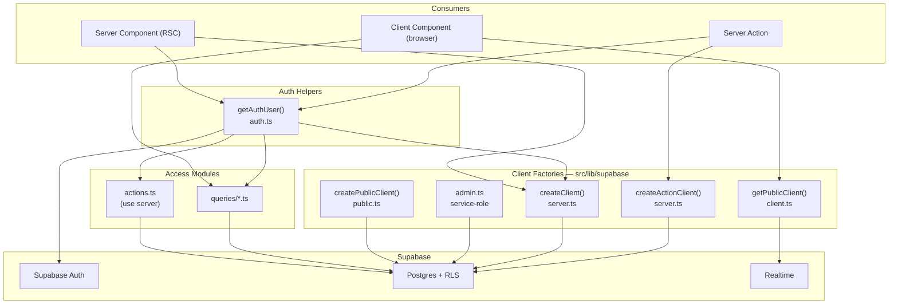
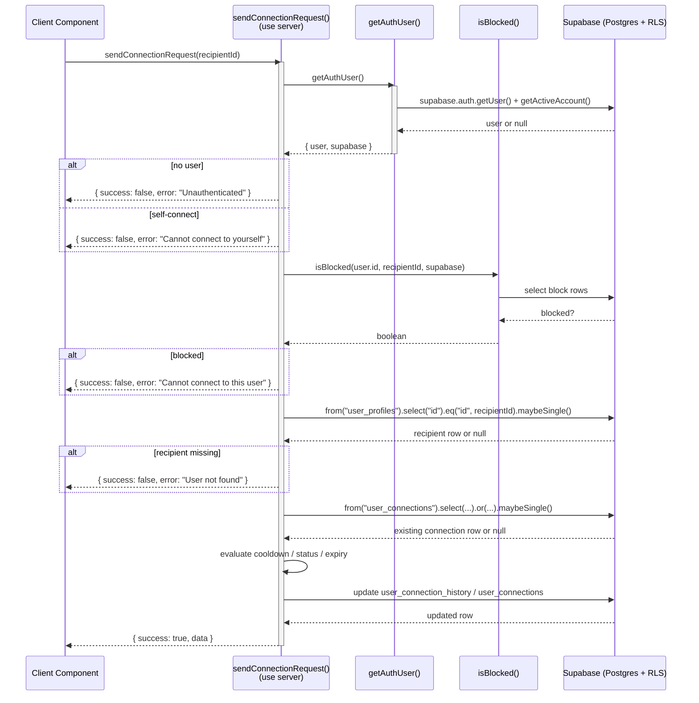
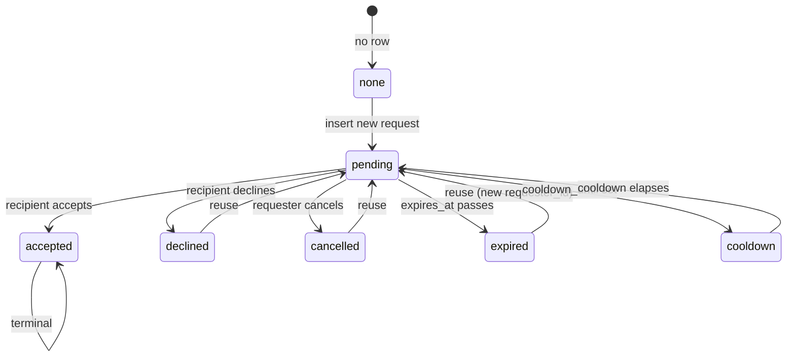

This page documents how ozeaon-v2 organizes server-side data access: the Supabase client factory functions in `src/lib/supabase/`, the `"use server"` action modules that mutate data, and the query modules that read it. It explains the layering rules (which client to use where), the cookie/session plumbing, and the error-handling conventions that every action follows.

## Purpose and Scope

This page covers the **server-side data access layer** of the application:

- The Supabase client factories (`server.ts`, `public.ts`, `client.ts`, `admin.ts`, `auth.ts`) and how they differ.
- The `getAuthUser()` pattern used to obtain an authenticated client + user in one call.
- Server Actions — modules marked `"use server"` that perform writes and return discriminated result objects.
- Query modules — read helpers (some `"use server"`, some intentionally not, so they can run against a browser client).
- Conventions for validation, idempotency, cooldowns/expiry, and error reporting.

**Out of scope / covered by sibling pages:**

- For the overall API-layer topology and routing conventions, see the parent section **API Layer**.
- For the rendering model (static shell vs. streamed request-time reads), `'use cache'`, `Suspense`, and the auth-streams-never-cached rule, see the SSR/cache-components documentation.
- For the database schema and generated `Database` / `TablesInsert` types, see the data-model / types documentation.

## Overview

The application is a Next.js App Router project backed by Supabase. All privileged data access happens on the server and is split into two clearly separated concerns:

1. **Client construction** — a set of small factory functions that decide *which* Supabase client to create for a given execution context (Server Component, Server Action, public/anonymous, browser, admin/service-role).
2. **Access modules** — files that use those clients to read or write domain data, exposed either as Server Actions (`"use server"`) or plain query helpers.

The key design intent is **context-correct clients**. Supabase behaves differently depending on whether it can write cookies (session refresh), whether it carries a user session, and whether it bypasses RLS with a service-role key. Rather than a single "god client", the repo keeps separate factories so the compiler and the `server-only` guard prevent an anonymous or browser client from being used where a session-bound or privileged client is required.

### Key terminology

| Term | Meaning in this repo |
|------|----------------------|
| **Server Action** | A function file/module beginning with `"use server"`, callable from client components via RPC. Can set cookies, so it may refresh the session. |
| **`getAuthUser()`** | Convenience helper that returns `{ user, supabase }` — an authenticated server client plus the current user. |
| **Result object** | Actions return `{ success: boolean, error?: string, data?: ... }` instead of throwing for expected domain errors. |
| **Public client** | `createPublicClient()` — anonymous server client (publishable key, no session). Safe for cacheable/public reads. |
| **Action client** | `createActionClient()` — server client used inside Server Actions where cookie writes are allowed. |

## Architecture



**Why this shape.** Each consumer gets a factory matched to its capabilities: Server Components use `createClient()` (read-only cookie handling, tolerant of failures), Server Actions use `createActionClient()` (cookie writes permitted), browser code uses the browser client, and public/cacheable reads use `createPublicClient()`. `getAuthUser()` sits above the factories as the single entry point for "I need the current user *and* a client", so action/query modules never construct clients ad hoc.

## Client Factories and Their Contracts

All factories live in `src/lib/supabase/`. Choosing the right one is the first decision in every data-access path.

### `createClient()` — Server Components

`server.ts` starts with `import "server-only"`, which makes the module fail at build time if a client component imports it. This is the guard that keeps server credentials and cookie access out of browser bundles.

```ts
import "server-only";

import { env } from "@/config";
import { Database } from "@/types/supabase";
import { createServerClient } from "@supabase/ssr";
import { cookies } from "next/headers";

/**
 * Especially important if using Fluid compute: Don't put this client in a
 * global variable. Always create a new client within each function when using
 * it.
 */
export async function createClient() {
  const cookieStore = await cookies();

  return createServerClient<Database, "public">(
    env.supabase.url,
    env.supabase.pubKey,
    {
      cookies: {
        getAll() {
          return cookieStore.getAll();
        },
        setAll(cookiesToSet) {
          try {
            cookiesToSet.forEach(({ name, value, options }) =>
              cookieStore.set(name, value, options),
            );
          } catch {
            // The `setAll` method was called from a Server Component.
            // This can be ignored if you have middleware refreshing
            // user sessions.
          }
        },
      },
    },
  );
}
```

> Source: [server.ts](https://github.com/ozeaon/ozeaon-v2/blob/0a4f1a95824db87782f1221a4108019d174df3d9/src/lib/supabase/server.ts#L1-L38)

Two important behaviors are encoded here:

- **No global caching of the client.** The doc comment explicitly warns against hoisting the client into a module-level variable, because Next.js Fluid compute reuses the module scope across request contexts. The client must be constructed per call so it binds to the *current* request's cookie store.
- **The `setAll` try/catch is deliberate.** In a Server Component, cookies are read-only, so `cookieStore.set(...)` throws. The factory swallows that error because session refresh is delegated to middleware. In a Server Action, the same code path would legitimately write cookies — hence the separate `createActionClient()` below.

The client is strongly typed: `createServerClient<Database, "public">` binds the generated `Database` type and the `"public"` schema, so all `.from("table")` calls are checked against the schema and return typed rows.

### `createActionClient()` — Server Actions

```ts
/**
 * Create a Supabase client specifically for Server Actions.
 * Server Actions CAN set cookies, so we don't catch errors here.
 */
export async function createActionClient() {
  const cookieStore = await cookies();

  return createServerClient<Database, "public">(
    env.supabase.url,
    env.supabase.pubKey,
    {
      cookies: {
        getAll() {
          return cookieStore.getAll();
        },
        setAll(cookiesToSet) {
          cookiesToSet.forEach(({ name, value, options }) =>
            cookieStore.set(name, value, options),
          );
        },
      },
    },
  );
}
```

> Source: [server.ts](https://github.com/ozeaon/ozeaon-v2/blob/0a4f1a95824db87782f1221a4108019d174df3d9/src/lib/supabase/server.ts#L40-L63)

The only difference from `createClient()` is the absence of the `try/catch` around `setAll`. In a Server Action, a failed cookie write is a real error worth surfacing rather than silencing. This is the client to use when an action must refresh the auth session (e.g., sign-in, sign-out, token rotation).

### The four client contexts at a glance

| Factory | File | Session? | Can write cookies? | Typical use |
|---------|------|----------|--------------------|-------------|
| `createClient()` | `server.ts` | Yes (from cookies) | No (errors swallowed) | Server Component reads |
| `createActionClient()` | `server.ts` | Yes (from cookies) | Yes | Server Actions needing session refresh |
| `createPublicClient()` | `public.ts` | No (publishable key) | No | Public / cacheable reads, build-time fetches |
| `getPublicClient()` | `client.ts` | Browser session | Browser-managed | Client components |

> **Naming trap (documented in the repo):** two different clients both read as "public". `@/lib/supabase/public` → `createPublicClient()` is the **anonymous server** client and is the correct one for `'use cache'` / public reads. `@/lib/supabase/client` → `getPublicClient()` is the **browser** client (`createBrowserClient`) and must never be used on the server. Prior server/`'use cache'` use of the browser client was the original bug in the `[slug]` route.

## Server Actions

Server Actions are the write path. They are identified by the `"use server"` directive at the top of the file (module-level actions) or inside an individual function body. The repository contains module-level action files such as:

- `src/app/(main)/(dashboard)/settings/actions.ts`
- `src/app/(main)/(dashboard)/settings/(organizations)/members/actions.ts`
- `src/app/(main)/(feed)/(private)/account/actions.ts`
- `src/app/(main)/(feed)/(private)/account/posts/actions.ts`
- `src/app/(main)/(feed)/(public)/posts/custom/actions.ts`
- `src/app/(main)/(profile)/organizations/[slug]/actions.ts`
- `src/lib/supabase/actions.ts`

Query modules can also expose individual actions mixed into a read-oriented file — `queries/profile.ts` marks most helpers with a file-level `"use server"` and additionally marks one function (`unblockUser`) with a function-level `"use server"` directive.

> Sources: [profile.ts](https://github.com/ozeaon/ozeaon-v2/blob/0a4f1a95824db87782f1221a4108019d174df3d9/src/lib/supabase/queries/profile.ts#L1-L2), [profile.ts](https://github.com/ozeaon/ozeaon-v2/blob/0a4f1a95824db87782f1221a4108019d174df3d9/src/lib/supabase/queries/profile.ts#L451-L453)

### The canonical action shape

Every action follows the same skeleton, illustrated by `sendConnectionRequest`:

```ts
export async function sendConnectionRequest(recipientId: string) {
  const { user, supabase } = await getAuthUser();

  if (!user) {
    return { success: false, error: "Unauthenticated" };
  }

  if (recipientId === user.id) {
    return { success: false, error: "Cannot connect to yourself" };
  }

  // Check if either user has blocked the other
  const blocked = await isBlocked(user.id, recipientId, supabase);
  if (blocked) {
    return { success: false, error: "Cannot connect to this user" };
  }
  // ...further validation and the write...
}
```

> Source: [profile.ts](https://github.com/ozeaon/ozeaon-v2/blob/0a4f1a95824db87782f1221a4108019d174df3d9/src/lib/supabase/queries/profile.ts#L18-L33)

The skeleton has four phases, in this fixed order:

1. **Authenticate** — call `getAuthUser()`; bail out with `{ success: false, error: "Unauthenticated" }` if there is no user.
2. **Validate cheap invariants** — e.g. reject self-connection before touching the database.
3. **Authorize** — e.g. `isBlocked(user.id, recipientId, supabase)` to enforce block relationships.
4. **Mutate and return** — perform the Supabase query and translate errors into the result envelope.

The result envelope is declared as an explicit type, giving callers type-safe discriminated results:

```ts
type AcceptConnectionResult = {
  success: boolean;
  error?: string;
  data?: { connection_id: string; follow_id: string };
};
```

> Source: [profile.ts](https://github.com/ozeaon/ozeaon-v2/blob/0a4f1a95824db87782f1221a4108019d174df3d9/src/lib/supabase/queries/profile.ts#L12-L16)

### Why return result objects instead of throwing

Expected, user-correctable failures (unauthenticated, duplicate request, cooldown active, already connected) are *not* exceptional — they are normal outcomes the UI must render. Returning `{ success: false, error }` keeps them in the type system and forces the caller to handle them, instead of relying on a global error boundary. Errors that originate from the database are caught at the call site and folded into the same envelope (see below) so the client sees one uniform contract.

## Core Flow: A Write Through a Server Action

The connection-request flow is the richest example in the repo because it exercises every layer: authentication, authorization, state inspection, state transition, and audit history.



### State evaluation and transitions

The most involved branch is what happens when a `user_connections` row already exists between the two users. The action loads the row and then evaluates it in a fixed priority order:

```ts
if (existingRequest) {
  // Check cooldown on the existing connection row
  if (
    existingRequest.cooldown_until &&
    new Date(existingRequest.cooldown_until) > new Date()
  ) {
    return {
      success: false,
      error: "Cannot send request - cooldown period active",
      cooldownUntil: existingRequest.cooldown_until,
    };
  }
  if (existingRequest.status === "accepted") {
    return { success: false, error: "Already connected with this user" };
  }

  const isExpired =
    existingRequest.status === "pending" &&
    existingRequest.expires_at &&
    new Date(existingRequest.expires_at) < new Date();

  if (existingRequest.status === "pending" && !isExpired) {
    if (existingRequest.requester_id === user.id) {
      return { success: false, error: "Connection request already sent" };
    } else {
      return {
        success: false,
        error: "This user has already sent you a connection request",
      };
    }
  }
  // ...
}
```

> Source: [profile.ts](https://github.com/ozeaon/ozeaon-v2/blob/0a4f1a95824db87782f1221a4108019d174df3d9/src/lib/supabase/queries/profile.ts#L57-L88)

The ordering is intentional:

1. **Cooldown first.** A cooldown is a hard temporal lock, so it is checked before status. Even an `accepted` row cannot bypass an active cooldown.
2. **Accepted second.** An existing accepted connection is terminal — no further requests are possible.
3. **Pending + not expired third.** The distinction between "you sent it" and "they sent it" produces two different messages, because the correct UX differs (wait vs. go accept their request in your inbox).
4. **Everything else is reusable.** Expired, `declined`, and `cancelled` rows fall through to the reuse path.



### Reuse instead of insert

When the row is reusable, the action does **not** insert a new `user_connections` row. It closes the old audit trail and recycles the existing row:

```ts
// Close old history
await supabase
  .from("user_connection_history")
  .update({ ended_at: new Date().toISOString() })
  .eq("requester_id", existingRequest.requester_id)
  .eq("recipient_id", existingRequest.recipient_id)
  .is("ended_at", null);

// Update request
const { data, error } = await supabase
  .from("user_connections")
  .update({
    status: "pending",
    requester_id: user.id,
    recipient_id: recipientId,
    expires_at: getConnectionRequestExpiration(),
  })
  .eq("id", existingRequest.id)
  .select()
  .single();

if (error) {
  return { success: false, error: error.message };
}

// Insert new history
await supabase.from("user_connection_history").insert({
  requester_id: user.id,
  recipient_id: recipientId,
  created_at: new Date().toISOString(),
  expires_at: getConnectionRequestExpiration(),
  ended_at: null,
});
```

> Source: [profile.ts](https://github.com/ozeaon/ozeaon-v2/blob/0a4f1a95824db87782f1221a4108019d174df3d9/src/lib/supabase/queries/profile.ts#L89-L129)

**Design intent — why reuse a row rather than delete-and-insert.**

- The **`user_connections`** table uses a unique pair constraint, so a single canonical row per user-pair avoids duplicate-key races. There is exactly one mutable "current state" row.
- The **`user_connection_history`** table holds the immutable timeline. "Closing history" sets `ended_at` on the open segment (`ended_at IS NULL`) before opening a new segment, producing a continuous, gap-free audit record per pair.
- Note the final `insert` **re-declares** `created_at` and `expires_at` rather than relying on defaults, so the history row mirrors the exact timestamps written to `user_connections`. This keeps the two tables consistent even when `getConnectionRequestExpiration()` is time-relative.

The expiry and cooldown windows are centralized config, not inline constants:

```ts
import {
  getConnectionRequestCooldownEnd,
  getConnectionRequestExpiration,
} from "@/config/connectionConfig";
```

> Source: [profile.ts](https://github.com/ozeaon/ozeaon-v2/blob/0a4f1a95824db87782f1221a4108019d174df3d9/src/lib/supabase/queries/profile.ts#L3-L6)

Because both the action and the history insert call `getConnectionRequestExpiration()`, a change to the policy window in `@/config/connectionConfig` propagates to every write path automatically.

## Query Modules (Reads)

Query modules live under `src/lib/supabase/queries/` and hold read helpers. The directory mixes two modes, and the distinction is deliberate:

| Module | Directive | Rationale |
|--------|-----------|-----------|
| `queries/profile.ts` | file-level `"use server"` (plus one function-level `"use server"` on `unblockUser`) | Mostly server-only reads/writes over private profile data. |
| `queries/reactions.ts` | file-level `"use server"` | Write-ish reaction operations guarded on the server. |
| `queries/notifications.ts` | **no** `"use server"` | Shared with the browser client. |

The absence of `"use server"` in `notifications.ts` is documented directly in the source:

```ts
// No "use server" here: the bell's hook runs this against the browser client too.
type NotificationsClient = SupabaseClient<Database>;
```

> Source: [notifications.ts](https://github.com/ozeaon/ozeaon-v2/blob/0a4f1a95824db87782f1221a4108019d174df3d9/src/lib/supabase/queries/notifications.ts#L9-L10)

**Design intent — why a query module would *omit* `"use server".`** A file marked `"use server"` turns every exported function into a server *RPC endpoint* that the client can invoke. That is correct for privileged operations, but wrong for helpers that must also execute in the browser (for example, a notification-fetching hook that subscribes to Realtime and re-runs its query client-side). By omitting the directive, `notifications.ts` exposes plain async functions that accept a client argument — and the note that the type is `SupabaseClient<Database>` (not the server client type) confirms it is written against the shared/injected client interface so it works with either the server or browser client.

This yields a consistent authoring rule: **inject the client, do not construct it.** Helpers receive a `SupabaseClient<Database>` parameter. The caller — a Server Component, a Server Action, or a browser hook — decides which client to pass. `sendConnectionRequest` follows this rule too: it does not call `createClient()` itself; it destructures `supabase` from `getAuthUser()` and passes it to `isBlocked(user.id, recipientId, supabase)`.

## Block-Check Helpers (`src/lib/blocks.ts`)

Despite the file name, this module is about **user blocking**, not editor blocks: it is the read side of the `user_blocks` table that the authorization phase of the action skeleton (above) leans on. It follows the same inject-the-client rule, with the client argument optional — omit it and the helper creates a session client itself:

| Function | Signature | Behaviour |
|----------|-----------|-----------|
| `isBlocked` | `(userId1, userId2, supabase?) => Promise<boolean>` | One `.or()` query matching either direction (`blocker→blocked` in both orderings), `.maybeSingle()`. Bidirectional by construction, so one call is a complete guard. |
| `getBlockedUserIds` | `(userId, supabase?) => Promise<string[]>` | IDs the given user has blocked (`blocker_id = userId`). |
| `getBlockedByUserIds` | `(userId, supabase?) => Promise<string[]>` | IDs that have blocked the given user (`blocked_id = userId`). |

> Sources: [blocks.ts](https://github.com/ozeaon/ozeaon-v2/blob/0a4f1a95824db87782f1221a4108019d174df3d9/src/lib/blocks.ts#L7-L23), [blocks.ts](https://github.com/ozeaon/ozeaon-v2/blob/0a4f1a95824db87782f1221a4108019d174df3d9/src/lib/blocks.ts#L28-L57)

All three swallow query errors into a benign default (`false` / `[]`) rather than throwing — a failed block check degrades to "not blocked", which is the safe direction for a social feature. Consumers: `queries/profile.ts` (the `isBlocked` guard in `sendConnectionRequest` and the follow action) and the `/api/users/[userId]/stats` route (`getBlockedUserIds`, to filter the stats a profile exposes). The social-graph semantics of blocking are documented on the profiles page.

## Comment Route Factories (`src/lib/api/comments/`)

Posts, projects, and articles each carry a comment thread with identical rules — who may edit, when a delete leaves a placeholder, which status a missing entity gets — differing only in storage (`post_comments`/`post_id`, `project_comments`/`project_id`, `article_comments`/`article_id`). `src/lib/api/comments` is the single copy of that logic; each route file is now three lines:

```ts
import { createCommentItemRoutes } from "@/lib/api/comments";
import { POST_COMMENT_SOURCE } from "@/lib/supabase/queries/comment-sources";

export const { PATCH, DELETE } = createCommentItemRoutes(POST_COMMENT_SOURCE);
```

> Source: [item-routes.ts](https://github.com/ozeaon/ozeaon-v2/blob/0a4f1a95824db87782f1221a4108019d174df3d9/src/lib/api/comments/item-routes.ts#L14-L19)

| Export | File | Returns |
|--------|------|---------|
| `createCommentItemRoutes(source)` | `item-routes.ts` (re-exported by `index.ts`) | `{ PATCH, DELETE }` — edit and delete of one comment |
| `createCommentThreadRoutes(source)` | `thread-routes.ts` (re-exported by `index.ts`) | `{ GET, POST }` — thread listing and creation |

Both are factories called once at module load: they close over the `CommentSource` for their entity and hand Next.js ready-made handlers; nothing is decided per request. The threading rules, redaction, and placeholder behaviour these handlers implement are documented on [Comments & Reactions](../../features/comments-and-reactions/), and the six concrete routes on [API Routes](../api-routes/).

### `PATCH` / `DELETE` — one comment (`item-routes.ts`)

- **`PATCH`** validates both IDs with `isUuid` and the body with `commentContentSchema` (`400` on failure), checks the entity's `comments_enabled` flag via `assertCommentsOpen` (so editing follows the thread's open state), resolves the caller's organisation to attribute moderation (`ownerId: organizationId ? null : user.id`), and runs `moderateComment` **before** the update — the target comment already exists, so this check logs *linked*. The write itself is `source.update`, which filters on authorship *and* the acting organisation, so a comment can only be changed by the identity that posted it. Errors funnel to `500` with `"Something went wrong"`; a scoped-out comment returns `404`.
- **`DELETE`** implements the placeholder rule (AC-22): if `source.answerCount` says the comment still carries replies, it soft-deletes (`deleted: "placeholder"`) so the replies stay readable; a leaf comment is hard-deleted (`deleted: "removed"`). If a reply lands between the count and the delete, the `trg_<entity>_comment_block_answered_delete` trigger raises a restrict violation (`PG_ERROR_CODES.RESTRICT_VIOLATION`) and the handler falls back to the soft-delete branch rather than cascading away somebody else's reply. There is deliberately **no** comments-open check: being switched off must not trap an author with a comment they can no longer retract (AC-47).

> Source: [item-routes.ts](https://github.com/ozeaon/ozeaon-v2/blob/0a4f1a95824db87782f1221a4108019d174df3d9/src/lib/api/comments/item-routes.ts#L112-L249)

### `GET` / `POST` — the thread (`thread-routes.ts`)

- **`GET`** is public (a plain handler creating its own `createClient()`, not `withAuthUser`). It runs `source.roots` (with `parseCommentLimit`) and `source.liveCount` in parallel — the count covers every live comment in the thread, not just the loaded page (CO-05) — then partitions roots into expanded (validated against the loaded set via `parseExpandedRoots`) and folded, and fetches replies in parallel with per-root caps: `REPLY_FOLD_THRESHOLD` for folded roots, `REPLY_EXPANDED_LIMIT` for expanded ones. Capping is per thread rather than one swept query, because past the row ceiling a single query truncates across all threads at once, silently returning replies for none of them. The response merges roots and replies through `redactDeletedComments` and returns `total`, `commentCount`, and `replyTotals`.
- **`POST`** is a `withAuthUser` handler: `commentBodySchema` validation (`400`), entity flag + `assertCommentsOpen` (404/403 split per AC-48), and reply-target validation — only the target is checked, because the `trg_<entity>_comment_set_parent` trigger derives `parent_comment_id` from it, so replies can never nest past level 2. A deleted or missing target returns `404`. Moderation runs *before* the insert; no row exists yet, so this check logs *unlinked*. Success returns `201` with the inserted comment.

> Source: [thread-routes.ts](https://github.com/ozeaon/ozeaon-v2/blob/0a4f1a95824db87782f1221a4108019d174df3d9/src/lib/api/comments/thread-routes.ts#L28-L179)

Both factories are generic over `TComment extends RoutableComment` and receive the entity's `CommentSource` — the query half of this layer, documented with the client patterns on [Supabase Client Patterns](../../architecture/supabase-client-patterns/).

## Authentication Helper

`getAuthUser()` (in `src/lib/supabase/auth.ts`) is the single entry point actions use to obtain both a client and the current user. The call site is always the same two-line pattern, destructuring `{ user, supabase }`:

```ts
const { user, supabase } = await getAuthUser();
```

> Source: [profile.ts](https://github.com/ozeaon/ozeaon-v2/blob/0a4f1a95824db87782f1221a4108019d174df3d9/src/lib/supabase/queries/profile.ts#L19)

**Behavioral contract (from the repository's cache-components documentation):** `getAuthUser()` calls `supabase.auth.getUser()` *and* `getActiveAccount()`, and both read cookies. This has two consequences that shape the whole data-access layer:

- **It is request-time by definition.** Any code path that calls `getAuthUser()` can never be placed inside a `'use cache'` scope. Cacheability and authentication are mutually exclusive here.
- **It must be used inside a `<Suspense>`-wrapped leaf** when rendered during a page render, otherwise the build fails with `Uncached data was accessed outside of <Suspense>`.

The practical rule the repo derives from this: **public, cacheable reads use `createPublicClient()` and never touch `getAuthUser()`; per-user reads and all writes use `getAuthUser()` and always stream.**

## Canonical Code Sample: Annotated Action

The excerpt below is a complete, self-contained fragment showing the full validation ladder in order — the reference implementation to copy when adding a new action.

```ts
export async function sendConnectionRequest(recipientId: string) {
  const { user, supabase } = await getAuthUser();          // 1. auth

  if (!user) {
    return { success: false, error: "Unauthenticated" };    //    no session → reject
  }

  if (recipientId === user.id) {
    return { success: false, error: "Cannot connect to yourself" }; // 2. cheap invariant
  }

  // Check if either user has blocked the other
  const blocked = await isBlocked(user.id, recipientId, supabase);  // 3. authorization
  if (blocked) {
    return { success: false, error: "Cannot connect to this user" };
  }

  // Check if recipient exists
  const { data: recipient } = await supabase                  // 4. referential check
    .from("user_profiles")
    .select("id")
    .eq("id", recipientId)
    .maybeSingle();

  if (!recipient) {
    return { success: false, error: "User not found" };
  }
  // ...existing-request inspection and the write...
}
```

> Source: [profile.ts](https://github.com/ozeaon/ozeaon-v2/blob/0a4f1a95824db87782f1221a4108019d174df3d9/src/lib/supabase/queries/profile.ts#L18-L44)

Note the use of `.maybeSingle()` rather than `.single()` for existence checks: `maybeSingle()` returns `null` data instead of throwing when zero rows match, which fits the "return a result object" convention. `.single()` is used later on the `update` precisely because a write that affects zero rows *should* surface as an error.

## Error Handling and Result Conventions

| Failure class | Mechanism | Example |
|---------------|-----------|---------|
| No authenticated user | Early return `{ success: false, error: "Unauthenticated" }` | `sendConnectionRequest` |
| Invalid argument / self-action | Early return with descriptive `error` | `"Cannot connect to yourself"` |
| Blocked relationship | `isBlocked(...)` guard before any write | `"Cannot connect to this user"` |
| Missing target row | `.maybeSingle()` → null check | `"User not found"` |
| Business-rule conflict | Status/cooldown inspection | `"Connection request already sent"`, `"Already connected with this user"` |
| Cooldown active | Temporal comparison + extra `cooldownUntil` field | `{ error: "...cooldown period active", cooldownUntil }` |
| Database error | `if (error) return { success: false, error: error.message }` | after `.update(...).select().single()` |

The `cooldownUntil` field on the cooldown branch is notable: the result envelope is *extended* for that specific case so the UI can render a countdown without a second query. Errors are additive, not lossy.

### Edge cases worth preserving when editing

- **Expiry is computed, not stored-as-truth.** `isExpired` is derived by comparing `expires_at` to `new Date()` at read time. A pending row that is past its expiry is treated as reusable even before any background job flips its status. This makes the `pending` state bypassable by wall-clock alone, which is why the reuse path must also handle `pending`.
- **Cooldown is checked before `accepted`.** Do not reorder these; a cooldown must block re-requests even for accepted pairs.
- **Both directions of `pending` are distinct.** `requester_id === user.id` means "you already asked"; otherwise "they asked you". The messages and therefore the UI affordances differ.
- **`isBlocked` is bidirectional.** The comment states it checks whether *either* user blocked the other, so a single call is sufficient.

## Configuration

Connection timing policy is centralized and injected into both the write and the history insert:

| Function | Module | Purpose |
|----------|--------|---------|
| `getConnectionRequestExpiration()` | `@/config/connectionConfig` | Returns the absolute expiry timestamp written to `expires_at`. |
| `getConnectionRequestCooldownEnd()` | `@/config/connectionConfig` | Returns the cooldown boundary written to `cooldown_until`. |

> Source: [profile.ts](https://github.com/ozeaon/ozeaon-v2/blob/0a4f1a95824db87782f1221a4108019d174df3d9/src/lib/supabase/queries/profile.ts#L3-L6)

Supabase credentials come from the typed `env` object rather than raw `process.env`:

| Key | Accessed via | Notes |
|-----|--------------|-------|
| `env.supabase.url` | `@/config` | Project URL passed to `createServerClient`. |
| `env.supabase.pubKey` | `@/config` | Publishable/anon key for session-bound server clients. |

> Source: [server.ts](https://github.com/ozeaon/ozeaon-v2/blob/0a4f1a95824db87782f1221a4108019d174df3d9/src/lib/supabase/server.ts#L16-L18)

Server-only environment variables documented in the repo's workflow notes include `SUPABASE_SERVICE_ROLE_KEY` and `SITE_URL`, alongside the public `NEXT_PUBLIC_SUPABASE_URL` / `NEXT_PUBLIC_SUPABASE_ANON_KEY` pair.

## API Reference

### `createClient(): Promise<SupabaseClient<Database, "public">>`

Creates a session-aware Supabase server client for Server Components. Reads all cookies; attempts cookie writes but swallows failures (cookies are read-only in RSC context). Guarded by `import "server-only"`.

> Source: [server.ts](https://github.com/ozeaon/ozeaon-v2/blob/0a4f1a95824db87782f1221a4108019d174df3d9/src/lib/supabase/server.ts#L13-L38)

### `createActionClient(): Promise<SupabaseClient<Database, "public">>`

Creates a session-aware client for Server Actions. Identical to `createClient()` except cookie writes are **not** wrapped in `try/catch`, so a failed session cookie write propagates instead of being silently discarded.

> Source: [server.ts](https://github.com/ozeaon/ozeaon-v2/blob/0a4f1a95824db87782f1221a4108019d174df3d9/src/lib/supabase/server.ts#L44-L63)

### `sendConnectionRequest(recipientId: string)`

Sends or re-sends a connection request from the current user to `recipientId`.

- **Parameters** — `recipientId: string`: the target user's id.
- **Returns** — a result envelope. On success: `{ success: true, data }` where `data` is the updated `user_connections` row. On failure: `{ success: false, error: string }`, plus `cooldownUntil` when the cooldown branch is hit.
- **Failure values** — `"Unauthenticated"`, `"Cannot connect to yourself"`, `"Cannot connect to this user"` (blocked), `"User not found"`, `"Cannot send request - cooldown period active"`, `"Already connected with this user"`, `"Connection request already sent"`, `"This user has already sent you a connection request"`, or the raw Supabase `error.message` on a failed update.

> Source: [profile.ts](https://github.com/ozeaon/ozeaon-v2/blob/0a4f1a95824db87782f1221a4108019d174df3d9/src/lib/supabase/queries/profile.ts#L18-L129)

### `unblockUser(blockedId: string)`

Marked with a function-level `"use server"` directive inside the file-level-`"use server"` module. Exposed as a Server Action so a client component can un-block a user.

> Source: [profile.ts](https://github.com/ozeaon/ozeaon-v2/blob/0a4f1a95824db87782f1221a4108019d174df3d9/src/lib/supabase/queries/profile.ts#L451-L453)

### `NotificationsClient = SupabaseClient<Database>`

The injected client type used by the notification query helpers so they can run against either the server client or the browser client.

> Source: [notifications.ts](https://github.com/ozeaon/ozeaon-v2/blob/0a4f1a95824db87782f1221a4108019d174df3d9/src/lib/supabase/queries/notifications.ts#L9-L10)

### `isBlocked(userId1: string, userId2: string, supabase?: SupabaseClient): Promise<boolean>`

True when either user has blocked the other — a single `.or()` over both directions of the `user_blocks` pair, resolved with `.maybeSingle()`. Creates a session client when `supabase` is omitted. Query errors collapse to `false`.

> Source: [blocks.ts](https://github.com/ozeaon/ozeaon-v2/blob/0a4f1a95824db87782f1221a4108019d174df3d9/src/lib/blocks.ts#L7-L23)

### `getBlockedUserIds(userId: string, supabase?): Promise<string[]>` / `getBlockedByUserIds(userId: string, supabase?): Promise<string[]>`

The IDs a user has blocked, and the IDs that have blocked them, respectively. Errors collapse to `[]`.

> Source: [blocks.ts](https://github.com/ozeaon/ozeaon-v2/blob/0a4f1a95824db87782f1221a4108019d174df3d9/src/lib/blocks.ts#L28-L57)

### `createCommentItemRoutes<TComment>(source: CommentSource<TComment>): { PATCH, DELETE }`

Builds the edit/delete handlers for one commentable entity. `PATCH`: `isUuid` + `commentContentSchema` validation (`400`), `assertCommentsOpen`, pre-update moderation (linked), authorship-and-organisation-scoped `source.update` (`404` when scoped out, `500` on error). `DELETE`: reply-count branch to soft-delete a placeholder vs. hard-delete a leaf, with a `RESTRICT_VIOLATION` fallback to the placeholder if a reply arrives mid-delete; no comments-open check by design (AC-47).

> Source: [item-routes.ts](https://github.com/ozeaon/ozeaon-v2/blob/0a4f1a95824db87782f1221a4108019d174df3d9/src/lib/api/comments/item-routes.ts#L112-L249)

### `createCommentThreadRoutes<TComment>(source: CommentSource<TComment>): { GET, POST }`

Builds the thread listing/creation handlers. `GET` (public, own client): parallel roots + live count, per-root reply caps (`REPLY_FOLD_THRESHOLD` / `REPLY_EXPANDED_LIMIT`), `redactDeletedComments`, and `{ comments, total, commentCount, replyTotals }`. `POST` (`withAuthUser`): `commentBodySchema` (`400`), open check (AC-48 404/403 split), reply-target existence (`404`), pre-insert moderation (unlinked), `201` with the inserted comment.

> Source: [thread-routes.ts](https://github.com/ozeaon/ozeaon-v2/blob/0a4f1a95824db87782f1221a4108019d174df3d9/src/lib/api/comments/thread-routes.ts#L28-L179)

## Operations, Performance and Extension Points

- **Client lifetime.** Always construct the client inside the request. The `createClient()` doc comment warns against module-level caching; the same applies to `createActionClient()` and `getAuthUser()` results.
- **Cookie refresh ownership.** Session refresh is delegated to middleware (referenced in the `setAll` catch comment), which is why RSC cookie-write failures are safe to ignore. Actions that must rotate cookies should use `createActionClient()` and let errors surface.
- **Round-trip count.** `sendConnectionRequest` performs up to five sequential Supabase calls (user, block, recipient, existing row, write). The early-return ladder means the expensive write is only reached after all guards pass, and each guard short-circuits before the next.
- **Adding a new action.** Copy the four-phase skeleton: `getAuthUser()` → cheap invariants → authorization via a guard helper that accepts the injected client → typed write with `if (error) return { success: false, error: error.message }`. Keep new policy timestamps in `@/config/connectionConfig` rather than inline.
- **Adding a new shared query.** If a read must run in both the browser and on the server, omit `"use server"` and accept a `SupabaseClient<Database>` parameter, following `queries/notifications.ts`.
- **Do not put `getAuthUser()` inside `'use cache'`.** Authentication reads cookies, so caching it is a build-time error. Public cacheable reads belong on `createPublicClient()`.

## Related Links

- [Client factories — server.ts](https://github.com/ozeaon/ozeaon-v2/blob/0a4f1a95824db87782f1221a4108019d174df3d9/src/lib/supabase/server.ts)
- [Public anonymous server client](https://github.com/ozeaon/ozeaon-v2/blob/0a4f1a95824db87782f1221a4108019d174df3d9/src/lib/supabase/public.ts)
- [Browser client](https://github.com/ozeaon/ozeaon-v2/blob/0a4f1a95824db87782f1221a4108019d174df3d9/src/lib/supabase/client.ts)
- [Auth helper](https://github.com/ozeaon/ozeaon-v2/blob/0a4f1a95824db87782f1221a4108019d174df3d9/src/lib/supabase/auth.ts)
- [Server actions module](https://github.com/ozeaon/ozeaon-v2/blob/0a4f1a95824db87782f1221a4108019d174df3d9/src/lib/supabase/actions.ts)
- [Profile queries and connection actions](https://github.com/ozeaon/ozeaon-v2/blob/0a4f1a95824db87782f1221a4108019d174df3d9/src/lib/supabase/queries/profile.ts)
- [Notification queries (shared client)](https://github.com/ozeaon/ozeaon-v2/blob/0a4f1a95824db87782f1221a4108019d174df3d9/src/lib/supabase/queries/notifications.ts)
- [Block-check helpers](https://github.com/ozeaon/ozeaon-v2/blob/0a4f1a95824db87782f1221a4108019d174df3d9/src/lib/blocks.ts) — `isBlocked`, `getBlockedUserIds`, `getBlockedByUserIds`
- [Comment route factories](https://github.com/ozeaon/ozeaon-v2/blob/0a4f1a95824db87782f1221a4108019d174df3d9/src/lib/api/comments/index.ts) — [item routes](https://github.com/ozeaon/ozeaon-v2/blob/0a4f1a95824db87782f1221a4108019d174df3d9/src/lib/api/comments/item-routes.ts) and [thread routes](https://github.com/ozeaon/ozeaon-v2/blob/0a4f1a95824db87782f1221a4108019d174df3d9/src/lib/api/comments/thread-routes.ts)
- Comment sources these factories consume: see [Supabase Client Patterns](../../architecture/supabase-client-patterns/)
- [Reaction queries](https://github.com/ozeaon/ozeaon-v2/blob/0a4f1a95824db87782f1221a4108019d174df3d9/src/lib/supabase/queries/reactions.ts)
- [Cache components model — SSR/caching rules](https://github.com/ozeaon/ozeaon-v2/blob/0a4f1a95824db87782f1221a4108019d174df3d9/docs/ssr/cache-components-model.md)
- [Workflows and environment variables](https://github.com/ozeaon/ozeaon-v2/blob/0a4f1a95824db87782f1221a4108019d174df3d9/docs/workflows.md)
