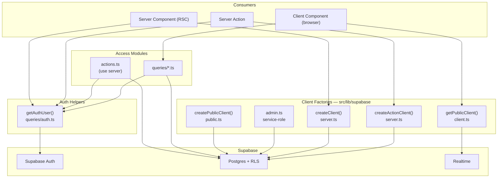

OZEAON splits all server-side data access into two concerns: a set of small Supabase client factories that select the right client for each execution context, and access modules that use those clients to read or write domain data. This page covers the factories, the `"use server"` action modules and their conventions, the query helpers, and the shared utilities (comment factories, block helpers) that route handlers and components call into.

## Overview

The key design intent is **context-correct clients**. Supabase behaves differently depending on whether it can write cookies (session refresh), whether it carries a user session, and whether it bypasses RLS with a service-role key. Rather than a single shared client, the repo keeps separate factories so the compiler and the `server-only` guard prevent an anonymous or browser client from being used where a session-bound or privileged client is required.

`getAuthUser()` in [`src/lib/supabase/queries/auth.ts`](https://github.com/ozeaon/ozeaon-v2/blob/0a4f1a95824db87782f1221a4108019d174df3d9/src/lib/supabase/queries/auth.ts) is the single entry point for "I need the current user and a client in one call". It is wrapped with React `cache`, calls `supabase.auth.getUser()` and `getActiveAccount()` in parallel after a profile join, and returns `{ user, activeAccount, supabase }`. Any code path that calls it is request-time by definition and cannot be placed inside a `use cache` scope.

## Architecture



Each consumer gets a factory matched to its capabilities: Server Components use `createClient()` (cookie reads, write failures silenced), Server Actions use `createActionClient()` (cookie writes permitted), browser code uses the browser client, and public/cacheable reads use `createPublicClient()`. `getAuthUser()` sits above as the entry point for "I need the current user and a client"; action and query modules never construct clients ad hoc.

## Client Factories

All factories live in [`src/lib/supabase/`](https://github.com/ozeaon/ozeaon-v2/tree/0a4f1a95824db87782f1221a4108019d174df3d9/src/lib/supabase). Choosing the right one is the first decision in every data-access path.

| Factory | File | Session? | Cookie writes? | Typical use |
|---------|------|----------|----------------|-------------|
| `createClient()` | `server.ts` | Yes (from cookies) | Failures silenced | Server Component reads |
| `createActionClient()` | `server.ts` | Yes (from cookies) | Yes | Server Actions needing session refresh |
| `createPublicClient()` | `public.ts` | No (publishable key) | No | Public / cacheable reads, build-time fetches |
| `getPublicClient()` | `client.ts` | Browser session | Browser-managed | Client components, Realtime subscriptions |

Both `createClient()` and `createActionClient()` are in [`server.ts`](https://github.com/ozeaon/ozeaon-v2/blob/0a4f1a95824db87782f1221a4108019d174df3d9/src/lib/supabase/server.ts), which starts with `import "server-only"` — a build-time guard that prevents server credentials and cookie access from reaching browser bundles. The only difference between the two is the `setAll` try/catch: `createClient()` swallows cookie-write failures because Server Components cannot write cookies and session refresh is delegated to middleware; `createActionClient()` lets them surface because an action that must rotate the session cookie should not silently discard failures.

Both clients are typed as `createServerClient<Database, "public">`, so all `.from("table")` calls are checked against the generated schema. The factories must be called per request — the doc comment explicitly warns against module-level caching because Next.js Fluid compute reuses the module scope across request contexts.

**Naming caution.** Two different clients both read as "public". `createPublicClient()` from `public.ts` is the anonymous server client, correct for `use cache` and public reads. `getPublicClient()` from `client.ts` is the browser client (`createBrowserClient`) and must never be used on the server. The env var that both server-side clients use is `NEXT_PUBLIC_SUPABASE_PUBLISHABLE_KEY` (surfaced as `env.supabase.pubKey`).

## Server Actions

Server Actions are the write path. They are identified by the `"use server"` directive at the top of the file (module-level) or inside a function body (function-level). Action modules include `src/lib/supabase/actions.ts`, feature-area action files under `src/app/(main)/(dashboard)/settings/` and nearby route groups, and query modules such as `queries/profile.ts` that mark the whole file with `"use server"`.

### Action Skeleton

Every action follows the same four-phase skeleton. The example below is from [`updateProfileSettings`](https://github.com/ozeaon/ozeaon-v2/blob/0a4f1a95824db87782f1221a4108019d174df3d9/src/app/(main)/(feed)/(private)/account/actions.ts), which validates and saves a user's profile fields:

```ts
export async function updateProfileSettings(data: ProfileSettingsPayload) {
  const { user, supabase } = await getAuthUser(); // 1. authenticate
  if (!user) return { error: "Unauthenticated" };

  const parsed = profileSettingsSchema.safeParse(data); // 2. validate
  if (!parsed.success) return { error: "Invalid input" };

  // 3. authorize (ownership is implicit: all queries filter on user.id)
  // 4. mutate
  const { error } = await supabase
    .from("user_profiles")
    .update(profileFields)
    .eq("id", user.id);

  if (error) return { error: error.message };
  revalidatePath("/account");
  return {};
}
```

The four phases, in fixed order:
1. **Authenticate** — `getAuthUser()`; bail with `{ error: "Unauthenticated" }` if no user.
2. **Validate cheap invariants** — Zod parse or field checks before any database call.
3. **Authorize** — domain guard helpers, ownership checks, or block checks via the injected client.
4. **Mutate and return** — write, then `revalidatePath`, then a typed result object.

Actions return result objects rather than throwing for expected domain errors. `{ success: false, error }` keeps failures in the type system and forces callers to handle them, instead of relying on a global error boundary. Database errors are caught and folded into the same envelope, so clients see one uniform contract.

### Connections & Blocking (Roadmap)

Server actions for connections (`sendConnectionRequest`, `acceptConnectionRequest`, etc.) and blocking exist in [`queries/profile.ts`](https://github.com/ozeaon/ozeaon-v2/blob/0a4f1a95824db87782f1221a4108019d174df3d9/src/lib/supabase/queries/profile.ts) and the `user_connections` / `user_blocks` tables are in the schema. No UI currently calls these actions. Connections and blocking are **roadmap**. The `isBlocked` check does still run in the stats and follow actions, and the `/api/users/:userId/stats` route masks a blocked user as 404.

## Query Modules

Query modules live under [`src/lib/supabase/queries/`](https://github.com/ozeaon/ozeaon-v2/tree/0a4f1a95824db87782f1221a4108019d174df3d9/src/lib/supabase/queries) and hold read helpers. The directory mixes two modes deliberately:

- Modules with a file-level `"use server"` (e.g. `queries/profile.ts`, `queries/reactions.ts`) turn every export into a server RPC endpoint callable from client components.
- Modules without `"use server"` (e.g. `queries/notifications.ts`) export plain async functions that accept a client argument — correct for helpers that must also run in the browser against the Realtime client.

The consistent authoring rule is **inject the client, do not construct it**. Helpers receive a `SupabaseClient<Database>` parameter. The caller — a Server Component, a Server Action, or a browser hook — decides which factory to pass. This makes query helpers usable from both contexts without duplicating logic.

## Block-Check Helpers

[`src/lib/blocks.ts`](https://github.com/ozeaon/ozeaon-v2/blob/0a4f1a95824db87782f1221a4108019d174df3d9/src/lib/blocks.ts) provides three read-side helpers over `user_blocks`, all following the inject-the-client rule with an optional client argument:

- `isBlocked(userId1, userId2, supabase?)` — one `.or()` query matching either direction of the block pair; bidirectional by construction. Errors collapse to `false` (not-blocked is the safe degradation for a social feature).
- `getBlockedUserIds(userId, supabase?)` — IDs the given user has blocked.
- `getBlockedByUserIds(userId, supabase?)` — IDs that have blocked the given user.

Both `getBlockedUserIds` and `getBlockedByUserIds` collapse errors to `[]`.

## Comment Route Factories

Posts, projects, and articles share identical comment threading rules, differing only in storage table and entity ID column. [`src/lib/api/comments/`](https://github.com/ozeaon/ozeaon-v2/tree/0a4f1a95824db87782f1221a4108019d174df3d9/src/lib/api/comments) is the single copy of that logic. Each comment route file closes over its entity's `CommentSource` at module load and hands Next.js ready-made handlers:

```ts
export const { GET, POST } = createCommentThreadRoutes(PROJECT_COMMENT_SOURCE);
export const { PATCH, DELETE } = createCommentItemRoutes(PROJECT_COMMENT_SOURCE);
```

| Export | Provides |
|--------|----------|
| `createCommentThreadRoutes(source)` | `GET` (public, parallel roots + live count, per-root reply caps, redaction) and `POST` (`withAuthUser`, Zod validation, open check, moderation, 201) |
| `createCommentItemRoutes(source)` | `PATCH` (authorship-scoped update, pre-moderation) and `DELETE` (placeholder rule: soft-delete when replies exist, hard-delete leaf; no open-check by design so authors can retract even when comments are closed) |

The threading rules, redaction, and placeholder behaviour these factories implement are documented in [Comments & Reactions](../../features/comments-and-reactions/).

## Failure Modes & Edge Cases

**`getAuthUser()` is request-time.** It calls `supabase.auth.getUser()` and `getActiveAccount()`, both of which read cookies. Any code path that calls it cannot be placed in a `use cache` scope — authentication and cacheability are mutually exclusive. Public cacheable reads belong on `createPublicClient()`.

**`maybeSingle()` vs `single()` for existence checks.** `.maybeSingle()` returns `null` data instead of throwing when zero rows match, fitting the result-object convention. `.single()` is used on writes precisely because a write that affects zero rows should surface as an error.

**Block failures degrade to false / [].** All three block helpers swallow query errors into a benign default. A failed block check treats the user as not-blocked — the safe direction for a social feature, but important to understand when debugging unexpected access.

**Client lifetime.** Always construct the client inside the request. The `createClient()` doc comment warns against module-level caching because Fluid compute reuses the module scope across contexts. The same applies to `createActionClient()` and `getAuthUser()` results.

## Operational Notes

- **Cookie refresh ownership.** Session refresh is delegated to middleware, which is why RSC cookie-write failures are silenced in `createClient()`. Actions that must rotate cookies should use `createActionClient()` and let failures surface.
- **`revalidatePath` after writes.** Server Actions call `revalidatePath` (or `revalidatePath("/")` for broad invalidation) after successful mutations so cached page segments drop stale data.
- **Round-trip count.** Actions perform several sequential Supabase calls: auth, validation queries, and the write. The early-return ladder means the expensive write is reached only after all guards pass.

## Extension Points

**Adding a new action.** Copy the four-phase skeleton: `getAuthUser()` → cheap invariants → domain guard helpers with the injected client → typed write with `if (error) return { error: error.message }`. Centralize new policy timestamps or limits in `src/config/` rather than inline.

**Adding a new shared query helper.** If a read must run in both the browser and on the server, omit `"use server"` and accept a `SupabaseClient<Database>` parameter, following `queries/notifications.ts`.

**Do not put `getAuthUser()` inside `use cache`.** Authentication reads cookies, so caching it is a build-time error.

## Related Links

- [src/lib/supabase/server.ts](https://github.com/ozeaon/ozeaon-v2/blob/0a4f1a95824db87782f1221a4108019d174df3d9/src/lib/supabase/server.ts) — `createClient` and `createActionClient`
- [src/lib/supabase/public.ts](https://github.com/ozeaon/ozeaon-v2/blob/0a4f1a95824db87782f1221a4108019d174df3d9/src/lib/supabase/public.ts) — `createPublicClient`
- [src/lib/supabase/client.ts](https://github.com/ozeaon/ozeaon-v2/blob/0a4f1a95824db87782f1221a4108019d174df3d9/src/lib/supabase/client.ts) — `getPublicClient` (browser)
- [src/lib/supabase/queries/auth.ts](https://github.com/ozeaon/ozeaon-v2/blob/0a4f1a95824db87782f1221a4108019d174df3d9/src/lib/supabase/queries/auth.ts) — `getAuthUser`, `withAuthUser`, `getAuthUserOrRedirect`
- [src/lib/supabase/actions.ts](https://github.com/ozeaon/ozeaon-v2/blob/0a4f1a95824db87782f1221a4108019d174df3d9/src/lib/supabase/actions.ts) — auth and account server actions
- [src/lib/supabase/queries/](https://github.com/ozeaon/ozeaon-v2/tree/0a4f1a95824db87782f1221a4108019d174df3d9/src/lib/supabase/queries) — all query modules
- [src/lib/blocks.ts](https://github.com/ozeaon/ozeaon-v2/blob/0a4f1a95824db87782f1221a4108019d174df3d9/src/lib/blocks.ts) — `isBlocked`, `getBlockedUserIds`, `getBlockedByUserIds`
- [src/lib/api/comments/](https://github.com/ozeaon/ozeaon-v2/tree/0a4f1a95824db87782f1221a4108019d174df3d9/src/lib/api/comments) — comment route factories
- [API Routes](../api-routes/) — route handler conventions
- [Edge Functions](../edge-functions/) — Supabase edge functions
- [Supabase Client Patterns](../../architecture/supabase-client-patterns/) — client choice rules and the `CommentSource` query half
- [Comments & Reactions](../../features/comments-and-reactions/) — threading rules the factories implement
- [SSR & Caching](../../architecture/ssr-rendering-and-caching/) — rendering rules and caching restrictions
