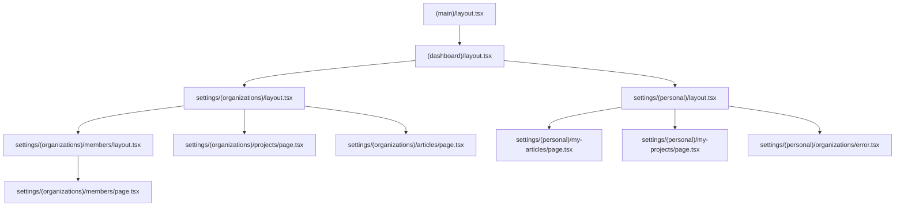
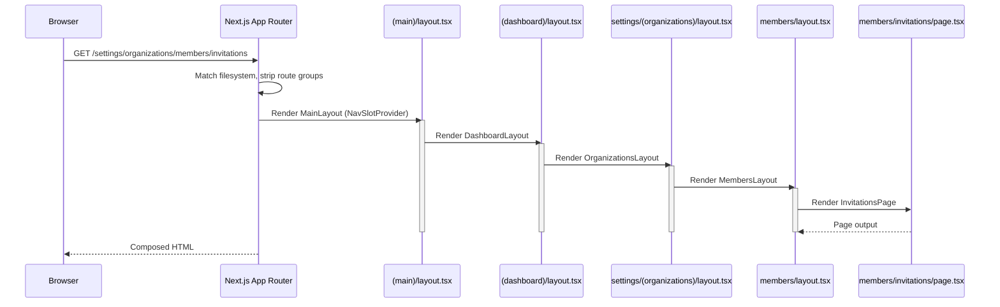

The `src/app` directory is organized with Next.js App Router **route groups** — parenthesized folders such as `(auth)`, `(main)`, `(dashboard)`, `(reader)`, and `(organisations)` — that partition the application by audience and shell without adding segments to the public URL.

## Purpose and Scope

This page documents the physical file-system routing layout of the application: how `src/app` is partitioned into route groups, which layouts own which subtree, and the naming conventions that make the structure predictable for tooling (logging, auth rules, navigation). It focuses on the **directory topology** — the folders and the `layout.tsx`/`page.tsx`/`route.ts`/`actions.ts` files that define it.

It does **not** cover:

- The rendering and caching model (Server Components, `cacheComponents`, prerender rules) — see the SSR documentation under `docs/ssr/`.
- Navigation component internals (`NavSlotProvider`, `NavHistoryTracker`, `MobileFloatingCreate`) beyond their mount point in the `(main)` layout.
- Database schema and Row Level Security policies.

## Overview

The project uses **Next.js 16 (React 19)** with the App Router and Server Components, with `src/app` as the router root:

> **Frontend**: Next.js 16 (React 19) with App Router & Server Components

The router root is explicitly stated in the project conventions:

> - App Router (`src/app`)
> - Server Components by default

Route groups use the `(name)` convention. A parenthesized folder is stripped from the URL path, so `src/app/(main)/(reader)/projects/[slug]/page.tsx` resolves to `/projects/<slug>` while still living inside three nested layout scopes. This lets the codebase attach a distinct shell (chrome, navigation, providers) to a subtree **without** polluting the URL hierarchy or forcing route names into the layout taxonomy.

Two structural axes are combined:

1. **Audience axis** — `(auth)` for unauthenticated flows vs. `(main)` for the authenticated application shell.
2. **Area axis** — inside `(main)`, `(dashboard)` for the settings/management area vs. `(reader)` for public content consumption, plus an `(organisations)` sub-group nested inside `(dashboard)/settings`.

## Architecture

```mermaid
flowchart TD
    Root["src/app (router root)"]

    subgraph sg_Auth["(auth) — unauthenticated flows"]
        AuthLayout["(auth)/layout.tsx"]
        Login["(auth)/login/page.tsx"]
        Signup["(auth)/signup/page.tsx"]
        Forgot["(auth)/forgot-password/page.tsx"]
        Reset["(auth)/reset-password/page.tsx"]
        Verify["(auth)/verify-email/page.tsx"]
        Confirm["(auth)/auth/confirm/route.ts"]
    end

    subgraph sg_Main["(main) — authenticated shell"]
        MainLayout["(main)/layout.tsx"]
        NavSlot["NavSlotProvider"]
        NavHistory["NavHistoryTracker"]
        MobileCreate["MobileFloatingCreate"]
    end

    subgraph sg_Dashboard["(main)/(dashboard) — management area"]
        DashLayout["(dashboard)/layout.tsx"]
        SettingsOrg["settings/(organizations)/layout.tsx"]
        SettingsPersonal["settings/(personal)/layout.tsx"]
        Actions["settings/(organizations)/members/actions.ts"]
    end

    subgraph sg_Reader["(main)/(reader) — content area"]
        ProjectPage["projects/[slug]/page.tsx"]
        ArticlePage["articles/[slug]/page.tsx"]
        OrgPage["organisations/[handle]/page.tsx"]
        ProfilePage["profile/[handle]/page.tsx"]
    end

    Root --> AuthLayout
    Root --> MainLayout

    MainLayout --> NavSlot
    MainLayout --> NavHistory
    MainLayout --> MobileCreate

    MainLayout --> DashLayout
    MainLayout --> ProjectPage
    MainLayout --> ArticlePage
    MainLayout --> OrgPage
    MainLayout --> ProfilePage

    DashLayout --> SettingsOrg
    DashLayout --> SettingsPersonal
    SettingsOrg --> Actions
```



The diagram separates three concerns that the folder tree keeps independent:

- **Route groups** (`(auth)`, `(main)`) are the outermost scoping mechanism. They decide which shell wraps a page, not what URL it lives at.
- **Layout files** (`layout.tsx`) are the actual nesting points. `(main)/layout.tsx` mounts the shared application chrome; group folders themselves contribute no layout unless they contain one.
- **Leaf files** — `page.tsx` (a routable page), `route.ts` (a raw HTTP route handler), `actions.ts` (Server Actions colocated with the pages that call them).

Leaf filenames carry semantic weight in the App Router: only `page.tsx` and `route.ts` produce externally reachable endpoints; `layout.tsx`, `actions.ts`, `error.tsx`, and other files are supporting files that never become URLs.

## The `(auth)` Group

`(auth)` isolates every unauthenticated surface — `login`, `signup`, `forgot-password`, `reset-password`, `verify-email` — plus one non-page route handler:

| File | Kind | Role |
|------|------|------|
| `(auth)/layout.tsx` | Layout | Shell for the whole unauthenticated subtree |
| `(auth)/login/page.tsx` | Page | Sign-in form |
| `(auth)/signup/page.tsx` | Page | Registration form |
| `(auth)/forgot-password/page.tsx` | Page | Password reset request |
| `(auth)/reset-password/page.tsx` | Page | Password reset completion |
| `(auth)/verify-email/page.tsx` | Page | Email verification landing |
| `(auth)/auth/confirm/route.ts` | Route Handler | Email confirmation callback (no UI) |

Because the group is parenthesized, the URL for the sign-in form is `/login`, not `/(auth)/login` and not `/auth/login`. The one exception is `(auth)/auth/confirm/route.ts`, which *does* carry a real `auth` segment, producing `/auth/confirm` — the deliberate distinction between grouping (URL-invisible) and an actual nested path (URL-visible) is visible side-by-side in this single folder.

Design intent: auth pages share a visual shell that must differ from the authenticated application shell, but they also must not be nested under any application chrome. Putting them in a group rather than under a real `/auth` prefix keeps the public login URL short (`/login`) while still giving the shell a single mounting point.

## The `(main)` Group

`(main)` is the authenticated application shell. Its layout wraps every child with the navigation infrastructure:

```tsx
import { NavSlotProvider } from "@/components/nav/NavSlotContext";
import { NavHistoryTracker } from "@/components/nav/NavHistoryTracker";
import { MobileFloatingCreate } from "@/components/nav/components/MobileFloatingCreate";

export default function MainLayout({
  children,
}: {
  children: React.ReactNode;
}) {
  return (
    <NavSlotProvider>
      <NavHistoryTracker />
      {children}
      <MobileFloatingCreate />
    </NavSlotProvider>
  );
}
```

> Source: [(main)/layout.tsx](https://github.com/ozeaon/ozeaon-v2/blob/0a4f1a95824db87782f1221a4108019d174df3d9/src/app/(main)/layout.tsx#L1-L17)

Three distinct responsibilities are composed here, all of them mounted exactly once for the entire authenticated subtree:

- **`NavSlotProvider`** wraps `{children}`, establishing a React context that descendant pages can read to publish navigation content into a slot. This is why it is the outermost element — anything deeper must be able to consume the context.
- **`NavHistoryTracker`** renders alongside the children (not wrapping them), so it can observe route changes without participating in the layout of page content.
- **`MobileFloatingCreate`** is mounted once here rather than per-page, which is confirmed by the design plan:

> New component (`src/components/nav/MobileFloatingCreate.tsx`), mounted once from `src/app/(main)/layout.tsx`.

Design intent: because a `layout.tsx` in the App Router is **not re-rendered when navigating between its children**, mounting navigation state, history tracking, and the floating create affordance at this level guarantees they persist across route transitions inside `(main)`. Mounting them in a page instead would remount them on every navigation and break both context continuity and animation/scroll state.

## The `(dashboard)` Group

`(main)/(dashboard)` holds the management area: everything under `settings`. It has its own `(dashboard)/layout.tsx`, a second layout layer nested inside `(main)/layout.tsx`. Its `settings` subtree is itself split by a second orthogonal axis into two groups:

- **`(organizations)`** — organization-scoped settings: `articles`, `projects`, `members` (with `members/invitations`, `members/requests`).
- **`(personal)`** — user-scoped settings: `my-articles`, `my-projects`, `organizations`.

Each has its own `layout.tsx`, and `members` adds a third layout. This produces a stack of nested layouts for a deep settings page:



The `(organizations)` / `(personal)` split is the clearest example of the group idiom's intent: organization settings and personal settings have entirely different data scoping, permissions, and chrome, but they should be reachable at flat URLs (`/settings/members` vs. `/settings/my-articles`) rather than being forced into a shared `settings/organizations/...` prefix. The parenthesis lets the *layout* tree diverge from the *URL* tree.

Note the colocation of different file kinds in this subtree:

- `settings/(organizations)/members/actions.ts` — Server Actions colocated with the pages that invoke them, not placed in a shared actions directory.
- `settings/(personal)/organizations/error.tsx` — an error boundary scoped to exactly one route segment, so a failure loading personal organizations does not blank out the wider settings shell.

## The `(reader)` Group

`(main)/(reader)` groups the content-consumption surfaces, all dynamic-segment routes:

| Route | File |
|-------|------|
| `/projects/[slug]` | `src/app/(main)/(reader)/projects/[slug]/page.tsx` |
| `/articles/[slug]` | `src/app/(main)/(reader)/articles/[slug]/page.tsx` |
| `/organisations/[handle]` | `src/app/(main)/(reader)/organisations/[handle]/page.tsx` |
| `/profile/[handle]` | `src/app/(main)/(reader)/profile/[handle]/page.tsx` |

These are confirmed as the reader-group surfaces in the design plan:

> - `src/app/(main)/(reader)/projects/[slug]/page.tsx`
> - `src/app/(main)/(reader)/articles/[slug]/page.tsx`
> - `src/app/(main)/(reader)/organisations/[handle]/page.tsx`
> - `src/app/(main)/(reader)/profile/[handle]/page.tsx`

Design intent: these four routes share a reading experience (typography, metadata generation, dynamic caching behavior) that differs from the dashboard. The group gives them a common layout ancestor while keeping slugs at the URL root — `/projects/acme` rather than `/reader/projects/acme`.

Note the deliberate vocabulary split between `[slug]` (content identifiers: projects, articles) and `[handle]` (human-owned identifiers: organisations, profile). The parameter name is part of the route's public shape, since `params` is keyed by it.

## Core Flow: Route Resolution Through Groups

The following traces how a request like `/settings/organizations/members/invitations` is resolved through the nested groups and layouts.



The key behavior: **group folders are stripped during matching but their contents still nest**. `(dashboard)` and `(organizations)` disappear from the URL while their `layout.tsx` files remain in the render chain. The URL segment `organizations` in `/settings/organizations/members/...` — where it appears — comes from the real (unparenthesized) `organizations` folder, in contrast to the parenthesized `(organizations)` group that contributes no segment. Both can coexist safely precisely because only one is URL-visible.

## Convention: Route Groups Are Stripped, Never Renamed

Because groups are URL-invisible, any tooling that derives a name from a path must decide what to do with them. The project's logging convention fixes this explicitly:

> **Route groups are stripped, not renamed.** For files under `src/app`, derive the category from the real path with parenthesized route-group segments removed — never invent a replacement word. A file at `app/(main)/(feed)/(public)/(home)/page.tsx` → `["app", "feed"]` (first real segment after `app`), not `["app", "home"]`.

> Source: [logging-conventions.md](https://github.com/ozeaon/ozeaon-v2/blob/0a4f1a95824db87782f1221a4108019d174df3d9/docs/logging-conventions.md#L9)

Two further rules complete the convention:

> **Server Actions always use `["actions", X]`**, regardless of which route group they live under.

> **Root-level files use `["app", "root"]`** (`instrumentation.ts`, `middleware.ts`, `layout.tsx`, `error.tsx`, etc. living directly under `src/` or `src/app`) — a single fixed category rather than an invented second segment per file.

> Source: [logging-conventions.md](https://github.com/ozeaon/ozeaon-v2/blob/0a4f1a95824db87782f1221a4108019d174df3d9/docs/logging-conventions.md#L10-L11)

Design intent: route-group names are an *organizational* artifact and must never leak into observable output such as log categories. Stripping rather than injecting a synthesized segment keeps the category derivable by a mechanical rule from the path, which means the rule can be implemented once and audited. The special case for Server Actions (`["actions", X]`) reflects that `actions.ts` files are not routes at all and therefore have no meaningful route category. The `["app", "root"]` case covers files that sit directly under `src/` or `src/app` and thus have no second real segment.

## Failure Modes and Edge Cases

- **Group folders do not create routes.** A group containing only a `layout.tsx` and no `page.tsx` is not directly navigable. This matters for `(reader)` and `(main)`-level groups whose children supply all pages.
- **Two groups at the same level cannot define the same path.** Because groups are stripped, `(auth)/login/page.tsx` and `(main)/login/page.tsx` would both resolve to `/login` and conflict. The audience split works only because the two groups' URL spaces are disjoint.
- **Layouts do not re-render between sibling children.** Persisting state across navigations inside a group is therefore free, but it also means layout-level data fetching is not a per-navigation hook — a page that needs fresh data on every visit must fetch it in the page, not the layout.
- **Nested layout stacks magnify blast radius.** A failure in `(main)/layout.tsx` affects every authenticated route; `settings/(personal)/organizations/error.tsx` shows the mitigation pattern — scoping an `error.tsx` to the narrowest segment that can fail independently.
- **`params` keys follow folder names, not group names.** `/profile/[handle]` yields a `handle` param (matching the real folder), while the enclosing `(reader)` group contributes nothing to `params`.
- **Prerender errors are build-time only.** Because route topology changes interact with prerendering, the repo's discipline is explicit: "If you edited anything under `src/app/**`, run `pnpm build` before claiming it works." A green `tsc` does not validate that a route still prerenders — `Uncached data was accessed outside of <Suspense>` and `next-prerender-dynamic-metadata` surface only at `next build`.

## Reference: Route Group Cheat Sheet

| Group | Parent | URL effect | Own layout | Purpose |
|-------|--------|-----------|-----------|---------|
| `(auth)` | `src/app` | none | `(auth)/layout.tsx` | Unauthenticated flows (`/login`, `/signup`, …) |
| `(main)` | `src/app` | none | `(main)/layout.tsx` | Authenticated shell + nav infrastructure |
| `(dashboard)` | `(main)` | none | `(dashboard)/layout.tsx` | Settings/management area |
| `(organizations)` | `settings` | none | `settings/(organizations)/layout.tsx` | Org-scoped settings |
| `(personal)` | `settings` | none | `settings/(personal)/layout.tsx` | User-scoped settings |
| `(reader)` | `(main)` | none | — | Content pages with `[slug]` / `[handle]` params |

Note that `(reader)` appears in the file listing without a `layout.tsx` of its own; the group still serves as a namespace and would inherit `(main)/layout.tsx` for its children.

## Related Links

- [src/app/(main)/layout.tsx](https://github.com/ozeaon/ozeaon-v2/blob/0a4f1a95824db87782f1221a4108019d174df3d9/src/app/(main)/layout.tsx) — the authenticated shell layout
- [src/app/(auth)/layout.tsx](https://github.com/ozeaon/ozeaon-v2/blob/0a4f1a95824db87782f1221a4108019d174df3d9/src/app/(auth)/layout.tsx) — the unauthenticated shell layout
- [src/app/(main)/(dashboard)/layout.tsx](https://github.com/ozeaon/ozeaon-v2/blob/0a4f1a95824db87782f1221a4108019d174df3d9/src/app/(main)/(dashboard)/layout.tsx) — dashboard layout layer
- [src/app/(main)/(dashboard)/settings/(organizations)/layout.tsx](https://github.com/ozeaon/ozeaon-v2/blob/0a4f1a95824db87782f1221a4108019d174df3d9/src/app/(main)/(dashboard)/settings/(organizations)/layout.tsx) — org settings layout
- [src/app/(main)/(dashboard)/settings/(personal)/layout.tsx](https://github.com/ozeaon/ozeaon-v2/blob/0a4f1a95824db87782f1221a4108019d174df3d9/src/app/(main)/(dashboard)/settings/(personal)/layout.tsx) — personal settings layout
- [src/app/(auth)/auth/confirm/route.ts](https://github.com/ozeaon/ozeaon-v2/blob/0a4f1a95824db87782f1221a4108019d174df3d9/src/app/(auth)/auth/confirm/route.ts) — the one route handler in `(auth)`
- [src/app/(main)/(dashboard)/settings/(personal)/organizations/error.tsx](https://github.com/ozeaon/ozeaon-v2/blob/0a4f1a95824db87782f1221a4108019d174df3d9/src/app/(main)/(dashboard)/settings/(personal)/organizations/error.tsx) — segment-scoped error boundary
- [docs/logging-conventions.md](https://github.com/ozeaon/ozeaon-v2/blob/0a4f1a95824db87782f1221a4108019d174df3d9/docs/logging-conventions.md) — route-group stripping rule for log categories
- [docs/ssr/cache-components-model.md](https://github.com/ozeaon/ozeaon-v2/blob/0a4f1a95824db87782f1221a4108019d174df3d9/docs/ssr/cache-components-model.md) — rendering/prerender model that interacts with route topology
- [DESIGN-CONSISTENCY-PLAN.md](https://github.com/ozeaon/ozeaon-v2/blob/0a4f1a95824db87782f1221a4108019d174df3d9/DESIGN-CONSISTENCY-PLAN.md) — reader-group page inventory and navigation mount points
