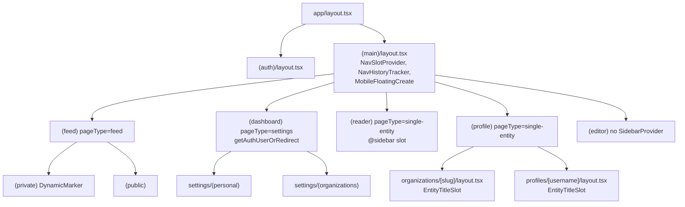

The [`src/app`](https://github.com/ozeaon/ozeaon-v2/tree/0a4f1a95824db87782f1221a4108019d174df3d9/src/app) tree is organised into parenthesised route groups that choose a layout shell (feed, dashboard, reader, editor, profile, auth), not a URL prefix. This page explains how the groups nest, which layout owns which chrome, where auth gating happens, and the conventions that depend on the group structure. The nav chrome itself is covered in [Navigation System](../../design-system/navigation-system/), and logger categories in [Logging & Observability](../../operations/logging-observability/).

## Overview

A directory wrapped in parentheses, such as `(main)`, is left out of the URL but still takes part in layout nesting. Ozeaon uses groups for two things:

1. **Layout partitioning.** Members of a group share a chrome shell. `(feed)`, `(dashboard)`, `(reader)`, `(profile)` and `(editor)` each render a different topbar, sidebar and shell combination, and most of them pass a different `pageType` to `SidebarProvider`.
2. **Sub-partitioning without new URLs.** Nested groups such as `(private)`/`(public)` inside `(feed)`, and `(personal)`/`(organizations)` inside `settings`, split a subtree by access tier or data scope while keeping the parent's shell.

Because groups are invisible in the URL, similar URLs can sit under different layout chains. `/projects` lives in `(main)/(feed)/(public)/projects`, `/projects/[slug]` in `(main)/(reader)/projects/[slug]`, and `/projects/[slug]/edit` in `(main)/(editor)`. When a layout seems not to apply, check which directory the route file is in, not the URL.

## Architecture



The full layout set is every `layout.tsx` under `src/app`. Besides the group layouts in the diagram, there are smaller nested layouts for `(feed)/(private)/account`, `(feed)/(public)/projects` (the section heading and metadata) and the two settings sub-groups.

### Top Level: `(auth)` and `(main)`

[`(auth)/layout.tsx`](https://github.com/ozeaon/ozeaon-v2/blob/0a4f1a95824db87782f1221a4108019d174df3d9/src/app/(auth)/layout.tsx) holds login, signup, password reset and email verification. It renders the form next to `AuthMarketingPanel`, with no app chrome. It is a sibling of `(main)`, so the app shell never wraps an auth screen.

`(main)` holds every non-auth route, public and signed-in. Auth gating happens in the `(dashboard)` layout and in individual pages, not in `(main)`. [`(main)/layout.tsx`](https://github.com/ozeaon/ozeaon-v2/blob/0a4f1a95824db87782f1221a4108019d174df3d9/src/app/(main)/layout.tsx) mounts three things once for the whole product:

- `NavSlotProvider`, the context that lets pages push content into the nav (entity titles, left/right slots, mega menu and mobile search state). Because it wraps every group, `NavSlotContext` works in all of them.
- `NavHistoryTracker`, which records in-app navigation so `safeRouterBack` knows whether one of our pages is behind the current one.
- `MobileFloatingCreate`, the mobile create button (see below).

### Feature Groups Under `(main)`

| Group | `pageType` | Shell | Notes |
|-------|-----------|-------|-------|
| [`(feed)`](https://github.com/ozeaon/ozeaon-v2/blob/0a4f1a95824db87782f1221a4108019d174df3d9/src/app/(main)/(feed)/layout.tsx) | `feed` | `TwoColumnShell` with `AppTopbar` and `AppSidebar` | Home, posts, articles and projects lists, network, search, legal pages, account |
| [`(dashboard)`](https://github.com/ozeaon/ozeaon-v2/blob/0a4f1a95824db87782f1221a4108019d174df3d9/src/app/(main)/(dashboard)/layout.tsx) | `settings` | `TwoColumnShell` with `DashboardSidebar`, `defaultOpen={false}` | Calls `getAuthUserOrRedirect`, then mounts `DashboardNavSlot` with the user's admin orgs |
| [`(reader)`](https://github.com/ozeaon/ozeaon-v2/blob/0a4f1a95824db87782f1221a4108019d174df3d9/src/app/(main)/(reader)/layout.tsx) | `single-entity` | Hand-built topbar, sidebar, `<main>`, sticky right `<aside>` and `Footer` | The only group with a parallel route (`@sidebar`) for the article/project right rail |
| [`(profile)`](https://github.com/ozeaon/ozeaon-v2/blob/0a4f1a95824db87782f1221a4108019d174df3d9/src/app/(main)/(profile)/layout.tsx) | `single-entity` | Topbar, sidebar, content and `Footer` | Org and user profiles; each entity layout renders `ProfilePageShell` and tabs |
| [`(editor)`](https://github.com/ozeaon/ozeaon-v2/blob/0a4f1a95824db87782f1221a4108019d174df3d9/src/app/(main)/(editor)/layout.tsx) | none | `AppTopbar noUser neutralVariant` and `Footer` | Article, project and organisation create/edit forms; deliberately no `SidebarProvider` |

`(feed)`, `(reader)` and `(profile)` read the sidebar open state on the server with [`getSidebarOpen`](https://github.com/ozeaon/ozeaon-v2/blob/0a4f1a95824db87782f1221a4108019d174df3d9/src/utils/data/sidebar-state.server.ts), which reads the persisted state from a cookie. `SidebarProvider` then starts in the right state and the sidebar never flashes open and collapses. The feed layout is the canonical shape:

```tsx
const sidebarOpen = await getSidebarOpen("feed");
return (
  <SidebarProvider pageType="feed" defaultOpen={sidebarOpen}>
    <TwoColumnShell topbar={<AppTopbar />} sidebar={<AppSidebar />}>
      {children}
    </TwoColumnShell>
  </SidebarProvider>
);
```

`(dashboard)` hardcodes `defaultOpen={false}`, because settings is visited on purpose and starts collapsed whatever the user's feed preference is. `(reader)` and `(profile)` share `pageType="single-entity"` because the entity itself is the subject of the page, and the sidebar is secondary.

The shells live in [`src/components/ui/layout/shells/`](https://github.com/ozeaon/ozeaon-v2/tree/0a4f1a95824db87782f1221a4108019d174df3d9/src/components/ui/layout/shells). `TwoColumnShell` takes `topbar` and `sidebar` as React nodes and centres the content column at the shared content width, so it doesn't care what the chrome is. `SidebarShell` is the sticky left column used inside `DashboardSidebar`. Widths come from the shared layout constants, not from the layouts.

### Auth Tiers

Auth is enforced on the server in layouts and pages. The middleware does not redirect anonymous users (see [Middleware & Sessions](../middleware-sessions/)).

- **`(dashboard)`** gates its whole subtree: `DashboardShell` calls `getAuthUserOrRedirect` inside a `Suspense`, so no settings page has to repeat the check.
- **`(feed)/(private)`** does not gate in its layout. [Its layout](https://github.com/ozeaon/ozeaon-v2/blob/0a4f1a95824db87782f1221a4108019d174df3d9/src/app/(main)/(feed)/(private)/layout.tsx) only renders `DynamicMarker` (an `await connection()`), which forces the subtree to render dynamically. Each page under it (`/account/posts`, `/account/organizations`) calls `getAuthUserOrRedirect` itself. An ESLint rule blocks the public Supabase client in files under `(private)`.
- **`(editor)`** pages each call `getAuthUserOrRedirect`.
- Everything else under `(main)` is public. It renders for visitors and personalises when a session exists.

### Entity Titles in the Nav

The topbar sometimes needs data owned by a page deep in the tree. Rather than pass props through layouts, a page or layout publishes its entity title into `NavSlotContext` with [`EntityTitleSlot`](https://github.com/ozeaon/ozeaon-v2/blob/0a4f1a95824db87782f1221a4108019d174df3d9/src/components/nav/EntityTitleSlot.tsx), and [`SectionIndicator`](https://github.com/ozeaon/ozeaon-v2/blob/0a4f1a95824db87782f1221a4108019d174df3d9/src/components/nav/components/SectionIndicator.tsx) reads it and shows the entity name with a `BackControl` to the parent section. On unmount, the slot clears the title only if it still owns it.

`EntityTitleSlot` is mounted in two places, both in `(profile)`: [`organizations/[slug]/layout.tsx`](https://github.com/ozeaon/ozeaon-v2/blob/0a4f1a95824db87782f1221a4108019d174df3d9/src/app/(main)/(profile)/organizations/[slug]/layout.tsx) (the org name) and [`profiles/[username]/layout.tsx`](https://github.com/ozeaon/ozeaon-v2/blob/0a4f1a95824db87782f1221a4108019d174df3d9/src/app/(main)/(profile)/profiles/[username]/layout.tsx) (the display name). Putting it in the entity layout means every tab under `/organizations/[slug]/*` and `/profiles/[username]/*` gets the title. Reader pages use their own nav slots instead (for example `ProjectNavSlot` sets the left slot).

### Mobile Floating Create

[`MobileFloatingCreate`](https://github.com/ozeaon/ozeaon-v2/blob/0a4f1a95824db87782f1221a4108019d174df3d9/src/components/nav/components/MobileFloatingCreate.tsx) is mounted once, from `(main)/layout.tsx`. It opens a Create menu on mobile, and sends visitors to login. It hides itself on form, settings and auth routes. The list lives in the component.

The hide logic lives in the component, not the layout, because `(main)/layout.tsx` cannot tell a project form from a project reader page by its own position in the tree. Both are its descendants, and the difference is in URL segments (`new`, `edit`) resolved much further down. Keeping the URL-shaped rules next to the component keeps the layout a plain mount point.

## Route Groups Are Stripped, Not Renamed

[`docs/logging-conventions.md`](https://github.com/ozeaon/ozeaon-v2/blob/0a4f1a95824db87782f1221a4108019d174df3d9/docs/logging-conventions.md) derives logger categories from the real path with the parenthesised segments removed, taking the first real segment after `app`. A file at `app/(main)/(feed)/(public)/(home)/page.tsx` logs as `["app", "feed"]`, not `["app", "home"]`. Groups are layout names, not domain names, so wrappers such as `(public)`, `(private)` and `(home)` must not become categories. Server Actions always use `["actions", X]`, and root-level files use `["app", "root"]`. See [Logging & Observability](../../operations/logging-observability/) for the full taxonomy.

## Failure Modes & Edge Cases

- **No `SidebarProvider` in `(editor)`.** Chrome that reads sidebar context must go through `useSidebarSafe` (as `TopNav` does). A plain `useSidebar` under `(editor)`, or under any new group without a provider, throws.
- **Different sidebar defaults per group.** Moving a route from `(feed)` to `(dashboard)` changes its starting sidebar state from the user's saved preference to always collapsed.
- **A new page under `(private)` is not gated automatically.** The `(private)` layout only makes the subtree dynamic, so the page must call `getAuthUserOrRedirect` (or `getAuthUser` and handle `null`) itself.
- **Renaming or re-parenting a group changes logger categories.** Every logger beneath it is re-tagged.
- **Stale hide patterns.** `MobileFloatingCreate` also hides on `/login` and `/register`, but those routes are outside `(main)` (and the signup route is `/signup`), so those entries never match a page that mounts it.

## Extension Points

1. **New area with existing chrome:** add a directory under the right group. No new layout is needed.
2. **New area with different chrome:** add a `(group)` under `(main)` with its own `layout.tsx`, choose a `pageType`, and choose a shell.
3. **New access tier in a group:** nest a parenthesised sub-group (as `(private)`/`(public)` do) so the URLs stay the same. Remember the gate goes in the layout or page, not the group name.
4. **New global overlay or provider:** mount it in `(main)/layout.tsx`. If visibility depends on the URL, put the rules in the component.
5. **New entity page that should show its name in the nav:** render `EntityTitleSlot` in the entity's layout.

## Related Links

- [Navigation System](../../design-system/navigation-system/)
- [Middleware & Sessions](../middleware-sessions/)
- [Supabase Client Patterns](../supabase-client-patterns/)
- [SSR Rendering & Caching](../ssr-rendering-and-caching/)
- [Logging & Observability](../../operations/logging-observability/)
- [`src/app` on GitHub](https://github.com/ozeaon/ozeaon-v2/tree/0a4f1a95824db87782f1221a4108019d174df3d9/src/app)
