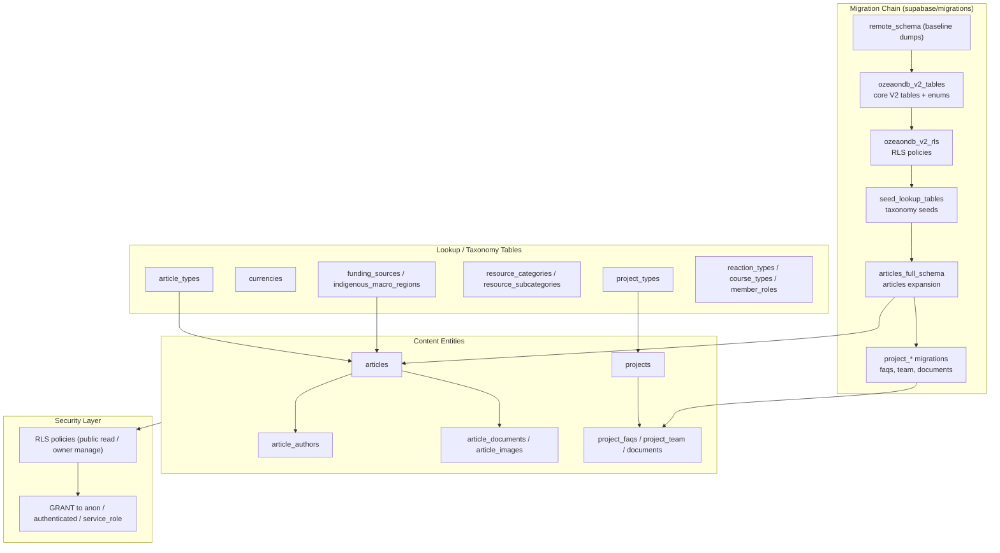
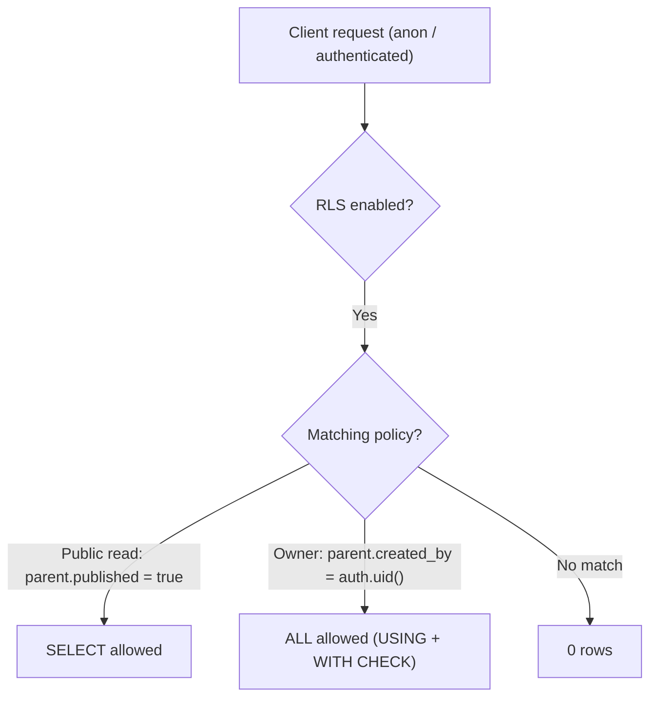

The Ozeaon V2 data model is a PostgreSQL schema hosted on Supabase, evolved through a linear series of versioned SQL migrations under [`supabase/migrations/`](https://github.com/ozeaon/ozeaon-v2/blob/0a4f1a95824db87782f1221a4108019d174df3d9/supabase/migrations). It defines the platform's content, identity, membership and lookup entities, plus placeholder tables for roadmap features. This page covers the V2 foundation migrations and the conventions they establish; see [Migrations & Seeding](../../operations/migrations-and-seeding/) and [`docs/db/schema.sql`](https://github.com/ozeaon/ozeaon-v2/blob/0a4f1a95824db87782f1221a4108019d174df3d9/docs/db/schema.sql) for the full 80-migration chain and the current 113-table state.

## Overview

The schema is not defined by a single declarative file; it is the cumulative result of an ordered migration chain. Each migration is a timestamp-prefixed SQL script (`YYYYMMDDHHMMSS_description.sql`) that mutates the live database state exactly once, in order.

Three design characteristics are consistent across the chain:

1. **Additive, idempotent DDL.** Migrations guard every mutation with `IF NOT EXISTS` / `IF EXISTS` checks, `DO $$ ... $$` blocks that inspect `information_schema`, `pg_indexes`, and `pg_constraint`, and `CREATE TABLE IF NOT EXISTS`. This makes the chain safe to re-run against a partially-migrated database.
2. **Lookup-table discipline.** Enumerable concepts are modelled as lookup tables with a `slug`/`code` + `name` + `sort_order` shape rather than free-text columns or wide native enums. This keeps taxonomy extensible without DDL.
3. **RLS-first security.** Every new table enables Row-Level Security with explicit policies expressed relative to an owning parent row (e.g., "published article", "project created_by = auth.uid()").

| Term | Meaning |
|------|---------|
| `public` schema | The single application schema; all tables live under `public`. |
| Lookup table | Small reference table (`slug`/`code`, `name`, `sort_order`, `created_at`) seeded at migration time. |
| RLS | Postgres Row-Level Security; enabled on every application table. |
| Published gate | Many child-table read policies key off a parent's `published = true` flag. |

## Architecture

The schema is best understood as a set of layered entity families, all rooted in `public`, evolved by the migration chain.



Lookup tables are leaves that content entities reference by FK. Content entities hang child rows off a parent (`articles` → `article_authors`/`article_documents`/`article_images`; `projects` → `project_faqs`). The security layer is applied per-table, not centrally, so every migration that creates a table also asserts RLS and grants.

## Migration-Based Schema Evolution

### The V2 Cutover Migration

The pivot point is [`20260310232125_ozeaondb_v2_tables.sql`](https://github.com/ozeaon/ozeaon-v2/blob/0a4f1a95824db87782f1221a4108019d174df3d9/supabase/migrations/20260310232125_ozeaondb_v2_tables.sql). It runs inside a single transaction so that any failure rolls back the whole change set:

```sql
BEGIN;
```

The migration proceeds in order: **drop stale triggers/functions → drop legacy tables → create enums → create lookup tables → create core tables.** The ordering is load-bearing: triggers referencing soon-to-be-dropped columns must go first, and dependent tables before their parents. This step retires the legacy tutorial and social subsystems (`activities`, `reactions`, `comments`, `bookmarks`) and their junction tables.

### Enums vs. Lookup Tables

Values that are *state* (e.g., invite lifecycle) are modelled as native Postgres enums because the set is closed and referential checks are free. The V2 cutover introduces `image_mime_type`, `invite_status`, `request_status`, `connection_status`, `referral_status`, `vote_choice`, and `visibility_type`. Values that are *taxonomy* (article types, resource categories) are modelled as lookup tables because they are user-facing, extendable, and carry metadata such as `icon` and `description`.

### Lookup Table Shape

All V2 lookup tables follow an identical skeleton:

```sql
CREATE TABLE public.proposal_types (
  id uuid PRIMARY KEY DEFAULT gen_random_uuid(),
  slug text NOT NULL UNIQUE,
  name text NOT NULL,
  description text,
  sort_order integer NOT NULL DEFAULT 0,
  created_at timestamptz NOT NULL DEFAULT now()
);
```

Article-specific lookups (`funding_sources`, `indigenous_macro_regions`) use a leaner shape with `code` instead of `slug` and `smallint sort_order`. The surrogate `id` + machine `code`/`slug` + `sort_order` triple recurs across all taxonomy tables.

### Empty-guard Seed Pattern

Every seed migration wraps inserts in an existence check so re-running the migration against an already-seeded database is a no-op:

```sql
DO $$
BEGIN
  IF NOT EXISTS (SELECT 1 FROM public.article_types LIMIT 1) THEN
    INSERT INTO public.article_types (name, slug, code, icon, sort_order) VALUES
      ('Research', 'research', 'research', 'flask', 1),
      ...;
  END IF;
END
$$;
```

`resource_subcategories` resolves its parent by slug subquery, so `resource_categories` must be seeded first — the migration comment documents this dependency explicitly. See [`20260325000000_seed_lookup_tables.sql`](https://github.com/ozeaon/ozeaon-v2/blob/0a4f1a95824db87782f1221a4108019d174df3d9/supabase/migrations/20260325000000_seed_lookup_tables.sql).

## Articles Subsystem Schema

[`20260328000000_articles_full_schema.sql`](https://github.com/ozeaon/ozeaon-v2/blob/0a4f1a95824db87782f1221a4108019d174df3d9/supabase/migrations/20260328000000_articles_full_schema.sql) adds licensing, attribution, geographic/Indigenous and funding attribution columns to `articles`, fixes an RLS bug in `article_authors` (`user_id` → `author_id`), renames `organization_id` → `linked_organization_id`, and creates the `funding_sources` and `indigenous_macro_regions` lookup tables. The `articles_geographic_scope_check` constraint is added `NOT VALID` then validated separately to avoid a long table lock.

`funding_sources` is seeded with `grant`, `sponsor`, `dao_treasury`, `self_funded`, `crowdfunding`, `ngo`, `government`, and `other`. The `dao_treasury` and `crowdfunding` entries represent article *funding attribution* (who funded the research), not payments or DAO operations, which are not built.

[`20260430104609_article_images_documents.sql`](https://github.com/ozeaon/ozeaon-v2/blob/0a4f1a95824db87782f1221a4108019d174df3d9/supabase/migrations) replaced the earlier `article_attachments` table with `article_documents` and `article_images`. The current schema has no `article_attachments`. See [`docs/db/schema.sql`](https://github.com/ozeaon/ozeaon-v2/blob/0a4f1a95824db87782f1221a4108019d174df3d9/docs/db/schema.sql) for the current column set.

## Project Content Tables

The April 2026 migration family extends projects with structured child content. `project_faqs` is the canonical template for child tables:

```sql
CREATE TABLE public.project_faqs (
  id uuid DEFAULT gen_random_uuid() NOT NULL,
  project_id uuid NOT NULL,
  question text NOT NULL,
  answer text NOT NULL,
  sort_order integer DEFAULT 0 NOT NULL,
  created_at timestamp with time zone DEFAULT now() NOT NULL,
  updated_at timestamp with time zone DEFAULT now() NOT NULL,
  CONSTRAINT project_faqs_pkey PRIMARY KEY (id),
  CONSTRAINT project_faqs_project_id_fkey FOREIGN KEY (project_id)
    REFERENCES public.projects(id) ON DELETE CASCADE
);

ALTER TABLE public.project_faqs ENABLE ROW LEVEL SECURITY;

CREATE POLICY "Anyone can read FAQs of published projects"
  ON public.project_faqs FOR SELECT
  USING (EXISTS (SELECT 1 FROM public.projects WHERE id = project_faqs.project_id AND published = true));

CREATE POLICY "Project owner has full access to project FAQs"
  ON public.project_faqs TO authenticated
  USING (EXISTS (SELECT 1 FROM public.projects WHERE id = project_faqs.project_id AND created_by = (SELECT auth.uid())))
  WITH CHECK (EXISTS (SELECT 1 FROM public.projects WHERE id = project_faqs.project_id AND created_by = (SELECT auth.uid())));

CREATE TRIGGER trg_updated_at_project_faqs
  BEFORE UPDATE ON public.project_faqs
  FOR EACH ROW EXECUTE FUNCTION public.update_updated_at();
```

Three design points: `ON DELETE CASCADE` means deleting a project removes its FAQs automatically. The read policy is a **published gate** — FAQs are public only while the parent is `published = true`. Ownership is expressed on the *parent* (`projects.created_by`), not duplicated on the child, so ownership cannot drift. Siblings `project_team`, `documents`, `project_related_content`, and `project_settings_constraints` follow the same pattern.

## Security Model

Every migration that creates a table opts it into the RLS regime: `ENABLE ROW LEVEL SECURITY`, verb `GRANT`s, a public read policy (gated on parent `published = true`), and an owner write policy keyed on `auth.uid()`.



Because ownership is always evaluated against the parent row's owner column, the schema avoids duplicating ownership state. A child row is owned *by virtue of* its parent, and `WITH CHECK` clauses prevent inserting a child row pointing at a parent the caller does not own. Two later migrations harden the layer: [`20260420000001_fix_function_search_paths.sql`](https://github.com/ozeaon/ozeaon-v2/blob/0a4f1a95824db87782f1221a4108019d174df3d9/supabase/migrations/20260420000001_fix_function_search_paths.sql) hardens `search_path` on functions; [`20260420000002_fix_rls_performance.sql`](https://github.com/ozeaon/ozeaon-v2/blob/0a4f1a95824db87782f1221a4108019d174df3d9/supabase/migrations/20260420000002_fix_rls_performance.sql) optimizes the nested `EXISTS` predicates used pervasively in child-table policies.

## Tables for Unbuilt Features

The schema contains placeholder tables for features that are on the roadmap but not yet built. The published-gate pattern and RLS policies are in place, but there is no application code or UI calling them.

- **Pods** — `pods`, `pod_members`, `pod_invites`, `pod_join_requests`, `pod_types`
- **DAO governance** — `dao_proposals`, `dao_votes`, `proposal_types`, `vote_choice` enum
- **Tokens** — `token_transactions`, `transaction_types`
- **Educational hub** — `educational_resources`, `educational_resource_sdgs`, `resource_subjects`, `resource_subjects_subcategories`, `user_resource_progress`, `resource_types`, `difficulty_levels`, `course_types`
- **Notes & bookmarks** — `bookmark_folders`, `bookmark_folder_bookmarks`, `resource_subject_bookmarks`, `user_subject_notes`, `note_labels`, `user_subject_note_labels`
- **Misc** — `events`, `open_calls`, `referrals` / `referral_status` enum, `search_queries`
- **Connections & blocking** — `user_connections`, `user_connection_history`, `user_blocks`, `connection_status` enum. API routes `/api/connections` and `/api/blocks` exist but are disconnected from the UI (see [Project Overview](../../overview/project-overview/)).

`resource_categories` and `resource_subcategories` are live — they back the subject taxonomy for articles and projects. `notification_types` was dropped; the notifications system (in progress) uses the `notifications` table introduced in [`20260918000000_notifications_foundation.sql`](https://github.com/ozeaon/ozeaon-v2/blob/0a4f1a95824db87782f1221a4108019d174df3d9/supabase/migrations).

## Conventions

| Convention | Pattern |
|-----------|---------|
| Primary keys | `uuid` with `DEFAULT gen_random_uuid()` |
| Timestamps | `timestamptz NOT NULL DEFAULT now()` |
| `updated_at` | `BEFORE UPDATE` trigger calling `public.update_updated_at()` |
| Lookup shape (V2) | `id`, `slug`, `name`, `description`, `sort_order`, `created_at` |
| Lookup shape (articles) | `id`, `code`, `name`, `description`, `sort_order smallint`, `created_at` |
| Child FK delete rule | `ON DELETE CASCADE` |
| Ownership expression | `parent.created_by = auth.uid()` (projects) / `parent.author_id = auth.uid()` (articles) |
| App-enforced constraints | Documented via `COMMENT ON COLUMN` (e.g. `embargo_end_date`, `custom_license`) |

## Failure Modes & Edge Cases

- **Migration ordering hazards.** Dependent tables must be dropped before their parents; triggers/functions referencing dropped columns must be removed first. `resource_subcategories` resolves parent ids by slug subquery — if `resource_categories` isn't seeded first, the FK insert fails with a NULL violation.
- **Idempotency pitfalls.** Column renames (e.g. `organization_id` → `linked_organization_id`) are guarded by `information_schema` existence checks; without these a second application raises "column does not exist". `CREATE TABLE` in the V2 cutover uses plain syntax (no `IF NOT EXISTS`) but is protected by the wrapping transaction — it runs exactly once.
- **Policy-existence guard.** `CREATE POLICY` has no `IF NOT EXISTS` form in older Postgres versions; migrations wrap policy creation in `IF NOT EXISTS (SELECT 1 FROM pg_policies ...)` blocks.
- **RLS correctness.** The `article_authors` bug (`user_id` → `author_id`) demonstrates that an incorrect predicate either leaks rows or hides legitimate ones. Owner policies must pair `USING` with `WITH CHECK`; omitting `WITH CHECK` lets an owner write rows for resources they don't own.
- **Parent-relative child visibility.** A child row without `ON DELETE CASCADE` on its parent FK leaves orphan rows whose policies always evaluate false after the parent is deleted.

## Operational Notes

- **RLS policy performance.** The dedicated [`fix_rls_performance`](https://github.com/ozeaon/ozeaon-v2/blob/0a4f1a95824db87782f1221a4108019d174df3d9/supabase/migrations/20260420000002_fix_rls_performance.sql) migration exists because nested `EXISTS (SELECT ... FROM parent ...)` predicates in child-table policies were identified as a hotspot. Child-table policies benefit from supporting indexes on parent lookup columns.
- **Grants breadth.** All three Supabase roles (`anon`, `authenticated`, `service_role`) receive full verb grants on lookup tables. RLS is the sole enforcement boundary — the broad grant is the Supabase default for the `public` schema.
- **Single-transaction cutover.** The V2 migration wraps the entire restructure in one `BEGIN`/`COMMIT`. The trade-off: a failure rolls back cleanly, but the transaction holds locks for its duration and is intended for controlled application via the Supabase SQL editor or `supabase db push`.

## Extension Points

1. **New taxonomy** → add a lookup table following the `slug`/`code` + `name` + `sort_order` shape, enable RLS, add a `USING (true)` public-read policy, and seed with an empty-guard `DO $$` block (see `funding_sources` for the canonical template).
2. **New child content under a parent** → create a table with a `parent_id uuid` FK with `ON DELETE CASCADE`, enable RLS, add a published-gated read policy and an owner write policy referencing the parent's owner column, and attach `trg_updated_at_*` using `public.update_updated_at()` (see `project_faqs` for the canonical template).
3. **New closed state set** → add a native enum via `CREATE TYPE ... AS ENUM` for truly closed, code-coupled value sets only.
4. **New article attribute** → `ALTER TABLE ... ADD COLUMN IF NOT EXISTS`, preferring nullable or defaulted columns, and document app-enforced constraints with `COMMENT ON COLUMN`.

## Related Links

- V2 core tables and enums: [20260310232125_ozeaondb_v2_tables.sql](https://github.com/ozeaon/ozeaon-v2/blob/0a4f1a95824db87782f1221a4108019d174df3d9/supabase/migrations/20260310232125_ozeaondb_v2_tables.sql)
- V2 RLS policies: [20260311112434_ozeaondb_v2_rls.sql](https://github.com/ozeaon/ozeaon-v2/blob/0a4f1a95824db87782f1221a4108019d174df3d9/supabase/migrations/20260311112434_ozeaondb_v2_rls.sql)
- Lookup taxonomy seeds: [20260325000000_seed_lookup_tables.sql](https://github.com/ozeaon/ozeaon-v2/blob/0a4f1a95824db87782f1221a4108019d174df3d9/supabase/migrations/20260325000000_seed_lookup_tables.sql)
- Articles full schema: [20260328000000_articles_full_schema.sql](https://github.com/ozeaon/ozeaon-v2/blob/0a4f1a95824db87782f1221a4108019d174df3d9/supabase/migrations/20260328000000_articles_full_schema.sql)
- Project content migrations: [supabase/migrations/](https://github.com/ozeaon/ozeaon-v2/tree/0a4f1a95824db87782f1221a4108019d174df3d9/supabase/migrations)
- Current schema reference: [docs/db/schema.sql](https://github.com/ozeaon/ozeaon-v2/blob/0a4f1a95824db87782f1221a4108019d174df3d9/docs/db/schema.sql)
- Migrations & Seeding: [../../operations/migrations-and-seeding/](../../operations/migrations-and-seeding/)
